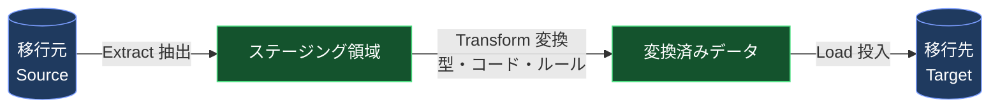
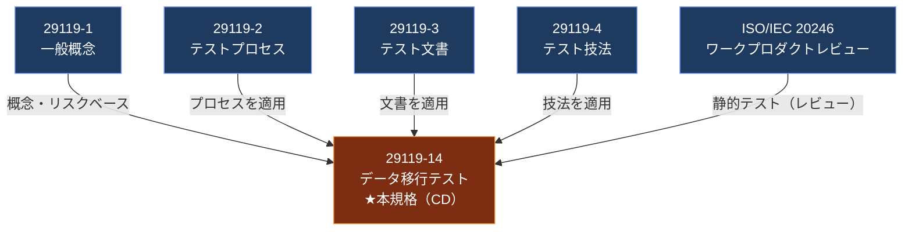
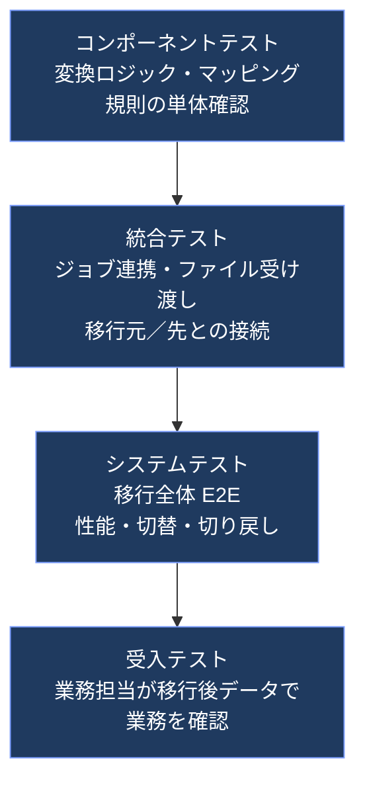
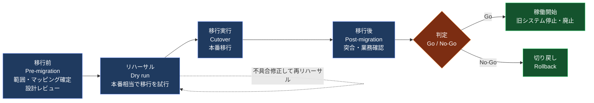
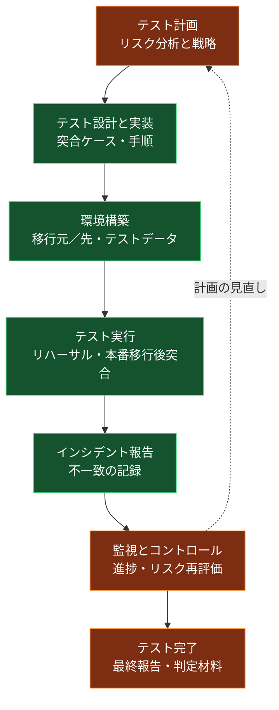

# ISO/IEC/IEEE CD 29119-14 初学者向け解説ガイド

**Software and systems engineering — Software testing — Part 14: Data migration testing（データ移行テスト）**

> 📅 情報の基準日：2026年10月7日
> 📌 対象：データ移行テストを初めて学ぶテスター／QAエンジニア／開発者／PM
> 🧭 ゴール：この規格が「何を目指しているか」「29119シリーズのどこに位置するか」「現場でどう使えるか」を、ステップバイステップで理解する

---

## 0. 最初に読んでください：この文書の「確かさ」の読み方

ISO/IEC/IEEE 29119-14 は **まだ策定中（Committee Draft：CD）** の規格です。ISOのページで公開されているのは **概要（Abstract）・ステータス・ライフサイクル情報** であり、**CD本文（章立て・要求事項の細部）は公開されていません**。

そのため、本ガイドでは情報を次の2種類に明確に分けています。

| ラベル | 意味 | 根拠 |
|---|---|---|
| ✅ **【確認済み】** | ISO等の公式ページに書かれている事実 | 「参考ソース一覧」の [S1]〜[S4] |
| 💡 **【解説】** | 公開情報（概要）と29119シリーズの既存パートや業界の実践から、初学者向けに筆者が補って説明した内容 | 「参考ソース一覧」の [S5]〜[S12] ＋ 一般的な知識 |

> ⚠️ 💡【解説】の部分は **「CD 29119-14 にそう書いてある」という意味ではありません**。最終的に発行される規格の章立て・用語・要求事項は変更される可能性があります。正確な要求事項は、規格が発行された後に原文（ISO/IEEE/各国規格団体から入手）で必ず確認してください。

---

## 目次

1. [Step 1：まず全体像をつかむ](#step-1まず全体像をつかむ)
2. [Step 2：規格のステータスと今後の流れ](#step-2規格のステータスと今後の流れ)
3. [Step 3：データ移行とは何か（基礎知識）](#step-3データ移行とは何か基礎知識)
4. [Step 4：29119シリーズの中での位置づけ](#step-4-29119シリーズの中での位置づけ)
5. [Step 5：リスクベースのデータ移行テスト](#step-5リスクベースのデータ移行テスト)
6. [Step 6：テストアプローチの6つの部品](#step-6テストアプローチの6つの部品)
7. [Step 7：移行フェーズ別のテストの流れ](#step-7移行フェーズ別のテストの流れ)
8. [Step 8：29119-2（プロセス）と29119-3（文書）へのあてはめ](#step-8-29119-2プロセスと29119-3文書へのあてはめ)
9. [Step 9：実践パターンと実例（著名エンジニアリング組織の知見）](#step-9実践パターンと実例著名エンジニアリング組織の知見)
10. [Step 10：実務チェックリスト](#step-10実務チェックリスト)
11. [よくある落とし穴](#よくある落とし穴)
12. [FAQ](#faq)
13. [学習ロードマップ](#学習ロードマップ)
14. [参考ソース一覧（URL）](#参考ソース一覧url)

---

## Step 1：まず全体像をつかむ

### 1-1. 一言でいうと

✅ **【確認済み】** ISO/IEC/IEEE 29119-14 は、**データ移行（Data migration）をテストするためのテストプロセス・関連文書・テストアプローチ** を定める規格（現在はドラフト）です。

### 1-2. 基本情報（確認済み）

| 項目 | 内容 | 出典 |
|---|---|---|
| 正式名称 | Software and systems engineering — Software testing — Part 14: Data migration testing | [S1] |
| 参照番号 | ISO/IEC/IEEE CD 29119-14（Edition 1） | [S1] |
| 現在のステータス | Under development（策定中）／ステージ **30.60**（CDコメント期間終了） | [S1] |
| 担当委員会 | ISO/IEC JTC 1/SC 7（ソフトウェアおよびシステムエンジニアリング） | [S1] |
| 作業グループ | JTC 1/SC 7/WG 26（Software testing）※DINの案件ページ記載 | [S3] |
| 新規プロジェクト承認 | 2025-11-27 | [S1] |
| CD登録／協議開始 | 2025-12-02 | [S1] |
| コメント期間終了 | 2026-01-29 | [S1] |

### 1-3. この規格が約束していること（概要の要点・確認済み）

概要（Abstract）を、意味を変えずに日本語で整理すると次のとおりです。

| # | ポイント | 初学者向けの言い換え |
|---|---|---|
| 1 | テストプロセス・関連文書・テストアプローチを記述する | 「何をどんな順番でやり、何を書き残すか」を定める |
| 2 | 29119-1, -2, -3, -4 と ISO/IEC 20246 を**データ移行テストに適用する**ための要求事項とガイダンスを定める | 既存のテスト規格の**データ移行版の使い方説明書** |
| 3 | **リスクベース**のアプローチを要求する | 「全部を均等にテスト」ではなく、**危ないところから優先**する |
| 4 | リスクへの対処（treatment）として、テストレベル・テストタイプ・テストプラクティス・静的テスト・テスト設計技法・測定（メジャー）を選ぶ | リスク → 対策としてのテスト方法の選択、という流れ |
| 5 | 発想から、リリース、保守、サポート、**廃止（decommissioning）** まで、**あらゆるシステム**が対象。従来型・アジャイルの両ライフサイクルに適用可能 | 「移行プロジェクトだけ」でなく、システムの一生に関わる |
| 6 | 想定読者はプロのテスター（ジュニア〜シニア、テストマネージャ）。デリバリリード、開発者、PMにも有益 | テスターだけの規格ではない |

> 💡【解説】ポイント5の「廃止（decommissioning）まで」は重要です。**システムを止めるときこそ「古いデータをどこへ移すか」「何を捨ててよいか」** が問題になるため、データ移行テストは新規構築だけでなく **終わらせ方** にも関係します。

---

## Step 2：規格のステータスと今後の流れ

### 2-1. ISO規格が発行されるまで（一般的な流れ）

ISOのライフサイクル（ステージコード）の一般的な流れの中で、本規格が今どこにいるかを図にします。


### 2-2. 用語ミニ解説

| 略語 | 正式名称 | 意味 |
|---|---|---|
| WD | Working Draft | 作業原案 |
| **CD** | **Committee Draft** | **委員会原案（今ここ）**。各国委員会がコメントを出す段階 |
| DIS | Draft International Standard | 国際規格案 |
| FDIS | Final Draft International Standard | 最終国際規格案 |
| ステージ 30.60 | Close of comment period | CDに対するコメント受付が終わった状態 |

> ✅ **【確認済み】** ステージ30.60（2026-01-29）の後は、ISOのステージ表上は「30.92：CDがWGへ差し戻し」または「30.99：CDがDISとして登録承認」のいずれかに進みます [S1]。
> 💡【解説】2026年10月7日時点でISOページ上の表示が30.60のままであれば、**コメント処理・改訂作業が進行中**と読み取れます。発行時期の公式な見通しはISOページには書かれていないため、**時期の予想はここでは行いません**。

---

## Step 3：データ移行とは何か（基礎知識）

💡【解説】この章は規格の引用ではなく、**前提知識の整理**です。

### 3-1. データ移行の定義（かんたんに）

**データ移行（Data migration）= あるシステム／場所／形式にあるデータを、別のシステム／場所／形式へ移すこと。**

### 3-2. よくあるデータ移行の種類

| 種類 | 例 | 主なテスト上の関心事 |
|---|---|---|
| ストレージ移行 | オンプレのファイルサーバー → クラウドストレージ | ファイル欠落、権限、メタデータ |
| データベース移行 | Oracle → PostgreSQL、MySQL 5.7 → 8.0 | データ型の差、文字コード、照合順序、精度 |
| アプリケーション移行 | 旧基幹システム → 新SaaS | 項目マッピング、業務ルール、履歴データ |
| クラウド移行 | オンプレDWH → クラウドDWH | 性能、コスト、ネットワーク、整合性 |
| スキーマ変更（オンライン移行） | 1顧客1サブスク → 1顧客複数サブスク | **無停止**、新旧の同期、切り戻し |
| 統合・合併 | M&Aで2社の顧客DBを統合 | 重複排除、名寄せ、マスタ統一 |
| 廃止（アーカイブ） | 旧システム停止前のデータ退避 | 保管要件、検索可能性、削除対象の判断 |

### 3-3. 基本の仕組み：ETL



「抽出 → 変換 → 投入」のどの段階でも、**欠落・変形・重複・破損** が起こり得ます。これがテスト対象です。

### 3-4. データ移行でありがちな不具合の例

| 不具合カテゴリ | 具体例 |
|---|---|
| 欠落 | 100万件のうち 3,000件が移行されていない |
| 重複 | 再実行（リラン）で同じ行が二重に入った |
| 変形 | 小数点以下が丸められた／日付のタイムゾーンがずれた |
| 文字化け | 外字・絵文字・環境依存文字が `?` に置換された |
| 参照整合性 | 注文データはあるのに、対応する顧客がいない（孤児レコード） |
| 業務ルール違反 | 退会済み顧客が「有効」状態で移行された |
| 性能 | 移行が夜間の停止時間枠に収まらない |
| 情報漏えい | テスト環境に本番の個人情報がそのまま入った |

---

## Step 4：29119シリーズの中での位置づけ

### 4-1. シリーズ全体の関係

✅ **【確認済み】** 本規格は **29119-1, -2, -3, -4** と **ISO/IEC 20246** を「データ移行テストに適用する」ための規格です [S1]。つまり **単独で完結する規格ではなく、既存規格を前提にした"応用編"** です。



### 4-2. 各パートの役割（初学者向け）

| 規格 | 役割 | データ移行テストでの使いどころ（💡解説） |
|---|---|---|
| 29119-1 | テストの一般概念・用語・リスクベーステストの考え方 | 「リスク」「テストアプローチ」「テストレベル」などの共通言語 |
| 29119-2 | テストプロセス（計画、設計、実行、報告…） | 移行テスト全体の段取りの骨格 |
| 29119-3 | テスト文書（計画書、設計書、報告書…）のテンプレートと例 | 何を書き残すか（移行テスト計画、突合結果など） |
| 29119-4 | テスト設計技法（同値分割、境界値、状態遷移など） | マッピング規則や変換ルールのテスト設計 |
| ISO/IEC 20246 | ワークプロダクトのレビュー（静的テスト） | **マッピング定義書・移行設計書のレビュー** |
| **29119-14** | **データ移行に特化した応用** | **上記をまとめて「移行ならこうする」と示す** |

> 💡【解説】29119-14 を読む前に、**29119-1 と 29119-2 の基本**（特にリスクベーステストとテストプロセス）を押さえておくと、理解が段違いに速くなります。

---

## Step 5：リスクベースのデータ移行テスト

### 5-1. なぜ「リスクベース」なのか

✅ **【確認済み】** 本規格は **リスクベースのアプローチを要求** し、データ移行に関連するリスクから、適切な対策（テストアプローチ）を選びます [S1]。

データ移行では、**全データを全観点で完全に検証するのは現実的でない**ことが多いです（件数が膨大、時間枠が短い、本番データは触れない等）。だからこそ **「どのリスクが大きいか」で優先順位をつけます**。

### 5-2. リスクベースの流れ


### 5-3. データ移行のリスク例とテスト対策の対応表（💡解説）

| リスク（何が怖い？） | 起こりやすさ／影響度の目安 | 候補となる対策（テストアプローチ） |
|---|---|---|
| 顧客・金額データの欠落／不一致 | 影響 **大** | 全件の件数突合＋集計値突合＋重要項目の行単位比較 |
| 変換ルールの設計ミス | 起こりやすさ 中〜大 | マッピング定義書の静的レビュー＋変換ルール単体テスト |
| 文字コード・丸め・日付の変形 | 起こりやすさ 大 | 境界値・特殊値データによるテスト、サンプリング目視 |
| 移行が停止時間枠に収まらない | 影響 大 | 本番相当データ量でのリハーサル、性能テスト |
| 切り戻し（ロールバック）不能 | 影響 **大** | ロールバック手順のリハーサル、バックアップ復元テスト |
| 個人情報の漏えい | 影響 **大** | テストデータのマスキング、アクセス制御確認 |
| 新旧システムの併用期間中のズレ | 起こりやすさ 中 | 差分検知（リコンサイル）の自動化、並行稼働の検証 |

---

## Step 6：テストアプローチの6つの部品

✅ **【確認済み】** 概要では、リスクへの対処として **次の6種類の要素** を選ぶ、と書かれています [S1]。

| # | 部品（英語） | 初学者向け説明 | データ移行での例（💡解説） |
|---|---|---|---|
| 1 | Test levels（テストレベル） | どの粒度・段階でテストするか | 変換ロジック単体、ジョブ結合、移行全体（システム）、業務受入 |
| 2 | Test types（テストタイプ） | 何の品質特性を見るか | 機能（正確さ）、性能、セキュリティ、信頼性（再実行耐性）、移植性 |
| 3 | Test practices（テストプラクティス） | 進め方・作法 | リハーサル（ドライラン）、探索的テスト、自動突合、並行稼働 |
| 4 | Static testing（静的テスト） | 実行せずに確認 | マッピング定義書・移行設計書・切替手順書のレビュー |
| 5 | Test design techniques（テスト設計技法） | テストケースの作り方 | 同値分割、境界値、デシジョンテーブル、状態遷移など |
| 6 | Measures（測定・メジャー） | 何を数えて判断するか | 突合一致率、不一致件数、移行所要時間、欠陥密度 |

### 6-1. テストレベルの例（図解）



### 6-2. テストタイプ（品質特性）ごとの観点（💡解説）

| 品質特性 | データ移行での観点 |
|---|---|
| 機能適合性（正確性・完全性） | 件数・値・関係が正しいか |
| 性能効率性 | 所要時間、リソース使用量、本番への影響 |
| 信頼性 | 途中失敗からの再開、**冪等性**（再実行しても二重投入されない） |
| セキュリティ | 個人情報マスキング、権限、監査証跡 |
| 互換性／移植性 | 文字コード、データ型、DB製品差 |
| 保守性 | 移行スクリプトの再利用・変更しやすさ |

### 6-3. テスト設計技法の適用例（29119-4 の技法をデータに当てはめる・💡解説）

| 技法 | 移行テストでの使い方の例 |
|---|---|
| 同値分割 | 「顧客区分＝個人／法人／休眠」ごとに代表データを選ぶ |
| 境界値分析 | 桁数上限、日付の最小／最大、NULL・空文字・最大長の文字列 |
| デシジョンテーブル | 「退会済み×未払い残あり」など、複数条件で移行先ステータスが変わるルール |
| 状態遷移テスト | 注文ステータス（受付→出荷→完了）の移行後の遷移整合 |
| ペアワイズ／組合せ | 文字コード × 型 × NULL有無 などの組合せ |
| ルールベース／データプロファイリング | 全件を機械的にルール違反検知（範囲外、形式不正） |

---

## Step 7：移行フェーズ別のテストの流れ

💡【解説】データ移行テストは一般に **移行前・移行中（リハーサル含む）・移行後** に分けて考えると整理しやすいです（実務でも広く使われる整理）。

### 7-1. 全体フロー



### 7-2. フェーズごとにやること

| フェーズ | 主な活動 | 主な成果物（例） |
|---|---|---|
| **移行前** | 移行対象範囲の確定／データ項目のマッピング定義／マッピング定義書のレビュー（静的テスト）／データプロファイリング（元データの品質調査）／テストデータ準備（マスキング） | マッピング定義書、データ品質レポート、テスト計画 |
| **リハーサル** | 本番相当量での移行／所要時間計測／失敗時の再開手順確認／切り戻し手順確認／性能確認 | リハーサル結果、所要時間実績、手順書改訂 |
| **移行実行（本番）** | 手順書どおりの実行／ログ監視／途中判定 | 実行ログ、状況報告 |
| **移行後** | 件数・集計・行単位の突合／参照整合性確認／業務シナリオ確認（受入）／性能確認 | 突合結果、受入結果、テスト完了報告 |
| **判定** | 残留リスクと不一致の評価／Go/No-Go | 判定会議資料 |

### 7-3. データ突合（リコンサイル）の「3段階」

突合は **粗い確認から細かい確認へ** 進めると効率的です（💡解説）。

| 段階 | 確認内容 | コスト | 検出力 |
|---|---|---|---|
| ① 件数突合 | 移行元と移行先の行数が一致するか | 低 | 欠落・重複 |
| ② 集計値突合 | 金額合計、日付の最小／最大、キーのユニーク数など | 中 | 値の変形・丸め |
| ③ 行単位突合 | キーごとに全項目を比較（またはハッシュ比較） | 高 | 項目単位の不一致すべて |

**SQLの例（件数・集計・孤児レコード検出）**

```sql
-- ① 件数突合
SELECT 'source' AS side, COUNT(*) AS cnt FROM src.orders
UNION ALL
SELECT 'target' AS side, COUNT(*) AS cnt FROM tgt.orders;

-- ② 集計値突合（金額合計・日付範囲を移行元／移行先で並べて比較）
SELECT 'source' AS side,
       SUM(amount)     AS total_amount,
       MIN(ordered_at) AS min_date,
       MAX(ordered_at) AS max_date
FROM   src.orders
UNION ALL
SELECT 'target' AS side,
       SUM(amount)     AS total_amount,
       MIN(ordered_at) AS min_date,
       MAX(ordered_at) AS max_date
FROM   tgt.orders;

-- 参照整合性：顧客のいない注文（孤児レコード）
SELECT o.order_id
FROM   tgt.orders o
LEFT JOIN tgt.customers c ON c.customer_id = o.customer_id
WHERE  c.customer_id IS NULL;
```

> 💡 ③の行単位突合は、AWS Database Migration Service のデータ検証機能が「移行元の各行と移行先の対応する行を比較し、不一致を報告する」仕組みを提供している、という公式ドキュメントの記述が参考になります [S9]。

---

## Step 8：29119-2（プロセス）と29119-3（文書）へのあてはめ

✅ **【確認済み】** 本規格は29119-2（テストプロセス）と29119-3（テスト文書）をデータ移行テストに適用すると概要に明記されています [S1]。以下は、**既存の29119-2/-3の構成にデータ移行テストを重ねた💡解説例** です。

### 8-1. テストプロセスへのマッピング（29119-2）

| 29119-2 のプロセス群 | プロセス | データ移行テストでの例 |
|---|---|---|
| 組織テストプロセス | 組織のテスト方針・戦略 | 「移行テストは必ずリハーサルを2回行う」などの組織ルール |
| テストマネジメント | テスト計画 | 移行リスクの洗い出し、テスト範囲・戦略・体制・スケジュールの決定 |
| テストマネジメント | テストの監視とコントロール | リハーサル結果の追跡、不一致件数の推移管理 |
| テストマネジメント | テスト完了 | 移行後の最終報告、教訓の整理、テスト資産の保管 |
| 動的テストプロセス | テスト設計と実装 | マッピング規則からテスト条件・ケース・手順を作成 |
| 動的テストプロセス | テスト環境の構築と維持 | 本番相当の移行元／先、マスキング済みデータの用意 |
| 動的テストプロセス | テスト実行 | 移行ジョブ実行、突合の実施 |
| 動的テストプロセス | テストインシデント報告 | 不一致・欠落・失敗の記録と追跡 |



### 8-2. テスト文書へのマッピング（29119-3）

29119-3 には、テスト計画書・テスト状況報告書・テスト完了報告書・テスト設計仕様書・テストケース仕様書・テスト手順仕様書・テストデータ要求・テスト環境要求・テストデータ準備完了報告・テスト環境準備完了報告・実行ログ・インシデント報告などの文書が定義されています。**データ移行テストではこれらに次のような内容が入ります**（💡解説）。

| 29119-3 の文書 | データ移行テストで特に書くこと |
|---|---|
| テスト計画書 | 移行対象範囲、リスク一覧と対策、リハーサル回数、Go/No-Go基準、切り戻し方針 |
| テスト設計仕様書 | マッピングごとのテスト条件、突合方針（件数／集計／行単位）、サンプリング方針 |
| テストケース仕様書 | 入力データ（特殊値含む）、期待結果（移行先の値） |
| テスト手順仕様書 | 移行ジョブの実行順序、突合SQLの実行手順、再実行手順 |
| テストデータ要求／準備完了報告 | データ量、マスキング要件、本番相当性の確認結果 |
| テスト環境要求／準備完了報告 | 移行元／先の構成、ネットワーク、権限 |
| テスト実行ログ・結果 | ジョブ実行時刻、所要時間、不一致件数 |
| インシデント報告 | 欠落・変形・重複の再現条件、影響範囲 |
| テスト状況報告書 | 突合一致率の推移、未解決不一致 |
| テスト完了報告書 | 最終一致率、残留リスク、教訓 |

---

## Step 9：実践パターンと実例（著名エンジニアリング組織の知見）

この章では、**データ移行を安全に行い、検証するための代表的なパターン**を、著名な技術組織・実践者の公開情報から紹介します。これらは **CD 29119-14 の内容ではなく、規格の考え方（リスク低減・検証）を現場で実現する"具体例"** として読んでください。

### 9-1. パターンA：Expand and Contract（Parallel Change）

**出典：Martin Fowler's Bliki「Parallel Change」** [S5]

- 後方互換性のない変更を、**expand（拡張）→ migrate（移行）→ contract（縮小）** の3フェーズに分けて安全に行うパターン
- データベースのリファクタリングの多くがこのパターンに従い、**migrate フェーズは「元のスキーマと新スキーマの移行期間」** に当たる
- 注意点：**contract を実行しないと、変更前より悪い状態になり得る**（古い構造が残り続ける）


**テストの観点（💡解説）**

| フェーズ | テストで確認すること |
|---|---|
| Expand | 新旧どちらの形でも既存機能が壊れないこと |
| Migrate | 新旧データが一致していること、利用側が新へ切り替わっても結果が同じこと |
| Contract | 旧構造を削除しても参照が残っていないこと（静的検索＋回帰テスト） |

### 9-2. パターンB：Dual Writing（二重書き込み）による無停止オンライン移行

**出典：Stripe Engineering「Online migrations at scale」（Jacqueline Xu）** [S6]、および Simon Willison による要約コメント [S7]

Stripeは、**数億件規模のオブジェクト**を持つ環境で、可用性と整合性の両方を守るために、次の4段階のパターンを紹介しています。


> 補足：図のステップ名は、Stripeの記事の見出し（Dual writing／Backfilling／Reads の比較・切替／Changing write paths／Removing data）を整理し直したものです。

**この事例から学べる「データ移行テストの観点」（💡解説）**

| 観点 | 内容 |
|---|---|
| 本番への影響確認 | 二重書き込みが本番DBの性能へ与える影響を事前に考える（記事でも言及） |
| バックフィル後の検証 | 既存データの移し替え後に、**漏れがないか照合する工程が必要** |
| 読み取り時の比較 | 新旧を**読み比べて差異を検知**してから切り替える（Reads Compare） |
| 段階的切替 | 一気に切り替えず、読み → 書きの順に段階的に変える |
| 切り戻しの余地 | 旧データをすぐ消さず、旧にも書き続けて戻れるようにしておく |

### 9-3. パターンC：Scientist（本番での新旧並走・結果比較）

**出典：GitHub Engineering「Scientist: Measure Twice, Cut Once」** [S8]

- 重要なコードを書き換える際、**実行時に旧（control）と新（candidate）の両方を走らせ、結果を比較し、差異を記録する**手法
- 実行順をランダム化して順序の影響を避ける
- 既知の差異による不一致を**無視（ignore）** する設定もできる
- 注意：アプリの性能特性によっては、並走が**安全でない場合がある**

**データ移行テストへの応用（💡解説）**

| 活用場面 | 内容 |
|---|---|
| 新旧ロジックの出力比較 | 旧システムの計算結果と新システムの計算結果を、同じ入力で並走して比較する |
| 差異のログ化 | 不一致を継続的に収集し、パターンを分析して修正 |
| 注意 | **副作用のある処理（書き込み・課金）は並走させない／分離する** |

### 9-4. パターンD：マネージドサービスによる継続的データ検証

**出典：AWS公式ドキュメント「AWS DMS data validation」** [S9]

- 移行元の各行と移行先の対応行を**比較し、同じデータか確認し、不一致を報告**する
- 移行中にソースが更新され続ける行は**比較できない（ValidationSuspended）** ケースがある
- 検証でも、移行元・移行先に**追加のクエリ負荷**がかかる点に留意（AWS re:Post の公式回答）[S10]

| 学べる観点 | 内容 |
|---|---|
| 「検証できない領域」を数える | 更新が頻繁な行は比較不能になる → **その領域を別手段（業務確認等）で補う** |
| 検証の負荷 | 検証自体がシステムに負荷をかける → **リスクとして計画に入れる** |
| 継続的な検証 | 全量ロード後だけでなく、**変更データの捕捉（CDC）中も検証**できる |

### 9-5. 4パターンの比較

| パターン | 主目的 | 強み | 注意点 |
|---|---|---|---|
| A. Expand/Contract | スキーマ変更の安全な段階実施 | 各段階で戻れる／デプロイ間で一時停止できる | Contractを忘れると旧構造が残る |
| B. Dual Writing | 無停止のデータ移行 | 可用性・整合性を両立 | 書き込み負荷増、バックフィルと検証が必須 |
| C. Scientist | 新旧ロジックの出力比較 | 本番の実データで差異を発見 | 副作用のある処理の並走は危険 |
| D. 継続的検証 | 行単位の自動突合 | 手作業を減らせる | 更新中の行は比較不能、負荷がかかる |

---

## Step 10：実務チェックリスト

💡【解説】実際の移行プロジェクトで使える形にまとめました。プロジェクトに合わせて取捨選択してください。

### 10-1. 計画段階

- [ ] 移行の目的・範囲（対象システム、対象データ、対象期間）が明確になっている
- [ ] 移行に関するリスクを一覧化し、起こりやすさ×影響度で優先順位をつけた
- [ ] 各リスクに対するテストアプローチ（レベル／タイプ／技法／静的テスト／測定）を決めた
- [ ] Go/No-Go の判定基準（突合一致率、許容不一致、所要時間上限など）を事前に決めた
- [ ] 切り戻し（ロールバック）の方針と判断期限を決めた

### 10-2. 設計・準備段階

- [ ] マッピング定義書を第三者がレビューした（静的テスト）
- [ ] 元データの品質（欠損、重複、異常値、文字種）をプロファイリングした
- [ ] テストデータに個人情報が含まれないよう、マスキング方針を決めた
- [ ] 特殊値（NULL、空文字、最大長、絵文字、境界日付）を含むテストデータを用意した
- [ ] 突合SQL／ツールを準備し、**それ自体を事前に検証**した

### 10-3. 実行段階

- [ ] 本番相当のデータ量でリハーサルを実施し、所要時間を計測した
- [ ] 途中失敗からの再開手順と、**再実行しても二重投入されないこと**を確認した
- [ ] 件数突合 → 集計突合 → 行単位突合の順に確認した
- [ ] 参照整合性（孤児レコード）を確認した
- [ ] 業務担当者が移行後データで主要シナリオを確認した（受入）
- [ ] 切り戻し手順を実際にリハーサルした

### 10-4. 完了・廃止段階

- [ ] 最終的な一致率・未解決不一致・残留リスクを報告した
- [ ] 旧システムの廃止前に、保管要件（法的保管期間など）を満たすデータ退避ができている
- [ ] 教訓を整理し、次回の移行に活かせる形で残した

---

## よくある落とし穴

| # | 落とし穴 | 対策（💡解説） |
|---|---|---|
| 1 | **件数が合えば大丈夫**と考える | 件数が同じでも値が壊れていることがある。集計・行単位まで見る |
| 2 | 突合SQL自体のバグに気づかない | 突合ロジックも**テスト対象**。既知の差異を仕込んで検知できるか確認する |
| 3 | リハーサルが本番より小さい | 量・性能・ロックの挙動は本番規模で変わる。本番相当で試す |
| 4 | 本番データをそのままテスト環境へ | 個人情報漏えいリスク。マスキング／合成データを使う |
| 5 | 切り戻し手順が机上のまま | 実際に切り戻せるか、リハーサルで確認する |
| 6 | 移行後に旧データをすぐ削除 | 一定期間は旧を残して戻れる余地を持つ（Dual Writingの教訓） |
| 7 | Contract（旧構造の削除）を忘れる | 削除をタスクとして明示し、期限を設ける（Parallel Changeの注意点） |
| 8 | 更新中の行が検証対象から漏れる | 比較不能な領域を数え、別手段で補う（DMSのValidationSuspended） |
| 9 | ドキュメントを書かない | 29119-3のような文書で、判断根拠と結果を**後から追跡**できるようにする |
| 10 | 移行＝「一回きりの作業」と考える | 廃止・保守・再移行まで見据える（規格の適用範囲もそれを示唆） |

---

## FAQ

**Q1. 29119-14 はもう読めますか？**
A. 2026年10月7日時点では、ISOページで公開されているのは概要とステータス情報までです [S1]。CD本文の公開は確認できていません。発行後に規格原文（ISO／IEEE／各国規格団体）で入手してください。

**Q2. 認証（資格）や適合性の要求はありますか？**
A. 概要には「要求事項とガイダンスを定める」とありますが、適合性評価や認証の仕組みについては公開情報から確認できていません。この点は **未確認** として扱ってください。

**Q3. アジャイル開発でも使えますか？**
A. ✅ 概要に、従来型とアジャイルの両方のライフサイクルに適用可能と明記されています [S1]。

**Q4. 29119-14 を読む前に何を学べばよいですか？**
A. 💡 まず **29119-1（概念）と 29119-2（プロセス）** のリスクベーステストの考え方、次に **29119-3（文書）と 29119-4（技法）** の概要を押さえるのが近道です。

**Q5. ISTQBの資格とは関係がありますか？**
A. 💡 ISTQBシラバスとISO 29119は別の体系ですが、用語や考え方（リスクベース、テストプロセス）に共通点が多く、併用すると理解が進みます。ただし本規格とISTQBシラバスの対応関係は公開情報では確認できていません。

---

## 学習ロードマップ


| ステップ | 学ぶこと | 目安 |
|---|---|---|
| A | データ移行の基礎（本ガイド Step 3） | 1時間 |
| B | リスクベーステストの考え方（Step 5、29119-1） | 2時間 |
| C | テストプロセスと文書（Step 8、29119-2/-3） | 3時間 |
| D | テスト設計技法のデータへの適用（Step 6-3、29119-4） | 3時間 |
| E | 実践パターンの理解（Step 9） | 2時間 |
| F | 発行後、原文で要求事項を確認 | 規格発行後 |

---

## 参考ソース一覧（URL）

> 📅 参照日：2026年10月7日
> ⚖️ ISOの著作権方針上、規格本文の複製はしておらず、公開されている概要を日本語で要約しています。

### ソースA：規格のステータス・概要（一次情報）

| ID | 内容 | URL |
|---|---|---|
| [S1] | ISO公式ページ：ISO/IEC/IEEE CD 29119-14（概要、ステータス30.60、ライフサイクル日付、委員会） | <https://www.iso.org/standard/88837.html> |
| [S2] | ISO公式ページ（フランス語版・同内容の確認用） | <https://www.iso.org/fr/standard/88837.html> |
| [S3] | DIN（ドイツ規格協会）案件ページ：担当国際委員会 ISO/IEC JTC 1/SC 7/WG 26 | <https://www.din.de/en/wdc-proj:din21:376737033> |
| [S4] | セルビア規格協会（ISS）案件ページ：ステージ30.60（2026-01-29）の記載確認 | <https://iss.rs/en/project/show/iso:proj:88837> |

### ソースB：29119シリーズ・IEEE（関連規格の確認）

| ID | 内容 | URL |
|---|---|---|
| [S11] | IEEE Standards：29119-4（テスト技法）。P29119-14 が関連ドラフトとして並記 | <https://standards.ieee.org/ieee/POSIX/7500/> |
| [S12] | IEEE Standards：29119-2（テストプロセス）。P29119-14 の説明が併記 | <https://standards.ieee.org/ieee/29119-2/5309/> |

### ソースC：著名な技術者・組織による実践知

| ID | 著者・組織 | 内容 | URL |
|---|---|---|---|
| [S5] | Martin Fowler's Bliki（Parallel Change） | Expand/Migrate/Contract パターン、DBリファクタリングへの適用 | <https://www.martinfowler.com/bliki/ParallelChange.html> |
| [S6] | Stripe（Jacqueline Xu） | Online migrations at scale：Dual writing による無停止移行 | <https://stripe.com/se/blog/online-migrations> |
| [S7] | Simon Willison | [S6] の要約コメント（4ステップの整理） | <https://simonwillison.net/2023/Nov/5/online-migrations-at-scale> |
| [S8] | GitHub Engineering | Scientist：新旧コードを本番で並走し結果を比較 | <https://github.blog/2015-02-17-scientist/> |
| [S9] | AWS公式ドキュメント | AWS DMS data validation：行単位の比較と不一致報告 | <https://docs.aws.amazon.com/dms/latest/userguide/CHAP_Validating.html> |
| [S10] | AWS re:Post（AWS公式回答） | DMSの検証が追加のリソースを消費する旨の説明 | <https://www.repost.aws/fr/questions/QUgp0x4L9WT4-xNgznKplj-g/dms-cdc-verification> |

> 📝 [S6] は検索で確認できた地域版URLです。開けない場合は stripe.com の Blog 内「Online migrations at scale」を検索してください。

### ソースD：出典の信頼性ガイド

| 区分 | 該当ID | 扱い方 |
|---|---|---|
| 一次情報（規格の事実） | S1〜S4 | **確認済み事実**として記述に使用 |
| 公式ドキュメント／技術者本人の一次発信 | S5, S6, S8, S9 | 実践パターンの根拠として使用 |
| 第三者による要約・コメント | S7, S10 | 補足的に参照。原典（S6, S9）を優先 |
| 関連規格の一覧確認 | S11, S12 | 補足的に参照。原典（S6, S9）を優先 |
| 筆者の解説 | 💡マーク | 規格本文の内容ではない。**原文発行後に必ず照合** |

---

## 最後に

- 📌 ISO/IEC/IEEE CD 29119-14 は、**「データ移行を、リスクに基づいて、既存の29119シリーズのやり方で計画的にテストする」** ための規格です。
- 📌 本ガイドの✅【確認済み】部分は概要レベルです。**詳細な要求事項は発行後の原文で確認してください**。
- 📌 実践パターン（Expand/Contract、Dual Writing、Scientist、継続的検証）は、規格が目指す「リスク低減と検証」を現場で実現するための**具体的な手がかり**になります。

*本ドキュメントは公開情報と一般的な知見に基づく学習用の解説です。規格の正式な内容・解釈は、発行された原文を参照してください。*
