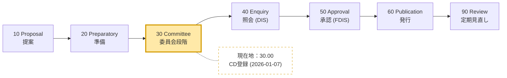
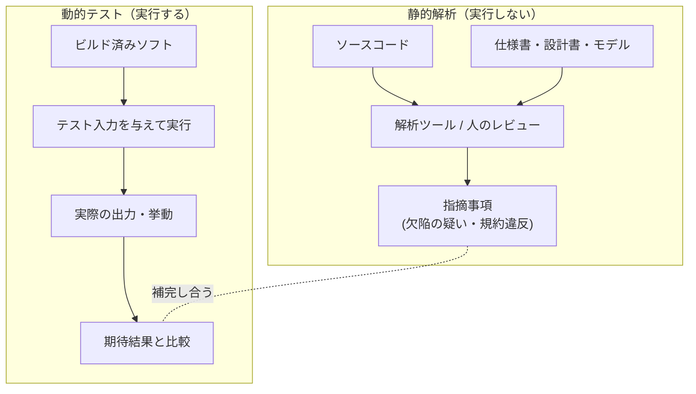
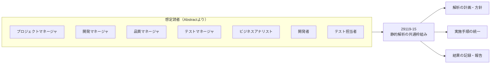
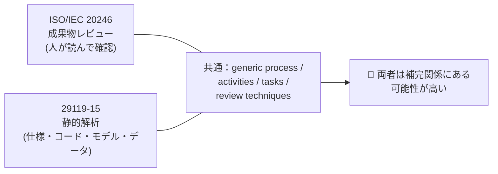
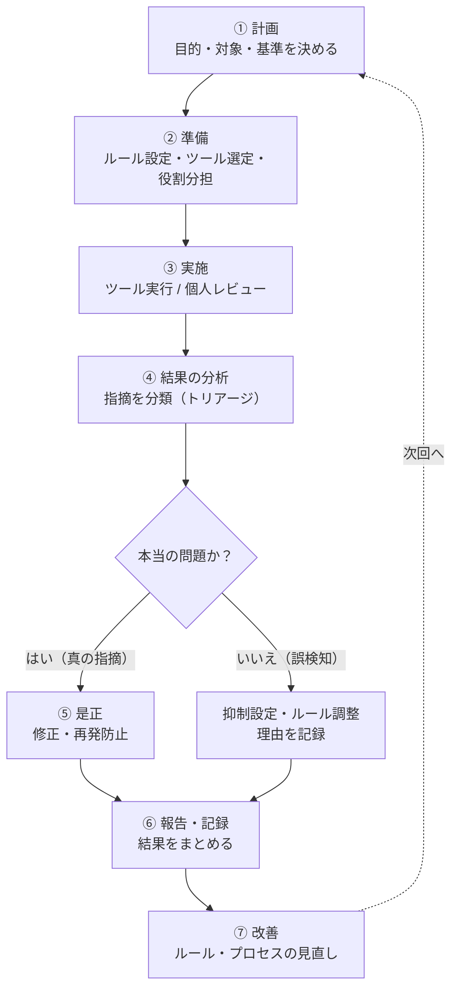
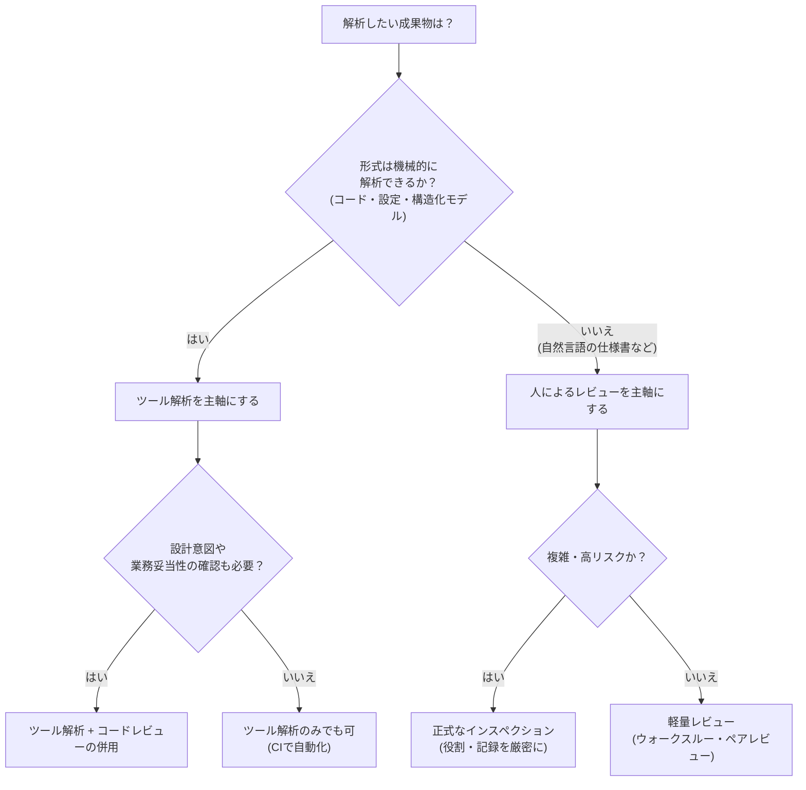
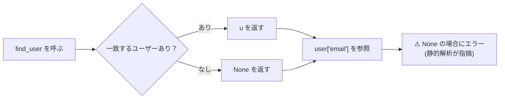
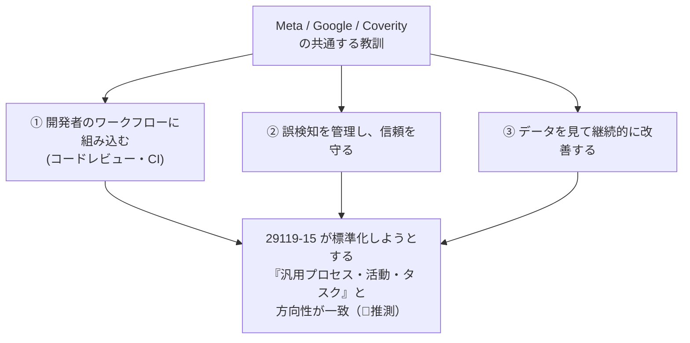
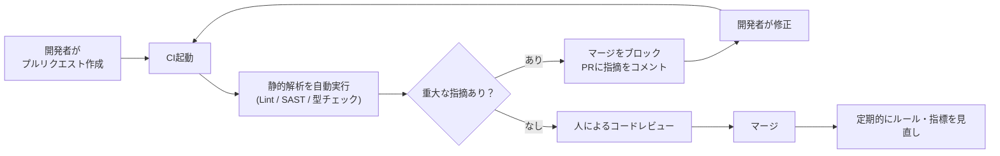
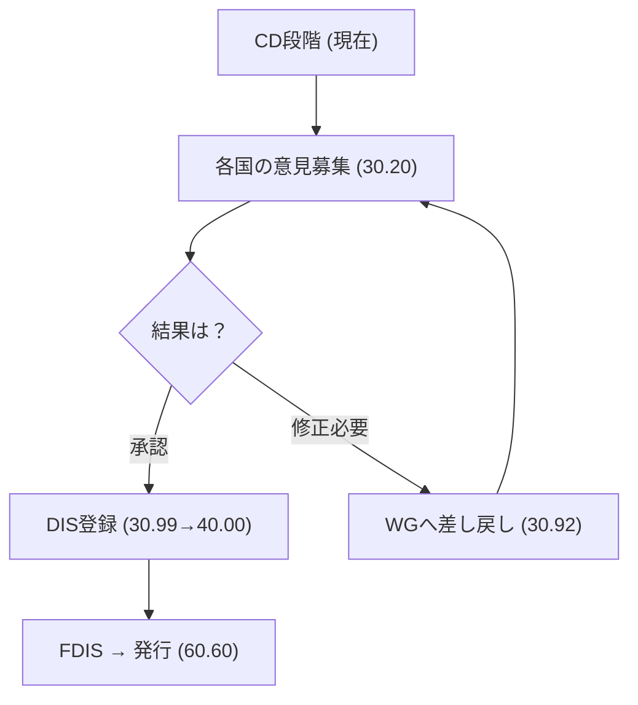

# ISO/IEC/IEEE CD 29119-15（静的解析）初学者向けステップバイステップ解説

> **調査基準日：2026年10月6日**
> 対象：ISO/IEC/IEEE CD 29119-15 *Software and systems engineering — Software testing — Part 15: Static analysis*
> 一次情報：<https://www.iso.org/standard/92493.html>

---

## 0. このガイドの読み方（重要）

この規格は **まだ委員会原案（CD）段階** で、本文は公開されていません。そのため、本ガイドでは情報を3種類に分けて明示します。

| ラベル | 意味 | 信頼度 |
|---|---|---|
| ✅ **公開情報** | ISO / IEEE / DIN など公式ページに書かれている事実 | 高 |
| 📘 **一般知識** | 静的解析・レビューの教科書的な内容、国際的な開発者の公開論文・記事 | 高〜中 |
| 🔎 **解説者の推測** | 公開情報から論理的に考えられるが、CD本文では未確認の内容 | 中〜低 |

> **注意**：CD本文の章立て・要求事項・用語定義は未公開のため、本ガイドは「規格本文の解説」ではありません。**「規格が何を目指していて、実務ではどう使えそうか」を、公開情報と業界知見から先回りして理解するための学習ガイド** です。

---

## 1. 3行でわかる要点

1. ✅ 29119-15 は、**静的解析の「共通の枠組み」**（プロセス・活動・タスク・レビュー技法・文書化）を定める新しい規格案です。
2. ✅ 対象は **仕様書、ソースコード、モデル、関連データ** の解析で、特定のツールや言語には依存しません。
3. ✅ 2026年1月7日に **CD（委員会原案）として登録** され、現在は「委員会で草案をレビュー中」の段階です。

---

## Step 1. 規格の「現在地」を知る

### 1-1. 公開情報のまとめ ✅

| 項目 | 内容 |
|---|---|
| 正式名称 | ISO/IEC/IEEE CD 29119-15 |
| タイトル | Software and systems engineering — Software testing — Part 15: Static analysis |
| 版 | Edition 1（初版） |
| 状態 | Under development（策定中） |
| ステージ | 30.00（Committee draft 登録） |
| 新規プロジェクト承認 | 2026-01-07（10.99） |
| 担当委員会 | ISO/IEC JTC 1/SC 7（ソフトウェアおよびシステムエンジニアリング） |
| 担当作業部会 | WG 26（Software testing） |
| IEEE側の動き | P29119-15 として PAR（プロジェクト承認申請）が 2025-09-10 に承認、作業部会議長は Jon Hagar |
| 関連する国際共同開発 | ISO/IEC と IEEE の共同規格（接頭辞 ISO/IEC/IEEE） |

### 1-2. 規格が完成するまでの道のり

ISO規格は、下図のようなステージを順番に進みます。**現在は「30 Committee」の入口** にいます。



### 1-3. 時系列で見る歩み ✅

| 時期 | 出来事 | 出典 |
|---|---|---|
| 2018年 | BCS SIGiST の報告書で、WG26 が「静的解析の国際規格」を作業中のテーマとして挙げている | BCS 年次報告 |
| 2025-07-11 | NP（新規提案）として投票開始（ステージ 10.20） | ISS（セルビア規格協会）のプロジェクト情報 |
| 2025-09-10 | IEEE 側の PAR（P29119-15）承認 | IEEE SA |
| 2026-01-07 | 新規プロジェクト承認（10.99）と CD 登録（30.00） | ISO |

> 💡 **ポイント**：構想から約8年かけて、ようやく正式プロジェクトになった規格です。それだけ「静的解析を標準化する」ことは難しいテーマだったと読み取れます（🔎推測）。

### 1-4. 今後のステージ（一般的な ISO の流れ）📘

CD が **30.20（CD意見募集）** → **30.99（DISへ登録承認）** と進めば、次は **DIS（40）** 段階に移ります。意見の内容によっては **30.92（WGに差し戻し）** もあり得ます。**いつ発行されるかは現時点で公表されていません。**

---

## Step 2. 「静的解析」とは何か（基礎編）

### 2-1. 定義 📘

> **静的解析（Static Analysis）** ＝ プログラムや成果物を **実行せずに** 調べて、欠陥・リスク・規約違反を見つける活動

Meta（旧Facebook）の Peter O'Hearn 氏らの CACM 論文でも、静的解析ツールは「他のプログラムのソースを、実行せずに調べて結論を導くプログラム」と説明されています（出典は末尾）。

### 2-2. 動的テストとの違い



| 観点 | 静的解析 | 動的テスト |
|---|---|---|
| 実行の要否 | **不要** | 必要 |
| 対象 | コード・仕様・設計・モデル・データ | 動くソフトウェア |
| 見つけやすい欠陥 | 規約違反、未初期化変数、NULL参照の可能性、到達不能コード、要件の矛盾 | 性能問題、環境依存、実際の画面・結果の誤り |
| 実施時期 | **早い**（コードや文書ができた時点） | 実行可能になってから |
| 弱点 | 誤検知（false positive）が出る、実行時の挙動は見えにくい | テストした範囲しか確認できない |
| 例 | Lint、型チェック、SAST、レビュー | 単体テスト、E2Eテスト |

### 2-3. 静的解析の「2つの顔」📘

規格の概要（Abstract）には「**review techniques（レビュー技法）**」とあるため、29119-15 は次の **両方** を視野に入れていると読めます（✅ 概要に基づく読み取り）。

| 種類 | 担い手 | 主な対象 | 具体例 |
|---|---|---|---|
| **ツールによる解析** | 静的解析ツール | ソースコード、モデル | Linter、型チェッカー、SASTツール |
| **人によるレビュー** | 人間 | 仕様書、設計書、コード | インスペクション、ウォークスルー、ペアレビュー |

---

## Step 3. 29119-15 が対象とするもの（概要の読み解き）

### 3-1. 公式の概要（要旨）✅

ISO ページの Abstract は、次の内容を述べています（要旨を日本語に言い換えています）。

- システム・ソフトウェアの **開発・テスト・保守に関わるあらゆる組織** が参照できる **汎用的な枠組み** を示す
- **汎用プロセス、活動、タスク、レビュー技法、文書化** を含む
- 解析の対象は **ソフトウェア仕様、ソースコード、モデル、関連データ**
- **プロセスを説明する参考図（informative diagram）** が付く
- 想定読者は、プロジェクトマネージャ、開発マネージャ、品質マネージャ、テストマネージャ、ビジネスアナリスト、開発者、テスト担当者など

### 3-2. 要素ごとに整理

| 概要のキーワード | やさしい言い換え | 初学者が最初に押さえること |
|---|---|---|
| generic framework | 特定のツールや会社に依存しない共通の型 | 「Aツールの使い方」ではなく「進め方のルール」 |
| process | 全体の流れ | 計画→実施→評価→是正の流れ |
| activities | プロセスの中の大きな作業 | 例：解析の準備、結果の分析 |
| tasks | 活動を具体化した個別の作業 | 例：解析ルールを決める、指摘を分類する |
| review techniques | 人が成果物を確認する方法 | インスペクションなど |
| documentation | 記録の取り方 | 計画書・結果報告書の考え方 |
| specifications / source code / models / data | 解析の対象物 | **コードだけではない** 点が重要 |

### 3-3. 想定読者と役割



---

## Step 4. ISO/IEC/IEEE 29119 シリーズの中での位置づけ

### 4-1. シリーズ全体の中の役割

29119 は「ソフトウェアテスト」の国際規格群です。**Part 15 は「静的解析」に特化した部品** として追加されます。

| Part | 内容（日本語） | 備考 |
|---|---|---|
| 29119-1 | テストの概念と定義 | 用語の土台 |
| 29119-2 | テストプロセス | 「どう進めるか」 |
| 29119-3 | テスト文書化 | 「何を書くか」 |
| 29119-4 | テスト技法 | 「どうテストを設計するか」 |
| 29119-5 | キーワード駆動テスト | 自動化の方式 |
| **29119-15** | **静的解析（本CD）** | **実行しない解析の枠組み** |

> 💡 これまでの 29119-4（テスト技法）は、主に **実行を伴うテストの設計** が中心でした。Part 15 は、その **「実行しない側」を正式に補う位置づけ** と考えると理解しやすいです（🔎推測）。

### 4-2. 姉妹規格：ISO/IEC 20246（成果物レビュー）✅

静的解析と深く関わる既存規格が **ISO/IEC 20246:2017「Work product reviews」** です。

| 項目 | ISO/IEC 20246:2017 |
|---|---|
| 内容 | 成果物レビューの汎用的な枠組み（プロセス、活動、タスク、レビュー技法、文書化テンプレート） |
| 対象 | あらゆるライフサイクル段階の **あらゆる成果物** |
| 状態 | 発行済み（2022年に見直しで確認され、現行版） |
| 担当 | ISO/IEC JTC 1/SC 7 |

**重要な共通点**：29119-15 の Abstract も、20246 の Abstract も、「汎用プロセス・活動・タスク・レビュー技法・文書化」という **同じ構成の言葉** で書かれています。



> 🔎 **推測**：20246 が「人によるレビュー」を中心に扱い、29119-15 が「ツール解析も含めた静的解析全体」を扱う、という役割分担の可能性があります。**ただし、両者の正確な関係は CD 本文が公開されるまで確認できません。**

---

## Step 5. 静的解析の一般的なプロセス（📘 学習用モデル）

> ⚠️ 以下は **CD本文の内容ではありません**。静的解析を実務で回すときの **一般的な流れ** を、初学者が理解しやすいように整理した学習用モデルです。29119-15 が「汎用プロセス」を定めると概要に書かれているため、似た流れになる可能性があります（🔎）。

### 5-1. 全体フロー



### 5-2. 各ステップで「何をするか」

| ステップ | 何をするか | 具体例 | 成果物の例 |
|---|---|---|---|
| ① 計画 | 目的・対象範囲・合格基準を決める | 「新規コードは重大度High指摘ゼロでマージ」 | 静的解析計画 |
| ② 準備 | ルールセット・ツール・担当者を決める | 言語ごとのLinter設定、レビュー担当を割り当て | 設定ファイル、役割表 |
| ③ 実施 | ツール実行や、人の個別レビュー | CIで自動実行、設計書を各自で読む | 生の指摘一覧 |
| ④ 分析 | 指摘の真偽・重大度を判断 | 誤検知の除外、優先度付け | 分類済み指摘一覧 |
| ⑤ 是正 | 欠陥を修正し、再確認 | コード修正→再解析 | 修正済みコード |
| ⑥ 報告 | 結果と判断を記録 | 件数・傾向・未解決事項 | 結果報告書 |
| ⑦ 改善 | ルールやプロセスを更新 | 誤検知が多いルールを無効化 | 更新済みルールセット |

### 5-3. 初学者がつまずきやすい点

| つまずき | なぜ起きるか | 対処の考え方 |
|---|---|---|
| 「指摘ゼロ＝品質が高い」と考える | ツールが見つけられない欠陥もある | 静的解析は **動的テストと併用** する |
| 指摘が多すぎて放置される | ルールを全部有効にしてしまう | **重要なルールから段階導入** する |
| 誤検知を無視する文化が根付く | 誤検知の扱いルールがない | 抑制には **理由の記録** を必須にする |

---

## Step 6. 人によるレビュー と ツール解析 の使い分け

### 6-1. 比較表 📘

| 観点 | 人によるレビュー | ツール解析 |
|---|---|---|
| 得意な対象 | 仕様書、設計、意図の妥当性 | ソースコード、大量のファイル |
| 得意な欠陥 | 要件の抜け・矛盾、設計の不備 | 構文・型・データフロー上の問題 |
| 速度 | 遅い（人手） | 速い（自動） |
| 一貫性 | 担当者により揺れる | 常に同じルールで判定 |
| コスト構造 | 人件費が中心 | 導入・運用コスト |
| 弱点 | 見落とし、疲れ | 意図や文脈の理解が難しい |

### 6-2. 使い分けの判断フロー



---

## Step 7. ツール解析のしくみ（技術編）📘

### 7-1. 代表的な解析手法

| 手法 | 一言で言うと | 見つけられる例 |
|---|---|---|
| 字句・構文解析 | 書き方のルールを機械的にチェック | 命名規則違反、未使用のimport |
| 型チェック | 値の種類の整合性を確認 | 数値に文字列を渡している |
| 制御フロー解析 | 処理の通り道（分岐・ループ）を追跡 | 到達不能コード、無限ループの疑い |
| データフロー解析 | 値がどこで作られ、どこで使われるか追跡 | 未初期化変数、NULL参照の可能性 |
| テイント解析 | 外部入力が危険な場所に届くかを追跡 | SQLインジェクション、XSSの可能性 |
| 抽象解釈 | プログラムの意味を抽象ドメイン（値の範囲など）上で近似して推論 | 配列範囲外、メモリリーク |
| 記号実行 | 入力を記号として扱い、パス条件を集めながら実行パスを探索 | 特定の入力条件でのみ到達するエラー、その再現入力の生成 |

### 7-2. 具体例：実行せずに欠陥を見つける

```python
def find_user(users, name):
    for u in users:
        if u["name"] == name:
            return u
    # 見つからなかった場合、何も返さない（= None が返る）

users = [{"name": "Bob", "email": "bob@example.com"}]
user = find_user(users, "Alice")  # 一致しないので None が返る
print(user["email"])   # ← user が None だと実行時エラー
```

静的解析ツールは、**プログラムを動かさず** に次の流れを追跡し、「`find_user` は `None` を返す経路がある。それを確認せずに `user["email"]` を参照している」と指摘できます。



### 7-3. 誤検知と見逃し：2つの失敗

| 用語 | 意味 | 影響 |
|---|---|---|
| **偽陽性（false positive）** | 問題がないのに「問題あり」と報告 | 開発者の信頼を失う、指摘が無視される |
| **偽陰性（false negative）** | 本当の問題を報告しない | 欠陥が残ったまま出荷される |

静的解析の世界では、**両方を完全に無くすことは原理的に困難** で、ツールごとに「どちらをどれだけ許容するか」の設計判断があります。この点は、次の Step 8 で国際的な開発者の経験談として詳しく見ます。

---

## Step 8. 国際的な開発者の知見に学ぶ（📘 公開論文・記事）

規格が「何を標準化しようとしているか」を理解するには、**実際に大規模運用した人たちの教訓** が参考になります。ここでは3つの代表的な事例を紹介します。

### 8-1. Meta（旧Facebook）：Infer と Zoncolan

**出典**：Peter O'Hearn, "Scaling Static Analyses at Facebook", *Communications of the ACM*, 2019

| 要点 | 内容 |
|---|---|
| 運用の仕方 | 静的解析を **すべてのコード変更（diff）に対して実行** し、コードレビューの中でボットとして指摘を出す |
| 規模 | Infer は数千万行規模のコードベースを対象とし、**10万件を超える指摘が本番投入前に修正された** と報告 |
| 設計思想 | 「ツールの目的は人（開発者）を助けること」。摩擦を最小限にして価値を出す |
| 重要な教訓 | 同じ解析でも、**一括（バッチ）で実行すると修正率0%、コードレビュー中に差分へ実行すると修正率70%** だった |

> 💡 **学び**：静的解析は「何を検出するか」だけでなく、**「いつ・どこで開発者に見せるか」** が成果を決めます。プロセスを定義する規格の意義が、ここにあります。

### 8-2. Google：Tricorder

**出典**：Caitlin Sadowski ほか, "Tricorder: Building a Program Analysis Ecosystem", ICSE 2015

| 要点 | 内容 |
|---|---|
| 課題 | 解析ツールは、互いの統合や開発者のワークフローへの組み込みが難しい |
| 解決策 | 解析ツールを載せる **共通プラットフォーム** と、設計の **指導原則** を整備 |
| 特徴 | 解析の専門家でない開発者でも解析ルールを書ける、データに基づいて改善する「エコシステム」 |
| 評価 | Google 社内の開発者による実運用で有用性を検証 |

> 💡 **学び**：ツール単体ではなく、**「組織として静的解析を回す仕組み」** を作ることが重要です。これは 29119-15 の「汎用プロセス・文書化」という方向性と重なります（🔎推測）。

### 8-3. Coverity：商用ツールの現実

**出典**：Al Bessey, Dawson Engler ほか, "A Few Billion Lines of Code Later: Using Static Analysis to Find Bugs in the Real World", *Communications of the ACM*, 2010

| 要点 | 内容 |
|---|---|
| 背景 | 研究室で作った解析技術を商用化し、実際の顧客コードに適用した経験談 |
| 現実の壁 | コードのビルド方法や言語の方言の違いなど、**研究室では想定しなかった問題** が多数あった |
| 誤検知の重み | 誤検知が多いと開発者の信頼を失う。目安として **誤検知率が高くなると（約30%超で）信頼低下** という実感が語られている |
| 教訓 | 「欠陥を見つける力」と「誤検知を減らすこと」の **バランス設計** が決定的に重要 |

### 8-4. 3つの事例の共通点



---

## Step 9. 実務への活かし方：CI/CD への組み込み例（📘）

規格案が公開されるのを待たずに、**今日から始められる形** の一例です。



### 9-1. 導入チェックリスト

| # | チェック項目 | 目的 |
|---|---|---|
| 1 | 解析の **目的と合格基準** を文書化したか | 「何をもって合格か」を明確にする |
| 2 | **対象範囲**（コード・設定・仕様・モデル）を決めたか | 見逃しの領域を把握する |
| 3 | ルールを **少数から段階導入** したか | 指摘の洪水を避ける |
| 4 | 指摘の **分類基準（重大度・真偽）** を決めたか | 判断のぶれを減らす |
| 5 | 誤検知の **抑制ルール（理由の記録必須）** を決めたか | 無視文化を防ぐ |
| 6 | 結果を **記録・追跡** しているか | 傾向分析と監査対応 |
| 7 | **定期的な見直し** の仕組みがあるか | 継続的改善 |

### 9-2. よくある失敗パターン

| 失敗 | 原因 | 対策 |
|---|---|---|
| 導入初日に数千件の指摘が出て誰も見なくなる | 既存コードを全件対象にした | **新規・変更箇所のみ** から開始（Metaの教訓と整合） |
| ルールが多すぎて開発者が疲弊 | 全ルール有効化 | 重要度の高いルールに絞る |
| 指摘が放置される | 担当・期限が不明 | 是正の責任者とルールを決める |
| ツールだけで安心してしまう | 動的テストとの役割分担がない | 静的解析＋動的テストの併用 |

---

## Step 10. この規格を今後どう追いかけるか

### 10-1. 注目ポイント



| 確認先 | 方法 |
|---|---|
| ISO のページ | ステージ表示の更新を確認、RSS購読も可能 |
| 各国の規格協会 | 日本ならJSA/JISの動向、ドイツならDINのプロジェクトページ等 |
| IEEE SA | P29119-15 のプロジェクトページ |
| 規格本文 | 発行後に ISO / IEEE のストアで購入 |

### 10-2. 規格が発行されたら確認したいこと（学習のためのチェックリスト）

| 確認項目 | 理由 |
|---|---|
| プロセスの段階数と名称 | 自組織の手順との対応づけ |
| 20246・29119-2 との関係 | 重複や参照の整理 |
| ツール解析に関する記述の範囲 | 「レビュー中心」か「ツール含む」かの確認 |
| 文書化の要求レベル | 規制対応や監査での使い方 |
| 参考図（informative diagram）の内容 | プロセス全体像の把握 |

---

## FAQ

**Q1. この規格は認証（資格）の対象ですか？**
A. 29119 は **プロセス規格** であり、本規格自体に準拠したことを証明する認証制度が存在するかは、現時点の公開情報では確認できていません。

**Q2. ISTQB の試験範囲に入りますか？**
A. 現時点で確認できる公開情報はありません。ISTQB は独自のシラバスを持つため、規格化後の取り込みは未定です（🔎推測）。

**Q3. いつ発行されますか？**
A. 公表されていません。CD から発行までには通常、複数のステージが必要です。

**Q4. 今すぐ学ぶなら何から始めるべき？**
A. ①静的解析の基本（本ガイド Step 2・7）→ ②自社CIへの組み込み（Step 9）→ ③ISO/IEC 20246 の概要（Step 4）の順がおすすめです。

**Q5. 本文を読まずに実務へ使って良いですか？**
A. 本ガイドの Step 5・9 は **一般的な良い実践** であり、規格準拠を保証するものではありません。規格に準拠した運用が必要な場合は、発行後の正式本文で確認してください。

---

## 参考ソース一覧（調査基準日：2026-10-06）

### A. 規格・標準化団体の公式情報（✅ 公開情報の根拠）

| # | 内容 | URL |
|---|---|---|
| A1 | ISO：ISO/IEC/IEEE CD 29119-15 のページ（ステージ、概要、日付） | <https://www.iso.org/standard/92493.html> |
| A2 | DIN：担当作業部会が ISO/IEC JTC 1/SC 7/WG 26 であること、開始日 2026-01-07 | <https://www.din.de/en/wdc-proj:din21:394018782> |
| A3 | IEEE SA：P29119-15（PAR承認 2025-09-10、作業部会議長） | <https://standards.ieee.org/ieee/29119-15/12189/> |
| A4 | ISS（セルビア）：NP 29119-15、新規提案投票 2025-07-11 | <https://iss.rs/en/project/show/iso:proj:92493> |
| A5 | ISO RSS（ステージ更新の購読） | <https://www.iso.org/contents/data/standard/09/24/92493.detail.rss> |
| A6 | ISO/IEC 20246:2017 Work product reviews | <https://www.iso.org/standard/67407.html> |
| A7 | BCS SIGiST 標準化ワーキングパーティ年次報告 2018（WG26 の作業項目） | <https://www.bcs.org/media/2956/sigist-standards-report-2018.pdf> |

### B. 国際的な開発者・研究者の公開資料（📘 一般知識の根拠）

| # | 著者・組織 | 内容 | URL |
|---|---|---|---|
| B1 | Peter O'Hearn（Meta / UCL） | Scaling Static Analyses at Facebook（CACM 2019） | <https://cacm.acm.org/?p=106093> |
| B2 | Peter O'Hearn | 同論文のPDF（著者版） | <https://discovery-pp.ucl.ac.uk/10084236/1/O%27Hearn%20AAM%20scaling-static-analysis-at-facebook.pdf> |
| B3 | Peter O'Hearn | Formal Reasoning: The Elements of Scale（バッチ0% vs コードレビュー70%の修正率） | <https://cps-vo.org/sites/cps-vo.org/files/cpsvo_file_nodes/Peter_OHearn_-_Formal_Methods_at_Scale.pdf> |
| B4 | Peter O'Hearn | Continuous Reasoning: Scaling the Impact of Formal Methods | <https://discovery-pp.ucl.ac.uk/id/eprint/10074600/7/O%27Hearn_Continuous%20reasoning.%20Scaling%20the%20impact%20of%20formal%20methods_VoR.pdf> |
| B5 | Mark Harman, Peter O'Hearn | From Start-ups to Scale-ups（SCAM 2018） | <https://discovery.ucl.ac.uk/id/eprint/10068035/> |
| B6 | Caitlin Sadowski ほか（Google） | Tricorder: Building a Program Analysis Ecosystem（ICSE 2015） | <https://research.google/pubs/pub43322/> |
| B7 | Al Bessey, Dawson Engler ほか（Coverity） | A Few Billion Lines of Code Later（CACM 2010） | <https://cacm.acm.org/research/a-few-billion-lines-of-code-later> |

---

## 免責事項

- 本ガイドは、2026年10月6日時点で **公開されている情報のみ** を根拠にしています。
- ISO/IEC/IEEE CD 29119-15 の **本文は未公開（有償・委員会内資料）** のため、本文の記述を引用・要約していません。Step 5・9 などの実務プロセスは「📘 一般知識」または「🔎 推測」であり、**規格の要求事項ではありません**。
- CD は今後の審議で **内容が大きく変わる可能性** があります。正式な内容は、発行後の規格本文で必ず確認してください。
- ステージや日付は変わり得るため、最新状況は A1（ISO のページ）で確認してください。
