# ISO/IEC/IEEE 29119-2:2021 テストプロセス 初学者向けステップバイステップ解説

> **対象規格**：ISO/IEC/IEEE 29119-2:2021 *Software and systems engineering — Software testing — Part 2: Test processes*
> **情報基準日**：2026年9月28日（この日までに確認できた公開情報にもとづく）
> **読者**：ソフトウェアテストの規格を初めて読むエンジニア、QA担当者、テストマネージャー
> **ゴール**：規格の全体像（3層モデル）と、全プロセスの目的・流れ・成果物を「自分の現場の言葉」に置き換えて説明できるようになる

---

## このガイドの読み方と注意

| 項目 | 内容 |
|------|------|
| 規格本文の扱い | 規格本文は有償で、ISOは本文のAI利用を認めていません（ただし、別途締結したライセンスでAI利用が明示的に許可されている場合は、この制限は適用されません）。本書は公開されている概要・目次・解説資料と一般的なテスト知識をもとに、**筆者が自分の言葉で組み立てた解説**です。規格文の引用や転載はしていません。 |
| 確認度マーク | プロセスやアクティビティの名称には、確認の度合いを次のように付けています。 |
| ✅ | 2021年版の目次情報（豪州規格協会の採用版ページ、ISO/ANSIのプレビュー）で名称を確認できたもの |
| 🔎 | 旧版（2013年版）の目次、解説スライド、一般的な理解にもとづくもの。**購入した規格本文で最終確認してください** |
| 筆者の解釈 | 「アジャイルへの当てはめ」などは規格の記述ではなく、筆者の整理です。該当箇所に明記しています。 |

---

## 目次

1. [第1章　29119-2とは何か](#第1章29119-2とは何か)
2. [第2章　全体像：3層のテストプロセスモデル](#第2章全体像3層のテストプロセスモデル)
3. [第3章　プロセス記述の読み方](#第3章プロセス記述の読み方)
4. [第4章　組織テストプロセス（第6章）](#第4章組織テストプロセス第6章)
5. [第5章　テストマネジメントプロセス（第7章）](#第5章テストマネジメントプロセス第7章)
6. [第6章　動的テストプロセス（第8章）](#第6章動的テストプロセス第8章)
7. [第7章　具体例：ログイン機能で全プロセスをたどる](#第7章具体例ログイン機能で全プロセスをたどる)
8. [第8章　関連規格との関係](#第8章関連規格との関係)
9. [第9章　アジャイル・DevOpsでの使い方（筆者の整理）](#第9章アジャイルdevopsでの使い方筆者の整理)
10. [第10章　評価と批判：この規格をどう受け止めるか](#第10章評価と批判この規格をどう受け止めるか)
11. [第11章　学習ロードマップとチェックリスト](#第11章学習ロードマップとチェックリスト)
12. [付録　出典URLと調査メモ](#付録出典urlと調査メモ)

---

## 第1章　29119-2とは何か

💡 この章では、29119-2が「何を決めている規格で、何を決めていないのか」を1つずつ確認します。ここを押さえておくと、第2章以降のプロセス名の洗い出しが理解しやすくなります。

### 1-1　一言でいうと

**「テストという仕事を、誰が・どの順番で・何を作りながら進めるか」を、組織や開発手法に依存しない形で定義した規格**です。

たとえるなら、料理の世界の「厨房運営マニュアル」です。個別のレシピ（＝テスト技法）ではなく、「仕入れの方針を決める → 今日の献立を計画する → 調理する → 提供する → 片付ける」という**仕事の段取り**を決めています。レシピ集にあたるのは、同じシリーズの別のパートです（第8章で説明します）。

### 1-2　基本情報

| 項目 | 内容 |
|------|------|
| 正式名称 | Software and systems engineering — Software testing — Part 2: Test processes |
| 版 | 第2版（Edition 2）、2021年10月発行（公開日 2021-10-28） |
| 前版 | ISO/IEC/IEEE 29119-2:2013（廃止済み） |
| ページ数 | 54ページ |
| 担当委員会 | ISO/IEC JTC 1/SC 7（ソフトウェアおよびシステムエンジニアリング） |
| ICS分類 | 35.080（ソフトウェア） |
| ステータス | 発行済み（ISOサイト上のステージは 60.60） |

### 1-3　誰のための規格か

ISOの要旨によると、テスター、テストマネージャー、開発者、プロジェクトマネージャーを想定読者としています。とくに、**テストを統制（ガバナンス）し、管理し、実施する責任を持つ人**が主な対象です。また、**あらゆるソフトウェア開発ライフサイクルモデルに適用できる**とされています。

### 1-4　この規格が決めていること／決めていないこと

| 決めていること | 決めていないこと |
|----------------|------------------|
| テストプロセスの種類と、その目的・成果・アクティビティ・タスク・情報項目 | 具体的なテスト設計技法（同値分割など）。これはPart 4の役割 |
| プロセス同士の入出力の関係（計画が実行を導き、結果が計画へ戻る） | テスト文書の書式テンプレート。これはPart 3の役割 |
| 組織・管理・実作業という3つの層の分担 | 使うツール、チーム構成、開発手法（ウォーターフォールかアジャイルか） |

### 1-5　2013年版から2021年版で何が変わったか

2021年版の序文と各社の紹介ページ、および2013/2015年版と2021年版の目次を見比べると、次の違いを確認できます。

| 変更点 | 2013年版 | 2021年版 | 確認度 |
|--------|----------|----------|--------|
| テスト設計の中心概念 | **テスト条件（test condition）** を導出する | **テストモデル（test model）** を作る | ✅ |
| 計画プロセスの名称 | Test Planning Process（テスト計画プロセス） | Test Strategy and Planning Process（テスト戦略・計画プロセス） | ✅ |
| 環境プロセス | Test Environment Set-Up & Maintenance（環境のセットアップと保守。ES1〜ES2） | Test Environment and Data Management（環境**とデータ**の管理。ED1〜ED4） | ✅ |
| 設計プロセスの構成 | TD1〜TD6（TD1 フィーチャセットの特定（Identify Feature Sets）、条件の導出、カバレッジ項目、テストケース、テストセット、手順） | TD1〜TD4（テストモデル作成、カバレッジ項目、テストケース、手順）。第8.2節の定義が更新された | ✅ |
| 付録 | 旧版の対応表など | 付録A：設計・実装プロセスの適用例、付録B：ISO/IEC/IEEE 12207:2017との対応、付録C：ISO/IEC 17025:2017との対応、付録D：BS 7925-2:1998との対応（いずれも参考情報） | ✅ |

BSIの紹介ページには、この規格が**リスクベースのアプローチ**に立つことも明記されています。

📖 この章で登場した用語

- ガバナンス（統制）：組織としてテストの方針を決め、守られているか見張る仕組み
- ライフサイクルモデル：ウォーターフォール、アジャイルなど、開発の進め方の型
- テスト条件：テスト対象の「確認したい事柄」を言葉にしたもの（2013年版の中心概念）
- テストモデル：テスト対象の振る舞いを図や表で抽象化したもの（2021年版の中心概念）
- リスクベース：失敗したときの影響が大きい所から優先してテストする考え方

---

## 第2章　全体像：3層のテストプロセスモデル

💡 この章では、29119-2の骨格である「3層モデル」を理解します。細かいプロセスを覚える前に、この3層の分担を頭に入れておくと、迷子になりません。

### 2-1　シリーズ全体での位置づけ

29119シリーズの中核規格のうち、情報基準日の時点で発行済みのものは5つのパートです（このほかにも技術報告書などのパートがあります）。Part 8（Model-based testing）は発行手続き中です。29119-2はその「**段取り編**」にあたります。

この図は、発行済みの5パートの関係と、発行手続き中のPart 8を表しています。上から下へ読み進めてください。点線の枠は未発行のパートです。

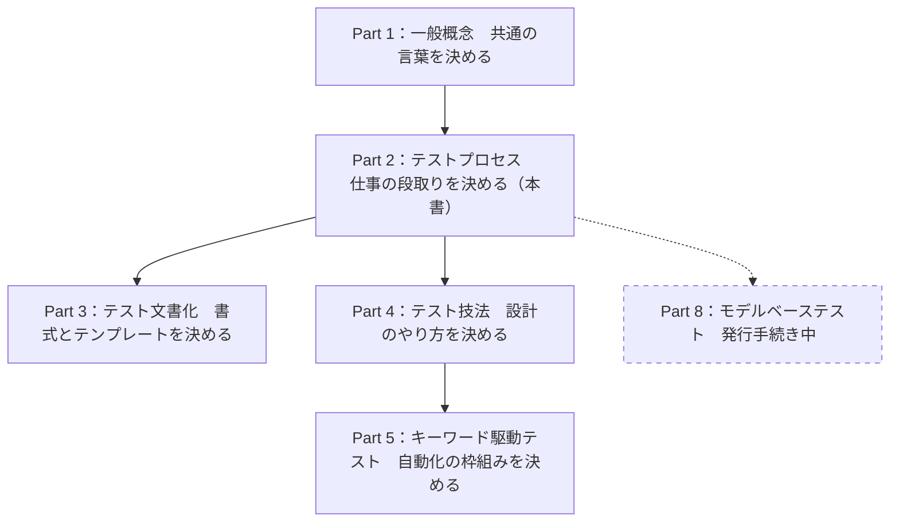

各ノードの意味：

- Part 1：用語の辞書。他のパートが使う言葉の意味をそろえる
- Part 2（本書）：プロセスの定義。「いつ・誰が・何をするか」
- Part 3：プロセスの各所で作る文書のテンプレート。Part 2のプロセス構成に沿って並んでいる
- Part 4：Part 2の「テスト設計・実装プロセス」の中で使う設計技法の集まり
- Part 5：キーワード駆動テストの枠組み。2024年12月に発行された
- Part 8（点線）：モデルベーステスト。情報基準日の時点では未発行で、発行手続き中

> 補足：WikipediaのISO/IEC 29119の項目では、各パートの発行時期を、Part 2（2021年10月）、Part 3（2021年10月）、Part 4（2021年10月）、Part 1（2022年1月）、Part 5（2024年12月）と整理しています。

### 2-2　3層モデルとは

規格は、テストの仕事を次の**3つの層**に分けています。会社にたとえると分かりやすくなります。

| 層 | 規格での名前 | 会社でのたとえ | 担う役割 |
|----|--------------|----------------|----------|
| 第1層 | 組織テストプロセス（Organizational Test Process） | **経営層**：会社全体の方針を決める | 組織のテストポリシーと組織テストプラクティスを作り、維持する |
| 第2層 | テストマネジメントプロセス（Test Management Processes） | **現場監督**：現場ごとに計画を立てて進捗を見る | 計画し、監視・制御し、完了させる |
| 第3層 | 動的テストプロセス（Dynamic Test Processes） | **職人**：実際に手を動かす | 設計し、環境を用意し、実行し、不具合を報告する |

この図は、3層の間で「何が上から下へ流れ、何が下から上へ戻るか」を表しています。

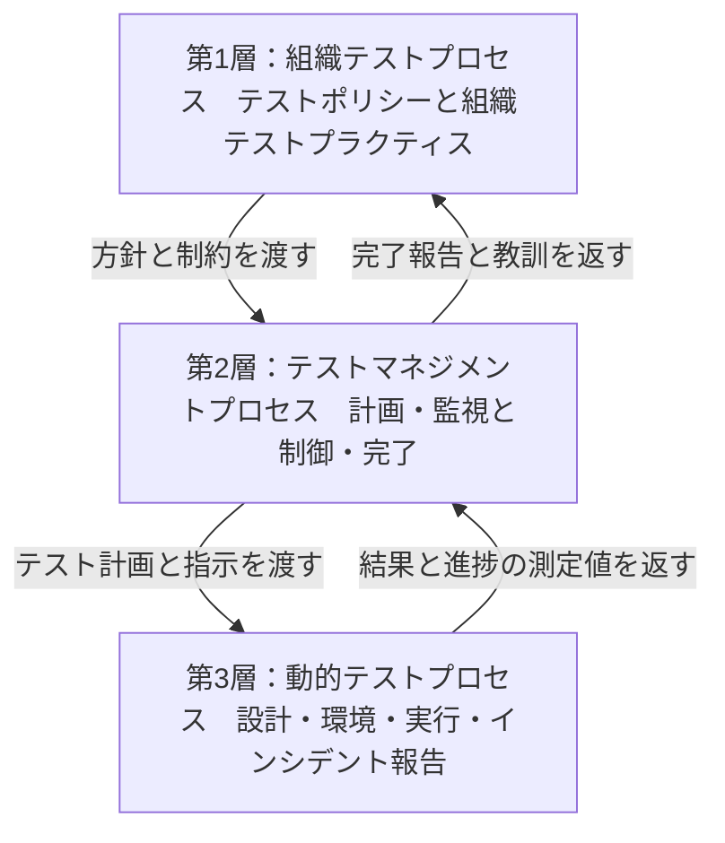

各ノードの意味：

- 第1層：組織全体に共通するルール。プロジェクトごとに作り直さない
- 第2層：個別のプロジェクトやテストレベルごとに回る管理の層
- 第3層：実作業の層。テストの種類（単体、結合、システム、受け入れ）ごとに繰り返し動く
- 上向きの矢印：現場の結果が管理層、さらに組織へ戻る。この**フィードバック**がプロセス改善の材料になる

Stuart Reid氏（29119の策定を担ったWG26のコンビーナ）の講演資料でも、この3つの層（Organizational / Test Management / Dynamic）を中心に規格の構造が説明されています。

### 2-3　全プロセス一覧

規格が定義するプロセスは、全部で**8個**あります。章番号とあわせて整理します。

| 層 | 節 | プロセス名（英語） | 日本語訳 | 確認度 |
|----|----|--------------------|----------|--------|
| 第1層 | 6.2 | Organizational test process | 組織テストプロセス | ✅ |
| 第2層 | 7.2 | Test strategy and planning process | テスト戦略・計画プロセス | ✅ |
| 第2層 | 7.3 | Test monitoring and control process | テスト監視・制御プロセス | ✅ |
| 第2層 | 7.4 | Test completion process | テスト完了プロセス | ✅ |
| 第3層 | 8.2 | Test design and implementation process | テスト設計・実装プロセス | ✅ |
| 第3層 | 8.3 | Test environment and data management process | テスト環境・データ管理プロセス | ✅ |
| 第3層 | 8.4 | Test execution process | テスト実行プロセス | ✅ |
| 第3層 | 8.5 | Test incident reporting process | テストインシデント報告プロセス | ✅ |

なお、第5章（Multi-layer test process model）が3層モデルそのものの説明にあたり、第6〜8章で各層のプロセスを定義しています。

### 2-4　時間軸で見るとどうなるか

3層の図は「役割の分担」でした。次は、テストプロジェクトが進むにつれて**どのプロセスがいつ動くか**を見ます。

この図は、1つのテストプロジェクトの時間の流れを表しています。上から下へ読み進めてください。

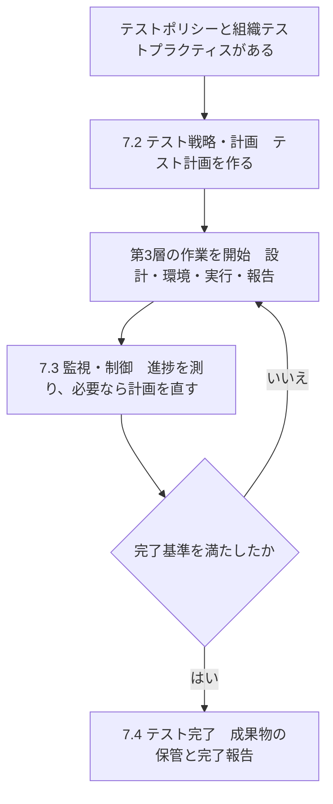

各ノードの意味：

- 「テストポリシーと組織テストプラクティスがある」：第1層の成果が土台になる
- 「7.2 テスト戦略・計画」：どこを・どの深さで・誰が・いつテストするかを決める
- 「第3層の作業」：実際のテスト活動。計画にしたがって繰り返す
- 「7.3 監視・制御」：進み具合を測り、ずれたら計画や作業を調整する。実行中ずっと並行して動く
- ひし形「完了基準を満たしたか」：あらかじめ決めた終了条件（完了基準）で判定する
- 「7.4 テスト完了」：テスト資産の保管、環境の片付け、教訓の整理、完了報告

📖 この章で登場した用語

- WG26：ISO/IEC JTC 1/SC 7の中でソフトウェアテスト規格を作る作業グループ
- 動的テスト：プログラムを実際に動かして確認するテスト
- フィードバック：結果を前の段階へ戻して、次の判断に使うこと
- 完了基準：「ここまでやったらテストを終えてよい」という条件

---

## 第3章　プロセス記述の読み方

💡 この章では、規格の中でプロセスがどう書かれているかを確認します。この読み方が分かると、第4章以降で出てくる略号（TP5、TD3など）の意味がすぐ分かるようになります。

### 3-1　すべてのプロセスは同じ型で書かれている

29119-2のプロセスは、ISO/IEC TR 24774:2010（プロセス記述のためのガイドライン）の共通テンプレートで書かれています。IEEEの紹介ページにもそのとおり記載があります。

型に沿って書くのは、規格の読者がどのプロセスでも**同じ順番で情報を探せる**ようにするためです。たとえば、家電の取扱説明書がどの製品でも「安全上の注意 → 各部の名称 → 使い方 → 困ったとき」の順に並んでいると、初めて見る製品でも迷いません。

| 要素 | 意味 | 一言でいうと |
|------|------|--------------|
| 目的（Purpose） | そのプロセスは何のためにあるか | なぜやるのか |
| 成果（Outcomes） | プロセスが終わったときに得られている状態 | 何が手に入るのか |
| アクティビティ（Activities） | プロセスを構成する大きな作業のまとまり | 大きな手順 |
| タスク（Tasks） | アクティビティを実行するための具体的な作業 | 小さな手順 |
| 情報項目（Information items） | 入力・出力として扱う文書やデータ | 材料と成果物 |

### 3-2　略号の読み方

アクティビティには `TP5`、`TD3` のような略号が付いています。

| 略号の頭 | 意味 | 属する層 |
|----------|------|----------|
| OT | Organizational Test（組織テスト） | 第1層 |
| TP | Test Planning（テスト計画） | 第2層 |
| TMC | Test Monitoring and Control（監視・制御） | 第2層 |
| TC | Test Completion（テスト完了） | 第2層 |
| TD | Test Design and implementation（設計・実装） | 第3層 |
| ED | Environment and Data（環境とデータ） | 第3層 |
| TE | Test Execution（実行） | 第3層 |
| IR | Incident Reporting（インシデント報告） | 第3層 |

数字は、そのプロセスの中でのアクティビティの順番です。たとえば `TD3` は「テスト設計・実装プロセスの3番目のアクティビティ」を指します。

### 3-3　読み進めるときのコツ

この図は、規格の1つのプロセスを読むときの手順を表しています。上から下へ読み進めてください。

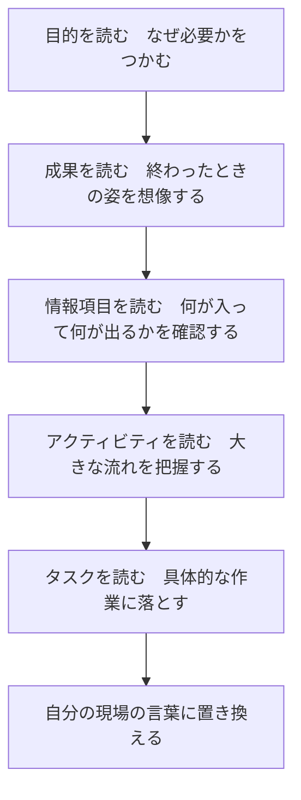

各ノードの意味：

- 「目的」と「成果」を先に読むのは、細かいタスクから読むと全体の意図を見失いやすいため
- 「情報項目」で入出力を押さえると、他のプロセスとのつながりが見える
- 最後の「置き換え」で、規格の言葉を自分のプロジェクトの文書名や会議名に対応づける

📖 この章で登場した用語

- ISO/IEC TR 24774：プロセスの書き方を決めた技術報告書（TR）
- アクティビティ：プロセスの中の大きな作業単位
- タスク：アクティビティを実行するための具体的な作業
- 情報項目：プロセスの入力や出力になる文書・データ

---

## 第4章　組織テストプロセス（第6章）

💡 この章では、組織全体のテストの「ルールブック」を作り、保つ第1層のプロセスを説明します。第5章の「テスト計画」が、このルールブックを土台にしている点を意識して読んでください。

### 4-1　なぜ必要か

プロジェクトのたびに「テストはどこまでやるのか」「どんな文書を残すのか」を議論していると、時間がかかるうえ、品質にばらつきが出ます。**組織として共通の方針を持つ**ことで、各プロジェクトは同じ土台から計画を作れます。会社の「就業規則」にあたるものと考えると分かりやすいでしょう。

### 4-2　何を作るか

組織テストプロセスで扱う主な成果物は、**組織テスト仕様（Organizational Test Specification）** です。Part 3の文書化規格では、これが次の2つの文書にあたります（Wikipediaの整理による）。

| 文書 | 役割 | たとえ |
|------|------|--------|
| テストポリシー（Test Policy） | 組織がテストに何を求めるかの方針 | 憲法 |
| 組織テストプラクティス（Organizational Test Practices） | 方針を実現するための組織共通の進め方 | 法律 |

### 4-3　アクティビティ

2013年版の目次では、組織テストプロセスは3つのアクティビティで構成されています。2021年版も第6.2節に同名のプロセスがあります。アクティビティ単位の名称は、2021年版の目次では確認できていないため、🔎として扱ってください。

| 略号 | アクティビティ | 内容 | 確認度 |
|------|----------------|------|--------|
| OT1 | 組織テスト仕様を作る（Develop Organizational Test Specification） | テストポリシーと組織テストプラクティスを文書にする | 🔎 |
| OT2 | 使用状況を監視し制御する（Monitor and Control Use） | 各プロジェクトが方針に従っているか確認する | 🔎 |
| OT3 | 組織テスト仕様を更新する（Update Organizational Test Specification） | 現場の結果をふまえて見直す | 🔎 |

この図は、組織テスト仕様が「作る → 使われる → 見直す」と循環する様子を表しています。

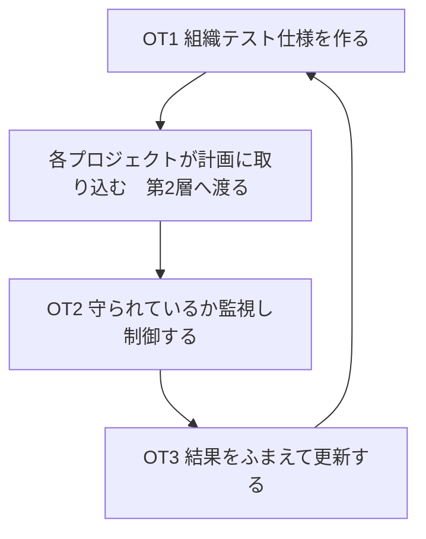

各ノードの意味：

- OT1：最初の版を作る。既存の社内ルールを整理するところから始めてもよい
- 「各プロジェクトが計画に取り込む」：第5章のテスト戦略・計画で参照される
- OT2：ルールが現場で形骸化していないか、逆に現場に合わず守れていないのかを確認する
- OT3：確認結果を反映する。ここで第2層から戻ってくる完了報告や教訓が使われる

### 4-4　初学者が誤解しやすい点

- 「組織テストプロセス」は、1回作って終わりの文書作成ではありません。**更新までがワンセット**です。
- 小さなチームでも、共通の方針（たとえば「リリース前に必ず回帰テストを実行する」）を持つなら、すでに第1層を実践しています。

📖 この章で登場した用語

- 組織テスト仕様：テストポリシーと組織テストプラクティスをまとめた呼び方
- テストポリシー：テストの目的と原則を示す、組織レベルの短い方針
- 回帰テスト：変更したときに、以前動いていた部分が壊れていないかを確かめるテスト
- 形骸化：ルールが存在するだけで、実際には守られていない状態

---

## 第5章　テストマネジメントプロセス（第7章）

💡 この章では、第2層の3つのプロセス（計画・監視と制御・完了）を順に説明します。第6章の実作業がどう導かれ、どう終わるのかが分かります。

### 5-1　テスト戦略・計画プロセス（第7.2節）

#### なぜ必要か

「どこから手を付けるか」を決めずにテストを始めると、重要な機能が手薄になり、重要でない機能に時間をかけすぎます。計画プロセスは、旅行にたとえると**「行き先・予算・日程・持ち物」を決める段階**です。

#### アクティビティの流れ

2021年版の目次で確認できた名称は、`TP5 テスト戦略を設計する`（Design test strategy）と `TP7 テスト計画を記録する`（Record test plan）です。その他は2013年版の目次と一般的な理解をもとにしています。

| 略号 | アクティビティ | 内容 | 確認度 |
|------|----------------|------|--------|
| TP1 | 状況を理解する（Understand context） | 対象システム、制約、関係者、開発手法を把握する | 🔎 |
| TP2 | 計画の作成を組織する（Organize test plan development） | 誰がいつまでに計画を作るかを決める | 🔎 |
| TP3 | リスクを特定し分析する（Identify and analyse risks） | 何が失敗すると困るかを洗い出し、影響度と発生しやすさを見積もる | 🔎 |
| TP4 | リスク対応方針を決める（Identify risk mitigation approaches） | リスクごとに、テストで対処する・受け入れる・他の手段で防ぐ、を決める | 🔎 |
| TP5 | テスト戦略を設計する（Design test strategy） | 何を、どの技法で、どの深さまでテストするかを決める | ✅ |
| TP6 | 人員と日程を決める（Determine staffing and scheduling） | 人、時間、環境の割り当て | 🔎 |
| TP7 | テスト計画を記録する（Record test plan） | 決めたことを文書にする | ✅ |
| TP8 | 計画の合意を得る（Gain consensus on test plan） | 関係者の合意をとる | 🔎 |
| TP9 | 計画を伝達し公開する（Communicate test plan and make available） | 関係者がいつでも見られる状態にする | 🔎 |

この図は、計画プロセスの流れを表しています。上から下へ読み進めてください。

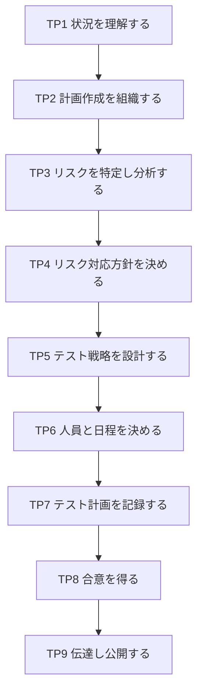

各ノードの意味：

- TP1〜TP2：土台づくり。ここで関係者と範囲を確認する
- TP3〜TP4：**リスクベース**の中核。ここでの判断が、後のテストの重みづけを決める
- TP5：計画の心臓部。テストの深さ、使う技法、完了基準の方針を決める
- TP6〜TP7：実行可能な計画へ落とし込み、文書にする
- TP8〜TP9：合意と共有。文書を作っただけでは計画として機能しない

#### 実務での具体例

ネットバンキングの送金機能なら、TP3では「金額計算の誤り」「二重送金」「権限のないユーザーの操作」などをリスクとして挙げます。TP5では、影響の大きい「金額計算」と「二重送金」に、境界値分析や状態遷移の設計技法を厚く適用すると決めます。

### 5-2　テスト監視・制御プロセス（第7.3節）

#### なぜ必要か

計画は立てた瞬間から古くなります。想定より不具合が多い、環境の準備が遅れるなど、予定どおりに進まないのが普通です。このプロセスは、車の運転でいう**「ナビを見ながら、渋滞があればルートを変える」** 役目です。

#### アクティビティ

名称は一般的な整理にもとづく🔎です。

| 略号 | アクティビティ | 内容 | 確認度 |
|------|----------------|------|--------|
| TMC1 | 監視と制御の準備をする（Set up） | 何を測るか、どう報告するかを決める | 🔎 |
| TMC2 | 監視する（Monitor） | 進捗、不具合数、カバレッジなどの測定値を集める | 🔎 |
| TMC3 | 制御する（Control） | ずれがあれば計画や作業を修正する | 🔎 |
| TMC4 | 報告する（Report） | 関係者へ状況を伝える | 🔎 |

この図は、監視と制御が繰り返し回る様子を表しています。

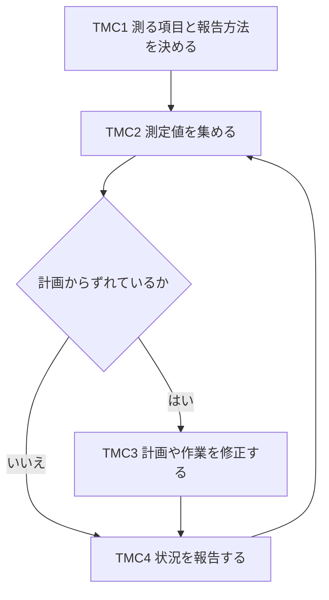

各ノードの意味：

- TMC1：最初に1回行い、測定の物差しを決める
- TMC2：テスト実行の結果、インシデント報告の件数など、第3層から返ってくるデータを集める
- ひし形「計画からずれているか」：進捗や品質が、計画の許容範囲かどうかを見る
- TMC3：テストの追加、優先度の変更、環境の増強などを指示する
- TMC4：報告後は、また測定に戻る。完了まで繰り返す

### 5-3　テスト完了プロセス（第7.4節）

#### なぜ必要か

テストを終えるときに片付けをしないと、次のプロジェクトで「あのテストデータはどこ？」「環境が汚れたままで動かない」という問題が起きます。**引っ越しの後片付けと、次の住人への引き継ぎ**にあたるプロセスです。

#### アクティビティ

2021年版の目次では、TC1・TC2・TC4の名称を確認できました。TC3は一般的な整理にもとづきます。

| 略号 | アクティビティ | 内容 | 確認度 |
|------|----------------|------|--------|
| TC1 | テスト資産を保管する（Archive test assets） | テストケース、手順、結果を後から使えるように残す | ✅ |
| TC2 | テスト環境を片付ける（Clean up test environment） | 環境を元の状態に戻す、または廃棄する | ✅ |
| TC3 | 教訓を特定する（Identify lessons learned） | 良かった点と改善点を整理する | 🔎 |
| TC4 | テスト完了を報告する（Report test completion） | 結果と残課題をまとめて報告する | ✅ |

この図は、完了プロセスの4つのアクティビティの流れと、教訓が第1層へ戻る経路を表しています。

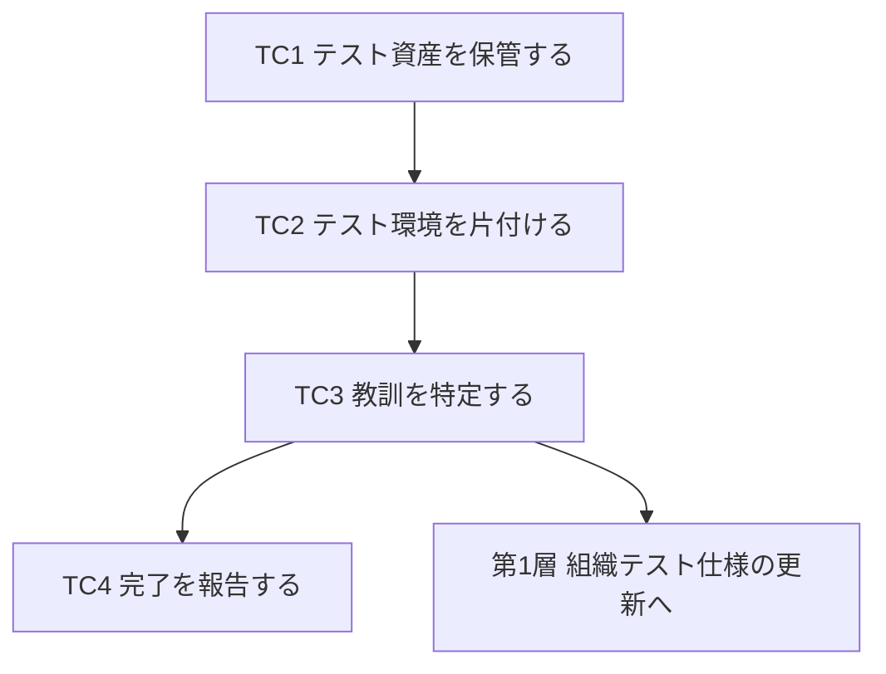

各ノードの意味：

- TC1：次回の回帰テストや監査で再利用できる形で残す
- TC2：本番データを含む環境なら、情報の消去もここで行う
- TC3：「次はこうする」を言葉にする。第4章のOT3（更新）の入力になる
- TC4：計画に対する実績、未解決のインシデントなどを伝える

📖 この章で登場した用語

- テスト戦略：何を、どの技法で、どの深さまでテストするかの方針
- リスク：悪いことが起きる可能性と、起きたときの影響の組み合わせ
- 境界値分析：入力範囲の端の値でバグが出やすい性質を利用する設計技法
- 状態遷移：画面や機能の状態が、操作によってどう移り変わるかを表す考え方
- テスト資産（testware）：テストケース、手順、データ、結果など、テストのために作った成果物の総称

---

## 第6章　動的テストプロセス（第8章）

💡 この章では、第3層の4つのプロセスを説明します。実際にテストを作り、動かし、不具合を報告する現場の流れが分かります。この規格の中で最も「手を動かす」部分です。

### 6-1　4つのプロセスの関係

この図は、動的テストプロセスの4つの関係を表しています。実線が通常の流れ、下から上へ戻る矢印が手戻りです。

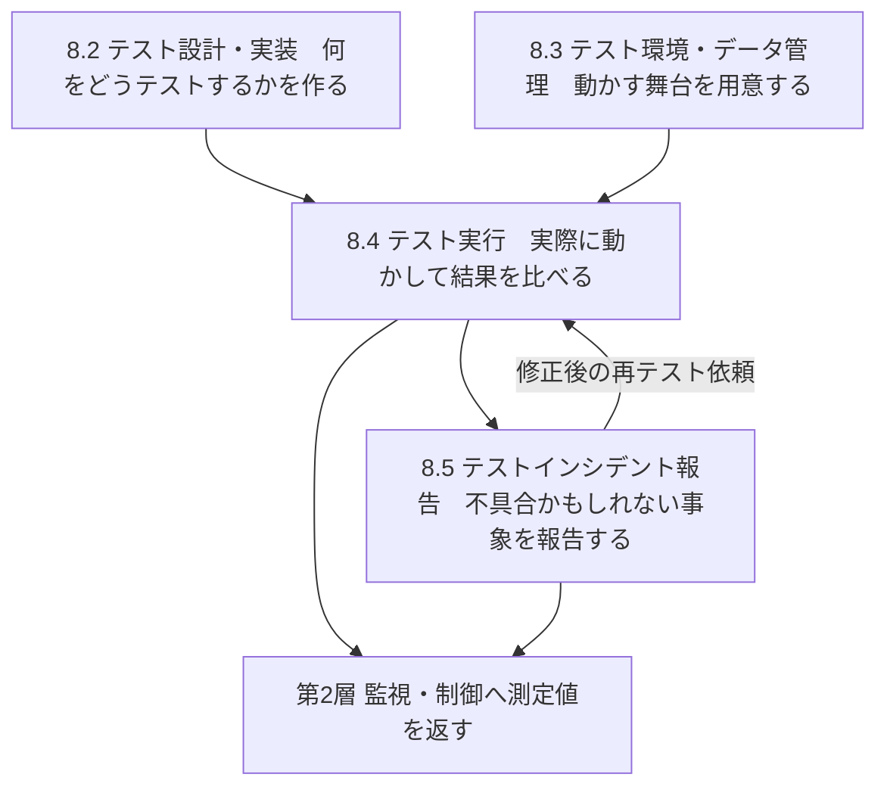

各ノードの意味：

- 8.2と8.3：実行の前提。2つは並行して進められる
- 8.4：テスト手順を実行し、期待結果と実際の結果を比べる
- 8.5：実行で見つかった差異を分析し、報告する
- 「再テスト依頼」：不具合が直ったら、もう一度実行に戻る
- 「測定値を返す」：第5章の監視・制御プロセスが使うデータになる

### 6-2　テスト設計・実装プロセス（第8.2節）

#### なぜ必要か

「思いつきでテストする」のでは、抜けや重複が出て、何をどこまで確認したかを説明できません。設計・実装プロセスは、**テスト対象から、実行できる手順までを段階的に具体化する**ための道筋です。2021年版で最も大きく更新された部分です。

たとえるなら、旅行の計画づくりです。

| 規格の言葉 | 旅行のたとえ | 役割 |
|------------|--------------|------|
| テストベース | ガイドブックと地図 | 何を確認するかの元になる情報（要求仕様、設計書など） |
| テストモデル | 路線図 | 対象の振る舞いを図や表で抽象化したもの |
| テストカバレッジ項目 | 「必ず訪れる観光地」のリスト | モデルから取り出した、確認の単位 |
| テストケース | 1日ごとの旅程案 | カバレッジ項目を網羅するための入力と期待結果の組 |
| テスト手順 | 当日の行程表 | ケースを実行する順番と具体的な操作 |

#### アクティビティ

2021年版の目次では次の4つを確認できました（付録Aの項目名にも対応しています）。

| 略号 | アクティビティ | 内容 | 付録Aの対応項目 | 確認度 |
|------|----------------|------|-----------------|--------|
| TD1 | テストモデルを作る（Create test model） | テストベースから、検証したい振る舞いを抽象化して表現する | A.4 テストモデル | ✅ |
| TD2 | テストカバレッジ項目を特定する（Identify test coverage items） | モデルから、確認すべき単位を取り出す | A.5 テストカバレッジ項目 | ✅（付録名で確認） |
| TD3 | テストケースを導出する（Derive test cases） | 項目を網羅する入力と期待結果を決める | A.6 テストケース | ✅ |
| TD4 | テスト手順を作る（Create test procedures） | ケースを実行する順序と操作を決める | A.7 テスト手順 | ✅ |

付録Aには、これに加えて **A.2 テストベースの断片** と **A.3 テスト完了基準** の項目もあります。つまり、適用例は「元の情報」と「いつ終えるか」を最初に示してから、TD1〜TD4に進む構成です。

この図は、設計・実装プロセスで情報が具体化されていく流れを表しています。上から下へ読み進めてください。

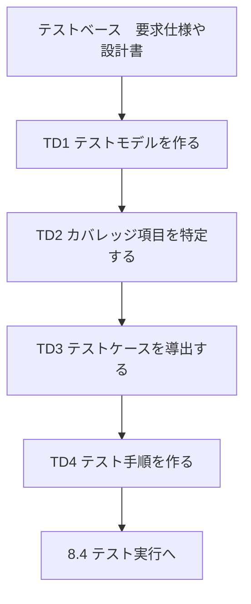

各ノードの意味：

- テストベース：テストの根拠になる資料。ここが曖昧だと、後の全工程が曖昧になる
- TD1：状態遷移図、デシジョンテーブル、入力の分類表などで表現する
- TD2：たとえば「状態Aから状態Bへの遷移」の1つ1つが、カバレッジ項目になる
- TD3：カバレッジ項目をもれなくカバーするように、入力値と期待結果を決める
- TD4：ケースを実行順に並べ、前提条件や操作手順を書き足す

> **2013年版との違い（再掲）**：旧版はまずTD1でフィーチャセットを特定（Identify Feature Sets）してから、TD2で「テスト条件」を導出し、その後にテストセットの組み立て（TD5）を経て手順を作っていました。2021年版は「テストモデル」を起点にし、アクティビティがTD1〜TD4に整理されています。どの技法でモデルを作るかは、Part 4（テスト技法）の守備範囲です。

### 6-3　テスト環境・データ管理プロセス（第8.3節）

#### なぜ必要か

テストは、実際に動かす環境とデータがなければ実行できません。また、環境の状態が毎回違うと、同じテストでも結果が変わります。**実験室の準備と、器具・試薬の管理**にあたるプロセスです。2021年版では、旧版の「環境」に「データ」が加わり、プロセス名も変わりました。

#### アクティビティ

2021年版の目次で、4つとも名称を確認できました。

| 略号 | アクティビティ | 内容 | 確認度 |
|------|----------------|------|--------|
| ED1 | テスト環境を構築する（Establish test environment） | ハードウェア、ソフトウェア、ネットワーク、ツールをそろえる | ✅ |
| ED2 | テストデータを準備する（Prepare test data） | テストに使うデータを作る・用意する | ✅ |
| ED3 | テスト環境を保守する（Maintain test environment） | 環境を安定させ、必要なら更新する | ✅ |
| ED4 | テストデータを保守する（Maintain test data） | データを最新・正確に保つ | ✅ |

この図は、環境とデータが並行して準備され、実行後も保守される様子を表しています。

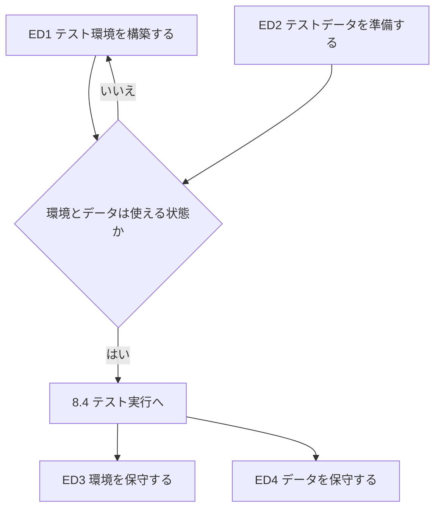

各ノードの意味：

- ED1とED2：並行して進められる。環境がなければデータを入れる場所がなく、データがなければ環境を動かせない
- ひし形「使える状態か」：実行前の確認。動作確認（スモークテスト）などを行う
- ED3とED4：実行が始まってからも続く。テストのたびにデータが汚れる、環境のバージョンが変わる、といった事態に備える

### 6-4　テスト実行プロセス（第8.4節）

#### なぜ必要か

テスト手順を作っただけでは、品質は何も分かりません。実際に動かし、期待どおりかを確認し、結果を残して初めて、判断材料になります。**料理の「味見」**にあたり、結果を記録する点が特に重要です。後から「あのときどうだったか」を第三者が確認できるようにするためです。

#### アクティビティ

2021年版の目次で、3つとも名称を確認できました。

| 略号 | アクティビティ | 内容 | 確認度 |
|------|----------------|------|--------|
| TE1 | テスト手順を実行する（Execute test procedures） | 手順どおりに操作する | ✅ |
| TE2 | テスト結果を比較する（Compare test results） | 実際の結果と期待結果を見比べる | ✅ |
| TE3 | テスト実行を記録する（Record test execution） | 何を、いつ、誰が、どの環境で実行し、どうなったかを残す | ✅ |

この図は、1つのテストを実行して結果を判定するまでの流れを表しています。

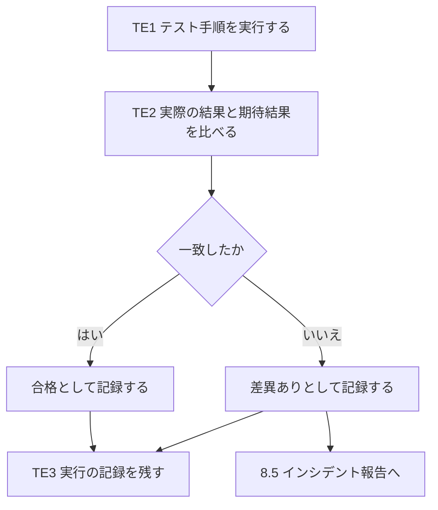

各ノードの意味：

- TE1：テスト環境の上で、手順書どおりに操作する。手順にない操作を足さない
- TE2：画面の表示、データベースの値、ログなど、期待結果で決めた観点で見る
- ひし形「一致したか」：合否の分かれ目
- TE3：合格でも不合格でも必ず記録する。再現や監査の根拠になる
- 差異がある場合は、第6-5節のインシデント報告へ進む

### 6-5　テストインシデント報告プロセス（第8.5節）

#### なぜ必要か

実行で見つかった「期待と違う結果」が、すべて不具合とは限りません。テスト手順の誤り、環境の問題、仕様の解釈違いの場合もあります。報告の前に**原因を切り分ける**ことで、開発者の無駄な調査を減らせます。病院の**問診と初期診断**のようなものです。

#### アクティビティ

2021年版の目次で、2つとも名称を確認できました。

| 略号 | アクティビティ | 内容 | 確認度 |
|------|----------------|------|--------|
| IR1 | テスト結果を分析する（Analyse test results） | 差異の原因を調べ、インシデントとして報告すべきか判断する | ✅ |
| IR2 | インシデント報告を作成・更新する（Create/update incident report） | 再現手順や環境情報をつけて報告し、状況に応じて更新する | ✅ |

この図は、差異が見つかってからインシデント報告が作られ、結果が戻るまでの流れを表しています。

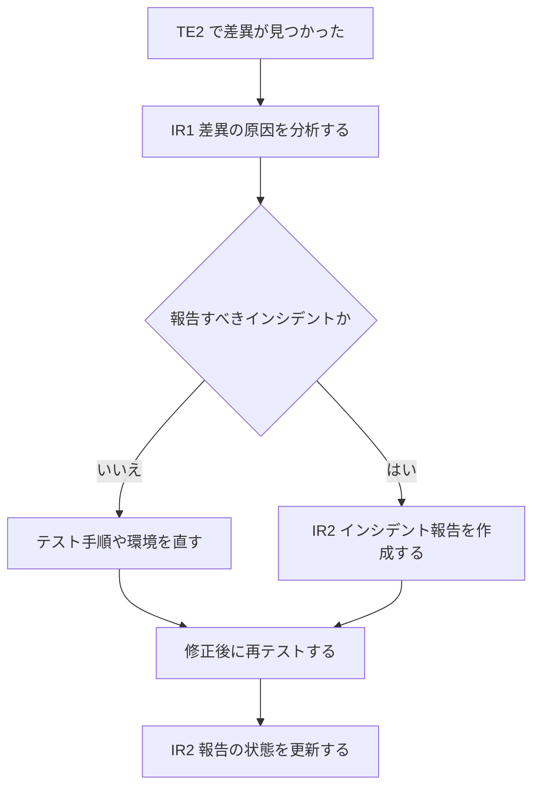

各ノードの意味：

- IR1：テスト手順の誤り、環境の不具合、仕様の解釈ミス、実装の欠陥を切り分ける
- ひし形「報告すべきか」：手順や環境の問題なら、テスト側を直して終わる
- IR2の作成：再現手順、期待結果と実際の結果、環境、ログなどを添える
- 「再テスト」：修正版で、もう一度第6-4節の実行へ戻る
- IR2の更新：解決状況に応じて、報告の内容や状態を更新する

> 29119-2は、インシデントの**管理ライフサイクル全体**（優先度付け、修正担当の割り当てなど）までは扱いません。そこは、IEEEが別規格 ISO/IEC/IEEE 23612:2026（Software and systems engineering — Incident management）として整備しています。

📖 この章で登場した用語

- テストベース：テストを設計するときの根拠にする資料（要求仕様、設計書など）
- テストカバレッジ項目：テストで網羅したいと決めた単位（遷移、条件の組み合わせなど）
- テストケース：入力と期待結果の組
- テスト手順：複数のテストケースを実行する順序と具体的な操作
- スモークテスト：環境や基本機能が最低限動くかを確認する短いテスト
- インシデント：テストで見つかった、期待と実際が食い違う事象。不具合かどうかは分析して決める

---

## 第7章　具体例：ログイン機能で全プロセスをたどる

💡 この章では、「ログイン機能」という身近な題材で、第4〜6章の全プロセスがどうつながるかを通しで確認します。1つの題材で全体を体験することで、用語が実際の作業とどう結びつくかが分かります。

### 7-1　前提となる状況

- 対象：ECサイトの会員ログイン機能
- 仕様：メールアドレスとパスワードで認証する。パスワードを5回連続で間違えると、アカウントを30分ロックする
- 組織：すでに「リリース前に回帰テストを必ず実行する」という共通方針がある

### 7-2　プロセス別の動き

この図は、ログイン機能のテストが各プロセスを通る流れを表しています。

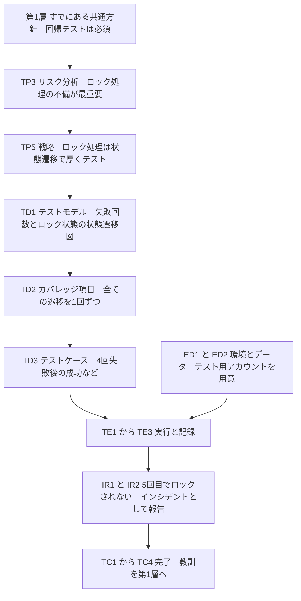

各ノードの意味：

- 第1層：プロジェクトの前から存在する土台
- TP3とTP5：リスクの大きい「ロック処理」に、設計技法（状態遷移）を重点的に適用すると決める
- TD1〜TD3：状態遷移図から遷移を取り出し、具体的な入力列に落とす
- ED1とED2：テスト用アカウントを複数用意する。ロックされると使えなくなるため、アカウントの再利用方法も決める
- TE1〜TE3：実行して結果を記録する
- IR1とIR2：差異が見つかったときの報告
- TC1〜TC4：完了と引き継ぎ

### 7-3　各プロセスの具体的な成果物（対応表）

| プロセス | 具体的な作業 | できあがるもの |
|----------|--------------|----------------|
| 組織テスト（OT） | 既存の「回帰テストは必須」を確認する | 組織テストプラクティス（既存） |
| 計画（TP） | リスクの洗い出し、技法と深さの決定、担当と日程 | テスト計画書 |
| 設計・実装（TD） | 状態遷移図を描き、遷移を取り出し、ケースと手順にする | 状態遷移図、ケース一覧、手順書 |
| 環境・データ（ED） | テスト用環境とアカウント5件を準備 | 環境構成メモ、テストデータ一覧 |
| 実行（TE） | 手順どおりに実行し、結果を記録 | テスト実行記録 |
| インシデント報告（IR） | 差異を分析して報告 | インシデント報告 |
| 監視・制御（TMC） | 実行件数と不具合数を毎日確認 | 進捗報告 |
| 完了（TC） | 資産保管、環境の片付け、教訓整理 | テスト完了報告 |

### 7-4　状態遷移でカバレッジ項目を取り出す例

TD1で作ったモデルを、次の表のように整理したとします。

| 現在の状態 | きっかけ | 次の状態 |
|------------|----------|----------|
| 未ログイン | 正しい認証情報を入力 | ログイン済み |
| 未ログイン | 誤った認証情報を入力（失敗が4回目まで） | 未ログイン（失敗回数が増える） |
| 未ログイン | 誤った認証情報を入力（5回目） | ロック中 |
| ロック中 | 30分が経過 | 未ログイン |
| ロック中 | 正しい認証情報を入力 | ロック中のまま |

この表の5行が、そのまま**カバレッジ項目**（TD2）の候補になります。各行を1回ずつ通すようにケース（TD3）を作り、実行順に並べたものが手順（TD4）です。

📖 この章で登場した用語

- 状態遷移図：状態が、きっかけ（イベント）によってどう移り変わるかを表した図
- ロック：一定の条件でアカウントの利用を一時的に止める仕組み
- カバレッジ：テストが対象のどれだけを確認できているかの度合い
- テスト用アカウント：本番の利用者に影響しない、テスト専用のアカウント

---

## 第8章　関連規格との関係

💡 この章では、29119-2を他の規格とどうつなげて使うかを説明します。実務では、29119-2だけで完結せず、他の規格と組み合わせて使う場面が多いためです。

### 8-1　29119シリーズ内の関係

| パート | 29119-2との関係 |
|--------|-----------------|
| Part 1（一般概念） | 29119-2で使う用語や考え方の土台 |
| Part 3（テスト文書化） | 各プロセスで作る文書のテンプレート。Part 3のテンプレートは、29119-2のプロセス構造に沿って並べられている |
| Part 4（テスト技法） | 29119-2の「テスト設計・実装プロセス」の中で使う技法。**プロセスそのものは記述せず、技法の集まり**を提供する |
| Part 5（キーワード駆動テスト） | 自動化の枠組み。実行プロセスで使われる成果物の共有方法を定める |

### 8-2　他の規格との対応（付録B〜D）

29119-2には、他の規格とプロセスを対応づける**参考情報の付録**があります。

| 付録 | 対応先の規格 | 使いどころ |
|------|--------------|------------|
| 付録B | ISO/IEC/IEEE 12207:2017（ソフトウェアライフサイクルプロセス） | 開発プロセス全体の中にテストを位置づけたいとき |
| 付録C | ISO/IEC 17025:2017（試験所・校正機関の能力に関する要求事項） | 試験所の認定の考え方とテストプロセスを突き合わせたいとき |
| 付録D | BS 7925-2:1998（旧英国規格のソフトウェアコンポーネントテスト） | 旧規格にもとづく手順を、今の規格へ移行したいとき |

### 8-3　プロセス評価・レビューの規格

Wikipediaの整理では、当初、29119の第5部として検討された「プロセス評価」は、最終的にISO/IEC 33063:2015として発行され、29119-2のテストプロセスと結びついています。また、Stuart Reid氏の講演資料は、静的テスト（レビューなど）を扱うISO/IEC 20246を、29119の3層構造と並べて位置づけています。

この図は、29119-2を中心とした周辺規格の関係を表しています。

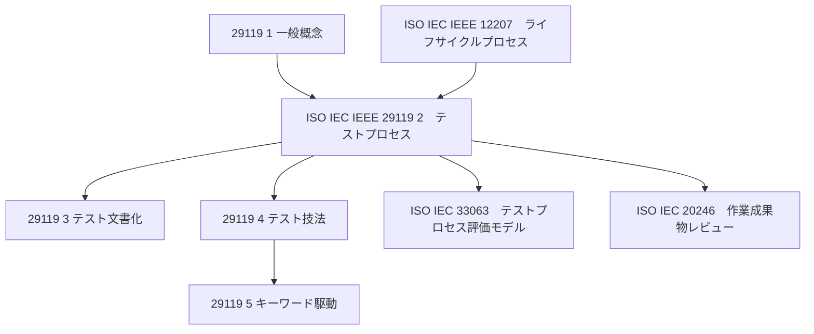

各ノードの意味：

- 29119-1：用語の土台。29119-2が使う
- 29119-3と29119-4：29119-2の構造に沿って、文書と技法を提供する
- 33063：29119-2のプロセスを、どれだけ実践できているかを評価するモデル
- 12207：ソフトウェア全体のライフサイクルの中に、テストプロセスを位置づける
- 20246：動的テスト以外（レビューなど）の静的な活動を扱う

📖 この章で登場した用語

- テンプレート：書式があらかじめ決まっている文書の雛形
- プロセス評価：組織のプロセスの成熟度や実践度合いを測ること
- 静的テスト：プログラムを動かさずに、文書やコードを読んで確認するテスト
- 試験所：製品や材料の試験を行う機関

---

## 第9章　アジャイル・DevOpsでの使い方（筆者の整理）

💡 この章では、「規格はウォーターフォール用の古いものでは？」という疑問に答えます。**この章は規格本文の記述ではなく、筆者の整理**です。規格が示しているのは「どのライフサイクルモデルでも使える」という適用範囲までです。

### 9-1　基本的な考え方

規格はプロセスの**順番を固定しておらず**、各プロセスが必要なときに、必要な範囲で動けばよい構造になっています。つまり、大きな計画書を作ってからテストするのではなく、**短い周期で3層を何度も回す**使い方ができます。工場の「年間生産計画」と「毎日の朝礼」を両方持つようなイメージです。

### 9-2　イテレーションに当てはめる例

この図は、アジャイルの1イテレーションで、29119-2の3層がどう回るかの一例を表しています。

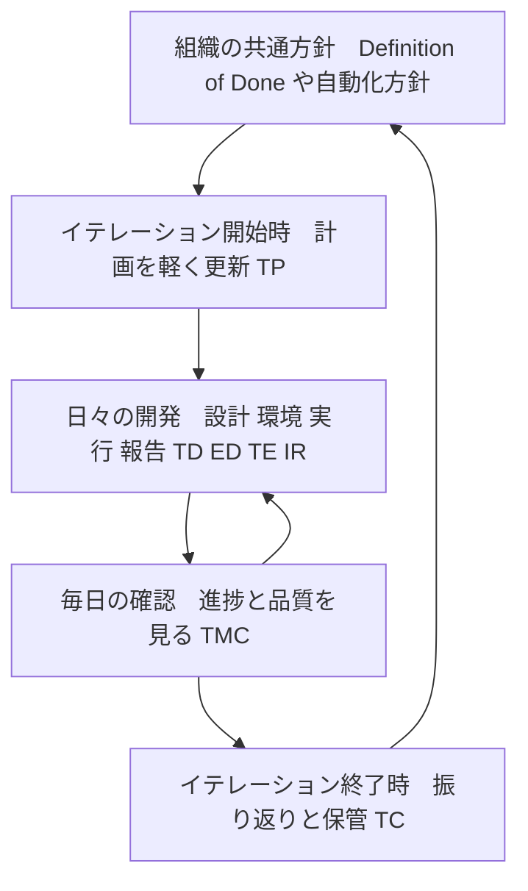

各ノードの意味：

- 「組織の共通方針」：チーム共通の完了の定義や、自動化の方針が、第1層にあたる
- 「イテレーション開始時」：リスクの再確認と、今回の戦略の更新を、軽い形で行う
- 「日々の開発」：第3層が頻繁に回る。自動テストなら、実行と記録はCIが行う
- 「毎日の確認」：デイリースクラムなどが、監視と制御の役目を果たす
- 「イテレーション終了時」：レトロスペクティブ（振り返り）が、教訓の特定にあたる

### 9-3　注意点

- 規格の用語（TP、TDなど）を、チームの会議名や文書名にそのまま当てはめる必要はありません。**対応づけて説明できること**が大切です。
- 自動テストが中心の現場では、「手順の実行」と「結果の記録」（TE1・TE3）がツールにより自動化されます。それでも、**何を確認するかの設計**（TD）と、**失敗を分析する工程**（IR1）は人が担います。

📖 この章で登場した用語

- イテレーション：アジャイルで、数週間程度に区切った開発の1周期
- Definition of Done：作業が完了したと言える条件をチームで決めたもの
- CI：継続的インテグレーション。変更のたびに、自動でビルドとテストを動かす仕組み
- レトロスペクティブ：期間の終わりにチームで行う振り返り

---

## 第10章　評価と批判：この規格をどう受け止めるか

💡 この章では、29119に向けられてきた批判と、その背景を整理します。規格を学ぶ際に、**賛否の両方を知っておく**と、導入を判断する際の視点が増えるためです。

### 10-1　批判の経緯

29119シリーズは、テストコミュニティの一部から強い批判を受けてきました。SD Timesの記事「Software testing schism」は、策定側のStuart Reid氏（WG26のコンビーナ）と、批判側のJames Bach氏（Satisfice創設者）の主張を並べて紹介しています。同記事によると、批判側は「Stop 29119」の署名活動を行い、策定プロセスが開かれた合意にもとづいていたかを疑問視しました。Slashdotの当時のスレッドでも、Michael Bolton氏による「rent-seeking（既得権益の追求）」という指摘や、James Christie氏のCAST 2014での講演などが紹介されています。

なお、これらの議論の中心は**2014年前後**で、当時はシリーズの一部しか発行されていませんでした。2021年版の内容に対する批判そのものではない点に注意してください。

### 10-2　主な論点の整理

| 論点 | 批判側の懸念 | 規格側・擁護側の立場 |
|------|--------------|----------------------|
| 文書化の負担 | テスト担当者の仕事が文書作成になり、探索的な進め方が損なわれる | 規格は、スクリプト化されたテストも、スクリプト化されないテストも対象とする（IEEEの紹介ページより） |
| 合意形成 | 規格の策定に、現場の多様な意見が十分反映されていない | 過去のISO・IEEE規格をもとに、国際的な手続きで策定されたと説明している |
| 規格への適合 | 「適合している」ことが、能力や品質を保証するとは限らない | 規格は能力の保証ではなく、共通の枠組みを提供するものという位置づけ |
| 商業的な影響 | 規格の購入や認証ビジネスにつながる | ― |

### 10-3　初学者への実践的な助言

この規格を使うときは、次の3点を意識すると、批判の指摘を避けやすくなります。

1. **全部を文書にしようとしない**。規格は「プロセスの定義」であって、「すべての文書を書け」という指示ではありません。必要な範囲で絞り込む（テーラリング）ことを前提に読んでください。
2. **「規格に準拠すること」を目的にしない**。目的は、自分のプロジェクトのテストを説明可能にし、抜けを減らすことです。
3. **規格の外にも学びがある**。探索的テストなど、規格が前面に出さない考え方も、現場では有効です。規格を絶対視せず、道具の1つとして使ってください。

📖 この章で登場した用語

- Stop 29119：2014年に始まった、29119の策定中止を求める署名活動
- 探索的テスト：テスト設計と実行を同時に進め、学びながら進めるテスト
- テーラリング：規格を、自分の組織や案件に合わせて取捨選択すること
- rent-seeking：新しい価値を生まずに、既得の立場から利益を得ようとすること

---

## 第11章　学習ロードマップとチェックリスト

💡 この章では、ここまでの内容を実際の学習にどうつなげるかを整理します。自分の理解度を確認する材料としても使ってください。

### 11-1　学習ロードマップ

この図は、初学者が29119-2を身につけるまでのステップを表しています。

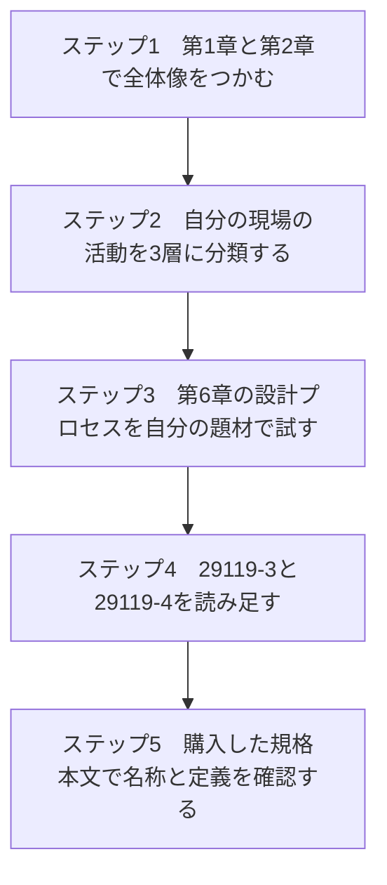

各ノードの意味：

- ステップ1：細かい略号を覚える前に、3層の分担を頭に入れる
- ステップ2：現場の朝会、テスト計画書、障害票などが、どの層のどのプロセスにあたるかを書き出す
- ステップ3：第7章のように、自分の担当機能で、モデル・カバレッジ項目・ケース・手順に分解してみる
- ステップ4：書式はPart 3、技法はPart 4で補う
- ステップ5：🔎マークの項目を、規格本文で確認して、本書の記述を修正する

### 11-2　理解度チェックリスト

- [ ] 3層（組織・マネジメント・動的）の役割を、たとえ話で説明できる
- [ ] 8つのプロセス（6.2、7.2、7.3、7.4、8.2、8.3、8.4、8.5）の名前を言える
- [ ] 2021年版で、テスト条件がテストモデルに置き換わったことを説明できる
- [ ] TD1〜TD4の流れを、旅行の例えで説明できる
- [ ] ED（環境とデータ）が、2021年版で拡張されたことを説明できる
- [ ] テスト実行の結果は、合格でも不合格でも記録する理由を説明できる
- [ ] 差異が必ずしも不具合ではない理由と、IR1の役割を説明できる
- [ ] 完了プロセスの教訓が、組織テストプロセスへ戻る経路を説明できる
- [ ] 29119-3と29119-4が、29119-2とどう関係するかを説明できる
- [ ] 29119への批判と、その背景を、中立的に説明できる

📖 この章で登場した用語

- 分類：現場の活動を、規格のプロセスに当てはめて整理すること
- 現場の言葉への置き換え：規格の用語を、自分のチームが使う言葉に対応づけること

---

## 付録　出典URLと調査メモ

### A-1　出典URL一覧

#### 一次情報（規格の提供元・販売元）

| No. | ソース | URL | 本書で参照した内容 |
|-----|--------|-----|--------------------|
| 1 | ISO 公式ページ | <https://www.iso.org/standard/79428.html> | 版・発行日・ページ数・委員会・要旨・前版・ステージ |
| 2 | IEEE Standards Association（29119-2のカタログ） | <https://standards.ieee.org/ieee/29119-2/7498/> | シリーズの説明、Part 3・4との関係 |
| 3 | IEEE カタログ（Nimonik） | <https://standards.nimonik.com/products/ieee/ieee-iso-iec-29119-2/> | 目的、共通テンプレート（ISO/IEC TR 24774）の使用、動的・機能・非機能・手動・自動テストへの対応 |
| 4 | BSI（英国規格協会）ストア | <https://shop-checkout.bsigroup.com/products/software-and-systems-engineering-software-testing-test-processes-1> | リスクベース、テスト条件からテストモデルへの変更 |
| 5 | 豪州規格協会（2021年版の採用版） | <https://store.standards.org.au/product/as-nzs-iso-iec-ieee-29119-2-2022> | 2021年版の目次（プロセス名、アクティビティ名、付録Aの項目） |
| 6 | 豪州規格協会（2013年版の採用版） | <https://store.standards.org.au/product/as-nzs-iso-iec-ieee-29119-2-2015> | 旧版の目次（旧版との比較） |
| 7 | iTeh Standards（プレビュー） | <https://iteh.eu/catalog/standards/iso/73fff262-e1d4-40f7-8011-c733c462a3b6/iso-iec-ieee-29119-2-2021> | 付録B〜D、序文の変更点 |
| 8 | ANSI Webstore（プレビュー） | <https://webstore.ansi.org/preview-pages/ISO/preview_ISO+IEC+IEEE+29119-2-2021.pdf> | 目次（章構成） |

#### 解説・専門家の資料

| No. | ソース | URL | 本書で参照した内容 |
|-----|--------|-----|--------------------|
| 9 | Wikipedia：ISO/IEC 29119 | <https://en.wikipedia.org/wiki/ISO/IEC_29119> | シリーズ構成と発行時期、33063との関係、Part 3の文書一覧 |
| 10 | Stuart Reid氏の講演資料（2015年、NIPA） | <https://www.slideshare.net/slideshow/55th/50236180> | 3層構造（Organizational / Test Management / Dynamic）、ISO/IEC 33063・20246との関係 |
| 11 | SD Times「Software testing schism」 | <https://sdtimes.com/software-testing-schism/> | Stuart Reid氏とJames Bach氏の論争、Stop 29119の経緯 |
| 12 | Slashdot「Can ISO 29119 Software Testing "Standard" Really Be a Standard?」 | <https://developers.slashdot.org/story/14/09/03/1411216/can-iso-29119-software-testing-standard-really-be-a-standard> | Michael Bolton氏、James Christie氏、Gil Zilberfeld氏らの批判・見解（2014年） |
| 13 | ISO/IEC/IEEE 29119 勉強会（日本語スライド） | <https://www.slideshare.net/slideshow/isoiecieee-29119-3/47498586> | 組織テストプロセスとマネジメントプロセスの関係図 |
| 14 | 学術概説「Overview of Software Testing Standard ISO/IEC/IEEE」 | <https://www.academia.edu/42117254/Overviewof_Software_Testing_Standard_ISOIECIEEE> | 3層の相互関係の概説 |

### A-2　調査で確認できなかったこと（正直なメモ）

| 項目 | 内容 |
|------|------|
| 規格本文 | 有償であり、ISOは本文のAI利用を認めていないため、本文は参照していません（別途締結したライセンスでAI利用が明示的に許可されている場合は、この制限は適用されません。本書の作成にあたっては、そのようなライセンスを利用していません）。アクティビティの定義や、タスクの詳細は、目次・紹介ページ・解説資料から再構成しています。 |
| 🔎マークの項目 | OT1〜OT3、TP1〜TP4・TP6・TP8・TP9、TMC1〜TMC4、TC3は、2013年版の目次と一般的な理解にもとづきます。2021年版の本文で、名称や数が変わっていないか確認してください。 |
| 著名な国際的実践者の解説 | 29119-2のプロセスを詳細に解説した、著名な開発者・実践者の個人ブログは、今回の検索では十分に見つかりませんでした。代わりに、策定側のStuart Reid氏の資料と、批判側（James Bach氏、Michael Bolton氏ら）の議論を、二次報道を通じて参照しています。2021年版に絞った批判や評価は、確認できていません。 |
| 第9章 | アジャイルへの当てはめは、規格の記述ではなく筆者の整理です。 |

### A-3　次に読むと理解が深まる資料

| 目的 | 読むもの |
|------|----------|
| 文書の書式を知りたい | ISO/IEC/IEEE 29119-3:2021（テスト文書化） |
| 設計技法を知りたい | ISO/IEC/IEEE 29119-4:2021（テスト技法） |
| 用語を正確に知りたい | ISO/IEC/IEEE 29119-1:2022（一般概念） |
| 自動化の枠組みを知りたい | ISO/IEC/IEEE 29119-5:2024（キーワード駆動テスト） |
| プロセスの成熟度を測りたい | ISO/IEC 33063:2015 |

---

*本書はISO/IEC/IEEE 29119-2:2021の公開情報にもとづく学習用の解説であり、規格本文の代替ではありません。正式な要求事項や用語の定義は、ISOまたはIEEEから入手した規格本文で確認してください。*
