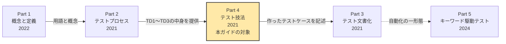
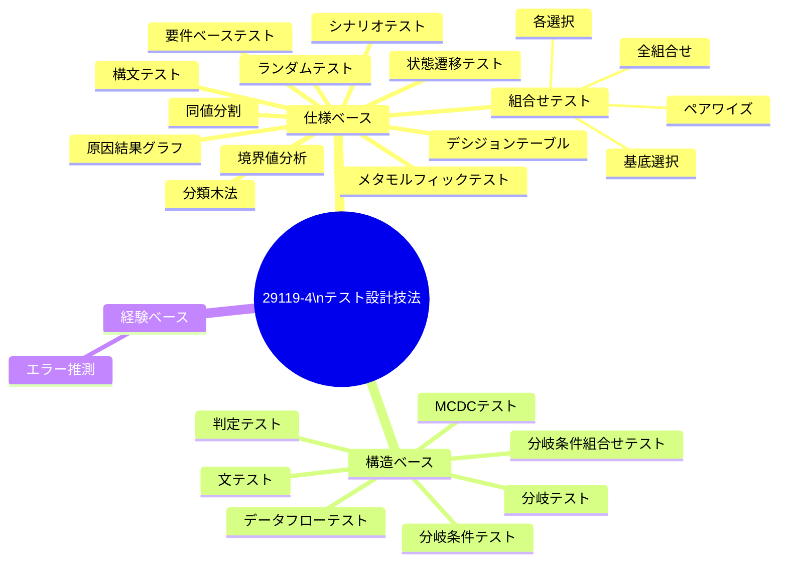
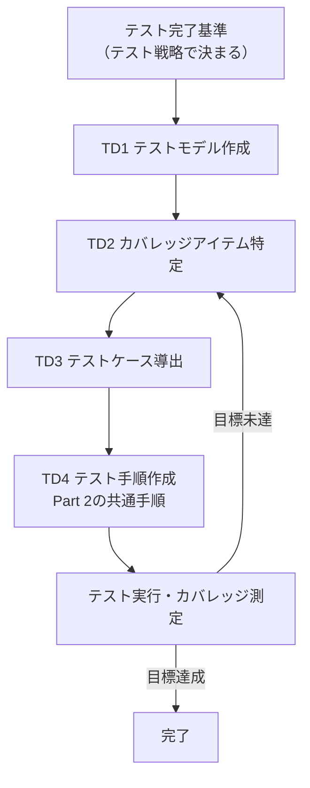
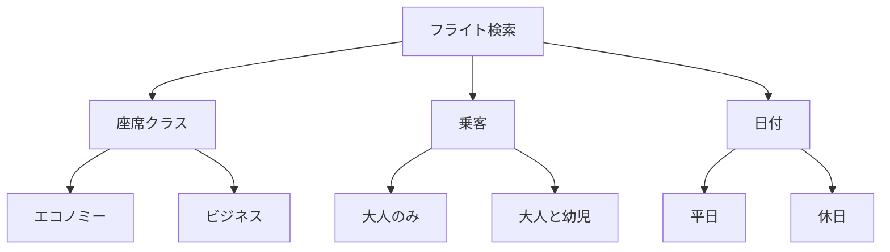
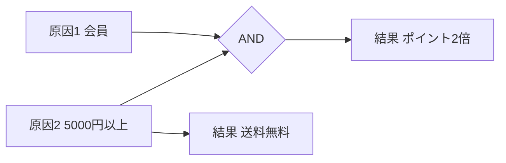
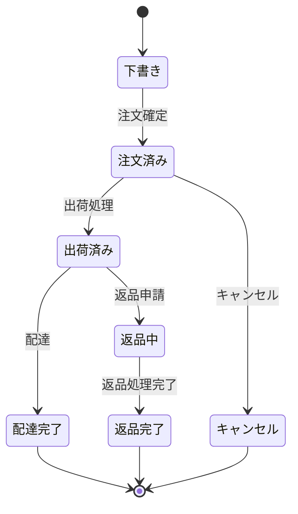
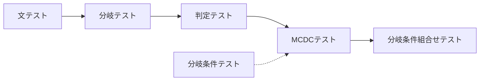
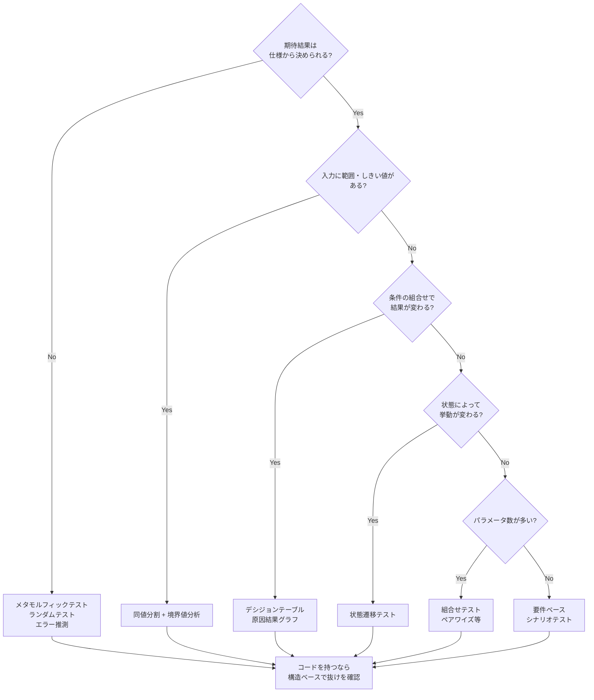
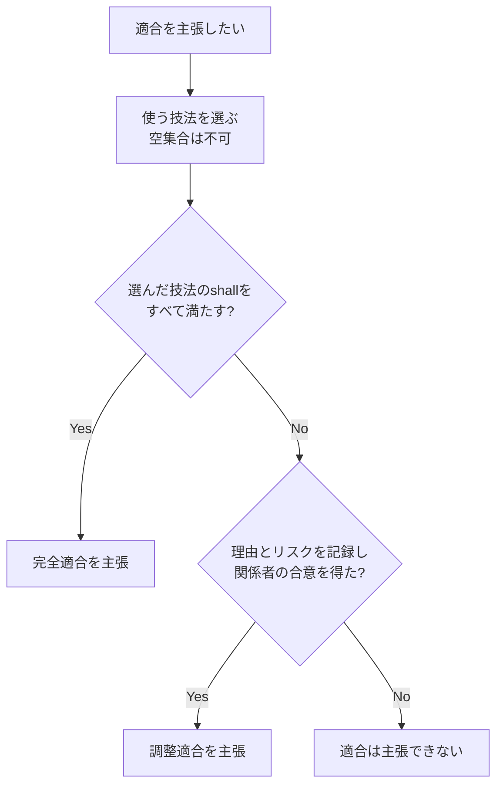

# ISO/IEC/IEEE 29119-4:2021 テスト技法 ― 初学者向けステップバイステップ解説

> **対象規格**: ISO/IEC/IEEE 29119-4:2021 *Software and systems engineering — Software testing — Part 4: Test techniques*（第2版）
> **調査日**: 2026年10月4日（依頼の基準日: 9月28日時点の公開情報）
> **想定読者**: テストを学び始めたQAエンジニア、開発者、ISTQB学習者
> **この文書の位置づけ**: 規格の有償本文は転載せず、公開されている目次・要旨・定義の概要と、著名な実務家・公的機関の資料をもとに、筆者が自分の言葉で再構成した学習ガイドです。厳密な「shall要求」や図表番号は必ず原典で確認してください。

---

## 目次

1. [Step 0: 規格の基本情報](#step-0-規格の基本情報)
2. [Step 1: 全体像をつかむ](#step-1-全体像をつかむ)
3. [Step 2: 技法に共通する3つの作業 TD1〜TD3](#step-2-技法に共通する3つの作業-td1td3)
4. [Step 3: 仕様ベース技法（12種類）](#step-3-仕様ベース技法12種類)
5. [Step 4: 構造ベース技法（7種類）](#step-4-構造ベース技法7種類)
6. [Step 5: 経験ベース技法（1種類）](#step-5-経験ベース技法1種類)
7. [Step 6: テストカバレッジ測定（第6章）](#step-6-テストカバレッジ測定第6章)
8. [Step 7: 技法の選び方](#step-7-技法の選び方)
9. [Step 8: 適合性（Conformance）の考え方](#step-8-適合性conformanceの考え方)
10. [Step 9: 附属書の使い方](#step-9-附属書の使い方)
11. [Step 10: 実務での注意点と批判的視点](#step-10-実務での注意点と批判的視点)
12. [演習問題](#演習問題)
13. [用語集](#用語集)
14. [参考ソースURL](#参考ソースurl)

---

## Step 0: 規格の基本情報

| 項目 | 内容 |
|---|---|
| 規格番号 | ISO/IEC/IEEE 29119-4:2021 |
| タイトル | Software testing — Part 4: Test techniques（テスト技法） |
| 版 | 第2版（2015年版を置き換え） |
| 発行 | 2021年10月（ISOの規格ページでは 2021-10-28 を発行日とするステージ 60.60 と表示。他の販売サイトでは27日・29日表記もあり、日付は掲載元で1〜2日の差がある） |
| ページ数 | 135ページ |
| 担当委員会 | ISO/IEC JTC 1/SC 7（Software and systems engineering） |
| ステータス | 公開状態: Published（現行）／ライフサイクル段階: 90.20（International Standard under systematic review、定期見直し中）。2026年10月4日時点のISOページでは、改訂中・廃止を示す表示は確認できなかった |
| 前版 | ISO/IEC/IEEE 29119-4:2015（Withdrawn） |
| ベース | 英国規格 BS 7925-2 を元にしている |

### 規格が定めていること（要旨を言い換え）

この規格は、**テスト設計と実装のプロセス（29119-2で定義）の中で使える「テスト設計技法」を定義**するものです。想定読者はテスター、テストマネージャ、開発者です。

### 規格が「定めていないこと」

初学者が誤解しやすい点です。序文によると次のとおりです。

| 定めていないこと | 代わりに見る場所 |
|---|---|
| テストの進め方（プロセス全体） | 29119-2 |
| テストケースの書式・ID・優先度・トレーサビリティの付け方 | 29119-3 |
| 探索的テストやモデルベーステストといった「実践（practice）」 | 29119-1 |
| 全ての技法の網羅（この技法集は網羅的ではないと明記されている） | ― |

---

## Step 1: 全体像をつかむ

### 1-1. 29119シリーズの中での位置づけ



要点は「**Part 2がプロセスの骨組み、Part 4がその骨組みの中で使う道具箱**」という関係です。

### 1-2. 技法の3分類

規格は技法を次の3つに分類します。

| 分類 | 設計の主な情報源 | 別名 |
|---|---|---|
| 仕様ベース（specification-based） | 要件、仕様書、モデル、ユーザーニーズなどのテストベース | ブラックボックス |
| 構造ベース（structure-based） | ソースコードやモデルの構造 | ホワイトボックス（クリアボックス） |
| 経験ベース（experience-based） | テスターの知識と経験 | ― |

また、仕様と構造の両方の知識を組み合わせて使う場合は**グレーボックス**と呼ばれます。規格は、3分類は「互いに補完し合い、組み合わせるほうが効果的」としています。さらに、分類は絶対ではなく、たとえば分岐テスト（構造ベース）をWeb画面の仕様に適用することもできます（附属書Eで例示）。

### 1-3. 規格に載っている技法の一覧



### 1-4. 2021年版での主な変更点

規格の序文は、第2版の主な変更点として次の1点を挙げています。

- **「テスト条件（test condition）」を廃止し、「テストモデル（test model）」を使う形に変更した**。旧版の利用者から「テスト条件の意味と、そこからテストケースを導く方法が分かりにくい」というフィードバックがあったためです。詳細は附属書Hで解説されています。

> 補足: 旧版（2015年版）の目次プレビューと見比べると、2021年版の目次にはメタモルフィックテストと要件ベーステストが載っています。私が確認できた範囲の2015年版プレビューでは両者は確認できませんでしたが、プレビューは目次の一部しか見えないため、「追加された」と断定したい場合は両版の目次全体で確認してください。

---

## Step 2: 技法に共通する3つの作業 TD1〜TD3

### 2-1. 29119-2のテスト設計・実装プロセスとの関係

29119-2では、テスト設計と実装は4つの活動で構成されます。そのうち、**技法ごとに固有のやり方が必要なのは最初の3つ**で、これを29119-4が詳しく定義します。

| 記号 | 活動 | 29119-4での扱い |
|---|---|---|
| TD1 | テストモデルを作る（create test model） | 技法ごとに定義 |
| TD2 | テストカバレッジアイテムを特定する（identify test coverage items） | 技法ごとに定義 |
| TD3 | テストケースを導出する（derive test cases） | 技法ごとに定義 |
| TD4 | テスト手順を作る（create test procedures） | どの技法でも同じなので、第5〜6章では扱わない |



### 2-2. 3つの用語を日常の例えで理解する

| 用語 | 規格での意味（言い換え） | たとえ話：ラーメン屋の味チェック |
|---|---|---|
| テストモデル | テスト対象の、注目したい性質を表した表現。要件文、同値クラス、状態遷移図、決定表、制御フローグラフ、ソースコードなど | メニュー表（何を確認すべきかの一覧） |
| カバレッジアイテム | テストモデルの中で「テストで踏める」要素 | メニュー表の各行（醤油、味噌、塩…） |
| テストケース | 事前条件、入力、期待結果の組 | 「醤油ラーメンを注文して、スープが熱いことを確認する」という1回の確認 |

### 2-3. 具体例：状態遷移テストの場合

規格の序文にある考え方を、私の例に置き換えます。「すべての状態を踏む」というテスト完了基準が戦略で決まったとします。

1. TD1: 対象の**状態モデル**（状態一覧と遷移）を作る。これがテストモデル。
2. TD2: モデルから**各状態**をカバレッジアイテムとして洗い出す。
3. TD3: すべての状態を通るような**テストケース**（入力操作の列と期待結果）を作る。

つまり、テストモデルは**テスト完了基準に応じて選ぶ**のがポイントです。「全状態」なら状態の一覧で足りますが、「全遷移」なら遷移まで書いたモデルが要ります。

---

## Step 3: 仕様ベース技法（12種類）

ここからが規格の中心です。各技法を、**何をモデルにして（TD1）、何を数えて（TD2）、どうテストにするか（TD3）**の順に説明します。

### 3-0. 一覧表

| 節 | 技法 | カバレッジアイテム（典型例） | 向いている場面 |
|---|---|---|---|
| 5.2.1 | 同値分割 | 同値クラス | 入力・出力の値を整理したいとき |
| 5.2.2 | 分類木法 | 分類木のクラス | 入力の観点が多く階層的なとき |
| 5.2.3 | 境界値分析 | 境界値 | 範囲・しきい値のあるロジック |
| 5.2.4 | 構文テスト | 入力の形式定義の要素 | 入力フォーマットが形式的に定義できるとき |
| 5.2.5 | 組合せテスト | パラメータと値のペア（P-V pair）など | パラメータが多く組合せが爆発するとき |
| 5.2.6 | デシジョンテーブル | 決定規則（ルール） | 条件の組合せで結果が変わる業務ルール |
| 5.2.7 | 原因結果グラフ | 原因結果グラフ上の決定規則 | 条件の論理関係が複雑なとき |
| 5.2.8 | 状態遷移テスト | 状態・遷移 | 状態によって挙動が変わるとき |
| 5.2.9 | シナリオテスト | 他システム（ユーザー含む）との相互作用の列 | エンドツーエンドの流れの確認 |
| 5.2.10 | ランダムテスト | ランダムに選んだ入力 | 手作業で網羅しにくい入力空間 |
| 5.2.11 | メタモルフィックテスト | 既存テストと変換関係（メタモルフィック関係） | 期待結果（オラクル）を決めにくいとき |
| 5.2.12 | 要件ベーステスト | 原子的な要件 | 要件の充足を一つずつ確認したいとき |

---

### 3-1. 同値分割（Equivalence Partitioning）

**考え方**: 「システムが同じように扱うはずの入力の集まり」（同値クラス）に分け、各クラスから代表を選びます。同じクラスの値は全部試さなくてよい、という発想です。

**例題: 会員年齢で料金が変わる**

| 同値クラス | 範囲 | 扱い |
|---|---|---|
| 無効（負） | −1以下 | エラー |
| 子供 | 0〜12 | 子供料金 |
| 大人 | 13〜64 | 通常料金 |
| シニア | 65〜120 | シニア料金 |
| 無効（上限超過） | 121以上 | エラー |

テストケースは各クラスから1つずつ、たとえば次の5つで、**同値クラスカバレッジ100%**になります。

| TC | 年齢 | 期待結果 |
|---|---|---|
| EP-1 | −5 | エラー |
| EP-2 | 6 | 子供料金 |
| EP-3 | 30 | 通常料金 |
| EP-4 | 80 | シニア料金 |
| EP-5 | 200 | エラー |

### 3-2. 分類木法（Classification Tree Method）

**考え方**: 入力データを「分類（観点）」と「クラス（値の種類）」の階層木で表します。木のクラスの組合せでテストケースを作ります。



「座席クラス」「乗客」「日付」が分類、その下の箱がクラスです。木の下に表を描き、各テストケースがどのクラスを選ぶかに印をつけます。同値分割を、観点が多い場合に見やすく整理する道具と捉えると理解しやすいです。

### 3-3. 境界値分析（Boundary Value Analysis）

**考え方**: 同値クラスの**境界**を狙います。境界付近は「以上」と「超過」の取り違えなどのバグが出やすいためです。

規格の定義では、境界値分析は「同値クラスの境界を試す技法」です。実務では、1つの境界について**2値**（境界とその外側の隣）または**3値**（境界とその両隣）で試す流儀がよく使われます。

同じ年齢の例で、**2値**の場合のテスト値は次の8個です。

| 境界 | テスト値 | 期待結果 |
|---|---|---|
| 無効（負）と子供 | −1 / 0 | エラー / 子供料金 |
| 子供と大人 | 12 / 13 | 子供料金 / 通常料金 |
| 大人とシニア | 64 / 65 | 通常料金 / シニア料金 |
| シニアと無効（上限超過） | 120 / 121 | シニア料金 / エラー |

**3値**にするなら、各境界の「その値と両隣」を使うので、たとえば子供/大人の境界は 11・12・13 や 12・13・14 のように考えます（どの流儀を使うかは組織で決めておく）。

```python
def fare_category(age: int) -> str:
    if age < 0 or age > 120:
        return "error"
    if age <= 12:
        return "child"
    if age <= 64:
        return "adult"
    return "senior"

# 2値境界値分析のテスト
import pytest

@pytest.mark.parametrize("age,expected", [
    (-1, "error"), (0, "child"),
    (12, "child"), (13, "adult"),
    (64, "adult"), (65, "senior"),
    (120, "senior"), (121, "error"),
])
def test_fare_category_boundaries(age, expected):
    assert fare_category(age) == expected
```

### 3-4. 構文テスト（Syntax Testing）

**考え方**: 入力の形式が**形式的な定義**（規格ではBackus-Naur Form＝BNFが例示）で書けるとき、その定義の各要素を踏むようにテストします。

```text
<date>   ::= <year> "-" <month> "-" <day>
<year>   ::= <digit><digit><digit><digit>
<month>  ::= "0"<d1to9> | "1"("0"|"1"|"2")
<day>    ::= "0"<d1to9> | ("1"|"2")<digit> | "3"("0"|"1")
<digit>  ::= "0" | <d1to9>
<d1to9>  ::= "1" | "2" | "3" | "4" | "5" | "6" | "7" | "8" | "9"
```

このBNFから、(1) 正しい形式の例、(2) 規則を1か所だけ破った例（ハイフンなし、月が13、など）を作ります。パーサー、ファイル形式、API入力の検証に向きます。

> 注意: この `<day>` 規則は「02-31」のような暦上存在しない日付も生成します。この例が検証するのは**日付文字列の書式**だけです。実在する日付かどうかも扱う場合は、月ごとの日数や閏年の判定を、構文テストとは別の検証（同値分割・境界値分析など）で確認してください。

### 3-5. 組合せテスト（Combinatorial Test Design Techniques）

**考え方**: 複数のパラメータの値の組合せを、**全部ではなく賢く選ぶ**技法群です。規格はカバレッジアイテムとして**P-Vペア（パラメータと値の組）**を使い、技法の例として次の4つを挙げます。

| 技法 | 内容 | テスト数の目安 |
|---|---|---|
| 全組合せ（all combinations） | すべての組合せ | 最大。爆発しやすい |
| ペアワイズ（pair-wise） | 任意の2パラメータの値の組をすべて網羅 | 少ない |
| 各選択（each choice） | 各パラメータの各値が少なくとも1回出る | 最小クラス |
| 基底選択（base choice） | 標準値を基準に、1パラメータずつ変える | パラメータ数に比例 |

**例題**: OS（Windows / macOS / Linux）× ブラウザ（Chrome / Firefox / Safari）× 言語（ja / en）

全組合せは3×3×2＝18通りですが、ペアワイズなら次の9通りで、**どの2パラメータの組も少なくとも1回は出現**します。

| TC | OS | ブラウザ | 言語 |
|---|---|---|---|
| 1 | Windows | Chrome | ja |
| 2 | Windows | Firefox | en |
| 3 | Windows | Safari | ja |
| 4 | macOS | Chrome | en |
| 5 | macOS | Firefox | ja |
| 6 | macOS | Safari | en |
| 7 | Linux | Chrome | ja |
| 8 | Linux | Firefox | en |
| 9 | Linux | Safari | ja |

> 補足: 実際のペアワイズ生成では、PICTなどのツールを使うのが一般的です。ここでは手計算で検証できる小さな例にしています。なお、組合せ網羅は「制約（この組合せは存在しない）」の扱いが実務のカギになります。

### 3-6. デシジョンテーブルテスト（Decision Table Testing）

**考え方**: 条件（原因）と動作（結果）の組合せを表にし、**各列（決定規則）を1テストにする**技法です。

**例題: 送料ルール**

| 条件・動作 | R1 | R2 | R3 | R4 |
|---|---|---|---|---|
| 会員である | Y | Y | N | N |
| 購入額が5,000円以上 | Y | N | Y | N |
| **送料無料** | ○ | × | ○ | × |
| **ポイント2倍** | ○ | × | × | × |

4つの規則＝4つのテストケース。決定規則カバレッジ100%になります。条件が増えると列が指数的に増えるので、実務では「結果が変わらない条件は『−（無関係）』にまとめる」縮約を行います。

### 3-7. 原因結果グラフ（Cause-Effect Graphing）

**考え方**: 原因（入力の真偽）と結果（出力）の論理関係を**グラフ**で描き、そこから決定規則を導きます。デシジョンテーブルと目的は同じですが、**条件間の論理関係が複雑なとき**にグラフで整理してからテーブルに落とし込めます。



### 3-8. 状態遷移テスト（State Transition Testing）

**考え方**: 状態と遷移（イベント・条件・動作）のモデルから、**状態や遷移を踏む**ようにテストします。

**例題: 注文ステータス**



典型的な完了基準と必要なテストの違いは次のとおりです。

| カバレッジ基準 | カバレッジアイテム | この例での数 |
|---|---|---|
| すべての状態 | 状態 | 7（下書き・注文済み・出荷済み・配達完了・返品中・返品完了・キャンセル） |
| すべての遷移（0-switch） | 実状態間の有効な単一遷移 | 6（開始・終了の疑似状態 `[*]` との矢印は数えない） |

「無効な遷移（例: 下書きから出荷済みへ）が拒否されること」の確認は、状態表（state table）を使うと漏れにくくなります。

### 3-9. シナリオテスト（Scenario Testing）

**考え方**: テスト対象と**他のシステム（ユーザー含む）との相互作用の流れ**をテストします。規格では、ユーザーも「他のシステム」の一種として扱います。

| 流れ | 例 |
|---|---|
| 主シナリオ | ログイン → 商品検索 → カート追加 → 決済 → 注文完了メール |
| 代替シナリオ | 決済失敗 → 別カードで再試行 |
| 例外シナリオ | 在庫切れによるカート更新 |

同値分割で得た入力値を、シナリオの各ステップの入力に使うといった**組み合わせ利用**も規格が示す考え方です。

### 3-10. ランダムテスト（Random Testing）

**考え方**: 入力空間から**無作為に**入力を選んでテストします。偏りを避けられる一方、期待結果をどう判定するか（オラクル）が課題です。次のメタモルフィックテストとの相性が良い技法です。

```python
import random
from collections import Counter

def insertion_sort(xs: list[int]) -> list[int]:
    """テスト対象のソート実装（例）"""
    result: list[int] = []
    for x in xs:
        i = len(result)
        while i > 0 and result[i - 1] > x:
            i -= 1
        result.insert(i, x)
    return result

def test_insertion_sort_properties():
    for _ in range(1000):
        xs = [random.randint(-100, 100) for _ in range(random.randint(0, 50))]
        out = insertion_sort(xs)   # テスト対象をランダム入力で呼び出す
        # 性質（オラクル）を使って判定
        assert all(a <= b for a, b in zip(out, out[1:]))  # 昇順である
        assert Counter(out) == Counter(xs)                # 要素が欠落・増加していない
```

### 3-11. メタモルフィックテスト（Metamorphic Testing）

**考え方**: 正解を直接決めにくいとき、**「入力をこう変えれば出力はこう変わるはず」という関係（メタモルフィック関係）**を使い、既存のテストケースから新しいテストケースを生成します。

| 対象 | メタモルフィック関係の例 |
|---|---|
| 検索機能 | 検索語に絞り込み条件を足すと、結果件数は増えない |
| 三角関数の実装 | sin(x) と sin(π − x) は同じ値になる |
| 機械学習の画像分類 | 画像を少し明るくしても、分類結果は変わらない |
| 経路探索 | 出発地と目的地を入れ替えても、距離は（道路が双方向なら）同じ |

AI・MLシステムのテストで注目度が高い技法ですが、規格では仕様ベース技法の1つとして位置づけられています。

### 3-12. 要件ベーステスト（Requirements-Based Testing）

**考え方**: 要件を、これ以上分割できない**原子的な要件**に分解し、それぞれに対してテストを作ります。

| 元の要件 | 原子的な要件への分解 |
|---|---|
| 「ユーザー登録では氏名とメールを保存し、重複メールは拒否する」 | R1 氏名を保存する / R2 メールを保存する / R3 重複メールを拒否する |

カバレッジアイテムは原子的な要件で、「全要件に少なくとも1つテストがある」状態がカバレッジ100%です。

---

## Step 4: 構造ベース技法（7種類）

ソースコード（またはモデル）の**制御フロー**を材料にします。ここでは次の小さな関数を共通の題材にします。

```python
def grant_access(is_admin: bool, is_active: bool, has_token: bool) -> bool:
    if is_admin and (is_active or has_token):   # ← 判定（decision）
        return True                              # ← 文（statement）
    return False
```

### 4-0. 用語の整理

| 用語 | 意味（規格の定義を言い換え） | 上の例 |
|---|---|---|
| 条件（condition） | 論理演算子を含まない真偽式 | `is_admin`、`is_active`、`has_token` |
| 判定（decision） | 条件を論理演算子でつないだ式 | `is_admin and (is_active or has_token)` |
| 判定結果（decision outcome） | 判定の結果で、実行される分岐が決まる | True / False |

### 4-1. 技法の強さの順序



> 補足: 「強さ」はおおむね、より多くのテストでより細かく確認するという意味です。ただし図は目安で、厳密な包含関係の証明ではありません。厳密な関係は原典と、後述のNASAチュートリアルのような解説で確認してください。

### 4-2. 文テスト（Statement Testing）

**カバレッジアイテム**: 実行可能文。**すべての文を1回は実行する**ことを目指します。

例題で `grant_access(True, True, False)` の1ケースだけで `return True` は実行できますが、`return False` に届かないので、もう1ケース（`False, ...`）が必要です。文カバレッジの限界を示す古典的な例が次です。

```python
def f(x):
    y = 0
    if x > 0:
        y = 1
    return y
```

`f(1)` だけだと**文カバレッジは100%**ですが、`if` が偽になる経路は一度も試されません。つまり**分岐カバレッジは50%**です。ACCU Conference 2023 の講演資料にも、同様に「文カバレッジ100%でも判定カバレッジ50%」となる例が載っています。

### 4-3. 分岐テスト（Branch Testing）と判定テスト（Decision Testing）

- **分岐テスト**: 制御フローの**分岐（枝）**をすべて通す。
- **判定テスト**: 各判定の**結果（真・偽）**をすべて出す。

初学者向けには「if文の真と偽の両方を通す」と覚えれば十分で、2つの技法は多くの場合同じテストセットで満たされます。例題は次の2ケースで両方満たせます。

| TC | is_admin | is_active | has_token | 判定結果 |
|---|---|---|---|---|
| D-1 | True | True | False | True |
| D-2 | False | False | False | False |

### 4-4. 分岐条件テスト（Branch Condition Testing）

**各条件が真・偽の両方の値をとり、かつ判定結果も両方出る**ようにします。例題のコードは Python なので `and` / `or` は短絡評価され、結果が確定した時点で後続の条件は評価されません。評価されなかった条件（表の「−」）はカバレッジに数えないため、例題には次の4ケースが必要です。

| TC | is_admin | is_active | has_token | 判定結果 |
|---|---|---|---|---|
| BC-1 | True | True | −（評価されない） | True |
| BC-2 | True | False | True | True |
| BC-3 | True | False | False | False |
| BC-4 | False | −（評価されない） | −（評価されない） | False |

- is_admin: BC-1〜3 で True、BC-4 で False
- is_active: BC-1 で True、BC-2・BC-3 で False
- has_token: BC-2 で True、BC-3 で False

> 注意: これで全条件が真・偽を取り、判定結果も真・偽を取りますが、**各条件が結果に与える影響は確認できていません**。それを確認するのがMCDCです。

### 4-5. 分岐条件組合せテスト（Branch Condition Combination Testing）

判定中の**条件の真偽の全組合せ**を試します。3条件なら 2³＝8ケースです。条件数が増えると指数的に増える（10条件で1,024ケース）ため、実務で全面的に採用されることは少なく、条件が少ない重要な判定に限定して使います。

### 4-6. MCDCテスト（Modified Condition/Decision Coverage）

**考え方**: **各条件が、他の条件を固定したまま、それだけで判定結果を変えられる**ことを示します。航空ソフトウェアの認証基準DO-178Bのレベル最上位（Level A）で要求されることで知られ、NASAの実践チュートリアル（Hayhurstほか、2001）が広く参照されています。

例題 `is_admin and (is_active or has_token)` では、**n個の条件に対して最小 n+1 ケース**、ここでは4ケースで足ります。

| TC | is_admin (A) | is_active (B) | has_token (C) | 判定結果 |
|---|---|---|---|---|
| M-1 | True | True | False | True |
| M-2 | False | True | False | False |
| M-3 | True | False | False | False |
| M-4 | True | False | True | True |

各条件の「独立影響」を示すペアは次のとおりです。

| 条件 | 使うペア | 変化 | 判定結果の変化 |
|---|---|---|---|
| A: is_admin | M-1 と M-2 | Aだけ True → False（B、Cは同じ） | True → False |
| B: is_active | M-1 と M-3 | Bだけ True → False（A、Cは同じ） | True → False |
| C: has_token | M-3 と M-4 | Cだけ False → True（A、Bは同じ） | False → True |

**3つの技法のテスト数の比較**

| 技法 | この例でのテスト数 |
|---|---|
| 判定テスト | 2 |
| 分岐条件テスト（短絡評価を考慮） | 4 |
| MCDCテスト | 4（n+1） |
| 分岐条件組合せテスト | 8（2ⁿ） |

> 現場の注意: 一部のカバレッジツールは、MC/DCの厳密な解釈を使わず、実際には満たしていないのに100%と表示することがあると指摘されています（Wikipedia「Modified condition/decision coverage」の記述）。認証目的では、ツールの適格性評価とレビューが必要です。

### 4-7. データフローテスト（Data Flow Testing）

**考え方**: 変数が**定義される場所**（data definition）と、その値が**使われる場所**（data use）のペア（definition-use pair）を網羅します。使用には、計算に使う **c-use** と、判定に使う **p-use** があります。

```python
def price(qty, unit):
    total = qty * unit          # total の定義(def)
    if total > 1000:            # total の p-use
        total = total * 0.9     # total の c-use と、新しい total の定義
    return total                # total の c-use
```

規格はこの技法群の例として、all-definitions、all-c-uses、all-p-uses、all-uses、all-du-pathsを挙げています。「定義した値が一度も使われない」「定義前に使う」といった**変数まわりの不具合**に強い技法です。

---

## Step 5: 経験ベース技法（1種類）

### 5-1. エラー推測（Error Guessing）

**考え方**: テスターの経験や、過去の欠陥データから**「ここは壊れやすい」という箇所を推測**してテストを作ります。

規格の用語定義では、経験ベーステストにはテスト攻撃（test attacks）、ツアー、**エラー分類（error taxonomy）**といった考え方が含まれ得るとされています。

| ステップ | 内容 | 例 |
|---|---|---|
| 1 | 欠陥のリストを作る | 過去の障害票、社内のバグ分類、チェックリスト |
| 2 | リストの各項目に対応するテストを設計する | 「空文字」「超長文」「絵文字」「全角半角混在」 |
| 3 | 実行し、結果を記録する | |

**よくある入力の「壊し方」の例**

| 種類 | 例 |
|---|---|
| 空・欠損 | 空文字、null、未入力 |
| 極端な長さ | 1文字、上限+1文字、10万文字 |
| 特殊文字 | 引用符、改行、絵文字、サロゲートペア |
| 日時 | うるう日、月末、タイムゾーン境界、サマータイム切替 |
| 同時実行 | ダブルクリック、二重送信、同時更新 |

> 規格の序文は、**探索的テスト**そのものはこの文書では定義せず（29119-1で扱う）、この文書が定義するのはテストケースの設計技法であると明記しています。探索的テストの中でエラー推測や他の技法を使う、という関係です。

---

## Step 6: テストカバレッジ測定（第6章）

### 6-1. 基本の考え方

第6章は、**各技法に対応するカバレッジの測り方**を定義します。カバレッジアイテムを定義できる技法では、基本は次の式です。

**カバレッジ（%）＝ テストで実際に踏んだカバレッジアイテム数 ÷ 全カバレッジアイテム数 × 100**

> 適用上の注意: この式は、カバレッジアイテムを数えられ、かつ計算方法が合意されている技法に限って使えます。29119-4では、構文テスト・ランダムテスト・メタモルフィックテスト・エラー推測について、カバレッジを計算する業界で合意された方法がありません。このうちランダムテストとエラー推測には、認識されたカバレッジアイテム自体がありません。したがって、これら4技法には上の式をそのまま当てはめないでください。

| 例 | 踏んだ数 | 全体の数 | カバレッジ |
|---|---|---|---|
| 同値クラス（5クラス中4クラスを実行） | 4 | 5 | 80% |
| 状態遷移（0-switch：6遷移中6遷移を実行） | 6 | 6 | 100% |

### 6-2. 技法とカバレッジの対応

| 技法 | カバレッジの名称（第6章の節） |
|---|---|
| 同値分割 | 同値クラスカバレッジ（6.2.1） |
| 分類木法 | 分類木法カバレッジ（6.2.2） |
| 境界値分析 | 境界値カバレッジ（6.2.3） |
| 構文テスト | 構文テストカバレッジ（6.2.4） |
| 組合せテスト | 組合せ技法のカバレッジ（6.2.5） |
| デシジョンテーブル | デシジョンテーブルカバレッジ（6.2.6） |
| 原因結果グラフ | 原因結果グラフカバレッジ（6.2.7） |
| 状態遷移 | 状態遷移カバレッジ（6.2.8） |
| シナリオ | シナリオカバレッジ（6.2.9） |
| ランダム | ランダムテストカバレッジ（6.2.10） |
| メタモルフィック | メタモルフィックカバレッジ（6.2.11） |
| 要件ベース | 要件ベースカバレッジ（6.2.12） |
| 文・分岐・判定など（構造ベース7種） | 6.3.1〜6.3.7 |
| エラー推測 | エラー推測カバレッジ（6.4） |

### 6-3. カバレッジを正しく使うための心構え

Martin Fowler は、カバレッジの数値は「テストされていない部分を見つける道具」としては有用だが、**テストの良さを表す数値としてはほとんど役に立たない**と述べています。目標値を決めるとそれを達成することが目的化し、質の低いテストで高い数値が出てしまう、という趣旨です。

| 良い使い方 | 悪い使い方 |
|---|---|
| 未テスト箇所を探す | カバレッジ%を品質の証明にする |
| 技法の選択とセットで目標を決める | 全社一律のカバレッジ目標を置く |
| 重要な判定にだけ強い基準（MCDCなど）を使う | 全コードに最強の基準を求める |

---

## Step 7: 技法の選び方

規格自体は、特定の状況でどの技法を使うべきかという**文脈ごとの指針は与えません**。29119-2のリスクベースの考え方で、プロジェクトや組織に合う技法の部分集合を選びます。ここでは、初学者向けの**実務的な目安**を、私なりに整理したものとして示します（規格の規定ではありません）。



### 状況別の早見表

| 状況 | 候補となる技法 |
|---|---|
| フォームの入力チェック | 同値分割、境界値分析、エラー推測 |
| 料金計算・権限判定 | デシジョンテーブル、境界値分析、MCDC（重要な場合） |
| ワークフロー・ステータス管理 | 状態遷移、シナリオ |
| 設定項目が多い製品の互換性 | ペアワイズなどの組合せ |
| ファイル・プロトコルの解析 | 構文テスト |
| 機械学習・科学計算 | メタモルフィック、ランダム |
| 安全重視の組込みソフト | MCDC、データフロー、構造カバレッジの測定 |
| 回帰テストの抜け確認 | 文・分岐カバレッジを計測し、未実行箇所を調べる |

### 品質特性との関係（附属書A）

序文によれば、29119-4:2021 が参照する ISO/IEC 25010（2011年版）の品質モデルの**8つの品質特性**（機能適合性、性能効率性、互換性、使用性、信頼性、セキュリティ、保守性、移植性）に対して、どの技法が適用できるかのマッピング例が附属書Aに載っています。機能以外の品質特性のテストを設計するときの出発点になります。

> 注意: 現行の ISO/IEC 25010:2023 は品質特性を**9つ**（安全性の追加、使用性→インタラクション能力、移植性→柔軟性への改称など）に再編しています。上の8特性は 29119-4:2021 が前提とする旧モデルです。

---

## Step 8: 適合性（Conformance）の考え方

「29119-4に準拠している」と主張するには、第4章の2つの方法があります。

| 種類 | 内容 |
|---|---|
| 完全適合（Full conformance） | 選んだ技法（空でない集合）について、第5章の技法と第6章の対応する測定方法の**すべての要求（shall）**を満たす |
| 調整適合（Tailored conformance） | 要求の一部を満たすだけでもよいが、**調整の理由を記録し、リスクを考慮し、関係者の合意を得る** |

重要なポイントは次の3点です。

1. **全技法を使う必要はない**。たとえば「境界値分析だけ」で適合を主張してもよい（規格に例示あり）。
2. 組織は、**完全適合か調整適合かを明示（assert）しなければならない**。
3. 調整するときは、理由とリスク検討の記録が必須。



---

## Step 9: 附属書の使い方

附属書はすべて**参考情報（informative）**です。本文を読んで分からないときに、**例題を見る**ためのものです。

| 附属書 | 内容 | 学習での使いどころ |
|---|---|---|
| A | テストの品質特性とのマッピング | 非機能テストの設計 |
| B | 仕様ベース技法の適用ガイドと例（約50ページ） | 各技法の具体例を最も多く掲載。最も重要 |
| C | 構造ベース技法の適用ガイドと例 | コード例でカバレッジを理解 |
| D | 経験ベース技法の適用ガイドと例 | エラー推測の実例 |
| E | グレーボックス技法の例 | 仕様ベース技法と構造ベース技法の混用 |
| F | テスト設計技法の有効性 | 技法の効果についての議論 |
| G | BS 7925-2 との対応表 | 旧英国規格からの移行 |
| H | テストモデル | 「テスト条件」から「テストモデル」への変更理由 |

### 推奨の学習ルート


---

## Step 10: 実務での注意点と批判的視点

### 10-1. 規格の位置づけ

- **29119-4は技法の辞書**です。規格が「このやり方で必ずテストせよ」と命じるものではなく、組織が選んで使います。
- 序文は、この文書の技法集が**網羅的でない**こと、有用な他の技法が存在することを明記しています。

### 10-2. 29119シリーズへの批判があったこと

Wikipediaの整理によれば、2014年ごろ、一部のテスト実務家や団体がISO 29119の撤回を求める声を上げました。主な論点は次のとおりです。

| 批判の論点（Wikipediaの要約） |
|---|
| 専門家の間で本当の合意が形成されていない |
| 文書化への偏重が、実際のテストを妨げる |
| コンテキスト駆動のテストを事実上排除する |
| 細部まで規定的すぎる |

批判の担い手として、James Bach、Cem Kaner、Association for Software Testing などが挙げられています。一方、WG26のコンビナだったStuart Reidらは2014年9月に反論を公表しています。

> 重要な留意点（私の確認範囲）: この批判は主に**シリーズ全体**（とくにプロセスや文書化）に向けられたもので、Part 4の技法そのものに対するものではありません。また、上記は**Wikipedia経由で確認した要約**であり、各ブログの原文は今回直接読んでいません。論点を深く知りたい場合は、後掲のURLから原文を読んでください。

初学者への実践的な助言は、**規格を「守るべき規則」ではなく「共通語彙とチェックリスト」として使う**ことです。

### 10-3. よくある落とし穴

| 落とし穴 | 対策 |
|---|---|
| 技法名を暗記して満足する | 小さなコードや仕様で、実際にテストケースを導出する |
| カバレッジ100%を品質の証明とみなす | カバレッジは「抜けの発見」に使う。期待結果の正しさは別問題 |
| 境界値を「−1/+1」で機械的に決める | 浮動小数点や日時では、境界の定義と最小単位を先に決める |
| 状態遷移で無効な遷移を試さない | 状態表で「許されない遷移」も明示的にテストする |
| MCDCをツール任せにする | 厳密な解釈に対応した、適格性評価済みのツールを使う |
| 組合せ爆発を放置する | 制約付きペアワイズなどで絞り、リスクに応じて強度を上げる |

---

## 演習問題

### 問題1（同値分割と境界値分析）

パスワード長が「8〜64文字」で有効とする。(a) 同値クラスを答えよ。(b) 2値境界値分析のテスト値を答えよ。

<details>
<summary>解答</summary>

(a) 無効（7文字以下）、有効（8〜64文字）、無効（65文字以上）の3クラス。
(b) 境界は2つ。7と8、64と65。テスト値は 7, 8, 64, 65 の4個。

</details>

### 問題2（MCDC）

判定 `A and B` のMCDCに必要な最小テスト数と、その1例を答えよ。

<details>
<summary>解答</summary>

条件が2個なので最小 n+1＝3ケース。
(A,B) = (True, True) → True、(False, True) → False、(True, False) → False。
Aの独立影響は1番目と2番目のペア、Bの独立影響は1番目と3番目のペアで示せる。

</details>

### 問題3（技法の選択）

「検索結果の並び替え機能」で、正解の並びを事前に決めにくい。どの技法が考えられるか。

<details>
<summary>解答</summary>

メタモルフィックテスト（例: 並び替えのキーが一意であれば、入力の順序を入れ替えても並び替え結果は同じ、など。キーが重複する場合は、同順位の要素の並びが入力順に左右されることがある）とランダムテストの組合せが有力。性質を使ったオラクルで判定する。

</details>

### 問題4（用語）

「テストモデル」「カバレッジアイテム」「テストケース」の関係を、自分の言葉で説明せよ。

<details>
<summary>解答例</summary>

テストモデルは対象の注目点を表した表現。そのモデルの中の、テストで踏める要素がカバレッジアイテム。カバレッジアイテムを踏むように、事前条件・入力・期待結果をまとめたものがテストケース。

</details>

---

## 用語集

| 用語 | 意味 |
|---|---|
| テストアイテム（test item） | テスト対象の成果物（コンポーネント、システム、要件書など） |
| テストモデル（test model） | テスト対象を、注目したい性質に絞って表した表現 |
| カバレッジアイテム（test coverage item） | テストモデルの属性で、テストで網羅できるもの |
| 同値クラス（equivalence partition） | テスト対象が同様に扱うと期待される入力・出力の集まり |
| P-Vペア（parameter-value pair） | パラメータと、それに割り当てた値の組。組合せ技法のカバレッジアイテム |
| 判定（decision） | 条件を論理演算子でつないだ真偽式 |
| 条件（condition） | 論理演算子を含まない真偽式 |
| MCDC | 各条件が独立して判定結果を変えられることを示すカバレッジ |
| オラクル | テスト結果の正誤を判断するための根拠 |
| メタモルフィック関係 | 入力の変更が期待出力にどう影響するかの関係 |

---

## 参考ソースURL

> 調査日: 2026年10月4日。リンク先の内容は更新されることがあります。

### A. 規格そのものに関する一次・準一次情報

| 区分 | 内容 | URL |
|---|---|---|
| ISO公式 | ISO/IEC/IEEE 29119-4:2021 規格ページ（要旨、ステージ、ページ数、前版情報） | <https://www.iso.org/standard/79430.html> |
| 前版 | ISO/IEC/IEEE 29119-4:2015（Withdrawn） | <https://www.iso.org/standard/60245.html> |
| IEC Webstore | 要旨、発行日、ページ数 | <https://webstore.iec.ch/publication/71836> |
| iTeh Standards | 目次、序文、用語定義のサンプル（本ガイドの技法一覧・附属書構成・変更点・適合性の確認に使用） | <https://standards.iteh.ai/catalog/standards/iso/20536fd0-e74a-4b3c-8285-af54a8441204/iso-iec-ieee-29119-4-2021> |
| BSI版プレビュー | BS ISO/IEC/IEEE 29119-4:2021 のプレビュー | <https://webstore.ansi.org/preview-pages/BSI/preview_30421243.pdf> |
| 標準化団体カナダ（SCC） | 規格データベース登録情報 | <https://scc-ccn.ca/standardsdb/standards/2048855> |

### B. シリーズ全体の解説・歴史・批判

| 区分 | 内容 | URL |
|---|---|---|
| Wikipedia | ISO/IEC 29119（シリーズ概要、技法分類、2014年の批判と反論の整理） | <https://en.wikipedia.org/wiki/ISO/IEC_29119> |
| James Bach | How Not to Standardize Testing (ISO 29119)（Wikipedia経由で確認、原文は未読） | <http://www.satisfice.com/blog/archives/1464> |
| Cem Kaner | Please sign the Petition to Stop ISO 29119（同上） | <http://context-driven-testing.com/?p=91> |
| Association for Software Testing | The ISO29119 debate（同上） | <https://www.associationforsoftwaretesting.org/2014/09/05/the-iso29119-debate/> |
| Stuart Reid / Marnane | Response to Stop 29119 Petition（アーカイブ、同上） | <https://web.archive.org/web/20200216150848/http://www.softwaretestingstandard.org/29119petitionresponse.php> |

### C. 技法・カバレッジの理解に役立つ著名な実務家・公的機関の資料

| 区分 | 内容 | URL |
|---|---|---|
| Martin Fowler | Test Coverage（カバレッジ数値の読み方） | <https://martinfowler.com/bliki/TestCoverage.html> |
| ThoughtWorks | Are Test Coverage Metrics Overrated?（Fowlerの見解を引用して解説） | <https://www.thoughtworks.com/insights/blog/are-test-coverage-metrics-overrated> |
| NASA (Hayhurstほか) | A Practical Tutorial on Modified Condition/Decision Coverage（MC/DCの定番解説） | <https://shemesh.larc.nasa.gov/fm/papers/Hayhurst-2001-tm210876-MCDC.pdf> |
| NASA NTRS | 同チュートリアルの登録ページ | <https://ntrs.nasa.gov/citations/20010057789> |
| Wikipedia | Modified condition/decision coverage（ツールの厳密性に関する注意） | <https://en.wikipedia.org/wiki/Modified_condition/decision_coverage> |
| ACCU 2023 | Introduction to MC/DC（文・判定カバレッジの違いの例） | <https://www.accu.org/conf-docs/PDFs_2023/XModifiedconditiondecisioncoverageingcc.pdf> |

### D. この調査の限界（正直な注記）

- 規格本文（技法ごとの厳密なshall要求、附属書の例題）は有償のため、**公開されている目次・要旨・用語定義・序文・各種プレビュー**と、一般的な技法の知識をもとに構成しています。**技法ごとの細かい手順や網羅基準の厳密な定義は原典で必ず確認**してください。
- 「著名で国際的な開発者の投稿」として、Martin Fowler、NASAの技術メモ、ThoughtWorks、ACCU、James Bach・Cem Kaner（Wikipedia経由）を参照しましたが、**29119-4の技法そのものを論じた著名開発者のブログは今回の検索では見つけられませんでした**。批判論点はシリーズ全体向けです。
- 例題（年齢、送料、注文ステータス、`grant_access` など）は、学習用に私が作成したもので、規格の例題ではありません。
