# ISO/IEC/IEEE 29119-5:2024 初学者向け完全ガイド

## Keyword-driven testing（キーワード駆動テスト）をステップバイステップで理解する

> **対象読者**: ソフトウェアテストを学び始めたQAエンジニア／開発者／テスト自動化に関わる方
> **情報の基準日**: 2026年9月28日
> **ゴール**: 規格の「全体像」「用語」「設計の考え方」を理解し、実務（Robot Framework等）に落とし込めるようになること

---

## 0. 最初にお読みください（重要な注意事項）

### 0-1. ご指定URLについて

ご指定の `https://www.iso.org/standard/81291.html` を実際に確認したところ、このページは **ISO/IEC/IEEE 29119-1:2022（Part 1: General concepts）** のページでした。**29119-5:2024 のページではありません**。

| 項目 | 内容 |
|---|---|
| ご指定URLの実体 | ISO/IEC/IEEE 29119-1:2022（一般概念） |
| **本ガイドの対象** | **ISO/IEC/IEEE 29119-5:2024（キーワード駆動テスト）** |
| 29119-5:2024 のISO公式ページ | https://www.iso.org/standard/87233.html |

### 0-2. 本ガイドの情報源の範囲

規格本文は有料であり、ISOは規格内容の生成AIでの利用を認めていません。そこで本ガイドは次の方針で作成しています。

| 情報の種類 | 出典 | 扱い |
|---|---|---|
| 規格の目的・範囲・主要トピック | ISO／IEEE／各国規格販売ページの公開されている要約 | 根拠あり（第11章にURL） |
| キーワード駆動テストの一般的な考え方 | Hans Buwalda氏の講演資料、Robot Framework公式ドキュメント等 | 根拠あり（第11章にURL） |
| 図・例・手順 | 本ガイドの**説明用オリジナル** | 規格本文の再掲ではありません |

> ⚠️ **本ガイドは規格本文の代替ではありません。** 条項番号レベルの厳密な要求事項（「shall」の一つひとつ）が必要な場合は、正規版を購入して確認してください。

---

## 1. 全体像：29119シリーズの中での Part 5 の位置づけ

ISO/IEC/IEEE 29119 は、ソフトウェアテストに関する国際規格シリーズです。Part 5 は「**テストケースをキーワード（部品）の組み合わせで記述する方法**」に特化しています。

| Part | 主題 | 最新版（目安） | 一言でいうと |
|---|---|---|---|
| Part 1 | 概念と用語 | 2022 | テストの共通言語 |
| Part 2 | テストプロセス | 2021 | テストをどう進めるか |
| Part 3 | テスト文書 | 2021 | 何を文書に残すか |
| Part 4 | テスト技法 | 2021 | どうテストケースを設計するか |
| **Part 5** | **キーワード駆動テスト** | **2024（第2版）** | **テストを部品化して再利用・共有する** |

> Part 5 は 2016年11月に初版が発行され、2024年12月に改訂（第2版）されました。

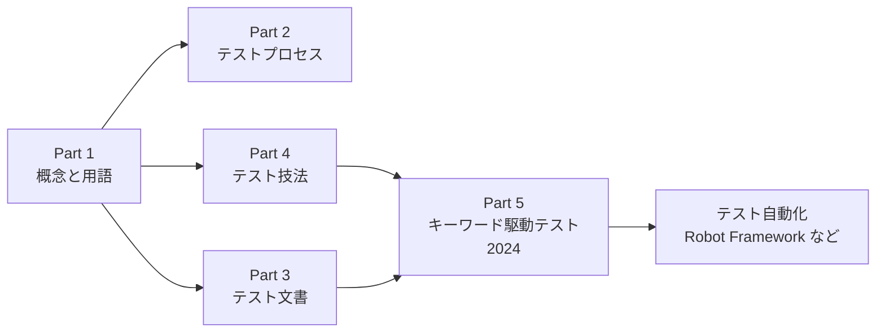

**ポイント**: Part 4 で「何をテストするか」を設計し、Part 5 で「それをどう部品化して書くか」を決める、という関係で捉えると理解しやすくなります。

---

## 2. 規格の基本情報

| 項目 | 内容 |
|---|---|
| 正式名称 | Software and systems engineering — Software testing — Part 5: Keyword-driven testing |
| 版 | Edition 2（第2版） |
| 発行 | 2024年12月 |
| 前版 | ISO/IEC/IEEE 29119-5:2016（ISO/IEC/IEEE 29119-5:2016 は新版に置き換え） |
| 策定委員会 | ISO/IEC JTC 1/SC 7（Software and systems engineering） |
| 分類 | ICS 35.080（ソフトウェア） |
| 共同発行 | ISO、IEC、IEEE |
| 参考ページ数 | 約55ページ（販売元の記載） |

---

## 3. STEP 1：キーワード駆動テストとは何か

### 3-1. ひとことで言うと

> **テストケースを、意味のある「キーワード」というブロックを積み上げて作る方法**

規格は、キーワードを「一度定義すれば、テストケースを組み立てる部品（ブロック）として使えるもの」として位置づけています。テスト自動化フレームワークやテスト仕様書の作成を、共通の考え方で支えることが狙いです。

### 3-2. 身近な例え：レゴブロック

| レゴの世界 | キーワード駆動テストの世界 |
|---|---|
| ブロック1個 | キーワード1個 |
| ブロックの組み合わせ（車・家） | テストケース |
| ブロックの規格（凸凹の形） | キーワードの書式・インターフェース |
| ブロックの説明書 | キーワードの文書化 |
| ブロックの入れ替え | 実装の変更（テストケース側は無変更） |

### 3-3. 従来のスクリプト方式との違い

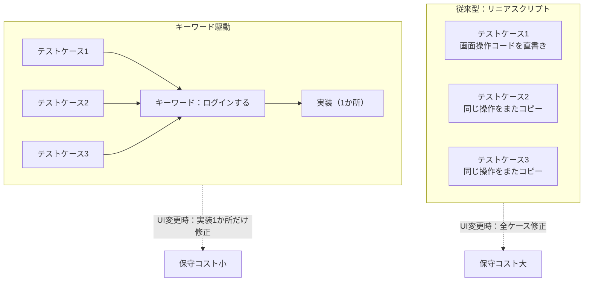

| 観点 | リニアスクリプト | キーワード駆動 |
|---|---|---|
| 可読性 | プログラミングが読めないと理解困難 | 業務用語で読める |
| 再利用性 | コピー＆ペーストになりがち | キーワードを再利用 |
| 保守性 | 変更時に多数のファイルを修正 | 実装の1か所を修正 |
| 役割分担 | 全員がコードを書く必要 | テスト設計者とキーワード実装者を分離可能 |
| 手動テストとの親和性 | 低い | 高い（手順書としても読める） |

---

## 4. STEP 2：規格が定義していること（全体マップ）

29119-5 の公開されている要約から、規格の柱は次のように整理できます。

| # | 規格が扱う内容 | 誰に関係するか |
|---|---|---|
| 1 | キーワード駆動テストの**導入的説明** | 初学者・管理者 |
| 2 | キーワード駆動テストを実装する**参照アプローチ** | 自動化エンジニア |
| 3 | テスト成果物（テストケース、テストデータ、キーワード、テスト仕様一式）を**共有できるようにするためのフレームワーク要求事項** | フレームワーク設計者 |
| 4 | キーワード駆動テストを支援する**ツールへの要求事項**（自動化・テスト設計・テスト管理の各ツールに適用可能） | ツールベンダー・ツール選定者 |
| 5 | ベンダーの異なるツール間でデータを交換するための**インターフェースと共通データ交換形式** | ツールベンダー・統合担当 |
| 6 | **階層的キーワード**のレベルと使い方（ナビゲーション用、値の確認用などの種類、「フラット」構造を使うべき場面） | テスト設計者 |
| 7 | **汎用の技術的（低レベル）キーワードの初期リスト**（例：`inputData`、`checkValue`）と、それらを組み合わせた業務レベルキーワードの作り方 | 全員 |

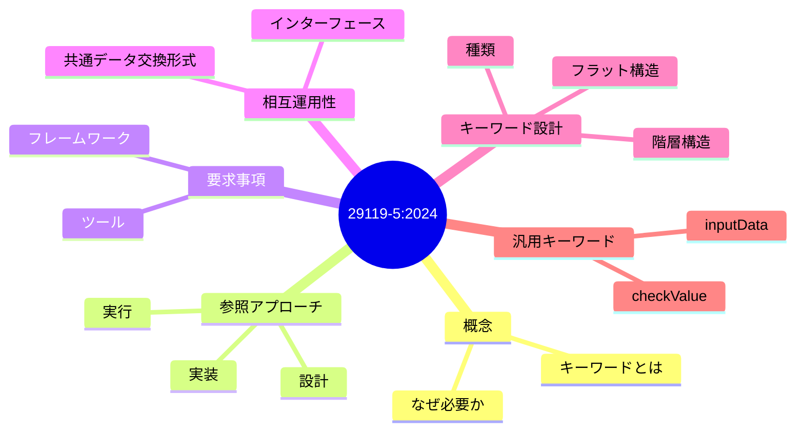

---

## 5. STEP 3：用語をおさえる

| 用語 | 意味（初学者向けの言い換え） |
|---|---|
| **キーワード（keyword）** | テストの1ステップ、または一連のステップに付けた名前付きの部品 |
| **テストケース** | キーワードを並べて作る、テストの1シナリオ |
| **引数（パラメータ）** | キーワードに渡す値（例：ユーザー名、金額） |
| **低レベルキーワード** | 技術的な操作の部品（例：値を入力する、値を確認する） |
| **高レベル（業務レベル）キーワード** | 業務の言葉で書かれた部品（例：商品を注文する） |
| **階層的キーワード** | 低レベルキーワードを組み合わせて高レベルキーワードを作る構造 |
| **フラットなキーワード** | 階層を作らず1段だけで定義するキーワード |
| **キーワードライブラリ** | 実装済みキーワードの集まり |
| **テスト仕様** | キーワードで書かれたテストケースの集まり |
| **データ交換形式** | ツール間でテスト資産をやり取りするための共通フォーマット |

> 💡 **用語の基本は Part 1（29119-1）を参照**: 規格自身も、ソフトウェアテストの概念は Part 1 で定義されたものが本Partにも適用されると位置づけています。

---

## 6. STEP 4：階層的キーワードを理解する（Part 5 の核心）

### 6-1. 3層モデル（説明用）

キーワードは、抽象度の異なる層に分けて設計すると、変更に強くなります。下の図は、階層の考え方を理解するための**説明用モデル**です。

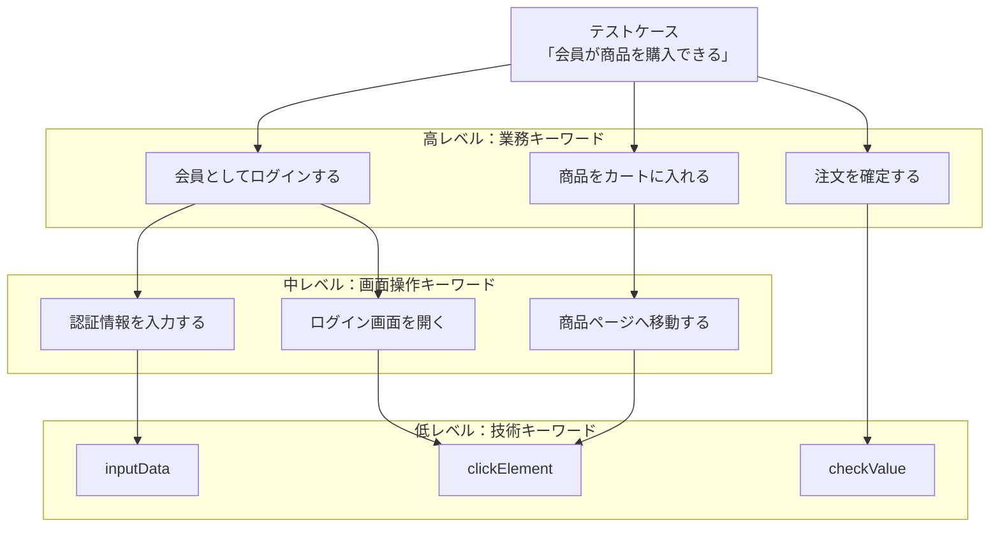

### 6-2. どの層を誰が担当するか

| 層 | 主な担当 | 変更が起きる理由 |
|---|---|---|
| テストケース | テスト設計者／業務担当 | 仕様・テスト観点の変更 |
| 高レベルキーワード | テスト設計者 | 業務フローの変更 |
| 中〜低レベルキーワード | 自動化エンジニア | UI・API・技術基盤の変更 |

### 6-3. キーワードの種類（例）

規格の要約では、ナビゲーション用や値の確認用といった**特定の種類のキーワード**が説明されるとされています。以下は、その考え方を理解するための一般的な分類例です（分類名は説明用）。

| 種類 | 役割 | 例 |
|---|---|---|
| ナビゲーション | 画面や状態を移動する | 「注文履歴画面へ移動する」 |
| 入力 | データを与える | 「メールアドレスを入力する」 |
| 確認（チェック） | 期待結果と比較する | 「合計金額が正しいことを確認する」 |
| 準備／後処理 | 前提条件の用意・後片付け | 「テスト用会員を登録する」 |

### 6-4. 階層にするか、フラットにするか

規格は、階層的キーワードの利用を推奨しつつ、「フラット」な構造を使うのが適切な場面についても説明しているとされています。判断の目安は次のとおりです（一般的な考え方）。

| 状況 | 向いている構造 |
|---|---|
| 同じ操作が多数のテストで繰り返される | 階層（再利用のため） |
| 業務担当者とテストを共同レビューしたい | 階層（業務レベルを上位に） |
| 小規模・短期・使い捨てのテスト | フラット（設計コストを抑える） |
| 単純な確認1回だけ | フラット |

---

## 7. STEP 5：汎用キーワード `inputData` と `checkValue`

規格は、**汎用的な技術レベルのキーワードの初期リスト**を提供しており、その例として `inputData` や `checkValue` が挙げられています。これらは技術レベルでテストケースを記述でき、必要に応じて組み合わせて業務レベルのキーワードを作れます。

### 7-1. 考え方

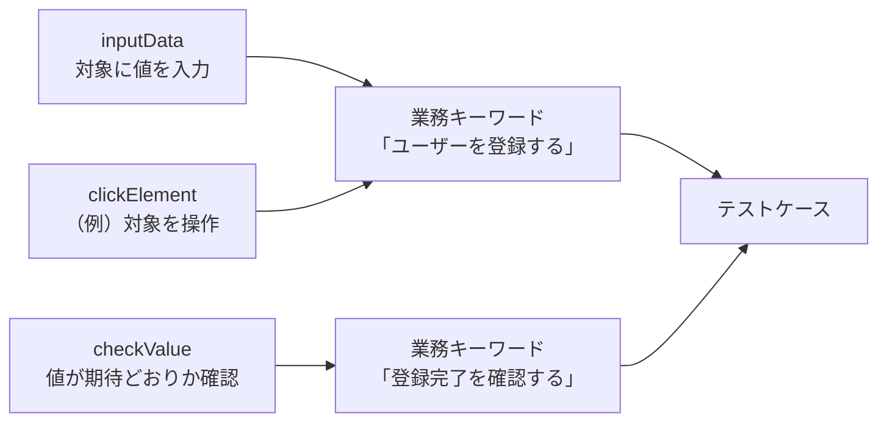

### 7-2. 表形式のテストケース例（概念イメージ）

キーワード駆動では、表形式でテストを書くのが典型です。以下は概念を示す**説明用の例**です（規格の書式そのものではありません）。

| No | キーワード | 引数1（対象） | 引数2（値） | 意図 |
|---|---|---|---|---|
| 1 | inputData | ユーザー名欄 | alice | ユーザー名を入力 |
| 2 | inputData | パスワード欄 | （テスト用値） | パスワードを入力 |
| 3 | clickElement | ログインボタン | - | ログイン実行 |
| 4 | checkValue | 画面タイトル | ダッシュボード | 遷移結果を確認 |

これを高レベルキーワードにまとめると、テストケースは次のように読みやすくなります。

| No | キーワード | 引数 |
|---|---|---|
| 1 | ユーザーがログインする | alice |
| 2 | ダッシュボードが表示されている | - |

---

## 8. STEP 6：フレームワークとツールの構成要素

規格の目次（公開サンプル）には、キーワード駆動テストを支えるツール／構成要素として、次のような項目が確認できます。

| 構成要素 | 役割（一般的な理解に基づく説明） |
|---|---|
| Keyword-driven editor（エディタ） | キーワードでテストを編集する画面・ツール |
| Decomposer and data sequencer | キーワードを下位に分解し、データの順序を制御する仕組み |
| Manual test assistant | 手動テストの実行を支援する仕組み |
| Tool bridge | 異なるツール同士をつなぐ橋渡し |

> ⚠️ 上記は目次上の項目名に基づく整理です。各構成要素に対する要求事項の詳細は、規格本文でご確認ください。

### 8-1. 全体アーキテクチャ（概念モデル・説明用）

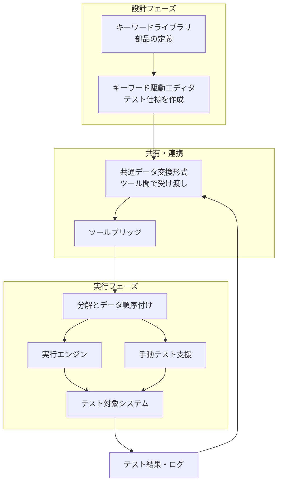

### 8-2. 実行時の流れ（シーケンス・説明用）

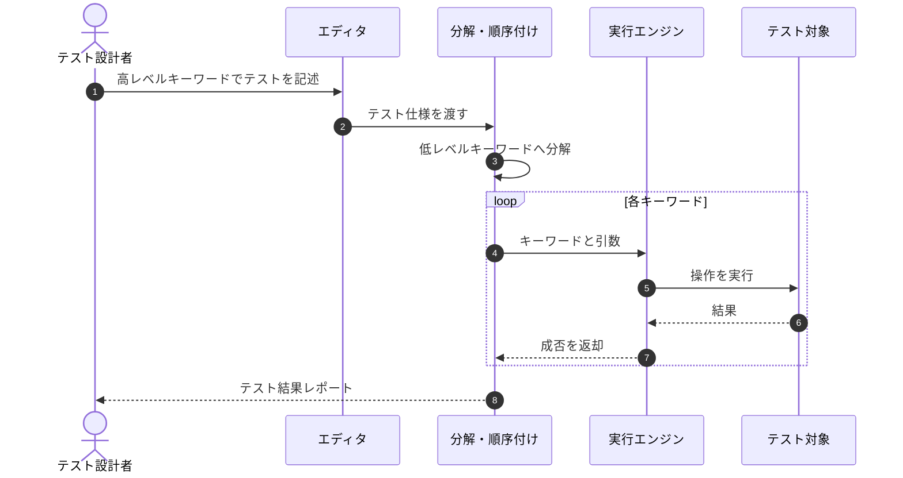

---

## 9. STEP 7：ツール間のデータ交換が重要な理由

規格は、**異なるベンダーのツールがテストケース・テストデータ・テスト結果を交換できる**ように、インターフェースと共通のデータ交換形式を定義することを目的の一つとしています。

### 9-1. 交換形式がない場合の問題

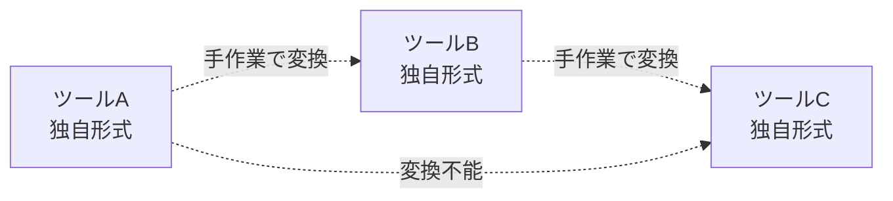

### 9-2. 共通形式がある場合

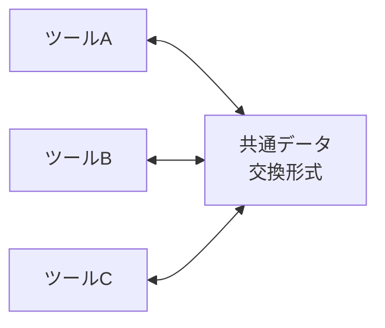

| 観点 | 共通形式なし | 共通形式あり |
|---|---|---|
| ベンダーロックイン | 強い | 弱い |
| ツール移行コスト | 大きい | 小さい |
| 資産（テストケース）の寿命 | ツールに依存 | ツールに依存しない |
| 変換の組み合わせ数 | ツール数の2乗に近づく | ツール数に比例 |

> 💡 実務では、ツール選定の際に「テスト資産をエクスポートできるか」「共通形式に対応するか」を確認する観点になります。

---

## 10. STEP 8：実務への導入ステップ

### 10-1. 導入の全体フロー

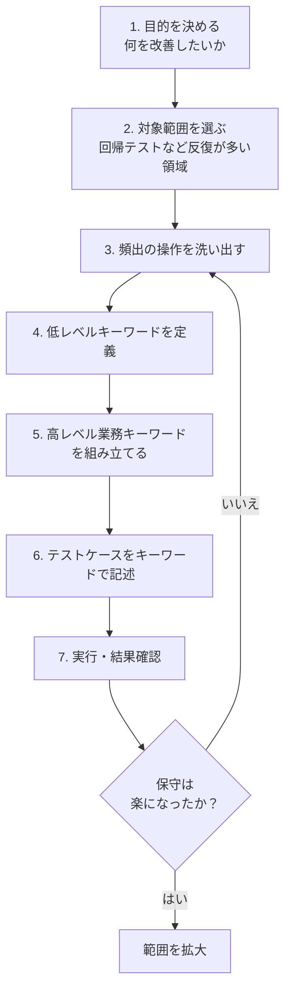

### 10-2. 各ステップの詳細

| STEP | やること | 成果物 | よくある失敗 |
|---|---|---|---|
| 1 | 導入目的を明確化（保守性向上、非エンジニア参加、ツール移行容易性など） | 目的メモ | 「流行だから」で始める |
| 2 | 反復が多く、安定した機能から始める | 対象機能一覧 | 仕様が頻繁に変わる領域から始める |
| 3 | 既存の手動テスト手順から頻出操作を抽出 | 操作の候補リスト | 細かすぎる粒度で洗い出す |
| 4 | 技術操作をキーワード化し、引数を決める | 低レベルキーワード群 | UI要素の指定がバラバラ |
| 5 | 業務用語で読める高レベルキーワードを作る | 業務キーワード群 | 実装詳細が名前に漏れる |
| 6 | 高レベルキーワード中心にテストを書く | テスト仕様 | 低レベルを直接並べて可読性が落ちる |
| 7 | 実行し、失敗の原因を切り分ける | 結果・ログ | キーワードの不具合とSUTの不具合を混同 |
| 8 | 保守工数を測り、命名規約や粒度を見直す | 改善策 | 振り返りをしない |

### 10-3. キーワード命名の実務ルール（一般的なベストプラクティス）

| ルール | 良い例 | 悪い例 |
|---|---|---|
| 業務の意図を表す | 注文を確定する | クリックボタン3を押す |
| 実装詳細を含めない | ログインする | セレクタを入力してログインする |
| 動詞で始める／状態を述べる | カートに商品を追加する | カート処理 |
| 引数で変化を吸収 | ユーザー "alice" でログインする | aliceログイン／bobログイン（重複定義） |
| 1キーワード1責務 | 注文する／注文を確認する | 注文して確認して後片付けする |

---

## 11. STEP 9：Robot Framework で体験する（実装例）

Robot Framework は、キーワード駆動アプローチを採用したオープンソースの自動化フレームワークです。テストケースをキーワードとその引数で構築し、既存キーワードから上位のキーワードを作ることもできます。規格の階層的キーワードの考え方を体験する題材として適しています。

> 以下は概念を体験するための**説明用サンプル**です。URLやセレクタは仮のものです。

### 11-1. キーワード定義（`keywords.resource`）

```robotframework
*** Settings ***
Library    SeleniumLibrary

*** Variables ***
${BASE_URL}    https://example.com

*** Keywords ***
# ---- 低レベル（技術）キーワード ----
Input Data
    [Arguments]    ${locator}    ${value}
    Input Text    ${locator}    ${value}

Check Value
    [Arguments]    ${locator}    ${expected}
    Element Text Should Be    ${locator}    ${expected}

# ---- 中レベル（画面操作）キーワード ----
Open Login Page
    Open Browser    ${BASE_URL}/login    chrome

Enter Credentials
    [Arguments]    ${user}    ${password}
    Input Data    id=username    ${user}
    # パスワードはログに値を出力しない SeleniumLibrary の Input Password で入力する
    Input Password    id=password    ${password}

# ---- 高レベル（業務）キーワード ----
User Logs In
    [Arguments]    ${user}    ${password}
    Open Login Page
    Enter Credentials    ${user}    ${password}
    Click Button    id=login

Dashboard Is Displayed
    Check Value    css=h1    Dashboard
```

### 11-2. テストケース（`login.robot`）

```robotframework
*** Settings ***
Resource          keywords.resource
Test Teardown     Close All Browsers

*** Test Cases ***
Registered User Can Log In
    User Logs In    alice    %{TEST_PASSWORD}
    Dashboard Is Displayed
```

パスワードはファイルに直書きせず、Robot Framework の環境変数構文 `%{TEST_PASSWORD}` でテスト内から読み取ります。環境変数 `TEST_PASSWORD` には、CI ではシークレットを設定します。`--variable "NAME:$TEST_PASSWORD"` のようにコマンドライン引数へ展開すると、パスワードがプロセス一覧（`ps` 等）やシェル履歴から見えるため避けます。また、ログ（`log.html`）への平文出力を防ぐため、パスワード欄の入力には SeleniumLibrary の `Input Password` を使います。

```bash
# TEST_PASSWORD は CI のシークレット等で環境変数として設定済みであることが前提
robot login.robot
```

### 11-3. 規格の概念との対応

| 規格の概念 | Robot Framework での対応 |
|---|---|
| 低レベル（技術）キーワード | `Input Data`, `Check Value`（上の例では自作。実運用ではライブラリのキーワードを利用） |
| 高レベル（業務）キーワード | `User Logs In`, `Dashboard Is Displayed` |
| 階層的キーワード | 既存キーワードから新しいキーワードを作る仕組み |
| キーワードライブラリ | `.resource` ファイルやPython／Javaのテストライブラリ |
| テスト仕様 | `.robot` ファイル |

> ⚠️ Robot Framework は規格準拠を保証するものではありません。あくまで「キーワード駆動の考え方を体験できる代表的な実装」という位置づけです。

---

## 12. アンチパターン集

| # | アンチパターン | 何が問題か | 対策 |
|---|---|---|---|
| 1 | 低レベルキーワードだけでテストを書く | 結局スクリプトと同じで可読性が低い | 業務レベルの層を作る |
| 2 | キーワードが多すぎて誰も把握できない | 重複定義・検索困難 | 命名規約・ライブラリ整理・レビュー |
| 3 | キーワード名に実装詳細が入る | UI変更で名前も変える羽目になる | 意図を表す名前にする |
| 4 | 1キーワードに詰め込みすぎ | 失敗時に原因が特定できない | 1キーワード1責務 |
| 5 | キーワードのドキュメントがない | 属人化する | 説明・引数・期待結果を必ず記述 |
| 6 | 独自形式にこだわりすぎる | ツール移行時に資産を失う | 共通形式・エクスポート性を意識 |
| 7 | 不安定な機能を先に自動化 | 保守負荷が増大 | 安定した領域から段階導入 |

---

## 13. 学習ロードマップ

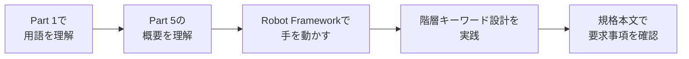

| 段階 | 目標 | おすすめの行動 |
|---|---|---|
| 1 | 用語と全体像 | 本ガイドの第1〜5章を読む |
| 2 | 構造の理解 | 第6〜9章の図を自分の言葉で説明してみる |
| 3 | 実践 | 第11章のサンプルを動かし、業務キーワードを1つ作る |
| 4 | 設計力 | 既存テストを3層に整理し直す |
| 5 | 規格の精読 | 正規版で要求事項を確認する |

---

## 14. まとめ（10行チェックリスト）

- [ ] 29119-5:2024 は **キーワード駆動テスト** の規格である（Part 1 のURLと取り違えない）
- [ ] 2016年初版、**2024年12月に第2版**が発行された
- [ ] キーワードは **テストケースを組み立てる部品**である
- [ ] 規格は **フレームワーク／ツールへの要求事項** を定める
- [ ] **共通データ交換形式** でベンダー間のテスト資産共有を目指す
- [ ] **階層的キーワード** の活用と、フラット構造を使う場面を説明している
- [ ] `inputData`・`checkValue` のような **汎用低レベルキーワード** の初期リストがある
- [ ] 低レベルを組み合わせて **業務レベルキーワード** を作る
- [ ] Robot Framework は考え方を体験できる代表例（規格準拠の保証ではない）
- [ ] 厳密な要求事項は **正規版の規格本文** で確認する

---

## 15. 参考ソース（URL）

### 15-1. 規格の公式・準公式情報（一次情報に近いもの）

| ソース | URL | 用途 |
|---|---|---|
| ISO：29119-5:2024 公式ページ | https://www.iso.org/standard/87233.html | 範囲・発行情報 |
| IEEE SA：29119-5 | https://standards.ieee.org/ieee/29119-5/11042/ | 範囲・目的 |
| IEEE Xplore：29119-5-2024 | https://ieeexplore.ieee.org/document/10806546 | 範囲・要約 |
| ISO：29119-5:2016（旧版） | https://www.iso.org/standard/62821.html | 旧版との関係 |
| iTeh Standards：29119-5:2024 公開サンプル（目次・序文） | https://cdn.standards.iteh.ai/samples/87233/17d24d1e3118409fba70a0e95545ef7a/ISO-IEC-IEEE-29119-5-2024.pdf | 目次・構成要素名 |
| BSI：BS ISO/IEC/IEEE 29119-5:2024 | https://knowledge.bsigroup.com/products/software-and-systems-engineering-software-testing-keyword-driven-testing-1 | 各国版の確認 |
| VDE：29119-5:2024 | https://www.vde-verlag.de/iec-standards/254691/iso-iec-ieee-29119-5-2024.html | 版・ページ数 |
| （参考）ご指定URL＝29119-1:2022 | https://www.iso.org/standard/81291.html | Part 1 の確認用 |

### 15-2. 著名な実務家・公式ドキュメント

| ソース | URL | 用途 |
|---|---|---|
| Hans Buwalda（LogiGear）チュートリアル資料 "Introducing Keyword-driven Test Automation" | https://www.slideshare.net/slideshow/to-30593266/30593266 | キーワード駆動テスト（Action Based Testing）の背景。同氏はキーワード駆動テスト自動化のパイオニアとして紹介されています |
| Robot Framework User Guide（公式） | https://robotframework.org/robotframework/latest/RobotFrameworkUserGuide.html | キーワード駆動の実装例 |
| Robot Framework QuickStartGuide（公式GitHub） | https://github.com/robotframework/QuickStartGuide/blob/master/QuickStart.rst | 高レベルキーワード中心の書き方 |
| Wikipedia：Keyword-driven testing | https://en.wikipedia.org/wiki/Keyword-driven_testing | 概念の概観 |
| Wikipedia：ISO/IEC 29119 | https://en.wikipedia.org/wiki/ISO/IEC_29119 | シリーズ全体と版の履歴 |

### 15-3. 出典に関する補足

- 本ガイドは、2026年9月28日時点で確認できた公開情報をもとに作成しています。
- 規格本文の条項レベルの内容は確認していません。第6章・第7章・第8章の表形式の例、分類、アーキテクチャ図は**理解のための説明用オリジナル**であり、規格の記述そのものではありません。
- 検索では、Part 5 の解説を主題とした著名な国際的開発者個人の投稿は見つかりませんでした。そのため、キーワード駆動テストの一般概念については、この分野の第一人者として知られるHans Buwalda氏の資料と、Robot Framework公式ドキュメントを根拠としています。

---

*作成日: 2026-09-28*
