# ISO/IEC/IEEE 29119-8：モデルベーステスト（MBT）初学者向けステップバイステップ解説

> **対象読者**：ソフトウェアテストの基礎（ISTQB Foundation 相当）を学んだ方、QA／テスト自動化エンジニア、開発者
> **調査時点**：2026年10月6日までに公開されていた情報
> **規格の正式名称**：Software and systems engineering — Software testing — Part 8: Model-based testing
> **規格の位置づけ**：ISO/IEC JTC 1/SC 7（ICS 35.080）、第1版

---

## 0. 最初に読んでください：この文書の「根拠の強さ」について

ISO/IEC/IEEE 29119-8 は、**2026年10月6日時点では「発行手続き中（Under publication）」**であり、規格本文はまだ一般には入手できません。ISOの公式ページには、規格本文を生成AIの学習や回答生成に使うことを禁じる旨の記載もあります。そのため、この文書は次の3層に分けて書いています。

| 層 | 内容 | 根拠の強さ |
|---|---|---|
| **確認済み** | ISO公式ページの要旨（Abstract）、ステージ履歴、関連規格との関係 | ◎ 公式情報に直接基づく |
| **補強情報** | ISTQB CT-MBT シラバス v1.1（2024年）、Utting/Pretschner/Legeardの分類法、Tretmansのioco理論、ETSI ES 202 951 など、MBTの国際的に確立した知識 | ○ 公開資料に基づく |
| **筆者の整理** | 29119-2・29119-3 の既存構造に MBT を当てはめた読み解きの補助線 | △ 本文未確認のため、規格本文の条項と一致する保証はありません |

> 💡 **ベストプラクティス**：試験対策や監査対応で使う場合は、発行後に規格本文（有償）を必ず確認し、本ガイドの「筆者の整理」部分を条項番号つきで照合してください。

---

## 1. 目次

1. 30秒でわかる 29119-8
2. ステップ1：MBTとは何か
3. ステップ2：29119 シリーズの中での位置づけ
4. ステップ3：29119-8 のスコープ（扱うもの・扱わないもの）
5. ステップ4：策定の経緯と現在のステータス
6. ステップ5：MBT のプロセス全体像
7. ステップ6：29119-2（テストプロセス）を MBT で実装するとは
8. ステップ7：モデルの種類と書き方
9. ステップ8：テスト選択基準（何をどこまで生成するか）
10. ステップ9：テスト生成から実行まで（オフライン／オンライン、アダプテーション層）
11. ステップ10：29119-3（文書化）への対応
12. ステップ11：29119-4（テスト技法）との関係
13. ステップ12：手を動かす——ログイン機能で MBT を体験
14. ステップ13：導入判断・ROI・KPI
15. ステップ14：よくある失敗とアンチパターン
16. 学習ロードマップとチェックリスト
17. 用語集
18. FAQ
19. 出典 URL 一覧

---

## 2. 30秒でわかる 29119-8

ISO公式ページの要旨を、私たちの言葉で言い直すと次のとおりです。

| 観点 | 内容 |
|---|---|
| **何の規格か** | モデルベーステスト（MBT）を、29119-2 のテストプロセスに沿って適用するための**要求事項とガイドライン** |
| **3つの柱** | ① MBT の用語定義　② 29119-2 を MBT 向けに実装する方法　③ 29119-3 を MBT 向けに実装する方法 |
| **前提** | MBT ではテスト成果物（テストウェア）の**生成が自動化**される。この規格は**テスト実行も自動化されている**ことを前提にする |
| **範囲外** | 生成アルゴリズムの実装（ツール依存）、MBT ツールの選定 |
| **文書化との関係** | MBT のモデルやツールが出力する情報は、29119-3 の文書化要求を**一部または全部**満たすのに使える |
| **29119-4 との関係** | 多くの MBT ツールは 29119-4 のテスト技法と測定指標を実装しているが、それらはツール個別の実装であり本規格の範囲外 |
| **適用範囲** | **すべての開発ライフサイクルモデル**（ウォーターフォール、アジャイルなど） |

**一言でまとめると**：「テストケースを人が1本ずつ書く」代わりに、「システムの期待動作を**モデル**として書き、そこからテストを**機械的に導く**」ための、**プロセスと文書化のルールブック**です。

---

## 3. ステップ1：MBT とは何か

### 3.1 定義

MBT（Model-Based Testing）は、**テスト対象システム（SUT）やその環境のモデル**を使って、テストケースを導き出すテスト手法です。モデルとは、期待される振る舞いを抽象化して記述したもの（状態遷移図、業務フロー、デシジョンテーブル、テキストの仕様記述など）を指します。

ISTQB の CT-MBT シラバスは、MBT を「同値分割、境界値分析、デシジョンテーブル、状態遷移テストといった既存のテスト技法を**拡張し支える**高度なテストアプローチ」と位置づけています。つまり、MBT は従来技法の**置き換えではなく、上に乗るもの**です。

### 3.2 テスト自動化の進化の中での MBT

オランダの Jan Tretmans 氏（モデルベーステスト理論の第一人者）は、テストの進化を「手動 → スクリプト → キーワード駆動 → モデルベース」と整理しています。

### 3.3 従来のテスト設計との違い

| 比較項目 | 従来のテスト設計 | MBT |
|---|---|---|
| 「正」の置き場所 | 個々のテストケース（Excel、スクリプト） | **モデル**（テストケースは派生物） |
| 仕様変更時の修正 | 影響する全テストケースを探して手修正 | **モデルを1か所直して再生成** |
| 網羅性の説明 | 「このくらい書きました」 | 「状態を100%、遷移を100%カバーしました」と**測定できる** |
| 早期の欠陥発見 | テスト実装時に気づくことが多い | モデル化の最中に**要件の矛盾や欠落に気づく** |
| 初期コスト | 低い | **高い**（モデル作成、ツール、アダプテーション層） |
| 向いているシステム | 小規模・変更が少ない | 状態や分岐が多い・変更が頻繁・長期運用 |

> 💡 **ベストプラクティス**：MBT で最も重要な考え方は「**モデルが主、生成されたテストケースは従**」です。生成物を手で直し始めたら、モデルとの同期が崩れ、MBT の利点がなくなります。

---

## 4. ステップ2：29119 シリーズの中での位置づけ

ISO/IEC/IEEE 29119 は、ソフトウェアテストの国際規格群です。29119-8 は、その中で「MBT という切り口」を担当します。

| パート | 主題 | 29119-8 との関係 |
|---|---|---|
| 29119-1 | 概念と用語定義 | MBT の用語の土台 |
| 29119-2 | テストプロセス | **MBT 向けにどう実装するかを規定**（要旨の柱②） |
| 29119-3 | テスト文書化 | **MBT 向けにどう実装するかを規定**（要旨の柱③） |
| 29119-4 | テスト技法 | MBT ツールが実装する技法の源泉。ただしツール個別実装は範囲外 |
| 29119-5 | キーワード駆動テスト | 生成テストの実行層（アダプテーション）と親和性が高い |
| **29119-8** | **モデルベーステスト** | 本ガイドの主題 |

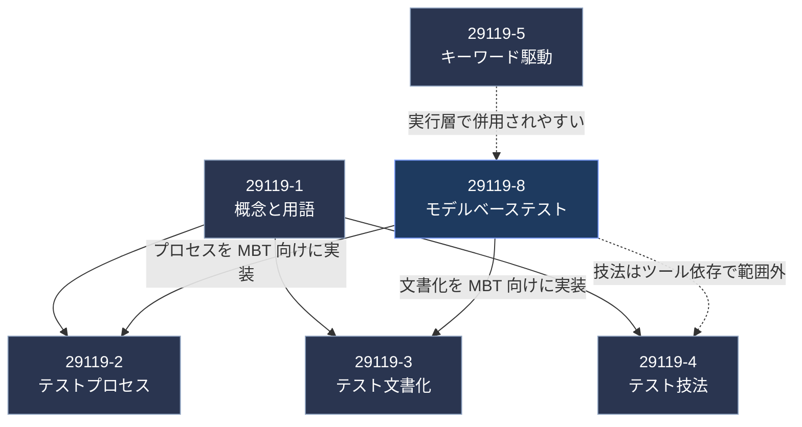

> ⚠️ 上図の「29119-5 との親和性」は、ISTQB シラバスがアダプテーション層を「キーワード駆動テストに似たラッパー」と説明していることに基づく**筆者の整理**です。規格本文での明示的な参照関係は未確認です。

---

## 5. ステップ3：29119-8 のスコープ

### 5.1 「扱う」ものと「扱わない」もの

| 区分 | 項目 | 理由・補足 |
|---|---|---|
| **扱う** | MBT に関する用語定義 | 組織間・ツール間でのコミュニケーション統一のため |
| **扱う** | 29119-2 のテストプロセスを MBT で実行する方法 | 計画、設計、実行などの各プロセスに MBT 固有の活動が入る |
| **扱う** | 29119-3 の文書化を MBT で実現する方法 | モデルやツール出力を文書の一部として使える |
| **扱わない** | テスト生成アルゴリズムの実装 | ツールごとに異なるため |
| **扱わない** | MBT ツールの選定基準 | 同上 |
| **扱わない** | ツール個別が実装する 29119-4 の技法 | ツール依存のため |

### 5.2 「テスト実行も自動」という前提の意味

要旨には「MBT ではテストウェアの生成が自動化され、この規格はテスト実行も自動化されていると想定する」とあります。

これは「**手動実行の MBT は規格の対象外**」という意味ではありません。実務では、生成したテストを手動で実行する運用もあり得ます（ISTQB シラバスも手動実行の形式を認めています）。ただし、**規格が想定する標準形は「生成から実行までの自動化」**であることを押さえておくと、後述のアダプテーション層の位置づけが理解しやすくなります。

### 5.3 すべてのライフサイクルに適用できる

要旨は「すべての開発ライフサイクルモデルに適用できる」と明記しています。ISTQB シラバスは具体像として次のように整理しています。

| ライフサイクル | MBT の関わり方 |
|---|---|
| **逐次型（V字モデルなど）** | できるだけ早くモデル化を始め、要件の曖昧さ・不完全さ・矛盾を早期に検出する |
| **反復・増分型（アジャイルなど）** | モデルを反復ごとに育て、ユーザーストーリーとテストを双方向トレーサビリティで結ぶ。ATDD（受入テスト駆動開発）の駆動にも使える |

---

## 6. ステップ4：策定の経緯と現在のステータス

ISO 公式ページに記録されたステージ履歴を、時系列で整理します。

| 日付 | ステージ | 意味 |
|---|---|---|
| 2025-01-03 | 10.99／30.00 | 新規プロジェクト承認、委員会原案（CD）登録 |
| 2025-01-07 | 30.20 | CD の意見募集開始 |
| 2025-03-05 | 30.60 | 意見募集の締切 |
| 2025-08-07 | 30.99 | CD を DIS として登録することを承認 |
| 2025-08-14 | 40.00 | DIS 登録 |
| 2025-10-15 | 40.20 | DIS 投票開始（12週間） |
| 2026-01-08 | 40.60 | 投票締切 |
| 2026-03-09 | 40.99 | 全報告回覧、FDIS 登録承認 |
| 2026-03-11 | 50.00 | FDIS 登録 |
| 2026-06-16 | 50.20 | FDIS 投票開始（8週間） |
| 2026-08-12 | 50.60 | 投票締切 |
| **2026-09-28** | **60.00** | **国際規格として発行手続き中（現在地）** |
| （未定） | 60.60 | 国際規格発行 |

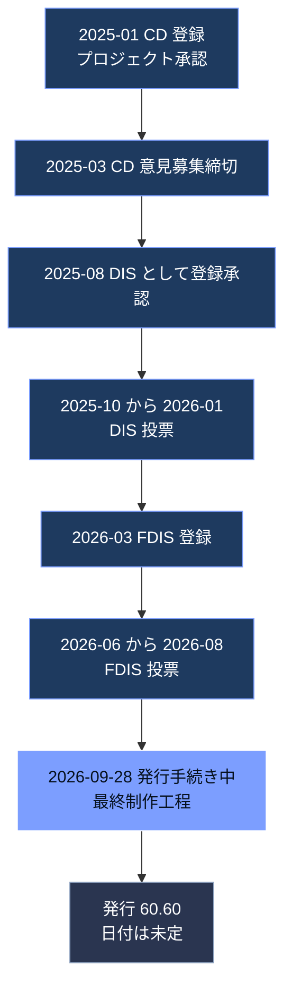

ISO ページは、このステージを「最終制作工程（最大7週間）」と説明しています。単純計算すると 2026-09-28 から7週間後は **2026-11-16** です。したがって**11月中旬までには発行される可能性が高い**と推測できますが、これは筆者の概算であり、ISO が日付を約束しているわけではありません。

### 補足：ISTQB シラバスに残る旧称

ISTQB CT-MBT シラバス v1.1（2024年2月）の参考文献には「ISO/IEC CD TR 29119-8.2」という表記が登場します。これは、29119-8 が準備段階で**技術報告書（TR）として検討されていた時期の名残**とみられます。現在は IS（国際規格）として FDIS／発行手続きに進んでいるため、**古い資料を読むときは「TR 29119-8」という表記と現行の IS 版を混同しない**ようにしてください（この推測は、ISO ページの「International Standard under publication」という表記との対比に基づきます）。

---

## 7. ステップ5：MBT のプロセス全体像

### 7.1 MBT の基本フロー

Utting／Pretschner／Legeard の論文は、MBT の一般的なプロセスを提示しています。ここでは ISTQB の整理と合わせ、初学者向けに次の流れで説明します。

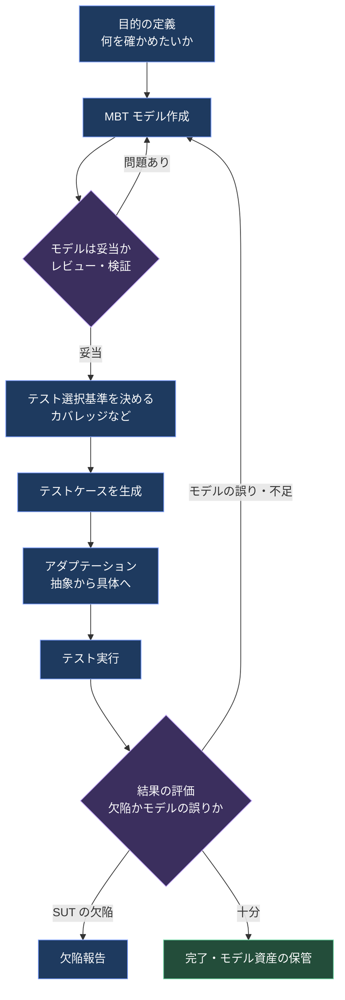

### 7.2 各ステップの役割

| ステップ | やること | よくある落とし穴 |
|---|---|---|
| 目的の定義 | 何のためのモデルかを決める（業務フロー検証か、状態遷移の網羅か） | 目的が曖昧で「全部入りモデル」になる |
| モデル作成 | テスト目的に沿った抽象度で作る | 詳細すぎ／粗すぎ |
| レビュー・検証 | 構文・意味・実用性を確認する | モデルの誤りがそのまま全テストに伝播する |
| 選択基準の決定 | どのカバレッジで切り出すか決める | 全パス網羅などでテストケース爆発が起きる |
| テスト生成 | ツールが自動生成する | 生成結果に意味のないテストが混ざる |
| アダプテーション | 抽象テストを具体的な操作・データに結びつける | 最後まで後回しにして頓挫する |
| 実行・評価 | 結果を見て、欠陥かモデルの誤りかを切り分ける | モデルの誤りを SUT の欠陥と誤認する |

### 7.3 MBT 固有の活動と成果物（ISTQB の整理）

**MBT 固有の活動**

- MBT モデリング活動（モデルの管理、モデリング指針の策定、モデル構造の設計、要素の作成、ツール関連）
- 選択基準にもとづくテストウェア生成（テストケース生成など）

**入力成果物**：テスト戦略、テストベース（要件・既存設計・既存モデル）、過去の欠陥報告やテストログ、方法論・ツール文書

**出力成果物**：MBT モデル、テスト計画の一部、テストスケジュール、テストケース／手順／データ／スクリプト、アダプテーション層、**テストと要件／欠陥の双方向トレーサビリティマトリクス**

---

## 8. ステップ6：29119-2（テストプロセス）を MBT で実装するとは

> ⚠️ このステップは、29119-2 の既存構造に ISTQB の MBT 整理を重ねた**筆者の読み解き**です。29119-8 本文の条項どおりではない可能性があります。

### 8.1 29119-2 の3層構造をおさらい

29119-2 は、テストプロセスを次の3層で整理しています。

| 層 | 主なプロセス |
|---|---|
| 組織テストプロセス | 組織レベルのテスト方針・戦略の策定と維持 |
| テストマネジメントプロセス | テスト計画、テストのモニタリングとコントロール、テスト完了 |
| 動的テストプロセス | テスト設計・実装、テスト環境の構築と維持、テスト実行、テストインシデント報告 |

### 8.2 MBT が影響する箇所

ISTQB シラバスは、MBT の影響を「最低でもテスト分析と設計に及び、目的次第でテストプロセス全体に及ぶ」と整理しています。

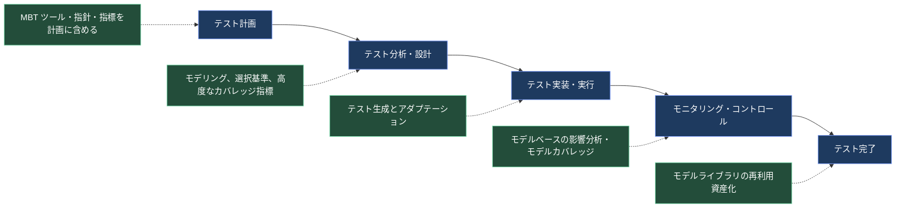

### 8.3 プロセス別の MBT 実装ポイント

| プロセス | 従来のやり方 | MBT での実装ポイント |
|---|---|---|
| **テスト計画** | テスト範囲・工数・環境を計画 | MBT ツール、モデリング指針、MBT 特有の指標、モデルを計画のベースラインに含める |
| **テスト分析・設計** | テスト条件を洗い出しテストケースを設計 | モデリングが設計そのもの。選択基準の選定とカバレッジ測定。シフトレフトで分析と設計が一体化 |
| **テスト実装・実行** | 手順を書き実行 | 自動生成＋アダプテーション。オフライン／オンライン実行の選択 |
| **モニタリング・コントロール** | 進捗・欠陥の追跡 | モデルカバレッジや要件カバレッジなど、モデル情報に基づく指標。モデルを使った影響分析 |
| **テスト完了** | 教訓の収集・成果物保管 | モデルとアダプテーション層を再利用資産として保管 |

---

## 9. ステップ7：モデルの種類と書き方

### 9.1 モデルの3つの「主題」

ISTQB は、MBT モデルが何を表すかによって次の3つに分類しています。実務のモデルは、これらを組み合わせたものになることが多いです。

| 種類 | 何を表すか | 例 | 生成テストの意味 |
|---|---|---|---|
| **システムモデル** | システムが**あるべき姿** | UML 状態機械、クラス図 | 実装がモデルに**適合しているか**を確認 |
| **環境・利用モデル** | システムを**取り巻く環境**や使われ方 | マルコフ連鎖による利用確率モデル | 実際の使われ方に近い入力列を生成 |
| **テストモデル** | **テストケースそのもの**の抽象表現 | 抽象テスト記述、テスト手順の図 | 期待動作と評価基準を含む |

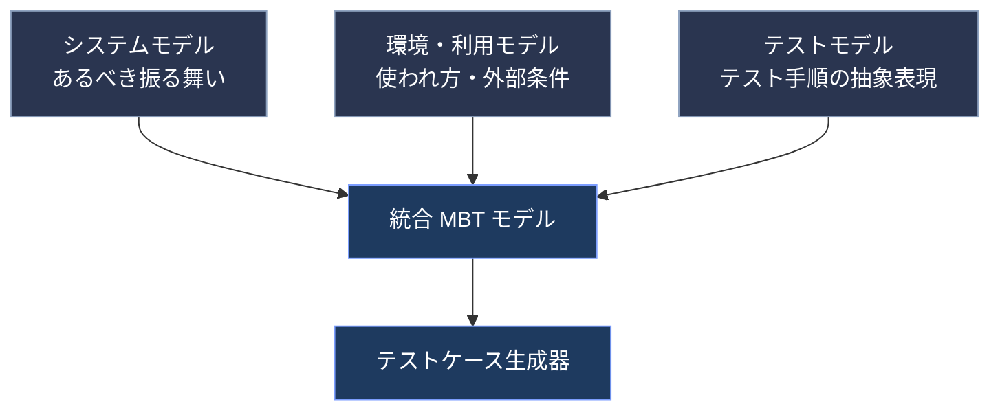

### 9.2 構造モデルと振る舞いモデル

| 区分 | 説明 | 例 |
|---|---|---|
| 構造モデル | 静的な構造を記述 | クラス図、コンポーネント図、分類木（データのモデル化） |
| 振る舞いモデル | 動的なやり取りを記述 | アクティビティ図、BPMN、状態遷移図、シーケンス図 |

### 9.3 テスト目的に合うモデルを選ぶ

| テスト目的 | 適したモデル |
|---|---|
| 業務ワークフローが正しく実装されているか確認 | 業務プロセスモデル（アクティビティ図、BPMN） |
| 特定の状態で正しく応答するか確認 | UML 状態機械 |
| インタフェースが使えるか確認 | インタフェース構造の記述 |
| 想定利用で使えるという確信を得る | 利用者の振る舞いを表す利用モデル |
| 業務ルールをシステムテストで確認 | デシジョンテーブル |

### 9.4 モデルの品質特性（3つの視点）

| 品質特性 | 問い | 主な確認手段 |
|---|---|---|
| **構文の品質（正しさ）** | 言語や指針の規則に沿っているか | ツールによる構文チェック |
| **意味の品質（妥当性）** | 表したい内容として正しいか。生成テストが SUT に対して誤りなく動くか | レビュー、モデルシミュレータ |
| **実用の品質（適合性）** | テスト目的と生成器に合っているか | レビュー、試行生成 |

### 9.5 モデル作成のコツ

1. **目的を絞る**：1つのモデルにすべてを詰め込まない。状態遷移の網羅用とワークフロー検証用を**別々のモデル**にする
2. **抽象度を調整する**：抽象的なほど読みやすいが、アダプテーションの手間は増える
3. **要件IDを紐づける**：モデル要素に要件を結びつけると、要件カバレッジの測定や影響分析ができる
4. **指針（ガイドライン）を作る**：複数人が書いても同じ構文と意味になるようにする
5. **反復的に育てる**：作る → 生成 → レビューを小さく回す。テスト生成はモデルのシミュレーションでもある

### 9.6 設計モデルの流用の注意（単一情報源問題）

開発側の設計モデルをそのままテストモデルに流用すると、**設計の誤りがテストにもそのまま伝播**し、テストの独立性が失われます。そのまま使った場合、導かれるテストは「実装が設計どおりか」を見る検証（Verification）にしかなりません。望ましいのは、**設計用とテスト用で別の人が別のモデルを書く**ことです。

---

## 10. ステップ8：テスト選択基準（何をどこまで生成するか）

同じモデルからでも、基準を変えればテストスイートは変わります。モデルが大きいと、無制限に生成するとテストケース爆発が起きるため、**選択基準で絞り込む**ことが MBT の中心作業になります。

### 10.1 6つの基準ファミリー（ISTQB の整理）

| ファミリー | 概要 | 長所 | 短所 |
|---|---|---|---|
| **要件カバレッジ** | モデルに紐づく要件を網羅 | 規制対応で必須になりやすい | 1要件が複数の振る舞いに紐づく場合の定義が必要 |
| **モデルカバレッジ** | 状態・遷移・分岐など構造要素を網羅 | 網羅の抜けが見える | 全パスなどで爆発しやすい |
| **データ関連** | 同値分割、境界値、ペアワイズ／n-wise | ドメインの網羅に必須 | 組合せ爆発の恐れ |
| **ランダム／確率的** | 経路をランダムまたは確率を付けて選ぶ | 予想外のケースを拾える | 業務的に無意味な長いテストが出る |
| **シナリオ／パターン** | 事前定義のシナリオや部分シナリオ（パターン）で選ぶ | 回帰テストに向く | シナリオの定義・保守に手間 |
| **プロジェクト主導** | リスク、優先度、必要設備などモデルに付与した情報で選ぶ | テストマネジメントに有用 | 情報をモデルに紐づける手間 |

### 10.2 モデル別のカバレッジ指標の例

| モデル | カバレッジ指標の例 |
|---|---|
| アクティビティ図・業務プロセス | アクティビティ網羅、分岐／ゲートウェイ網羅、パス網羅（ループ有無） |
| 状態遷移図 | 状態網羅、遷移網羅、**遷移ペア網羅**、パス網羅 |
| デシジョンテーブル | すべての条件／判定、すべてのアクション |
| データドメイン | 同値クラス網羅、境界値網羅 |
| テキストモデル | 文網羅、分岐網羅 |

### 10.3 基準の組み合わせ方

| 方式 | 意味 | 生成されるスイート |
|---|---|---|
| **合成（Composition）** | すべての基準を同時に満たすテストだけを残す | 積集合（絞り込み） |
| **加算（Addition）** | いずれかの基準を満たすテストをすべて残す | 和集合（広げる） |

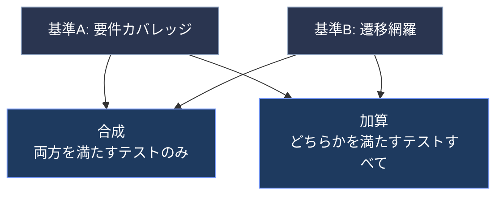

> 💡 **ベストプラクティス**：選択結果は**再現可能**にします。同じモデルと同じ基準なら同じテストが得られるよう、選択の判断とその理由を記録してください。小さなモデル変更で選ばれるパスが大きく入れ替わることがあるため、「モデルが主、テストケースは派生物」という発想の転換が必要です。

### 10.4 生成の自動化度

| 方式 | 内容 | 成熟度 |
|---|---|---|
| 手動生成 | モデルのパスを人が辿ってテストを書く | 低い（MBT の利点が出にくい） |
| 半自動生成 | ツールを使うが、途中や最後に手作業の選択が入る | 中間 |
| 自動生成 | ツールが生成し、そのまま利用可能 | 高い |

---

## 11. ステップ9：テスト生成から実行まで

### 11.1 抽象テストと具体テスト

| 区分 | 内容 | 想定する読者・用途 |
|---|---|---|
| **高水準（抽象）テストケース** | 具体的な入力値・期待値を持たず、手順も粗い | 業務アナリストのレビュー |
| **低水準（具体）テストケース** | 実際の入力値・期待値・詳細な手順を持つ | テスター、自動実行 |

高水準から低水準へ進めるには、**完全に定義された操作、具体的な入力値、具体的な期待値**を補う必要があります。補う場所は、モデルの中（要素の文書化など）でも、モデルの外（抽象値と具体値の対応表など）でも構いません。

### 11.2 オフライン MBT とオンライン MBT

自動実行の方式は2つあります。

| 方式 | 動き | 向いている場面 |
|---|---|---|
| **オフライン MBT** | スクリプト（期待結果を含む）を先に**すべて生成**してから実行 | 再現性が重要、CI で固定スイートを回す |
| **オンライン MBT（オンザフライ）** | 1ステップ実行するたびに次のステップを**その結果を見て生成** | 非決定的な振る舞い、長時間の探索的な実行 |

オンライン MBT は、生成器と SUT が対話する形になります。

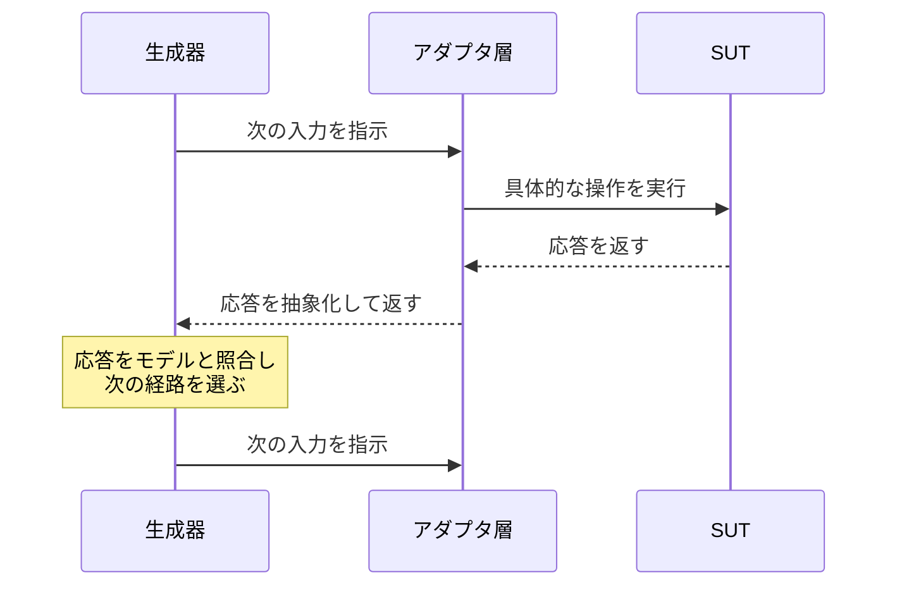

> 💡 オンライン MBT の理論的な土台が、Tretmans らの **ioco（input-output conformance）理論**です。SUT を「入力を受け付け出力を返すラベル付き遷移系」とみなし、モデルとの適合性を形式的に定義します。初学者はまず「モデルと SUT の出力が食い違えば不適合」という直感だけ押さえれば十分です。

### 11.3 テストアダプテーション層

生成されたテストは抽象的です。実際の SUT（画面、API、ハードウェアなど）を動かすには、**抽象と具体のギャップを埋める層**が必要です。

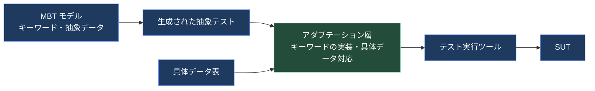

| 実行形態 | アダプテーションの内容 |
|---|---|
| 手動実行 | 生成テストを、手動で使える完全な手順書に仕上げる（具体値を補う） |
| 自動実行（キーワード駆動） | ① テストをスクリプトに出力　② モデルで定義したキーワードを実行ツール言語で実装 |
| 自動実行（データ駆動） | ① 具体的な入力値と期待値を表などで用意　② モデルの抽象データと実データを結びつける |

さらに、**各テストの前提条件**を整える必要があります。後条件で次の前提を作る方法と、各テストの冒頭で前提を設定する方法があります。

### 11.4 変更が起きたとき、どこを直すか

| 変更の種類 | 影響する成果物 |
|---|---|
| 要件・SUT・環境の変更 | MBT モデル（操作・条件・期待結果・データ）、選択基準、アダプテーション層 |
| 機能は変わらないが SUT のインタフェースが変わる（例：画面レイアウトの微修正） | **アダプテーション層のみ** |
| テスト目的・条件の変更 | モデル、選択基準、アダプテーション層 |

これが MBT の大きな利点です。「画面の見た目が変わった」だけなら、モデルもテストケースも触らず、アダプテーション層だけ直せば済みます。

---

## 12. ステップ10：29119-3（文書化）への対応

> ⚠️ このステップは、29119-3 の文書種別に MBT 成果物を対応づけた**筆者の整理**です。要旨が述べているのは「MBT のモデルとツールが生成する情報は、29119-3 の文書化要求の一部または全部を満たすために使える」という点までです。

### 12.1 対応づけの考え方

| 29119-3 の文書（代表例） | MBT での充足の考え方 |
|---|---|
| テスト計画 | MBT ツール、指針、指標、モデルのベースライン管理を記載して補完 |
| テスト設計仕様 | **MBT モデルそのもの**と、選択基準の記録を設計仕様として位置づけられる |
| テストケース仕様 | 生成された抽象／具体テストケースを出力して充当 |
| テスト手順仕様 | 生成されたテスト手順、スクリプト、アダプテーション層仕様 |
| テストデータ要件 | モデル内のデータ定義、具体データ表 |
| テスト実行ログ・結果 | 実行ツールの出力と、モデル要素への紐づけ |
| テスト状況報告・完了報告 | モデルカバレッジ、要件カバレッジなどの MBT 指標を組み込む |

### 12.2 双方向トレーサビリティが鍵

モデル要素に要件を紐づけておくと、生成テストへの追跡リンクが自動で作られ、要件の変更時に影響範囲（再テストすべきテスト）を特定できます。**この自動生成されるトレーサビリティが、監査・規制対応で MBT が重宝される最大の理由**の1つです。

> 💡 **ベストプラクティス**：医療機器・車載・航空など規制の強い領域では、「どのバージョンのモデルのどの要素から、どのテストを生成したか」を構成管理で追跡できるようにしてください。ISTQB シラバスも、MBT 成果物（テストベース、モデル、選択基準、テストケース、アダプテーション層）の構成管理を必須としています。

---

## 13. ステップ11：29119-4（テスト技法）との関係

要旨は「多くの MBT ツールが 29119-4 の1つ以上のテスト技法と指標を実装しているが、それらは個別のツール実装に関わるため本規格の範囲外」と述べています。

| 29119-4 の技法（例） | MBT での現れ方 |
|---|---|
| 同値分割・境界値分析 | データ関連の選択基準。モデルに同値クラスや境界値を記述 |
| 状態遷移テスト | 状態遷移図に対する状態網羅・遷移網羅・遷移ペア網羅 |
| デシジョンテーブルテスト | 条件・アクションの網羅 |
| 組合せテスト（ペアワイズなど） | データ関連の選択基準（n-wise） |
| シナリオテスト | シナリオ／パターンベースの選択 |

つまり、**MBT は技法に取って代わるのではなく、技法を「モデル上でカバレッジ基準として機械的に適用する」手段**です。技法の理解が浅いまま MBT ツールを導入しても、基準の意味がわからず、使いこなせません。

---

## 14. ステップ12：手を動かす——ログイン機能で MBT を体験

ここまでの概念を、小さな例で実感しましょう。

### 14.1 題材の仕様

- ログイン成功で「ログイン済」状態になる
- パスワードを連続で3回間違えると「ロック」状態になる
- ロックは30分で解除される
- ログアウトで「未ログイン」に戻る

### 14.2 手順1：目的を決める

目的：**ログイン関連の状態遷移が仕様どおりか確認する**（振る舞いモデル、システムモデル）。

### 14.3 手順2：モデルを書く（状態遷移図）

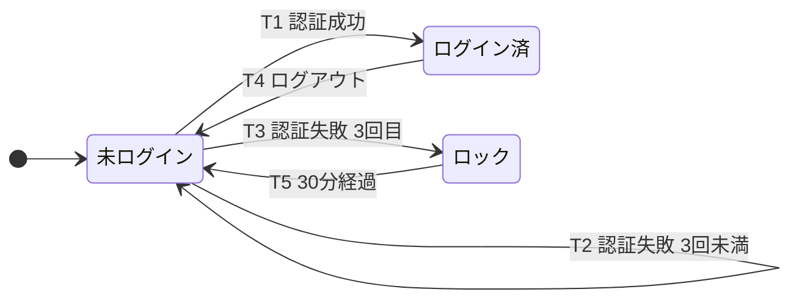

### 14.4 手順3：モデルを検証する

| 確認観点 | 結果 |
|---|---|
| 構文：すべての遷移に事象が付いているか | OK |
| 意味：仕様の記述と一致しているか | OK（レビューで確認） |
| 実用：テスト目的（状態遷移の網羅）に合うか | OK。ただし**失敗回数の境界（2回と3回）**はデータ関連基準で補う必要がある |

### 14.5 手順4：選択基準を決めてテストを生成する

選択基準を「**全遷移網羅**」とした場合のテストケースです。

| テスト | 経路 | カバーする遷移 |
|---|---|---|
| TC-01 | 未ログイン → ログイン済 → 未ログイン | T1、T4 |
| TC-02 | 未ログイン → 失敗 → 失敗 → 失敗でロック → 30分経過で未ログイン | T2、T2、T3、T5 |

**たった2本で、全5遷移（T1〜T5）と全3状態をカバーできます。**

基準を強めると、本数が増えます。

| 基準 | 追加で必要になるテストの例 |
|---|---|
| 遷移ペア網羅 | 「ログイン済 → ログアウト → 再ログイン」のように、連続する2遷移の組合せ |
| 境界値（データ関連） | 失敗2回後に成功（ロックされないことの確認）、失敗3回目で必ずロック |
| 要件カバレッジ | 「ロック」要件に紐づく遷移 T3、T5 を含むテスト |

### 14.6 手順5：アダプテーション（具体化）

| 抽象（モデル上） | 具体（実行時） |
|---|---|
| 認証成功 | 正しい ID `user01`、パスワード `Passw0rd!` を送信 |
| 認証失敗 | 正しい ID、誤ったパスワードを送信 |
| 30分経過 | テスト用に時刻をスタブで進める（実時間30分待たない） |
| ログイン済であることの確認 | マイページへの遷移、またはセッショントークンの存在確認 |

### 14.7 手順6：仕様変更に強いことを確認する

「ロックまでの失敗回数を3回から5回に変える」という変更が入ったとします。

| 方式 | 修正作業 |
|---|---|
| 従来（個別テストケース） | ロック関連のテストをすべて探して、失敗回数を書き換える |
| MBT | **モデルの1か所（T2とT3の条件）を直して再生成** |

この差が、モデルが大きくなるほど効いてきます。

---

## 15. ステップ13：導入判断・ROI・KPI

### 15.1 MBT 導入の判断フロー

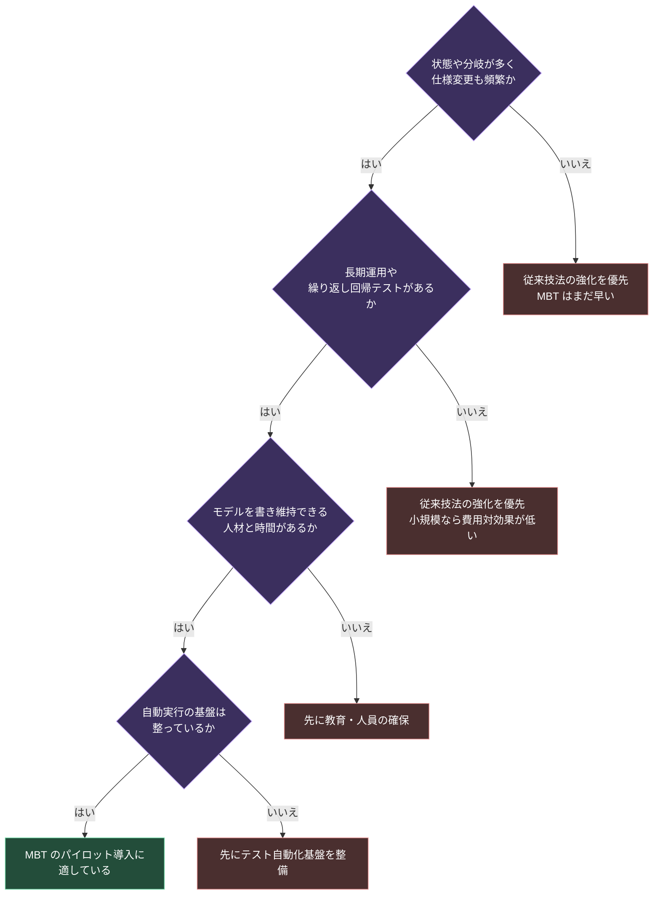

> ⚠️ 上図は ISTQB シラバスのコスト・便益の論点をもとにした**筆者の簡易フロー**です。実際には、組織の目的（品質向上か工数削減かコミュニケーション改善か）を先に決めてください。

### 15.2 導入の5段階（ISTQB が示す普及プロセス）

| 段階 | 内容 |
|---|---|
| 1. 認知（Awareness） | テストプロセスの改善目標を定め、MBT を選択肢として認識 |
| 2. 関心（Interest） | MBT について学ぶ |
| 3. 評価（Evaluation） | 原則と既存アプローチが自分のプロジェクトに適用できるか分析 |
| 4. 試行（Trial） | KPI を定義し、パイロットで改善を測定 |
| 5. 採用（Adoption） | スキル向上と行動変容を伴って定着させる |

### 15.3 コストと便益

| 区分 | 主な項目 |
|---|---|
| **初期コスト（組織）** | 既存リソースの確認、アプローチとツールの評価、方法とプロセスの定義、要件・テスト管理・CI との統合、教育、ライセンス |
| **初期コスト（プロジェクト）** | プロジェクト固有の指針、初期モデル作成、既存テスト資産のモデル化 |
| **継続コスト** | ツール保守、モデルのリファクタリングと検証、選択基準の選定、アダプテーション層の開発、モデル品質の継続確認 |
| **便益** | 要件の早期検証による手戻り削減、テスト設計の冗長性排除、テスト実装の自動化、テストケース数の最適化、トレーサビリティ向上 |

### 15.4 追跡すべき KPI の例

- モデルに取り込まれた要件数と、生成テストによる要件カバレッジ率
- モデルの規模と複雑さ
- 生成テストケース／スクリプトの数、1人日あたりの生成数
- **モデル化の段階で見つかった要件上の欠陥数**
- モデル要素のプロジェクト間再利用度
- ステークホルダー（業務・開発・テスト）によるモデルの利用度
- 従来手法と比べた生産性向上率、欠陥検出力の向上率

### 15.5 ツールの統合

MBT ツール単体ではなく、次のツールとの連携が成功の鍵です。

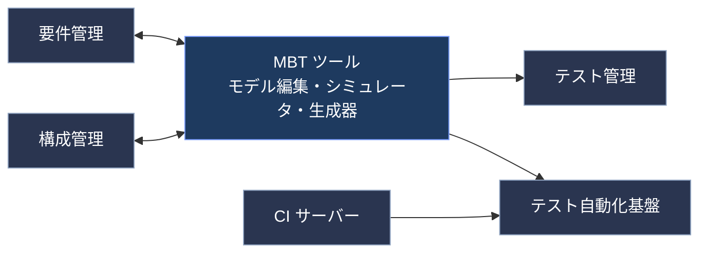

---

## 16. ステップ14：よくある失敗とアンチパターン

| # | 失敗パターン | なぜ起きるか | 対策 |
|---|---|---|---|
| 1 | 「MBT ですべて解決する」と期待する | 従来技法の欠落を MBT で埋められると誤解 | MBT は技法の上に乗るものと理解する |
| 2 | 「ツールを買えば終わり」と考える | ツール導入が最初の一歩になっている | まず測定可能な改善目標を決める |
| 3 | モデルは常に正しいと思い込む | モデルの誤りが全生成テストに伝播する | レビュー、静的解析、シミュレーションで検証 |
| 4 | テストケース爆発 | 全パス網羅などの強い基準を無制限に適用 | 基準の組み合わせとフィルタで制御 |
| 5 | 1つのモデルに全部入れる | 目的が整理されていない | 目的別に複数のモデルに分ける |
| 6 | 詳細すぎる／粗すぎるモデル | 抽象度の判断ミス | テスト目的から逆算して抽象度を決める |
| 7 | 設計モデルをそのまま流用 | 手間削減を優先 | テスト用モデルは別の人が別に作る |
| 8 | アダプテーションを後回し | 抽象モデルの後工程と軽視 | モデリング中からアダプテーション仕様を並行して準備 |
| 9 | 生成物を手直しして運用 | その場しのぎ | 直すのは**常にモデル**。生成物は再生成する |
| 10 | 指針なしで複数人がモデルを書く | 自由に書ける | モデリングガイドラインを整備 |

---

## 17. 学習ロードマップとチェックリスト

### 17.1 学習の進め方

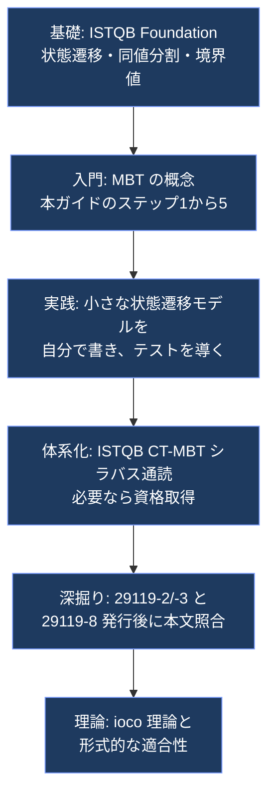

### 17.2 理解度チェックリスト

- [ ] MBT を「モデルからテストを導く手法」と説明できる
- [ ] 「モデルが主、テストケースは派生物」の意味を説明できる
- [ ] 29119-8 の3つの柱（用語定義、29119-2 の実装、29119-3 の実装）を言える
- [ ] 範囲外のもの（生成アルゴリズム、ツール選定）を言える
- [ ] システムモデル／環境・利用モデル／テストモデルの違いを説明できる
- [ ] 選択基準の6ファミリーを挙げられる
- [ ] 合成と加算の違いを説明できる
- [ ] オフライン MBT とオンライン MBT の違いを説明できる
- [ ] アダプテーション層の役割を説明できる
- [ ] 簡単な状態遷移図から全遷移網羅のテストを導ける
- [ ] 設計モデル流用の単一情報源問題を説明できる
- [ ] 導入時に追うべき KPI を3つ以上挙げられる

---

## 18. 用語集

| 用語 | 意味 |
|---|---|
| MBT（Model-Based Testing） | モデルを使ってテストを導くテスト手法 |
| MBT モデル | テスト生成の元になる、期待動作の抽象的な記述 |
| SUT（System Under Test） | テスト対象のシステム |
| テストウェア | テスト計画、テストケース、データ、スクリプトなどのテスト成果物の総称 |
| テスト選択基準 | モデルから「どのテストを選ぶか」を決める基準 |
| カバレッジアイテム | カバレッジの数え方の単位（状態、遷移、要件など） |
| テストケース爆発 | 生成されるテスト数が膨大になる現象 |
| 抽象テスト（高水準） | 具体値や詳細手順を持たないテスト |
| 具体テスト（低水準） | 具体値と詳細手順を持つテスト |
| テストアダプテーション層 | 抽象テストと SUT の具体インタフェースを結ぶ層 |
| オフライン MBT | 先に生成してから実行する方式 |
| オンライン MBT | 実行しながら次のステップを生成する方式 |
| ioco | input-output conformance の略。入出力ラベル付き遷移系における適合性関係（Tretmans） |
| 単一情報源問題 | 設計モデルを流用すると設計の誤りがテストにも伝播する問題 |
| トレーサビリティ | 要件・モデル・テスト・欠陥の相互の追跡可能性 |

---

## 19. FAQ

**Q1. 29119-8 はもう買って読めますか？**
2026年10月6日時点では「発行手続き中」で、ISO ストアでの正式な入手はまだです。ISO は最終制作工程を最大7週間としています。発行されたら ISO ストア（および IEEE 側の窓口）で確認してください。

**Q2. MBT 資格はありますか？**
あります。ISTQB の Certified Tester Model-Based Tester（CT-MBT）です。受験には Foundation Level の取得が必要です。シラバスは v1.1（2024年2月発行）で、Foundation Level v4.0 に整合させた軽微な更新です。標準の研修時間は合計725分です。

**Q3. 29119-8 に準拠すると何が嬉しいですか？**
規制対応や取引先への説明で、「MBT のプロセスと文書化が国際規格に沿っている」と示せる点です。モデルやツール出力を 29119-3 の文書として使える道筋が示されるため、監査対応の負担軽減が期待できます（本文の確認が前提です）。

**Q4. UML が書けないと MBT はできませんか？**
できます。ISTQB シラバスの演習用言語も、UML アクティビティ図／状態機械の**ごく小さな部分集合**です。モデルは「ツールが解釈できる厳密な構文」であれば、テキスト形式でも構いません。重要なのは記法よりも、**テスト目的に合う抽象度で書くこと**です。

**Q5. 手動テストが中心の組織でも MBT は使えますか？**
使えます。生成されたテストを手動実行用の手順書に仕上げる運用も可能です。ただし、自動生成・自動実行を組み合わせたときに効果が最大化し、規格もその状態を前提としています。

**Q6. 生成されたテストが意味不明なときは？**
モデルの誤り・抽象度の不適切・選択基準の不適切のいずれかを疑ってください。生成物を直すのではなく、**モデルまたは基準を直して再生成**します。

---

## 20. 出典 URL 一覧

> 各情報の根拠となるソースです。「信頼度」は、本ガイドで使った箇所の根拠としての強さを示します。

### 20.1 規格・公式情報（◎）

| # | 資料 | URL | 本ガイドでの使用箇所 |
|---|---|---|---|
| S1 | ISO 公式ページ：ISO/IEC/IEEE 29119-8（要旨、ステージ履歴、委員会、ICS） | <https://www.iso.org/standard/89908.html> | 2章、4〜6章、19章 |
| S2 | SNV（スイス規格協会）：FDIS 29119-8（要旨の別掲載） | <https://connect.snv.ch/en/isoiecieee-fdis-29119-8> | 要旨の裏取り |
| S3 | カナダ規格評議会 標準データベース：FDIS 29119-8 | <https://scc-ccn.ca/standardsdb/standards/8191904> | 要旨の裏取り |
| S4 | IEEE Standards Association：IEEE/ISO/IEC P29119-8 | <https://standards.ieee.org/ieee/29119-8/11670> | IEEE 側でも規格化プロジェクトが存在することの確認 |

> ⚠️ S4 のページを検索ツールで取得した際の本文は、他のプロジェクト（データ移行テスト）の説明が混在しているように見えました。**IEEE 側の記述は参考程度に留め、正式な範囲は ISO ページの要旨を優先**しています。

### 20.2 ISTQB（国際ソフトウェアテスト資格委員会）（○）

| # | 資料 | URL | 本ガイドでの使用箇所 |
|---|---|---|---|
| S5 | ISTQB：Certified Tester Model-Based Tester（CT-MBT）資格ページ | <https://www.istqb.org/certifications/model-based-tester> | 19章 Q2 |
| S6 | ISTQB CT-MBT シラバス v1.1（2024-02-23） | <https://www.istqb.org/wp-content/uploads/2024/11/ISTQB_CT-MBT_-_Syllabus_Version_v1.1.pdf> | 3章、7〜15章（中核の補強情報） |
| S7 | ISTQB プレスリリース：CT-MBT v1.1 公開 | <https://istqb.org/press-release-certified-tester-model-based-testing-v11-now-available/> | 19章 Q2 |

### 20.3 国際的な研究者・実務家による文献（○）

| # | 著者・資料 | URL | 本ガイドでの使用箇所 |
|---|---|---|---|
| S8 | Mark Utting、Alexander Pretschner、Bruno Legeard「A Taxonomy of Model-Based Testing Approaches」（Software Testing, Verification and Reliability 22(5), 2012） | <https://researchcommons.waikato.ac.nz/handle/10289/6393> | 7章（プロセス）、MBT の分類 |
| S8b | 同上の初出ワーキングペーパー（Waikato大学、2006） | <https://researchcommons.waikato.ac.nz/items/36e77193-dea8-4e44-bda3-cf746852856f> | 同上 |
| S9 | Anne Kramer、Bruno Legeard ほか『Model-Based Testing Essentials』（Wiley, 2016）第3章（プロセス面） | <https://www.oreilly.com/library/view/model-based-testing-essentials/9781119130017/c03.xhtml> | 7章 |
| S10 | Jan Tretmans「Model-based testing with labeled transition systems」（Microsoft Research 講演ページ） | <https://www.microsoft.com/en-us/research/?p=183376> | 11章（ioco） |
| S10b | Jan Tretmans「Model-Based Testing」講義スライド（HSST 2014） | <https://wiki.hh.se/ceres/images/4/44/Jan_tretmans_hsst_2014_slides_set1.pdf> | 3章（手動→モデルベースの整理） |
| S11 | ioco 理論に基づく n 完全テストスイート構成（Software Quality Journal） | <https://link.springer.com/article/10.1007/s11219-018-9422-x> | 11章（ioco の位置づけ） |
| S12 | Dagstuhl／CONCUR 2023：Model-Driven Engineering と MBT（ioco の普及状況） | <https://drops.dagstuhl.de/storage/00lipics/lipics-vol279-concur2023/LIPIcs.CONCUR.2023.4/LIPIcs.CONCUR.2023.4.pdf> | 11章（ioco が MBT ツールで広く使われていること） |

### 20.4 関連する国際標準（○）

| # | 資料 | URL | 本ガイドでの使用箇所 |
|---|---|---|---|
| S13 | ETSI ES 202 951 V1.1.1（2011）MBT：モデリング記法の要求事項 | <https://www.etsi.org/deliver/etsi_ES/202900_202999/202951/01.01.01_60/es_202951v010101p.pdf> | MBT の標準化の流れ |

### 20.5 検索で確認できなかったこと

- **29119-8 本文の条項構成・各要求事項**：本文は有償・著作権保護で、AI による利用も ISO が禁止しているため確認していません
- **日本国内での JIS 化の動向**：今回の検索では確認できていません
- **MBT ツールの個別比較**：規格がツール選定を範囲外としており、特定ツールの推奨は行っていません

---

*本ガイドは、2026年10月6日時点で公開されていた情報に基づく解説です。ISO/IEC/IEEE 29119-8 の本文は未確認のため、条項レベルの正確性が必要な場合は、発行後に正式な規格本文をご確認ください。*
