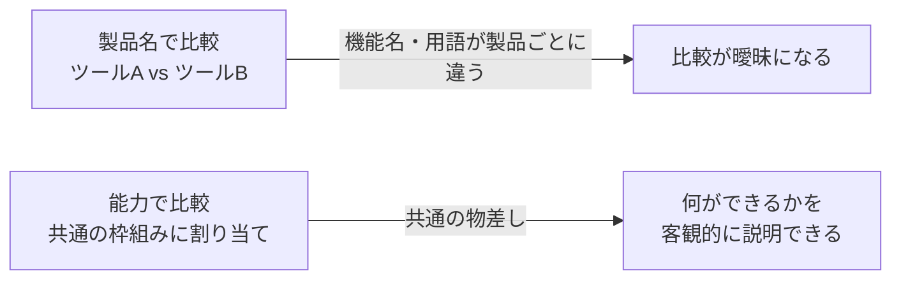
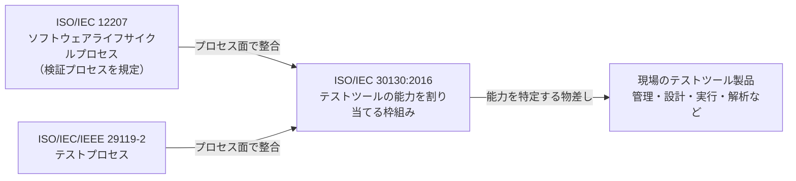
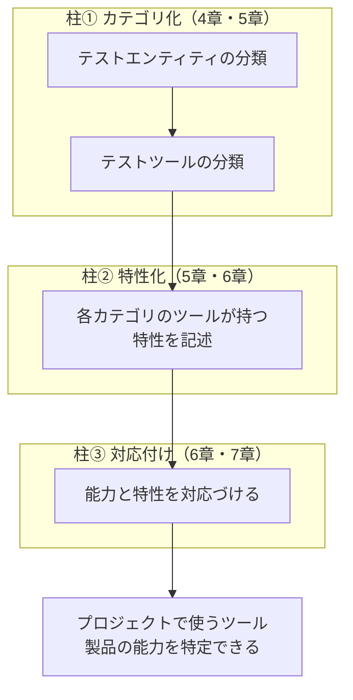
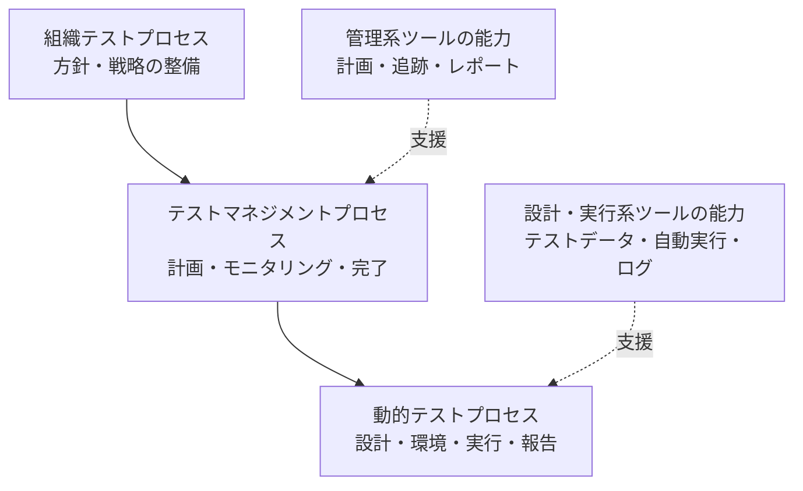
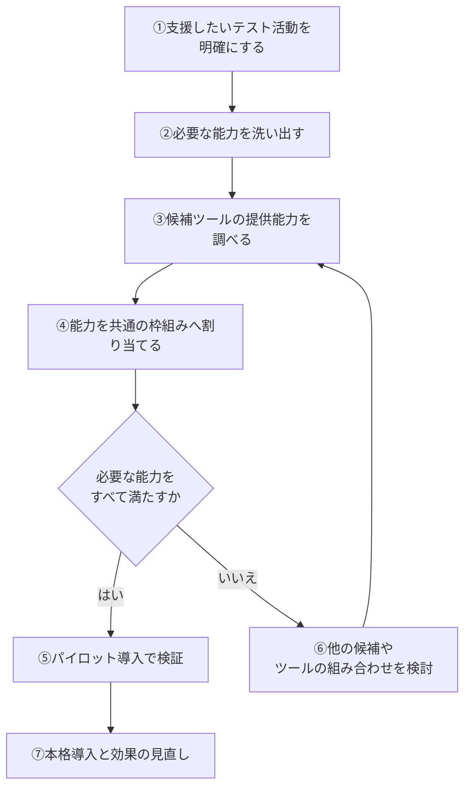

# ISO/IEC 30130:2016 初学者向け概要ガイド

**Software engineering — Capabilities of software testing tools（ソフトウェアエンジニアリング — ソフトウェアテストツールの能力）**

> 本ガイドは、ISO/IEC 30130:2016 を「テストツールを選ぶ・評価する・説明する」立場の初学者が、ステップバイステップで理解できるように構成した解説です。
> 調査基準日は **2026年10月6日** です。図解は Mermaid と Markdown 表のみで構成しています。

---

## 0. このガイドの読み方と「確認できたこと／できなかったこと」

最初に、情報の信頼性について正直にお伝えします。

| 区分 | 内容 | 根拠の強さ |
|------|------|-----------|
| ✅ 確認済み | 規格の目的・範囲（Abstract/Scope）、章と内容の対応、発行・見直し履歴、委員会、ページ数、目次の一部 | ISO公式ページ・各国標準機関のカタログ（一次情報） |
| ✅ 確認済み | 関連規格（ISO/IEC/IEEE 29119-2、ISO/IEC 12207）との位置づけ | ISO公式Abstract、29119-2の公開プレビュー |
| ⚠️ 未確認 | 規格本文（各カテゴリの具体名、特性・能力の項目リスト、付属書の中身） | 有料PDFのため本ガイドでは閲覧していません |
| 💡 解説者による補足 | 実務での使い方、評価シート、ツール例 | 一般的なテスト工学の知識と著名実務家の発言に基づく筆者の整理 |

> **重要**：ISO/IEC 30130 の本文に書かれている具体的な分類名・項目名は、有料規格のため本ガイドでは断定していません。
> 規格本文に当たる必要がある箇所には「📘 本文要確認」と明記しています。

---

## 1. 30秒でわかる ISO/IEC 30130:2016

| 質問 | 答え |
|------|------|
| 何の規格？ | **ソフトウェアテストツールが持つ「能力（Capabilities）」を整理するための枠組み**を定める国際規格 |
| 何ができるようになる？ | プロジェクトで使っているテストツール製品が「何ができるのか」を、共通の物差しで特定できる |
| 誰向け？ | テストツールの選定者、QAリード、ツールベンダー、監査・評価担当、テストプロセス改善担当 |
| 認証制度はある？ | 公式情報の範囲では、認証を前提とした規格ではありません（準拠を主張する枠組みというより、整理の共通言語） |
| 今も有効？ | **有効**。2022年に見直しの結果「確認（Confirmed）」されています |

---

## 2. Step 1：まず「テストツール」を整理しよう

### 2-1. テストツールとは

ソフトウェアテストでは、人間が手作業で行う作業の一部を、ソフトウェア（ツール）が支援または代行します。

| テストの作業 | ツールが支援する例 |
|-------------|-------------------|
| テストの計画・進捗管理 | テスト管理ツール（Jira、TestRail、qTest、Zephyr など） |
| テストの実行 | 自動テストツール（Selenium、Cypress、Playwright、Appium など） |
| 結果の記録・分析 | レポート、ダッシュボード、カバレッジ計測 |
| 欠陥の追跡 | 欠陥管理ツール |

> ツール例の出典：テストツールの6分類を整理した [Testkube の用語集](https://testkube.io/glossary/it-testing-tools)（参考情報）

### 2-2. なぜ「能力」という見方が必要か

ツールは製品ごとに名前も機能も違います。たとえば「Aツールはテスト管理も実行もできる」「Bツールは実行だけ」のように、製品の名前だけでは比較できません。

そこで ISO/IEC 30130 は、**製品名ではなく「能力」という共通の単位**でツールを見る枠組みを提供します。

---

## 3. Step 2：この規格の「立ち位置」を理解する

### 3-1. 関連する規格との関係

ISO公式のAbstractによると、ISO/IEC 30130 は次の2つの既存規格と**テストプロセスの面で完全に整合（fully harmonized）**しています。

| 関連規格 | 何を定めているか | 30130との関係 |
|---------|------------------|--------------|
| ISO/IEC/IEEE 29119-2 | ソフトウェアテストプロセス | テストプロセスを定義するのは29119-2。30130はそのプロセスと整合する形で、テストツールの能力の枠組みを提供する |
| ISO/IEC 12207 | ソフトウェアライフサイクルプロセス（検証プロセスを含む） | 検証プロセスを定義するのは12207。30130はそのプロセスと整合する形で、テストツールの能力の枠組みを提供する |

### 3-2. ひとことで言うと

> **29119-2 が「テストで何をするか（プロセス）」を決め、30130 が「その作業を支えるツールに何ができるか（能力）」を整理する。**

### 3-3. 発行元と基本情報（ISO公式ページより）

| 項目 | 内容 |
|------|------|
| 規格番号 | ISO/IEC 30130:2016 |
| 規格名 | Software engineering — Capabilities of software testing tools |
| 版 | Edition 1（第1版） |
| 発行 | 2016年（公式ページ上の版表記は2016-02、公表段階の記録は2016-01-19） |
| ページ数 | 27ページ（ISO・IEC公式表記）。BSI英国版は38ページと表記（版組の違い） |
| 担当委員会 | ISO/IEC JTC 1/SC 7（ソフトウェア及びシステムエンジニアリング） |
| ICS分類 | 35.080（ソフトウェア） |
| ステージ | **90.93（International Standard confirmed）** |
| 言語 | 英語のみ（ISOページ上で日本語版の記載なし） |
| 価格（ISO） | CHF 159（変動する可能性があります） |
| SDGs | 目標9「産業と技術革新の基盤をつくろう」に貢献 |

---

## 4. Step 3：規格の「目的」と「守備範囲」

### 4-1. 何を定義している規格か

ISO公式Abstractによれば、この規格は **「プロジェクトがソフトウェアテストに使う製品の能力を特定するために、テストツールの能力を割り当てる枠組み」** を定義しています。

### 4-2. 既存規格が扱わない3領域に焦点

既存のISO/IEC規格が扱っていない領域として、次の3つが明記されています。

| 柱 | 日本語での意味 | 対応する章 |
|----|---------------|-----------|
| ① Categorization | **カテゴリ化**：テストの対象となるもの（テストエンティティ）とテストツールの分類 | 4章・5章 |
| ② Characterization | **特性化**：各テストツールカテゴリの特徴づけ | 5章・6章 |
| ③ Mapping | **対応付け**：ツールの「能力」と「特性」の対応づけ | 6章・7章 |

### 4-3. 章構成のわかっている範囲

公開されている目次プレビューから、次の章タイトルが確認できました。

| 章 | 章タイトル（英語） | 日本語訳 | 確認状況 |
|----|-------------------|---------|---------|
| 4 | Object model for software testing tools | テストツールのオブジェクトモデル | ✅ 目次で確認 |
| 5 | （タイトル未確認） | スコープ記述上は「カテゴリ化」「特性化」に関係 | 📘 本文要確認 |
| 6 | Characteristics of software testing tools | テストツールの特性 | ✅ 目次で確認 |
| 7 | Capabilities of software testing tools | テストツールの能力 | ✅ 目次で確認 |

### 4-4. 3本柱の関係図

---

## 5. Step 4：3本柱を初学者向けにかみ砕く

> ⚠️ このステップは、規格が示す**枠組みの考え方**を理解するための解説です。具体的なカテゴリ名や項目名は規格本文で確認してください（📘 本文要確認）。

### 5-1. 柱①「カテゴリ化」：何を対象に、何で支えるか

テストでは、テストされるもの（ソフトウェアの部品、システム、成果物）と、テストを支えるツールの両方が登場します。

| 見る対象 | 問い | イメージ |
|---------|------|---------|
| テストエンティティ | テストに関わる「もの」にはどんな種類があるか | テスト対象、テスト関連成果物など |
| テストツール | それを支えるツールはどんな種類に分けられるか | 管理系、設計系、実行系、解析系など |

**ポイント**：先に「対象物の整理（オブジェクトモデル）」を行い、そのうえでツールを分類します。分類の土台があるから、あとで能力を割り当てられます。

### 5-2. 柱②「特性化」：カテゴリごとの特徴を言葉にする

カテゴリに分けただけでは、「そのカテゴリのツールは何が特徴なのか」が分かりません。そこで、カテゴリごとに特徴（特性）を記述します。

| 比喩 | 説明 |
|------|------|
| 図書館の分類 | 「文学」「科学」と棚を分ける（カテゴリ化）→ 各棚にどんな本が置かれ、どう使われるか説明する（特性化） |

### 5-3. 柱③「対応付け」：能力と特性をつなぐ

最後に、ツールが実際に提供する「能力（できること）」と、カテゴリの「特性」を対応づけます。これにより、あるツール製品を見たときに「このカテゴリのこの能力を持っている」と説明できます。

---

## 6. Step 5：29119-2 のテストプロセスと重ねて見る

### 6-1. テストプロセスの3層

ISO/IEC/IEEE 29119-2 は、テストプロセスを次の3つの層で定義しています（2021年版の目次・解説で確認）。

| 層 | 2021年版の章 | 主な内容 |
|----|-------------|---------|
| 組織テストプロセス | 6章 | 組織としてのテスト方針・戦略の整備 |
| テストマネジメントプロセス | 7章 | テスト戦略・計画、モニタリングと制御、テスト完了 |
| 動的テストプロセス | 8章 | テスト設計・実装、テスト環境とデータの管理、実行、インシデント報告 |

### 6-2. 層ごとにツールの能力がどう効くか（💡 解説者による整理）

> 💡 上図は理解を助けるための概念図です。各プロセスにどの能力がどう対応づくかの正式な表は、規格本文（📘 本文要確認）を参照してください。

### 6-3. バージョンの注意点

| 事実 | 意味 |
|------|------|
| 30130は2016年発行 | 当時の最新の29119-2は2013年版だった |
| 29119-2は2021年に改訂され2013年版を置き換えた | 2021年版では「テスト条件」の代わりに「テストモデル」の語が使われるなど変更あり |
| 30130は2022年に「確認」のみ | 改訂ではなく内容は2016年版のまま |

**示唆（推定）**：30130 が前提にしているプロセス記述は、発行時点の版に基づくと考えられます。現行の2021年版と用語がずれている可能性があるため、併読時は用語の違いに注意してください。

---

## 7. Step 6：現場のツール分類と見比べる

規格の本文を持っていなくても、業界で広く使われる分類と照らして考えると理解が深まります。

### 7-1. ISTQB（国際的な認定団体）での整理

ISTQB Foundation Level 2018 シラバスの第6章（テストツール）は、ツールを次の観点で整理しています。

| ISTQBの観点 | 概要 |
|------------|------|
| テストとテストウェアの管理 | 管理・トレーサビリティ・レポート |
| 静的テスト | 静的解析、レビュー支援 |
| テスト設計と実装 | テストケース・テストデータの作成 |
| テスト実行とログ | 自動実行、結果ログ |
| 性能測定と動的解析 | 負荷・性能・カバレッジなど |
| 特殊なテストニーズ | 特定の目的に特化したツール |

### 7-2. 30130との関係（比較して理解するための整理）

| 観点 | ISTQBシラバス | ISO/IEC 30130 |
|------|--------------|---------------|
| 位置づけ | 学習・資格のための知識体系 | 国際規格としての枠組み |
| 狙い | ツール活用の考え方・リスク・導入ポイントの理解 | ツール製品の能力を共通の枠組みへ割り当てる |
| 特徴 | 導入時のリスクや成功要因も扱う | 分類・特性・能力の対応づけに焦点 |

> 2つは**競合ではなく補完関係**です。ISTQBで考え方を学び、30130で能力の整理方法を押さえる、という使い分けが現実的です。

---

## 8. Step 7：実務での使い方（💡 解説者による提案）

> ここからは規格の要求事項ではなく、30130の考え方を実務に応用するための**筆者の提案**です。

### 8-1. ツール評価フロー

### 8-2. 能力カバレッジ評価シートの例

必要な能力ごとに、候補ツールがどれだけ満たすかを記録する表です（自作テンプレートの例）。

| 支援したいテスト活動 | 必要な能力 | 優先度 | ツールA | ツールB | 備考 |
|--------------------|-----------|-------|--------|--------|------|
| テスト計画・進捗管理 | 進捗の可視化 | 高 | ○ | △ | |
| テスト設計・実装 | テストデータの生成支援 | 中 | × | ○ | |
| テスト実行 | 自動実行とログ保存 | 高 | ○ | ○ | |
| 結果分析 | レポート出力 | 中 | △ | ○ | |

凡例：○＝満たす、△＝一部満たす、×＝満たさない

### 8-3. 成功のカギは「ツールの外」にもある

国際的なテスト自動化の第一人者 **Dorothy Graham 氏**（『Software Test Automation』『Experiences of Test Automation』の共著者、ISTQB Foundation Syllabus 策定メンバー）は、システムレベルの自動テスト実行で多くの組織が期待した効果を得られない理由は、技術要因ではなく**マネジメントの課題**であることが多い、と述べています（STAREAST 2016 講演紹介より）。

| 教訓 | 30130を使うときの意味 |
|------|----------------------|
| 能力が揃っていても成功するとは限らない | 能力の整理はスタート地点。運用体制・保守コストも評価する |
| 導入目的の曖昧さがリスクになる | 手順①（支援したい活動の明確化）を省略しない |

---

## 9. Step 8：よくある誤解と注意点

| よくある誤解 | 正しい理解 |
|-------------|-----------|
| 30130はおすすめツールの一覧だ | **違います**。製品名の推奨ではなく、能力を整理する枠組みです |
| 30130に準拠した認証がある | 公式情報の範囲では、認証制度を前提とした記載は確認できていません |
| 最新のAIテストツールも網羅している | 2016年発行・2022年確認のみ。**近年の新しい種類のツールは本文に明示されていない可能性**があります（推定） |
| 29119-2の最新版と完全に同じ用語 | 発行時期のずれがあるため、用語は照らし合わせが必要です |
| 無料で全文が読める | 有料規格です（ISOサイトでサンプル閲覧は可能） |

### 9-1. この規格を学ぶときのコツ

1. **まず29119-2のプロセス（3層）を頭に入れる**
2. **ISTQBシラバス第6章のツール分類と見比べる**
3. **自社のツールを書き出し、「何ができるか」を言葉にしてみる**
4. **本文を購入できる場合は、5章〜7章の表を自社ツールで試す**

---

## 10. 規格のライフサイクル（ISO公式より）

| 段階 | 日付 | 内容 |
|------|------|------|
| 10.99 | 2014-03-25 | 新規プロジェクト承認 |
| 30.99 | 2014-12-02 | CDがDISとして登録承認 |
| 40.20 | 2015-02-09 | DIS投票開始（12週間） |
| 40.60 | 2015-05-11 | 投票終了 |
| 40.99 | 2015-10-09 | DIS承認、FDISへ |
| 50.60 | 2015-11-24 | FDIS投票終了 |
| 60.60 | 2016-01-19 | 国際規格として公表 |
| 90.20〜90.60 | 2021-01-15〜2021-06-05 | 定期見直し |
| **90.93** | **2022-05-24** | **確認（現行版として継続）** |

ISOでは規格は5年ごとに見直されます。次回の見直しは2027年前後が目安です（📘 公式スケジュールではなく推定）。

### 国ごとの採用状況（確認できた範囲）

| 国・機関 | 規格名 | 備考 |
|---------|--------|------|
| 英国 BSI | BS ISO/IEC 30130:2016 | 2016年1月31日付 |
| カナダ CSA | CSA ISO/IEC 30130-16 (R2021) | 2021年に再確認 |
| 湾岸諸国 GSO | GSO ISO/IEC 30130:2021 | 2021年7月承認 |

---

## 11. 理解度チェック

### 問題

1. ISO/IEC 30130 が定義しているものは何ですか？
2. 規格が「既存規格が扱わない」としている3領域を挙げてください。
3. ISO/IEC 30130 と整合している2つの規格は何ですか？
4. 現在のステージ（90.93）は何を意味しますか？
5. この規格は特定のツール製品を推奨していますか？

### 解答

| 問 | 解答 |
|----|------|
| 1 | テストツールの能力を割り当てるための枠組み |
| 2 | ①テストエンティティ・ツールのカテゴリ化 ②各カテゴリの特性化 ③能力と特性の対応付け |
| 3 | ISO/IEC/IEEE 29119-2（テストプロセス）と ISO/IEC 12207（検証プロセスを含むライフサイクルプロセス） |
| 4 | 国際規格が定期見直しの結果「確認」され、現行版として有効なこと |
| 5 | いいえ。製品推奨ではなく、能力を整理する枠組みです |

---

## 12. 参考ソースURL（根拠一覧）

### 12-1. 一次情報・公的カタログ（確認度：◎）

| 内容 | URL |
|------|-----|
| ISO公式ページ（Abstract、ライフサイクル、基本情報） | <https://www.iso.org/standard/64901.html> |
| IEC Webstore（出版情報、ページ数、委員会） | <https://webstore.iec.ch/publication/24084> |
| カナダ標準評議会（SCC）データベース | <https://scc-ccn.ca/standardsdb/standards/8159615> |
| CSA / ANSI Webstore（Scope文、採用規格） | <https://webstore.ansi.org/standards/csa/csaisoiec3013016r2021> |
| BSI英国版の規格情報 | <https://www.en-standard.eu/bs-iso-iec-30130-2016-software-engineering-capabilities-of-software-testing-tools/> |
| GSO（湾岸標準化機構）採用情報 | <https://dgsm.gso.org.sa/store/standards/GSO:788270?lang=en> |

### 12-2. 関連規格の情報（確認度：◎〜○）

| 内容 | URL |
|------|-----|
| ISO/IEC/IEEE 29119-2:2021 解説（BSI） | <https://shop-checkout.bsigroup.com/products/software-and-systems-engineering-software-testing-test-processes-1> |
| 29119-2:2021 目次プレビュー（ANSI） | <https://webstore.ansi.org/preview-pages/ISO/preview_ISO+IEC+IEEE+29119-2-2021.pdf> |
| 29119-2 規格概要（Nimonik） | <https://standards.nimonik.com/products/ieee/ieee-iso-iec-29119-2/> |
| ISO/IEC 29119 シリーズ概説（Wikipedia） | <https://en.wikipedia.org/wiki/ISO/IEC_29119> |
| ISO/IEC JTC 1/SC 7 概要（Wikipedia） | <https://en.wikipedia.org/wiki/ISO/IEC_JTC_1/SC_7> |
| ISO 30000番台規格一覧（Wikipedia） | <https://en.wikipedia.org/wiki/List_of_ISO_standards_30000%E2%80%9399999> |

### 12-3. 著名な国際的実務家・教育資料（確認度：○）

| 内容 | URL |
|------|-----|
| Dorothy Graham 氏のプロフィールと講演紹介（STAREAST 2016） | <https://conferences.techwell.com/archives/stareast-2016/speakers/dorothy-graham.html> |
| Dorothy Graham 氏 "Fifty Years of Test Automation"（EuroSTAR、AutomationSTAR 2024） | <https://community.eurostarsoftwaretesting.com/topic/test-automation/fifty-years-of-test-automation/> |
| Dorothy Graham 氏インタビュー（StickyMinds） | <https://www.stickyminds.com/interview/long-road-test-automation-interview-dorothy-graham> |
| ISTQB Foundation 2018「テストツールサポート」コース概要 | <https://library.skillport.com/coursedesc/it_sdstfd_11_enus/summary.htm> |
| Software Testing Foundations 第7章 テストツール（O'Reilly） | <https://oreilly.com/library/view/software-testing-foundations/9781492001454/ch07.html> |

### 12-4. 一般的なツール分類の参考（確認度：△）

| 内容 | URL |
|------|-----|
| IT Testing Tools の6分類（Testkube） | <https://testkube.io/glossary/it-testing-tools> |
| テストツールの種類（TutorialsPoint） | <https://www.tutorialspoint.com/software_testing_dictionary/test_tools.htm> |

### 12-5. 調査上の制約（正直な注記）

| 項目 | 内容 |
|------|------|
| 規格本文 | 有料のため閲覧できず、章の中身（5〜7章の具体的な表や分類名）は確認していません |
| VDE社のプレビューPDF | 自動アクセス不可のため、検索結果の断片（目次の一部）のみ確認 |
| ISO OBP（オンライン閲覧） | JavaScript前提のため取得不可 |
| 30130単独を扱う著名開発者の投稿 | 今回の調査範囲では見つかっていません。そのため Dorothy Graham 氏などの**テストツール全般に関する国際的な発言**を補助的に引用しています |
| 日本語資料 | 30130を日本語で詳しく解説した公的資料は今回の調査では確認できていません |

> **次のステップのおすすめ**：規格本文（ISOストアで購入、またはお住まいの国の標準機関経由）で 5章〜7章の表を確認し、本ガイドの「📘 本文要確認」箇所を埋めると、より正確なガイドに仕上がります。

---

*本ガイドは公開情報に基づく学習用の解説であり、ISO/IEC 30130:2016 の本文を転載・代替するものではありません。*
