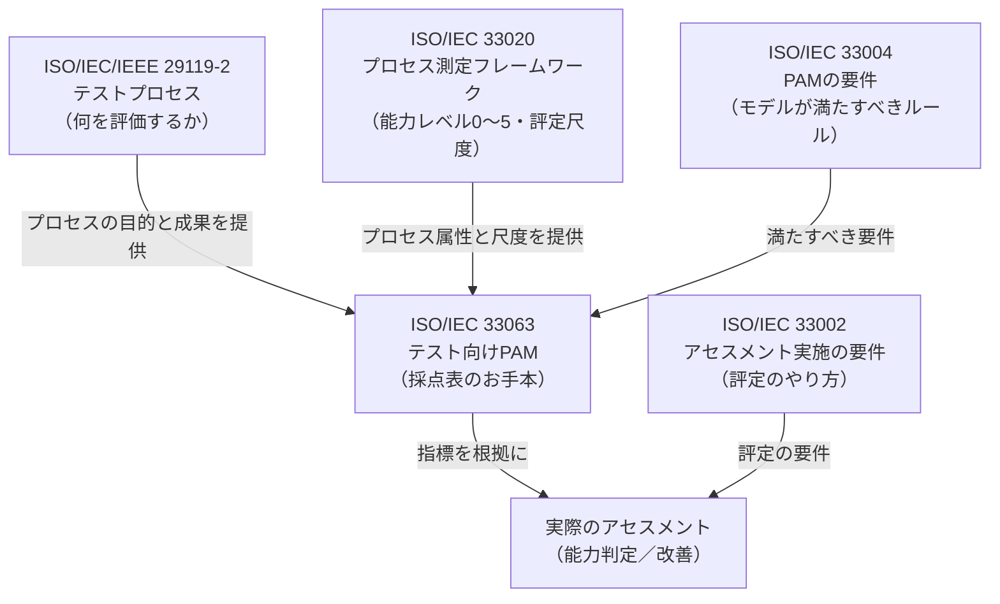
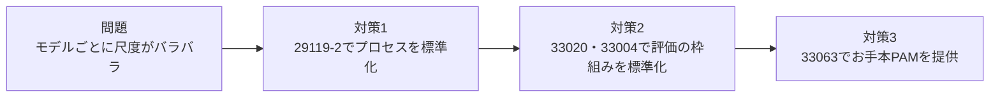
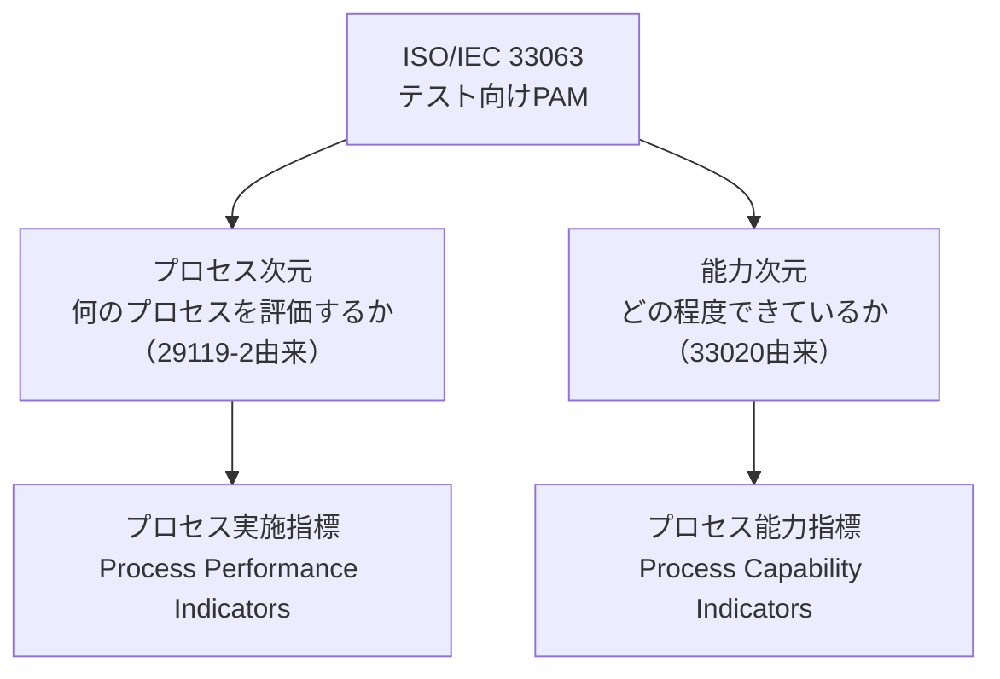
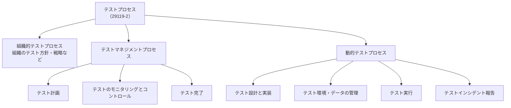
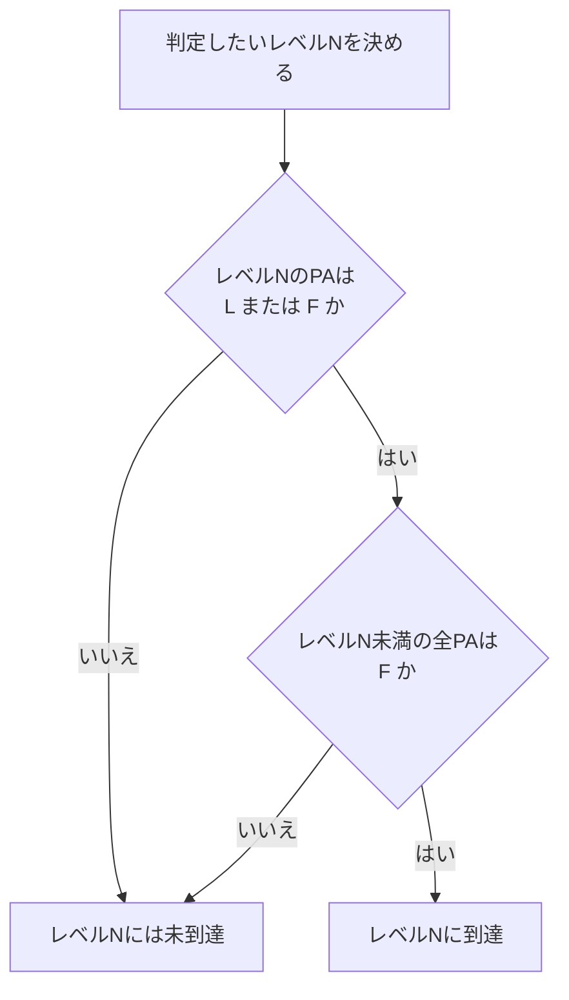
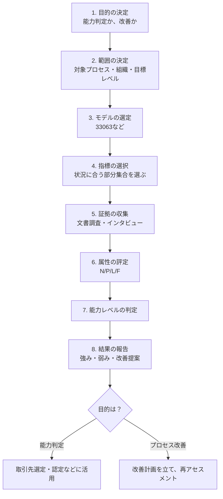
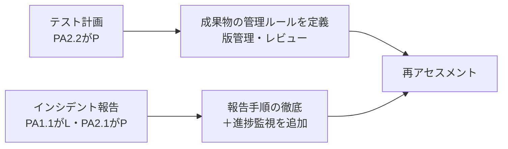
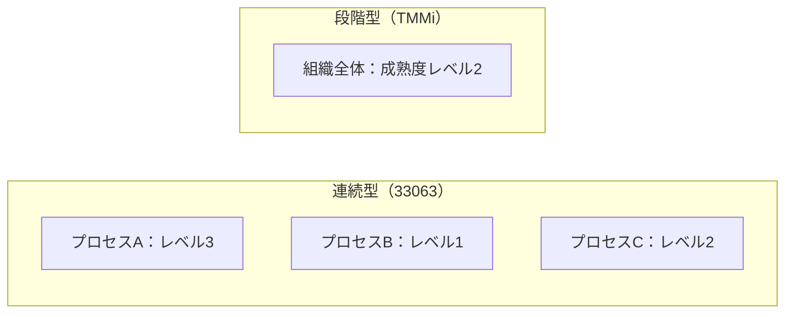
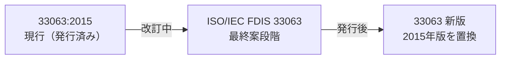
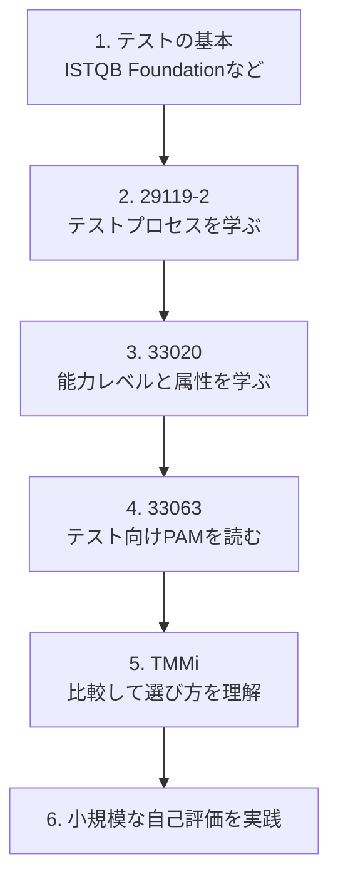

# ISO/IEC 33063:2015 初学者向けステップバイステップ解説

> **対象規格**：ISO/IEC 33063:2015 *Information technology — Process assessment — Process assessment model for software testing*（ソフトウェアテストのためのプロセスアセスメントモデル）
> **情報時点**：2026年10月8日
> **想定読者**：QAエンジニア／テストマネージャ／開発者で、「テストプロセスの成熟度や能力をどう客観的に測るのか」を初めて学ぶ方

---

## 0. 最初にお読みください（この資料の位置づけ）

| 項目 | 内容 |
|---|---|
| 規格本文の入手 | ISO規格の本文は有償（ISOストアで CHF 204、PDF/紙）です。本資料は**公開されている概要・目次・公式ページ・著名エキスパートの発表資料**をもとにした**独自の解説**であり、規格本文の転載ではありません |
| 詳細項目の扱い | 個々のプロセスの「指標（indicator）」の具体的な文言は、必ず**正式な規格本文**で確認してください |
| 推測を含む部分 | 「一般的なPAMの構成」と明記した箇所は、ISO/IEC 33020・33004 系列の共通的な考え方に基づく説明です。33063固有の細部は原典確認を推奨します |
| 規格の状態 | 2026年10月時点で 2015年版は**現行**ですが、**改訂版（ISO/IEC FDIS 33063）に置き換わる見込み**です（第14章） |

---

## 1. ひとことで言うと

**ISO/IEC 33063 は、「自社のテストプロセスがどれくらいちゃんとできているか」を、国際標準の物差しで客観的に評価するための“採点表のお手本（モデル）”です。**

- 評価の**対象（何を評価するか）**：ISO/IEC/IEEE 29119-2 で定義されたテストプロセス
- 評価の**物差し（どう測るか）**：ISO/IEC 33020 のプロセス能力レベル（0〜5）
- 採点表の**書き方のルール**：ISO/IEC 33004 の要件

たとえるなら、次のとおりです。

| たとえ | 対応するもの |
|---|---|
| 試験科目（何を問うか） | 29119-2 のテストプロセス |
| 採点基準（何点満点でどう採点するか） | 33020 の能力レベルと評定尺度 |
| 採点表の様式ルール | 33004（PAMの要件） |
| **実際の採点表（お手本）** | **33063（本規格）** |

---

## 2. 基本情報（ISO公式ページより）

| 項目 | 内容 |
|---|---|
| 規格番号 | ISO/IEC 33063:2015 |
| タイトル | 情報技術 — プロセスアセスメント — ソフトウェアテストのためのプロセスアセスメントモデル |
| 版 | 第1版（Edition 1） |
| 発行 | 2015年8月（公式ページ上の公表段階は 2015-07-28） |
| ページ数 | 69ページ |
| 担当委員会 | ISO/IEC JTC 1/SC 7（ソフトウェアおよびシステムエンジニアリング） |
| ICS | 35.080（Software） |
| 状態 | Published（発行済み）。2021年に確認（confirmed）、2024-08-05に「改訂予定（90.92）」へ移行 |
| 後継 | ISO/IEC FDIS 33063（置き換え予定） |
| 価格 | CHF 204（PDF／紙、送料別） |

---

## 3. 関連規格との関係（全体像）

33063は単独では成り立たず、**複数の規格の上に乗っています**。まず地図を頭に入れましょう。

| 規格 | 役割 | 33063との関係 |
|---|---|---|
| ISO/IEC/IEEE 29119-2 | テストプロセスの定義 | 評価対象のプロセスの「目的」と「成果」を提供 |
| ISO/IEC 33020 | プロセス測定の枠組み | 「プロセス属性」「能力レベル」を提供 |
| ISO/IEC 33004 | PAMへの要件 | 33063は要件を満たす**例示的モデル（exemplar）** |
| ISO/IEC 33002 | アセスメントの実施要件 | 指標から証拠を集めて評定する手順の根拠 |

> **補足**：ISO公式ページの概要には、「このモデルは33004のすべての要件を満たす**お手本として提供される**」と書かれています。つまり33063が**唯一の正解ではない**点が重要です（第13章）。

---

## 4. Step 1：なぜこの規格が必要なのか（背景）

### 4-1. 「テストの成熟度モデル」が乱立していた

テストプロセスを評価・改善するためのモデルは、33063以前から複数ありました。

| モデル | 特徴（概要） |
|---|---|
| TMMi | CMMIを補完する形で作られた成熟度モデル。5段階の成熟度レベルを持つ |
| TPI系 | テストプロセス改善モデル |
| Test SPICE | SPICE（ISO/IEC 15504系）の構造に沿ったテスト向けモデル |
| ISO/IEC 33063 | ISO標準としての評価モデル。29119-2に基づく |

こうしたモデルごとに用語・尺度が異なると、**「A社のレベル3」と「B社のレベル3」を比べられない**という問題が起きます。

### 4-2. 標準の物差しを作る

そこで、

1. テストプロセス自体を**29119-2**で標準化し、
2. その評価の枠組みを**33020 / 33004**に合わせ、
3. その組み合わせの**具体例として33063**を用意した

という流れになっています。

---

## 5. Step 2：最低限の用語を押さえる

| 用語 | やさしい説明 | 例 |
|---|---|---|
| **プロセスアセスメント** | プロセスの実施状況を、証拠をもとに評価すること | 「テスト実行プロセスは文書化され守られているか」を調べる |
| **PAM（プロセスアセスメントモデル）** | 評価に使う「採点表」。評価対象のプロセスと、物差しと、証拠の探し方をまとめたもの | 33063そのもの |
| **プロセスの目的（purpose）** | そのプロセスが何のためにあるか | テスト実行の目的は「テストを実行して結果を得ること」 |
| **プロセスの成果（outcome）** | プロセスをやれば得られるはずの結果 | テスト結果が記録されている |
| **プロセス属性（PA）** | プロセスの出来具合を測る観点 | 「実施できているか」「管理されているか」など |
| **能力レベル** | プロセス属性の達成度をまとめた、0〜5の段階 | レベル2＝管理されている |
| **指標（indicator）** | 評価者が証拠を探すときの手がかり | 作成された成果物、実施された活動の記録 |
| **客観的証拠** | 指標を裏づける、実際の記録・成果物・インタビュー結果 | テスト報告書、レビュー記録 |
| **アセッサ（評価者）** | 能力を持った評価担当者 | 外部の認定アセッサなど |
| **アセスメントスポンサー** | アセスメントを依頼・資金提供する側 | 品質部門の責任者 |

---

## 6. Step 3：モデルの二次元構造を理解する

PAMは一般に**2つの軸（次元）**で成り立ちます。

規格の目次（公開プレビュー）にも、「Overview of the process assessment model」「Structure of the process assessment model」「Assessment indicators」「Process capability levels and process attributes」といった見出しが確認できます。

### 6-1. 縦軸と横軸のイメージ（表で整理）

| | 能力レベル1 | 能力レベル2 | 能力レベル3 | … |
|---|---|---|---|---|
| **テスト計画** | ○ | △ | × | |
| **テスト設計・実装** | ○ | ○ | △ | |
| **テスト実行** | ○ | ○ | × | |
| **インシデント報告** | ○ | △ | × | |

行が**プロセス次元**、列が**能力次元**です。「どのプロセスが、どのレベルまで達しているか」を一覧にできます。

> 上表は構造を理解するための**説明用のサンプル**であり、実際の評価結果ではありません。

---

## 7. Step 4：プロセス次元（何を評価するのか）

33063の評価対象は、**ISO/IEC/IEEE 29119-2 が定義するテストプロセス**です。33063の概要でも、プロセスの目的と成果は29119-2で定義されたものと明記されています。

### 7-1. 29119-2のプロセス階層（一般的な整理）

| 階層 | 主な関心事 | 例 |
|---|---|---|
| 組織的テストプロセス | 組織全体のルール作り | テスト方針、組織のテスト戦略 |
| テストマネジメント | プロジェクトでのテストの運営 | 計画、進捗監視、終了 |
| 動的テスト | 実際にソフトを動かすテスト作業 | 設計、環境、実行、不具合報告 |

> **注意**：29119-2は2013年版と2021年版があり、プロセス名や構成が一部異なります。33063:2015は2013年版の時代の規格で、改訂版の33063は2021年版を踏まえて更新されると考えられます。個別のプロセス名・ID は原典で確認してください。

### 7-2. プロセスの「目的」と「成果」の関係

各プロセスについて、PAMは次の2点を定めます。

| 要素 | 意味 | 評価での使い方 |
|---|---|---|
| 目的 | プロセスの存在理由 | 「そもそも何を達成すべきか」の基準 |
| 成果 | 達成した結果の具体像 | 「成果が出ているか」を指標でチェック |

---

## 8. Step 5：能力次元（どの程度できているのか）

物差しは **ISO/IEC 33020** のプロセス能力レベルです（一般に知られている6段階）。

### 8-1. 能力レベルの一覧

| レベル | 名称 | やさしい説明 |
|---|---|---|
| 0 | Incomplete（不完全） | 実施されていない、または目的を達成できていない |
| 1 | Performed（実施） | 目的を達成できている（やり方は人任せでもよい） |
| 2 | Managed（管理） | 計画・監視され、成果物も管理されている |
| 3 | Established（確立） | 組織の標準プロセスが定義され、展開されている |
| 4 | Predictable（予測可能） | 数値で測定・分析され、予測できる |
| 5 | Innovating（革新） | 継続的に改善・革新されている |

### 8-2. プロセス属性（PA）との対応

各レベルは**プロセス属性（PA）の達成度**で決まります。

| レベル | プロセス属性 | 観点 |
|---|---|---|
| 1 | PA 1.1 プロセス実施 | 目的の成果が得られているか |
| 2 | PA 2.1 実施のマネジメント | 計画・監視・調整がされているか |
| 2 | PA 2.2 作業成果物のマネジメント | 成果物の要件・管理がされているか |
| 3 | PA 3.1 プロセス定義 | 標準プロセスが定義されているか |
| 3 | PA 3.2 プロセス展開 | 定義したプロセスが実際に使われているか |
| 4 | PA 4.1 定量的分析 | 測定指標が定義され、分析されているか |
| 4 | PA 4.2 定量的コントロール | 定量データでプロセスを制御しているか |
| 5 | PA 5.1 プロセス革新 | 改善目標が定められているか |
| 5 | PA 5.2 プロセス革新の実施 | 改善が実際に実施・定着しているか |

> 属性名は一般的な訳語です。公式の英語名・定義は ISO/IEC 33020 で確認してください。

### 8-3. 評定尺度（4段階）

各プロセス属性は、次の4段階で評価するのが一般的です。

| 評定 | 記号 | 達成度の目安 |
|---|---|---|
| Not achieved | N | 0〜15% |
| Partially achieved | P | 15%超〜50% |
| Largely achieved | L | 50%超〜85% |
| Fully achieved | F | 85%超〜100% |

### 8-4. レベル判定のルール（一般的な考え方）

**「そのレベルのPAが Largely 以上（L/F）で、かつ、下位レベルのPAがすべて Fully（F）」**であれば、そのレベルに到達したと判定します。

**具体例**

| PA 1.1 | PA 2.1 | PA 2.2 | 判定 |
|---|---|---|---|
| F | L | L | **レベル2**（レベル1のPAがF、レベル2のPAがL以上） |
| L | F | F | **レベル1**（PA1.1がFでないためレベル2に進めない） |
| F | P | F | **レベル1**（PA2.1がP） |

---

## 9. Step 6：アセスメント指標（証拠の探し方）

ISO公式の概要は、PAMを「**プロセス実施の指標とプロセス能力の指標の集合**」と説明し、指標は評価者が**客観的証拠を集めて評定するための基礎**になると述べています。

### 9-1. 2種類の指標（一般的なPAMの構成）

| 種類 | 対象 | 何を見るか（一般的な例） |
|---|---|---|
| プロセス実施指標 | 能力レベル1（PA1.1） | 基本プラクティス、入力・出力の作業成果物 |
| プロセス能力指標 | 能力レベル2以上 | 汎用プラクティス、汎用資源、汎用の作業成果物 |

### 9-2. 指標と評定のつながり

### 9-3. 例で理解する（架空）

**評価対象プロセス：テスト実行**

| 確認する観点 | 集める証拠の例 |
|---|---|
| テストを実行して結果を記録しているか（レベル1） | テスト実行ログ、結果記録 |
| 実行が計画・監視されているか（レベル2） | 実行スケジュール、進捗報告 |
| 実行結果の成果物が管理されているか（レベル2） | 版管理されたテスト結果、レビュー記録 |
| 組織標準に沿って実行しているか（レベル3） | 標準テスト手順書とその適用記録 |

### 9-4. 全部を使うわけではない

ISO公式の概要には、**この規格の指標は網羅的でも、全部を適用するためのものでもない**と明記されています。評価の**状況と範囲に合う部分集合を選んで使う**のが前提です。

---

## 10. Step 7：アセスメントの進め方（全体フロー）

実際の評価は、概ね次の流れで進みます（一般的なプロセスアセスメントの手順）。

### 10-1. 各ステップの役割

| ステップ | 実施内容 | 誰が |
|---|---|---|
| 1. 目的の決定 | 「能力を判定したい」のか「改善したい」のか | スポンサー |
| 2. 範囲の決定 | どのプロセスを、どのレベルまで見るか | スポンサー＋アセッサ |
| 3. モデルの選定 | 33063や他モデルを選ぶ | スポンサー＋アセッサ |
| 4. 指標の選択 | 範囲に合う指標を選ぶ | アセッサ |
| 5. 証拠の収集 | 文書確認、インタビュー | アセッサ |
| 6. 属性の評定 | N/P/L/F の判定 | アセッサ |
| 7. レベル判定 | ルールに従い算出 | アセッサ |
| 8. 報告 | 結果と提案をまとめる | アセッサ |

> 33063の想定読者は、モデルとその文書化された方法を選ぼうとする**アセスメントスポンサーと有能なアセッサ**です（能力判定と改善、どちらの目的でも使えます）。

---

## 11. Step 8：ミニ演習（架空のケース）

**状況**：Web系開発会社のQAチームが「テストプロセスの現状を客観評価したい」。目的は**プロセス改善**。

### 11-1. 評価の設計

| 項目 | 決定内容 |
|---|---|
| 目的 | プロセス改善 |
| 範囲 | テスト計画、テスト実行、インシデント報告の3プロセス |
| 目標レベル | レベル2 |
| 指標 | 各プロセスのレベル1・2に関する指標のみ選択 |

### 11-2. 評定結果（架空）

| プロセス | PA 1.1 | PA 2.1 | PA 2.2 | 判定 |
|---|---|---|---|---|
| テスト計画 | F | L | P | レベル1 |
| テスト実行 | F | L | L | レベル2 |
| インシデント報告 | L | P | P | レベル1 |

> インシデント報告はPA1.1がL（Largely）なので、レベル1には到達します。ただしレベル2と判定するには、レベル1のPA（PA1.1）がF（Fully）である必要があり、さらにレベル2のPAもL以上でなければなりません。この条件を満たさないため、レベル1止まりです。「Lのままでは上位レベルに進めない」ルールは初学者が間違いやすい点です。

### 11-3. 改善アクションに変換する

---

## 12. 33063でよくある誤解

| 誤解 | 実際 |
|---|---|
| 33063に準拠すると「認証」される | 33063は**評価モデルの規格**であり、準拠認証制度を直接意味しません。モデルとして使うものです |
| 33063の指標は全部使う必要がある | 公式概要で**全部適用するものではなく、部分集合を選ぶ**ことが明記されています |
| 33063が唯一のテストアセスメントモデルである | 33004の要件を満たす**他のモデルも使える**とされ、33063は**お手本**です |
| 能力レベルが高いほど常に良い | 事業ニーズに合ったレベルが適切。過剰な整備はコスト増になります |
| 29119-2に準拠すれば自動的にレベル3 | 29119-2はプロセス定義、33063はその**評価**です。別物です |

---

## 13. 他のテスト改善モデルとの比較

### 13-1. 33063 / TMMi / Test SPICE

| 観点 | ISO/IEC 33063 | TMMi | Test SPICE |
|---|---|---|---|
| 構造の互換性 | SPICE系 | CMMI系 | SPICE系 |
| 表現方式 | Continuous（連続型） | Staged（段階型） | Continuous（連続型） |
| 参照モデル | ISO/IEC/IEEE 29119-2 | 独自の成熟度モデル（5レベル） | ISO/IEC/IEEE 12207のプロセス属性 |

> 出典：IT Wiki（韓国）の比較表。表現方式の違い（連続型と段階型）が最大のポイントです。

### 13-2. 連続型と段階型の違い

| 方式 | 考え方 | 向いている場面 |
|---|---|---|
| 連続型（Continuous） | **プロセスごと**に能力レベルを評価 | 弱いプロセスをピンポイントで改善したい |
| 段階型（Staged） | **組織全体**を成熟度レベルで評価 | 組織全体の成熟度を示したい |

### 13-3. TMMiとISO規格の関係（国際的エキスパートの見解）

TMMiの主要な開発者である **Erik van Veenendaal** 氏の発表資料（JSTQB 2024カンファレンス）では、次の点が整理されています。

- TMMi は段階型で、16のプロセスエリアを持ち、評価モデルと認証制度を備える
- ISO 29119 は一連のテスト標準であり、**テスト改善に直接使うためのものではない**という位置づけ
- TMMiの評価は ISO/IEC 33020 を枠組みとしている
- 追加で参照すべき規格として、レビュー向けの ISO 20246 と、**テスト評価向けの ISO 33063** が挙げられている

また、TMMi Foundationは2014年から ISO/IEC JTC1/SC7 の WG26 に Category C リエゾンとして参加しており、TMMiモデルを ISO 29119 の概念・定義に整合させる方針を示しています。

---

## 14. 最新動向（2026年10月8日時点）

| 日付 | 出来事 |
|---|---|
| 2012-01 | 新規プロジェクト承認 |
| 2015-07-28 | 国際規格として発行 |
| 2021-02-11 | システマティックレビューで**確認（confirmed）** |
| 2024-08-05 | 状態が「**改訂予定（90.92）**」に |
| 現在 | **ISO/IEC FDIS 33063** が策定中で、2015年版は「今後数か月以内に置き換え予定」と公式ページに記載 |

**実務への影響**

| 状況 | 推奨対応 |
|---|---|
| いまから学ぶ | 2015年版で概念を理解し、新版の発行状況を定期的に確認 |
| 評価に使う | 契約や社内規程で「どの版を参照するか」を明記 |
| 29119-2:2021との整合 | 新版では最新の29119-2を踏まえたプロセス構成になる可能性があるため、発行後に差分を確認 |

---

## 15. 学習ロードマップ

| ステップ | 学ぶこと | ゴール |
|---|---|---|
| 1 | テストの基礎用語 | プロセスの語彙を持つ |
| 2 | 29119-2 | 評価対象を知る |
| 3 | 33020 | 物差しを知る |
| 4 | 33063 | 採点表の構造を理解 |
| 5 | TMMi | モデルの使い分けを判断 |
| 6 | 自己評価 | 1プロセスだけ評定してみる |

---

## 16. 確認クイズ

| # | 問題 | 答え |
|---|---|---|
| 1 | 33063が評価対象とするプロセスの出典は？ | ISO/IEC/IEEE 29119-2 |
| 2 | 能力レベルとプロセス属性の枠組みを定める規格は？ | ISO/IEC 33020 |
| 3 | 33063は33004の要件に対してどういう位置づけか？ | 要件を満たすお手本（exemplar） |
| 4 | 指標は全部使うべきか？ | いいえ。状況と範囲に合う部分集合を選ぶ |
| 5 | 連続型と段階型の違いは？ | プロセスごとに評価するか、組織全体の成熟度で評価するか |
| 6 | レベル2に到達する条件は？ | レベル1のPAがF、レベル2のPAがL以上 |

---

## 17. 参照ソース（URL）

### 一次情報（規格・公式）

| # | 内容 | URL |
|---|---|---|
| 1 | ISO公式：ISO/IEC 33063:2015（基本情報・概要・ライフサイクル） | https://www.iso.org/standard/55154.html |
| 2 | ISO公式：ISO/IEC FDIS 33063（後継版） | https://www.iso.org/standard/90135.html |
| 3 | ISO公式（スペイン語版・FDISページ） | https://www.iso.org/es/contents/data/standard/09/01/90135.html |
| 4 | 規格の公開プレビュー（目次・序文）VDE Verlag | https://www.vde-verlag.de/iec-normen/preview-pdf/info_isoiec33063{ed1.0}en.pdf |

### 国際的エキスパート・業界団体

| # | 内容 | URL |
|---|---|---|
| 5 | Erik van Veenendaal「Test Process Improvement」（JSTQB 2024カンファレンス資料） | https://jstqb.jp/prinfo/conference2024/pdf/Test%20Process%20Improvement.pdf |
| 6 | Erik van Veenendaal「Test Process Improvement with TMMi®」（TechWell） | https://www.agileconnection.com/presentation/test-process-improvement-tmmi |
| 7 | van Veenendaal, Garousi, Felderer「Motivations for and Benefits of Adopting TMMi」（SWQD 2022） | https://pure.qub.ac.uk/en/publications/motivations-for-and-benefits-of-adopting-the-test-maturity-model-/ |
| 8 | EuroSTAR：Erik van Veenendaal & Jan Jaap Cannegieter「Testing Maturity Model integration (TMMi)」 | https://huddle.eurostarsoftwaretesting.com/resources/test-management/testing-maturity-model-integration-tmmi/ |
| 9 | TMMi Foundation：Model Aims and Objectives（ISO WG26とのリエゾン関係） | https://www.tmmi.org/model-aims-and-objectives/ |

### 補足資料

| # | 内容 | URL |
|---|---|---|
| 10 | IT Wiki（韓国）：ISO/IEC 33063（TMMi・Test SPICEとの比較表） | https://www.itwiki.kr/w/ISO/IEC_33063 |
| 11 | Nimonik：ISO/IEC 33063 概要 | https://standards.nimonik.com/products/iso/iso-iec-33063/ |

### 出典の使い分け

| 本資料の章 | 主な根拠 |
|---|---|
| 第2章・第14章（基本情報・最新動向） | ソース1・2 |
| 第1章・第3章・第9章（概要・指標の考え方） | ソース1・3・4 |
| 第13章（比較） | ソース5・9・10 |
| 第8章（能力レベル・PA・評定尺度）、第7章（29119-2構成） | ISO/IEC 33020・29119-2 の一般的な内容（原典で要確認） |

> **免責**：能力レベル名・PA名・評定尺度の百分率・29119-2のプロセス構成は、ISO/IEC 33020および29119-2の一般的に知られた内容に基づく解説です。33063の個別指標の文言は有償の規格本文でご確認ください。
