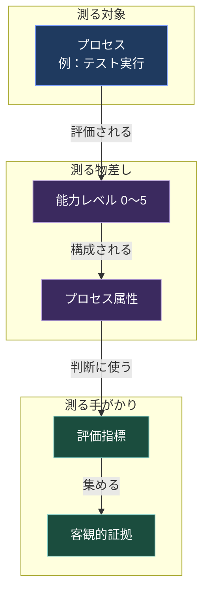
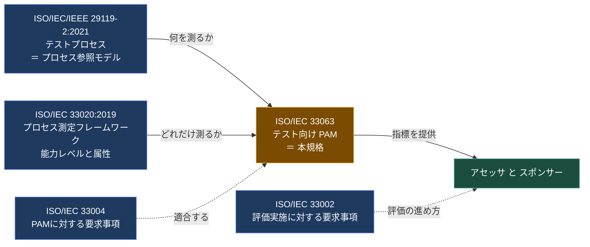
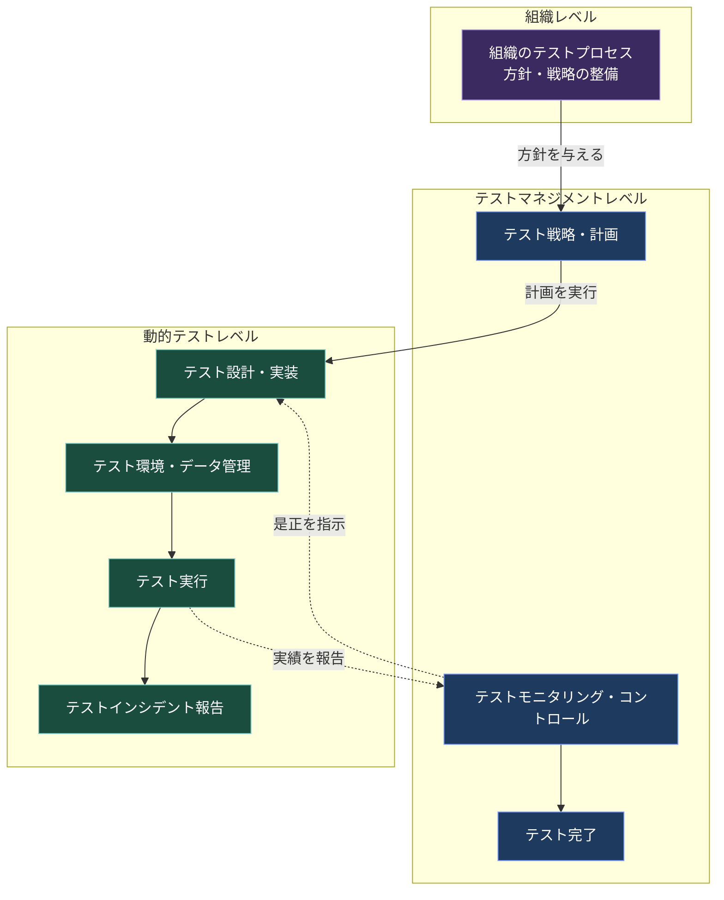
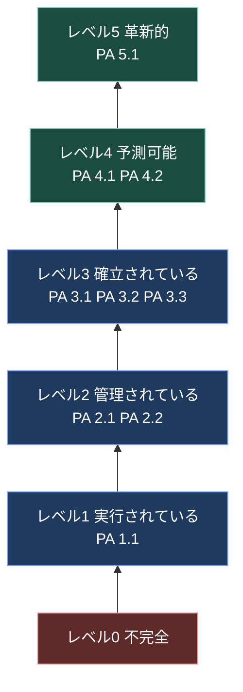
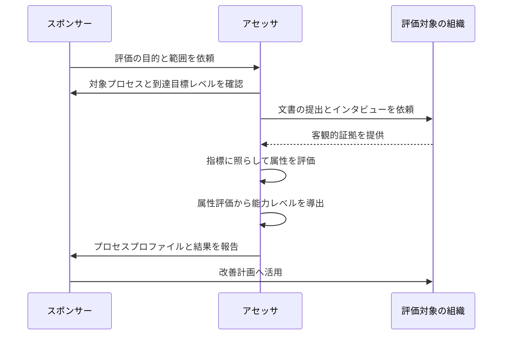
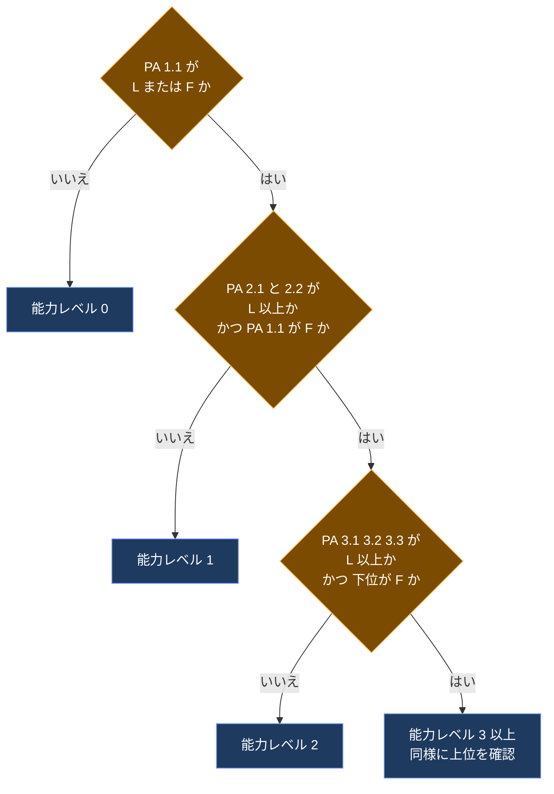
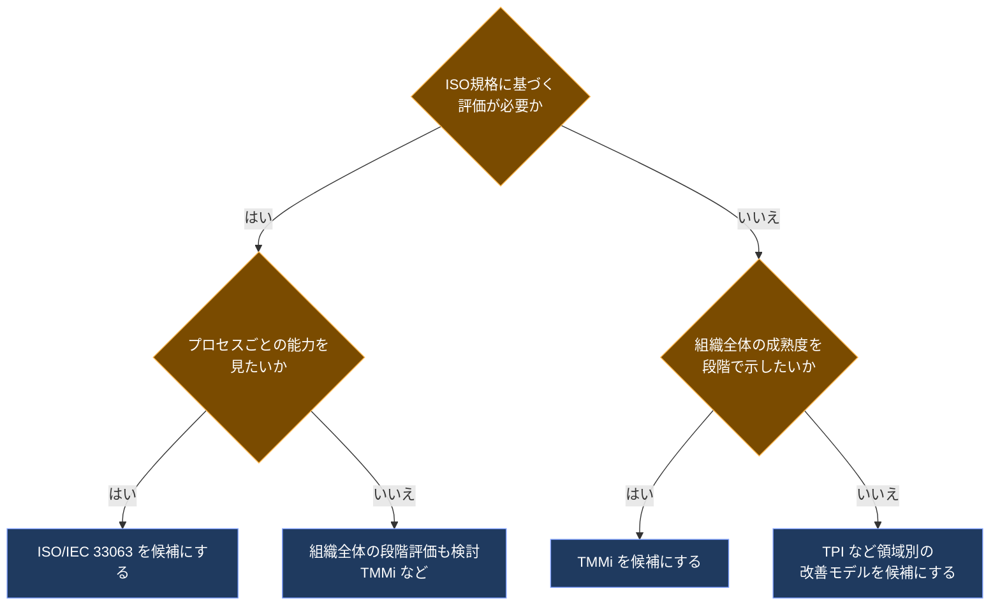

# ISO/IEC FDIS 33063 初学者向けステップバイステップ解説ガイド

> **対象規格**：ISO/IEC FDIS 33063 ― *Information technology — Process assessment — Process assessment model for software testing*（情報技術 ― プロセスアセスメント ― ソフトウェアテストのためのプロセスアセスメントモデル）
> **情報基準日**：2026年10月6日（作成：2026年10月7日）
> **想定読者**：QAエンジニア・テストマネージャ・開発者の初学者（ISO規格を初めて読む方）
> **重要な前提**：規格本文は有料で、本ガイドは **ISO公式ページの概要・ライフサイクル情報、各標準化団体の公開プレビュー（目次・序文）、関連規格の公開情報** に基づきます。本文中の指標（インジケータ）の具体的な中身までは確認できていないため、確認できた事実と一般的な知識・推測は区別して明記します（§12「未確認事項」参照）。

---

## 目次

1. [3分でわかる全体像](#1-3分でわかる全体像)
2. [この規格のステータス（2026年10月6日時点）](#2-この規格のステータス2026年10月6日時点)
3. [前提となる用語を先に整理する](#3-前提となる用語を先に整理する)
4. [STEP 1：規格ファミリーの中での位置づけ](#4-step-1規格ファミリーの中での位置づけ)
5. [STEP 2：「プロセス」の側 ― ISO/IEC/IEEE 29119-2 のテストプロセス](#5-step-2プロセスの側--isoiecieee-29119-2-のテストプロセス)
6. [STEP 3：「能力」の側 ― ISO/IEC 33020 の能力レベル0〜5](#6-step-3能力の側--isoiec-33020-の能力レベル05)
7. [STEP 4：2つの次元を掛け合わせ、評価指標で証拠を集める](#7-step-42つの次元を掛け合わせ評価指標で証拠を集める)
8. [STEP 5：評価（アセスメント）の進め方](#8-step-5評価アセスメントの進め方)
9. [STEP 6：架空ケースで評価結果を読んでみる](#9-step-6架空ケースで評価結果を読んでみる)
10. [第2版（FDIS）で何が変わるのか](#10-第2版fdisで何が変わるのか)
11. [他のテスト成熟度モデルとの比較と、現場での使い方・注意点](#11-他のテスト成熟度モデルとの比較と現場での使い方注意点)
12. [未確認事項（正直なメモ）](#12-未確認事項正直なメモ)
13. [理解度チェック](#13-理解度チェック)
14. [根拠となるソース一覧（URL）](#14-根拠となるソース一覧url)

---

## 1. 3分でわかる全体像

### 1.1 一言でいうと

**「自分たちのテストのやり方は、どのくらい“きちんと・安定して”できているか」を、国際標準の物差しで測るための“採点基準表”（モデル）** です。

### 1.2 3つのポイント

| # | ポイント | 内容 |
|---|---|---|
| ① | 何を測る？ | ソフトウェアテストの **プロセス**（やり方・仕組み）の **能力**（どれだけ安定して実行・管理・改善できているか） |
| ② | 何を物差しにする？ | **何を**測るかは ISO/IEC/IEEE 29119-2（テストプロセス）、**どれだけ**できているかは ISO/IEC 33020（能力レベル） |
| ③ | 誰のため？ | **アセスメントのスポンサー**（依頼者）と **力量を備えたアセッサ**（評価者）。能力判定にも、プロセス改善にも使える |

### 1.3 「テストの規格」と「テストプロセス評価の規格」の違い

初学者が最初につまずくのがここです。

| 規格 | 答える問い | 例え |
|---|---|---|
| ISO/IEC/IEEE 29119-2 | テストは **どんな手順・活動で** 行うべきか | 料理の**レシピ** |
| **ISO/IEC 33063（本規格）** | そのテストの**やり方が、どれくらい成熟しているか** | 料理人の**腕前の採点表** |

つまり 33063 は「テストの方法」を教える規格ではなく、**テストの“やり方の質”を評価するための規格** です。

---

## 2. この規格のステータス（2026年10月6日時点）

ISO公式ページによると、本規格は **「Under development（開発中）」で、承認フェーズの最終段階（FDIS）にあります**。

### 2.1 基本情報

| 項目 | 内容（ISO公式ページより） |
|---|---|
| 規格番号 | ISO/IEC FDIS 33063（ISO内部ID：90135） |
| 版 | **第2版**（Edition 2） |
| 置き換える規格 | **ISO/IEC 33063:2015**（第1版、公開済み） |
| ページ数 | 30ページ |
| 担当委員会 | ISO/IEC JTC 1/SC 7（ソフトウェアおよびシステムエンジニアリング） |
| ICS分類 | 35.080（ソフトウェア） |
| 現在のステージ | **50.20**（FDIS投票開始、期間8週間） |
| 関連するSDG | SDG 9（産業・技術革新・社会基盤） |

### 2.2 ここまでの経緯（ライフサイクル）

> 青＝完了、橙＝**現在地（FDIS投票中）**、灰＝今後。日付はISO公式ページのライフサイクル表記に基づく。

### 2.3 初学者向け補足：CD・DIS・FDISとは

| 略称 | 正式名称 | ひとことで言うと |
|---|---|---|
| CD | Committee Draft | 委員会内で磨く草案 |
| DIS | Draft International Standard | 各国に意見を聞く国際規格案（技術的な議論の山場） |
| **FDIS** | **Final Draft International Standard** | **最終案。原則、賛否を問う最後の投票（技術的な大改訂はしない段階）** |
| IS | International Standard | 発行された国際規格 |

> 計算上の見込み：FDIS投票は2026-08-27開始・期間8週間のため、**投票期限は10月下旬（約10/22頃）** と考えられます（これはステージ表記からの筆者の算術であり、ISO公式の期日表記ではありません）。可決されれば発行準備へ進みます。**FDIS段階の文書は、発行時に編集上の修正が入る可能性があります。**

---

## 3. 前提となる用語を先に整理する

この規格は用語が多く、**最初に用語を整理するだけで理解度が大きく変わります**。

| 用語 | 英語 | やさしい説明 |
|---|---|---|
| プロセス | Process | 目的を達成するための活動のまとまり（例：テスト計画、テスト実行） |
| プロセス参照モデル（PRM） | Process Reference Model | 「どんなプロセスがあるべきか」を定義したもの。本規格では **29119-2** が担う |
| プロセスアセスメントモデル（PAM） | Process Assessment Model | PRMを評価するための **採点基準**。**33063 そのもの** |
| プロセス能力 | Process Capability | プロセスが **ビジネス目標を安定して満たせる力**（33020の定義） |
| 能力レベル | Capability Level | 能力を **0〜5** の段階で表したもの |
| プロセス属性 | Process Attribute | 各レベルを構成する **評価の観点**（例：「実行されている」「管理されている」） |
| 評価指標 | Indicator | 属性や成果が達成されているかを判断する **手がかり** |
| 客観的証拠 | Objective Evidence | 指標に基づいて集める **事実の裏づけ**（文書、記録、インタビュー内容など） |
| アセッサ | Assessor | 評価を行う、力量を備えた者（正式な資格要件は§12で未確認事項として扱う） |
| スポンサー | Assessment Sponsor | 評価を依頼・承認する人（例：QA部門長、経営層） |

### 3.1 用語の関係図

---

## 4. STEP 1：規格ファミリーの中での位置づけ

### 4.1 ISO公式の要約（意訳）

ISO公式ページの概要（第1版の説明が現行ドラフトにも掲載されています）を、筆者が意訳すると次のとおりです。

1. **ISO/IEC 33004 の要求事項を満たす** プロセスアセスメントモデルを定義する
2. **ISO/IEC 33020 のプロセス測定フレームワーク** を使って、プロセス能力の評価を支援する
3. **ISO/IEC/IEEE 29119-2** で定義されたプロセスの目的・成果、**33020** で定義されたプロセス属性の解釈のための **指標** を提供する
4. 指標の **定義・選択・利用の仕方** を、例を通じて案内する

さらに公式ページには、次の重要な注意があります。

- 収録されている指標は **「網羅的であることも、全部を適用することも想定していない」**。評価の文脈と範囲に合う **部分集合** を選んで使う
- 33004の要求を満たす別のモデルも評価に使える。**本規格は「要求を満たすモデルの“模範例（exemplar）”」として提供**される

### 4.2 ファミリー全体図

### 4.3 33063が「合体」させている2つの流れ

| 流れ | 由来 | 33063での役割 |
|---|---|---|
| テストの中身（プロセス） | ISO/IEC/IEEE 29119 シリーズ（国際的なソフトウェアテスト規格群）のPart 2 | 評価対象のプロセスを決める |
| 能力の測り方 | ISO/IEC 330xx シリーズ（プロセスアセスメント規格群。旧 ISO/IEC 15504 = SPICE の後継） | 能力レベルと評価ルールを決める |

> **SPICEとの関係**：ISO/IEC 33020 は ISO/IEC 15504（通称SPICE）系列の流れを汲む規格群の一部です。33063は、その仕組みを「テスト」に特化して適用した例、と理解すると整理しやすいです。

---

## 5. STEP 2：「プロセス」の側 ― ISO/IEC/IEEE 29119-2 のテストプロセス

33063の評価対象は、**ISO/IEC/IEEE 29119-2:2021** が定義する **テストプロセス** です。まずこの全体像を押さえます。

### 5.1 29119-2:2021 の3階層（公開されている目次より）

| 階層 | 含まれるプロセス（目次の見出し） |
|---|---|
| 組織レベル | 組織のテストプロセス（Organizational test process） |
| テストマネジメントレベル | テスト戦略・計画 / テストモニタリング・コントロール / テスト完了 |
| 動的テストレベル | テスト設計・実装 / テスト環境・データ管理 / テスト実行 / テストインシデント報告 |

各プロセスは、ISO/IEC TR 24774（プロセス記述のガイドライン）のテンプレートに沿って、**目的・成果・活動・タスク・情報項目** で定義されています。

### 5.2 テストプロセスの関係図

> 実線は主な流れ、点線は情報のフィードバック。図の矢印は理解のための簡略化であり、29119-2本文のプロセス間入出力を厳密に再現したものではありません。

### 5.3 重要な気づき

- 29119-2 は **動的テスト・機能/非機能テスト・手動/自動・スクリプト型/非スクリプト型** のいずれにも使える汎用プロセスモデルとして説明されています。
- 33063 は、これらの各プロセスについて「その目的・成果が達成されているか」を判断する **指標** を用意する、という構造になります。

---

## 6. STEP 3：「能力」の側 ― ISO/IEC 33020 の能力レベル0〜5

33063は、能力の測り方を **ISO/IEC 33020（2019年版）** に依拠します。公開されている目次から、レベル構成は次のとおり確認できます。

### 6.1 能力レベル一覧

| レベル | 名称（英語） | 名称（日本語） | 一言でいうと |
|---|---|---|---|
| 0 | Incomplete | 不完全 | やっていない、または目的を達成できていない |
| 1 | Performed | 実行されている | プロセスの**目的は達成**できている（属人的でもよい） |
| 2 | Managed | 管理されている | **計画・監視・調整**され、成果物も管理されている |
| 3 | Established | 確立されている | **組織の標準**として定義され、各プロジェクトに展開されている |
| 4 | Predictable | 予測可能 | **定量的に測定・制御**され、限界内で安定して動く |
| 5 | Innovating | 革新的 | 事業目標に合わせて**継続的に改善・革新**されている |

### 6.2 レベル別の「プロセス属性」

| レベル | 属性ID | 属性の趣旨（SPICE系の一般的な呼称） |
|---|---|---|
| 1 | PA 1.1 | プロセス実行 |
| 2 | PA 2.1 | 実行の管理 |
| 2 | PA 2.2 | 文書化した情報の管理（Documented information management。内部で作成した情報と外部から入手した情報の両方が対象） |
| 3 | PA 3.1 | プロセス定義 |
| 3 | PA 3.2 | プロセス展開 |
| 3 | PA 3.3 | プロセス保証（Process assurance） |
| 4 | PA 4.1 / 4.2 | 測定・分析、およびその結果による制御に関する属性 |
| 5 | PA 5.1 | プロセス革新（Process innovation） |

> **注意**：属性IDの構成（1.1、2.1、2.2…）は SPICE 系で広く共有されています。ISO/IEC 33020:2019 ではレベル3に PA 3.3（プロセス保証）が加わり、レベル5は PA 5.1 のみの構成です（2015年版や Automotive SPICE などの派生モデルとは構成が異なります）。レベル4の属性は趣旨のみ記載しています。正確な名称は ISO/IEC 33020:2019 本文で確認してください。

### 6.3 レベルの階段イメージ

### 6.4 ISO/IEC 33020 が「プロセス能力」をどう定義しているか

33020の公式概要では、プロセス能力は **「プロセスが現在または将来のビジネス目標を一貫して満たす能力に関するプロセス品質特性」** と説明されています。ポイントは次の3つです。

1. **自己評価**（セルフアセスメント）を助ける
2. **プロセス改善**・プロセス品質判定の土台になる
3. あらゆる **分野・組織規模** に適用できる

そして出力は、**属性ごとの評価（プロセスプロファイル）** と、そこから導かれる **能力レベル** です。

---

## 7. STEP 4：2つの次元を掛け合わせ、評価指標で証拠を集める

### 7.1 PAMは「2次元のモデル」

SPICE系のプロセスアセスメントモデルは、**プロセス次元** と **能力次元** の2つで構成されます。33063も、第1版の目次から、プロセス次元とプロセス能力の説明が章立てされていることが確認できます（第1版では「プロセス能力レベルとプロセス属性」の章がレベル0〜5の順に並んでいます）。

| | レベル1 実行 | レベル2 管理 | レベル3 確立 | レベル4 予測可能 | レベル5 革新 |
|---|:---:|:---:|:---:|:---:|:---:|
| **組織のテストプロセス** | ● | ● | ● | ● | ● |
| **テスト戦略・計画** | ● | ● | ● | ● | ● |
| **テストモニタリング・コントロール** | ● | ● | ● | ● | ● |
| **テスト完了** | ● | ● | ● | ● | ● |
| **テスト設計・実装** | ● | ● | ● | ● | ● |
| **テスト環境・データ管理** | ● | ● | ● | ● | ● |
| **テスト実行** | ● | ● | ● | ● | ● |
| **テストインシデント報告** | ● | ● | ● | ● | ● |

> 縦軸（行）＝プロセス次元（29119-2由来）、横軸（列）＝能力次元（33020由来）。評価では、**選んだプロセスごとに、横方向へ「どこまで達成しているか」を確認します。** 全プロセスを評価する必要はなく、スコープは目的に応じて選びます。

### 7.2 指標の2種類

| 指標の種類 | 使う場面 | 内容 |
|---|---|---|
| **プロセス実績指標**（Process Performance Indicators） | **レベル1のみ** | そのプロセスの **目的・成果** が出ているかを見る（例：作業成果物ができているか） |
| **プロセス能力指標**（Process Capability Indicators） | **レベル1〜5** | 各レベルの **属性** が達成されているかを見る（例：計画されているか、定義されているか） |

> この区分はSPICE系PAM（ISO/IEC 33004に適合するモデル）の一般的な構造です。33063本文でも同様の構成になっていると考えられますが、本文は未確認です。

### 7.3 「証拠」とは何か（具体例）

指標は「何を見れば達成と言えるか」の手がかりです。例えば **テスト実行プロセス** のレベル1・レベル2を評価する場面で、集められそうな証拠の例を示します（**筆者が理解を助けるために作成した例**であり、規格本文の指標ではありません）。

| 見たいこと | 集める証拠の例 |
|---|---|
| テストが実行され、結果が記録されている（L1） | テスト実行ログ、テスト結果レポート、不具合チケット |
| 実行が計画・監視されている（L2） | テスト計画書、進捗ダッシュボード、週次レビュー議事録 |
| 文書化した情報が管理されている（L2。内部作成・外部入手の両方） | 自社作成テストケースの版管理履歴・レビュー/承認記録、外部から入手した仕様書や委託先テスト報告書の受領・版管理記録 |
| 組織標準として定義されている（L3） | 全社共通のテストプロセス定義、テスト標準、テンプレート |

---

## 8. STEP 5：評価（アセスメント）の進め方

### 8.1 評価の登場人物と流れ

> 評価の実施要件は **ISO/IEC 33002** が規定し、33063が提供するのは「何を手がかりに判断するか（指標）」の部分です。

### 8.2 属性の評価尺度（N・P・L・F）

ISO/IEC 33020 には **プロセス属性の評価尺度（5.3節）** と **評価方法（5.4節）** があることが目次から確認できます。SPICE系で一般的に使われる4段階尺度は次のとおりです。

| 記号 | 英語 | 意味 | 達成度の目安（一般的な値） |
|---|---|---|---|
| N | Not achieved | 達成していない | 0〜15% |
| P | Partially achieved | 部分的に達成 | 15%超〜50% |
| L | Largely achieved | 大部分達成 | 50%超〜85% |
| F | Fully achieved | 完全に達成 | 85%超〜100% |

> 上の達成度の目安は、SPICE系で広く知られる値を示したものです。**33020:2019本文での正確な数値・表記は未確認**のため、実際の評価時は必ず本文を確認してください。

### 8.3 属性評価から能力レベルへ（一般的な導出ルール）

SPICE系の考え方では、**あるレベルを達成したと言うには、そのレベルの属性が L 以上、かつ下位レベルの属性がすべて F** である必要があります。

> 33020:2019 には「プロセス能力レベルモデル（5.6節）」が存在します。上図はその一般的な考え方を示した簡略図です。

---

## 9. STEP 6：架空ケースで評価結果を読んでみる

**【注意】以下は理解のための完全な架空例です。実在の組織・数値ではありません。**

### 9.1 シナリオ

ある医療機器ソフトウェア開発会社のQAチーム（スポンサー：QA部長）が、**「テスト実行」「テストインシデント報告」** の2プロセスを評価し、レベル3の取得を目標にした、という設定です。

### 9.2 属性評価の結果（架空）

| プロセス | PA 1.1 | PA 2.1 | PA 2.2 | PA 3.1 | PA 3.2 | PA 3.3 | 導出される能力レベル |
|---|:---:|:---:|:---:|:---:|:---:|:---:|:---:|
| テスト実行 | F | L | L | P | N | N | **レベル2** |
| テストインシデント報告 | F | F | L | L | L | L | **レベル2** |

### 9.3 読み解き

| プロセス | 読み取れること | 次の一手の例 |
|---|---|---|
| テスト実行 | 実行（L1）と管理（L2）はできているが、**組織標準としての定義（PA 3.1）が部分的** | 現場ごとのやり方を棚卸しし、全社標準の手順とテンプレートを整備する |
| テストインシデント報告 | レベル3の属性（PA 3.1〜3.3）はすべて L だが、下位の **PA 2.2（文書化した情報の管理）が F に届いていない** ため、レベル3とは判定されない | 社内で起票したインシデント報告書に加え、外部から受け取る不具合報告やログもレビュー・版管理の対象に含めて PA 2.2 を F に引き上げ、レベル3の達成を確定させる |

---

## 10. 第2版（FDIS）で何が変わるのか

第1版（2015）と第2版で、**公開情報から確認できる変更点** を整理します。

### 10.1 確認できた変更点

| 観点 | 内容 | 根拠の位置づけ |
|---|---|---|
| 改訂の性質 | 第2版は第1版を取り消して置き換える **技術的改訂** | DIS文書の公開部分（標準化団体の検索スニペット） |
| テストプロセス側の更新 | **ISO/IEC/IEEE 29119-2:2021** への適合 | 同上 |
| 能力測定側の更新 | **ISO/IEC 33020:2019** への適合 | 同上 |
| Annex（附属書）の構成 | **Annex A**：評価の計画とスコープ決めのガイドライン / **Annex C**：追加のプロセス領域（例：C.1 **静的テストプロセス群**） | DIS文書の公開部分 |
| 想定用途 | ISO/IEC 33002 に適合する評価を行うための**モデル例** | 同上 |

> 第1版（2015）の目次では **Annex A が「プロセスアセスメントモデルの適合性（Conformity）」** でした。DISでは Annex A の役割が変わっているように見えます。ただし、**DIS → FDIS で構成が変わっている可能性があり、FDISの確定内容は本文未確認** です。

### 10.2 第1版との簡易比較

| 項目 | 第1版（2015） | 第2版（FDIS / 2026年10月時点で承認フェーズ） |
|---|---|---|
| ステータス | 発行済み | 開発中（FDIS投票段階） |
| 基盤となるテストプロセス | ISO/IEC/IEEE 29119-2（2013年版時代） | **29119-2:2021** |
| 基盤となる測定フレームワーク | ISO/IEC 33020:2015 | **33020:2019** |
| 附属書の目玉 | 適合性（Annex A） | 評価計画・スコープ（Annex A）、追加プロセス領域（Annex C） |

> 29119-2 の旧版は **2013年版**（IEEEの標準データベースの更新履歴による）。

---

## 11. 他のテスト成熟度モデルとの比較と、現場での使い方・注意点

### 11.1 主要モデルの比較

| 観点 | **ISO/IEC 33063** | **TMMi** | **TPI** | **Test SPICE** |
|---|---|---|---|---|
| 構造の系譜 | SPICE系 | CMM/CMMI系 | TMap系（SPICEなどの影響） | ISO/IEC 15504（SPICE）準拠 |
| 表現方式 | **連続的**（プロセスごとに能力を評価） | **段階的**（組織全体の成熟度レベル） | 連続的（キー領域ごとにレベル） | 連続的 |
| 参照モデル | **ISO/IEC/IEEE 29119-2** | モデル自身が定義 | 20の鍵領域 | ISO/IEC 12207 系のプロセスを起点に変換 |
| 位置づけ | 国際規格（ISO/IEC） | TMMi Foundationの業界モデル | 業界モデル | 業界モデル |

> 比較の根拠：韓国IT Wikiの比較表（33063：SPICE構造・連続的・29119-2参照）、学術論文（TMMiは段階的、TPIは連続的で20鍵領域、Test SPICEはISO/IEC 15504準拠）。

### 11.2 モデル選択のフローチャート

### 11.3 現場で使うときの5つのコツ

1. **全部評価しない**：ISO公式の説明どおり、指標は「全部使う前提ではない」。目的に合う **スコープと部分集合** を選ぶ。
2. **「レベルを上げること」自体を目的にしない**：目的は事業目標を満たすテストの質の安定。
3. **証拠は既存の成果物から集める**：評価のためだけの書類を増やさない。
4. **評価者の力量・独立性に注意**：33063の対象読者は評価を担う力量を備えたアセッサ（正式な資格要件は§12で未確認）。
5. **改善とセットで運用**：評価は、結果を **改善計画** に変えてはじめて価値が出る。

### 11.4 批判的視点を持つ：29119を巡る議論

33063は29119-2を参照モデルとするため、**29119シリーズに向けられた批判の文脈を知っておくこと** は実務上有益です。以下は **29119シリーズ全般に対する議論** であり、33063そのものへの批判ではない点に注意してください。

| 人物・組織 | 立場・論点（公開記事ベース） |
|---|---|
| **James Bach**（Satisfice創業者） | 29119の策定過程で、コンテキスト駆動派を排除していたという主張（SD Times記事での紹介） |
| **Michael Bolton**（DevelopSense） | 標準が **ペーパーワーク中心で、実際のテスト内容が乏しい** という批判と、標準を利用して研修・認定の市場を作る **「レント・シーキング」** の懸念を表明 |
| **James Christie** | CAST 2014 での講演「Standards – promoting quality or restricting competition?」が議論の起点 |
| **Stuart Reid**（WG26 コンビーナ） | 規格策定は公開の過程であり、多数のコメントに対応してきたという立場（賛成側） |
| eBay（Ben Kelly氏の声明として紹介） | アジャイル的な進め方には標準化が馴染まないという趣旨の拒否表明（Razorの記事経由） |

> これらは **2014年前後の議論** が中心です。2021年の29119-2改訂、その上に載る33063第2版で、論点がどう扱われたかは本文確認が必要です。**批判を知ったうえで、「評価モデルは手段であり、テストの質を保証するものではない」という距離感で使う** のが現実的です。

---

## 12. 未確認事項（正直なメモ）

| # | 未確認事項 | 理由 | 確認方法 |
|---|---|---|---|
| 1 | FDIS本文の章立て・指標の具体的内容 | ISO規格本文は有料で、公開されているのは概要・ライフサイクル情報まで | ISOストア、各国規格協会（JISC/日本規格協会 等）で本文入手 |
| 2 | DIS→FDISでの構成変更 | DIS文書の公開断片は標準化団体のサイト（会員制サイト）のスニペット | 本文入手 |
| 3 | 能力レベル4・5の属性の正式名称 | SPICE派生モデルで表記差がある | ISO/IEC 33020:2019 本文 |
| 4 | N/P/L/F の達成度閾値の正確な値 | 本文が有料 | ISO/IEC 33020:2019 本文 |
| 5 | 評価者資格（アセッサ要件）の具体 | 評価者に求められる力量・資格の正式な要件は、本ガイドでは未確認 | ISO/IEC 33002 / 33021 等 |
| 6 | 発行日 | 2026年10月6日時点では投票期間中で発行日は未確定 | ISO公式ページの更新（RSSあり） |

> **FDIS段階の注意**：FDISは発行前の最終案です。**社内ルールや契約に「準拠」と書く用途では、発行後の正式版を使ってください。**

---

## 13. 理解度チェック

Q1. 33063は「テストのやり方」を定める規格ですか？

**A. いいえ。** テストの手順・活動は ISO/IEC/IEEE 29119-2 が定義し、33063は **そのテストプロセスの能力を評価するためのモデル（採点基準）** です。

Q2. 33063に収録された指標は、全部を使って評価する必要がありますか？

**A. いいえ。** ISO公式の説明では、指標は網羅的でも全部適用でもなく、**評価の文脈・範囲に合う部分集合を選ぶ** ものです。

Q3. 能力レベル2「Managed」と3「Established」の違いは？

**A.** レベル2は **プロジェクト単位で計画・監視・成果物管理** ができている状態、レベル3は **組織標準として定義され展開されている** 状態です。

Q4. 2026年10月6日時点で、33063第2版は発行済みですか？

**A. いいえ。** ステージ50.20（FDIS投票開始、8週間）の段階で、**開発中・承認フェーズ** です。発行済みの現行版は ISO/IEC 33063:2015 です。

Q5. 33063とTMMiの最も大きな構造の違いは？

**A.** 33063はプロセスごとに能力を評価する **連続的表現**、TMMiは組織全体の成熟度を段階で示す **段階的表現** です。

---

## 14. 根拠となるソース一覧（URL）

信頼度の目安：**◎** ISO・IEC・IEEE等の公式／**○** 標準化機関・出版社の公開ページ／**△** 二次情報・個人ブログ・会員制ページのスニペット

### 14.1 規格本体・ライフサイクル

| # | 内容 | URL | 度 |
|---|---|---|---|
| 1 | ISO/IEC FDIS 33063 公式ページ（ステージ、概要、置換関係） | <https://www.iso.org/standard/90135.html> | ◎ |
| 2 | ISO/IEC 33063:2015（第1版）公式ページ | <https://www.iso.org/standard/55154.html> | ◎ |
| 3 | FDIS 公式ページ（スペイン語版。概要文の確認に使用） | <https://www.iso.org/es/contents/data/standard/09/01/90135.html> | ◎ |
| 4 | DIS 公式ページ（フランス語版） | <https://www.iso.org/fr/standard/90135.html> | ◎ |
| 5 | 第1版プレビュー（目次：4章、6.2 能力レベル 等） | <https://www.vde-verlag.de/iec-normen/preview-pdf/info_isoiec33063{ed1.0}en.pdf> | ○ |
| 6 | DIS文書（ELOT。会員ログインが必要で、公開スニペットのみ確認） | <https://standardsdevelopment.elot.gr/drafts/14112> | △ |
| 7 | 第1版・CD・FDISの要約掲載ページ | <https://genorma.com/en/standards/iso-iec-33063-2015> | ○ |

### 14.2 関連規格（参照モデル・測定フレームワーク）

| # | 内容 | URL | 度 |
|---|---|---|---|
| 8 | ISO/IEC 33020:2019 公式ページ（概要） | <https://www.iso.org/standard/78526.html> | ◎ |
| 9 | ISO/IEC 33020:2019 プレビュー（5.2〜5.6節の目次） | <https://webstore.ansi.org/preview-pages/ISO/preview_ISO+IEC+33020-2019.pdf> | ○ |
| 10 | ISO/IEC/IEEE 29119-2:2021 プレビュー（目次） | <https://webstore.ansi.org/preview-pages/ISO/preview_ISO+IEC+IEEE+29119-2-2021.pdf> | ○ |
| 11 | IEEE：29119-2 の概要（2021年版） | <https://standards.nimonik.com/products/ieee/ieee-iso-iec-29119-2/> | ○ |
| 12 | IEEE：29119-2:2013（旧版・更新履歴） | <https://standards.ieee.org/standard/29119-2-2013> | ◎ |

### 14.3 比較モデル・学術情報

| # | 内容 | URL | 度 |
|---|---|---|---|
| 13 | 韓国IT Wiki：33063とTMMi・Test SPICEの比較表 | <https://www.itwiki.kr/w/ISO/IEC_33063> | △ |
| 14 | 学術論文：TMMi・TPI・Test SPICE等のレビュー（arXiv） | <https://arxiv.org/pdf/2005.12570> | ○ |
| 15 | 学術論文：ソフトウェアテストプロセスモデルの系統的文献レビュー（arXiv） | <https://arxiv.org/pdf/1901.01450> | ○ |
| 16 | TMMi（段階的・5レベル）の概要スライド | <https://www.slideshare.net/slideshow/tmmi-esurvey-guidance/12980247> | △ |
| 17 | SPICE系の能力レベルと属性（Automotive SPICE ポスター。名称は派生モデルのため参考） | <https://www.wibas.com/media/filer_public/2014/07/15/wibas_automotive_spice_v25_poster_v10.pdf> | △ |

### 14.4 29119を巡る議論（国際的な著名テスト実践者の発言）

| # | 内容 | URL | 度 |
|---|---|---|---|
| 18 | Michael Bolton「Rising Against the Rent-Seekers」（ブログ。直接記事は未取得で、紹介先のURLをスニペットから確認） | <http://www.developsense.com/blog/2014/08/rising-against-the-rent-seekers/> | △ |
| 19 | Michael Bolton（DevelopSense）：29119論争FAQ | <https://developsense.com/?p=1833> | △ |
| 20 | SD Times：テスト界の分裂（James Bach、Stuart Reid の主張） | <https://sdtimes.com/applause/software-testing-schism/> | ○ |
| 21 | Slashdot：議論の要約（Bach、Bolton、Christie、Zilberfeld への言及） | <https://developers.slashdot.org/story/14/09/03/1411216/can-iso-29119-software-testing-standard-really-be-a-standard> | △ |
| 22 | Razor Insights：eBayの拒否声明を紹介した記事 | <https://razor.co.uk/insights/iso29119> | △ |

> **ソース利用上の注記**
>
> - 「国際的に著名な開発者の発信」を優先して探しましたが、**33063そのもの** を論じた著名開発者の記事は見つかりませんでした（2026年10月6日時点で、検索で確認できた範囲）。そのため、§11.4 では **29119シリーズ全般** に対する議論として整理しています。
> - ISO公式サイトは、機械学習・AI等でのコンテンツ利用を制限する旨を掲載しています。本ガイドは規格本文の転載を行わず、概要等を **意訳・要約** しています。
> - 上記の内容は2026年10月6日時点の公開情報です。FDIS投票の結果次第で状況は変わります。ISO公式ページ（RSS更新あり）で最新状況を確認してください。

---

*このガイドは公開情報に基づく学習用の解説であり、規格の代替ではありません。認証・契約・監査での利用では、必ず発行された正式な規格本文を参照してください。*
