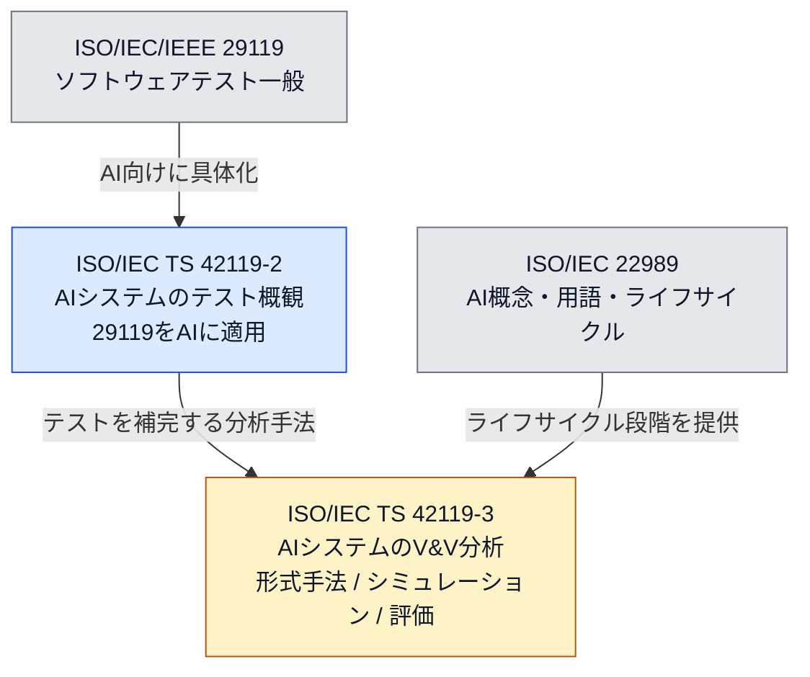
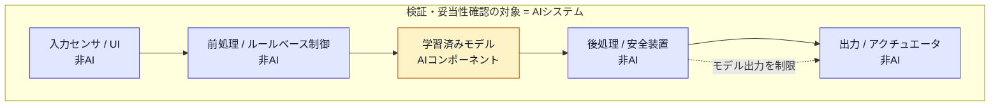
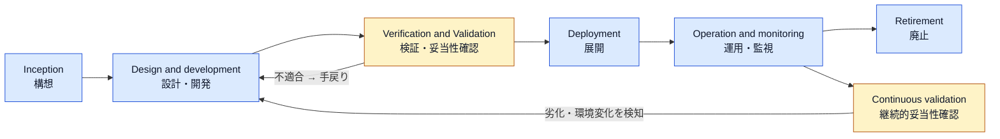
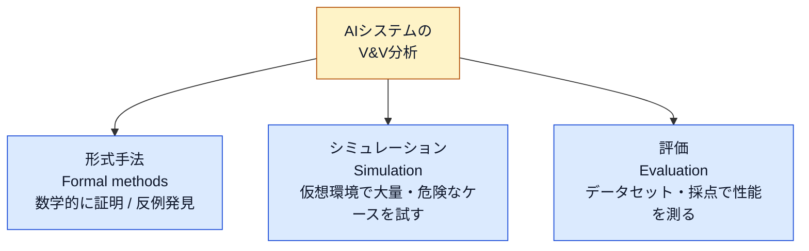
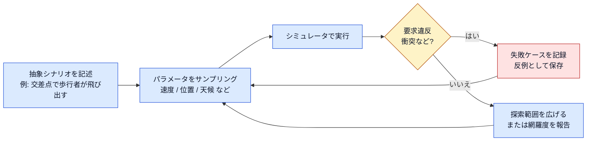
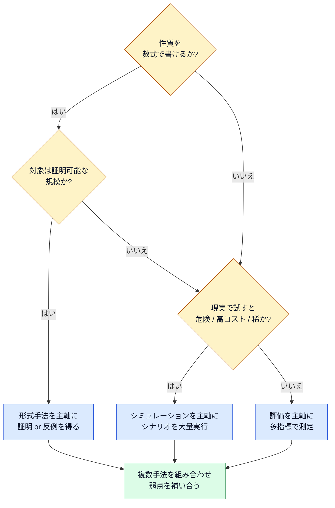
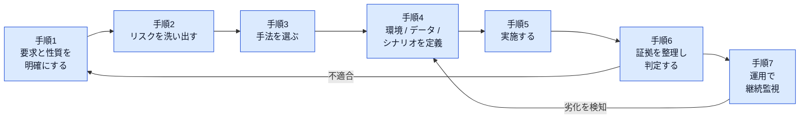
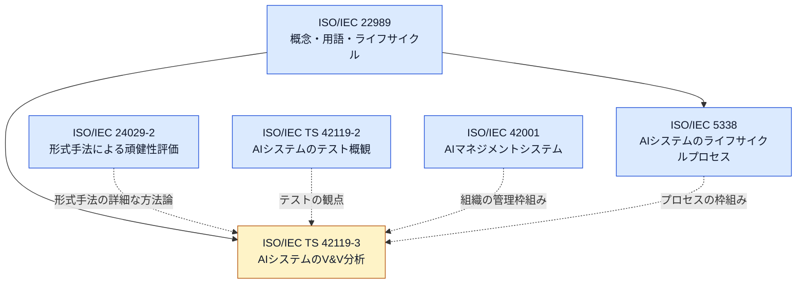

# ISO/IEC TS 42119-3 初学者向けガイド

**AIシステムの検証・妥当性確認分析（Verification and validation analysis of AI systems）を、ステップバイステップで理解する**

| 項目 | 内容 |
|---|---|
| 対象規格 | ISO/IEC TS 42119-3「Artificial intelligence — Testing of AI — Part 3: Verification and validation analysis of AI systems」 |
| 調査基準日 | 2026年10月4日までに公開されている情報（作成日: 2026年10月5日） |
| 想定読者 | AI/MLシステムの品質保証・開発・テストに関わる初学者〜中級者 |
| 表記ルール | 図解は mermaid、表は Markdown。ASCII図解は使用しない |

---

## 0. 先に読んでください：本ガイドの情報の出どころと限界

> **重要な前提**
> ISO/IEC TS 42119-3 の本文は有償の規格であり、ISOは自社コンテンツを生成AIの入力に使うことを許諾していません。そのため、本ガイドは **規格本文の条項を引用・要約したものではありません**。
> 公開されている「抄録（Abstract）・ステータス・ライフサイクル情報」と、規格が扱うとされる3手法（形式手法・シミュレーション・評価）について **国際的に著名な研究者・開発者が公開している一次資料** を根拠に、概念を理解するための解説として構成しています。
> 条項番号・「shall」要求事項・附属書の内容は記載していません。実務で適合性を主張する場合は、必ず正式発行後の規格本文を入手してください。

各記述には、根拠の種類が分かるよう次のラベルを付けています。

| ラベル | 意味 | 信頼度の目安 |
|---|---|---|
| 【規格公開情報】 | ISO等の公式ページに掲載されている抄録・ステータス・番号 | 高い |
| 【外部資料】 | 規格以外の論文・技術ブログ・他規格の公開情報 | 出典URLで確認可能 |
| 【本ガイドの解説】 | 理解を助けるための例示・整理・実務への当てはめ（規格の記述ではない） | 参考。鵜呑みにしない |

なお、調査の範囲では **42119-3 そのものを解説した著名開発者の個人投稿は見つかりませんでした**（本文が非公開かつ発行前のため）。そこで、規格が名指しする3手法ごとに、その分野を代表する研究者・組織の一次資料を参照しています（第9章に一覧）。

---

## 1. 3行でわかる ISO/IEC TS 42119-3

1. **何の規格か**：AIシステムの「検証（Verification）」と「妥当性確認（Validation）」を **分析する** ためのアプローチとプロセスのガイダンス。【規格公開情報】
2. **何を扱うか**：**形式手法（formal methods）・シミュレーション（simulation）・評価（evaluation）** の3種類。【規格公開情報】
3. **対象範囲**：AIコンポーネントだけでなく、**非AIコンポーネントとの相互作用を含む「AIシステム」全体**。ライフサイクルは ISO/IEC 22989 の段階に対応。【規格公開情報】

---

## 2. Step 1：まず「規格の基本情報」を押さえる

### 2.1 基本情報

| 項目 | 内容 | 根拠 |
|---|---|---|
| 種別 | Technical Specification（TS／技術仕様書） | 【規格公開情報】 |
| 発行元 | ISO/IEC JTC 1/SC 42（Artificial intelligence） | 【規格公開情報】 |
| ICS | 35.020（情報技術一般） | 【規格公開情報】 |
| 版 | Edition 1（ISOページ上の表記は 2025-10） | 【規格公開情報】 |
| ステータス | **60.00 Under publication（出版準備中）**、2026-09-25に到達。ISOページは「最終製作工程（最大7週間）」と記載 | 【規格公開情報】 |
| 旧番号の可能性 | 同一の抄録を持つ規格案が「ISO/IEC TS 17847」名義で規格データベースに掲載されていた（2022年7月に pre-draft 登録）。後に 42119 シリーズへ統合されたものと見られる | 【外部資料】 |

> **調査基準日（2026-10-04）時点では、まだ「発行済み（60.60）」には到達していません。** ISOページの「Under publication」は最終製作工程中を意味するため、発行日・価格・正式ページ数は発行後にISOストアで確認してください。

### 2.2 ここまでの道のり（ステージの推移）


読み取れること（【規格公開情報】のステージ履歴より）：

- 2025年10月に一度、承認プロセスから技術委員会へ差し戻されています（50.92）。その後2026年2月に最終テキストが再提出され、2026年9月25日に投票が終了して出版準備に入りました。
- **差戻しがあった＝内容が改訂された可能性がある**ため、2025年時点のドラフト情報に基づく解説は、最終版と細部が異なる可能性があります。【本ガイドの解説】

### 2.3 「TS（技術仕様書）」とは何か

【外部資料・一般知識】ISOの成果物には、国際規格（IS）の他に技術仕様書（TS）があります。TSは一般に、対象分野がまだ発展途上であったり、ISとして合意するには時期尚早な場合に、より柔軟な位置づけで発行されます。AIの検証・妥当性確認は手法が急速に進化している分野のため、TSという形式が選ばれているのは自然です。【本ガイドの解説】

---

## 3. Step 2：42119シリーズの中での位置づけ

### 3.1 兄弟規格との関係

| 規格 | 役割 | 状態（調査時点） | 根拠 |
|---|---|---|---|
| ISO/IEC/IEEE 29119 シリーズ | ソフトウェアテストの国際規格群 | 発行済み | 【外部資料】 |
| ISO/IEC TS 42119-2:2025 | **29119シリーズをAIシステムのテストに適用**するための要求事項とガイダンス。リスクベースのアプローチ | 2025-11 発行済み | 【規格公開情報】 |
| **ISO/IEC TS 42119-3** | **AIシステムの検証・妥当性確認の「分析」**（形式手法・シミュレーション・評価） | 出版準備中 | 【規格公開情報】 |

> 42119 の他のパート（Part 1 など）の内容は、今回の調査では確認できていないため、本ガイドでは扱いません。



> 図中の「テストを補完する分析手法」という矢印の意味づけは、パート名称（Testing of AI の Part 2 と Part 3）からの【本ガイドの解説】です。規格本文での正式な関係記述は確認していません。

### 3.2 「テスト」と「V&V分析」の違い（直感的な理解）

【本ガイドの解説】

| 観点 | テスト（42119-2が中心） | V&V分析（42119-3が中心） |
|---|---|---|
| 基本動作 | 入力を与えて出力を観察する | 「性質が成り立つか」を多角的に分析する |
| 典型的な問い | このテストケースは通るか？ | この要件・性質は**どの範囲で**保証できるか？ |
| 代表手法 | 29119の各種テスト技法 | 形式手法、シミュレーション、評価 |
| 結果の形 | 合格／不合格、欠陥レポート | 証明・反例・統計的証拠・スコア |

---

## 4. Step 3：用語を揃える（Verification と Validation）

【外部資料】ISO/IEC 22989 の整理を紹介している公開解説によると、検証は「システムが**規定された要求を満たしている**ことの確認」、妥当性確認は「システムが**実環境での意図された使用を達成できる**ことの確認」とされています。

| 観点 | 検証（Verification） | 妥当性確認（Validation） |
|---|---|---|
| 問い | 「**作り方は正しいか**」 | 「**正しいものを作ったか**」 |
| 照合先 | 仕様・要求 | 利用者のニーズ・実環境での目的 |
| 例（画像診断支援AI） | 仕様どおり、感度を満たしているか | 実際の臨床現場で役に立つか |
| 例（運転支援AI） | 車間距離の仕様を守っているか | 雨天・夜間・工事現場でも安全に使えるか |

> 【本ガイドの解説】AIでは「仕様そのものを完全に書けない」（例：「猫らしさ」を数式で定義できない）ことが多いため、検証と妥当性確認の境界があいまいになりがちです。42119-3 が「分析（analysis）」という言葉でまとめているのは、この両方を含む広い活動だから、と理解すると整理しやすくなります。

---

## 5. Step 4：「AIシステム」の範囲を理解する

規格の抄録は、対象を「**AIシステム ＝ AIシステムコンポーネント＋非AIコンポーネントとAIコンポーネントの相互作用**」と説明しています。【規格公開情報】



> 図の具体的な構成は【本ガイドの解説】による例です。ポイントは、**モデル単体の精度だけでなく、前後の非AI部品との組み合わせで安全性・品質が決まる**という見方です。たとえば、モデルが誤っても後段の安全装置が止められるなら、システムとしてのリスクは下がります。

---

## 6. Step 5：ライフサイクルのどこで使うのか

規格は ISO/IEC 22989 のライフサイクル段階に適用できるとしています。【規格公開情報】
ISO/IEC 22989 のライフサイクルは、公開されている目次・解説によると次の段階で構成されます。【外部資料】



> 【本ガイドの解説】「V&Vは開発の最後にやる関門」ではありません。AIは運用中に**データ分布が変わって性能が劣化する**ため、運用段階にも妥当性確認（継続的妥当性確認）が必要です。42119-3 の分析手法は、こうした複数段階で再利用することが想定されます。

---

## 7. Step 6：3つのアプローチを理解する（本ガイドの中心）



### 7.1 比較表（まず全体像）

【本ガイドの解説】

| 観点 | 形式手法 | シミュレーション | 評価 |
|---|---|---|---|
| 得られる結論の強さ | **強い**（性質が成り立つ証明、または反例） | 中（試した範囲での統計的証拠） | 中〜弱（測定した分布での性能） |
| 得意な問い | 「この入力範囲で**必ず**この性質が成り立つか」 | 「危険・稀な状況でどう振る舞うか」 | 「全体としてどの程度できているか」 |
| スケール | 小〜中規模モデル向き（大規模は難しい） | 環境モデルの精度に依存 | 大規模モデルにも適用しやすい |
| 主な限界 | 仕様を数式で書く必要／計算コスト | 現実との差（sim-to-real gap） | 指標・データセットの偏り、テストセット汚染 |
| 典型的な対象 | ニューラルネットの頑健性、安全性質 | 自動運転、ロボット、制御系 | LLM、分類・検出モデル、エージェント |

### 7.2 アプローチ1：形式手法（Formal methods）

**ひとことで**：「全ての入力について、この性質が成り立つ」を数学的に確かめる方法。成り立たなければ**反例**が得られます。

#### 何を確かめるのか（例）

【本ガイドの解説】代表例は**局所頑健性**です。画像 x に、ε以下のごく小さなノイズを加えても、分類結果が変わらないことを確かめます。

```text
性質：  すべての x' について、  |x' − x|∞ ≤ ε  ならば  classify(x') = classify(x)
結果：  成り立つ（証明）  または  成り立たない（反例 x' を提示）
```

#### 根拠となる資料

| 資料 | 要点 | 種別 |
|---|---|---|
| ISO/IEC 24029-2:2023 | ニューラルネットの頑健性性質を**形式手法で証明**するための方法論。手法の選択・適用・管理に焦点。形式手法は他の手法を**補完**し、頑健性への信頼を高めるものとされる | 【外部資料】（規格公開情報） |
| Seshia, Sadigh, Sastry「Toward Verified Artificial Intelligence」（CACM 2022） | AIシステムに、数学的に指定された要求に対する**強く、できれば証明可能な保証**を与える「Verified AI」の考え方。5つの課題と、それに対応する原則を提示 | 【外部資料】 |
| Katz, Barrett, Dill, Julian, Kochenderfer「Reluplex」（CAV 2017） | シンプレックス法をReLU活性化に拡張したSMTソルバ。ニューラルネット**全体**を簡略化なしで扱い、性質の証明または反例を返す。航空機衝突回避システム ACAS Xu の試作ネットで評価 | 【外部資料】 |

> Seshia氏はUCバークレーのCadence Founders Chair教授で、ACMおよびIEEEのフェローです。Reluplexの著者らはスタンフォード大学に所属しています。いずれも形式検証分野の代表的な研究者・グループです。

#### 初学者向け：形式手法の「限界」を必ず知っておく

1. **仕様が書けなければ証明できない**。「何が正しい出力か」を数式で書けない課題（自然言語の品質など）には直接使えません。
2. **スケールの壁**。Reluplexの論文自体が、当時は汎用ソルバでは扱えず専用ツールでも小さなネットワークまでだったと述べています。大規模モデル全体への適用は今も容易ではありません。【外部資料】
3. **証明できる範囲＝モデルの範囲**。「モデル単体の頑健性」が証明されても、システム全体の安全性が証明されたことにはなりません。

### 7.3 アプローチ2：シミュレーション（Simulation）

**ひとことで**：現実で試すと危険・高コスト・稀なケースを、仮想環境で大量に作って試す方法。

#### 仕組み（Scenic + VerifAI の例）

【外部資料】バークレーのSeshia氏らのグループが公開している Scenic と VerifAI が、典型的な最新手法を示しています。

| 要素 | 役割 |
|---|---|
| Scenic | シナリオ（場面の分布と、エージェントの時間的な振る舞い）を記述する確率的プログラミング言語 |
| VerifAI | 形式的な設計・分析のためのツールキット。抽象シナリオの中から**失敗ケースを探索**（falsification）する |
| 抽象シナリオ → 具体シナリオ | 抽象シナリオからサンプリングして多数の具体シナリオを作り、それぞれをテストケースとして実行する |
| 事例 | オープンソースの自動運転ソフトウェア Apollo に対し、現実的な交通シナリオから具体的な失敗シナリオを発見 |



> 図は【本ガイドの解説】によるScenic/VerifAI的な考え方の簡略図です。

#### 注意点（初学者がつまずく所）

1. **シミュレータの精度が結論の上限**：仮想環境が現実を再現できていなければ、「シミュレーションで安全」は「現実で安全」を意味しません（sim-to-real gap）。【本ガイドの解説】
2. **網羅したことの証明ではない**：失敗が見つからなくても、「ない」とは言えません。どの範囲を何件試したかを、証拠として必ず併記します。【本ガイドの解説】

### 7.4 アプローチ3：評価（Evaluation）

**ひとことで**：データセットや課題を用意し、採点ロジックで性能を測る方法。LLMやエージェントでは特に中心的な手法です。

#### 根拠となる資料

| 資料 | 要点 | 種別 |
|---|---|---|
| Liang ほか「Holistic Evaluation of Language Models（HELM）」（Stanford CRFM, 2022） | 精度だけでなく、**較正・頑健性・公平性・バイアス・毒性・効率**を含む7指標を、複数シナリオで測る多指標アプローチ。30モデルを42シナリオで同一条件評価し、トレードオフを明示する | 【外部資料】 |
| Anthropic Engineering「Demystifying evals for AI agents」（2026-01-09公開とされる） | 評価（eval）を「AIに入力を与え、出力に採点ロジックを適用して成功を測るテスト」と定義。**コード・モデル・人手**の採点方式、**能力評価と回帰評価**の区別、非決定性への対処（pass@k と pass^k）などを解説 | 【外部資料】 |

#### 「平均して良い」だけでは足りない：pass@k と pass^k

非決定的なAI（毎回出力が変わる）では、「1回成功すれば良いのか」「毎回成功しなければならないのか」で要求が大きく違います。【外部資料】Anthropicの記事は、前者を pass@k（k回のうち少なくとも1回成功）、後者を pass^k（k回連続で成功）として対比しています。

試行ごとの成功率 p = 0.9、各試行が独立と仮定した場合の計算例です。【本ガイドの解説】

| k | pass@k = 1 − (1 − p)^k | pass^k = p^k |
|---|---|---|
| 1 | 0.9 | 0.9 |
| 3 | 0.999 | 0.729 |
| 5 | 0.99999 | 0.59049 |

> 同じ「成功率90%」のAIでも、「5回に1回でも成功すればよい」用途なら十分ですが、「毎回確実に成功しなければならない」用途では、5回連続成功の確率は約59%にまで下がります。**何を要求するかで、合否の判断が逆転する**ことを意識してください。

#### 評価の落とし穴

1. **指標の選び方で結論が変わる**：HELMが多指標を採用しているのは、精度だけでは見えないトレードオフ（例：精度は高いが公平性が低い）を可視化するためです。【外部資料】
2. **評価データと実運用データのずれ**：評価で高得点でも、運用データの分布が違えば性能は出ません。【本ガイドの解説】
3. **採点者（LLM審判など）自体の信頼性**：モデルによる採点を使う場合、その採点が人手とどれだけ一致するかを確認する必要があります。【外部資料・本ガイドの解説】

---

## 8. Step 7：実務での使い分けと進め方

### 8.1 どの手法を選ぶか（判断フロー）

【本ガイドの解説】規格の記述ではなく、初学者が考え始めるための目安です。



### 8.2 V&V分析の進め方（7ステップの例）

【本ガイドの解説】



| 手順 | やること | 成果物の例 |
|---|---|---|
| 手順1 | 何を保証したいかを、測れる形で書く（例：誤検出率、安全距離） | 要求・性質の一覧 |
| 手順2 | 失敗したときの影響と起こりやすさを整理（42119-2のリスクベースの考え方と接続） | リスク一覧 |
| 手順3 | リスクごとに手法を選ぶ（第8.1章） | 手法選定の理由 |
| 手順4 | 評価データ、シミュレーション環境、シナリオ、ε等の条件を定義 | 条件定義書 |
| 手順5 | 実施。ツール版・乱数シード・データ版を記録 | 実行ログ |
| 手順6 | 「何を」「どの範囲で」「どの程度」確認できたかを証拠として整理し、判定 | V&V報告書 |
| 手順7 | 運用データで性能劣化を監視し、必要なら再検証 | 監視指標・再検証計画 |

### 8.3 ライフサイクル段階 × 手法のマッピング例

【本ガイドの解説】

| 段階（22989） | 形式手法 | シミュレーション | 評価 |
|---|---|---|---|
| 設計・開発 | 安全性質の定義、小規模部品の証明 | 初期シナリオでの探索 | 開発中の回帰評価 |
| 検証・妥当性確認 | 重要コンポーネントの証明 | 網羅的シナリオ実行 | 受入基準に対する多指標評価 |
| 展開 | 構成変更時の再証明 | 展開環境の再現試験 | 展開前の最終評価 |
| 運用・監視 | 必要に応じ再証明 | 実績データからのシナリオ再現 | 継続的な性能・公平性の監視 |

### 8.4 実務チェックリスト

- [ ] V&Vの対象を「モデル単体」ではなく「AIシステム全体（非AI部品を含む）」として定義した
- [ ] 検証（仕様適合）と妥当性確認（実環境での目的達成）を、別々の問いとして立てた
- [ ] 要求を「測れる形」で書いた（曖昧な「高精度」「安全」で止めていない）
- [ ] 手法選定の理由を、リスクと結びつけて記録した
- [ ] 結果は「どの範囲を何件試したか」とセットで報告する設計にした
- [ ] 非決定性を考慮し、pass@kとpass^kのどちらが要求に合うか決めた
- [ ] 運用段階の再検証（継続的妥当性確認）の計画がある
- [ ] 適合性を主張する前に、正式発行された規格本文を確認する予定である

---

## 9. 関連規格との関係マップ



> 点線の矢印は、規格間の「関連が深い」ことを示す【本ガイドの解説】です。規格本文での正式な参照関係（Normative references / Bibliography）は未確認です。

| 規格 | 一言で | 根拠 |
|---|---|---|
| ISO/IEC 22989:2022 | AIの概念・用語、ライフサイクル段階の定義 | 【外部資料】 |
| ISO/IEC 5338:2023 | AIシステムのライフサイクルプロセスの枠組み。22989の用語を前提とする | 【外部資料】 |
| ISO/IEC 24029-2:2023 | ニューラルネットの頑健性を形式手法で評価する方法論 | 【規格公開情報】 |
| ISO/IEC TS 42119-2:2025 | 29119をAIテストへ適用 | 【規格公開情報】 |
| ISO/IEC 42001 | AIマネジメントシステムの規格 | 【外部資料】 |

---

## 10. よくある誤解（FAQ）

| 誤解 | 実際 |
|---|---|
| 「この規格に従えばAIの安全性が保証される」 | 規格が提供するのは分析の**アプローチとプロセスのガイダンス**であり、結果を保証するものではありません。【規格公開情報（抄録の範囲）】 |
| 「形式手法を使えば全部証明できる」 | 仕様が書ける性質・扱える規模に限られます。第7.2章の限界を参照。【外部資料】 |
| 「シミュレーションで失敗しなければ安全」 | 環境モデルの精度と探索範囲に依存します。【本ガイドの解説】 |
| 「ベンチマークの点数が高ければ運用でも通用する」 | 運用データ分布や評価指標の偏りで、実際の性能は異なります。【本ガイドの解説】 |
| 「V&Vは出荷前に1回やれば終わり」 | ライフサイクル全体、特に運用中の継続的妥当性確認が重要です。【外部資料・本ガイドの解説】 |
| 「TSなので守らなくてよい」 | TSは正式な技術文書です。適用の義務の有無は、契約・規制・組織の方針によります。【本ガイドの解説】 |

---

## 11. 理解度チェック

| 問 | 答え |
|---|---|
| Q1. 42119-3が扱う3つのアプローチは？ | 形式手法・シミュレーション・評価 |
| Q2. 「AIシステム」に含まれるのは？ | AIコンポーネントと、非AIコンポーネントとの相互作用 |
| Q3. 「作り方は正しいか」はどちらの問い？ | 検証（Verification） |
| Q4. 形式手法が返す結果は？ | 性質が成り立つ証明、または反例 |
| Q5. 成功率90%・独立試行で、5回連続成功の確率は？ | 0.9の5乗 ≒ 0.59（約59%） |
| Q6. 調査基準日時点のステータスは？ | 60.00 出版準備中（発行済みではない） |

---

## 12. 限界と次の一歩

1. **正式発行を待つ**：ISOページ（下記URL）でステータスが 60.60（発行済み）になったら、本文を入手して条項ベースで確認してください。
2. **42119-2を先に読む**：リスクベースのテスト全体像（Part 2）は発行済みです。Part 3はその分析手法を深掘りする位置づけと考えられます。【本ガイドの解説】
3. **3手法を一つずつ手を動かす**：形式手法（Reluplex／Marabou系のツール）、シミュレーション（Scenic/VerifAI）、評価（HELM、自組織のeval）の順に、小さな題材で試すと理解が定着します。
4. **本ガイドの再確認**：発行後は、第2章の基本情報と、各章の【本ガイドの解説】部分が規格本文と食い違っていないかを確認してください。

---

## 13. 根拠ソース一覧（URL）

確認日：2026-10-05（調査基準日：2026-10-04）

### 13.1 規格の公式情報

| 資料 | URL | 確認した内容 |
|---|---|---|
| ISO/IEC TS 42119-3（ISO公式） | <https://www.iso.org/standard/85072.html> | 抄録、60.00出版準備中、ステージ履歴、委員会、ICS |
| ISO/IEC TS 42119-2:2025（ISO公式） | <https://www.iso.org/standard/84127.html> | 29119適用・リスクベースの概要、2025-11発行 |
| ISO/IEC 24029-2:2023（ISO公式） | <https://www.iso.org/standard/79804.html> | 形式手法による頑健性評価の方法論 |
| 42119-3の旧番号候補 TS 17847（AI Standards Hub） | <https://aistandardshub.org/?p=13280> | 同一抄録、2022年7月 pre-draft 登録の記載 |

### 13.2 ライフサイクル・用語（ISO/IEC 22989 / 5338 の公開解説）

| 資料 | URL | 確認した内容 |
|---|---|---|
| AS ISO/IEC 22989:2023 目次（Standards Australia） | <https://store.standards.org.au/product/as-iso-iec-22989-2023> | 6.2.4 V&V、6.2.6 運用・監視、6.2.7 継続的妥当性確認 |
| ISO/IEC 22989 解説（regulations.ai） | <https://regulations.ai/regulations/RAI-XS-GO-I2ITAXX-2022> | ライフサイクル段階、検証・妥当性確認の定義の概要 |
| ISO/IEC 5338 解説（regulations.ai） | <https://regulations.ai/regulations/RAI-XS-GO-PROCESS-2023> | 22989との関係 |

### 13.3 国際的に著名な研究者・組織の一次資料（3手法の根拠）

| 分野 | 資料 | URL |
|---|---|---|
| 形式手法 | Seshia, Sadigh, Sastry「Towards / Toward Verified Artificial Intelligence」 | <https://arxiv.org/abs/1606.08514> |
| 形式手法 | 同 CACM 2022 版（書誌） | <https://people.eecs.berkeley.edu/~sseshia/pubs/b2hd-seshia-cacm22a.html> |
| 形式手法 | Katz ほか「Reluplex」 | <https://arxiv.org/abs/1702.01135> |
| シミュレーション | Scenic の関連論文一覧 | <https://scenic-lang.readthedocs.io/en/latest/publications.html> |
| シミュレーション | Scenic と VerifAI による IEEE AV Test Challenge | <https://people.eecs.berkeley.edu/~sseshia/pubs/b2hd-viswanadha-aitest21.html> |
| 評価 | Liang ほか「Holistic Evaluation of Language Models」 | <https://crfm.stanford.edu/2022/11/17/helm.html> |
| 評価 | 同 論文（arXiv） | <https://arxiv.org/pdf/2211.09110v2.pdf> |
| 評価 | Anthropic Engineering「Demystifying evals for AI agents」 | <https://anthropic.com/engineering/demystifying-evals-for-ai-agents> |

> 補足：Anthropicの記事の公開日（2026-01-09）や「20〜50件の実失敗ケースから始める」という推奨は、二次解説（<https://toolnavs.com/article/1058-anthropic%E3%81%AE%E3%82%A8%E3%83%B3%E3%82%B8%E3%83%8B%E3%82%A2%E3%83%AA%E3%83%B3%E3%82%B0> など）の記述に基づく部分があります。引用する際は原文で確認してください。

---

## 14. 用語集

| 用語 | 意味 |
|---|---|
| TS | Technical Specification。技術仕様書 |
| JTC 1/SC 42 | ISO/IECの合同技術委員会のAI担当小委員会 |
| V&V | Verification and Validation。検証と妥当性確認 |
| 形式手法 | 数学的な仕様と推論で、システムの性質を証明・反証する技術 |
| 反例 | 性質を破る具体的な入力・状況 |
| Falsification | 反例（失敗ケース）を能動的に探索する手法 |
| sim-to-real gap | シミュレーションと現実の差 |
| eval | AIへの入力と採点ロジックから成る評価 |
| pass@k / pass^k | k回のうち少なくとも1回成功／k回すべて成功する確率 |
| 局所頑健性 | 入力に小さな摂動を加えても出力が変わらない性質 |
| 継続的妥当性確認 | 運用中も、実環境で目的を達成し続けているかを確認し続ける活動 |

---

*本ガイドは、公開情報に基づく学習用の解説です。規格本文の代替ではありません。適合性の判断・契約・監査に用いる場合は、正式発行された ISO/IEC TS 42119-3 の本文をご確認ください。*
