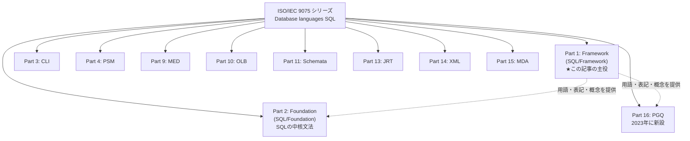
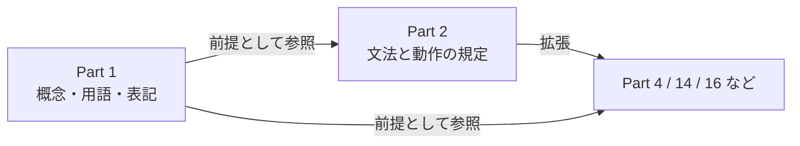
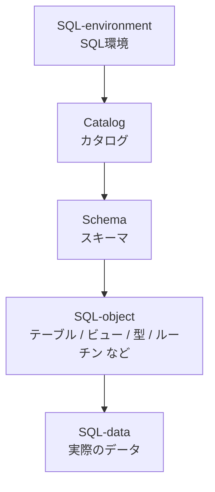
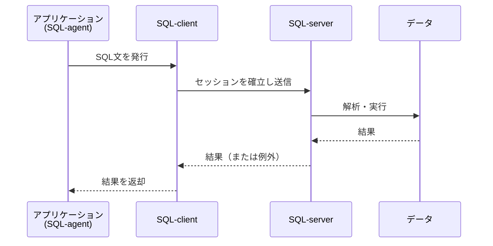
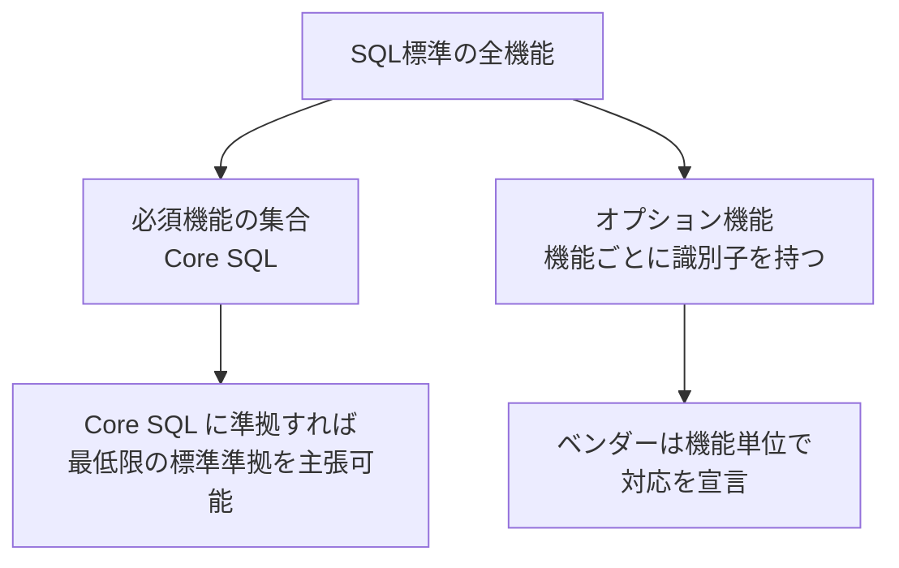
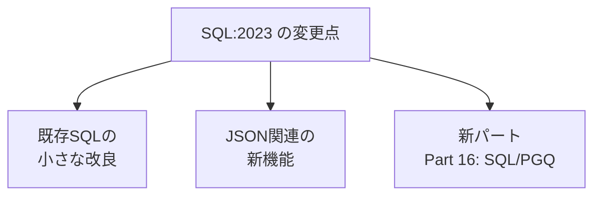
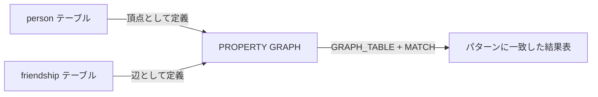
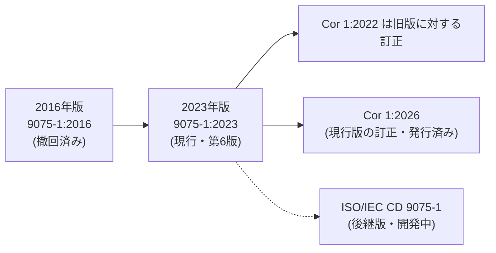
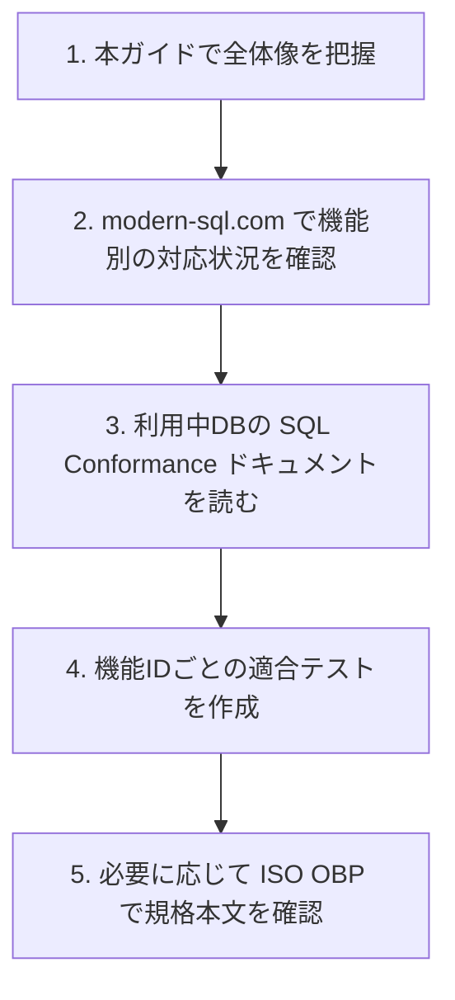

# ISO/IEC 9075-1:2023（SQL/Framework）初学者向けステップバイステップ解説ガイド

> **対象読者**: SQLは書けるが「SQL標準」の全体像を知らないエンジニア／QAエンジニア
> **情報基準日**: 2026年10月8日時点で確認できた公開情報
> **規格の正式名称**: Information technology — Database languages SQL — Part 1: Framework (SQL/Framework)

---

## 0. 先に結論（3分で分かる要約）

| 観点 | 内容 |
|---|---|
| 何の規格か | SQL標準（ISO/IEC 9075シリーズ）全体の「**枠組み（フレームワーク）**」を定める第1部 |
| 何が書かれているか | 他のパートが使う**概念・用語・表記法**と、SQL文を処理した結果を規定するための考え方 |
| SQL文法そのものは？ | **書かれていない**（文法の本体は Part 2: Foundation にある） |
| 版 | 第6版（Edition 6）、2023年6月発行、74ページ |
| 技術委員会 | ISO/IEC JTC 1/SC 32（Data management and interchange） |
| 現在のステータス | 発行済み。2025年6月に定期見直し段階（90.92: To be revised）へ。**後継ドラフト（ISO/IEC CD 9075-1）が開発中** |
| 訂正票 | ISO/IEC 9075-1:2023/Cor 1:2026 が発行済み（無償） |
| 初学者向けの一言 | 「SQL標準という大きな本棚の、**目次と用語集と凡例**にあたる巻」 |

---

## 1. Step 1: SQL標準の全体像をつかむ

### 1.1 SQL標準は「1冊」ではなく「パートの集合」

SQL標準は SQL:1999 以降、複数の**パート（Part）**に分割されています。Part 1 はその「親玉」ではなく、**他のパートが共通で参照する前提知識の巻**です。



### 1.2 ISO/IEC 9075 シリーズ全体のパート一覧（現行パート）

| Part | 略称 | 日本語での意味 | 一言説明 |
|---|---|---|---|
| 1 | SQL/Framework | フレームワーク | **本ガイドの対象**。概念・用語・表記の共通基盤 |
| 2 | SQL/Foundation | 基盤 | SELECT/INSERT/DDL等、SQLの中核機能の規定 |
| 3 | SQL/CLI | コールレベルインタフェース | アプリからSQLを呼び出すAPI |
| 4 | SQL/PSM | 永続格納モジュール | ストアドプロシージャ等の手続き言語 |
| 9 | SQL/MED | 外部データ管理 | 外部データソースへの接続（Foreign Data） |
| 10 | SQL/OLB | オブジェクト言語バインディング | 埋め込みSQL的な言語連携（SQLJ系） |
| 11 | SQL/Schemata | 情報・定義スキーマ | `INFORMATION_SCHEMA` の規定 |
| 13 | SQL/JRT | Java関連 | JavaでのSQLルーチン・型 |
| 14 | SQL/XML | XML関連 | XMLとSQLの連携 |
| 15 | SQL/MDA | 多次元配列 | 配列データの扱い |
| 16 | SQL/PGQ | プロパティグラフ問合せ | **2023年版で新設**。グラフ問合せをSQLに追加 |

> **補足（規定参照との区別）**: 上表はシリーズ全体のパート一覧であり、Part 1 自身を含みます。これとは別に、ISO公式ページに示される Part 1 の Clause 2（規定参照）が挙げているのは **Part 2、3、4、9、10、11、13、14、15、16** で、Part 1 自身は規定参照には含まれません。
>
> 歴史的には Part 5〜8・12 なども存在した、または計画されましたが、現行シリーズには含まれていません。欠番の経緯（内容が他パートへ吸収された等）は Markus Winand 氏の「The 16 Parts of SQL」に整理されています（参考URLは末尾）。

---

## 2. Step 2: Part 1 が「何を決めているか」

ISO公式ページの Scope（適用範囲）は、次の2点に集約されます（要約）。

1. ISO/IEC 9075 シリーズの他パートが、**SQLの文法**と、SQL実装（SQL-implementation）が文を処理した**結果**を規定するために使う**概念的な枠組み**を説明する
2. 他パートで使われる**用語と表記法**を定義する

### 2.1 役割をマークダウン表で整理

| Part 1 の役割 | 具体例（イメージ） | 初学者への意味 |
|---|---|---|
| 概念の定義 | SQL環境、カタログ、スキーマ、セッション、トランザクション | 「SQLの世界の登場人物」の紹介 |
| 用語の定義 | 規格内で厳密に使う語（例: SQL-implementation） | 規格を読むときの辞書 |
| 表記法の定義 | 文法記述（BNF風）の読み方 | 規格の「凡例」 |
| 適合性（Conformance）の枠組み | 何を実装すれば「SQL準拠」と言えるか | ベンダー比較の物差し |

### 2.2 Part 1 と Part 2 の関係（フローチャート）



> **ポイント**: `SELECT` の正確な文法や評価規則を知りたい → Part 2。
> 「そもそもSQLの世界はどんな構成要素でできているか」「準拠とは何か」を知りたい → **Part 1**。

---

## 3. Step 3: 基本概念を理解する（SQL環境のモデル）

> ※ 規格本文は有料で、ISOは本文のAI利用を認めていません。そのため、本節は**公開情報と一般的なSQL知識に基づく概念説明**です。正確な定義文は、必ずISO Online Browsing Platform（OBP）のサンプルまたは規格本文で確認してください。

### 3.1 SQLデータの入れ物の階層

実務で見慣れた「データベース > スキーマ > テーブル」は、標準の用語では次のように整理されます。



| 標準の用語 | PostgreSQLでの近い概念 | MySQLでの近い概念 | 注意点 |
|---|---|---|---|
| カタログ | データベース | （実装依存） | 製品ごとに呼び方・扱いが異なる |
| スキーマ | スキーマ | データベース（≒スキーマ） | MySQLは「スキーマ＝データベース」の扱い |
| テーブル | テーブル | テーブル | ほぼ共通 |

> **QAの視点**: 「標準ではこう呼ぶ」と「製品ではこう呼ぶ」の差を意識すると、**移植性テスト**の観点が増えます。

### 3.2 クライアントとサーバーの関係



> 上図は**概念モデル**です。実際の通信方式（ネットワークプロトコル等）は標準の対象外で、製品ごとに異なります。

### 3.3 文の分類

SQL文は大きく次のように整理して理解すると、学習しやすくなります。

| 分類 | 代表例 | 目的 |
|---|---|---|
| スキーマ定義系 | `CREATE TABLE` | 構造を定義 |
| データ操作系 | `SELECT` / `INSERT` / `UPDATE` / `DELETE` | データを読み書き |
| トランザクション系 | `COMMIT` / `ROLLBACK` | 一貫性の制御 |
| 接続・セッション系 | `SET` 系 | 接続状態の制御 |

---

## 4. Step 4: 「SQL準拠」とは何か（Conformance）

### 4.1 すべてを実装する製品は存在しない

Markus Winand 氏（modern-sql.com 運営、『SQL Performance Explained』著者）は、SQL標準は巨大で、**単一の実装がすべてを実装することはあり得ない**と述べています。SQL-92 では entry / intermediate / full の3段階の適合レベルがありましたが、SQL:1999 以降は次の構造です。



| 項目 | 内容 |
|---|---|
| Core SQL | すべての準拠実装が満たすべき**必須機能**の集合 |
| オプション機能 | Core以外。**機能単位**で対応可否を主張する |
| 機能識別子（Feature ID） | `T054`、`F292` のようなコード。機能を一意に指す |

> Winand 氏が引用した、ANSIデータベース委員会の元幹事の論文では、SQL:1999 の Core を実装することは「3社のうち2社を除き、ほぼ不可能」と評されています（出典: modern-sql.com「SQL Conformance Levels」）。

### 4.2 SQL:2023 で追加された機能はすべて「オプション」

Peter Eisentraut 氏（PostgreSQLコミッタ、ISO SQL標準の策定にも関与）の解説によれば、SQL:2023 の新機能はすべて**オプション機能**です。つまり、「SQL:2023に対応」と言っても、**どの機能に対応しているか**の確認が必須です。

### 4.3 実務での確認方法（QA向けチェックリスト）

| 手順 | やること | 具体例 |
|---|---|---|
| 1 | 製品ドキュメントの「SQL適合性」章を読む | PostgreSQL公式ドキュメントの Appendix D（SQL Conformance） |
| 2 | 機能IDで対応状況を確認 | `T626 ANY_VALUE` など |
| 3 | カタログビューで確認 | PostgreSQLは `information_schema.sql_features` で機能一覧を参照可能 |
| 4 | 自前の適合テストを用意 | 機能ごとにテストケースを作り、製品間で比較 |

```sql
-- PostgreSQL での確認例: ANY_VALUE (T626) に対応しているか
SELECT feature_id, feature_name, is_supported
FROM information_schema.sql_features
WHERE feature_id = 'T626';
```

> `information_schema` の規定は Part 11（SQL/Schemata）にあります。

---

## 5. Step 5: SQL:2023 で何が新しくなったか

Part 1 自体は枠組みの巻ですが、**SQL:2023 というエディション全体**の変更点を知ることは、Part 1 の「枠組み」が実際にどう使われるかを理解する近道です。Eisentraut 氏は変更点を次の3つに整理しています。



### 5.1 既存SQLの小さな改良（機能ID付き）

| 機能 | 機能ID | 概要 | 使用例 |
|---|---|---|---|
| UNIQUE制約のNULL扱い | F292 | NULLを重複とみなすか選べる | `UNIQUE NULLS NOT DISTINCT (col)` |
| GROUP化された表のORDER BY | F868 | グループ化表でのORDER BY | － |
| GREATEST / LEAST | T054 | 複数値の最大・最小 | `GREATEST(1, 5, 3)` |
| 文字列パディング関数 | T055 | `LPAD` / `RPAD` | `LPAD('7', 3, '0')` |
| 複数文字のTRIM | T056 | 複数文字を指定してTRIM | － |
| 文字列型の最大長省略 | T081 | 長さ指定を省略可能に | － |
| 循環検出の標識値の拡張 | T133 | 再帰クエリのcycle mark値を拡張 | － |
| ANY_VALUE | T626 | グループ内の任意の1値を返す集約関数 | `ANY_VALUE(name)` |
| 非10進整数リテラル | T661 | 16進等の整数リテラル | `0xFF` |
| 数値リテラル内のアンダースコア | T662 | 桁区切りに使える | `1_000_000` |

```sql
-- 例: ANY_VALUE により、GROUP BY に含めない列について、関数従属性を前提とせずグループ内の任意の値を集約結果に含める
SELECT department_id,
       ANY_VALUE(department_name) AS department_name,
       COUNT(*)                   AS employee_count
FROM employees
GROUP BY department_id;
```

### 5.2 JSON関連の新機能

| 機能 | 機能ID | 概要 |
|---|---|---|
| JSONデータ型 | T801 | ネイティブなJSON型 |
| 拡張JSONデータ型 | T802 | JSON型の強化 |
| 文字列ベースJSON | T803 | 文字列としてJSONを扱う従来方式 |
| SQL/JSONパスの16進整数リテラル | T840 | JSONパス言語での16進表記 |
| SQL/JSON簡易アクセサ | T860〜T864 | ドット記法等での簡易アクセス |
| SQL/JSONアイテムメソッド | T865〜T878 | JSON値に適用するメソッド群 |
| JSON比較 | T879〜T882 | JSON値の比較 |

> Eisentraut 氏は、SQL:2023 のJSON関連は SQL:2016 を土台にした強化であり、SQL/JSONパス言語は JavaScript 由来であること、ECMAScriptの構文拡張を実装拡張として追従できるよう規格の文言が調整されたことにも触れています。

### 5.3 新パート: SQL/PGQ（プロパティグラフ問合せ）

SQL/PGQ は、リレーショナルDBのテーブルの上に**グラフ構造（頂点と辺）**を定義し、パターンマッチングで問い合わせる機能です。Winand 氏は、これが新しいグラフ問合せ標準（GQL）の一部をSQLに取り込むものと説明しています。



```sql
-- 概念例（製品により細部の構文は異なる）
CREATE PROPERTY GRAPH social
  VERTEX TABLES (person KEY (id) PROPERTIES (name))
  EDGE TABLES (
    friendship KEY (id)
      SOURCE      KEY (person_a) REFERENCES person (id)
      DESTINATION KEY (person_b) REFERENCES person (id)
      PROPERTIES (since)
  );

SELECT *
FROM GRAPH_TABLE (
  social
  MATCH (p IS person)-[f IS friendship]->(q IS person)
  COLUMNS (p.name AS from_name, q.name AS to_name, f.since)
);
```

---

## 6. Step 6: 主要製品の対応状況（2026年10月8日時点で確認できた範囲）

### 6.1 PostgreSQL

| 機能 | 対応状況 | 出典 |
|---|---|---|
| UNIQUE のNULL扱い（F292） | PostgreSQL 15 | Eisentraut氏ブログ |
| ANY_VALUE（T626） | PostgreSQL 16 | 同上 |
| 非10進整数リテラル（T661）・アンダースコア（T662） | PostgreSQL 16 | 同上 |
| 独自の `json`／`jsonb` 型の追加 | `json` は 9.2、`jsonb` は 9.4 で追加（**T801への適合とは別の話**） | PostgreSQL公式ドキュメント |
| JSONデータ型（T801） | **PostgreSQL 18 時点で未対応**（公式ドキュメントの Unsupported Features に掲載） | PostgreSQL 18 公式ドキュメント Appendix D |
| JSON簡易アクセサ・アイテムメソッド | 記事公開時点では「将来」 | 同上（2023年4月時点の情報） |
| **SQL/PGQ** | 2026年3月16日に master へコミットされたが、**2026年9月7日に REL_19_STABLE から revert**。**PostgreSQL 19 には搭載されず、今後の搭載版は未定** | pgsql-committers／depesz／pgEdge |

SQL/PGQ の実装（`GRAPH_TABLE` によるグラフパターンマッチングと `CREATE / ALTER / DROP PROPERTY GRAPH`）は、2026年3月に一度コミットされたものの、リリース前に設計上の課題が複数指摘されたため、2026年9月7日に Peter Eisentraut氏自身のコミットで revert されました。したがって、これらは **PostgreSQL 19 の機能ではありません**。後継バージョンでの再提案が見込まれますが、搭載版は確定していません。

> **注意**: Eisentraut氏の対応表は2023年4月時点です。最新の対応状況は、お使いのバージョンの公式ドキュメント（SQL Conformance）で必ず確認してください。SQL/PGQ の搭載版についても、PostgreSQL 公式のリリースノートで確認してください。

### 6.2 Oracle Database

Oracle の公式ブログによれば、Oracle は SQL/PGQ の標準化を主導し、**Oracle Database 23ai で最初の商用SQL/PGQ実装**を提供しました。JSON型やVECTOR型をプロパティのデータ型に使える点なども特徴として挙げられています。

### 6.3 PostgreSQLとOracleのPGQ実装差（コミュニティでの検証例）

PostgreSQLのメーリングリストでは、PGQのリグレッションテストをOracleでも動かした比較が共有されています。報告された例を抜粋します（個別の挙動は各製品の最新版で再確認してください）。

> **比較対象の時点**: 下表の「PostgreSQL」列は、2026年9月7日の revert 前の PostgreSQL 開発版（master にコミットされていた SQL/PGQ 実装）を対象とした報告です。現在の PostgreSQL の対応状況を示すものではありません（6.1 のとおり、SQL/PGQ は PostgreSQL 19 には搭載されていません）。

| 項目 | PostgreSQL | Oracle |
|---|---|---|
| `ALTER PROPERTY GRAPH` | 対応 | 非対応（報告時点） |
| `NODE` / `RELATIONSHIP` の同義語 | 標準の同義語に対応 | `VERTEX` / `EDGE` のみ |
| `TEMPORARY PROPERTY GRAPH` | 対応 | 非対応（報告時点） |

> **QAの教訓**: 同じ標準機能でも**製品間で差が出る**ことが、実例として確認できます。移植性を謳うシステムでは、機能単位の適合テストが重要です。

---

## 7. Step 7: 規格の改訂状況（今後の動き）



| 日付 | 出来事（ISO公式ページより） |
|---|---|
| 2018-07-30 | 新規プロジェクト承認 |
| 2020-11 | 委員会ドラフト（CD）登録・協議開始 |
| 2022-10 | DIS投票開始（12週間） |
| 2023-05 | FDIS投票終了 |
| 2023-06-01 | **国際規格として発行** |
| 2025-06-22 | 定期見直し段階へ（90.92: To be revised） |
| 2026 | Cor 1:2026 発行／後継の CD 9075-1 が開発中 |

---

## 8. Step 8: エンジニア／QAのための活用ガイド

### 8.1 いつ Part 1 を読むべきか

| 場面 | 読むべきか | 理由 |
|---|---|---|
| SQLの書き方を学ぶ | いいえ（Part 2が主） | Part 1は概念・用語の巻 |
| ベンダー比較・移行調査 | **はい** | 適合性（Core SQL／機能ID）の考え方を理解できる |
| 適合テスト設計 | **はい** | 機能単位でテスト項目を切り出す土台になる |
| 規格本文を読み進める | **はい（最初に）** | 用語・表記法の凡例にあたる |

### 8.2 学習ロードマップ



### 8.3 よくある誤解

| 誤解 | 正しい理解 |
|---|---|
| Part 1 にSQLの文法が書いてある | 文法の中核は Part 2。Part 1 は枠組み |
| SQL:2023対応＝全機能対応 | 新機能は**オプション**。機能ID単位で確認が必要 |
| 標準準拠ならどのDBでも同じに動く | 実装依存要素や対応機能の差があり、製品間差は残る |
| SQL標準は1冊の文書 | 複数パートの**シリーズ** |

---

## 9. 用語集

| 用語 | 意味 |
|---|---|
| SQL-implementation | SQLを処理する実装（DBMS本体など） |
| Core SQL | 準拠に最低限必要な必須機能群 |
| Feature ID | 機能を一意に識別するコード（例: T626） |
| Catalog / Schema | SQLオブジェクトを格納する階層構造 |
| SQL/PGQ | プロパティグラフ問合せ（Part 16） |
| CD / DIS / FDIS | 委員会原案／国際規格案／最終国際規格案（策定段階） |
| OBP | ISOのOnline Browsing Platform（規格のオンライン閲覧） |

---

## 10. 根拠となる情報源（URL）

> 調査基準日: 2026年10月8日。規格本文は有料のため、**ISO公式ページの公開情報**と、**著名な国際的開発者・コミュニティの公開記事**を根拠にしています。

### 10.1 規格の一次情報

| # | 内容 | URL |
|---|---|---|
| 1 | ISO/IEC 9075-1:2023 公式ページ（Scope、版、ライフサイクル、規定参照） | <https://www.iso.org/standard/76583.html> |
| 2 | 後継ドラフト ISO/IEC CD 9075-1 | <https://www.iso.org/standard/92320.html> |
| 3 | ISO/IEC 9075-1:2023/Cor 1:2026 | <https://www.iso.org/standard/93690.html> |
| 4 | ISO/IEC 9075-2（Foundation） | <https://www.iso.org/standard/76584.html> |
| 5 | ISO/IEC 9075-16（SQL/PGQ） | <https://www.iso.org/standard/79473.html> |

### 10.2 国際的な開発者・実装者による解説

| # | 発信者 | 内容 | URL |
|---|---|---|---|
| 6 | Peter Eisentraut（PostgreSQLコミッタ） | SQL:2023 の新機能解説 | <https://peter.eisentraut.org/blog/2023/04/04/sql-2023-is-finished-here-is-whats-new> |
| 7 | Peter Eisentraut | PostgreSQLのSQL:2023対応状況 | <https://peter.eisentraut.org/blog/2023/04/18/postgresql-and-sql-2023> |
| 8 | Peter Eisentraut | PostgreSQLへのSQL/PGQ実装コミット（2026-03-16） | <https://www.postgresql.org/message-id/E1w247I-0000Tk-2Y@gemulon.postgresql.org> |
| 9 | Markus Winand | SQL適合レベル（Core SQLとオプション機能） | <https://modern-sql.com/standard/levels> |
| 10 | Markus Winand | SQL標準の16パートの整理 | <https://modern-sql.com/standard/parts> |
| 11 | Markus Winand（jOOQ Tuesdays） | 標準準拠への考え方のインタビュー | <https://blog.jooq.org/jooq-tuesdays-markus-winand-is-on-a-modern-sql-mission/> |
| 12 | Oracle（公式ブログ） | Oracle Database 23ai のSQL/PGQ | <https://blogs.oracle.com/database/property-graphs-in-oracle-database-23ai-the-sql-pgq-standard> |

### 10.3 コミュニティ・補助資料

| # | 内容 | URL |
|---|---|---|
| 13 | depesz「Waiting for PostgreSQL 19 – SQL/PGQ」 | <https://www.depesz.com/tag/graphs/> |
| 14 | PostgreSQL ML: PGQ実装のOracleとの比較検証 | <https://www.postgresql.org/message-id/CAExHW5ufB8y1oguSea_9WPFHFDOOTsxZ3Na_OAUBF-H%2BB7AfYw%40mail.gmail.com> |
| 15 | PostgreSQL ML: SQL:2023向けドキュメント更新の議論 | <https://hackorum.dev/topics/47552> |
| 16 | Wikipedia: SQL:2023 | <https://en.wikipedia.org/wiki/SQL:2023> |
| 17 | pgEdge「Looking Forward to Postgres 19: Epilogue」（SQL/PGQ の revert） | <https://www.pgedge.com/blog/looking-forward-to-postgres-19-epilogue> |
| 18 | PostgreSQL 18 公式ドキュメント: Unsupported Features（T801 未対応） | <https://www.postgresql.org/docs/18/unsupported-features-sql-standard.html> |

---

## 11. 本ガイドの限界と注意点

| 項目 | 内容 |
|---|---|
| 規格本文の未参照 | ISO規格本文は有料かつAI利用不可のため、**Part 1 の条文の詳細（定義文、適合性条項の細部）は本ガイドで直接引用していません**。第3章の概念説明は一般的なSQL知識に基づく解説です |
| 時点依存の情報 | 製品の対応状況（特にPostgreSQL 19、Oracle）は変化が速いため、最新の公式ドキュメントで再確認してください |
| 実装差 | コード例は概念理解用です。実際の構文は製品・バージョンで差があります |
| 次の一歩 | 条文レベルの確認が必要な場合は、ISO OBPのサンプルまたは規格の購入版を参照してください |
