# ISO/IEC 22989:2022 初学者向け解説ガイド

**AIの「共通言語」をステップバイステップで理解する（AI概念と用語の国際規格）**

| 項目 | 内容 |
|---|---|
| 対象規格 | ISO/IEC 22989:2022 *Information technology — Artificial intelligence — Artificial intelligence concepts and terminology* |
| 想定読者 | AI・ソフトウェア・QAに関わる初学者（AIの用語を整理したい人、ISO/IEC 42001 や AI関連規格を読み始める人） |
| 情報確認日 | 2026年10月8日 |
| 参照元（指定） | <https://www.iso.org/standard/74296.html> |
| 本書の位置づけ | 規格本文の転載ではなく、**要約・言い換え・学習用の整理**です。正確な文言は必ず公式の規格本文で確認してください |

---

## 0. このガイドの読み方

### 0-1. ゴール

このガイドを読み終えると、次のことができるようになります。

1. ISO/IEC 22989 が「何のための規格」で「何が書かれていないか」を説明できる
2. 「AIシステム」「モデル」「自動化」「自律性」などの**混同しやすい用語を区別**できる
3. AIシステムの**ライフサイクル**と**ステークホルダーの役割**を図で説明できる
4. ISO/IEC 42001 など他のAI規格を読むときの**辞書として使える**

### 0-2. 学習ステップの全体像

```mermaid
flowchart LR
    S0["Step 0<br/>規格の位置づけ"] --> S1["Step 1<br/>用語 Clause 3"]
    S1 --> S2["Step 2<br/>AIの概念 Clause 5.1-5.14"]
    S2 --> S3["Step 3<br/>信頼性 Clause 5.15-5.18"]
    S3 --> S4["Step 4<br/>関係者の役割 Clause 5.19"]
    S4 --> S5["Step 5<br/>ライフサイクル Clause 6"]
    S5 --> S6["Step 6<br/>機能の全体像 Clause 7"]
    S6 --> S7["Step 7<br/>エコシステム Clause 8"]
    S7 --> S8["Step 8<br/>分野と応用 Clause 9-10"]
    S8 --> S9["Step 9<br/>最新動向と実務活用"]
```

> **ポイント**: この規格は「要求事項（〜しなければならない）」を定めるものではなく、**用語と概念を揃えるための辞書兼解説書**です。認証の対象にもなりません。

---

## 1. Step 0: 規格の基本情報と位置づけ

### 1-1. 基本情報

| 項目 | 内容 |
|---|---|
| 規格番号 | ISO/IEC 22989:2022（第1版） |
| 発行日 | 2022年7月（ISOの記録では 2022-07-19 に 60.60 International Standard published） |
| ページ数 | 60ページ（原版） |
| 担当委員会 | ISO/IEC JTC 1/SC 42（Artificial intelligence） |
| ICS分類 | 35.020（IT一般）、01.040.35（IT用語） |
| 規格の種類 | 用語・概念規格（Vocabulary / Concepts） |
| 正誤訂正版 | ISOのページに **Corrected version (fr) 2025-12** の記載あり。欧州規格側でも「Corrected version 2025-12」が採用されている |
| 追補（Amendment） | Amd 1（生成AI）は最終段階、Amd 2 は委員会ドラフト段階（詳細は Step 9） |
| 入手性 | ISOストアのページ上で価格が **CHF 0** と表示されていた（2026-10-08 確認）。BSIのAI Standards Hubでも "free to access" と表示 |

### 1-2. 規格が扱う範囲（スコープ）

規格のスコープは次の3点に集約されます（言い換え）。

1. **AIに関する用語を定める**
2. **AI分野の概念を説明する**
3. 他の規格を作るときや、さまざまな関係者（企業・行政・非営利団体など）の**コミュニケーションの土台**として使える

### 1-3. なぜ重要なのか: 他の規格の「辞書」になっている

ISO/IEC 22989 は、AIマネジメントシステム規格である **ISO/IEC 42001** の用語の拠りどころ（normative reference）として扱われています。

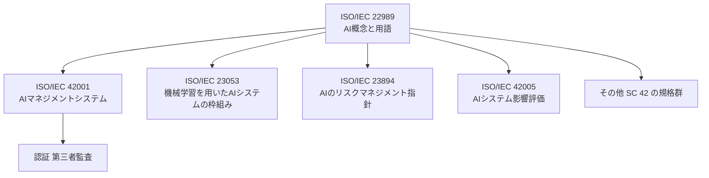

| 関連規格 | 何についての規格か | 22989との関係（学習上の理解） |
|---|---|---|
| ISO/IEC 42001 | AIマネジメントシステムの要求事項 | 22989 が用語の基盤。42001 は「何を管理すべきか」、22989 は「その言葉の意味」 |
| ISO/IEC 23053 | 機械学習（ML）を使うAIシステムの枠組み | MLの概念を22989と共有 |
| ISO/IEC 23894 | AIのリスクマネジメント指針 | リスク議論で使う用語を22989と共有 |
| ISO/IEC 42005 | AIシステム影響評価 | 利害関係者・ライフサイクルの用語を共有 |
| ISO/IEC TR 24028 | AIの信頼性の概観 | 22989 の信頼性概念（5.15）とセットで読む |
| ISO/IEC 24029 | AIシステムのロバストネス評価 | ロバストネスの用語を22989で確認 |
| ISO/IEC 5259-1 | 分析・MLのためのデータ品質（概要・用語） | データ関連の用語を補完 |
| ISO/IEC 12792 | AIシステムの透明性タクソノミー | 透明性（5.15.8）の詳細化 |
| ISO/IEC 38507 | AI利用のガバナンスへの影響 | 組織のガバナンス視点 |
| ISO/IEC 20546 | ビッグデータの概要と用語 | Clause 8 のビッグデータの背景 |

> 注: 「関係」の列は学習のための整理であり、各規格が22989を正式にどう参照しているかは、各規格の本文で確認してください。

---

## 2. 規格の全体構成（地図）

### 2-1. 章立て一覧

| Clause | 題名 | 一言でいうと | 難易度の目安 |
|---|---|---|---|
| 1 | Scope | 範囲 | ★ |
| 2 | Normative references | 引用規格（本規格では「なし」） | ★ |
| 3 | Terms and definitions | **用語集**（3.1〜3.7の7分類） | ★★ |
| 4 | Abbreviated terms | 略語 | ★ |
| 5 | AI concepts | **AIの基本概念**（学習、信頼性、関係者の役割など） | ★★★ |
| 6 | AI system life cycle | **ライフサイクル**（構想から廃止まで） | ★★ |
| 7 | AI system functional overview | **AIシステムの機能の見取り図** | ★★ |
| 8 | AI ecosystem | AIを取り巻く技術・基盤 | ★★★ |
| 9 | Fields of AI | 分野（画像、言語、データマイニング、計画） | ★★ |
| 10 | Applications of AI systems | 応用例（不正検知、自動運転、予知保全） | ★ |
| Annex A | OECDのAIシステムライフサイクルとの対応 | 他の枠組みとの対応表 | ★★ |

規格の序文（Introduction）でも、5.10・5.11・Clause 8 は他の部分より技術的で、計算機科学の背景があると読みやすいと説明されています。初学者は**まず Clause 3 → 5.19 → Clause 6 → Clause 7** の順で読むと、全体像をつかみやすくなります。

### 2-2. 全体像の図解

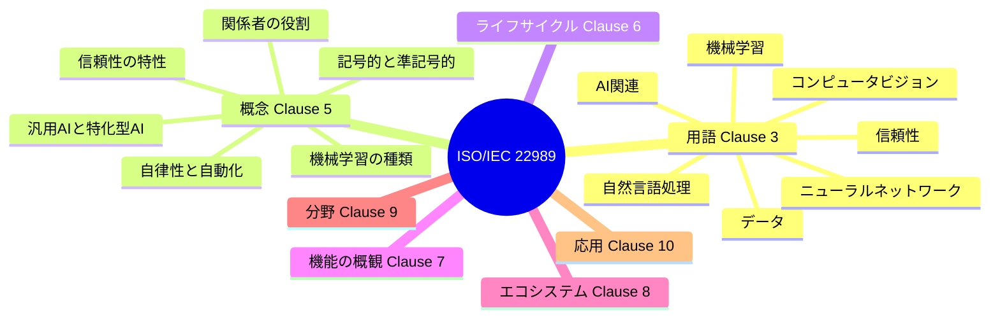

---

## 3. Step 1: 用語を理解する（Clause 3）

### 3-1. 用語の7分類

| 節 | 分類 | 含まれる用語の例 |
|---|---|---|
| 3.1 | AI関連 | AI、AIシステム、AIエージェント、AI構成要素、自律性、自動化、推論、知識、モデル、予測、汎用AI、特化型AI、継続学習 など |
| 3.2 | データ関連 | データ、データセット、入力データ など |
| 3.3 | 機械学習関連 | 機械学習、教師あり／なし学習 など |
| 3.4 | ニューラルネットワーク関連 | ニューラルネットワーク 関連用語 |
| 3.5 | 信頼性関連 | ロバストネス、信頼性、説明可能性 など |
| 3.6 | 自然言語処理関連 | 自然言語処理 関連用語 |
| 3.7 | コンピュータビジョン関連 | 画像認識 など |

### 3-2. 最重要用語（まずこの10個）

以下は定義を日本語で言い換えたものです。

| 用語 | 日本語での理解 | 初学者向けのコツ |
|---|---|---|
| **AI（人工知能）** | AIシステムの仕組みやアプリケーションを研究・開発する**分野** | 「AI」は**分野名**。個々の製品は「AIシステム」と呼ぶ |
| **AIシステム** | 人間が定めた目的に対して、コンテンツ・予測・推奨・判断といった**出力を生み出す、工学的に作られたシステム** | 「出力を生む」「人間が目的を与える」「工学的」がキーワード |
| **AIエージェント** | 環境を感知し、目標達成のために行動する**自動化された主体** | 「感知→行動」ができる点がポイント |
| **AI構成要素** | AIシステムを構成する機能的な部品 | モデル、データ処理、UIなどの部品をイメージ |
| **モデル** | システム・現象・プロセス・データを物理的／数学的／論理的に表現したもの | 「AI＝モデル」ではない。モデルはAIシステムの一部 |
| **推論（inference）** | 既知の前提から結論を導くこと（プロセスにも結果にも使う） | 学習済みモデルに入力を与えて出力を得る場面で頻出 |
| **予測（prediction）** | AIシステムが入力に対して出す**主要な出力** | 未来予測とは限らない（翻訳・画像生成・原因診断も含む） |
| **特化型AI（narrow AI）** | 定められたタスクで特定の問題を解くAI | 現在の多くの実用AI |
| **汎用AI（general AI / AGI）** | 幅広いタスクをそこそこの水準でこなすAI | 「人間の全作業ができる」という強い意味で使われることもある |
| **継続学習** | 運用中に**少しずつ追加で学習**し続けること | 運用後も挙動が変わりうる → QA上の重要論点 |

### 3-3. 混同しやすい用語ペア

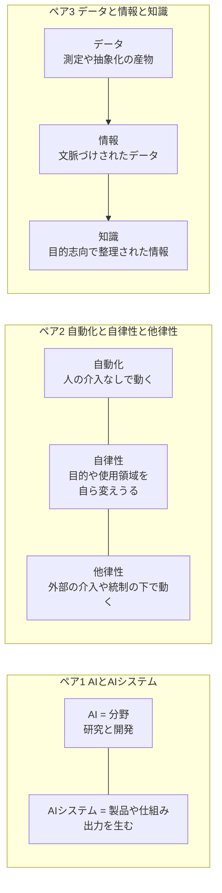

| 比較 | 違い | 具体例 |
|---|---|---|
| 自動化 と 自律性 | 自動化は「条件下で人手なしで動く」。自律性は「**目的や使用領域まで自分で変えうる**」という、より強い性質 | 定時にレポートを出すバッチ処理は自動化。自分の目標を書き換えるシステムは自律性が高い |
| 自律性 と 他律性 | 他律性は外部の介入・統制・監督のもとで動く性質。自律性と対になる概念 | 人間の承認ゲートがあるAIは他律的 |
| 特化型AI と 汎用AI | タスクの幅の違い。比較的な概念 | 画像分類器は特化型。多様なタスクを満足な水準でこなすなら汎用寄り |
| 予測 と 決定 と 行動 | 予測は出力、そこから推奨・決定・行動が続くことがある（Step 6参照） | 不正スコア（予測）→ 取引保留（決定）→ 保留実行（行動） |
| 手続き的知識 と 宣言的知識 | 宣言的は事実・規則・定理。手続き的は「解くための手順」を明示 | ルールベースシステムでは両者が登場 |

### 3-4. 「擬人化しない」という注意書き

規格の序文には、「知能」「理解」「知識」「学習」「決定」などの語を使っていても、**AIシステムを擬人化する意図はない**（一部の性質を初歩的に模倣できるという事実を述べているだけ）と明記されています。初学者がつまずきやすい点なので、最初に押さえておきましょう。

> 例: 規格でいう「知識」は、認知能力や「理解する」という行為を含意しません（用語の注記より）。

---

## 4. Step 2: AIの基本概念を理解する（Clause 5.1〜5.14）

### 4-1. 強いAI／弱いAI から 汎用AI／特化型AI へ（5.2）

かつて使われた「強いAI（strong AI）／弱いAI（weak AI）」という言い方は曖昧なため、本規格では**汎用AI（general AI）／特化型AI（narrow AI）**という整理に置き換えられています。

### 4-2. 記号的アプローチと準記号的アプローチ（5.9）

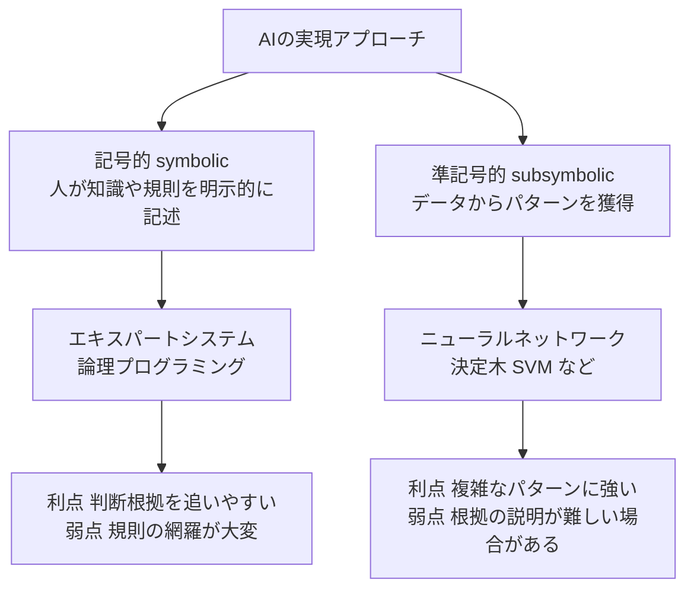

> 重要: **すべてのAIシステムが機械学習（確率的な学習）を使うわけではありません**。規則ベースのAIも規格の対象です。この点は、ISO/IEC 42001 の学習資料でも誤解されやすいポイントとして挙げられています。

### 4-3. 機械学習（5.11）

#### 学習の種類

| 種類 | データの特徴 | 例 | 一言 |
|---|---|---|---|
| 教師あり学習 | 正解ラベル付きデータ | スパム判定、画像分類 | 「答え付きの問題集」で学ぶ |
| 教師なし学習 | ラベルなしデータ | 顧客のグルーピング | 「答えなし」で構造を見つける |
| 半教師あり学習 | 一部のみラベルあり | 少量ラベル＋大量データ | 両者の中間 |
| 強化学習 | 行動と報酬 | ゲーム、ロボット制御 | 「試して褒められて」学ぶ |
| 転移学習 | 既存モデルの知見を別タスクへ | 汎用モデルを特定業務へ適応 | 「経験の使い回し」 |

#### データの役割分担（5.11.6〜5.11.9）

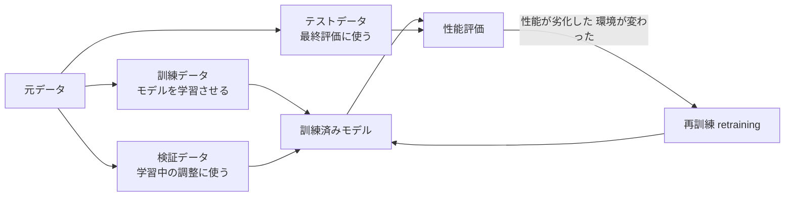

> **QAエンジニア向けの注目点**: テストデータは訓練に使ってはいけません（評価が過大になります）。また運用後に「再訓練」が起こると、ソフトウェアの変更管理と同じ視点で**回帰確認**が必要になります。

### 4-4. 機械学習アルゴリズムの例（5.12）

| アルゴリズム | イメージ |
|---|---|
| ニューラルネットワーク | 単純な計算ユニットを多数つなぎ、重みを調整して学習 |
| ベイジアンネットワーク | 確率的な依存関係をグラフで表現 |
| 決定木 | 質問の分岐で結論に至る（根拠が追いやすい） |
| サポートベクターマシン（SVM） | クラスを分ける境界を最適化 |

### 4-5. 自律性・他律性・自動化（5.13）

AIシステムは**さまざまな自動化の度合い**で動作するよう設計されます（AIシステム定義の注記）。「完全に任せる」か「人が承認する」かは設計の選択であり、リスク評価・人間の監督設計と直結します。

### 4-6. IoT と サイバーフィジカルシステム（5.14）

AIは**センサー（入力）とアクチュエータ（出力）**を持つ物理システムとも結びつきます。IoTデバイスは物理世界と「センシングまたは作動」で相互作用する存在として定義されており、ロボットは「アクチュエータを持ち、環境を感知してソフトウェア制御で物理世界のタスクを行う自動化システム」とされています。

---

## 5. Step 3: 信頼性（Trustworthiness）を理解する（Clause 5.15〜5.18）

### 5-1. 信頼性の8つの特性（5.15.2〜5.15.9）

| 特性 | ひとことで | 確認の観点の例（学習用の整理） |
|---|---|---|
| **ロバストネス（robustness）** | 想定外の入力・環境でも性能を保つ力 | ノイズ入力、分布の変化、敵対的入力でのテスト |
| **信頼性（reliability）** | 意図した通りの挙動と結果が一貫して得られる | 繰り返し実行での安定性、故障率 |
| **レジリエンス（resilience）** | 障害や攻撃から素早く回復する力 | フェイルオーバー、劣化運転 |
| **制御可能性（controllability）** | 人や外部主体が介入して挙動を変えられる | 停止・上書き・承認の仕組み |
| **説明可能性（explainability）** | 結果に影響した要因を人間が理解できる形で示せる | 根拠表示、特徴量の寄与の提示 |
| **予測可能性（predictability）** | 出力について信頼できる想定が立てられる | 挙動の再現性、仕様範囲の明確化 |
| **透明性（transparency）** | システムや組織が関係者に適切な情報を開示する | 目的・データ・限界の公開 |
| **バイアスと公平性（bias and fairness）** | 不当な偏りや不公平な扱いの検出と低減 | 属性別の性能差の測定 |

> 右列は規格本文の定義ではなく、初学者の理解のための**筆者による整理**です。

### 5-2. 信頼性特性の関係図

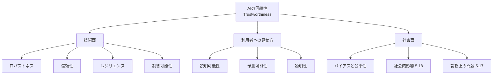

### 5-3. 検証と妥当性確認、管轄、社会的影響（5.16〜5.18）

| 節 | テーマ | 初学者向けの理解 |
|---|---|---|
| 5.16 | AI verification and validation | 「仕様どおりに作れたか（検証）」と「目的に合っているか（妥当性確認）」の2つの視点 |
| 5.17 | Jurisdictional issues | 国や地域ごとの法規制の違いがAIの設計・運用に影響する |
| 5.18 | Societal impact | AIが社会に与える影響（雇用、プライバシー、公平性など）を考慮する |

---

## 6. Step 4: AIステークホルダーの役割を理解する（Clause 5.19）

### 6-1. 役割の全体図

目次の抜粋で確認できた範囲で整理します。

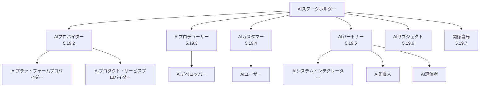

> 注: PA の配下には、目次の抜粋で確認できなかった節（5.19.5.3）があります。データ提供者に相当する役割などが含まれる可能性があるため、**原文で確認してください**。

### 6-2. 役割の早見表

| 役割 | 何をする人・組織か（理解用） | 例 |
|---|---|---|
| AIプロバイダー | AIの製品・サービス・プラットフォームを**提供する** | クラウドのAI基盤や生成AIサービスの提供者 |
| AIプロデューサー（AIデベロッパー含む） | AIシステムやモデルを**作る** | モデル開発チーム |
| AIカスタマー（AIユーザー含む） | AIの製品・サービスを**利用する** | AI機能を業務に使う企業とその従業員 |
| AIパートナー | 他の関係者と連携して**支援する** | インテグレーター、監査人、評価者 |
| AIサブジェクト | AIの出力や判断の**影響を受ける人** | 審査で判定される申込者、診断を受ける患者 |
| 関係当局 | 規制・政策・監督を行う | 規制当局、政策立案者 |

### 6-3. 具体例で理解する（銀行のローン審査）

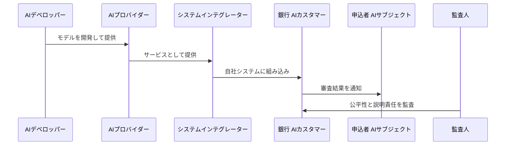

ポイントは、**1つの組織が複数の役割を兼ねる**ことが普通にあることです。たとえば銀行が自社でモデルも作れば、AIデベロッパーとAIカスタマーを兼ねます。逆に、他社が学習したモデルを使うだけの銀行でも、**利用者（AIユーザー／カスタマー）としての責任は残ります**。

---

## 7. Step 5: AIシステムのライフサイクルを理解する（Clause 6）

### 7-1. ライフサイクルの8つのステージ

規格の目次では、6.2.2〜6.2.9 として次の8ステージが示されています。

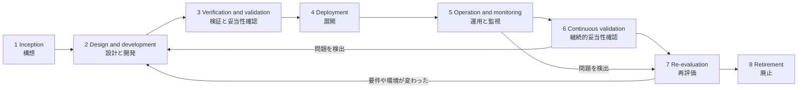

> 図は学習用に整理した典型的な流れです。実際の規格の図は、ステージ間の反復・往復を許容するモデルとして示されています。詳細は原文のFigureで確認してください。

### 7-2. 各ステージの要点

| ステージ | 何をするか（理解用） | QA・開発での関わり |
|---|---|---|
| 構想 | 目的、利用範囲、関係者、制約を整理し、AIが適切な解決手段かを検討 | 受入基準・リスクの初期洗い出し |
| 設計と開発 | データの準備、モデルの設計・訓練、システム統合 | データ品質、再現性、バージョン管理 |
| 検証と妥当性確認 | 仕様どおりか、目的に合うかを確認 | テスト設計、性能指標、公平性評価 |
| 展開 | 本番環境へ導入 | 展開手順、ロールバック、環境差異の確認 |
| 運用と監視 | 稼働させ、挙動や性能を監視 | ドリフト（入力の変化）監視、障害対応 |
| 継続的妥当性確認 | 継続学習等で挙動が変わりうるため、**運用中も検証を続ける** | 回帰テストの継続、閾値監視 |
| 再評価 | 目的・環境・規制の変化に照らして見直す | 再設計・再訓練の判断材料 |
| 廃止 | システムを停止し、データやモデルを適切に処分 | データ廃棄・移行、記録保持 |

### 7-3. Annex A: OECDの定義との対応

規格の Annex A（参考）では、本規格のライフサイクルを **OECDのAIシステムライフサイクル**と対応付けています。国際的な政策文書とISO規格を行き来するときの翻訳表として使えます。

---

## 8. Step 6: AIシステムの機能の見取り図（Clause 7）

### 8-1. データから行動までの流れ

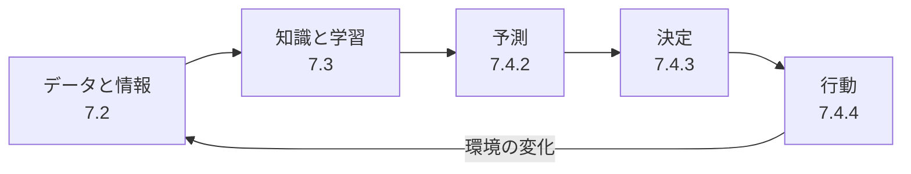

| 段階 | 内容 | 例（スパムメール対策） |
|---|---|---|
| データと情報 | 入力を集め、文脈づけする | 受信メールの本文・送信元 |
| 知識と学習 | 規則や学習により知識を得る | 過去のスパム例から学習 |
| 予測 | AIシステムの主要な出力 | 「スパムの確率 0.93」 |
| 決定 | 予測を踏まえた判断 | 「0.9以上は隔離」 |
| 行動 | 判断の実行 | 迷惑メールフォルダへ移動 |

> **重要**: 予測のあとに決定・行動が続かないシステム（分析結果を人に渡すだけ）もあります。「どこまでAIに任せるか」は他律性・自律性の設計判断と対応します。

---

## 9. Step 7: AIエコシステムを理解する（Clause 8）

### 9-1. 構成要素の関係

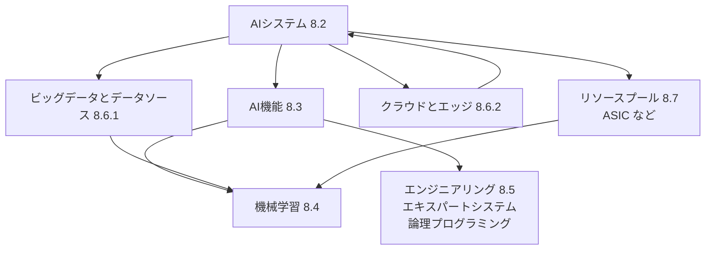

| 節 | テーマ | 初学者向けの理解 |
|---|---|---|
| 8.4 | 機械学習 | 学習によって能力を獲得するAI機能 |
| 8.5 | エンジニアリング | 規則や論理で知識を表現して推論するAI（エキスパートシステム等） |
| 8.6.1 | ビッグデータとデータソース | 大量・多様なデータが学習の燃料になる |
| 8.6.2 | クラウドとエッジ | 計算を中央（クラウド）で行うか、端末の近く（エッジ）で行うか |
| 8.7 | リソースプール | 計算資源（ASICなどの専用回路を含む） |

---

## 10. Step 8: AIの分野と応用（Clause 9〜10）

### 10-1. 分野（Clause 9）

| 分野 | 内容 | 身近な例 |
|---|---|---|
| コンピュータビジョン・画像認識（9.1） | 画像や映像から情報を取り出す | 顔認証、外観検査 |
| 自然言語処理（9.2） | 人間の言語を扱う。構成要素（9.2.2）に分けて説明 | 翻訳、要約、チャットボット |
| データマイニング（9.3） | データからパターンを見つける | 顧客の購買傾向分析 |
| 計画（9.4） | 目標達成のための行動の組み立て | 経路計画、スケジューリング |

### 10-2. 応用例（Clause 10）

| 応用 | 概要 | 信頼性上の論点 |
|---|---|---|
| 不正検知（10.2） | 異常な取引・行為を見つける | 誤検知と見逃しのバランス、説明可能性 |
| 自動運転（10.3） | 認識・判断・制御で走行 | 安全性、ロバストネス、制御可能性 |
| 予知保全（10.4） | 設備の故障を事前に予測 | 予測の信頼度、継続的な妥当性確認 |

---

## 11. Step 9: 最新動向（2026年10月8日時点）

### 11-1. 状況の整理

| 項目 | 状況 | 補足 |
|---|---|---|
| ISO/IEC 22989:2022（第1版） | 発行済み（2022-07） | ISOページに Corrected version (fr) 2025-12 の記載 |
| EN ISO/IEC 22989:2023 の正誤訂正版 | 「Corrected version 2025-12」が欧州規格側で採用。SIST版は 2026-06-17 に公開、2026-07-01 発効 | 内容の差分は有償本文で確認が必要 |
| **Amd 1: Generative AI（生成AI）** | **FDAmd 1（最終案）**。承認フェーズで、2026-09-18 に Final text received（50.00）、FDIS投票は8週間の設定 | 発行は今後。本書執筆時点では未発行 |
| **Amd 2** | **CD（委員会ドラフト）**段階。2026-08-28 に CD consultation 開始（30.20） | 内容の詳細は公開情報では確認できず |

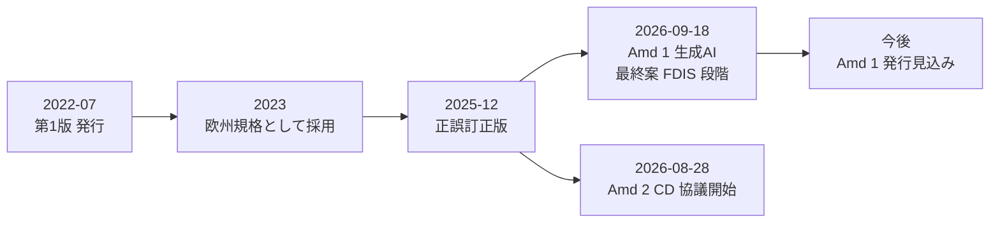

### 11-2. 生成AIの扱いに関する注意

- 本編（第1版）の発行は2022年で、**生成AIを主題とした用語整備は Amd 1 で行われる**位置づけです。
- Amd 1 の中身（追加される用語など）の詳細は、本書の調査では一次情報として確認できませんでした。一部の二次情報には「基盤モデル」「プロンプトエンジニアリング」「ハルシネーション」などが含まれると書かれたものがありましたが、**未確認情報として扱い、発行後に原文で確認してください**。
- 現時点で生成AIを扱うときは、第1版の「AIシステム」「予測」「継続学習」などの枠組みを土台に、Amd 1 の発行を待つのが安全です。

---

## 12. 実務での使い方（QA・開発の視点）

### 12-1. 活用シーン

| 場面 | 22989の使い方 |
|---|---|
| 要件定義・契約 | 「AIシステム」「AIユーザー」などの用語で、責任範囲を定義する |
| テスト計画 | 信頼性の8特性を、テスト観点の洗い出しに使う |
| リスクアセスメント | ライフサイクルの各段階でリスクを洗い出す |
| ドキュメント作成 | 用語を揃え、社内外の読み手との認識のズレを防ぐ |
| ISO/IEC 42001 の学習・監査準備 | 22989 を辞書として、42001 の文言を正しく読む |

### 12-2. ライフサイクルとテスト観点のマッピング（学習用の整理）

| ステージ | 代表的なテスト・確認観点 |
|---|---|
| 構想 | 受入基準、リスク、AI適用の妥当性 |
| 設計と開発 | データ品質、データ分割（訓練／検証／テスト）の適切さ、再現性 |
| 検証と妥当性確認 | 性能指標、ロバストネス、公平性、説明可能性 |
| 展開 | 環境差異、ロールバック、監視の準備 |
| 運用と監視 | ドリフト、性能劣化、障害対応 |
| 継続的妥当性確認 | 継続学習後の回帰確認、閾値監視 |
| 再評価・廃止 | 再訓練の要否、データ廃棄、移行 |

### 12-3. よくある誤解

| 誤解 | 正しい理解 |
|---|---|
| 22989 に準拠すれば認証が取れる | 22989 は用語・概念の規格で、**認証の対象ではない**。認証は ISO/IEC 42001 などのマネジメントシステム規格で行われる |
| AIシステムはすべて機械学習を使う | 規則ベースなど、学習を使わないAIも含まれる |
| 予測は未来の予測のこと | 翻訳・画像生成・過去事象の診断なども「予測」に含まれる |
| 自動化と自律性は同じ | 自律性は目的や使用領域を自ら変えうるという、より強い性質 |
| モデルを作った会社だけが責任を負う | 利用者（AIユーザー／カスタマー）にも、自らの利用文脈における責任がある |
| 「知識」「理解」は人間と同じ意味 | 規格は擬人化を意図していない。知識は認知的な理解を含意しない |

---

## 13. 理解度チェック

**Q1.** 「AI」と「AIシステム」の違いは？
**A1.** AIは分野（研究・開発）、AIシステムは人間が定めた目的に対して出力を生成する工学的なシステム。

**Q2.** 「予測」は未来のことだけを指しますか？
**A2.** いいえ。AIシステムが入力に対して出す主要な出力を指し、翻訳や画像生成なども含みます。

**Q3.** ライフサイクルで、運用中も検証を続ける段階はどれですか？
**A3.** Continuous validation（継続的妥当性確認）。

**Q4.** 自分でモデルを学習せず、外部のAIサービスを使う銀行はどの役割ですか？
**A4.** AIカスタマー／AIユーザー。自社の利用文脈についての責任が残ります。

**Q5.** 22989 は認証が取れる規格ですか？
**A5.** いいえ。用語・概念の規格です。

**Q6.** 汎用AIと特化型AIの違いは？
**A6.** 扱えるタスクの幅。特化型は定められたタスクで特定の問題を解くAI、汎用は幅広いタスクをそこそこの水準でこなすAI。

---

## 14. 用語集（英日対応）

| 英語 | 日本語 | 本ガイドでの節 |
|---|---|---|
| Artificial intelligence | 人工知能（分野） | 3-2 |
| AI system | AIシステム | 3-2 |
| AI agent | AIエージェント | 3-2 |
| AI component | AI構成要素 | 3-2 |
| Autonomy | 自律性 | 3-3 |
| Heteronomy | 他律性 | 3-3 |
| Automation | 自動化 | 3-3 |
| Inference | 推論 | 3-2 |
| Prediction | 予測 | 3-2 |
| Narrow AI | 特化型AI | 3-2 |
| General AI / AGI | 汎用AI | 3-2 |
| Continuous learning | 継続学習 | 3-2 |
| Declarative / Procedural knowledge | 宣言的／手続き的知識 | 3-3 |
| Symbolic / Subsymbolic | 記号的／準記号的 | 4-2 |
| Supervised learning | 教師あり学習 | 4-3 |
| Retraining | 再訓練 | 4-3 |
| Robustness | ロバストネス | 5-1 |
| Resilience | レジリエンス | 5-1 |
| Explainability | 説明可能性 | 5-1 |
| Transparency | 透明性 | 5-1 |
| AI provider / producer / customer / partner / subject | AIプロバイダー／プロデューサー／カスタマー／パートナー／サブジェクト | 6-1 |
| Continuous validation | 継続的妥当性確認 | 7-1 |
| Re-evaluation | 再評価 | 7-1 |

---

## 15. 参照ソース（根拠URL）

### 15-1. 一次情報（規格発行元・標準化機関）

| 内容 | URL |
|---|---|
| ISO 規格ページ（指定URL。ステータス、正誤訂正版 2025-12、価格 CHF 0 表示、Amd 1／Amd 2 へのリンク） | <https://www.iso.org/standard/74296.html> |
| ISO/IEC 22989:2022/FDAmd 1（生成AI）のページ（ステージ履歴） | <https://www.iso.org/standard/88145.html> |
| ISO/IEC 22989:2022/CD Amd 2 のページ（ステージ履歴） | <https://www.iso.org/standard/93144.html> |
| SIST EN ISO/IEC 22989:2026（目次、序文、用語定義のサンプル。正誤訂正版 2025-12 の欧州規格） | <https://standards.iteh.ai/catalog/standards/sist/2a71e966-b653-4763-afc5-3813ec23955c/sist-en-iso-iec-22989-2026> |
| ISO/IEC 22989:2022 サンプル（iTeh） | <https://iteh.es/catalog/standards/iso/c86ee148-a050-4bec-b1eb-7300c53a275b/iso-iec-22989-2022> |
| AS ISO/IEC 22989:2023（目次の詳細：5.15、5.19、Clause 6〜10 の節構成） | <https://store.standards.org.au/product/as-iso-iec-22989-2023> |
| BSI AI Standards Hub（"free to access" の記載） | <https://aistandardshub.org/?p=13294> |
| BSI AI Standards Hub（Amd 1 DAM のステージ） | <https://aistandardshub.org/ai-standards/information-technology-artificial-intelligence-artificial-intelligence-concepts-and-terminology-amendment-1-generative-ai-iso-iec-229892022-dam-12025-german-and-english-version-en-iso-iec/> |
| SIS（スウェーデン）Amd 1 意見募集ページ | <https://kommentera.sis.se/Home/Details/14640> |
| カナダ規格評議会 データベース | <https://scc-ccn.ca/standardsdb/standards/8178863> |
| エストニア規格協会（関連規格として 23053、23894 を掲載） | <https://www.evs.ee/en/iso-iec-22989-2022> |

### 15-2. 主要なAI開発企業・クラウド事業者の投稿（ISO/IEC 42001 関連）

> 22989 そのものを解説した投稿は見つからなかったため、**22989 を用語の基盤とする ISO/IEC 42001 の認証を発表した投稿**を参照しています。

| 発信元 | 内容 | URL |
|---|---|---|
| AWS | ISO/IEC 42001 認証取得の発表（Amazon Bedrock など） | <https://aws.amazon.com/blogs/machine-learning/aws-achieves-iso-iec-420012023-artificial-intelligence-management-system-accredited-certification> |
| Google Cloud | ISO/IEC 42001:2023 認証取得の発表 | <https://cloud.google.com/blog/products/identity-security/google-clouds-commitment-to-responsible-ai-is-now-iso-iec-certified/> |
| Anthropic（報道経由の二次情報） | 2025年1月の ISO/IEC 42001 認証取得 | <https://www.enterpriseaiworld.com/Articles/News/News/Anthropic-Becomes-One-of-the-First-Frontier-AI-Labs-to-Achieve-ISO-42001-Certification-167568.aspx> |
| CEPA（政策シンクタンク） | AWS、Google Cloud、Microsoft、OpenAI、Anthropic、IBM の 42001 認証動向の解説 | <https://cepa.org/article/what-counts-as-safe-ai/> |
| Bright Defense（二次情報） | 各社の認証発表の時系列整理 | <https://www.brightdefense.com/news/ai-governance-gains-ground-with-iso-42001/> |

### 15-3. 学習・研修資料

| 内容 | URL |
|---|---|
| BSI の ISO/IEC 22989 研修コース概要（学習目標：用語、ライフサイクル、関係者、機能、応用） | <https://www.bsigroup.com/en-CZ/training-courses/isoiec-22989-understanding-ai-concepts-and-terminology-training-course/> |
| ISO 42001 学習ガイド（22989 が 42001 の用語基盤であること、ライフサイクルの扱いなど。二次情報） | <https://open-exam-prep.com/study-guides/iso-42001-foundation/aims-fundamentals/ai-definitions-lifecycle> |

### 15-4. 本書で採用しなかった情報

- 一部のブログ・紹介サイトには、「2025年にIEEEの調査で42%…」「2025年の大幅な見直しで基盤モデル等を追加」といった記述がありましたが、**ISOの公式ページと整合せず、出典も確認できなかった**ため採用していません。

---

## 16. 注意事項

1. 本書は学習支援を目的とした**要約・言い換え**です。規格の文言そのものではありません。正式な解釈・監査・契約には、公式の規格本文を使用してください。
2. 規格の節番号・題名は、目次の抜粋（SIST版・AS版）で確認できた範囲に基づいています。
3. 「確認の観点の例」「QA向けの注目点」「テスト観点のマッピング」は、理解を助けるための**筆者の整理**であり、規格の要求事項ではありません。
4. 最新動向（Step 9）は 2026年10月8日時点の公開情報です。Amd 1 の発行などで状況が変わる可能性があるため、ISOの規格ページで最新状況を確認してください。
5. ISOのサイトには、ISOコンテンツの利用条件（著作権）に関する注意書きがあります。規格本文の再配布や転載を行う場合は、ISOの条件に従ってください。
