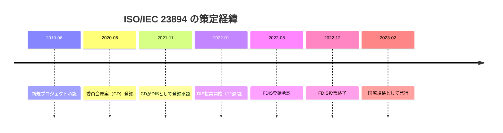
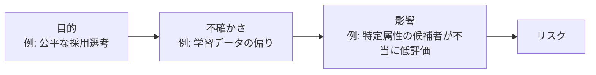
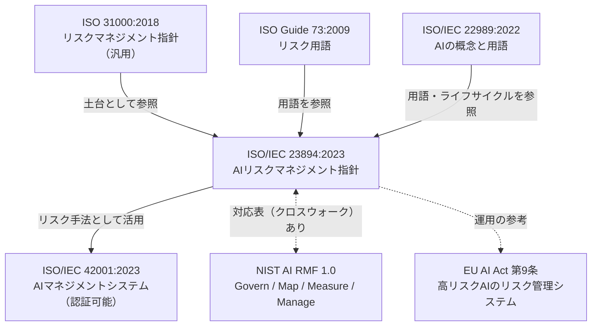
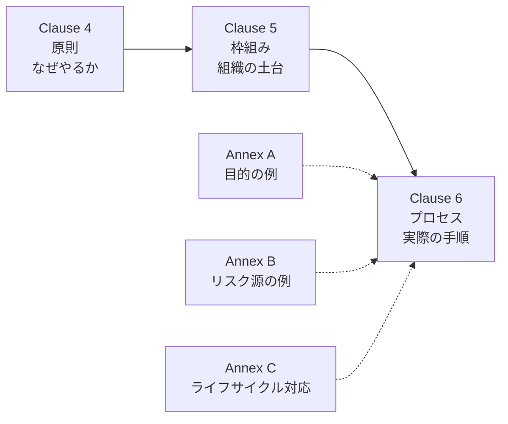
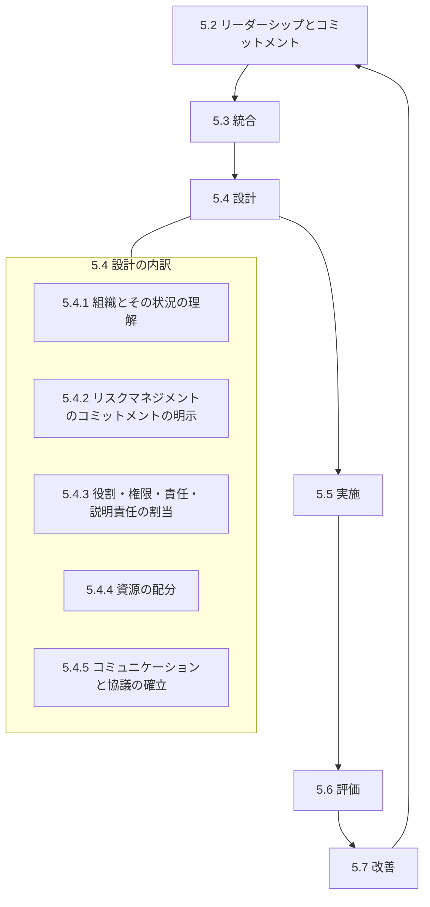
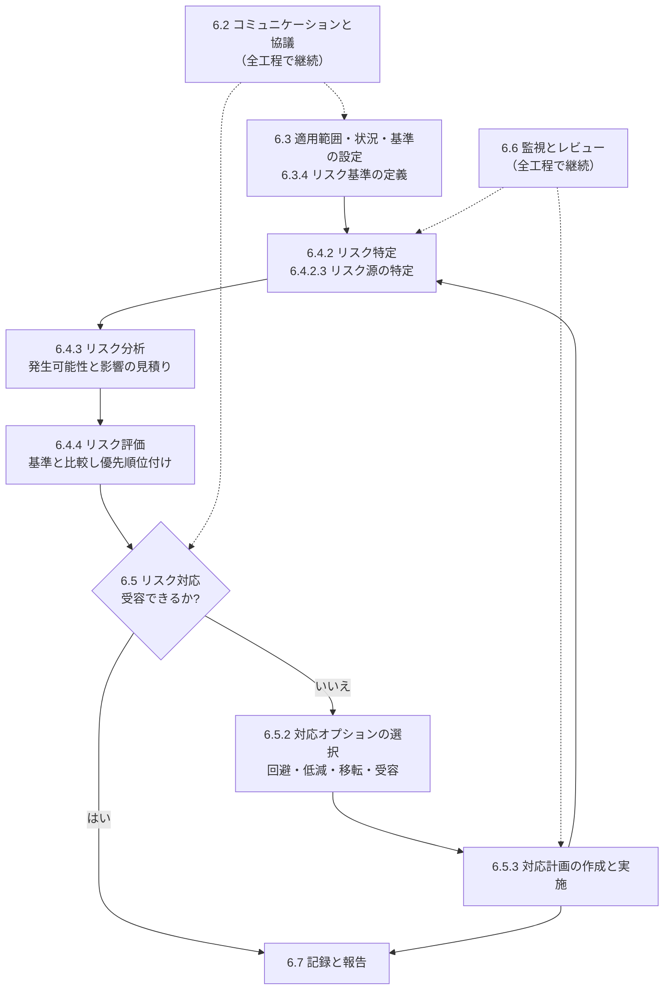
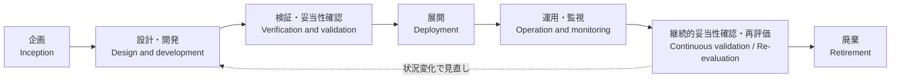
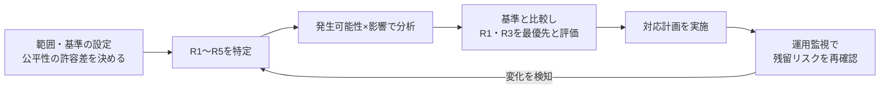

# ISO/IEC 23894:2023 初学者向けステップバイステップ解説ガイド

> **AIのリスクを「どう見つけ、どう評価し、どう減らし、どう見張るか」を整理するための国際ガイダンス**

| 項目 | 内容 |
|---|---|
| 対象規格 | ISO/IEC 23894:2023 *Information technology — Artificial intelligence — Guidance on risk management*（情報技術 ― 人工知能 ― リスクマネジメントに関するガイダンス） |
| 情報の基準日 | 2026年10月8日時点（ウェブ検索で確認できた範囲） |
| 想定読者 | AI/MLを初めて体系的に学ぶエンジニア、QA、PM、監査・法務・コンプライアンス担当 |
| 読了目安 | 約40〜60分 |
| 注意 | 本ガイドは規格本文の転載ではなく、公開情報をもとにした**独自の解説**です。正確な要求・文言は必ず正規版（有償）で確認してください |

---

## 目次

1. [まず結論：この規格を一言でいうと](#1-まず結論この規格を一言でいうと)
2. [基本情報（ISO公式ページより）](#2-基本情報iso公式ページより)
3. [Step 0：なぜAI専用のリスクマネジメントが必要か](#3-step-0なぜai専用のリスクマネジメントが必要か)
4. [Step 1：規格ファミリーの中での位置づけ](#4-step-1規格ファミリーの中での位置づけ)
5. [Step 2：規格の構成（全体地図）](#5-step-2規格の構成全体地図)
6. [Step 3：原則（Clause 4）](#6-step-3原則clause-4)
7. [Step 4：枠組み（Clause 5）](#7-step-4枠組みclause-5)
8. [Step 5：プロセス（Clause 6）](#8-step-5プロセスclause-6)
9. [Step 6：AIの目的（Annex A）](#9-step-6aiの目的annex-a)
10. [Step 7：AI特有のリスク源（Annex B）](#10-step-7ai特有のリスク源annex-b)
11. [Step 8：AIライフサイクルとの対応（Annex C）](#11-step-8aiライフサイクルとの対応annex-c)
12. [Step 9：ミニ演習（採用スクリーニングAI）](#12-step-9ミニ演習採用スクリーニングai)
13. [Step 10：関連規格・法規との関係](#13-step-10関連規格法規との関係)
14. [最新動向（2026年10月8日時点）](#14-最新動向2026年10月8日時点)
15. [よくある誤解 FAQ](#15-よくある誤解-faq)
16. [導入チェックリスト](#16-導入チェックリスト)
17. [用語集](#17-用語集)
18. [根拠となる出典URL](#18-根拠となる出典url)

---

## 1. まず結論：この規格を一言でいうと

**ISO/IEC 23894 は、汎用のリスクマネジメント規格「ISO 31000」を、AIシステムの特性に合わせて読み替えるための“AI向け補足ガイド”です。**

ポイントは3つだけ覚えれば十分です。

| # | ポイント | 意味 |
|---|---|---|
| 1 | **ISO 31000 とセットで使う** | 章立てが ISO 31000 とほぼ同じ。AIに特有の注意点が「追記」されている |
| 2 | **ガイダンス（認証なし）** | 「ISO 23894 認証」は存在しない。要求事項ではなく“指針” |
| 3 | **AIのライフサイクル全体が対象** | 企画から廃棄まで、開発者だけでなく導入・利用する組織も対象 |

---

## 2. 基本情報（ISO公式ページより）

| 項目 | 値 |
|---|---|
| 規格番号 | ISO/IEC 23894:2023 |
| 状態 | Published（発行済み）、ステージコード 60.60 |
| 発行 | 2023年2月（版: Edition 1） |
| ページ数 | 26ページ |
| 担当委員会 | ISO/IEC JTC 1/SC 42（Artificial intelligence） |
| ICS | 35.020（情報技術一般） |
| 言語 | 英語、フランス語 |
| 価格（ISOストア） | CHF 155（税・送料別） |
| 認証スキーム | なし（ガイダンス文書） |

### 開発の流れ（ISO公式ページのライフサイクル情報から）

---

## 3. Step 0：なぜAI専用のリスクマネジメントが必要か

### 3-1. 従来のソフトウェアとAIの違い

| 観点 | 従来のソフトウェア | AI（特に機械学習） |
|---|---|---|
| 振る舞いの決まり方 | 人間が書いたルール | **データから学習** |
| 動作の予測 | 入力が同じなら出力が同じ | 確率的・環境変化で変わりうる |
| 不具合の原因 | コードの欠陥が中心 | データ品質、偏り、ドリフト、学習設定など多岐 |
| 説明のしやすさ | 処理を追跡しやすい | ブラックボックスになりやすい |
| 劣化 | 変更しなければ安定 | 現実世界の変化で**精度が落ちる** |

### 3-2. 「リスク」の定義（ISO 31000 の考え方）

> **リスク ＝ 目的に対する不確かさの影響**

ここで重要なのは「**目的**」です。AIのリスクは「何を達成したいか（目的）」が決まって初めて語れます。

---

## 4. Step 1：規格ファミリーの中での位置づけ

### 4-1. 関係図

### 4-2. 隣り合う規格との違い

| 規格・枠組み | 種類 | 認証 | 一言で言うと | 23894との関係 |
|---|---|---|---|---|
| ISO 31000:2018 | 汎用ガイダンス | なし | あらゆる組織のリスク管理の型 | 23894の**土台** |
| ISO/IEC 23894:2023 | AI向けガイダンス | なし | AI版のリスク管理の進め方 | （本規格） |
| ISO/IEC 42001:2023 | 要求事項（マネジメントシステム） | **あり** | AIガバナンスの仕組み全体 | 23894は42001の**リスク手法の参考** |
| NIST AI RMF 1.0 | 自主的フレームワーク | なし | 4機能で運用する実務の枠組み | 目的が近く、NISTが**対応表**を公開 |
| EU AI Act 第9条 | 法規制 | 法的義務 | 高リスクAIにリスク管理システムを義務化 | 手法面で参考になるが**法適合を自動的に保証しない** |

> **覚え方**：23894は「**どうやるか（手順）**」、42001は「**組織の仕組み（認証対象）**」、AI Actは「**やらなければならない（法的義務）**」。

---

## 5. Step 2：規格の構成（全体地図）

目次の構造は次のとおりです（公開されている目次プレビューに基づく）。

| 章・附属書 | タイトル（意訳） | 性格 | 一言メモ |
|---|---|---|---|
| 1 | 適用範囲 | 本文 | AIを開発・提供・導入・利用する組織が対象 |
| 2 | 引用規格 | 本文 | ISO 31000 など |
| 3 | 用語と定義 | 本文 | ISO 31000 / ISO/IEC 22989 / ISO Guide 73 から |
| **4** | **AIリスクマネジメントの原則** | 本文 | 8つの原則にAI観点を追加 |
| **5** | **枠組み（フレームワーク）** | 本文 | リーダーシップ、統合、設計、実施、評価、改善 |
| **6** | **プロセス** | 本文 | 状況設定→評価→対応→監視 |
| Annex A | 目的（Objectives） | 参考（informative） | AIで考慮すべき目的の例 |
| Annex B | リスク源（Risk sources） | 参考 | AI特有のリスクの出どころ |
| Annex C | リスクマネジメントとAIシステムライフサイクル | 参考 | プロセスをライフサイクルに対応づけた例 |

> **重要な注意**：Web上の解説記事には、附属書の中身（A/B/C）を取り違えて紹介しているものがあります。ISO/IEC 42001 の附属書（A: 管理策、C: 目的とリスク源）と混同しやすいためです。**23894 は A=目的、B=リスク源、C=ライフサイクル対応**です（目次プレビューで確認）。

---

## 6. Step 3：原則（Clause 4）

ISO 31000 の原則に、AI特有の配慮を重ねたものです。以下はISO 31000の一般的な8原則を、AIの文脈で読み替えた**解説者の整理**です（規格本文の表現そのものではありません）。

| # | 原則（ISO 31000の趣旨） | AIで特に意識すること |
|---|---|---|
| 1 | **統合的**：活動全体に組み込む | AI開発のスプリントやMLOpsにリスク活動を組み込む |
| 2 | **体系的・包括的**：一貫した結果を得る | チーム・プロジェクトごとにバラバラな評価をしない |
| 3 | **カスタマイズ**：組織の状況に合わせる | 医療AIと広告AIでは受容できるリスクが違う |
| 4 | **包摂的**：利害関係者を適時に関与させる | 利用者、影響を受ける人々、規制当局、ドメイン専門家 |
| 5 | **動的**：変化に応じて見直す | データドリフト、モデル更新、利用環境の変化 |
| 6 | **最良の入手可能な情報**：限界も認識 | 評価指標やテストの限界、データの代表性の限界を明示 |
| 7 | **人間と文化の要因**：行動や文化を考慮 | 過信（自動化バイアス）、現場の運用実態 |
| 8 | **継続的改善**：学習と経験で改善 | インシデントや誤判定の教訓をプロセスに戻す |

---

## 7. Step 4：枠組み（Clause 5）

プロセス（Clause 6）を機能させるための**組織側の土台**です。

### 7-1. 枠組みの構造

> 5.2〜5.5の細目は目次プレビューで確認できる範囲です。5.6（評価）・5.7（改善）はISO 31000の枠組み構造に対応する一般的な構成として記載しています。

### 7-2. 初学者向けの読み替え

| 枠組みの要素 | 現場での具体例 |
|---|---|
| リーダーシップ | 経営層がAIリスク方針を承認し、責任者を指名する |
| 統合 | 開発プロセス（要件定義・設計・テスト・運用）にリスクレビューを組み込む |
| 組織の状況の理解 | 自社のAI利用状況、関連法規（EU AI Actなど）、顧客要件を整理 |
| コミットメントの明示 | 「AIリスク管理方針」を文書化し社内外に示す |
| 役割・責任 | AIプロダクトオーナー、データ責任者、QA、法務の役割分担表（RACI） |
| 資源配分 | 評価ツール、専門人材、教育、監視基盤の予算 |
| コミュニケーション | 開発・事業・法務・経営・利用者の間での報告ライン |

---

## 8. Step 5：プロセス（Clause 6）

**ここが実務の中心**です。ISO 31000 と同じ流れを、AIの文脈で回します。

### 8-1. プロセス全体のフローチャート

> 節番号は NIST が公開した対応表（クロスウォーク）に出てくる範囲（6.3.4、6.4.2、6.4.2.3、6.4.3、6.4.4、6.5、6.5.2、6.5.3）と、ISO 31000 の構成に基づいています。6.2（コミュニケーションと協議）は NIST AI RMF の対応表では対応づけがないと明記されています。

### 8-2. 各ステップの詳細

#### Step 5-1：適用範囲・状況・基準の設定（6.3）

「何のために」「どこまで」「どの水準なら許容か」を決めます。

| 決めること | AIでの例 |
|---|---|
| 範囲 | 対象システム、利用目的、利用者、ライフサイクルのどの段階か |
| 状況 | 法規制、業界慣行、技術成熟度、ステークホルダー |
| **リスク基準（6.3.4）** | 発生可能性・影響の尺度、許容水準、AI特有の基準（公平性指標の許容差、誤検知率の上限など） |

#### Step 5-2：リスク特定（6.4.2）

**「何が起こりうるか」を洗い出す**工程です。AI特有のリスク源（Annex B）を手がかりにします。

| 切り口 | 質問の例 |
|---|---|
| 目的から | 達成したい目的を阻害する事象は何か |
| リスク源から | データ・モデル・運用・ハードウェアのどこに不確かさがあるか |
| 影響を受ける人から | 誰が、どんな被害を受けうるか |

#### Step 5-3：リスク分析（6.4.3）

| 要素 | 内容 | AIでの注意 |
|---|---|---|
| 発生可能性 | どのくらい起こりそうか | 統計的な見積りが難しい場合も。テスト結果や運用データを活用 |
| 影響（結果） | 起きたらどうなるか | 個人への影響（人権・安全）、事業、社会への影響 |
| 既存の管理策 | すでにある対策の有効性 | 人間によるレビューが形骸化していないか |

**簡易的なリスクマトリクスの例**（※理解のための例示であり、規格が定める固定の表ではありません）

| 影響＼発生可能性 | 低 | 中 | 高 |
|---|---|---|---|
| **大** | 中 | 高 | 高 |
| **中** | 低 | 中 | 高 |
| **小** | 低 | 低 | 中 |

#### Step 5-4：リスク評価（6.4.4）

分析結果を**基準と比較**し、「対応が必要か」「優先順位は」を決めます。

#### Step 5-5：リスク対応（6.5）

| 選択肢 | 意味 | AIでの例 |
|---|---|---|
| 回避 | リスクのある活動をやめる | 高リスク用途へのAI利用を中止 |
| 低減 | 発生可能性や影響を下げる | データ拡充、バイアス緩和、人間の確認工程の追加、ガードレール |
| 移転 | 他者と分担する | 保険、契約上の責任分担、ベンダー保証 |
| 受容 | 基準内なので許容する | 残留リスクを文書化して承認 |

> 対応後に残るリスク（**残留リスク**）を必ず再評価・記録する点が重要です。

#### Step 5-6：監視とレビュー・記録と報告（6.6、6.7）

AIは**運用中に状況が変わる**ため、継続的な監視が特に重要です。

| 監視対象 | 例 |
|---|---|
| 入力データの分布 | ドリフト検知 |
| 性能指標 | 精度、誤検知率、公平性指標の推移 |
| インシデント | 誤判定の苦情、安全上の事象 |
| 外部環境 | 法改正、攻撃手法の進化 |

---

## 9. Step 6：AIの目的（Annex A）

リスクは「目的」との関係で決まるため、Annex Aは**AIで考慮したい目的の例**を挙げています。以下の一覧は規格の主題を解説者がまとめたものです（一部は目次プレビューで確認した項目を含みます）。

| 目的の例 | 初学者向けの説明 | 気にすべき問い |
|---|---|---|
| 説明責任（Accountability） | 誰が結果に責任を持つか | 責任者は明確か |
| AIの専門性（AI expertise） | AIを扱える人材・知見 | 評価できる人材がいるか |
| 学習・テストデータの可用性と品質 | 良質なデータがあるか | 代表性・正確性は十分か |
| 環境への影響 | 学習・推論のエネルギー消費など | 環境負荷を把握しているか |
| 公平性（Fairness） | 不当な差別がないか | 属性ごとの性能差は許容内か |
| 保守性（Maintainability） | 継続的に直せるか | 再学習・更新の手順は整っているか |
| プライバシー | 個人情報の適切な扱い | 学習データに個人情報が混入していないか |
| 頑健性（Robustness） | 想定外の入力でも壊れにくいか | ノイズや攻撃に耐えられるか |
| 安全性（Safety） | 人や環境に害を与えないか | 失敗時の影響は許容範囲か |
| セキュリティ | 悪意ある攻撃への耐性 | データ汚染・敵対的入力の対策は |
| 透明性と説明可能性 | 理由を説明できるか | 利用者や監査人に説明できるか |

> 各目的の項目名・分類の正確な表現は、規格の正規版でご確認ください。

---

## 10. Step 7：AI特有のリスク源（Annex B）

Annex Bは「AIならではの**リスクの出どころ**」の一覧です。公開されている複数の解説で共通して挙げられている区分は次のとおりです。

| リスク源 | 意味 | 具体例 |
|---|---|---|
| 環境の複雑さ | 利用環境が多様・変化しやすい | 想定外のユーザー、地域差、季節変動 |
| 透明性・説明可能性の欠如 | 判断根拠が追えない | 深層学習の判断理由が説明できない |
| 自動化のレベル | 人間の関与がどの程度か | 完全自動の判断、人間の確認の形骸化 |
| 機械学習に関するリスク源 | データ品質、学習プロセス、ドリフトなど | 偏ったデータ、ラベル誤り、過学習、概念ドリフト |
| システムハードウェアの問題 | 計算資源・デバイスの制約 | エッジ機器での性能劣化 |
| ライフサイクルの問題 | 各段階特有の問題 | 運用中の更新による挙動変化、廃棄時のデータ残存 |
| 技術の成熟度 | 技術がどの程度確立しているか | 新しい手法の未知の失敗モード、第三者モデルへの依存 |

### 10-1. リスク源とQAの視点

| リスク源 | テスト・検証の観点（QA向けの整理） |
|---|---|
| データ品質 | データ検証、分布比較、ラベル品質監査 |
| ドリフト | 運用監視、再評価のトリガー設計 |
| 透明性 | 説明手法の妥当性確認、ドキュメントの整備 |
| 自動化レベル | 人間介入ポイントの有効性テスト |
| 頑健性 | 摂動テスト、敵対的テスト、境界条件テスト |
| 第三者依存 | ベンダー評価、バージョン固定、フォールバック設計 |

> 外部のAIサービスのみを利用する組織でも、データ品質や技術成熟度のような要素は「ベンダーの評価」に形を変えて残り、セキュリティ・プライバシー・自動化の水準は自組織の責任として残る、という整理が公開解説に見られます。

---

## 11. Step 8：AIライフサイクルとの対応（Annex C）

Annex Cは、**リスクマネジメントのプロセスを AI システムのライフサイクル（ISO/IEC 22989 で定義）に対応づけた例**を示しています。つまり「**いつ、何をするか**」の見取り図です。

| ライフサイクル段階 | 主なリスク活動の例 |
|---|---|
| 企画 | 目的・利用範囲・関係者の特定、リスク基準の設定 |
| 設計・開発 | データ選定・前処理のリスク、モデル選定、バイアス評価 |
| 検証・妥当性確認 | 性能・公平性・頑健性・セキュリティの検証、残留リスクの確認 |
| 展開 | 展開前レビュー、ロールバック計画、利用者への情報提供 |
| 運用・監視 | ドリフト監視、インシデント対応、ログ管理 |
| 再評価 | 目的や環境が変わった際のリスク再評価 |
| 廃棄 | データ・モデルの適切な処分、影響の整理 |

> 段階の名称はISO/IEC 22989のライフサイクルの考え方に基づく一般的な整理です。Annex C の具体的な表は正規版でご確認ください。

---

## 12. Step 9：ミニ演習（採用スクリーニングAI）

架空の事例で、プロセスを一周してみましょう。

### 12-1. 設定

| 項目 | 内容 |
|---|---|
| システム | 応募書類を自動採点し、面接候補者を絞り込むAI |
| 目的 | 公平で効率的な選考 |
| 状況 | 人事部門が利用。EU域内の候補者も対象になりうる |

### 12-2. リスク登録簿（例）

| ID | リスク源（Annex B） | リスク（目的への影響） | 発生可能性 | 影響 | 評価 | 対応 | 担当 |
|---|---|---|---|---|---|---|---|
| R1 | 機械学習（データの偏り） | 過去の採用実績の偏りを学習し、特定属性の候補者が不利に | 中 | 大 | 高 | 低減：データ監査、属性別の性能比較、再学習 | データ責任者 |
| R2 | 透明性の欠如 | 不採用理由を説明できず苦情・法的リスク | 中 | 中 | 中 | 低減：説明手法の導入、判断根拠の記録 | プロダクトオーナー |
| R3 | 自動化レベル | 担当者がAIの結果を無批判に採用（自動化バイアス） | 高 | 大 | 高 | 低減：人間の最終判断プロセスの設計と教育 | 人事責任者 |
| R4 | ライフサイクル（運用中の変化） | 求人要件の変化でスコアの妥当性が低下 | 中 | 中 | 中 | 低減：定期的な再評価、監視指標の設定 | QA |
| R5 | 技術の成熟度（第三者モデル） | ベンダーのモデル更新で挙動が変わる | 低 | 中 | 低 | 移転・低減：契約、バージョン固定、回帰テスト | 調達・QA |

### 12-3. 流れの確認

---

## 13. Step 10：関連規格・法規との関係

### 13-1. NIST AI RMF との対応（NIST公開のクロスウォークより）

| NIST AI RMF 1.0 の機能 | 意味 | 対応する ISO/IEC 23894 の節（主なもの） |
|---|---|---|
| **GOVERN** | リスク管理の文化を育てる | 5.2 リーダーシップ、5.3 統合、5.4 設計（5.4.1〜5.4.4）など |
| **MAP** | 状況を把握しリスクを特定 | 6.3.4 リスク基準、6.4.2 リスク特定、6.4.2.3 リスク源、6.4.3 分析 |
| **MEASURE** | リスクを評価・分析・追跡 | 6.3.4、6.4.3、6.4.4 リスク評価 |
| **MANAGE** | リスクに対応する | 6.5 リスク対応（6.5.2、6.5.3） |

> NIST の対応表は、23894 にあって NIST AI RMF に対応しない節（例：6.2 コミュニケーションと協議）があることも明記しています。両者は目的が近い一方、**構造は異なる**ことに注意してください。

### 13-2. ISO/IEC 42001 との使い分け

| 質問 | 23894 | 42001 |
|---|---|---|
| 認証できる？ | いいえ | はい |
| 何を定める？ | リスク管理の進め方（指針） | AIマネジメントシステムの要求事項 |
| 実務での使い方 | リスク評価・対応の**手法**として参照 | 組織の**仕組み**として構築・認証取得 |
| 併用 | 42001の導入時にリスク手法として活用されるケースが多い | 23894を手法の参考にできる |

### 13-3. EU AI Act との関係

| 論点 | 整理 |
|---|---|
| 法的義務 | AI Act 第9条は高リスクAIにライフサイクル全体のリスク管理システムを求める（法的義務） |
| 23894の位置づけ | 参考となる国際的手法だが、**それだけで法適合が保証されるわけではない** |
| 欧州の動き | 後述の prEN 18228（AIリスクマネジメントの欧州規格案）が第9条に対応する調和規格として策定中 |

---

## 14. 最新動向（2026年10月8日時点）

| 項目 | 確認できた内容 | 出典の種類 |
|---|---|---|
| 23894の状態 | ISO公式ページで Published（Edition 1、2023-02）。ページ上に改訂の記載は確認できなかった | ISO公式 |
| OECD.AIの政策ナビゲータ | 2026年7月に掲載、同年7月28日に更新 | OECD |
| **prEN 18228:2026（欧州）** | CEN/CLC/JTC 21 WG 2 による「AI Risk Management」の欧州規格案。AI Act 第9条の調和規格として策定中。DINでは2026年9月11日から2026年11月11日までの公開意見募集（英独版）が告知されている | DIN、CEN-CENELEC関連情報 |
| prEN 18228の性格 | 23894とは異なり、**要求事項**を含み、健康・安全・基本的権利へのリスクを対象とする。組織自身のリスク管理を目的とはしない、とされる | DIN |
| NIST関連 | NISTが 23894 との対応表（クロスウォーク）を公開。Berkeley CLTCのGPAIプロファイルも 23894 との対応を提供（v1.2は2026年4月付資料） | NIST、UC Berkeley |

### 23894 と prEN 18228 の違い（初学者向け）

| 観点 | ISO/IEC 23894:2023 | prEN 18228:2026（草案） |
|---|---|---|
| 性格 | ガイダンス（指針） | 要求事項と指針（草案段階） |
| 対象リスク | 組織・目的に対するリスク全般 | AIシステムの健康・安全・基本的権利へのリスク |
| 主な利用者 | AIを開発・導入・利用する組織全般 | AIシステムの**提供者**（プロバイダ） |
| 法規制との関係 | 直接の紐付けなし | AI Act 第9条への適合推定を目指す |
| 状態 | 発行済み | 草案（まだ最終版ではない） |

> **注意**：prEN 18228 は草案であり、**現時点で適合推定を与えるものではありません**。最終版の動向は CEN-CENELEC や各国標準化機関の発表を確認してください。

---

## 15. よくある誤解 FAQ

| 質問 | 回答 |
|---|---|
| Q1. ISO 23894 の認証は取れる？ | **取れません**。ガイダンス文書で、認証スキームはありません。認証が必要なら ISO/IEC 42001 が対象です。 |
| Q2. 開発者だけが対象？ | いいえ。AIを**開発・提供・導入・利用**する組織が対象です。 |
| Q3. 外部のAIサービスを使うだけでも関係ある？ | あります。ベンダー評価や、セキュリティ・プライバシー・運用上のリスクは利用側にも残ります。 |
| Q4. 規格を満たせばEU AI Actに適合？ | **いいえ**。法適合は別の話です。参考手法として有用ですが、保証にはなりません。 |
| Q5. 一度リスク評価をすれば終わり？ | いいえ。AIは環境やデータが変わるため、**継続的な監視と見直し**が前提です。 |
| Q6. 附属書は必須？ | 附属書A・B・Cは**参考（informative）**です。組織の状況に合わせて活用します。 |
| Q7. ISO 31000 を知らなくても読める？ | 読めますが、ISO 31000 の基本（原則・枠組み・プロセス）を先に押さえると理解が早まります。 |
| Q8. NIST AI RMF とどちらを使う？ | 排他ではありません。公開解説では、42001の枠内で23894を手法として参照しつつ、NISTを運用ツールとして使う例も紹介されています。 |

---

## 16. 導入チェックリスト

### 準備

- [ ] 対象となるAIシステムの一覧（社内開発・外部サービス含む）を作った
- [ ] AIリスク管理の責任者と役割分担を決めた
- [ ] 経営層の方針（コミットメント）を文書化した

### プロセス設計

- [ ] リスク基準（発生可能性・影響・許容水準）を定義した
- [ ] 公平性・頑健性・安全性など、AI特有の目的ごとの基準を決めた
- [ ] リスク特定の手がかりとしてAnnex B（リスク源）を使う運用にした
- [ ] リスク登録簿のテンプレートを用意した

### 実施

- [ ] ライフサイクルの各段階にリスクレビューを組み込んだ
- [ ] 対応計画の担当者・期限・残留リスクの承認者を決めた
- [ ] 第三者AIの依存関係を棚卸しした

### 運用

- [ ] ドリフト・性能・公平性・インシデントの監視指標を決めた
- [ ] 再評価のトリガー（モデル更新、環境変化、法改正）を決めた
- [ ] 記録と報告の仕組みを整備した

---

## 17. 用語集

| 用語 | 意味 |
|---|---|
| リスク | 目的に対する不確かさの影響 |
| リスク源 | リスクを生み出す可能性のある要素 |
| リスク基準 | リスクの重大さを評価するための基準 |
| リスクアセスメント | 特定・分析・評価の一連の工程 |
| リスク対応 | リスクを修正するためのプロセス |
| 残留リスク | 対応後に残るリスク |
| ガイダンス | 指針。認証の対象にならない文書 |
| 要求事項 | 満たすことが求められる事項（認証や適合確認の対象になりうる） |
| ドリフト | 運用中にデータの性質が変わり、モデル性能が劣化する現象 |
| ライフサイクル | 企画から廃棄までのAIシステムの全期間 |
| JTC 1/SC 42 | AI分野を担当するISO/IEC合同の標準化委員会 |

---

## 18. 根拠となる出典URL

### 18-1. 一次情報・公的機関

| 区分 | 内容 | URL |
|---|---|---|
| ISO公式（指定ページ） | ISO/IEC 23894:2023 の基本情報、概要、ライフサイクル（策定経緯） | https://www.iso.org/standard/77304.html |
| 目次プレビュー（VDE） | 附属書A〜Cの題名、章構成の確認 | https://www.vde-verlag.de/iec-normen/preview-pdf/info_isoiec23894{ed1.0}en.pdf |
| 目次プレビュー（ANSI） | 同上 | https://webstore.ansi.org/preview-pages/ISO/preview_ISO+IEC+23894-2023.pdf |
| 豪州規格（AS ISO/IEC 23894） | 章・節の目次一覧（5.4.1〜5.4.5、6.3.4、6.4.2.3 など） | https://store.standards.org.au/product/as-iso-iec-23894-2023 |
| NIST AI RMF クロスウォーク | 23894:2023 と NIST AI RMF 1.0 の節対応 | https://airc.nist.gov/documents/3/ai-2025-00109_revised_ISO_IEC_23894_Crosswalk_to_the_NIST_AI_RMF.pdf |
| NIST（ドラフト版クロスウォーク） | FDIS段階の対応表 | https://www.nist.gov/document/ai-rmf-crosswalk-iso |
| OECD.AI Policy Navigator | 規格の概要、Annex A/B/Cの位置づけ（2026年7月更新） | https://oecd.ai/en/dashboards/policy-initiatives/information-technology-%E2%80%94-artificial-intelligence-%E2%80%94-guidance-on-risk-management-isoiec-23894 |
| AI Standards Hub（英国） | 23894の解説（ISO 31000との関係、Annex C） | https://aistandardshub.org/a-new-standard-for-ai-risk-management |
| AI Standards Hub（規格ページ） | 範囲（ISO 31000との関係、章構成を踏襲） | https://aistandardshub.org/?p=9295 |

### 18-2. 国際的な開発者・研究機関による資料

| 区分 | 内容 | URL |
|---|---|---|
| Microsoft（Peter Deussen氏、Microsoft Germany 国内標準化担当／ISO/IEC AIワークショップ登壇資料） | 23894の構造と ISO 31000 との関係の解説スライド（2022年11月） | https://jtc1info.org/wp-content/uploads/2023/06/Peter_Deussen-Risk_management-W2_2022-11-30.pdf |
| UC Berkeley CLTC | 汎用AI向けリスクマネジメント標準プロファイルと 23894 の対応（v1.1） | https://cltc.berkeley.edu/wp-content/uploads/2025/01/Berkeley-Mapping-of-Profile-Guidance-v1-1-to-Key-Standards-and-Regulations.pdf |
| UC Berkeley CLTC | 同上（v1.2、2026年4月付） | https://cltc.berkeley.edu/wp-content/uploads/2026/04/Berkeley-Mapping-of-Profile-Guidance-v1-2-to-Key-Standards-and-Regulations.pdf |

### 18-3. 欧州規格（prEN 18228）関連

| 区分 | 内容 | URL |
|---|---|---|
| DIN（EN 18228 草案、2026-06版） | 範囲・対象リスクの概要（73ページ） | https://www.dinmedia.de/en/draft-standard/din-en-18228/402263138 |
| DIN（プロジェクトページ） | 草案の要旨 | https://www.din.de/en/wdc-proj:din21:379705345 |
| DIN（2026-10版 草案） | 公開意見募集期間（2026-09-11〜2026-11-11） | https://www.din.de/en/wdc-beuth:din21:405977950 |
| Responsible AI Platform | prEN 18228 の位置づけ（草案であり適合推定を与えない） | https://www.aiactblog.nl/en/richtsnoeren/pren-18228-europese-norm-voor-risicomanagement-onder-de-ai-verordening |
| STANDICT.eu | prEN 18228 の策定意図（M/613、AI Act 第9条） | https://standict.eu/standict-funded-fellows/bruno-banelli |

### 18-4. 二次情報（解説記事。参考としてのみ使用）

| 内容 | URL |
|---|---|
| 認証の有無、42001との違い、Annex B のリスク源の区分（解説記事） | https://www.strac.io/blog/iso-23894 |
| 同上（Annex B のリスク源の区分、第三者AI利用時の整理） | https://www.deepinspect.ai/blog/iso-23894-ai-risk-management |
| ANSI Blog（23894の概要、関連規格パッケージ） | https://blog.ansi.org/ansi/iso-iec-23894-2023-ai-risk-management/ |
| Mindgard（23894と42001・NISTとの併用） | https://mindgard.ai/blog/iso-iec-23894-ai-risk-management-standard |
| Modulos（NIST・ISO・EU AI Actの関係） | https://www.modulos.ai/blog/ai-risk-management-framework/ |

### 18-5. 出典についての補足（重要）

| 項目 | 内容 |
|---|---|
| 「著名で国際的な開発者の投稿」について | 検索の範囲では、大手開発企業による**23894単独を主題とした公式ブログ**は確認できませんでした。代わりに、Microsoftの標準化担当者による ISO/IEC ワークショップ資料、NIST、UC Berkeley CLTC、OECD、英国AI Standards Hub を中核の根拠としました |
| 二次情報の扱い | ベンダー系ブログは、規格の概要（認証の有無など）の裏付けに限定して使い、附属書の中身は**目次プレビュー**を優先しました。ベンダー記事には附属書の対応を取り違えた記述が見られます |
| 規格本文について | 規格本文は有償で、ISOは著作権上の制約を明示しています。本ガイドの条文レベルの記述は**公開された目次・要旨・対応表**の範囲に基づく解説であり、実務での適用や監査対応には正規版の確認が必要です |
| 最新性 | 2026年10月8日時点で確認できた情報です。prEN 18228 など進行中の項目は変更される可能性があります |

---

*作成日：2026年10月8日時点の情報に基づく*
