# ISO/IEC 38507:2022 初学者向け完全ガイド

## ― AI利用の「ガバナンス（統治）」を、取締役会・経営層の視点でステップバイステップに理解する ―

> **対象規格**：ISO/IEC 38507:2022
> *Information technology — Governance of IT — Governance implications of the use of artificial intelligence by organizations*
> （情報技術 ― ITガバナンス ― 組織によるAI利用のガバナンス上の含意）
>
> **情報の基準日**：2026年10月8日時点で確認できた公開情報
> **想定読者**：AI/ソフトウェア/QAエンジニア、AIプロジェクトの推進者、経営企画・リスク・コンプライアンス担当、AIガバナンスを初めて学ぶ方

---

## 0. 先に結論（3分で分かる ISO/IEC 38507）

| 観点 | 要点 |
|---|---|
| **何の規格？** | 組織が **AIを使う（または使おうとしている）とき**、**統治機関（取締役会など）が何を考え、何に責任を持つべきか**を示すガイダンス |
| **誰に向けて？** | 第一に **統治機関のメンバー**（取締役会・理事会など）。加えて経営幹部、法務・会計などの専門家、政策立案者、サービス提供者、評価者・監査人 |
| **何を扱う？** | 技術そのものより **人間が行うガバナンス**。AI特有の機会・リスク・責任を整理する |
| **一番大事な考え方** | 統治機関の説明責任は **委譲できない**。責任をAIに押し付けず、人間が負う |
| **認証できる？** | 要求事項を満たすことを審査する「認証規格」ではなく **ガイダンス規格**（認証できるのは ISO/IEC 42001 など別規格） |
| **他規格との関係** | ISO/IEC 38500（ITガバナンス）の系列。運用の仕組みは 42001、リスクは 23894 など |

> **覚え方**：ISO/IEC 38507 ＝ 「**経営トップがAIに対して負う責任の取扱説明書**」

---

## 1. 規格の基本情報

| 項目 | 内容 |
|---|---|
| 規格番号 | ISO/IEC 38507:2022 |
| 正式名称 | Information technology — Governance of IT — Governance implications of the use of artificial intelligence by organizations |
| 版 | 第1版（Edition 1） |
| 発行年月 | 2022年4月（ISO掲載の発行日は 2022-04-08） |
| ページ数 | 28ページ |
| 担当委員会 | ISO/IEC JTC 1/SC 42（Artificial intelligence） |
| 前文での作成体制 | JTC 1 の SC 40（ITサービスマネジメント・ITガバナンス）と SC 42（AI）の共同 |
| ICS | 35.020（情報技術一般） |
| ステージ | 60.60（International Standard published） |
| 言語 | 英語（PDF + ePub / 紙） |
| 規格の性格 | ガイダンス（`should` が中心。Annex A のみ「規定（normative）」） |

> 📌 ISOの規格ページ上、改訂・撤回を示すステージ（90.92 / 90.99 / 95.99 など）には移行しておらず、**2026年10月時点でも「Published」**です。

---

## 2. なぜこの規格が生まれたのか（背景ストーリー）

### Step 1：ITガバナンスの歴史

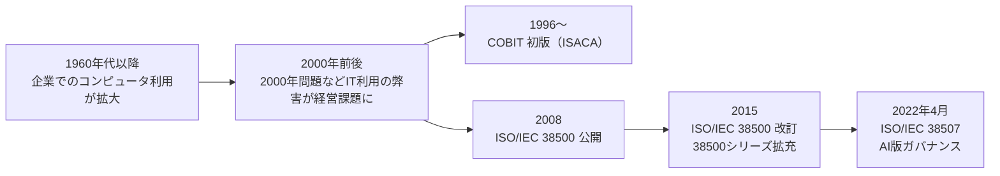

- ISO/IEC 38500:2015 は「**責任・戦略・取得・パフォーマンス・適合・人間行動**」の6原則を示すITガバナンス規格です（CMS法律事務所の解説）。
- ISO/IEC 38507 は、刊行時点（2022年4月）で **38500シリーズの最新メンバー**として位置付けられていました（現在の最新とは限りません）。

### Step 2：なぜ「AI専用」が必要だったのか

AIはITの上に成り立つため、「ITガバナンスの拡張」として設計されました。ただし従来のITガバナンスでは扱いにくい問題が出てきたためです。

| 従来のITガバナンス | AIガバナンスで必要になったこと |
|---|---|
| 経営の自己規律に基づく説明責任・透明性の枠組み | **信頼（トラスト）をどう築くか**。倫理の解釈は国・文化で異なる |
| 人間が手順を決めたシステム | **データ駆動**で振る舞いが決まり、人間が全ステップを追えない |
| 仕様が固定されたソフトウェア | 学習により **振る舞いが変わりうる** |

---

## 3. 最重要の概念：「統治機関」と「経営管理」の違い

初学者が最も混乱しやすいポイントです。

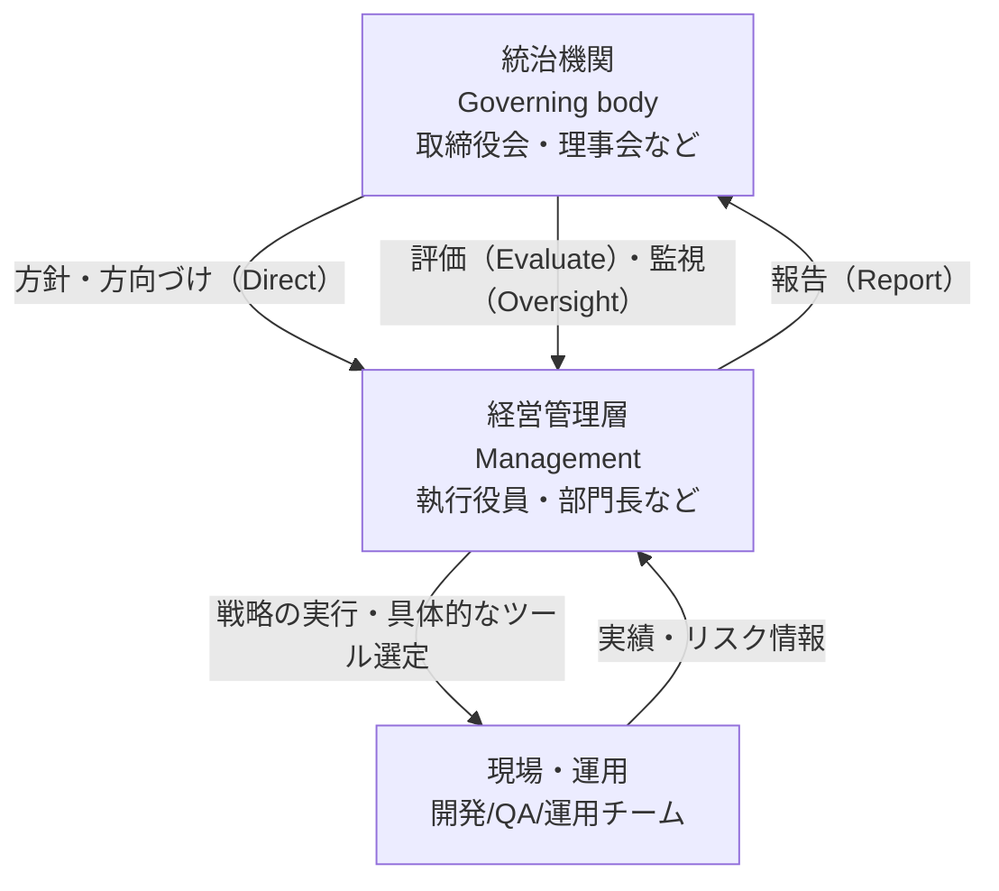

| 役割 | 担当すること | AIの文脈での例 |
|---|---|---|
| **統治機関** | 組織の目的を定め、戦略を承認し、リスク選好（どこまでリスクを取るか）を決める。**最終責任を負う** | 「顧客に影響する自動意思決定AIは、人間の承認なしに本番稼働させない」という方針を承認する |
| **経営管理層** | 方針を戦略・施策に落とし込む。**AIツールの具体的な選定は管理側の判断** | どのAIベンダー/モデルを使うか決める |
| **現場** | 実装・テスト・運用 | モデル評価、品質保証、監視 |

> 規格は、**特定のAIシステムの選択は管理（マネジメント）の判断**であり、統治機関はそのための指針を与える立場だと整理しています。

---

## 4. 規格の全体構成（目次マップ）

### 4.1 章立て

| 章 | タイトル（日本語訳） | ひとことで言うと |
|---|---|---|
| Foreword / Introduction | まえがき／序文 | 目的、AIの定義、「AI利用」の範囲 |
| 1 | 適用範囲 | 誰に向けたガイダンスか |
| 2 | 引用規格 | ISO/IEC 22989、ISO/IEC 38500:2015 |
| 3 | 用語と定義 | 「AI利用」「オーバーサイト」「リスク」「リスク選好」「コンプライアンス義務」など |
| **4** | **組織のAI利用がもたらすガバナンス上の含意** | 規格の核心。ガバナンスと説明責任の維持 |
| **5** | **AIとAIシステムの概要** | AIが他のITとどう違うか、AIエコシステム、便益、制約 |
| **6** | **AI利用に対処する方針（ポリシー）** | 監督、意思決定、データ、文化・価値観、コンプライアンス、リスク |
| Annex A（規定） | ガバナンスと組織の意思決定 | 関連規格の整理 |
| Bibliography | 参考文献 | |

### 4.2 第6章の内訳

| 節 | テーマ |
|---|---|
| 6.2 | ガバナンスによるAIの監督（Oversight） |
| 6.3 | 意思決定のガバナンス |
| 6.4 | データ利用のガバナンス |
| 6.5 | 文化と価値観 |
| 6.6 | コンプライアンス（6.6.1 義務／6.6.2 管理） |
| 6.7 | リスク（選好・マネジメント・目的・リスク源・コントロール） |

### 4.3 学習の進め方

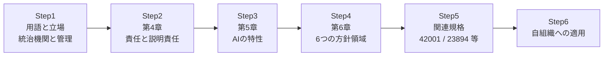

---

## 5. 第4章の詳解：AI導入時にガバナンスと説明責任をどう保つか

### 5.1 「AI利用」の定義（序文・3章）

- 規格では **「AI利用」を非常に広く**定義しています：**AIシステムのライフサイクルのどの段階であれ、開発したり適用したりして、組織の目的を達成し価値を生むこと**。
- 提供者・利用者など、AIシステムに関わる **あらゆる相手方との関係**も含みます。
- 「AI」は特定の技術ではなく、**計算能力・スケーラビリティ・ネットワーク・接続機器・大量データを組み合わせた技術ファミリー全体**を指します。
- 規格は「AIそのものが善でも悪でも、公平でも偏見的でもない。**使い方によってそう見える／そうなる**」という立場を取っています。

### 5.2 4.1 General：責任は「新しい」わけではない

| ポイント | 内容 |
|---|---|
| 統治機関の説明責任 | 組織の**すべての活動**に対して負う。**委譲できない** |
| 新技術への継続的責任 | 新しい道具・技術を導入するたび、その**組織への影響を検討する責任**がある |
| 立証責任 | 方針と実施が十分であることを、**自ら確信し、ステークホルダーに示せる**状態にする |
| 目標の範囲 | 財務目標だけでなく、**文化・価値観・倫理的成果などの非財務の成果**にも責任を持つ |

> 💡 つまり「AIだから責任が変わる」のではなく、「AIが新しい目的や機会・リスクを生むので、**既存の責任をAI向けに見直す**」という発想です。

### 5.3 4.2 AI導入時にガバナンスを維持する

統治機関は、AIの一般的な理解を持つ必要があります。AIは次の3つをもたらしうるからです。

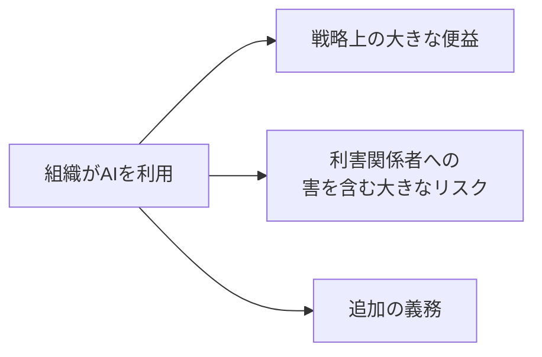

**AIがもたらす新しい含意（規格が挙げるもの）**

| # | 含意 | 初学者向けの言い換え |
|---|---|---|
| 1 | データ取得とその品質保証への依存の増大 | データが悪ければAIも悪い。データ管理が経営課題になる |
| 2 | 透明性と説明可能性 | 以前は人間がしていた判断（例：与信審査）をAIが行うとき、**目的・前提・ルールを説明できるか**、それを**修正・更新する仕組み**があるか |
| 3 | 既存の指示やコントロールが通用しない可能性 | 人間に委任する時の前提とAIに任せる時の前提は違う |
| 4 | 競争圧力 | AIを使わない側が不利になるリスクもある |
| 5 | バイアス・誤り・害への無自覚な受容 | 複雑なシステムにAIを埋め込む影響を考えずに使う |
| 6 | 変化速度のギャップ | 学習型システムの変化速度 vs. 人間によるコンプライアンス統制の速度 |
| 7 | 従業員への影響 | 差別、基本的権利への害、自動化による雇用への影響、再教育、組織知の喪失。一方で創造性向上、反復・危険作業の代替による品質向上も |
| 8 | 事業運営とブランド評判への影響 | |

**具体例（規格の例を言い換え）**

- 人間のオペレーターに「休暇明けまで支払い処理を延ばして」と言えば文脈から正しく理解してもらえるが、**AIシステムにとっては曖昧すぎて、正しく実行できない**。→ 人間への指示とAIへの指示は同じではない。

**ポジティブな側面も見る**

- AIは既存リスクを **減らす** 場合もある（例：反復作業の人間の見落とし、稀な異常を常時監視する作業）。
- よって統治機関は、**リスク評価をAI導入後に見直し調整**する。
- リスクは急速に変わるため、**必要ならプロジェクトを修正・中止する意思**を示すことも求められる（関連：ISO/IEC 38506）。

### 5.4 4.3 AI導入時に説明責任を維持する

**重要な3つのメッセージ**

1. 統治機関は、AI利用の結果について**自ら責任を取る**。**AIシステム自身に責任を押し付けてはならない**。
2. AIの可能性とリスクについて、**自ら学ぶ責任**がある。
3. **AIの擬人化**（AIが人間のように考え・感じ・判断・道徳判断すると過度に見なす）に注意する。

**統治機関の責任追及**

- 注意義務・指導・訓練・監督・執行が不十分で問題が起きた場合、メンバーは**責任を問われうる**（罰則、解任、法的救済など）。

**見直し・強化すべき4つの機能**

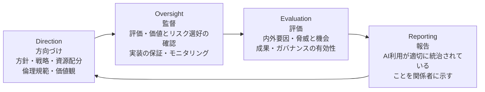

> ISO/IEC 38500:2015 の「評価（Evaluate）・指示（Direct）・モニタ（Monitor）」と対比して理解するとよい、と規格は述べています。

**統治機関自身の能力強化（アクション例）**

| アクション | 目的 |
|---|---|
| 構成員のAIスキル向上 | 判断の質を上げる |
| ITとAI利用のレビュー頻度を上げる | 変化に追従する |
| 内外環境の監視基準を見直す | 古い基準での見逃しを防ぐ |
| 従業員の利益・懸念（安全、訓練、仕事の質）を代表させる | 現場の声を拾う |
| 戦略・リスク・評価/監査・倫理の小委員会を設置/強化 | 専門的な監督体制を作る |

**説明責任の範囲：ライフサイクル全体**

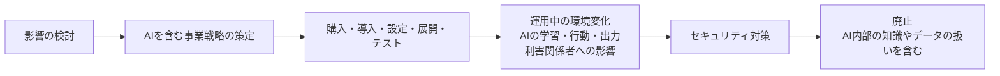

**新技術導入に伴うよくある失敗（規格が列挙）**

| 失敗パターン | 解説 |
|---|---|
| 技術の性質の誤解 | |
| 不適切なガバナンス判断 | |
| AIへのガバナンス監督の欠落 | |
| 既存ガバナンスの範囲にAIを含め忘れる | |
| 文脈への配慮・計画・方針・訓練のないまま無差別に適用 | |
| AIを使った自動化攻撃（脆弱性発見）への備え不足 | |
| 人間とAIの新しい関係性の影響への対処不足 | |

---

## 6. 第5章の解説：AIは他のITと何が違うのか

> ⚠️ **範囲に関する注記**：第5章・第6章は規格本文が有償のため、本ガイドでは **公開されている目次・序文・サンプル抜粋・専門家による解説**を根拠に整理しています。条文レベルの正確な確認は、必ずISO規格書の原文で行ってください。

### 6.1 AIの3つの特徴（5.2の見出しより）

| 特徴 | 意味 | ガバナンス上の論点 |
|---|---|---|
| **意思決定の自動化**（Decision automation） | 人間が行っていた判断をAIが行う | 誰が責任を持つか／人間の関与はどこまで |
| **データ駆動の問題解決**（Data-driven problem-solving） | 人間が一歩ずつ論理を組み立てるのではなく、データからパターンを学ぶ | データの品質・量・適合性・バイアス |
| **適応するシステム**（Adaptive systems） | 学習により振る舞いが変わる | 継続的な監視・再評価 |

### 6.2 機械学習（ML）の基本（第5.1節の趣旨）

- 近年のAIの進歩の多くは **機械学習**の領域。
- 機械学習は、明示的にプログラムしなくても「学習」する技術。
- 既存のデータセットのモデルを作り、**新しいデータに適用**して、課題解決・結果予測・分類を行う。
- AIは既存のIT基盤（ネットワーク、IoT、ビッグデータ、クラウド）の上に成り立つ。

### 6.3 監督の深さは何で決まるか

統治機関が求めるべき監督の深さは、次の要素で変わります（CMS解説）。

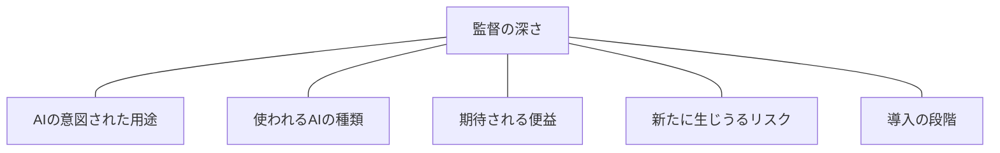

### 6.4 5.3〜5.5（見出しレベル）

| 節 | 内容（見出し） |
|---|---|
| 5.3 AIエコシステム | AIを取り巻くデータ、提供者、利用者、基盤などの関係者・要素 |
| 5.4 AI利用の便益 | AIが組織にもたらす利点 |
| 5.5 AI利用の制約 | AIの利用に課されるべき制約 |

---

## 7. 第6章の解説：AI利用に対する6つの方針領域

統治機関は、AIの利用に対して **組織の方針（ポリシー）** を整備・適応させます。規格は、方針の運用面は「経営管理」が実装すると位置付けています。

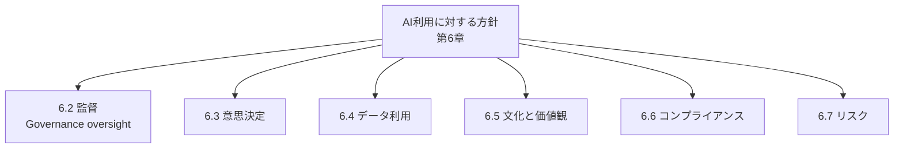

### 7.1 各領域の考え方（CMS解説に基づく整理）

| 領域 | 統治機関が意識すること |
|---|---|
| **6.2 監督** | 組織の方針に基づき、**個人と集団の説明責任**を、AI利用の文脈に合わせた**責任の連鎖**として明確にする。適切な利用方針、**十分な人間の監督**、利用者の訓練、**懸念を挙げる方法**の整備 |
| **6.3 意思決定** | AIが関与する意思決定をどう統治するか（人間とAIの役割分担を含む） |
| **6.4 データ利用** | データが**正しい目的**で使われているか、**機微データが保護**されているか。データの前提の整理、可用性・品質・量・適合性の事前評価、**バイアス**の検討。アルゴリズム・データ・モデルを記述し、**意図した用途で使われていることを透明に**する |
| **6.5 文化と価値観** | 統治機関が組織文化を形作る。AIの運用に**人間の関与**を確保し、**監視・是正**できるようにする。AIが人間の判断のバイアスや差別を発見する側面もある。**倫理審査委員会**や**文化・価値観委員会**の設置が一案 |
| **6.6 コンプライアンス** | 法的要求（義務）と、組織が自発的に守ると決めたものの両方を把握し管理する |
| **6.7 リスク** | **リスク選好**の決定、リスクマネジメント、目的の設定、**新たなリスク源**（望ましくないバイアス、サイバー脅威、AI専門知識の不足など）の認識、コントロール |

### 7.2 用語ミニ辞典（第3章）

| 用語 | 意味（要約） |
|---|---|
| **AI利用（use of AI）** | AIシステムのライフサイクルのどの部分でも、開発・適用して組織の目的を達成すること |
| **オーバーサイト（oversight）** | 組織やガバナンスの方針の実施状況と関連業務を**監視**し、内外の変化に**適応**させること |
| **リスク（risk）** | 不確かさが目的に与える影響（ISO 31000）。プラスにもマイナスにもなる |
| **リスク選好（risk appetite）** | 組織が追求または許容してもよいと考えるリスクの量と種類 |
| **コンプライアンス義務** | 強制的に守る要求事項＋組織が自発的に守ると選んだ要求事項（ISO 37301） |
| **コンプライアンス** | すべてのコンプライアンス義務を満たすこと |

---

## 8. Annex A（規定）：ガバナンスと組織の意思決定

- 唯一の「規定（normative）」附属書です。
- 本文で述べられているように、**ガバナンスと組織の意思決定の概念、特に既存規格への参照**を整理する位置づけです。
- 本文では「Annex A の概観に**従うこと（shall）**」とされています。

> 参考：用語欄では ISO 37000:2021（組織ガバナンス）、ISO 31000:2018（リスク）、ISO 37301:2021（コンプライアンスマネジメント）が参照されています。

---

## 9. 関連規格との関係マップ

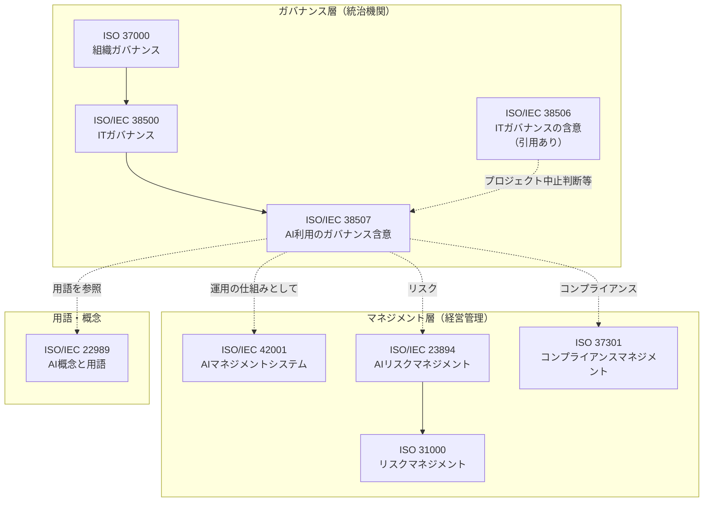

| 規格 | 役割 | 38507との関係 |
|---|---|---|
| ISO/IEC 38500:2015 | ITガバナンス（原則、評価・指示・モニタ） | **引用規格**。38507はその系列 |
| ISO/IEC 22989 | AIの概念と用語 | **引用規格**（用語はここに従う） |
| ISO/IEC 38506 | ITガバナンスに関する含意（導入判断・中止など） | 本文で参照 |
| ISO 37000:2021 | 組織ガバナンス（オーバーサイトは原則の一つ） | 用語で参照 |
| ISO 31000:2018 | リスクマネジメント | 用語（リスク）で参照 |
| ISO 37301:2021 | コンプライアンスマネジメント | 用語（コンプライアンス義務）で参照 |
| ISO/IEC 23894:2023 | AIリスクマネジメント | リスク管理を深める際に有用（CMS解説でも言及） |
| ISO/IEC 42001:2023 | AIマネジメントシステム（認証可能） | **統治機関が「AIMSが有効に機能している」ことを確認する**関係（実務解説での整理） |

### 9.1 38507 と 42001 の違い

| 比較 | ISO/IEC 38507 | ISO/IEC 42001 |
|---|---|---|
| 対象者 | **統治機関**（取締役会など） | 組織のマネジメント／AIMS運用者 |
| 性格 | ガイダンス（`should`） | **要求事項**を持つマネジメントシステム規格 |
| 認証 | 認証の対象ではない | **第三者認証が可能** |
| 問い | 「**誰が何を決め、責任を持つか**」 | 「**どのような仕組みで継続的に運用するか**」 |
| 例え | 憲法・経営の指針 | 運用マニュアル・業務プロセス |

---

## 10. 実務で使う：統治機関向け「AIガバナンス確認チェックリスト」

> ⚠️ このチェックリストは、規格の内容をもとに**本ガイドの作成者が整理した実務ツール**であり、規格が定める公式のチェックリストではありません。

### 10.1 ステップ別の進め方

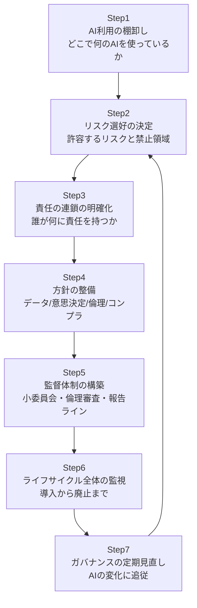

### 10.2 チェックリスト

| 区分 | 確認項目 | 対応する規格の趣旨 |
|---|---|---|
| 責任 | 統治機関がAI利用の最終責任を負うと明確にしているか。責任をAIやベンダーに転嫁していないか | 4.3 |
| 理解 | 統治機関メンバーはAIの機会・リスクを学び、スキル向上の機会があるか | 4.3 |
| 擬人化 | 「AIが判断した」という表現で責任があいまいになっていないか | 4.3 |
| 範囲 | 既存のガバナンスの範囲にAIが含まれているか | 4.3 |
| リスク選好 | AI利用に関するリスク選好が決まっており、見直しの頻度が決まっているか | 4.2 / 6.7 |
| 中止判断 | リスクが変化したとき、プロジェクトを修正・中止する基準と権限があるか | 4.2 |
| データ | データの目的・品質・偏り・機微情報の保護を確認する方針があるか | 6.4 |
| 透明性 | AIの目的・前提・ルールを説明できるか。修正・更新の仕組みがあるか | 4.2 / 6.4 |
| 人間の関与 | AIの出力を監視し、是正できる人間の関与があるか | 6.2 / 6.5 |
| 文化・倫理 | 倫理審査や価値観に関する委員会などの機能があるか | 6.5 |
| 従業員 | 従業員への影響（雇用、再教育、安全）が考慮されているか | 4.2 |
| コンプラ | 法的義務と自主ルールを両方把握し、管理しているか | 6.6 |
| セキュリティ | AIを悪用した攻撃を含め、セキュリティ対策が講じられているか | 4.3 |
| ライフサイクル | 導入前から廃止まで責任範囲が定義されているか（廃止時のデータ・知識の扱いを含む） | 4.3 |

---

## 11. QA / ソフトウェアエンジニアの視点で読む

> ⚠️ この章は、規格の趣旨を**エンジニアリング実務へ読み替えた解釈**です。規格本文が要求する内容ではありません。

統治機関は「自らが十分に確信し、ステークホルダーに示せる」状態を求められます。その**根拠（エビデンス）を作る側**が現場のエンジニアです。

| 統治機関が必要とするもの | 現場が提供できるエビデンスの例 |
|---|---|
| AIが意図した用途で使われている確信 | 要求仕様と、用途・適用範囲（ODD等）の明文化 |
| データ品質・バイアスの把握 | データ品質チェック結果、バイアス評価レポート |
| 透明性・説明可能性 | モデルカード、データシート、設計判断記録 |
| 継続的な監視 | 本番監視のメトリクス、ドリフト検知、インシデント記録 |
| 人間による是正 | エスカレーション手順、ヒューマン・イン・ザ・ループの運用ログ |
| ライフサイクル全体の統制 | リリース判定記録、変更履歴、廃止手順 |
| 報告 | 経営向けダッシュボード（リスク・テスト結果のサマリ） |

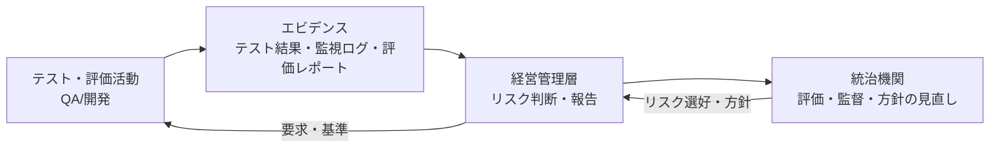

---

## 12. よくある誤解（FAQ）

| 質問 | 回答 |
|---|---|
| Q1. 38507に準拠すれば「認証」が取れる？ | 38507は**ガイダンス**で、認証の仕組みを前提にした規格ではありません。認証が可能なAI関連規格は ISO/IEC 42001 です。（実務解説でも「認証の仕組みはまだ発展途上」と整理されています） |
| Q2. 技術者向けの規格？ | **違います**。技術の実装ではなく、**人間によるガバナンス**に焦点があります。ただし、そのガバナンスにはAI技術の影響を理解することが必要とされています。 |
| Q3. 大企業だけ？ | **いいえ**。民間・公的・非営利、**規模を問わず**、またデータやITへの依存度にも関係なく適用可能です。 |
| Q4. AIを導入していない組織は無関係？ | 「**現在および将来**のAI利用」が対象です。導入を検討している段階から関係します。 |
| Q5. 責任をベンダーに委譲できる？ | 統治機関の説明責任は**委譲できません**。実装を外部に任せても、組織としての責任は残ります。 |
| Q6. 生成AI専用？ | いいえ。規格発行は2022年4月で、**AIの技術ファミリー全体**を対象にしています。生成AIにも適用できる考え方ですが、生成AI固有の記述は規格にありません。 |

---

## 13. 理解度チェック

1. 統治機関の説明責任は、AIを使う場合に「委譲」できますか？ → **できない**（4.1）
2. 「AIの擬人化」が問題になるのはなぜ？ → **責任の所在があいまいになり、能力を過大評価するため**（4.3）
3. 統治機関が見直す4つの機能は？ → **Direction / Oversight / Evaluation / Reporting**
4. AIの導入でリスクが「増える」だけでしょうか？ → **減るリスクもある**ため、評価の見直しが必要（4.2）
5. 38507 と 42001 の違いは？ → **統治機関向けのガイダンス** と **運用のマネジメントシステム規格（認証可能）**
6. AIのライフサイクルのうち、統治機関の説明責任が及ぶ範囲は？ → **検討・戦略策定から廃止まで全体**

---

## 14. 本ガイドの情報源と限界

### 14.1 調査についての注記

- ISO/IEC 38507 は**ガバナンス**の規格であるため、開発者コミュニティの技術ブログよりも、**規格団体・法律事務所・規格販売元の公開情報**が主な情報源となりました。今回の調査では、著名な国際的開発者個人の投稿で信頼に足る解説は見つかっていません。
- 規格本文は有償・著作権保護されており、第5章後半以降・第6章・Annex Aの**条文の詳細は確認できていません**（目次、序文、サンプル、解説記事ベース）。正式な運用・監査・契約での参照には**原文の購入・確認**が必要です。
- 2025年11月更新とされる実務解説サイトには、規格本文の記述としては確認できない整理（例：「AIポートフォリオ登録簿」の推奨など）も含まれます。本ガイドでは、**原文または主要な出典で裏付けられた内容を中心**に記載しています。

### 14.2 ソース一覧（URL）

| # | 種別 | 内容 | URL |
|---|---|---|---|
| 1 | 一次情報（ISO公式） | ISO/IEC 38507:2022 規格ページ（概要、ステージ、発行日、ページ数、委員会） | https://www.iso.org/standard/56641.html |
| 2 | 一次情報（規格サンプル） | 目次、序文、第1〜4章冒頭、第5.1節のサンプル抜粋（iTeh） | https://iteh.es/catalog/standards/iso/b1593920-9ba2-48b8-9556-bf6bf265249b/iso-iec-38507-2022 |
| 3 | 法律事務所の解説 | CMS（Dr Sam De Silva 他）「Governance of AI by organisations: Do's and Don'ts explained in new ISO Standard」2022年7月28日 | https://cms.law/en/gbr/legal-updates/governance-of-ai-by-organisations-do-s-and-don-ts-explained-in-new-iso-standard |
| 4 | 規格販売元（IEC） | IEC Webstore の概要 | https://webstore.iec.ch/publication/75336 |
| 5 | 規格販売元（AFNOR） | AFNOR の規格情報 | https://www.boutique.afnor.org/en-gb/standard/iso-iec-385072022/information-technology-governance-of-it-governance-implications-of-the-use-/xs139152/322799 |
| 6 | 規格データベース（カナダ） | SCC Standards Database | https://scc-ccn.ca/standardsdb/standards/8178560 |
| 7 | 欧州規格リポジトリ | StandICT.eu | https://standict.eu/standards-repository/information-technology-governance-it-governance-implications-use-artificial |
| 8 | 実務解説（関連規格との関係） | Compliance Council Australia「ISO 42001 Artificial Intelligence (AI) Management Systems」（2026年2月13日） | https://www.compliancecouncil.com.au/insights/iso-42001-artificial-intelligence-ai-management-systems |
| 9 | 実務解説（日本語版あり） | SG Systems Global「ISO/IEC 38507 — AIのガバナンス」（2025年11月更新） | https://sgsystemsglobal.com/ja/?p=21998 |
| 10 | 実務解説 | VerifyWise「ISO/IEC 38507: AI Governance Framework for Organizations」 | https://verifywise.ai/ai-governance-library/standards-and-certifications/iso-iec-38507-ai-governance-framework-for-organizations |
| 11 | 実務解説（取締役会向け） | Gend「AI Governance for Boards: Strategy, Risk & Compliance」 | https://gend.co/blog/ai-governance-evolving-board-strategies |

### 14.3 出典と本ガイド内容の対応

| 本ガイドの章 | 主な根拠 |
|---|---|
| 1 基本情報 | #1（ISO公式）、#2（前文） |
| 2 背景 | #3（CMS） |
| 3〜5 統治機関／第4章 | #2（規格サンプル）、#3 |
| 6 第5章 | #2（目次・5.1）、#3 |
| 7 第6章 | #2（目次）、#3（CMS解説） |
| 9 関連規格 | #2（引用規格・用語）、#8、#9 |
| 10〜11 実務・QA視点 | 本ガイド作成者による整理（規格の趣旨からの読み替え） |

---

## 15. まとめ

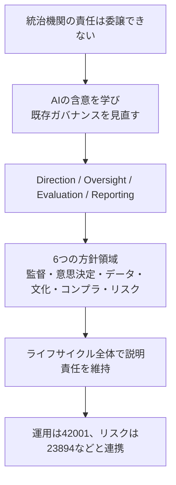

- ISO/IEC 38507 は、**AIの技術規格ではなく、経営トップのための責任の指針**です。
- 「AIが決めたから」は通用しない。**人間（統治機関）が責任を持つ**。
- 現場のテスト・監視・評価の**エビデンス**が、統治機関の説明責任を支える。

> 📌 ご自身の組織に適用する際は、**規格原文の確認**と、**法務・リスク・コンプライアンス部門**との連携をおすすめします。
