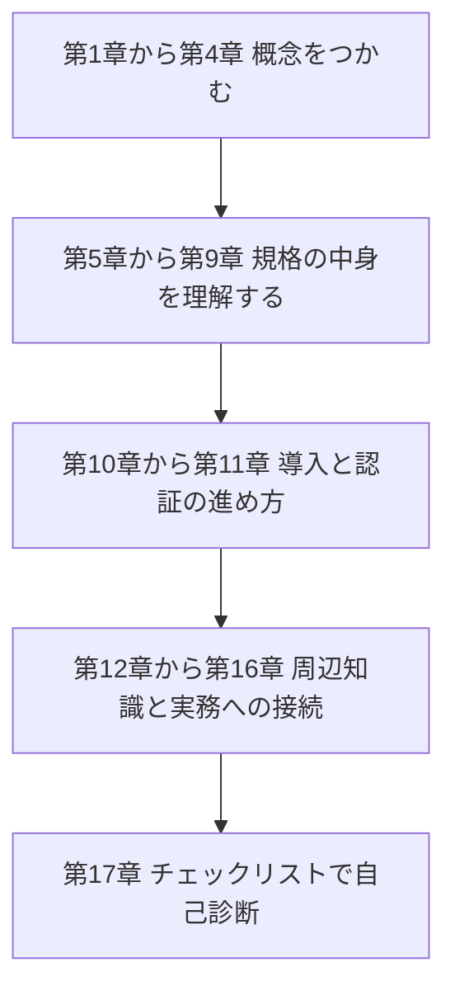
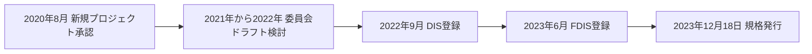
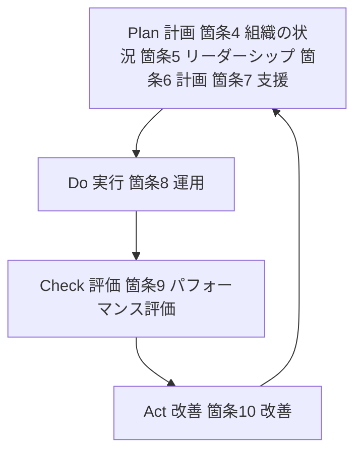
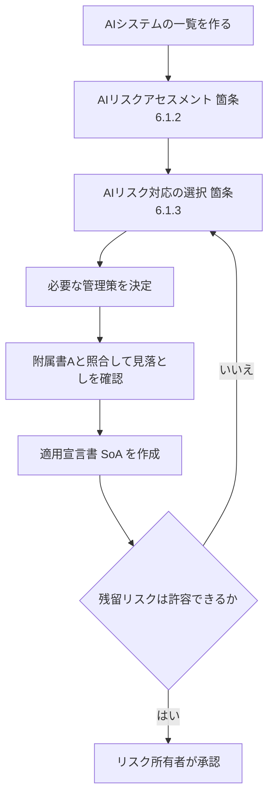
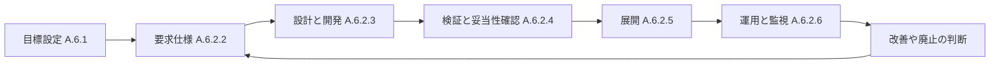
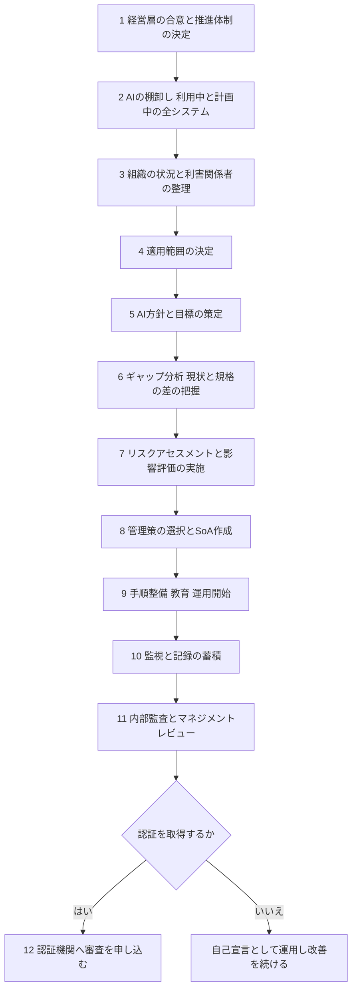
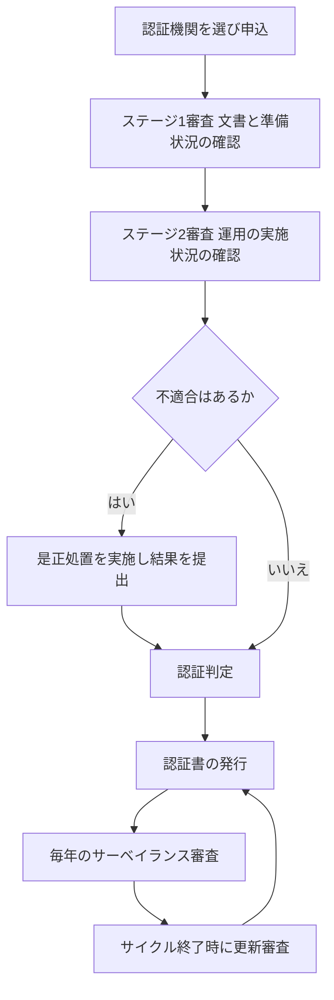
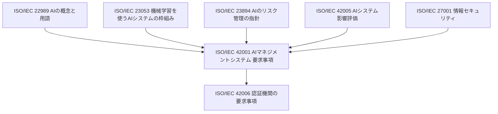
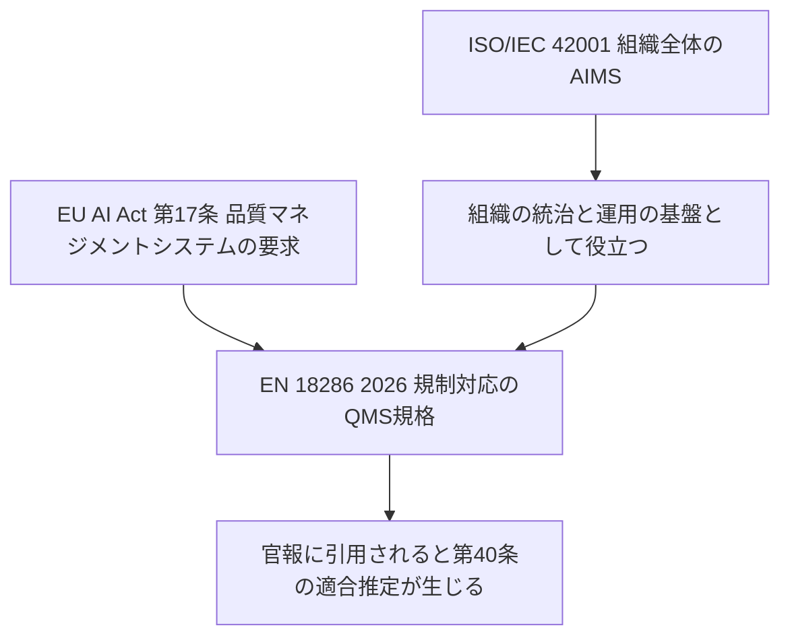

# ISO/IEC 42001:2023 初学者向けステップバイステップ解説ガイド

> **AIマネジメントシステム（AIMS）規格を、ゼロから実務まで理解する**
>
> | 項目 | 内容 |
> |------|------|
> | 情報の基準日 | 2026年10月8日 |
> | 対象読者 | ソフトウェアエンジニア、QAエンジニア、AI開発者、品質・コンプライアンス担当、初めてISOマネジメントシステムに触れる人 |
> | 前提知識 | 不要（用語は初出時にカッコで補足します） |
> | 図の方針 | フローチャートは Mermaid、表は Markdown。ASCIIアートは使いません |
> | 一次情報 | ISO公式ページ <https://www.iso.org/standard/42001> |

---

## 目次

0. [このガイドの読み方と情報源の方針](#0-このガイドの読み方と情報源の方針)
1. [一言でいうと何の規格か](#1-一言でいうと何の規格か)
2. [なぜ今この規格が必要なのか](#2-なぜ今この規格が必要なのか)
3. [規格の基本情報](#3-規格の基本情報)
4. [AIマネジメントシステム（AIMS）とは何か](#4-aimsとは何か)
5. [規格の全体構造とPDCAサイクル](#5-規格の全体構造とpdcaサイクル)
6. [本文（箇条4〜10）をステップバイステップで読む](#6-本文箇条410をステップバイステップで読む)
7. [附属書A〜Dの役割](#7-附属書ad-の役割)
8. [附属書A：38個の管理策を一覧で理解する](#8-附属書a38個の管理策を一覧で理解する)
9. [リスクアセスメントとAIシステム影響評価の違い](#9-リスクアセスメントとaiシステム影響評価の違い)
10. [導入ロードマップ（12ステップ）とケーススタディ](#10-導入ロードマップ12ステップとケーススタディ)
11. [認証（第三者審査）の仕組み](#11-認証第三者審査の仕組み)
12. [関連規格との関係](#12-関連規格との関係)
13. [EU AI Act との関係（誤解しやすいポイント）](#13-eu-ai-act-との関係誤解しやすいポイント)
14. [国際的な企業の取得事例](#14-国際的な企業の取得事例)
15. [エンジニア・QAの視点での活用ポイント](#15-エンジニアqaの視点での活用ポイント)
16. [よくある誤解 FAQ](#16-よくある誤解-faq)
17. [実務チェックリスト](#17-実務チェックリスト)
18. [出典URL一覧](#18-出典url一覧)
19. [本ガイドの限界と情報の確認方法](#19-本ガイドの限界と情報の確認方法)

---

## 0. このガイドの読み方と情報源の方針

💡 この章では、このガイドがどの情報に基づいているか、どう読み進めると理解しやすいかを説明します。情報源の性質を先に知っておくと、後の章の記述を適切な強さで受け止められます。

### 0.1 なぜ情報源の説明が必要なのか

ISO規格の本文は有料で、ISO自身が「規格の内容をAIの学習やAIへの入力に使うこと」を著作権上制限しています。そのため、このガイドは規格本文の転載をせず、次の3種類の公開情報から再構成しています。

| 区分 | 例 | 信頼度の目安 |
|------|-----|-------------|
| 一次情報 | ISO公式ページ、ISO/IEC 42006の公式ページ | 最も高い |
| 事業者の公式発表 | AWSのブログ、Anthropicの公式発表 | 事実関係（誰が・いつ・何を取得）は高い |
| 業界団体・独立した解説 | Cloud Security Alliance（CSA）の文書、AI規格の動向を追う独立の専門家の投稿 | 解釈を含むため、複数を突き合わせる |

### 0.2 読み進め方

この図は、このガイドの推奨する読み順を表しています。上から下へ読み進めてください。

各ノードの意味：
- 「第1章から第4章」：用語と全体像を押さえる段階です。ここだけでも会議で話を合わせられます。
- 「第5章から第9章」：規格の骨格（箇条4〜10と附属書）を理解する段階です。
- 「第10章から第11章」：実際に導入し、認証を取る手順の段階です。
- 「第12章から第16章」：関連規格や法規制、よくある誤解を整理する段階です。
- 「第17章」：理解度と準備状況の確認に使います。

📖 この章で登場した用語
- ISO（国際標準化機構）：国際的な標準規格を作る非営利の組織
- IEC（国際電気標準会議）：電気・電子分野の国際規格を作る組織。42001はISOとIECの共同規格
- 一次情報：その規格を発行した組織自身が出している情報

---

## 1. 一言でいうと何の規格か

💡 この章では、ISO/IEC 42001を一言で説明できるようになることを目指します。

### 1.1 なぜ「一言で」から始めるのか

規格は文書量が多く、最初に全体像がないと細部が頭に入らないためです。

### 1.2 一言まとめ

> **ISO/IEC 42001 は、組織がAIを責任をもって開発・提供・利用するための「管理の仕組み」を作り、運用し、改善し続けるための国際規格です。**

ISOの公式ページは、AIMS（AIマネジメントシステム）を作る・実施する・維持する・継続的に改善するための要求事項を定めた国際規格であり、AIを使った製品やサービスを提供または利用する組織向けだと説明しています。また、世界初のAIマネジメントシステム規格と位置づけられています。

### 1.3 たとえ話：レストランの衛生管理

- 個々の料理（＝AIモデルやAIシステム）がおいしいかどうかを判定する規格ではありません。
- 「厨房全体の衛生管理の仕組み（担当者、手順、点検、記録、改善）があるか」を問う規格です。
- 料理人が替わっても、食材が変わっても、仕組みがあれば一定の品質を保ちやすくなります。

### 1.4 この規格が「やらないこと」

| やらないこと | 補足 |
|------------|------|
| 個々のAIモデルの性能を保証する | 認証の対象はマネジメントシステムで、個別のAI製品ではありません |
| 法律の代わりになる | ISOは、規格は法令を置き換えるものではなく、法令対応を助ける枠組みだと説明しています |
| 特定の技術（LLM、画像認識など）を指定する | 技術に依存しない作りです |

📖 この章で登場した用語
- AIMS（AI Management System）：AIの扱い方に関する方針・手順・役割・点検をまとめた、組織の管理の仕組み
- マネジメントシステム規格（MSS）：製品の仕様ではなく、組織の管理の仕方を定める規格の種類。ISO 9001（品質）やISO/IEC 27001（情報セキュリティ）が代表例
- 認証：独立した第三者が、規格の要求事項を満たしていることを確認して証明すること

---

## 2. なぜ今この規格が必要なのか

💡 この章では、AI特有の課題と、規格が生まれた背景を説明します。

### 2.1 なぜ従来の管理だけでは足りないのか

AIには、従来のソフトウェアとは性質の違う課題があります。ISOの公式ページも、倫理面の配慮、透明性、継続的な学習といった独自の課題に触れています。

| AI特有の課題 | 具体例 | 従来のソフトウェア管理との違い |
|-------------|--------|------------------------------|
| データ依存 | 学習データの偏りがそのまま判断の偏りになる | コードだけでなくデータの品質管理が必要 |
| 説明の難しさ | なぜその出力になったか説明しにくい | 仕様書と実装の対応では説明が足りない |
| 変化し続ける | 再学習や環境変化で挙動が変わる | リリース後も監視が必要 |
| 社会への影響 | 採用・融資・医療などで人の人生に影響する | 利用者以外の第三者への影響評価が必要 |
| 責任の分散 | モデル提供者、利用企業、データ提供者で責任が分かれる | 供給者管理の考え方を拡張する必要がある |

### 2.2 たとえ話：自動車の運転と運行管理

運転がうまい人がいても、会社に運行管理（点呼、点検、事故報告、教育）がなければ事故は減りません。AIも「モデルの腕前」だけでなく「運行管理の仕組み」が必要で、その運行管理に相当するのがAIMSです。

### 2.3 ISOが挙げる主なメリット

ISOの公式ページは、次のような利点を挙げています。

- リスクと機会を管理する枠組みになる
- 責任あるAI利用を示せる
- 追跡可能性・透明性・信頼性が高まる
- コスト削減と効率向上につながる

### 2.4 規格が生まれた経緯

ISO公式のライフサイクル情報によると、新規プロジェクトの承認は2020年8月、委員会ドラフトの検討は2021年から2022年、DIS（国際規格案）の投票は2022年から2023年、最終投票を経て2023年12月18日に発行されました。

この図は、規格が発行されるまでの時間の流れを表しています。左から右へ読み進めてください。

各ノードの意味：
- 「新規プロジェクト承認」：作業の開始が正式に決まった時点です。
- 「委員会ドラフト検討」：専門家が案を作り、コメントを集めて修正した期間です。
- 「DIS登録」：国際規格案として各国に投票を求める段階です。
- 「FDIS登録」：最終国際規格案として最終承認に進む段階です。
- 「規格発行」：ISO/IEC 42001:2023が公開された時点です。

📖 この章で登場した用語
- DIS（Draft International Standard）：国際規格案。各国が投票する段階の案
- FDIS（Final Draft International Standard）：最終国際規格案。最終投票の対象
- ライフサイクル（規格の）：提案から発行、見直しまでの規格の一生
- 供給者管理：外部から調達する製品・サービス・データを、リスクを考えて管理すること

---

## 3. 規格の基本情報

💡 この章では、規格を入手・引用するときに必要な基本情報を表にまとめます。

### 3.1 なぜ基本情報を最初に確認するのか

規格には版（エディション）や改訂状況があり、古い情報で実務をすると認証審査でずれが生じるためです。

### 3.2 基本情報の表（ISO公式ページに基づく）

| 項目 | 内容 |
|------|------|
| 規格番号 | ISO/IEC 42001:2023 |
| 題名 | Information technology — Artificial intelligence — Management system |
| 版 | Edition 1（第1版） |
| 発行 | 2023年12月（発行日 2023-12-18） |
| ページ数 | 51ページ |
| 担当委員会 | ISO/IEC JTC 1/SC 42（人工知能） |
| ISO公式ページ上の状態 | Published（ステージ 60.60：国際規格発行済み） |
| 提供言語 | 英語、フランス語 |
| 価格 | CHF 225（ISOストアの表示。変動する可能性があります） |
| ICS（分類番号） | 35.020、03.100.70 |

### 3.3 次の改訂はあるのか

ISOのライフサイクルには、発行後の「定期見直し（90番台のステージ）」が用意されています。2026年10月8日時点のISO公式ページでは、第1版が発行済み（60.60）のまま表示されています。改訂や確認の状況は、必ず公式ページで最新を確認してください。

### 3.4 国内規格について

日本語訳や国内規格の有無・版は、各国の標準化機関のページで確認してください。このガイドでは調べていません（第19章参照）。

📖 この章で登場した用語
- エディション（版）：同じ規格番号の中で改訂ごとに付く版数
- JTC 1/SC 42：ISOとIECの合同技術委員会（JTC 1）の中の、AI担当の分科委員会
- ステージコード：規格の作成段階を示す番号。60.60は「発行済み」

---

## 4. AIMSとは何か

💡 この章では、規格の中心概念である「AIマネジメントシステム（AIMS）」を、構成要素に分けて理解します。

### 4.1 なぜ「システム」と呼ぶのか

ここでの「システム」は、ITシステムではなく「仕組み」を指します。ISOは、AIMSを「AIの責任ある開発・提供・利用に関する方針と目標、そしてそれを達成する手順を確立するための、相互に関連する要素の集まり」と説明しています。

### 4.2 AIMSが組織で担う6つの役割

ISOの解説ページに基づくと、AIMSは次のことを助けます。

| 役割 | 現場での具体例 |
|------|--------------|
| 責任の定義 | AIの承認者、運用責任者、問い合わせ窓口を決める |
| リスクの特定と評価 | 偏り、安全性、セキュリティ、悪用の観点で洗い出す |
| 透明性と説明責任の確保 | 利用者に「AIを使っている」ことと限界を伝える |
| データ品質と性能の管理 | 学習データの出所、品質基準、性能指標を管理する |
| 倫理・法務・社会面への対応 | 影響を受ける人々を検討する |
| ライフサイクル全体の監視 | 開発から廃止まで、運用中も継続的に見る |

### 4.3 誰が対象か

ISOは、AIシステムを開発する組織、AIを製品やサービスに組み込む組織、判断や自動化にAIを使う組織、第三者提供のAIシステムを管理する組織が対象になると説明しています。企業規模や業種は問いません。

| 組織の立場の例 | 該当するか |
|----------------|-----------|
| 生成AIを使った自社サービスを開発する企業 | 該当（開発・提供） |
| 外部のAI APIを業務に使う企業 | 該当（利用） |
| 社内でAIチャットを業務に導入した企業 | 該当（利用） |
| 病院や自治体 | 該当（業種を問わない） |

### 4.4 たとえ話：学校の安全管理

学校は、校則（方針）、担任・安全担当（役割）、避難訓練（運用）、ヒヤリハット報告（監視）、毎年の見直し（改善）を持っています。AIMSはこれのAI版で、AIの使い方に関するルールと担当と点検の一式です。

### 4.5 PDCAサイクルという基本の考え方

ISOの解説は、この規格がPlan-Do-Check-Act（計画・実行・評価・改善）の方法論を使うと説明しています。

📖 この章で登場した用語
- ステークホルダー（利害関係者）：AIの影響を受ける、またはAIに関心を持つ人や組織（顧客、従業員、規制当局など）
- PDCA：計画（Plan）、実行（Do）、評価（Check）、改善（Act）を回し続ける管理手法
- バイアス：データや設計の偏りが原因で、特定の人や集団に不利な結果が出ること
- 透明性：AIがどう作られ、どう使われているかを、関係者が把握できること

---

## 5. 規格の全体構造とPDCAサイクル

💡 この章では、規格の本文と附属書がどう組み立てられているかを、一枚の地図として理解します。

### 5.1 なぜ構造を先に知るのか

ISOのマネジメントシステム規格は共通の章立て（箇条4〜10）を持ちます。ISO 9001やISO/IEC 27001を知っている人は、42001の構造を早く掴めます。また、同じ構造のため、複数の規格を統合して運用しやすくなります。

### 5.2 PDCAと箇条の対応

次の図は、本文の箇条4〜10がPDCAのどこに当たるかを表しています。上から下へ読み、最後は先頭に戻る循環として捉えてください。

各ノードの意味：
- 「Plan 計画」：自社の状況を理解し、経営層が方針を定め、リスクと目標を計画し、必要な資源を用意する段階です。
- 「Do 実行」：計画したことを実際の業務で動かす段階です。AIのリスク評価や影響評価の実施もここに含まれます。
- 「Check 評価」：監視・測定、内部監査、マネジメントレビューで状態を確認する段階です。
- 「Act 改善」：不適合を直し、仕組みを良くする段階です。そこから再び計画に戻ります。

### 5.3 規格全体の構成表

| 部分 | 内容 | 性格 |
|------|------|------|
| 箇条1〜3 | 適用範囲、引用規格、用語 | 前提 |
| 箇条4〜10 | AIMSの要求事項（本文） | 認証審査の中心 |
| 附属書A | 参照用の管理目的と管理策 | 規定（normative） |
| 附属書B | AI管理策（附属書A）の実施の手引き（実装ガイダンス） | 規定附属書（normative） |
| 附属書C | AI関連の組織目標とリスク源の例 | 参考（informative） |
| 附属書D | 分野・業種をまたいだAIMSの使い方 | 参考（informative） |

### 5.4 本文の箇条と主な内容（早見表）

| 箇条 | 題名（要旨） | 一言で言うと |
|------|--------------|-------------|
| 4 | 組織の状況 | 自社とAIの関わり、関係者の期待、適用範囲を決める |
| 5 | リーダーシップ | 経営層が方針を定め、役割を割り当てる |
| 6 | 計画 | リスク、影響、目標、変更を計画する |
| 7 | 支援 | 人・力量・認識・情報共有・文書を整える |
| 8 | 運用 | 計画したことを実施し、リスクと影響を評価する |
| 9 | パフォーマンス評価 | 監視、内部監査、マネジメントレビュー |
| 10 | 改善 | 継続的改善と是正処置 |

📖 この章で登場した用語
- 箇条（Clause）：規格本文の章番号の単位。「箇条6.1.2」のように表す
- 規定附属書（normative annex）：規格の一部として従うべき扱いの附属書
- 参考附属書（informative annex）：理解を助ける情報で、要求ではない附属書
- 統合マネジメントシステム：複数の規格（品質、情報セキュリティ、AIなど）を一つの仕組みでまとめて運用すること

---

## 6. 本文（箇条4〜10）をステップバイステップで読む

💡 この章では、箇条4から10までを順番に、「何を求めているか」「現場では何を作るか」の2面から読みます。

### 6.1 なぜ箇条ごとに分けて読むのか

認証審査では、箇条ごとに「やっていること」と「その証拠（記録）」を確認されます。箇条ごとに「成果物」を意識して読むと、準備の抜け漏れを減らせます。

> 注意：以下の小箇条の題名と要旨は、ISOのマネジメントシステム規格の共通構造と、公開されている解説に基づいてまとめています。要求事項の正確な文言は、必ず規格本文で確認してください。

### 6.2 ステップ1：箇条4 組織の状況

**なぜ最初にやるのか**：何を管理するかが決まらないと、後の計画が作れないためです。

| 小箇条 | 求めていること | 現場で作る成果物の例 |
|--------|--------------|--------------------|
| 4.1 組織とその状況の理解 | 自社に関わる内外の課題を把握する。AIに関する自社の立場（開発者、提供者、利用者など）も整理する | 状況分析メモ、AIの立場の整理表 |
| 4.2 利害関係者のニーズと期待 | 顧客、規制当局、従業員などの要求を把握する | 利害関係者一覧表 |
| 4.3 AIMSの適用範囲 | どの部署・AIシステム・拠点を対象にするかを決める | 適用範囲の文書 |
| 4.4 AIMS | 必要なプロセスを確立し、維持し、改善する | AIMS全体図 |

### 6.3 ステップ2：箇条5 リーダーシップ

**なぜ経営層が出てくるのか**：AIの扱いは事業判断やリソース配分に関わり、現場だけでは決められないためです。

| 小箇条 | 求めていること | 成果物の例 |
|--------|--------------|-----------|
| 5.1 リーダーシップ及びコミットメント | 経営層がAIMSに責任を持ち、資源を確保する | 経営層の関与記録 |
| 5.2 AI方針 | 組織のAIに関する方針を定め、周知する | AI方針書 |
| 5.3 役割、責任及び権限 | 誰が何に責任を持つかを割り当てる | 役割責任表（RACIなど） |

### 6.4 ステップ3：箇条6 計画

**なぜここが重要か**：この規格の核心は、AI特有のリスクと影響を、組織として体系的に洗い出して扱うことにあるためです。

| 小箇条 | 求めていること | 成果物の例 |
|--------|--------------|-----------|
| 6.1.1 一般 | リスクと機会に取り組む計画を立てる | 計画書 |
| 6.1.2 AIリスクアセスメント | AIに関するリスクを特定・分析・評価する基準と手順を定める | リスク評価基準、リスク登録簿 |
| 6.1.3 AIリスク対応 | 評価したリスクへの対応策を選び、管理策を決める。附属書Aと照合し、**適用宣言書（SoA）** を作る | リスク対応計画、SoA |
| 6.1.4 AIシステム影響評価 | AIシステムが個人・集団・社会に与える影響を評価する | 影響評価の手順と記録 |
| 6.2 AI目的及びその達成計画 | AIに関する目標を設定する | 目標一覧と達成計画 |
| 6.3 変更の計画 | AIMSを変更するときは計画的に行う | 変更管理手順 |

#### リスク対応からSoA作成までの流れ

次の図は、リスクを評価してから、管理策を選び、適用宣言書（SoA）を作るまでの流れを表しています。上から下へ読み進めてください。

各ノードの意味：
- 「AIシステムの一覧を作る」：何がリスク評価の対象かを明確にする出発点です。
- 「AIリスクアセスメント」：リスクを特定し、影響の大きさと起こりやすさで評価します。
- 「AIリスク対応の選択」：リスクを減らす、受け入れる、回避する、移転するなどの方針を決めます。
- 「附属書Aと照合」：自分で選んだ管理策に抜けがないかを、附属書Aの一覧で確認します。
- 「適用宣言書 SoA」：附属書Aの各管理策について、採用するかどうかと理由を記した文書です。
- 「残留リスクは許容できるか」（ひし形）：対応後も残るリスクを判断します。許容できない場合は対応策の選択に戻ります。

### 6.5 ステップ4：箇条7 支援

**なぜ必要か**：方針や手順があっても、人と情報が整っていないと動かないためです。

| 小箇条 | 求めていること | 成果物の例 |
|--------|--------------|-----------|
| 7.1 資源 | 必要な人・予算・ツールなどを用意する | 資源計画 |
| 7.2 力量 | AI関連業務の担当者に必要な力量を確保する | スキルマップ、教育記録 |
| 7.3 認識 | 全員がAI方針と自分の役割を理解する | 周知記録 |
| 7.4 コミュニケーション | 社内外へ何を、いつ、誰に伝えるかを決める | コミュニケーション計画 |
| 7.5 文書化した情報 | 必要な文書と記録を作成・管理する | 文書管理規程 |

### 6.6 ステップ5：箇条8 運用

**なぜ別の箇条なのか**：計画しただけでは意味がなく、実際の運用でリスクと影響の評価を繰り返す必要があるためです。

| 小箇条 | 求めていること | 成果物の例 |
|--------|--------------|-----------|
| 8.1 運用の計画及び管理 | 運用プロセスを計画・実施・管理する | 運用手順書 |
| 8.2 AIリスクアセスメント | 計画した間隔、または重要な変更があるときに実施する | 評価結果の記録 |
| 8.3 AIリスク対応 | リスク対応計画を実施し、結果を記録する | 対応結果の記録 |
| 8.4 AIシステム影響評価 | 影響評価を実施し、結果を保持する | 影響評価報告書 |

### 6.7 ステップ6：箇条9 パフォーマンス評価

**なぜ必要か**：運用が計画どおり機能しているかを、数字や監査で確かめるためです。

| 小箇条 | 求めていること | 成果物の例 |
|--------|--------------|-----------|
| 9.1 監視、測定、分析及び評価 | 何を、どの方法で、いつ測るかを決めて実施する | 監視指標一覧、レポート |
| 9.2 内部監査 | 計画した間隔で内部監査を行う | 監査計画、監査報告 |
| 9.3 マネジメントレビュー | 経営層が定期的にAIMSの状態をレビューする | レビュー議事録 |

### 6.8 ステップ7：箇条10 改善

**なぜ最後に置かれるのか**：評価で見つかった問題を直し、仕組みを良くする循環を完成させるためです。

| 小箇条 | 求めていること | 成果物の例 |
|--------|--------------|-----------|
| 10.1 継続的改善 | AIMSの適切性・妥当性・有効性を継続的に高める | 改善活動の記録 |
| 10.2 不適合及び是正処置 | 問題が起きたら原因を調べて再発を防ぐ | 是正処置報告書 |

📖 この章で登場した用語
- 適用宣言書（SoA：Statement of Applicability）：附属書Aの各管理策について「採用するか」「その理由」を書いた文書
- 残留リスク：対応策を実施した後に残るリスク
- リスク所有者：特定のリスクに責任を持ち、対応の承認を行う人
- 内部監査：組織が自分たちで行う点検。外部の認証審査とは別
- マネジメントレビュー：経営層が仕組みの状態を点検し、方向を決める会議
- 是正処置：問題の原因を取り除いて再発を防ぐ対応

---

## 7. 附属書A〜Dの役割

💡 この章では、本文を補う4つの附属書が、それぞれ何のためにあるかを整理します。

### 7.1 なぜ附属書を理解する必要があるのか

本文が「何を管理するか」を決めるのに対し、附属書は「AIならではの具体的な管理策」を示します。認証審査でも、附属書Aに対する選択と実施状況が見られます。

### 7.2 4つの附属書の比較

| 附属書 | 題名（要旨） | 役割 | 実務での使い方 |
|--------|-------------|------|--------------|
| A | 参照用の管理目的と管理策 | AI向けの管理策のカタログ（9領域・38個） | SoA作成時に、採用の要否を一つずつ判断する |
| B | 管理策の実施の手引き | 各管理策をどう実施するかの説明 | 実装の具体策や、審査での「十分さ」の目安に使う |
| C | AI関連の組織目標とリスク源の例 | 目標とリスクを考えるヒント | 6.1.2のリスク特定時に参照する |
| D | 分野をまたいだAIMSの使い方 | 他のマネジメントシステムとの統合、業種ごとの適用の考え方 | ISO/IEC 27001などと一体運用するときに参照する |

### 7.3 附属書Cの例：AI関連の目標とリスク源

附属書Cは、組織が掲げうる目標の観点として、説明責任、公平性、プライバシー、頑健性、安全性、セキュリティ、透明性と説明可能性などを挙げています。また、リスク源として、データの利用可能性と品質、自動化の度合い、技術の成熟度、システムの複雑さなどを例示しています（この一覧は一般に知られた内容に基づく要旨です。正確な項目は本文で確認してください）。

### 7.4 たとえ話：料理本の巻末資料

本文は「厨房を運営する原則」、附属書Aは「使える調理法の一覧表」、附属書Bは「各調理法のレシピ」、附属書CとDは「食材選びのヒントと業態別の注意点」にあたります。

📖 この章で登場した用語
- 管理目的（control objective）：管理策が達成しようとする狙い
- 管理策（control）：リスクを減らすための具体的な仕組み・手順・対策
- リスク源：リスクの発生元になりうる要因（データ品質の低さ、技術の未成熟さなど）
- 頑健性（robustness）：入力のずれや攻撃があっても、性能が大きく崩れない性質

---

## 8. 附属書A：38個の管理策を一覧で理解する

💡 この章では、附属書Aの9つの領域（A.2〜A.10）と38個の管理策を表にして、全体像を掴みます。

### 8.1 なぜ「38個」を覚える必要があるのか

審査では、SoAに書いた管理策ごとに「実施している証拠」を示す必要があります。何があるかを知っておくと、必要な記録を前もって準備できます。

### 8.2 数に関する注意

複数の解説が、附属書Aは9領域・38管理策（A.2からA.10まで。A.1は存在しない）と記しています。一方、39個と書いている解説も見つかりました。これは数え方や誤記による違いと考えられますが、正確な数と項目名は、規格本文で確認してください。このガイドでは38個を採用します。

### 8.3 9領域の全体像

| 領域 | 題名（要旨） | 管理策の数 | 一言で言うと |
|------|-------------|-----------|-------------|
| A.2 | AIに関する方針 | 3 | AI方針を決め、他の方針と整合させ、見直す |
| A.3 | 内部組織 | 2 | 役割・責任を決め、懸念を報告できるようにする |
| A.4 | AIシステムのための資源 | 5 | データ、ツール、計算資源、人材の資源を把握する |
| A.5 | AIシステムの影響の評価 | 4 | 個人・集団・社会への影響を評価し記録する |
| A.6 | AIシステムのライフサイクル | 9 | 設計から運用までの各段階を管理する |
| A.7 | AIシステムのためのデータ | 5 | データの取得、品質、出所、準備を管理する |
| A.8 | 利害関係者への情報 | 4 | 利用者や外部へ必要な情報を提供・報告する |
| A.9 | AIシステムの利用 | 3 | 責任ある使い方と意図した用途を守る |
| A.10 | 第三者及び顧客との関係 | 3 | 供給者・顧客との責任分担を明確にする |

合計：3 + 2 + 5 + 4 + 9 + 5 + 4 + 3 + 3 = **38**

### 8.4 各管理策の項目一覧

> 以下の項目名は、公開されている解説と規格の構成に基づいて日本語で要約したものです。正式な英語の題名と要求の詳細は、規格本文を確認してください。

#### A.2 AIに関する方針（3）

| 番号 | 要旨 |
|------|------|
| A.2.2 | AI方針 |
| A.2.3 | 他の組織方針との整合 |
| A.2.4 | AI方針のレビュー |

#### A.3 内部組織（2）

| 番号 | 要旨 |
|------|------|
| A.3.2 | AIの役割と責任 |
| A.3.3 | 懸念の報告 |

#### A.4 AIシステムのための資源（5）

| 番号 | 要旨 |
|------|------|
| A.4.2 | 資源の文書化 |
| A.4.3 | データ資源 |
| A.4.4 | ツール資源 |
| A.4.5 | システム及び計算資源 |
| A.4.6 | 人的資源 |

#### A.5 AIシステムの影響の評価（4）

| 番号 | 要旨 |
|------|------|
| A.5.2 | 影響評価のプロセス |
| A.5.3 | 影響評価の文書化 |
| A.5.4 | 個人・集団への影響の評価 |
| A.5.5 | 社会への影響の評価 |

#### A.6 AIシステムのライフサイクル（9）

| 番号 | 要旨 |
|------|------|
| A.6.1.2 | 責任あるAI開発の目標 |
| A.6.1.3 | 責任ある設計・開発のプロセス |
| A.6.2.2 | AIシステムの要求仕様 |
| A.6.2.3 | 設計・開発の文書化 |
| A.6.2.4 | 検証と妥当性確認 |
| A.6.2.5 | 展開（デプロイ） |
| A.6.2.6 | 運用と監視 |
| A.6.2.7 | 技術文書 |
| A.6.2.8 | イベントログの記録 |

#### A.7 AIシステムのためのデータ（5）

| 番号 | 要旨 |
|------|------|
| A.7.2 | 開発・改善用のデータ |
| A.7.3 | データの取得 |
| A.7.4 | データの品質 |
| A.7.5 | データの出所（プロビナンス） |
| A.7.6 | データの準備 |

#### A.8 利害関係者への情報（4）

| 番号 | 要旨 |
|------|------|
| A.8.2 | システム文書と利用者向け情報 |
| A.8.3 | 外部への報告 |
| A.8.4 | インシデントの伝達 |
| A.8.5 | 利害関係者への情報提供 |

#### A.9 AIシステムの利用（3）

| 番号 | 要旨 |
|------|------|
| A.9.2 | 責任ある利用のプロセス |
| A.9.3 | 責任ある利用の目標 |
| A.9.4 | 意図した用途での利用 |

#### A.10 第三者及び顧客との関係（3）

| 番号 | 要旨 |
|------|------|
| A.10.2 | 責任の割り当て |
| A.10.3 | 供給者 |
| A.10.4 | 顧客 |

### 8.5 ライフサイクルの流れ（A.6の理解を助ける図）

次の図は、A.6が扱うAIシステムの一生を表しています。左から右へ読み、運用中に見つかった課題が次の改善に戻る流れを確認してください。

各ノードの意味：
- 「目標設定」：責任あるAI開発の目標を決める段階です。
- 「要求仕様」：システムに何を求めるかを文書にする段階です。
- 「設計と開発」：設計の判断と実装を記録する段階です。
- 「検証と妥当性確認」：作り方が正しいか（検証）、目的に合っているか（妥当性確認）を確かめる段階です。
- 「展開」：本番環境へ出す段階です。
- 「運用と監視」：性能・挙動・ログを見続ける段階です。
- 「改善や廃止の判断」：結果を踏まえ、改修するか、止めるかを決める段階です。

### 8.6 SoAの書き方のイメージ

SoAは、全38個を実施する宣言ではありません。各管理策に対して「採用する、しない」と「理由」を書きます。除外する場合は、その正当な理由が必要です。

| 管理策 | 採用 | 理由 | 実施内容・証拠の例 |
|--------|------|------|-------------------|
| A.7.4 データの品質 | 採用 | 自社で学習データを用意し、品質が出力に直結する | データ品質基準書、検査記録 |
| A.10.4 顧客 | 採用 | 顧客にAI機能を提供している | 利用条件、制約事項の説明資料 |
| （仮に）自社で学習をしない場合の一部管理策 | 一部不採用の可能性 | 学習データを自社で扱わないため | 除外理由の文書（ただし利用者としてのデータ管理は別に必要） |

📖 この章で登場した用語
- 検証（verification）：作ったものが、仕様どおりにできているかを確認すること
- 妥当性確認（validation）：作ったものが、本来の目的や利用者のニーズに合っているかを確認すること
- プロビナンス（provenance）：データの出所と来歴。どこから来て、どう加工されたか
- インシデント：問題や事故。AIが誤った出力をして被害が出た場合などを含む
- デプロイ（展開）：開発したシステムを、実際に使う環境へ出すこと

---

## 9. リスクアセスメントとAIシステム影響評価の違い

💡 この章では、混同しやすい「AIリスクアセスメント」と「AIシステム影響評価」を区別して理解します。

### 9.1 なぜ区別が重要か

規格は、この2つを別々の活動として扱っています（箇条6.1.2と6.1.4、箇条8.2と8.4）。影響評価を飛ばすと、SoAに実質的な穴が残ると指摘する実務解説もあります。

### 9.2 比較表

| 観点 | AIリスクアセスメント | AIシステム影響評価 |
|------|---------------------|-------------------|
| 主に見るもの | 主に組織にとってのリスク（事業、法務、セキュリティ、評判など）。影響評価で特定した人や社会への影響も考慮に入れる | AIシステムが人や社会に与える影響。結果は6.1.2のリスクアセスメントに反映する |
| 視点 | 主に組織の内側から（影響を受ける側の視点も取り込む） | 主に影響を受ける個人・集団・社会の側から |
| 例 | モデルの誤作動による損失、データ漏えい | 特定の属性の人が不利益な判定を受ける、公平性が損なわれる |
| 対応する箇条 | 6.1.2、6.1.3、8.2、8.3 | 6.1.4、8.4 |
| 関連する附属書A | A.6、A.7 など広く | A.5 |

### 9.3 具体例：採用面接のAI支援ツール

- リスクアセスメントの観点：誤判定による採用ミスが事業損失になるか、個人情報が漏れるか。
- 影響評価の観点：特定の性別や年齢の応募者が、体系的に不利になっていないか。落とされた応募者に説明できるか。

### 9.4 関連規格：ISO/IEC 42005

AIシステム影響評価の進め方を詳しく扱う規格として、ISO/IEC 42005:2025があります。ISOストアでは、42001と42005を組み合わせた「責任あるAIガバナンスと影響規格パッケージ」が販売されています。

📖 この章で登場した用語
- 公平性（fairness）：特定の人や集団が不当に不利にならないこと
- 影響を受ける人々：AIの出力や判断によって、結果が左右される個人や集団。利用者本人以外も含む
- 説明可能性：AIの判断の根拠を、人が理解できる形で説明できること

---

## 10. 導入ロードマップ（12ステップ）とケーススタディ

💡 この章では、AIMSを実際に作るための手順を12のステップに分け、架空の企業の例で動かして確認します。

### 10.1 なぜ12ステップに分けるのか

規格は「何を満たすか」を示しますが、「どの順で作るか」は示しません。順序の目安があると、作業の手戻りを減らせます。

### 10.2 ISOが示す最初の一歩

ISOの解説ページは、全面導入の前でも始められることとして、次を挙げています。

- AIがどこで使われているかを把握する
- AI監督の役割と責任を定義する
- AIシステムのリスクを評価する
- AI利用とデータ管理の方針を文書化する
- AIの性能と影響を監視する
- 是正処置と改善を計画する

### 10.3 ロードマップの全体図

次の図は、導入の流れを表しています。上から下へ読み進めてください。ひし形は判断の分岐です。

各ノードの意味：
- 「1 経営層の合意と推進体制」：箇条5に対応。担当者と予算を決める出発点です。
- 「2 AIの棚卸し」：後のすべての評価の入力になる一覧を作ります。見えないAI（部門が勝手に使う外部サービスなど）の洗い出しも含みます。
- 「3 組織の状況と利害関係者」：箇条4.1、4.2に対応します。
- 「4 適用範囲の決定」：箇条4.3に対応します。範囲が広いほど作業量が増えます。
- 「5 AI方針と目標」：箇条5.2、6.2に対応します。
- 「6 ギャップ分析」：既存のISO 27001や品質管理の仕組みで再利用できるものを見つけます。
- 「7 リスクアセスメントと影響評価」：箇条6.1.2、6.1.4に対応します。
- 「8 管理策の選択とSoA」：箇条6.1.3に対応します。
- 「9 手順整備、教育、運用開始」：箇条7、8に対応します。
- 「10 監視と記録」：箇条9.1に対応します。記録がないと審査で実施を証明できません。
- 「11 内部監査とマネジメントレビュー」：箇条9.2、9.3に対応します。認証審査の前に必ず実施します。
- 「認証を取得するか」（ひし形）：認証は任意です。取得しない選択もあります。

### 10.4 ステップごとの成果物

| ステップ | 主な成果物 | 対応する箇条 |
|---------|-----------|-------------|
| 1 | 推進体制図、予算承認 | 5 |
| 2 | AIシステム台帳（用途、データ、提供元、責任者） | 4、8 |
| 3 | 状況分析、利害関係者一覧 | 4.1、4.2 |
| 4 | 適用範囲文書 | 4.3 |
| 5 | AI方針書、AI目標 | 5.2、6.2 |
| 6 | ギャップ分析レポート | 全体 |
| 7 | リスク登録簿、影響評価報告書 | 6.1.2、6.1.4、8.2、8.4 |
| 8 | リスク対応計画、SoA | 6.1.3 |
| 9 | 手順書、教育記録、コミュニケーション計画 | 7、8 |
| 10 | 監視レポート、イベントログ、インシデント記録 | 9.1、A.6.2.8 |
| 11 | 内部監査報告、レビュー議事録 | 9.2、9.3 |
| 12 | 審査申込書（認証を取得する場合） | なし（認証プロセスの手続き） |
| ロードマップ外（不適合が見つかった場合） | 是正処置記録 | 10.2 |

### 10.5 ケーススタディ：架空のSaaS企業「ミライ社」

**設定**：ミライ社は、生成AIを組み込んだ問い合わせ自動応答サービスを提供する中堅企業です。外部のLLM APIを利用し、顧客の問い合わせ履歴で応答を調整しています。

**なぜケーススタディを入れるのか**：抽象的な箇条を、実際の業務に置き換えて読むためです。

| ステップ | ミライ社での具体例 |
|---------|-----------------|
| 2 AIの棚卸し | 自社サービスのチャット機能、社内のコード補助AI、営業の文章作成AIの3つを発見 |
| 3 状況と利害関係者 | 顧客企業は「回答の誤りと情報漏えい」を気にし、規制当局は個人情報の扱いを気にする |
| 4 適用範囲 | まず自社サービスのチャット機能の開発・提供部門に絞る |
| 7 リスクと影響 | リスク：誤回答による顧客の損害、プロンプト経由の情報漏えい。影響：不適切な回答で特定の利用者が不快や不利益を受ける可能性 |
| 8 管理策とSoA | A.6.2.4（検証と妥当性確認）、A.7.4（データ品質）、A.10.3（供給者管理：外部LLM提供元の確認）、A.8.4（インシデントの伝達）を採用 |
| 10 監視 | 誤回答の報告率、有害応答の検出件数、応答のログを毎月レビュー |
| 11 内部監査 | 開発部門以外のメンバーが監査し、ログ保管期間の不備を発見して是正 |

### 10.6 つまずきやすい点

| つまずき | 対策 |
|---------|------|
| 範囲を広げすぎて終わらない | 最初は重要なAIシステムや部門に絞り、後から拡張する |
| 文書が増えすぎて運用されない | 既存の品質・情報セキュリティの文書や会議体を再利用する |
| 外部AIサービスの利用が把握できていない | 棚卸しの段階で調達部門や各部門にヒアリングする |
| 影響評価を後回しにする | リスク評価と同時に実施計画へ入れる |

📖 この章で登場した用語
- ギャップ分析：現状と規格の要求の差を洗い出す作業
- 棚卸し：保有・利用しているものを一覧にして把握すること
- AIシステム台帳：組織が使うAIシステムの用途、データ、責任者などを記録した一覧
- RACI：作業ごとに、実行者、説明責任者、相談先、報告先を整理する表の形式
- イベントログ：システムの動作や出来事を時系列に記録したもの
- 自己宣言：第三者の審査を受けず、組織自身が規格に沿っていると表明すること

---

## 11. 認証（第三者審査）の仕組み

💡 この章では、認証が何を証明するのか、誰が審査するのか、どう進むのかを説明します。

### 11.1 なぜ認証の仕組みを理解するのか

「ISO 42001認証済み」という表示を、正しく読み取る（自社が取る場合も、取引先の主張を評価する場合も）ために必要です。

### 11.2 ISO公式の整理

ISOは次の点を明記しています。

- 認証は任意（取らなくても規格を使える）
- ISO自身は組織を認証しない
- 認証は独立した認証機関が行い、認証機関は各国の認定機関から認定を受けていることがある

### 11.3 何を認証するのか

認証されるのは**マネジメントシステム（AIMS）** であり、個々のAI製品やモデルの安全性・性能そのものではありません。複数の解説が同様に説明しています。

### 11.4 ISO/IEC 42006：認証機関のための規格

2025年7月に、ISO/IEC 42006:2025が発行されました。ISOの説明によれば、AIMSを42001に基づいて審査・認証する機関のための追加要求事項で、ISO/IEC 17021-1を補う内容です。認証機関の力量と一貫性を高め、認定機関が認証機関を評価するときの基準にもなります。

### 11.5 認証機関の動き

CEPAの記事によれば、2026年1月に、英国認定機関（UKAS）が、英国規格協会（BSI）を、ISO/IEC 42001認証を発行できる最初の認証機関として認定しました。また、AWSとAnthropicの認証は、ANAB（ANSI National Accreditation Board）から認定を受けた認証機関Schellman Compliance, LLCが発行しました（第14章）。

### 11.6 審査の流れ

一般的なISOマネジメントシステム認証（ISO/IEC 17021-1に基づく）と同様の流れです。次の図は、その典型例です。上から下へ読み進めてください。

各ノードの意味：
- 「ステージ1審査」：文書や準備が整っているかを確認する審査です。
- 「ステージ2審査」：実際に運用され、記録が残っているかを確認する審査です。
- 「不適合はあるか」（ひし形）：要求を満たしていない点の有無を判断します。
- 「是正処置」：不適合の原因を直し、証拠を提出します。
- 「認証判定」：審査結果を踏まえ、認証機関が認証の可否を決めます。
- 「サーベイランス審査」：認証後に、毎年継続的に実施状況を確認する審査です。
- 「更新審査」：認証の有効期間の終わりに行う、全体の再確認です。

> 審査の段階名や期間、頻度は、認証機関と契約により異なります。Cloud Security Allianceの解説は、ISO/IEC 17021に基づく流れが、ISO 27001などと同様であることを述べています。具体的な計画は、選んだ認証機関に確認してください。

### 11.7 認証の実績の一例：AWSの継続審査

AWSは、2025年11月に、ISO 42001の最初のサーベイランス審査を指摘事項なしで完了したと公表しています。

### 11.8 認証を取得する前に確認したい5点

| 確認項目 | 理由 |
|---------|------|
| 認証機関が認定を受けているか | 認定された機関の認証は、取引先や規制当局からの信頼につながる |
| 認証の範囲（スコープ） | 「全社」なのか「特定サービスのみ」なのかで意味が変わる |
| 認証書の有効期限と更新状況 | 期限切れや範囲外の誤用を避ける |
| 審査員のAI関連の力量 | AI特有の論点を理解した審査かどうか |
| 他規格（ISO 27001など）との統合審査の可否 | 負担とコストを減らせる場合がある |

📖 この章で登場した用語
- 認定機関：認証機関の力量を評価して認定する機関（UKAS、ANABなど）
- 認証機関：組織の仕組みを審査して認証書を発行する機関
- サーベイランス審査：認証後、毎年行う維持確認のための審査
- 更新審査：認証の有効期間の終わりに行う再審査
- 不適合：規格や自社の決めた要求を満たしていない状態
- スコープ：認証の対象範囲

---

## 12. 関連規格との関係

💡 この章では、ISO/IEC 42001と一緒に語られる規格を整理し、役割分担を理解します。

### 12.1 なぜ関連規格を知る必要があるのか

42001は「管理の枠組み」で、個別のテーマ（用語、リスク、影響評価、セキュリティ）は別規格が補います。ISOも、42001は個別のAIアプリケーションの詳細ではなく、組織全体でリスクと機会を管理する実用的な方法を示すと説明しています。

### 12.2 関係図

次の図は、42001を中心に、周辺規格がどう関係するかを表しています。

各ノードの意味：
- 「ISO/IEC 22989」：AIの用語と概念を定める規格で、共通言語として使います（ISOの解説に記載）。
- 「ISO/IEC 23053」：機械学習を使うAIシステムを説明するための一般的な枠組みです（同上）。
- 「ISO/IEC 23894」：AI関連のリスク管理の指針です（同上）。
- 「ISO/IEC 42005」：AIシステム影響評価に関する規格です（2025年版）。
- 「ISO/IEC 27001」：情報セキュリティマネジメントの規格です。42001と同じ形式の附属書を持ち、統合運用がしやすいとされます。
- 「ISO/IEC 42006」：42001の審査・認証を行う機関向けの規格です。

### 12.3 比較表

| 規格 | 種類 | 42001との関係 |
|------|------|--------------|
| ISO/IEC 22989 | 用語・概念 | 用語の共通基盤 |
| ISO/IEC 23053 | 枠組み | ML系システムの構成の説明 |
| ISO/IEC 23894 | 指針 | 6.1.2のリスク評価に使える |
| ISO/IEC 42005 | 指針 | 6.1.4の影響評価に使える |
| ISO/IEC 27001 | 要求事項 | 統合運用の相手。ただし42001の取得に27001の取得は必須ではない（CSAの解説） |
| ISO/IEC 27090 | 指針（2026年10月時点で発行準備中。ステージ60.00、未発行） | AI特有のセキュリティ脅威への対応（ISOの解説ページに記載） |
| ISO/IEC 42006 | 要求事項 | 認証機関向け |
| ISO 38507 | 指針 | 組織の統治層向けにAI利用のガバナンス上の意味を示す（解説サイトに記載） |

### 12.4 NIST AI RMFとの違い

米国のNIST AIリスクマネジメントフレームワークは、自主的な枠組みで、ISO 42001のような公式の認証制度はありません（CEPAの記事による）。

| 観点 | ISO/IEC 42001 | NIST AI RMF |
|------|--------------|-------------|
| 性格 | マネジメントシステム規格 | リスク管理の枠組み |
| 認証 | 第三者認証が可能 | 公式の認証制度なし |
| 使い方 | 要求事項に沿った仕組みを作る | 自由度の高い手引きとして使う |

📖 この章で登場した用語
- NIST：米国国立標準技術研究所。AIリスクマネジメントフレームワークを公表している
- ガバナンス：組織が適切に意思決定し、統制する仕組み
- 統合運用：複数の規格を、一つの管理の仕組みでまとめて回すこと

---

## 13. EU AI Act との関係（誤解しやすいポイント）

💡 この章では、「42001を取れば欧州のAI規制に対応できる」という誤解を整理します。

### 13.1 なぜ誤解が起きやすいのか

どちらも「AIを責任をもって管理する」話題で、品質マネジメントの要求（EU AI Actの第17条）と、42001の考え方が似ているためです。

### 13.2 事実関係の整理（2026年10月時点で確認できた範囲）

| 項目 | 内容 | 出典の種類 |
|------|------|-----------|
| 42001とEU規制の位置づけ | 42001は、EUの調和規格の枠組みの一部ではない。欧州のAI事務局が2024年5月に、AI法の最終条文と完全には整合していないと示したとの解説がある | 独立専門家の解説 |
| 官報での引用 | 42001は、EU官報に引用されておらず、それ自体では法的な適合推定を与えない | CSAの調査ノート（2026年9月8日付） |
| 専用の規格 | EN 18286:2026（AI法の品質マネジメントシステム規格）。2026年6月にCENとCENELECが承認し、2026年7月31日付の公式記事で発行が告知された。官報への引用は未了で、現時点で適合推定は生じない | CEN-CENELECの公式発表（承認・発行）、規格動向を整理した解説（Modulos、官報引用の状況） |
| 組織と製品 | 42001は組織全体の管理、EN 18286は高リスクAIシステムの提供者の法的義務に対応 | CSAの文書 |
| 重なりの目安 | CSAの白書は、42001が高リスク義務に必要な組織基盤の約70〜80%を提供すると推計 | 推計値であり、参考程度に扱う |

### 13.3 関係図

次の図は、AI法の品質管理要求に対し、2つの規格がどのように位置づくかを表しています。

各ノードの意味：
- 「EU AI Act 第17条」：高リスクAIの提供者に、品質マネジメントシステムの確立を求める条文です。
- 「EN 18286」：第17条への対応を目的に作られた欧州の規格です。
- 「官報に引用されると適合推定」：引用された調和規格に従った場合、その範囲の要求を満たすと推定される仕組み（第40条）です。現時点では、引用が完了していません。
- 「ISO/IEC 42001」：国際規格として組織の仕組みを作る土台になります。
- 「組織の統治と運用の基盤」：42001の仕組みを活かして、EN 18286への対応を進められると解説されています。

### 13.4 実務での結論

- 42001認証は、AI法への「適合を保証する証明」ではありません。
- 一方、AIMSの仕組み（リスク管理、文書化、監視、改善）は、規制対応の基盤として役に立つと広く解説されています。
- 規制の適用時期、対象、例外は変動します。法務部門や弁護士に確認してください。このガイドは法的助言ではありません。

📖 この章で登場した用語
- 調和規格（harmonised standard）：EUの枠組みで、法律の要求を技術的に具体化する欧州規格
- 適合推定（presumption of conformity）：調和規格に従えば、法の要求を満たしていると推定される仕組み
- 官報（OJEU）：EUの公式の公報。調和規格はここへの引用で効力を持つ
- 高リスクAI：EU AI Actで、厳しい義務の対象とされるAIシステムの区分
- QMS：品質マネジメントシステム

---

## 14. 国際的な企業の取得事例

💡 この章では、公式に発表されている主要企業の取得事例を整理し、「どの範囲で取得されたか」を確認します。

### 14.1 なぜ事例を見るのか

認証の範囲（スコープ）の考え方と、実際の審査機関の例を知るためです。

### 14.2 公式発表で確認できた事例

| 組織 | 発表内容 | 認証機関 | 出典 |
|------|---------|---------|------|
| AWS | 2024年11月、主要クラウド事業者として初めて、AIサービス（Amazon Bedrock、Amazon Q Business、Amazon Textract、Amazon Transcribe）で認定を受けたISO/IEC 42001認証を発表。2025年11月に最初のサーベイランス審査を指摘なしで完了 | Schellman Compliance, LLC（ANAB認定） | AWS公式ブログ |
| Anthropic | 新規格ISO/IEC 42001:2023に基づくAIマネジメントシステムの認定認証を取得したと発表。責任あるスケーリング方針や憲法的AIなど既存の取り組みの上に立つと説明 | Schellman Compliance, LLC（ANAB認定） | Anthropic公式ニュース |
| Google Cloud、Microsoft、OpenAI、IBM など | 一部のAI関連の事業について認証を取得したと、政策系シンクタンクCEPAの記事が報じている | 記事に個別の記載なし | CEPAの記事 |

> 注記：Google、Microsoft、OpenAI、IBMについては、このガイドの調査では各社の一次発表まで確認できていません。取得範囲や時期は、各社の公式のトラストセンターなどで確認してください。

### 14.3 事例から学べること

- 認証の対象は「組織全体」ではなく、**特定のサービスや部門**に絞ってよい（AWSの例では特定のAIサービス群）。
- 大手事業者は、認定機関から認定を受けた認証機関の審査を選んでいる。
- 初回取得後も、毎年のサーベイランス審査で継続的な確認を受ける。

📖 この章で登場した用語
- トラストセンター：企業が、認証やセキュリティ対策を公開する顧客向けのページ
- 憲法的AI（Constitutional AI）：原則のセットに沿ってAIの振る舞いを調整する、Anthropicの手法
- シンクタンク：政策や社会課題を調査・提言する研究機関

---

## 15. エンジニア・QAの視点での活用ポイント

💡 この章では、開発・テストの現場の仕事が、AIMSのどの管理策に結びつくかを整理します。

> この章の対応づけは、規格の公開情報から筆者が整理した「読み替えの例」です。審査での解釈は認証機関や審査員によって異なる可能性があります。

### 15.1 なぜ現場視点が重要か

AIMSは経営の仕組みですが、証拠（ログ、テスト結果、変更履歴）を作るのは現場の仕事です。現場の日常作業と管理策を結びつけると、導入負担が減ります。

### 15.2 開発・QA作業との対応表

| 現場の作業 | 関連する管理策の例 | 証拠になる成果物 |
|-----------|------------------|----------------|
| 要件定義・受入基準の作成 | A.6.2.2 要求仕様 | 要求仕様書、受入基準 |
| 設計レビューの記録 | A.6.2.3 設計・開発の文書化 | 設計書、ADR（設計判断記録） |
| モデル評価、回帰テスト、バイアステスト | A.6.2.4 検証と妥当性確認 | テスト計画、評価レポート |
| リリース手順、ロールバック計画 | A.6.2.5 展開 | リリース手順書、承認記録 |
| 本番監視、ドリフト検知、アラート | A.6.2.6 運用と監視 | 監視ダッシュボード、レポート |
| 構成管理、モデル・データのバージョン管理 | A.6.2.7 技術文書、A.7.5 出所 | モデルカード、データ系譜 |
| 推論ログ、判断の記録 | A.6.2.8 イベントログ | ログ設計書、保管ポリシー |
| データ品質の検査 | A.7.4 データの品質 | データ検査レポート |
| 障害・誤出力のエスカレーション | A.8.4 インシデントの伝達 | インシデント報告書 |
| 外部AI APIの選定と評価 | A.10.3 供給者 | 供給者評価記録 |

### 15.3 QAエンジニアが特に貢献できる領域

| 領域 | 貢献内容 |
|------|---------|
| 検証と妥当性確認 | AI特有のテスト観点（偏り、頑健性、説明可能性、再現性）を設計し、受入基準にする |
| 監視指標の設計 | 本番での性能劣化や有害出力を測る指標を決める |
| 内部監査 | 独立した視点で、記録と実運用の乖離を見つける |
| 変更管理 | モデル更新時の再評価トリガーを定義する |

### 15.4 現場で活かせる成果物の例

- **モデルカード**：モデルの用途、データ、性能、限界を1枚にまとめた文書。A.8.2（利用者向け情報）にも役立ちます。
- **データシート**：データの出所、収集方法、品質、使用制限を記した文書。A.7.5に対応します。
- **評価マトリクス**：誰にどんな影響があるかを、観点ごとに評価した表。A.5に対応します。

📖 この章で登場した用語
- ドリフト：運用中に、データや環境の変化でモデルの性能が落ちていくこと
- ADR（Architecture Decision Record）：設計上の重要な判断と理由を残す記録
- モデルカード：モデルの用途・性能・限界などを説明する文書
- 回帰テスト：変更後に、以前の機能が壊れていないか確認するテスト
- エスカレーション：問題を上位の担当や責任者へ引き上げて報告すること

---

## 16. よくある誤解 FAQ

💡 この章では、初学者が陥りやすい誤解を、Q&A形式で整理します。

### 16.1 なぜFAQが必要か

規格の宣伝や営業資料の中に、強い表現が含まれることがあり、実際の意味とのずれが起きやすいためです。

| 誤解 | 正しい理解 |
|------|-----------|
| 42001認証を取ると、そのAIは安全だと証明される | 認証されるのは管理の仕組み（AIMS）で、個別のAIの安全性そのものではない |
| 38個の管理策をすべて実施しなければならない | リスクに基づいて選び、SoAで採用・除外と理由を記録する。除外には正当な理由が必要 |
| 大企業やAI開発企業だけが対象 | ISOは、規模や業種を問わず、AIを開発・提供・利用する組織が対象と説明している |
| AIを自社開発していなければ関係ない | AIを利用する組織も対象に含まれる |
| 42001を取れば法規制に対応できる | 規格は法令を置き換えない。EU AI Actに対しては、適合推定を与える位置づけではない（第13章） |
| ISO 27001を先に取らないと42001は取れない | 必須ではない（CSAの解説）。ただし再利用できる部分は多い |
| 一度取れば終わり | 毎年のサーベイランス審査と、更新審査がある |
| 規格を読めば自動的に作れる | 規格は「何を満たすか」を示す。仕組み作りは自社のリスクと業務に合わせて設計する |

📖 この章で登場した用語
- 除外：SoAで、ある管理策を採用しないと決めること。理由の記録が必要
- スコープ外：認証や管理の対象範囲に含まれないこと

---

## 17. 実務チェックリスト

💡 この章では、導入準備の状況を自己診断できるチェックリストを提供します。

### 17.1 なぜチェックリストを使うのか

導入の抜け漏れは、認証審査の直前に見つかると手戻りが大きいためです。

### 17.2 チェックリスト

**A. 全体と範囲**
- [ ] AIMSの対象範囲（部門・システム・拠点）を文書で決めた
- [ ] 組織がAIに関わる立場（開発、提供、利用）を整理した
- [ ] 主要な利害関係者とその期待を一覧にした

**B. リーダーシップと方針**
- [ ] 経営層がAIMSの責任者を指名した
- [ ] AI方針を策定し、全員に周知した
- [ ] 役割と責任（承認者、運用者、懸念の報告窓口）を決めた

**C. リスクと影響**
- [ ] AIシステム台帳（外部サービスを含む）を作成した
- [ ] リスク評価の基準と手順を決めた
- [ ] AIシステム影響評価の手順を決め、実施した
- [ ] 附属書Aに対する適用宣言書（SoA）を作成した

**D. 支援と運用**
- [ ] 関係者の力量を確認し、教育を実施した
- [ ] ライフサイクル（要求、設計、検証、展開、運用）の手順を整備した
- [ ] データの出所と品質の管理方法を定めた
- [ ] 利用者向けの情報提供と、インシデントの連絡手順を整えた
- [ ] 外部AI提供元との責任分担を契約や評価で確認した

**E. 評価と改善**
- [ ] 監視指標を決め、定期的に測定している
- [ ] 内部監査を実施した
- [ ] マネジメントレビューを実施した
- [ ] 不適合に対する是正処置の記録がある

**F. 認証（任意）**
- [ ] 認定を受けた認証機関を比較した
- [ ] 認証範囲（スコープ）と費用、期間の見積もりを取った
- [ ] 他規格（ISO 27001など）との統合審査の可否を確認した

📖 この章で登場した用語
- 自己診断：外部の評価ではなく、自分たちで状況を点検すること
- 手戻り：後の段階で問題が見つかり、前の作業をやり直すこと

---

## 18. 出典URL一覧

このガイドの根拠となった情報源です。アクセス日は2026年10月8日です。

### 18.1 一次情報（ISO・IEC）

| 内容 | URL |
|------|-----|
| ISO/IEC 42001:2023 公式ページ（基本情報、FAQ、ライフサイクル） | <https://www.iso.org/standard/42001> |
| ISO/IEC 42001 explained（ISO公式の解説。2026年8月31日付のメタ情報） | <https://www.iso.org/insights/iso-42001-explained> |
| ISO/IEC 42006:2025 公式ページ（認証機関向け規格） | <https://www.iso.org/standard/42006> |
| ISO/IEC 42006 IEC Webstore（発行日の確認） | <https://webstore.iec.ch/en/publication/108460> |

### 18.2 事業者の公式発表（国際的な開発・提供企業）

| 内容 | URL |
|------|-----|
| AWS Machine Learning Blog：ISO/IEC 42001認定認証の取得（2024年11月） | <https://aws.amazon.com/blogs/machine-learning/aws-achieves-iso-iec-420012023-artificial-intelligence-management-system-accredited-certification> |
| AWS Machine Learning Blog：責任あるAIツールと認証の発表（re:Invent 2024） | <https://aws.amazon.com/blogs/machine-learning/advancing-ai-trust-with-new-responsible-ai-tools-capabilities-and-resources/> |
| AWS Security Blog：最初のサーベイランス審査を指摘事項なしで完了（2025年11月） | <https://aws.amazon.com/blogs/security/aws-successfully-completed-its-first-surveillance-audit-for-iso-420012023-with-no-findings> |
| AWS 日本語ブログ：取得の発表（日本語訳） | <https://aws.amazon.com/jp/blogs/news/aws-achieves-iso-iec-420012023-artificial-intelligence-management-system-accredited-certification/> |
| Anthropic：ISO 42001認証の取得 | <https://www.anthropic.com/news/anthropic-achieves-iso-42001-certification-for-responsible-ai> |

### 18.3 業界団体・独立した解説

| 内容 | URL |
|------|-----|
| Cloud Security Alliance：ISO 42001の審査と導入の教訓（2025年5月） | <https://cloudsecurityalliance.org/blog/2025/05/08/iso-42001-lessons-learned-from-auditing-and-implementing-the-framework> |
| CSA：EU AI Act、ISO 42001、prEN 18286の関係（調査ノート、2026年4月） | <https://labs.cloudsecurityalliance.org/research/csa-research-note-eu-ai-act-pren-18286-iso-42001-20260428/> |
| CSA：EU AI Actコンプライアンスの対応表（白書、2026年5月） | <https://labs.cloudsecurityalliance.org/research-rb/csa-whitepaper-eu-ai-act-iso42001-pren18286-compliance-20260/> |
| CSA：ISO 42001とEU AI Actの誤解（調査ノート、2026年9月） | <https://labs.cloudsecurityalliance.org/research/csa-research-note-ai-governance-fragmentation-20260908-csa-s/> |
| Adam Leon Smith（AI規格動向を追う専門家）：prEN 18286の解説 | <https://adamleonsmith.substack.com/p/pren-18286> |
| CEN-CENELEC公式ニュースレター：EN 18286の承認（「In June, CEN and CENELEC approved EN 18286」、2026年7月29日掲載） | <https://www.cencenelec.eu/news-events/news/2026/newsletter/ots-75-anec/> |
| CEN-CENELEC公式記事：EN 18286の発行告知（2026年7月31日掲載） | <https://www.cencenelec.eu/news-events/news/2026/en-in-the-spotlight/2026-07-30-ai-quality-management/> |
| Modulos：EU AI Act調和規格の進捗表（EN 18286:2026の承認状況） | <https://docs.modulos.ai/frameworks/eu-ai-act/harmonized-standards> |
| Lumenova AI：EN 18286:2026の要約 | <https://www.lumenova.ai/blog/en-18286-eu-ai-act-standard/> |
| CEPA：AIの安全性と認証の動向（BSIのUKAS認定、大手企業の取得状況） | <https://cepa.org/article/what-counts-as-safe-ai/> |

### 18.4 附属書Aの解説（管理策の構成確認に使用）

| 内容 | URL |
|------|-----|
| Konfirmity：38管理策の解説 | <https://www.konfirmity.com/blog/iso-42001-controls> |
| blckalpaca：附属書Aの概観 | <https://blckalpaca.at/en/knowledge-base/ai-agents/iso-42001-ai-management-system/annex-a-controls-iso-42001> |
| SureCloud：附属書Aの実務ガイド | <https://www.surecloud.com/resource-hub/iso-42001-annex-controls> |
| CASRAI：認証の道筋と附属書Aの概要 | <https://casrai.org/guides/iso-42001-certification-guide> |
| Compliance Council：規格の構成の解説（39管理策と記載。第8章の注記参照） | <https://www.compliancecouncil.com.au/insights/iso-42001-artificial-intelligence-ai-management-systems> |

---

## 19. 本ガイドの限界と情報の確認方法

💡 この章では、このガイドで確認できていない点と、実務で正確な情報を得る方法を示します。

### 19.1 なぜ限界を明記するのか

規格は改訂や解釈の更新があり、AI関連の規制も動きが速いため、情報の確度を読者が判断できるようにするためです。

### 19.2 限界の一覧

| 項目 | 内容 |
|------|------|
| 規格本文の未参照 | 規格本文は有料で、ISOがAIでの利用を制限しているため、本文は参照していません。小箇条と管理策の題名・要旨は、公開された解説と規格の共通構造に基づく要約です |
| 附属書Aの数 | 複数の解説は38個とする一方、39個とする解説もありました。正確な数と文言は本文で確認してください |
| 附属書Bの区分 | 附属書Bは規定附属書（normative）です。内容が「実施の手引き（実装ガイダンス）」であることと、附属書の規範区分（規定／参考）は別の概念なので混同しないでください。個々の手引きの文言は本文で確認してください |
| Google・Microsoft・OpenAI・IBM | 一次発表までは確認できていません（第14章） |
| 日本での規格化・翻訳 | 国内規格（JIS）の有無や版は調べていません。日本規格協会などで確認してください |
| 費用と審査期間 | 認証機関ごとに異なるため、このガイドでは数値を示していません |
| 法規制 | EU AI Actなどの適用時期や例外は変動します。法務の専門家に確認してください |
| 推計値の扱い | 第13章の「70〜80%」は、一つの文書の推計です |

### 19.3 最新情報の確認先

| 目的 | 確認先 |
|------|--------|
| 規格の改訂・状態 | ISO公式ページ <https://www.iso.org/standard/42001> |
| 規格本文 | ISOストア、または各国の標準化機関 |
| 認証機関の認定状況 | 各国の認定機関（UKAS、ANABなど）のサイト |
| 事業者の取得範囲 | 各社のトラストセンターや公式ブログ |
| EUの規制動向 | 欧州委員会、CEN-CENELECの公式発表 |

📖 この章で登場した用語
- 要旨：内容の要点をまとめたもの。原文そのものではない
- 改訂：規格の内容を見直して新しい版を出すこと

---

*このガイドは、2026年10月8日時点の公開情報に基づく学習用の解説です。認証取得や法規制への対応を判断する際は、規格本文、認証機関、専門家の確認を併せてください。*
