# ISO/IEC 42005:2025 初学者向けステップバイステップ解説ガイド

**AIシステム影響評価（AI system impact assessment）を、はじめて学ぶ人のために**

| 項目 | 内容 |
|------|------|
| 対象規格 | ISO/IEC 42005:2025 Information technology — Artificial intelligence (AI) — AI system impact assessment |
| 情報の基準日 | 2026年10月8日 |
| 想定読者 | ソフトウェアエンジニア、QAエンジニア、AIエンジニア、AIガバナンス担当者の初学者 |
| 表記ルール | 図解はMermaidとMarkdownの表のみ。ASCII文字による図は使用しない |

---

## 0. 本ガイドの前提と使い方

💡 この章では、本ガイドがどの情報に基づいているか、どこまで確かな内容かを説明します。ここを先に読むと、後の章の「どこまでが規格の内容で、どこからが筆者の補足か」を区別しやすくなります。

### 0-1. 情報源の性質（重要）

ISO/IEC 42005:2025 の本文は有償（ISO公式サイトではCHF 181）です。ISOの公式ページには、ISOの内容をAI（機械学習・生成AI）の入力や応答生成に使うことを許可しない旨の著作権表記もあります。そのため、本ガイドは次の方針で書いています。

| 方針 | 内容 |
|------|------|
| 規格本文の転載はしない | 条文の逐語引用は行わず、公開情報をもとに言い換えて解説する |
| 目次（条番号とタイトル）は公開プレビューで確認 | ANSI Webstoreが公開している試し読みPDFの目次を根拠にしている |
| 各条の中身の解説 | タイトルと公開紹介文から読み取れる狙いと、一般的な実務の知識を組み合わせた説明である。本文の逐語的な要約ではない |
| 実務で使う前に | 必ず正規版の規格を購入または閲覧し、条文を直接確認する |

### 0-2. 筆者の補足と規格の内容を見分ける印

| 印 | 意味 |
|----|------|
| 【規格】 | ISO公式ページ、公開目次、公式の紹介文で確認できる内容 |
| 【解説】 | 公開情報をもとにした一般的な説明 |
| 【例】 | 理解のために筆者が作った架空の例（規格には載っていない） |
| 【提案】 | QAエンジニアの視点からの筆者の提案（規格の要求ではない） |

### 0-3. 学習の進め方

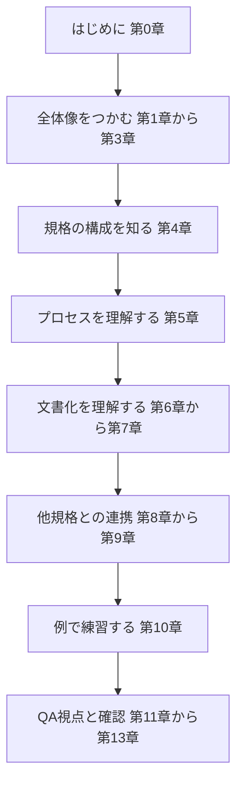

この図は、本ガイドを読み進める順番を上から下へ示しています。

各ノードの意味：
- 第1章から第3章：規格が何のためにあるかを理解する
- 第4章：規格の目次を地図として頭に入れる
- 第5章から第7章：評価のやり方と、記録に残す内容を学ぶ
- 第8章から第9章：ISO/IEC 42001などとどうつながるかを学ぶ
- 第10章以降：架空の例で練習し、QAの視点で確認項目を作る

📖 この章で登場した用語
- ISO（国際標準化機構）：国際規格をつくる非営利の国際組織
- IEC（国際電気標準会議）：電気・電子分野の国際規格をつくる組織。ISOと共同で情報技術の規格を作ることがある
- ANSI：米国規格協会。ISO規格の試し読み版を公開していることがある
- プレビュー：規格本文の一部（表紙、目次、序文など）を購入前に見られる公開版

---

## 1. ISO/IEC 42005:2025 を一言でいうと

💡 この章では、規格の基本情報と、全体像を一言で説明します。細部に入る前に「この規格は何のためのものか」を押さえてください。

### 1-1. 一言でいうと

**「AIシステムが、人・グループ・社会にどんな良い影響と悪い影響を与えうるかを、決まった手順で調べて記録するための手引き」** です。

たとえ話をすると、新しい薬を売り出す前に行う「副作用と効能の確認」に近い考え方です。薬の会社は、自社の損得だけでなく、飲む人にどんな影響があるかを先に調べます。AIでも同じように、使う人や周りの人への影響を、開発・導入の前後で調べておこう、というのがこの規格の考え方です。

### 1-2. 基本情報

| 項目 | 内容 | 根拠 |
|------|------|------|
| 規格番号 | ISO/IEC 42005:2025 | ISO公式 |
| 題名（英語） | Information technology — Artificial intelligence (AI) — AI system impact assessment | ISO公式 |
| 題名（日本語の意味） | 情報技術 — 人工知能（AI）— AIシステム影響評価 | 筆者訳 |
| 版 | 第1版（Edition 1） | ISO公式 |
| 発行日 | 2025年5月28日（ISOのライフサイクル表に記載） | ISO公式 |
| ステージ | 60.60（国際規格として発行済み） | ISO公式 |
| 担当委員会 | ISO/IEC JTC 1/SC 42（人工知能） | ISO公式 |
| ICS（国際規格分類） | 35.020 | ISO公式 |
| ページ数 | ISO公式ページでは39ページ | ISO公式 |
| 言語 | 英語 | ISO公式 |
| 性格 | 要求事項を並べた認証用の規格ではなく、実施のための指針（ガイダンス） | ISO公式の説明（provides guidance）から読み取れる |

### 1-3. 誰が使うのか

【規格】ISO公式のFAQによると、AIシステムを開発する組織、提供する組織、利用する組織のいずれも対象で、業種や規模は問いません。

| 立場 | 具体例 |
|------|--------|
| 開発する組織 | AIモデルやAI機能を作るソフトウェア企業、研究機関 |
| 提供する組織 | AIを組み込んだサービスをお客様に提供する事業者 |
| 利用する組織 | 外部のAIサービスを業務に導入する企業、自治体、病院 |

### 1-4. 規格の開発経過（ISOのライフサイクル表より）

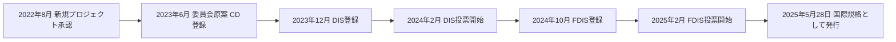

この図は、規格が提案から発行までに通った段階を左から右へ示しています。

各ノードの意味：
- CD（Committee Draft）：委員会で最初に作る原案
- DIS（Draft International Standard）：各国に意見を募る国際規格案
- FDIS（Final Draft International Standard）：最終投票にかける最終案
- 発行：2025年5月28日にISOが国際規格として公開

📖 この章で登場した用語
- ガイダンス：「こうするとよい」という指針。守れば適合と判定される要求事項（shall）とは性格が違う
- JTC 1/SC 42：情報技術（JTC 1）の中でAIを担当する分科委員会
- ステージ60.60：ISOの管理番号で「発行済み」を意味する段階
- ICS：規格を分野別に整理する国際分類番号

---

## 2. なぜAIの影響評価が必要なのか

💡 この章では、規格の背景を説明します。「なぜ今、AIだけ影響評価が必要なのか」を理解すると、後で出てくる手順の意味が分かりやすくなります。

### 2-1. AIが持つ「良い面」と「心配な面」

【規格】規格の序文は、AIには、危険な仕事の自動化、大量データのより速く正確な分析、医療の進歩などの期待がある一方で、不公平・差別的な結果、環境への悪影響、雇用の減少などが懸念される、という趣旨を述べています。また、一見無害に見えるAIでも、個人、集団、社会に大きな影響（良い面も悪い面も）を与えうるとしています。

| 面 | 例 |
|----|----|
| 期待される便益 | 作業の自動化、分析の高速化、医療の進歩、アクセシビリティの向上 |
| 懸念される害 | 不公平な判定、差別的な出力、環境負荷、雇用への影響、プライバシー侵害 |

### 2-2. たとえ話：新しい橋を作る前の調査

橋を作るとき、設計者は「強度が足りるか」だけでなく、「周りの住民の生活はどう変わるか」「川の生き物への影響は」「災害のときにどうなるか」も調べます。AIも同じで、「モデルの精度が高いか」だけでは足りません。精度が高くても、特定の人たちに不利な結果を出し続けるなら、社会への害になります。影響評価は、この「周りへの影響の調査」にあたります。

### 2-3. 影響評価がもたらす効果

【規格】ISO公式ページが挙げる利点を整理すると、次のとおりです。

| 利点 | 意味 |
|------|------|
| 関係者の信頼の強化 | 影響を文書で透明にすることで、利用者や規制当局に説明できる |
| 責任あるイノベーション | 社会的・倫理的なリスクに先に向き合える |
| ガバナンスとの整合 | 組織の統制、リスク管理、法令対応の枠組みとつなげやすい |
| 意思決定と説明責任の改善 | AIのライフサイクル全体で、誰が何を判断したかが残る |
| 報告の一貫性 | 影響の報告の書き方が揃い、比較しやすくなる |

📖 この章で登場した用語
- 便益：利用者や社会が受ける良い影響
- 害（ハーム）：個人、集団、社会が受ける悪い影響
- 透明性：何を根拠にどう判断したかを、外から確認できる状態
- 説明責任：決定の理由や結果について、関係者に説明できること
- ガバナンス：組織を正しく運営するための統制の仕組み

---

## 3. 規格エコシステムの中での位置づけ

💡 この章では、ISO/IEC 42005 が他のAI関連規格とどうつながるかを説明します。AI関連の規格は番号が多く混乱しやすいので、役割の違いを表で整理します。

### 3-1. 関連する規格との関係

【規格】序文は、ISO/IEC 38507（ガバナンス）、ISO/IEC 23894（リスク管理）、ISO/IEC 42001（マネジメントシステム）が、影響評価と合わせてAIの信頼と説明責任を支える枠組みをつくる、と述べています。ISO公式のFAQも、42005は42001、38507、23894を補完し、とくに人や社会への影響に焦点を当てると説明しています。

| 規格 | 役割 | 一言でいうと | 42005との関係 |
|------|------|-------------|---------------|
| ISO/IEC 38507 | AIのガバナンス | 経営層がAIをどう統制するか | 影響を理解して価値観や目標に合わせる土台 |
| ISO/IEC 23894 | AIのリスク管理 | AIのリスクをどう扱うか | 附属書Bで関係が説明される |
| ISO/IEC 42001 | AIマネジメントシステム | 組織としてAIを運用する仕組み | 附属書Aで関係が説明される。42001の6.1.4と8.4が影響評価を求める |
| ISO/IEC 42005 | AIシステム影響評価 | 人や社会への影響をどう調べて記録するか | 本ガイドの対象 |

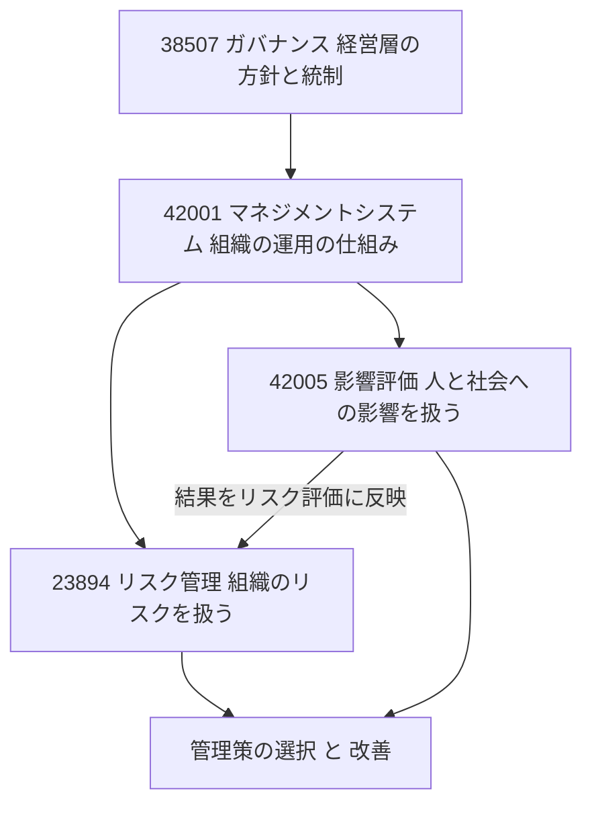

この図は、ガバナンスから運用の仕組み、リスク管理と影響評価へとつながる関係を上から下へ示しています。

各ノードの意味：
- 38507：経営層がAIを統制する枠組み
- 42001：組織の運用の仕組み。影響評価を行う要求の入口になる
- 23894：組織にとってのリスクを扱う
- 42005：外向き（人と社会）の影響を扱う
- 結果をリスク評価に反映：42001の6.1.4は、影響評価の結果をリスク評価で考慮することを求める（実務者の解説による）

### 3-2. 影響評価とリスク評価はどう違うのか

【解説】42001は、AIリスク評価（6.1.2）とAIシステム影響評価（6.1.4）を別々のプロセスとして置いています。公開されている実務者の解説では、リスク評価は「組織にとってのリスク」を内向きに見るもの、影響評価は「個人・集団・社会への影響」を外向きに見るもの、と整理されています。

| 観点 | AIリスク評価 | AIシステム影響評価 |
|------|-------------|-------------------|
| 見る方向 | 内向き。組織への影響 | 外向き。人、集団、社会への影響 |
| 主な指針 | ISO/IEC 23894 | ISO/IEC 42005 |
| 42001での位置 | 6.1.2 | 6.1.4（実施は8.4） |
| 例 | 規制違反による罰金、評判の低下 | 特定の属性の人が不利な判定を受けること |

たとえ話をすると、リスク評価は「会社の健康診断」、影響評価は「商品が周りの人の健康に与える影響の調査」に近いです。

### 3-3. 影響評価は他の評価の代わりになるか

【解説】プライバシー影響評価（DPIA）は個人データの扱いに焦点がありますが、AIシステム影響評価は公平性、透明性、説明責任、安全性なども含めて広く見ます。DPIAは影響評価に情報を提供できますが、代わりにはなりません。この関係は、附属書D（他の評価との整合）で扱われます。

📖 この章で登場した用語
- ガバナンス：組織の統制の枠組み
- マネジメントシステム：方針、役割、手順、改善をひとまとめにした組織の運用の仕組み
- リスク評価：起こりうる問題の可能性と大きさを見積もること
- DPIA（データ保護影響評価）：個人データの処理が人に与える影響を事前に調べる手続き
- Statement of Applicability（適用宣言書）：42001で、どの管理策を採用するかを宣言する書類

---

## 4. 規格の構成を地図として見る

💡 この章では、規格全体の目次を表にして示します。本文を読む前に地図を頭に入れておくと、迷子になりにくくなります。

### 4-1. 全体構成

【規格】ANSI Webstoreの公開プレビューの目次をもとに整理しました。

| 章・附属書 | タイトル（英語） | 日本語の意味 | 性格 |
|-----------|----------------|-------------|------|
| 1 | Scope | 適用範囲 | 本体 |
| 2 | Normative references | 引用規格 | 本体 |
| 3 | Terms and definitions | 用語と定義 | 本体 |
| 4 | Abbreviated terms | 略語 | 本体 |
| 5 | Developing and implementing an AI system impact assessment process | 影響評価プロセスの構築と実施 | 本体（中心） |
| 6 | Documenting the AI system impact assessment | 影響評価の文書化 | 本体（中心） |
| 附属書A | Guidance for use with ISO/IEC 42001 | 42001と使うための手引き | 参考（informative） |
| 附属書B | Guidance for use with ISO/IEC 23894 | 23894と使うための手引き | 参考 |
| 附属書C | Harms and benefits taxonomy | 害と便益の分類 | 参考 |
| 附属書D | Aligning AI system impact assessment with other assessments | 他の評価との整合 | 参考 |
| 附属書E | Example of an AI system impact assessment template | 影響評価テンプレートの例 | 参考 |

### 4-2. 「プロセス」と「文書」という2つの柱

この規格の本体は、2つの柱でできています。

| 柱 | 問い | 該当する章 |
|----|------|-----------|
| プロセス | 組織として、どんな仕組みで影響評価を回すか | 第5章 |
| 文書 | 評価の結果として、何を記録に残すか | 第6章 |

たとえば、料理にたとえると、第5章は「レシピと台所のルール（誰が、いつ、どの手順で作るか）」、第6章は「出来上がった料理の成分表示ラベル」です。両方そろって、はじめて他人に説明できます。

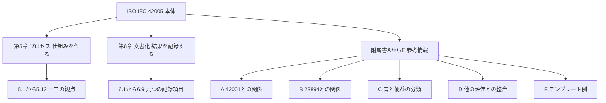

この図は、規格の本体と附属書の関係を上から下へ示しています。

各ノードの意味：
- 第5章：プロセスの設計と運用に関する十二の節
- 第6章：記録する内容に関する九つの節
- 附属書：参考情報（informative）で、本体ほど拘束力のある位置づけではない

📖 この章で登場した用語
- 附属書（Annex）：本体の後ろに付く補足資料
- informative（参考）：理解や実施を助けるための情報。守るべき要求事項ではないという意味で使われる
- normative（規定）：守るべき内容を定める部分
- タクソノミー（分類）：物事を決まった基準で整理した分類表

---

## 5. 第5章：影響評価プロセスを作って回す（ステップバイステップ）

💡 この章では、組織が影響評価を「継続的に回せる仕組み」にするための12の観点を、順番に説明します。1回きりの調査ではなく、仕組みとして持つことが狙いです。

【規格】第5章の節タイトルは次のとおりです（ANSI公開プレビューの目次）。

| 節 | タイトル（英語） | 日本語の意味 |
|----|----------------|-------------|
| 5.1 | General | 総則 |
| 5.2 | Documenting the process | プロセスの文書化 |
| 5.3 | Integration with other organizational management processes | 他の組織の管理プロセスとの統合 |
| 5.4 | Timing of AI system impact assessment | 実施のタイミング |
| 5.5 | Scope of the AI system impact assessment | 評価の範囲 |
| 5.6 | Allocating responsibilities | 責任の割り当て |
| 5.7 | Establishing thresholds for sensitive uses, restricted uses and impact scales | 慎重な扱いが必要な用途、制限する用途、影響の尺度の閾値の設定 |
| 5.8 | Performing the AI system impact assessment | 評価の実施 |
| 5.9 | Analysing the results of the AI system impact assessment | 結果の分析 |
| 5.10 | Recording and reporting | 記録と報告 |
| 5.11 | Approval process | 承認プロセス |
| 5.12 | Monitoring and review | 監視と見直し |

### 5-1. 全体の流れ

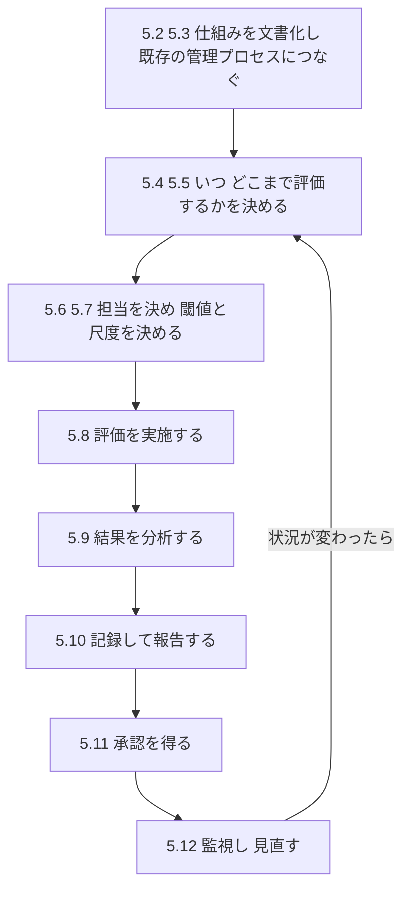

この図は、第5章の12の観点を、実務で進める順に並べ直したものです。上から下へ読み進め、最後は最初の段階へ戻ります。

各ノードの意味：
- 5.2と5.3：仕組みそのものの設計（準備）
- 5.4と5.5：いつ、何を対象にするかの設計
- 5.6と5.7：体制と判断基準の設計
- 5.8から5.10：実際の評価と記録
- 5.11：責任者による承認
- 5.12：運用開始後の監視と見直し。変化があれば範囲やタイミングの見直しへ戻る

この並べ替えは、理解しやすいように筆者が整理したものであり、規格が定めた手順の順序とは限りません。

### 5-2. 各観点の解説

以下は、節のタイトルと一般的な実務の知識をもとにした【解説】です。条文の逐語的な要約ではありません。

#### ステップ1：5.1 総則と5.2 プロセスの文書化

なぜ必要か：影響評価が担当者の頭の中だけにあると、人が替わったときに同じ品質で続けられません。手順を文書にしておくことで、誰がやっても同じ水準で回せます。

たとえば、学校の「避難訓練マニュアル」と同じです。マニュアルがあるから、先生が替わっても訓練の質が保てます。

#### ステップ2：5.3 他の組織の管理プロセスとの統合

なぜ必要か：影響評価だけが別の場所で孤立すると、開発の現場では「やっても使われない書類」になりがちです。リスク管理、品質管理、セキュリティ、プライバシーの既存の仕組みと連動させると、実際の意思決定に反映されます。

| 連携先の例 | つなぎ方の例（【例】） |
|-----------|----------------------|
| リスク管理 | 影響評価の結果をリスク登録簿に反映する |
| 開発プロセス | 要件定義や設計レビューの時点で影響評価を確認する |
| 変更管理 | 大きな機能変更のときに再評価を起動する |
| 調達 | 外部AIを導入する前に影響評価を求める |

#### ステップ3：5.4 実施のタイミング

【規格】ISO公式のFAQは、設計・開発から展開、市場投入後の監視までライフサイクル全体で評価を行い、必要に応じて更新することを推奨しています。

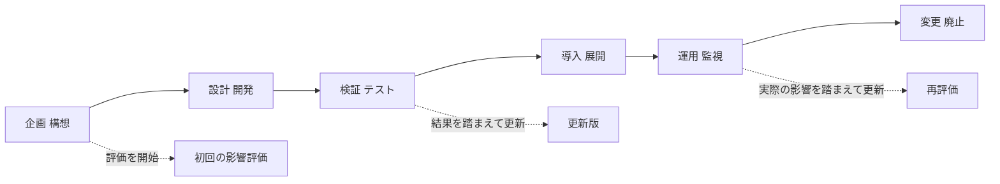

この図は、AIシステムの一生（左から右）と、影響評価を行うタイミングの関係を示しています。

各ノードの意味：
- 企画から廃止：AIシステムのライフサイクル
- 点線の矢印：その時点で影響評価を作成または更新することを表す
- 実線の矢印：ライフサイクルの進行

なぜ早い時期から始めるのか：設計が固まってから「重大な害がありそう」と分かると、手戻りの費用が大きくなります。家の設計図の段階で間取りを直すほうが、完成後に壁を壊すより安いのと同じです。

#### ステップ4：5.5 評価の範囲

なぜ必要か：「AIシステム全体」を一度にすべて評価しようとすると、終わりません。どのシステム、どの機能、どの用途、どの地域・利用者までを対象にするかを先に決めます。後の6.2（評価の範囲の記録）と対応します。

【解説】範囲を決めるときの典型的な問いは次のとおりです。

| 問い | 例（【例】） |
|------|-------------|
| どのシステムか | 履歴書スクリーニングAI |
| どの用途か | 一次選考の優先順位付けのみ。最終判断は人 |
| 誰に影響するか | 応募者、採用担当者、社内の人事部門 |
| どの地域か | 日本国内の応募者 |

#### ステップ5：5.6 責任の割り当て

なぜ必要か：「みんなで見る」は「誰も見ない」になりやすいからです。評価を作る人、レビューする人、承認する人を決めます。

| 役割（【例】） | 主な責任 |
|---------------|----------|
| 評価の作成者 | 情報を集め、影響を洗い出して記録する |
| 技術のレビュー担当 | モデル、データ、性能の記述が正しいか確認する |
| 法務・倫理の担当 | 規制、人権、公平性の観点で確認する |
| 承認者 | 受容するか、対策を追加するか、中止するかを決める |

#### ステップ6：5.7 閾値の設定（慎重な用途、制限する用途、影響の尺度）

【規格】節タイトルは、「慎重な扱いが必要な用途（sensitive uses）」、「制限する用途（restricted uses）」、「影響の尺度（impact scales）」の閾値を設定することを示しています。

なぜ必要か：評価のたびに担当者が自分の感覚で「重大」「軽微」を決めると、結果が揃いません。あらかじめ基準を決めておくと、判断がぶれません。

たとえば、地震の「震度」と同じです。「かなり揺れた」だけでは比べられませんが、震度の尺度があると、場所が違っても比較できます。

| 概念 | 意味 | 例（【例】） |
|------|------|-------------|
| 慎重な扱いが必要な用途 | 人の権利や生活に大きく関わるため、特に注意する用途 | 採用、融資審査、医療の判断支援 |
| 制限する用途 | 組織として行わない、または強い条件を付ける用途 | 感情の推定による評価の自動決定 |
| 影響の尺度 | 影響の大きさを段階で示す基準 | 軽微、中程度、重大、致命的 |

【解説】公開されている法律事務所の解説では、全件について完全な評価を行うのではなく、トリアージ（絞り込みの選別）の道具を使って、完全な評価が必要かどうかを判断することが勧められています。

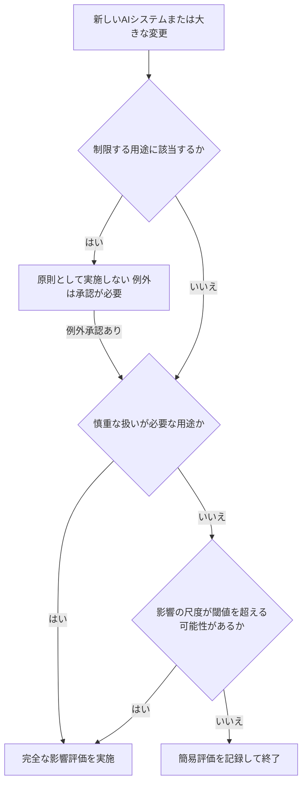

この図は、評価の深さを決める判断の流れの【例】です。規格の図ではなく、筆者が考えた一例です。

各ノードの意味：
- ひし形：はい、いいえで答える判断
- 完全な影響評価：第6章の記録項目を満たして実施する
- 簡易評価：判断の根拠を短く記録して終了する

#### ステップ7：5.8 評価の実施

なぜ必要か：ここが本番です。第6章で説明する情報（システムの説明、データ、モデル、環境、関係者、便益と害、対策）を集めて、影響を洗い出します。評価は、開発者だけでなく、利用者の代表、法務、品質、現場の担当者など、立場の違う人の視点を入れるほど見落としが減ります。

【解説】洗い出しのコツは、「想定どおりに使われる場合」だけでなく、「失敗したとき」「想定外の使われ方をしたとき」も考えることです。これは、第6章の6.8.3（失敗と合理的に予見できる誤用）に対応します。

#### ステップ8：5.9 結果の分析

なぜ必要か：洗い出した影響を並べただけでは、どれを優先して対策すべきか分かりません。影響の大きさ、起こりやすさ、影響を受ける人の数や立場の弱さなどを踏まえて、優先順位を付けます。

#### ステップ9：5.10 記録と報告

なぜ必要か：記録がないと、後から「なぜその判断をしたのか」を説明できません。記録は、内部の意思決定のためだけでなく、必要に応じて外部の関係者（規制当局、顧客など）へ説明する材料にもなります。

#### ステップ10：5.11 承認プロセス

なぜ必要か：影響評価の結論は、組織としての判断です。担当者の判断だけで完了させず、権限のある人が承認する手続きを設けます。

| 承認の結果（【例】） | 次の行動 |
|---------------------|----------|
| 受容 | そのまま展開する |
| 条件付きで受容 | 対策を実施してから展開する |
| 差し戻し | 追加の調査や設計変更を求める |
| 中止 | 展開しない |

#### ステップ11：5.12 監視と見直し

なぜ必要か：AIは、データの変化、モデルの更新、使われ方の変化で、時間とともに影響が変わります。展開時の評価が、半年後にも正しいとは限りません。

【解説】再評価を起動する条件を、あらかじめ決めておくと運用しやすくなります。

| 再評価のきっかけ（【例】） | 内容 |
|---------------------------|------|
| 機能の大きな変更 | 新しい用途、新しい利用者層の追加 |
| モデルの更新 | 再学習、基盤モデルの切り替え |
| 事故やクレーム | 想定外の害が報告された |
| 規制や社会の変化 | 関連法令の改正、社会的な期待の変化 |
| 定期見直し | 年次などの定期的な確認 |

📖 この章で登場した用語
- ライフサイクル：企画から廃止までのAIシステムの一生
- 閾値（しきいち）：判断の境目となる基準値
- トリアージ：緊急度や重要度で優先順位を付けて選別すること
- 影響の尺度：影響の大きさを段階で示した物差し
- ステークホルダー（利害関係者）：システムの影響を受ける、またはシステムに影響を与える人や組織

---

## 6. 第6章：影響評価を文書にまとめる

💡 この章では、評価結果として「何を記録に残すか」を説明します。第5章が仕組みの話だったのに対し、第6章は記録の中身の話です。

### 6-1. 第6章の構成

【規格】ANSI公開プレビューの目次をもとに整理しました。

| 節 | タイトル（英語） | 日本語の意味 |
|----|----------------|-------------|
| 6.1 | General | 総則 |
| 6.2 | Scope of the AI system impact assessment | 評価の範囲 |
| 6.3 | AI system information | AIシステムの情報 |
| 6.4 | Data information and quality | データの情報と品質 |
| 6.5 | Algorithm and model information | アルゴリズムとモデルの情報 |
| 6.6 | Deployment environment | 展開環境 |
| 6.7 | Relevant interested parties | 関連する利害関係者 |
| 6.8 | Actual and reasonably foreseeable impacts | 実際の影響と合理的に予見できる影響 |
| 6.9 | Measures to address harms and benefits | 害と便益への対応策 |

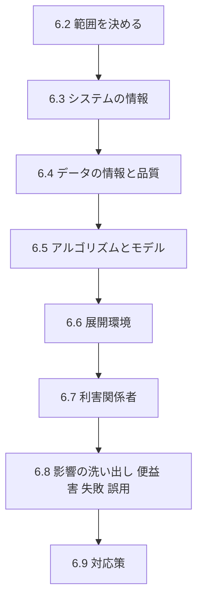

この図は、評価書を書く順序の一例を上から下へ示しています。前半（6.3から6.7）で「何についての評価か」を固め、後半（6.8と6.9）で「どんな影響があり、どうするか」を書く流れです。

各ノードの意味：
- 6.2：評価の対象と境界
- 6.3から6.6：システムそのものと使われる場所の情報
- 6.7：影響を受ける人や組織
- 6.8：実際の影響と予見できる影響の洗い出し
- 6.9：害を減らし、便益を伸ばすための対応

### 6-2. 6.3 AIシステムの情報

【規格】下位節のタイトルは次のとおりです。

| 節 | タイトル（英語） | 日本語の意味 | 書く内容の例（【例】） |
|----|----------------|-------------|----------------------|
| 6.3.1 | AI system description | システムの説明 | 何をするシステムか、全体の構成 |
| 6.3.2 | AI system functionalities and capabilities | 機能と能力 | できること、できないこと、性能の水準 |
| 6.3.3 | AI system purpose | 目的 | 何のために使うのか |
| 6.3.4 | Intended uses | 意図された用途 | 想定している使い方 |
| 6.3.5 | Unintended uses | 意図されていない用途 | 想定していない、または禁止する使い方 |

なぜ6.3.5が重要か：作り手が想定していない使い方で、害が起きることが多いからです。たとえば、料理用の包丁は、料理のために作られていますが、別の用途で使われる可能性もあります。事前に「想定していない使い方」を書き出すことで、注意書きや制限を設計に反映できます。

### 6-3. 6.4 データの情報と品質

| 節 | タイトル（英語） | 日本語の意味 |
|----|----------------|-------------|
| 6.4.1 | General | 総則 |
| 6.4.2 | Data information | データの情報 |
| 6.4.3 | Data quality documentation | データ品質の文書化 |

なぜ必要か：AIの振る舞いは、学習や評価に使ったデータの偏りや欠けに強く影響されるからです。たとえば、特定の地域や年齢層のデータが少ないと、その人たちに対する精度が下がります。データの出所、量、代表性（現実の集団を偏りなく表しているか）を記録しておくと、後で原因を追跡できます。

### 6-4. 6.5 アルゴリズムとモデルの情報

| 節 | タイトル（英語） | 日本語の意味 |
|----|----------------|-------------|
| 6.5.1 | General | 総則 |
| 6.5.2 | Information on algorithms used by the organization | 組織が使うアルゴリズムの情報 |
| 6.5.3 | Information on algorithm development | アルゴリズムの開発に関する情報 |
| 6.5.4 | Information on models used in an AI system | AIシステムで使うモデルの情報 |
| 6.5.5 | Information on model development | モデルの開発に関する情報 |

なぜ必要か：外部の基盤モデルを使う場合でも、そのモデルが何で、どう更新されるかを記録しておく必要があるからです。【解説】基盤モデルのバージョンが変わると挙動が変わることがあるため、バージョンの記録は、再評価の判断材料になります。

### 6-5. 6.6 展開環境

| 節 | タイトル（英語） | 日本語の意味 | 書く内容の例（【例】） |
|----|----------------|-------------|----------------------|
| 6.6.1 | Geographical area and languages | 地理的範囲と言語 | 日本国内、日本語と英語 |
| 6.6.2 | Deployment environment complexity and constraints | 展開環境の複雑さと制約 | 現場の通信環境、人による監督の有無 |

なぜ必要か：同じAIでも、使う場所によって影響が変わるからです。言語や文化が違えば、出力の受け取られ方も変わります。

### 6-6. 6.7 関連する利害関係者

| 節 | タイトル（英語） | 日本語の意味 |
|----|----------------|-------------|
| 6.7.1 | General | 総則 |
| 6.7.2 | Directly affected interested parties | 直接影響を受ける利害関係者 |
| 6.7.3 | Other relevant interested parties | その他の関連する利害関係者 |

【例】採用スクリーニングAIの場合、直接影響を受けるのは応募者です。そのほかの利害関係者には、採用担当者、人事部門、規制当局、応募者の家族や所属コミュニティなどが考えられます。

### 6-7. 6.8 実際の影響と合理的に予見できる影響

【規格】6.8は、「便益と害（6.8.2）」と「AIシステムの失敗と合理的に予見できる誤用（6.8.3）」に分かれます。公開目次では、6.8.3.2が「AIシステムの失敗の影響」、6.8.3.3が「合理的に予見できる誤用の影響」、6.8.2.9が「環境への影響」であることが確認できます。

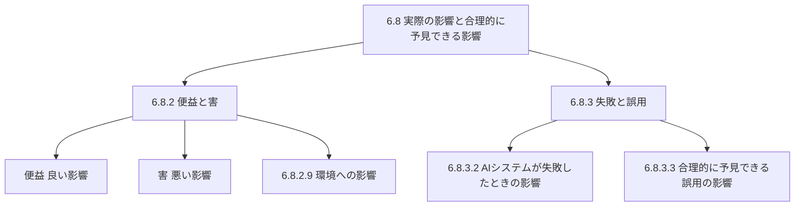

この図は、6.8の中身を木のように上から下へ分解して示しています。

各ノードの意味：
- 6.8.2：想定どおりに動いた場合の便益と害
- 6.8.3.2：誤った出力、停止などの失敗が起きた場合の影響
- 6.8.3.3：悪意がなくても、ありがちな使い間違いや、予見できる悪用が起きた場合の影響

なぜ失敗と誤用を分けて考えるのか：「正しく動いて、正しく使われた場合」の影響だけを評価すると、実際に問題が起きやすい場面を見落とすからです。たとえば、車の安全評価は、正しく運転した場合だけでなく、急ブレーキをかけた場合や、雨の日の走行も見ます。

### 6-8. 6.9 害と便益への対応策

なぜ必要か：影響を洗い出しただけで終わると、評価が「危険の一覧表」になってしまうからです。害を減らす対策（軽減）と、便益を高める工夫を、評価書に結び付けて記録します。

| 対応の種類（【例】） | 内容 |
|---------------------|------|
| 設計の変更 | 判定を人が最終確認する流れにする |
| データの改善 | 不足している集団のデータを補う |
| 利用の制限 | 慎重な扱いが必要な用途では使わない |
| 説明と通知 | AIを使っていることを利用者に伝える |
| 監視 | 結果の偏りを定期的に測る |
| 苦情の受付 | 利用者が異議を申し立てられる窓口を設ける |

📖 この章で登場した用語
- 合理的に予見できる誤用：悪意がなくても、通常の注意を払えば起こりうると考えられる誤った使い方
- 代表性：データが対象の集団を偏りなく表しているかどうか
- 基盤モデル：大量のデータで事前学習した、多用途に使える大規模モデル
- 軽減策：害が起こる可能性や大きさを減らす対策
- 利害関係者：評価の対象システムに影響を受ける、または影響を与える人や組織

---

## 7. 便益と害をどう分類するか（6.8.2と附属書C）

💡 この章では、影響を漏れなく洗い出すための「分類の考え方」を説明します。分類表があると、「思いついた順」ではなく「観点ごと」に確認できます。

### 7-1. 観点の例

【規格】附属書Cは「害と便益のタクソノミー（分類）」を提供します。BSIの公開紹介文によると、この規格の分類は、責任、透明性、公平性、一貫性、信頼性（頑健性）、安全性、セキュリティ、プライバシーなどの観点を考慮します。また、6.8.2.9で環境への影響が扱われます。

次の表は、公開情報で確認できた観点の【解説】です。各観点の具体的な文言は、正規版の附属書Cで確認してください。

| 観点 | 問いの例（【例】） |
|------|-------------------|
| 責任（説明責任） | 問題が起きたとき、誰が対応し説明するか |
| 透明性 | AIを使っていること、判断の根拠を利用者に伝えているか |
| 公平性 | 特定の属性の人たちに不利な結果になっていないか |
| 一貫性 | 同じ入力に対して、安定した結果を出すか |
| 信頼性 | 想定外の入力でも、極端に壊れずに動くか |
| 安全性 | 人の身体、財産、精神に危害を与えないか |
| セキュリティ | 悪用や攻撃で、利用者に害が及ばないか |
| プライバシー | 個人情報や行動の情報を、不適切に扱っていないか |
| 環境 | 電力や資源の消費が、環境に過度な負荷を与えていないか |

注意：上の表の「問いの例」は筆者の例です。分類の項目名や並び順は、正規版の附属書Cと異なる可能性があります。

### 7-2. 便益も同じ重さで書く

【解説】影響評価は「害探し」だけではありません。ISO公式ページが述べるように、AIには大きな利益があります。便益を書かないと、「害が少しでもあれば使えない」という偏った判断になります。学術研究の例（arXivの影響評価報告書テンプレート研究）でも、リスクだけでなく便益の節を設けて、全体像のバランスを取る設計が採られています。

| 観点 | 害の例（【例】） | 便益の例（【例】） |
|------|----------------|-------------------|
| 利用者への影響 | 誤った判定で不利益を受ける | 待ち時間が短くなる |
| 社会への影響 | 特定の集団への偏見が強まる | 医療や教育へのアクセスが広がる |
| 環境への影響 | 計算資源による電力消費 | 物流の最適化による排出削減 |

📖 この章で登場した用語
- タクソノミー：項目を決まった基準で分類した体系
- 公平性：属性（年齢、性別、国籍など）によって不当に有利、不利にならないこと
- 頑健性（ロバストネス）：想定外の入力があっても、大きく壊れずに動く性質
- 一貫性：同じ条件で同じ水準の結果が得られること

---

## 8. 他の規格との連携（附属書A、附属書B、附属書D）

💡 この章では、ISO/IEC 42001、ISO/IEC 23894、他の評価（プライバシー、セキュリティなど）との連携を説明します。現場では「42005だけ」で完結せず、他の仕組みと一緒に運用することが多いためです。

### 8-1. 附属書A：ISO/IEC 42001との関係

【規格】42001は、AIシステム影響評価をマネジメントシステムの要求の1つとして置いており、6.1.4でプロセスを定め、8.4で実施する構成になっています（実務者の解説による）。

| 42001の箇所 | 内容 | 42005との関係 |
|------------|------|---------------|
| 6.1.2 | AIリスク評価 | 影響評価の結果を考慮する先 |
| 6.1.4 | AIシステム影響評価のプロセスの確立 | 42005の第5章が実務の手引きになる |
| 8.4 | 影響評価の実施 | 42005の第6章の文書化が使える |
| 附属書A A.5 | 影響評価に関する管理策 | 42005が方法論を提供する |

【規格】LinkedIn上の実務者の投稿（2025年5月28日付）は、42001の6.1.4に、「影響評価の結果をリスク評価で考慮する」という趣旨の文があることを指摘し、影響評価はリスク評価の代わりにはならないと注意しています。また、A.5の管理策は、組織の適用宣言書（SoA）で採用するかどうかを選べる、と述べています。

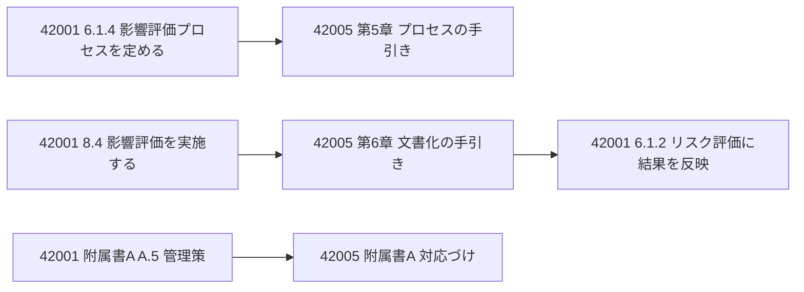

この図は、42001の要求と42005の手引きの対応を左から右へ示しています。

各ノードの意味：
- 左の列：42001の要求
- 中央の列：対応する42005の手引き
- 右端：影響評価の結果をリスク評価に反映する流れ

### 8-2. 附属書B：ISO/IEC 23894との関係

【規格】公開目次では、附属書Bに「B.2 リスク管理とAIシステム影響評価の違い」と「B.3 影響評価に関係するリスク管理の原則」が含まれます。

| 節 | 内容（タイトルから読み取れる範囲） |
|----|-----------------------------------|
| B.2 | リスク管理と影響評価は何が違うか |
| B.3 | リスク管理の原則のうち、影響評価に関係するもの |

### 8-3. 附属書D：他の評価との整合

【規格】公開目次では、附属書Dに「D.2 Coordination guide（調整の手引き）」、「D.3 Impact assessment alignment guide（影響評価の整合の手引き）」、「D.4 Mapping guide（対応づけの手引き）」があります。BSIの紹介文によると、プライバシー、人権、財務、環境などの影響評価と整合させる内容を含みます。

| 他の評価（【例】） | 整合のさせ方の発想 |
|-------------------|--------------------|
| プライバシー影響評価 | 個人データに関する調査結果を、影響評価の「プライバシー」の項目に再利用する |
| セキュリティの評価 | 脅威分析の結果を、「セキュリティ」の項目に再利用する |
| 人権・基本的権利の評価 | 権利への影響を、利害関係者の項目と結び付ける |
| 環境の評価 | 環境への影響を、6.8.2.9に反映する |

【解説】EUのAI規則（EU AI Act）が求める「基本的権利への影響評価」との関係について、先ほどのLinkedIn上の実務者の投稿は、規則の第27条の要求を、42001のAIシステム影響評価の中で扱うことも、別の文書で扱って参照することもできる、という例を示しています。法令の要求を満たすかどうかは、必ず法務の専門家と最新の公式情報で確認してください。

📖 この章で登場した用語
- マネジメントシステム規格：組織の運用の仕組みを定める規格（ISO 9001やISO/IEC 27001など）
- Statement of Applicability（SoA）：採用する管理策と、その理由を宣言する書類
- 管理策（コントロール）：リスクを減らすための具体的な対策
- EU AI Act：EUのAI規制法（Regulation (EU) 2024/1689）
- 基本的権利への影響評価：AIが人の基本的な権利に与える影響を事前に調べる評価

---

## 9. 附属書E：影響評価テンプレートの活用

💡 この章では、附属書Eのテンプレートをどう使うかを説明します。ゼロから評価書の構成を考えるより、テンプレートに沿って埋めるほうが、漏れが少なくなります。

### 9-1. 附属書Eの位置づけ

【規格】公開目次では、附属書Eは「E.2 Example AI system impact assessment template（影響評価テンプレートの例）」を含み、E.2.1が「[システム名または識別名]のAIシステム影響評価」、E.2.7が「実際の影響と合理的に予見できる便益と害」、E.2.8.1が「AIシステムの失敗の影響」、E.2.8.2が「合理的に予見できる誤用の影響」と対応しています。

また、LinkedIn上の実務者の投稿は、DIS（国際規格案）の段階から、特に附属書Eのテンプレートに、注目すべき更新があったと述べています。DIS版を参照していた場合は、最新の発行版で確認し直してください。

### 9-2. 第6章とテンプレートの対応

| 第6章の記録項目 | テンプレートでの対応（公開目次から確認できる範囲） |
|----------------|--------------------------------------------------|
| 6.2 範囲 | E.2.1付近のシステム識別と範囲 |
| 6.3 から 6.7 | システム、データ、モデル、環境、利害関係者の記述 |
| 6.8.2 便益と害 | E.2.7 |
| 6.8.3 失敗と誤用 | E.2.8.1、E.2.8.2 |
| 6.9 対応策 | 対応策の記述 |

注意：6.2から6.7とE.2の細かな対応は、公開目次だけでは確認できません。正規版で確認してください。

### 9-3. 自組織向けの簡易テンプレート【例】

次の表は、筆者が第6章の目次に沿って作った【例】です。附属書Eの内容そのものではありません。

| 項目 | 記入内容 | 記入者 | 状態 |
|------|----------|--------|------|
| システム名・版 |  |  |  |
| 評価の範囲（6.2） |  |  |  |
| システムの説明、機能、目的（6.3） |  |  |  |
| 意図された用途、意図されていない用途（6.3.4、6.3.5） |  |  |  |
| データの出所と品質（6.4） |  |  |  |
| アルゴリズムとモデル（6.5） |  |  |  |
| 地理的範囲、言語、環境の制約（6.6） |  |  |  |
| 直接影響を受ける人、その他の関係者（6.7） |  |  |  |
| 便益（6.8.2） |  |  |  |
| 害（6.8.2） |  |  |  |
| 環境への影響（6.8.2.9） |  |  |  |
| 失敗したときの影響（6.8.3.2） |  |  |  |
| 誤用されたときの影響（6.8.3.3） |  |  |  |
| 対応策と残るリスク（6.9） |  |  |  |
| 承認者、承認日、再評価の条件（5.11、5.12） |  |  |  |

📖 この章で登場した用語
- DIS：国際規格案。発行版とは内容が異なることがある
- テンプレート：記入する項目をあらかじめ並べた雛形
- 残るリスク（残留リスク）：対策を講じた後に、なお残るリスク

---

## 10. 実践ウォークスルー：架空の例で練習する

💡 この章では、架空のAIシステムを題材に、第5章と第6章の流れをひととおり体験します。これは【例】であり、規格の事例ではありません。

### 10-1. 題材

【例】社内向けの「履歴書スクリーニング支援AI」。応募書類を読み、面接に進める候補者の優先順位を提案します。最終判断は採用担当者が行います。

### 10-2. 手順1：トリアージ（5.7）

| 質問 | 回答 | 判断 |
|------|------|------|
| 慎重な扱いが必要な用途か | 採用は人の生活に大きく関わる | はい。完全な評価を実施 |
| 制限する用途か | 最終判断の自動化は制限する方針 | 設計で「提案のみ」に制限 |

### 10-3. 手順2：範囲と責任（5.5、5.6）

| 項目 | 内容 |
|------|------|
| 範囲 | 日本国内の新卒採用の一次選考のみ |
| 作成者 | 開発チームのQAエンジニア |
| レビュー | 法務、人事、データ担当 |
| 承認者 | 人事担当役員 |

### 10-4. 手順3：情報の整理（第6章の6.3から6.7）

| 記録項目 | 記入例 |
|----------|--------|
| 目的（6.3.3） | 一次選考の作業負荷を減らす |
| 意図された用途（6.3.4） | 優先順位の提案。担当者が確認する |
| 意図されていない用途（6.3.5） | 合否の自動決定、他の職種への流用 |
| データ（6.4） | 過去5年の選考記録。ただし過去の採用方針の偏りを含む可能性がある |
| 直接影響を受ける人（6.7.2） | 応募者 |
| その他の関係者（6.7.3） | 採用担当者、人事部門、大学のキャリアセンター |

### 10-5. 手順4：影響の洗い出し（6.8）

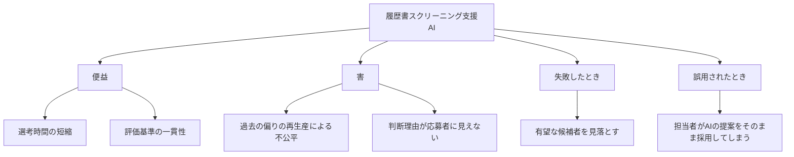

この図は、評価対象を中心に、影響の種類を上から下へ分解した【例】です。

各ノードの意味：
- 便益：選考時間の短縮など、良い影響
- 害：過去データの偏りから生じる不公平など、悪い影響
- 失敗したとき：6.8.3.2に対応する観点
- 誤用されたとき：6.8.3.3に対応する観点

### 10-6. 手順5：対応策と承認（6.9、5.11）

| 影響 | 対応策（【例】） | 確認方法（【提案】） |
|------|-----------------|--------------------|
| 過去の偏りの再生産 | 学習データの偏りを確認し、属性別に結果を比較する | 属性別の合格提案率の差を測る |
| 理由が見えない | 提案の根拠となる項目を担当者に表示する | 表示内容が正しいかをテストする |
| 見落とし | 低スコアの一部を担当者が抜き取り確認する | 抜き取り確認の実施記録を点検する |
| 提案の鵜呑み | 研修と、最終判断は人が行うという運用ルールを設ける | 運用ログで、提案と異なる判断の割合を見る |

承認者は、対応策を条件として「条件付きで受容」と判断します。さらに、再評価の条件として、モデル更新時と、年1回の定期見直しを決めます（5.12）。

📖 この章で登場した用語
- スクリーニング：多数の候補から、基準に合うものを絞り込む作業
- 再生産：過去の偏りが、新しい判断にも引き継がれて繰り返されること
- 抜き取り確認：全数ではなく、一部を選んで確認する方法
- 条件付き受容：対策の実施を条件に、展開を認める判断

---

## 11. QAエンジニアの視点：影響評価をテストと品質活動につなげる

💡 この章では、QAエンジニアが影響評価にどう関われるかを【提案】としてまとめます。規格の要求ではありません。ただし、対応策を実際に効いているかどうか確かめる役割は、QAと相性がよいと考えられます。

### 11-1. なぜQAが関わるのか

影響評価の6.9で「対応策」を決めても、それが実際に機能しているかの確認がなければ、書類だけの対応になります。たとえば、避難経路を図面に描いても、実際に歩いて確認しなければ、非常時に通れるか分かりません。QAの検証は、この「歩いて確認する作業」にあたります。

### 11-2. 影響評価の項目とテスト観点の対応【提案】

| 影響評価の項目 | テスト観点の例 |
|----------------|----------------|
| 公平性 | 属性別に評価データを分けて、精度や判定率の差を測る |
| 一貫性 | 同じ入力に対する結果のばらつきを測る |
| 信頼性（頑健性） | 誤字、欠損、想定外の形式の入力で、挙動を確認する |
| 透明性 | 説明の表示が、実際の判断根拠と一致しているかを確認する |
| 失敗時の影響（6.8.3.2） | 障害や誤出力を意図的に起こし、人による回復手順が働くか確認する |
| 誤用（6.8.3.3） | 想定外の使われ方を再現し、制限や警告が働くか確認する |
| 環境 | 推論1回あたりの計算量や消費電力を計測し、傾向を追う |

### 11-3. 評価書とテスト成果物のつなぎ方【提案】

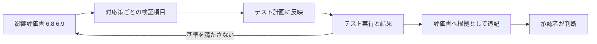

この図は、評価書の対応策をテストに落とし、結果を評価書へ戻す流れを左から右へ示した【提案】です。

各ノードの意味：
- 対応策ごとの検証項目：対策が効いたと言える条件を決める
- テスト計画に反映：既存のテストの仕組みに組み込む
- 基準を満たさない：評価書へ戻り、対応策を見直す

【解説】AIのテストに関する関連規格としては、ISO/IEC TS 42119-2（AIシステムのテスト）などもあります。影響評価の確認項目を、AIのテスト技法と組み合わせると、検証を設計しやすくなります。

📖 この章で登場した用語
- 検証：決めた基準を満たしているか確認すること
- 属性別評価：年齢、性別などのグループごとに結果を分けて比較すること
- 回復手順：失敗が起きたときに、元の状態へ戻す、または被害を抑える手順
- 推論：学習済みモデルで、新しい入力から結果を出す処理

---

## 12. よくある誤解と注意点

💡 この章では、初学者が間違えやすい点を整理します。思い込みをここで直しておくと、実務での手戻りが減ります。

| 誤解 | 実際（確認できる根拠） |
|------|----------------------|
| 42005を守れば認証がもらえる | 【規格】ISO公式は「guidance（指針）」と説明している。認証の対象になるのは42001のようなマネジメントシステム規格 |
| 影響評価はリスク評価の代わりになる | 【解説】42001では別のプロセス。影響評価の結果をリスク評価で考慮する関係（LinkedIn上の実務者の投稿、presencis.comの解説） |
| 影響評価は1回やれば終わり | 【規格】ISO公式は、ライフサイクル全体で行い、必要に応じて更新することを推奨 |
| DPIAがあれば足りる | 【解説】DPIAはプライバシー中心。AIの影響評価は公平性、安全性なども含む |
| 害だけを書けばよい | 【規格】便益と害の両方を扱う（6.8.2、附属書C） |
| 附属書Eのテンプレートをそのまま埋めれば十分 | 【規格】附属書Eは「例」。自組織の状況に合わせて調整する必要がある |
| 大企業だけが対象 | 【規格】ISO公式のFAQは、規模や業種を問わないと説明している |

### 12-1. この規格を使うときの限界

| 限界 | 説明 |
|------|------|
| 法令の要求を満たす保証ではない | 規格は法律ではない。各国の法令の要求は別に確認が必要 |
| 評価の質は運用次第 | テンプレートを埋めても、洗い出しの質が低ければ意味が薄い |
| 参考情報（附属書）は選べる | 附属書は informative で、組織が状況に応じて活用する |

📖 この章で登場した用語
- 認証：第三者機関が、規格の要求を満たしていると確認すること
- マネジメントシステム認証：組織の運用の仕組みを対象にした認証（例：ISO/IEC 42001）

---

## 13. 学習の確認と導入チェックリスト

💡 この章では、理解の確認と、組織で導入するときの確認項目をまとめます。

### 13-1. 理解度チェック

| 番号 | 質問 | 確認する章 |
|------|------|-----------|
| 1 | 42005は、要求事項を並べた認証用の規格か、指針か | 第1章 |
| 2 | リスク評価と影響評価は、それぞれどちらの方向を見るか | 第3章 |
| 3 | 規格の本体の2つの柱は何か | 第4章 |
| 4 | 評価はいつ行うのが望ましいか | 第5章 |
| 5 | 「意図されていない用途」を書く理由は何か | 第6章 |
| 6 | 6.8.3は何を扱うか | 第6章 |
| 7 | 42001の6.1.4と8.4は、それぞれ何をするか | 第8章 |
| 8 | 附属書Eは、必ず従う書式か | 第9章 |

### 13-2. 導入チェックリスト【提案】

- [ ] 影響評価の手順書を作成した（5.2）
- [ ] 既存のリスク管理、開発、変更管理のプロセスとつないだ（5.3）
- [ ] 評価を始めるタイミングと再評価の条件を決めた（5.4、5.12）
- [ ] 評価の範囲の決め方を定めた（5.5）
- [ ] 作成、レビュー、承認の役割を割り当てた（5.6、5.11）
- [ ] 慎重な扱いが必要な用途と制限する用途を定義した（5.7）
- [ ] 影響の尺度（段階の基準）を決めた（5.7）
- [ ] 評価書の記録項目を決めた（第6章、附属書E）
- [ ] 便益と害の分類の観点を決めた（6.8.2、附属書C）
- [ ] 失敗と誤用のシナリオを洗い出す方法を決めた（6.8.3）
- [ ] 対応策の効果を確認する方法を決めた（6.9）
- [ ] 42001やEU AI Actなど、関連する枠組みとの対応を整理した（附属書A、B、D）
- [ ] 正規版の規格を入手して、条文を確認した

---

## 14. 情報の確からしさと調査の限界

💡 この章では、本ガイドの根拠の強さと限界を正直に示します。

| 項目 | 内容 |
|------|------|
| 規格本文 | 有償のため直接確認していない。ISOの著作権表記もあり、本文の転載は行っていない |
| 確認できた一次情報 | ISO公式ページ（概要、FAQ、ライフサイクル、基本情報）、ANSI公開プレビュー（目次、序文） |
| 二次情報 | BSI、オーストラリア規格のストア紹介文、INCITSのニュース、法律事務所CMSの解説、実務者の投稿、学術論文 |
| 各条の中身の記述 | 目次タイトルと公開紹介文からの読み取りに、一般的な実務知識を加えたもの |
| 著名な国際的開発者の投稿 | 検索で確認できた範囲は、標準化団体（INCITS、ANSI、BSI）、法律事務所、AIガバナンスの実務者が中心だった。ソフトウェア開発者個人による詳細な解説は、今回の検索では見つからなかった |
| 情報の日付 | 2026年10月8日時点で検索できた範囲 |
| ベンダー解説の扱い | コンプライアンス関連の企業ブログ（tcsa.in、konfirmity.com、presencis.comなど）には、EU AI Actの適用日に関して、互いに異なる記述がある。本ガイドでは日付を断定せず、公式情報での確認を勧めている |

---

## 15. 参考URL（根拠となるソース）

### 15-1. 一次情報（規格発行元・公開プレビュー）

| 番号 | 内容 | URL |
|------|------|-----|
| 1 | ISO公式ページ（概要、FAQ、ライフサイクル、基本情報） | <https://www.iso.org/standard/42005> |
| 2 | ANSI Webstore 公開プレビューPDF（目次、序文） | <https://webstore.ansi.org/preview-pages/ISO/preview_ISO+IEC+42005-2025.pdf> |

### 15-2. 標準化団体・規格ストア

| 番号 | 内容 | URL |
|------|------|-----|
| 3 | BSI Knowledge（BS ISO/IEC 42005:2025 の概要） | <https://knowledge.bsigroup.com/products/information-technology-artificial-intelligence-ai-ai-system-impact-assessment> |
| 4 | Standards Australia（AS ISO/IEC 42005:2025 の目次） | <https://store.standards.org.au/product/as-iso-iec-42005-2025> |
| 5 | INCITS 動画シリーズ「Mastering AI Impact Assessments with ISO/IEC 42005」 | <https://www.incits.org/news-events/-/incits-youtube-video-series-mastering-ai-impact-assessments-with-isoiec-42005> |
| 6 | ANSI Member Updates（INCITSの動画シリーズ告知、2025年9月19日） | <https://www.ansi.org/standards-news/member-updates/9-19-25-incits-launches-youtube-video-series> |

### 15-3. 実務者・専門家による解説

| 番号 | 内容 | URL |
|------|------|-----|
| 7 | LinkedIn上の実務者の投稿（プロフィール名 kevinchancw）「PUBLISHED: ISO 42005:2025」（2025年5月28日） | <https://my.linkedin.com/in/kevinchancw> |
| 8 | CMS（法律事務所）「ISO/IEC 42005:2025 – A New Blueprint for Legal and Commercial Leaders」 | <https://cms.law/en/gbr/legal-updates/iso-iec-42005-2025-a-new-blueprint-for-legal-and-commercial-leaders-navigating-ai-risk-and-governance> |
| 9 | AI Governance Library Newsletter（ISO 42005の紹介） | <https://www.aigl.blog/ai-governance-library-newsletter-5-iso-what-you-did-there/> |
| 10 | regulations.ai の規制解説ページ | <https://regulations.ai/regulations/RAI-XS-GO-ITAIAXX-2025> |

### 15-4. 関連規格との関係を扱う解説（ベンダー・コンサルティング）

| 番号 | 内容 | URL |
|------|------|-----|
| 11 | TCSA「AI Risk vs AI Impact Assessment」 | <https://www.tcsa.in/learn/ai-risk-vs-impact-assessment> |
| 12 | Presencis「ISO 42001 Article 6.1」 | <https://presencis.com/regulations/iso-42001/article-6.1/> |
| 13 | Konfirmity「ISO 42001 Requirements」 | <https://www.konfirmity.com/blog/iso-42001-requirements> |

### 15-5. 学術研究

| 番号 | 内容 | URL |
|------|------|-----|
| 14 | arXiv「Co-designing an AI Impact Assessment Report Template with AI Practitioners and AI Compliance Experts」 | <https://arxiv.org/pdf/2407.17374> |

### 15-6. 本ガイドの根拠の対応表

| 本ガイドの章 | 主な根拠（上の番号） |
|-------------|---------------------|
| 第1章 基本情報 | 1 |
| 第2章 背景 | 1、2（序文） |
| 第3章 位置づけ | 1、2、8、11、12 |
| 第4章 構成 | 2、4、7 |
| 第5章 プロセス | 1、2、8 |
| 第6章 文書化 | 2、4 |
| 第7章 分類 | 3、4、10、14 |
| 第8章 他規格との連携 | 1、4、7、12、13 |
| 第9章 テンプレート | 4、7 |
| 第10章から第11章 | 筆者の例と提案（規格や出典に基づくものではない） |
| 第12章 誤解 | 1、7、12 |

---

*本ガイドは、公開情報をもとに作成した学習用の解説です。ISO/IEC 42005:2025 の正式な内容は、正規版の規格で確認してください。法令対応や認証の判断は、専門家と最新の公式情報に基づいて行ってください。*
