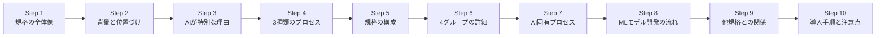
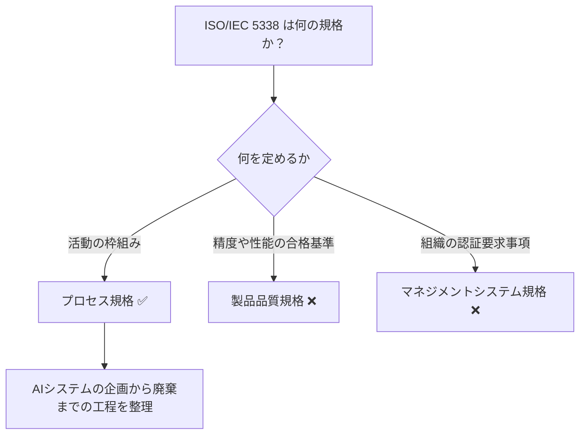
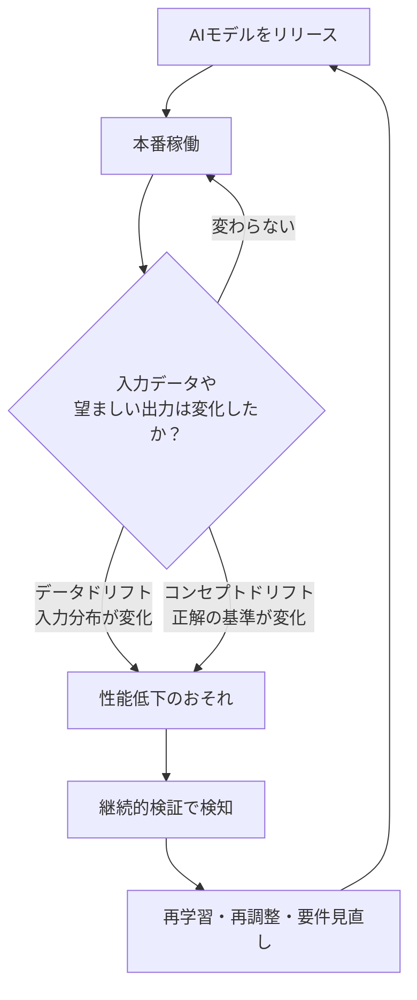
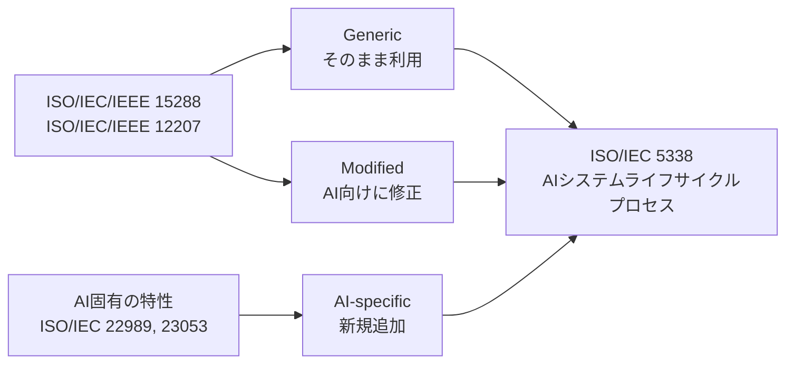
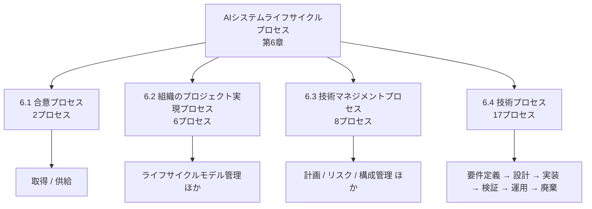
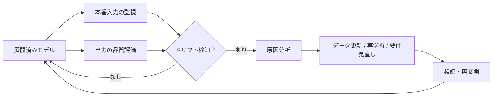
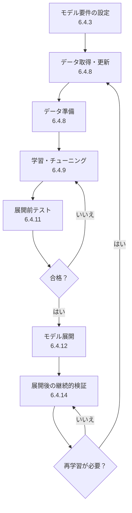
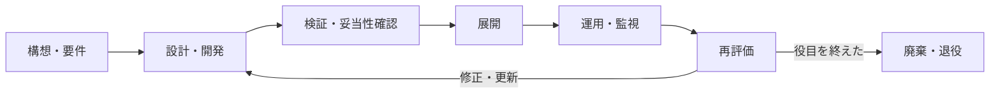
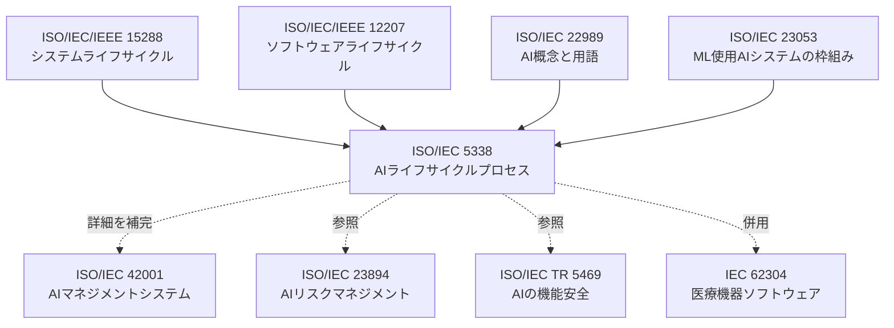
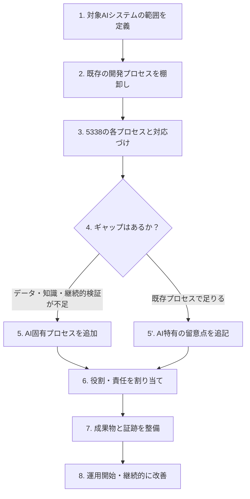

# ISO/IEC 5338:2023 初学者向け完全ガイド
## AIシステムライフサイクルプロセスをステップバイステップで理解する

> 対象規格：**ISO/IEC 5338:2023** *Information technology — Artificial intelligence — AI system life cycle processes*
> 公式ページ：https://www.iso.org/standard/81118.html
> 情報の基準日：2026年10月8日
> 想定読者：AI/MLの開発・QA・運用に関わる初学者〜中級者

---

## 0. このガイドの使い方

| 項目 | 内容 |
|---|---|
| 目的 | ISO/IEC 5338 が「何を」「なぜ」「どう」定めているかを、順を追って理解する |
| 進め方 | Step 1 → Step 10 の順に読む。各 Step は独立しても読める |
| 表記ルール | 図解は Mermaid（フローチャート）と Markdown 表のみ使用 |
| 注意 | 規格本文は有料かつ著作権保護のため、本書は公開情報（ISO公式ページ・FDISプレビュー・専門家の解説）に基づく**要約と解説**です。適合性判断・監査対応には必ず正式な規格本文を参照してください |

### 全体ロードマップ

---

## Step 1. 規格の全体像をつかむ

### 1-1. 一言でいうと

**ISO/IEC 5338:2023 は、「AIシステムを企画してから廃棄するまで」の工程（プロセス）を、既存のシステム・ソフトウェア工学の標準に AI 特有の観点を足して整理した国際規格**です。

### 1-2. 基本情報（ISO公式ページより）

| 項目 | 内容 |
|---|---|
| 規格番号 | ISO/IEC 5338:2023 |
| タイトル | AI system life cycle processes（AIシステムライフサイクルプロセス） |
| 発行 | 2023年12月（第1版） |
| ステータス | Published（ステージ 60.60：国際規格として発行済み） |
| 担当委員会 | ISO/IEC JTC 1/SC 42（Artificial intelligence） |
| ページ数 | 39ページ |
| ICS | 35.020（情報技術一般） |
| 言語 | 英語のみ |
| 価格（公式ストア） | CHF 181（PDF + ePub / 変動の可能性あり） |

### 1-3. 対象範囲（Scope）の要点

- **機械学習（ML）システム**と**ヒューリスティック（ルール・知識ベース）システム**の両方が対象
- 土台となる規格は **ISO/IEC/IEEE 15288（システム）** と **ISO/IEC/IEEE 12207（ソフトウェア）**
- AI固有のプロセスは **ISO/IEC 22989** と **ISO/IEC 23053** から取り入れている
- AIシステムの中に「普通のソフトウェア」部分がある場合、その部分には 12207 / 15288 をそのまま使える
- 組織内・プロジェクト内で、AIシステムを**開発するとき**にも**調達するとき**にも使える

### 1-4. 「プロセス規格」であることが重要

この規格は「このAIモデルは精度○○%以上であること」のような**成果物の品質基準を決める規格ではありません**。
「どんな活動を、どんな順序・観点で行えば、AIシステムを適切に作り・運用できるか」という**活動の枠組み**を提供します。

---

## Step 2. なぜ作られたのか：背景と位置づけ

### 2-1. 背景（Introduction の趣旨）

- 画像認識、自然言語処理、不正検知、自動運転、予知保全など、AIシステムは大きな成功を収めている
- それらを構築・維持するには、**従来のソフトウェアのライフサイクルプロセスを AI 向けに拡張する**のが効率的
- 12207 や 15288 は AI にも広く使えるが、**新しいプロセスの追加と既存プロセスの修正が必要**
- 具体例：本番データが変化したため、**新しい学習データでモデルを再学習する必要が出る**といった AI 特有の事情

### 2-2. 既存の取り組みを活かす狙い

| 狙い | 説明 |
|---|---|
| 効率の向上 | 既存のソフトウェア工学の知見をそのまま活かせる |
| AI導入の促進 | 従来の開発プロセスに AI を統合しやすくなる |
| 相互理解 | AI関係者（22989で定義されたステークホルダー）の共通言語になる |
| 現実への対応 | AIシステムは「AI固有部分」＋「従来のコード・DB」の組み合わせであることを前提にしている |

### 2-3. 安全重要システムについて

医療や交通制御のように安全に関わる分野では、特別な配慮が必要です。規格の序文は、そうしたシステムについて **ISO/IEC TR 5469**（AIの機能安全）を参照するよう案内しています。また、医療機器分野の **IEC 62304** のようにドメイン固有のライフサイクル規格がある場合は、5338 の AI 観点と併せて検討することが勧められています。

### 2-4. 規格の主導者について

規格の執筆グループのリーダー（主著者）を務めた **Rob van der Veer 氏**（Software Improvement Group の Chief AI Officer、OWASP AI Exchange の創設者）は、各種の公開プロフィールで 5338 の主著者と紹介されています。同氏は AI セキュリティ規格（ISO/IEC 27090 など）や EU AI Act 関連の標準化にも関わっており、5338 は「AI を特別扱いしすぎず、ソフトウェア工学の延長として扱う」という思想を持つ規格といえます。

---

## Step 3. AIシステムはなぜ「特別扱い」が必要なのか

規格は、AIシステムが従来システムと**ライフサイクルの観点で異なる**ポイントを 8 つ挙げています（以下は要約です）。

| # | 特徴（英語名） | 日本語での意味 | 現場での具体例 |
|---|---|---|---|
| 1 | Measurable potential decay | 劣化が計測できる | 本番データの傾向が変わる（データドリフト）、望ましい出力が変わる（コンセプトドリフト）。入出力を検証して初めて気づける |
| 2 | Potentially autonomous | 自律的になりうる | 判断の自動化・高速化により、公平性・安全性・プライバシー・説明責任などへの配慮が増す |
| 3 | Iterative in requirements | 要件が反復的 | プロトタイプを見せて要件を磨く。運用で想定外の状況が出て要件が進化する |
| 4 | Probabilistic | 確率的 | MLの判断は常に正しいとは限らない。正しさを形式的に保証するのには限界がある |
| 5 | Reliant on data | データ依存 | 振る舞いはプログラムではなくデータから学習される。データ品質が決定的に重要 |
| 6 | Knowledge intensive | 知識集約的 | ヒューリスティックモデルでは、知識獲得の良し悪しがそのまま正しさを決める |
| 7 | Novel | 新規性が高い | 新しいスキルが必要。ユーザーも不慣れで、過信や過度な期待、逆に不信感が生じやすい |
| 8 | Incomprehensible | 理解しにくい | 振る舞いが「創発的」で、予測可能性・説明可能性・透明性が下がり、信頼が揺らぎやすい |

### 3-1. 特に重要な2つ：ドリフトとデータ依存

> 💡 **初学者向けポイント**
> 従来のソフトウェアは「コードを変えない限り挙動は変わらない」のが基本でした。AI は**コードが同じでも、世界が変われば性能が劣化する**点が最大の違いです。

---

## Step 4. 3種類のプロセス：Generic / Modified / AI-specific

5338 のプロセスは、**12207/15288 との関係**で次の3種類に分類されます。

| 種類 | 意味 | 初学者向けのたとえ |
|---|---|---|
| **Generic（汎用）** | 15288/12207 と**同一**のプロセス | 既存のレシピをそのまま使う |
| **Modified（修正）** | 15288/12207 の要素を**追加・変更・削除**したもの。各節に「AI-specific particularities（AI特有の留意点）」の小節がある | 既存のレシピに AI 用の注意書きを足す |
| **AI-specific（AI固有）** | 15288/12207 に直接対応するものがない、AI 特有のプロセス | 新しいレシピを追加する |

### 4-1. この設計の意味

Rob van der Veer 氏の解説によれば、5338 は 12207 に沿ったソフトウェアライフサイクルの全プロセスについて、**AI特有の「注意点（AI particularities）」を示す**構成です。12207 を使っていない組織でも、**AIのための注意点チェックリスト**として使えるとも説明されています。

---

## Step 5. 規格の構成（目次）を把握する

規格本文の構成は次のとおりです（FDISプレビューの目次に基づく）。

| 箇条 | タイトル | 内容 |
|---|---|---|
| 1 | Scope | 適用範囲 |
| 2 | Normative references | 引用規格（15288, 12207, 22989, 23053） |
| 3 | Terms and definitions | 用語定義（例：knowledge acquisition） |
| 4 | Abbreviated terms | 略語（AI, ML） |
| 5 | Key concepts | 基本概念（3種類のプロセス、AIの特徴、ライフサイクルモデル、適合性） |
| 6 | AI system life cycle processes | **本体：プロセスの詳細（6.1〜6.4）** |
| Annex A | Observations based on use cases in ISO/IEC TR 24030 | ユースケースに基づく所見（参考） |
| Bibliography | 参考文献 | — |

### 5-1. 第5章の中身

| 節 | 内容 |
|---|---|
| 5.1 General | 3種類のプロセスとAIの8つの特徴 |
| 5.2 AI system concepts | モデルには ML モデルとヒューリスティックモデルがあり、**データと知識の両方が必須** |
| 5.3 AI system life cycle model | 特定のライフサイクルを**規定しない**。AI固有プロセスが生じうる場所を示す |
| 5.4 Process concepts | プロセスの基準、記述方法、適合性（Conformance） |

> 📌 **重要**：規格は「ウォーターフォールで進めよ」「アジャイルで進めよ」といった**特定のライフサイクルを強制しません**。各ステージは繰り返されうる（例：再評価ステージで開発と展開を何度も繰り返す）ことが前提です。

---

## Step 6. 第6章：4つのプロセスグループを理解する

第6章は、プロセスを**4つのグループ**に分けて説明します。全体で **合計 33 プロセス**（2 + 6 + 8 + 17）が定義されています。

### 6-1. 【6.1】Agreement processes（合意プロセス）

| 番号 | プロセス | 役割 |
|---|---|---|
| 6.1.1 | Acquisition（取得） | AIシステム・データ・モデルなどを**調達する側**の活動 |
| 6.1.2 | Supply（供給） | 取得者に対して**提供する側**の活動 |

> 💡 規格は、AIライフサイクルの一部（データやMLモデル、コードなど）が**別の組織**によって所有・管理される可能性を前提にし、サプライチェーン上のリスクにも配慮したプロセスにしています。

### 6-2. 【6.2】Organizational project-enabling processes（組織のプロジェクト実現プロセス）

| 番号 | プロセス | 初学者向けの要点 |
|---|---|---|
| 6.2.1 | Life cycle model management | 組織が使うライフサイクルモデルを定め、維持する |
| 6.2.2 | Infrastructure management | 開発・学習・運用の基盤（オンプレ/クラウド/ハイブリッド）を整える |
| 6.2.3 | Portfolio management | 複数のAI案件への投資・優先順位を管理する |
| 6.2.4 | Human resource management | データサイエンティストなど AI 特有の人材・スキルを確保する |
| 6.2.5 | Quality management | 組織としての品質方針・目標を管理する |
| 6.2.6 | Knowledge management | ヒューリスティックでも ML でも重要な**知識の蓄積・共有** |

### 6-3. 【6.3】Technical management processes（技術マネジメントプロセス）

| 番号 | プロセス | 初学者向けの要点 |
|---|---|---|
| 6.3.1 | Project planning | 計画に**継続的検証の準備**など AI 特有事項を織り込む |
| 6.3.2 | Project assessment and control | 進捗・品質を評価し、必要なら是正する |
| 6.3.3 | Decision management | 意思決定の根拠と記録を管理する |
| 6.3.4 | Risk management | AI 固有のリスクを扱う（詳細は ISO/IEC 23894 を参照） |
| 6.3.5 | Configuration management | **コード・データ・モデル**のバージョンと構成を管理する |
| 6.3.6 | Information management | 情報（データ・文書）のライフサイクルを管理する |
| 6.3.7 | Measurement | 指標を定義・収集して判断に使う |
| 6.3.8 | Quality assurance | 品質保証活動（プロセスと成果物の両面） |

### 6-4. 【6.4】Technical processes（技術プロセス：17個）

これが規格の中心です。設計から廃棄までの流れに沿って並んでいます。

| 番号 | プロセス | 種別の目安 | 要点 |
|---|---|---|---|
| 6.4.1 | Business or mission analysis | Modified | 事業課題の分析。AIで解くべき問題か？ |
| 6.4.2 | Stakeholder needs and requirements definition | Modified | 利害関係者のニーズ整理 |
| 6.4.3 | System requirements definition | Modified | **モデル要件の設定**を含む |
| 6.4.4 | System architecture definition | Modified | データ・モデル・従来コンポーネントの構成を決める |
| 6.4.5 | Design definition | Modified | 詳細設計 |
| 6.4.6 | System analysis | Modified | 分析・トレードオフ評価 |
| 6.4.7 | **Knowledge acquisition** | **AI-specific** | 知識の収集・精緻化・処理可能な形への変換 |
| 6.4.8 | **AI data engineering** | **AI-specific** | データの取得・更新・準備 |
| 6.4.9 | Implementation | Modified | **モデルの学習・チューニング**を含む |
| 6.4.10 | Integration | Modified | コンポーネントの統合 |
| 6.4.11 | Verification | Modified | **展開前のモデルテスト** |
| 6.4.12 | Transition | Modified | **モデルのデプロイ** |
| 6.4.13 | Validation | Modified | 利用者ニーズを満たすかの妥当性確認 |
| 6.4.14 | **Continuous validation** | **AI-specific** | **展開後**の継続的な検証（ドリフト検知など） |
| 6.4.15 | Operation | Modified | 運用 |
| 6.4.16 | Maintenance | Modified | 保守（再学習を含む） |
| 6.4.17 | Disposal | Modified | 廃棄・退役 |

> ⚠️ 「種別の目安」列は、本書が目次と公開情報から読み取った**整理上の目安**です。各プロセスが Generic / Modified / AI-specific のどれに該当するかの厳密な分類は、規格の図1および第6章本文で確認してください。確実に AI 固有と言えるのは、公開解説でも一致して挙げられている **Knowledge acquisition / AI data engineering / Continuous validation** です。

---

## Step 7. AI固有の3プロセスを深掘りする

### 7-1. Knowledge acquisition（知識獲得）— 6.4.7

| 項目 | 内容 |
|---|---|
| 定義（要約） | 知識を探し・集め・精緻化し、知識ベースシステムが処理できる形に変換するプロセス |
| 重要になる場面 | **ヒューリスティックモデル**（知識が明示的にコード化され、その質が正しさを決める） |
| MLとの関係 | 知識獲得は ML でも重要な構成要素（どのデータを選び、どう準備するかの文脈理解に必要） |
| 担当者像 | ナレッジエンジニアの関与が一般的 |

### 7-2. AI data engineering（AIデータエンジニアリング）— 6.4.8

| 項目 | 内容 |
|---|---|
| 目的 | AIシステムの**学習・テスト・検証・妥当性確認**に必要なデータを用意する |
| 主な活動 | データの**取得と更新**、データの**準備** |
| 重視される観点 | バイアスの低減、安易な一般化の回避、悪意ある第三者によるデータ悪用の防止 |
| 品質面の考え方 | 十分で**代表性のあるデータ**を確保する（データ品質） |

> 💡 **QAエンジニア向けポイント**
> データは「テストの入力」であると同時に「製品の仕様そのもの」です。**データのバージョン管理、出所（プロビナンス）、分割（学習/検証/テスト）の独立性**が、品質保証の最重要ポイントになります。

### 7-3. Continuous validation（継続的検証）— 6.4.14

| 項目 | 内容 |
|---|---|
| 目的 | **展開後**も、AIシステムが期待どおりに振る舞い続けているかを確認する |
| 検出対象 | データドリフト、コンセプトドリフト、技術的な不具合 |
| 適用範囲 | **継続学習（continuous learning）をしていないシステムにも適用**される |
| 位置づけ | 22989 のライフサイクル例では「継続学習の場合のみ」とされていた段階を、5338 では**常に対象**に拡張している |

---

## Step 8. 機械学習モデル開発は、どのプロセスに対応するか

規格は、ML モデル開発の技術的な作業が、ライフサイクルプロセスにどう組み込まれるかを示しています。

| MLの作業 | 対応するプロセス |
|---|---|
| モデルへの要件を決める | System requirements definition（6.4.3） |
| データを取得・更新する | AI data engineering（6.4.8） |
| データを準備する | AI data engineering（6.4.8） |
| モデルを（再）学習・チューニングする | Implementation（6.4.9）と Maintenance（6.4.16） |
| 展開前にモデルをテストする | Verification（6.4.11） |
| モデルを展開する | Transition（6.4.12） |
| 展開後にモデルをテストする | Continuous validation（6.4.14） |

> 📌 **Model Engineering が独立プロセスでない理由**
> SIG の解説によれば、「モデルエンジニアリング」という AI 活動は、ライフサイクルの観点では既存の **Implementation プロセスにうまく収まる**ため、別プロセスとしては立てられていません。

### 8-1. ライフサイクルは直線ではなく反復する

規格は、再評価ステージの中で開発と展開が**何度も繰り返される**ことを例示しています（バグ修正やシステム更新のため）。

---

## Step 9. 他の規格との関係

### 9-1. 関連規格の全体マップ

### 9-2. 役割の違い（比較表）

| 規格 | 主題 | 5338 との違い |
|---|---|---|
| ISO/IEC 22989 | AIの概念・用語 | 5338 の用語・ライフサイクル例の**出典** |
| ISO/IEC 23053 | MLを用いたAIシステムの枠組み | 5338 に AI 固有プロセスを提供 |
| ISO/IEC 42001 | AIマネジメントシステム（認証可能な要求事項） | **組織のガバナンス**を扱う。5338 はそのライフサイクルの**詳細**を補う |
| ISO/IEC 23894 | AIリスクマネジメント | 5338 のリスクマネジメントプロセスから参照される |
| ISO/IEC TR 5469 | AIの機能安全 | 安全重要システムの追加配慮 |
| IEC 62304 | 医療機器ソフトウェアのライフサイクル | 医療AIでは 5338 と**併せて**考慮 |

> 💡 **簡単な覚え方**（SIG の説明の趣旨）
> **42001 は「組織がAIをどう統治するか」、5338 は「チームがAIシステムをどう作り動かすか」。**

### 9-3. 医療・研究分野での活用イメージ

医療・研究領域のAI（診断支援、解析パイプライン等）では、次のように読み替えると理解しやすくなります。

| 5338 のプロセス | 医療・研究AIでの具体例 |
|---|---|
| AI data engineering | 症例データの取得、匿名化、ラベル付け、データセット分割 |
| Verification | 展開前のモデル性能評価（感度・特異度など） |
| Validation | 臨床現場のニーズに合致するかの妥当性確認 |
| Continuous validation | 装置更新や患者集団の変化による性能劣化の監視 |
| Configuration management | 学習データ・モデル・コードの版管理と追跡性 |

> ⚠️ 上記は理解のための**解釈例**です。医療機器として扱う場合は、各国の規制と IEC 62304 等を必ず確認してください。

---

## Step 10. 現場への導入手順と注意点

### 10-1. 導入のステップ

### 10-2. 実務で整備したい項目（チェックリスト）

専門家の解説（SIG、DeepInspect など）を参考に整理したものです。**規格の要求事項そのものではなく、実装の目安**として使ってください。

| 区分 | 確認項目 |
|---|---|
| システム定義 | AIシステムの境界、目的、構成要素、データソース、環境を記録しているか |
| 要件 | テスト可能な要件になっているか。モデル要件は定義されているか |
| データ | データの出所・版・品質を管理しているか |
| 検証 | 展開前の検証計画と合格基準があるか |
| 展開 | 承認された**リリース記録**があるか |
| 運用 | 継続的検証のスケジュールと閾値（しきい値）があるか |
| 是正 | 検証失敗時の是正処置の記録があるか |
| 人材 | データサイエンティスト等の役割と力量が定義されているか |
| 調達 | 外部モデル・データ・サービスの供給者を管理しているか |

### 10-3. よくある誤解

| 誤解 | 実際 |
|---|---|
| 5338 を満たせば AI の品質が保証される | プロセスの枠組みであり、製品の性能・安全性を直接保証しない |
| 5338 の認証を受けられる | 5338 は認証規格ではない（認証可能なAI規格は 42001 側） |
| 特定の開発手法（ウォーターフォール等）が必須 | 特定のライフサイクルは規定されていない |
| MLだけが対象 | **ヒューリスティック（知識ベース）システム**も対象 |
| 展開したら終わり | **継続的検証**が AI 固有の重要プロセス |
| すべてを新規に作る必要がある | 既存の 12207 / 15288 準拠プロセスを**拡張**して使う |

### 10-4. 適合性（Conformance）について

規格は第5.4.3項で適合性の考え方を定めています。実際に「適合」を主張する場合は、**どのプロセスを、どの範囲で採用（テーラリング）したか**を文書化することが重要です。詳細な適合基準は正式な規格本文で確認してください。

---

## 付録A. 用語集

| 用語 | 意味 |
|---|---|
| AI system | AIを用いたシステム（MLまたはヒューリスティック） |
| ML（Machine Learning） | データから振る舞いを学習する手法 |
| Heuristic system | 人間の知識をルール等で明示的に表現したシステム |
| Data drift | 本番入力データの分布が学習時から変化すること |
| Concept drift | 入力と望ましい出力の関係が変化すること |
| Knowledge acquisition | 知識を収集・精緻化し、処理可能な形にすること |
| Continuous validation | 展開後に継続して行う検証 |
| Tailoring | プロジェクトに合わせてプロセスを取捨選択・調整すること |
| Generic / Modified / AI-specific | 5338 のプロセス分類 |

## 付録B. 理解度チェック

1. 5338 が土台にしている 2 つの規格は何か？
2. 5338 の 3 種類のプロセスを挙げ、違いを説明せよ。
3. AI 固有プロセスとして公開解説で共通して挙げられる 3 つは何か？
4. Continuous validation は継続学習をしないシステムにも必要か？ その理由は？
5. 42001 と 5338 の役割の違いを一言で述べよ。

解答例

1. ISO/IEC/IEEE 15288 と ISO/IEC/IEEE 12207
2. Generic（同一）、Modified（修正・AI留意点付き）、AI-specific（AI固有の新規）
3. Knowledge acquisition、AI data engineering、Continuous validation
4. 必要。データドリフト・コンセプトドリフト・技術的不具合の検知のため
5. 42001 は組織のAIガバナンス、5338 はAIシステムを作り動かす工程の枠組み

---

## 付録C. 参考ソース一覧（2026年10月8日時点で確認）

### C-1. 一次情報（規格発行元）

| 資料 | URL |
|---|---|
| ISO 公式（規格ページ） | https://www.iso.org/standard/81118.html |
| IEC Webstore | https://webstore.iec.ch/publication/90754 |
| ISO/IEC JTC 1/SC 42（担当委員会） | https://www.iso.org/committee/6794475.html |
| FDIS サンプルPDF（目次・第1〜5章冒頭・序文。iTeh 提供のプレビュー） | https://cdn.standards.iteh.ai/samples/81118/2888212ff5e84fe68c9568156e239fcb/ISO-IEC-FDIS-5338.pdf |
| iTeh 規格カタログページ | https://standards.iteh.ai/catalog/standards/iso/955b109e-c052-4019-9568-653f3e02870a/iso-iec-5338-2023 |

### C-2. 国際的に著名な専門家・実務家による解説

| 資料 | 著者・発信元 | URL |
|---|---|---|
| ISO/IEC 5338: Get to know the global standard on AI systems | Rob van der Veer（規格の主著者・SIG Chief AI Officer） | https://www.softwareimprovementgroup.com/iso-5338-get-to-know-the-global-standard-on-ai-systems/ |
| ISO 5338 AI systems standard | Software Improvement Group | https://www.softwareimprovementgroup.com/blog/iso-5338-get-to-know-the-global-standard-on-ai-systems/ |
| ISO standards for AI: what to use and how to comply | Software Improvement Group | https://www.softwareimprovementgroup.com/blog/iso-standards-for-ai/ |
| OWASP AI Exchange（AIセキュリティの国際的ガイド） | OWASP Foundation（創設者：Rob van der Veer） | https://owaspai.org/ ／ https://owasp.org/www-project-ai-exchange/ |
| Rob van der Veer 氏のプロフィール | SANS Institute | https://sans.org/profiles/rob-van-der-veer |
| Rob van der Veer 氏のインタビュー記事 | Escape | https://escape.tech/blog/ai-security-how-hard-is-it-to-develop-secure-ai/ |
| Embracing Security in AI: Unpacking the New ISO/IEC 5338 Standard | Pillar Security | https://www.pillar.security/blog/embracing-security-in-ai-unpacking-the-new-iso-iec-5338-standard |

### C-3. その他の解説・チェックリスト

| 資料 | URL |
|---|---|
| ISO/IEC 5338 AI Compliance Checklist for Lifecycle Controls（DeepInspect） | https://www.deepinspect.ai/blog/iso-5338-ai-compliance-checklist |
| AI System Lifecycle Processes – ISO/IEC 5338（SRES） | https://sres.ai/responsible-ai/ai-system-lifecycle-processes-iso-iec-5338/ |
| ISO AI System Life Cycle Processes（regulations.ai） | https://regulations.ai/regulations/RAI-XS-GO-PROCESS-2023 |
| ISO/IEC 5338:2023 フレームワーク解説（AI Security and Safety） | https://aisecurityandsafety.org/en/frameworks/iso-iec-5338/ |
| カナダ規格評議会（SCC）規格データベース | https://scc-ccn.ca/standardsdb/standards/8185325 |

### C-4. 情報の信頼性に関する注記

- **規格本文は有料**であり、本書は**公開されている要約・目次・序文・第5章冒頭**と、専門家の解説をもとに構成しています。
- 第6章の各プロセス内部の要求事項（目的・成果・活動の詳細、AI-specific particularities の個別内容）は、**正式な規格本文で必ず確認**してください。
- Step 6-4 の「種別の目安」、Step 9-3 の医療・研究AIの対応例、Step 10-2 のチェックリストは、本書による**整理・解釈**であり、規格の要求事項そのものではありません。
- ISO 公式ページの情報（価格・ステータス等）は変動する可能性があります。最新情報は公式ページをご確認ください。
- 参照した各ページの内容は、著作権に配慮して**要約・言い換え**で記載しています。

---

*最終更新：2026年10月8日時点の公開情報に基づく*
