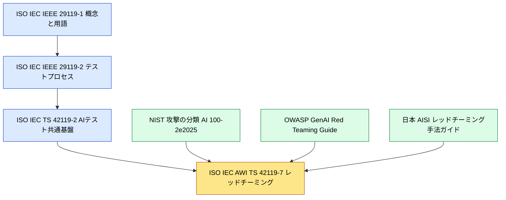
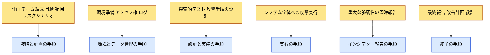
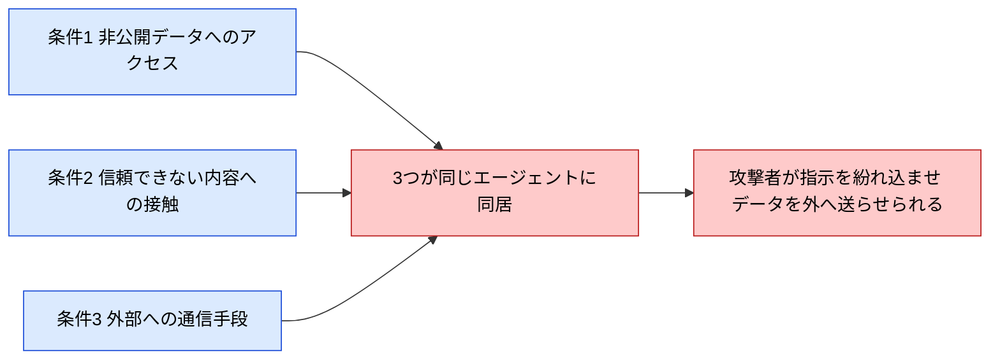
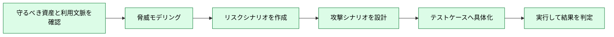
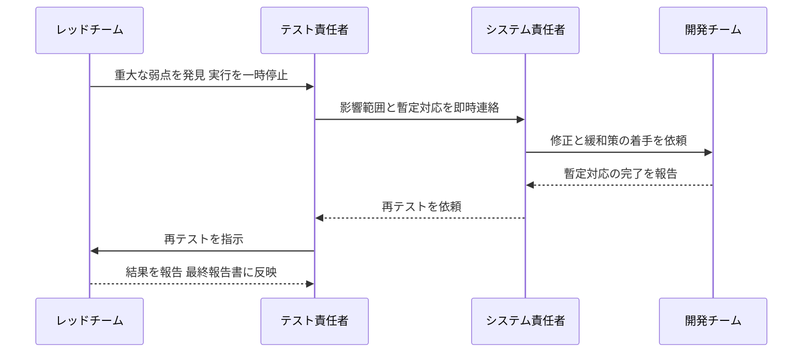
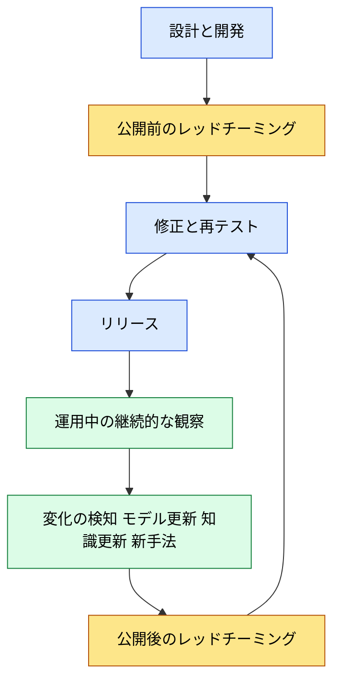

# ISO/IEC AWI TS 42119-7 初学者向け解説ガイド

## AIシステムのテスト 第7部：レッドチーミング（Red teaming）

| 項目 | 内容 |
|------|------|
| 対象規格 | ISO/IEC AWI TS 42119-7（Artificial intelligence — Testing of AI — Part 7: Red teaming） |
| 想定読者 | AI・ソフトウェアのテストを初めて学ぶ方、QAエンジニア、AIシステムの開発者 |
| 情報の確認時点 | 2026年10月4日 |
| ISO公式ページ | <https://www.iso.org/standard/91240.html> |
| 読み方 | Step 1 から順に読むと、用語 → 進め方 → 測り方 → 報告 → 運用という流れで理解できます |

---

## 0. 先に読んでください：この文書の情報の信頼度

💡 この章では、この文書に書かれている情報が「どこまで確かか」を4段階に分けて示します。規格はまだ開発中のため、この区別を知っておくと、後の章の読み方が変わります。

ISO/IEC AWI TS 42119-7 は **開発の初期段階にある文書** です。規格本文は公開されておらず、一般の人が全文を読むことはできません。そのため、この文書では「規格がこう定めている」と断定できる範囲を、ISO公式ページに書かれた内容だけに限定しています。

| 記号 | 区分 | 意味 | 主な出どころ |
|:----:|------|------|-------------|
| 🟢 | 公式情報 | ISOなどの公式ページに書かれている事実 | ISO公式ページ、DIN（ドイツ規格協会）の案件ページ |
| 🟡 | 二次情報 | 作業中のドラフトを第三者が紹介した内容。最終版で変わる可能性がある | ETRI（韓国電子通信研究院）の2026年6月の論文 |
| 🔵 | 実務知見 | 規格ではないが、現場で広く参照されているガイドや報告 | OWASP、日本のAISI、Microsoft AI Red Team、Simon Willison氏の記事 |
| ⚪ | 筆者の解説 | 理解を助けるための例え話、整理、推測 | この文書の筆者 |

> 本文の見出しや表には、必要に応じてこの記号を付けています。⚪ が付いた内容は、公式の主張ではなく解説です。

📖 このセクションで登場した用語

- AWI（Approved Work Item）：承認済み作業項目。規格づくりの最初期に、作業開始が正式に認められた状態
- TS（Technical Specification）：技術仕様書。国際規格（IS）より前の段階や、合意がまだ固まりきらない分野で出される文書の種類

- ドラフト：規格の草案。審議のたびに内容が書き換わる
- ETRI：韓国電子通信研究院。この文書では、ドラフトを紹介した論文の発行元として登場する

---

## 1. 3分でつかむ全体像

💡 この章では、レッドチーミングと本規格の目的を、専門用語をできるだけ使わずに説明します。

### 1-1. 一言でいうと

🟢 公式ページによると、この文書は **「AIシステムに対するレッドチーミング評価の進め方を、特定の技術に依存しない形で示す指針」** です。すべての種類のAIシステムのテストに適用できる、とされています。

### 1-2. 例え話：建物の防犯診断 ⚪

建物の防犯診断を思い浮かべてください。管理者が「うちの鍵は丈夫だ」と考えていても、実際に泥棒役の専門家を雇って侵入を試してもらうと、窓の鍵が閉め忘れやすい位置にあるなど、思いがけない弱点が見つかります。専門家は、侵入できた経路を報告書にまとめ、管理者はそれを見て鍵や運用を直します。

AIのレッドチーミングは、この「泥棒役による診断」のAI版です。違いは、AIでは「侵入」が **「だまして想定外の動作をさせる」「隠すべき情報を出させる」「許可されていない操作をさせる」** といった形をとる点です。

### 1-3. この規格が扱う5つのテーマ 🟢

ISO公式ページの概要（Abstract）には、次の5項目が書かれています。この文書の各章は、これに対応させています。

| 公式概要の項目（意訳） | この文書の章 |
|------|------|
| ① AIの文脈でのレッドチーミングに固有の定義と用語 | Step 1（第4章） |
| ② リスク、適用範囲、目的、攻撃ベクトルの特定 | Step 3（第6章） |
| ③ ISO/IEC 29119 のプロセスに沿った、計画と実行の方法論 | Step 2（第5章）、Step 4（第7章） |
| ④ 発見事項の文書化と報告の手順 | Step 6（第9章） |
| ⑤ AIシステムのライフサイクルへの組み込みの推奨事項 | Step 7（第10章） |

加えて、近年の実務で重要性が増している測定の考え方（Step 5）とエージェント型AI（Step 8）も、関連する資料を使って解説します。

### 1-4. なぜ今この規格が必要なのか ⚪

AIは、質問に答えるだけの道具から、外部のツールを呼び出し、社内データを調べ、複数の手順を自分で実行する存在へと広がっています。ETRIの論文は、こうした変化によって、従来のテスト方法だけでは検証しきれなくなっている点を指摘しています🟡。理由は次のとおりです。

- 同じ入力でも出力が毎回変わりうる（これを **非決定性** と呼びます）

- 学習データの中身が外から見えにくい
- 実際の業務環境と結びついて初めて表に出る不具合がある

こうした背景から、「攻撃者の視点でわざと壊しにいく」レッドチーミングを、場当たりの実験ではなく **手順の整ったテスト活動** として標準化しようとする動きが出てきました。本規格はその流れの中にあります。

📖 このセクションで登場した用語

- レッドチーミング：守る側とは別の立場（攻撃者役）から、システムの弱点を探す活動
- 攻撃ベクトル：攻撃が入り込む経路や手段のこと

- 非決定性：同じ入力でも毎回同じ結果になるとは限らない性質
- ライフサイクル：企画から開発、運用、終了までの一連の期間

---

## 2. 規格の基本情報とステータス（Step 0）

💡 この章では、規格の正式名称、開発の進み具合、担当組織を整理します。「今どこまで進んでいるのか」を正しく把握することが目的です。

### 2-1. 基本情報 🟢

| 項目 | 内容 |
|------|------|
| 正式名称 | Artificial intelligence — Testing of AI — Part 7: Red teaming |
| 文書の種類 | Technical Specification（TS：技術仕様書） |
| 版 | Edition 1（第1版） |
| 現在のステータス | Under development（開発中）、ステージ 20.00 |
| 担当委員会 | ISO/IEC JTC 1/SC 42（人工知能の分野を担当する委員会） |
| 補足 | ISO公式ページには「作業部会がドラフトを準備した」と記載されています |

### 2-2. 日付の経緯 🟢

| ステージ | 日付 | 意味 |
|----------|------|------|
| 10.99 | 2025-04-15 | 新規プロジェクトの承認 |
| 20.00 | 2025-04-15 | 委員会の作業計画に新規プロジェクトとして登録（**現在の表示**） |

DIN（ドイツ規格協会）の案件ページには、国際側の担当が **ISO/IEC JTC 1/SC 42/JWG 2** と書かれています🟢。JWG（Joint Working Group）とは、SC 42 と SC 7（ソフトウェア工学の委員会）が共同で運営する作業部会のことで、DINのドイツ語ページでは「AIベースシステムのテスト」を扱うグループと説明されています。

### 2-3. ステージの全体像

この図は、ISOの規格づくりの段階を、ISO公式ページに載っているステージ名に沿って並べたものです。左から右へ読み進めてください。色のついたノードが現在地です。

各ノードの意味：

- 「10.99 新規プロジェクト承認」：この作業を始めてよいと正式に認められた
- 「20.00 作業計画に登録」：委員会の作業リストに載った。**ISO公式ページが示す現在地**

- 「20.20 〜 20.99」：作業原案（WD）を議論し、コメントを集め、委員会原案へ進めてよいか決める準備段階
- 「30.00 〜 30.99」：委員会原案（CD）として各国が審議する段階

- 「50.00」：最終テキストが提出され、正式承認に進む段階
- 「60.60」：国際的な文書として発行される。**ここに到達して初めて「公開された規格」になります**

### 2-4. ステージ表示の読み方に関する注意

ISO公式ページの表示は、2025年4月の登録時点のまま（20.00）です🟢。一方、ETRIの2026年6月の論文は「2026年のワーキングドラフト」を参照して内容を紹介しています🟡。つまり、**公式ページの表示より実際の作業は先に進んでいる可能性があります** ⚪。ステージ表示は、作業が節目を超えたときに更新されるため、日々の議論の進み具合とは必ずしも一致しません。

> 💡 実務上の意味：現時点では「規格に準拠している」と主張することはできません。ここで学ぶ内容は、「将来の標準化の方向性を先取りして、レッドチーミングを手順立てて行う」ために使ってください。

📖 このセクションで登場した用語

- ステージ：ISOが規格づくりの進み具合を数字で表す区分
- WD（Working Draft）：作業原案。委員会に出す前の、作業部会の草案

- CD（Committee Draft）：委員会原案。各国の代表が審議する段階の草案
- SC 42：ISOとIECの合同技術委員会（JTC 1）の下にある、人工知能担当の分科委員会

- JWG：複数の委員会が共同で運営する作業部会

---

## 3. 規格ファミリー内での位置づけ

💡 この章では、本規格が他のどの規格と関係するのかを整理します。ここを理解すると、「なぜ29119の考え方で進めるのか」が分かります。

### 3-1. 関連する規格 🟢🟡

| 規格 | 位置づけ | 本規格との関係 |
|------|----------|----------------|
| ISO/IEC/IEEE 29119-1 | ソフトウェアテストの一般概念と定義 | テスト目的、テストケース、期待結果、テストオラクルなどの基本用語の土台🟡 |
| ISO/IEC/IEEE 29119-2 | ソフトウェアテストのプロセス | 計画、設計、実行、報告、終了などの手順の骨格。本規格が整合させる対象🟢 |
| ISO/IEC TS 42119-2:2025 | AIシステムのテスト概要 | AIのライフサイクルとリスクに基づくテストの共通基盤🟡 |
| ISO/IEC AWI TS 42119-7 | AIのレッドチーミング | **この文書の主題** |
| ISO/IEC 29147 | 脆弱性の開示 | 見つかった弱点を外部に知らせる手順の考え方。報告の章で関連🟡 |
| ISO/IEC 20246 | 作業成果物のレビュー | レッドチーミングの成果物をレビューする観点で関連🟡 |

別の動きとして、シンガポールが **ISO/IEC 42119-8** を提案しています。これは生成AIシステムのテスト方法論を標準化するもので、ベンチマーク評価とレッドチーミングを中心に扱うと、2026年4月20日のシンガポール側の発表で説明されています🔵。42119-7 との役割分担や重なりがどう整理されるかは、公開情報からはまだ読み取れません ⚪。

### 3-2. 規格どうしの関係図

この図は、規格が積み重なる構造を表しています。上から下へ、「土台 → AI向けの共通部分 → レッドチーミング専用部分」の順に読んでください。右側の四角は、規格ではない実務ガイドを表します。

各ノードの意味：

- 青い四角（29119-1、29119-2、42119-2）：すでに存在するテストの規格。レッドチーミングに必要な「テストの型」を提供する
- 黄色の四角（42119-7）：AI特有の攻撃や対象を上乗せする、この規格

- 緑の四角（NIST、OWASP、AISI）：規格を補う実務ガイド。標準化の議論でも参照されていると、ETRIは整理している🟡

ETRIの論文は、現状を「単一の完成した標準」ではなく **「標準ドラフト + 評価ガイド + 実務フレームワーク」が一緒に育っている段階** とまとめています🟡。

📖 このセクションで登場した用語

- テストオラクル：テスト結果が正しいかどうかを判定するための基準や仕組み
- 期待結果：テストを実行したときに、こうなるはずという結果

- NIST：米国国立標準技術研究所
- OWASP：Webやソフトウェアのセキュリティ向上に取り組む国際的な非営利コミュニティ

- AISI：AIセーフティ・インスティテュート。各国が設けるAIの安全性を扱う公的機関

---

## 4. Step 1：レッドチーミングとは何か（用語の整理）

💡 この章では、本規格の第一のテーマである「AIにおけるレッドチーミングの定義と用語」を解説します。ここを押さえると、他の章の言葉が混乱せずに読めます。

### 4-1. 基本用語の定義 🟡

ETRIの論文の用語解説は、ドラフトで使われる考え方を次のように紹介しています。

| 用語 | 意味（意訳） | 補足 |
|------|--------------|------|
| レッドチーム | 定義した目標の有効性や堅牢性を高めるために、あえて攻撃者などの敵対的な立場をとって挑戦する、独立したグループ | 対象は組織、システム、計画、製品など |
| AIレッドチーム | 敵対的な方法でAIシステムの弱点を見つけることに集中する、多様な背景をもつ関係者の集まり | 通常のセキュリティレッドチームより、AIモデル、データ、利用文脈、安全性の問題を一緒に扱う |
| 敵対的攻撃 | 巧妙に作った入力やデータで、AIに誤った予測や意図しない動作をさせる攻撃 | AIの弱点を突く試み全般を指す |
| データポイズニング | AIの振る舞いに悪影響を与えるため、学習データを書き換える行為 | 学習段階で起こる代表的な攻撃 |
| ハルシネーション | AIが事実と異なる、または意味のない内容を出力する現象 | 大規模AIで信頼性を下げる要因 |

AIレッドチームが「多様な背景の集まり」とされる点は重要です。セキュリティの専門家だけでなく、そのAIが使われる分野（医療、金融など）の専門家、リスク管理の担当者などが一緒に参加する、という考え方です🟡。

### 4-2. 従来のレッドチームとの違い 🟡

この表は、ETRIの論文が整理した3種類のレッドチームの比較です。左から右へ、対象が「ネットワーク → AIモデル → 自律的に動くAI」と広がっていきます。

| 観点 | 従来のセキュリティレッドチーム | 生成AIレッドチーム | エージェント型AIレッドチーム |
|------|------------------------------|-------------------|----------------------------|
| 主な対象 | ネットワーク、システム、アカウント、アプリ | モデル、プロンプト、フィルタ、RAG | エージェント、ツール、メモリ、ワークフロー、複数エージェント |
| 主なリスク | 侵入、権限の昇格、サービス停止 | 有害な出力、安全方針の回避、ハルシネーション、データの抽出 | 目的のすり替え、ツールの誤用、権限の乱用、文脈の汚染、連鎖的な失敗 |
| テストの単位 | 資産やサービス | モデルまたはAIアプリケーション | 作業の流れと実行環境 |
| 主な手法 | ペネトレーションテスト、脆弱性の悪用 | プロンプトによる攻撃、方針の回避、安全性の探索 | 長い作業の実行、ツールを連鎖させる攻撃、エージェント間の攻撃 |
| 評価の基準 | 侵害できたかどうか | 方針違反、有害な応答、安全フィルタの回避 | 作業完了率、方針の順守率、漏えい率、逸脱率 |

### 4-3. テスト対象の3つのレベル 🟡

ETRIの論文は、AIレッドチームのテスト対象を3つのレベルに分けて説明しています。

| レベル | 見る範囲 | 例 |
|--------|----------|----|
| モデル | 入力（プロンプト）と出力の関係 | 有害な出力、ハルシネーション、偏り、方針の回避のしやすさ |
| システム | RAG、方針フィルタ、画面、ログ、外部APIなど、アプリ全体 | 検索データの汚染、フィルタのすり抜け、ログからの情報漏えい |
| エージェント | ツールの選択、長期記憶、権限の委任、多段階の計画、複数エージェントのやり取り | 本来の目的からの逸脱、権限を超えた操作 |

標準化の関心は、近年、3つ目の「エージェント」に移りつつある、と論文は述べています🟡。

### 4-4. 混同しやすい言葉の整理

| 言葉 | レッドチーミングとの違い |
|------|-------------------------|
| ベンチマーク評価 | 決まった問題セットで能力や安全性を測る。レッドチーミングは、特定の利用環境に対する攻撃を探る点で異なる🔵 |
| ペネトレーションテスト | 主に侵入できるかを見る。AIレッドチームは、有害な出力や制御の失敗なども対象に含む🟡 |
| 脱獄（ジェイルブレイク） | AIの安全方針を回避させる攻撃。Simon Willison氏は、これと「プロンプトインジェクション」は別の問題として区別している🔵 |
| プロンプトインジェクション | 信頼できる指示と、信頼できない内容を同じ文脈に混ぜることを突く攻撃。この語は2022年5月13日に@himbodhisattva氏が先に使用しており、Willison氏は2022年9月に独立にこの語を用いて広め、のちに自身のブログでその先行例を紹介している🔵 |

Microsoft AI Red Team は、100以上の生成AI製品を対象にした経験から、**「AIレッドチーミングは安全性のベンチマークではない」** という教訓を挙げています🔵。ベンチマークは「この問題集でどれだけ良い成績か」を測り、レッドチーミングは「このシステムは実際にどう壊れうるか」を探る、という役割の違いです。

### 4-5. 用語に関する未解決の論点 🟡

ETRIの論文は、ドラフトの議論で整理が続いている点を次のように挙げています。

- レッドチーミングの目的を「弱点の特定」までとするか、「数値での測定」まで含めるか

- 「特定」と「測定」の区別、「評価」という言葉の範囲
- テスト対象を「AIシステム」とするか、「AIモデル」とするか、その両方とするか

- 一般的な敵対的機械学習の用語（データポイズニング、回避攻撃など）と、アプリケーション側の用語（目的のすり替え、文脈の汚染、ツールの誤用など）をどう結びつけるか

📖 このセクションで登場した用語

- ペネトレーションテスト：システムへの侵入を実際に試して、セキュリティの穴を探すテスト
- RAG（Retrieval-Augmented Generation）：AIが質問に答える前に、外部の資料を検索して参考にする仕組み

- プロンプト：AIに与える指示や質問の文章
- ハルシネーション：AIがもっともらしい誤情報を出力すること

- ジェイルブレイク（脱獄）：AIに設定された安全方針を回避させる試み
- プロンプトインジェクション：外部から紛れ込んだ文章でAIの動作を乗っ取る攻撃

---

## 5. Step 2：なぜ ISO/IEC 29119 と整合させるのか

💡 この章では、第三のテーマである「ISO/IEC 29119 のプロセスに沿った方法論」の意味を説明します。場当たりの攻撃実験を、再現できるテスト活動に変える仕組みがここにあります。

### 5-1. 整合させる理由 🟡

ETRIの論文は、29119のプロセスを使う利点を次のように説明しています。

- 29119-2 が定める **テスト戦略と計画、監視と制御、テストの設計と実装、環境とデータの管理、実行、インシデント報告、終了** という手順は、AIレッドチーミングにも比較的そのまま当てはめられる

- これにより、「思いつきの攻撃実験」が「体系的なテスト活動」に変わる
- リスクシナリオ、テスト目的、テスト環境、中止基準、報告手順を明確にすることで、AIの安全性テストの質が上がる

### 5-2. 対応表 🟡

次の表は、ETRIの論文が示す、42119-7 の活動と 29119-2 の手順の対応です。

| 42119-7 の活動 | 対応する 29119-2 の手順 | 意味 |
|----------------|------------------------|------|
| チームの編成、目標の設定、範囲の定義、リスクシナリオの作成 | テスト戦略と計画 | 目的、資源、範囲を、リスクに基づいて決める |
| 環境の準備、アクセス権とログの設定 | テスト環境とデータの管理 | テストに使う環境とデータを整える |
| 探索的テスト、攻撃手順の設計 | テストの設計と実装 | 攻撃に基づくテストケースと手順を作る |
| システム全体への攻撃の実行 | テストの実行 | 実行して結果を観察する |
| 重大な脆弱性の即時報告 | テストインシデント報告 | 運用上の重大事項をすぐに知らせる |
| 最終報告、改善計画、教訓の整理 | テストの終了 | 結果を締めくくり、改善につなげる |

### 5-3. 対応関係の流れ

この図は、レッドチーミングの活動が、29119-2 の手順のどこに対応するかを表しています。上から下へ読んでください。

各ノードの意味：

- 黄色（左の列にあたる上段）：レッドチーミング側の活動
- 青色（下段）：対応する 29119-2 のテストプロセス

- 矢印：「この活動は、あの手順として管理できる」という対応

### 5-4. AIで変わる点：期待結果の考え方 🟡

29119-1 の **期待結果** と **テストオラクル** の考え方は、AIにも使えます。ただし、AIでは1つの正解を決めにくいため、ETRIの論文は次のように述べています。

- 実際のテストでは、**許容できる振る舞いの幅、方針の順守、害が起こる可能性、文脈への適合性** をあわせて見る

- そのため、**質的な判断と量的な指標を併用** する必要がある

例え話 ⚪：国語の記述式試験の採点に近い考え方です。計算問題のように答えが1つに決まらないので、採点基準（ルーブリック）を用意し、複数の観点で点をつけます。

📖 このセクションで登場した用語

- テストプロセス：テストを計画から終了まで進める手順の流れ
- テストケース：テストで試す1つの条件と、その期待結果の組

- インシデント報告：テスト中に見つかった問題を記録して知らせる手順
- 探索的テスト：事前に細かく手順を決めず、試しながら弱点を探るテスト

- ルーブリック：複数の観点と段階で評価するための採点基準

---

## 6. Step 3：リスク・攻撃ベクトルの特定

💡 この章では、第二のテーマである「リスク、目的、攻撃ベクトルの特定」を扱います。何を守り、どんな経路で攻められるかを先に整理する理由と方法を説明します。

### 6-1. リスクを5つの軸で整理する 🟡

ETRIの論文によると、リスクの分類は文献ごとに少しずつ違いますが、おおむね次の5つの軸にまとめられます。

| 軸 | 含まれる例 |
|----|-----------|
| 入力の操作 | 直接・間接のプロンプトインジェクション、脱獄攻撃、敵対的な内容の挿入 |
| 情報保護 | データ漏えい、秘密情報の露出、権限のない閲覧、個人情報の侵害 |
| 自律性とツールの誤用 | 誤ったツールの選択、過大な権限での不適切な操作 |
| 知識と文脈 | メモリや文脈の汚染、長期記憶の操作、外部知識ベースの改ざん |
| 協調と運用 | 複数エージェント間のなりすまし、安全でない通信、連鎖的な失敗、人間とエージェントの信頼の悪用 |

### 6-2. 代表的なリスクと測り方の対応 🟡

この表は、ETRIの論文の整理を、初学者向けに読みやすくしたものです。

| リスクの種類 | 代表的なテスト手法 | 例となる指標 |
|-------------|-------------------|-------------|
| プロンプトインジェクション、目標の乗っ取り | 直接・間接のインジェクション、悪意ある内容の挿入 | 攻撃成功率、方針違反の割合 |
| データ漏えい | 業務シナリオに基づく作業テスト、機密情報の取り扱い方針の検査 | 漏えい率、誤って露出した件数 |
| ツールの誤用、過大な自律性 | ツール呼び出しの誤用、無許可の操作の模擬 | ツール誤用の件数、作業からの逸脱率 |
| メモリ、文脈の汚染 | 文脈の汚染、セッションをまたぐ汚染 | 汚染がどれだけ残るか |
| 複数エージェント間の通信 | なりすまし、偽装、偽造されたメッセージ | 認証を回避された割合 |
| 連鎖的な失敗、統制の逸脱 | 長い作業のストレステスト、実行環境の監視 | 連鎖して広がった件数 |

> このガイドでは、概念の理解を目的に、攻撃の分類と考え方までを扱います。実際に攻撃を成立させるための具体的な文面や手順は載せていません。

### 6-3. 手がかり：Simon Willison 氏の「致命的な三つ組」 🔵

Simon Willison氏（Django共同開発者で、「プロンプトインジェクション」という言葉を広めた人物。この語には2022年5月13日の@himbodhisattva氏による先行使用例があり、Willison氏はその記録を自身のブログで紹介している）は、2025年6月16日の記事で、AIエージェントが危険になる条件を **「致命的な三つ組（lethal trifecta）」** と名づけました。次の3つが **同時に** そろうと、攻撃者が巧妙な文章を紛れ込ませるだけで、エージェントに情報を盗み出させられる、という整理です。

この図は、3つの条件が1か所で合わさると危険になる様子を表しています。左の3つから、右へ矢印をたどってください。

各ノードの意味：

- 条件1「非公開データへのアクセス」：メール、社内文書など、外に出してはいけない情報を読める
- 条件2「信頼できない内容への接触」：Webページ、受信メール、外部から来た文書など、誰が書いたか分からない内容を読む

- 条件3「外部への通信手段」：メール送信やWebリクエストなど、情報を外に出せる経路がある
- 「3つが同居」：どれか1つでも欠ければ、このタイプの攻撃は成立しにくくなる

Willison氏は、「ガードレール（防御用の製品）が攻撃の95%を止める」という売り文句にも否定的で、**3つの組み合わせそのものを避ける設計が必要** だと主張しています🔵。レッドチーミングでは、テスト対象のシステムにこの3条件がそろっていないかを、まず確認すると効率的です ⚪。

### 6-4. リスクシナリオと攻撃シナリオを分ける 🟡🔵

ETRIの論文は、日本のAISIのガイドが、**リスクシナリオ** をシステム構成と使い方から先に作り、その後で対応する **攻撃シナリオ** を設計するよう勧めている点を紹介しています。この分け方が大切な理由は、同じプロンプトインジェクションでも、被害の大きさが、顧客サポートのチャットボット、社内の生産性アシスタント、医療情報の要約システムで大きく違うためです。

この図は、リスクの特定からテストの結果までの流れを表しています。左から右へ読んでください。

各ノードの意味：

- 「守るべき資産と利用文脈」：何を守るのか（個人情報、社内機密など）と、誰がどう使うのかを確認する
- 「脅威モデリング」：誰が、どんな目的で、どこから攻めうるのかを整理する

- 「リスクシナリオ」：「こうなったら困る」という筋書き
- 「攻撃シナリオ」：その筋書きを起こすための攻撃の筋書き

- 「テストケース」：実際に実行できるテストの形にしたもの

ETRIの論文は、脅威モデリングでは **技術的な攻撃面だけでなく、組織の社会的、規制上、倫理上の文脈も見る** べきだと述べています🟡。

### 6-5. 攻撃分類の共通言語：NIST AI 100-2e2025 🟡

ETRIの論文は、NISTの「敵対的機械学習：攻撃と緩和策の分類と用語」（NIST AI 100-2e2025）を、攻撃を説明する共通言語として紹介しています。攻撃は、**攻撃の時点、攻撃者の目的、能力、知識の水準** によって整理されます。

📖 このセクションで登場した用語

- 脅威モデリング：「誰が、何を狙い、どこから攻めるか」を事前に整理する作業
- 攻撃面：攻撃者が触れる可能性のある場所や機能の範囲

- ガードレール：AIの出力や動作を制限するための防御の仕組み
- リスクシナリオ：「こうなったら困る」という被害の筋書き

- 攻撃シナリオ：リスクシナリオを実現するための攻撃の筋書き
- 敵対的機械学習：AIを狙った攻撃と、その防御を研究する分野

---

## 7. Step 4：レッドチーミングの進め方（3段階の方法論）

💡 この章では、第三のテーマの中心である「計画と実行の方法論」を説明します。ドラフトが示す3段階と、より細かい実務の手順を、順番に見ていきます。

### 7-1. ドラフトの3段階 🟡

ETRIの論文は、42119-7 のドラフトが、AIレッドチーミングのプロセスを大きく3つの段階で説明していると紹介しています。

| 段階 | 主な内容 |
|------|----------|
| ① 準備（チーム編成と準備） | チームの編成、目標の設定、範囲の定義、リスクシナリオの作成、テスト環境の準備 |
| ② 実行 | 個々のプロンプトを対象にした探索的テスト、攻撃の兆候と攻撃手順の作成、システム全体のテスト、運用リスクの監視、重大な脆弱性の報告 |
| ③ 知識共有と報告 | 最終報告書の作成、改善計画の作成、教訓の整理 |

この図は、3段階がつながる様子を表しています。左から右へ読み進めてください。

```mermaid
flowchart LR
    subgraph PH1["準備"]
        P11["チーム編成"] --> P12["目標と範囲の設定"]
        P12 --> P13["リスクシナリオ作成"]
        P13 --> P14["環境準備"]
    end
    subgraph PH2["実行"]
        P21["探索的テスト"] --> P22["攻撃手順の作成"]
        P22 --> P23["システム全体のテスト"]
        P23 --> P24["運用リスクの監視"]
    end
    subgraph PH3["知識共有と報告"]
        P31["最終報告書"] --> P32["改善計画"]
        P32 --> P33["教訓の整理"]
    end
    P14 --> P21
    P24 --> P31
    classDef prepBox fill:#dbeafe,stroke:#1d4ed8,color:#000000
    classDef execBox fill:#fde68a,stroke:#b45309,color:#000000
    classDef reportBox fill:#dcfce7,stroke:#15803d,color:#000000
    class P11,P12,P13,P14 prepBox
    class P21,P22,P23,P24 execBox
    class P31,P32,P33 reportBox
```

各ノードの意味：

- 青（準備）：何を、どこまで、どんな環境で試すかを決める
- 黄（実行）：実際に攻撃を試し、結果を観察する

- 緑（知識共有と報告）：見つかったことを報告し、直し、次に生かす
- 準備から実行、実行から報告への矢印：段階が順に進むことを示す

### 7-2. より細かい実務手順：日本のAISIガイドの例 🔵🟡

ETRIの論文は、段階ごとの手順を最も体系的に示した例として、日本のAISIの「AIセーフティに関するレッドチーミング手法ガイド」（第1.10版）を挙げています。ガイドは、レッドチーミングの目的、対象システムの構成例、LLMシステムへの典型的な攻撃方法、役割、公開前後の実施時期、着手の判断から後続の対応までの段階的な手順を整理しており、論文はそれを次のような流れとして紹介しています🟡。

| 順番 | 手順 | 何をするか |
|:----:|------|-----------|
| ① | 着手の判断 | やるべきか、何のためにやるかを決める |
| ② | 予算と資源の確保 | 人、時間、費用を用意する |
| ③ | 外部の担当者の選定 | 必要なら、第三者の専門機関を選ぶ |
| ④ | 対象システムの概要と使われ方の把握 | 何がどう使われているかを理解する |
| ⑤ | レッドチームの種類と範囲の決定 | どこまでを対象にするかを決める |
| ⑥ | 環境の準備 | テスト用の環境、権限、ログを整える |
| ⑦ | 緊急時の対応手順の確認 | 問題が起きたときの連絡先と止め方を決める |
| ⑧ | リスクシナリオの作成 | 「こうなったら困る」を整理する |
| ⑨ | 攻撃シナリオの作成 | 対応する攻撃の筋書きを作る |
| ⑩ | 攻撃の実施 | シナリオに沿って試す |
| ⑪ | 記録の保持 | 何をしてどうなったかを残す |
| ⑫ | 結果の分析 | 弱点の重さと原因を整理する |
| ⑬ | 関係者によるレビュー | 結果を関係者と確認する |
| ⑭ | 最終報告 | 報告書にまとめる |
| ⑮ | 改善計画 | 直す内容と順序を決める |
| ⑯ | 後続の対応 | 修正後の再確認などを行う |

> 注意：ETRIの論文で列挙されている項目は、上のとおり16個です。ここでは論文に書かれた順序を、そのまま並べています。段階の数え方は資料によって違う可能性があります。厳密な数は原典のAISIガイド（第7章の参考ソースにURLあり）で確認してください。

### 7-3. 公開前と公開後で役割が変わる 🔵🟡

AISIのガイドは、レッドチーミングを **公開（リリース）の前と後の両方** で行うことを勧めています。ETRIの論文も、実務者が公開前と公開後の実施を区別し、環境準備、予算、外部専門機関との契約、報告と緊急対応の手順を別の段階として扱っている、と述べています🟡。

| 比較 | 公開前 | 公開後 |
|------|--------|--------|
| 環境 | 検証用の環境を使える | 本番環境で行うと、障害や情報露出の危険がある |
| 主な目的 | 公開前に弱点を見つけて直す | 実際の利用で出てくる新しい弱点を見つける |
| 注意点 | 本番との差で見落としが出る | 実運用への影響を避ける計画が必要 |

### 7-4. 実施する人（チーム）について 🟡🔵

- AIレッドチームは、攻撃者の真似にとどまらず、**モデルの特性、応用分野、リスク管理、方針の基準を一緒に理解する、多分野のチーム** で構成する、とETRIの論文は述べています🟡

- Microsoft AI Red Teamは、自動化の道具（PyRITなど）で網羅性を上げられる一方、**優先順位づけ、文化的な文脈、専門分野の知識、人への配慮は、人間の判断が欠かせない** と述べています🔵

📖 このセクションで登場した用語

- リリース：システムを実際の利用者に公開すること
- 本番環境：実際の利用者やデータが存在する環境

- 検証用環境：本番とは別に用意した、テスト専用の環境
- 外部専門機関：自社の外にある、専門的な検証を請け負う組織

- 緊急時の対応手順：問題が起きたときに、誰に連絡し、どう止めるかを事前に決めたもの

---

## 8. Step 5：結果をどう測るか（測定と評価）

💡 この章では、標準化の議論で最も難しいとされる「測定」を扱います。レッドチーミングの結果を、どうすれば比べられる形にできるのかを説明します。

### 8-1. 測定が難しい理由 🟡

ETRIの論文は、AIレッドチーミングの標準化で **最も難しい課題が、評価の測定可能性と比較可能性** だと述べています。理由は次のとおりです。

- 出力が毎回変わりうるため、1回の結果では判断できない

- 「どんな失敗を害とみなすか」の定義が、組織や場面で違う
- 自動の採点だけでは、文脈に合った判断ができない場合がある

### 8-2. 自動評価の3段階 🟡

ETRIの論文は、NISTの「言語モデルの自動ベンチマーク評価の実践」（NIST AI 800-2 ipd、2026年）を紹介し、自動評価を次の3段階で整理しています。

| 段階 | 含まれること |
|------|-------------|
| ① 測定対象の定義 | どの能力やリスクを測るか、どのデータと作業が適切か、どんな失敗を害とみなすか |
| ② 評価の実装と実行 | テスト集合の構成、実行条件、自動採点、繰り返し実行 |
| ③ 分析と報告 | 不確かさの管理、誤差の範囲と偏り、失敗事例、再現性の限界の報告 |

> 💡 例え話 ⚪：同じ条件で何度も走って平均タイムと誤差を出す、陸上のタイム測定に近い考え方です。AIは出力が揺れるので、1回の結果ではなく、繰り返しの結果と誤差を一緒に報告します。

### 8-3. 自動と人の評価を組み合わせる 🟡

ETRIの論文は、AIレッドチーミングを自動ベンチマークだけで説明するのは難しいと述べ、定量評価と定性評価を組み合わせる必要がある理由を、次のように説明しています。

- 有害な応答かどうかは、自動で分類できる

- 一方、**機密情報の漏えいが文脈上どれだけ問題か、人の介入が必要かどうか** は、人が判断したほうがよい場合がある
- 人の評価と自動の評価が食い違うことがあるため、今後の標準には **自動採点の基準、人によるレビューの基準、不一致の扱い方** の規則が必要

また、**LLM（大規模言語モデル）に判定させる方式** は自動化に役立ちますが、条件の変化や攻撃による操作に弱い可能性があるため、**判定用の仕組みや隔離環境（サンドボックス）自体もテスト対象に含める** 必要がある、と述べています🟡。

### 8-4. 代表的な指標 🟡

| 指標 | 意味 |
|------|------|
| 攻撃成功率 | 試みた攻撃のうち、成功した割合 |
| 方針違反率 | 出力や動作が、決めた方針に反した割合 |
| 漏えい率 | 守るべき情報が外に出た割合 |
| ツール誤用件数 | 想定外または不適切にツールが使われた回数 |
| 作業逸脱率 | 本来の作業からそれた割合 |
| 汚染の持続性 | 文脈やメモリの汚染がどれだけ残るか |
| 認証回避率 | 認証や本人確認をすり抜けられた割合 |
| 連鎖伝播件数 | 1つの失敗が他へ広がった件数 |

### 8-5. 評価の妥当性そのものを疑う 🟡

ETRIの論文は、近年、**測定結果が本当に信頼できるか** を確かめる要求も高まっていると述べています。たとえば、次の点が挙げられています。

- そのベンチマークは、実際のリスクを代表しているか

- 学習データや公開事例と重なって、結果が甘くなっていないか（汚染の可能性）
- 比較の基準線と、繰り返し実行の条件は十分か

- 標準誤差や不確かさを、どう報告するか

### 8-6. Microsoft AI Red Team の8つの教訓 🔵

Microsoftは、100以上の生成AI製品に対するレッドチーミングの経験から、8つの教訓を公開しています（NeurIPS 2024のワークショップ論文、arXiv:2501.07238）。

| 番号 | 教訓（意訳） | 初学者への意味 |
|:----:|--------------|----------------|
| 1 | システムに何ができ、どこで使われるかを理解する | 攻撃の前に、対象と利用場面を知る |
| 2 | AIを壊すのに、勾配計算は必須ではない | 高度な数学より、基本的な手口が有効なことも多い |
| 3 | AIレッドチーミングは安全性ベンチマークではない | 「点数を測る」と「壊し方を探る」は別の仕事 |
| 4 | 自動化で、リスクの広い範囲をカバーできる | 道具で網羅性を上げる |
| 5 | 人間の要素が重要 | 判断、文化の理解、専門知識は人が担う |
| 6 | 責任あるAIに関わる害は広く存在するが、測りにくい | 有害性や偏りは、数値にしづらい |
| 7 | LLMは既存のセキュリティリスクを増幅し、新しいリスクも生む | 従来の脆弱性（例：SSRF）も引き続き重要 |
| 8 | AIの安全性とセキュリティが「解決済み」になることはない | 継続的な取り組みが前提 |

📖 このセクションで登場した用語

- ベンチマーク：決まった問題セットで性能を測り、比べるための基準
- 再現性：同じ条件でやり直したときに、同じ結果が得られること

- LLM（Large Language Model）：大量の文章で学習した、文章を扱うAI
- サンドボックス：外部に影響を与えないよう、隔離された実行環境

- 標準誤差：測定値のばらつきの大きさを表す統計の指標
- SSRF：サーバーに、内部の別の場所へ勝手にアクセスさせる攻撃

---

## 9. Step 6：発見事項の文書化と報告

💡 この章では、第四のテーマである「文書化と報告」を扱います。見つけた弱点が、改善につながらなければ意味がありません。そのための記録の考え方を説明します。

### 9-1. ドラフトが提案する文書 🟡

ETRIの論文は、報告書の構成、連絡の手順、機密の保持、文書テンプレートの例とあわせて、次の文書が提案されていると紹介しています。

| 文書 | 目的 |
|------|------|
| テスト計画書 | 何を、どの範囲で、どう試すかを事前に決める |
| 推奨事項と改善計画の報告書 | 見つかった弱点と、直すべき内容、順序 |
| 高水準の教訓報告書 | 技術的な詳細を省いた、組織としての学び |
| コミュニケーション計画のテンプレート | 誰に、いつ、どう伝えるか |

論文は、AIレッドチーミングの成果が **単なる脆弱性の一覧に終わらず、組織の改善計画と知識資産につながるべき** だと述べています🟡。

### 9-2. 重大な発見は即時に伝える 🟡

5-2の対応表で見たとおり、「重大な脆弱性の即時報告」は、29119-2 のインシデント報告の手順に対応します。この図は、重大な弱点を見つけたときの連絡の流れの一例です（⚪ 筆者による一般的な例であり、規格の規定ではありません）。

各登場人物の意味：

- レッドチーム：攻撃役として弱点を探すチーム
- テスト責任者：レッドチーミング全体の進行を管理する人

- システム責任者：対象のAIシステムの運用に責任を持つ人
- 開発チーム：修正や緩和策を実装する人たち

### 9-3. 発見事項の記録項目（例）⚪

次は、筆者による記録項目の例です。規格の様式ではないため、自分の組織に合わせて調整してください。

| 項目 | 記入内容の例 |
|------|-------------|
| 識別番号 | 発見事項を区別するための番号 |
| 関連するリスクシナリオ | どの「困ること」に対応するか |
| 対象 | モデル、システム、エージェントのどのレベルか |
| 手順の概要 | 何をしたか。再現に必要な範囲で、機密に配慮して書く |
| 結果 | 実際に何が起きたか。何回中何回起きたか |
| 影響の大きさ | 想定される被害と、その根拠 |
| 推奨される対応 | 直す内容と、優先度 |
| ステータス | 未対応、対応中、修正済み、再確認済み |

### 9-4. 弱点の「公開の仕方」にも標準がある 🟡

ETRIの論文は、外部に弱点を知らせる手順の考え方として、ISO/IEC 29147（脆弱性の開示）との関連を指摘しています。善意の研究者や外部の専門機関が、一定の手順と保護のもとで、弱点の発見と報告に参加できる基盤を整えることが重要だとしています。これは、国内制度との接続を考えるうえでの拡張課題として位置づけられています🟡。

📖 このセクションで登場した用語

- 緩和策：弱点を完全に直せなくても、被害を小さくするための対策
- 暫定対応：本格的な修正の前に、とりあえず行う応急処置

- 脆弱性：システムの弱点や欠陥で、攻撃に悪用されうるもの
- CVD（協調的な脆弱性開示）：発見者と開発者が連携して、弱点を適切な時期に公表する方法

---

## 10. Step 7：AIのライフサイクルへの組み込み

💡 この章では、第五のテーマである「ライフサイクルへの組み込み」を扱います。レッドチーミングを「公開前に1回やって終わり」にしない理由を説明します。

### 10-1. なぜ1回で終わらないのか 🟡

ETRIの論文は、AIシステムが **運用中にも新しい弱点を見せ続ける** と述べています。次のような変化が、これまで見えなかった弱点を引き起こすことがあります。

- 知識ベース（AIが参照する資料）の更新

- 現実のニュースや出来事
- 新しいプロンプトインジェクションの研究成果

- モデルのバージョン変更

そのため、組織は、プロンプトインジェクションの試み、データの抽出、資源の枯渇、メモリの問題、エージェントのツール追跡情報を **継続的に観察** すべきで、AIレッドチーミングの標準は **一回限りのテストを超え、継続的なテストと観察の仕組みまで含める** べきだとしています🟡。

### 10-2. 継続的なサイクル

この図は、レッドチーミングが運用の中で繰り返される様子を表しています。矢印に沿って時計回りに読んでください。

各ノードの意味：

- 青：開発側の活動（設計、修正、リリース）
- 黄：レッドチーミング（公開前と公開後）

- 緑：運用中の観察と変化の検知
- 「修正と再テスト」への戻りの矢印：公開後に見つかった弱点も、同じ修正の流れに合流する

### 10-3. CI/CD に組み込む考え方 🔵⚪

8ksec.io の解説記事は、攻撃の試験を自動化し、**新しい発見があればビルドを失敗させる** ことで、レッドチーミングを公開前の1回ではなく、変更のたびに実行する運用を紹介しています🔵。ただし、自動化できるのは網羅的な試験の部分で、状況に応じた新しい攻撃の発想には人の関与が必要です⚪。

📖 このセクションで登場した用語

- 知識ベース：AIが回答の参考にする資料や文書の集まり
- 継続的な観察（モニタリング）：運用中の動作や異常を、絶えず見守ること

- CI/CD：変更のたびに、自動でテストや配備を行う開発の仕組み
- 回帰テスト：修正したあとに、他の部分が壊れていないかを確かめるテスト

---

## 11. Step 8：エージェント型AIのレッドチーミング

💡 この章では、標準化の関心が移りつつある「エージェント型AI」を扱います。自律的に動くAIは、会話するだけのAIとは、リスクの構造が違います。

### 11-1. 何が違うのか 🟡

ETRIの論文は、次のように違いを説明しています。

| 比較 | 従来の生成AI | エージェント型AI |
|------|-------------|------------------|
| 見るもの | 1回の質問と応答 | 目標の解釈、計画、ツールの選択、実行の順序、長期の状態維持、外部システムとのやり取り |
| 中心の問い | 「モデルが何を言うか」 | 「エージェントが何を決め、実際に何を実行するか」 |
| テストの単位 | プロンプト | 作業と運用 |

> 💡 例え話 ⚪：従来の生成AIは「受付で質問に答える案内係」、エージェント型AIは「鍵と社員証を持って、実際に各部署で作業する新人」です。案内係の間違いは発言の誤りで済みますが、新人の間違いは、実際の操作として現実に影響します。

### 11-2. エージェント特有の主な脅威 🟡

| 脅威 | 内容 |
|------|------|
| 目標の乗っ取り | 入力の操作で、エージェントが解釈する上位の目標が変わる |
| ツールの誤用と悪用 | 許可されたツールを、不適切に使う |
| 身元と権限の乱用 | 権限の仕組みを悪用する |
| メモリと文脈の汚染 | 保存された文脈や記憶が汚され、以降の判断が歪む |
| 安全でないエージェント間通信 | 通信の認証や完全性の問題 |
| 統制を外れたエージェント | 制御できない自律的な行動の広がり |

### 11-3. 新しい用語と統制の考え方 🟡

ETRIの論文は、最近のドラフト（作業文書）が、エージェントの運用統制に関わる新しい用語を加えていると述べています。

| 用語 | 意味（論文の説明に基づく意訳） |
|------|-------------------------------|
| アクション・トレーサビリティ | 誰が、どの権限で、どのツールを呼び出したかを、検証できる記録として残すこと。エージェントの安全性と責任を評価する基本とされる |
| チェッカー・アウト・オブ・ザ・ループ | 確認役が、処理の流れから外れてしまう状態 |
| オーケストレーターの状態汚染 | 複数のエージェントを取りまとめる仕組みの内部状態が汚されること |

### 11-4. 外部ツールの仕組みも攻撃面になる 🟡

MCPサーバー、プラグイン、第三者のAPI、エージェントの取りまとめ役、ツールの説明書やマニフェストが汚染されると、**モデル自体が安全でもシステム全体が失敗する** 可能性があります。そのため、供給網の検証、ツール登録の検証、実行環境の隔離、状態の保護、エージェント間通信の完全性検証が、独立したテストの軸として浮上している、とETRIの論文は述べています。

### 11-5. 人の監督は「承認ボタン」だけでは足りない 🟡

論文は、人の監督を、単なる承認手続きではなく、次を含む **拡張された監督構造** として設計すべきだと述べています。

- 高リスクな行動に対する、承認の関所の設定

- 自動の監視と人のレビューの階層化
- 監督者の疲れや、監督のすり抜けの可能性の点検

### 11-6. 評価は「作業」を単位にする 🟡

論文は、シンガポールのAI安全研究機関などによる評価事例を紹介しています。顧客サポート、社内の生産性、投稿、分析、取引といった現実的な作業を設定し、MCPサーバーを使った実際のツール環境で多段階の作業をさせる方法で、**作業完了率、方針の順守度、データの漏えい、文脈の認識、利用者の指示への従い方** といった、システムレベルの指標を重視します。これは、関心が「単純な攻撃成功率」から「作業全体のリスク測定」に移っていることを示しています🟡。

📖 このセクションで登場した用語

- エージェント型AI：目標を受けて、自分で計画し、ツールを使って作業を進めるAI
- MCP（Model Context Protocol）：AIが外部のツールやデータにつながるための共通の仕組み

- オーケストレーター：複数のエージェントや処理の順序を取りまとめる仕組み
- 最小権限：必要な最小限の権限だけを与えるという原則

- 供給網（サプライチェーン）：部品や外部サービスなど、システムが依存する外部の要素の連なり

---

## 12. 実務ガイドとの対応表

💡 この章では、規格の議論と、現場でよく使われるガイドの対応を整理します。標準が固まる前に実務を始めたい場合の、道しるべになります。

### 12-1. 3つの枠組みの比較 🔵🟡

| 観点 | 42119-7 ドラフト（紹介された内容） | OWASP GenAI Red Teaming Guide | 日本AISIガイド |
|------|------------------------------------|------------------------------|---------------|
| 性格 | 規格ドラフト | 実務ガイド（2025年1月公開） | 国の手法ガイド（第1.10版、2025年3月更新） |
| 構成 | 準備、実行、知識共有と報告の3段階 | モデル評価、実装評価、システム評価、ランタイム（人とエージェント）評価の4つの局面 | 着手の判断から後続の対応までの段階的な手順 |
| 強み | 29119との整合、報告のテンプレート | 脅威モデリング、チェックリスト、指標、ツール | 手順、役割、公開前後の使い分け |
| 補足 | 用語と手順の共通化が狙い | 局面ごとのチェックリストを持つ | RAGを搭載したシステムでの実例を追加 |

ETRIの論文は、**ISOが抽象的な手順の構造を提供し、AISIのガイドが組織運営レベルの詳細を補う** という関係だと整理しています🟡。

### 12-2. OWASP の4つの局面の中身 🔵

OWASPのガイドを紹介した解説記事（CSO Online、Chris Hughes氏）によると、各局面で見る内容は次のとおりです。

| 局面 | 見るもの |
|------|---------|
| モデル評価 | モデルの出所とデータの流れ |
| 実装評価 | 導入されているガードレールのテスト |
| システム評価 | 動いているシステムの、悪用されうる部品 |
| ランタイム評価 | 複数のAI部品が運用中に連携するときの、業務プロセスの失敗や脆弱性 |

### 12-3. 道具（ツール）について 🔵

レッドチーミングを助けるオープンソースの道具がいくつかあります。

| 道具 | 提供元 | 特徴（解説記事による） |
|------|--------|----------------------|
| garak | NVIDIA | LLMの脆弱性スキャナー。既知の問題を広く試す。モデル層向け |
| PyRIT | Microsoft AI Red Team | 攻撃の流れを組み立てるための仕組み。100以上の運用で使われた実績がある。論文（CEUR-WS）あり |
| promptfoo | オープンソース | アプリ層向けのテストに使いやすい |
| DeepTeam | Confident AI | OWASPのLLM Top 10への対応が分かりやすい |

> 注意 1：PyRIT について、2026年8月更新のDEV Communityの記事は、**2026年3月27日にアーカイブされた** と書いています🔵。ただし、アーカイブされたのは**旧リポジトリ（Azure/PyRIT）** であり、プロジェクト自体が終了したわけではありません。移行先の **microsoft/PyRIT** では公開リリースが継続しています。利用前に移行先の公式リポジトリで現在の状態を確認してください。
>
> 注意 2：道具はテストの「実行を助けるもの」であり、規格が求める「計画、判定基準、報告」を代わりに用意してくれるものではありません ⚪。

📖 このセクションで登場した用語

- チェックリスト：確認すべき項目を並べた一覧表
- ガードレール：AIの出力や動作を制限するための防御

- ランタイム：システムが実際に動いている状態
- オープンソース：誰でもソースコードを見て使える形で公開されているソフトウェア

---

## 13. ミニ演習：社内FAQボット（RAG）をレッドチーミングしてみる

💡 この章では、ここまでの知識を使って、小さな例で全体の流れを体験します。実際の攻撃文面は扱わず、考え方の練習に絞ります。⚪ 全体が筆者による演習例です。

### 13-1. 題材

次のシステムを想定します。

- 社員が質問すると、社内の規程文書を検索して回答する **FAQボット（RAG方式）**

- 社内の人事規程、経費規程、一部の機密資料が検索対象に入っている
- 回答は画面に表示されるだけで、外部への送信機能はない

### 13-2. ステップごとの進め方

| ステップ | 何をするか | この例での具体例 |
|:--------:|-----------|------------------|
| ① | 守る資産と使われ方を確認する | 機密資料、個人情報、社員だけが使う |
| ② | 三つ組の条件を確認する | 非公開データ：あり、信頼できない内容：検索対象に外部文書が混じる可能性、外部通信：なし。外部通信がなくても、**画面への回答そのものが情報漏えいの経路**になる（閲覧権限のない社員に機密資料の内容が表示される）。そのため外部通信の有無だけで経路を限定せず、**検索時と回答時の両方で利用者の閲覧権限が確認されるか**を評価に含める |
| ③ | リスクシナリオを作る | 「権限のない社員が、閲覧不可の資料の内容を知ってしまう」「古い規程に基づく誤回答で、手続きを誤る」 |
| ④ | 攻撃シナリオを設計する | 検索対象に紛れた文書による指示の混入、質問の言い換えによる閲覧制限の回避、など（カテゴリの設計まで） |
| ⑤ | 環境と中止基準を決める | 検証用環境を使う。本番データは使わない。個人情報が出たら即中止して連絡 |
| ⑥ | 繰り返し実行して記録する | 出力が揺れるので、同じシナリオを複数回試し、結果を毎回記録する |
| ⑦ | 結果を判定する | 自動判定と人のレビューを併用。判定の基準と不一致時の扱いを先に決めておく |
| ⑧ | 報告し、直し、再テストする | 発見事項を記録し、修正後に同じシナリオで再確認する |

### 13-3. この演習で身につくこと

| 学べること | 対応する章 |
|-----------|-----------|
| リスクシナリオと攻撃シナリオを分けて考える | 6-4 |
| 出力が揺れる前提で、繰り返し測る | 8章 |
| 判定基準を事前に決めておく | 8章 |
| 修正後に同じシナリオで再確認する | 9章、10章 |

📖 このセクションで登場した用語

- 閲覧制限（アクセス制御）：誰がどの情報を見られるかを制限する仕組み
- 中止基準：問題が起きたときに、テストを止める条件

- 再テスト：修正後に、同じ条件で再度確かめること

---

## 14. 実施前チェックリスト（⚪ 筆者作成）

💡 この章では、レッドチーミングを始める前に確認したい項目を、チェックリストにまとめます。規格の要求事項ではなく、ここまでの内容を実務で使いやすくした整理です。

### 準備

- [ ] 目的を決めた（弱点の特定だけか、数値での測定も含むか）

- [ ] 対象を決めた（モデル、システム、エージェントのどのレベルか）
- [ ] 守る資産と、利用場面を整理した

- [ ] 「致命的な三つ組」の3条件がそろっていないかを確認した
- [ ] リスクシナリオを作り、それに対応する攻撃シナリオを分けて設計した

- [ ] 多分野のメンバーでチームを組んだ（セキュリティ、対象分野、リスク管理）
- [ ] 検証用環境、権限、ログを準備した

- [ ] 中止基準と、緊急時の連絡先を決めた

### 実行

- [ ] 出力が揺れる前提で、同じシナリオを繰り返し実行する計画を立てた

- [ ] 自動判定と人のレビューの基準、不一致時の扱いを決めた
- [ ] 実行内容と結果を、毎回記録した

- [ ] 重大な発見は、即時に報告する経路を用意した

### 報告と改善

- [ ] 報告書に、リスクシナリオとの対応、再現に必要な範囲の手順、影響、推奨対応を書いた

- [ ] 教訓を、技術的な詳細を省いた形でも共有した
- [ ] 修正後の再テストの計画を立てた

- [ ] 運用中の観察と、変更時の再実施の条件を決めた

---

## 15. よくある誤解

💡 この章では、初学者が陥りやすい誤解を、表で整理します。

| よくある誤解 | 実際は |
|-------------|--------|
| 「42119-7 は発行済みの規格だ」 | 開発中（AWI、ステージ20.00）で、まだ発行されていません🟢 |
| 「準拠すれば安全なAIになる」 | 規格は進め方の指針で、安全性そのものを保証するものではありません⚪ |
| 「ベンチマークで高得点なら、レッドチーミングは不要」 | 両者は目的が違います。Microsoftは「レッドチーミングは安全性ベンチマークではない」と述べています🔵 |
| 「攻撃を自動で大量に試せば十分」 | 自動化は網羅性を上げますが、優先順位や文脈の判断には人が必要です🔵 |
| 「公開前に1回やれば終わり」 | 運用中にも新しい弱点が出るため、継続が前提です🟡 |
| 「モデルが安全なら、システムも安全」 | ツールや外部サービスが汚染されると、システム全体が失敗します🟡 |
| 「ガードレールが95%を止めるなら十分」 | Willison氏は、この水準を不十分とし、危険な組み合わせを避ける設計を求めています🔵 |
| 「脱獄とプロンプトインジェクションは同じ」 | Willison氏は別の問題として区別しています🔵 |

---

## 16. 今後の見どころ（ウォッチリスト）⚪

💡 この章では、今後の動きの中で注目したい点を整理します。規格は、まだ変わりうる段階にあります。

| 注目点 | 理由 |
|--------|------|
| ISOページのステージ表示の更新 | 20.00から次のステージ（20.20以降）に進んだかどうかで、作業の進み具合が分かる |
| 42119-8 との役割分担 | シンガポールが提案した42119-8もベンチマークとレッドチーミングを扱うため、範囲の整理が必要になる可能性 |
| 「特定」と「測定」の整理 | 目的を弱点の特定までとするか、数値の測定まで含めるかが、最終版の性格を左右する |
| エージェント型AIの扱い | 作業を単位とする評価や、アクション・トレーサビリティがどこまで本文に入るか |
| 報告テンプレートの形 | 文書例がどの程度具体的に示されるか |
| 29119 や 42119-2 との用語の統一 | 用語の整合が、実務での使いやすさに直結する |

---

## 17. 参考ソース一覧

💡 この章では、この文書の根拠となった情報源を、信頼度の区分とともに一覧にします。URLは、2026年10月4日時点で内容を確認したものです。

### 17-1. 公式情報 🟢

| 出典 | 内容 | URL |
|------|------|-----|
| ISO 公式ページ | 規格の概要、ステージ、担当委員会 | <https://www.iso.org/standard/91240.html> |
| 規格案件ページ（セルビア規格協会 ISS） | 概要とライフサイクルの確認用（ISOページの内容と一致） | <https://iss.rs/en/project/show/iso:proj:91240> |
| DIN（ドイツ規格協会）案件ページ（英語） | 開始日 2025-04-15、国際側の担当 JTC 1/SC 42/JWG 2 | <https://www.din.de/en/getting-involved/standards-committees/nia/projects/wdc-proj:din21:388355114> |
| DIN 案件ページ（ドイツ語） | 担当作業部会の説明（AIベースシステムのテスト） | <https://www.din.de/de/mitwirken/normenausschuesse/nia/projekte/wdc-proj:din21:388355114> |

### 17-2. 二次情報（ドラフトの紹介）🟡

| 出典 | 内容 | URL |
|------|------|-----|
| ETRI「AI レッドチーム テスティング技術 標準化動向」電子通信動向分析 41巻3号、2026年6月（DOI: 10.22648/ETRI.2026.J.410308）。執筆：全鍾洪（J.H. Jeon）氏。韓国語 | 42119-7 ドラフトの3段階、29119-2 との対応、用語、エージェント型AI、国際ガイドの比較 | <https://ettrends.etri.re.kr/ettrends/220/0905220008/084-095.%20%EC%A0%84%EC%A2%85%ED%99%8D_220%ED%98%B8_%EC%B5%9C%EC%A2%85.pdf> |
| シンガポール EnterpriseSG の発表（2026年4月20日） | ISO/IEC 42119-8 の提案（ベンチマークとレッドチーミング） | <https://www.enterprisesg.gov.sg/-/media/esg/files/media-centre/media-releases/2026/april/mr01826_singapore-champions-new-global-ai-testing-standardisation-efforts.pdf> |

> 注：ETRIの論文は、42119-7 のドラフトを「2026年のワーキングドラフト」として参照しています。ドラフトは非公開のため、この内容は論文の紹介を通した理解であり、最終版とは異なる可能性があります。また、論文中には、規格番号の表記ゆれ（例：42119-2 に対応すると思われる箇所が「49119-2」と書かれている）が見られます。内容の確認が必要な場合は、原文に当たってください。

### 17-3. 実務ガイド・研究・著名な開発者の発信 🔵

| 出典 | 内容 | URL |
|------|------|-----|
| OWASP GenAI Red Teaming Guide（2025年1月22日） | 4つの局面、チェックリスト、指標 | <https://genai.owasp.org/resource/genai-red-teaming-guide> |
| CSO Online「OWASPの生成AIレッドチーミングガイド」（Chris Hughes氏） | OWASPガイドの解説 | <https://www.csoonline.com/article/3844225/how-owasps-guide-to-generative-ai-red-teaming-can-help-teams-build-a-proactive-approach.html> |
| Microsoft AI Red Team「Lessons From Red Teaming 100 Generative AI Products」（arXiv:2501.07238、2025年1月公開。NeurIPS 2024ワークショップ） | 8つの教訓、脅威モデルの整理 | <https://arxiv.org/html/2501.07238v1> |
| Microsoft AI Red Team「Red Teaming in Generative AI Systems」（PyRIT 論文） | PyRIT の設計と実績 | <https://ceur-ws.org/Vol-3920/paper13.pdf> |
| 日本 AISI「AIセーフティに関するレッドチーミング手法ガイド」（第1.10版） | 段階的な手順、役割、公開前後の実施 | <https://aisi.go.jp/output/output_framework/guide_to_red_teaming_methodology_on_ai_safety/> |
| 日本 AISI ガイド英語版 PDF（第1.10版） | 同上（英語） | <https://aisi.go.jp/assets/pdf/E1_ai_safety_RT_v1.10_en.pdf> |
| Simon Willison「The lethal trifecta for AI agents」（2025年6月16日） | 致命的な三つ組、プロンプトインジェクションの定義 | <https://simonwillison.net/2025/Jun/16/the-lethal-trifecta/> |
| DEV Community「How to test your LLM app for prompt injection」（2026年8月更新） | 道具の比較と、PyRIT のアーカイブに関する記述（要確認） | <https://dev.to/ventrova/how-to-test-your-llm-app-for-prompt-injection-promptfoo-vs-garak-vs-giskard-vs-pyrit-vs-2oim> |
| 8ksec.io「Red Teaming LLM Applications at Scale with garak and PyRIT」 | 継続的なレッドチーミングのパイプライン例 | <https://8ksec.io/red-teaming-llm-applications-garak-pyrit/> |

### 17-4. 参照上の注意

- ISOの規格本文は有料で、開発中の規格の本文は一般には入手できません。この文書は、公式ページの概要と、第三者の紹介記事に基づいています。

- Simon Willison氏の「致命的な三つ組」は、一部の解説サイトで定義が異なって紹介されていることがあります（例：永続的な状態を含める説明）。この文書では、**本人のブログに書かれた3条件（非公開データ、信頼できない内容、外部通信）** を採用しています。
- 最新の状態は、必ずISO公式ページで確認してください。

---

> 本書は、2026年10月4日時点の公開情報に基づく学習用の解説です。ISO/IEC AWI TS 42119-7 は開発中の文書であり、最終的な内容は変更される可能性があります。実務で規格への適合を主張する場合は、発行された正式な文書を入手して確認してください。
