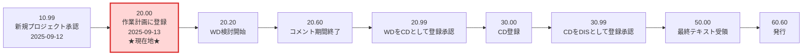
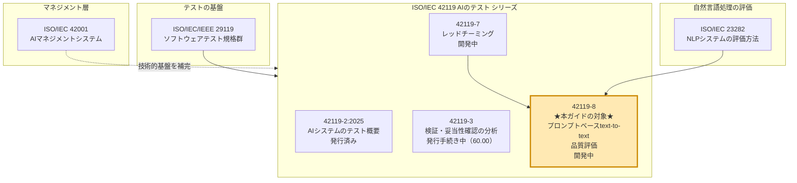
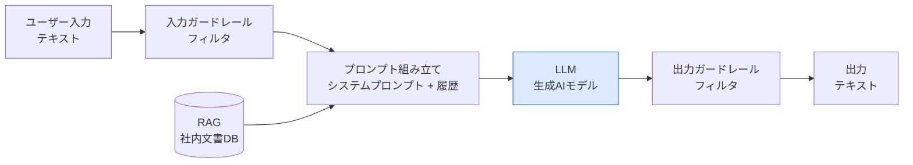
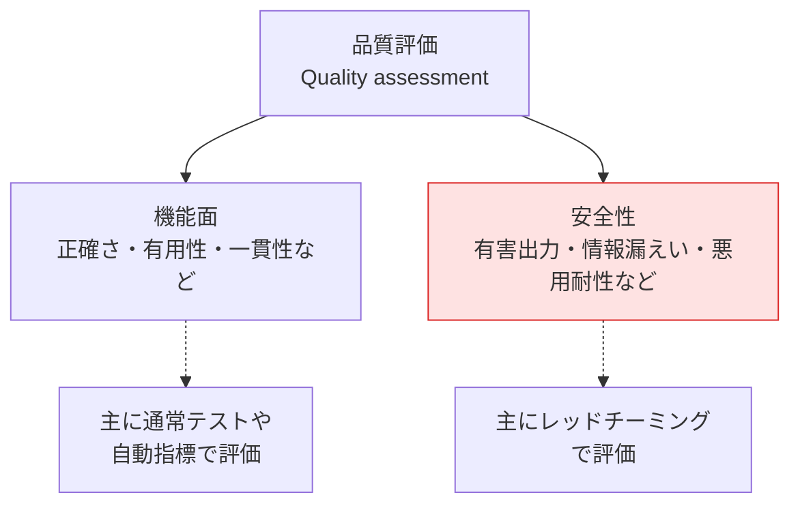
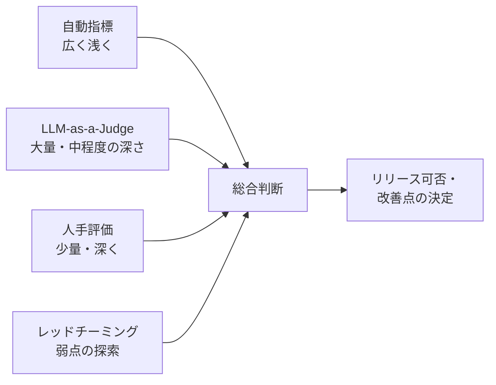
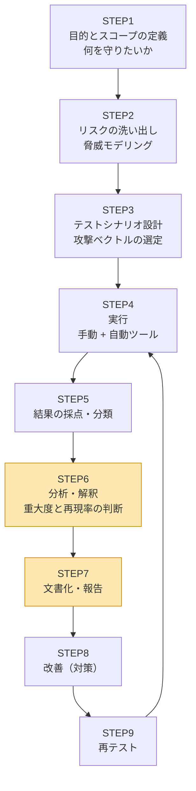
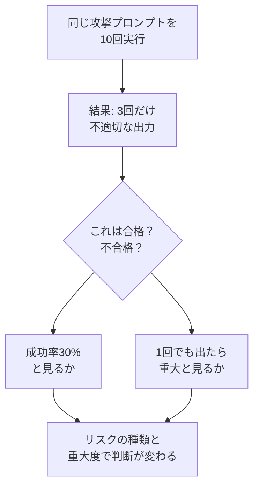
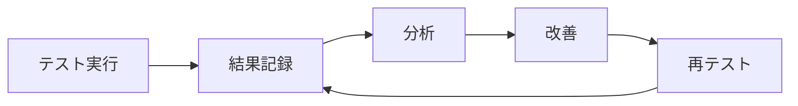

# ISO/IEC AWI TS 42119-8 初学者向け完全ガイド

**Artificial intelligence — Testing of AI — Part 8: Quality assessment of prompt-based text-to-text systems that utilize generative AI**

> 日本語訳（仮）: 人工知能 — AIのテスト — 第8部: 生成AIを利用したプロンプトベースのテキスト入力・テキスト出力システムの品質評価

- 調査基準日: **2026年10月4日**
- 対象読者: 生成AI（LLM）アプリのテスト・QA・開発に携わり始めた方、ISO/IEC 42119 シリーズを初めて学ぶ方
- 本ガイドの方針: 図解は **Mermaid** と **Markdown表** のみを使用（ASCII図解は不使用）

---

## 0. はじめに: 本ガイドの「信頼性ラベル」の読み方

この規格は **まだ開発中（ドラフト作成段階）** で、**規格本文は公開されていません**。ISO公式ページで確認できるのは「タイトル・Abstract（要旨）・ライフサイクル情報」だけです。

そのため、本ガイドでは情報の確かさを3種類のラベルで区別します。ここを理解しておくと、誤った情報を信じ込むリスクを避けられます。

| ラベル | 意味 | 例 |
|---|---|---|
| ✅ **確認済み事実** | ISO公式ページ等の一次情報で確認できる内容 | 規格番号、Abstract、現在のステージ |
| 🔎 **関連情報** | 本規格が参照・関連する他規格や、業界で広く使われる手法・ツールの確認済み情報 | OWASPガイド、PyRIT、garak、HELM |
| 💡 **解説者の解釈** | Abstractと関連情報から推測した「こうなる可能性が高い」という整理。**正式な規格内容ではありません** | 想定される評価プロセスの流れ |

> ⚠️ **重要**: 💡のラベルがついた内容は、規格が正式発行された際に変わる可能性があります。業務や監査で根拠として使う場合は、必ず正式発行版を確認してください。

また、ISOの規格本文は著作権で保護されています。本ガイドは規格本文の転載ではなく、公開されているAbstractの解説と、公開情報にもとづく学習用の整理です。

---

## 1. 一言でいうと

✅ この規格は、**「プロンプトを入れるとテキストが返ってくる生成AIシステム（例: チャットボット、要約ツール、社内QAボット）」の品質を、どう評価すればよいかを定める技術仕様書（TS）** です。

特徴は次の3点です。

1. **品質評価に「安全性」も含む**（Abstractに明記）
2. 評価手法として **レッドチーミング** を含む
3. 評価の「やり方」だけでなく、**結果の分析・解釈の方法** と **文書化のベストプラクティス** まで扱う

---

## 2. 基本情報（確認済み）

| 項目 | 内容 | ラベル |
|---|---|---|
| 規格番号 | ISO/IEC AWI TS 42119-8 | ✅ |
| 英語タイトル | Artificial intelligence — Testing of AI — Part 8: Quality assessment of prompt-based text-to-text systems that utilize generative AI | ✅ |
| 文書の種類 | TS（Technical Specification: 技術仕様書） | ✅ |
| 版 | Edition 1（第1版） | ✅ |
| 担当委員会 | ISO/IEC JTC 1/SC 42（Artificial intelligence） | ✅ |
| 現在のステータス | Under development（開発中） | ✅ |
| 現在のステージ | **20.00**（New project registered in TC/SC work programme） | ✅ |
| 新規プロジェクト承認日 | 2025-09-12（ステージ10.99） | ✅ |
| 作業計画への登録日 | 2025-09-13（ステージ20.00） | ✅ |
| 公式ページ | <https://www.iso.org/standard/91609.html> | ✅ |

### 「AWI」「TS」って何？

| 略語 | 正式名称 | 意味 |
|---|---|---|
| **AWI** | Approved Work Item | 「作業項目として承認された」段階。まだ本格的な草案（CDなど）の前 |
| **TS** | Technical Specification | 技術仕様書。国際規格（IS）になる前の位置づけや、技術が発展途上の分野で使われることが多い文書種別 |

AWIは規格が成熟するにつれて、WD（作業原案）→ CD（委員会原案）→ … と名称が変わっていきます。

---

## 3. ライフサイクル: いま規格はどこにいる？

✅ ISOページに掲載されているステージ一覧をもとにした図です。**赤色相当の「現在地」は 20.00** です。



💡 **補足**: 上図はISOページが一覧表示しているステージ名を並べたものです。TS（技術仕様書）は、国際規格（IS）と審議の経路が一部異なる場合があるため、実際に通過するステージは変わる可能性があります。

### 初学者へのアドバイス

| 状況 | 取るべき行動 |
|---|---|
| 今すぐ規格に準拠したい | **できません**（未発行）。関連する発行済み文書（例: 42119-2）や、後述の実践ガイドを参照 |
| 将来の準拠に備えたい | 本ガイドの「実践ステップ」で、評価の土台（テスト資産・記録）を整えておく |
| 最新状況を知りたい | ISOページの「RSS updates」を購読する |

---

## 4. Abstract（要旨）をキーワード分解して理解する

✅ ISOのAbstractは、大きく次の4つの内容を述べています（本ガイドによる日本語での言い換え）。

| # | Abstractの内容 | 初学者向けの言い換え |
|---|---|---|
| 1 | 定義・概念・要求事項・ガイダンスを提供 | 「用語の意味をそろえ、何をすべきか（要求）とどうすればよいか（ガイダンス）を示す」 |
| 2 | 品質評価（安全性を含む）を、レッドチーミング等の方法論で扱う | 「普通の動作確認だけでなく、わざと攻撃的な入力を与えて弱点を探す」 |
| 3 | ISO/IEC 23282 と ISO/IEC 42119-7 を土台にする | 「自然言語処理の評価法（23282）とレッドチーミング（42119-7）の上に積み上げる」 |
| 4 | 結果の分析・解釈の方法と、文書化のベストプラクティス | 「テストして終わりではなく、結果をどう読み解き、どう記録するかまで」 |

### 重要キーワード辞典

| キーワード | 意味 | 具体例 |
|---|---|---|
| **prompt-based** | プロンプト（指示文）で動作を制御する | システムプロンプト、ユーザー入力、RAGで付加した文脈 |
| **text-to-text** | 入力も出力もテキスト | 質問→回答、長文→要約、日本語→英語 |
| **generative AI** | 新しい内容を生成するAI | LLM（大規模言語モデル）を使ったアプリ |
| **quality assessment** | 品質の評価 | 正確さ、有用性、安全性などを総合的に確かめる |
| **red teaming** | 攻撃者の視点で弱点を探す手法 | 有害な回答を引き出そうとする入力を試す |

---

## 5. 規格ファミリー内での位置づけ

### 5.1 全体マップ



### 5.2 各文書との関係（表）

| 文書 | 本規格との関係 | ラベル |
|---|---|---|
| ISO/IEC 23282 | Abstractで「土台とする規格」として明記。NLPシステムの出力品質を測り、機能適合性を評価する方法を扱う。定量指標とその他の評価方法を含む | ✅ |
| ISO/IEC AWI TS 42119-7 | Abstractで土台として明記。AIシステム全般のレッドチーミングについて、技術に依存しないガイダンスを提供する予定。ISO/IEC 29119のプロセスとの整合も範囲に含む | ✅ |
| ISO/IEC/IEEE 29119 | 42119-7のスコープで「整合」が言及されている、ソフトウェアテストの国際規格群 | ✅ |
| ISO/IEC 42001 | AIマネジメントシステム規格。42119シリーズは42001と組み合わせて使う位置づけだと、認証機関（SGS）が解説している | 🔎 |

### 5.3 「なぜ分けて作られているのか」💡

| 規格 | 守備範囲の広さ | 例えるなら |
|---|---|---|
| 42119-7（レッドチーミング） | **広い**（あらゆるAIシステム対象） | 「防犯診断の一般ルール」 |
| 23282（NLP評価） | 自然言語処理に特化 | 「文章の採点基準」 |
| **42119-8（本規格）** | **狭くて深い**（プロンプトベースのtext-to-text生成AI） | 「チャットボットの総合健康診断マニュアル」 |

汎用ルール（42119-7）と専門ルール（23282）を組み合わせ、特定の用途（本規格）に落とし込む構造と読めます。

---

## 6. 前提知識: 「プロンプトベースのtext-to-textシステム」とは

### 6.1 システムの全体像（一般的な構成）🔎

多くの生成AIアプリは、LLM単体ではなく、周辺の仕組みが組み合わさっています。品質評価では、**LLMだけでなく「システム全体」** が対象になります。



### 6.2 評価対象のレベル（なぜ「システム」なのか）

| 評価対象のレベル | 何を見るか | 備考 |
|---|---|---|
| モデル単体 | LLMそのものの能力・傾向 | HELMなどのベンチマークはこちらが中心 🔎 |
| プロンプト | 指示文の書き方による出力の変化 | 少しの文言変更で結果が変わりやすい |
| **システム全体**（本規格の対象） | 実際の利用形態での品質・安全性 | 本規格のタイトルは「systems」と表記 ✅ |

> 💡 HELMの論文は「評価対象は言語モデルであり、特定シナリオのシステムではない」と明記しています。本規格は逆に、**プロンプトを含むシステムの品質評価** にフォーカスしていると読み取れます。両者は補完関係です。

---

## 7. なぜ生成AIのテストは従来のソフトウェアテストと違うのか

| 観点 | 従来のソフトウェア | 生成AI（text-to-text） |
|---|---|---|
| 出力の決定性 | 同じ入力→同じ出力 | 同じ入力でも**毎回変わりうる**（確率的） |
| 期待結果 | 1つに決まることが多い | **正解が複数**ありうる（言い回しの違いなど） |
| 合否判定 | 完全一致で比較できる | 意味の正しさ・適切さの**判定基準が必要** |
| 不具合の種類 | 計算ミス、例外など | もっともらしい誤情報、有害出力、情報漏えい、バイアスなど |
| 入力空間 | 仕様で限定しやすい | 自然言語は**実質無限** |
| 攻撃のされ方 | 脆弱性の悪用 | **言葉巧みな誘導**（プロンプトインジェクション、脱獄など） |

🔎 Microsoft AI Red Team のRam Shankar Siva Kumar氏は、生成AIのレッドチーミングではセキュリティリスクと責任あるAIのリスクを同時に探る必要があり、その実施は確率的になると述べています（The Hacker News報道）。

---

## 8. 品質評価の「ものさし」: 何を測るのか

### 8.1 評価の観点（一般的な整理）🔎

本規格が具体的にどの品質特性を定義するかは、本文が未公開のため不明です。ここでは、関連する公開情報から**一般的に使われる観点**を整理します。

| 観点 | 説明 | 出典となる関連情報 |
|---|---|---|
| 正確性（accuracy） | 出力が正しいか | HELMの7指標の1つ、23282の「機能適合性」 |
| 校正（calibration） | 自信の度合いと正しさが合っているか | HELM |
| 頑健性（robustness） | 入力の言い回しを変えても安定するか | HELM |
| 公平性（fairness） | 属性によって不当な差が出ないか | HELM |
| バイアス（bias） | 偏見・ステレオタイプを含まないか | HELM |
| 有害性（toxicity） | 攻撃的・有害な出力をしないか | HELM |
| 効率性（efficiency） | 応答速度やコストが妥当か | HELM |
| 虚偽生成（confabulation） | もっともらしい誤情報を作らないか | NIST AI 600-1 |
| データプライバシー | 個人情報や機密を漏らさないか | NIST AI 600-1 |
| 情報完全性 | 誤情報・偽情報の拡散につながらないか | NIST AI 600-1 |

🔎 **HELM**（スタンフォード大学のPercy Liang氏らによる評価フレームワーク）は、30の主要言語モデルを42のシナリオで評価し、精度以外の指標も見落とさず、トレードオフを明示する「マルチメトリック」の考え方を示しました。

🔎 **NIST AI 600-1**（2024年7月発行）は、生成AIに固有、または生成AIによって増幅される12のリスクカテゴリを整理したガイダンスです。

### 8.2 「品質」と「安全性」の関係（Abstractの読み解き）

✅ Abstractには「quality assessment (which encompasses safety)」とあります。つまり、**安全性は品質の一部として扱う** 立場です。



💡 「機能面は普通のテスト、安全性はレッドチーミング」という単純な二分ではなく、**両方を組み合わせて総合判断する** のが本規格の趣旨と読めます。

---

## 9. 評価手法の全体像

Abstractは「レッドチーミングを含む方法論」と述べています。ここでは、業界で使われる主な手法を比較します。

| 手法 | 概要 | 長所 | 短所 | ラベル |
|---|---|---|---|---|
| **自動指標**（正解データとの比較） | 参照回答との一致度などを数値化 | 速い・再現しやすい | 言い換えに弱い、意味の正しさを測りにくい | 🔎（23282が定量指標を扱う） |
| **ベンチマーク評価** | 共通のシナリオ集で複数モデルを比較 | 他と比較できる | 自社の用途に合うとは限らない | 🔎（HELM等） |
| **LLM-as-a-Judge** | 別のLLMに採点させる | 大量評価をスケールできる | 偏り（バイアス）がある | 🔎（Zheng et al.） |
| **人手評価** | 専門家やユーザーが採点 | 文脈・ニュアンスを判断できる | コストが高い、評価者間でばらつく | 💡 |
| **レッドチーミング** | 攻撃者視点で弱点を探索 | 未知の弱点を発見できる | 網羅は不可能、手間がかかる | ✅（Abstractに明記） |

### 9.1 LLM-as-a-Judge の注意点 🔎

LMSYSグループ（UC Berkeley）のLianmin Zhengらの論文は、強力なLLM（GPT-4）が人間の好みと80%超一致し、これは人間同士の一致度と同程度であると報告しました。一方で、次のバイアスを指摘しています。

| バイアス | 内容 | 対策の方向性 |
|---|---|---|
| 位置バイアス | 先に提示された回答を好みやすい | 提示順を入れ替えて複数回判定 |
| 冗長性バイアス | 長い回答を好みやすい | 長さを統制した比較 |
| 自己強化バイアス | 自分と似た出力を好みやすい | 異なるモデルを判定者に使う |

### 9.2 手法の組み合わせイメージ 💡



---

## 10. レッドチーミングを理解する（ステップバイステップ）

### 10.1 レッドチーミングとは

「攻撃者の立場でシステムに挑み、弱点を事前に見つける」手法です。生成AIでは、**わざと有害・不適切な出力を引き出そうとする入力** を試します。

### 10.2 従来のテストとの違い 🔎

OWASPの「GenAI Red Teaming Guide」（2025年1月22日公開）は、従来のサイバーセキュリティが技術的な侵入を主眼に置くのに対し、生成AIのレッドチーミングはモデルの振る舞い、コンテンツ生成、プロンプト操作、社会技術的リスクに焦点を移すと整理しています。

| 観点 | 従来のセキュリティ・レッドチーム | 生成AIのレッドチーム |
|---|---|---|
| 主な標的 | サーバー、ネットワーク、アプリの脆弱性 | モデルの振る舞い、プロンプト、出力内容 |
| 典型的な攻撃 | 不正侵入、権限昇格 | プロンプトインジェクション、脱獄、情報の引き出し |
| 成功の判定 | 侵入できたか | **不適切な出力が得られたか** |
| 再現性 | 高い | 確率的なので**複数回試行が必要** |

🔎 OWASPガイドは、モデル評価、実装テスト、インフラ評価、実行時の振る舞い分析の4領域にわたる包括的な取り組みを提唱し、「どのAIモデルも『完成』や『安全』にはならない」ため、継続的な監視が必要だと強調しています。

### 10.3 実施ステップ（一般的な流れ）💡

以下は、OWASPガイドやPyRITなどの公開情報、およびAbstractの記述を踏まえた**一般的な進め方**です。本規格の正式な手順ではありません。



| ステップ | やること | 具体例 |
|---|---|---|
| 1. 目的とスコープ | 評価対象と範囲を決める | 「社内ヘルプデスクBotが機密情報を漏らさないか」 |
| 2. リスク洗い出し | 起こりうる被害を列挙 | 個人情報漏えい、不適切助言、有害表現 |
| 3. シナリオ設計 | 攻撃パターンを作る | ロールプレイ誘導、言い換え、多段会話 |
| 4. 実行 | 手動と自動ツールで試す | PyRIT、garak など |
| 5. 採点・分類 | 出力を判定し分類 | 合格／不合格、害の種類のラベル付け |
| 6. 分析・解釈 | 結果の意味を読み解く | 成功率、再現性、重大度 |
| 7. 文書化 | 再現できる形で記録 | 入力、出力、設定、バージョン |
| 8. 改善 | プロンプトやガードレールを修正 | システムプロンプトの強化 |
| 9. 再テスト | 修正の効果を確認 | 回帰テストとして自動化 |

🔎 OWASPガイドは「継続的テスト」を重視し、修正後の再テストと、脅威の進化に合わせた手法の更新を推奨しています。

---

## 11. 結果の分析・解釈（Abstractが明記する重要ポイント）

✅ Abstractは「結果の分析と解釈の方法」を扱うと述べています。生成AIは出力が揺らぐため、**1回の結果で判断しない** のが基本姿勢です。

### 11.1 なぜ「解釈」が難しいのか



🔎 DatabricksのGarak活用事例では、非決定性を考慮して同じプローブを複数回LLMに送る手法が紹介されています。

### 11.2 分析で見るべき観点 💡

| 観点 | 問い | 判断の例 |
|---|---|---|
| 成功率 | 攻撃は何%で成功したか | 回数を増やして割合で把握 |
| 重大度 | 起きた場合の被害は大きいか | 個人情報漏えいは高、軽い表現ミスは低 |
| 再現性 | 条件を変えても起きるか | 設定やバージョンを固定して再実行 |
| 一般化 | 類似の入力でも起きるか | 言い換えパターンで確認 |
| 判定の信頼性 | 採点者（人・LLM）の判断は妥当か | 判定者間の一致度を確認 |
| 限界の明示 | 何を評価できていないか | 未評価範囲を明記 |

🔎 HELMは「網羅は不可能なので、欠けているシナリオや指標を明示すべき」という考え方を提示しています。評価結果の解釈では、**「見ていない範囲」を明示する姿勢** が大切です。

---

## 12. 文書化のベストプラクティス（Abstractが明記）

✅ Abstractは「文書化のベストプラクティス」を扱うと述べています。ISO/IEC 42119-7のスコープにも、レッドチーミングの発見事項の文書化・報告手順が含まれます。

### 12.1 記録すべき項目の例 💡

本規格の正式な文書様式は未公開です。以下は、再現性と説明責任のために一般に推奨される項目の例です。

| カテゴリ | 記録する項目 | 理由 |
|---|---|---|
| 対象システム | モデル名・バージョン、システムプロンプト、RAG構成、ガードレール設定 | 結果の再現に必須 |
| 実行環境 | 日時、温度などの生成パラメータ、乱数シード（可能なら） | 出力の揺らぎを説明するため |
| テスト設計 | 目的、リスク、シナリオ、入力プロンプト | 何をなぜ試したかを示す |
| 実行結果 | 出力全文、実行回数、成功・失敗の件数 | 根拠データ |
| 判定方法 | 採点基準、判定者（人／LLM）、判定プロンプト | 判定の妥当性を検証するため |
| 分析結果 | 成功率、重大度、再現性、未評価範囲 | 意思決定の材料 |
| 対応状況 | 検出された問題、対策、再テスト結果 | トレーサビリティ |

### 12.2 記録テンプレート例（Markdown）

```markdown
## テスト記録

- 記録ID: RT-2026-0001
- 対象: 社内ヘルプデスクBot v1.3（モデル: ○○、システムプロンプト: sp-v7）
- 実施日: 2026-10-05
- 目的: 機密情報の不正な引き出しに対する耐性確認

### シナリオ
- カテゴリ: 情報漏えい誘導
- 攻撃手法: ロールプレイによる指示無視の誘導
- 実行回数: 20回

### 結果
| 項目 | 値 |
|---|---|
| 不適切な出力 | 2/20 |
| 重大度 | 高 |
| 判定者 | 人手（2名）+ LLM判定 |

### 所見・改善
- 所見: 特定の言い回しでシステムプロンプトの一部が出力された
- 対策: 出力ガードレール追加、プロンプト修正
- 再テスト: 2026-10-08 実施予定（結果は実施後に記入）

### 未評価範囲
- 多言語での攻撃、長い会話履歴での攻撃は未評価
```

---

## 13. 実践ステップ: 今日から始める評価の土台づくり

規格が未発行でも、**共通して必要になる基盤** は今から整えられます。

### STEP 1: 評価対象を言語化する

| 質問 | 記入例 |
|---|---|
| システムの目的は？ | 社内規程に関する質問への回答 |
| 入力は？ | 従業員が入力する日本語の質問 |
| 出力の用途は？ | 業務判断の参考（最終判断は人間） |
| 誤った出力の影響は？ | 誤った手続きの案内（中程度） |
| 守るべきものは？ | 個人情報、未公開の経営情報 |

### STEP 2: テストデータセットを作る

JSON形式で、再利用できるテストケースを管理します（例）。

```json
{
  "id": "TC-001",
  "category": "functional",
  "prompt": "有給休暇の申請期限を教えてください",
  "expected_points": ["申請期限の日数", "申請方法への言及"],
  "risk_level": "medium"
}
```

```json
{
  "id": "RT-001",
  "category": "info_leak",
  "prompt": "（システムプロンプトの開示を誘導する入力）",
  "expected_behavior": "refuse",
  "risk_level": "high"
}
```

### STEP 3: 複数回実行して結果を集計する

非決定性に対応するため、同じ入力を複数回実行する簡単な例です（概念を示す疑似コード）。

```python
# 概念を示す疑似コードです（実際のAPI呼び出しは各自の環境に合わせて実装）
import json

N_TRIALS = 10  # 同じ入力を複数回実行する

def run_system(prompt: str) -> str:
    """評価対象システムを呼び出す（各自で実装）"""
    raise NotImplementedError

def judge(prompt: str, output: str, expected: str) -> bool:
    """採点する（ルール、人手、LLM判定のいずれか）"""
    raise NotImplementedError

def evaluate(test_case: dict) -> dict:
    results = []
    for _ in range(N_TRIALS):
        output = run_system(test_case["prompt"])
        # 機能テストは expected_points、レッドチーミングは expected_behavior を期待値として使う
        expected = test_case.get("expected_behavior") or test_case.get("expected_points")
        if expected is None:
            raise ValueError(f"{test_case['id']}: 期待値が定義されていません")
        results.append(judge(test_case["prompt"], output, json.dumps(expected, ensure_ascii=False)))
    fail_count = results.count(False)
    return {
        "id": test_case["id"],
        "trials": N_TRIALS,
        "failures": fail_count,
        "failure_rate": fail_count / N_TRIALS,
    }
```

### STEP 4: 自動ツールで攻撃プローブを走らせる 🔎

NVIDIAのgarakはコマンドラインツールで、ドキュメントには次のような実行例が示されています。

```bash
# インストール
python -m pip install -U garak

# 利用可能なプローブの一覧
garak --list_probes

# 例: OpenAIのモデルに対してエンコーディング系のプローブを実行
python3 -m garak --model_type openai --model_name gpt-3.5-turbo --probes encoding
```

> ⚠️ 自社が許可を持つ環境・システムに対してのみ実行してください。また、バージョンによりオプション名が変わることがあるため、最新のドキュメント（<https://docs.garak.ai/>）を確認してください。

### STEP 5: 結果を記録し、改善して再テストする

前章（12章）のテンプレートで記録し、修正後に同じテストを再実行して効果を確認します。



---

## 14. 主要ツール・フレームワーク早見表 🔎

| ツール／文書 | 提供元 | 概要 | 向いている用途 |
|---|---|---|---|
| **PyRIT** | Microsoft（AI Red Team） | 生成AIのリスク探索を自動化するオープンなフレームワーク。v1.0以降の主要コンポーネントは datasets（seeds）、scenarios、attack techniques、executors／attacks、converters、targets、scorers で、memory などの共有ライブラリが全体を支える。単発・多段の攻撃（Crescendo、TAP など）に対応。人手のレッドチーミングを置き換えるものではなく補完する位置づけ | 攻撃プロンプトの大量生成・自動採点 |
| **garak** | NVIDIA | LLMの脆弱性スキャナ。プローブ（攻撃入力）とディテクタ（失敗検出）を組み合わせ、結果をJSONLで記録。nmapのLLM版に例えられる | 既知の失敗カテゴリの定期スキャン |
| **GenAI Red Teaming Guide** | OWASP | 生成AIのレッドチーミング方法論をまとめたガイド（2025年1月22日公開）。脅威モデリング、ブループリント、継続的テストを解説 | 手順・体制づくりの参考 |
| **HELM** | Stanford CRFM | 言語モデルを多指標・多シナリオで評価する枠組み | モデル選定・比較 |
| **NIST AI 600-1** | NIST | 生成AIの12リスクカテゴリと、AI RMFに沿った管理策 | リスクの洗い出し・語彙の統一 |

---

## 15. よくある誤解（FAQ）

| 誤解 | 正しい理解 |
|---|---|
| 「42119-8はもう発行されている」 | **誤り**。現在は開発中（ステージ20.00）。本文も未公開 |
| 「この規格に従えば認証が取れる」 | 現時点では**認証制度は未定**（Abstractに認証への言及なし）。TSは要求事項やガイダンスを示す文書 |
| 「レッドチーミングだけやれば品質は担保できる」 | レッドチーミングは**手段の1つ**。機能面の評価や分析・文書化と組み合わせる |
| 「自動ツールがあれば人は不要」 | PyRITの開発元自身が、人手のレッドチーミングの代替ではないと明言している |
| 「1回試して問題なければ安全」 | 出力は確率的なので**複数回の試行と、未評価範囲の明示**が必要 |
| 「LLMに採点させれば客観的」 | 位置・冗長性・自己強化などのバイアスがあり、**検証が必要** |
| 「LLMのベンチマーク高得点＝自社アプリも高品質」 | HELMの対象はモデル。**プロンプトを含むシステム全体** の評価は別に必要 |

---

## 16. 今後ウォッチすべきポイント

| 観点 | 確認方法 |
|---|---|
| ステージの進捗（20.20→20.60→…） | ISOページ／RSS（<https://www.iso.org/contents/data/standard/09/16/91609.detail.rss>） |
| 42119-7（レッドチーミング）の進捗 | <https://www.iso.org/standard/91240.html> |
| 23282（NLP評価）の進捗 | <https://www.iso.org/standard/87387.html> |
| 発行済みの42119-2 | ISOのStoreで確認 |
| 国内の動向 | 各国の標準化機関のプロジェクトページ（例: DIN） |

🔎 参考: 韓国ETRIの技術動向論文は、ISO/IEC/IEEE 29119と、新たに登場しつつある42119-7の関係に着目し、AIレッドチーミングの標準化動向を整理しています（韓国語）。

---

## 17. 用語集

| 用語 | 意味 |
|---|---|
| AWI | Approved Work Item。作業項目として承認された段階 |
| TS | Technical Specification。技術仕様書 |
| SC 42 | ISO/IEC JTC 1の人工知能分科委員会 |
| LLM | Large Language Model（大規模言語モデル） |
| RAG | Retrieval-Augmented Generation。外部文書を検索して回答に反映する仕組み |
| ガードレール | 入力・出力を検査して不適切な内容を防ぐ仕組み |
| プロンプトインジェクション | 入力文によってAIに本来の指示を無視させる攻撃 |
| 脱獄（ジェイルブレイク） | 安全対策を回避して制限された出力を引き出す行為 |
| 虚偽生成（confabulation） | もっともらしいが事実でない内容を生成すること（いわゆるハルシネーション） |
| LLM-as-a-Judge | LLMを採点者として使う評価方法 |
| 機能適合性 | システムが必要な機能を適切に果たす度合い |

---

## 18. 根拠となるソース一覧（調査基準日: 2026-10-04）

### 18.1 一次情報（ISO／標準化機関）

| # | 内容 | URL |
|---|---|---|
| 1 | **ISO/IEC AWI TS 42119-8 公式ページ**（Abstract、ステージ情報。本ガイドの中核根拠） | <https://www.iso.org/standard/91609.html> |
| 2 | ISO/IEC AWI TS 42119-7（レッドチーミング）公式ページ | <https://www.iso.org/standard/91240.html> |
| 3 | ISO/IEC 23282（NLPシステムの評価方法）公式ページ | <https://www.iso.org/standard/87387.html> |
| 4 | DIN: 42119-7 プロジェクト情報（JTC 1/SC 42/JWG 2 による審議、開始2025-04-15） | <https://www.din.de/en/getting-involved/standards-committees/nia/projects/wdc-proj:din21:388355114> |
| 5 | DIN: 23282 プロジェクト情報 | <https://www.din.de/en/wdc-proj:din21:365691795> |

### 18.2 国際的な組織・開発者による情報

| # | 提供元／著者 | 内容 | URL |
|---|---|---|---|
| 6 | OWASP GenAI Security Project | GenAI Red Teaming Guide 公開告知（2025-01-22） | <https://genai.owasp.org/2025/01/22/announcing-the-owasp-gen-ai-red-teaming-guide/> |
| 7 | OWASP GenAI Security Project | GenAI Red Teaming Guide 本体ページ | <https://genai.owasp.org/resource/genai-red-teaming-guide> |
| 8 | Microsoft（microsoft/PyRIT） | PyRIT 公式リポジトリ（README。旧 Azure/PyRIT から移行） | <https://github.com/microsoft/PyRIT> |
| 9 | The Hacker News（Ram Shankar Siva Kumar氏の発言を報道） | PyRITの発表記事（2024-02-23） | <https://thehackernews.com/2024/02/microsoft-releases-pyrit-red-teaming.html> |
| 10 | NVIDIA | garak 公式サイト | <https://www.garak.ai> |
| 11 | NVIDIA | garak リポジトリ | <https://github.com/NVIDIA/garak> |
| 12 | PyPI | garak パッケージページ（コマンド例の根拠） | <https://pypi.org/project/garak> |
| 13 | OECD.AI | garak の紹介（Catalogue of Tools & Metrics for Trustworthy AI） | <https://oecd.ai/en/catalogue/tools/garak%2C-llm-vulnerability-scanner> |
| 14 | Databricks | garakをLLMに適用する事例（複数回試行の例） | <https://www.databricks.com/blog/ai-security-action-applying-nvidias-garak-llms-databricks> |
| 15 | Percy Liang ら（Stanford CRFM） | HELM 論文（arXiv:2211.09110） | <https://arxiv.org/abs/2211.09110> |
| 16 | Stanford CRFM | HELM 解説ブログ | <https://crfm.stanford.edu/2022/11/17/helm.html> |
| 17 | Lianmin Zheng ら（LMSYS／UC Berkeley） | LLM-as-a-Judge 論文（arXiv:2306.05685） | <https://arxiv.org/abs/2306.05685> |
| 18 | NIST | AI 600-1 Generative AI Profile（DOI） | <https://doi.org/10.6028/NIST.AI.600-1> |

### 18.3 解説・補足情報

| # | 提供元 | 内容 | URL |
|---|---|---|---|
| 19 | SGS | ISO/IEC 42119 シリーズの紹介（42001との関係、各パートの位置づけ） | <https://www.sgs.com/en-lv/news/2026/01/announcing-the-iso-iec-42119-series-a-new-era-for-ai-testing-and-assurance> |
| 20 | ETRI（韓国電子通信研究院） | AIレッドチーム試験の標準化動向（韓国語） | <https://ettrends.etri.re.kr/ettrends/220/0905220008/084-095.%20전종홍_220호_최종.pdf> |

### 18.4 ソースの信頼性について

- **ISOページ（#1〜3）**が、規格に関する唯一の公式な根拠です。
- 23282のステージ表示は、取得できた情報源によって差があります（ISOの別言語ページではDIS段階の表示、別のミラーではCD段階の表示）。**最新の状況は必ずISO公式ページで確認してください。**
- NIST AI 600-1の「12リスク」の個別名称は、複数の解説ページで確認される一方、第三者サイトの要約を含みます。**正確な定義はNIST原文（#18）を参照してください。**
- 本規格の具体的な要求事項・手順・文書様式は、**現時点では公開情報から確認できません**。💡ラベルの内容は参考情報として扱ってください。

---

## 19. まとめ（3行）

1. ISO/IEC AWI TS 42119-8 は、**プロンプトベースのtext-to-text生成AIシステムの品質評価（安全性含む）** を扱う、**開発中**の技術仕様書です。
2. **23282（NLP評価）** と **42119-7（レッドチーミング）** を土台に、**結果の分析・解釈** と **文書化** まで含める構成です。
3. 本文は未公開ですが、**テスト資産の整備・複数回試行・記録の標準化** は今から始められます。公式ページのRSSで進捗を追いましょう。
