# ISO/IEC/IEEE 29119-3:2021 初学者向け解説ガイド

> **ソフトウェアテスト文書化標準（Test documentation）をステップバイステップで理解する**
>
> - 作成基準日: 2026年9月28日
> - 対象読者: テスト・QA の初学者、開発者、テストマネージャ、プロジェクトマネージャ
> - 本ガイドは公開情報（規格の公式ページ、規格の目次・前付けサンプル、規格策定関係者・実務家の公開資料）をもとにした**学習用の要約**です。規格本文の複製ではありません。要求事項の最終確認は必ず規格本体で行ってください。

---

## 目次

1. [Step 0: まず全体像をつかむ（30秒サマリー）](#step-0-まず全体像をつかむ30秒サマリー)
2. [Step 1: 規格の基本情報](#step-1-規格の基本情報)
3. [Step 2: 29119 シリーズ内での位置づけ](#step-2-29119-シリーズ内での位置づけ)
4. [Step 3: 規格の構成（章・附属書）を読む地図](#step-3-規格の構成章附属書を読む地図)
5. [Step 4: 適合（Conformance）の考え方](#step-4-適合conformanceの考え方)
6. [Step 5: すべての文書に共通する情報項目](#step-5-すべての文書に共通する情報項目)
7. [Step 6: 組織レベルの文書（Clause 6）](#step-6-組織レベルの文書clause-6)
8. [Step 7: テストマネジメントの文書（Clause 7）](#step-7-テストマネジメントの文書clause-7)
9. [Step 8: 動的テストの文書（Clause 8）](#step-8-動的テストの文書clause-8)
10. [Step 9: 2021年版の最大の変更点「テストモデル」](#step-9-2021年版の最大の変更点テストモデル)
11. [Step 10: 文書どうしのつながり（トレーサビリティ）](#step-10-文書どうしのつながりトレーサビリティ)
12. [Step 11: アジャイル／DevOps での使い方（テーラリング）](#step-11-アジャイルdevops-での使い方テーラリング)
13. [Step 12: 実践ミニ例（ログイン機能）](#step-12-実践ミニ例ログイン機能)
14. [Step 13: よくある誤解と批判的視点](#step-13-よくある誤解と批判的視点)
15. [Step 14: 学習ロードマップと理解度チェック](#step-14-学習ロードマップと理解度チェック)
16. [参考ソース一覧（URL）](#参考ソース一覧url)

---

## Step 0: まず全体像をつかむ（30秒サマリー）

**ISO/IEC/IEEE 29119-3 は「テストで作る文書のひな形（テンプレート）集」です。**

- 「何をどうテストするか（プロセス）」を定めるのは **Part 2**。
- その各プロセスの**成果物（アウトプット）として、どんな情報を文書に書くか**を定めるのが **Part 3**。
- 文書は紙でも、テスト管理ツールの記録、スプレッドシート、マインドマップ、ホワイトボード写真でもよい、とされています。
- すべてを作る必要はなく、**プロジェクトに合わせて選んで使う（テーラリング）**ことが前提です。

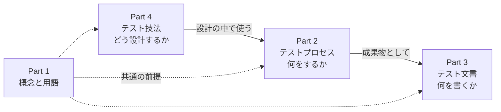

### 用語の最低限セット

| 用語 | ひとことで言うと |
|---|---|
| テストポリシー | 組織がテストで何を目指すかを示す経営層向けの方針文書 |
| テスト計画（テストプラン） | 目的・進め方・スケジュールをまとめた計画書。テスト戦略を含む |
| テストモデル | テスト対象をテストしやすい形で表現したもの（状態遷移図、デシジョンテーブル等） |
| テストケース仕様 | テストケースの集まりを記述した文書 |
| テスト手順仕様 | テストケースを実行する順序・手順を記述した文書（テストスクリプトとも） |
| インシデント | テスト実行中などに起きた「調査が必要な、予期しない出来事」 |

---

## Step 1: 規格の基本情報

| 項目 | 内容 | 根拠 |
|---|---|---|
| 正式名称 | Software and systems engineering — Software testing — Part 3: Test documentation | ISO ページ |
| 版 | 第2版（Edition 2） | ISO ページ |
| 発行日 | 2021年10月28日（ISO ステージ 60.60: 発行済み） | ISO ページ |
| ページ数 | 84ページ | ISO ページ |
| 策定組織 | ISO/IEC JTC 1/SC 7（ソフトウェア及びシステムエンジニアリング）＋ IEEE Computer Society（C/S2ESC） | ISO / IEEE ページ |
| IEEE 側の名称 | IEEE/ISO/IEC 29119-3-2021（ステータス: Active Standard） | IEEE ページ |
| IEEE 標準委員会承認 | 2021年9月23日 | IEEE ページ |
| 前の版 | ISO/IEC/IEEE 29119-3:2013（置き換え済み） | ISO / IEEE ページ |
| ワーキンググループ議長（IEEE 側の記載） | Jon Hagar | IEEE ページ |
| 対象 | あらゆる組織・プロジェクト・テスト活動、あらゆるライフサイクルモデル | ISO ページ |
| 想定読者 | テスター、テストマネージャ、開発者、プロジェクトマネージャ（特にテストの統制・管理・実施の責任者） | ISO ページ |

### 版の変遷

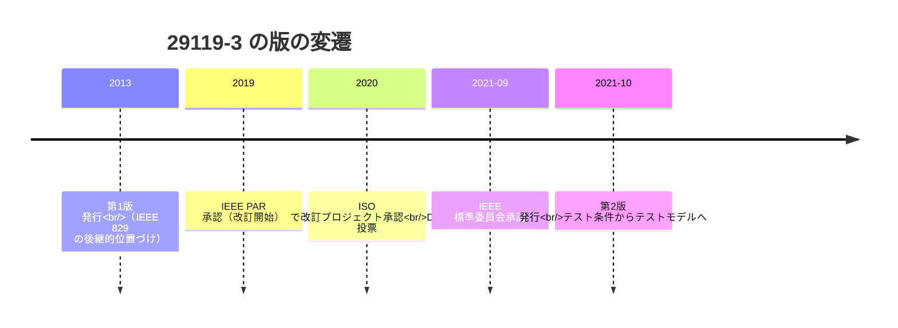

> 補足: 2013年版から2021年版へのおもな変更は「**テスト条件（test condition）の概念をテストモデル（test model）に置き換えた**」ことと、規格の前付けに明記されています。詳しくは [Step 9](#step-9-2021年版の最大の変更点テストモデル) で解説します。

---

## Step 2: 29119 シリーズ内での位置づけ

### 各パートの役割

| パート | 内容 | 状況（IEEE SA ページの記載に基づく） |
|---|---|---|
| Part 1 | 一般概念 | 29119-1-2021 |
| Part 2 | テストプロセス | 29119-2-2021 |
| **Part 3** | **テスト文書化（本ガイドの対象）** | **29119-3-2021（Active）** |
| Part 4 | テスト技法 | 29119-4-2021 |
| Part 5 | キーワード駆動テスト | 29119-5-2024 |
| Part 8 | モデルベーステスト | ドラフト（P29119-8） |
| Part 14 | データ移行テスト | ドラフト（P29119-14） |

> 関連: IEEE SA の同ワーキンググループのページには、インシデント管理の標準 **23612-2026** も掲載されています（別規格）。

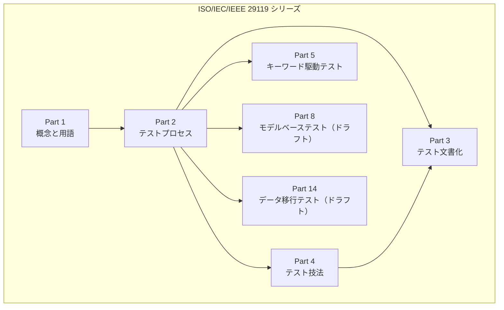

### Part 2 と Part 3 の対応（重要）

Part 3 の文書は、**Part 2 の3つのプロセス階層**に沿って並んでいます。

| Part 2 のプロセス階層 | Part 3 の章 | 主な文書 |
|---|---|---|
| 組織テストプロセス | Clause 6 | テストポリシー、組織テストプラクティス |
| テストマネジメントプロセス | Clause 7 | テスト計画、テストステータスレポート、テスト完了報告書 |
| 動的テストプロセス | Clause 8 | テストモデル仕様、テストケース仕様、テスト手順仕様 ほか |

---

## Step 3: 規格の構成（章・附属書）を読む地図

規格の目次（前付けサンプル）から、章構成を整理します。

### 本編

| 章 | タイトル | 何が書いてあるか |
|---|---|---|
| 1 | Scope | 適用範囲 |
| 2 | Normative references | 引用規格（この文書には**なし**） |
| 3 | Terms and definitions | 用語定義（実際のテスト文書に関する用語が中心） |
| 4 | Conformance | 適合の主張方法（full / tailored） |
| 5 | Common information | 全文書に共通の情報項目 |
| 6 | Organizational test process documentation | 組織レベルの文書 |
| 7 | Test management processes documentation | 計画・報告の文書 |
| 8 | Dynamic test processes documentation | 設計・実行・インシデントの文書 |

### 附属書

| 附属書 | 種別 | 内容 |
|---|---|---|
| Annex A | 規定（normative） | 各情報項目の要求・推奨・許可（shall / should / may）の一覧と Part 2 との対応 |
| Annex B | 参考（informative） | 例の概要 |
| Annex C〜R | 参考 | 各文書の記入例（テストポリシー、テスト計画、ステータスレポート、完了報告書、テストモデル仕様、テストケース仕様、テスト手順仕様、データ／環境要求、各種レディネスレポート、実際の結果、テスト結果、実行ログ、インシデントレポート） |
| Annex S | 参考 | IEEE 829:2008（置き換え済み）との対応表 |
| Annex T | 参考 | テストモデルの説明（なぜテスト条件をやめたのか） |

> 読み方のコツ: **Annex A（規定）だけが要求事項**で、Annex B〜T の例や対応表は参考情報です。「例に書いてあるから必須」ではありません。

---

## Step 4: 適合（Conformance）の考え方

### 4-1. 動詞の意味

| 動詞 | 意味 |
|---|---|
| shall | 要求 |
| should | 推奨 |
| may | 許可 |

### 4-2. 2つの適合方法

| 方法 | 内容 |
|---|---|
| **Full conformance（完全適合）** | Clause 5〜8 と Annex A のすべての要求（shall）を満たした証拠を示す |
| **Tailored conformance（テーラード適合）** | 使う文書のサブセットを記録し、そのサブセットの shall をすべて満たす。**要求を外す場合は理由（正当化）の提示が必要** |

さらに重要な点:

- 組織は**完全適合とテーラード適合のどちらを主張するかを明言する**（shall）。
- 文書名・見出し・レイアウトは**変更してよい**（追加、統合、名称変更など）。この規格の呼び名の使用は必須ではありません。
- 電子データ、複数文書への分割、他文書との統合でも適合と見なされます。
- 発注者と供給者の契約に使う場合は、規格への適合ではなく**契約への準拠**を主張するほうが適切、という注記があります。

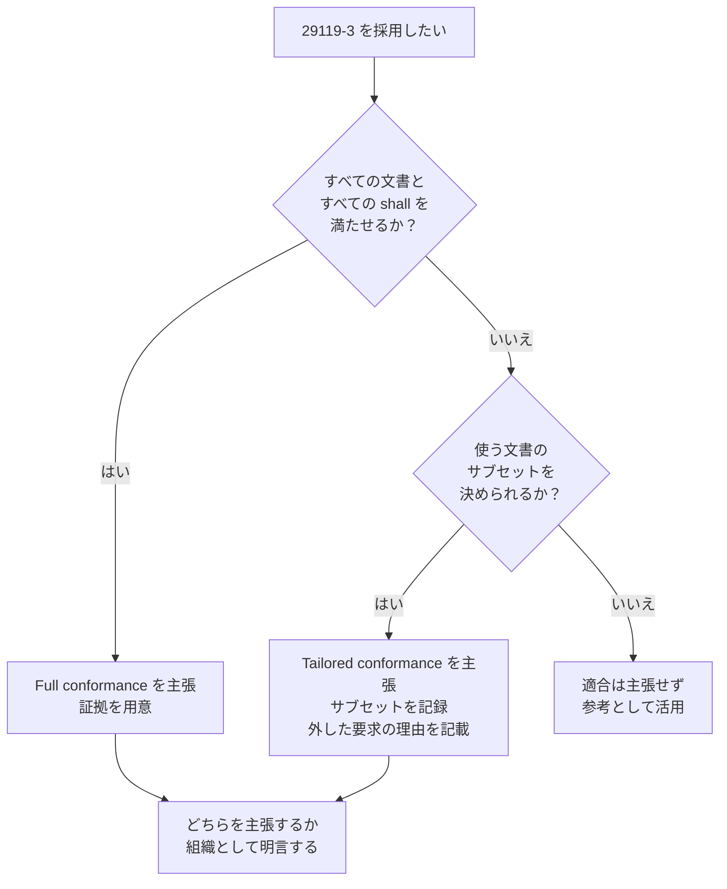

---

## Step 5: すべての文書に共通する情報項目

Clause 5 は、**どの文書にも入れるべき共通のヘッダー的情報**を定めています。

| 項番 | 項目 | 意味（初学者向けの言い換え） |
|---|---|---|
| 5.2.1 | Unique identifier | 文書を一意に識別する ID |
| 5.2.2 | Issuing organization | 文書を発行した組織 |
| 5.2.3 | Approval authority | 承認者・承認権限 |
| 5.2.4 | Change history | 変更履歴 |
| 5.2.5 | Status | 文書のステータス（ドラフト、承認済み等） |
| 5.2.6 | Introduction | 導入（この文書の目的） |
| 5.2.7 | Scope | 対象範囲 |
| 5.2.8 | References | 参照文書 |
| 5.2.9 | Glossary | 用語集 |

> 実務のヒント: Confluence・Notion・Git 管理の Markdown などでは、**ページ ID、作成者、承認者、履歴、ステータス**がツール標準機能で自動的に満たせます。

---

## Step 6: 組織レベルの文書（Clause 6）

「プロジェクトを超えて、組織全体に共通する」文書です。

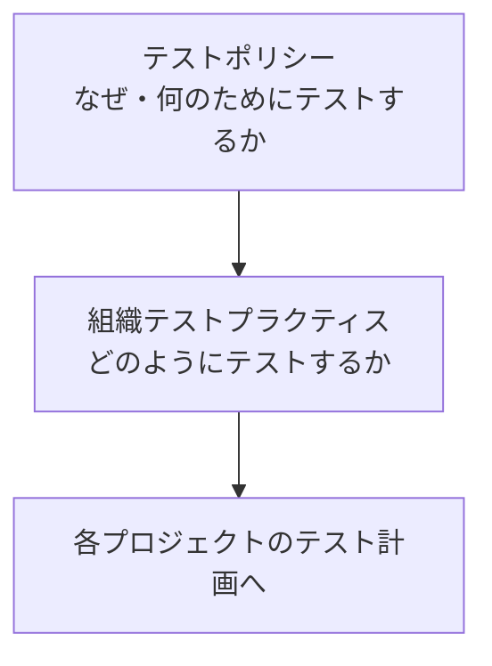

### 6-1. テストポリシー（Test policy, 6.2）

**経営層向けの「テストの憲法」**です。「何を達成したいか」を書き、「どうやるか」は書きません。

| 項番 | 項目 | 何を書くか |
|---|---|---|
| 6.2.2 | Objectives of testing | テストの目的 |
| 6.2.3 | Test process | 採用するテストプロセス |
| 6.2.4 | Test organization structure | テスト組織の構造 |
| 6.2.5 | Tester training | テスターの教育 |
| 6.2.6 | Tester ethics | テスターの倫理 |
| 6.2.7 | Standards | 準拠する標準 |
| 6.2.8 | Other relevant policies | 関連する他の方針 |
| 6.2.9 | Measuring the value of testing | テストの価値の測り方 |
| 6.2.10 | Test asset archiving and reuse | テスト資産の保管と再利用 |
| 6.2.11 | Test process improvement | テストプロセス改善 |

### 6-2. 組織テストプラクティス（Organizational test practices, 6.3）

**ポリシーに沿った「具体的な進め方」**を書きます。

| 項番 | 項目 | 説明 |
|---|---|---|
| 6.3.2 | Organization-level test practice statements | 組織全体で共通のプラクティス |
| 6.3.3 | Test level/type-specific practice statements | テストレベル・テストタイプごとの固有プラクティス |

用語定義には、次のような補足があります（要旨）。

- 複数のプラクティス文書を持ってよい（例: モバイルアプリ用と安全重要システム用）。
- 別立てのポリシーがない場合は、プラクティス文書にポリシーの内容を含めてよい。

### ポリシーとプラクティスの違い

| 観点 | テストポリシー | 組織テストプラクティス |
|---|---|---|
| 主な読者 | 経営層 | テストの実施者・管理者 |
| 書く内容 | 目的、原則、範囲（What / Why） | 推奨する手法（How） |
| 更新頻度 | 低い | 中程度 |
| 例 | 「品質リスクに応じてテストを優先する」 | 「回帰テストは自動化を原則とする」 |

---

## Step 7: テストマネジメントの文書（Clause 7）

プロジェクトの**計画 → 進捗報告 → 完了報告**を担います。

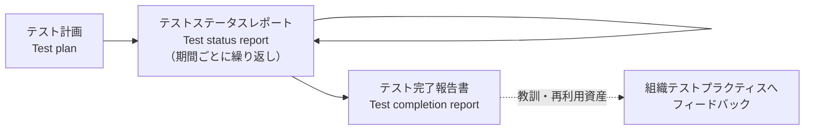

### 7-1. テスト計画（Test plan, 7.2）

**「何を、どこまで、どの方針で、誰が、いつまでにテストするか」**をまとめる中心文書です。

| 項番 | 項目 | 何を書くか（要点） |
|---|---|---|
| 7.2.2 | Context of testing | テストの背景・前提 |
| 7.2.3 | Assumptions and constraints | 前提条件と制約 |
| 7.2.4 | Stakeholders | ステークホルダー |
| 7.2.5 | Testing communication | 関係者との連絡方法 |
| 7.2.6 | Risk register | リスク登録簿 |
| 7.2.7 | Test strategy | テスト戦略（下記参照） |
| 7.2.8 | Testing activities and estimates | 作業項目と見積り |
| 7.2.9 | Staffing | 要員計画 |
| 7.2.10 | Schedule | スケジュール |

**テスト戦略はテスト計画の一部**です（別の独立文書ではありません）。用語定義の注記によると、戦略には通常、次のような内容が含まれます。

- 実施するテストレベルとテストタイプ
- 再テストと回帰テストの方針
- 使うテスト設計技法と、対応する完了基準
- テストデータ、テスト環境、ツールの要求
- 成果物に対する期待

また、次のような注記があります（要旨）。

- プロジェクトには**複数のテスト計画**があってよい（全体を包括するマスターテスト計画と、システムテスト計画・性能テスト計画などの個別計画）。
- テスト計画は保守テストなど、**プロジェクト以外の活動**にも書ける。

### 7-2. テストステータスレポート（Test status report, 7.3）

**指定した報告期間の「いまの状況」**を伝える文書です。

| 項番 | 項目 | 何を書くか |
|---|---|---|
| 7.3.2 | Test status | 現在のステータス |
| 7.3.3 | Reporting period | 報告期間 |
| 7.3.4 | Progress against test plan | 計画に対する進捗 |
| 7.3.5 | Factors blocking progress | 進捗を妨げている要因 |
| 7.3.6 | Test measures | テストの測定値 |
| 7.3.7 | New and changed risks | 新規・変更されたリスク |
| 7.3.8 | Planned testing | 次に予定しているテスト |

### 7-3. テスト完了報告書（Test completion report, 7.4）

**テスト活動の総括**です（別名: テストサマリーレポート）。

| 項番 | 項目 | 何を書くか |
|---|---|---|
| 7.4.2 | Summary of testing performed | 実施したテストの要約 |
| 7.4.3 | Deviations from planned testing | 計画からの逸脱 |
| 7.4.4 | Test completion evaluation | 完了基準に照らした評価 |
| 7.4.5 | Factors that blocked progress | 進捗を妨げた要因 |
| 7.4.6 | Test measures | テストの測定値 |
| 7.4.7 | Residual risks | 残留リスク |
| 7.4.8 | Test deliverables | テスト成果物 |
| 7.4.9 | Reusable test assets | 再利用できるテスト資産 |
| 7.4.10 | Lessons learned | 教訓 |

### ステータスレポートと完了報告書の比較

| 観点 | ステータスレポート | 完了報告書 |
|---|---|---|
| タイミング | 期間ごとに繰り返し | テスト終了時 |
| 視点 | 現在と次の一歩 | 全体の総括と振り返り |
| 固有項目 | Planned testing（今後の予定） | Residual risks、Reusable test assets、Lessons learned |
| 共通項目 | Test measures、進捗を妨げた要因 | Test measures、進捗を妨げた要因 |

---

## Step 8: 動的テストの文書（Clause 8）

実際のテストの**設計 → 準備 → 実行 → 問題報告**で作られる文書群です。13種類の項目があり、初学者は最初に全体の流れをつかむと整理しやすくなります。

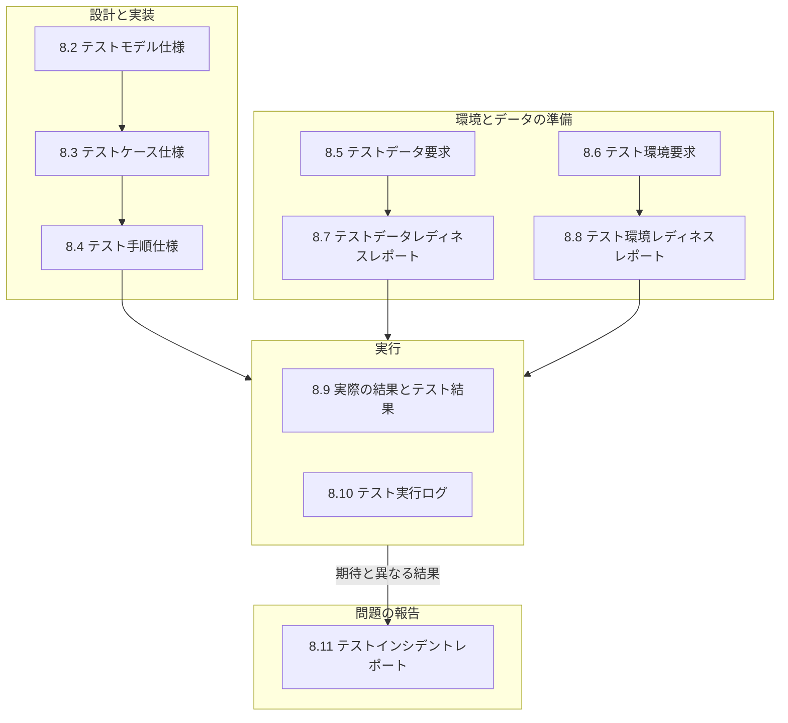

### 8-1. テストモデル仕様（8.2）

テストの設計の出発点となる文書です（2021年版の新しい中心概念）。

| 項番 | 項目 | 説明 |
|---|---|---|
| 8.2.2 | Unique identifier | ID |
| 8.2.3 | Objective | 目的 |
| 8.2.4 | Priority | 優先度 |
| 8.2.5 | Test strategy extract | テスト戦略からの抜粋（このモデルに関係する部分） |
| 8.2.6 | Test model | テストモデルそのもの |
| 8.2.7 | Traceability | 追跡可能性 |

### 8-2. テストケース仕様（8.3）

| 項番 | 項目 | 説明 |
|---|---|---|
| 8.3.2 | Test coverage items | テストカバレッジアイテム（何を網羅するかの単位） |
| 8.3.3 | Test cases | テストケース |

### 8-3. テスト手順仕様（8.4）

テストケースを**どの順番で、どう準備して、どう終えるか**を書きます。

| 項番 | 項目 | 説明 |
|---|---|---|
| 8.4.2 | Unique identifier | ID |
| 8.4.3 | Objective | 目的 |
| 8.4.4 | Priority | 優先度 |
| 8.4.5 | Start up | 開始時の準備 |
| 8.4.6 | Ordered test cases | 順序付けられたテストケース |
| 8.4.7 | Relationship to other procedures | 他の手順との関係 |
| 8.4.8 | Stop and wrap up | 終了と後片付け |

> 用語補足: 「テスト仕様（test specification）」とは、**テスト設計・テストケース・テスト手順をまとめた総称**です。1つの文書でも、複数文書でも、文書とデータベース項目の混在でもかまいません。

### 8-4. テストデータ要求（8.5）とテスト環境要求（8.6）

| 文書 | 項目 |
|---|---|
| テストデータ要求（8.5） | ID、Description（内容）、Responsibility（責任者）、Period needed（必要期間）、Resetting needs（リセット要否）、Archiving or disposal（保管・廃棄） |
| テスト環境要求（8.6） | ID、Test environment item（環境の構成要素）、Description、Responsibility、Period needed |

テスト環境の構成要素とは、ハードウェア、ソフトウェア、インターフェース、周辺機器、ツールなど、**他の部分と切り離して扱える要素**です。

### 8-5. レディネスレポート（8.7、8.8）

| 文書 | 目的 | 主な項目 |
|---|---|---|
| テストデータレディネスレポート | 各テストデータ要求の**準備状況**を伝える | ID、Description of status |
| テスト環境レディネスレポート | 各テスト環境要求の**準備状況**を伝える | ID、Description of status |

### 8-6. 実際の結果とテスト結果（8.9）

| 用語 | 意味 |
|---|---|
| 期待結果（expected results） | 仕様など根拠に基づく、観察可能な予測動作 |
| **実際の結果（actual results）** | テスト実行で**実際に観察された**振る舞い・状態（画面出力、データ変更、送信メッセージなど） |
| **テスト結果（test result）** | 実際の結果が期待結果と一致したか（**合格/不合格**）を示す判定 |

### 8-7. テスト実行ログ（8.10）

**1つ以上のテスト手順を実行した記録**です。

| 項番 | 項目 |
|---|---|
| 8.10.2 | Unique identifier |
| 8.10.3 | Date/time |
| 8.10.4 | Description |
| 8.10.5 | Impact |

### 8-8. テストインシデントレポート（8.11）

テスト中に**調査が必要な出来事**が起きたときの報告書です。バグ票・不具合票・課題票など、さまざまな名前で呼ばれるものの総称として扱われています。

| 項番 | 項目 | 説明 |
|---|---|---|
| 8.11.2 | Timing information | いつ起きたか |
| 8.11.3 | Originator | 報告者 |
| 8.11.4 | Context | 発生時の状況 |
| 8.11.5 | Description of the incident | 事象の説明 |
| 8.11.6 | Originator's assessment of severity | 報告者の判断による深刻度 |
| 8.11.7 | Originator's assessment of priority | 報告者の判断による優先度 |
| 8.11.8 | Risk | リスク |
| 8.11.9 | Status of the incident | インシデントの状態 |

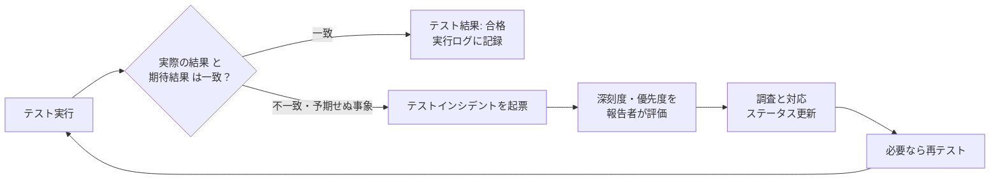

---

## Step 9: 2021年版の最大の変更点「テストモデル」

### 9-1. 何が変わったのか

規格の前付けには、2013年版からのおもな変更点として次の趣旨が書かれています。

> **「テスト条件」の概念を「テストモデル」に置き換えた。**
> 理由: 旧版へのフィードバックで、テスト条件の意味と、そこからテストケースを導く方法が利用者にわかりにくいという問題が指摘されたため。

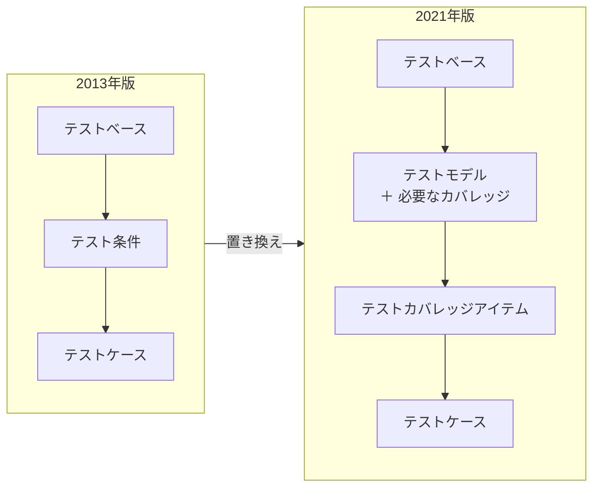

### 9-2. テストモデルとは

**テスト対象を、特定の性質や品質特性に焦点を当ててテストできるように表現したもの**です。規格が挙げる例は次のとおりです。

| 例 | 関連するテスト設計の発想 |
|---|---|
| 要求記述 | 要求ベースのテスト |
| 同値分割 | 同値分割法 |
| 状態遷移図 | 状態遷移テスト |
| ユースケース記述 | ユースケーステスト |
| デシジョンテーブル | デシジョンテーブルテスト |
| 入力構文 | 構文テスト |
| ソースコード | 構造ベースのテスト |
| 制御フローグラフ | 分岐・パスの網羅 |
| パラメータと値 | 組合せテスト |
| 分類ツリー | 分類木法 |
| 自然言語 | 記述ベースの設計 |

規格の注記から押さえておきたいポイント:

- テストモデルと「必要なカバレッジ」から、**テストカバレッジアイテム**を特定する。
- 完了基準に含まれるカバレッジの種類ごとに、**別々のテストモデルが必要になる場合がある**。
- テストモデルは**1つ以上のテスト条件を含みうる**（テスト条件の概念が完全に消えたわけではない）。
- テストモデルは主にテスト設計を支える（Part 4 の技法、モデルベーステスト）。ほかにも、テスト環境モデルやテスト成熟度モデルなど別種のモデルがある。

### 9-3. 「テストベース → テストモデル → テストケース」の具体例

| ステップ | 成果物 | 例（パスワード入力欄「8〜16文字」） |
|---|---|---|
| ① テストベース | 要求・仕様 | 「パスワードは8文字以上16文字以下」 |
| ② テストモデル | 同値分割 | 分割: 7文字以下（無効）／8〜16文字（有効）／17文字以上（無効） |
| ③ カバレッジアイテム | 各分割 | 3つの分割それぞれ |
| ④ テストケース | 具体的入力と期待結果 | 5文字→エラー、10文字→成功、20文字→エラー |

---

## Step 10: 文書どうしのつながり（トレーサビリティ）

### 10-1. 全体の依存関係

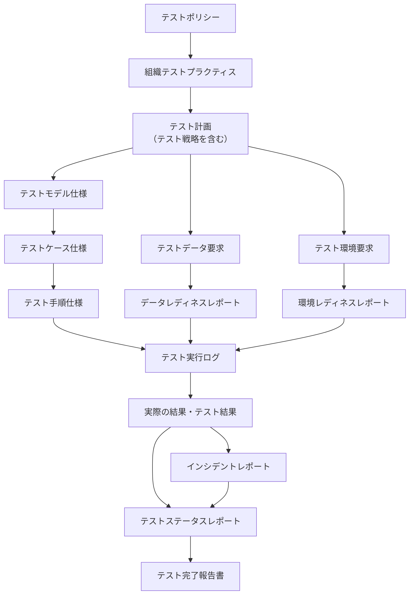

### 10-2. テストトレーサビリティマトリクス

規格の用語定義では、**要求とそれに対応するテストなど、文書とソフトウェアの関連する項目を結びつける文書・スプレッドシート・ツール**を「テストトレーサビリティマトリクス」と呼んでいます（別名: 検証相互参照マトリクス、要求テストマトリクス、要求検証表）。形式や詳細度は用途によって異なってよい、とされています。

| 追跡の方向 | 何がわかるか |
|---|---|
| 要求 → テストモデル → テストケース | 要求がテストされているか（抜け漏れ） |
| テストケース → 実行結果 → インシデント | 不合格の影響範囲 |
| インシデント → 要求 | 不具合がどの要求に関わるか |

---

## Step 11: アジャイル／DevOps での使い方（テーラリング）

規格自体が、次のような柔軟な使い方を前提にしています。

| 規格の記載（要旨） | 実務での意味 |
|---|---|
| 任意のライフサイクル（ウォーターフォール、反復、アジャイル、DevOps）で採用できる | 開発手法を理由に対象外とはならない |
| 文書は紙でも電子でもよい（ツール記録、スプレッドシート、マインドマップ、ホワイトボード写真） | 軽量な形式で満たせる |
| 見出しや名称は変更・統合してよい | 既存のテンプレートに合わせられる |
| 「プロジェクト」を「プロダクト」に読み替えてよい | 長期のプロダクトチームでも使える |
| 使う文書を選び、外した理由を示す（テーラード適合） | 必要最小限の運用ができる |

### 文書を選ぶ判断フロー（筆者の実務向け提案）

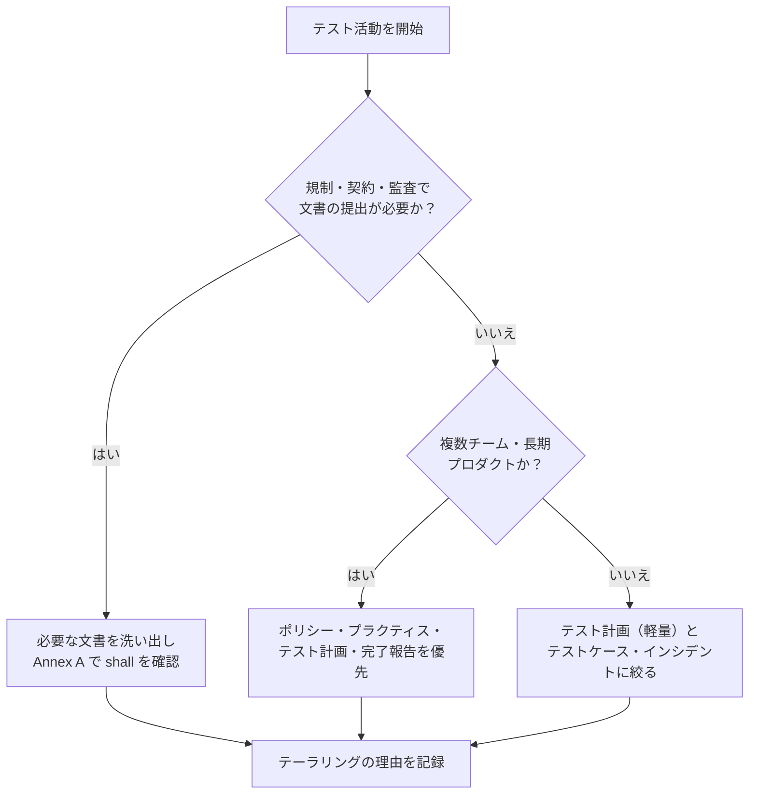

### 既存ツールへの当てはめ例（筆者の提案・規格の要求ではありません）

| 規格の文書 | 当てはめ先の例 |
|---|---|
| テスト計画 | Wiki のテスト計画ページ |
| テストケース仕様 | テスト管理ツールのケース一覧、スプレッドシート |
| テスト手順仕様 | 自動テストコード、手動実行手順の Markdown |
| テスト実行ログ | CI の実行履歴、テスト管理ツールの実行記録 |
| インシデントレポート | 課題管理ツールのチケット |
| ステータスレポート | 週次の Slack 投稿、ダッシュボード |
| 完了報告書 | リリース判定会議の資料 |

---

## Step 12: 実践ミニ例（ログイン機能）

> ここに示す内容は**架空の学習用サンプル**で、規格の Annex の例とは異なります。項目の並びは Part 3 の考え方に沿っています。

### 12-1. テスト計画（抜粋）

| 項目 | 記入例 |
|---|---|
| ID / 発行者 / 承認者 | TP-LOGIN-001 / QAチーム / プロダクトオーナー |
| Context of testing | 新規会員向けログイン機能のシステムテスト |
| Assumptions and constraints | 認証基盤は既存を利用。テスト環境は共有 |
| Stakeholders | PO、開発リード、QA、セキュリティ担当 |
| Risk register | 不正ログイン（高）、セッション管理不備（中） |
| Test strategy | 同値分割・状態遷移で設計、回帰は自動化、完了基準は主要カバレッジ100％ |
| Testing activities and estimates | 設計3日、実行4日、再テスト2日 |
| Schedule | 2週間 |

### 12-2. テストモデル → テストケース

| テストモデル | カバレッジアイテム | テストケース例 | 期待結果 |
|---|---|---|---|
| 状態遷移図（未ログイン→ログイン中→ロック） | 遷移「認証失敗が5回」 | 誤パスワードを5回入力 | アカウントがロックされる |
| 同値分割（パスワード長） | 8〜16文字（有効） | 10文字で登録 | 登録成功 |
| 同値分割（パスワード長） | 7文字以下（無効） | 5文字で登録 | エラー表示 |

### 12-3. インシデントレポート（抜粋）

| 項目 | 記入例 |
|---|---|
| Timing information | 2026-09-28 14:30 |
| Originator | QA担当 |
| Context | TC-LOGIN-014 実行中、ステージング環境 |
| Description of the incident | 誤パスワード5回でロックされず、6回目も認証を試行できた |
| Severity（報告者評価） | 高 |
| Priority（報告者評価） | 高 |
| Risk | 総当たり攻撃への耐性不足 |
| Status | 新規（調査待ち） |

---

## Step 13: よくある誤解と批判的視点

### 13-1. よくある誤解

| 誤解 | 実際 |
|---|---|
| すべての文書を作らないといけない | 文書は選んで使う。テーラード適合と理由の記録が前提 |
| 文書名や見出しは規格どおりでなければならない | 変更・統合・名称変更してよい |
| 紙かWord文書が必須 | ツール記録、スプレッドシートなど電子形式でも適合し得る |
| Part 3 だけ読めばテストのやり方がわかる | プロセスは Part 2、技法は Part 4。Part 3 は「書く内容」の規格 |
| Annex の例は必須 | Annex B〜T は参考情報（Annex A が規定） |
| アジャイルには使えない | 規格はアジャイル／DevOps でも採用可能と明記 |

### 13-2. 標準化をめぐる議論（背景知識）

29119 シリーズは、策定期（特に2013〜2014年）に**テスト実務家コミュニティの中で賛否が分かれました**。両側の主張を知っておくと、規格を客観的に評価できます。

| 立場 | 代表的な発言者 | 主張の要旨 |
|---|---|---|
| 推進・擁護 | Stuart Reid（ISO ソフトウェアテスト WG の召集者） | 標準は必須ではなくガイドライン。規格はテスターの進め方を縛らない。リスクベースドテストを求めるが、その実施方法は制限しない。文書の重さは誤解であり、テーラリングできる |
| 批判 | James Bach、Michael Bolton ほか（コンテキスト駆動テスト派、ISST） | 標準は過度に構造化された文書中心のプロセスで、テスターの技能や思考が軽視される。策定過程が十分に開かれていない。反対署名活動（Stop 29119）も行われた |
| 内部からの改善 | Jon Hagar（規格の共同エディタ、コンテキスト駆動の立場も持つ） | 外から批判するだけでなく、規格の中から改善する立場を取ったと、批判側のコメント欄にも記されている |

> 注意: これらの議論は主に**2013年版の時期**のものです。2021年版で議論が解消したかどうかを示す一次資料は、今回の調査では確認できていません。学習者としては、次の姿勢が現実的です。
>
> 1. 規格を**チェックリスト兼語彙集**として使う。
> 2. 文書化の量は**リスクと契約・規制要件**で決める。
> 3. 文書がテストの質を保証するわけではない、という批判点も忘れない。

---

## Step 14: 学習ロードマップと理解度チェック

### 14-1. 学習ロードマップ

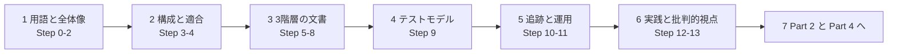

| 段階 | ゴール | 次にやること |
|---|---|---|
| 1 | Part 1〜4 の役割を説明できる | Part 2 のプロセス図と Part 3 の文書を対応づける |
| 2 | 適合の2種類と shall/should/may を説明できる | 自組織の文書を Annex A と照らす |
| 3 | 文書13種の目的を1行で言える | 自プロジェクトの既存成果物とマッピングする |
| 4 | テストモデルからカバレッジアイテム、テストケースまでを説明できる | Part 4 の技法を1つ選んで例を作る |
| 5 | トレーサビリティの取り方を設計できる | ツールのリンク機能で追跡を試す |

### 14-2. 理解度チェック

**Q1.** Part 3 は何を定めた規格ですか？

答え
テストプロセス（Part 2）の成果物として作るテスト文書のテンプレート（記載すべき情報）です。

**Q2.** 2021年版で「テスト条件」に代わって導入された概念は？

答え
テストモデル（test model）です。

**Q3.** 完全適合とテーラード適合の違いは？

答え
完全適合はすべての shall を満たす。テーラード適合は使う文書のサブセットを記録し、そのサブセットの shall を満たす。要求を外す場合は理由が必要です。

**Q4.** テスト戦略は独立した文書ですか？

答え
いいえ。テスト計画の一部です。

**Q5.** 「実際の結果」と「テスト結果」の違いは？

答え
実際の結果は実行で観察された内容。テスト結果は、それが期待結果と一致したかどうか（合格/不合格）の判定です。

**Q6.** ステータスレポートにあって完了報告書にない項目は？

答え
Planned testing（今後の予定のテスト）。逆に、Residual risks・Reusable test assets・Lessons learned などは完了報告書側の項目です。

**Q7.** 文書は紙や Word でなければ適合できませんか？

答え
いいえ。テスト管理ツールの記録やスプレッドシートなど電子形式、他文書との統合でも構いません。

**Q8.** Annex A と Annex C〜R の位置づけの違いは？

答え
Annex A は規定（要求・推奨・許可の一覧）。Annex C〜R は参考の記入例です。

---

## 参考ソース一覧（URL）

### 一次情報（規格の発行元）

| # | ソース | 使った情報 | URL |
|---|---|---|---|
| 1 | ISO — ISO/IEC/IEEE 29119-3:2021 | 版、発行日、ページ数、ステージ、範囲、対象読者、旧版との関係 | https://www.iso.org/standard/79429.html |
| 2 | IEEE SA — IEEE/ISO/IEC 29119-3-2021 | ステータス、承認日、WG 議長、附属書構成の概要、シリーズ各パートの状況 | https://standards.ieee.org/ieee/29119-3/7499/ |
| 3 | IEEE Xplore — 29119-3-2021（抄録） | 附属書構成、テンプレートの並びの説明 | https://ieeexplore.ieee.org/document/9687477 |
| 4 | 規格の前付け・目次サンプル（iTeh Standards の公開サンプル） | 章・節構成、用語定義、適合、前付けの変更点、序文 | https://cdn.standards.iteh.ai/samples/79429/27623aa24dba41a2876884c0ec57f5d7/ISO-IEC-IEEE-29119-3-2021.pdf |

### 規格策定関係者・国際的な実務家の情報

| # | ソース | 発信者 | 使った情報 | URL |
|---|---|---|---|---|
| 5 | ISO 29119 Testing Standards（ホワイトペーパー） | Stuart Reid | シリーズの概要と策定の背景 | https://www.stureid.info/stuart-reid-software-testing/software-testing-white-papers/iso-29119-testing-standards/ |
| 6 | ISO 29119 Software Testing Standards（ワークショップ案内） | Stuart Reid | リスクベース、ライフサイクル別のテーラリング | https://www.stureid.info/stuart-reid-software-testing/software-testing-workshops-seminars/workshop-isoiecieee-software-testing-standards/ |
| 7 | ISO 29119: Current Status & Future Plans（スライド） | Stuart Reid | 標準の位置づけ（ガイドライン、合意） | https://www.stureid.info/wp-content/uploads/2019/11/29119-Odin-Slides.pdf |
| 8 | The software testing schism（SD Times） | 報道（Reid・Bach ほかの発言を収録） | 2014年の賛否両論 | https://sdtimes.com/applause/software-testing-schism/ |
| 9 | How Not to Standardize Testing | James Bach | 批判側の主張 | https://www.satisfice.com/blog/archives/1464 |
| 10 | Frequently-Asked Questions About the 29119 Controversy | Michael Bolton（DevelopSense） | 批判側の主張の整理 | https://developsense.com/blog/2014/09/frequently-asked-questions-about-the-29119-controversy |
| 11 | Please sign the Petition to Stop ISO 29119 | Context-Driven Testing コミュニティ | 反対署名活動の経緯 | https://context-driven-testing.com/please-sign-the-petition-to-stop-iso-29119/ |
| 12 | ISO/IEC 29119（Wikipedia） | 百科事典項目（Reid の文献を引用） | シリーズ全体の経緯（2013年版の文書一覧など） | https://en.wikipedia.org/wiki/ISO/IEC_29119 |

### 参考にした旧版資料

| # | ソース | URL |
|---|---|---|
| 13 | ISO/IEC/IEEE 29119-3:2013 | https://www.iso.org/standard/56737.html |

> **利用上の注意**
>
> - 規格本体は有償です（ISO ストアでは PDF+ePub が CHF 227 と表示、2026年9月28日時点）。
> - ISO のサイトには、コンテンツの AI 利用に関する著作権上の注意書きがあります。本ガイドは要点のみを言い換えた要約であり、規格の本文は転載していません。
> - 実際の適合主張・監査・契約での引用には、規格の正式版（Annex A を含む）を必ずご確認ください。
> - 第三者（Bach、Bolton ら）の意見は個人・コミュニティの見解であり、規格の公式見解ではありません。
