# ISO/IEC TR 29119-13:2022 初学者向けステップバイステップ解説ガイド

**対象規格:** ISO/IEC TR 29119-13:2022
*Software and systems engineering — Software testing — Part 13: Using the ISO/IEC/IEEE 29119 series in the testing of biometric systems*
（ソフトウェアおよびシステムエンジニアリング ― ソフトウェアテスト ― 第13部: 生体認証システムのテストにおけるISO/IEC/IEEE 29119シリーズの使用）

**調査基準日:** 2026年10月4日
**想定読者:** QAエンジニア／テスト担当者／生体認証システムを初めてテストする人／生体認証の専門家でリスクベースドテストを学びたい人

---

## 0. 本ガイドの読み方（重要）

ISO/IEC TR 29119-13 は有料規格です（ISOストアで CHF 227、全274ページ）。本ガイドは **公開されている目次・抄録・序文・本文サンプル** と、関連する公開資料をもとに、**著者自身の言葉で再構成した解説** です。規格本文の転載ではありません。

記述の根拠レベルを、次の3種類のラベルで区別しています。

| ラベル | 意味 |
|---|---|
| 【TR確認済】 | ISO公式ページや公開プレビュー（目次・序文・本文冒頭部）で内容を確認できた事項 |
| 【一般知識】 | 生体認証・テスト工学の一般的な知識。TR本文での記載は未確認 |
| 【例示】 | 理解を助けるために本ガイド筆者が作った具体例。TRの記載ではない |

> **注意:** Annex C（生成リスク一覧、約45ページ）や Annex E〜K の詳細マッピングは有料部分です。本ガイドではその**構造と使い方**を解説し、個別のリスク項目や対応表の中身は【例示】として示します。実務で適用する際は、必ず規格本文を購入して確認してください。

---

## 1. 30秒サマリ

| 質問 | 答え |
|---|---|
| これは何？ | **生体認証システムを、ISO/IEC/IEEE 29119（ソフトウェアテスト規格）に沿ってテストするための技術報告書（TR）** |
| 何がうれしい？ | 生体認証の専門家向け規格（ISO/IEC 19795系）と、ソフトウェアテスト規格（29119系）の**橋渡し**ができる |
| 一番のポイントは？ | 誤り率・スループットだけでなく、**信頼性・セキュリティ・使いやすさ・プライバシー規制適合まで含む全品質特性**を **リスクベース** でテストする |
| 規格ですか？ | **いいえ、TR（技術報告書）**。要求事項（shall）を課す文書ではなく、**情報提供・指針** の文書 |
| 付属するものは？ | 生体認証システムの**リスク例**、および19795系規格・29109-1と29119の**対応表（マッピング）** |

---

## 2. 文書の基本情報

【TR確認済】

| 項目 | 内容 |
|---|---|
| 規格番号 | ISO/IEC TR 29119-13:2022 |
| 種別 | Technical Report（技術報告書） |
| 版 | Edition 1 |
| 発行 | 2022年11月（ISOページ記載の発行日は2022-11-18） |
| ステージ | 60.60（International Standard published） |
| ページ数 | 274ページ |
| 担当委員会 | ISO/IEC JTC 1/SC 7（ソフトウェアおよびシステムエンジニアリング） |
| ICS | 35.080（Software） |
| 言語 | 英語 |

> 2026年10月4日時点で、ISOの規格ページには Edition 1 が Published として表示されており、より新しい版の表示は確認できませんでした（なお、販売サイトによって発行日が1日ずれる表記があります）。

### 2.1 TRとIS（国際規格）の違い

【TR確認済】序文には、技術報告書は通常の国際規格や技術仕様書とは異なり、「state of the art（技術の現状）」のようなデータを含む文書だと書かれています。

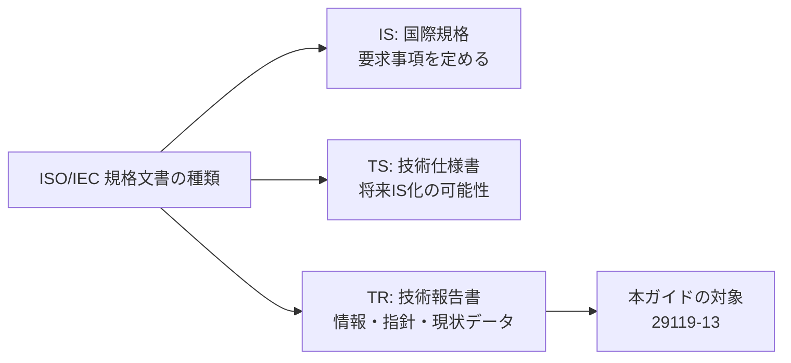

つまり、**「この通りにやらなければ不適合」という文書ではなく、「こう適用すると良い」という手引き** として読むのが正しい姿勢です。

---

## 3. 全体像：このTRが解決する問題

### 3.1 背景にある2つの世界

【TR確認済】序文によると、生体認証の評価・テスト規格（ISO/IEC 19795シリーズなど）は次の特徴を持ちます。

- 生体認証の**専門家の視点**で書かれている
- 焦点は**技術的な性能テスト**（誤り率とスループット）
- **動的テスト**が中心
- 29119シリーズが求める**リスクベースのアプローチを明示的には使っていない**

一方、ソフトウェアテストの世界（29119）はリスクベースドテストを中核に据えています。このTRは、その**ギャップを埋める**ために作られました。

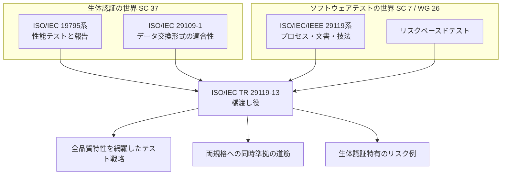

### 3.2 このTRの7つの柱

【TR確認済】（スコープの要点を言い換えたもの）

| # | 柱 | 初学者向けの言い換え |
|---|---|---|
| 1 | 体系的・リスクベースのテスト情報 | 「何を重点的にテストするか」をリストから決める方法 |
| 2 | 生体認証規格とテスト規格の重要性・概説 | 両方の世界の入門 |
| 3 | テスターにとって重要な生体認証規格の特定 | 「最低限これを知っておけ」の一覧 |
| 4 | 両規格の対応表 | 19795で書かれたことは29119のどこに当たるか |
| 5 | 性能だけに限らない品質特性 | 信頼性・可用性・保守性・セキュリティ・適合性・使いやすさ・人的要因・プライバシー規制適合 |
| 6 | リスクベースアプローチの適用 | 製品リスクとプロジェクトリスクの両方 |
| 7 | 文書化の対応表 | 19795-1, -2, -6 の文書要求と29119-3のテスト文書の対応 |

---

## 4. 文書の構成（目次マップ）

【TR確認済】公開されている目次に基づく構成です。

| 章・附属書 | タイトル | 本ガイドの対応Step |
|---|---|---|
| 1 | Scope（適用範囲） | Step 0, 3 |
| 2 | Normative references | 規定参照なし |
| 3 | Terms, definitions and abbreviated terms | Step 1, 2 |
| 4 | Introduction to biometrics | Step 1, 3 |
| 5 | Introduction to software testing | Step 4, 5 |
| 6 | Software testing of biometric systems and subsystems | Step 6, 7 |
| Annex A | Brief introduction to biometric systems | Step 1 |
| Annex B | Standards related to the testing of biometric systems | Step 3 |
| Annex C | Generic risks in biometric systems | Step 8 |
| Annex D | Test documentation mappings for biometric systems | Step 9 |
| Annex E〜K | 19795-1 / -2 / -4 / -6 / -7 / TS 19795-9 / 29109-1 から29119へのマッピング | Step 9 |

> **ポイント:** 274ページのうち、本編（1〜6章）は約20ページ程度で、**大半は附属書（Annex）** です。Annex C（リスク、約45ページ）と Annex E〜K（マッピング、約200ページ）が本体と言えます。**本編は短く、附属書がデータベース的な役割**を担っています。

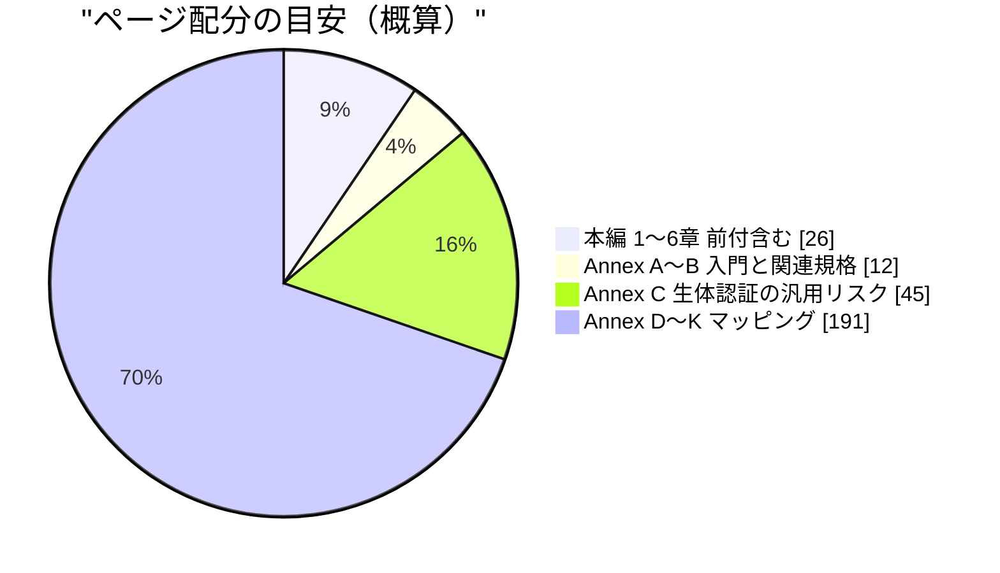

> 上の円グラフは、目次のページ番号から算出した概算値です。

---

## 5. Step 1：生体認証の基礎を押さえる

### 5.1 生体認証とは

【TR確認済】生体認証（biometric recognition）は、人の**身体的・行動的特徴**から個人を自動的に認識する仕組みです。パスワードやIDカードのように「覚える・持ち歩く」必要がない点が利点として挙げられています。

【TR確認済】利用場面の例として、国境管理、有権者認証、法執行、各種アクセス制御（コンピュータ、個人デバイス、建物、イベント会場）が挙げられています。

### 5.2 本編の用語（3.1節の主要用語）

【TR確認済】用語は ISO/IEC 2382-37:2022 や ISO/IEC 19795-1:2021 を出典としています。以下は初学者向けに言い換えたものです。

| 用語 | 初学者向けの意味 | 具体例【例示】 |
|---|---|---|
| biometric characteristic（生体特性） | 識別に使える身体・行動の特徴 | 指紋、顔、虹彩、静脈、署名の動き |
| biometric sample（生体サンプル） | 特徴抽出の前の画像・音声などの記録 | 指の画像ファイル |
| biometric feature（生体特徴量） | サンプルから取り出した、比較に使う数値・ラベル | 指紋の特徴点の集合 |
| biometric template（テンプレート） | 比較用に保存された特徴量の集合 | 登録済みの特徴点データ |
| biometric reference（登録データ） | 登録時に保存されるサンプル・テンプレート・モデル | パスポートのICチップ内の顔画像 |
| biometric probe（照合データ） | 今回の照合で入力される側のデータ | ゲートで撮った顔画像 |
| comparison（比較） | probeとreferenceの間の類似度または非類似度を推定・計算・測定すること | 類似度スコアまたは距離スコアの算出 |
| decision policy（判定ポリシー） | 比較結果を「一致／不一致／判定不能」にするルール。しきい値を含むことが多い | スコア ≥ 0.80 なら一致 |
| verification（検証／1:1） | 「私はAです」という申告をreferenceと照合して確認する | スマホの顔ロック解除 |
| identification（識別／1:N） | データベース全体から該当者を探す | 犯罪捜査の照合 |
| multi-modal system（ISO/IEC 2382-37 の定義） | 生体特性・センサ・処理方法の3つの観点のうち、少なくとも2つで複数の種類を使うシステム | 顔＋指紋 |
| multi-modal biometric system（TR 29119-13 3.1.31） | 複数の生体特性を使う生体認証システム | 顔と指紋の両方で照合する入退室ゲート |

> **用語の注意点:** 【TR確認済】非推奨とされるのは、「比較する」「判定する」という意味で使う**動詞の「match（マッチさせる）」** です。この意味では **compare（比較する）** を使うのが推奨です。一方、**名詞の「match」** は「比較の結果、一致と判定されたこと（肯定的な比較結果）」を表す用語として使われます。また verification の旧称 authentication も非推奨扱いです。会話では「マッチング」と言いがちですが、規格文書を読むときはこの用語の違いに注意してください。

### 5.3 生体認証システムの基本フロー

【一般知識】多くの生体認証システムは「登録（enrolment）」と「認識（recognition）」の2つのフェーズで動きます。TRの6.2.2節にも「Biometric enrolment and recognition」という節があります。

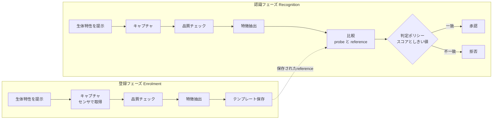

---

## 6. Step 2：生体認証特有の性能指標を理解する

TRの本編6.1.3節は「Performance measures for biometric systems」を扱います。用語定義（3.1節）で確認できる主要指標を整理します。

### 6.1 誤りの種類と指標【TR確認済】

| 指標 | 正式名称 | 意味（言い換え） | 分母 |
|---|---|---|---|
| **FMR** | False Match Rate（他人受入率・比較レベル） | 本人でない組の比較のうち、誤って一致と判断された割合 | 完了した非同一人物（non-mated）比較の試行数 |
| **FNMR** | False Non-Match Rate（本人拒否率・比較レベル） | 同一人物（mated）の比較のうち、誤って不一致と判断された割合 | 完了した同一人物比較の試行数 |
| **FAR** | False Accept Rate | 偽の本人申告（verification）が誤って受け入れられた割合 | 偽の申告のverification取引数 |
| **FRR** | False Reject Rate | 正しい本人申告が誤って拒否された割合 | 正しい申告のverification取引数 |
| **FNIR** | False-Negative Identification Rate | 登録者がidentificationしたのに、正しい識別子が返らなかった割合 | 登録者のidentification取引数 |
| **FPIR** | False-Positive Identification Rate | 未登録者のidentificationで、何らかの識別子が返ってしまった割合 | 未登録者のidentification取引数 |
| **FTE** | Failure to Enrol | 登録方針上の対象者について、生体登録データを作成・保存できなかった**事象**（登録対象外の人を登録しないことは含まない） | — |
| **FTER** | Failure-to-Enrol Rate | 登録取引のうち FTE となった**割合** | 登録取引数 |
| **FTA** | Failure to Acquire | 比較に使えるサンプルを取得できなかった**事象** | — |
| **FTAR** | Failure-to-Acquire Rate | 取得処理のうち FTA となった**割合** | 取得処理数 |
| **FTC** | Failure to Capture | キャプチャ処理自体がサンプルを出力できなかったこと | — |
| **Throughput rate** | スループット | 単位時間に処理できる人数 | — |
| **DET** | Detection Error Trade-off | しきい値を動かしたときの誤拒否と誤受入のトレードオフ関係 | — |

> **FMR/FNMR と FAR/FRR の違い（初学者がつまずくポイント）**
> FMR/FNMR は「**1回の比較**」レベルの誤り率、FAR/FRR は「**取引（transaction）**」レベルの誤り率です。取引は複数回のキャプチャ試行を含みうるため、両者は一致しません。さらに FTA/FTE の扱いによって値が変わります。【TR確認済】用語定義では「完了した（completed）比較」のみを分母とし、判定不能（failure to decide）は除外すると注記されています。

### 6.2 しきい値のトレードオフ

【TR確認済】FMRとFNMRの値は、しきい値や比較プロセスのパラメータ、試験プロトコルに依存します。

> **注:** 次の図は、**スコアが高いほど類似度が高い**（類似度スコア）システムを前提にしています。距離スコア（値が小さいほど似ている）を使うシステムでは、しきい値を上げ下げしたときの FMR・FNMR への効果が逆になる場合があります。

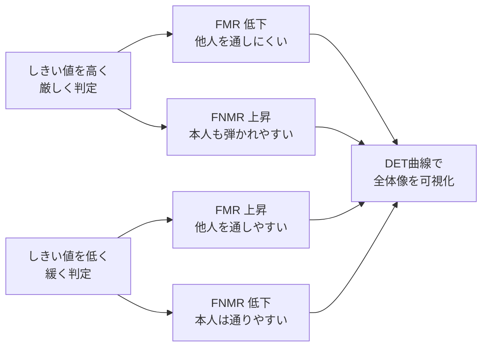

### 6.3 計算例【例示】

ある顔認証システムの評価で、次の結果が得られたとします。

| 項目 | 値 |
|---|---|
| 本人同士の比較（mated）回数 | 2,000 |
| そのうち誤って不一致 | 30 |
| 他人同士の比較（non-mated）回数 | 1,000,000 |
| そのうち誤って一致 | 50 |
| 登録試行 | 500 |
| 登録失敗 | 10 |

計算は次のとおりです。

- **FNMR** = 30 ÷ 2,000 = **1.5 %**
- **FMR** = 50 ÷ 1,000,000 = **0.005 %**（= 5 × 10⁻⁵）
- **FTER** = 10 ÷ 500 = **2.0 %**

**読み解き:** この例ではFMRは低い（他人は通しにくい）ものの、FNMRが1.5%、FTERが2.0%あり、「本人が弾かれる」「そもそも登録できない」体験の悪さがリスクとして残ります。**FMRだけを見て合格にすると、ユーザビリティや運用面のリスクを見逃します。** これがこのTRの主張（性能だけでなく全品質特性を見る）につながります。

### 6.4 サンプルサイズの考え方【一般知識】

誤り率を統計的に主張するには十分な試行数が必要です。有名な目安として「**3の法則（rule of 3）**」があります。N回の独立な試行でエラーが0件だった場合、95%信頼上限はおよそ 3/N です。たとえばFMRが 10⁻⁴ 以下であると95%信頼で主張したければ、独立な比較がおよそ30,000回必要です。ただし、同じ被験者由来の比較は独立でないため、実際は被験者数・被験者の多様性も重要になります。詳細な試験設計はISO/IEC 19795-1/-2に委ねられます。

---

## 7. Step 3：標準化の地図を頭に入れる

### 7.1 関係する標準化組織【TR確認済】

| 組織 | 役割 |
|---|---|
| ISO/IEC JTC 1 | 情報技術の合同技術委員会 |
| **JTC 1/SC 37** | **生体認証** の標準化。共通ファイル形式、API、データ交換形式、プロファイル、評価基準の適用、性能テスト方法論など |
| **JTC 1/SC 37/WG 5** | **生体認証のテストと報告** |
| JTC 1/SC 17 | 個人識別用のカードとセキュリティデバイス |
| JTC 1/SC 27 | 情報セキュリティ、サイバーセキュリティ、プライバシー保護 |
| **JTC 1/SC 7** | ソフトウェアおよびシステムエンジニアリング |
| **JTC 1/SC 7/WG 26** | **ソフトウェアテスト**（29119シリーズを作成。2007年設立） |

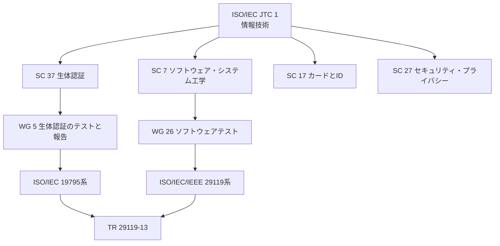

### 7.2 Annex Bで扱われる関連規格と、TRがマッピングする規格

【TR確認済】序文に、次の規格との**マッピング**が提供されると明記されています。

| 規格 | 内容（一般的な理解）【一般知識】 | 文書要求のマッピング（Annex D） |
|---|---|---|
| ISO/IEC 19795-1 | 性能テストと報告の原則と枠組み | ○ |
| ISO/IEC 19795-2 | 技術評価・シナリオ評価のテスト方法論 | ○ |
| ISO/IEC 19795-4 | 相互運用性の性能テスト | — |
| ISO/IEC 19795-6 | 運用評価の方法論 | ○ |
| ISO/IEC 19795-7 | カード内（on-card）比較アルゴリズムのテスト | — |
| ISO/IEC TS 19795-9 | モバイルデバイス上の性能テスト | — |
| ISO/IEC 29109-1 | 生体データ交換形式の適合性試験の方法論 | — |

> 各規格の内容説明は【一般知識】であり、TRの記述そのままではありません。タイトルの正確な確認は各規格のISOページで行ってください。

【TR確認済】ISO/IEC 19795-1:2021 のスコープでは、**プレゼンテーション攻撃（なりすまし等、意図的にシステムを欺く行為）に対する誤り率・スループットの測定は対象外**とされています。この領域は一般に ISO/IEC 30107 シリーズ（PAD: Presentation Attack Detection）で扱われます。TR 29119-13 でも、セキュリティ品質特性のテストを検討する際にPADのような関連規格との関係に留意すると良いでしょう【一般知識】。

---

## 8. Step 4：ISO/IEC/IEEE 29119 シリーズを復習する

### 8.1 29119のモデル【TR確認済】

TR本文（5.5.2節）では、29119のモデルは**テストプロセスを中心**に置き、テスト文書はプロセスの**成果物**であると説明されています。テスト設計技法は29119-4に、全体の概念は29119-1に定義されます。

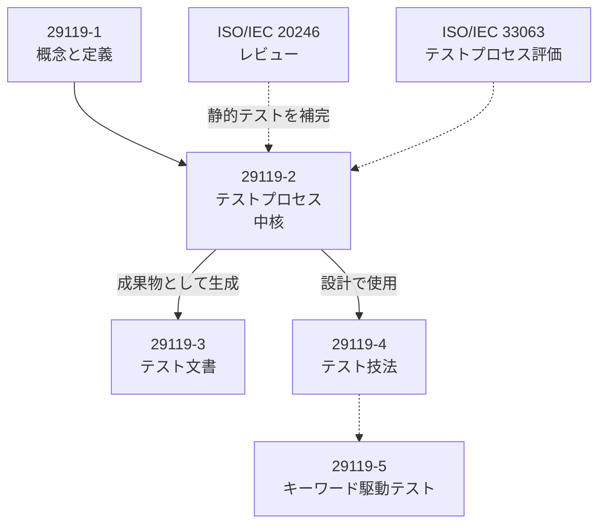

### 8.2 29119が適用できる範囲【TR確認済】

| 観点 | 29119は… |
|---|---|
| 品質特性 | 機能・非機能の**全品質特性**に適用可 |
| 業界 | **あらゆる産業分野** |
| 重要度 | 安全重視・非安全重視の**どちらにも** |
| 手法 | 探索的テスト・スクリプト化テスト**どちらにも** |
| ライフサイクル | ウォーターフォール、V字、アジャイル（Scrum, Kanban等）**どれでも** |
| 自動化 | **自動化テスト**にも |

### 8.3 歴史【TR確認済】

| 年 | 出来事 |
|---|---|
| 2007 | 新テスト規格群の提案がISOで承認、WG 26設立（IEEE 829、BS 7925-1/-2などをベース） |
| 2013 | 29119の最初の3パート（-1, -2, -3）発行 |
| 2015 | 29119-4発行 |
| 2016 | 29119-5発行 |
| 2017年2月 | ISO/IEC 20246（レビュー）発行 |
| 2021 | 29119-2、-3、-4 の第2版発行 |

> 関連する各パートの詳しい解説は、同シリーズの各ガイド（29119-1〜5）を参照してください。

### 8.4 静的テストと動的テスト【TR確認済】

| 種類 | 内容 | 例 |
|---|---|---|
| **静的テスト** | テスト対象（要求仕様・設計仕様・コードなど）を実行せずに評価する | レビュー（インスペクション、テクニカルレビュー、ウォークスルー、非公式レビュー）、静的解析ツール |
| **動的テスト** | コードを実行してテストケースを走らせる | ブラックボックス、ホワイトボックス、グレーボックス |

【TR確認済】従来の19795系は動的テスト中心ですが、このTRは**静的・動的の両方**を対象にします（6.2.5節）。

---

## 9. Step 5：リスクベースドテスト（RBT）— このTRの心臓部

### 9.1 RBTとは【TR確認済】

リスクベースドテスト（Risk-Based Testing）は、**リスクをテスト戦略の内容を決める最大の推進力**とする考え方で、29119シリーズの中核概念です。TRの5.6節がこれを解説しています。

### 9.2 リスク管理プロセス【TR確認済】

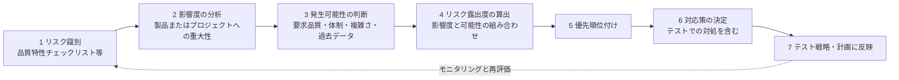

【TR確認済】リスク識別では、ISO/IEC 25010 の品質特性に基づくチェックリストを使うことがある、と述べられています。

### 9.3 リスクの2分類【TR確認済（5.6.2節の存在）／内容は一般知識】

| 分類 | 意味 | 例【例示】 |
|---|---|---|
| **製品リスク** | 納品された製品が引き起こす問題 | 誤認証で他人が入室できる／本人が入れない |
| **プロジェクトリスク** | プロジェクトの進行を妨げる問題 | 被験者の募集が遅れる／テストデータの確保が困難 |

### 9.4 リスク露出度の算出例【例示】

影響度と発生可能性を3段階（1=低, 2=中, 3=高）で評価し、積を露出度とします。

| リスクID | リスク（例） | 影響度 | 発生可能性 | 露出度 | 優先度 |
|---|---|---|---|---|---|
| R-01 | 他人受入（FMRが要件より高い） | 3 | 2 | **6** | 高 |
| R-02 | 暗所・逆光での本人拒否増加 | 2 | 3 | **6** | 高 |
| R-03 | 特定の年齢層・属性で誤り率が偏る | 3 | 2 | **6** | 高 |
| R-04 | 生体データの漏えい・不適切保管 | 3 | 1 | **3** | 中 |
| R-05 | センサ故障時のフォールバック不全 | 2 | 2 | **4** | 中 |
| R-06 | 試験用被験者の確保遅延（プロジェクト） | 1 | 3 | **3** | 中 |

> 露出度の高いものから、**テスト工数・テスト技法・テストの深さ**を厚く配分します。露出度の低いものは軽く扱う、あるいは対象外とすることを合意します。

---

## 10. Step 6：生体認証システムのテスト範囲（6.2節）

【TR確認済】6.2節の構成は次のとおりです。

| 節 | タイトル | 要点（初学者向けの言い換え） |
|---|---|---|
| 6.2.2 | Biometric enrolment and recognition | 登録と認識の**両方**のプロセスをテスト対象にする |
| 6.2.3 | Biometric components and supporting components | センサやアルゴリズムなどの**生体認証コンポーネント**と、それを支える**周辺コンポーネント**（DB、UI、通信など） |
| 6.2.4 | Biometric subsystem as part of a larger system | 生体認証が**大きなシステムの一部**である場合の扱い |
| 6.2.5 | Static and dynamic testing of the biometric system | **静的・動的の両方**で評価 |
| 6.2.6 | Testing all quality characteristics or limited to biometric performance | 全品質特性か、生体認証性能に限定するかの判断 |

### 10.1 テスト対象のスコープ図【例示】

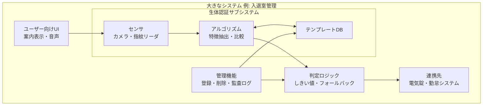

### 10.2 「性能だけ」vs「全品質特性」

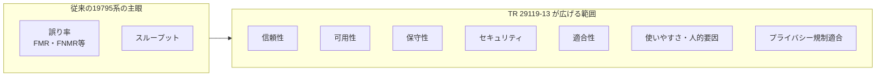

【TR確認済】上の品質特性は、スコープに明記された列挙（reliability, availability, maintainability, security, conformance, usability, human factors, privacy regulation compliance）に基づきます。

---

## 11. Step 7：従来の評価（19795系）とTRの違い

### 11.1 評価レベル【一般知識】

TR 6.1.2節は「Evaluation levels for biometric systems」を扱います。生体認証の評価は一般に次の3レベルで語られます（ISO/IEC 19795系の考え方）。TRの該当節の詳細な文言は有料のため未確認ですが、概念の理解用に示します。

| レベル | 概要 | 特徴 |
|---|---|---|
| **技術評価（Technology evaluation）** | 蓄積済みのデータセットでアルゴリズムを評価 | 再現性が高い、条件を統制しやすい |
| **シナリオ評価（Scenario evaluation）** | 模擬的な運用環境で被験者を使って評価 | 人とセンサの相互作用を含む |
| **運用評価（Operational evaluation）** | 実際の運用環境で評価 | 現実に最も近いが統制は難しい |

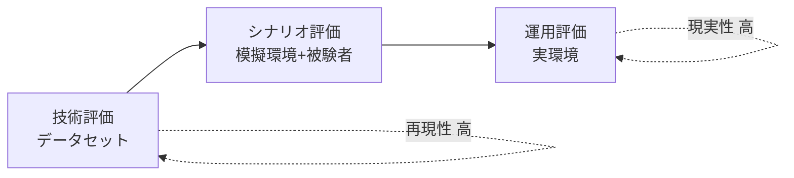

### 11.2 従来評価とTRアプローチの比較

【TR確認済】（序文の記述を整理）

| 観点 | 従来の生体認証評価（19795系） | TR 29119-13 のアプローチ |
|---|---|---|
| 視点 | 生体認証の専門家 | ソフトウェアテスターにも分かる |
| 主眼 | 誤り率・スループット | **全品質特性** |
| テスト形態 | 動的テスト中心 | **静的＋動的** |
| 戦略の決め方 | 明示的なリスクベースではない | **リスクベース** |
| 対象 | 生体認証システム／アルゴリズム | 生体認証システム＋**生体認証を含む大規模システム** |
| 文書 | 19795の文書要求 | **29119-3のテスト文書**との対応付け |

---

## 12. Step 8：品質特性ごとのテスト観点（具体化）

> ここは【例示】です。TRの品質特性の列挙を、実務で動かせる観点に落とし込んだ本ガイド筆者のたたき台です。Annex Cのリスク項目そのものではありません。

| 品質特性 | テスト観点の例 | 主な技法の例（29119-4系）【一般知識】 |
|---|---|---|
| **性能（誤り率）** | FMR/FNMRが比較しきい値ごとに要件を満たすか、FTER/FTAR（FTE・FTAの発生率）が要件の率以内に収まるか | 統計的評価、DET分析 |
| **性能（スループット）** | ピーク時の1時間あたり処理人数 | 負荷テスト、性能テスト |
| **信頼性** | 連続稼働、センサ劣化、異常入力時の挙動 | 耐久テスト、状態遷移テスト |
| **可用性** | 障害時のフォールバック（暗証番号、有人対応など） | 障害注入、フェイルオーバー確認 |
| **保守性** | アルゴリズム更新後の再登録要否、ログの追跡可能性 | 回帰テスト、レビュー |
| **セキュリティ** | テンプレート保護、通信の暗号化、なりすまし（PAD）対策 | ペネトレーション、脆弱性評価、PAD評価 |
| **適合性** | データ交換形式の仕様準拠、API仕様準拠 | 適合性テスト（29109-1の考え方） |
| **使いやすさ・人的要因** | 提示姿勢の分かりやすさ、再試行の負担、アクセシビリティ | ユーザビリティテスト、探索的テスト |
| **プライバシー規制適合** | 同意取得、保存期間、削除要求への対応（例: GDPR） | レビュー、監査、シナリオテスト |

> TRの略語一覧にも **GDPR**（一般データ保護規則）が含まれており【TR確認済】、プライバシー規制適合がテストの検討対象であることが示唆されています。

### 12.1 人口統計的な偏り（デモグラフィック差）のテスト

【一般知識／外部情報】米国標準技術研究所（NIST）の顔認識評価（FRTE/旧FRVT）は、性別・年齢・出身地域などの属性ごとにFMR/FNMRを分解して報告しており、**アルゴリズムによって属性間の誤り率の差（demographic differentials）が存在する**ことを示しています。NISTはこの差を要約する指標について NIST IR 8429（2022年7月）でまとめています。

これは、TRの品質特性でいう「人的要因」や「公平性」に関わる観点として、**全体平均の誤り率だけで合否を決めない**ことの重要性を裏付ける材料になります。

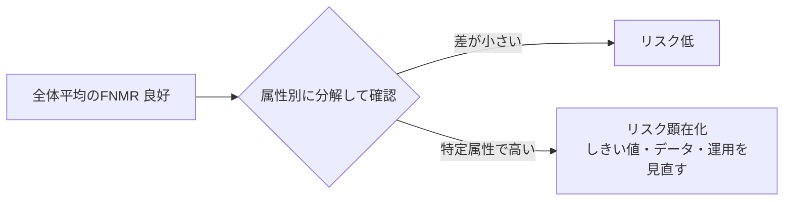

---

## 13. Step 9：Annex C（汎用リスク）と文書化マッピング（Annex D〜K）

### 13.1 Annex C：生体認証システムの汎用リスク

【TR確認済】Annex C（約45ページ）は、生体認証システムに関連する**製品リスクとプロジェクトリスクの例**を提供し、**それらをRBTの一部としてどう扱うか**の提案も含みます。

**活用手順【一般知識に基づく使い方の提案】**

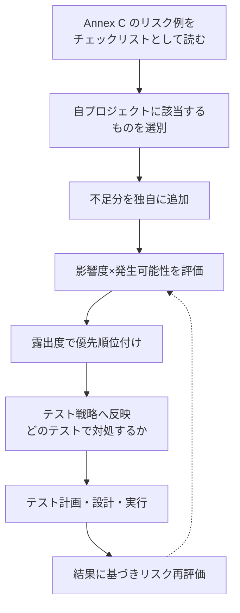

> **注意:** Annex Cを**丸ごと使う必要はありません**。「例」ですので、プロジェクトの文脈に合わせて取捨選択し、足りないものを補うのが本来の使い方です。

### 13.2 文書化のマッピング（Annex D〜K）

【TR確認済】

| Annex | 内容 | ページ（目次より） |
|---|---|---|
| D | 生体認証システムのテスト文書マッピング（19795-1, -2, -6 と 29119-3） | p.77〜 |
| E | ISO/IEC 19795-1 → 29119 | p.97〜 |
| F | ISO/IEC 19795-2 → 29119 | p.150〜 |
| G | ISO/IEC 19795-4 → 29119 | p.194〜 |
| H | ISO/IEC 19795-6 → 29119 | p.226〜 |
| I | ISO/IEC 19795-7 → 29119 | p.236〜 |
| J | ISO/IEC TS 19795-9 → 29119 | p.247〜 |
| K | ISO/IEC 29109-1 → 29119 | p.261〜 |

**使い方のイメージ【例示】**

```mermaid
flowchart LR
    A["生体認証の試験計画書<br/>19795-2に沿って作成"] -->|Annex Fの対応表| B["29119-3の<br/>テスト計画に該当する要素"]
    A -->|Annex Dの対応表| C["29119-3の<br/>テスト戦略などに該当する要素"]
    B --> D["両規格に準拠した<br/>1つの文書体系"]
    C --> D
```

つまり、**「19795に従った文書を作れば、29119の文書要求のうちどこまで満たせるか」**、逆に **「29119に従った文書に、19795が要求する情報をどう入れるか」** を確認するための辞書です。

### 13.3 参考：29119-3 の主なテスト文書【一般知識】

マッピングの「右辺」になる29119-3の文書は、一般的に次のようなものです（2021年版）。

| 区分 | 文書例 |
|---|---|
| 組織レベル | 組織テスト方針、組織テスト戦略 |
| 管理 | テスト計画、テスト状況報告、テスト完了報告 |
| 設計・実装 | テスト設計仕様、テストケース仕様、テスト手順仕様 |
| データ・環境 | テストデータ要求、テスト環境要求、各準備状況報告 |
| 実行・結果 | 実測結果、テスト結果、インシデント報告 |

---

## 14. Step 10：実務で使うエンドツーエンドの流れ【例示】

### 14.1 全体ワークフロー

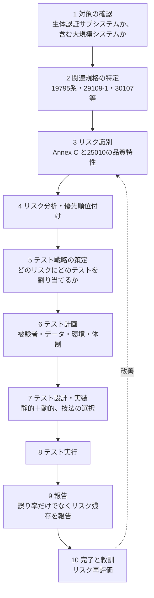

### 14.2 リスクからテストへの対応関係の例

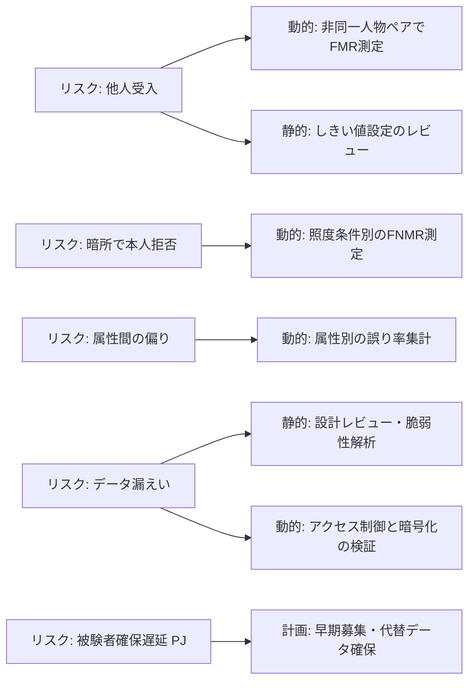

### 14.3 ミニケーススタディ【例示】：オフィスの顔認証入退室ゲート

**状況:** 従業員3,000人のオフィスに顔認証ゲートを導入。要件は「他人受入率 FMR ≤ 10⁻⁵（しきい値固定）」「通過所要時間 3秒以内」「個人情報保護法・社内規程への適合」。

| ステップ | 実施内容 |
|---|---|
| 1. スコープ | 顔認証サブシステム（カメラ・アルゴリズム）＋ゲート制御＋管理画面＋勤怠連携 |
| 2. リスク識別 | 誤認証、暗所、マスク着用、眼鏡、登録失敗、フォールバック、データ保護、ピーク時混雑 |
| 3. 分析 | 他人受入（影響度3）、ピーク時混雑（影響度2・可能性3）などを数値化 |
| 4. 戦略 | 高露出度リスクに**動的テスト**（誤り率測定、負荷）、設計リスクに**静的テスト**（レビュー）を割当 |
| 5. 設計 | 照度・姿勢・マスク有無などの条件の組合せをテスト条件として整理 |
| 6. 実行 | 技術評価（データセット）→シナリオ評価（模擬環境）の順に実施 |
| 7. 報告 | FMR/FNMR/FTER・所要時間に加え、**残存リスク**（例: 暗所FNMR高）を提示して運用判断へ |

---

## 15. よくある誤解とQ&A

| 質問 | 回答 |
|---|---|
| Q1. このTRに準拠すれば認証や適合マークがもらえる？ | いいえ。TRは**情報提供の文書**であり、認証制度の基準ではありません。 |
| Q2. 19795を使っていれば29119は不要？ | 19795は性能テストの専門規格です。TRによれば、**リスクベースの戦略と全品質特性**の観点は19795だけではカバーされません。両者の併用が前提です。 |
| Q3. 誤り率さえ良ければ合格でよい？ | TRの主張の核心は、**それでは不十分**という点です。信頼性・セキュリティ・使いやすさ・プライバシー規制適合も検討対象です。 |
| Q4. なりすまし（プレゼンテーション攻撃）のテストは？ | 19795-1が対象外と明記しているのは、**意図的にシステムを欺こうとする人が関与する場合の誤り率・スループットの測定**です【TR確認済】。プレゼンテーション攻撃のテスト全般を対象外としているわけではありません。PADの評価は一般にISO/IEC 30107系で扱われます【一般知識】。 |
| Q5. 生体認証を使う小さな機能だけでもTRは使える？ | 使えます。TRは**「生体認証サブシステムを含む大規模システム」**も対象です【TR確認済】。 |
| Q6. Annex Cのリスクを全部やる必要がある？ | ありません。例の集合です。自プロジェクトに合わせて取捨選択します。 |
| Q7. TRは頻繁に改訂される？ | 公開情報では Edition 1（2022）のみが確認できます。今後の改訂状況はISOページで確認してください。 |

---

## 16. 学習ロードマップとチェックリスト

### 16.1 おすすめの学習順序

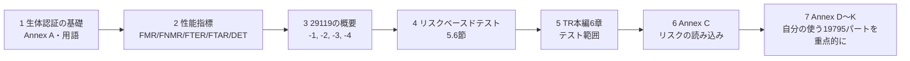

### 16.2 理解度チェックリスト

- [ ] TRが「規格」ではなく「技術報告書」である意味を説明できる
- [ ] 19795系とTR 29119-13の役割の違いを説明できる
- [ ] FMR・FNMR・FTER・FTARを自分の言葉で定義し、計算できる（FTE・FTAは失敗事象、FTER・FTARはその発生率であることを区別できる）
- [ ] FMR/FNMR（比較レベル）とFAR/FRR（取引レベル）の違いを説明できる
- [ ] しきい値の動かし方で誤りがどう変わるか説明できる
- [ ] リスク露出度を「影響度×発生可能性」で算出し、優先順位付けできる
- [ ] 製品リスクとプロジェクトリスクの違いを例で示せる
- [ ] 「性能だけでなく全品質特性」を具体例で説明できる
- [ ] 19795-1がプレゼンテーション攻撃を対象外とする点を説明できる
- [ ] Annex D〜Kがどんな時に役立つか説明できる

---

## 17. 根拠ソース一覧（URL）

### 17.1 TR 29119-13 本体に関する一次・準一次情報

| # | ソース | URL | 確認できた内容 |
|---|---|---|---|
| 1 | ISO公式ページ（ユーザー指定） | <https://www.iso.org/standard/84220.html> | 抄録（スコープ）、発行情報、ステージ、ページ数、価格、ライフサイクル |
| 2 | iTeh Standards（プレビュー付き） | <https://iteh.eu/catalog/standards/iso/8c9ed595-2e6e-4c76-a529-de8bca9587f6/iso-iec-tr-29119-13-2022> | 目次、序文、1〜5章の本文冒頭部、用語・略語定義（3章）、RBTプロセス |
| 3 | iTeh 本文サンプルPDF | <https://cdn.standards.iteh.ai/samples/84220/00d7065b0dde496d97ff8d4de23fd8d8/ISO-IEC-TR-29119-13-2022.pdf> | 上記プレビューの元ファイル |
| 4 | IEC Webstore | <https://webstore.iec.ch/publication/80294> | 抄録の確認（ISOページと同内容） |
| 5 | 委員会ISOページ | <https://committee.iso.org/standard/84220.html?browse=ics> | 抄録の確認 |

### 17.2 関連する生体認証規格・評価活動

| # | ソース | URL | 用途 |
|---|---|---|---|
| 6 | ISO/IEC 19795-1:2021 ISOページ | <https://committee.iso.org/standard/73515.html> | 性能テストの原則、プレゼンテーション攻撃が対象外である点 |
| 7 | IEC Webstore（19795-1） | <https://webstore.iec.ch/en/publication/69063> | 19795-1のスコープ確認 |
| 8 | NIST FRTE 1:1 Verification | <https://pages.nist.gov/frvt/html/frvt11.html> | FNMR/FMRの定義、継続的な顔認識評価 |
| 9 | NIST FRTE Demographics | <https://pages.nist.gov/frvt/html/frvt_demographics.html> | 属性別の誤り率差、NIST IR 8280 / 8429への参照 |
| 10 | NIST IR 8280（2019） | <https://nvlpubs.nist.gov/nistpubs/ir/2019/NIST.IR.8280.pdf> | 顔認識の人口統計的効果 |
| 11 | arXiv 2203.05051 | <https://arxiv.org/pdf/2203.05051> | NIST FRVTデータを用いた公平性指標の評価 |

### 17.3 プレゼンテーション攻撃検知（PAD）関連

| # | ソース | URL | 用途 |
|---|---|---|---|
| 12 | Christoph Busch氏 講義資料（2024年7月） | <https://christoph-busch.de/files/Busch-PAD-240701.pdf> | ISO/IEC 30107-1/-3の枠組みと指標（APCER/BPCER） |
| 13 | iBeta PAD確認書の例（Alchera, 2024年4月） | <https://www.ibeta.com/wp-content/uploads/2024/04/240418-Alchera-PAD-Level-1-Confirmation-Letter.pdf> | ISO/IEC 30107-3に基づくPAD試験の実施例 |
| 14 | Vu Security: ISO/IEC 30107-3 解説 | <https://www.vusecurity.com/en/glossary/iso-iec-30107-3> | APCER/BPCERの意味、規格にレベルはなく試験機関が設定する点 |

### 17.4 ソース調査に関する正直な注記

- **TR 29119-13 自体を題材にした、著名な国際的開発者・実務家による個別の解説記事やブログは、今回の検索では見つかりませんでした。** ニッチな技術報告書のため、公開されている二次解説は少ない状況です。
- そのため、**一次情報（ISO公式・IEC・iTehプレビュー）** を中心に、周辺領域は **国際的に権威のある機関・研究者（NIST、Christoph Busch氏、認定試験機関iBeta）** の公開資料で補強しています。
- 有料部分（Annex C、Annex D〜Kの本体）は読めていません。該当箇所は【例示】【一般知識】として明示しました。

---

## 18. 次のアクション（推奨）

1. **規格本文の入手:** 実務適用前に、ISOストアまたは各国規格協会から本文を入手し、特に Annex C と、自分が使う19795パートのAnnexを確認する。
2. **関連規格の確認:** 使う19795パート（-1, -2, -4, -6, -7, TS -9）や29109-1、PADを扱うなら30107系の最新版を確認する。
3. **29119シリーズの併読:** 29119-2（プロセス）、-3（文書）、-4（技法）の理解を前提に、TRのマッピングを読む。
4. **社内テンプレート化:** リスク一覧（Annex Cベース）、テスト戦略、テスト計画のテンプレートを、生体認証プロジェクト向けに整備する。

---

*本ガイドは公開情報に基づく学習用の解説であり、規格の代替ではありません。規格の正式な解釈・適用については必ず原文をご確認ください。*
