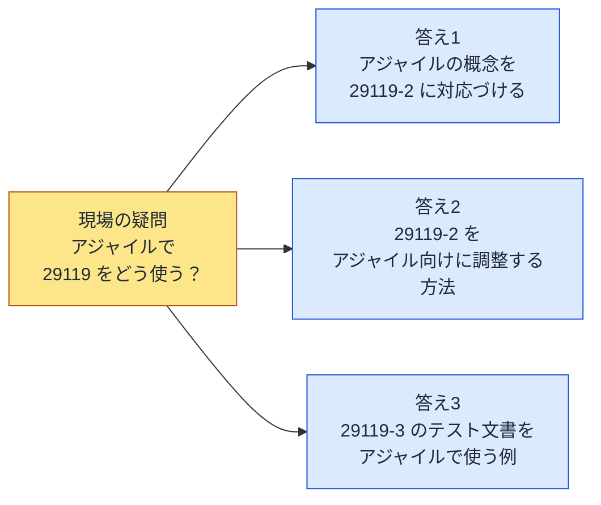
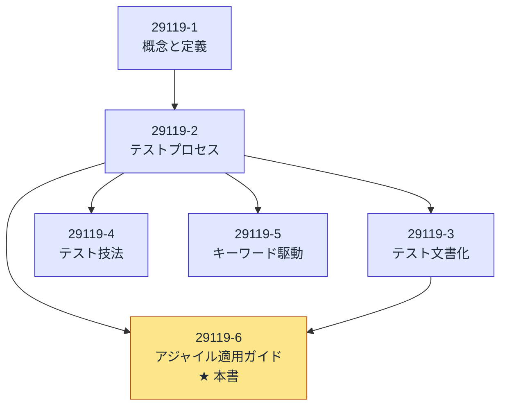
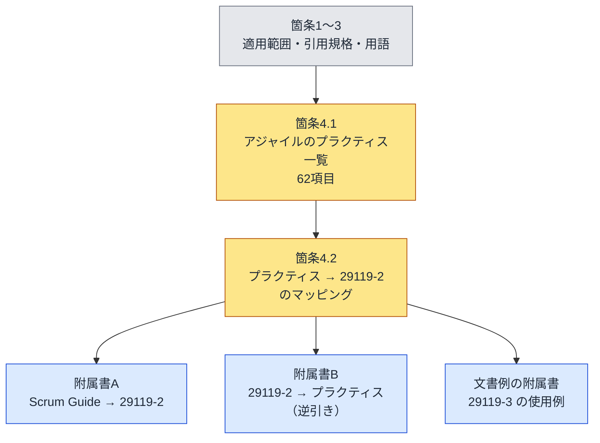
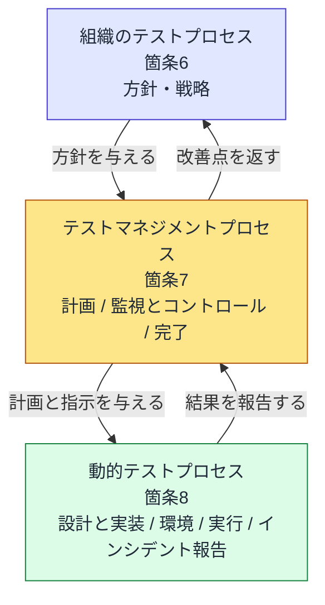
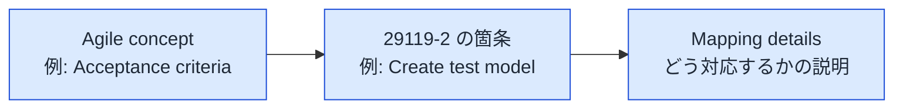
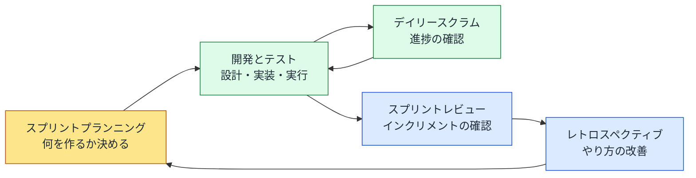
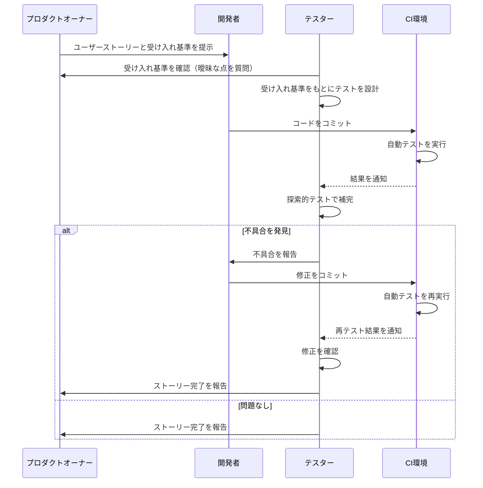
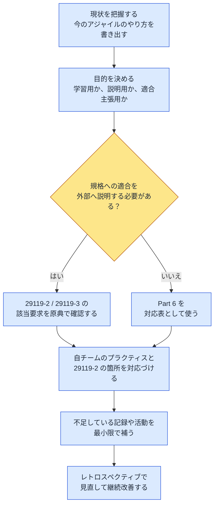
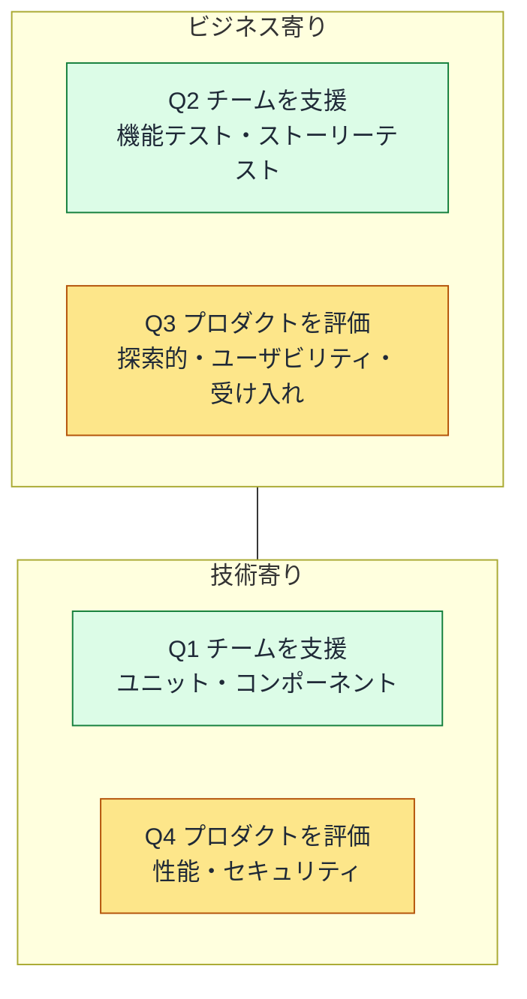

# ISO/IEC TR 29119-6:2021 初学者向け解説ガイド

**アジャイル開発で ISO/IEC/IEEE 29119（ソフトウェアテスト規格）をどう使うか — ステップバイステップ解説**

> **対象読者**: テスト・QA の初学者、アジャイルチームに参加したばかりの開発者／PO／スクラムマスター
> **情報の基準日**: 2026年10月4日（この日までに確認できた公開情報にもとづく）
> **原典**: <https://www.iso.org/standard/81293.html>
> **図表の方針**: フローチャート・シーケンス図は Mermaid、そのほかの図解・表は Markdown で記述

---

## 目次

1. [この規格を一言でいうと](#1-この規格を一言でいうと)
2. [STEP 1: 規格の基本情報を押さえる](#2-step-1-規格の基本情報を押さえる)
3. [STEP 2: なぜ Part 6 が必要なのか](#3-step-2-なぜ-part-6-が必要なのか)
4. [STEP 3: ISO/IEC/IEEE 29119 ファミリーの中での位置づけ](#4-step-3-isoiecieee-29119-ファミリーの中での位置づけ)
5. [STEP 4: Part 6 の全体構成を地図で見る](#5-step-4-part-6-の全体構成を地図で見る)
6. [STEP 5: 前提知識 — 29119-2 の3階層テストプロセス](#6-step-5-前提知識--29119-2-の3階層テストプロセス)
7. [STEP 6: 「マッピング表」の読み方](#7-step-6-マッピング表の読み方)
8. [STEP 7: Scrum の1スプリントに重ねて理解する（学習用イメージ）](#8-step-7-scrum-の1スプリントに重ねて理解する学習用イメージ)
9. [STEP 8: テスト文書（29119-3）をアジャイルで書く](#9-step-8-テスト文書29119-3をアジャイルで書く)
10. [STEP 9: 実務への取り入れ方](#10-step-9-実務への取り入れ方)
11. [STEP 10: 限界と批判を知っておく](#11-step-10-限界と批判を知っておく)
12. [補足: アジャイルテストの四象限との関係](#12-補足-アジャイルテストの四象限との関係)
13. [用語集](#13-用語集)
14. [理解度チェックリスト](#14-理解度チェックリスト)
15. [このガイドの信頼性メモ](#15-このガイドの信頼性メモ)
16. [参考ソース（URL）](#16-参考ソースurl)

---

## 1. この規格を一言でいうと

**ISO/IEC TR 29119-6:2021 は、「アジャイル開発の言葉（スプリント、ユーザーストーリー、受け入れ基準など）」と「ISO 29119 のテストプロセスの言葉」を対応づける翻訳辞書のようなガイドです。**

| 観点 | 内容 |
|---|---|
| 何についての文書か | ISO/IEC/IEEE 29119（全パート）をアジャイルのライフサイクルで使うための指針 |
| 何をしてくれるか | アジャイルのプラクティスや成果物を、29119-2（テストプロセス）の各箇所に対応づける |
| 文書の種類 | **Technical Report（TR）** ＝ 情報提供を目的とした技術報告書 |
| 主な読者 | テスター、テストマネージャー、ビジネスアナリスト、PO、スクラムマスター、開発者 |
| 向いている組織 | ウォーターフォールからアジャイルへ移る組織、その逆の組織、アジャイルを新規に始める組織 |

> 💡 **学習のヒント**: Part 6 は「アジャイルでのテストのやり方を一から教える教科書」ではありません。**すでに知っているアジャイルの知識を、規格の言葉に置き換えるための対応表**と捉えると、読みやすくなります。

---

## 2. STEP 1: 規格の基本情報を押さえる

ISO の公式ページで確認できる基本情報です。

| 項目 | 内容 |
|---|---|
| 規格番号 | ISO/IEC TR 29119-6:2021 |
| 英語タイトル | Software and systems engineering — Software testing — Part 6: Guidelines for the use of ISO/IEC/IEEE 29119 (all parts) in agile projects |
| 日本語訳（参考） | ソフトウェア及びシステム技術 — ソフトウェアテスト — 第6部: アジャイルプロジェクトにおける ISO/IEC/IEEE 29119（全パート）の使用に関するガイドライン |
| 版 | 第1版（Edition 1） |
| 発行年月 | 2021年7月（ISO ページ上の発行日: 2021-07-15） |
| ページ数 | 45 ページ |
| 担当委員会 | ISO/IEC JTC 1/SC 7（ソフトウェアとシステムのエンジニアリング） |
| ICS 分類 | 35.080（ソフトウェア） |
| ステータス（2026年10月4日時点） | **Published（発行済み）** — ISO ページ上では改訂・廃止の表示なし |
| 言語 | 英語のみ |

> ⚠️ **注意**: 2026年10月4日時点で、ISO のページには第2版などの改訂情報は見当たりませんでした。規格のステータスは変わることがあるため、利用前に必ず上記の公式ページで最新状況を確認してください。

---

## 3. STEP 2: なぜ Part 6 が必要なのか

### 3.1 現場で出てくる2つの疑問

ISO 29119 の各パートは、特定の開発モデルに縛られないと説明されています。しかし内容を読むと、V字モデルのような「計画 → 設計 → 実行 → 報告」と順番に進める流れを連想しやすい、という指摘があります。そのためアジャイルのチームからは、次の疑問が出てきます。

> **疑問A**: アジャイルのベストプラクティスに従っていれば、ISO 29119 にも沿っていることになるのか？
>
> **疑問B**: ISO 29119 の要求を、アジャイル開発の中でどう適用すればよいのか？

### 3.2 Part 6 が用意している3つの答え

| 答え | 内容 | 対応する Part 6 の部分 |
|---|---|---|
| 答え1 | アジャイルの概念・プラクティスを 29119-2 のテストプロセスに対応づける | 箇条4 ／ 附属書A |
| 答え2 | 29119-2 をアジャイルに合わせて取り入れる考え方 | 箇条4 ／ 附属書A（Scrum Guide との対応） |
| 答え3 | 29119-3 のテスト文書のテンプレートを、アジャイルでも使えることを示す | 文書例の附属書 |

> 💡 **ポイント**: 規格の導入部は「ISO 29119 のどのパートの知識がなくても理解できるように設計されている」と説明しています。ただし後述のとおり、実際には 29119-2 を知らないと読み進めにくい、という評価もあります（[STEP 10](#11-step-10-限界と批判を知っておく)参照）。

---

## 4. STEP 3: ISO/IEC/IEEE 29119 ファミリーの中での位置づけ

ISO/IEC/IEEE 29119 は複数のパートからなるシリーズ規格です。主要なパートは次のとおりです。

| パート | 内容 | 役割のイメージ |
|---|---|---|
| 29119-1 | テストの概念と定義 | 共通言語・基礎用語 |
| 29119-2 | テストプロセス | 「何をどの順で行うか」 |
| 29119-3 | テスト文書化 | 「何をどんな文書に残すか」 |
| 29119-4 | テスト技法 | 「どう設計するか」 |
| 29119-5 | キーワード駆動テスト | 自動化の枠組み |
| **29119-6** | **アジャイルプロジェクトでの利用ガイド（本書）** | **アジャイルとの橋渡し** |

> 💡 **ポイント**: Part 6 は、**29119-2（プロセス）と 29119-3（文書）を主な軸として**アジャイルと結びつけます。テスト技法（Part 4）の中身を詳しく解説する文書ではありません。

---

## 5. STEP 4: Part 6 の全体構成を地図で見る

### 5.1 章構成の特徴

Part 6 の構成は、規格としては少し変わっています。一般的な最初の3章（適用範囲・引用規格・用語）を除くと、**説明本文のほぼすべてが箇条4に集中**しています。箇条4の中は、アジャイルのプラクティスや成果物が**アルファベット順に並ぶ**構成です。

| 箇条／附属書 | 役割 |
|---|---|
| 箇条1〜3 | 適用範囲、引用規格、用語・定義 |
| 箇条4.1 | 対象となるアジャイルのプラクティスと成果物の一覧（**合計62項目**と解説されている） |
| 箇条4.2 | 各プラクティスを 29119-2 のテストプロセスに対応づけるマッピング |
| 附属書A（参考） | **The Scrum Guide** を 29119-2 のテストプロセスに対応づけるマッピング |
| 附属書B（参考） | 逆方向 — 29119-2 の各箇所から、対応するアジャイルのプラクティスを引く表 |
| 以降の附属書 | 29119-3 のテスト文書をアジャイルで使う例（テスト文書の具体例） |

### 5.2 取り扱う対象の例

62項目には、性質の違うものが混ざっています。

| 種類 | 例 |
|---|---|
| 開発手法・プラクティス | 受け入れテスト駆動開発（ATDD）、振る舞い駆動開発（BDD）、継続的デリバリー／継続的デプロイメント、ペアプログラミング、フィーチャートグル |
| 成果物・アーティファクト | 受け入れ基準、バーンダウン／バーンアップチャート |
| 概念 | エピック、エンパワードチーム |

> 💡 **学習のヒント**: 規格は一覧を「プラクティス・活動・概念・文書・役割」といった異なる種類をひとまとめにして扱っています。最初は「全部を覚える」のではなく、**自分のチームが実際に使っているもの**から読むのがおすすめです。

---

## 6. STEP 5: 前提知識 — 29119-2 の3階層テストプロセス

Part 6 のマッピングを理解するには、対応先である **29119-2 のプロセス構造**を知っておく必要があります。29119-2 は、テストのプロセスを3つの階層に分けています。

| 階層 | 箇条番号 | 主なプロセス | 一言でいうと |
|---|---|---|---|
| 組織のテストプロセス | 6 | 組織のテスト方針・戦略の策定と維持 | 組織としての「テストの憲法」 |
| テストマネジメントプロセス | 7 | テスト計画（TP）、テストの監視とコントロール（TMC）、テスト完了（TC） | プロジェクトやスプリントの「進行管理」 |
| 動的テストプロセス | 8 | テスト設計と実装、テスト環境・データ管理、テスト実行、テストインシデント報告 | 実際に「テストを作って動かす」 |

> 💡 **ポイント**: アジャイルの「スプリントプランニング」は主に **テストマネジメントプロセス（箇条7）** に、「テストを書いて動かす日々の作業」は主に **動的テストプロセス（箇条8）** に対応すると考えると、全体像をつかみやすくなります。

---

## 7. STEP 6: 「マッピング表」の読み方

Part 6 のマッピング表は、基本的に**3列**で構成されます。

| 列 | 意味 |
|---|---|
| Agile concept | アジャイルの概念・プラクティス名 |
| ISO 29119-2: clause | 対応する 29119-2 の箇条・アクティビティ |
| Mapping details | どのように対応するのかの説明文 |

### 7.1 具体例1: 受け入れ基準（Acceptance criteria）

| Agile concept | 29119-2 の対応先 | 対応の考え方（意訳） |
|---|---|---|
| 受け入れ基準 | 8.2.4.2 テストモデルの作成（Create test model） | ユーザーストーリーを「完了」と認めるために満たすべき、細かな要件の一覧を、**テストモデル**として扱う |

つまり、チームが普段書いている「このストーリーはこの条件を満たしたら完了」という**受け入れ基準が、29119-2 でいうテストモデルにあたる**、という読み方です。

### 7.2 具体例2: バーンダウン／バーンアップチャート

1つのアジャイル概念が、**複数の箇条にまたがって**対応づけられる例です。

| Agile concept | 29119-2 の対応先 | 対応の考え方（意訳） |
|---|---|---|
| バーンダウン／バーンアップチャート | 7.3.4.3 監視（Monitor） | 各ストーリーの受け入れ基準を確かめるテストを実行し、その日々の進捗を追う。これは進捗の指標を集める監視活動にあたる |
| 同上 | 7.3.4.5 報告（Report） | テストの状況、各ストーリーに対するテストの進み具合を報告する |

### 7.3 具体例3: 対応先がない概念

すべてのアジャイル概念が 29119-2 に対応づけられるわけではありません。**エピック**、**エンパワードチーム**、**ペアプログラミング**などは、対応する 29119-2 の箇所がないものとして扱われています。

> ⚠️ **注意**: 「マッピングがある ＝ 29119-2 の要求を満たす」ではありません。対応づけは**理解の補助**であり、適合の証明ではない点に注意が必要です（[STEP 10](#11-step-10-限界と批判を知っておく)参照）。

### 7.4 逆引き（附属書B）の読み方

附属書Bは、29119-2 側から「この活動に関係するアジャイルのプラクティスはどれか」を引ける表です。

| 29119-2 の箇条 | アクティビティ | 関連するアジャイルのプラクティス（例） |
|---|---|---|
| 7 テストマネジメントプロセス | 7.2.4.3 テスト計画策定の組織化 | 受け入れテスト駆動開発、振る舞い駆動開発、継続的デリバリーとデプロイメント など |

---

## 8. STEP 7: Scrum の1スプリントに重ねて理解する（学習用イメージ）

> ⚠️ **重要な注記**: この章は、**初学者の理解を助けるために筆者が作成した対応イメージ**です。規格の附属書A（Scrum Guide と 29119-2 のマッピング）の内容をそのまま写したものではありません。正確な対応は、規格の原典で確認してください。

### 8.1 Scrum の基本要素（Scrum Guide より）

Scrum Guide の最新の公式版は、2020年11月に Ken Schwaber と Jeff Sutherland が公開した版です（2026年時点で、これに置き換わる公式の新版は確認できませんでした）。

| 分類 | 要素 |
|---|---|
| イベント | スプリント、スプリントプランニング、デイリースクラム、スプリントレビュー、スプリントレトロスペクティブ |
| 成果物 | プロダクトバックログ、スプリントバックログ、インクリメント |
| コミットメント | プロダクトゴール、スプリントゴール、完成の定義 |

### 8.2 スプリントとテスト活動の重ね合わせ

| Scrum の場面 | 関係が深い 29119-2 の領域（筆者の整理） | 具体的なテスト活動の例 |
|---|---|---|
| スプリントプランニング | テストマネジメント（テスト計画） | 受け入れ基準の確認、テストの進め方と担当の合意 |
| 開発とテスト | 動的テスト（設計と実装・環境・実行・インシデント報告） | テストケース作成、テスト実行、不具合の記録 |
| デイリースクラム | テストマネジメント（監視とコントロール） | テスト進捗、ブロッカーの共有 |
| スプリントレビュー | テストマネジメント（報告・完了） | テスト結果の報告、完了の確認 |
| レトロスペクティブ | 組織のテスト／テスト完了での振り返り | テスト手法やプロセスの改善案 |

### 8.3 ユーザーストーリー1件の流れ（シーケンス図）

次の図は、1件のユーザーストーリーがテストされる流れを**一般的なアジャイルの進め方として**描いたものです（規格内の図ではありません）。

---

## 9. STEP 8: テスト文書（29119-3）をアジャイルで書く

アジャイルは「動くソフトウェアを重視し、包括的な文書より優先する」考え方ですが、**文書をゼロにする**わけではありません。Part 6 は、29119-3 のテスト文書をアジャイルでも使える形で示します。

### 9.1 規格が例示している文書

| 文書例 | 内容 |
|---|---|
| セッションシート | ソフトウェアのテストケースを仕様として記述するもの（探索的テストのセッション管理でも使われる形式） |
| 不具合報告書（Defect report） | 受け入れ基準とテスト結果を示す |
| 日次テスト進捗報告書（Daily test progress report） | バーンダウンチャートと、未完了／完了のテストとその結果の概要 |
| テスト完了報告書（Test completion report） | テスト活動の最終的なまとめ |

### 9.2 文書は「軽く」書く

| 考え方 | 具体例 |
|---|---|
| 必要最小限の項目に絞る | チケット管理ツールの項目をそのままテスト文書に使う |
| ツールに任せる | 進捗はバーンダウンチャートを自動生成する |
| 読み手を想定する | 監査人向けと、チーム内向けで粒度を変える |

> ⚠️ **注意**: 文書を軽くする場合でも、**自社が従う規制や規格（例: 医療機器ソフトウェアの IEC 62304 など）が求める記録項目**は削れません。規格が示す例が、そうした他の規格の要求を満たすとは限らない、という指摘もあります（[STEP 10](#11-step-10-限界と批判を知っておく)参照）。

---

## 10. STEP 9: 実務への取り入れ方

### 10.1 取り入れ手順のフロー

### 10.2 活用シーン

| シーン | Part 6 の使いどころ |
|---|---|
| ウォーターフォールからアジャイルへ移行する | 従来のテストプロセスの用語と、アジャイルの用語の対応を共有する |
| 品質保証部門と開発チームの会話 | 共通言語として、29119-2 の用語を橋渡しに使う |
| テストプロセスの抜け漏れチェック | 附属書Bの逆引きで、29119-2 の活動に対応するプラクティスが自チームにあるか確認する |
| 新入社員・新メンバーの教育 | 規格の用語とチームの実務を結びつけて学ぶ |

### 10.3 やってはいけない使い方

| NG | 理由 |
|---|---|
| 「Part 6 の表に載っているから規格適合」と主張する | 対応づけは理解の補助であり、29119-2 の要求を満たす証明ではない |
| 62項目を全部導入しようとする | 目的は「全部やる」ことではなく、自分のチームの活動を説明できるようにすること |
| Part 6 だけを読んで終わる | 対応先である 29119-2 の理解がないと、表の意味が分かりにくい |

---

## 11. STEP 10: 限界と批判を知っておく

規格を正しく使うには、評価が割れている点も知っておくことが大切です。

### 11.1 Part 6 そのものへの専門家の評価（Johner Institut / Prof. Dr. Christian Johner）

医療機器ソフトウェアの規制に詳しい Johner Institut の記事（2021年公開）は、Part 6 を次のように評価しています。

| 観点 | 評価の要点 |
|---|---|
| 良い点 | アジャイルの概念と 29119-2 の対応表が得られる。文書の具体例が示される。「従来のベストプラクティスとアジャイルは矛盾しない」と説明する根拠として使える |
| 構成の問題 | プラクティス・活動・概念・文書・役割が1つのリストに混在し、62項目がアルファベット順に並ぶため見通しにくい |
| 選定基準 | 62項目がどんな基準で選ばれたのかが分かりにくい |
| マッピングの根拠 | 対応づけの理由が分かりにくい。たとえば BDD を 29119-2 の「全箇条」に対応づける例は、実用上あまり役に立たない |
| 実用性 | 「アジャイルの実践で 29119-2 の要求を満たせるか」という最も知りたい問いには答えていない。監査の場面で特に重要な点 |
| 誤解の危険 | 示されたテストケース例は、前提条件や受け入れ基準の記述が不足しており、他のソフトウェア規格の要求を満たさない恐れがある。また Scrum は「プロジェクトの進め方」の枠組みであり、29119-2 の「プロセス」と同列には比較できない |
| 総評 | 予算が限られるなら、Part 6 より 29119-2 を購入すべき、という趣旨の結論 |

### 11.2 ISO 29119 全体をめぐる議論（Part 6 固有の話ではない）

ISO 29119 シリーズは、2014年ごろにテスト界で大きな論争を呼びました。

| 立場 | 主な主張 |
|---|---|
| 批判する側（James Bach ら、コンテキスト駆動テスト（Context-Driven Testing）派） | 標準化の過程で自分たちの立場が考慮されなかった。規格は画一的で、テスターの技能や状況に応じた判断を軽視する |
| 推進する側（Stuart Reid ら WG26 関係者） | 既存の ISO・IEEE 規格を土台に、どのライフサイクルや組織でも使える共通の枠組みを提供する |

> 💡 **ポイント**: この議論は主に 29119 シリーズ全体についてのものです。Part 6 の発行（2021年）より前の議論で、**Part 6 だけを対象にしたものではありません**。ただ、規格を導入するときは「規格は状況に合わせて使うもの」という視点を持つのがよいでしょう。

### 11.3 バランスの取り方

| 立場 | おすすめの使い方 |
|---|---|
| 規格に強い関心がある | 29119-2 / 29119-3 の原典とあわせて読み、Part 6 を橋渡しに使う |
| 規格にこだわらない | アジャイルテストの実践書（次章）を主軸にし、Part 6 は用語の参照にとどめる |
| 規制対応が必要 | 対応が必要な規制・規格の要求を最優先し、Part 6 は補助資料にする |

---

## 12. 補足: アジャイルテストの四象限との関係

アジャイルテストの代表的な実践書として、Lisa Crispin と Janet Gregory による『Agile Testing』があります。この本の中心的な道具が**アジャイルテストの四象限（Agile Testing Quadrants）**です。

四象限は、もともと Brian Marick が提案した「アジャイルテストマトリクス」を、Janet Gregory と Lisa Crispin が許可を得て発展させたものです。象限の番号（Q1〜Q4）は、実施順序ではなく、呼びやすくするための便宜的な番号だと説明されています。

| 象限 | 向き | 目的 | テストの例 |
|---|---|---|---|
| Q1 | 技術寄り | チームを支援する | ユニットテスト、コンポーネントテスト |
| Q2 | ビジネス寄り | チームを支援する | 機能テスト、ストーリーテスト、例示にもとづくテスト |
| Q3 | ビジネス寄り | プロダクトを評価・批評する | 探索的テスト、シナリオテスト、ユーザビリティテスト、受け入れテスト |
| Q4 | 技術寄り | プロダクトを評価・批評する | 性能テスト、セキュリティテスト、各種「イリティ」テスト |

### 12.1 Part 6 と四象限の使い分け

| 道具 | 答える問い | 性格 |
|---|---|---|
| アジャイルテストの四象限 | 「どんな種類のテストが必要か」「誰が・どう行うか」 | チームが**テスト戦略を考える**ための分類 |
| ISO/IEC TR 29119-6 | 「アジャイルの活動は 29119 のどの活動にあたるか」 | 規格の言葉に**翻訳する**ための対応表 |

2つは競合せず、**補い合う関係**です。たとえば「四象限で必要なテストを洗い出し、その運用を 29119-2 の用語で説明する」といった使い方ができます。

---

## 13. 用語集

| 用語 | 意味 |
|---|---|
| TR（Technical Report） | 技術報告書。要求事項を定める規格本体とは区別される、情報提供型の文書 |
| 29119-2 | ソフトウェアテストプロセスの規格。Part 6 の主な対応先 |
| 29119-3 | テスト文書化の規格。Part 6 は文書のテンプレートの使用例を示す |
| マッピング | 2つの体系の用語や要素を対応づけること |
| 受け入れ基準 | ユーザーストーリーを完了と認める条件 |
| ATDD | 受け入れテスト駆動開発。受け入れ基準を検証する受け入れテストを、コードを書く前に作成する開発手法 |
| BDD | 振る舞い駆動開発。期待する振る舞いを共通言語で記述し、テストに結びつける手法 |
| バーンダウンチャート | 残りの作業量の推移を示すグラフ |
| エピック | 複数のユーザーストーリーにまたがる大きな要求のまとまり |
| フィーチャートグル | 機能の有効・無効をコードの外から切り替える仕組み |
| スプリント | Scrum における固定期間の開発サイクル |
| Context-Driven Testing | テストの進め方は状況（コンテキスト）に応じて決めるべきだとする考え方 |

---

## 14. 理解度チェックリスト

読み終えたら、次の項目を確認してみましょう。

- [ ] Part 6 が「翻訳辞書」のような位置づけだと説明できる
- [ ] Part 6 が TR（技術報告書）であることを説明できる
- [ ] 主な対応先が 29119-2（プロセス）と 29119-3（文書）だと説明できる
- [ ] 29119-2 の3階層（組織・マネジメント・動的）を挙げられる
- [ ] 箇条4（マッピング）と附属書A・Bの役割の違いを説明できる
- [ ] 「受け入れ基準 ＝ テストモデル」という対応例を説明できる
- [ ] 対応先がないアジャイル概念の例を1つ挙げられる
- [ ] 「マッピングがある ＝ 規格に適合」ではないと説明できる
- [ ] Part 6 に対する専門家の指摘を2つ以上挙げられる
- [ ] アジャイルテストの四象限との使い分けを説明できる

---

## 15. このガイドの信頼性メモ

| 項目 | 内容 |
|---|---|
| 規格本文について | ISO/IEC TR 29119-6:2021 の本文は有償の著作物です。本ガイドは**公開されている概要・目次情報・専門家の解説記事**にもとづいて作成しており、規格本文を転載していません |
| 確認できた範囲 | 規格の基本情報、適用範囲、章構成、マッピング表の具体例（受け入れ基準、バーンダウンチャートなど）、文書例の種類 |
| 確認できていない範囲 | 62項目すべてのマッピング詳細、附属書A（Scrum Guide との対応）の全内容 |
| 筆者の整理である箇所 | 「STEP 7 の Scrum 対応イメージ」「STEP 7 のシーケンス図」「STEP 9 の実務手順」は、学習用に筆者が作成した整理で、規格の記述そのものではありません |
| 実務利用の前に | 規格適合の主張や監査対応に使う場合は、必ず原典を入手して該当箇所を確認してください |
| 情報の基準日 | 2026年10月4日 |

---

## 16. 参考ソース（URL）

### 16.1 規格の一次情報

| ソース | URL | 用途 |
|---|---|---|
| ISO 公式ページ（ISO/IEC TR 29119-6:2021） | <https://www.iso.org/standard/81293.html> | 規格番号、版、発行日、ページ数、ステータス、適用範囲 |
| IEC Webstore | <https://webstore.iec.ch/publication/70131> | 発行日、版、ページ数の確認 |
| iTeh Standards（目次プレビュー） | <https://iteh.es/catalog/standards/iso/ed69944c-054a-460a-b4bf-7d0f051b212b/iso-iec-tr-29119-6-2021> | 箇条4.2、附属書A・Bなどの章構成の確認 |

### 16.2 専門家による解説・評価

| ソース | 著者 | URL | 用途 |
|---|---|---|---|
| Hilft die ISO/IEC TR 29119-6 zum Software-Testing auch in agilen Projekten? | Prof. Dr. Christian Johner（Johner Institut）, 2021年9月7日公開 | <https://www.johner-institut.de/blog/iec-62304-medizinische-software/iso-29119-6/> | 構成、マッピング例、文書例、批判的評価 |

### 16.3 アジャイルテストの関連知見

| ソース | 著者 | URL | 用途 |
|---|---|---|---|
| Agile Testing: A Practical Guide for Testers and Agile Teams | Lisa Crispin, Janet Gregory | <https://www.pearson.com/store/en-us/p/agile-testing-a-practical-guide-for-testers-and-agile-teams/P200000009376/9780321534460> | アジャイルテストの四象限の出典書籍 |
| Agile testing quadrants: Guiding managers and teams in test strategies | Lisa Crispin（TechTarget） | <https://www.techtarget.com/searchsoftwarequality/tip/Agile-testing-quadrants-Guiding-managers-and-teams-in-test-strategies> | 四象限の由来（Brian Marick）と使い方 |
| Scrum Guide 2020 リリース告知（Scrum.org） | Ken Schwaber, Jeff Sutherland | <https://www.scrum.org/node/44069> | Scrum Guide 最新公式版（2020年11月）の確認 |

### 16.4 ISO 29119 全体をめぐる議論

| ソース | 著者 | URL | 用途 |
|---|---|---|---|
| How Not to Standardize Testing (ISO 29119) | James Bach（2014年8月25日） | <https://www.satisfice.com/blog/archives/1464> | コンテキスト駆動派からの批判 |
| The software testing schism | SD Times | <https://sdtimes.com/software-testing-schism/> | 賛否両論の経緯（Stuart Reid、James Bach の主張） |
| Software testing reaction | InfoQ | <https://www.infoq.com/news/2014/09/software-testing-reaction/> | 当時のコミュニティの反応 |

---

*本ガイドは学習支援を目的とした解説であり、規格の正式な解釈や適合判定を行うものではありません。*
