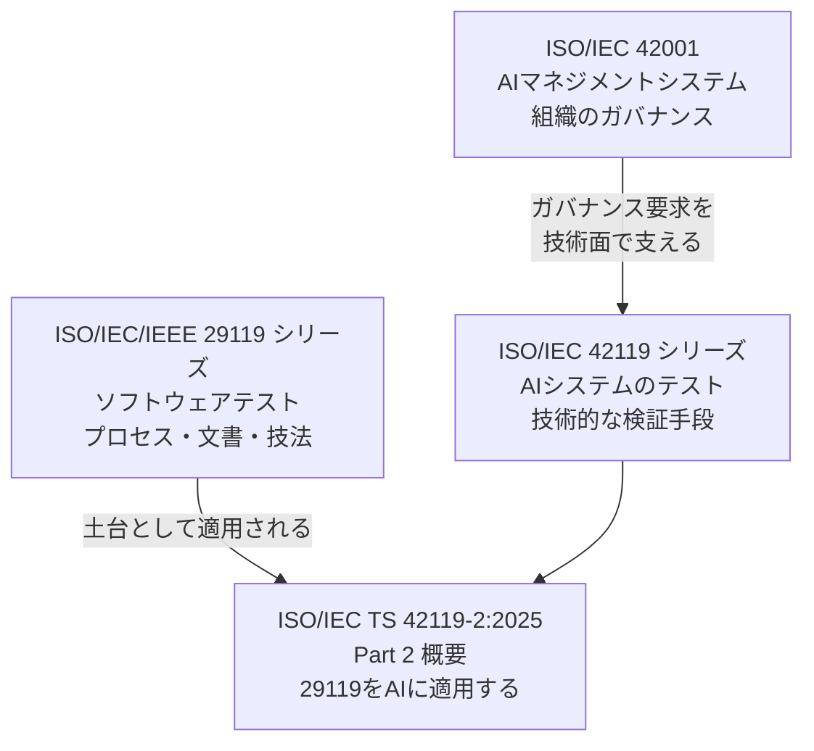
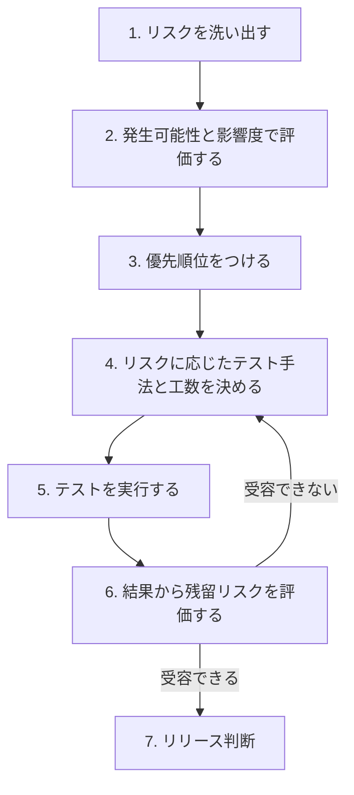
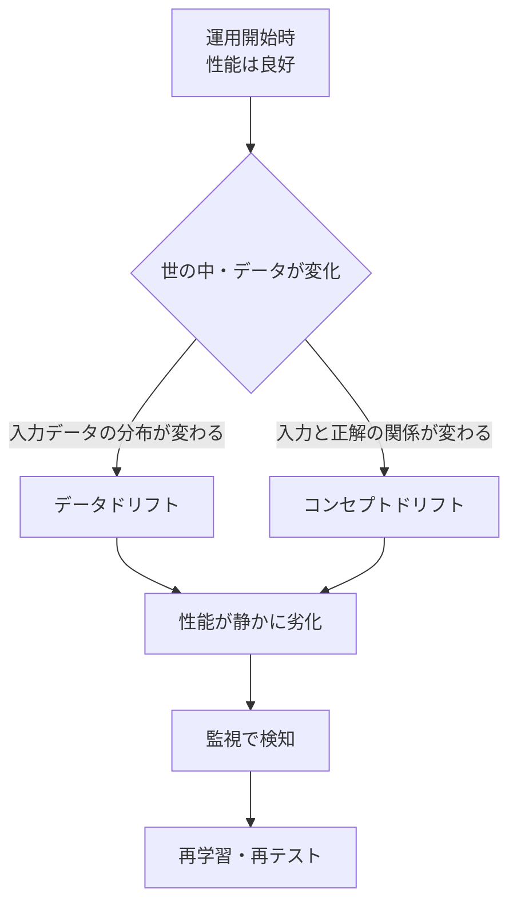
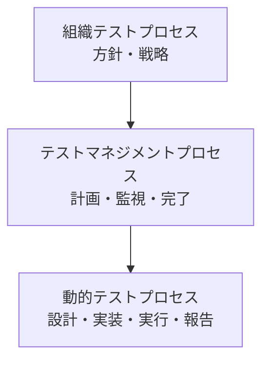
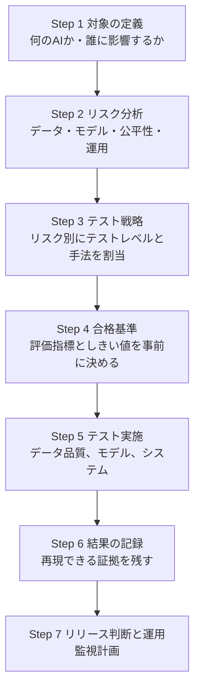
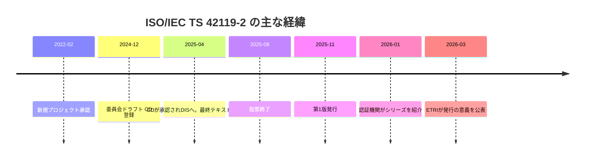

# ISO/IEC TS 42119-2:2025 初学者向けステップバイステップ解説ガイド

**Artificial intelligence — Testing of AI — Part 2: Overview of testing AI systems（AIシステムのテストの概要）**

| 項目 | 内容 |
|---|---|
| 文書種別 | Technical Specification（TS：技術仕様書） |
| 版・発行 | 第1版、2025年11月3日発行（ステージ 60.60） |
| 担当委員会 | ISO/IEC JTC 1/SC 42（人工知能） |
| ICS | 35.020 |
| ページ数 | 34ページ |
| 価格（ISOストア） | CHF 159（PDF + ePub） |
| 情報の基準日 | 2026年10月4日 |

---

## 0. このガイドの読み方と信頼性レベル

> ⚠️ **重要な前提**
> ISO/IEC TS 42119-2 の本文は有料で、本ガイド作成時に全文は閲覧していません。そこで、各情報に信頼性ラベルを付けています。**試験対応・監査・契約など厳密性が必要な用途では、必ず正規版の本文を購入して確認してください。**

| ラベル | 意味 | 根拠 |
|---|---|---|
| 🟢 **確認済み** | ISO公式ページ、共同エディタ所属機関（ETRI）、認証機関（SGS）の公開情報で確認できた内容 | 第13章の出典 [1]〜[6] |
| 🟡 **背景知識** | 関連規格（ISO/IEC/IEEE 29119、ISO/IEC 22989 など）や機械学習の一般知識。本規格の文言そのものではない | 一般的な技術知識 |
| 🔵 **実践提案** | 筆者が初学者向けに組み立てた進め方の例。規格の要求事項ではない | 本ガイドの提案 |

---

## 1. 全体像：この規格は何か（Step 1）

### 1.1 一言でいうと 🟢

> **「既存のソフトウェアテスト規格 ISO/IEC/IEEE 29119 シリーズを、AIシステムのテストにどう適用するかを示した規格」**

ISO公式の要旨では、次の3点が核になっています。

1. 29119 シリーズの **適用に関する要求事項とガイダンス** を提供する
2. **リスクベース** のアプローチを採る
3. すでに 29119 で規定されている実践・手法・技法については、**AI向けの追加の詳細と適用方法** を説明する

### 1.2 「TS」とは？ 🟡

| 種別 | 正式名 | 性格 |
|---|---|---|
| IS | International Standard | 合意の度合いが最も高い正式な国際規格 |
| **TS** | **Technical Specification** | 技術が発展途上で、将来 IS 化を見据えて先行発行される文書 |
| TR | Technical Report | 情報提供が中心で、要求事項を含まない |

本規格は TS ですが、要旨には「requirements and guidance（要求事項とガイダンス）」とあるため、TR のような参考情報だけではなく、適用時の要求事項も含む文書として位置づけられています 🟢。

### 1.3 規格の位置づけ

- **42001** は「AIをどう管理するか」という組織側の規格
- **42119** は「AIシステムが本当に期待どおり動くか、どうテストするか」という技術側の規格 🟢（SGSの解説）
- **29119** は既存のソフトウェアテスト規格で、42119-2 はその AI 版の入口

---

## 2. なぜ必要なのか（Step 2）

### 2.1 従来のソフトウェアとAIの違い 🟡

| 観点 | 従来のソフトウェア | AIシステム（特に機械学習） |
|---|---|---|
| 振る舞いの決まり方 | プログラマが書いたルール | **学習データ** から獲得したパターン |
| 期待結果 | 多くは1つに決まる | 確率的で、正解が1つと限らない |
| 同じ入力への出力 | 通常は同じ | モデルや設定により **揺らぐ** ことがある |
| 劣化の要因 | 主にコード変更 | **データ分布の変化**（ドリフト）でも劣化 |
| 公平性の問題 | 設計上あまり問題にならない | データの偏りにより **不当なバイアス** が生じ得る |
| テストの主目的 | 仕様どおりか | 仕様どおりか **に加え**、統計的にどの程度の性能か |

### 2.2 規格が登場した背景 🟢

ETRIの公開記事によると、本規格は次の流れで成立しました。

- 2022年2月21日：新規プロジェクトとして承認
- SC 42（AI）と SC 7（ソフトウェア工学）による **合同作業部会 JWG 2** が約5年間開発を推進
- 2025年11月3日：発行
- 共同エディタ：ETRI の Jeon Jong Hong 氏と、ソフトウェアテストの国際的権威である **Stuart Reid 博士**（STA Testing Consulting）

また、ETRI は本規格が、EU AI Act や韓国の AI 基本法で高影響・高リスクAIに求められる検証・認証手法の土台になる、と説明しています 🟢。ただし、これは ETRI の見解であり、本規格自体が法令適合を保証するものではありません。

---

## 3. 全体の流れをつかむ（Step 3）

AIのテストは「作って終わり」ではなく、データ準備から運用監視まで **ライフサイクル全体** に及びます。

ポイントは次の2つです。

1. **最初にリスクを見る**（リスクベース）
2. **運用後も回り続ける**（ドリフト監視から再学習・再テストへ戻る）

🟢 データ品質テスト、モデルテスト、リスクベーステスト、ドリフトテストが本規格の要素であることは ETRI の記事で確認できます。🟡 ただし上図の並びと循環は、初学者向けに整理した概念図です。

---

## 4. 核心1：リスクベースのアプローチ（Step 4）

### 4.1 考え方 🟢

本規格は、**AIシステムとその開発・保守に伴うリスク** を手がかりに、適切なテストの実践・アプローチ・技法を選びます。「全部を均等にテストする」のではなく、**リスクが高いところに手厚く** 配分します。

### 4.2 リスクベーステストの流れ 🟡

### 4.3 AI特有のリスク例 🟡

| リスクの種類 | 具体例 | 対応するテストの方向性 |
|---|---|---|
| データのリスク | 欠損、ラベル誤り、代表性の不足 | データ品質テスト |
| モデルのリスク | 精度不足、過学習、特定条件での性能低下 | モデルテスト |
| 公平性のリスク | 性別や年齢で結果が不利になる | バイアステスト |
| 堅牢性・セキュリティのリスク | 細工した入力で誤判定させられる | 敵対的テスト |
| 運用のリスク | 時間経過で性能が低下する | ドリフトテスト、監視 |
| 説明可能性のリスク | 判断理由が説明できず信頼を得られない | 説明可能性の評価 |

---

## 5. 核心2：AIならではのテストレベル（Step 5）

従来のテストレベル（単体、結合、システム、受入）に加えて、AIでは **データ** と **モデル** が独立したテスト対象になります。

### 5.1 データ品質テスト 🟢

ETRIによると、**AIモデルの学習に使うデータの品質を検証するテストレベル** です。

| 確認する観点 | 内容 |
|---|---|
| 正確性 | ラベルや値が正しいか |
| 完全性 | 欠損や抜けが少ないか |
| バイアス | 特定の属性が偏って含まれていないか |
| 代表性 | 実運用で出会うデータを十分に反映しているか |

### 5.2 モデルテスト 🟢

**学習済みモデルそのものを対象** にするテストレベルです。想定された利用状況で許容できる性能を示すか、機能的な精度やバイアスに関するリスクがないかを確認します。

### 5.3 テストレベルの関係

🟡 AIシステムには、モデル以外の通常のソフトウェア部分（API、画面、前処理など）も含まれます。そのため、従来型のテストも引き続き必要です。

---

## 6. 核心3：AIならではのテストタイプ（Step 6）

ETRIの記事で、AI特有の手順として挙げられている3種類を整理します 🟢。

| テストタイプ | 何を調べるか | 例 |
|---|---|---|
| **不当なバイアスのテスト** | 性別・人種・年齢などの属性で、特定集団に不利な結果が出ていないか | 属性別の合格率や誤判定率の差を比較 |
| **敵対的テスト** | 人間には分かりにくい細工をした入力で、モデルが誤作動しないか | 画像に微小なノイズを加えて分類の変化を見る |
| **ドリフトテスト** | 運用中のデータ変化で性能が劣化していないか | 最新データでの精度を継続的に測定 |

### 6.1 ドリフトとは 🟡

> 💡 **初学者向けの要点**
> AIの不具合は、エラーで止まらず **「静かに精度が落ちる」** 形で現れがちです。だからこそ、リリース前テストに加えて運用中の継続的な監視が重要になります。

---

## 7. 29119 シリーズとの関係：プロセスと技法（Step 7）

### 7.1 29119 シリーズの構成 🟡

| パート | 内容 | 本ガイドの関連 |
|---|---|---|
| 29119-1 | 概念と定義 | 用語の共通基盤 |
| 29119-2 | テストプロセス | AIテストのプロセスの土台 |
| 29119-3 | テスト文書化 | AI向けのテスト文書の土台 |
| 29119-4 | テスト技法 | AIに適用できる技法の土台 |
| 29119-5 | キーワード駆動テスト | 自動化の方式 |
| 29119-11 | AIベースシステムのテスト（TR） | AIテストの先行ガイダンス |

### 7.2 本規格が追加するもの 🟢

SGSの解説（本規格の概要紹介）によると、本規格は次の内容を扱います。

- AIシステムのライフサイクルとリスクベーステスト
- AI向けに調整されたテストプロセスと文書化
- データ品質テストやモデルテストを含む **テストレベルとテストタイプ**
- AI特有のリスクを特定・対処するためのガイダンス
- 既存のテスト設計技法とカバレッジ指標の活用方法

### 7.3 ドラフト段階の要旨について 🟢

ISOの旧ドラフト（CD/DTS段階）の要旨には、次の記述がありました。

- ISO/IEC 22989 で定義された AIシステムのライフサイクル段階の中で使えるテスト技法を説明する
- AI・機械学習の評価指標をテスト技法の文脈で使う方法を説明する
- 29119-2 のテストプロセスを、AIライフサイクルの **検証・妥当性確認（V&V）の段階** に対応づける

発行版の要旨は表現が変わっていますが、**ライフサイクル、評価指標、V&Vへの対応づけ** は、規格の考え方を理解する手がかりになります。ただし、発行版にそのまま残っているかは本文で確認してください。

### 7.4 テストプロセスの階層（29119-2 の考え方）🟡

AIの場合も、この3階層の考え方は変わりません。変わるのは各階層で **何を計画し、何を測り、どんな証拠を残すか** です。

---

## 8. 評価指標とテスト技法を結びつける（Step 8）

### 8.1 代表的な評価指標 🟡

分類問題の基本指標です。

| 指標 | 意味 | 重視される場面 |
|---|---|---|
| 正解率（Accuracy） | 全体のうち正しく当てた割合 | データが均衡している場合 |
| 適合率（Precision） | 陽性と予測したもののうち本当に陽性だった割合 | 誤警報を減らしたい |
| 再現率（Recall） | 本当の陽性のうち見つけられた割合 | 見逃しを減らしたい（医療など） |
| F1スコア | 適合率と再現率の調和平均 | 両者のバランスを見たい |

### 8.2 技法のイメージ 🟡

| 技法の考え方 | AIでの使い方の例 |
|---|---|
| 同値分割 | 入力データをグループ分けし、各グループから代表を選ぶ |
| 境界値分析 | しきい値付近の入力でモデルの判断が変わるか確認 |
| メタモルフィックテスト | 入力を意味が変わらない程度に変換し、出力が一貫するか確認 |
| 探索的テスト | 想定外の入力や使い方で挙動を観察 |
| カバレッジ指標 | データ属性の組み合わせや入力空間をどこまで試したか測る |

> 💡 **オラクル問題**：AIでは「正解が何か」を事前に決めにくいことがあります。メタモルフィックテストや統計的な合格基準は、この問題への対処として使われます 🟡。

---

## 9. 実践：初めてAIテスト計画を作る手順（Step 9）🔵

規格の要求事項ではなく、筆者が初学者向けに組み立てた進め方の例です。

### 9.1 Step 1〜2：対象とリスク

| 質問 | 記入例 |
|---|---|
| AIの用途は？ | 問い合わせメールの自動分類 |
| 誤った時の影響は？ | 重要な問い合わせの見逃し |
| 学習データの出所は？ | 過去2年分の社内メール |
| 影響を受ける集団は？ | 顧客、サポート担当者 |

### 9.2 Step 3〜4：戦略と合格基準

| リスク | テスト | 合格基準の例（🔵 仮の数値） |
|---|---|---|
| ラベル誤り | データ品質テスト | サンプル検査での誤りが一定率以下 |
| 見逃し | モデルテスト | 重要カテゴリの再現率が目標以上 |
| 属性による差 | バイアステスト | 属性間の誤判定率の差が許容範囲内 |
| 時間経過 | ドリフトテスト | 月次評価で精度が下限を下回らない |

### 9.3 Step 5〜7：実施と継続

- テスト条件、データのバージョン、モデルのバージョン、乱数シードを記録する 🔵
- 結果が基準未達なら、データ修正か再学習か仕様見直しかを判断する
- 運用開始後の監視項目と再テストのトリガーを事前に決めておく

---

## 10. 42119 シリーズの今後（Step 10）

| パート | タイトル | 状況（2026年10月時点で確認できた情報） | 出典 |
|---|---|---|---|
| **42119-2** | AIシステムのテストの概要 | **発行済み**（2025年11月） | 出典 [1], [2], [3] |
| 42119-3 | AIシステムの検証・妥当性確認分析 | 出版準備中（ステージ 60.00、2026年9月25日到達。形式手法、シミュレーション、評価を扱う） | 出典 [3], [10] |
| 42119-7 | レッドチーミング | 開発中（ETRIは2025年3月開始、目標を2027年12月と説明） | 出典 [2], [3] |
| 42119-8 | プロンプトベースのテキスト生成AIの品質評価 | 開発中 | 出典 [2], [3] |
| 42119-10 / 42119-11 | オントロジー / AIベンチマーク | ETRIが今後の開発予定として言及 | 出典 [2] |

> 📌 ステータスは変わり得ます。最新状況は [ISO公式ページ](https://www.iso.org/standard/84127.html) と SC 42 のページで確認してください。

---

## 11. よくある疑問と落とし穴（Step 11）

| 疑問・落とし穴 | 解説 |
|---|---|
| Q. この規格に準拠すれば認証が取れる？ | 🟡 TS は主にガイダンスと要求事項を示す文書です。認証の枠組みは別途確認が必要です。ETRIは、将来の適合性評価の基礎になりうると述べています 🟢 |
| Q. 42001 と何が違う？ | 42001 は組織のAIマネジメント、42119 はシステムの技術的テスト 🟢 |
| Q. 生成AI（LLM）も対象？ | 🟢 本パートは概要で、プロンプトベースのテキスト生成AIの品質評価は 42119-8 で扱われる予定です。本パートの基本の考え方は生成AIにも土台として役立ちます 🟡 |
| ❌ 精度だけ見て終わる | 公平性、堅牢性、ドリフトなど、リスクに応じた観点が必要 |
| ❌ リリース時だけテストする | 運用中の劣化に気づけない |
| ❌ テストデータが学習データと重なる | 性能を過大評価する（データリーク）🟡 |
| ❌ 合格基準を結果を見てから決める | 恣意的になる。事前に定義する 🔵 |

---

## 12. 用語集

| 用語 | 意味 |
|---|---|
| AIシステム | AIコンポーネントを含むシステム全体 |
| TS | Technical Specification（技術仕様書） |
| JWG | Joint Working Group（合同作業部会） |
| SC 42 | ISO/IEC JTC 1 の人工知能分科委員会 |
| SC 7 | ISO/IEC JTC 1 のソフトウェアおよびシステム工学分科委員会 |
| データ品質テスト | 学習データの正確性・完全性・偏り・代表性を確認するテスト |
| モデルテスト | 学習済みモデルの性能やリスクを確認するテスト |
| ドリフト | 運用環境の変化によるモデル性能の劣化 |
| 敵対的テスト | モデルを誤作動させる意図的な入力に対する耐性の確認 |
| V&V | Verification and Validation（検証と妥当性確認） |
| リスクベーステスト | リスクの優先度に基づいてテストの内容と工数を決める戦略 |

---

## 13. 参考出典URL（情報基準日：2026年10月4日）

### 13.1 一次情報・準一次情報

| No. | 出典 | 種別 | URL | 用途 |
|---|---|---|---|---|
| 1 | ISO 公式：ISO/IEC TS 42119-2:2025 | 規格公式ページ | <https://www.iso.org/standard/84127.html> | 要旨、発行日、ステージ履歴、委員会、ページ数、価格 |
| 2 | ETRI Webzine Vol.87「ETRI Claims Historic First in Establishing Global Standard for AI Testing」 | 共同エディタ所属機関の公式記事 | <https://www.etri.re.kr/webzine/eng/202604/sub02.html> | 開発経緯、JWG 2、データ品質・モデルテスト、バイアス・敵対的・ドリフトテスト、今後の規格 |
| 3 | SGS「Announcing the ISO/IEC 42119 Series」（2026年1月13日） | 国際的な試験・認証機関の解説 | <https://www.sgs.com/en-au/news/2026/01/announcing-the-iso-iec-42119-series-a-new-era-for-ai-testing-and-assurance> | 本規格の収録内容、シリーズ各パートの位置づけ、42001との関係 |
| 10 | ISO 公式：ISO/IEC TS 42119-3 | 規格公式ページ | <https://www.iso.org/standard/85072.html> | 42119-3 のステージ（60.00 出版準備中） |

### 13.2 ステージ履歴・旧ドラフト要旨の確認用

| No. | 出典 | URL |
|---|---|---|
| 4 | ISO/IEC DTS 42119-2（ドラフト段階の要旨） | <https://inteco.isolutions.iso.org/standard/84127.html?browse=ics> |
| 5 | ISO/IEC CD TS 42119-2（委員会ドラフト段階の要旨） | <https://inen.isolutions.iso.org/standard/84127.html> |
| 6 | VDE Verlag（発行日・ページ数の確認） | <https://www.vde-verlag.de/iec-standards/255581/iso-iec-ts-42119-2-2025.html> |

### 13.3 関連分野の著名な実務家・研究者の情報（背景理解用）

| No. | 出典 | URL | 備考 |
|---|---|---|---|
| 7 | Stuart Reid 博士（本規格の共同エディタ）：ETRI記事で言及 | <https://www.etri.re.kr/webzine/eng/202604/sub02.html> | 29119 シリーズにも関わる国際的なソフトウェアテストの権威 |
| 8 | Adam Leon Smith 編『Artificial Intelligence and Software Testing』（BCS） | <https://dokumen.pub/artificial-intelligence-and-software-testing-building-systems-you-can-trust-1780175760-9781780175768.html> | ISO/IEC のAI標準化コミュニティで活動する実務家による書籍。バイアスやドリフトの背景理解に有用 |
| 9 | Tariq King 氏のプロフィール・著書紹介 | <https://www.linkedin.com/in/tariqking/> | 『Testing AI』の著者。評価、統計的信頼性、データ品質、本番監視などの実務観点 |

> 📝 **出典に関する正直な注記**
> 今回の検索では、**42119-2 の本文内容そのものを詳細に解説した、著名な開発者個人の投稿は確認できませんでした**。そのため、本ガイドの 🟢 は ISO公式、共同エディタ所属機関（ETRI）、認証機関（SGS）に絞っています。出典 [8], [9] は規格の解説ではなく、AIテストの実務背景を補う参考情報です。

---

## 14. さらに学ぶための次のステップ

1. 🔵 **ISO/IEC TS 42119-2 の正規版（CHF 159）を入手**し、本ガイドの 🟡 部分を本文で照合する
2. 🔵 ISO/IEC/IEEE 29119-1、-2、-4 の基本を押さえる
3. 🔵 ISO/IEC TR 29119-11（AIベースシステムのテスト）と読み比べる
4. 🔵 ISO/IEC 22989（AIの概念と用語）で AI ライフサイクルの用語を確認する
5. 🔵 生成AIを扱う場合は、42119-8 の公開動向を追う

---

*本ガイドは、公開情報に基づく学習支援資料です。規格本文の代替ではありません。*
