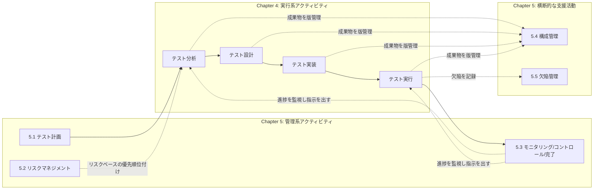
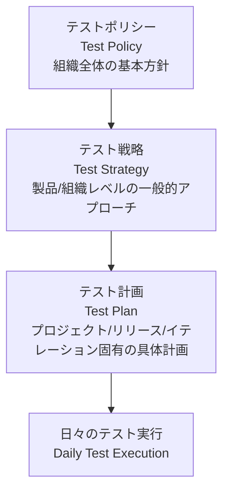
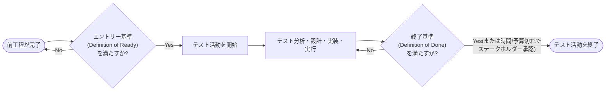
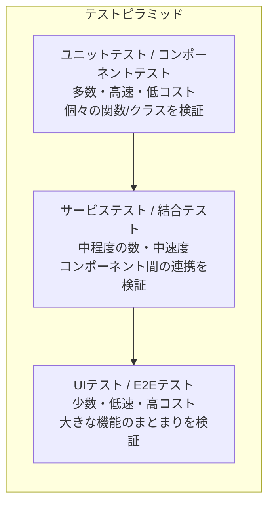
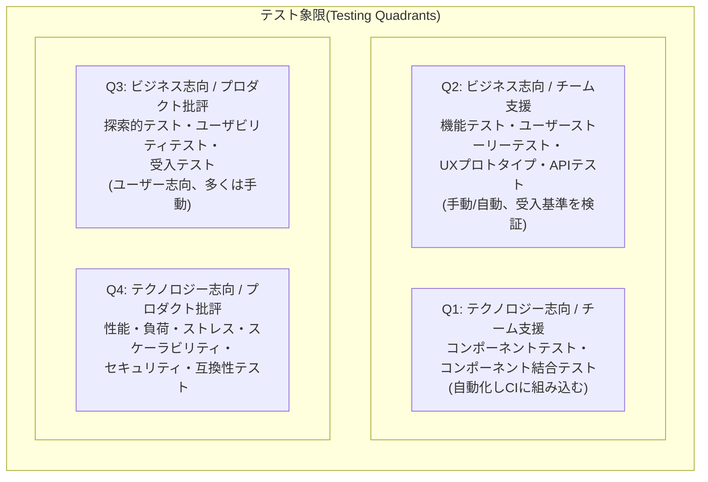
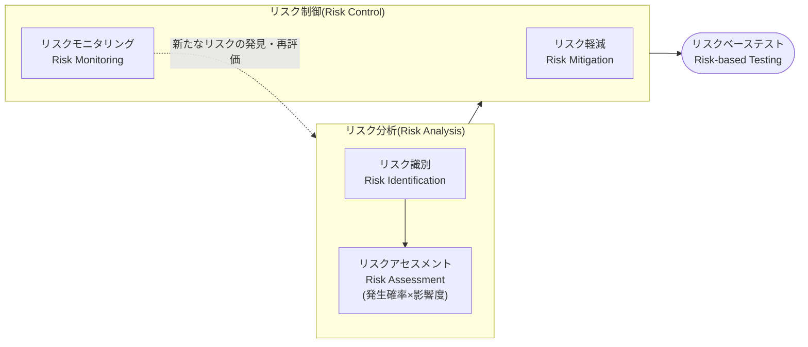
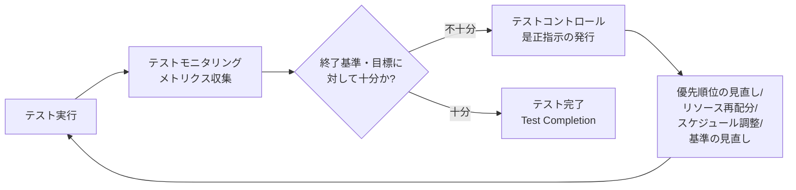
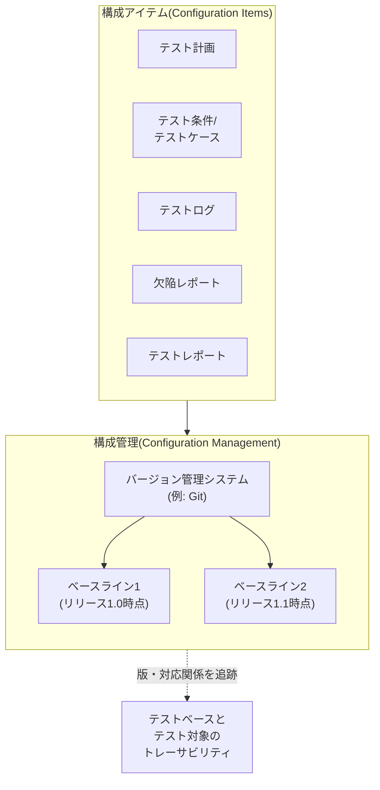
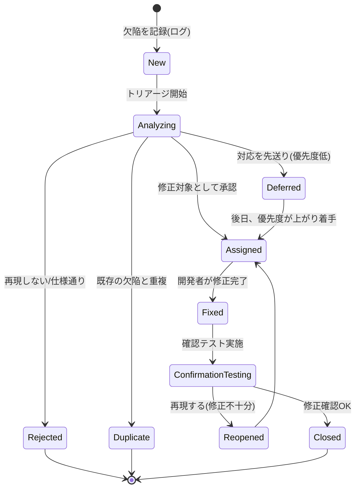

# Chapter 5: テスト活動の管理(Managing the Test Activities)

> ISTQB® Certified Tester Foundation Level (CTFL) v4.0.1 準拠
> 対象読者: 中級〜上級のテストエンジニア・テストマネージャー志望者
> 前提知識: Chapter 1(テストの基礎)、Chapter 2(SDLCとテスト)、Chapter 4(テスト分析・設計)の内容を理解していること

---

## 0. この章の位置づけ

Chapter 5 は CTFL v4.0.1 シラバスの中でも Chapter 4 と並んで最大のボリュームを持つ章であり、シラバス上の学習時間は **335分** が割り当てられている。内容は「テストをどう計画し、どう見積もり、どうリスクに基づいて優先順位づけし、どう監視・制御し、どう終了させるか」という、テストという知的活動をプロジェクトとして運営するための実務知識に集中している。

| 節 | タイトル | 中心となる問い |
|---|---|---|
| 5.1 | テスト計画(Test Planning) | 何を・いつ・誰が・どこまでテストするか |
| 5.2 | リスクマネジメント(Risk Management) | どこに、どれだけのテスト労力を割くべきか |
| 5.3 | テストのモニタリング・コントロール・終了 | テストは順調か、いつ終えてよいか |
| 5.4 | 構成管理(Configuration Management) | テスト成果物をどう版管理し追跡可能にするか |
| 5.5 | 欠陥管理(Defect Management) | 見つかった不具合をどう記録し、収束させるか |

シラバスの構成は Chapter 1 で説明される「テストプロセス」の7つの活動(テスト計画、テストのモニタリングとコントロール、テスト分析、テスト設計、テスト実装、テスト実行、テスト完了)のうち、**テスト分析・設計・実装・実行を除いた「管理系」の活動**を深掘りする章である、という位置づけで読むと理解しやすい。



*出典: [ISTQB CTFL Syllabus v4.0.1 公式PDF](https://istqb.org/wp-content/uploads/2024/11/ISTQB_CTFL_Syllabus_v4.0.1.pdf) / [ISTQB CTFL v4.0 概要ページ](https://istqb.org/certifications/certified-tester-foundation-level-ctfl-v4-0/)*

---

## 1. 5.1 テスト計画(Test Planning)

### 1.1 テスト計画書の目的と内容(5.1.1)

テスト計画(test plan)とは、あるテストプロジェクトにおける**目的・リソース・プロセス**を記述したものである。単なる「やることリスト」ではなく、以下の4つの役割を持つ文書として理解するとよい。

1. **整合性の証明** — テストがテストポリシー(test policy)やテスト戦略(test strategy)にどう準拠するか、あるいは意図的に逸脱する場合はその理由を示す
2. **手段とスケジュールの文書化** — テスト目的をどう・いつ達成するかを明文化する
3. **達成基準の担保** — 実施されたテスト活動が定められた基準(entry/exit criteria)を満たすことを確認する手段となる
4. **コミュニケーション手段** — チームメンバーや他のステークホルダーとの合意形成のベースになる

実務上重要なのは、**テストポリシー → テスト戦略 → テスト計画** という抽象度のヒエラルキーである。テストポリシーは組織全体のテストに対する方針(なぜテストするか)、テスト戦略は製品・組織レベルでの一般的なアプローチ(どう戦略的にテストするか)、テスト計画はプロジェクトや任意のレベルに合わせて具体化したもの(何を・誰が・いつ)である。



一般的にテスト計画には次のような要素が含まれる。

| 構成要素 | 内容の例 |
|---|---|
| テストの対象範囲・目的 | 何を、なぜテストするか |
| テストアイテムとテスト対象外の範囲 | in-scope / out-of-scope |
| テストスケジュール・マイルストーン | いつ、どのテストレベルを実施するか |
| エントリー基準・終了基準 | 5.1.3 参照 |
| リスクレジスタ | 5.2 参照。テスト計画の一部として持たれることが多い |
| 役割と責任 | 誰がテストマネージャーで誰がテスト担当者か |
| 見積り結果 | 5.1.4 参照 |

出典: [ISTQB CTFL Syllabus v4.0.1](https://istqb.org/wp-content/uploads/2024/11/ISTQB_CTFL_Syllabus_v4.0.1.pdf) / [ASTQB: 5.1 Test Planning](https://astqb.org/5-1-test-planning/)

### 1.2 イテレーション計画とリリース計画へのテスト担当者の貢献(5.1.2)

反復型のSDLC(Agileなど)では、計画は「リリース計画」と「イテレーション計画」の2階層で行われる。

- **リリース計画(release planning)**: 複数イテレーションにまたがる大きな単位で、プロダクトの方向性や大まかなリリース内容を扱う
- **イテレーション計画(iteration planning)**: 1回のスプリント/イテレーションに閉じた、より詳細な計画

テスト担当者はここで受け身の実行者ではなく、**能動的な計画への参加者**として価値を発揮する。具体的な貢献は以下の通り。

- ユーザーストーリーのリスク識別・リスクアセスメントに参加する
- ストーリーの優先順位付けに、テスト観点(テスト容易性・リスク)からの意見を提供する
- タスクの分解と、そのタスクに対するテスト工数の見積りを行う
- 何をテストすべきかについて、詳細化・明確化を支援する

たとえばあるISTQB公式サンプル問題では「テスト担当者はどのようにイテレーション計画やリリース計画に価値を加えるか」という設問に対し、正解は「ユーザーストーリーの詳細なリスク識別とリスクアセスメントに参加すること」とされている。テスト担当者は機能面だけに集中するのではなく、非機能要件や品質特性全般に目を配ることが期待される点に注意したい。

出典: [ASTQB: 5.1 Test Planning](https://astqb.org/5-1-test-planning/) / [SlideShare: Chapter 5 - Managing Test Activities V4.0](https://www.slideshare.net/slideshow/chapter-5-managing-test-activities-v4-0/269918691)

### 1.3 エントリー基準と終了基準(5.1.3)

エントリー基準(entry criteria)と終了基準(exit criteria)は、あるテスト活動やテストレベルの「開始してよい条件」と「終えてよい条件」を明確にするためのゲートである。Agileの文脈では、それぞれ **Definition of Ready (DoR)** と **Definition of Done (DoD)** と呼ばれる。



| 観点 | エントリー基準 (Entry Criteria / DoR) | 終了基準 (Exit Criteria / DoD) |
|---|---|---|
| 目的 | 開始してよいかの判断材料 | 完了・十分と言えるかの判断材料 |
| 典型例 | リソース・テスト対象・テスト環境が準備できている/テストデータが利用可能/初期品質レベルが一定水準に達している | 計画したテストがすべて実行済み/未解決の重大欠陥がない/コード網羅率が目標値に到達/リスクベースの目標が達成されている |
| 満たされない場合 | 該当タスクの難易度・コスト・リスクが増大する | 時間や予算の制約により、ステークホルダーの承認を得た上でテストを終了する場合がある |

重要なポイントは、終了基準を厳密に「100%満たさなければ絶対に終了できない」ものと誤解しないことである。シラバスは、時間や予算が尽きた場合にステークホルダーの承認を得て妥当な理由でテストを終了することも許容している。これは Chapter 1 の「全数テストは不可能」という原則とも整合する考え方である。

出典: [ASTQB: 5.1 Test Planning](https://astqb.org/5-1-test-planning/) / [Medium: ISTQB CTFL Syllabus Uncovered Vol4](https://mam16muk.medium.com/istqb-ctfl-syllabus-uncovered-your-ultimate-guide-vol4-6d23b638e1ca)

### 1.4 テスト見積り技法(5.1.4)

テスト工数の見積り(test estimation)は「このテスト活動を完遂するのにどれだけの作業が必要か」を予測する行為である。シラバスは大きく2つの技法を対比させている。

| 技法 | 概要 | 具体例 |
|---|---|---|
| **メトリクスベース技法**(metrics-based technique) | 過去の類似プロジェクトのメトリクス、または一般的な典型値をもとに見積る | Agileにおけるベロシティ/バーンダウンチャート、シーケンシャル開発における欠陥除去モデル |
| **エキスパートベース技法**(expert-based technique) | タスクの担当者や有識者の経験に基づいて見積る | Wideband Delphi法、プランニングポーカー、三点見積り(楽観値・悲観値・最頻値) |

また、テスト工数に影響を与える要因(factors influencing the test effort)として、シラバスでは主に以下の3カテゴリが挙げられている。

- **プロダクト特性**: 要求仕様の品質、プロダクトサイズ、必要な品質特性の非機能要求の複雑さ、必要なテストデータやテスト環境の複雑さ
- **プロセス特性**: 採用するテスト戦略、SDLCモデルの成熟度、必要なテストのやり直し(リテスト・回帰テスト)の頻度
- **人・組織特性**: チームメンバーのスキルレベル、テストツールの習熟度、テスト対象領域に関するドメイン知識

以下は、エキスパートベース技法のひとつである三点見積り(PERT式)を Python で実装した簡単な例である。楽観値・最頻値・悲観値の3点から加重平均で見積り工数を算出する、実務でもよく使われる手法である。

```python
"""三点見積り(PERT式)によるテスト工数見積りの例。

expert-based technique の代表的な実装のひとつ。
楽観値(optimistic)・最頻値(most likely)・悲観値(pessimistic)
の3値から、ベータ分布を仮定した期待値と標準偏差を算出する。
"""
from dataclasses import dataclass


@dataclass
class ThreePointEstimate:
    optimistic: float       # 楽観値(順調に進んだ場合の工数[人日])
    most_likely: float      # 最頻値(最も起こりうる工数[人日])
    pessimistic: float      # 悲観値(問題が発生した場合の工数[人日])

    def expected_effort(self) -> float:
        """PERT式の期待値: (楽観 + 4*最頻 + 悲観) / 6"""
        return (self.optimistic + 4 * self.most_likely + self.pessimistic) / 6

    def standard_deviation(self) -> float:
        """ばらつきの目安: (悲観 - 楽観) / 6"""
        return (self.pessimistic - self.optimistic) / 6


def test_expected_effort_matches_pert_formula():
    """回帰テストAPIの見積り: 楽観3日、最頻5日、悲観9日のケース"""
    estimate = ThreePointEstimate(optimistic=3, most_likely=5, pessimistic=9)

    expected = estimate.expected_effort()
    stddev = estimate.standard_deviation()

    assert expected == 5.333333333333333  # (3 + 20 + 9) / 6
    assert round(stddev, 2) == 1.0
```

この例のように、エキスパートベースの見積りであっても計算ロジック自体は定量的に再現可能な形で実装しておくと、見積り根拠をレビュー・トレーサビリティの対象にできる点が実務上のメリットである。

出典: [ISTQB CTFL Syllabus v4.0.1](https://istqb.org/wp-content/uploads/2024/11/ISTQB_CTFL_Syllabus_v4.0.1.pdf) / [Ultra.guide: ISTQB Foundation Learning Objectives](https://www.ultra.guide/bin/view/Testing/LearningObjectivesISTQB) / [Cania Consulting: A Test Manager Guide to Estimating the Test Effort](https://cania-consulting.com/2019/10/12/a-test-manager-guide-to-estimating-the-test-effort/)

### 1.5 テストケースの優先順位付け(5.1.5)

テストケース・テスト手順は、テストスイートにまとめられ、実行順序を定めた**テスト実行スケジュール**として組まれる。優先順位付けの代表的な戦略は以下の3つである。

| 戦略 | 優先順位の基準 | 想定される利用場面 |
|---|---|---|
| リスクベース(Risk-based) | 特定されたリスクの高いものから実行 | 限られた時間で最も重大な欠陥を早期に検出したい場合 |
| カバレッジベース(Coverage-based) | 高いカバレッジ(例: ステートメントカバレッジ)を達成するテストから実行 | 網羅率の目標達成を優先したい場合 |
| 要求ベース(Requirements-based) | ステークホルダーが定義した要求の優先度順に実行 | ビジネス上重要な機能から確認したい場合 |

理想的には優先度順に実行するが、**依存関係**(高優先度のテストが低優先度のテストの前提条件になっている場合は先に低優先度のテストを実行する必要がある)や**リソースの制約**も加味しなければならない、という点が実務・試験の両方で問われやすいポイントである。

出典: [ASTQB: 5.1 Test Planning](https://astqb.org/5-1-test-planning/) / [Medium: ISTQB CTFL Syllabus Uncovered Vol4](https://mam16muk.medium.com/istqb-ctfl-syllabus-uncovered-your-ultimate-guide-vol4-6d23b638e1ca)

### 1.6 テストピラミッド(5.1.6)

テストピラミッド(test pyramid)は、テストの粒度(granularity)によって異なる層があることを示すモデルであり、**下層ほどテスト数が多く・高速・安価**、**上層ほどテスト数が少なく・低速・高価**という関係を表す。このモデルはテスト自動化やテスト工数配分の指針として使われる。



シラバスでは、層の名称や数はモデルによって異なることが明示されている。原型となったモデルでは「unit tests」「service tests」「UI tests」の3層だが、「unit (component) tests」「integration (component integration) tests」「end-to-end tests」とする別モデルも一般的であり、他のテストレベルを使う場合もある。**「決まった名前を暗記する」よりも「下ほど多く・速く・安く、上ほど少なく・遅く・高い」という構造原理を理解する**ことが重要である。

出典: [ASTQB: 5.1 Test Planning](https://astqb.org/5-1-test-planning/) / [SlideShare: Chapter 5 - Managing Test Activities V4.0](https://www.slideshare.net/slideshow/chapter-5-managing-test-activities-v4-0/269918691)

### 1.7 テスト象限(Testing Quadrants)(5.1.7)

テスト象限(testing quadrants、Brian Marick が提唱)は、Agile開発における**テストレベル・テストタイプ・活動・技法・成果物**を、2つの軸で整理するモデルである。

- 縦軸: **テクノロジー志向(technology-facing)** か **ビジネス志向(business-facing)** か
- 横軸: **チームを支援する(support the team)** か **プロダクトを批評する(critique the product)** か



| 象限 | 志向 | 目的 | 代表的なテストタイプ |
|---|---|---|---|
| Q1 | テクノロジー志向 / チーム支援 | 開発を導く | コンポーネントテスト、コンポーネント結合テスト(CIで自動実行) |
| Q2 | ビジネス志向 / チーム支援 | 開発を導く | 機能テスト、ユーザーストーリーテスト、APIテスト、UXプロトタイプ |
| Q3 | ビジネス志向 / プロダクト批評 | 完成品を検証する | 探索的テスト、ユーザビリティテスト、受入テスト |
| Q4 | テクノロジー志向 / プロダクト批評 | 完成品を検証する | 性能・負荷・ストレス・セキュリティ・互換性・データ移行テスト |

象限は実行順序を示すものではなく、あくまで**分類のための地図**である点に注意したい。プロジェクトによっては Q4(性能テスト)から着手することもあれば、要求が固まっていない場合に Q3(探索的テスト)のスパイクから始めることもある。

出典: [ASTQB: 5.1 Test Planning](https://astqb.org/5-1-test-planning/) / [SlideShare: Chapter 5 - Managing Test Activities V4.0](https://www.slideshare.net/slideshow/chapter-5-managing-test-activities-v4-0/269918691) / [Lisa Crispin: Using the Agile Testing Quadrants](https://lisacrispin.com/2011/11/08/using-the-agile-testing-quadrants/)

---

## 2. 5.2 リスクマネジメント(Risk Management)

### 2.1 リスクの定義とリスク属性(5.2.1)

ISO 31000 の考え方に基づき、シラバスはリスクを「発生すると好ましくない影響をもたらす可能性のある事象・脅威・状況」と定義する。リスクは次の2つの属性の組み合わせで特徴づけられる。

- **リスク発生確率(risk likelihood)**: そのリスクが実際に発生する確率
- **リスク影響度(risk impact)**: そのリスクが発生した場合の被害の大きさ(損害)

リスクレベルは、この2つを組み合わせて算出される。一般的には次のような簡易マトリクスで表現される。

| 発生確率 \ 影響度 | 低 | 中 | 高 |
|---|---|---|---|
| **高** | 中リスク | 高リスク | 最高リスク |
| **中** | 低リスク | 中リスク | 高リスク |
| **低** | 最低リスク | 低リスク | 中リスク |

リスクマネジメントの活動は大きく2つに分類される。

- **リスク分析(risk analysis)**: リスク識別(risk identification) + リスクアセスメント(risk assessment)
- **リスク制御(risk control)**: リスク軽減(risk mitigation) + リスクモニタリング(risk monitoring)

このリスク分析とリスク制御に基づいてテスト活動を選択・優先順位付け・管理するアプローチを**リスクベーステスト(risk-based testing)**と呼ぶ。



出典: [ASTQB: 5.2 Risk Management](https://astqb.org/5-2-risk-management/) / [SlideShare: Chapter 5 - Managing Test Activities V4.0](https://www.slideshare.net/slideshow/chapter-5-managing-test-activities-v4-0/269918691)

### 2.2 プロジェクトリスクとプロダクトリスク(5.2.2)

CTFLでは、リスクは大きく2種類に分類される。この区別は試験でも頻出であり、実務上も「誰が」「何に対して」対応すべきかを判断する基準になる。

| 種類 | 定義 | 具体例 |
|---|---|---|
| **プロジェクトリスク**(project risk) | プロジェクトが目標を達成する能力に影響を与えるリスク | 組織要因(スキル・人員不足、トレーニング不足)、技術的問題(要求の曖昧さ、環境の未整備)、サプライヤーの問題(第三者製品の遅延、契約上の問題)、スケジュールや予算の逼迫 |
| **プロダクトリスク**(product risk) | プロダクトの品質そのものに影響を与えるリスク | 機能不全(不十分/不正確な機能)、非機能面の問題(性能不足・セキュリティ脆弱性・信頼性の低さ・ユーザビリティの悪さ)、データの完全性・移行の問題 |

プロジェクトリスクは主にテストマネージャーやプロジェクトマネージャーが対処し、プロダクトリスクはテスト活動そのものによって軽減される、という役割分担のイメージを持つと理解しやすい。

出典: [ASTQB: 5.2 Risk Management](https://astqb.org/5-2-risk-management/) / [Medium: ISTQB CTFL Syllabus Uncovered Vol4](https://mam16muk.medium.com/istqb-ctfl-syllabus-uncovered-your-ultimate-guide-vol4-6d23b638e1ca)

### 2.3 プロダクトリスク分析(5.2.3)

プロダクトリスク分析(product risk analysis)は、テストの深さと範囲を決定する上での基礎となる。分析結果は以下のような意思決定に使われる。

- テストの範囲(スコープ)を決定する
- 実施する具体的なテストレベルとテストタイプを提案する
- 用いるべきテスト技法とテストで達成すべきカバレッジを決定する
- 各タスクに必要なテスト工数を見積る
- 重大な欠陥を早期に発見できるよう、テストの優先順位を付ける
- テスト以外にリスクを低減できる活動(レビュー、静的解析など)がないか検討する

出典: [SlideShare: Chapter 5 - Managing Test Activities V4.0](https://www.slideshare.net/slideshow/chapter-5-managing-test-activities-v4-0/269918691) / [ASTQB: 5.2 Risk Management](https://astqb.org/5-2-risk-management/)

### 2.4 プロダクトリスク制御(5.2.4)

プロダクトリスク制御(product risk control)は、識別・評価されたリスクに対して実際に取る対応であり、次の2つで構成される。

- **リスク軽減(risk mitigation)**: リスクアセスメントで提案されたアクションを実施し、リスクレベルそのものを下げる(例: 該当領域のテストを厚くする、レビューを追加する)
- **リスクモニタリング(risk monitoring)**: 軽減策が有効に機能しているかを確認し、リスクアセスメントの精度向上に必要な情報を得て、新たに生じたリスクを検知する

リスクへの一般的な対応選択肢としては、**軽減するためにテストする / 受容する / 移転する / バックアッププランを用意する**などがある。

以下は、リスクレジスタ(risk register)をシンプルに実装し、発生確率と影響度からリスクレベルを算出してテスト優先順位を導出する例である。

```python
"""リスクベーステストのための簡易リスクレジスタ実装例。

risk level = likelihood(1-5) x impact(1-5) という単純な乗算モデルで
優先順位付けを行う。実務ではより精緻なマトリクスを使うこともあるが、
考え方の骨子はこのモデルで説明できる。
"""
from dataclasses import dataclass, field


@dataclass
class RiskItem:
    risk_id: str
    description: str
    likelihood: int  # 1(低い) 〜 5(高い)
    impact: int       # 1(軽微) 〜 5(重大)
    mitigation: str = ""

    def risk_level(self) -> int:
        return self.likelihood * self.impact


@dataclass
class RiskRegister:
    items: list = field(default_factory=list)

    def add(self, risk: RiskItem) -> None:
        self.items.append(risk)

    def prioritized(self) -> list:
        """リスクレベルの高い順にソートして返す(risk-based testingの基礎)"""
        return sorted(self.items, key=lambda r: r.risk_level(), reverse=True)


def test_high_risk_items_are_prioritized_first():
    register = RiskRegister()
    register.add(RiskItem("R-01", "決済APIのタイムアウト処理不備",
                           likelihood=4, impact=5,
                           mitigation="決済系の異常系テストを重点的に実施"))
    register.add(RiskItem("R-02", "フッターのリンク切れ",
                           likelihood=3, impact=1))
    register.add(RiskItem("R-03", "個人情報のログ出力漏洩",
                           likelihood=2, impact=5,
                           mitigation="セキュリティレビューとログ出力の静的解析"))

    ranked = register.prioritized()

    assert [r.risk_id for r in ranked] == ["R-01", "R-03", "R-02"]
    assert ranked[0].risk_level() == 20
```

出典: [ASTQB: 5.2 Risk Management](https://astqb.org/5-2-risk-management/) / [ISTQB CTFL Syllabus v4.0.1](https://istqb.org/wp-content/uploads/2024/11/ISTQB_CTFL_Syllabus_v4.0.1.pdf)

---

## 3. 5.3 テストのモニタリング、コントロール、テスト完了

### 3.1 テストで使われるメトリクス(5.3.1)

**テストモニタリング(test monitoring)**は、テストに関する情報を収集し、テストの進捗を評価するとともに、終了基準やそれに紐づくタスク(プロダクトリスクのカバレッジ目標、要求カバレッジ、受入基準の達成など)が満たされているかを測定する活動である。

**テストコントロール(test control)**は、テストモニタリングで得られた情報をもとに、コントロールディレクティブ(是正指示)という形でガイダンスや是正措置を提供し、最も効果的・効率的なテストを実現する活動である。

モニタリングとコントロールは対になって機能するが、**「観察する」行為と「判断して行動する」行為は明確に別の活動である**という点を混同しないことが重要である。



代表的なテストメトリクスは以下のように分類できる。

| カテゴリ | メトリクス例 |
|---|---|
| プロジェクト・テスト進捗 | 計画に対する完了率、実行済みテストケース数、残タスク工数 |
| プロダクト品質 | 検出された欠陥数、欠陥密度、欠陥の重大度分布 |
| リスク | カバーされたリスクの割合、未対応の高リスク項目数 |
| カバレッジ | 要求カバレッジ、コードカバレッジ、リスクカバレッジ |
| コスト | 消化予算、残予算 |

出典: [ASTQB: 5.3 Test Monitoring, Test Control and Test Completion](https://astqb.org/5-3-test-monitoring-test-control-and-test-completion/) / [ISTQB CTFL Syllabus v4.0.1](https://istqb.org/wp-content/uploads/2024/11/ISTQB_CTFL_Syllabus_v4.0.1.pdf)

### 3.2 テストレポートの目的・内容・読者(5.3.2)

テストレポートには大きく分けて2種類ある。継続的に発行される**テスト進捗レポート(test progress report)**と、あるテストレベルや工程の終了時に作成される**テスト完了レポート(test completion report)**である。

| 観点 | テスト進捗レポート | テスト完了レポート |
|---|---|---|
| タイミング | テスト活動中、定期的に | テストレベル/プロジェクトの終了時 |
| 主な内容 | 現在の進捗、直近の課題、リスク状況、今後の見通し | テストサマリ、達成したカバレッジ、未解決の欠陥、学んだ教訓 |
| 主な読者 | テストマネージャー、プロジェクトマネージャー、開発チーム | ステークホルダー全般(経営層、プロダクトオーナーを含む) |
| 主目的 | 状況把握と早期の意思決定支援 | 品質評価に基づくリリース可否判断、プロセス改善への示唆 |

出典: [ASTQB: 5.3 Test Monitoring, Test Control and Test Completion](https://astqb.org/5-3-test-monitoring-test-control-and-test-completion/)

### 3.3 テスト状況の伝達(5.3.3)

テスト状況をどのように伝達するかは、組織構造や規制要件、チームの自己組織化の度合いによって変わる。シラバスが挙げる主な影響要因は以下の通り。

- 組織構造(階層型か、フラットで自己組織化されたチームか)
- 規制・コンプライアンス要件(監査証跡が必要な業界か)
- ステークホルダーの情報ニーズと関与度
- 使用している開発手法(ウォーターフォールかAgileか、デイリースタンドアップの有無)

Agile開発ではカンバンボードやバーンダウンチャートなど視覚的でリアルタイムなコミュニケーション手段が使われることが多く、伝統的なウォーターフォール開発では文書化されたフォーマルなレポートが重視される傾向がある。

出典: [ASTQB: 5.3 Test Monitoring, Test Control and Test Completion](https://astqb.org/5-3-test-monitoring-test-control-and-test-completion/) / [ISTQB CTFL Syllabus v4.0.1](https://istqb.org/wp-content/uploads/2024/11/ISTQB_CTFL_Syllabus_v4.0.1.pdf)

---

## 4. 5.4 構成管理(Configuration Management)

テストにおける構成管理(Configuration Management, CM)とは、テスト計画・テスト戦略・テスト条件・テストケース・テストスクリプト・テスト結果・テストログ・テストレポートなどの成果物を**構成アイテム(configuration item)**として識別し、制御し、追跡するための規律である。

構成管理がテストにおいて重要な理由は以下の通り。

- **一貫性の担保**: どのバージョンのテスト対象に対して、どのバージョンのテストケースを実行したかを明確にできる
- **再現性の確保**: 過去のテスト結果を正確に再現・検証できる
- **トレーサビリティの実現**: 要求 → テスト条件 → テストケース → テスト結果 → 欠陥、という一連の連鎖を追跡可能にする
- **監査・コンプライアンス対応**: 規制産業などで求められる監査証跡を残せる



構成管理はテスト成果物単体の版管理だけでなく、**テスト対象(test object)とテストウェアのバージョンの対応関係**を明確にする役割も持つ。たとえば、あるビルドに対してどのテストスイートが実行されたかを一意に特定できなければ、欠陥の再現や回帰テストの範囲決定が困難になる。

出典: [ASTQB: 5.4 Configuration Management](https://astqb.org/5-4-configuration-management/) / [ISTQB CTFL Syllabus v4.0.1](https://istqb.org/wp-content/uploads/2024/11/ISTQB_CTFL_Syllabus_v4.0.1.pdf)

---

## 5. 5.5 欠陥管理(Defect Management)

テストの主要な目的の一つが欠陥の発見である以上、確立された欠陥管理プロセスは不可欠である。なお、報告された「異常(anomaly)」がすべて実際の欠陥であるとは限らず、テスト実行時のネットワーク切断のような**偽陽性(false positive)**である場合もある点に留意する必要がある。テスト担当者はこうした偽陽性の報告を最小化するよう努めるべきとされている。

欠陥は、コーディング中・静的解析中・レビュー中・動的テスト中など、SDLCのあらゆる局面で、コードだけでなく要求やユーザーストーリー、各種ドキュメントに対しても報告されうる。

### 5.1 欠陥のライフサイクル

欠陥管理プロセスは、最低限、個々の欠陥・異常を発見から終結(closure)まで扱うワークフローと、分類のためのルールを含む。典型的な流れは「記録 → 分析・分類 → 対応の決定(修正する/現状維持する等) → 終結」である。



確認テスト(confirmation testing)は、可能な限り最初にその欠陥を検出したテスト担当者本人が行うことが望ましいとされる。これは、修正内容や元の再現手順に対する文脈理解が最も深いためである。

### 5.2 欠陥報告の目的

シラバスは、典型的な欠陥報告(defect report)の目的として以下を挙げている。

1. 開発者やその他の関係者に、発生した事象についての情報を提供し、影響の特定・最小再現手順への切り分け・欠陥の修正を可能にする
2. テストマネージャーに、プロダクトの品質やテストへの影響を追跡する手段を提供する(たとえば欠陥が多く報告されるほど、報告作業に時間が割かれ、確認テストの必要性も増える)
3. 開発プロセス・テストプロセスの改善に向けたアイデアを提供する

### 5.3 動的テスト時の欠陥報告に含まれる典型的な項目

| 項目 | 説明 |
|---|---|
| 一意の識別子(ID) | 欠陥を一意に特定するためのID |
| タイトル | 異常内容を要約した短い見出し |
| 発見日・報告組織・報告者(役割を含む) | いつ・どこの・誰が報告したか |
| テスト対象・テスト環境の識別情報 | 何に対して、どの環境で発生したか |
| 発生時のコンテキスト | 実行していたテストケース、テスト活動、SDLCフェーズ、使用していたテスト技法・チェックリスト・テストデータなど |
| 再現・解決のための説明 | 発見に至った手順、テストログ、DBダンプ、スクリーンショット、録画など |
| 期待結果と実際の結果 | Expected result / Actual result |
| 重大度(Severity) | ステークホルダーの利害や要求への影響度 |
| 修正の優先度(Priority) | どれだけ早く対応すべきか |
| ステータス | open, deferred, duplicate, waiting to be fixed, awaiting confirmation testing, reopened, closed, rejected など |
| 参照情報 | 関連するテストケースや要求へのリンクなど |

以下は、この欠陥報告の必須項目を Python のデータクラスとしてモデル化し、必須フィールドが揃っているかを検証する簡易バリデータの例である。実務では欠陥管理ツール(Jira等)がこの構造をGUIとして提供するが、内部的なデータモデルの理解に役立つ。

```python
"""動的テストにおける欠陥報告(defect report)のデータモデル例。

ISTQB CTFL v4.0.1 5.5節で挙げられている典型的な記載項目を
dataclassとしてモデル化し、必須項目の充足チェックを行う。
"""
from dataclasses import dataclass
from enum import Enum


class DefectStatus(str, Enum):
    OPEN = "open"
    DEFERRED = "deferred"
    DUPLICATE = "duplicate"
    WAITING_TO_BE_FIXED = "waiting_to_be_fixed"
    AWAITING_CONFIRMATION = "awaiting_confirmation_testing"
    REOPENED = "reopened"
    CLOSED = "closed"
    REJECTED = "rejected"


@dataclass
class DefectReport:
    defect_id: str
    title: str
    reported_by: str
    test_object: str
    test_environment: str
    steps_to_reproduce: str
    expected_result: str
    actual_result: str
    severity: str        # 例: "Critical", "Major", "Minor"
    priority: str         # 例: "P1", "P2", "P3"
    status: DefectStatus = DefectStatus.OPEN

    def is_complete(self) -> bool:
        """必須項目がすべて空でないかを検証する簡易バリデーション"""
        required_fields = [
            self.title, self.reported_by, self.test_object,
            self.test_environment, self.steps_to_reproduce,
            self.expected_result, self.actual_result,
            self.severity, self.priority,
        ]
        return all(field.strip() for field in required_fields)


def test_defect_report_with_all_fields_is_complete():
    report = DefectReport(
        defect_id="DEF-1042",
        title="決済確定後にタイムアウトすると二重課金が発生する",
        reported_by="山田太郎(QAエンジニア)",
        test_object="決済API v2.3.0",
        test_environment="Staging / Chrome 126",
        steps_to_reproduce="1) カート合計10,000円で決済確定\n"
                            "2) 決済処理中に強制的にAPIタイムアウトを発生させる\n"
                            "3) 決済履歴を確認する",
        expected_result="決済は1回のみ確定し、タイムアウト時は自動的にロールバックされる",
        actual_result="同一注文に対し決済が2回確定している",
        severity="Critical",
        priority="P1",
    )

    assert report.is_complete() is True
    assert report.status == DefectStatus.OPEN


def test_defect_report_missing_actual_result_is_incomplete():
    incomplete_report = DefectReport(
        defect_id="DEF-1043", title="ログイン画面のラベル崩れ",
        reported_by="佐藤花子", test_object="Webフロントエンド",
        test_environment="Production", steps_to_reproduce="ログイン画面を開く",
        expected_result="ラベルが正しく表示される",
        actual_result="",  # 未記入
        severity="Minor", priority="P3",
    )

    assert incomplete_report.is_complete() is False
```

出典: [ASTQB: 5.5 Defect Management](https://astqb.org/5-5-defect-management/) / [SlideShare: Chapter 5 - Managing Test Activities V4.0](https://www.slideshare.net/slideshow/chapter-5-managing-test-activities-v4-0/269918691) / [magdalenaolak.gitbook.io: 5.6 Defect Management](https://magdalenaolak.gitbook.io/istqb-foundation-level/5-test-management/5.6-defect-management)

---

## 6. 章のまとめと重要用語

| 用語(英語) | 日本語 | 要点 |
|---|---|---|
| Test Plan | テスト計画 | 目的・リソース・プロセスを記述、ポリシー/戦略との整合を示す |
| Entry Criteria / Exit Criteria | エントリー基準/終了基準 | DoR/DoDに相当。開始・終了の可否判断基準 |
| Metrics-based / Expert-based estimation | メトリクスベース/エキスパートベース見積り | 過去データ活用 vs 経験者判断 |
| Test Pyramid | テストピラミッド | 下ほど多く高速安価、上ほど少なく低速高価 |
| Testing Quadrants | テスト象限 | テクノロジー/ビジネス軸 × チーム支援/プロダクト批評軸のQ1〜Q4 |
| Risk Likelihood / Impact | リスク発生確率/影響度 | リスクレベル算出の2要素 |
| Project Risk / Product Risk | プロジェクトリスク/プロダクトリスク | プロジェクト運営 vs プロダクト品質 |
| Test Monitoring / Test Control | テストモニタリング/コントロール | 観察 vs 是正指示、明確に別の活動 |
| Configuration Management | 構成管理 | 成果物のバージョン管理とトレーサビリティ確保 |
| Defect Report | 欠陥報告 | 再現性・重大度・優先度・ステータスを含む標準化された記録 |

### 章末チェックリスト(自己診断)

- [ ] テストポリシー・テスト戦略・テスト計画の三層構造を説明できるか
- [ ] エントリー基準と終了基準の違いと、両者を満たさない場合の対応を説明できるか
- [ ] メトリクスベース見積りとエキスパートベース見積りを具体例とともに区別できるか
- [ ] テストケースの3つの優先順位付け戦略と、依存関係・リソース制約による調整の必要性を説明できるか
- [ ] テストピラミッドとテスト象限の違い(粒度の話か、性質分類の話か)を説明できるか
- [ ] プロジェクトリスクとプロダクトリスクを具体例つきで区別できるか
- [ ] リスク分析(識別+アセスメント)とリスク制御(軽減+モニタリング)を区別できるか
- [ ] テストモニタリングとテストコントロールの違いを、シナリオ問題で判定できるか
- [ ] テスト進捗レポートとテスト完了レポートの違い(タイミング・読者・内容)を説明できるか
- [ ] 構成管理がテストのトレーサビリティにどう寄与するかを説明できるか
- [ ] 欠陥報告に含めるべき典型項目を、実際に記述できるか

---

## 7. 参考文献・参照URL一覧

本章の作成にあたり、以下の一次情報源および信頼できる二次情報源を参照した(2026年7月時点でアクセス可能な最新版)。

**一次情報源(ISTQB公式)**

- ISTQB CTFL Syllabus v4.0.1(公式シラバスPDF): <https://istqb.org/wp-content/uploads/2024/11/ISTQB_CTFL_Syllabus_v4.0.1.pdf>
- ISTQB Certified Tester Foundation Level (CTFL) v4.0 概要ページ: <https://istqb.org/certifications/certified-tester-foundation-level-ctfl-v4-0/>
- ISTQB CTFL Syllabus v4.0.1 ダウンロードページ: <https://istqb.org/sdm_downloads/istqb-certified-tester-foundation-level-syllabus-v4-0/>

**セクション別の解説(ASTQB公式サイト、シラバス学習用ページ)**

- 5.1 Test Planning: <https://astqb.org/5-1-test-planning/>
- 5.2 Risk Management: <https://astqb.org/5-2-risk-management/>
- 5.3 Test Monitoring, Test Control and Test Completion: <https://astqb.org/5-3-test-monitoring-test-control-and-test-completion/>
- 5.4 Configuration Management: <https://astqb.org/5-4-configuration-management/>
- 5.5 Defect Management: <https://astqb.org/5-5-defect-management/>

**補足・実務解説(信頼できる二次情報源)**

- SlideShare: Chapter 5 - Managing Test Activities V4.0(トレーニング資料、defect report項目・product risk analysisの詳細): <https://www.slideshare.net/slideshow/chapter-5-managing-test-activities-v4-0/269918691>
- ISTQB.guru: CTFL v4 Syllabus Chapter-by-Chapter Deep Dive(章ごとの出題比率解説): <https://www.istqb.guru/ctfl-v4-syllabus-chapter-by-chapter-deep-dive/>
- Medium (Mohamed Yaseen): ISTQB CTFL Syllabus Uncovered Vol4(5章の平易な解説): <https://mam16muk.medium.com/istqb-ctfl-syllabus-uncovered-your-ultimate-guide-vol4-6d23b638e1ca>
- tryqa.com: What are Test Pyramid and Testing Quadrants in Agile Testing Methodology?: <https://tryqa.com/what-are-test-pyramid-and-testing-quadrants-in-agile-testing-methodology/>
- Lisa Crispin: Using the Agile Testing Quadrants(テスト象限の実務的な使い方): <https://lisacrispin.com/2011/11/08/using-the-agile-testing-quadrants/>
- Cania Consulting: A Test Manager Guide to Estimating the Test Effort(見積り技法の実務解説): <https://cania-consulting.com/2019/10/12/a-test-manager-guide-to-estimating-the-test-effort/>
- magdalenaolak.gitbook.io: 5.6 Defect Management(欠陥報告の目的の詳細): <https://magdalenaolak.gitbook.io/istqb-foundation-level/5-test-management/5.6-defect-management>
- ISTQB CTFL v4.0 Certification: 2026 Exam & Syllabus Guide(出題範囲・K-levelの概要): <https://www.istqb.com/ctfl-v4-0/>

**関連する業界標準(シラバス内で言及)**

- ISO 31000(リスクマネジメント)
- ISO/IEC/IEEE 29119-2(テストプロセス)
- ISO/IEC/IEEE 29119-3(テストドキュメント、欠陥報告のフォーマットを含む)

---

*本ドキュメントは ISTQB® CTFL v4.0.1 シラバスの内容を教育目的で要約・翻訳・再構成したものであり、シラバス原文の逐語的な転載ではありません。正式な試験対策には必ず公式シラバスおよび公式サンプル問題を参照してください。*
