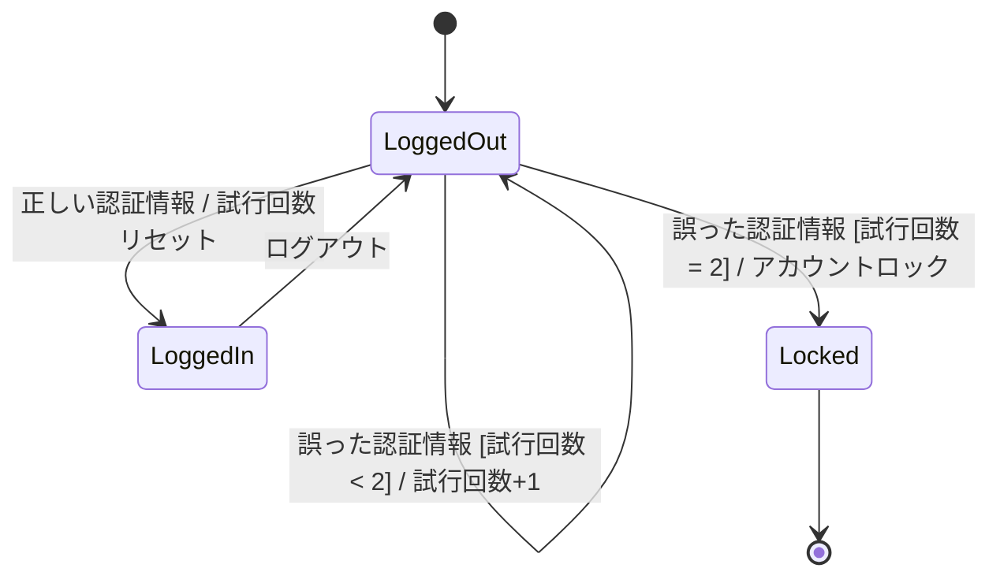
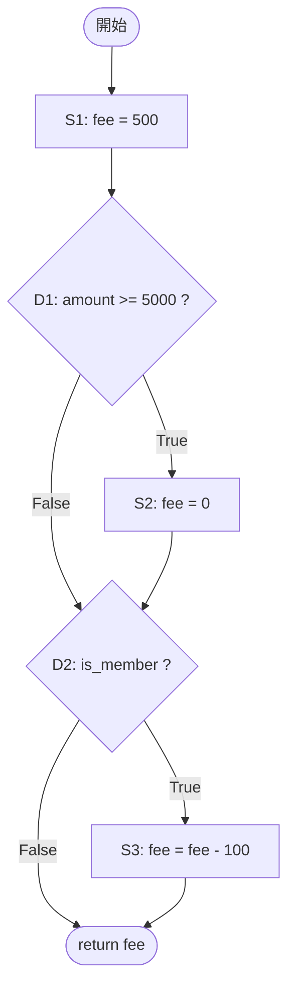
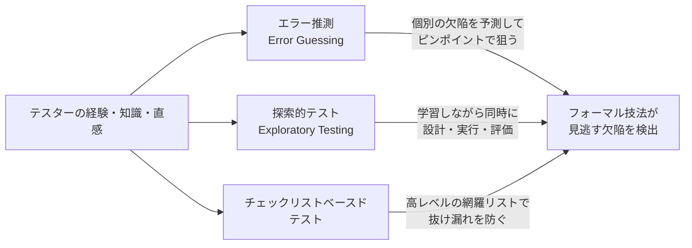
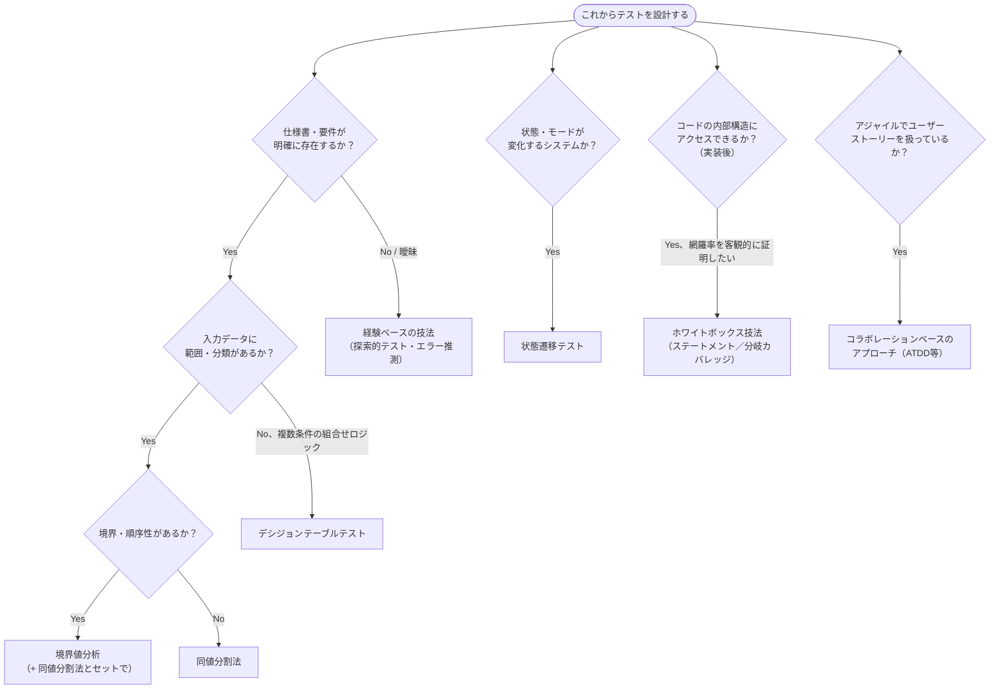
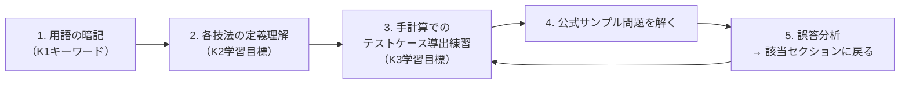

# ISTQB® CTFL v4.0 第4章 完全解説：テスト分析・設計（Test Analysis and Design）

> 対象読者：ISTQB Foundation Level 取得済み〜受験直前の中級者、および実務でテスト設計技法を体系的に使いこなしたい上級者
> 準拠シラバス：**ISTQB® Certified Tester Foundation Level Syllabus v4.0.1**（2024-09-15 改訂版）
> 本章の学習時間：**390分**（全6章・合計1135分のうち約34%を占める、シラバス最大のボリュームを持つ章）

---

## 0. 本章の位置づけと学習目標

第4章は、第1章で学んだ「テストプロセス」のうち **テスト分析（Test Analysis）** と **テスト設計（Test Design）** を、具体的な「技法（Technique）」レベルまで掘り下げる章です。テスト分析は「何をテストするか（What to test）」、テスト設計は「どのようにテストするか（How to test）」に答える活動であり、本章で学ぶ技法群はその両方を体系的に支援します。

$$
\text{テスト分析} \xrightarrow{\text{test conditions}} \text{テスト設計} \xrightarrow{\text{test cases}} \text{テスト実装} \xrightarrow{} \text{テスト実行}
$$

### 0.1 学習目標（Learning Objectives）一覧

| 節 | LO番号 | K-Level | 内容 |
|---|---|---|---|
| 4.1 | FL-4.1.1 | K2 | ブラックボックス・ホワイトボックス・経験ベースの技法を区別できる |
| 4.2 | FL-4.2.1〜4.2.4 | K3 | 同値分割法・境界値分析・デシジョンテーブルテスト・状態遷移テストを使ってテストケースを導出できる |
| 4.3 | FL-4.3.1〜4.3.3 | K2 | ステートメントテスト・分岐テストを説明でき、ホワイトボックステストの価値を説明できる |
| 4.4 | FL-4.4.1〜4.4.3 | K2 | エラー推測・探索的テスト・チェックリストベースドテストを説明できる |
| 4.5 | FL-4.5.1〜4.5.3 | K2/K3 | ユーザーストーリーの共同作成・受け入れ基準の分類ができ、ATDDでテストケースを導出できる |

K3（適用）レベルの学習目標が集中しているのが本章の特徴です。つまり試験では「用語の暗記」だけでなく「与えられた仕様からテストケースを実際に導出させる」計算問題・応用問題が出題される、という点を強く意識してください。

> 📖 参考: [ISTQB Certified Tester Foundation Level Syllabus v4.0.1, Chapter 4](https://istqb.org/wp-content/uploads/2024/11/ISTQB_CTFL_Syllabus_v4.0.1.pdf) (p.38-46)

### 0.2 本章のキーワード（K1：暗記必須）

acceptance criteria（受け入れ基準）, acceptance test-driven development（ATDD）, black-box test technique（ブラックボックステスト技法）, boundary value analysis（境界値分析）, branch coverage（分岐カバレッジ）, checklist-based testing（チェックリストベースドテスト）, collaboration-based test approach（コラボレーションベースのテストアプローチ）, coverage（カバレッジ）, coverage item（カバレッジ項目）, decision table testing（デシジョンテーブルテスト）, equivalence partitioning（同値分割法）, error guessing（エラー推測）, experience-based test technique（経験ベースのテスト技法）, exploratory testing（探索的テスト）, state transition testing（状態遷移テスト）, statement coverage（ステートメントカバレッジ）, test technique（テスト技法）, white-box test technique（ホワイトボックステスト技法）

---

## 1. 4.1 テスト技法の全体像（Test Techniques Overview）

### 1.1 なぜテスト技法が必要か

「テストは無限にはできない（Exhaustive testing is impossible）」という第1章のテスト7原則を思い出してください。テスト技法とは、**限られた時間の中で、比較的小さいが十分なテストケース集合を、体系的に導き出すための方法論**です。テスト技法は以下の3つを助けます。

- テスト条件（test condition）の定義
- カバレッジ項目（coverage item）の識別
- テストデータの識別

シラバスでは、テスト技法を大きく3つに分類しています。

```mermaid
flowchart TD
    A[テスト技法 Test Techniques] --> B["ブラックボックステスト技法<br/>Black-box Test Techniques<br/>（仕様ベース）"]
    A --> C["ホワイトボックステスト技法<br/>White-box Test Techniques<br/>（構造ベース）"]
    A --> D["経験ベースのテスト技法<br/>Experience-based Test Techniques"]

    B --> B1[同値分割法<br/>Equivalence Partitioning]
    B --> B2[境界値分析<br/>Boundary Value Analysis]
    B --> B3[デシジョンテーブルテスト<br/>Decision Table Testing]
    B --> B4[状態遷移テスト<br/>State Transition Testing]

    C --> C1[ステートメントテスト<br/>Statement Testing]
    C --> C2[分岐テスト<br/>Branch Testing]

    D --> D1[エラー推測<br/>Error Guessing]
    D --> D2[探索的テスト<br/>Exploratory Testing]
    D --> D3[チェックリストベースドテスト<br/>Checklist-Based Testing]

    E["コラボレーションベースの<br/>テストアプローチ<br/>Collaboration-based<br/>（4.5節・別カテゴリ）"] -.->|欠陥の"回避"に主眼| A
```

> ⚠️ 図解上の注意：コラボレーションベースのテストアプローチ（4.5節）は、シラバス4.1節の「ブラックボックス／ホワイトボックス／経験ベース」という3分類には含まれません。両者は目的が異なります。技法群が主に「欠陥の検出（defect detection）」を目的とするのに対し、コラボレーションベースのアプローチは会話とコラボレーションによる「**欠陥の回避（defect avoidance）**」にも重点を置く点が特徴です。

### 1.2 3つの技法カテゴリの本質的な違い

| 観点 | ブラックボックス技法 | ホワイトボックス技法 | 経験ベースの技法 |
|---|---|---|---|
| 別名 | 仕様ベース技法（specification-based） | 構造ベース技法（structure-based） | — |
| テストケース導出の根拠 | 仕様化された振る舞い（内部構造は見ない） | テスト対象の内部構造・処理 | テスターの知識・経験・直感 |
| 実装への依存 | 依存しない（実装が変わっても仕様が同じなら再利用可） | 依存する（設計・実装後でないと作成不可） | テスターのスキルに強く依存 |
| いつ使えるか | 要件定義後、実装前から着手可能 | 設計・実装が完了してから | いつでも、他技法の補完として |
| 主目的 | 仕様どおりの振る舞いを検証 | コード構造のカバレッジ達成 | フォーマル技法が見逃す欠陥の検出 |

3つのカテゴリは互いに排他的ではなく、**補完関係（complementary）** にあります。経験ベースの技法は、ブラックボックス／ホワイトボックス技法では見逃されがちな欠陥を検出できるため、単独で使うのではなく組み合わせて使うのが実務上のベストプラクティスです。

> 📖 参考: [ISTQB CTFL Syllabus v4.0.1, Section 4.1](https://istqb.org/wp-content/uploads/2024/11/ISTQB_CTFL_Syllabus_v4.0.1.pdf) (p.39) / [ISO/IEC/IEEE 29119-4:2021 Test techniques](https://www.iso.org/standard/79430.html)

---

## 2. 4.2 ブラックボックステスト技法（Black-Box Test Techniques）

ブラックボックステスト技法は、テスト対象を「中身の見えない箱」として扱い、**入力と出力の関係（＝仕様）だけ**からテストケースを導き出します。シラバスで扱う4つの技法を順に見ていきます。

### 2.1 4.2.1 同値分割法（Equivalence Partitioning, EP）

#### 基本原理

同値分割法は、データを「同値パーティション（equivalence partition）」に分割する技法です。理論的根拠は次の一文に集約されます。

> あるパーティションに属する1つの値をテストして欠陥が検出されたなら、そのパーティションに属する他のどの値をテストしても同じ欠陥が検出されるはずである。したがって、1パーティションにつき1テストで十分である。

パーティションは以下の性質を満たす必要があります。

- 連続的でも離散的でもよい、順序があってもなくてもよい、有限でも無限でもよい
- **重複してはならない**
- **空集合であってはならない**
- 有効値を含む「有効パーティション（valid partition）」と、無効値を含む「無効パーティション（invalid partition）」に分かれる

#### ステップバイステップ：年齢入力欄の例

「保険商品への加入可能年齢は18歳以上65歳以下（整数、単位：歳）」という仕様を例に考えます。

**ステップ1：パーティションを識別する**

| パーティションID | 範囲 | 種別 | 代表値の例 |
|---|---|---|---|
| P1 | age < 18 | 無効パーティション | 10 |
| P2 | 18 ≤ age ≤ 65 | 有効パーティション | 40 |
| P3 | age > 65 | 無効パーティション | 80 |

**ステップ2：各パーティションから代表値を1つずつ選び、テストケース化する**

| TC ID | 入力値（age） | 対象パーティション | 期待結果 |
|---|---|---|---|
| EP-01 | 10 | P1 | 加入不可（エラーメッセージ） |
| EP-02 | 40 | P2 | 加入可能 |
| EP-03 | 80 | P3 | 加入不可（エラーメッセージ） |

**ステップ3：カバレッジを計算する**

カバレッジ項目（coverage item）は「同値パーティションそのもの」です。

```
カバレッジ(%) = (少なくとも1回はテストされたパーティション数 ÷ 識別されたパーティション総数) × 100
```

上記の例では3パーティション全てを1回ずつテストしているので **100%カバレッジ** です。

#### 複数パラメータがある場合：Each Choice coverage

入力パラメータが複数ある場合（例：age と membership_type の2つ）、各パラメータ集合から少なくとも1回ずつパーティションを組み合わせるだけの最も単純なカバレッジ基準を **Each Choice coverage** と呼びます。これは全組み合わせを網羅するものではない点に注意してください（全組み合わせのテストはデシジョンテーブルテストの領域になります）。

#### Pythonによる実装例とテストコード

```python
def check_insurance_eligibility(age: int) -> str:
    """保険加入可否を判定する（仕様: 18歳以上65歳以下が加入可能）"""
    if age < 18:
        return "REJECTED_TOO_YOUNG"
    if age > 65:
        return "REJECTED_TOO_OLD"
    return "ACCEPTED"
```

```python
import pytest
from insurance import check_insurance_eligibility

# 同値分割法に基づくテストケース（P1, P2, P3 の代表値）
@pytest.mark.parametrize("age, expected", [
    (10, "REJECTED_TOO_YOUNG"),  # P1: 無効パーティション（下限未満）
    (40, "ACCEPTED"),            # P2: 有効パーティション
    (80, "REJECTED_TOO_OLD"),    # P3: 無効パーティション（上限超過）
])
def test_equivalence_partitioning(age, expected):
    assert check_insurance_eligibility(age) == expected
```

> 📖 参考: [ISTQB CTFL Syllabus v4.0.1, Section 4.2.1](https://istqb.org/wp-content/uploads/2024/11/ISTQB_CTFL_Syllabus_v4.0.1.pdf) (p.39-40)

---

### 2.2 4.2.2 境界値分析（Boundary Value Analysis, BVA）

#### 基本原理

境界値分析は、同値パーティションの「境界」を重点的にテストする技法です。**順序があるパーティションにのみ適用可能**という制約がある点が、同値分割法との重要な違いです。開発者は境界値の実装（`<` と `<=` の取り違えなど）でミスをしやすいため、境界値分析は非常に効果の高い技法とされています。

シラバスは **2値BVA（2-value BVA）** と **3値BVA（3-value BVA）** の2種類を規定しています。

| 方式 | 1境界あたりのカバレッジ項目 | 説明 |
|---|---|---|
| 2値BVA | 境界値そのもの + 隣接パーティションの最も近い値（計2点） | Craig 2002, Myers 2011 |
| 3値BVA | 境界値そのもの + 両隣の値（計3点） | Koomen 2006, O'Regan 2019。境界値でない値も含まれ得る |

3値BVAの方が2値BVAより厳密です。例えば `if (x <= 10)` を誤って `if (x == 10)` と実装してしまった欠陥は、2値BVA（x=10, x=11）では検出できませんが、3値BVAが追加する x=9 のテストによって検出できます。

#### ステップバイステップ：先ほどの年齢入力欄で境界値分析を行う

境界は「17/18」（下限）と「65/66」（上限）の2箇所です。

**2値BVA**

| TC ID | 入力値 | 対象境界 | 期待結果 |
|---|---|---|---|
| BVA2-01 | 17 | 下限の無効側 | REJECTED_TOO_YOUNG |
| BVA2-02 | 18 | 下限の有効側 | ACCEPTED |
| BVA2-03 | 65 | 上限の有効側 | ACCEPTED |
| BVA2-04 | 66 | 上限の無効側 | REJECTED_TOO_OLD |

→ 4テストケースで100%カバレッジ（識別された境界値4つを全て網羅）。

**3値BVA**

| TC ID | 入力値 | 対象境界 | 期待結果 |
|---|---|---|---|
| BVA3-01 | 17 | 下限-1 | REJECTED_TOO_YOUNG |
| BVA3-02 | 18 | 下限 | ACCEPTED |
| BVA3-03 | 19 | 下限+1 | ACCEPTED |
| BVA3-04 | 64 | 上限-1 | ACCEPTED |
| BVA3-05 | 65 | 上限 | ACCEPTED |
| BVA3-06 | 66 | 上限+1 | REJECTED_TOO_OLD |

→ 6テストケースで100%カバレッジ。

```python
@pytest.mark.parametrize("age, expected", [
    # --- 下限境界 (17/18) ---
    (17, "REJECTED_TOO_YOUNG"),
    (18, "ACCEPTED"),
    (19, "ACCEPTED"),            # 3値BVAのみで追加される
    # --- 上限境界 (65/66) ---
    (64, "ACCEPTED"),            # 3値BVAのみで追加される
    (65, "ACCEPTED"),
    (66, "REJECTED_TOO_OLD"),
])
def test_boundary_value_analysis(age, expected):
    assert check_insurance_eligibility(age) == expected
```

> 💡 **実務Tips**：境界値分析は同値分割法とセットで使うのが定石です。同値分割法で「大きなミス」を、境界値分析で「境界の小さなオフバイワン（off-by-one）ミス」を狙う、という役割分担で理解すると設計しやすくなります。
>
> 📖 参考: [ISTQB CTFL Syllabus v4.0.1, Section 4.2.2](https://istqb.org/wp-content/uploads/2024/11/ISTQB_CTFL_Syllabus_v4.0.1.pdf) (p.40-41)

---

### 2.3 4.2.3 デシジョンテーブルテスト（Decision Table Testing）

#### 基本原理

デシジョンテーブルは、**複数の条件の組み合わせによって異なる結果（アクション）になる業務ロジック**をテストするのに適した技法です。条件とアクションを行に、それぞれの組み合わせ（ルール）を列に配置します。

- **限定エントリー表（limited-entry）**：条件・アクションを全てブール値（T/F）で表現
- **拡張エントリー表（extended-entry）**：条件・アクションが複数値（数値範囲など）を取り得る

**表記法**

| 記号 | 意味（条件） | 記号 | 意味（アクション） |
|---|---|---|---|
| T | 条件を満たす | X | アクションを実行する |
| F | 条件を満たさない | (空欄) | アクションを実行しない |
| – | 結果に無関係 | | |
| N/A | そのルールでは条件自体が起こり得ない | | |

#### ステップバイステップ：ローン仮審査システムの例

条件：

- C1：信用スコアが基準値以上か
- C2：年収が基準値以上か
- C3：過去に延滞歴があるか

アクション：

- A1：自動承認
- A2：手動審査へ回す
- A3：自動謝絶

**ステップ1：フルデシジョンテーブルを作成する（3条件 → 2³ = 8ルール）**

| 条件／アクション | R1 | R2 | R3 | R4 | R5 | R6 | R7 | R8 |
|---|---|---|---|---|---|---|---|---|
| C1: 信用スコア基準以上 | T | T | T | T | F | F | F | F |
| C2: 年収基準以上 | T | T | F | F | T | T | F | F |
| C3: 延滞歴あり | T | F | T | F | T | F | T | F |
| A1: 自動承認 | | X | | | | | | |
| A2: 手動審査 | | | | X | | X | | |
| A3: 自動謝絶 | X | | X | | X | | X | X |

**ステップ2：テーブルを簡略化（minimize）する**

シラバスでは「一部の条件が結果に影響しない列は1列に統合してテーブルを縮小できる」とされています（具体的な最小化アルゴリズムは試験範囲外）。上表を観察すると、**C3（延滞歴あり）が T のルールは C1・C2 の値に関わらず全て「自動謝絶」** になっています。これらを1列にまとめると次のように簡略化できます。

| 条件／アクション | R1' (C3=T をまとめた列) | R2 | R4 | R6 | R8 |
|---|---|---|---|---|---|
| C1: 信用スコア基準以上 | – | T | T | F | F |
| C2: 年収基準以上 | – | T | F | T | F |
| C3: 延滞歴あり | T | F | F | F | F |
| A1: 自動承認 | | X | | | |
| A2: 手動審査 | | | X | X | |
| A3: 自動謝絶 | X | | | | X |

8ルール → 5ルールへと簡略化され、テスト実行数を減らしつつ論理的な網羅性は保たれます。

**ステップ3：カバレッジを算出する**

```
カバレッジ(%) = (実行された実現可能な列の数 ÷ 実現可能な列の総数) × 100
```

デシジョンテーブルテストの強みは、**要件の矛盾や漏れを機械的に発見できる**点にあります。一方で条件数が増えると列数は指数関数的に増加するため、条件が多い場合はテーブルの簡略化かリスクベースアプローチの併用が推奨されます。

#### Pythonでの実装とテストコード

```python
def screen_loan_application(credit_ok: bool, income_ok: bool, has_delinquency: bool) -> str:
    if has_delinquency:
        return "AUTO_REJECT"
    if credit_ok and income_ok:
        return "AUTO_APPROVE"
    return "MANUAL_REVIEW"
```

```python
@pytest.mark.parametrize("credit_ok, income_ok, has_delinquency, expected", [
    (False, False, True,  "AUTO_REJECT"),    # 簡略化後のルール1（C3=Tで統合）
    (True,  True,  False, "AUTO_APPROVE"),   # ルール2
    (True,  False, False, "MANUAL_REVIEW"),  # ルール4
    (False, True,  False, "MANUAL_REVIEW"),  # ルール6
    (False, False, False, "AUTO_REJECT"),    # ルール8
])
def test_decision_table(credit_ok, income_ok, has_delinquency, expected):
    assert screen_loan_application(credit_ok, income_ok, has_delinquency) == expected
```

> 📖 参考: [ISTQB CTFL Syllabus v4.0.1, Section 4.2.3](https://istqb.org/wp-content/uploads/2024/11/ISTQB_CTFL_Syllabus_v4.0.1.pdf) (p.41)

---

### 2.4 4.2.4 状態遷移テスト（State Transition Testing）

#### 基本原理

状態遷移テストは、システムの「状態（state）」と、イベント（＋ガード条件）による「遷移（transition）」をモデル化してテストケースを導出する技法です。表記法は次の形式です。

```
event [guard condition] / action
```

**状態図（state diagram）** と **状態表（state table）** は等価なモデルです。状態表は行に状態、列にイベントを配置し、セルに遷移先状態を書きます。**状態図では見えにくい「無効な遷移（invalid transition）」が、状態表では空欄として明示される**点が重要な違いです。

#### ステップバイステップ：ログイン試行制限機能の例

仕様：ログイン画面で誤った認証情報を3回連続入力するとアカウントがロックされる。

**ステップ1：状態遷移図を作成する（mermaid stateDiagram-v2）**



**ステップ2：状態表を作成する（無効遷移を明示する）**

| 状態 ＼ イベント | 正しい認証情報 | 誤った認証情報[試行<2] | 誤った認証情報[試行=2] | ログアウト |
|---|---|---|---|---|
| **LoggedOut** | → LoggedIn | → LoggedOut | → Locked | *(無効)* |
| **LoggedIn** | *(無効)* | *(無効)* | *(無効)* | → LoggedOut |
| **Locked** | *(無効)* | *(無効)* | *(無効)* | *(無効)* |

**ステップ3：3種類のカバレッジ基準でテストケースを設計する**

シラバスは3つのカバレッジ基準を規定しており、これらは**包含関係**にあります（強いものほど弱いものを自動的に満たす）。

| カバレッジ基準 | カバレッジ項目 | 計算式 | 特徴 |
|---|---|---|---|
| All states coverage（全状態カバレッジ） | 状態 | 訪問した状態数 ÷ 全状態数 | 最も弱い。遷移を経由せずとも達成できてしまう |
| Valid transitions coverage（有効遷移カバレッジ、0-switch coverage） | 有効な遷移 | 実行した有効遷移数 ÷ 全有効遷移数 | 最も広く使われる基準 |
| All transitions coverage（全遷移カバレッジ） | 有効遷移＋無効遷移 | 実行/試行した遷移数 ÷ 全遷移数 | 最も厳密。ミッションクリティカルなソフトウェアの最低要件 |

> 📌 重要な包含関係：**全遷移カバレッジ100% ⊃ 有効遷移カバレッジ100% ⊃ 全状態カバレッジ100%**（逆は成立しない）

**有効遷移カバレッジ100%を満たす最小テストケース例**

| TC ID | 遷移シーケンス | カバーする有効遷移 |
|---|---|---|
| ST-01 | LoggedOut →(誤×1)→ LoggedOut →(正)→ LoggedIn →(ログアウト)→ LoggedOut | LoggedOut→LoggedOut, LoggedOut→LoggedIn, LoggedIn→LoggedOut |
| ST-02 | LoggedOut →(誤×3)→ Locked | LoggedOut→Locked |

上記2テストケースで4つの有効遷移すべてと3つの状態すべてをカバーできます。全遷移カバレッジを狙う場合は、さらに「LoggedIn状態で認証情報を入力する」「Locked状態でログアウトを試みる」といった**無効遷移を意図的に発生させるテストケース**を追加する必要があります。ここで重要な注意点として、シラバスは **1テストケースにつき無効遷移は1つだけテストする** ことを推奨しています。複数の無効遷移を1テストケースに詰め込むと、1つの欠陥がもう1つの欠陥の検出を妨げる「**欠陥マスキング（defect masking）**」が起きる可能性があるためです。

#### Pythonでの状態遷移モデル実装とテスト

```python
class LoginStateMachine:
    def __init__(self):
        self.state = "LoggedOut"
        self.attempts = 0

    def enter_credentials(self, is_valid: bool):
        if self.state != "LoggedOut":
            raise ValueError(f"Invalid transition: enter_credentials from {self.state}")
        if is_valid:
            self.state = "LoggedIn"
            self.attempts = 0
        else:
            self.attempts += 1
            if self.attempts >= 3:
                self.state = "Locked"

    def logout(self):
        if self.state != "LoggedIn":
            raise ValueError(f"Invalid transition: logout from {self.state}")
        self.state = "LoggedOut"
```

```python
def test_valid_transitions_coverage():
    # ST-01: LoggedOut -> LoggedOut -> LoggedIn -> LoggedOut
    sm = LoginStateMachine()
    sm.enter_credentials(is_valid=False)
    assert sm.state == "LoggedOut"
    sm.enter_credentials(is_valid=True)
    assert sm.state == "LoggedIn"
    sm.logout()
    assert sm.state == "LoggedOut"

def test_lockout_after_three_failures():
    # ST-02: LoggedOut -> Locked（3回連続失敗）
    sm = LoginStateMachine()
    for _ in range(3):
        sm.enter_credentials(is_valid=False)
    assert sm.state == "Locked"

def test_invalid_transition_raises_error():
    # 全遷移カバレッジ用: LoggedOutでログアウトを試みる（無効遷移）
    sm = LoginStateMachine()
    with pytest.raises(ValueError):
        sm.logout()
```

> 📖 参考: [ISTQB CTFL Syllabus v4.0.1, Section 4.2.4](https://istqb.org/wp-content/uploads/2024/11/ISTQB_CTFL_Syllabus_v4.0.1.pdf) (p.41-42)

---

## 3. 4.3 ホワイトボックステスト技法（White-Box Test Techniques）

ブラックボックス技法と対照的に、ホワイトボックス技法は**テスト対象の内部構造（コード）を根拠にテストケースを導出**します。そのためテストケースはテスト対象の設計・実装が完了した後でなければ作成できません。シラバスは実務でよく使われる2つのコードベース技法、**ステートメントテスト**と**分岐テスト**を扱います。

### 3.1 制御フローグラフ（Control Flow Graph）の考え方

ホワイトボックステストを理解する前提として、コードを「制御フローグラフ」として捉える視点が必要です。次のPython関数を例に考えます。

```python
def calculate_shipping_fee(amount: int, is_member: bool) -> int:
    fee = 500                     # S1: ステートメント
    if amount >= 5000:            # D1: 分岐（決定）
        fee = 0                   # S2: ステートメント（D1がTrueの場合のみ実行）
    if is_member:                 # D2: 分岐（決定）
        fee = fee - 100           # S3: ステートメント（D2がTrueの場合のみ実行）
    return fee                    # S4: ステートメント
```

**制御フローグラフ**



### 3.2 4.3.1 ステートメントテストとステートメントカバレッジ

ステートメントテストでは、**カバレッジ項目は実行可能なステートメント（executable statement）**です。

```
ステートメントカバレッジ(%) = (テストで実行されたステートメント数 ÷ 実行可能なステートメント総数) × 100
```

**ステップバイステップ**

| TC ID | amount | is_member | 通るパス | カバーされるステートメント |
|---|---|---|---|---|
| WB-01 | 6000 | True | S1→D1(T)→S2→D2(T)→S3→End | S1, S2, S3, End |

このたった **1テストケースだけで S1〜S4 すべてを実行**でき、100%ステートメントカバレッジを達成できます。しかし、これは「D1がFalseの場合」「D2がFalseの場合」というロジックを一切検証していないことに注意してください。ここに、シラバスが強調する重要な限界があります。

> ⚠️ **100%ステートメントカバレッジを達成しても、以下は保証されません**
>
> - すべての決定（decision）のロジックが検証されたこと（分岐カバレッジは別途必要）
> - データに依存する欠陥（例：ゼロ除算がある特定の値でのみ発生する）の検出

### 3.3 4.3.2 分岐テストと分岐カバレッジ

分岐テストでは、**カバレッジ項目は分岐（branch）**、つまり制御フローグラフ上のノード間の遷移（無条件・条件付きの両方）です。

```
分岐カバレッジ(%) = (テストで実行された分岐数 ÷ 分岐総数) × 100
```

**ステップバイステップ：2テストケースで100%分岐カバレッジを達成する**

| TC ID | amount | is_member | D1の結果 | D2の結果 | fee |
|---|---|---|---|---|---|
| WB-01 | 6000 | True | True | True | 0 - 100 = -100 → 実装次第だが例として |
| WB-02 | 1000 | False | False | False | 500 |

D1・D2 それぞれについて True/False 両方が最低1回ずつ実行されるため、この2テストケースで **100%分岐カバレッジ**を達成できます（D1=T&D2=F、D1=F&D2=Tの組み合わせまでは要求されない点が「分岐カバレッジ」と「パスカバレッジ」の違いです）。

> 📌 **重要な関係性（シラバスの明言）**：**分岐カバレッジはステートメントカバレッジを包含する（subsumes）**。つまり100%分岐カバレッジを達成するテストケース集合は、必ず100%ステートメントカバレッジも達成します。ただし逆は成立しません（先述のWB-01単体の例がその反証です）。

```python
@pytest.mark.parametrize("amount, is_member, expected_fee", [
    (6000, True, -100),   # D1=True, D2=True の分岐を通る
    (1000, False, 500),   # D1=False, D2=False の分岐を通る
])
def test_branch_coverage(amount, is_member, expected_fee):
    assert calculate_shipping_fee(amount, is_member) == expected_fee
```

```bash
# coverage.py と組み合わせて実際のカバレッジ率を計測する場合
pip install pytest-cov --break-system-packages
pytest --cov=shipping --cov-report=term-missing --cov-branch
```

`--cov-branch` オプションを付けることで、ステートメントカバレッジだけでなく分岐カバレッジも計測できます。実務でホワイトボックステストの網羅率を主張する際は、必ずこのオプションを使うようにしましょう。

### 3.4 4.3.3 ホワイトボックステストの価値

| 強み | 弱み |
|---|---|
| 実装全体を考慮するため、仕様があいまい・古い・不完全でも欠陥を検出できる | ソフトウェアが要件を実装し**忘れている**場合（欠落の欠陥）は検出できない（Watson 1996） |
| コードがまだ実行可能でない段階（ドライラン、疑似コードのレビュー）でも静的テストとして活用できる | ブラックボックステストだけでは実コードカバレッジを測定できないため、客観的な網羅性の証拠として補完的に必要 |

> 📖 参考: [ISTQB CTFL Syllabus v4.0.1, Section 4.3](https://istqb.org/wp-content/uploads/2024/11/ISTQB_CTFL_Syllabus_v4.0.1.pdf) (p.42-43)

---

## 4. 4.4 経験ベースのテスト技法（Experience-based Test Techniques）

経験ベースの技法は、フォーマルな技法（ブラックボックス／ホワイトボックス）が見逃しがちな欠陥を、**テスターの知識・直感・経験**を根拠に検出する技法群です。効果はテスターのスキルに大きく依存します。

### 4.1 4.4.1 エラー推測（Error Guessing）

エラー推測は、テスターの以下のような知識に基づいて、エラー・欠陥・故障の発生を予測するテスト技法です。

- そのアプリケーションが過去にどう動いてきたか
- 開発者が起こしがちな誤り（error）の種類と、そこから生じる欠陥（defect）の種類
- 類似の他アプリケーションで発生してきた故障（failure）の種類

一般に、エラー・欠陥・故障は「入力・出力・ロジック・計算・インターフェース・データ」に関連しています。

**エラー推測でよく狙われる典型的な入力パターン（実務での代表例）**

| カテゴリ | 具体例 |
|---|---|
| 空・未入力系 | 空文字列、null、空配列、未選択のドロップダウン |
| 極端な値 | 非常に長い文字列、桁あふれする数値、負の数値 |
| フォーマット違反 | 全角/半角混在、絵文字、SQLインジェクション文字列、改行コード混入 |
| タイミング系 | 二重送信（ダブルクリック）、通信タイムアウト中の再操作 |
| 環境系 | ネットワーク切断中の操作、権限のないユーザーでのアクセス |

エラー推測は無秩序（unstructured）な技法であり、体系立った数学的根拠を持ちません。したがって、複数のテスターが同じアプリケーションに適用しても、異なるテストケース集合になり得ます。実務では「起こりうる欠陥のリストを作り、それに対応するテストを設計する」という体系立ったアプローチを取ると再現性が上がります。

> 📖 参考: [ASTQB, 4.4 Experience-based Test Techniques](https://astqb.org/4-4-experience-based-test-techniques/) / [ToolsQA, Error Guessing Technique](https://www.toolsqa.com/software-testing/error-guessing-technique-software-testing/)

### 4.2 4.4.2 探索的テスト（Exploratory Testing）

探索的テストでは、**テストの設計・実行・評価を同時並行で行いながら**、テスターがテスト対象について学習していきます。テスターは学習した内容をもとに、より深く掘り下げたテストを即座に設計し、未テスト領域に対する新たなテストを作り出します。

実務では、探索的テストを場当たり的にせず品質を担保するために、**セッションベーステスト（session-based testing）**とテストチャーター（test charter）が使われます。

**テストチャーターの例**

| 項目 | 内容 |
|---|---|
| チャーターID | EXP-CHECKOUT-01 |
| ミッション | ECサイトのチェックアウトフローを、クーポン適用・在庫切れ・決済失敗の観点から探索する |
| 時間枠 | 60分（session-based） |
| 焦点領域 | クーポンコード入力欄、在庫連携、決済APIのエラーハンドリング |
| 対象外 | 配送先住所のバリデーション（別チャーターでカバー） |

探索的テストは、要件が曖昧・不完全な場合や、システムが複雑で事前のテスト分析だけでは全体を把握しきれない場合に特に有効です。アジャイル開発において、経験ベースの技法（探索的テストを含む）が多用される背景には、事前の詳細なテスト分析・設計を必要としないという特性があります。

> 📖 参考: [ISTQB CTFL Syllabus v4.0.1, Section 4.4.2](https://istqb.org/wp-content/uploads/2024/11/ISTQB_CTFL_Syllabus_v4.0.1.pdf) (p.44) / [ASTQB, 4.4 Experience-based Test Techniques](https://astqb.org/4-4-experience-based-test-techniques/)

### 4.3 4.4.3 チェックリストベースドテスト（Checklist-Based Testing）

チェックリストベースドテストでは、テスターはチェックリストから引き出されたテスト条件をカバーするように、テストを設計・実装・実行します。チェックリストは以下のような根拠に基づいて構築されます。

- テスターの経験
- ユーザーにとって何が重要かについての知識
- ソフトウェアがなぜ・どのように故障するかについての理解

**チェックリストに含めるべきでない項目**（シラバスが明示的に注意喚起している点）

- 自動的にチェックできる項目（＝静的解析や自動テストで代替すべき）
- エントリー基準・エグジット基準の方が適切な項目
- 一般的すぎる項目

**ログインフォームのチェックリスト例**

| # | チェック項目 |
|---|---|
| 1 | 必須項目が未入力の場合、適切なエラーメッセージが表示されるか |
| 2 | パスワードが平文でネットワーク上に流れていないか |
| 3 | ロックアウト後の案内文言がユーザーにとって分かりやすいか |
| 4 | 多要素認証(MFA)を有効化しているユーザーで正しく2段階目に遷移するか |
| 5 | ブラウザの「戻る」ボタン操作後もセッション状態が矛盾しないか |

チェックリストは一度作って終わりではなく、**定期的に見直し・更新すべき**であることも重要なポイントです。システムが進化すれば、古いチェックリストは新しいタイプの欠陥を見逃す可能性が高まるためです（試験でも頻出の論点）。

> 📖 参考: [ASTQB, 4.4 Experience-based Test Techniques](https://astqb.org/4-4-experience-based-test-techniques/) / [ISTQB Glossary, checklist-based testing](https://glossary.istqb.org/en_US/term/checklist-based-testing)

### 4.4 経験ベース技法の比較まとめ



---

## 5. 4.5 コラボレーションベースのテストアプローチ（Collaboration-based Test Approaches）

これまでの技法群が主に「欠陥の検出（defect detection）」を目的とするのに対し、コラボレーションベースのアプローチは、開発者・テスター・ビジネス代表者間の**会話とコラボレーションによる欠陥の"回避"（defect avoidance）**にも重点を置きます。アジャイル開発、特にユーザーストーリーを扱う文脈で中心的な役割を果たします。

### 5.1 4.5.1 ユーザーストーリーの共同作成（Collaborative User Story Writing）

ユーザーストーリーは、システムやソフトウェアの利用者・購入者にとって価値のある機能を表現したものです。ユーザーストーリーには「**3つのC（3 C's）**」と呼ばれる重要な側面があります。

| 要素 | 説明 |
|---|---|
| **Card（カード）** | ユーザーストーリーを記述する媒体（インデックスカード、電子ボードのエントリーなど） |
| **Conversation（会話）** | ソフトウェアがどう使われるかを説明するもの（文書化されている場合も口頭の場合もある） |
| **Confirmation（確認）** | 受け入れ基準（acceptance criteria）そのもの |

ユーザーストーリーの作成は、開発者・テスター・ビジネス代表者（プロダクトオーナー、ビジネスアナリストなど）が共同で行う、静的テストの一環でもあります（第3章「協調的なユーザーストーリー作成」参照）。テスターはこのプロセスで、ユーザーストーリーの完全性・理解可能性・テスト可能な受け入れ基準の有無をレビューし、適切な質問を投げかけることで改善に貢献します。

### 5.2 4.5.2 受け入れ基準（Acceptance Criteria）

受け入れ基準とは、あるユーザーストーリーの実装がステークホルダーに受け入れられるために満たすべき条件です。この観点から見ると、**受け入れ基準はテストによって検証されるべきテスト条件そのもの**とも言えます。受け入れ基準は通常、「Conversation（会話）」の結果として生まれます。

**受け入れ基準の書き方（分類）の代表例**

| 形式 | 特徴 | 例 |
|---|---|---|
| Scenario-oriented（Given/When/Then） | BDD（Behavior-Driven Development）でよく使われる、条件・操作・結果を構造化した形式 | 下記参照 |
| Rule-oriented（チェックリスト形式） | 満たすべきルールを箇条書きで列挙する形式 | 「パスワードは8文字以上」「特殊文字を1つ以上含む」など |

**Given/When/Then形式の受け入れ基準の例**

```gherkin
Feature: ログイン機能

  Scenario: 正しい認証情報でログインに成功する
    Given 登録済みユーザーがログイン画面を表示している
    When  正しいユーザー名とパスワードを入力し、ログインボタンを押す
    Then  ダッシュボード画面に遷移する
    And   ウェルカムメッセージが表示される
```

### 5.3 4.5.3 受け入れテスト駆動開発（Acceptance Test-Driven Development, ATDD）

ATDDは**テストファーストのアプローチ**です。テストケースは、ユーザーストーリーの実装が始まる**前に**、受け入れ基準に基づいて作成されます。重要な特徴は、テストケースが単一の役割ではなく、**顧客・開発者・テスターという異なる視点を持つチームメンバーによって共同作成される**という点です。


ATDDのテストケースは、通常まず**ポジティブケース（正しい振る舞いを確認するもの）**から作成され、その後にネガティブケースや代替フローが追加されます。手動実行でも自動化でもよく、実装後もリグレッションテストの資産として長く活用されることが一般的です。

**Given/When/Thenからpytestテストコードへの変換例**

```python
# tests/test_login.py
def test_login_success_with_valid_credentials(login_page, existing_user):
    # Given: 登録済みユーザーがログイン画面を表示している
    login_page.open()

    # When: 正しいユーザー名とパスワードを入力し、ログインボタンを押す
    login_page.enter_username(existing_user.username)
    login_page.enter_password(existing_user.password)
    login_page.click_login_button()

    # Then: ダッシュボード画面に遷移し、ウェルカムメッセージが表示される
    assert login_page.current_url().endswith("/dashboard")
    assert login_page.welcome_message_is_displayed()
```

このように、ATDDで合意した受け入れ基準がそのままテストコードの骨格になる点が、TDD／BDDとの共通点であり、シフトレフト（第2章参照）を体現する実践例です。

> 📖 参考: [ASTQB, 4.5 Collaboration-based Test Approaches](https://astqb.org/4-5-collaboration-based-test-approaches/) / [ISTQB CTFL Syllabus v4.0.1, Section 4.5](https://istqb.org/wp-content/uploads/2024/11/ISTQB_CTFL_Syllabus_v4.0.1.pdf) (p.45-46)

---

## 6. 技法選択の指針：どの技法をいつ使うか

実務でもっとも重要なのは「暗記」ではなく「使い分け」です。以下の意思決定フローを参考にしてください。



### 6.1 技法比較総括表

| 技法 | カテゴリ | カバレッジ項目 | 適した対象 | 弱点 |
|---|---|---|---|---|
| 同値分割法 | ブラックボックス | 同値パーティション | 入力値の分類が明確な項目 | 境界付近の欠陥は見逃しやすい |
| 境界値分析 | ブラックボックス | 境界値（＋隣接値） | 順序性のある範囲入力 | 順序のないデータには適用不可 |
| デシジョンテーブルテスト | ブラックボックス | 実現可能な列（ルール） | 複数条件の組合せビジネスロジック | 条件数増加で列数が指数的に増大 |
| 状態遷移テスト | ブラックボックス | 状態／遷移 | モード・ステータスを持つシステム | 状態数が多いと組合せ爆発 |
| ステートメントテスト | ホワイトボックス | 実行可能ステートメント | 最低限のコードカバレッジ保証 | 分岐ロジックの網羅は保証しない |
| 分岐テスト | ホワイトボックス | 分岐（決定の各結果） | ロジックの網羅的検証 | パスの組合せまでは保証しない |
| エラー推測 | 経験ベース | なし（体系的なカバレッジ基準を持たない） | 過去の欠陥傾向がある領域 | テスターのスキル依存、再現性が低い |
| 探索的テスト | 経験ベース | テストチャーターの達成度 | 要件が曖昧・複雑なシステム | 設計と実行が同時のため事前見積りが難しい |
| チェックリストベースドテスト | 経験ベース | チェックリスト項目 | 繰り返し発生する既知の観点の網羅 | チェックリストの陳腐化リスク |
| コラボレーションベース（ATDD等） | 独立カテゴリ | 受け入れ基準 | アジャイル・ユーザーストーリー駆動開発 | チーム全体のコラボレーション文化が前提 |

---

## 7. 試験対策のポイント

### 7.1 頻出の引っかけポイント

1. **同値分割法とデシジョンテーブルテストの境界線**：単一パラメータの分類 → 同値分割法。複数条件の**組み合わせロジック** → デシジョンテーブルテスト、という区別を問う問題が頻出です。
2. **2値BVAと3値BVAの計算問題**：「境界がN個ある場合、2値BVAでは2N個、3値BVAでは3N個のテストケース（カバレッジ項目）が必要」という計算をさせる問題が出ます。ただし境界同士が隣接（重複）している場合は重複値を1つにまとめられる点にも注意してください。
3. **分岐カバレッジ＞ステートメントカバレッジの包含関係**：「100%分岐カバレッジを達成したテストスイートは、必ず100%ステートメントカバレッジも達成する。逆は成立しない」という一方向の包含関係を問う問題は非常に頻出です。
4. **状態遷移テストの3つのカバレッジ基準の強さの順序**：全遷移カバレッジ ⊃ 有効遷移カバレッジ ⊃ 全状態カバレッジ、という包含関係。
5. **経験ベース技法とコラボレーションベースアプローチの違い**：後者は「4.1節の3分類」に含まれない独立したカテゴリである点。
6. **チェックリストに含めるべきでない項目**：自動化できる項目、エントリー/エグジット基準に該当する項目、一般的すぎる項目の3点は選択肢問題で頻出です。

### 7.2 学習の進め方（ステップバイステップ）



K3レベルの学習目標（4.2節・4.5.3）は「実際に手を動かしてテストケースを導出できるか」が問われるため、本記事のような具体例を**自分で紙に書いて再現できるか**を必ず確認してください。

---

## 8. まとめ

第4章は、ISTQB CTFL v4.0の中で最もボリュームが大きく、実務での有用性も最も高い章です。要点を1枚で振り返ると以下のようになります。

- **ブラックボックス技法**（同値分割法・境界値分析・デシジョンテーブルテスト・状態遷移テスト）は仕様から、**ホワイトボックス技法**（ステートメント・分岐テスト）はコード構造から、**経験ベースの技法**（エラー推測・探索的テスト・チェックリストベースドテスト）はテスターの知見から、それぞれテストケースを導出する。
- 3つのカテゴリは**互いに補完関係**にあり、実務では組み合わせて使うのが基本。
- **コラボレーションベースのアプローチ**は、検出ではなく**回避**に重点を置く独立したカテゴリであり、アジャイル・ユーザーストーリー駆動開発の中核をなす。
- 各技法には固有の「カバレッジ項目」と「カバレッジ計算式」が定義されており、試験ではこの計算を問う問題が頻出する。

---

## 参考文献・引用元URL一覧

1. ISTQB®, *Certified Tester Foundation Level Syllabus v4.0.1*（2024-09-15改訂）  
   <https://istqb.org/wp-content/uploads/2024/11/ISTQB_CTFL_Syllabus_v4.0.1.pdf>
2. ISTQB®, *Certified Tester Foundation Level (CTFL) v4.0* 認定情報ページ  
   <https://istqb.org/certifications/certified-tester-foundation-level-ctfl-v4-0/>
3. ASTQB, *ISTQB Foundation Level Syllabus - 4.4 Experience-based Test Techniques*  
   <https://astqb.org/4-4-experience-based-test-techniques/>
4. ASTQB, *ISTQB Foundation Level Syllabus - 4.5 Collaboration-based Test Approaches*  
   <https://astqb.org/4-5-collaboration-based-test-approaches/>
5. ISTQB Glossary, *checklist-based testing*  
   <https://glossary.istqb.org/en_US/term/checklist-based-testing>
6. istqb.guru, *ISTQB CTFL v4.0 Syllabus Explained: Chapter-by-Chapter*  
   <https://www.istqb.guru/ctfl-v4-syllabus-chapter-by-chapter-deep-dive/>
7. Master Software Testing, *ISTQB CTFL Chapter 4: Test Analysis and Design Techniques*  
   <https://mastersoftwaretesting.com/certification-guides/istqb/ctfl/ctfl-test-analysis-design>
8. ToolsQA, *Error Guessing Technique in Software Testing*  
   <https://www.toolsqa.com/software-testing/error-guessing-technique-software-testing/>
9. ISO/IEC/IEEE 29119-4:2021, *Software and systems engineering — Software testing — Part 4: Test techniques*（シラバス本文が参照する国際規格）  
   <https://www.iso.org/standard/79430.html>

> 本記事はISTQB® CTFL v4.0.1シラバスの内容を基に、実務での理解を助けるための独自の具体例（コード・図表）を追加して解説したものです。試験の正式な出題範囲・正誤判定は必ず上記シラバス原文を最終的な拠り所としてください。
