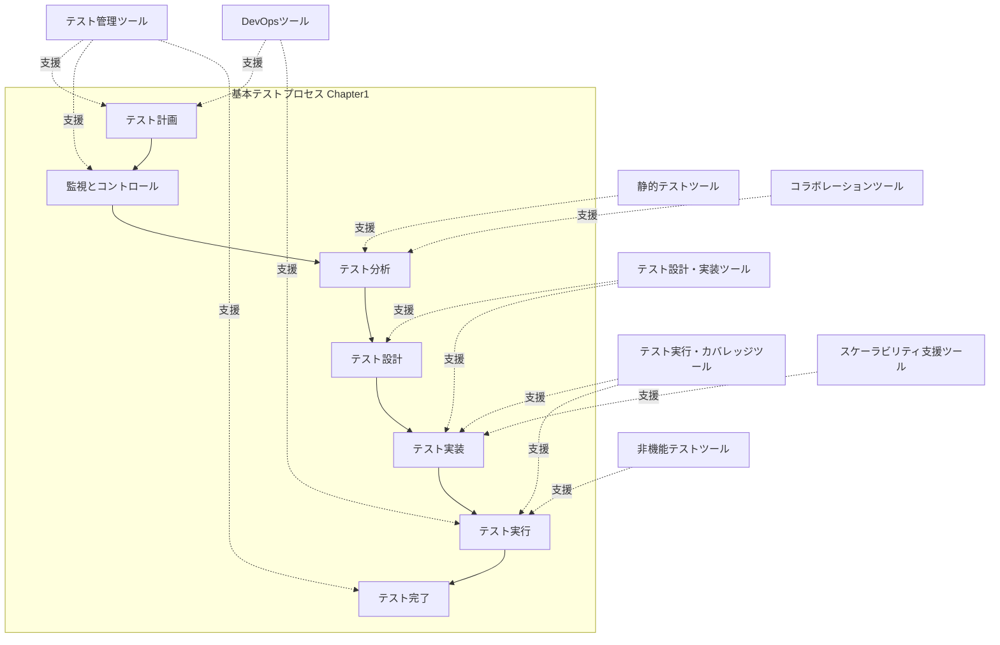
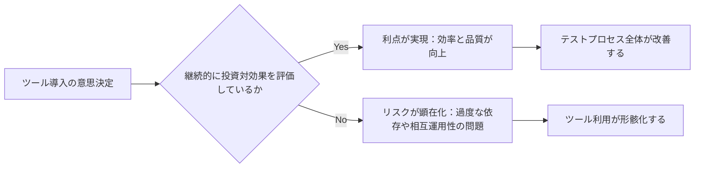
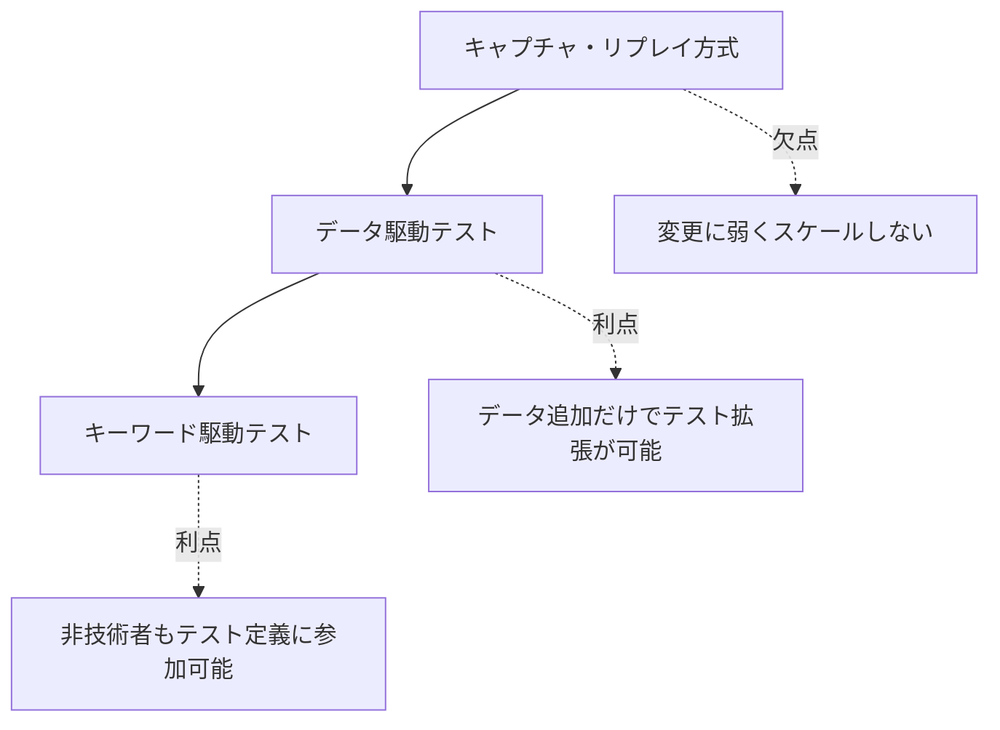
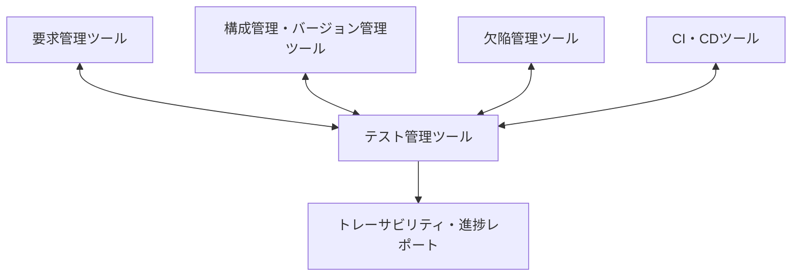

# Chapter 6: テストツール（Test Tools）— ISTQB CTFL v4.0 中級〜上級者向け学習ガイド

> 本ガイドは [ISTQB® Certified Tester Foundation Level (CTFL) v4.0.1 公式シラバス](https://istqb.org/wp-content/uploads/2024/11/ISTQB_CTFL_Syllabus_v4.0.1.pdf) の Chapter 6「Test Tools」を範囲とし、公式資料および信頼できる二次情報源（ASTQB、ISTQB Guru 等）を参照して作成しています。各節末に参照URLを明記しています。

---

## 0. この章の位置づけ

Chapter 6 は CTFL v4.0 シラバスの中で**最も短い章**です。学習時間の目安は **20分**、6章全体（1,135分）に占める割合はわずか約1.8%ですが、試験では実務的な理解を問う問題が出題されます。

| 項目 | 内容 |
|---|---|
| 学習時間目安 | 20分 |
| 節構成 | 6.1 テストツールによる支援 / 6.2 テスト自動化の利点とリスク |
| 出題数目安 | 40問中 約2〜3問（chapter配点は 出典により変動、目安として7.5%程度） |
| 学習到達レベル | K1（記憶）・K2（理解）中心。K3（適用）は無し |
| キーワード | data-driven testing（データ駆動テスト）, keyword-driven testing（キーワード駆動テスト）, scripting language（スクリプト言語） |

補足: CTFL v3.1 以前は「ツール選定の主要原則」「組織へのツール導入（パイロットプロジェクト）」「ツール導入の成功要因」といった節が存在しましたが、v4.0 では基礎知識のみに絞られ、これらの実務寄りの節は削除されています。本ガイドでは v4.0 シラバスの範囲を明確にしたうえで、実務上有用な発展知識も「シラバス範囲外の実務補足」として区別して提供します。

参照:

- [ISTQB CTFL v4.0.1 公式シラバス PDF](https://istqb.org/wp-content/uploads/2024/11/ISTQB_CTFL_Syllabus_v4.0.1.pdf)
- [ISTQB CTFL v4.0 公式ページ](https://istqb.org/certifications/certified-tester-foundation-level-ctfl-v4-0/)
- [ISTQB CTFL v4.0 Syllabus Explained: Chapter-by-Chapter（ISTQB Guru）](https://www.istqb.guru/ctfl-v4-syllabus-chapter-by-chapter-deep-dive/)
- [ISTQB CTFL v4.0 Overview（旧版との章構成比較）](https://www.testing101.net/post/overview-of-the-istqb-certified-tester-foundation-level-ctfl-v4-0-new)

---

## 1. 学習目標（Learning Objectives）

| ID | K-level | 学習目標 |
|---|---|---|
| FL-6.1.1 | K2（理解） | テストプロセスの活動やソフトウェアライフサイクルに応じて、さまざまな種類のテストツールを分類できる |
| FL-6.2.1 | K2（理解） | テスト自動化とツールサポートの潜在的な利点とリスクを要約できる |
| FL-6.2.2 | K1（記憶） | テスト実行ツール、静的解析ツール、テスト管理ツールに関する特別な考慮事項を記憶している |

参照: [ISTQB CTFL v4.0.1 公式シラバス PDF](https://istqb.org/wp-content/uploads/2024/11/ISTQB_CTFL_Syllabus_v4.0.1.pdf)

---

## 2. 6.1 テストツールによる支援（Tool Support for Testing）

### 2.1 テストツールとは何か

シラバスは「テストツール」を非常に広く定義しています。専用の商用/OSS自動化ツールだけでなく、**テスト活動を支援する任意のツール**（極端な例では、テストデータやチェックリストを管理するためのスプレッドシートでさえも、テストの文脈で使われればテストツールとみなされる）が含まれます。

これは Chapter 1 で学んだ「テストプロセス（test planning → monitoring/control → analysis → design → implementation → execution → completion）」の各活動に対して、ツールが横断的に支援を提供しうるという考え方につながります。

### 2.2 v4.0 シラバスにおけるツール分類（9カテゴリ）

v4.0 シラバスは、テストツールを以下のカテゴリに分類しています（網羅的リストではなく代表例）。

| カテゴリ | 主な役割 | 対応する主要なテスト活動 |
|---|---|---|
| ① 汎用ツール | テストの文脈で利用されるあらゆる補助ツール（例: スプレッドシート） | 全般 |
| ② テスト管理ツール | SDLC・要求・テスト・欠陥・構成管理の効率を高める | テスト計画、監視・コントロール、完了 |
| ③ 静的テストツール | レビューと静的解析を支援する | 静的テスト（Chapter 3 関連） |
| ④ テスト設計・実装ツール | テストケース、テストデータ、テスト手順の生成を支援する | テスト分析・設計・実装 |
| ⑤ テスト実行・カバレッジツール | 自動テスト実行とカバレッジ計測を支援する | テスト実装・実行 |
| ⑥ 非機能テストツール | 手動では困難・不可能な非機能テストを実施可能にする | テスト実行（非機能） |
| ⑦ DevOpsツール | デリバリーパイプライン、ワークフロー追跡、ビルド自動化、CI/CDを支援する | SDLC全体（Chapter 2 関連） |
| ⑧ コラボレーションツール | コミュニケーションを促進する | 全般（Whole Team Approach） |
| ⑨ スケーラビリティ・デプロイ標準化支援ツール | 仮想マシン、コンテナ化技術など | テスト環境構築 |

> 出典: ASTQB による公式シラバス該当箇所の掲載ページを参照し、日本語で要約・再構成しています。原文の逐語引用は行っていません。

参照:

- [ISTQB Foundation Level Syllabus - 6.1 Tool Support for Testing（ASTQB公式ミラー）](https://astqb.org/6-1-tool-support-for-testing/)
- [ISTQB CTFL v4.0.1 公式シラバス PDF](https://istqb.org/wp-content/uploads/2024/11/ISTQB_CTFL_Syllabus_v4.0.1.pdf)

### 2.3 テストプロセスとツール分類の関係図

以下は、Chapter 1 で学んだ基本テストプロセスの各活動に、Chapter 6 で扱う9つのツールカテゴリがどのように対応するかを示したフローチャートです。

### 2.4 各カテゴリの詳細と現在（2026年）の代表的ツール例

シラバスは特定の商用ツール名を挙げませんが、実務理解を深めるため、2026年時点で広く使われているツール群を例示します（試験範囲外の実務補足）。

#### ② テスト管理ツール

要求・テストケース・実行結果・欠陥の間のトレーサビリティ（1.4.4節参照）を確立し、進捗レポート（5.3.2節）の作成を支援します。要求管理ツール、構成管理ツール、欠陥管理ツールなど**他ツールとの相互運用性**が重要な選定基準になります。

代表例（2026年時点）: Jira + Xray/Zephyr、TestRail、qTest、Azure Test Plans

#### ③ 静的テストツール

レビュー支援ツール（コメント・チェックリスト管理）と静的解析ツール（コーディング規約違反や潜在的な欠陥の自動検出）に大別されます。開発者がコンポーネントテスト前・コミット前に用いることが多く、CIパイプラインに統合されることが一般的です（Chapter 3, 2.1.4節参照）。

代表例: SonarQube、ESLint、Pylint、CodeQL

#### ④ テスト設計・実装ツール

要求仕様、モデル（状態遷移図など）、コードからテストケースやテスト入力を生成する支援を行います。近年は生成AIを活用したテストケース生成支援も普及しています。

#### ⑤ テスト実行・カバレッジツール

自動テストスクリプトを用いてテスト対象を実行し、カバレッジ（Chapter 4 のステートメントカバレッジ・ブランチカバレッジ等）を計測します。この分野は技術トレンドの変化が特に速く、次の比較が参考になります。

| 項目 | Playwright | Selenium | Cypress |
|---|---|---|---|
| 開発元 | Microsoft | オープンソースコミュニティ | Cypress.io |
| 対応言語 | TypeScript/JavaScript, Python, Java, .NET | Java, Python, C#, Ruby, JavaScript 等 多数 | JavaScript/TypeScript |
| 対応ブラウザエンジン | Chromium, Firefox, WebKit を単一APIでネイティブ対応 | 最も幅広い（レガシー含む） | 主にChromium系、Firefoxも対応 |
| 並列実行 | 追加インフラなしでネイティブ対応 | Selenium Grid等が必要 | 基本はシングルスレッド、拡張は有償クラウドで強化 |
| 2026年時点の傾向 | QA実務者採用率が上昇し主流化 | 大規模エンタープライズ・多言語チームで根強い採用 | フロントエンド専業チームで安定した採用 |

> 上記は市場調査記事に基づく傾向であり、Claudeの学習データのカットオフ以降の情報を含むため、最新動向は必ず一次情報でご確認ください。

参照:

- [Selenium vs Playwright vs Cypress 2026 比較（Vervali Systems）](https://www.vervali.com/blog/web-services-testing-automation-tools-comparison-2026-selenium-vs-playwright-vs-cypress-and-beyond/)
- [Playwright vs Cypress vs Selenium 2026 比較（Tech Insider）](https://tech-insider.org/playwright-vs-cypress-vs-selenium-2026/)
- [Best Test Automation Tools in 2026（TestDino）](https://testdino.com/blog/best-test-automation-tools)
- [Selenium vs Playwright vs Cypress（Stack Overflow Blog, 2026）](https://stackoverflow.blog/2026/06/15/selenium-vs-cypress-vs-playwright-choosing-your-test-automation-framework/)

#### ⑥ 非機能テストツール

パフォーマンス（負荷・ストレス）、セキュリティ、ユーザビリティなど、手動での再現・測定が困難な非機能特性（Chapter 2, 2.2.2節の ISO/IEC 25010 品質特性参照）を検証します。

代表例: JMeter、k6、Gatling（性能）、OWASP ZAP、Burp Suite（セキュリティ）

#### ⑦ DevOpsツール

継続的インテグレーション/継続的デリバリー（CI/CD）パイプライン、ワークフロー追跡、自動ビルドを支援します（Chapter 2, 2.1.4節「DevOpsとテスト」と直結）。

代表例: Jenkins、GitHub Actions、GitLab CI/CD、CircleCI

#### ⑧ コラボレーションツール

Whole Team Approach（Chapter 1, 1.5.2節）を支える情報共有基盤です。

代表例: Slack、Microsoft Teams、Confluence

#### ⑨ スケーラビリティ・デプロイ標準化支援ツール

テスト環境の再現性・拡張性を高めます。

代表例: Docker、Kubernetes、Testcontainers（テスト用の使い捨てコンテナ環境）

参照:

- [ISTQB Foundation Level Syllabus - 6.1 Tool Support for Testing（ASTQB）](https://astqb.org/6-1-tool-support-for-testing/)
- [ISO/IEC 25010 品質特性の参照（Chapter 2関連）](https://istqb.org/wp-content/uploads/2024/11/ISTQB_CTFL_Syllabus_v4.0.1.pdf)

### 2.5 侵入的ツールと「プローブ効果」（発展知識）

一部のツール（特に性能計測ツールやカバレッジ計測ツール）は、計測のための追加命令をテスト対象に組み込むため、**測定行為そのものがテスト対象の挙動（実行タイミングやメモリ使用量）に影響を与える**ことがあります。この現象は一般に「プローブ効果（probe effect）」と呼ばれ、非侵入型（non-intrusive）の計測手法が可能であれば優先的に検討すべきとされています。

> 補足: 「プローブ効果」という用語自体は v3.1 以前のシラバスで明示的なキーワードでしたが、v4.0 では簡略化されキーワードとしては明記されていません。ただし概念としては実務上重要であるため、発展知識として記載しています。

参照:

- [Test Tool Classification（ISTQB Foundation, 一般解説）](https://istqbfoundation.wordpress.com/2017/09/18/test-tool-classification/)

---

## 3. 6.2 テスト自動化の利点とリスク（Benefits and Risks of Test Automation）

### 3.1 導入の大前提

シラバスが強調する最も重要なポイントは、**「ツールを導入するだけでは成功は保証されない」**という点です。ツールの導入・維持・トレーニングには継続的な投資が必要であり、リスクの分析と対策（mitigation）が不可欠です。

> 出典を要約: 単にツールを取得しただけでは効果は得られず、ツール導入・保守・教育に継続的な工数が必要であり、そこにはリスクも伴うため分析と緩和策が求められる。

参照:

 [ISTQB Foundation Level Syllabus - 6.2 Benefits and Risks of Test Automation（ASTQB）](https://astqb.org/6-2-benefits-and-risks-of-test-automation/)

### 3.2 テスト自動化・ツール活用の利点

| 利点 | 説明 | 具体例 |
|---|---|---|
| 反復作業の削減 | 人手による繰り返し作業を減らす | 回帰テストの再実行、同一テストデータの再入力、コーディング規約チェック |
| 一貫性・再現性の向上 | 同じ手順・頻度でテストを実行できる | 要求から導出したテストを常に同一順序で実行 |
| 客観的な評価 | 人的バイアスを排した測定が可能 | 静的コード指標、カバレッジ測定値 |
| 情報アクセスの容易化 | テスト状況に関する情報を素早く得られる | 進捗統計、欠陥発生率、性能グラフ |

### 3.3 テスト自動化・ツール活用のリスク

| リスク | 説明 |
|---|---|
| 非現実的な期待 | ツールが「すべての欠陥を防いでくれる」といった過大な期待を持ってしまう |
| 導入コスト・工数の過小評価 | 初期導入にかかる時間・費用・労力を見誤る |
| 継続的便益達成コストの過小評価 | プロセス変更や継続的改善を伴わなければ、真の便益は得られない |
| テスト資産保守コストの過小評価 | 自動化によって生成されたテストスクリプト・データの保守負荷を軽視しがち |
| ツールへの過度な依存 | テスト設計そのものを軽視し、手動テストが適切な場面でも自動化に固執する |
| バージョン管理の軽視 | テスト資産（スクリプト・データ）の構成管理（Chapter 5, 5.4節）を怠る |
| 他ツールとの相互運用性の欠如 | 要求管理・構成管理・欠陥管理ツール等、複数ベンダーのツール間連携の問題 |
| ベンダー/プロジェクトリスク | ツールベンダーの廃業・ツール廃止・買収、OSSプロジェクトの停止によるサポート断絶 |
| ベンダーサポートの質 | サポート・アップグレード・不具合修正への対応が不十分な場合がある |

### 3.4 利点とリスクの構造的理解

参照:

- [ISTQB Foundation Level Syllabus - 6.2 Benefits and Risks of Test Automation（ASTQB）](https://astqb.org/6-2-benefits-and-risks-of-test-automation/)
- [Potential Benefits and Risks of Tool Support for Testing（一般解説）](https://istqbfoundation.wordpress.com/2017/09/18/potential-benefits-and-risks-of-tool-support-for-testing-for-all-tools/)

---

## 4. FL-6.2.2: 特定ツール種別に関する特別な考慮事項

v4.0 のキーワードである **data-driven testing（データ駆動テスト）**、**keyword-driven testing（キーワード駆動テスト）**、**scripting language（スクリプト言語）** は、主にテスト実行ツールの文脈で登場します。

### 4.1 テスト実行ツール: スクリプティング手法の進化

テスト実行の自動化アプローチは、成熟度に応じて次のように整理できます。

- **データ駆動テスト（data-driven testing）**: 汎用の制御スクリプトが、表形式のデータ（入力値・期待結果）を読み込みながら同じ操作を繰り返す手法。スクリプト作成という技術的に難しい作業は一度で済み、以降はテストデータの追加だけでテストケースを拡張できる。
- **キーワード駆動テスト（keyword-driven testing）**: データ駆動テストをさらに発展させ、データファイルに「アクションワード（操作を表すキーワード）」を含める手法。スクリプト言語に不慣れなテスト担当者でも、キーワードを組み合わせることでテストを定義できる。
- **スクリプト言語（scripting language）**: 実行可能なテストスクリプトを記述するためのプログラミング言語。どの手法を採用しても、スクリプト自体の実装には専門知識（テスト担当者自身、または自動化専門の開発者）が必要になる。

いずれの手法でも、実際の結果と期待結果の比較（動的な比較、またはテスト実行後のバッチ比較）が必要になる点は共通しています。

参照:

- [Special Considerations for Some Types of Tools（一般解説, データ駆動/キーワード駆動）](https://istqbfoundation.wordpress.com/2017/09/18/special-considerations-for-some-types-of-tools/)
- [keyword-driven testing — ISTQB公式用語集](https://glossary.istqb.org/en_US/term/keyword-driven-testing)
- [Test Tools - Chapter VI of ISTQB（データ駆動/キーワード駆動の実務解説）](https://medium.com/@mehmetbarannakipoglu/test-tools-chapter-vi-of-istqb-ctfl-5b0a93a79b93)

### 4.2 静的解析ツールに関する考慮事項

静的解析ツールは、コード実行を伴わずに欠陥候補を検出できるため、**コンポーネントテストより前、あるいは開発者自身がコミット前に実行する**ことで最大の効果を発揮します（Chapter 3, 3.1.2節「静的テストの価値」を参照）。アーキテクトが設計標準への準拠を確認する目的で使うこともあります。CIパイプラインに組み込むことで、シフトレフト（Chapter 2, 2.1.5節）を実践する代表的な手段となります。

### 4.3 テスト管理ツールに関する考慮事項

テスト管理ツールは単体で機能するのではなく、**要求管理ツール、構成管理（バージョン管理）ツール、欠陥管理ツール、CI/CDツールなど多数のツールと連携する**ことで真価を発揮します。組織にとって有用なレポート（Chapter 5, 5.3.2節）を生成するには、これらのツール間でデータが一貫して流通する必要があります。

参照:

- [ISTQB Foundation Level Syllabus - 6.2 Benefits and Risks of Test Automation（ASTQB）](https://astqb.org/6-2-benefits-and-risks-of-test-automation/)
- [ISTQB CTFL v4.0.1 公式シラバス PDF（Chapter 5, 3 関連節）](https://istqb.org/wp-content/uploads/2024/11/ISTQB_CTFL_Syllabus_v4.0.1.pdf)

---

## 5. シラバス範囲外の実務補足: ツール導入の意思決定プロセス

> **注意**: 以下は v4.0 シラバスの examinable content には含まれません（v3.1 以前には「6.2.1 主要なツール選定の原則」「6.2.2 組織へのツール導入（パイロットプロジェクト）」「6.2.3 ツール成功要因」という節が存在しましたが、v4.0 では削除されています）。試験対策としては不要ですが、実務でツール導入を検討する際の一般的な流れとして紹介します。

```mermaid
flowchart TD
    A["組織の成熟度・強み弱みを評価"] --> B["ツール導入の目的・要件を明確化"]
    B --> C["候補ツールを機能・サポート・コストで評価"]
    C --> D["パイロットプロジェクトで試行"]
    D --> E{"パイロットの結果は目的に合致するか"}
    E -->|"Yes"| F["ガイドラインを策定し段階的に組織展開"]
    E -->|"No"| G["要件を見直すか別ツールを再評価"]
    F --> H["継続的なトレーニングと教訓収集"]
```

参照:

- [ISTQB CTFL v4.0 Overview（旧版との章構成比較、削除内容の明記）](https://www.testing101.net/post/overview-of-the-istqb-certified-tester-foundation-level-ctfl-v4-0-new)
- [Certified Tester Foundation Level Syllabus v3.1.1（旧シラバス、参考比較用）](https://astqb.org/assets/documents/CTFL-2018-Syllabus.pdf)

---

## 6. 章のまとめ

| ポイント | 要約 |
|---|---|
| ツールの範囲 | 専用自動化ツールに限らず、テスト活動を支援するあらゆるツールを含む広い概念 |
| 分類軸 | テストプロセスの活動（Chapter 1）に対応させて分類するのがシラバスの立場 |
| 9カテゴリ | 汎用／テスト管理／静的テスト／設計・実装／実行・カバレッジ／非機能／DevOps／コラボレーション／スケーラビリティ支援 |
| 導入の大原則 | ツール取得だけでは成功は保証されない。継続的な投資（保守・教育・プロセス改善）が前提 |
| 利点 | 反復作業削減、一貫性・再現性向上、客観的評価、情報アクセスの容易化 |
| 主要リスク | 過大な期待、コスト過小評価、過度な依存、相互運用性・ベンダーリスク |
| テスト実行ツールの発展 | キャプチャ・リプレイ → データ駆動 → キーワード駆動という成熟度の流れ |
| 静的解析ツール | コンポーネントテスト以前・コミット前に使うことで最大効果。シフトレフトを支える |
| テスト管理ツール | 単体では機能せず、要求管理・構成管理・欠陥管理・CI/CDとの連携が鍵 |

---

## 7. 演習問題（自己チェック用）

**Q1（K1）**: 次のうち、v4.0 シラバスのキーワードとして明記されているものはどれか。
A. probe effect　B. data-driven testing　C. pilot project　D. test comparator

解答
B. data-driven testing（キーワード駆動テストと共に v4.0 のキーワードとして明記されている）

**Q2（K2）**: あるチームが「テスト自動化ツールを導入すればテスト担当者の専門知識が不要になる」と考えている。これはシラバスのどの原則に反するか説明せよ。

解答例
「非現実的な期待（unrealistic expectations）」というリスクに該当する。ツールはテスト活動を支援するものであり、テストは本質的に知的活動（Chapter 1, 1.1節）であるため、専門知識の代替にはならない。

**Q3（K2）**: 静的解析ツールを開発者のコミット前に実行することの利点を、シフトレフトの観点から説明せよ。

解答例
コード実行を伴わずに早期に欠陥を検出できるため、Chapter 3 で学んだ「早期テストの原則」およびシフトレフト（Chapter 2, 2.1.5節）を実践でき、後工程での修正コストを抑制できる。

---

## 8. 参照URL一覧（全節共通）

### 公式一次情報源

- [ISTQB CTFL v4.0.1 公式シラバス PDF](https://istqb.org/wp-content/uploads/2024/11/ISTQB_CTFL_Syllabus_v4.0.1.pdf)
- [ISTQB CTFL v4.0 公式ページ](https://istqb.org/certifications/certified-tester-foundation-level-ctfl-v4-0/)
- [ISTQB CTFL v4.0 リリース発表](https://istqb.org/istqb-releases-certified-tester-foundation-level-v4-0-ctfl/)
- [ISTQB CTFL v4.0 FAQ](https://istqb.org/help/ctfl-v40/)
- [keyword-driven testing — ISTQB公式用語集](https://glossary.istqb.org/en_US/term/keyword-driven-testing)

### 公式内容のミラー・要約（ASTQB＝米国ISTQB加盟団体）

- [6.1 Tool Support for Testing（ASTQB）](https://astqb.org/6-1-tool-support-for-testing/)
- [6.2 Benefits and Risks of Test Automation（ASTQB）](https://astqb.org/6-2-benefits-and-risks-of-test-automation/)

### 学習補助・比較解説

- [ISTQB CTFL v4.0 Syllabus Explained: Chapter-by-Chapter（ISTQB Guru）](https://www.istqb.guru/ctfl-v4-syllabus-chapter-by-chapter-deep-dive/)
- [ISTQB CTFL v4.0 Overview（章構成の新旧比較）](https://www.testing101.net/post/overview-of-the-istqb-certified-tester-foundation-level-ctfl-v4-0-new)
- [Test Tools - Chapter VI of ISTQB — CTFL](https://medium.com/@mehmetbarannakipoglu/test-tools-chapter-vi-of-istqb-ctfl-5b0a93a79b93)
- [Test Tool Classification（一般解説）](https://istqbfoundation.wordpress.com/2017/09/18/test-tool-classification/)
- [Potential Benefits and Risks of Tool Support for Testing（一般解説）](https://istqbfoundation.wordpress.com/2017/09/18/potential-benefits-and-risks-of-tool-support-for-testing-for-all-tools/)
- [Special Considerations for Some Types of Tools（一般解説）](https://istqbfoundation.wordpress.com/2017/09/18/special-considerations-for-some-types-of-tools/)

### 2026年時点の実務ツール市場動向（発展知識・シラバス範囲外）

- [Selenium vs Playwright vs Cypress 2026（Vervali Systems）](https://www.vervali.com/blog/web-services-testing-automation-tools-comparison-2026-selenium-vs-playwright-vs-cypress-and-beyond/)
- [Playwright vs Cypress vs Selenium: 2026 比較（Tech Insider）](https://tech-insider.org/playwright-vs-cypress-vs-selenium-2026/)
- [Best Test Automation Tools in 2026（TestDino）](https://testdino.com/blog/best-test-automation-tools)
- [Selenium vs Cypress vs Playwright（Stack Overflow Blog, 2026）](https://stackoverflow.blog/2026/06/15/selenium-vs-cypress-vs-playwright-choosing-your-test-automation-framework/)

### 旧シラバス（比較参考用）

- [Certified Tester Foundation Level Syllabus v3.1.1（GASQ, PDF）](https://astqb.org/assets/documents/CTFL-2018-Syllabus.pdf)

---

*本ガイドは学習補助を目的とした二次資料です。試験対策の最終確認には、必ず [ISTQB® 公式シラバス](https://istqb.org/wp-content/uploads/2024/11/ISTQB_CTFL_Syllabus_v4.0.1.pdf) の原文をご確認ください。ISTQB® は International Software Testing Qualifications Board の登録商標です。*
