# ISTQB® Certified Tester Foundation Level (CTFL) v4.0 完全解説ガイド

> 中級者〜上級者向け | ステップバイステップ詳細解説版  
> 最終更新: 2026年6月（CTFL Syllabus v4.0.1 準拠）

---

## 目次

1. [CTFL v4.0 概要・試験情報](#1-ctfl-v40-概要試験情報)
2. [Chapter 1: テストの基礎 (Fundamentals of Testing)](#2-chapter-1-テストの基礎)
3. [Chapter 2: ソフトウェア開発ライフサイクル全体でのテスト](#3-chapter-2-ソフトウェア開発ライフサイクル全体でのテスト)
4. [Chapter 3: 静的テスト (Static Testing)](#4-chapter-3-静的テスト)
5. [Chapter 4: テスト分析・設計 (Test Analysis & Design)](#5-chapter-4-テスト分析設計)
6. [Chapter 5: テスト活動の管理 (Managing the Test Activities)](#6-chapter-5-テスト活動の管理)
7. [Chapter 6: テストツール (Test Tools)](#7-chapter-6-テストツール)
8. [試験対策・学習戦略](#8-試験対策学習戦略)
9. [参考文献・公式リソース](#9-参考文献公式リソース)

---

## 1. CTFL v4.0 概要・試験情報

### 1.1 認定資格の位置付け

ISTQB® Certified Tester Foundation Level (CTFL) v4.0 は、ソフトウェアテストの世界標準資格であり、すべての ISTQB® 上位認定（Foundation Level が前提条件のもの）への登竜門となる資格です。2023年4月21日にリリースされ、2024年11月にメンテナンス更新版 v4.0.1 が公開されました（試験内容の変更なし）。

> **参考**: [ISTQB® CTFL v4.0 公式ページ](<https://istqb.org/certifications/certified-tester-foundation-level-ctfl-v4-0/)>

v3.1 との最大の違いは「**完全な再設計（total redesign）**」である点です。従来の Foundation + Agile Extension を統合し、ウォーターフォール・アジャイル・DevOps・継続的デリバリーに横断的に適用できる現代的なシラバスへと刷新されました。

### 1.2 試験仕様

| 項目 | 詳細 |
|------|------|
| 問題数 | 40問（多肢選択式） |
| 合格スコア | 26点 / 40点（65%） |
| 試験時間 | 60分（非母国語受験者は+25%=75分） |
| 形式 | クローズドブック（持ち込み不可） |
| 有効期限 | **終身有効（更新不要）** |
| 前提条件 | なし |
| 受験形式 | テストセンター or オンラインプロクター |

### 1.3 章別出題配分（試験問題数）

| Chapter | タイトル | 問題数 | 学習推奨時間 |
|---------|----------|--------|------------|
| 1 | テストの基礎 | 8問 | 180分 |
| 2 | SDLCでのテスト | 6問 | 130分 |
| 3 | 静的テスト | 4問 | 100分 |
| 4 | テスト分析・設計 | **11問** | 390分 |
| 5 | テスト活動の管理 | 9問 | 335分 |
| 6 | テストツール | 2問 | 40分 |
| **合計** | | **40問** | **1,135分（約19時間）** |

> Chapter 4 が最大配点（27.5%）、Chapter 5 が第2位（22.5%）。この2つで試験の半分を占める。

### 1.4 ISTQB 認定スキームにおける位置付け

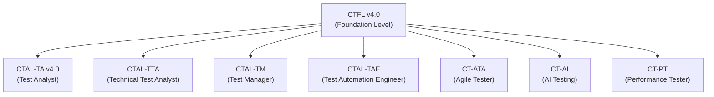

> **参考**: [ISTQB® 認定スキーム全体図](<https://istqb.org/certifications/)>

### 1.5 ビジネスアウトカム（14項目）

CTFL v4.0 では、知識の暗記ではなく、以下の実務的アウトカムの達成を目標として設計されています。

1. テストとは何か、なぜ有益かを理解する
2. ソフトウェアテストの基本概念を理解する
3. コンテキストに応じたテストアプローチとアクティビティを特定する
4. ドキュメント品質を評価・改善する
5. テストの有効性と効率性を向上させる
6. テストプロセスをSDLCに整合させる
7. テスト管理の原則を理解する
8. 明確で理解しやすい欠陥レポートを作成・伝達する
9. テストの優先度と工数に影響する要因を理解する
10. 機能横断チームの一員として働く
11. テスト自動化のリスクと利益を理解する
12. テストに必要な必須スキルを特定する
13. リスクがテストに与える影響を理解する
14. テスト進捗と品質を効果的に報告する

---

## 2. Chapter 1: テストの基礎

### 2.1 テストとは何か（What is Testing）

テストは単なる「バグ探し」ではありません。CTFL v4.0 では、テストを以下のように定義しています。

**テストの定義**: ソフトウェアの欠陥を発見し、ソフトウェア成果物の品質を評価するための一連のアクティビティ

テストは動的（dynamic）と静的（static）の2種類に分類されます。

| 種別 | 説明 | 例 |
|------|------|----|
| 動的テスト | ソフトウェアを実行してテスト | 機能テスト、結合テスト |
| 静的テスト | ソフトウェアを実行せずにテスト | コードレビュー、要件レビュー |

また、テストは **検証（Verification）** と **妥当性確認（Validation）** の両方を含みます。

| 概念 | 問い | 内容 |
|------|------|------|
| 検証（Verification） | 「正しく作っているか？」 | 仕様通りに実装されているか確認 |
| 妥当性確認（Validation） | 「正しいものを作っているか？」 | ユーザーのニーズを満たしているか確認 |

**テストの目的（試験頻出）:**

- 欠陥を発見し、障害リスクを低減する
- 要件・仕様・設計への適合を確認する
- テスト対象の品質レベルに関する情報を提供する
- 法規制・標準への準拠を検証する
- 意思決定のための情報をステークホルダーに提供する

> **重要**: テストと**デバッグ**は別の活動。テストは障害を引き起こし、デバッグはその原因（欠陥）を特定・除去する。

### 2.2 テストが必要な理由（Why is Testing Necessary）

#### 2.2.1 エラー・欠陥・障害の連鎖

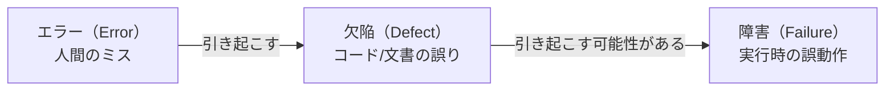

| 用語 | 定義 | 例 |
|------|------|-----|
| エラー（Error） | 人間が犯すミス | 開発者が計算式を誤って記述 |
| 欠陥（Defect / Bug） | 成果物に含まれる誤り | コードの論理バグ、仕様書の矛盾 |
| 障害（Failure） | システムが期待と異なる動作をする | アプリがクラッシュ、誤った出力 |
| 根本原因（Root Cause） | 欠陥を引き起こした最初の原因 | 要件の曖昧さ、設計の誤り |

#### 2.2.2 テストと品質保証（QA）の違い

| 観点 | テスト（QC） | 品質保証（QA） |
|------|------------|--------------|
| 目的 | 欠陥を検出する（是正措置） | プロセスを改善する（予防措置） |
| 対象 | 成果物（Product） | プロセス（Process） |
| 関係 | QC の一部 | 組織レベルの活動 |

### 2.3 テストの7原則（Seven Testing Principles）

これは試験で確実に問われる最重要項目です。


| # | 原則名 | 詳細説明 | 試験のポイント |
|---|--------|----------|--------------|
| 1 | **欠陥の存在を示す** | テストは欠陥があることを示せるが、欠陥がないことは証明できない | 「欠陥がないことの証明」は不可能 |
| 2 | **網羅的テストは不可能** | すべての入力・条件の組み合わせをテストするのは現実不可能 | リスクベース・優先度付けで対応 |
| 3 | **早期テスト（シフトレフト）** | テストは早期に開始すべき。後工程の欠陥修正は指数的にコスト増大 | 仕様段階からのレビューを推奨 |
| 4 | **欠陥クラスタリング** | 欠陥は少数のモジュールに集中する傾向（80:20 則） | リスク高いモジュールを重点テスト |
| 5 | **殺虫剤のパラドックス** | 同じテストを繰り返すと新たな欠陥を見つけられなくなる | テストケースを定期的に見直す |
| 6 | **コンテキスト依存** | テスト手法は開発方法論・ドメイン・リスクによって変わる | 汎用的な「最良のテスト」は存在しない |
| 7 | **欠陥ゼロの誤謬（Absence-of-defects fallacy）** | 欠陥が見つからなくてもユーザーのニーズを満たすとは限らない | 品質≠欠陥ゼロ、妥当性確認が重要 |

> **参考**: [ISTQB® CTFL Syllabus v4.0.1 PDF](<https://istqb.org/wp-content/uploads/2024/11/ISTQB_CTFL_Syllabus_v4.0.1.pdf)>

### 2.4 テストアクティビティ・テストウェア・テストの役割

#### 2.4.1 テストプロセスの7アクティビティ

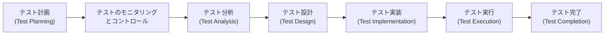

| アクティビティ | 主要タスク | 成果物（Testware） |
|--------------|----------|------------------|
| テスト計画 | スコープ定義、リスク評価、アプローチ決定 | テスト計画書 |
| テスト分析 | テストベース分析、テスト条件特定 | テスト条件、欠陥レポート（テストベース） |
| テスト設計 | テストケース設計、カバレッジアイテム特定 | テストケース、テストチャーター |
| テスト実装 | テスト手順作成、テストデータ準備 | テスト手順、自動化スクリプト、テストスイート |
| テスト実行 | テスト実施、結果記録、欠陥報告 | テスト結果、欠陥レポート |
| テスト完了 | 完了レポート作成、教訓の文書化 | テスト完了レポート、改善アクションリスト |

#### 2.4.2 テストにおける役割

| 役割 | 主な責務 |
|------|---------|
| **テストマネージャー** | 計画・モニタリング・コントロール・完了の責任 |
| **テスター** | 分析・設計・実装・実行の責任 |

### 2.5 テストの必須スキルと好事例

#### スキルカテゴリ

- **テスト知識**: テスト技法・ツール・欠陥管理の理解
- **ドメイン知識**: テスト対象のビジネス領域の理解
- **汎用スキル**: コミュニケーション能力、分析的思考、注意力
- **協調スキル**: チームワーク、ステークホルダーとの協働

#### テスト独立性のレベル

| レベル | 説明 | メリット | デメリット |
|--------|------|---------|-----------|
| 低（L0） | 作成者自身がテスト | 迅速 | 思い込みによる見逃し多 |
| 中（L1-L2） | チーム内の別メンバー | バランス良い | 組織的プレッシャーあり |
| 高（L3） | 独立したテストチーム | バイアスが少ない | コスト高・コミュニケーション課題 |
| 最高（L4） | 外部のテスト組織 | 最も客観的 | 知識習得コスト・連携コスト大 |

#### ホールチームアプローチ（Whole Team Approach）

v4.0 の重要概念。テストは専任テスターだけでなく、チーム全員（開発者・PO・UXデザイナーなど）が品質に責任を持つという考え方。

---

## 3. Chapter 2: ソフトウェア開発ライフサイクル全体でのテスト

### 3.1 SDLCとテストの関係

#### 3.1.1 SDLCモデルの分類

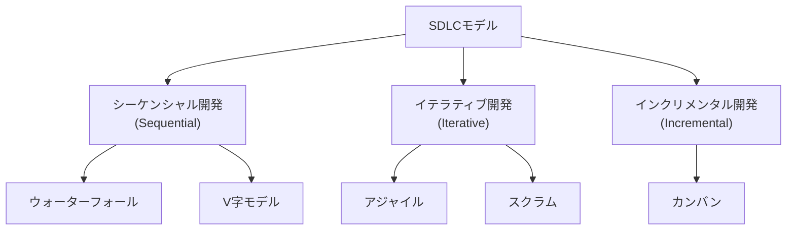

| モデル | テストの特徴 | 適用場面 |
|--------|------------|---------|
| **ウォーターフォール** | 開発後に集中してテスト | 要件が安定したプロジェクト |
| **V字モデル** | 各開発フェーズに対応するテストレベルが存在 | 組み込みシステム・安全性重視 |
| **アジャイル** | イテレーションごとにテストを繰り返す | 変化が多いプロジェクト |
| **DevOps** | CI/CDパイプラインに組み込んだ継続的テスト | 高頻度リリース環境 |

#### 3.1.2 SDLCモデルに共通するテストの好事例

- すべての開発アクティビティに対応するテストアクティビティが存在する
- 各テストレベルには明確で固有のテスト目的がある
- テストの分析・設計はできるだけ早期に開始する
- テスターはドキュメントレビューに参加する

#### 3.1.3 シフトレフト（Shift Left）の実践


シフトレフトの具体的な実践例:

- テスターの視点から仕様書をレビューする
- コンポーネントテストレベルから非機能テストを開始する
- CI/CDパイプラインに自動テストを組み込む
- テストファーストアプローチ（TDD・ATDD）の採用

#### 3.1.4 DevOpsがテストに与える影響

DevOpsの特徴とテストへの影響（試験頻出）:

| DevOpsの特徴 | テストへの影響 |
|-------------|--------------|
| 継続的インテグレーション（CI） | 自動回帰テストが必須 |
| 継続的デリバリー（CD） | テストの高速化・安定化が必要 |
| 全員がオーナーシップ | テストがチーム全員の責任になる |
| フィードバックループの短縮 | テスト結果の迅速な可視化が重要 |

> **参考**: [ISTQB® CTFL Syllabus v4.0.1 PDF](<https://istqb.org/wp-content/uploads/2024/11/ISTQB_CTFL_Syllabus_v4.0.1.pdf)>

### 3.2 テストレベルとテストタイプ

#### 3.2.1 テストレベル（5段階）

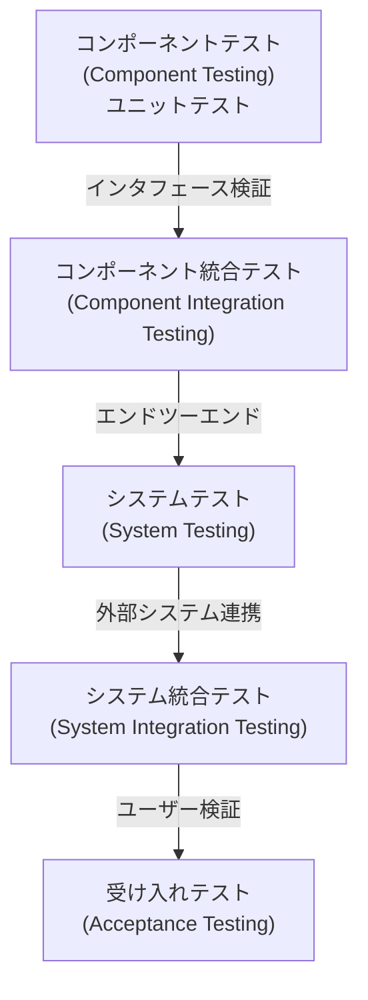

| テストレベル | 目的 | 主な担当者 | テストベース |
|------------|------|-----------|------------|
| **コンポーネントテスト** | 個別モジュールの検証 | 開発者 | コード・コンポーネント仕様 |
| **コンポーネント統合テスト** | モジュール間インタフェースの検証 | 開発者 | アーキテクチャ設計 |
| **システムテスト** | システム全体の動作検証 | テスター | システム要件・仕様 |
| **システム統合テスト** | 外部システムとの連携検証 | テスター | インタフェース仕様 |
| **受け入れテスト** | リリース可否の最終判断 | ユーザー・顧客 | ビジネス要件・ユーザーストーリー |

**受け入れテストの4種類（試験頻出）:**

| 種別 | 説明 |
|------|------|
| **UAT（ユーザー受け入れテスト）** | 実ユーザーによる実業務での検証 |
| **OAT（運用受け入れテスト）** | 運用チームによるインフラ・運用観点での検証 |
| **契約・規制テスト** | 契約条件・法規制への準拠確認 |
| **アルファ・ベータテスト** | 実ユーザー環境での早期検証（α=開発環境、β=本番相当環境） |

#### 3.2.2 テストタイプ（Test Types）

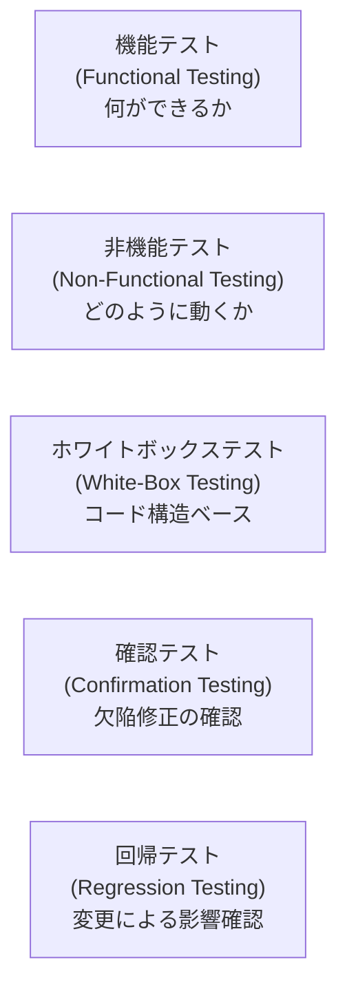

**非機能テストの主要特性（ISO/IEC 25010 品質特性）:**

| 特性 | 説明 |
|------|------|
| パフォーマンス効率 | 応答時間・スループット・リソース使用量 |
| 使用性（Usability） | 使いやすさ・学習しやすさ |
| 信頼性（Reliability） | 障害発生頻度・回復性 |
| セキュリティ | 不正アクセス耐性・データ保護 |
| 保守性（Maintainability） | 変更容易性・テスト容易性 |
| 移植性（Portability） | 環境間の移行容易性 |

### 3.3 メンテナンステスト（Maintenance Testing）

既存システムへの変更・移行・廃止に伴うテストです。

トリガー:

- 機能追加・修正・削除
- プラットフォームやインフラの変更
- データ移行

**影響分析（Impact Analysis）**: どのテストを実行すべきかを判断するための変更影響の分析。メンテナンステストの規模を決定する。

---

## 4. Chapter 3: 静的テスト

### 4.1 静的テストの基礎

静的テストとは、ソフトウェアを**実行せずに**欠陥を検出する手法です。

#### 4.1.1 静的テストが検出できる欠陥の種類

動的テストでは発見しにくいが、静的テストで発見できる欠陥の例:

| 欠陥の種類 | 具体例 |
|-----------|-------|
| 要件の欠陥 | 矛盾・曖昧・不完全な要件 |
| 設計の欠陥 | セキュリティ上の脆弱性、アーキテクチャの問題 |
| コードの欠陥 | デッドコード、到達不能コード、無限ループ |
| コーディング基準違反 | 命名規則違反、不適切なインデント |
| 仕様との不一致 | インタフェース仕様の誤り |

#### 4.1.2 静的テストが適用できる成果物（Testware）

- 仕様書・要件定義書
- エピック・ユーザーストーリー・受け入れ基準
- アーキテクチャ・設計ドキュメント
- ソースコード
- テスト計画・テストケース
- ユーザーマニュアル

> **参考**: [ISTQB® CTFL Static Testing Chapter Overview](<https://knowledgemap.pm/certifications/ctfl/static-testing/)>

### 4.2 フィードバックとレビュープロセス

#### 4.2.1 レビュープロセスの流れ

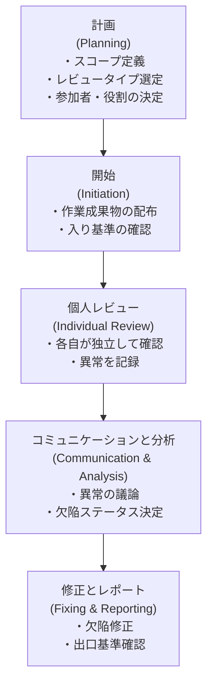

#### 4.2.2 レビューの役割

| 役割 | 責務 |
|------|------|
| **著者（Author）** | 作業成果物の作成者。説明と修正を担当 |
| **モデレーター（Moderator）** | レビューの進行・調整。フォーマルレビューでは必須 |
| **レビュアー（Reviewer）** | 独立した視点で成果物を確認 |
| **レコーダー（Recorder / Scribe）** | 議論・欠陥・決定事項を記録 |
| **マネージャー（Manager）** | レビューの実施を承認・計画 |

#### 4.2.3 レビュータイプの比較（試験最頻出）

| レビュータイプ | 形式度 | 主目的 | リーダー | ドキュメント |
|-------------|-------|--------|---------|------------|
| **インフォーマルレビュー** | 最低 | 欠陥検出（非公式） | - | 不要 |
| **ウォークスルー** | 低〜中 | 理解・フィードバック収集 | **著者** | 軽度 |
| **テクニカルレビュー** | 中 | 合意形成・技術的欠陥検出 | 訓練されたモデレーター | 要 |
| **インスペクション** | **最高** | 欠陥検出・プロセス改善 | 訓練されたモデレーター | **必須（メトリクス含む）** |

**インスペクションの定義特性（試験頻出ポイント）:**

- 事前準備（入り基準の確認）が必須
- 専任モデレーターによる進行
- メトリクスの収集と報告
- 出口基準の確認
- フォーマルなフォローアップ

#### 4.2.4 レビュー技法

| 技法 | 説明 |
|------|------|
| アドホックレビュー | 事前準備なし、直感・経験に基づくレビュー |
| チェックリストベースレビュー | 事前定義したチェックリストに従って確認 |
| シナリオベースレビュー | 想定シナリオ・ユースケースに基づいてレビュー |
| パースペクティブベースレビュー | 特定ステークホルダー（開発者・ユーザー等）の視点からレビュー |
| ロールベースレビュー | 特定の役割（セキュリティ専門家等）の観点でレビュー |

> **参考**: [ISTQB® 静的テスト解説 (Medium)](<https://medium.com/@mehmetbarannakipoglu/static-testing-chapter-iii-of-istqb-ctfl-472e053e142c)>

---

## 5. Chapter 4: テスト分析・設計

> Chapter 4 は試験の27.5%（11問）を占める最重要章です。

### 5.1 テスト技法の概要

テスト技法の目的は、テスト条件・テストケース・テストデータを体系的に導出することです。

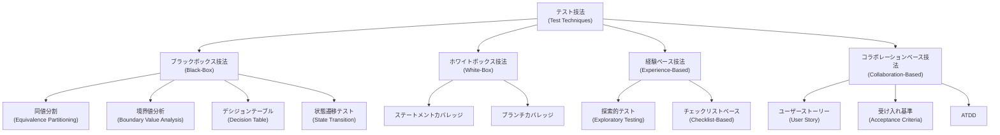

| 技法カテゴリ | テストベース | 特徴 |
|------------|-----------|------|
| **ブラックボックス** | 仕様・要件・ユーザーストーリー | 内部構造を知らずに入出力のみで設計 |
| **ホワイトボックス** | ソースコード・内部構造 | コードのカバレッジを基準に設計 |
| **経験ベース** | テスターの知識・経験・直感 | 仕様や構造に依存しない |
| **コラボレーションベース** | ユーザーストーリー・受け入れ基準 | チーム全員が協力して設計 |

### 5.2 ブラックボックステスト技法

#### 5.2.1 同値分割（Equivalence Partitioning: EP）

入力値を「同じ動作をする」グループ（同値クラス）に分割し、各グループから1つの代表値をテストする技法。

**有効同値クラス（Valid EP）**: システムが受け入れるべき値のグループ  
**無効同値クラス（Invalid EP）**: システムが拒否すべき値のグループ

**例: 年齢入力フィールド（18〜65歳が有効）**

| 同値クラス | 範囲 | 種別 | 代表値 |
|-----------|------|------|--------|
| EP1 | 18未満 | 無効 | 0, 17 |
| EP2 | 18〜65 | **有効** | 30 |
| EP3 | 65超 | 無効 | 66, 100 |

**カバレッジ計算**: テスト済み同値クラス数 ÷ 全同値クラス数 × 100%

#### 5.2.2 境界値分析（Boundary Value Analysis: BVA）

境界付近の値に欠陥が集中することを活用した技法。


| BVAの種類 | テストする値 | 例（18〜65） |
|----------|-----------|------------|
| **2値BVA（2-value BVA）** | 境界値と隣接値（境界の外側） | 17, 18, 65, 66 |
| **3値BVA（3-value BVA）** | 境界値・外側値・内側値 | 17, 18, 19, 64, 65, 66 |

> **試験ポイント**: 2値BVAは境界値とその最近傍の隣接値（outside）。3値BVAはさらに内側の隣接値（inside）も含む。

#### 5.2.3 デシジョンテーブルテスト（Decision Table Testing）

複数の条件の組み合わせによるシステム動作を体系的に網羅する技法。

**例: ローン審査（収入・信用スコアの組み合わせ）**

| | ルール1 | ルール2 | ルール3 | ルール4 |
|---|--------|--------|--------|--------|
| **条件** | | | | |
| 収入 ≥ 500万円 | ✓ | ✓ | ✗ | ✗ |
| 信用スコア ≥ 700 | ✓ | ✗ | ✓ | ✗ |
| **アクション** | | | | |
| ローン承認 | ✓ | ✗ | ✗ | ✗ |
| 再審査 | ✗ | ✓ | ✓ | ✗ |
| 否決 | ✗ | ✗ | ✗ | ✓ |

- n個の条件 → 最大 2^n のルールが存在
- 同一アクションのルールを統合して最小化可能

#### 5.2.4 状態遷移テスト（State Transition Testing）

システムの状態変化をモデル化してテストケースを設計する技法。

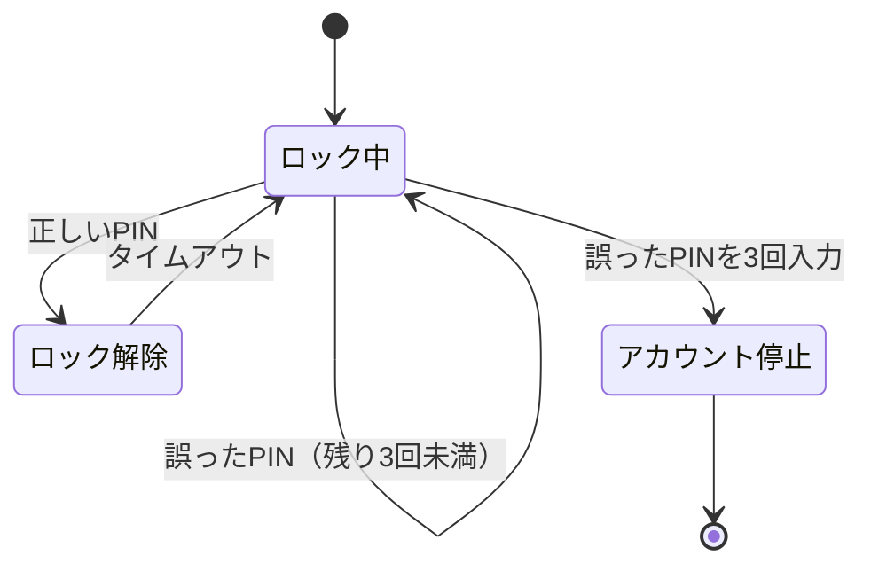

| カバレッジ基準 | 内容 |
|-------------|------|
| すべての状態をカバー | 全状態を少なくとも1回通過 |
| すべての遷移をカバー（0スイッチ） | 全遷移を少なくとも1回通過 |
| すべての遷移シーケンスをカバー（n スイッチ） | 長さnの遷移パスをすべてカバー |

### 5.3 ホワイトボックステスト技法

コードの内部構造に基づいてテストケースを設計します。

#### 5.3.1 ステートメントテスト（Statement Testing）

**目的**: 実行可能なすべてのステートメント（命令文）を少なくとも1回実行すること。

```python
def check_discount(age, is_member):
    discount = 0           # Line 1
    if age > 60:           # Line 2
        discount = 10      # Line 3
    if is_member:          # Line 4
        discount += 5      # Line 5
    return discount        # Line 6
```

100% ステートメントカバレッジを達成するには、Line 3 と Line 5 の両方を実行する必要がある。

**カバレッジ計算**: 実行済みステートメント数 ÷ 全実行可能ステートメント数 × 100%

#### 5.3.2 ブランチテスト（Branch Testing）

**目的**: 判定文（if/else等）のすべての分岐（True/False の両方）を実行すること。

| 条件 | 必要なテスト |
|------|------------|
| `age > 60` | True（61以上）と False（60以下）の両方 |
| `is_member` | True と False の両方 |

**重要な関係**: 100% ブランチカバレッジ ⊃ 100% ステートメントカバレッジ（ブランチが達成できればステートメントも達成される）

> **試験ポイント**: 逆は成立しない。ステートメントカバレッジ100%でもブランチカバレッジ100%になるとは限らない。

### 5.4 経験ベーステスト技法

#### 5.4.1 探索的テスト（Exploratory Testing）

テストの設計・実行・学習を**同時並行**で行う動的なアプローチ。

| 要素 | 説明 |
|------|------|
| **テストチャーター** | 探索的テストの目的・スコープを定義した文書 |
| **セッション** | 時間制約のあるテスト実施単位 |
| **デブリーフィング** | セッション後の振り返り・報告 |

テストチャーターの形式例:

```
「[ターゲット] を [リソース] を使って [発見すべき情報] を探索する」
例: 「ログイン機能を正常・異常入力パターンを使って セキュリティ脆弱性を探索する」
```

**探索的テストの特徴**:

- 事前に詳細なテストケースを用意しない
- テスターの知識・経験・好奇心を最大限に活用
- 学習しながら新たなテスト方向を決める
- 形式テストでは見逃しやすい欠陥を発見できる

#### 5.4.2 チェックリストベーステスト（Checklist-Based Testing）

経験に基づいたチェックリストを用いてテストを実施する技法。

- チェックリストは高レベルの条件を含む（詳細テストケースではない）
- テスト値の選択はテスター自身の判断に依存
- 定期的な見直しが必要（殺虫剤のパラドックス対策）

### 5.5 コラボレーションベーステスト技法（v4.0 新追加）

#### 5.5.1 ユーザーストーリーの共同作成

**INVEST 原則** でユーザーストーリーを評価:

| 文字 | 意味 |
|------|------|
| **I**ndependent | 他のストーリーから独立している |
| **N**egotiable | 交渉可能（要件は固定しない） |
| **V**aluable | ビジネス価値がある |
| **E**stimable | 見積もり可能 |
| **S**mall | 小さい（1スプリントで完成） |
| **T**estable | テスト可能な受け入れ基準がある |

#### 5.5.2 受け入れ基準の記述形式

**Given-When-Then（GWT）形式**（シナリオ志向）:

```gherkin
Given（前提条件）: ユーザーがログイン画面にいる
When（操作）: 有効なユーザーIDとパスワードを入力し「ログイン」を押す
Then（期待結果）: ダッシュボード画面に遷移し、ユーザー名が表示される
```

**ルール志向形式**:

```
受け入れ基準: パスワードは8文字以上で、大文字・小文字・数字をそれぞれ1文字以上含む
```

#### 5.5.3 受け入れテスト駆動開発（ATDD）


ATDD では、開発者・テスター・ビジネス代表者（三者）が協力して受け入れテストを先に作成し、それを満たすように実装を進める。

> **参考**: [ISTQB® CTFL Chapter 4: Test Analysis and Design](<https://mastersoftwaretesting.com/certification-guides/istqb/ctfl/ctfl-test-analysis-design)>

---

## 6. Chapter 5: テスト活動の管理

### 6.1 テスト計画（Test Planning）

#### 6.1.1 テスト計画書の主要内容

| セクション | 内容 |
|-----------|------|
| テスト目的 | 何を達成するためにテストするか |
| スコープ | テスト対象・対象外の明確化 |
| テストアプローチ | 使用する技法・ツール・自動化方針 |
| 入り基準（Entry Criteria） | テストを開始するための条件 |
| 出口基準（Exit Criteria / DoD） | テストを完了するための条件 |
| スケジュール | マイルストーン・タスクの時系列計画 |
| リソース計画 | 人員・環境・ツールの割り当て |
| リスクと軽減策 | 識別されたリスクと対応計画 |

#### 6.1.2 テスト推定技法

| 技法 | 説明 |
|------|------|
| **メトリクスベース** | 過去のプロジェクトデータを基に推定 |
| **エキスパートベース（デルファイ法等）** | 専門家の見積もりを集約 |
| **プランニングポーカー** | アジャイルチームでの合意ベース推定 |

#### 6.1.3 テストケースの優先度付け

| 優先度基準 | 説明 |
|-----------|------|
| リスクカバレッジ | 高リスク機能を先にテスト |
| ビジネス重要度 | ビジネスに直結する機能を優先 |
| 前提依存関係 | 依存関係が少ないテストを先行 |

#### 6.1.4 テストピラミッドとテスト四象限

**テストピラミッド（テスト自動化の観点）:**

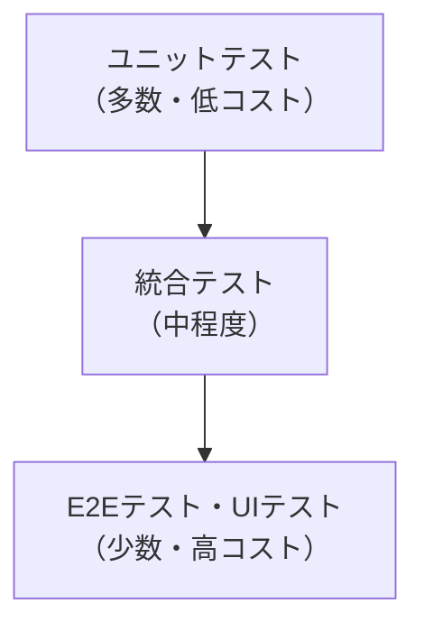

**テスト四象限（Brian Marick モデル）:**

| | ビジネスを支援する | 技術を評価する |
|---|---|---|
| **チームを支援する（開発ガイド）** | Q1: 自動単体・統合テスト | Q2: 機能テスト・ストーリーテスト |
| **製品を批評する（評価）** | Q3: 探索的テスト・UAT | Q4: パフォーマンス・セキュリティ |

### 6.2 リスク管理（Risk Management）

#### 6.2.1 リスクの種類

| リスク種別 | 定義 | 例 |
|-----------|------|-----|
| **プロジェクトリスク** | プロジェクト目標達成を脅かすリスク | スケジュール遅延、リソース不足、ベンダー問題 |
| **プロダクトリスク** | ソフトウェアの品質特性に関するリスク | セキュリティ脆弱性、パフォーマンス問題 |

#### 6.2.2 プロダクトリスク分析プロセス

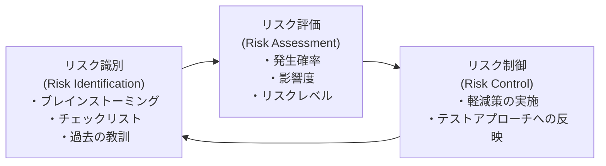

**リスクレベル = 発生確率（Likelihood）× 影響度（Impact）**

| リスクレベル | テストへの影響 |
|------------|--------------|
| 高（High） | 重点的にテスト・早期テスト・広いカバレッジ |
| 中（Medium） | 標準的なテスト |
| 低（Low） | 最小限のテストまたはスキップ |

#### 6.2.3 プロダクトリスク制御

| 制御策 | 説明 |
|-------|------|
| **テストケースの選択** | リスクの高い領域を重点テスト |
| **回帰テスト** | 変更による影響範囲を継続監視 |
| **アルファ・ベータテスト** | 実環境でのリスク軽減 |
| **パフォーマンステスト** | 性能リスクの軽減 |

### 6.3 テストモニタリング・コントロール・完了

#### 6.3.1 テストモニタリング（Test Monitoring）

テスト活動の進捗を計画と比較して追跡すること。

**主要テストメトリクス:**

| カテゴリ | メトリクス例 |
|---------|------------|
| 進捗メトリクス | テストケース実行率・消化率 |
| 欠陥メトリクス | 欠陥検出数・欠陥密度・修正率 |
| カバレッジメトリクス | 要件カバレッジ・コードカバレッジ |
| リスクメトリクス | 残存リスクレベル |
| コストメトリクス | 予算消化率・テストコスト |

#### 6.3.2 テストコントロール（Test Control）

モニタリングで発見されたギャップに対して是正措置を取ること。

| 是正措置の例 |
|------------|
| テストの再優先度付け |
| リソースの追加・再配置 |
| テストスコープの見直し（縮小または拡大） |
| テストアプローチの変更 |

#### 6.3.3 テストレポートの種類

| レポート種別 | 目的 | 対象読者 |
|------------|------|---------|
| **テスト進捗レポート** | 定期的なテスト状況の報告 | テストマネージャー・プロジェクトマネージャー |
| **テスト完了レポート** | フェーズ・プロジェクト完了時の総括 | ステークホルダー全員 |

**テスト完了レポートの主要内容:**

- テスト対象・スコープの概要
- テスト期間・実施したテスト活動
- 検出した欠陥の統計（重要度別）
- カバレッジ達成状況
- 残存リスクの評価
- 教訓（Lessons Learned）
- 次フェーズへの推奨事項

#### 6.3.4 テスト状況のコミュニケーション

| 状況 | 適切なコミュニケーション方法 |
|------|--------------------------|
| 通常の進捗 | 定期的なステータスレポート・ダッシュボード |
| 重大な遅延・リスク | 即時エスカレーション・フェイスツーフェイスミーティング |
| プロジェクト完了 | 公式テスト完了レポート |

### 6.4 構成管理（Configuration Management）

テスト活動における構成管理の役割:

- すべてのテストウェアを**一意に識別**する（バージョン管理）
- テストベースとテストウェアの**トレーサビリティ**を確保する
- テスト環境の構成を記録・管理する

> **重要**: 構成管理はテストケースの「現在のバージョン」を明確にし、何をテストしたかを確実に追跡するために必須。

### 6.5 欠陥管理（Defect Management）

#### 6.5.1 欠陥ライフサイクル

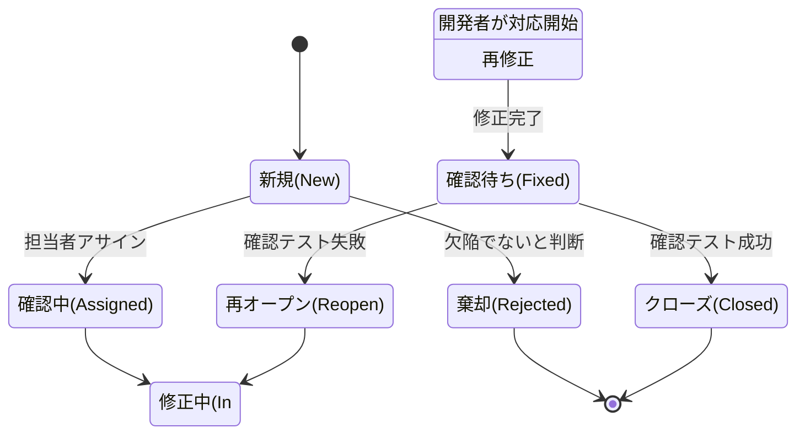

#### 6.5.2 欠陥レポートの必須項目

| フィールド | 説明 |
|-----------|------|
| 欠陥ID | 一意の識別子 |
| タイトル | 欠陥の簡潔な説明 |
| 重要度（Severity） | 技術的な影響度（Critical/Major/Minor/Trivial） |
| 優先度（Priority） | 修正の緊急度（High/Medium/Low） |
| 再現手順 | ステップバイステップの再現方法 |
| 期待結果 | 正しい動作 |
| 実際の結果 | 実際に起きたこと |
| 環境情報 | OS・ブラウザ・バージョン等 |
| テストデータ | 再現に必要なデータ |
| 添付ファイル | スクリーンショット・ログ等 |

> **重要**: 重要度（Severity）と優先度（Priority）は別概念。UIの誤字は重要度は低くても優先度が高い場合がある。
>
> **参考**: [ISTQB® Test Management Study Guide](<https://www.istqb.com/ctfl-v4-0/)>

---

## 7. Chapter 7: テストツール

### 7.1 テストサポートツールの分類

| ツールカテゴリ | 例 | 目的 |
|-------------|-----|------|
| **テスト管理ツール** | Jira, TestRail, Zephyr | テスト計画・実行・追跡 |
| **静的テストツール** | SonarQube, Checkstyle | 静的解析・コードレビュー支援 |
| **テスト設計・実装ツール** | Cucumber, FitNesse | テストケース設計・BDD |
| **テスト実行・カバレッジツール** | JUnit, pytest, JaCoCo | テスト自動実行・カバレッジ計測 |
| **非機能テストツール** | JMeter, Gatling, OWASP ZAP | パフォーマンス・セキュリティテスト |
| **DevOpsツール** | Jenkins, GitHub Actions, GitLab CI | CI/CDパイプライン |

### 7.2 テスト自動化のメリットとリスク

#### 7.2.1 テスト自動化のメリット

| メリット | 詳細 |
|---------|------|
| **時間の削減** | 手動では数時間かかるテストを数分で実行 |
| **繰り返し実行** | 回帰テストを自動化し人的ミスを排除 |
| **24時間実行** | CI/CDパイプラインで夜間も継続実行 |
| **カバレッジ向上** | より多くのテストケースを実行可能 |
| **客観的評価** | 人間の主観が入らない正確な結果 |
| **再現性** | 毎回同じ手順で確実に実行 |

#### 7.2.2 テスト自動化のリスク

| リスク | 詳細 |
|-------|------|
| **不適切な期待** | 「自動化すれば問題が解決する」という誤解 |
| **初期コストの過小評価** | ツール・スクリプト開発の投資を見誤る |
| **保守コスト** | アプリケーション変更のたびにスクリプト更新が必要 |
| **フォルスポジティブ/ネガティブ** | 誤検知・見逃しのリスク |
| **ツール依存** | 特定ツールへの過度な依存 |
| **探索的テストの代替不可** | 自動化は探索的テストを置き換えられない |

> **試験ポイント**: 自動化は手動テストの**補完**であり、置き換えではない。

### 7.3 自動化の適切な対象

| 自動化に適している | 自動化に不向き |
|-----------------|-------------|
| 繰り返し実行する回帰テスト | 一度しか実行しないテスト |
| 環境依存の少ない安定した機能 | UIが頻繁に変わる部分 |
| データ量が多いデータ駆動テスト | 探索的テスト・ユーザビリティテスト |
| パフォーマンス・負荷テスト | 人間の判断が必要な確認 |
| CI/CDパイプラインのゲートチェック | 初期開発段階の不安定な機能 |

> **参考**: [ISTQB® Testing101 CTFL Chapter 6 Overview](<https://www.testing101.net/post/overview-of-the-istqb-certified-tester-foundation-level-ctfl-v4-0-new)>

---

## 8. 試験対策・学習戦略

### 8.1 K-Level（認知レベル）別の出題傾向

CTFL v4.0 では、学習目標に K-Level（ブルーム分類学に基づく）が設定されています。

| K-Level | 要求レベル | 問題例 |
|---------|---------|--------|
| **K1: 覚える（Remember）** | 定義・用語を再現する | 「欠陥クラスタリングの定義は？」 |
| **K2: 理解する（Understand）** | 概念を自分の言葉で説明する | 「ブランチカバレッジが100%のとき、ステートメントカバレッジは？」 |
| **K3: 適用する（Apply）** | 具体的な状況に適用する | 「以下の仕様からBVAテストケースを設計せよ」 |

> K3 問題は主に Chapter 4（テスト技法）に集中している。具体的な数値・例を使った計算問題が出る。

### 8.2 章別の重点学習ポイント

| Chapter | 重点項目 | よくある試験トラップ |
|---------|---------|------------------|
| Ch.1 | 7原則の区別・エラー/欠陥/障害の連鎖 | 「テストはエラーを証明する」→誤り（欠陥の存在のみ） |
| Ch.2 | テストレベルの目的・DevOps の影響 | ウォークスルー ≠ インスペクション |
| Ch.3 | 4種類のレビューの形式度・役割 | インスペクションのリーダーは著者ではなくモデレーター |
| Ch.4 | EP・BVA のカバレッジ計算・状態遷移図の読み方 | 2値BVA vs 3値BVA の境界値の数 |
| Ch.5 | プロジェクトリスク vs プロダクトリスク・欠陥の重要度 vs 優先度 | 重要度と優先度は独立した概念 |
| Ch.6 | 自動化のメリット・リスクの両面 | 自動化は手動テストを置き換えない |

### 8.3 試験直前チェックリスト

#### よく混同される用語ペア

| 用語A | 用語B | 違い |
|------|-------|------|
| 検証（Verification） | 妥当性確認（Validation） | 仕様準拠 vs ユーザーニーズ充足 |
| テスト計画（Test Planning） | テストコントロール（Test Control） | 計画立案 vs 乖離時の是正 |
| 欠陥（Defect） | 障害（Failure） | コードの誤り vs 実行時の誤動作 |
| 重要度（Severity） | 優先度（Priority） | 技術的影響度 vs ビジネス優先度 |
| ウォークスルー | インスペクション | 著者主導・非公式 vs モデレーター主導・最公式 |
| ステートメントカバレッジ | ブランチカバレッジ | 命令網羅 vs 分岐網羅（後者が上位） |
| プロジェクトリスク | プロダクトリスク | スケジュール等 vs 品質特性 |

### 8.4 推奨学習ステップ

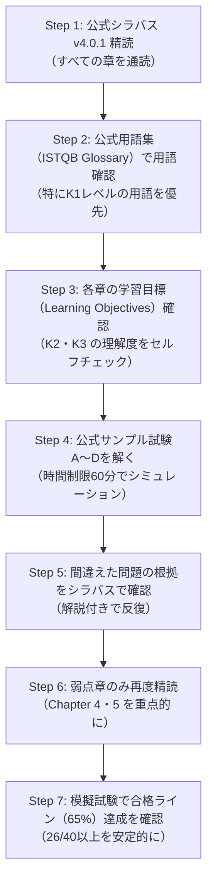

---

## 9. 参考文献・公式リソース

### 9.1 公式一次情報（ISTQB®）

| リソース | URL | 説明 |
|---------|-----|------|
| CTFL v4.0 公式ページ | <https://istqb.org/certifications/certified-tester-foundation-level-ctfl-v4-0/> | 試験情報・ダウンロード |
| シラバス v4.0.1 PDF | <https://istqb.org/wp-content/uploads/2024/11/ISTQB_CTFL_Syllabus_v4.0.1.pdf> | 公式学習教材 |
| 公式用語集 | <https://glossary.istqb.org/en_US/search> | ISTQB® グロッサリー |
| サンプル試験A（問題） | <https://istqb.org/?sdm_process_download=1&download_id=3352> | 公式サンプル問題 |
| サンプル試験A（解答） | <https://istqb.org/?sdm_process_download=1&download_id=3357> | 公式解答・解説 |
| サンプル試験B（問題） | <https://istqb.org/?sdm_process_download=1&download_id=3359> | 公式サンプル問題 |
| サンプル試験C（問題） | <https://istqb.org/?sdm_process_download=1&download_id=3369> | 公式サンプル問題 |
| サンプル試験D（問題） | <https://istqb.org/?sdm_process_download=1&download_id=3376> | 公式サンプル問題 |
| 試験構造・規則 v1.2 | <https://istqb.org/?sdm_process_download=1&download_id=3829> | 試験規則全文 |
| CTFL v4.0 リリースノート | <https://istqb.org/?sdm_process_download=1&download_id=3336> | v3.1→v4.0 変更点 |

### 9.2 補助学習リソース

| リソース | URL | 特徴 |
|---------|-----|------|
| ISTQB.com 試験ガイド（2026版） | <https://www.istqb.com/ctfl-v4-0/> | 独立系の詳細ガイド（2026年5月更新） |
| Master Software Testing - Chapter 4 | <https://mastersoftwaretesting.com/certification-guides/istqb/ctfl/ctfl-test-analysis-design> | テスト技法の詳細解説 |
| ISTQB Glossary 解説（2026版） | <https://www.istqb.guru/istqb-glossary/> | 用語解説・試験Tips |
| Testing101 CTFL Overview | <https://www.testing101.net/post/overview-of-the-istqb-certified-tester-foundation-level-ctfl-v4-0-new> | 章別出題数・学習時間ガイド |
| Mock Exam Network | <https://mockexamnetwork.com/exams/istqb-foundation/> | 無料モック試験 |
| Medium - 静的テスト解説 | <https://medium.com/@mehmetbarannakipoglu/static-testing-chapter-iii-of-istqb-ctfl-472e053e142c> | Chapter 3 解説記事 |
| Medium - テスト技法解説 | <https://medium.com/@mehmetbarannakipoglu/test-techniques-chapter-iv-of-istqb-ctfl-b0961c6013b2> | Chapter 4 解説記事 |
| ISTQB 難易度ガイド（2026版） | <https://www.istqb.guru/how-hard-is-ctfl-v4-exam/> | 試験の難易度と対策 |

### 9.3 次のステップ（上位認定）

CTFL 取得後の主要な上位認定パス:

| 認定 | 対象者 | 詳細URL |
|------|-------|---------|
| CTAL-TA v4.0（テストアナリスト） | 機能テスト・ブラックボックス専門家 | <https://www.istqb.com/ctal-ta-v4-0/> |
| CTAL-TTA（技術テストアナリスト） | ホワイトボックス・非機能テスト専門家 | <https://istqb.org/certifications/> |
| CTAL-TM（テストマネージャー） | テスト管理・マネジメント職 | <https://istqb.org/certifications/> |
| CTAL-TAE（テスト自動化エンジニア） | 自動化フレームワーク設計者 | <https://istqb.org/certifications/> |
| CT-AI（AIテスト） | AIシステムのテスト専門家 | <https://istqb.org/certifications/> |

---

> **免責事項**: 本ガイドは ISTQB® CTFL Syllabus v4.0.1（2024年9月公開）に基づき作成しています。試験仕様・ダウンロードリンクは変更される場合があります。受験前に必ず公式サイト（istqb.org）で最新情報を確認してください。

---

*作成日: 2026年6月 | 対応バージョン: ISTQB® CTFL Syllabus v4.0.1*
