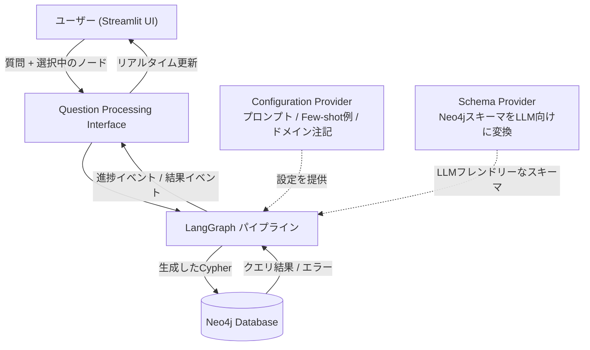
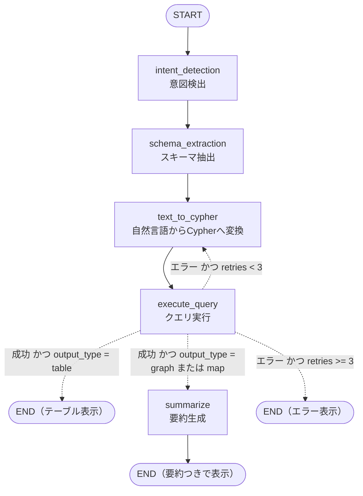
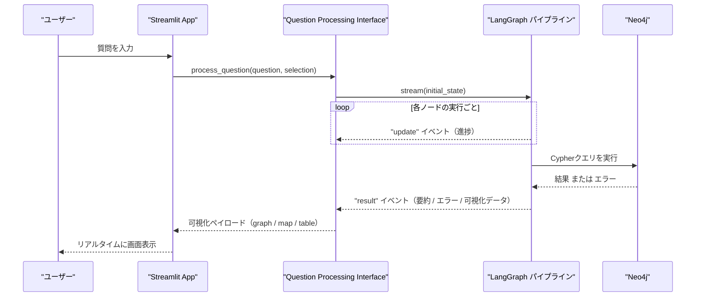

# LangGraphによるQAエージェント構築ガイド

## ナレッジグラフに自然言語で質問できるシステムを、ゼロから理解する

> 本ガイドは *Knowledge Graphs and LLMs in Action*（Alessandro Negro 他, Manning, 2025）第15章「Building a QA agent with LangGraph」の構成をベースに、2026年9月時点の公式ドキュメントおよび著名な開発者の技術記事を調査してまとめた、初学者向けの解説ガイドです。書籍本文の引用ではなく、独自の言葉で概念とコード例を再構成しています。

---

## この章で学べること

- LangGraph の基本概念（State / Node / Edge）と、なぜ「Chain」ではなく「Graph」で組むのかという設計思想
- ナレッジグラフ（Neo4j）に対して自然言語で質問できるQAエージェントを、LangGraph で実装するステップバイステップの手順
- Text-to-Cypher（自然言語からCypherクエリへの変換）における精度向上の実践的テクニック
- エラー時のリトライ・要約・終了を切り替える「条件分岐ルーティング」の組み方
- Streamlit などのフロントエンドとリアルタイムに連携する方法（イベントストリーミング）
- 2026年時点でのベストプラクティスと、今後の発展方向

---

## 0. 全体像：なぜ「LangGraphでQAエージェント」なのか

「ナレッジグラフに日本語や英語の自然文で質問すると、Cypherクエリが自動生成されて実行され、結果がグラフやテーブル、地図として返ってくる」——このようなシステムを組むには、単発のプロンプト1本では対応できません。

- ユーザーの質問の**意図**（表で見たいのか、グラフで見たいのか、地図で見たいのか）を判定する必要がある
- Neo4j のスキーマ（ノードラベルやリレーションシップの型）を **LLMが理解できる形** に変換する必要がある
- 生成された Cypher クエリが **失敗したら再試行** する必要がある
- 成功した結果を **人間が読みやすい要約** に変換する必要がある

これらは一つのプロンプトでは処理しきれない、複数ステップにまたがる「状態を持った」処理です。ここで登場するのが **LangGraph** です。LangGraph は、こうした複数ステップの処理を「共有された状態（State）」を介してやり取りする「ノード（Node）」の集まりとしてグラフ構造で表現し、条件によって次に進むノードを動的に切り替える（Edge）ためのオーケストレーション（orchestration）フレームワークです。

下図は、本ガイドで組み立てるシステムの全体構成です。



この構成には4つの登場人物がいます。

| コンポーネント | 役割 |
|---|---|
| **Streamlit（フロントエンド）** | チャット形式のUIでユーザーの質問と、グラフ上でのノード選択を受け取る |
| **Question Processing Interface** | LangGraphパイプラインの実行をイベントストリームとして外部に公開する橋渡し役 |
| **Configuration Provider** | プロンプトテンプレート、Few-shot例、ドメイン固有の注記を一元管理する |
| **Schema Provider** | Neo4jの技術的なスキーマ情報を取得し、余計な要素を除去してLLMが読みやすい形に整形する |

---

## 1. 前提知識のおさらい：LangGraphとは何か

### 1-1. Chain から Graph へ

LangChain が「Chain」（決まった順序で処理を直列につなぐ仕組み）を中心に据えていたのに対して、LangGraph はその名の通り「Graph」（グラフ構造）を中心に据えています。2024年に LangGraph が登場した背景には、「実際の業務プロセスは一直線には進まない」という現実があります。ユーザーは質問の途中で割り込んだり、確認を求めたり、話題を変えたりします。単純な直列パイプラインではこうした分岐や後戻り（サイクル）を表現できません。

筆者の見立てでは、この流れは「2024年がRAG、2025年がエージェントに注目が集まった年だとすれば、2026年は "Stateful Orchestration"（状態を持つオーケストレーション）が主題になる年」と整理できます。

### 1-2. LangGraphの3要素：State / Node / Edge

LangGraph を理解するために必要な概念はシンプルです。

| 要素 | 役割 | たとえるなら |
|---|---|---|
| **State（状態）** | グラフ全体で共有される、読み書き可能なデータ構造。すべてのノードがこれを介して情報をやり取りする | 会議で参加者全員が見ている「共有ホワイトボード」 |
| **Node（ノード）** | 1つの処理単位を表す関数。State を受け取り、更新差分を返す | ホワイトボードに情報を書き加える「担当者」 |
| **Edge（エッジ）** | ノード間の実行順序を定義する。固定の Edge と、実行結果に応じて分岐する Conditional Edge がある | 「次は誰に発言してもらうか」を決める司会進行 |

LangGraph 公式ドキュメントは、LangGraph を次のように位置づけています。LangGraph は低レベル（low-level）のオーケストレーション基盤であり、決定論的な手続き型のステップと、LLMによる自律的なステップを同じグラフの中で自由に混在させられる点が特徴です。Klarna や Uber、J.P. Morgan といった企業が採用していることも公式に紹介されています。

### 1-3. LangGraphとLangChainの違い

初学者が混同しやすいポイントとして、LangChain と LangGraph は別のライブラリであり、リリースサイクルもAPIも異なります。LangChain はプロンプトやモデル呼び出し、Retriever（検索器）などの「部品」を提供するツールキットであるのに対し、LangGraph はそれらの部品を組み合わせて「いつ・どの順で実行するか」を制御するワークフローエンジンです。実務では両方を組み合わせて使うのが一般的です。

### 1-4. 2026年時点の採用状況

2026年に入り、LLM エージェントを本番運用する動きが広がっています。LangChain が2025年11月18日〜12月2日に1,300人超のエンジニア・プロダクトマネージャー・経営層を対象に実施し、2026年6月12日に公開した調査（"State of Agent Engineering" レポート）では、回答者の57%が「本番稼働中のエージェントがある」と回答した一方（組織単位の割合でも、LangGraph 固有の採用率でもない点に注意）、デプロイの最大の障壁として「品質」を挙げた回答が32%を占めたと報告されています。つまり、動くものを作ること自体は簡単になった一方、**信頼できる形で本番運用する難しさ**が2026年の主要な論点になっているということです。本ガイドで扱うエラーハンドリングやリトライ設計は、まさにこの「品質」の壁に対応するための実践的な工夫です。

---

## 2. パイプライン全体のグラフ構造

書籍が扱う事例（警察の捜査支援システム）を一般化すると、QAエージェントのパイプラインは次の5つのノードと、実行結果に応じた条件分岐で構成されます。



実線は「必ずこの順で進む」通常の Edge、点線は「実行結果に応じて動的に切り替わる」Conditional Edge を表しています。このように、正常系だけでなく **失敗した場合にどこへ戻るか** をグラフの構造そのもので表現できることが、LangGraph を使う最大のメリットです。ロジックがコードの奥深くに隠れず、グラフを一目見れば全体の制御フローが把握できます。

---

## 3. ステップバイステップ実装

ここからは実際にコードを組み立てながら、各ステップの意味を理解していきます。

### Step 1. 環境を準備する

```bash
pip install langgraph langchain langchain-neo4j langchain-openai neo4j streamlit jinja2
```

2026年時点でLangGraphが公式に対応を明示している Python は 3.10〜3.13 で、3.11 または 3.12 の利用が推奨されています（3.9系は LangGraph 1.1 でサポートが終了しました）。

Step 4 の `SCHEMA_QUERY` が呼び出す `apoc.meta.schema()` は APOC Core のプロシージャです。オンプレミスの Neo4j では、APOC Core の jar を `plugins` ディレクトリへ導入したうえで、`neo4j.conf` の `dbms.security.procedures.allowlist`（必要に応じて `dbms.security.procedures.unrestricted`）に `apoc.meta.*` を含めて明示的に実行を許可し、再起動しておく必要があります（Neo4j Aura では APOC Core が標準で利用可能です）。

### Step 2. AgentState（共有状態）を設計する

State はパイプライン全体で共有される「記憶」です。ここに何を持たせるかが設計の要になります。

```python
from typing import TypedDict, Literal, Optional, Any

class AgentState(TypedDict, total=False):
    # 入力
    question: str
    user_selection: Optional[dict]       # グラフUI上でユーザーが選択中のノード

    # intent_detection の出力
    output_type: Literal["table", "graph", "map"]
    intent_reasoning: str

    # schema_extraction の出力
    llm_schema: str

    # text_to_cypher の出力
    cypher_query: str
    cypher_reasoning: str
    raw_llm_response: str

    # execute_query の出力
    # チェックポイントに保存されるため、出力形式によらずシリアライズ可能なレコードのリストで持つ
    results: Optional[list[dict[str, Any]]]
    summary_results: Optional[list[dict[str, Any]]]  # 要約 LLM へ渡す、機微な値を伏せた結果
    results_truncated: bool              # MAX_RESULT_ROWS を超えて切り捨てたか
    results_error: Optional[str]
    retries: int

    # summarize の出力
    summary: str
    needs_analysis: bool
```

| フィールド | 用途 |
|---|---|
| `question` / `user_selection` | ユーザー入力。`user_selection` があることで「選択中の事件」のような文脈参照が可能になる |
| `output_type` / `intent_reasoning` | 結果をテーブル・グラフ・地図のどれで見せるかの判定結果と、その理由 |
| `llm_schema` | Neo4jスキーマをLLM向けに整形した文字列（後述） |
| `cypher_query` / `cypher_reasoning` / `raw_llm_response` | 生成されたCypher、生成理由、デバッグ用の生レスポンス |
| `results` / `summary_results` / `results_truncated` / `results_error` / `retries` | 実行結果、要約用に機微な値を伏せた実行結果、上限件数での切り捨て有無、エラー内容、リトライ回数 |
| `summary` / `needs_analysis` | 最終的な要約テキストと、追加の分析が必要かどうかのフラグ |

ポイントは、**各ノードが自分の担当範囲だけを読み書きし、State全体を経由して他のノードと疎結合につながる**ことです。ノード同士が直接関数を呼び合わないため、単体テストや途中差し替えがしやすくなります。

> 2026年の実務では、State定義に Pydantic v2 を使い、実行時バリデーションとIDE補完を効かせる構成も広く採用されています。TypedDict はシンプルさ重視、Pydanticモデルは型安全性重視という使い分けが一般的です。

### Step 3. Configuration Provider — プロンプトを一元管理する

プロンプト文字列をコードの中に埋め込んでしまうと、少し文言を変えたいだけでもデプロイが必要になります。Configuration Provider は、Jinja2 のようなテンプレートエンジンを使ってプロンプト・Few-shot例・ドメイン固有の注記（「ANPRカメラとは自動車のナンバープレートを自動認識するカメラである」といった業務知識）を外部ファイルとして管理し、実行時に差し込む役割を担います。

```python
from jinja2 import Environment, FileSystemLoader

class ConfigurationProvider:
    def __init__(self, template_dir: str):
        self.env = Environment(loader=FileSystemLoader(template_dir))

    def render(self, template_name: str, **kwargs) -> str:
        template = self.env.get_template(template_name)
        return template.render(**kwargs)
```

各ノードが共有するプロンプト提供者と LLM クライアントは、モジュール読み込み時に1度だけ初期化します。Step 11 の Streamlit 側では LangGraph の実行設定を `config` という名前で扱うため、プロンプト提供者は `prompt_config` と名付けて衝突を避けます。

```python
import os

from langchain_openai import ChatOpenAI

# prompts/ 配下に intent_detection.jinja2 / text_to_cypher.jinja2 / summarize.jinja2 を置く
prompt_config = ConfigurationProvider("prompts")

# モデル名と API キーは環境変数から読み込み、コードに直接書かない（ChatOpenAI は OPENAI_API_KEY を自動で参照する）。
# Cypher 生成と意図判定は再現性を優先し、temperature=0 にする
llm = ChatOpenAI(model=os.environ["OPENAI_MODEL"], temperature=0)
```

以降のノードでは、LLM の応答を JSON で返すようテンプレート側で指示し、コード側でその形式を検証してから State に入れます。

こうしておくことで、プロンプトのチューニングとアプリケーションコードの変更を分離でき、プロンプトエンジニアリングの試行錯誤を安全に繰り返せます。

### Step 4. Schema Provider — Neo4jのスキーマをLLM向けに変換する

Text-to-Cypher の精度を左右する最大の要因は「LLMにどのようなスキーマ情報を渡すか」です。Neo4j はスキーマレスなグラフDBであるため、`apoc.meta.schema()` というAPOCプロシージャでノードラベル・リレーションシップ・プロパティをサンプリングして把握します。

```python
SCHEMA_QUERY = "CALL apoc.meta.schema() YIELD value RETURN value"

def extract_raw_schema(driver) -> dict:
    with driver.session() as session:
        record = session.run(SCHEMA_QUERY).single()
        return record["value"]

def to_llm_friendly_schema(
    raw_schema: dict,
    skip_labels: set[str],
    business_notes: dict[str, str],
) -> str:
    lines: list[str] = []
    for label, meta in raw_schema.items():
        # apoc.meta.schema() はリレーションシップ型も同じマップに返すため、ノードのエントリだけを扱う
        if meta.get("type") != "node" or label in skip_labels:
            continue
        note = business_notes.get(label, "")
        lines.append(f"- {label}: {note}")
        for prop, prop_meta in meta.get("properties", {}).items():
            lines.append(f"    - {prop} ({prop_meta.get('type')})")
        # リレーションシップの向きと接続先ラベルも渡し、LLM がパターンの向きを誤らないようにする
        for rel_type, rel_meta in meta.get("relationships", {}).items():
            # ラベルと同名の型には " (RELATIONSHIP)" が付くため、Cypher で使える型名に戻す
            rel_name = rel_type.removesuffix(" (RELATIONSHIP)")
            arrow = "->" if rel_meta.get("direction") == "out" else "<-"
            targets = ", ".join(rel_meta.get("labels", []))
            lines.append(f"    - {arrow} [:{rel_name}] {targets}")
    return "\n".join(lines)
```

ここで重要な工夫が2つあります。

1. **`skip_labels` によるフィルタリング**：内部管理用のラベルや無関係なノードをあらかじめ除外し、LLMに渡すスキーマを必要最小限にします。Neo4j社の公式エンジニアリングブログ（2026年）でも、「スキーマが大きすぎるとコンテキストを圧迫し、LLMを混乱させる可能性があるため、関連する構成要素だけを選んで渡すべきだ」と明確に述べられています。
2. **`business_notes` によるビジネス注釈の付加**：`ANPRCamera` のような技術的なラベル名だけでは意味が伝わらないため、「自動車のナンバープレートを自動認識するカメラ」のような一文を添えることで、LLMの解釈精度が上がります。

この「スキーマフィルタリング」の効果は学術研究でも裏付けられています。2026年に発表された **CyVerACT**（Cypher検証を組み込んだエージェント型ワークフロー）の研究では、スキーマフィルタリングとエラー駆動の反復修正を組み合わせることで、構文妥当性で最大52.7%、完全一致精度で13.5%の改善が報告されています。また、スキーマ情報を意味的にフィルタリングして渡す **T2CSS** という手法では、GPT-4を用いた実験でCypher生成の正解率が86%に達したという結果も報告されています。

これらを組み合わせて、グラフに登録する `schema_extraction` ノードを定義します。スキーマはグラフ全体で変わらないため、実運用ではキャッシュしておくと毎回の `apoc.meta.schema()` 呼び出しを避けられます。

```python
SKIP_LABELS = {"_Migration", "_Bloom_Perspective_"}  # 内部管理用ラベルの例
BUSINESS_NOTES = {"ANPRCamera": "自動車のナンバープレートを自動認識するカメラ"}

def schema_extraction(state: AgentState) -> dict:
    raw_schema = extract_raw_schema(driver)
    llm_schema = to_llm_friendly_schema(raw_schema, SKIP_LABELS, BUSINESS_NOTES)
    return {"llm_schema": llm_schema}
```

### Step 5. Intent Detection ノード — 質問の意図を判定する

最初のノードは、ユーザーの質問が「表で見たいのか」「グラフで見たいのか」「地図で見たいのか」を判定します。

```python
import json

OUTPUT_TYPES = ("table", "graph", "map")

def parse_json_object(text: str) -> dict:
    # intent_detection.jinja2 / text_to_cypher.jinja2 では JSON オブジェクトだけを返すよう指示する。
    # コードフェンス付きで返された場合に備え、最初の { から最後の } までを取り出して解析する
    start, end = text.find("{"), text.rfind("}")
    if start < 0 or end < start:
        raise ValueError(f"LLM の応答に JSON オブジェクトがありません: {text[:200]}")
    data = json.loads(text[start : end + 1])
    if not isinstance(data, dict):
        raise ValueError("LLM の応答が JSON オブジェクトではありません")
    return data

def parse_intent_response(text: str) -> tuple[str, str]:
    # 期待する形式: {"output_type": "table" | "graph" | "map", "reasoning": "..."}
    data = parse_json_object(text)
    output_type = data.get("output_type")
    if output_type not in OUTPUT_TYPES:
        raise ValueError(f"未知の output_type です: {output_type!r}")
    return output_type, str(data.get("reasoning", ""))

def intent_detection(state: AgentState) -> dict:
    prompt = prompt_config.render(
        "intent_detection.jinja2",
        question=state["question"],
    )
    response = llm.invoke(prompt)
    output_type, reasoning = parse_intent_response(response.content)
    return {
        "output_type": output_type,
        "intent_reasoning": reasoning,
    }
```

ここでのポイントは、**この判定結果が後続のルーティング（表なら要約をスキップして即終了、グラフ／地図なら要約ノードへ進む）を左右する**ことです。判定を最初のノードで済ませておくことで、後段のロジックがシンプルになります。

### Step 6. Text-to-Cypher ノード — 自然言語をCypherに変換する

```python
def parse_cypher_response(text: str) -> tuple[str, str]:
    # 期待する形式: {"cypher": "MATCH ...", "reasoning": "..."}（parse_json_object は Step 5 で定義）
    data = parse_json_object(text)
    query = data.get("cypher")
    if not isinstance(query, str) or not query.strip():
        raise ValueError("LLM の応答に cypher がありません")
    return query.strip(), str(data.get("reasoning", ""))

def text_to_cypher(state: AgentState) -> dict:
    prompt = prompt_config.render(
        "text_to_cypher.jinja2",
        question=state["question"],
        schema=state["llm_schema"],
        selection=state.get("user_selection"),
        previous_error=state.get("results_error"),
    )
    response = llm.invoke(prompt)
    query, reasoning = parse_cypher_response(response.content)
    return {
        "cypher_query": query,
        "cypher_reasoning": reasoning,
        "raw_llm_response": response.content,
    }
```

このノードが「選択中のノード」（`user_selection`）と「前回のエラー内容」（`previous_error`）の両方を State から読み取っている点に注目してください。これにより、ユーザーが「選択中の事件に関連する車両を教えて」のような **文脈参照を含む質問** をしても正しくCypherを組み立てられますし、リトライ時には前回の失敗理由をプロンプトに含めて再生成の精度を上げられます。

### Step 7. Query Execution ノード — 実行してエラーを捕捉する

```python
import re

from typing import Any

from neo4j import unit_of_work
from neo4j.exceptions import ClientError
from neo4j.graph import Node, Path, Relationship
from neo4j.spatial import Point
from neo4j.time import Date, DateTime, Duration, Time

# プロンプトの指示に頼らず、実行時間と返却件数をコード側で強制的に制限する
QUERY_TIMEOUT_SECONDS = 10
MAX_RESULT_ROWS = 1000

# LLM が生成した Cypher は信頼できない入力として扱い、書き込み操作を実行前に拒否する
WRITE_CLAUSE_RE = re.compile(
    # INSERT は Cypher 25 で CREATE と同義の書き込み句
    r"\b(CREATE|INSERT|MERGE|DELETE|DETACH|SET|REMOVE|DROP|FOREACH|LOAD\s+CSV)\b",
    re.IGNORECASE,
)
# プロシージャ名は `apoc`.`load` のようにバッククォートで分割して書けるため、句の検査とは別の字句解析結果で検査する。
# apoc.cypher.* は文字列リテラルとして渡した Cypher を実行するため、字句検査で空白化される文字列の中に
# 書き込みや外部アクセスを隠せる。読み取り専用の run を含め、名前空間ごと拒否する
WRITE_PROCEDURE_RE = re.compile(
    r"\bCALL\s+(dbms\s*\.|db\s*\.\s*create|apoc\s*\.\s*(create|merge|refactor|periodic|load|cypher))",
    re.IGNORECASE,
)

# Cypher を字句として先頭から走査し、文字列リテラル・コメント・バッククォート識別子を区別する。
# 交互パターンは最左一致で消費されるため、文字列内の // やコメント内の引用符を誤って境界と見なさない
CYPHER_LEXEME_RE = re.compile(
    r"'(?:[^'\\]|\\.)*'"      # 単引用符の文字列リテラル
    r'|"(?:[^"\\]|\\.)*"'     # 二重引用符の文字列リテラル
    r"|`((?:[^`]|``)*)`"      # バッククォート識別子（中身はグループ 1）
    r"|//[^\n]*"              # 行コメント
    r"|/\*.*?\*/",            # ブロックコメント
    re.DOTALL,
)

def strip_non_clause_text(cypher: str) -> str:
    # 文字列とコメントは句になり得ないので空白へ置き換える。
    # バッククォート識別子（`Create` のようなラベル名など）も句にはならないため、中身を残さず中立なプレースホルダーへ置き換える
    return CYPHER_LEXEME_RE.sub(
        lambda m: "_ident_" if m.group(1) is not None else " ",
        cypher,
    )

def unquote_identifiers(cypher: str) -> str:
    # プロシージャ名の検査用。文字列とコメントは空白へ置き換え、バッククォート識別子は中身を展開して
    # `apoc`.`load`.json のように分割された名前も apoc.load.json として検査できるようにする
    return CYPHER_LEXEME_RE.sub(
        lambda m: m.group(1).replace("``", "`") if m.group(1) is not None else " ",
        cypher,
    )

class CypherValidationError(Exception):
    pass

# LLM が Cypher を書き直せば解消し得る ClientError のコード接頭辞（構文・意味の誤りと実行タイムアウト）
REPAIRABLE_ERROR_PREFIXES = (
    "Neo.ClientError.Statement.",
    "Neo.ClientError.Transaction.TransactionTimedOut",
)

def ensure_read_only(cypher: str) -> None:
    # 未終端の文字列・コメントはどの字句にも一致せず走査対象に残るため、判定は拒否側に倒れる
    if WRITE_CLAUSE_RE.search(strip_non_clause_text(cypher)) or WRITE_PROCEDURE_RE.search(
        unquote_identifiers(cypher)
    ):
        raise CypherValidationError("書き込み操作を含む Cypher は実行できません")

def to_dto(value: Any) -> Any:
    # Record.data() はノードをプロパティの辞書に潰してラベルや ID を失うため、グラフ描画に必要な情報を明示的に残す
    if isinstance(value, Node):
        return {
            "kind": "node",
            "element_id": value.element_id,
            "labels": sorted(value.labels),
            "properties": to_dto(dict(value)),
        }
    if isinstance(value, Relationship):
        return {
            "kind": "relationship",
            "element_id": value.element_id,
            "type": value.type,
            "start": value.start_node.element_id if value.start_node is not None else None,
            "end": value.end_node.element_id if value.end_node is not None else None,
            "properties": to_dto(dict(value)),
        }
    if isinstance(value, Path):
        return {
            "kind": "path",
            "nodes": [to_dto(n) for n in value.nodes],
            "relationships": [to_dto(r) for r in value.relationships],
        }
    # neo4j の時間型・空間型はチェックポイントのシリアライザが扱えないため、ISO 8601 文字列と座標の辞書へ変換する
    if isinstance(value, (DateTime, Date, Time, Duration)):
        return value.iso_format()
    # Point は tuple のサブクラスなので、list 判定より前に処理して SRID を失わないようにする
    if isinstance(value, Point):
        return {"kind": "point", "srid": value.srid, "coordinates": list(value)}
    if isinstance(value, list):
        return [to_dto(v) for v in value]
    if isinstance(value, dict):
        return {k: to_dto(v) for k, v in value.items()}
    return value

# 要約に不要な機微プロパティ。データモデルに合わせて定義し、スキーマ変更時に見直す
SENSITIVE_KEYS = frozenset({"name", "phone", "address", "date_of_birth", "plate_number"})
REDACTED = "[REDACTED]"

def to_summary_dto(value: Any, *, trusted_origin: bool = False) -> Any:
    # 要約 LLM へ渡す値を、DTO ではなくドライバが返した実際の型から作る。
    # 列名やマップのキーは Cypher の AS やマップ射影（RETURN p.name AS suspect など）で自由に付け替えられ、
    # {kind: 'node', ...} のようなマップで DTO の形も偽装できるため、キー名によるマスキングの根拠にしない。
    # trusted_origin は「値がノード・リレーションシップの機微でないプロパティ由来である」ことが分かっている場合だけ True になる
    if isinstance(value, (Node, Relationship)):
        # ノード・リレーションシップのプロパティ名だけはスキーマ由来で付け替えられないため、SENSITIVE_KEYS で判定する
        props = {
            k: REDACTED if k in SENSITIVE_KEYS else to_summary_dto(v, trusted_origin=True)
            for k, v in dict(value).items()
        }
        if isinstance(value, Node):
            return {"kind": "node", "labels": sorted(value.labels), "properties": props}
        return {"kind": "relationship", "type": value.type, "properties": props}
    if isinstance(value, Path):
        return {
            "kind": "path",
            "nodes": [to_summary_dto(n) for n in value.nodes],
            "relationships": [to_summary_dto(r) for r in value.relationships],
        }
    # 真偽値と null は残す（bool は int のサブクラスなので数値判定より前に処理する）
    if value is None or isinstance(value, bool):
        return value
    # 数値は出所が分かる場合だけ残す。列やマップの値として返った数値は、RETURN p.phone AS n のように
    # 数値型の機微なプロパティがエイリアス経由で投影されたものか、count(*) などの集計値かを区別できないため、
    # 件数などの集計値も含めて要約ペイロードから除外する（表示用の results には残る）
    if isinstance(value, (int, float)):
        return value if trusted_origin else REDACTED
    # 文字列・時間型・空間型はエイリアス経由で機微なプロパティが投影され得るため、キー名によらず伏せる
    if isinstance(value, list):
        return [to_summary_dto(v, trusted_origin=trusted_origin) for v in value]
    if isinstance(value, dict):
        # マップのキーはマップ射影（p {n: p.phone} など）で付け替えられるため出所の根拠にせず、値は常に未信頼として扱う。
        # 元のプロパティ名を保つ射影（p {.phone}）への多層防御として SENSITIVE_KEYS でも伏せる
        return {k: REDACTED if k in SENSITIVE_KEYS else to_summary_dto(v) for k, v in value.items()}
    return REDACTED

@unit_of_work(timeout=QUERY_TIMEOUT_SECONDS)
def run_read_query(tx, cypher: str) -> tuple[list[dict], list[dict], bool]:
    # fetch は指定件数までしか取り出さないため、大規模な結果をすべてメモリへ読み込まない。
    # 上限より 1 件多く取り出し、超過の有無で「上限ちょうど」と「切り捨て」を区別する
    records = tx.run(cypher).fetch(MAX_RESULT_ROWS + 1)
    kept = records[:MAX_RESULT_ROWS]
    rows = [{key: to_dto(value) for key, value in r.items()} for r in kept]
    # 列名はエイリアスで付け替えられるため、列の値ごとに実際の型から要約用の値を作る
    summary_rows = [{key: to_summary_dto(value) for key, value in r.items()} for r in kept]
    return rows, summary_rows, len(records) > MAX_RESULT_ROWS

def execute_query(state: AgentState) -> dict:
    retries = state.get("retries", 0)
    try:
        ensure_read_only(state["cypher_query"])
        with driver.session() as session:
            # execute_read は読み取りモードのトランザクションを選ぶ（クラスタでは読み取りレプリカへ振り分ける）だけで、
            # 書き込みを防ぐ境界ではない。書き込みの最終的な防止は、下記の reader ロールのみを持つユーザーで担保する
            records, summary_records, truncated = session.execute_read(run_read_query, state["cypher_query"])
    except CypherValidationError as exc:
        # アプリ側の検証で拒否した書き込み操作は、エラー内容を渡して LLM に再生成させる
        return {"results_error": str(exc), "retries": retries + 1}
    except ClientError as exc:
        # 認証・権限（Neo.ClientError.Security.*）などは Cypher を直しても解消しないため、再生成させずに送出する
        if not (exc.code or "").startswith(REPAIRABLE_ERROR_PREFIXES):
            raise
        # Cypher 自体の誤り（構文・意味）とタイムアウトは、エラー内容を渡して LLM に再生成させる
        return {"results_error": str(exc), "retries": retries + 1}
    # ServiceUnavailable や TransientError などの一時障害は捕捉せず、Step 10 の RetryPolicy に再試行させる

    return {
        "results": records,
        "summary_results": summary_records,
        "results_truncated": truncated,
        "results_error": None,
    }
```

`driver` には、`reader` ロールのみを付与した**読み取り専用ユーザー**の認証情報を使ってください。書き込みを実際に止める境界はこの DB 側の権限です。アプリ側の検証とDB側の権限の二重防御にしておけば、プロンプトインジェクションなどで書き込みを含む Cypher が生成されても、データは改変されません。

接続経路は TLS で暗号化し、サーバー証明書の検証を必須にしてください。URI には `neo4j+s://`（TLS + 証明書検証あり）を使い、暗号化しない `neo4j://` / `bolt://` や、証明書を検証しない `neo4j+ssc://` / `bolt+ssc://` は使いません。認証情報とクエリ結果（捜査情報のような機微なデータを含む）が平文でネットワークに流れるのを防ぐためです。自己署名の社内 CA を使う場合も検証は省略せず、その CA 証明書を信頼ストアに追加します。

```python
import atexit
import os

import streamlit as st
from neo4j import GraphDatabase


# Streamlit は操作のたびにスクリプトを再実行するため、st.cache_resource で Driver をプロセス内で1つだけ保持する。
# neo4j+s:// は TLS 暗号化とサーバー証明書の検証を行う。認証情報は環境変数から読み込み、コードに直接書かない
@st.cache_resource
def get_driver():
    driver = GraphDatabase.driver(
        os.environ["NEO4J_URI"],  # 例: neo4j+s://xxxx.databases.neo4j.io
        auth=(os.environ["NEO4J_READER_USER"], os.environ["NEO4J_READER_PASSWORD"]),
    )
    # プロセス終了時に共有 Driver の接続プールを明示的に閉じる
    atexit.register(driver.close)
    return driver


driver = get_driver()
```

この共有 `driver` 構成は**単一テナント前提**です。全利用者が同じ読み取り専用ユーザーの権限でクエリを実行するため、同じデータベース内の全データを参照できる利用者だけが使う環境に限ってください。利用者や組織ごとに参照範囲が異なる（マルチテナントの）場合は、認証済みの利用者・テナント情報を `question` とは別の経路で `AgentState` と `process_question` に渡し、生成された Cypher の内容に依存しない形で Neo4j 側に認可を強制します。たとえば `driver.session(impersonated_user=...)` で利用者ごとの Neo4j ユーザーに切り替え、ロールベースの細粒度アクセス制御で参照範囲を絞ります。「テナント ID で絞り込む WHERE 句を付けて」とプロンプトで LLM に指示するだけでは、生成結果に左右されるため認可の境界になりません。

`apoc.load.*` は外部URLやファイルを読み込めるため、生成された Cypher 経由で社内の未承認URLへアクセスされる（SSRF）おそれがあります。正規表現での拒否に加えて、`dbms.security.procedures.allowlist` で許可する APOC を必要なもの（本ガイドでは `apoc.meta.*`）だけに絞り、`apoc.conf` の `apoc.import.file.enabled=false` 設定と、Neo4j サーバーからの外向き通信を許可リストやファイアウォールで制限するネットワーク制御を併用してください。

State はチェックポインタに保存されるため、`results` には出力形式によらずシリアライズ可能な**レコードのリスト**を格納します。`Record.data()` はノードをプロパティの辞書に変換する際にラベルや `element_id` を捨ててしまい、リレーションシップも始点・終点が分からなくなります。そのため `to_dto()` でノードのラベルと `element_id`、リレーションシップの型・始点・終点を明示的に保持してから State に入れます。`Result.graph()` からグラフ表示用のデータを組み立てる場合も、neo4j ドライバのオブジェクトをそのまま State に置かず、checkpoint 保存前に同じ形の辞書へ変換してください。テーブル表示用の DataFrame への変換は、Step 11 のようにグラフの外（描画直前）で行います。

`QUERY_TIMEOUT_SECONDS` を超えたクエリはサーバー側で打ち切られ、`ClientError` として LLM に再生成させる対象になります。`MAX_RESULT_ROWS` を超える行は返さないため、可視化や要約に渡すデータ量も上限内に収まります。ただし黙って切り捨てると、利用者は一部の結果を全件と誤解します。そこで上限より 1 件多く取得して超過を `results_truncated` に記録し、要約プロンプト（Step 9）と画面表示（Step 11）の両方で切り捨てを明示します。

### Step 8. 条件分岐ルーティング — リトライ・要約・終了を切り替える

```python
from typing import Literal

MAX_RETRIES = 3

def route_after_execution(state: AgentState) -> Literal["retry", "summarize", "end"]:
    if state.get("results_error"):
        # 上限未満なら再生成、上限に達したらエラーのまま終了（要約には進ませない）
        return "retry" if state.get("retries", 0) < MAX_RETRIES else "end"
    if state.get("output_type") in ("graph", "map"):
        return "summarize"
    return "end"
```

この1つの関数が、パイプライン全体の「賢さ」を決めます。

| 条件 | 遷移先 | 意味 |
|---|---|---|
| エラーあり かつ リトライ回数 < 3 | `text_to_cypher` へ戻る | エラー内容をプロンプトに含めて再生成を試みる |
| 成功 かつ `output_type` が graph／map | `summarize` へ進む | 可視化結果を人間向けの文章に要約する |
| 成功 かつ `output_type` が table | 終了 | 表はそのまま表示すれば十分なので要約をスキップ |
| エラーが解消せずリトライ上限に到達 | 終了（エラー表示） | ユーザーに再質問を促す |

### Step 9. Summarization ノード — 結果を人間向けの文章にする

```python
import os

# 承認済みエンドポイント・保持設定・テナントのデータ処理ポリシーはコードから検証できない。
# 下記の運用上の前提条件を確認した環境でだけ、明示的に "true" を設定して外部 LLM への送信を許可する
SUMMARY_LLM_TRANSFER_APPROVED = os.environ.get("SUMMARY_LLM_TRANSFER_APPROVED") == "true"

def summarize(state: AgentState) -> dict:
    if not SUMMARY_LLM_TRANSFER_APPROVED:
        # 送信条件を満たさない環境ではクエリ結果を LLM へ送らない。要約は空のまま終え、表・グラフ・地図の表示だけを行う
        return {"summary": ""}
    prompt = prompt_config.render(
        "summarize.jinja2",
        question=state["question"],
        # Step 7 の to_summary_dto で伏せた結果だけをプロンプトに含め、表示用の results は渡さない
        results=state.get("summary_results") or [],
        # True なら「上限件数までの部分結果である」ことを要約文に明記するようテンプレートで指示する
        results_truncated=state.get("results_truncated", False),
        needs_analysis=state.get("needs_analysis", False),
    )
    response = llm.invoke(prompt)
    return {"summary": response.content}
```

クエリ結果には捜査情報のような機微なデータが含まれ得るため、要約のために外部の LLM へ送る前に次の条件をすべて満たす必要があります。コードで担保するのは機微なキーのマスキングと、許可のない環境での送信拒否だけです。残りの条件はコードからは検証できないため、`SUMMARY_LLM_TRANSFER_APPROVED` を有効にする前に満たしておくべき**運用上の前提条件**として扱います。

| 条件 | 担保の方法 |
|---|---|
| 機微な項目をマスキングする | Step 7 の `to_summary_dto()` が、ノード・リレーションシップ・マップの `SENSITIVE_KEYS` の値と、エイリアスで付け替え得る列・マップの文字列／時間／空間型の値を伏せた `summary_results` だけをプロンプトに含める（コード） |
| 条件を満たさない環境では送信しない | `SUMMARY_LLM_TRANSFER_APPROVED` が `"true"` でなければ LLM を呼ばない（コード） |
| 承認済みのモデルエンドポイントだけを使う | 組織が契約・承認したエンドポイント（`base_url` を含む）以外に向けない（運用） |
| 入力データを保持・学習に使わせない | ゼロデータ保持などの保持設定を契約とアカウント設定で確認する（運用） |
| テナントのデータ処理ポリシーで送信が許可されている | データの分類と送信先の地域・事業者がポリシーに適合することを確認する（運用） |

`summary` が空の場合、Step 11 の画面は要約を表示せず、可視化結果だけを表示します。

書籍の事例では、同じ車両検出データであっても「捜査上の文脈」が追加されるだけで、要約が単なる事実列挙から「不審な時間パターンを指摘する分析」へと質が変わる様子が示されています。これは、要約プロンプトに **ドメイン知識と追加コンテキストを注入できる設計** にしておくことの価値を示す好例です。

### Step 10. グラフを組み立ててコンパイルする

すべてのノードを `StateGraph` に登録し、Edge と Conditional Edge を接続します。

```python
import streamlit as st
from langgraph.checkpoint.memory import InMemorySaver
from langgraph.graph import StateGraph, START, END
from langgraph.types import RetryPolicy
from neo4j.exceptions import ServiceUnavailable, SessionExpired, TransientError

graph = StateGraph(AgentState)

graph.add_node("intent_detection", intent_detection)
graph.add_node("schema_extraction", schema_extraction)
graph.add_node("text_to_cypher", text_to_cypher)
graph.add_node(
    "execute_query",
    execute_query,
    # 再試行は Neo4j の一時障害に限定する。認証・権限エラーや想定外のバグまで再試行すると、失敗の表面化が遅れる
    retry_policy=RetryPolicy(
        max_attempts=3,
        initial_interval=0.5,
        backoff_factor=2.0,
        retry_on=(ServiceUnavailable, SessionExpired, TransientError),
    ),
)
graph.add_node("summarize", summarize)

graph.add_edge(START, "intent_detection")
graph.add_edge("intent_detection", "schema_extraction")
graph.add_edge("schema_extraction", "text_to_cypher")
graph.add_edge("text_to_cypher", "execute_query")

graph.add_conditional_edges(
    "execute_query",
    route_after_execution,
    {
        "retry": "text_to_cypher",
        "summarize": "summarize",
        "end": END,
    },
)
graph.add_edge("summarize", END)

# Step 11 の get_state で最終状態を取得するため、チェックポインタを付けてコンパイルする。
# Streamlit は操作のたびにスクリプト全体を再実行するため、ここで毎回 InMemorySaver() を作ると
# 保存済みの checkpoint が失われ、同じ thread_id でも interrupt / 一時障害からの再開ができない。
# st.cache_resource でコンパイル済み app（とチェックポインタ）をプロセス内で1つだけ保持する。
# 複数プロセス構成や再起動をまたぐ場合は、SqliteSaver / PostgresSaver などの永続チェックポインタを使う
@st.cache_resource
def get_app():
    return graph.compile(checkpointer=InMemorySaver())

app = get_app()
```

`RetryPolicy` は LangGraph が提供する**ノード単位の自動リトライ機構**です。ここでの `execute_query` に対する `retry_policy` は、Neo4j接続の一時的な切断のような**予期しない例外**に対する保険であり、Step 8 で組んだ `route_after_execution` による**業務ロジック上の再試行**（Cypherの構文ミスなどをLLMに直してもらう）とは目的が異なります。両者を混同しないことが実務上の注意点です。LangGraph の `RetryPolicy` は既定で `max_attempts=3`、`initial_interval=0.5`秒、`backoff_factor=2.0` の指数バックオフが設定されており、`ValueError` や `TypeError` などの一部の例外を除き、ほとんどの例外を自動的にリトライ対象とします。そのため上記では `retry_on` に Neo4j の一時障害（`ServiceUnavailable` / `SessionExpired` / `TransientError`）だけを指定し、それ以外の例外は再試行せずに即座に送出させています。

| エラーの種類 | 対応方針 |
|---|---|
| 一時的な障害（ネットワーク瞬断など） | ノードに `RetryPolicy` を付ける |
| LLMが回復可能な失敗（Cypher構文ミスなど） | エラー内容をStateに載せて `text_to_cypher` へ戻す |
| ユーザー側で修正が必要な情報不足 | `interrupt()` で処理を一時停止し、ユーザーに確認を求める |
| 想定外のバグ | あえて再試行させず、そのまま例外を上げてデバッグに回す |

### Step 11. Streamlit と統合する（イベントストリーミング）

最後に、このパイプラインをフロントエンドと接続します。書籍の事例では、パイプラインの実行を「型付きのイベントストリーム」として公開する Question Processing Interface が、Streamlit の `MessageHistory` と連携して会話履歴を保持しながらリアルタイムに進捗を表示します。



Python側の実装イメージは次のとおりです。

```python
from typing import Any

from langgraph.types import Command

def process_question(
    question: str,
    selection: dict | None,
    config: dict,
    resume: Any | None = None,
    retry_from_checkpoint: bool = False,
):
    if retry_from_checkpoint:
        # 一時障害で止まったスレッドは入力に None を渡し、最後に保存された checkpoint から続きを実行する
        # （新しい入力辞書を渡すと、途中まで進んだ状態に入力が上書きされ最初からやり直しになる）
        graph_input = None
    elif resume is not None:
        # interrupt() で中断中のスレッドは Command(resume=...) で同じ config のまま再開する
        graph_input = Command(resume=resume)
    else:
        graph_input = {"question": question, "user_selection": selection, "retries": 0}
    for event in app.stream(graph_input, config, stream_mode="updates"):
        node_name, update = next(iter(event.items()))
        if node_name == "__interrupt__":
            # interrupt() で一時停止した。checkpoint は再開に必要なので残したまま呼び出し側へ返す
            yield {"type": "interrupt", "payload": update}
            return
        yield {"type": "update", "node": node_name, "payload": update}

    final_state = app.get_state(config).values
    yield {"type": "result", "payload": final_state}
```

```python
import uuid

import pandas as pd
import streamlit as st
from neo4j.exceptions import ServiceUnavailable, SessionExpired, TransientError

# RetryPolicy を使い切っても解消しなかった一時障害。checkpoint から再開できるので UI で再実行を提示する
TRANSIENT_ERRORS = (ServiceUnavailable, SessionExpired, TransientError)

def render_result(payload: dict) -> None:
    # 最終 State（results は table なら DataFrame、それ以外は to_dto() 形式のレコードのリスト）を描画する。
    # graph / map の本格的な描画は外部の可視化コンポーネントに委ねる。差し替える場合も
    # 「to_dto() 形式のレコードのリストを受け取り、node / relationship / path / point を描く」というインターフェースを守る
    if payload.get("results_error"):
        # リトライ上限に達しても解消しなかった Cypher エラー。再質問を促す
        st.error(f"クエリを生成できませんでした。質問を言い換えてください。（{payload['results_error']}）")
        return
    if payload.get("summary"):
        st.markdown(payload["summary"])
    output_type = payload.get("output_type")
    if output_type == "table":
        st.dataframe(payload["results"])
    elif output_type in ("graph", "map"):
        # 最小実装: 可視化コンポーネントを組み込むまでは、構造を確認できるよう JSON として表示する
        st.json(payload.get("results") or [])

# チェックポインタは thread_id 単位で状態を保存する。interrupt() からの再開を含め、1つの質問が
# 完了するまでは同じ thread_id を使い続ける。Streamlit は操作のたびにスクリプトを再実行するため session_state に保持する
if "thread_id" not in st.session_state:
    st.session_state.thread_id = str(uuid.uuid4())
config = {"configurable": {"thread_id": st.session_state.thread_id}}

def close_thread() -> None:
    # 完了またはキャンセルした時点でだけ checkpoint を削除し、次の質問では新しい thread_id を使う
    app.checkpointer.delete_thread(st.session_state.thread_id)
    for key in ("thread_id", "pending_interrupt", "failed_transient"):
        st.session_state.pop(key, None)

resume = None
retry_from_checkpoint = False
if st.session_state.get("failed_transient"):
    # 一時障害で中断したスレッド。checkpoint は残っているので、同じ config で入力なしの再開を選べる
    st.error("一時的な障害で処理が中断しました。途中から再実行できます。")
    if st.button("キャンセル", key="cancel_failed"):
        close_thread()
        st.rerun()
    if not st.button("再実行"):
        st.stop()
    st.session_state.pop("failed_transient")
    retry_from_checkpoint = True

pending = st.session_state.get("pending_interrupt")
if pending is not None:
    st.warning(pending[0].value)   # interrupt() に渡した確認内容
    if st.button("キャンセル", key="cancel_interrupt"):
        close_thread()
        st.rerun()
    answer = st.text_input("確認事項への回答")
    if not answer:
        st.stop()   # 回答を待つ間も checkpoint は残しておく
    st.session_state.pop("pending_interrupt")
    resume = answer

if resume is None and not retry_from_checkpoint:
    # 新しい質問は UI から受け取る。st.chat_input は送信した回の再実行でだけ値を返すため、
    # 結果表示後の再実行で同じ質問が二重に処理されない
    question = st.chat_input("質問を入力してください")
    if not question:
        st.stop()
else:
    # 再開時は checkpoint の State を使うため、新しい質問は graph_input に使われない
    question = ""
# グラフ上で選択中のノード。可視化コンポーネントが選択時に session_state へ保存する想定（未選択なら None）
selection = st.session_state.get("selection")

placeholder = st.empty()
events = process_question(
    question, selection, config, resume=resume, retry_from_checkpoint=retry_from_checkpoint
)
try:
    for event in events:
        if event["type"] == "update":
            placeholder.info(f"処理中: {event['node']}")
        elif event["type"] == "interrupt":
            # 一時停止中は checkpoint を削除せず、ユーザーの回答後に同じ config で再開する
            st.session_state.pending_interrupt = event["payload"]
            st.rerun()
        elif event["type"] == "result":
            payload = event["payload"]
            if payload.get("results_truncated"):
                # 部分結果を全件と誤解させないよう、描画前に切り捨てを通知する
                st.warning(f"結果が上限の {MAX_RESULT_ROWS} 件を超えたため、先頭 {MAX_RESULT_ROWS} 件のみ表示しています。")
            # State にはレコードのリストを保存し、table 表示用の DataFrame はグラフの外で作る
            if payload.get("output_type") == "table" and payload.get("results") is not None:
                payload = {**payload, "results": pd.DataFrame(payload["results"])}
            render_result(payload)   # graph / map / table を描画（results_truncated もペイロードに含まれる）
            close_thread()
except TRANSIENT_ERRORS:
    # checkpoint は削除せず残し、次回の再実行で入力なしの app.stream(None, config) として再開する
    st.session_state.failed_transient = True
    st.rerun()
```

途中で例外が発生した場合も checkpoint は削除しません。`RetryPolicy` を使い切っても解消しなかった一時障害（`TRANSIENT_ERRORS`）では、「再実行」ボタンを表示します。押されたら `retry_from_checkpoint=True` で `process_question` を呼び、同じ `config` のまま `app.stream(None, config)` を実行して、最後に保存された checkpoint から処理を続けます。新しい入力辞書を渡さないことが要点です。渡すと State が上書きされ、最初からやり直しになります。想定外のバグ（それ以外の例外）はそのまま送出し、デバッグに回します。再開を諦める場合は「キャンセル」で `close_thread()` を呼び、スレッドを明示的に破棄します。

> **2026年の更新点**：ここで使っている `stream_mode="updates"` は安定版の API です。Python の `stream_events()` は、`version="v1"` / `"v2"` ではイベント辞書（`StreamEvent`）を順に返すイテレータで、呼び出し側がイベント種別で分岐して組み立て直す必要があります。LangGraph v1.2 で追加された `stream_events(version="v3")` は、代わりに `GraphRunStream`（非同期版は `AsyncGraphRunStream`）というハンドルを返します。このハンドルの `run.values`（スーパーステップごとの状態スナップショット）や `run.messages`（メッセージ）などの型付き projection（射影）を個別に反復でき、実行後は `run.output`（最終状態）や `run.interrupted` / `run.interrupts`（human-in-the-loop の一時停止）を参照できます。ただし v3 は **experimental** と明記されており、仕様が変わる可能性があります。本番用途では、当面は本ガイドの `stream()` を使い、v3 は API が安定してから採用を検討するのが安全です。

---

## 4. 実践ウォークスルー：捜査支援QAエージェントの例

ここまでのパイプラインが実際にどう動くのか、書籍で紹介されている「警察の捜査支援」というユースケースをもとに、処理の流れを一般化して追ってみます（具体的な文面は書籍からの引用ではなく、要旨を再構成したものです）。

1. **事件の特定**：ユーザーが「現在捜査中の事件を教えて」と質問すると、`intent_detection` は `output_type = graph` と判定し、`text_to_cypher` が該当する `Crime` ノードを検索するCypherを生成します。結果はグラフ上に1つのノードとして描画され、詳細プロパティが選択パネルに表示されます。
2. **周辺のANPRカメラを検索**：ユーザーがその事件ノードをグラフ上で選択したまま「近くのANPRカメラは？」と続けると、`user_selection` に選択中の `Crime` ノードが渡され、`text_to_cypher` はそれを起点とした空間的な探索クエリを生成します。`intent_detection` はここで `output_type = map` と判定し、結果は地図上に描画されます。
3. **車両パターンの検出**：「色と部分的なナンバープレートが一致する車両」という条件付きの質問に対し、`ANPRCamera` と `CameraEvent`、`Vehicle` をたどる複数ホップのCypherが生成されます。各検出イベントはパス（経路）として可視化され、タイムスタンプ付きで表示されます。
4. **文脈を加えた再要約**：ユーザーが「捜査上の観点で見て、不審な点は？」と追加の文脈を与えると、同じデータに対して `summarize` ノードが再実行され、単なる事実の列挙ではなく「特定の時間帯に同一車両が繰り返し検出されている」といった分析的な要約が生成されます。
5. **前科への遡及**：最後に「この車両の所有者に前科は？」と質問すると、`Vehicle` から `Person`、さらに過去の `Crime` へとグラフをたどるクエリが生成され、空間・時間・履歴という3種類のシグナルが1つの捜査ストーリーとして統合されます。

この一連の流れは、**同じ5ノードのパイプラインが、質問ごとに異なるCypherを生成しながら繰り返し使われている**ことを示しています。各質問は新しい `thread_id` で実行され、`AgentState` に会話履歴のフィールドはないため、State が質問をまたいで積み上がることはありません。ノードの構造自体を変えずに、その質問に渡された文脈（`user_selection` など）だけで挙動が変化する——これが状態駆動型パイプラインの強みです。

---

## 5. 2026年のベストプラクティスと落とし穴

調査を通じて確認できた、2026年時点で押さえておくべき実践的なポイントを整理します。

### 5-1. スキーマは「渡しすぎない」

Neo4j公式のText2Cypherガイド（2026年）でも明言されている通り、スキーマ全体をそのままプロンプトに詰め込むと、かえってLLMの精度が下がります。関連するラベルだけをエンティティ認識やn-hop探索で絞り込んでから渡す設計が推奨されます。Step 4 の `skip_labels` によるフィルタリングは、この考え方の最も単純な実装です。

### 5-2. リトライは「2種類ある」ことを意識する

Step 10 で触れた通り、LangGraphの `RetryPolicy`（インフラ的な一時障害への対応）と、Conditional Edge による業務ロジック的な再試行（LLMにエラー内容を渡して再生成させる）は目的が異なります。両方を組み合わせて初めて、ネットワーク瞬断にもCypher構文ミスにも強いパイプラインになります。

### 5-3. Human-in-the-Loop を要所に入れる

LangChainの2026年の調査（State of Agent Engineering）では、エージェントの評価手法として人手によるレビューを用いている割合が59.8%と報告されており、人間の判断は依然として品質保証の中心にあります。実行時の設計としても、エージェントが完全自動で最後まで突き進むのではなく、重要な判断の直前で一時停止し、人間の承認を待つ構成が有効です。LangGraph の `interrupt()` API を使うと、グラフの実行を任意のノードで一時停止し、人間の入力を受け取ってから再開できます。捜査支援のような高リスクな領域では、Cypher実行前や、前科情報のような機微なデータを提示する前に確認ステップを挟む設計が現実的です。

### 5-4. トレース可能性を最初から組み込む

Conditional Edge がどの分岐を選んだか、どのノードが何回リトライされたかは、ターミナルの出力だけでは把握できません。LangGraph の実行トレースには「どの分岐が選ばれたか」「retry_policy によって何回再実行されたか」という情報が記録されるため、LangSmith のようなオブザーバビリティ（可観測性）ツールと組み合わせてトレースを可視化しておくことが、本番運用時のデバッグを大きく楽にします。

### 5-5. 今後の発展方向

書籍の第15章末尾でも触れられている今後の発展方向は、2026年の業界動向とも一致しています。

- **利用実績からの学習**：成功したクエリ生成例や、ユーザーがつまずいたパターンをFew-shot例として蓄積し、Configuration Provider にフィードバックしていく
- **スキーマの多層化**：巨大なグラフに対応するため、業務ドメインごとにスキーマを階層化・レイヤー化して提示する
- **意図検出の高精度化**：table / graph / map の3分類だけでなく、より細かいユーザー意図の分類
- **ナレッジグラフに特化したファインチューニング**：汎用LLMのIn-context learningだけに頼らず、Text-to-Cypherに特化したモデル（例：Neo4j Labsが公開している `text2cypher` 系のファインチューニング済みモデル群）を組み込み、精度とコストのバランスを取る

---

## 6. まとめ

| ステップ | 目的 | 使われる仕組み |
|---|---|---|
| Intent Detection | 表示形式を決める | LLM呼び出し + State更新 |
| Schema Extraction | LLMが理解できるスキーマを用意する | `apoc.meta.schema()` + フィルタリング |
| Text-to-Cypher | 質問をクエリに変換する | Configuration ProviderとStateの文脈を統合したプロンプト |
| Query Execution | 実行してエラーを捕捉する | `RetryPolicy` + 例外ハンドリング |
| ルーティング | 次の行き先を決める | `add_conditional_edges` |
| Summarization | 人間向けに要約する | 追加コンテキストを注入したプロンプト |
| フロントエンド連携 | リアルタイムに進捗を見せる | イベントストリーミング（`stream_mode` / Event Streaming API） |

LangGraph の本質は、「複雑な処理を1つの巨大なプロンプトに詰め込む」のではなく、**責務ごとに小さなノードへ分解し、State という共有の記憶を介して疎結合につなぎ、条件によって流れを動的に切り替える**という設計思想にあります。この考え方は、ナレッジグラフQA以外の多くのエージェントシステム（カスタマーサポート、リサーチアシスタント、コード生成パイプラインなど）にもそのまま応用できます。

---

## 参考文献・情報源

- LangGraph 公式ドキュメント（概要） — <https://docs.langchain.com/oss/python/langgraph/overview>
- LangGraph 公式ドキュメント（Graph API） — <https://docs.langchain.com/oss/python/langgraph/graph-api>
- StateGraph APIリファレンス — <https://reference.langchain.com/python/langgraph/graph/state/StateGraph>
- `add_conditional_edges` APIリファレンス — <https://reference.langchain.com/python/langgraph/graph/state/StateGraph/add_conditional_edges>
- LangGraph ストリーミング（`stream_mode`）公式ドキュメント — <https://docs.langchain.com/oss/python/langgraph/streaming>
- LangGraph Event Streaming（v1.2〜、推奨API）公式ドキュメント — <https://docs.langchain.com/oss/python/langgraph/event-streaming>
- LangGraph の Conditional Edge / Retry のトレース解説（futureagi.com, 2026年8月） — <https://futureagi.com/blog/langgraph-state-graph-tracing-nodes-edges-retries/>
- LangGraph 本番運用ガイド（Reactify Solutions, 2026年6月） — <https://www.reactify-solutions.com/articles/langgraph-production-agents-2026>
- LangGraph 2026年版 実践ガイド（AI with Aish, Substack） — <https://aishwaryasrinivasan.substack.com/p/the-complete-guide-for-langchain>
- LangGraphでのAIエージェント構築 2026年版（Lore Van Oudenhove, AI Advances） — <https://ai.gopubby.com/building-ai-agents-with-langgraph-2026-edition-a-step-by-step-guide-494d36e801f9>
- LangGraph の State管理とLangChain「State of AI Agents」調査結果の紹介（eastondev.com, 2026年4月） — <https://eastondev.com/blog/en/posts/ai/20260424-langgraph-agent-architecture/>
- LangChain「State of AI Agents」2026年レポートの要点まとめ（Lyzr, harness engineering記事） — <https://www.lyzr.ai/blog/harness-engineering-for-ai-agents/>
- Tomaz Bratanic（Neo4j, Graph ML & GenAI Research）「Implementing GraphReader with Neo4j and LangGraph」 — <https://medium.com/data-science/implementing-graphreader-with-neo4j-and-langgraph-e4c73826a8b7>
- Tomaz Bratanic「Introducing Neo4j Agent Skills」（Neo4j Developer Blog, 2026年5月） — <https://medium.com/neo4j/introducing-neo4j-agent-skills-e69958c38dea>
- Neo4j公式「Text2Cypher guide」（Neo4j Graph Database & Analytics, 2026年） — <https://neo4j.com/blog/genai/text2cypher-guide/>
- `apoc.meta.schema` APOC Core公式ドキュメント — <https://neo4j.com/docs/apoc/current/overview/apoc.meta/apoc.meta.schema/>
- CyVerACT: An Agentic Cypher Translation Workflow over Knowledge Graphs（ScienceDirect, 2026年4月） — <https://www.sciencedirect.com/science/article/pii/S030645732600227X>
- Prompting LLMs based on semantic schema for text-to-Cypher（T2CSS, ScienceDirect） — <https://www.sciencedirect.com/science/article/pii/S016792362500154X>
- Enhancing Text2Cypher with Schema Filtering（Makbule Gulcin Ozsoy, Neo4j, arXiv） — <https://arxiv.org/html/2505.05118v1>
- Knowledge Graphs and LLMs in Action（書籍本体, Manning） — <https://www.manning.com/books/knowledge-graphs-and-llms-in-action>
- 第15章プレビュー（Manning） — <https://www.manning.com/preview/knowledge-graphs-and-llms-in-action/chapter-15>
- 書籍サンプルコードリポジトリ（GitHub） — <https://github.com/alenegro81/knowledge-graphs-and-llms-in-action>

---

*本ガイドは2026年9月23日時点で参照可能な情報をもとに作成されています。LangGraphは開発が活発なフレームワークのため、最新のAPI仕様は公式ドキュメント（docs.langchain.com）で随時確認することを推奨します。*
