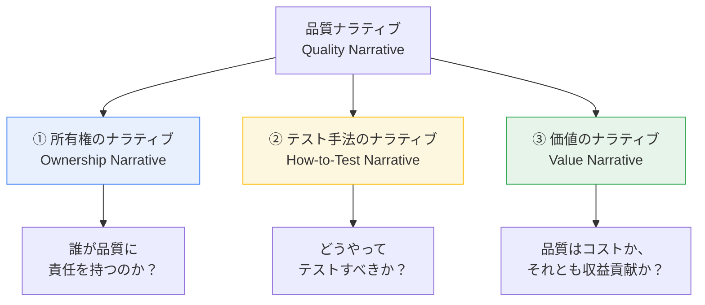
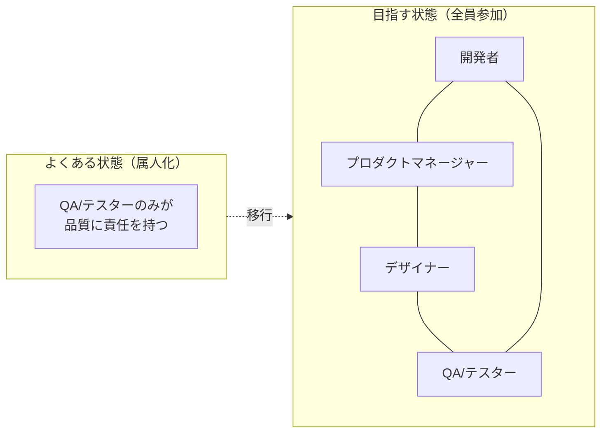
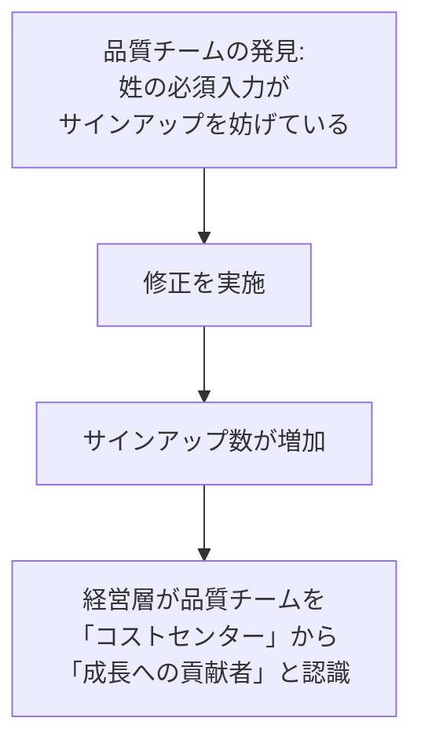
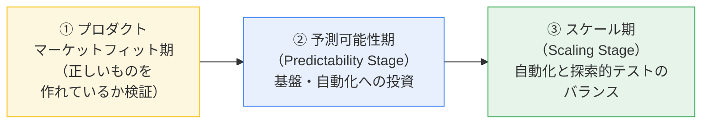
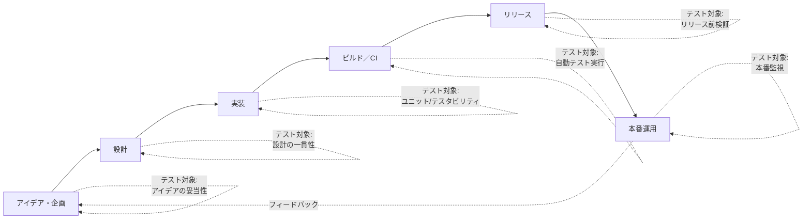
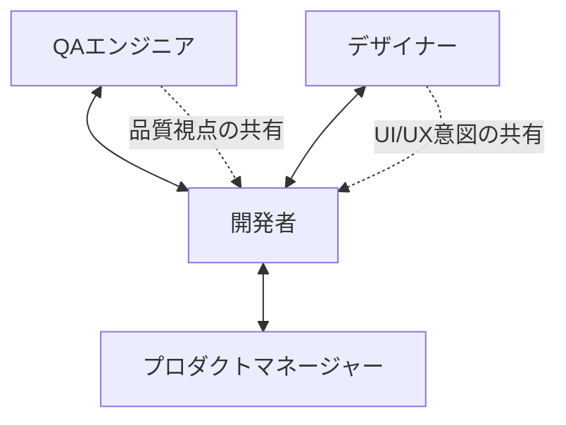
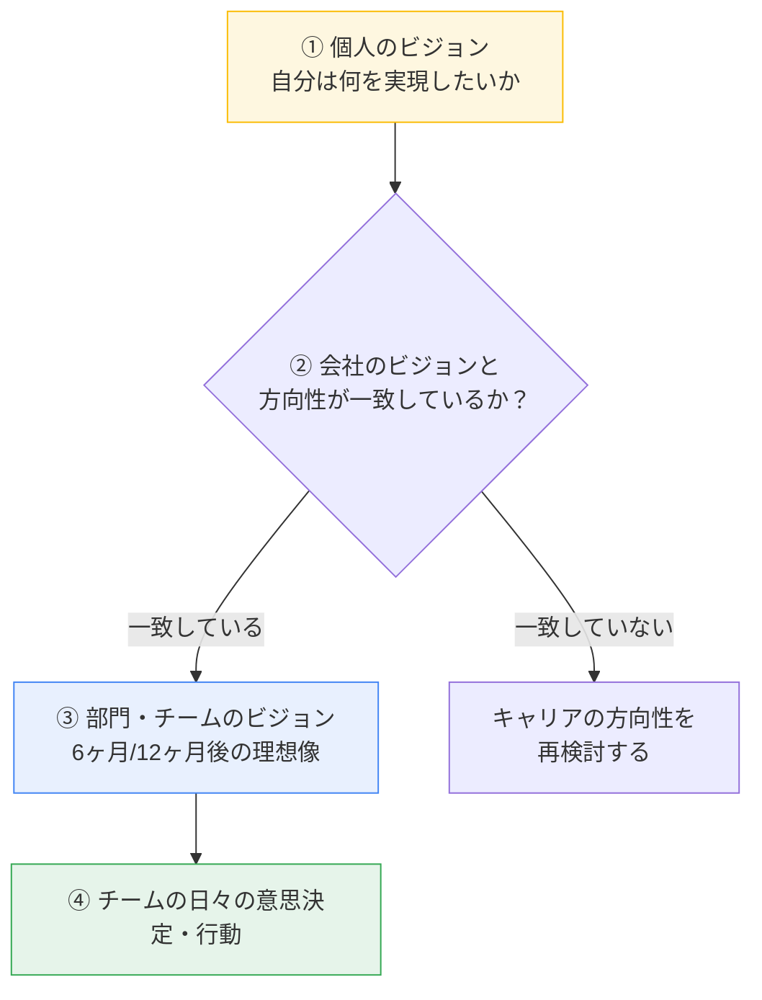
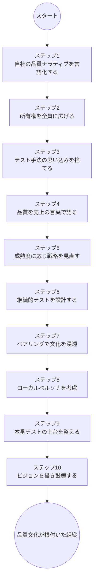

# Leading Quality 実践ガイド

*―― 偉大なリーダーはいかにして高品質なソフトウェアを届け、成長を加速させるのか ――*

> 📘 書籍情報（正式版）
> **タイトル**: *Leading Quality: How Great Leaders Deliver High-Quality Software and Accelerate Growth*
> **著者**: Ronald Cummings-John / Owais Peer（Global App Testing 共同創業者、Testathon® 発案者）
> **発行**: 2019年／ROI Press
>
> ※ 流通している副題「Build Winning Teams and Software Fast」は、実際に出版されている書籍の正式な副題ではありません。本ガイドは実在する正式版の書籍情報・著者インタビュー・書評などの一次/二次情報に基づいて作成しています。

---

## この記事について

この記事は、ソフトウェア品質（QA）を「テストチームだけの仕事」ではなく **「経営・リーダーシップの課題」** として捉え直すための実践ガイドです。原著は次の3部構成になっています。

| セクション | テーマ | この記事での対応ステップ |
|---|---|---|
| Section 1 | 品質リーダーになる（Becoming a Leader of Quality） | ステップ1〜4 |
| Section 2 | 戦略的な品質判断を極める（Mastering Your Strategic Quality Decisions） | ステップ5〜8 |
| Section 3 | チームを率いて成長を加速する（Leading Your Team to Accelerate Growth） | ステップ9〜10 |

対象読者は、CTO・VPoE・QAリード・プロダクトオーナーはもちろん、「品質にもっと発言力を持ちたい」と考えるすべてのエンジニア・テスターです。

---

## 目次

1. [なぜ品質は「経営課題」なのか](#1-なぜ品質は経営課題なのか)
2. [ステップ1：3つの「品質ナラティブ（物語）」を理解する](#2-ステップ13つの品質ナラティブ物語を理解する)
3. [ステップ2：所有権ナラティブ ―― 品質を全員のものにする](#3-ステップ2所有権ナラティブ--品質を全員のものにする)
4. [ステップ3：How-to-Testナラティブ ―― 銀の弾丸を捨てる](#4-ステップ3how-to-testナラティブ--銀の弾丸を捨てる)
5. [ステップ4：価値ナラティブ ―― 品質を売上の言葉で語る](#5-ステップ4価値ナラティブ--品質を売上の言葉で語る)
6. [ステップ5：プロダクトの成熟度に応じて戦略を変える](#6-ステップ5プロダクトの成熟度に応じて戦略を変える)
7. [ステップ6：継続的テスト（Continuous Testing）を設計する](#7-ステップ6継続的テストcontinuous-testingを設計する)
8. [ステップ7：ペアリングで品質文化を組織に浸透させる](#8-ステップ7ペアリングで品質文化を組織に浸透させる)
9. [ステップ8：ローカルペルソナを意識したテスト戦略](#9-ステップ8ローカルペルソナを意識したテスト戦略)
10. [ステップ9：本番環境でのテスト（Testing in Production）](#10-ステップ9本番環境でのテストtesting-in-production)
11. [ステップ10：ビジョンを描き、チームを鼓舞する](#11-ステップ10ビジョンを描きチームを鼓舞する)
12. [まとめ：品質リーダーへのロードマップ](#12-まとめ品質リーダーへのロードマップ)
13. [国際的な専門家からの評価](#13-国際的な専門家からの評価)
14. [参考文献・出典](#14-参考文献出典)

---

## 1. なぜ品質は「経営課題」なのか

多くの組織では、品質は「バグを見つけて直す」という現場レベルの仕事だと思われがちです。しかし著者のRonald Cummings-Johnは、InfoQのインタビューで次のように説明しています。品質に関する調査機関CISQ（Consortium for Information & Software Quality）の2018年の調査では、**低品質なソフトウェアが米国内の組織にもたらした損失は約2.8兆ドル**にのぼるとされています。

さらに著者らは、品質問題の影響を **「3つのC」** という切り口で整理しています。

| 3つのC | 内容 | 具体例 |
|---|---|---|
| **Customer（顧客）** | 顧客体験・信頼が損なわれる | 予定通りサービスを使えない、旅行に行けない |
| **Company（会社）** | 財務的損失・ブランド毀損 | 追加人件費、補償、株価・評判への影響 |
| **Career（キャリア）** | 担当者・リーダーの評価に影響 | 障害の責任者は昇進やプロジェクト任用で不利になる |

書籍第1章では、実例として **アメリカン航空の休暇スケジューリングシステムの不具合** が紹介されています。システムの欠陥により、すべてのパイロットがクリスマス休暇を同時に申請できてしまい、結果として1万5000便以上のフライトにパイロットが割り当てられない事態を引き起こしました。これは「品質＝テストの問題」ではなく「品質＝経営判断の問題」であることを象徴する事例です。

> 🔑 **ポイント**: 品質問題は「顧客」「会社」「個人のキャリア」の3方向に同時にダメージを与える。だからこそ品質はテスト担当者だけでなく、リーダーが主体的に扱うべき経営アジェンダである。

---

## 2. ステップ1：3つの「品質ナラティブ（物語）」を理解する

著者が提唱する中心概念が **「品質ナラティブ（Quality Narrative）」** です。これは「組織の中で品質がどのように語られ、認識されているか」という物語（暗黙のストーリー）を指します。まず自社の現状のナラティブを言語化することが、変革の第一歩になります。

| ナラティブ | 問いかけ | ありがちな失敗 |
|---|---|---|
| 所有権 | 品質は誰の仕事か？ | QA・テスターだけの責任にしてしまう |
| How-to-Test | どうテストすべきか？ | 「このツール／手法さえ導入すれば解決する」という銀の弾丸思考 |
| 価値 | 品質はどんな価値を生むか？ | リスク低減の話ばかりで、売上・成長への貢献を語らない |

以降のステップ2〜4で、この3つのナラティブをそれぞれ実務でどう扱うかを見ていきます。

---

## 3. ステップ2：所有権ナラティブ ―― 品質を全員のものにする

理想的な組織では、品質の責任はQAエンジニアや自動化エンジニアだけに閉じません。プロダクトマネージャー、デザイナー、エンジニア全員が「自分ごと」として品質に関わる状態を目指します。

**実践のポイント**

- スプリントの計画段階から品質基準（Definition of Done）を全職種で合意する
- バグ報告を「テスターの仕事の成果物」ではなく「チーム全体の学び」として扱う
- 品質に関する意思決定の場に、開発者・デザイナー・PMを必ず同席させる

---

## 4. ステップ3：How-to-Testナラティブ ―― 銀の弾丸を捨てる

著者は「自動化さえ導入すれば品質問題はすべて解決する」という考え方を明確に否定しています。料理やスポーツに多様なスタイルがあるように、テストにも唯一の正解はなく、**状況に応じたブレンド**が必要だと説きます。

書籍では、著名なテスト専門家 **Elisabeth Hendrickson** が示した「テストで何を学びたいのか」という問いと、テストの種類を結びつける考え方が紹介されています（書籍66ページ付近）。「テストを実行すること」自体が目的ではなく、**「そのテストから何を学びたいのか」を先に定義する**姿勢が重要だとされています。

| 知りたいこと（テストの問い） | 適したテストの例 |
|---|---|
| この機能は仕様通りに動くか？ | 機能テスト・回帰テスト |
| ユーザーは直感的に使えるか？ | 探索的テスト・ユーザビリティテスト |
| 想定外の負荷に耐えられるか？ | 負荷テスト・パフォーマンステスト |
| セキュリティ上の穴はないか？ | セキュリティテスト |
| リリース後も安定して動き続けるか？ | 監視・本番環境でのテスト |

> 🔑 **ポイント**: 「何を自動化するか」より先に「何を学びたいか」を定義する。手法や1つのツールに依存する思考から抜け出すことが、成熟した品質戦略への第一歩。

---

## 5. ステップ4：価値ナラティブ ―― 品質を売上の言葉で語る

著者が最も力を入れて語るのが、この「価値のナラティブ」です。多くの品質チームは「リスクをどれだけ減らしたか」「コストをどれだけ抑えたか」という守りの言葉でしか語られません。しかし著者は、品質チームが**事業成長（growth metric）に直結する成果**を語れるようになるべきだと主張します。

InfoQインタビューおよびTestGuildポッドキャストで紹介されている、成長指標（growth metric）の3類型は次の通りです。

| 成長指標のタイプ | 意味 | 代表企業の例 |
|---|---|---|
| **アテンション型** | ユーザーがどれだけ製品に時間を使うか | SNS系プロダクトの日次アクティブユーザー（DAU） |
| **トランザクション型** | 価値の交換（取引）が成立した回数 | Airbnbの「予約された宿泊数」 |
| **プロダクティビティ型** | ユーザーがどれだけ製品内で生産的な行動を取ったか | Slackの「一定数のメッセージ送信で契約継続率が大きく上がる」という知見 |

著者が語る象徴的なエピソードとして、あるインドネシア向けサービスのサインアップ画面で「姓（Last Name）」を必須項目にしていたケースがあります。インドネシアでは姓を持たない人も多く、この必須項目が新規登録の妨げになっていました。テストチームがこれを指摘して修正した結果、サインアップ数が大きく伸び、経営層が初めて「品質チームは売上に貢献する」と認識するきっかけになったといいます。

**実践のポイント**

- バグ報告のたびに「これは何ドルの節約/損失回避になるか」を可能な範囲で言語化する
- 自社の成長指標（何が「価値」の単位なのか）を明確にし、品質チームの日々の意思決定をその指標に結びつける
- 経営層への報告は「見つけたバグの数」ではなく「事業指標への影響」で語る

---

## 6. ステップ5：プロダクトの成熟度に応じて戦略を変える

書籍第5章では、プロダクトのライフサイクル（成熟度）によって、最適な品質戦略・テスト戦略が変化することが解説されています。「今のやり方が6ヶ月後・12ヶ月後にも正しいとは限らない」という前提を持つことが重要です。

| 段階 | 主な目的 | テスト戦略の重心 |
|---|---|---|
| プロダクトマーケットフィット期 | 「正しいものを作れているか」の検証 | ユニットテスト中心、フル自動化は急がない |
| 予測可能性期 | 安定した基盤の構築 | 自動化への投資を本格化させる |
| スケール期 | 効率的な拡大 | 自動化と探索的テストのバランスを取り直す |

著者は「一部のチームは、この評価を継続的にやり直すべきなのに、一度決めたやり方に固執してしまう」と指摘しています。プロダクトの変化・顧客動向の変化・チームスキルの変化のいずれかが起きたら、戦略を見直すタイミングです。

---

## 7. ステップ6：継続的テスト（Continuous Testing）を設計する

「継続的テスト」と聞くと、CI/CDパイプラインでの自動テスト実行を思い浮かべる方が多いかもしれません。しかし著者はより広い定義を採用しています。

> 継続的テストとは、**開発ライフサイクルのあらゆる段階でアプリケーションをテストする能力**のことである。コードが1行も書かれる前から、リリース後の運用に至るまで、テストは継続する。

この視点を採用すると、次のようなメリットが得られます。

1. **問題の先回り** ―― コードが書かれる前に「アイデアそのもの」や「設計」を検証できる
2. **テスタビリティの作り込み** ―― TDDなどを通じて、最初から「テストしやすい設計」を意識できる
3. **手戻りコストの削減** ―― 後工程で見つかるほど修正コストが高くなるバグを、早期に発見できる

---

## 8. ステップ7：ペアリングで品質文化を組織に浸透させる

著者はInfoQインタビューの中で、**ペアリング（Pairing）**が品質文化の浸透に有効だと述べています。ポイントは「共感（empathy）」の構築です。

- QAエンジニアと開発者がペアを組むことで、開発者は「品質を意識するとはどういうことか」を体感的に理解する
- デザイナーと開発者がペアを組むことで、デザイン意図が実装に正しく反映されやすくなる
- 例として、Atlassianでは品質チームと開発者のペアリングが実践されている

**実践のポイント**

- 定例のペア作業（モブテスト・ペアテスト）を週次で設定する
- ペアリングの目的を「作業の分担」ではなく「相互理解」として位置づける
- 異なる職種間のインタラクションが増えるほど、プロダクト全体への理解が深まり、結果的に品質が向上する

---

## 9. ステップ8：ローカルペルソナを意識したテスト戦略

マーケティングや製品企画で使われる「ペルソナ」は、多くの場合かなり大まかな人物像（例：「エンタープライズのAaron」）です。しかしエンジニアリング・品質の観点では、**利用されるOS・デバイス・地域の組み合わせすべてが1つの「ローカルペルソナ」**になり得ます。

| 企業の取り組み例 | 内容 |
|---|---|
| Airbnb | エンジニアを実際の現地に派遣し、ローカライズ版アプリの使われ方を体感させる |
| Google（Google Mapsなど） | 世界各地の既存ユーザーに、新機能（3Dストリートビューなど）のローカルテストを依頼 |
| Global App Testing（著者らの会社） | 105カ国以上・数万人のテスターを活用したクラウドテスティング |

このステップの狙いは、「1つのUIが世界中どこでも同じように機能する」という思い込みを捨てることです。前述のインドネシアの「姓」フィールドの例も、まさにローカルペルソナへの配慮不足から生まれた問題でした。

---

## 10. ステップ9：本番環境でのテスト（Testing in Production）

「本番環境でテストする」という考え方には抵抗を感じる人も多いはずです。著者は、テスト自動化・ソフトウェア観測可能性（Observability）の分野で知られるエンジニア **Cindy Sridharan** の記事「*Testing in Production, the Safe Way*」を引用しながら、次のように整理しています。

- 本番環境でのテストは、**すべてのチームに向いているわけではない**
- 実施するには、高度なインフラと、そもそも「本番でテストしやすい」設計思想が前提になる
- 十分な自動化基盤が整っていることが、安全に本番テストを行うための土台になる

**実践のポイント（本番テストを始める前のチェック）**

- [ ] フィーチャーフラグなどで機能の有効/無効を即座に切り替えられるか
- [ ] カナリアリリースや段階的ロールアウトの仕組みがあるか
- [ ] 異常検知・ロールバックを自動化できているか
- [ ] 本番影響を最小化する（一部ユーザーのみ対象にする等）仕組みがあるか

---

## 11. ステップ10：ビジョンを描き、チームを鼓舞する

著者が本書の最後に置いた（本来は冒頭に置きたかったと語る）テーマが「ビジョン」です。リーダーがまず自分自身の人生の方向性（個人のビジョン）を明確にし、それが会社のビジョンと重なっているかを確認する。そのうえで、チーム・部門のビジョンを描くという順序を提唱しています。

著者は「多くの人は会社のビジョンそのものより、“その会社が自分個人のビジョン実現に役立つかどうか”を気にしている」と指摘しています。リーダーがこの順番（個人 → 会社との整合 → チーム）を意識することで、初めてチームを本気で鼓舞できるとしています。

また、リーダーシップに不可欠なもう一つのスキルとして、著者は**説得力・影響力（Persuasion & Influence）**を挙げています。エンジニアリング出身の人ほど「説得」をネガティブに捉えがちですが、相手のゴールや懸念を理解し、論理的に語ることは、家庭でも職場でも役立つ普遍的なスキルだと述べています。

---

## 12. まとめ：品質リーダーへのロードマップ

ここまでの10ステップを、実践する順番の目安として1つのフローにまとめます（あくまで目安であり、組織の状況に応じて並び替えて構いません）。

| # | ステップ | 一言でいうと |
|---|---|---|
| 1 | 品質ナラティブの理解 | 自社の「品質の語られ方」を可視化する |
| 2 | 所有権ナラティブ | 品質を全員の仕事にする |
| 3 | How-to-Testナラティブ | 銀の弾丸探しをやめる |
| 4 | 価値ナラティブ | 品質を「売上・成長」の言葉で語る |
| 5 | 成熟度に応じた戦略 | プロダクトの段階ごとに戦略を見直す |
| 6 | 継続的テスト | テストを開発ライフサイクル全体に広げる |
| 7 | ペアリング | 職種を越えた共感で品質文化を育てる |
| 8 | ローカルペルソナ | 「世界中どこでも同じ」という思い込みを捨てる |
| 9 | 本番テスト | 安全に本番環境で学ぶ仕組みを整える |
| 10 | ビジョン | 個人→会社→チームの順でビジョンを揃える |

---

## 13. 国際的な専門家からの評価

本書には、国際的に著名なソフトウェアテスト／エンジニアリング関係者から推薦の声が寄せられています（要旨のみ紹介）。

| 推薦者 | 肩書 | コメントの要旨 |
|---|---|---|
| Michael Lopp | Slack, VP of Product Engineering / 著書『Managing Humans』著者 | 品質という視点は製品・企業を差別化する鍵であり、本書はその考え方を養う助けになる |
| James Bach | 『Lessons Learned in Software Testing』著者 | 品質の危機は、常にリーダーシップの危機から始まると指摘 |
| Alan Page | Unity Technologies, Quality Director／ポッドキャスト「AB Testing」共同ホスト | 高品質なソフトウェアは「品質の文化」を持つチームから生まれ、それには強いリーダーシップが必要だと評価 |
| Dan Ashby | Photobox, Head of Quality Engineering（元eBay, Head of Testing） | 本書は品質リーダーシップに向けた業界全体のムーブメントの始まりだと評価 |
| Ilya Sakharov | HelloFresh, Director of QA | 経営層・マネージャーが「なぜ品質に投資すべきか」を理解する助けになると評価 |
| Suyash Sonwalkar | Coinbase, Quality and Automation Lead | 企業の成長段階を問わず、品質投資を後押しするフレームワークを提供していると評価 |

また、国際的に著名なテスト自動化ポッドキャスト「TestGuild」のホストであるJoe Colantonio氏や、Agile/品質分野で著名なコンサルタント・InfoQ寄稿者のBen Linders氏による著者インタビューでも、本書のコンセプトが詳しく取り上げられています（出典は次章参照）。

---

## 14. 参考文献・出典

本ガイドは以下の一次・二次情報源をもとに作成しました（2026年8月30日時点で確認）。

| 種別 | タイトル／概要 | URL |
|---|---|---|
| 公式サイト | Leading Quality Book 公式サイト（著者プロフィール・書籍概要） | <https://www.leadingqualitybook.com/> |
| 著者インタビュー（国際的な技術メディア InfoQ） | "Q&A on the Book Leading Quality"（Ben Linders氏によるRonald Cummings-Johnへのインタビュー） | <https://www.infoq.com/articles/book-review-leading-quality/> |
| 無料サンプル章（出版社公式配布） | 無料サンプル章のリクエストフォーム（公式サイト内。氏名とメールアドレスを登録すると入手できる） | <https://www.leadingqualitybook.com/#freeFooter> |
| ポッドキャスト書き起こし（国際的なテスト自動化ポッドキャスト TestGuild） | "Leading Quality with Ronald Cummings-John"（Joe Colantonio氏によるインタビュー） | <https://testguild.com/podcast/a326-ronald/> |
| 書評（国際的なアジャイル/テスト専門家 Derk-Jan de Grood氏） | "Leading Quality – Review of the book" | <https://djdegrood.wordpress.com/2019/11/28/leading-quality-review-of-the-book-by-ronald-cummings-john-and-owais-peer/> |
| 書籍要点まとめ | Mentoring Club による本書のキーインサイト紹介ページ | <https://www.mentoring-club.com/bookshelf/ronald-cummings---john-owais-peer-leading-quality---how-great-leaders-deliver-high-quality-software-and-accelerate-growth> |
| 書籍販売ページ（正式タイトル・著者・ISBN確認用） | Amazon.com 商品ページ（紙版・ISBN 9781916185807） | <https://www.amazon.com/Leading-Quality-Leaders-Software-Accelerate/dp/1916185800> |
| 参考記事（本文中で言及） | Cindy Sridharan "Testing in Production, the Safe Way" | <https://medium.com/@copyconstruct/testing-in-production-the-safe-way-18ca102d0ef1> |
| 一次資料（CISQ） | "The Cost of Poor Quality Software in the US: A 2018 Report"（本文の約2.8兆ドルの根拠。調査対象は**米国内**の組織に限定され、金額は**米ドル建て**） | <https://www.it-cisq.org/wp-content/uploads/sites/2/2020/08/The-Cost-of-Poor-Quality-Software-in-the-US-2018-Report.pdf> |

> ⚠️ **注記**: Scribd 上の書籍全文のアップロードは、無断アップロードである可能性が高いため、著作権保護の観点から本ガイド作成にあたって参照していません。本ガイドの内容は、上記の公式サイト・出版社配布の無料サンプル・著者本人へのインタビュー記事など、正規に公開されている情報のみに基づいています。書籍の全文を読みたい場合は、公式サイトまたはAmazon等の正規販売チャネルからの購入をおすすめします。
