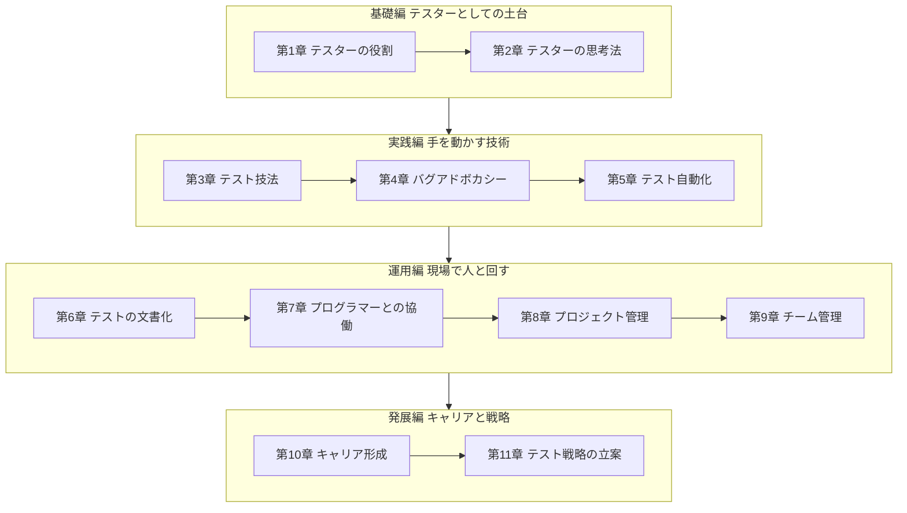
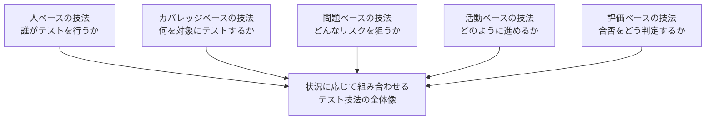
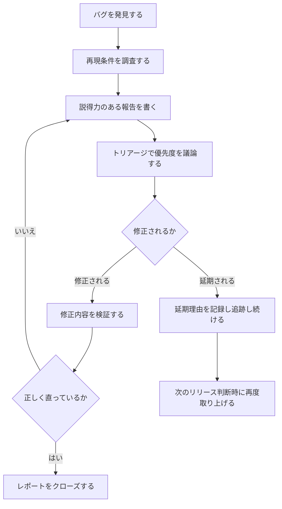
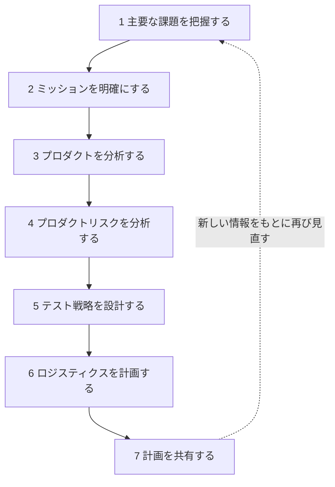
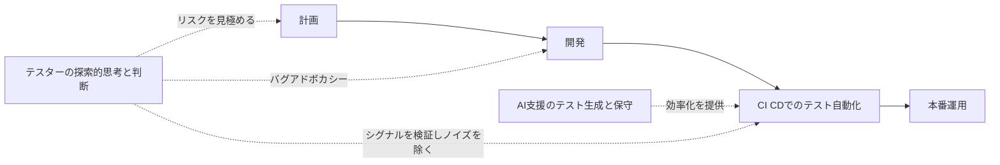

# ソフトウェアテストにおける学びの教訓 ー 初学者のためのベストプラクティスガイド

> 本ガイドは、ソフトウェアテスト分野の古典的名著 **『Lessons Learned in Software Testing: A Context-Driven Approach』**（Cem Kaner、James Bach、Bret Pettichord 著、Wiley、2001年刊、ISBN 9780471081128）の構成と考え方をベースに、初学者向けにステップバイステップで解説したものです。あわせて、2026年時点での最新の実践動向（AI活用テストなど）についても、国際的に著名なテスト専門家の発信をもとに補足しています。
>
> 本書そのものの全文引用は行わず、各レッスンの考え方を筆者の言葉で要約・解説しています。詳細な原典（全293個のレッスン）を読みたい方は、末尾の参考文献にある O'Reilly / Wiley のリンクからご確認ください。

---

## 目次

1. はじめに ー この本が「テストの古典」と呼ばれる理由
2. 本書の全体マップ
3. ステップ1: テスターの役割を理解する
4. ステップ2: テスターのように考える
5. ステップ3: テスト技法を使い分ける
6. ステップ4: 優れたバグレポートを書く（バグアドボカシー）
7. ステップ5: テスト自動化を正しく使う
8. ステップ6: テストを文書化する
9. ステップ7: プログラマーと協働する
10. ステップ8: テストプロジェクトを管理する
11. ステップ9: テストチームを管理する
12. ステップ10: テスターとしてのキャリアを築く
13. ステップ11: テスト戦略を立案する
14. 付録: コンテキスト駆動学派の7つの原則
15. 現代における実践 ー AI時代のテスト（2026年時点の視点）
16. まとめ ー 明日から使えるチェックリスト
17. 参考文献・出典

---

## 1. はじめに ー この本が「テストの古典」と呼ばれる理由

『Lessons Learned in Software Testing』は、テスト業界で「コンテキスト駆動学派（Context-Driven School）」の創始者として知られる3人の専門家による共著です。

| 著者 | 略歴 |
|---|---|
| Cem Kaner | フロリダ工科大学教授（法学・実験心理学の博士号を保有）。『Testing Computer Software』『Bad Software』などの著者としても知られる、テスト分野の第一人者 |
| James Bach | Satisfice, Inc. の創業者。Apple や Borland での競争の激しいソフトウェア開発経験を持ち、探索的テストやリスクベーステストの体系化に貢献 |
| Bret Pettichord | 独立コンサルタント。Software Testing Hotlist の編集者としても著名 |

本書は、3人が持つ合計30年以上（後年の紹介では50年以上）のテスト経験から抽出した、**293個の「レッスン」**を11章にまとめた構成になっています。各レッスンは「主張（アサーション）」とその解説・具体例のペアで構成されており、体系的な教科書というよりも「経験則集」に近いスタイルが特徴です。

本書の根底にあるのが **コンテキスト駆動アプローチ（Context-Driven Approach）** という考え方です。これは「唯一絶対の正しいテスト手法は存在せず、テストのやり方はプロジェクトの状況（コンテキスト）に応じて選択すべきである」という思想で、後にコンテキスト駆動学派として世界中のテストコミュニティに広がりました。

---

## 2. 本書の全体マップ

11の章は、大きく「基礎編」「実践編」「運用編」「発展編」の4つの塊として捉えると理解しやすくなります。

初学者は、まず「基礎編」で自分の役割と思考の型を理解し、「実践編」で具体的な技術（技法・バグ報告・自動化）を身につけ、「運用編」でチームや他職種との協働を学び、最終的に「発展編」でキャリアと戦略という長期的視点を得る、という順序で読み進めると理解が深まります。

---

## 3. ステップ1: テスターの役割を理解する

第1章（レッスン1〜15）は、「テスターとは何をする人か」という最も基本的な問いを扱います。初学者がまず誤解しやすいポイントを整理します。

### 押さえるべき考え方

- **テスターはプロジェクトの「ヘッドライト」である**：進行方向に何があるか（リスクや問題）を関係者より先に照らし出す役割であり、後から結果を採点する「審判」ではありません。
- **テストの目的（ミッション）が、やることすべてを決める**：品質を上げること自体が目的なのではなく、「誰のために、何を明らかにするためにテストするのか」を最初に定義する必要があります。
- **テスターは複数の利害関係者にサービスを提供する**：開発者、プロダクトマネージャー、経営層、エンドユーザーなど、テスターが向き合う相手は一人ではありません。
- **すべてのバグを見つけることはできない**：時間もリソースも有限である以上、「十分なテスト」とは「関係者が意思決定できるだけの情報が揃った状態」を指します。
- **テスターはゲートキーパー（門番）になってはいけない**：リリースの可否を最終決定するのはテスターではなく、プロダクトオーナーやマネジメント層です。テスターの役割は判断材料を提供することにあります。

### 初学者がやりがちな誤解

| よくある誤解 | 実際の考え方 |
|---|---|
| 「バグをゼロにするのが自分の仕事」 | バグをゼロにすることは不可能。重要なバグを早く見つけることが仕事 |
| 「テストに合格したらリリースしてよい」 | テスト結果は判断材料の一つに過ぎず、リリース可否の最終権限はテスターにはない |
| 「テストは開発が終わってから始まる工程」 | テストの機会は、要件定義からリリース後まで、成果物が人から人へ引き渡されるあらゆる場面に存在する |

---

## 4. ステップ2: テスターのように考える

第2章（レッスン16〜47）は、テストという行為を支える認知的な土台を扱います。ここが本書の中でも最も哲学的で、かつ実務に直結する部分です。

### 核心となる考え方

- **テストは「認識論（epistemology）」の応用である**：テストとは、突き詰めれば「私たちは何を知っており、何を知らないのか」を明らかにする活動です。
- **テストはあなたの頭の中で起きている**：テストケースを実行する行為そのものより、何を確認すべきかを考え、結果をどう解釈するかという思考プロセスの方が本質的です。
- **すべてのテストは何らかのモデルに基づいている**：プロダクト・ユーザー・リスクについて自分が持っている「モデル（頭の中の地図）」の精度が、テストの質を左右します。
- **探索とは深く考えることである**：探索的テストは「行き当たりばったりにクリックすること」ではなく、学習・設計・実行を同時並行で行う高度な思考活動です。
- **直感は良い出発点だが、悪い結論である**：「なんとなく大丈夫そう」という感覚はテストのきっかけとしては有用ですが、それだけで「合格」と判断してはいけません。
- **バイアスは避けられないが、管理はできる**：自分が思い込みによって見落としをしている可能性を常に自覚し、意図的に視点を変える工夫（別の担当者によるレビュー、時間を置いての再確認など）が有効です。
- **新鮮な目が失敗を見つける**：同じ人が長時間見続けたプロダクトには「馴れ」による見落としが発生しやすいため、新しいメンバーやペアテストの視点が重要です。

### 実践のヒント

1. テストを始める前に「このテストで何を明らかにしたいのか」を一文で言語化する。
2. 「なぜこの結果になったのか」を説明できない場合は、まだ理解が浅いというサインと捉える。
3. 手順書に従うだけでなく、「この手順は本当に今のリスクに対して適切か」を都度問い直す。

---

## 5. ステップ3: テスト技法を使い分ける

第3章（レッスン48〜54）では、数多く存在するテスト技法を、5つの視点から整理するフレームワークが紹介されています。

### 5つの視点の意味

| 視点 | 焦点 | 具体例 |
|---|---|---|
| 人ベース | 誰がテストするか | 初心者テスター、ドメイン専門家、エンドユーザーによるテスト |
| カバレッジベース | 何をテストするか | 機能一覧、画面遷移、コードパスに基づく網羅 |
| 問題ベース | なぜテストするか（リスク） | セキュリティリスク、性能リスク、過去の不具合傾向に基づくテスト |
| 活動ベース | どのように進めるか | 探索的テスト、スクリプトテスト、ペアテスト |
| 評価ベース | 合否をどう判定するか（オラクル） | 仕様書との比較、過去バージョンとの比較、ユーザー期待との比較 |

重要なのは、これらは互いに排他的な分類ではなく「同じ技法を、異なる視点から見ている」に過ぎないという点です。たとえば「探索的テスト」は活動ベースの技法であると同時に、テスターの経験（人ベース）にも強く依存します。

### 補足: 組み合わせテスト（オールペア法）の考え方

本書には、入力項目が多い場合にすべての組み合わせを網羅するのが非現実的なときの手法として、**オールペア法（All-Pairs Technique）** の考え方も紹介されています。ステップは次の通りです。

1. 各入力項目を「ドメイン分割（同値分割）」して代表値を洗い出す。
2. まず、各項目の値が最低1回は登場する組み合わせ（オールシングル）を作る。
3. 次に、任意の2項目の値の組み合わせがすべて最低1回は登場するように調整する（オールペア）。
4. 網羅率とテストケース数のバランスを見ながら、実務上必要な組み合わせのみに絞り込む。

---

## 6. ステップ4: 優れたバグレポートを書く（バグアドボカシー）

第4章（レッスン55〜101）は本書の中でも特にボリュームが大きく、**「バグアドボカシー（Bug Advocacy）」** という独自の概念を扱っています。これは単なる「不具合報告の書き方」ではなく、「見つけた不具合を実際に修正してもらうための説得力ある伝え方」を指します。

### バグレポートのライフサイクル

### 押さえるべき原則

- **バグレポートはあなた自身を映す「代理人」である**：報告の質が低いと、それだけで不具合そのものが軽視されてしまいます。
- **1つのバグには1つのレポート**：複数の問題を1つのレポートにまとめると、一部だけ修正されて残りが放置されるリスクが生じます。
- **サマリー行が最も重要**：トリアージ担当者はまずサマリーしか読まないため、内容が一目でわかる要約力が求められます。
- **severity（深刻度）と priority（優先度）は別物**：深刻度は「問題の技術的な大きさ」、優先度は「今すぐ直すべきかどうかというビジネス判断」であり、この2つを混同しないことが重要です。
- **再現しないバグも必ず報告する**：「たまにしか起きない不具合」は、将来的に重大な障害の前兆（いわゆる時限爆弾）である可能性があるため、再現できないからといって握りつぶしてはいけません。
- **誇張しない、決めつけない**：問題を正確に報告することが重要で、原因を決めつけて報告すると誤った修正判断につながる可能性があります。
- **修正されたことを鵜呑みにしない**：プログラマーが「直した」と言っても、必ず自分で検証してからクローズする習慣が信頼性を担保します。

### 現代の視点: バグアドボカシーは「調査」の技術である

国際的なテストコミュニティでも、バグアドボカシーの考え方は現在も引き継がれています。フィンランドを拠点とする著名なテスト専門家 Maaret Pyhäjärvi は、2024年のブログ記事でバグアドボカシーを「バグ報告の授業ではなく、バグ調査の授業である」と位置づけ、単に「動きませんでした」と伝えるだけでは逆効果であり、最短の再現手順を見つけ、必要なログを添えて、多忙で余裕のない相手にも読んでもらえる報告に仕上げる作業そのものに価値があると論じています。

---

## 7. ステップ5: テスト自動化を正しく使う

第5章（レッスン102〜141）は、「自動化すれば楽になる」という単純な思い込みに警鐘を鳴らす内容が中心です。

### 押さえるべき原則

| 誤解 | 本書の立場 |
|---|---|
| 自動化の目的はコスト削減 | 目的は「開発プロセスの速度を上げること」「手動では届かない範囲までテストの手を広げること」 |
| 100%自動化が理想 | 自動化率を目標にすること自体がリスクであり、状況に応じた自動化戦略を選ぶべき |
| 自動化はツールを買えば済む | 自動化は立派な「ソフトウェア開発プロジェクト」であり、設計・レビュー・保守が必要 |
| 自動テストは資産が増えるほど良い | 保守されない自動テストはやがて壊れて放置され、誰も気づかないまま無価値化する |
| 汚いテスト手順を自動化すれば改善する | 「汚いプロセスを自動化しても、速く汚くなるだけ」であり、自動化前にテスト設計を見直すべき |

とりわけ重要な指摘が、**「テスタビリティ（testability）への投資は、しばしば自動化そのものへの投資よりも価値が高い」**という考え方です。テスタビリティとは、プロダクトの内部状態を外から観測・制御しやすくする設計上の工夫（ログ出力、テスト用API、状態のリセット機能など）を指し、これがあるだけで手動・自動を問わずテスト全体の効率が大きく向上します。

---

## 8. ステップ6: テストを文書化する

第6章（レッスン142〜149）は短い章ですが、実務で頻繁に議論になるテーマ、「どこまでドキュメントを書くべきか」を扱います。

### 押さえるべき原則

- テンプレートを使うべきかどうかは状況次第であり、「テンプレートを使えば自動的に品質が上がる」という考え方にも「テンプレートは形骸化するので不要」という考え方にも、どちらにも一理ある。
- 標準規格（IEEE 829 のようなテストドキュメント標準）を使うかどうかも、プロジェクトの契約形態や監査要件に応じて判断すべきであり、無条件に採用・排除するものではない。
- ドキュメントを作る前に、「そもそも何のためにこの文書が必要なのか」という要件分析を行うべきであり、これはソフトウェア開発と同じ考え方が当てはまる。
- テスト文書化の目的は、最終的には「1文・3要素以内」で説明できるくらいまでシンプルに絞り込めるはずである。

---

## 9. ステップ7: プログラマーと協働する

第7章（レッスン150〜156）は短いながらも、テスターと開発者の関係性という、現場で最も摩擦が生まれやすいテーマを扱っています。

### 押さえるべき原則

- プログラマーがどう考えるかを理解する努力をすることが、協働の出発点になる。
- 信頼は一朝一夕には築けないため、日々の小さなやり取りの積み重ねが重要である。
- 批判の矛先は「仕事の成果物」に向けるべきであり、「人」に向けてはならない。
- プログラマーは自分の仕事について話すのを好む傾向があるため、質問を投げかけることが関係構築の近道になる。

---

## 10. ステップ8: テストプロジェクトを管理する

第8章（レッスン157〜209）は本書で最もボリュームが大きい章の一つで、日々のテストプロジェクト運営の実務的な知恵が詰まっています。

### 押さえるべき原則

- **「サービス文化」を作る。「コントロール文化」を作ろうとしない**：テストチームは開発を統制する部隊ではなく、価値ある情報を提供するサービス部門であるという自己認識を持つべきです。
- **テスターが管理するのは「テストという名のサブプロジェクト」であり、開発プロジェクト全体ではない**：権限の範囲を正しく認識することが、無用な軋轢を避けます。
- **スモークテストでビルドの受け入れ可否を判断する**：本格的なテストを始める前に、最低限の動作確認で「テスト可能な品質か」をふるいにかけます。
- **セッションベースドテスト管理**：探索的テストのセッションに「チャーター（憲章、目的）」を与え、時間を区切って実施・記録することで、自由度の高い探索的テストにも説明責任を持たせられます。
- **バグ件数だけで進捗を語らない**：バグの発見数はテストの深さや対象範囲によって大きく変わるため、単一の指標に頼った進捗管理は危険であり、複数の独立した指標を組み合わせるべきです。
- **バランスドスコアカードで複数の観点から状況を報告する**：進捗・品質・リスクなど、複数軸で状況を可視化することが、経営層への説明責任にもつながります。
- **テスターはリリースの可否そのものにサインオフしない**：「テストを自分が納得する水準まで実施した」という事実にサインオフするのであり、リリースの承認そのものは別の意思決定者の役割です。

---

## 11. ステップ9: テストチームを管理する

第9章（レッスン210〜244）は、テストリーダーやテストマネージャー向けの内容ですが、初学者が「良いチームとはどういうものか」を理解するうえでも有用です。

### 押さえるべき原則

- **スタッフを「幹部」として扱う**：単なる作業者としてではなく、判断力を信頼される専門職として扱うことで、モチベーションと成果の両方が向上します。
- **新人テスターの立ち上げ方には型がある**：いきなり複雑な機能を任せるのではなく、まず既存ドキュメントとソフトウェアの突き合わせや、過去のバグの再確認といった作業から慣らしていくことが推奨されています。
- **士気はチームの重要な資産である**：過度な残業を強いること、スタッフが理不尽な扱いを受けることを放置しないことが、長期的なチームの生産性を守ります。
- **採用は合議制で、誠実さを最重視する**：スキルの高さだけでなく、チームの合意形成や人としての誠実さを重視した採用判断が推奨されています。

---

## 12. ステップ10: テスターとしてのキャリアを築く

第10章（レッスン245〜273）は、テスターという職種を「一生の専門職」としてどう育てていくかという、キャリア論に近い内容です。

### 押さえるべき原則

- 自分のキャリアの方向性を主体的に選び、追求することが重要であり、会社の都合に流されるだけのキャリア形成は避けるべきである。
- テスターとしての専門性は、必ずしもプログラマーより収入が低いことを意味しない。
- カンファレンスは「参加する」だけでなく「議論に加わる」場として活用する。
- 履歴書やポートフォリオは、自分を売り込むための積極的なツールとして設計する。
- スクリプト言語やプログラミング言語の習得は、テスターとしての可能性を広げる投資である。
- 資格取得そのものを目的化しすぎることには注意が必要であり、短期間で得られる資格に過信しすぎないことが望ましい。

---

## 13. ステップ11: テスト戦略を立案する

第11章（レッスン274〜293）は本書の集大成にあたる章で、個々の技法やレッスンを、プロジェクト全体の「戦略」としてどう統合するかを扱っています。

### 戦略を考えるための3つの基本的な問い

1. **なぜテストするのか（why bother）**
2. **誰が気にするのか（who cares）**
3. **どこまでやるのか（how much）**

### 押さえるべき原則

- **本当の「テスト計画」とは、あなたのテストプロセスを導く一連の考え方そのものであり、文書そのものではない**。文書はその考え方を伝えるための一つの手段に過ぎません。
- **テスト計画はコンテキストに合わせて設計する**：他プロジェクトの計画をそのまま流用する「先祖崇拝」的な使い回しには注意が必要です。
- **最初に立てた戦略は、常に間違っている**：プロジェクトの状況は刻々と変化するため、最初の戦略は仮説にすぎず、継続的に見直すことが前提となります。
- **プロダクトの成熟度に応じてテストの深さを変える**：開発初期と終盤とでは、適切なテストの重点は異なります。

### コンテキスト駆動テスト計画を「進化」させる7ステップ

本書には、テスト計画を一度作って終わりにするのではなく、継続的に更新していくための実践的な7ステップの流れが紹介されています。

このループが示す通り、テスト計画は一度作って完成させる「成果物」ではなく、プロジェクトの状況変化に合わせて回し続ける「プロセス」だという点が、本書全体を貫く最大のメッセージの一つです。

---

## 14. 付録: コンテキスト駆動学派の7つの原則

本書の付録Aでは、コンテキスト駆動学派の立場を7つの原則として整理しています（原文は英語ですが、要旨を日本語でまとめます）。

| 番号 | 原則の要旨 |
|---|---|
| 1 | ある状況における実践の価値は、その状況に強く依存する |
| 2 | どんな状況にも通用する「ベストプラクティス」は存在せず、その時々の「良い実践」があるだけである |
| 3 | 人はプロジェクトにおいて、単なる歯車ではなく、他のどんな要素よりも重要な存在である |
| 4 | プロジェクトの進行は基本的に予測不可能であり、成功は人の能力と創造性に強く依存する |
| 5 | プロダクトとは、それが引き起こす問題への解決策のことである |
| 6 | 良いソフトウェアテストとは、知的で困難な、頭脳労働としてのプロセスである |
| 7 | 私たちの仕事が価値を持つのは、対象となるプロジェクトの文脈の中に置かれたときだけである |

これらの原則は、後年「アジャイルテスト」や「探索的テストの体系化」といった潮流の理論的な土台としても引用され続けています。

---

## 15. 現代における実践 ー AI時代のテスト（2026年時点の視点）

『Lessons Learned in Software Testing』が刊行されたのは2001年ですが、その中核にある「コンテキストに応じて判断する」という思想は、生成AIやエージェント型AIがテスト工程に組み込まれ始めた2026年の現在においても、色あせるどころかむしろ重要性を増しています。国際的に著名なテスト専門家たちの直近の発信を見てみましょう。

### Rapid Software Testing ー 本書の思想の直系の後継

本書の共著者であるJames Bachと、長年のパートナーであるMichael Boltonは、2006年から「ラピッドソフトウェアテスティング（Rapid Software Testing, RST）」という方法論・マインドセットを共同開発してきました。そして2025年11月には、両者の共著による解説書『Taking Testing Seriously: The Rapid Software Testing Approach』が刊行されています。この新著はRSTの体系を初めて本格的にまとめた決定版とされ、不確実性や時間的制約の中でも本質的な問題を見つけ出すための考え方を扱っており、『Lessons Learned in Software Testing』からの直接的な発展形といえる内容です。

### エージェント型AIとテスターの役割の変化

決済プラットフォーム企業でデベロッパーリレーションズを率いる著名なテスト自動化専門家 Angie Jones は、2025年のインタビューで、従来のチャット形式の生成AIと、自律的にタスクを実行する「エージェント型AI」の違いについて解説しています。チャット型AIは提案止まりで、実装は人間が手作業で行う必要があるのに対し、エージェント型AIはより自律的にタスクを遂行できる点が異なるとされています。この変化は、本書が説く「テスターは判断材料を集める役割であり、最終判断は人が下す」という原則を、AI時代にどう適用するかという新しい問いを投げかけています。

### 「シグナル対ノイズ」という新しい課題

テスト自動化プラットフォームを提供する Applitools は、2026年の分析記事の中で、AIの活用が進むほどテストから得られる情報の量は増える一方、その質（シグナル）と単なる雑音（ノイズ）の見極めが最大のボトルネックになっていると指摘しています。信頼性・説明可能性・再現性のある結果を重視する組織ほど、2026年のテスト戦略として優位に立つとされており、これは本書が繰り返し説く「バグレポートの説得力」「オラクル（合否判定基準）の妥当性」といった原則と本質的に同じ課題であるといえます。

### コミュニティでの継続的な議論

国際的なテスターコミュニティ Ministry of Testing のフォーラムでも、2025年末から2026年にかけて「AIエージェントの普及によってQAの役割はどう変わるのか」という議論が活発に交わされています。そこでは、AIがテストケース生成やテストデータ作成、回帰テストの高速化を担う一方で、QAの役割は「リスクベースの戦略立案」や「継続的品質（シフトレフト／シフトライトの両方）」、そしてAI機能を含むプロダクトに対する「ガバナンスとセキュリティ」により重点を移していく、という見方が共有されています。

このように、AIはテスト業務の「効率化の担い手」として存在感を増していますが、「何をテストすべきか」「その結果を信頼してよいか」を判断する部分は、依然として人間のテスターの技能と判断に委ねられています。これはまさに、本書がコンテキスト駆動アプローチとして20年以上前から主張してきた立場と一致しています。

---

## 16. まとめ ー 明日から使えるチェックリスト

- [ ] テストを始める前に「このテストで何を明らかにしたいのか」を言語化したか
- [ ] 自分をリリースの「ゲートキーパー」だと誤解していないか
- [ ] バグレポートは、忙しい相手にも一目で伝わるサマリーになっているか
- [ ] severity（深刻度）と priority（優先度）を混同していないか
- [ ] 再現しないバグを「再現しないから」という理由で握りつぶしていないか
- [ ] 自動化する前に、そもそものテスト手順が整理されているか（汚いプロセスのまま自動化していないか）
- [ ] テスト計画を「一度作って終わりの文書」ではなく「回し続けるプロセス」として扱っているか
- [ ] AIが生成した結果を無条件に信頼せず、シグナルとノイズを見極めているか
- [ ] 今のテストのやり方は、今のプロジェクトのコンテキスト（状況）に本当に合っているか

---

## 17. 参考文献・出典

本ガイドの作成にあたり、2026年8月31日時点で参照した情報源は以下の通りです。

- [Lessons Learned in Software Testing: A Context-Driven Approach（O'Reilly / Wiley 書籍ページ、目次全体を含む）](https://www.oreilly.com/library/view/lessons-learned-in/9780471081128/)
- [Lessons Learned in Software Testing（Wiley 公式出版社ページ）](https://www.wiley.com/en-us/Lessons+Learned+in+Software+Testing:+A+Context-Driven+Approach-p-9780471081128)
- [Lessons Learned in Software Testing（Goodreads レビュー・概要ページ）](https://www.goodreads.com/book/show/26258294)
- [Context-Driven Testing 公式サイト ー コンテキスト駆動学派の7原則](https://context-driven-testing.com/)
- [Satisfice, Inc. ー James Bach 公式サイト](https://www.satisfice.com/)
- [Disruptive Testing: Part 1 ー James Bach インタビュー（Thoughtworks）](https://www.thoughtworks.com/insights/blog/disruptive-testing-part-1-james-bach)
- [About Michael Bolton ー DevelopSense（『Taking Testing Seriously』2025年11月刊の紹介を含む）](https://developsense.com/about-michael-bolton)
- [Taking Testing Seriously: The Rapid Software Testing Approach（書籍情報）](https://www.amazon.com/Taking-Testing-Seriously-Software-Approach/dp/1394253192)
- [Cem Kaner 公式サイト](https://kaner.com/)
- [Bug Advocacy（Cem Kaner、PDF資料）](https://kaner.com/pdfs/BugAdvocacy.pdf)
- [BBST Bug Advocacy コース概要](https://bbst.courses/bbst-bug-advocacy/)
- [A Seasoned Tester's Crystal Ball: Contemporary Bug Advocacy（Maaret Pyhäjärvi、2024年）](https://visible-quality.blogspot.com/2024/02/contemporary-bug-advocacy.html)
- [Agentic AI and the Future of Software Testing ー Angie Jones インタビュー（Sauce Labs）](https://saucelabs.com/resources/blog/agentic-ai-and-the-future-of-software-testing-a-q-and-a-with-angie-jones)
- [AI Testing in 2026: Why Signal, Trust, and Intentional Choices Matter More Than Ever（Applitools）](https://applitools.com/blog/ai-testing-strategy-in-2026/)
- [How will Software QA change in 2026 with AI/Agents ー ディスカッション（Ministry of Testing）](https://club.ministryoftesting.com/t/how-will-software-qa-change-in-2026-with-ai-agents-and-which-qa-roles-will-be-most-valuable/86992)
- [Software testing best practices for 2026（N-iX）](https://www.n-ix.com/software-testing-best-practices/)
- [How AI Is Redefining Software Testing Practices in 2026（Evozon）](https://www.evozon.com/how-ai-is-redefining-software-testing-practices-in-2026/)

> 本ガイドは教育目的の要約・解説であり、原著の文章を逐語的に引用したものではありません。正確な原文や全293レッスンの詳細については、上記リンクから原著（Wiley刊）をご参照ください。
