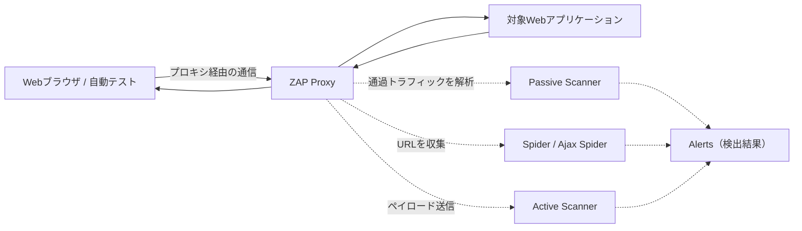
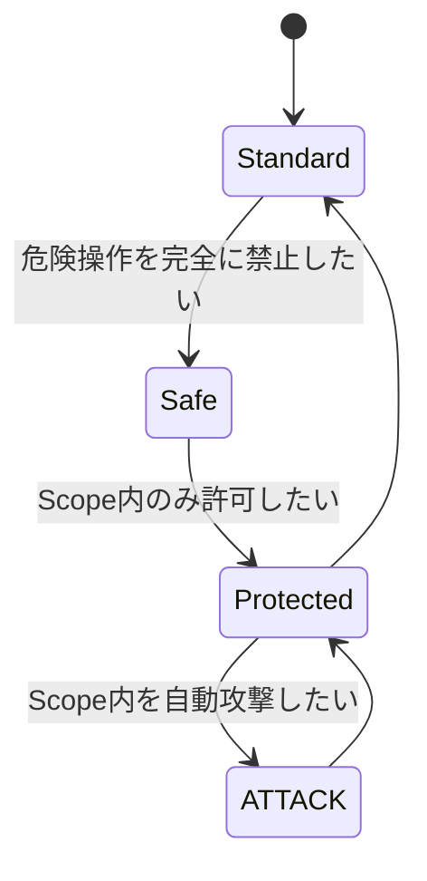
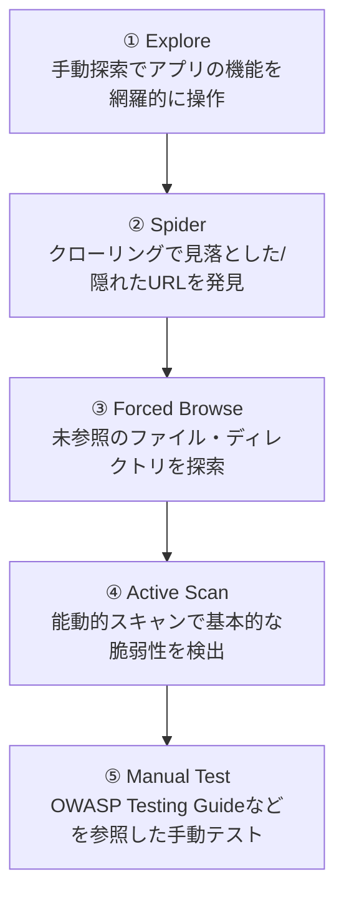
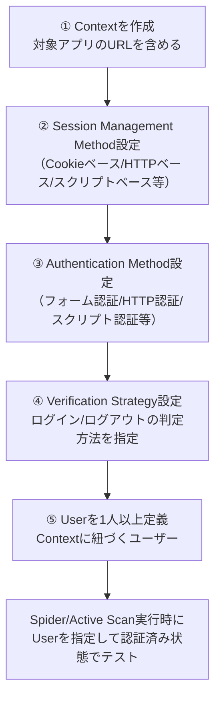
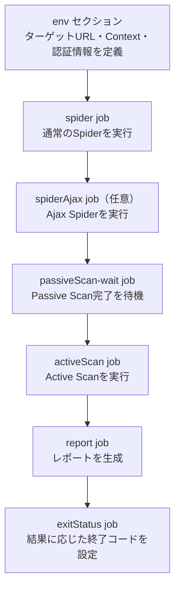
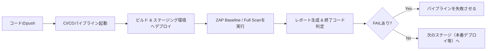

# OWASP ZAP 完全ガイド：初学者のための Web アプリケーションセキュリティテスト入門

> 本ガイドは [ZAP 公式ドキュメント (zaproxy.org/docs/)](https://www.zaproxy.org/docs/) および ZAP 公式サイト・GitHub リポジトリの一次情報をもとに、初学者が ZAP (Zed Attack Proxy) を体系的に学べるようステップバイステップでまとめたものです。各章末に参照した URL を明記しています。

---

## 目次

1. [はじめに：ZAP とは何か](#1-はじめにzap-とは何か)
2. [免責事項・法的な注意点](#2-免責事項法的な注意点)
3. [ZAP の主な特徴](#3-zap-の主な特徴)
4. [インストール方法](#4-インストール方法)
5. [全体アーキテクチャと基本用語](#5-全体アーキテクチャと基本用語)
6. [起動とプロキシ設定](#6-起動とプロキシ設定)
7. [Quick Start：最速でスキャンを試す](#7-quick-start最速でスキャンを試す)
8. [Sites Tree・Context・Scope・Mode](#8-sites-treecontextscopemode)
9. [手動探索 (Explore) と MITM プロキシ](#9-手動探索-explore-と-mitm-プロキシ)
10. [Spider（クローラー）](#10-spiderクローラー)
11. [Passive Scan（受動的スキャン）](#11-passive-scan受動的スキャン)
12. [Active Scan（能動的スキャン）](#12-active-scan能動的スキャン)
13. [基本的なペネトレーションテストの流れ](#13-基本的なペネトレーションテストの流れ)
14. [Alerts（検出結果）の見方](#14-alerts検出結果の見方)
15. [Authentication（認証）の設定](#15-authentication認証の設定)
16. [Scan Policy（スキャンポリシー）](#16-scan-policyスキャンポリシー)
17. [HUD（Heads Up Display）](#17-hudheads-up-display)
18. [レポートの生成](#18-レポートの生成)
19. [ZAP API](#19-zap-api)
20. [Automation Framework（自動化）](#20-automation-framework自動化)
21. [Docker と CI/CD 連携](#21-docker-と-cicd-連携)
22. [スクリプティングと拡張（Add-ons / Script Console）](#22-スクリプティングと拡張add-ons--script-console)
23. [よくあるトラブルと対処法](#23-よくあるトラブルと対処法)
24. [ベストプラクティスまとめ](#24-ベストプラクティスまとめ)
25. [学習リソース・参考 URL 一覧](#25-学習リソース参考-url-一覧)

---

## 1. はじめに：ZAP とは何か

**ZAP（Zed Attack Proxy）** は、Web アプリケーションの脆弱性を発見するための無料・オープンソースのセキュリティテストツールです。もともと OWASP（Open Web Application Security Project）のフラッグシッププロジェクトとして開発され、現在は Checkmarx 社がスポンサーとなり「**ZAP by Checkmarx**」としてコミュニティ主導で開発が続けられています。GitHub 上でも Top 1000 に入る規模のプロジェクトです。

ZAP は DAST（Dynamic Application Security Testing：動的アプリケーションセキュリティテスト）ツールに分類され、実際に動作している Web アプリケーションに対してリクエストを送信し、レスポンスを解析することで脆弱性を検出します。ソースコードを解析する SAST（静的解析）とは異なり、実際の通信を観察・操作する点が特徴です。

ZAP はセキュリティ専門家でなくても扱いやすいように設計されており、開発者や QA エンジニアが CI/CD パイプラインに組み込んで日常的にセキュリティテストを行うことも、経験豊富なペネトレーションテスターが手動テストのために使うことも、どちらの用途にも対応できます。

**参考:**
- [ZAP 公式サイト](https://www.zaproxy.org/)
- [ZAP Desktop User Guide - Introduction](https://www.zaproxy.org/docs/desktop/)
- [GitHub - zaproxy/zaproxy](https://github.com/zaproxy/zaproxy)
- [Checkmarx ZAP 製品ページ](https://checkmarx.com/product/zap/)

---

## 2. 免責事項・法的な注意点

ZAP の学習・利用を始める前に、必ず理解しておくべき重要な注意点があります。

> **多くの法域において、許可を得ずに Web サイト／アプリケーションを「テスト」することは違法です。**

ZAP は強力な攻撃機能（SQL インジェクション、XSS などのペイロード送信）を含むため、**自分が所有する環境**または**明示的にテスト許可を得た環境**に対してのみ使用してください。学習用途では、後述する意図的に脆弱性を含んだ公開テスト環境（OWASP Juice Shop、Google Firing Range など）の利用を推奨します。

| 用途 | 対象 |
|---|---|
| 学習・練習 | OWASP Juice Shop、Google Firing Range、bodgeit などの意図的脆弱アプリ |
| 業務利用 | 自社が管理する環境、書面で許可を得たステージング/本番環境 |
| 禁止 | 許可のない第三者サイトへのスキャン・攻撃 |

**参考:**
- [ZAP API Reference - Introduction（法的注意の記載）](https://www.zaproxy.org/docs/api/)
- [OWASP Testing Guide](https://www.owasp.org/wstg)

---

## 3. ZAP の主な特徴

| 機能カテゴリ | 概要 |
|---|---|
| Manipulator-in-the-middle Proxy | ブラウザと対象アプリの通信を中継し、リクエスト/レスポンスを観察・改ざんできる |
| Spider / Ajax Spider | サイト内のリンクを自動でたどり、URL を網羅的に発見する（Ajax Spider は JavaScript で動的生成されるリンクにも対応） |
| Passive Scan | 通過したトラフィックを受動的に解析し、攻撃を送らずに検出できる問題（Cookie 属性、セキュリティヘッダー不備など）を報告 |
| Active Scan | 既知の攻撃パターン（ペイロード）を実際に送信し、SQL インジェクションや XSS などを能動的に検出 |
| Automation Framework | YAML ファイル 1 つで一連のテストを定義・自動実行できる仕組み |
| REST API | ほぼすべての機能を HTTP API 経由で操作可能。CI/CD やカスタムスクリプトとの連携に使う |
| HUD（Heads Up Display） | ブラウザ上に ZAP の機能をオーバーレイ表示するインターフェース |
| Docker イメージ / GitHub Actions | `zap-baseline.py`、`zap-full-scan.py` などのパッケージスキャンと、そのラッパーとなる GitHub Actions を提供 |
| Add-on Marketplace | 数十種類の追加機能（レポート生成、認証補助、GraphQL/SOAP/OpenAPI 対応など）を追加インストール可能 |
| スクリプティング | JavaScript（GraalVM）、Python（Jython）、Ruby、Groovy、Kotlin など複数言語でスキャンや認証をカスタマイズ可能 |

**参考:**
- [ZAP – Features 一覧](https://www.zaproxy.org/docs/desktop/start/features/)
- [ZAP – Add-ons 一覧](https://www.zaproxy.org/docs/desktop/addons/)
- [ZAP – Automate ZAP](https://www.zaproxy.org/docs/automate/)

---

## 4. インストール方法

ZAP は Windows・macOS・Linux・Docker など幅広い環境に対応しています。**Java 17 以上**が必要です（クロスプラットフォーム版・Linux 版の場合。Windows/macOS のインストーラー版は Java 込みの場合もあります）。

### 4.1 インストール方法一覧

| プラットフォーム | 主な方法 |
|---|---|
| Windows | 公式インストーラー（.exe）／ Windows Package Manager (`winget`) ／ Scoop ／ Chocolatey |
| macOS | 公式インストーラー（.dmg、Apple Silicon / Intel 別配布） |
| Linux | 公式インストーラー ／ Flathub (`flatpak install flathub org.zaproxy.ZAP`) ／ Snapcraft |
| FreeBSD | `zaproxy` パッケージ |
| クロスプラットフォーム | ZIP 版（インストーラー不要、Java 17+ が別途必要） |
| コンテナ | Docker（`ghcr.io/zaproxy/zaproxy:stable` など） |

### 4.2 リリースチャンネル

| チャンネル | 更新頻度 | 用途 |
|---|---|---|
| Stable（安定版） | フルリリースごと（+ 月1回の base image 更新） | 通常利用・本番導入 |
| Weekly（週次版） | 毎週月曜 | 最新機能を試したい開発者向け |
| Nightly（夜間版） | 少なくとも1日1回 | 最新コミットを追う場合 |

> 2026 年 7 月時点の最新安定版は **ZAP 2.17.0** です（バージョンは今後も更新されるため、実際にインストールする際は公式ダウンロードページで最新版を確認してください）。

### 4.3 Docker での起動例

```bash
# stable イメージを取得
docker pull ghcr.io/zaproxy/zaproxy:stable

# デスクトップUIなしでAPIサーバーとして起動（daemonモード）
docker run -u zap -p 8080:8080 -i ghcr.io/zaproxy/zaproxy:stable zap.sh \
  -daemon -host 0.0.0.0 -port 8080 \
  -config api.addrs.addr.name=.* -config api.addrs.addr.regex=true
```

**参考:**
- [ZAP – Download](https://www.zaproxy.org/download/)
- [ZAP – ZAP Docker User Guide](https://www.zaproxy.org/docs/docker/about/)
- [GitHub - zaproxy/zaproxy Releases](https://github.com/zaproxy/zaproxy/releases)

---

## 5. 全体アーキテクチャと基本用語

ZAP の核心は「**manipulator-in-the-middle proxy**」（ZAP 公式が用いる呼称。いわゆる中間者プロキシ）であるという点です。ブラウザや自動テストツールの通信を ZAP 経由にすることで、すべてのリクエスト・レスポンスを観察・記録・改変できます。



### 5.1 基本用語まとめ

| 用語 | 説明 |
|---|---|
| Sites Tree | アクセスしたすべての URL をツリー構造で表示するパネル |
| History | 送受信されたすべてのリクエスト/レスポンスの一覧 |
| Context | テスト対象の URL 群を関連付ける論理的なグループ（後述） |
| Scope | 現在テスト対象としている URL の集合（Context をスコープに追加して定義） |
| Mode | ZAP の動作制限レベル（Safe / Protected / Standard / ATTACK） |
| Alert | ZAP が検出した問題（脆弱性の可能性がある事象） |
| Session | 現在の ZAP の作業状態（Sites Tree、Alerts、設定などを含む）。ファイルとして保存・再読み込み可能 |

**参考:**
- [ZAP – Manipulator-in-the-middle Proxy](https://www.zaproxy.org/docs/desktop/start/features/intercept/)
- [ZAP – Sites Tree](https://www.zaproxy.org/docs/desktop/start/features/sitestree/)
- [ZAP – Sites tab (UI)](https://www.zaproxy.org/docs/desktop/ui/tabs/sites/)

---

## 6. 起動とプロキシ設定

ZAP を最大限活用するには、ブラウザ（または自動テストツール）の通信を ZAP 経由にする必要があります。

### 6.1 手順

1. ZAP を起動する。
2. ZAP の Local Proxy の待受アドレス・ポート（デフォルトは `localhost:8080`）を確認する（Tools > Options > Local Servers/Proxies）。
3. ブラウザのプロキシ設定を ZAP のアドレス・ポートに設定する。
4. ブラウザから対象アプリケーションへアクセスしてみる。
5. ZAP の **Sites** タブ・**History** タブに通信が記録されれば成功。

Quick Start タブの「**Manual Explore**」機能を使うと、ZAP 用に事前設定されたブラウザプロファイルをワンクリックで起動できるため、既存のブラウザ設定を変更したくない場合に便利です。

### 6.2 HTTPS 通信を見るために

HTTPS の内容まで解析するには、ZAP が生成する **Root CA 証明書** をブラウザ／OS の信頼済みルート証明書としてインストールする必要があります（Tools > Options > Dynamic SSL Certificates からエクスポート可能）。

**参考:**
- [ZAP – Getting Started](https://www.zaproxy.org/docs/desktop/start/)
- [ZAP – Configuring Proxies](https://www.zaproxy.org/docs/desktop/start/proxies/)
- [ZAP – Dynamic SSL Certificates](https://www.zaproxy.org/docs/desktop/ui/dialogs/options/dynsslcert/)

---

## 7. Quick Start：最速でスキャンを試す

**Quick Start** アドオンはデフォルトでインストールされており、初学者が最も簡単に ZAP を使い始められる入口です。

Quick Start タブには主に次の機能があります。

| 機能 | 内容 |
|---|---|
| Automated Scan | URL を 1 つ入力するだけで、Spider（通常 or Ajax）→ Active Scan を自動的に実行 |
| Manual Explore | ZAP 経由でプロキシ設定済みのブラウザを起動し、HUD を有効にするかどうかも選択できる |
| Learn More | ローカル／オンラインの学習リソースへのリンク集 |

### 7.1 Automated Scan を試す

1. Quick Start タブを開く。
2. 「URL to attack」に対象 URL（例：学習用アプリの URL）を入力する。
3. 「Attack」ボタンをクリックする。
4. Spider が URL を収集し、続けて Active Scan が自動実行される。
5. 完了後、下部の Alerts タブに検出結果が一覧表示される。

> **注意**: Automated Scan は Active Scan（実際の攻撃ペイロード送信）まで自動実行するため、許可のない対象や本番環境には絶対に使用しないでください。

**参考:**
- [ZAP – Quick Start Add-on](https://www.zaproxy.org/docs/desktop/addons/quick-start/)
- [ZAP – Quick Start Command Line](https://www.zaproxy.org/docs/desktop/addons/quick-start/cmdline/)

---

## 8. Sites Tree・Context・Scope・Mode

初学者がつまずきやすい 4 つの概念を整理します。

### 8.1 Context（コンテキスト）

Context は、一連の URL をひとつのまとまり（＝ひとつの Web アプリケーション）として関連付ける仕組みです。Context は **正規表現（regex）** で定義され、その正規表現は URL 全体にマッチする必要があります。複数の Web アプリをテストするシステムでは、アプリごとに Context を分けて定義することが推奨されています。

Context には以下のような付随情報を関連付けられます。

- 認証方式（Authentication Method）
- セッション管理方式（Session Management Method）
- ユーザー定義（Users）
- 除外 URL、構造修飾子（Structural Modifiers）など

### 8.2 Scope（スコープ）

Scope は「現在テスト対象としている URL の集合」であり、Context をスコープに追加することで定義されます。デフォルトでは何もスコープに入っていません。Scope は以下に影響します。

- Protected Mode で「危険な操作」を実行できる対象
- History タブなどでの表示フィルタ

### 8.3 Mode（モード）

| Mode | 説明 |
|---|---|
| Safe | 危険な操作を一切許可しない |
| Protected | Scope 内の URL に対してのみ危険な操作を許可 |
| Standard | 制限なし（デフォルト） |
| ATTACK | Scope 内で新しく発見されたノードを自動的に Active Scan する |



初学者は、意図しない対象を誤って攻撃しないよう **Protected Mode** の利用が推奨されています。

**参考:**
- [ZAP – Contexts](https://www.zaproxy.org/docs/desktop/start/features/contexts/)
- [ZAP – Scope](https://www.zaproxy.org/docs/desktop/start/features/scope/)
- [ZAP – Modes](https://www.zaproxy.org/docs/desktop/start/features/modes/)
- [ZAP – Session Context screens](https://www.zaproxy.org/docs/desktop/ui/dialogs/session/contexts/)

---

## 9. 手動探索 (Explore) と MITM プロキシ

自動化されたスキャンだけでは、フォーム入力やログイン後の画面など、実際にユーザーが操作しないと到達できないページを見逃すことがあります。そのため ZAP を使ったテストの最初のステップとして「**手動探索（Explore）**」が推奨されます。

### 9.1 手動探索の考え方

1. ZAP 経由でプロキシ設定したブラウザで対象アプリを開く。
2. すべてのリンクをクリックし、すべてのボタンを押し、すべてのフォームに入力・送信する。
3. アプリが複数のロール（一般ユーザー・管理者など）を持つ場合は、ロールごとに別セッションで探索する。
4. これにより Sites Tree・History に多くの URL とリクエストパターンが記録され、後続の Spider・Active Scan の精度が上がる。

### 9.2 Breakpoints（ブレークポイント）

リクエストやレスポンスをその場で書き換えてテストしたい場合は、**Breakpoints** 機能を使います。特定の条件に一致した通信を一時停止し、内容を編集してから送信できます。

**参考:**
- [ZAP – A Basic Penetration Test](https://www.zaproxy.org/docs/desktop/start/pentest/)
- [ZAP – Breakpoints](https://www.zaproxy.org/docs/desktop/start/features/breakpoints/)
- [ZAP – Manipulator-in-the-middle Proxy](https://www.zaproxy.org/docs/desktop/start/features/intercept/)

---

## 10. Spider（クローラー）

**Spider** は、対象アプリケーション内のリンクを自動的にたどり、URL を網羅的に発見する機能です。HTML の `<a>` タグや `<form>` タグなどを解析してリンクを収集します。

### 10.1 通常の Spider と Ajax Spider の違い

| 項目 | Spider（通常） | Ajax Spider |
|---|---|---|
| 解析対象 | 静的 HTML のリンク・フォーム | JavaScript によって動的生成される DOM / リンク |
| 動作方式 | HTTP リクエストを直接解析 | 実ブラウザ（Selenium 経由）でページを描画してリンクを収集 |
| 速度 | 高速 | 低速（実ブラウザ起動のため） |
| 向いているアプリ | 従来型の MPA（マルチページアプリ） | SPA（React/Vue などの JavaScript フレームワーク使用アプリ） |

両方を組み合わせて使うことで、より網羅的な URL 収集が可能になります。

### 10.2 使い方

1. Sites タブで対象ノードを右クリック → 「Attack」→「Spider…」を選択。
2. Spider dialog でスコープや最大深度、Context/User などを設定。
3. 「Start Scan」で実行。
4. Spider タブで進捗と発見された URL のリストを確認。

**参考:**
- [ZAP – Spider (Feature)](https://www.zaproxy.org/docs/desktop/start/features/spider/)
- [ZAP – Spider Add-on](https://www.zaproxy.org/docs/desktop/addons/spider/)
- [ZAP – AJAX Spider Add-on](https://www.zaproxy.org/docs/desktop/addons/ajax-spider/)
- [ZAP – Spider dialog](https://www.zaproxy.org/docs/desktop/ui/dialogs/spider/)

---

## 11. Passive Scan（受動的スキャン）

**Passive Scan（受動的スキャン）** は、ZAP を通過したすべてのトラフィックをバックグラウンドで解析し、**攻撃ペイロードを一切送信せずに**検出できる問題を報告する機能です。ZAP を起動してブラウザ経由でアクセスするだけで、常にバックグラウンドで動作しています。

### 11.1 Passive Scan で検出できる代表例

- セキュリティ関連 HTTP ヘッダーの欠落（`X-Content-Type-Options`、`Content-Security-Policy` など）
- Cookie の `Secure` / `HttpOnly` 属性の欠落
- ソースコード内のコメントに含まれる機密情報の可能性
- 脆弱なバージョンの JavaScript ライブラリ（Retire.js アドオンとの連携）
- サーバーのバージョン情報の露出

Passive Scan は安全なため、本番環境に対しても実行可能です（Active Scan とは異なり攻撃を行わないため）。

**参考:**
- [ZAP – Passive Scan (Feature)](https://www.zaproxy.org/docs/desktop/start/features/pscan/)
- [ZAP – Passive Scanner Add-on](https://www.zaproxy.org/docs/desktop/addons/passive-scanner/)
- [ZAP – Passive Scan Rules](https://www.zaproxy.org/docs/desktop/addons/passive-scan-rules/)

---

## 12. Active Scan（能動的スキャン）

**Active Scan（能動的スキャン）** は、既知の攻撃パターン（ペイロード）を対象アプリケーションに実際に送信し、その応答から脆弱性の有無を判定する機能です。SQL インジェクション、Cross-Site Scripting（XSS）、コマンドインジェクションなどを検出できます。

> **重要**: Active Scan は実際に攻撃を行うため、**必ず許可を得た対象・テスト環境**に対してのみ実行してください。データの破損や意図しない副作用（メール送信、レコード削除など）が発生する可能性があります。

### 12.1 実行の流れ

1. Spider などで URL を十分に収集しておく（Active Scan は「発見済みの URL」に対してのみ攻撃を行うため）。
2. Sites タブでノードを右クリック → 「Attack」→「Active Scan…」を選択。
3. Scan Policy（後述）を選択し、スキャン対象の入力ベクトル（クエリパラメータ、POST データ、Cookie、HTTP ヘッダーなど）を確認。
4. 「Start Scan」で実行。
5. Active Scan タブで進捗を確認し、完了後は Alerts タブで結果を確認。

### 12.2 Active Scan の入力ベクトル設定

デフォルトでは URL クエリパラメータと POST パラメータが対象ですが、Options > Active Scan Input Vectors 画面で Cookie やヘッダーもスキャン対象に含めるよう変更できます（誤検知や負荷増大とのトレードオフに注意）。

**参考:**
- [ZAP – Active Scan (Feature)](https://www.zaproxy.org/docs/desktop/start/features/ascan/)
- [ZAP – Active Scan Rules](https://www.zaproxy.org/docs/desktop/addons/active-scan-rules/)
- [ZAP – Active Scan dialog](https://www.zaproxy.org/docs/desktop/ui/dialogs/advascan/)
- [ZAP – Options Active Scan Input Vectors screen](https://www.zaproxy.org/docs/desktop/ui/dialogs/options/ascaninput/)

---

## 13. 基本的なペネトレーションテストの流れ

ZAP 公式ドキュメントでは、基本的なペネトレーションテストの流れを次の 5 ステップで説明しています。



| ステップ | 内容 |
|---|---|
| ① Explore | ブラウザでアプリのすべての機能・リンク・フォームを操作する。複数ロールがある場合はロールごとに実施 |
| ② Spider | Spider / Ajax Spider を使い、見逃した URL や動的生成リンクを発見する |
| ③ Forced Browse | 「Forced Browse」アドオンを使い、リンクされていないファイルやディレクトリ（バックアップファイルなど）を辞書ベースで探索する |
| ④ Active Scan | Active Scanner で基本的な脆弱性を検出する |
| ⑤ Manual Test | 自動化では見つからない論理的な脆弱性（認可不備など）を OWASP Testing Guide を参考に手動でテストする |

自動化された ①〜④ のステップだけでも基本的な脆弱性は発見できますが、認可制御の不備やビジネスロジックの欠陥など、**自動スキャンでは検出できない問題**を見つけるためには ⑤ の手動テストが不可欠です。

**参考:**
- [ZAP – A Basic Penetration Test](https://www.zaproxy.org/docs/desktop/start/pentest/)
- [ZAP – Forced Browse Add-on](https://www.zaproxy.org/docs/desktop/addons/forced-browse/)
- [OWASP Testing Guide](https://www.owasp.org/wstg)
- [ZAPping the OWASP Top 10](https://www.zaproxy.org/docs/) （OWASP Top 10 の各項目と ZAP 機能の対応表）

---

## 14. Alerts（検出結果）の見方

ZAP がスキャン中に検出した問題は **Alert（アラート）** として記録されます。Alerts タブでは、検出されたすべてのアラートがツリー形式で一覧表示されます。

### 14.1 Alert の主なフィールド

| フィールド | 内容 |
|---|---|
| Name | アラート名（例：「Cross Site Scripting (Reflected)」） |
| URL | 検出された URL（正規化された URL） |
| Risk（リスク） | 深刻度：Informational / Low / Medium / High |
| Confidence（確信度） | 検出結果の確からしさ：Low / Medium / High（人が手動で False Positive / Confirmed に変更可能） |
| Parameter | 攻撃対象となったパラメータ名 |
| Description | 問題の詳細説明 |
| Solution | 一般的な対処方法（ソースコードを解析しているわけではないため一般論に留まる） |
| Reference | 詳細情報へのリンク |
| Tags | 関連タグ（CWE、OWASP Top 10 カテゴリなど） |

### 14.2 Risk × Confidence の考え方

| Risk \ Confidence | Low | Medium | High |
|---|---|---|---|
| High | 要確認（誤検知の可能性あり） | 優先度高 | 最優先で対応 |
| Medium | 参考情報として確認 | 通常の優先度 | 優先的に確認 |
| Low | 参考情報 | 参考情報 | 低リスクだが確実 |
| Informational | 情報提供のみ | 情報提供のみ | 情報提供のみ |

ZAP が検出する全アラートの一覧は公式サイトに常時公開されています。個々のアラートには固有の Alert Reference（ID）があり、静的なページ URL が割り当てられています。

**参考:**
- [ZAP – Alerts (Feature)](https://www.zaproxy.org/docs/desktop/start/features/alerts/)
- [ZAP – 全アラート一覧](https://www.zaproxy.org/docs/alerts/)
- [ZAP – Alert Tags 一覧](https://www.zaproxy.org/alerttags/)
- [ZAP – Alerts tab (UI)](https://www.zaproxy.org/docs/desktop/ui/tabs/alerts/)
- [ZAP – Add Alert dialog](https://www.zaproxy.org/docs/desktop/ui/dialogs/addalert/)

---

## 15. Authentication（認証）の設定

ログインが必要なアプリケーションを効果的にテストするには、ZAP に認証情報を設定する必要があります。設定の全体フローは次の通りです。



### 15.1 各ステップの概要

| ステップ | 内容 |
|---|---|
| Context 作成 | テスト対象アプリの URL をすべて含む Context を用意する |
| Session Management Method | アプリが使用しているセッション管理方式（Cookie ベース、HTTP 認証ベース、スクリプトベースなど）に合わせて設定 |
| Authentication Method | フォームベース認証、HTTP/NTLM 認証、JSON ベース認証、スクリプトベース認証、ブラウザベース認証（Selenium 経由で実際にログイン画面を操作）など、アプリに合った方式を選択 |
| Verification Strategy | ZAP が「ログイン済みか」を判定する方法。ログイン成功時に表示される文字列（Logged-in Indicator）やログアウト時の文字列（Logged-out Indicator）、または特定 URL へのポーリングなどで判定する |
| Users | Context に紐づくユーザー（ユーザー名・パスワードなど）を 1 人以上定義する |

### 15.2 実践的な設定手順（フォームベース認証の例）

1. ブラウザを ZAP 経由でプロキシ設定し、対象アプリにログインする。
2. History タブでログイン時の POST リクエストを見つけ、右クリック →「Flag as Context」→「Default Context: Form-based Login Request」を選択。
3. 開いたダイアログでユーザー名・パスワードに対応するパラメータを指定する。
4. ログイン後の画面から、ログイン中であることを示す要素（例：「ログアウト」リンクやユーザー名表示）を選択し、右クリックして「Flag as Context」→「Authentication Logged-in Indicator」を指定する。
5. Session Properties > Users で実際のユーザー（ID/パスワード）を登録する。
6. 以降、Spider や Active Scan のダイアログでこの User を選択すれば、認証済み状態でスキャンできる。

### 15.3 Forced User Mode との違い

「Forced User Mode」はツールバーのボタンで有効化でき、ZAP を通過するすべての通信を指定ユーザーの視点として扱う機能です。**あくまで手動テスト用**であり、自動化（Automation Framework や API 経由のスクリプト）では、より確実な代替手段（Context の認証設定＋ User 指定）を使うことが推奨されています。

**参考:**
- [ZAP – Authentication (Feature)](https://www.zaproxy.org/docs/desktop/start/features/authentication/)
- [ZAP – Authentication Methods](https://www.zaproxy.org/docs/desktop/start/features/authmethods/)
- [ZAP – Authentication Verification Strategies](https://www.zaproxy.org/docs/desktop/start/features/authstrategies/)
- [ZAP – Users (Feature)](https://www.zaproxy.org/docs/desktop/start/features/users/)
- [ZAP – Authentication Helper Add-on](https://www.zaproxy.org/docs/desktop/addons/authentication-helper/)
- [ZAP – Session Context Authentication screen](https://www.zaproxy.org/docs/desktop/ui/dialogs/session/context-auth/)
- [ZAP API Reference – Getting Authenticated（BodgeIt を使った実践例）](https://www.zaproxy.org/docs/api/)

---

## 16. Scan Policy（スキャンポリシー）

**Scan Policy** は、Active Scan がどの検査ルールをどの強度（Attack Strength）・しきい値（Alert Threshold）で実行するかを定義する設定セットです。用途に応じてあらかじめ複数のポリシーが用意されています。

| ポリシー名 | 想定用途 |
|---|---|
| Default Policy | 汎用的なデフォルト設定 |
| API Policy | API（REST/GraphQL/SOAP 等）向けに調整された設定 |
| Developer Standard / Full / CI-CD Policy | 開発者が開発中に使うことを想定した設定（CI/CD 版は高速・軽量） |
| QA Standard / Full / CI-CD Policy | QA エンジニアが機能テストと合わせて使うことを想定した設定 |
| Penetration Tester Policy | 経験豊富なペンテスターが徹底的に検査するための設定 |

CI/CD パイプラインに組み込む場合は、実行時間を抑えられる **CI/CD 系ポリシー**を選ぶことが一般的です。独自のポリシーを作成し、特定のルールだけを有効化・強度調整することもできます。

**参考:**
- [ZAP – Scan Policy (Feature)](https://www.zaproxy.org/docs/desktop/start/features/scanpolicy/)
- [ZAP – Scan Policies Add-on](https://www.zaproxy.org/docs/desktop/addons/scan-policies/)
- [ZAP – Scan Policy Manager dialog](https://www.zaproxy.org/docs/desktop/ui/dialogs/scanpolicymgr/)

---

## 17. HUD（Heads Up Display）

**HUD** は、ZAP の主要機能をブラウザ上にオーバーレイ表示するインターフェースで、対象アプリの画面を見ながら ZAP のツールやアラートを直接操作できるユニークな仕組みです。特に Web セキュリティ初学者にとって、デスクトップ UI とブラウザを行き来せずに済む点がメリットとして紹介されてきました。

> **重要な留意点**: 2026 年時点で、HUD は**開発が活発ではなくなっており、デフォルトで無効化**されています。ブラウザのセキュリティ機能の変更に伴い動作が不安定になることがあるため、公式もメンテナンス協力者を募集している状況です。利用する場合は、この点を理解した上で試験的な機能として扱うことを推奨します。

HUD を有効化する場合は、Quick Start タブの「Manual Explore」から HUD 対応ブラウザ（Firefox/Chrome）を起動するか、Options 画面から手動で有効化します。

**参考:**
- [ZAP – The HUD Add-on](https://www.zaproxy.org/docs/desktop/addons/hud/)
- [GitHub - zaproxy/zap-hud（現状の開発状況の記載）](https://github.com/zaproxy/zap-hud)
- [ZAP HUD Changelog](https://www.zaproxy.org/docs/addons/hud/changelog/)
- [ZAP – Options HUD screen](https://www.zaproxy.org/docs/desktop/addons/hud/options/)

---

## 18. レポートの生成

スキャンが完了したら、結果を関係者に共有するためのレポートを生成します。ZAP は「Report Generation」アドオンにより多様な形式のレポートテンプレートを標準搭載しています。

### 18.1 主なレポートテンプレート

| テンプレート | 形式 | 特徴 |
|---|---|---|
| Modern HTML Report | HTML | テーマ・オプションを選べる現行の標準的な HTML レポート |
| Traditional HTML（+ Requests/Responses） | HTML | 従来型の HTML レポート。リクエスト/レスポンス全文を含むバリエーションあり |
| Risk and Confidence HTML | HTML | Risk × Confidence のマトリクスに主眼を置いたレポート |
| Traditional XML（+ Requests/Responses） | XML | 他システムとの連携用 |
| Traditional JSON（+ Requests/Responses） | JSON | 他システムとの連携・自動処理用 |
| Traditional Markdown Report | Markdown | Wiki やドキュメントへの貼り付けに便利 |
| Traditional PDF | PDF | そのまま配布可能な形式 |
| SARIF JSON Report | JSON（SARIF形式） | GitHub Code Scanning など SARIF 対応ツールとの連携用 |

### 18.2 生成方法

- **デスクトップ UI**: Report メニュー →「Generate Report...」から対象 Context/Site、Risk/Confidence のフィルタ、テンプレートを選択して生成。
- **API 経由**: `core` や `reports` API を呼び出してプログラム的に生成（後述の Automation Framework の `report` ジョブでも生成可能）。

**参考:**
- [ZAP – Report Generation Add-on](https://www.zaproxy.org/docs/desktop/addons/report-generation/)
- [ZAP – Creating Reports](https://www.zaproxy.org/docs/desktop/addons/report-generation/create/)
- [ZAP – Report Templates 一覧](https://www.zaproxy.org/docs/desktop/addons/report-generation/templates/)
- [ZAP – SARIF JSON Report](https://www.zaproxy.org/docs/desktop/addons/report-generation/report-sarif-json/)
- [ZAP – Report Generation API](https://www.zaproxy.org/docs/desktop/addons/report-generation/api/)

---

## 19. ZAP API

ZAP のほぼすべての機能は **REST API** 経由で操作できます。デスクトップモード・Daemon モードいずれでもデフォルトで有効です。

### 19.1 API の基本

- レスポンス形式は **JSON / XML / HTML / OTHER** から選択可能。
- URL 例：`http://localhost:8080/JSON/core/view/version/`（`view` = 情報取得、`action` = 操作実行、`other` = ファイル転送等）
- ブラウザから `http://zap/`（ZAP 経由でプロキシ中）または `http://localhost:8080/` にアクセスすると、API を試せる簡易 Web UI が使える。
- 悪意あるサイトから ZAP API へアクセスされることを防ぐため、**API キー**の設定が強く推奨されている（隔離環境を除く）。

### 19.2 クライアントライブラリ

Java、Python、Node.js 用の公式クライアントライブラリが提供されており、直接 HTTP リクエストを組み立てなくても API を呼び出せます。

### 19.3 API 呼び出し例（Python, `zaproxy` パッケージ）

```python
from zapv2 import ZAPv2

zap = ZAPv2(apikey='your-api-key',
            proxies={'http': 'http://localhost:8080', 'https': 'http://localhost:8080'})

target = 'https://your-test-target.example.com'

# Spiderを開始
scan_id = zap.spider.scan(target)
while int(zap.spider.status(scan_id)) < 100:
    print(f'Spider progress: {zap.spider.status(scan_id)}%')

# Passive Scanの完了を待つ
while int(zap.pscan.records_to_scan) > 0:
    pass

# Active Scanを開始
ascan_id = zap.ascan.scan(target)
while int(zap.ascan.status(ascan_id)) < 100:
    print(f'Active Scan progress: {zap.ascan.status(ascan_id)}%')

# 結果を取得
alerts = zap.core.alerts(baseurl=target)
print(f'検出されたアラート数: {len(alerts)}')
```

**参考:**
- [ZAP – API (Feature)](https://www.zaproxy.org/docs/desktop/start/features/api/)
- [ZAP API Reference](https://www.zaproxy.org/docs/api/)
- [ZAP – Options API screen](https://www.zaproxy.org/docs/desktop/ui/dialogs/options/api/)
- [GitHub - zaproxy/zap-api-docs](https://github.com/zaproxy/zap-api-docs)

---

## 20. Automation Framework（自動化）

**Automation Framework** は、ZAP を 1 つの YAML ファイルで制御できる公式の自動化の仕組みです。特定のコンテナ技術に縛られず柔軟性が高いため、非自明な（＝単純な baseline/full scan では足りない）自動化には Automation Framework の利用が推奨されています。

### 20.1 実行の流れ（イメージ）



> ジョブは YAML ファイルに記述した**上から下の順**で実行されます。例えば `passiveScan-wait` は Spider/Import より前に置いても意味がありません。

### 20.2 YAML の基本構造の例

```yaml
env:
  contexts:
    - name: "my-app"
      urls:
        - "https://your-test-target.example.com"
      includePaths:
        - "https://your-test-target.example.com/.*"
  parameters:
    failOnError: true
    failOnWarning: false
    progressToStdout: true

jobs:
  - type: spider
    parameters:
      context: "my-app"
      url: "https://your-test-target.example.com"
      maxDuration: 5

  - type: passiveScan-wait
    parameters:
      maxDuration: 5

  - type: activeScan
    parameters:
      context: "my-app"
      policy: "Default Policy"

  - type: report
    parameters:
      template: "modern"
      reportDir: "/zap/wrk"
      reportFile: "zap-report"
      reportTitle: "ZAP Scan Report"

  - type: exitStatus
    parameters:
      errorLevel: "High"
      warnLevel: "Medium"
```

### 20.3 実行方法

```bash
# デスクトップUIを表示せずに自動実行し、完了後に終了
./zap.sh -cmd -autorun zap.yaml
```

主な代表的ジョブには、`spider`（通常のクロール）、`spiderAjax`（Ajax Spider）、`passiveScan-config` / `passiveScan-wait`（受動スキャン設定・待機）、`activeScan` / `activeScan-config` / `activeScan-policy`（能動スキャン関連）、`openapi` / `soap` / `graphql`（各仕様のインポート）、`requestor`（任意のリクエスト送信）、`replacer`（文字列置換）、`delay`（待機）、`report`（レポート生成）、`exitStatus`（終了コード制御）などがあり、対応するアドオンによってジョブの種類は拡張されます。

**参考:**
- [ZAP – Automation Framework](https://www.zaproxy.org/docs/automate/automation-framework/)
- [ZAP – Automation Framework Add-on - About](https://www.zaproxy.org/docs/desktop/addons/automation-framework/about/)
- [ZAP – Automation Framework - Environment](https://www.zaproxy.org/docs/desktop/addons/automation-framework/environment/)
- [ZAP – Automation Framework - GUI](https://www.zaproxy.org/docs/desktop/addons/automation-framework/gui/)
- [ZAP – Automation Framework - activeScan Job](https://www.zaproxy.org/docs/desktop/addons/automation-framework/job-ascan/)
- [ZAP – Automation Framework - spider Job](https://www.zaproxy.org/docs/desktop/addons/automation-framework/job-spider/)
- [ZAP – Automation Framework - exitStatus Job](https://www.zaproxy.org/docs/desktop/addons/automation-framework/job-exitstatus/)
- [ZAP – Automation Framework - Job Tests](https://www.zaproxy.org/docs/desktop/addons/automation-framework/tests/)

---

## 21. Docker と CI/CD 連携

ZAP を CI/CD パイプラインで自動実行するための代表的な方法として、**パッケージスキャン（Docker スクリプト）**と、それをラップする **GitHub Actions** が提供されています。

### 21.1 パッケージスキャンの種類

| スクリプト | 内容 | 攻撃の有無 |
|---|---|---|
| `zap-baseline.py` | デフォルト 1 分間 Spider を実行し、Passive Scan の結果を待って報告。高速でCI向き | なし（受動的のみ） |
| `zap-full-scan.py` | Spider（時間制限なし）＋任意で Ajax Spider ＋ Active Scan を実行 | あり（能動的攻撃を実施） |
| `zap-api-scan.py` | OpenAPI/Swagger または GraphQL の定義から API を能動的にスキャン | あり |

いずれのスクリプトも Automation Framework へ移行が進められており、内部的に YAML プランを生成・実行する仕組みに統合されつつあります。

Baseline Scan / Full Scan は終了コードで結果を判定できます。

| 終了コード | 意味 |
|---|---|
| 0 | 成功（FAIL 該当なし） |
| 1 | 少なくとも 1 件の FAIL あり |
| 2 | WARN のみで FAIL なし |
| 3 | その他の失敗（スキャン自体の実行エラーなど） |

### 21.2 Docker での実行例（Baseline Scan）

```bash
docker run -v $(pwd):/zap/wrk/:rw -t ghcr.io/zaproxy/zaproxy:stable \
  zap-baseline.py -t https://your-test-target.example.com \
  -r baseline-report.html
```

### 21.3 GitHub Actions での実行例

```yaml
name: ZAP Baseline Scan
on: [push]

jobs:
  zap_scan:
    runs-on: ubuntu-latest
    name: Scan the web application
    steps:
      - name: Checkout
        uses: actions/checkout@v5

      - name: ZAP Scan
        uses: zaproxy/action-baseline@v0.15.0
        with:
          token: ${{ secrets.GITHUB_TOKEN }}
          docker_name: 'ghcr.io/zaproxy/zaproxy:stable'
          target: 'https://your-test-target.example.com'
          rules_file_name: '.zap/rules.tsv'
          cmd_options: '-a'
```

`zaproxy/action-baseline` は Baseline Scan をラップした公式 GitHub Action で、検出されたアラートを GitHub の Issue として自動的に作成・更新することもできます。ルールファイル（`rules.tsv`）を使えば、特定のルール ID を `IGNORE` に設定して誤検知を除外できます。

### 21.4 CI/CD パイプライン全体のイメージ



**参考:**
- [ZAP – ZAP Docker Documentation](https://www.zaproxy.org/docs/docker/)
- [ZAP – ZAP Docker User Guide](https://www.zaproxy.org/docs/docker/about/)
- [ZAP – Baseline Scan](https://www.zaproxy.org/docs/docker/baseline-scan/)
- [ZAP – Full Scan](https://www.zaproxy.org/docs/docker/full-scan/)
- [GitHub - zaproxy/action-baseline](https://github.com/zaproxy/action-baseline)
- [GitHub Marketplace - ZAP Baseline Scan](https://github.com/marketplace/actions/zap-baseline-scan)
- [GitHub - zaproxy/zaproxy - docker/zap-baseline.py（ソースコード）](https://github.com/zaproxy/zaproxy/blob/main/docker/zap-baseline.py)
- [GitHub - zaproxy/zaproxy - docker/zap-full-scan.py（ソースコード）](https://github.com/zaproxy/zaproxy/blob/main/docker/zap-full-scan.py)

---

## 22. スクリプティングと拡張（Add-ons / Script Console）

### 22.1 Add-on（アドオン）と Marketplace

ZAP のコア機能はあえて最小限に保たれており、多くの追加機能は **Marketplace** から個別にインストールするアドオンとして提供されています。Access Control Testing、GraphQL Support、OpenAPI Support、SOAP Support、WebSockets、Retire.js（脆弱な JS ライブラリ検出）、Postman Support など、目的に応じて数十種類のアドオンが公開されています。

### 22.2 Script Console

**Script Console** アドオンを使うと、以下のような複数のスクリプト言語で ZAP の挙動をカスタマイズできます。

| 言語 | 用途例 |
|---|---|
| JavaScript（GraalVM JavaScript） | 標準で利用可能なスクリプト言語 |
| Python（Jython 経由） | Python に慣れたエンジニア向け |
| Ruby / Groovy / Kotlin | それぞれ追加アドオンとして提供 |

スクリプトは以下のような種類に分類され、それぞれ異なるタイミング・目的で実行されます。

- **Authentication Script**: カスタム認証フローの実装
- **Active/Passive Rule Script**: 独自の検査ロジックの追加
- **HTTP Sender Script**: すべての送受信メッセージに介入
- **Proxy Script**: プロキシ通過時の挙動をカスタマイズ
- **Standalone Script**: 単体で実行するユーティリティスクリプト

コミュニティが公開しているスクリプト集（Community Scripts アドオン）も利用可能です。

**参考:**
- [ZAP – Add-ons 一覧](https://www.zaproxy.org/docs/desktop/addons/)
- [ZAP – Marketplace (Feature)](https://www.zaproxy.org/docs/desktop/start/features/marketplace/)
- [ZAP – Script Console Add-on](https://www.zaproxy.org/docs/desktop/addons/script-console/)
- [ZAP – Scripts (Feature)](https://www.zaproxy.org/docs/desktop/start/features/scripts/)
- [ZAP – Community Scripts](https://www.zaproxy.org/docs/desktop/addons/community-scripts/)
- [GitHub - zaproxy/community-scripts](https://github.com/zaproxy/community-scripts)

---

## 23. よくあるトラブルと対処法

| 症状 | 主な原因 | 対処法 |
|---|---|---|
| ブラウザ経由の通信が Sites/History に表示されない | ブラウザまたは ZAP のプロキシ設定が誤っている、対象アプリが起動していない | ブラウザのプロキシ設定と ZAP の Local Proxy 設定（アドレス・ポート）を再確認する |
| HTTPS サイトで証明書エラーが出る | ZAP の Root CA 証明書がブラウザ/OS に信頼されていない | Options > Dynamic SSL Certificates から証明書を再エクスポートし、ブラウザに信頼済み証明書としてインポートする |
| Spider が「No seeds available」で失敗する | 対象 URL が Context に含まれていない、またはアクセスできない | Context の URL 設定を確認し、対象 URL に直接一度アクセスしてから再実行する |
| Docker コンテナから対象アプリ（別コンテナ/ホスト）に到達できない | Docker のネットワーク分離により、別コンテナ・`localhost` にアクセスできない | Docker ネットワーク（`--net` オプション）を作成し、ZAP コンテナと対象アプリコンテナを同じネットワークに参加させる |
| Ajax Spider が動かない（no_implementor error 等） | Ajax Spider アドオンや WebDriver アドオンが未インストール | Marketplace から AJAX Spider アドオンおよび対応する WebDriver アドオン（Windows/macOS/Linux 用）をインストールする |
| Active Scan の結果に誤検知（False Positive）が多い | スキャンポリシーの Alert Threshold が低すぎる、対象アプリ特有の応答パターンによる誤判定 | Scan Policy の Threshold/Strength を調整する、または個別アラートを右クリックして「Mark as False Positive」に設定する |
| CI 上で Baseline Scan がタイムアウトする | Spider の実行時間（デフォルト1分）や Passive Scan 待機時間が不足 | `-m`（分）オプションや `-T`（待機時間上限）オプションを調整する |
| ウイルス対策ソフトが ZAP のインストーラーを誤検知する | 署名なしバイナリであることに起因する既知の問題 | 公式ダウンロードページのチェックサムで検証し、必要に応じて例外設定する |

**参考:**
- [ZAP – Diagnosing Docker Problems](https://www.zaproxy.org/docs/docker/)
- [ZAP – Download（アンチウイルス誤検知に関する記載）](https://www.zaproxy.org/download/)
- [ZAP – FAQ](https://www.zaproxy.org/faq/)

---

## 24. ベストプラクティスまとめ

1. **必ず許可された対象のみをテストする。** 学習中は OWASP Juice Shop などの意図的脆弱アプリを使う。
2. **Protected Mode を基本とし、Scope を明確に設定する。** 誤って意図しない対象を攻撃するリスクを減らす。
3. **手動探索（Explore）を先に行ってから Spider/Active Scan を実行する。** 自動化だけでは到達できないページを減らす。
4. **Passive Scan の結果は本番環境でも比較的安全に活用できる。** 一方 Active Scan は必ずステージング環境以下で実施する。
5. **CI/CD には Automation Framework または Baseline/Full Scan の Docker/GitHub Actions を組み込む。** 継続的にセキュリティリグレッションを検知できる体制を作る。
6. **Alert の Risk と Confidence の両方を見て優先順位をつける。** High Risk かつ High Confidence のものから対応する。
7. **誤検知は個別に False Positive としてマークし、Alert Filter で自動化する。** レポートのノイズを減らす。
8. **APIキーを必ず設定する。** ZAP API が意図せず外部からアクセスされるリスクを避ける。
9. **自動スキャンだけに頼らず、OWASP Testing Guide に基づいた手動テストを組み合わせる。** 認可制御やビジネスロジックの脆弱性は自動検出が困難なため。

**参考:**
- [ZAP – A Basic Penetration Test](https://www.zaproxy.org/docs/desktop/start/pentest/)
- [ZAP – Alert Filters Add-on](https://www.zaproxy.org/docs/desktop/addons/alert-filters/)
- [OWASP Testing Guide](https://www.owasp.org/wstg)

---

## 25. 学習リソース・参考 URL 一覧

### 25.1 公式ドキュメント

| リソース | URL |
|---|---|
| ZAP 公式サイト | https://www.zaproxy.org/ |
| ドキュメントトップ | https://www.zaproxy.org/docs/ |
| Desktop User Guide | https://www.zaproxy.org/docs/desktop/ |
| Getting Started | https://www.zaproxy.org/docs/desktop/start/ |
| Features 一覧 | https://www.zaproxy.org/docs/desktop/start/features/ |
| Add-ons 一覧 | https://www.zaproxy.org/docs/desktop/addons/ |
| API リファレンス | https://www.zaproxy.org/docs/api/ |
| Automate ZAP | https://www.zaproxy.org/docs/automate/ |
| Automation Framework | https://www.zaproxy.org/docs/automate/automation-framework/ |
| Docker Documentation | https://www.zaproxy.org/docs/docker/ |
| 全アラート一覧 | https://www.zaproxy.org/docs/alerts/ |
| Alert Tags 一覧 | https://www.zaproxy.org/alerttags/ |
| ダウンロードページ | https://www.zaproxy.org/download/ |
| FAQ | https://www.zaproxy.org/faq/ |
| ロードマップ | https://www.zaproxy.org/docs/roadmap/ |
| ブログ | https://www.zaproxy.org/blog/ |
| 動画一覧（ZAP Chat 等） | https://www.zaproxy.org/videos/ |
| コミュニティ | https://www.zaproxy.org/community/ |

### 25.2 GitHub リポジトリ

| リポジトリ | URL |
|---|---|
| zaproxy/zaproxy（コア） | https://github.com/zaproxy/zaproxy |
| zaproxy/zap-extensions（アドオン） | https://github.com/zaproxy/zap-extensions |
| zaproxy/zap-hud（HUD） | https://github.com/zaproxy/zap-hud |
| zaproxy/community-scripts | https://github.com/zaproxy/community-scripts |
| zaproxy/zap-api-docs | https://github.com/zaproxy/zap-api-docs |
| zaproxy/action-baseline（GitHub Action） | https://github.com/zaproxy/action-baseline |
| zaproxy/zaproxy-website（サイトのソース） | https://github.com/zaproxy/zaproxy-website |
| GitHub Organization 全体 | https://github.com/zaproxy |

### 25.3 学習用の脆弱アプリケーション（許可なくインターネット上の他サイトを攻撃しないこと）

| アプリ | 用途 |
|---|---|
| OWASP Juice Shop | モダンな SPA 構成の意図的脆弱アプリ。認証テストの学習にも利用される |
| Google Firing Range | 各種 XSS パターンなどをテストするための公開テストターゲット |
| bodgeit | フォームベース認証のサンプルとして ZAP 公式ドキュメントでも使用される |

### 25.4 関連する外部標準・団体

| リソース | URL |
|---|---|
| OWASP Testing Guide | https://www.owasp.org/wstg |
| OWASP 本体 | https://owasp.org/ |
| Checkmarx（ZAP スポンサー企業） | https://checkmarx.com/product/zap/ |

---

## おわりに

本ガイドでは、ZAP のインストールから基本的な UI 操作、Spider・Passive Scan・Active Scan といったコア機能、Context・Scope・Authentication などのテスト対象定義、Automation Framework と Docker/CI・CD 連携による自動化、レポート生成、そしてトラブルシューティングまでを一通り解説しました。

ZAP は非常に守備範囲の広いツールであり、本ガイドで扱いきれなかったアドオン（GraphQL Support、OpenAPI Support、WebSockets、Access Control Testing など）も数多く存在します。次のステップとしては、実際に OWASP Juice Shop などの学習用アプリケーションに対して本ガイドの手順を一通り試し、その後は各章末の公式ドキュメントリンクから興味のある機能を深掘りしていくことをお勧めします。
