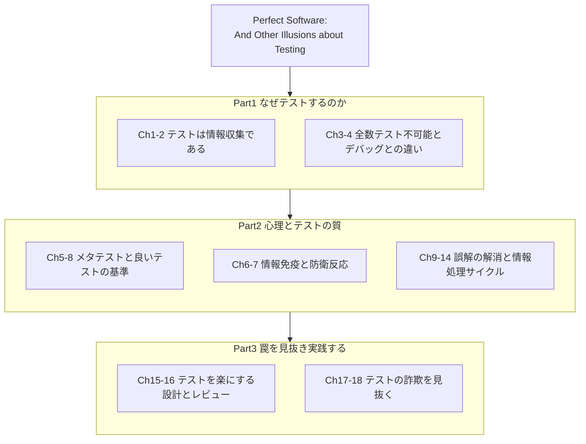
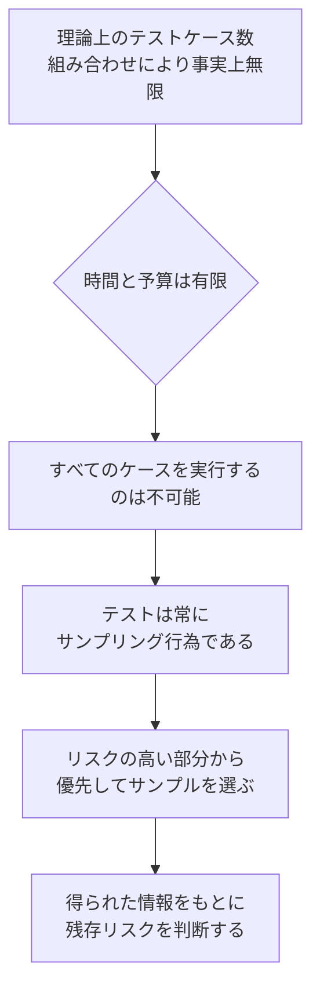
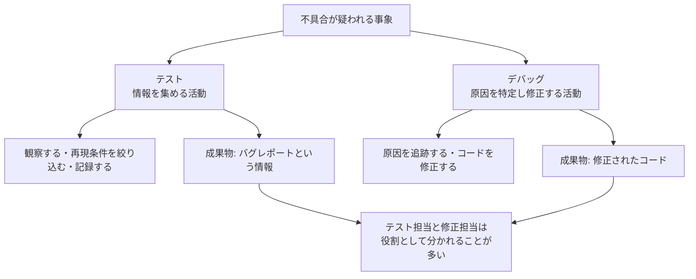
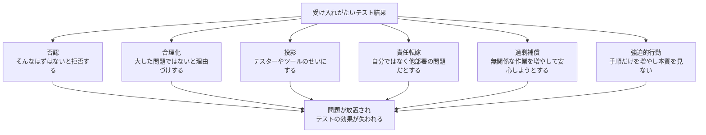
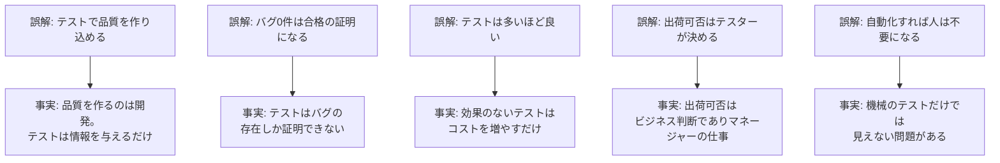
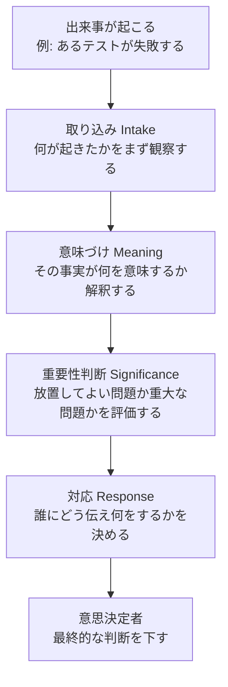
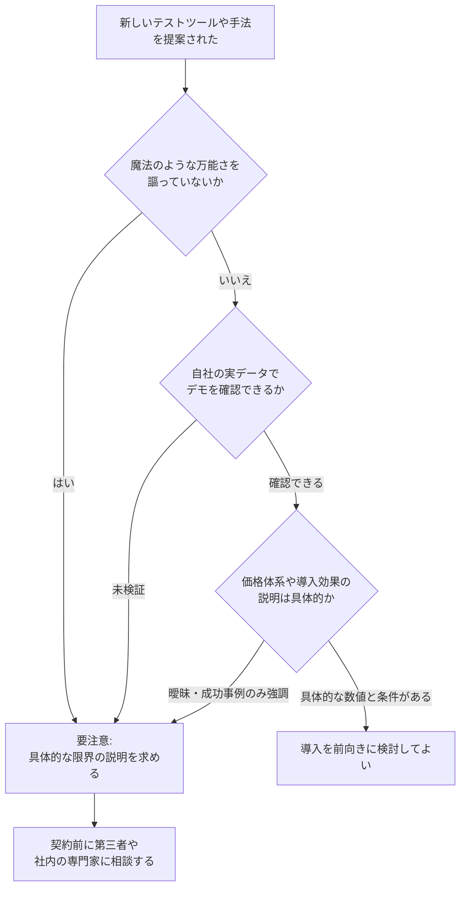
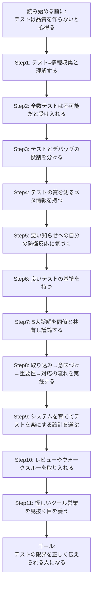

# 『Perfect Software: And Other Illusions about Testing』初学者ガイド

*ジェラルド・M・ワインバーグに学ぶ「テストの限界」と実践ベストプラクティス*

> 本ガイドは、ソフトウェアテストの古典 *Perfect Software: And Other Illusions about Testing*（Gerald M. Weinberg, Dorset House, 2008）を、テストを学び始めたばかりの方向けに、ステップ・バイ・ステップで解説するものです。ASCII アートは使用せず、図解はすべて Mermaid、表はすべて Markdown 記法で作成しています。巻末に、2026年9月時点でのウェブ調査に基づく参考ソース（著名な国際的テスト専門家の発言・記事を含む）を掲載しています。

---

## 目次

1. [この記事について / 対象読者](#この記事について--対象読者)
2. [書籍の基本情報](#書籍の基本情報)
3. [全体像を1枚で理解する: 本書の構成マップ](#全体像を1枚で理解する-本書の構成マップ)
4. [核心メッセージ: 「完璧なソフトウェア」という幻想](#核心メッセージ-完璧なソフトウェアという幻想)
5. [章立て一覧（全18章 + エピローグ）](#章立て一覧全18章--エピローグ)
6. [Step 1: テストとは「情報収集」であると理解する](#step-1-テストとは情報収集であると理解する)
7. [Step 2: なぜ全数テストは不可能なのかを受け入れる](#step-2-なぜ全数テストは不可能なのかを受け入れる)
8. [Step 3: テストとデバッグを混同しない](#step-3-テストとデバッグを混同しない)
9. [Step 4: テストの「質」を測るメタ情報を持つ](#step-4-テストの質を測るメタ情報を持つ)
10. [Step 5: 悪い知らせへの防衛反応（情報免疫）を認識する](#step-5-悪い知らせへの防衛反応情報免疫を認識する)
11. [Step 6: 「良いテスト」の基準を持つ](#step-6-良いテストの基準を持つ)
12. [Step 7: テストにまつわる5大誤解を手放す](#step-7-テストにまつわる5大誤解を手放す)
13. [Step 8: 情報が意思決定に至るまでの流れを意識する](#step-8-情報が意思決定に至るまでの流れを意識する)
14. [Step 9: システムを育てながらテストを楽にする](#step-9-システムを育てながらテストを楽にする)
15. [Step 10: 機械に頼らないテスト（レビュー・ウォークスルー）を活用する](#step-10-機械に頼らないテストレビューウォークスルーを活用する)
16. [Step 11: テストにまつわる「詐欺」を見抜く](#step-11-テストにまつわる詐欺を見抜く)
17. [初学者向け実践ロードマップ](#初学者向け実践ロードマップ)
18. [まとめ](#まとめ)
19. [参考文献・出典](#参考文献出典)

---

## この記事について / 対象読者

- ソフトウェアテストを学び始めたばかりのエンジニア、これからQAやテスターを目指す方
- 「テストをどれだけやれば十分か」「なぜバグが出荷後も見つかるのか」といった疑問を持つ開発者・マネージャー
- 前提知識は不要です。専門用語が出てきた際は、その都度やさしく解説します。

本書は特定のテスト技法（境界値分析や同値分割など）を教える本ではありません。むしろ「テストとは何をする行為で、何ができて、何ができないのか」という、テストに関わるすべての人が誤解しがちな前提そのものを問い直す一冊です。だからこそ、初学者が最初に読むと、後々の技法学習の土台がぐっと安定します。

---

## 書籍の基本情報

| 項目 | 内容 |
|---|---|
| 原題 | *Perfect Software: And Other Illusions about Testing* |
| 著者 | Gerald M. Weinberg（共著協力: James Bach、当初の共同執筆者として Elisabeth Hendrickson が関わった経緯も知られる） |
| 出版社 | Dorset House Publishing |
| 出版年 | 2008年 |
| ISBN | 978-0-932633-69-9 |
| ジャンル | ソフトウェアテスト / ソフトウェア品質 / 組織心理 |
| 主な既刊著作 | *The Psychology of Computer Programming* など40冊以上 |

ワインバーグは「人間の心理」と「技術」の両面からソフトウェア開発を論じてきた著者で、本書はその集大成として、テストという行為を技術論としてだけでなく、情報・意思決定・組織心理の観点から解き明かしています。

出版元の公式ページには、著名な文脈駆動テスト（Context-Driven Testing）派の専門家からの推薦文が並んでいます。たとえば、*Lessons Learned in Software Testing* の著者でもあるテストコンサルタントの James Bach は、ワインバーグを「今生きている中で最も優れたテスター」だと評しています。テスト・トレーニング会社 DevelopSense の Michael Bolton や、*Tester Tested!* ブログの著者 Pradeep Soundararajan、コンサルタントの Fiona Charles も、テストの「できること／できないこと」を明快に説明した本として本書を推薦しています。

なお、アジャイル/テスト分野で国際的に知られるコンサルタント Markus Gärtner は、ワインバーグを追悼する連載レビューの中で本書を取り上げ、当初共著者として名を連ねていなかった James Bach が実質的に執筆を引き継いで完成させたという成立の経緯を紹介しています。

---

## 全体像を1枚で理解する: 本書の構成マップ

本書は大きく3つのパートに分けて理解すると見通しがよくなります。「なぜテストするのか」という前提の確認から始まり、「テストの質を左右する人間の心理」を経て、「テスト現場で出会う落とし穴の回避」へと進みます。

このガイドでも、この3パートの流れに沿ってStep 1〜11として解説していきます。

---

## 核心メッセージ: 「完璧なソフトウェア」という幻想

本書のタイトルにある「完璧なソフトウェア」は、皮肉を込めた言葉です。ワインバーグは、テストによって「バグが0件であること」を証明することはできないと繰り返し説きます。この考え方の源流として本書が冒頭で引用しているのが、計算機科学の先駆者エドガー・ダイクストラの有名な言葉です。

> "Program testing can be used to show the presence of bugs, but never to show their absence!"
> —Edsger W. Dijkstra（"Structured Programming", 1969, EWD 268 より）

日本語で言えば「テストはバグの存在を示すことはできても、バグが存在しないことを証明することは決してできない」という意味です。本書全体のテーマは、この一文に集約されていると言っても過言ではありません。

ここから導かれる実務上の結論はシンプルです。

- テストの目的は「品質を保証すること」ではなく、「意思決定に使える情報を集めること」である
- 「テストにパスした」は「バグがない」の証明にはならない
- 逆に「テストに落ちるものがあっても出荷してよい」というビジネス判断も、状況次第ではあり得る

これらは初学者ほど誤解しやすいポイントなので、最初の心構えとしてしっかり押さえておきましょう。

---

## 章立て一覧（全18章 + エピローグ）

本書の構成を、初学者にも分かるよう章タイトルと要点とともに一覧化しました。

| # | 原題（章タイトル） | この章の要点 |
|---|---|---|
| 1 | Why Do We Bother Testing? | 人間は完璧な思考者ではないため、意思決定のリスクを減らす情報としてテストが必要になる |
| 2 | What Testing Cannot Do | テストは無償でも瞬時でもできず、集めた情報が必ず活用されるとも限らない |
| 3 | Why Not Just Test Everything? | テストケースは理論上無限であり、テストは常にサンプリングにすぎない |
| 4 | What's the Difference Between Testing and Debugging? | テストは情報収集、デバッグは原因特定と修正という別の活動である |
| 5 | Meta-Testing | テストの結果そのものだけでなく、「その情報がどれだけ信頼できるか」というメタ情報が重要になる |
| 6 | Information Immunity | 人は自分にとって都合の悪い情報を無意識に拒む「情報免疫」を持っている |
| 7 | How to Deal With Defensive Reactions | 防衛反応を乗り越えるには、恐れの正体を見極め、批判的思考を訓練する必要がある |
| 8 | What Makes a Good Test? | テストの「良さ」は事後にしか分からず、統計的にしか見積もれない |
| 9 | Major Fallacies About Testing | テストにまつわる根強い誤解を具体的に列挙し、反証する |
| 10 | Testing Is More Than Banging Keys | テストとは単純作業ではなく、テスターにも技能と訓練が必要な知的活動である |
| 11 | Information Intake | 起きた出来事をどう観察し取り込むかが、その後の判断の質を左右する |
| 12 | Making Meaning | 取り込んだ事実に対してどんな意味づけをするかで、対応が変わってくる |
| 13 | Determining Significance | 見つかった問題がどれだけ重大かは、文脈によって変わる相対的な判断である |
| 14 | Making a Response | 情報を得た後、誰に何をどう伝えて対応するかを設計する |
| 15 | Preventing Testing from Growing More Difficult | システムを小さく保ち、疎結合に作ることでテストの負担を将来にわたって抑える |
| 16 | Testing Without Machinery | 自動化されたテストだけでは不十分であり、レビューやウォークスルーが有効な補完手段になる |
| 17 | Testing Scams | 「魔法のツール」を売り込む営業トークの典型的な手口を見抜く |
| 18 | Oblivious Scams | 悪意はなくとも結果的に誤解を招く、無自覚な「スキャム」的報告のパターンを扱う |
| — | Epilogue | ここまでの議論を振り返り、テストとの向き合い方を再確認する |

---

## Step 1: テストとは「情報収集」であると理解する

初学者が最初につまずきやすいのが、「テストは品質を作り込む工程だ」という誤解です。ワインバーグは、テストの本質を「対象について、何らかの目的のために使える情報を集めるプロセス」だと定義しています。品質そのものを生み出すのは設計や実装であり、テストはあくまでその状態を映し出す鏡にすぎません。

この視点を持つと、次のようなよくある会話のすれ違いが理解できるようになります。

- 「テストが遅れているから開発が遅れている」ではなく、「バグの修正に時間がかかっているから遅れている」のかもしれない
- 「テストを増やせば品質が上がる」のではなく、「有効な情報を得られるテストを選べば意思決定の質が上がる」

テストが提供するのはあくまで情報であり、その情報をもとに出荷するかどうかを決めるのは、ビジネス上の意思決定者（多くの場合マネージャー）の役割だとワインバーグは明確に線を引いています。テスターの仕事は「決めること」ではなく「決めるための材料を渡すこと」です。この役割分担を初学者のうちに理解しておくと、後々「なぜこのバグは直さずに出荷されたのか」といった疑問にも冷静に向き合えるようになります。

---

## Step 2: なぜ全数テストは不可能なのかを受け入れる

「バグがないことを確認するために、すべてのケースをテストすればいいのでは？」という発想は、初学者だけでなく経験の浅いマネージャーもよく口にします。しかし、入力の組み合わせ・実行環境・タイミングなどを掛け合わせると、理論上のテストケース数は事実上無限になります。したがって、時間と予算が有限である以上、テストは必ず「サンプリング」にならざるを得ません。

ここで重要なのは、「サンプリングだから手を抜いてよい」という話ではなく、「限られたテストからいかに価値の高い情報を引き出すか」という設計の問題に意識を切り替えることです。初学者のうちは、闇雲にテストケースを増やすのではなく、「このテストは何を確かめるための、どんな情報を得るためのものか」を自問する癖をつけましょう。

---

## Step 3: テストとデバッグを混同しない

現場でよく混同される2つの活動が「テスト」と「デバッグ」です。ワインバーグはこの2つを明確に区別しています。

| 観点 | テスト（Testing） | デバッグ（Debugging） |
|---|---|---|
| 目的 | 情報を集めること | 原因を特定し、修正すること |
| 主な問い | 「何が起きているか」 | 「なぜ起きているか」「どう直すか」 |
| 成果物 | バグレポートという情報 | 修正されたコード |
| 担当が分かれることが多い理由 | 客観的な観察者としての視点が必要 | コードへの深い理解と修正権限が必要 |

管理者が「テストに時間がかかりすぎる」と嘆くとき、実際にはバグの修正（デバッグ）に時間がかかっているだけ、というケースも少なくありません。この2つのコスト要因を分けて考えるだけで、プロジェクトの状況把握が格段に正確になります。

---

## Step 4: テストの「質」を測るメタ情報を持つ

テストの結果そのものと同じくらい重要なのが、「その結果情報がどれだけ信頼できるか」というメタ情報です。ワインバーグはこれを「メタテスト」と呼びます。たとえば、以下のような問いが該当します。

- そのテストは、本当に意図した機能を検証できているか（テスト自体にバグはないか）
- テスト環境は本番相当か、それとも大きく異なるか
- テストを実行した担当者の経験や集中度はどうだったか

本書では、意図的に既知のバグを紛れ込ませておき、それがどれだけ発見されるかによってテストプロセス自体の実力を見積もる「バグの埋め込み（bebugging）」という手法も紹介されています。これはワインバーグが以前の著作 *The Psychology of Computer Programming* ですでに提唱していた考え方で、既知のバグの発見率から未知のバグの残存数を統計的に推測する狙いがあります。

初学者にとっての実践的な教訓は、「テスト結果を鵜呑みにしない」ことです。テストがパスしたという結果を見たら、同時に「このテスト自体はどれくらい信頼できるものか」を一度立ち止まって考える習慣をつけましょう。

---

## Step 5: 悪い知らせへの防衛反応（情報免疫）を認識する

本書がユニークなのは、テストという技術的な話題の中に、人間の心理的な防衛反応を正面から扱う章があることです。ワインバーグは、自分にとって都合の悪い情報（＝見つかったバグ）に直面したとき、人は無意識のうちにいくつかの典型的な反応を示すと説明します。

これらの反応は、テスターだけでなく開発者やマネージャー自身にも起こり得るものです。ワインバーグは、こうした防衛反応を乗り越える方法として、「何を恐れているのかを具体的に言語化すること」「批判的思考を繰り返し練習すること」を挙げています。初学者としては、まず「自分がバグ報告を受けたときにどう感じるか」を観察するところから始めるとよいでしょう。防衛反応そのものをなくすことは難しくても、「今、自分は防衛反応を起こしているかもしれない」と気づけるだけで、対応の質は大きく変わります。

---

## Step 6: 「良いテスト」の基準を持つ

「良いテスト」とは何かという問いに対して、ワインバーグは意外にも「テストの良さは事前には分からず、事後にしか評価できない」と述べています。テストを実行してみて初めて、それが有効な情報をもたらしたかどうかが判明するという考え方です。

この章から得られる実践的なポイントは次の通りです。

- テストの「良さ」を統計的にしか見積もれないという前提を持つ
- 1本のテストの成否だけでなく、テスト群全体としてどれだけの情報をカバーできているかを意識する
- 「バグが見つからなかった」ことは「良いテストだった」ことの証明にはならない（バグを見つける能力が低いテストでも、バグが見つからないことはある）

初学者は「テストコードを書けば安心」と思いがちですが、そのテストが本当に意味のある情報を生み出しているかを、定期的に振り返ることが重要です。

---

## Step 7: テストにまつわる5大誤解を手放す

本書の第9章では、現場に根強く残るテストにまつわる誤解が具体的に列挙されています。ここでは初学者がとくに陥りやすい5つを整理します。

| 誤解 | なぜ間違いなのか |
|---|---|
| テストで品質を作り込める | 品質を作るのは設計・実装。テストは「今どういう状態か」を映すだけで、直接品質を高める行為ではない |
| バグ0件は合格の証明になる | テストは「バグがある」ことは示せても「バグがない」ことは証明できない（ダイクストラの指摘） |
| テストは多いほど良い | 情報価値の低いテストを増やしても、コストが増えるだけで意思決定の質は上がらない |
| 出荷可否はテスターが決める | 出荷判断はビジネス上のトレードオフであり、技術情報だけでなく事業判断を伴うため、マネージャーの責務である |
| 自動化すれば人は不要になる | 機械によるテストは決められた観点しか確認できず、人間による探索的な視点やレビューが依然として必要になる |

これらの誤解は、テスト担当者だけでなく、開発者・マネージャー・顧客にも広く共有されがちです。本書が「テストは全員に関わる仕事だ」と強調するのも、こうした誤解がチーム全体に及ぶからです。

---

## Step 8: 情報が意思決定に至るまでの流れを意識する

本書の中盤（第11〜14章）では、テストで得た「事実」が最終的な「対応」に至るまでの情報処理の流れが、バージニア・サティアのコミュニケーションモデルを応用して説明されます。

この4段階（取り込み・意味づけ・重要性判断・対応）を意識すると、テスト結果の報告がなぜ人によって食い違うのかが見えてきます。同じ「テスト失敗」という事実（取り込み）でも、「重大なバグだ」と意味づける人もいれば「よくある誤検知だ」と意味づける人もいます。さらに、その重要性の評価も、リリース直前か開発初期かという文脈によって変わります。

初学者への実践アドバイスとして、バグを報告する際は「事実（何が起きたか）」と「自分の解釈（それが何を意味すると考えるか）」を分けて書く習慣をつけると、コミュニケーションの齟齬を大きく減らせます。

---

## Step 9: システムを育てながらテストを楽にする

第15章では、テストそのものの技法ではなく、「テストがどんどん難しくなっていく状況を未然に防ぐ」ための設計上の工夫が扱われます。要点は次の通りです。

- システムをできる限り小さく保つ
- 「システム」という言葉が指す範囲を狭く限定しすぎない（周辺の依存関係も含めて考える）
- 明確なインターフェースを持つ独立したコンポーネント単位で、段階的に構築する
- そもそも作り込まれるバグの数自体を減らす工夫をする

これは、現代でいうところの「疎結合な設計」「小さな単位でのインクリメンタルな開発」といった考え方に近く、2000年代当時から、テストのしやすさを設計段階で確保する重要性が説かれていたことが分かります。初学者は「テストを頑張る」だけでなく、「そもそもテストしやすい構造になっているか」という設計側の視点も持つとよいでしょう。

---

## Step 10: 機械に頼らないテスト（レビュー・ウォークスルー）を活用する

第16章のタイトルは「Testing Without Machinery（機械を使わないテスト）」です。ここでワインバーグは、自動テストやツールによる検証だけでは不十分であり、人手によるレビューやウォークスルーが依然として価値を持つと強調します。

- 自動化されたテストは、あらかじめ想定した観点しか確認できない
- 深刻度の高い問題から優先してレビューする「最悪から見るレビュー（worst-first review）」の考え方
- 都合の悪い真実ほど、関係者を説得するのが難しいという心理的な壁がある
- テスターは優れたレビューアにもなり得る

自動テストが主流になった現在でも、コードレビューや設計レビューが依然として重要視されているのは、この章が指摘する「機械では拾えない観点」が今も存在し続けているからだと言えます。

---

## Step 11: テストにまつわる「詐欺」を見抜く

最後の第17〜18章は、やや異色ですが実務的にきわめて重要な内容です。ここでは、テストツールやサービスを売り込む際に使われがちな「詐欺的（スキャム）」な手口と、悪意はなくとも結果的に誤解を招いてしまう「無自覚なスキャム」を扱います。

典型的な手口として本書が挙げているのは、たとえば「実績豊富な導入事例」ばかりを強調して具体的な限界を語らない、自社データではなく用意されたデモデータでしか動作確認をさせない、価格体系が不透明である、といったパターンです。また「無自覚なスキャム」としては、あいまいなテストレポートがまるで沼のように状況を分かりにくくしてしまうこと、虚偽ではないにせよ都合よく編集されたテスト結果が、その後の改善活動を妨げてしまうことなどが挙げられています。

初学者であっても、テストツールやテスト自動化サービスの導入検討に関わる機会は増えています。「派手な宣伝文句」と「実際の限界」を切り分けて評価する視点は、キャリアの早い段階から身につけておいて損はありません。

---

## 初学者向け実践ロードマップ

ここまでの内容を、実際に日々の仕事で使えるステップとしてまとめます。

日々の実務で確認したいチェックリストです。

- [ ] このテストは「何を確かめるための、どんな情報を得るためのものか」を言語化できているか
- [ ] 「テストにパスした」ことと「バグがない」ことを混同していないか
- [ ] バグ報告の際、「事実」と「自分の解釈」を分けて書けているか
- [ ] テスト結果を見て、自分の中に否認・合理化・責任転嫁などの反応が出ていないか気づけているか
- [ ] テストとデバッグ、どちらの作業に時間がかかっているのかを区別できているか
- [ ] 新しいテストツールの提案を、宣伝文句だけで判断していないか
- [ ] 自動テストで拾えない観点を、レビューやウォークスルーで補っているか

---

## まとめ

*Perfect Software: And Other Illusions about Testing* が一貫して伝えているのは、「テストとは万能の品質保証装置ではなく、意思決定のための情報を集める、限定的だが価値のある活動である」という一点に尽きます。ダイクストラの言葉が示す通り、テストはバグの存在は示せてもその不在は証明できません。この限界を正しく理解した上で、

- 情報収集としてのテストの役割を正しく認識し
- サンプリングであるという前提のもとで優先順位をつけ
- テストとデバッグを混同せず
- 人間の心理的な防衛反応に気づき
- 誤解を手放し
- 機械だけに頼らずレビューも活用し
- 詐欺的な売り込みを見抜く

という一連の姿勢を身につけることが、初学者からベテランまで、テストに関わるすべての人にとっての実践的なベストプラクティスだと言えるでしょう。

---

## 参考文献・出典

本ガイドの作成にあたり、2026年9月時点でウェブ調査を行い、以下のソースを参照しました（可能な限り、著名な国際的テスト専門家・コンサルタントによる発言・記事を優先して参照しています）。

1. Gerald M. Weinberg 公式サイト（書籍紹介ページ／James Bach・Michael Bolton・Pradeep Soundararajan・Fiona Charles の推薦文掲載）
   <a href="https://geraldmweinberg.com/Site/Perfect_Software.html" target="_blank" rel="noopener noreferrer">https://geraldmweinberg.com/Site/Perfect_Software.html</a>
2. Markus Gärtner（国際的に知られるアジャイル/テストコンサルタント）によるワインバーグ追悼レビュー連載記事
   <a href="https://www.shino.de/2022/11/28/remembering-jerry-weinberg-perfect-software-and-other-illusions-about-testing/" target="_blank" rel="noopener noreferrer">https://www.shino.de/2022/11/28/remembering-jerry-weinberg-perfect-software-and-other-illusions-about-testing/</a>
3. Perfect Software 引用集（ダイクストラの引用を含む）— Goodreads
   <a href="https://www.goodreads.com/work/quotes/4107583-perfect-software-and-other-illusions-about-testing" target="_blank" rel="noopener noreferrer">https://www.goodreads.com/work/quotes/4107583-perfect-software-and-other-illusions-about-testing</a>
4. Perfect Software 各章タイトル・要点抜粋 — Leanpub
   <a href="https://leanpub.com/perfectsoftware" target="_blank" rel="noopener noreferrer">https://leanpub.com/perfectsoftware</a>
5. Dwayne Phillips によるレビュー
   <a href="https://dwaynephillips.net/reviews/PerfectSoftware.html" target="_blank" rel="noopener noreferrer">https://dwaynephillips.net/reviews/PerfectSoftware.html</a>
6. Sunish Chabba による書籍要約記事 — Medium
   <a href="https://sunishchabba.medium.com/summary-of-the-book-perfect-software-and-other-illusions-about-testing-7ebb2eaa34dd" target="_blank" rel="noopener noreferrer">https://sunishchabba.medium.com/summary-of-the-book-perfect-software-and-other-illusions-about-testing-7ebb2eaa34dd</a>
7. Victoria Markosyan による学びの整理記事 — Medium
   <a href="https://vicajoy.medium.com/perfect-software-and-other-illusions-about-testing-lessons-learned-from-the-book-by-gerald-m-aa4cbb893266" target="_blank" rel="noopener noreferrer">https://vicajoy.medium.com/perfect-software-and-other-illusions-about-testing-lessons-learned-from-the-book-by-gerald-m-aa4cbb893266</a>
8. Bebugging（バグの埋め込み手法）解説 — Wikipedia
   <a href="https://en.wikipedia.org/wiki/Bebugging" target="_blank" rel="noopener noreferrer">https://en.wikipedia.org/wiki/Bebugging</a>
9. James Bach へのインタビュー（推薦図書として本書を紹介）— Hexawise Blog
   <a href="https://hexawise.com/posts/testing-smarter-with-james-bach" target="_blank" rel="noopener noreferrer">https://hexawise.com/posts/testing-smarter-with-james-bach</a>
10. Software Engineering Radio, Episode 280: Gerald Weinberg on Bugs, Errors and Software Quality
    <a href="https://se-radio.net/2017/01/se-radio-episode-280-gerald-weinberg-on-bugs-errors-and-software-quality/" target="_blank" rel="noopener noreferrer">https://se-radio.net/2017/01/se-radio-episode-280-gerald-weinberg-on-bugs-errors-and-software-quality/</a>
11. Edsger W. Dijkstra, "Structured Programming"（1969年8月、EWD 268）— 本文で引用したダイクストラの原典（E.W. Dijkstra Archive 公式トランスクリプション）
    <a href="https://www.cs.utexas.edu/~EWD/transcriptions/EWD02xx/EWD268.html" target="_blank" rel="noopener noreferrer">https://www.cs.utexas.edu/~EWD/transcriptions/EWD02xx/EWD268.html</a>

---

*本ガイドは教育目的の要約・解説であり、原著の文章を逐語的に引用するものではありません。詳細な議論や事例、著者自身の言葉を味わいたい方は、ぜひ原著 *Perfect Software: And Other Illusions about Testing* を手に取ってお読みください。*
