# Playwright 完全入門ガイド ― 初学者のためのステップバイステップ解説

> 本ガイドは [Playwright公式ドキュメント](https://playwright.dev/docs/intro) を中心に、公式リリースノートや信頼できる技術記事を参照しながら、2026年7月時点の最新情報に基づいて作成されています。各章の末尾に参照元URLを明記していますので、より詳しく知りたい場合はそちらも参照してください。

---

## 目次

1. [Playwrightとは何か](#1-playwrightとは何か)
2. [全体アーキテクチャを理解する](#2-全体アーキテクチャを理解する)
3. [環境構築とインストール](#3-環境構築とインストール)
4. [プロジェクト構成を理解する](#4-プロジェクト構成を理解する)
5. [はじめてのテストを書く](#5-はじめてのテストを書く)
6. [ロケーター（Locators）を極める](#6-ロケーターlocatorsを極める)
7. [アクション（操作）の書き方](#7-アクション操作の書き方)
8. [アサーション（検証）の書き方](#8-アサーション検証の書き方)
9. [テストの実行とデバッグ](#9-テストの実行とデバッグ)
10. [コード生成（Codegen）を使う](#10-コード生成codegenを使う)
11. [トレースビューアーで失敗原因を追う](#11-トレースビューアーで失敗原因を追う)
12. [フィクスチャ（Fixtures）で環境を整える](#12-フィクスチャfixturesで環境を整える)
13. [ページオブジェクトモデル（POM）](#13-ページオブジェクトモデルpom)
14. [APIモックとネットワーク制御](#14-apiモックとネットワーク制御)
15. [CI/CDへの組み込み（GitHub Actions）](#15-cicdへの組み込みgithub-actions)
16. [ベストプラクティスまとめ](#16-ベストプラクティスまとめ)
17. [学習ロードマップ](#17-学習ロードマップ)
18. [参考文献・参照URL一覧](#18-参考文献参照url一覧)

---

## 1. Playwrightとは何か

Playwrightは、Microsoftが開発しているオープンソースのE2E（End-to-End）テスト・ブラウザ自動化フレームワークです。Chromium、Firefox、WebKitという3大ブラウザエンジンを、単一のAPIでWindows・Linux・macOS上から操作できるのが最大の特徴です。ローカル環境でもCI環境でも、ヘッドレス（画面非表示）・ヘッド付き（画面表示）のどちらのモードでも動作し、Android向けChromeやMobile Safariのネイティブなモバイルエミュレーションにも対応しています。

Playwright Testと呼ばれる公式のテストランナーには、テスト実行エンジン・アサーション（検証）機能・テスト分離の仕組み・並列実行・リッチなデバッグツール一式がバンドルされており、追加のライブラリをほとんど組み合わせることなく本格的なテスト自動化基盤を構築できます。

### なぜPlaywrightが選ばれるのか

| 観点 | Playwrightの特徴 |
|---|---|
| 対応ブラウザ | Chromium／Firefox／WebKitを単一APIで横断的にテスト可能 |
| 自動待機（Auto-wait） | 要素が操作可能になるまで自動で待機し、手動の`sleep`が原則不要 |
| 対応言語 | TypeScript／JavaScript／Python／Java／.NET |
| テスト分離 | ブラウザコンテキストによりテストごとにCookieやストレージが独立 |
| デバッグ性 | UIモード・Inspector・トレースビューアーなど強力なツール群 |
| 実行速度 | WebSocketベースの通信で高速、並列実行・シャーディングに対応 |
| モバイル対応 | デバイスエミュレーション、タッチ操作、ジオロケーションなど |

Cypressと比較されることが多いですが、Cypressが基本的にChromium系ブラウザに限定されるのに対し、Playwrightは3エンジンすべてで同一コードのテストを実行できる点、また複数タブやiframe、複数ブラウザコンテキストの扱いに強い点が大きな違いです。

**参照URL:**
- https://playwright.dev/docs/intro
- https://autify.com/blog/playwright-tutorial
- https://medium.com/@90mandalchandan/getting-started-with-playwright-a-beginners-guide-7c79825b66e8

---

## 2. 全体アーキテクチャを理解する

Playwrightのテストは「Playwright Test（テストランナー）」→「Playwright ライブラリ（ドライバー）」→「各ブラウザエンジン」という階層構造で動作します。テストコードは直接ブラウザを操作するのではなく、Playwrightのドライバープロセスを介して、WebSocket相当の専用プロトコルでブラウザと通信します。

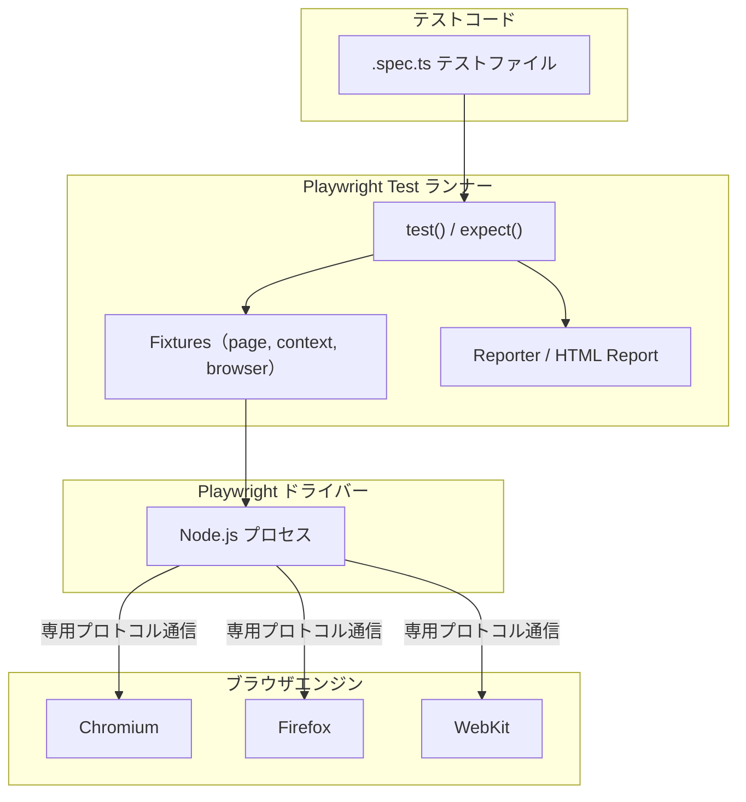

この構造のポイントは以下の3つです。

1. **`page`フィクスチャ**：1つのテストごとに独立したページ（タブ）が用意される
2. **`context`（ブラウザコンテキスト）**：Cookieやローカルストレージを共有しない、いわばシークレットウィンドウのような分離単位。1つの`browser`から複数の`context`を作成でき、`context`同士は完全に独立している
3. **`browser`**：実際のブラウザプロセス。複数のテスト間で使い回されリソースを節約する

### テストが実行される流れ

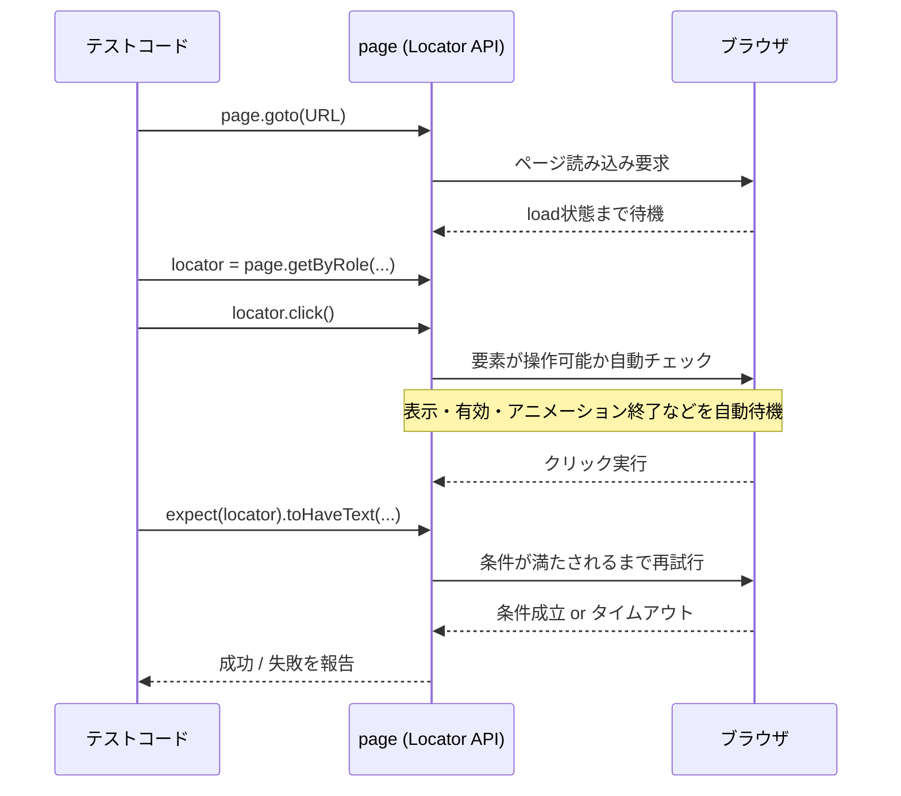

このように、Playwrightでは「操作（Action）」と「検証（Assertion）」の両方に自動的な待機・リトライの仕組みが組み込まれているため、`sleep(1000)`のような固定待機を書かなくても、フレーキー（不安定）なテストになりにくい設計になっています。

**参照URL:**
- https://playwright.dev/docs/intro
- https://playwright.dev/docs/writing-tests
- https://playwright.dev/docs/browser-contexts

---

## 3. 環境構築とインストール

### 3.1 システム要件

2026年7月現在の公式ドキュメントによると、Playwrightの動作要件は以下の通りです。

| 項目 | 要件 |
|---|---|
| Node.js | 最新の22.x系、24.x系、または26.x系 |
| Windows | Windows 11以降、Windows Server 2019以降、またはWSL |
| macOS | macOS 14 (Sonoma) 以降 |
| Linux | Debian 12／13、Ubuntu 22.04／24.04／26.04（x86-64またはarm64） |

### 3.2 インストール手順

最も簡単な導入方法は、公式の初期化コマンドを実行することです。既存プロジェクトへの追加にも、新規プロジェクト作成にも同じコマンドが使えます。

```bash
npm init playwright@latest
```

このコマンドを実行すると、対話形式で以下を尋ねられます。

- TypeScriptかJavaScriptか（デフォルトはTypeScript）
- テストフォルダ名（デフォルトは`tests`。既に`tests`がある場合は`e2e`が提案される）
- GitHub Actionsのワークフローを追加するか（CI利用時は追加を推奨）
- Playwrightブラウザをインストールするか（デフォルトはYes）

このコマンドは何度でも再実行可能で、既存のテストファイルを上書きすることはありません。VS Codeを使っている場合は、拡張機能からGUIでプロジェクトを作成・テストを実行することもできます。

### 3.3 インストール完了後の構成

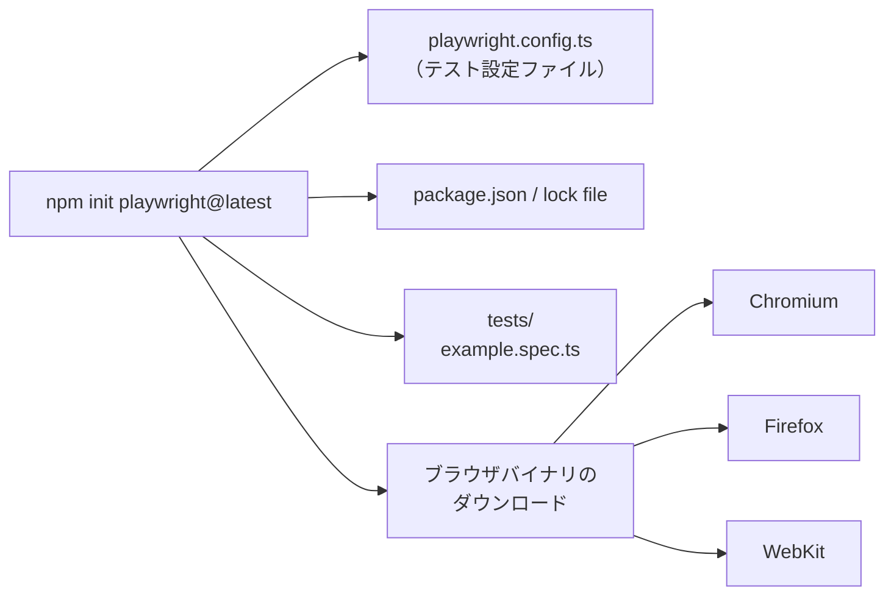

`playwright.config`ファイルは、対象ブラウザ・タイムアウト・リトライ回数・プロジェクト（後述）・レポーターなど、テスト全体の設定を一元管理する中心的なファイルです。

### 3.4 バージョンの確認と更新

```bash
# 現在のバージョンを確認
npx playwright --version

# 最新版へ更新し、ブラウザも再取得
npm install -D @playwright/test@latest
npx playwright install --with-deps
```

なお、公式GitHubリリースおよびPyPIの情報によれば、2026年6月29日時点でのPythonバインディングの最新版は1.61.0であり、その前の1.60.0が2026年5月18日、1.59.0が2026年4月、1.58.0が2026年1月30日にリリースされています。バージョン番号は今後も更新され続けるため、実際に導入する際は`npx playwright --version`や[リリースノートページ](https://playwright.dev/docs/release-notes)で最新情報を確認することをおすすめします。

なお近年のアップデートでは、ヘッド付きモードは「Chrome for Testing」ビルドの`chrome`、ヘッドレスモードは`chrome-headless-shell`を使うように変更されており、`@playwright/test`パッケージ経由で`npx playwright install`を使っている場合は特に意識する必要はありません。

**参照URL:**
- https://playwright.dev/docs/intro
- https://playwright.dev/docs/release-notes
- https://pypi.org/project/playwright/
- https://github.com/microsoft/playwright/releases

---

## 4. プロジェクト構成を理解する

インストール直後に生成される典型的なディレクトリ構成は次の通りです。

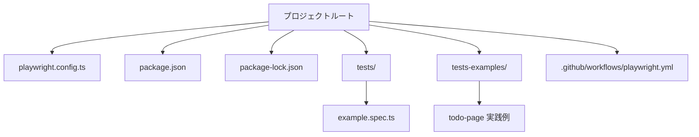

`tests/`フォルダには最小限のサンプルテストが1つ入っており、`tests-examples/`フォルダには、より実践的なToDoアプリを題材にしたE2Eテストのサンプルが含まれています（初期化時にnpm経由で生成した場合）。`playwright.config.ts`には次のような設定項目が含まれます。

```ts
import { defineConfig, devices } from '@playwright/test';

export default defineConfig({
  testDir: './tests',
  fullyParallel: true,          // ファイル内のテストも並列実行
  forbidOnly: !!process.env.CI, // CI環境で test.only の書き忘れを検知
  retries: process.env.CI ? 2 : 0, // CIでは2回リトライ
  workers: process.env.CI ? 1 : undefined,
  reporter: 'html',
  use: {
    trace: 'on-first-retry',    // 失敗テストの初回リトライ時にトレースを記録
  },
  projects: [
    { name: 'chromium', use: { ...devices['Desktop Chrome'] } },
    { name: 'firefox',  use: { ...devices['Desktop Firefox'] } },
    { name: 'webkit',   use: { ...devices['Desktop Safari'] } },
  ],
});
```

`projects`の配列を使うことで、同じテストコードをChromium・Firefox・WebKitの3ブラウザに対して自動的に横展開して実行できます。モバイル端末のエミュレーション設定を追加すれば、スマートフォン向けの見た目でのテストも同様に可能です。

**参照URL:**
- https://playwright.dev/docs/intro
- https://playwright.dev/docs/test-configuration
- https://playwright.dev/docs/test-projects

---

## 5. はじめてのテストを書く

Playwrightのテストは非常にシンプルな考え方に基づいています。それは「**操作（Action）を行い、状態を検証（Assert）する**」という2ステップの繰り返しです。

```ts
import { test, expect } from '@playwright/test';

test('タイトルにPlaywrightという文字列が含まれる', async ({ page }) => {
  await page.goto('https://playwright.dev/');
  // タイトルに部分一致することを期待する
  await expect(page).toHaveTitle(/Playwright/);
});

test('Get startedリンクをクリックするとInstallationページに飛ぶ', async ({ page }) => {
  await page.goto('https://playwright.dev/');
  await page.getByRole('link', { name: 'Get started' }).click();
  await expect(page.getByRole('heading', { name: 'Installation' })).toBeVisible();
});
```

`{ page }`という引数は「フィクスチャ」と呼ばれる仕組みで、Playwright Testが自動的に、そのテスト専用の分離されたページを用意して渡してくれます（フィクスチャの詳細は第12章で解説します）。

### テストの基本フロー

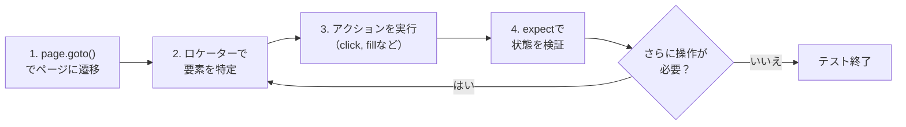

JavaScriptでテストを書く場合でも、VS Code上でファイルの先頭に`// @ts-check`を追加しておくと、TypeScriptによる型チェックの恩恵を受けられます。

**参照URL:**
- https://playwright.dev/docs/writing-tests
- https://playwright.dev/docs/actionability

---

## 6. ロケーター（Locators）を極める

ロケーターはPlaywrightの「自動待機」と「再試行可能性」の中核をなす仕組みです。ロケーターは、ある瞬間にページ上の要素を見つけるための"問い合わせ方法"を表現したオブジェクトであり、実際のDOM要素そのものではありません。そのためロケーターを使ってアクションを行うたびに、Playwrightはその都度最新のDOM要素を検索し直します。DOMが再描画されて要素が変わっても、常に最新の状態に対して操作が行われるということです。

### 6.1 推奨されるロケーターの種類

公式ドキュメントが強く推奨しているのは、ユーザーや支援技術（スクリーンリーダーなど）が実際に画面を認識する方法に近い、以下のようなユーザー視点のロケーターです。

| メソッド | 用途 |
|---|---|
| `page.getByRole()` | ARIAロール（button, checkbox, heading等）とアクセシブルネームで特定。最も推奨 |
| `page.getByText()` | 表示されているテキスト内容で特定 |
| `page.getByLabel()` | フォームの`<label>`に対応する入力欄を特定 |
| `page.getByPlaceholder()` | inputのplaceholder属性で特定 |
| `page.getByAltText()` | 画像のalt属性で特定 |
| `page.getByTitle()` | title属性で特定 |
| `page.getByTestId()` | `data-testid`属性（設定変更可）で特定 |

```ts
await page.getByLabel('User Name').fill('John');
await page.getByLabel('Password').fill('secret-password');
await page.getByRole('button', { name: 'Sign in' }).click();
await expect(page.getByText('Welcome, John!')).toBeVisible();
```

### 6.2 ロケーター選択のフローチャート

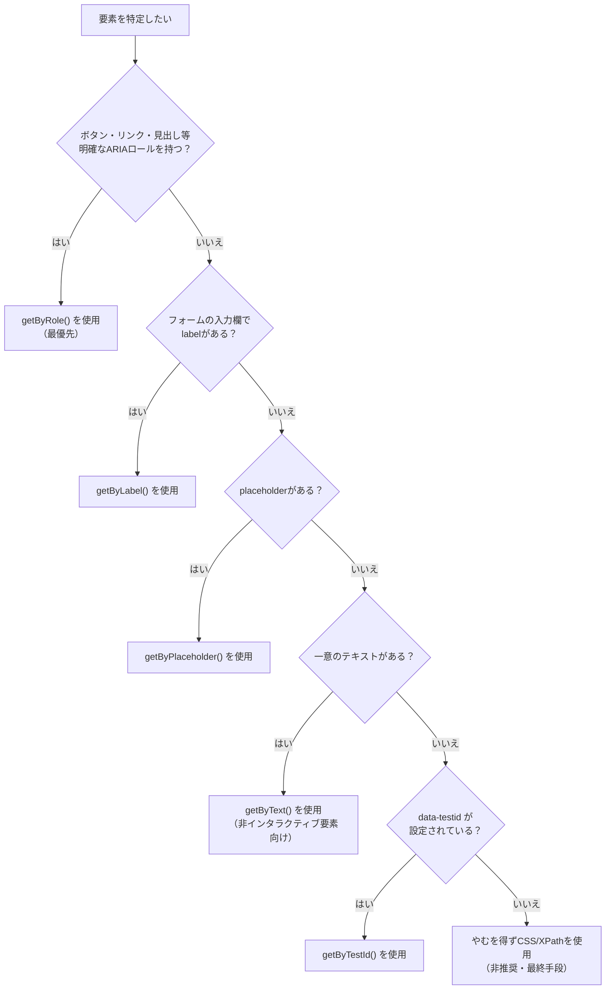

CSSやXPathによるロケーター（`page.locator('css=button')`など）はDOM構造に強く依存するため、実装の詳細が変わるとすぐに壊れてしまいます。特に以下のような長いCSS/XPathチェーンは悪い例としてドキュメントでも明示的に警告されています。

```ts
// 👎 避けるべき例：DOM構造に強く依存し壊れやすい
await page.locator(
  '#tsf > div:nth-child(2) > div.A8SBwf > div.RNNXgb > div > div.a4bIc > input'
).click();
```

### 6.3 ロケーターの絞り込み（フィルタリング）

一覧の中から特定の項目を選びたい場合、`locator.filter()`でテキストや子要素の有無によって絞り込めます。

```ts
// 「Product 2」を含むリスト項目の中の「Add to cart」ボタンをクリック
await page
  .getByRole('listitem')
  .filter({ hasText: 'Product 2' })
  .getByRole('button', { name: 'Add to cart' })
  .click();
```

さらに`locator.and()`（AND条件）、`locator.or()`（OR条件）を使えば、複数の条件を組み合わせた高度な絞り込みも可能です。

### 6.4 一意性（Strictness）という重要な考え方

Playwrightのロケーターは「厳格（strict）」であることが特徴です。あるロケーターに一致するDOM要素が2つ以上ある状態でクリックのような単一要素向け操作を行うと、Playwrightはエラーを投げて実行を止めます。これは「意図しない要素を誤ってクリックしてしまう」というテストのバグを未然に防ぐための安全装置です。`locator.first()`や`locator.nth()`で例外的に回避することもできますが、ページの変更によって意図しない要素を指してしまうリスクがあるため、できる限り一意に特定できるロケーターの設計を優先することが推奨されています。

**参照URL:**
- https://playwright.dev/docs/locators
- https://playwright.dev/docs/best-practices

---

## 7. アクション（操作）の書き方

ロケーターで要素を特定した後は、実際の操作（アクション）を行います。Playwrightは、テキスト入力・チェックボックス操作・セレクトボックス選択・マウス操作・キーボード操作・ファイルアップロード・ドラッグ＆ドロップなど、人間が行うほぼすべてのブラウザ操作をサポートしています。

### 7.1 主なアクション一覧

| 操作カテゴリ | 代表的なAPI | 説明 |
|---|---|---|
| テキスト入力 | `locator.fill(text)` | 要素にフォーカスし`input`イベントを発火させて値を設定 |
| チェックボックス／ラジオ | `locator.check()` / `locator.setChecked()` | チェック状態を操作 |
| セレクトボックス | `locator.selectOption()` | `<select>`の選択肢を値やラベルで選択 |
| クリック | `locator.click()` | 一般的なクリック。`dblclick()`、`button: 'right'`等のオプションあり |
| キー入力 | `locator.press()` / `locator.pressSequentially()` | ショートカットキーや1文字ずつのキー入力 |
| ファイルアップロード | `locator.setInputFiles()` | `<input type="file">`にファイルを設定 |
| ドラッグ＆ドロップ | `locator.dragTo()` | ある要素を別の要素にドラッグ |
| ホバー | `locator.hover()` | マウスカーソルを要素上に移動 |
| フォーカス | `locator.focus()` | 要素へフォーカスを移動 |

```ts
// テキスト入力
await page.getByRole('textbox').fill('Peter');

// チェックボックスにチェックを入れる
await page.getByLabel('I agree to the terms above').check();

// セレクトボックスで複数選択
await page.getByLabel('Choose multiple colors').selectOption(['red', 'green', 'blue']);

// Shiftキーを押しながらクリック
await page.getByText('Item').click({ modifiers: ['Shift'] });

// ファイルをアップロード
await page.getByLabel('Upload file').setInputFiles(path.join(__dirname, 'myfile.pdf'));

// ドラッグ＆ドロップ
await page.locator('#item-to-be-dragged').dragTo(page.locator('#item-to-drop-at'));
```

### 7.2 クリック操作の内部で起きていること

`click()`のようなポインター系メソッドを実行すると、Playwrightは内部的に以下のチェックを自動で行ってから実際のクリックを発生させます。

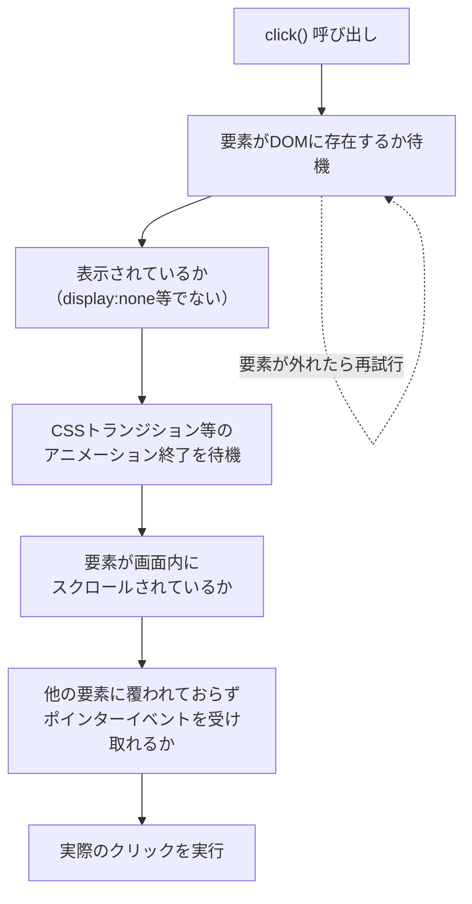

このように「アクション可能性（Actionability）」のチェックが自動で行われるため、明示的な`waitFor`を書かなくても多くのケースで安定したテストが書けます。ただし、UIの実装上どうしても要素が覆われてしまう場合などは、`{ force: true }`オプションでこれらのチェックを意図的にバイパスすることも可能です（ただし乱用は非推奨）。

**参照URL:**
- https://playwright.dev/docs/input
- https://playwright.dev/docs/actionability

---

## 8. アサーション（検証）の書き方

Playwrightには`expect`関数によるアサーション機能が組み込まれています。特に注目すべきは「Web-first（ウェブファースト）アサーション」と呼ばれる、非同期で自動的にリトライされるアサーション群です。

```ts
// 通常のアサーション（一度きりの評価）
expect(success).toBeTruthy();

// Web-firstアサーション（条件が満たされるまで自動的に再試行する）
await expect(page.getByTestId('status')).toHaveText('Submitted');
```

2つ目の例では、`status`というテストIDを持つ要素のテキストが"Submitted"になるまで、Playwrightはデフォルトで最大5秒間、要素を何度も再取得しながらチェックを繰り返します。このタイムアウト値は個別に指定することも、設定ファイルで一括変更することもできます。

### 8.1 代表的なWeb-firstアサーション

| アサーション | 検証内容 |
|---|---|
| `toBeVisible()` | 要素が表示されている |
| `toBeEnabled()` / `toBeDisabled()` | 要素が有効／無効である |
| `toBeChecked()` | チェックボックス・ラジオボタンがチェックされている |
| `toHaveText()` | 要素のテキストが一致する |
| `toContainText()` | 要素のテキストに部分一致する |
| `toHaveValue()` | フォーム要素の値が一致する |
| `toHaveCount()` | ロケーターが一致する要素数 |
| `toHaveURL()` | ページのURLが一致する |
| `toHaveTitle()` | ページのタイトルが一致する |
| `toHaveScreenshot()` | 過去に保存したスクリーンショットと視覚的に一致する |

### 8.2 なぜ「待たないアサーション」がアンチパターンなのか

ベストプラクティスとして公式が明確に警告しているのが、`await`の位置を間違えるパターンです。

```ts
// 👎 悪い例：isVisible()の結果を先に取得してから比較している
// → 呼び出した瞬間の状態しか見ておらず、リトライが一切効かない
expect(await page.getByText('welcome').isVisible()).toBe(true);

// 👍 良い例：expect自体をawaitし、条件成立まで自動リトライさせる
await expect(page.getByText('welcome')).toBeVisible();
```

前者は「その一瞬」の状態しか見ておらず、要素が表示されるまでに0.5秒かかるようなケースではテストが不安定（フレーキー）になります。後者はアサーションそのものが自動的に再試行を行うため、非同期なUIの更新にも強くなります。

### 8.3 ソフトアサーション

テストの途中で失敗してもすぐに終了させず、複数の検証結果をまとめて確認したい場合は`expect.soft()`を使います。

```ts
await expect.soft(page.getByTestId('status')).toHaveText('Success');
// ここで失敗してもテストは継続する
await page.getByRole('link', { name: 'next page' }).click();
```

**参照URL:**
- https://playwright.dev/docs/test-assertions
- https://playwright.dev/docs/best-practices

---

## 9. テストの実行とデバッグ

### 9.1 コマンドラインからの実行

```bash
# すべてのテストを実行（デフォルトはヘッドレス・並列実行）
npx playwright test

# ブラウザ画面を表示しながら実行
npx playwright test --headed

# 特定ブラウザのみで実行
npx playwright test --project webkit

# 複数ブラウザを指定
npx playwright test --project webkit --project firefox

# 特定のファイルのみ実行
npx playwright test landing-page.spec.ts

# タイトルにキーワードを含むテストのみ実行
npx playwright test -g "add a todo item"

# 直前に失敗したテストのみ再実行
npx playwright test --last-failed
```

### 9.2 UIモード：最もおすすめのデバッグ方法

公式が「まず使ってほしい」と強く推奨しているのが**UIモード**です。ウォッチモード、ステップごとの実行状況の可視化、ロケーターピッカーなど、開発体験を大きく向上させる機能が詰め込まれています。

```bash
npx playwright test --ui
```

### 9.3 デバッグ手段の使い分け

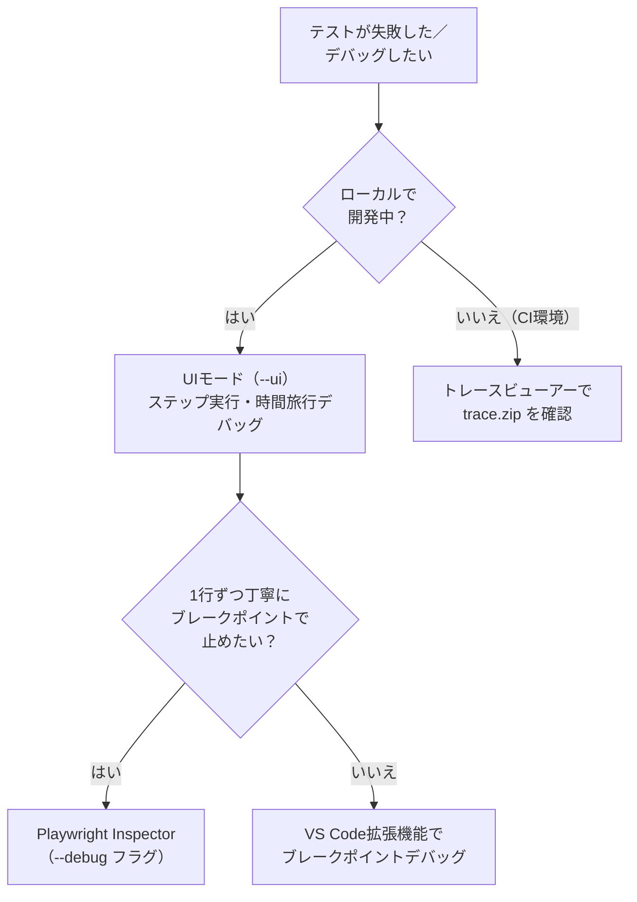

- **UIモード（`--ui`）**：テストの各ステップを視覚的に前後に移動しながら確認できる。ロケーターピッカーも利用可能
- **Playwright Inspector（`--debug`）**：ブラウザウィンドウとインスペクターが開き、ステップオーバーボタンで1操作ずつ実行できる
- **VS Code拡張機能**：テストコードの行の横にある緑の三角ボタンから直接実行・デバッグ可能

```bash
# 全テストをInspectorでデバッグ
npx playwright test --debug

# 特定ファイルをデバッグ
npx playwright test example.spec.ts --debug

# 特定行のテストをデバッグ
npx playwright test example.spec.ts:10 --debug
```

### 9.4 HTMLレポート

テスト実行後は、ブラウザ別・合格／失敗／スキップ／不安定（flaky）でフィルタできるHTMLレポートが生成されます。

```bash
npx playwright show-report
```

失敗があった場合は自動的にブラウザで開きますが、手動で確認したい場合は上記コマンドを使います。各テストをクリックすると、エラー内容・添付ファイル・実行ステップの詳細を確認できます。

**参照URL:**
- https://playwright.dev/docs/running-tests
- https://playwright.dev/docs/test-ui-mode
- https://playwright.dev/docs/debug

---

## 10. コード生成（Codegen）を使う

Playwrightには、ブラウザ上での操作を記録し、自動でテストコードを生成してくれる「Codegen（テストジェネレーター）」というツールが付属しています。ロケーターの命名に迷う初学者にとって特に有用な機能です。

```bash
npx playwright codegen demo.playwright.dev/todomvc
```

このコマンドを実行すると、ブラウザウィンドウとPlaywright Inspectorが開きます。ブラウザ上で実際にクリックや入力といった操作を行うと、その内容がリアルタイムでコードとして生成されていきます。

### 10.1 Codegenが記録できるもの

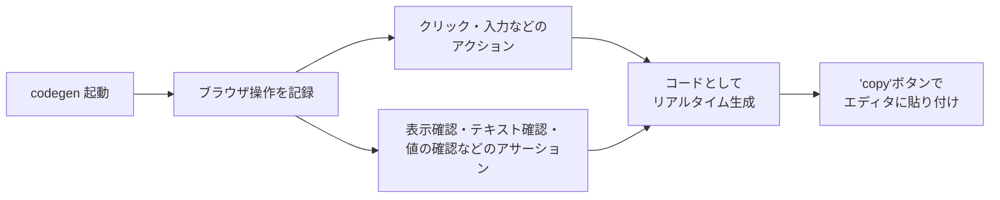

Codegenはページを解析し、role・text・test idロケーターを優先する形で最適なロケーターを自動的に推奨します。複数の要素に一致してしまう場合は、自動的により一意になるようロケーターを調整してくれるため、初心者がゼロから手書きするよりも安定したロケーターが得られやすいという利点があります。

### 10.2 ロケーターピッカー

「Record」ボタンで記録を停止すると「Pick Locator」ボタンが使えるようになります。これをクリックしてブラウザ上の要素にカーソルを合わせると、その要素に対してPlaywrightがどのようなロケーターを使うかがハイライト表示されます。ロケータープレイグラウンドで微調整しながら、生成されたコードをコピーしてテストに貼り付けることができます。

また、特定のビューポート・デバイス・カラースキーム・ジオロケーション・言語・タイムゾーンなどをエミュレートした状態でコード生成を行うことも可能で、ログイン済みの状態を保持したままの記録もサポートされています。

**参照URL:**
- https://playwright.dev/docs/codegen-intro
- https://playwright.dev/docs/codegen

---

## 11. トレースビューアーで失敗原因を追う

トレースビューアーは、記録済みのPlaywrightトレース（`trace.zip`）を探索できるGUIツールです。テストの各アクションについて、実行前後のページの状態を視覚的に確認しながら前後に移動できます。特にCI環境での失敗調査において非常に強力です。

### 11.1 トレースの記録設定

デフォルトの設定ファイルでは、失敗したテストの最初のリトライ時にのみトレースを記録するよう構成されています。

```ts
export default defineConfig({
  retries: process.env.CI ? 2 : 0,
  use: {
    trace: 'on-first-retry', // 最初のリトライ時のみトレースを記録
  },
});
```

ローカルで強制的にトレースを有効化したい場合は次のようにします。

```bash
npx playwright test --trace on
```

### 11.2 トレースビューアーで見れること

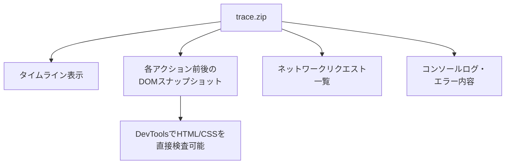

HTMLレポート内でテストファイル名の横にあるトレースアイコンをクリックするか、各テストの詳細画面から「Traces」タブを開くことで、直接トレースを閲覧できます。トレースビューアーはローカルで動くPWA（Progressive Web App）として実装されており、トレースファイルの中身は外部にアップロードされることなくローカルで処理される点も安心材料です。

CI障害の調査では、動画やスクリーンショットよりもトレースビューアーの利用が推奨されています。ただし、すべてのテストで常時トレースを記録する設定（`trace: 'on'`）はパフォーマンス負荷が大きいため、通常はCIでの失敗時リトライ時のみに限定することが推奨されています。

**参照URL:**
- https://playwright.dev/docs/trace-viewer-intro
- https://playwright.dev/docs/trace-viewer
- https://playwright.dev/docs/best-practices

---

## 12. フィクスチャ（Fixtures）で環境を整える

Playwright Testは「テストフィクスチャ」という概念を中心に設計されています。フィクスチャとは、各テストの実行環境を整えるための仕組みで、そのテストに必要なものだけを渡し、それ以外は渡さないという原則で動作します。

### 12.1 組み込みフィクスチャ

| フィクスチャ | 型 | 説明 |
|---|---|---|
| `page` | Page | このテスト専用に分離されたページ |
| `context` | BrowserContext | このテスト専用に分離されたコンテキスト（`page`もこれに属する） |
| `browser` | Browser | テスト間で共有されるブラウザ本体 |
| `browserName` | string | 実行中のブラウザ名（`chromium`／`firefox`／`webkit`） |
| `request` | APIRequestContext | このテスト専用に分離されたAPIリクエストコンテキスト |

### 12.2 フィクスチャがbefore/afterフックより優れている理由

従来型の`beforeEach`/`afterEach`によるセットアップと比較すると、フィクスチャには次のような利点があります。

- **カプセル化**：セットアップと後片付けを1箇所にまとめて書ける
- **再利用性**：複数のテストファイルをまたいで同じ定義を使い回せる
- **オンデマンド**：そのテストが実際に必要とするフィクスチャだけが構築される
- **合成可能性**：フィクスチャ同士が依存し合い、複雑な処理を組み立てられる
- **柔軟性**：テストごとに異なる組み合わせのフィクスチャを利用できる

### 12.3 独自フィクスチャを作成する

```ts
import { test as base } from '@playwright/test';
import { TodoPage } from './todo-page';

type MyFixtures = {
  todoPage: TodoPage;
};

export const test = base.extend<MyFixtures>({
  todoPage: async ({ page }, use) => {
    // --- セットアップ ---
    const todoPage = new TodoPage(page);
    await todoPage.goto();
    await todoPage.addToDo('item1');

    await use(todoPage); // ここでテスト本体が実行される

    // --- 後片付け ---
    await todoPage.removeAll();
  },
});

export { expect } from '@playwright/test';
```

`use()`を呼び出す前がセットアップ処理、`use()`の後が後片付け処理という構造は、多くの言語のコンテキストマネージャーと似た考え方です。

### 12.4 フィクスチャの実行順序

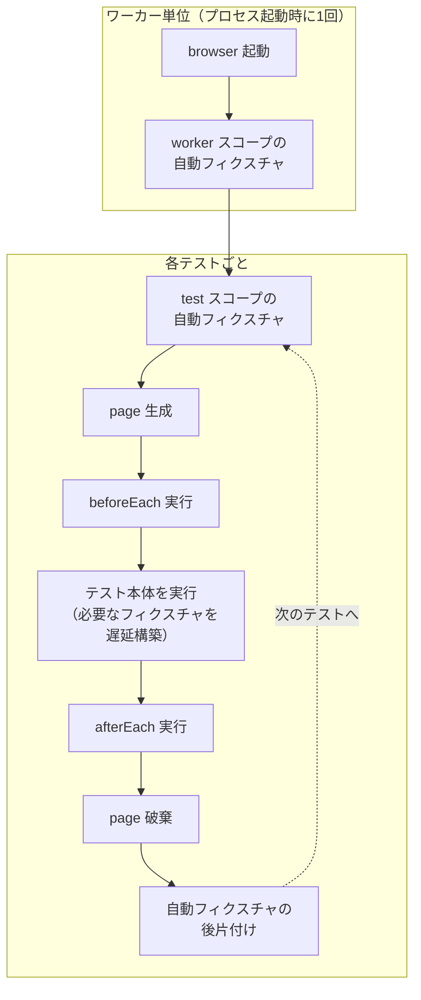

ポイントは次の3つです。

1. フィクスチャAがフィクスチャBに依存する場合、Bは常にAより先にセットアップされ、Aより後に後片付けされる
2. 自動化されていない（`auto: true`を付けていない）フィクスチャは、実際にテスト・フックが必要とするタイミングまで遅延して構築される
3. テストスコープのフィクスチャは各テスト後に、ワーカースコープのフィクスチャはワーカープロセス終了時にのみ後片付けされる

`{ scope: 'worker' }`を指定すれば、あるワーカープロセス内の複数テストファイルで1回だけセットアップされる「ワーカースコープフィクスチャ」を定義することもできます。例えばテストアカウントの作成など、コストの高い準備処理を複数テストで共有したい場合に有効です。

**参照URL:**
- https://playwright.dev/docs/test-fixtures
- https://playwright.dev/docs/test-parallel

---

## 13. ページオブジェクトモデル（POM）

テストスイートが大きくなってくると、同じロケーターやページ操作のロジックがあちこちのテストファイルに重複してしまいがちです。ページオブジェクトモデル（POM）は、この問題を解決するための設計パターンで、アプリケーションの各ページ（またはコンポーネント）を1つのクラスとして表現し、そのページに関するロケーターと操作メソッドを1箇所に集約します。

### 13.1 POMがもたらすメリット

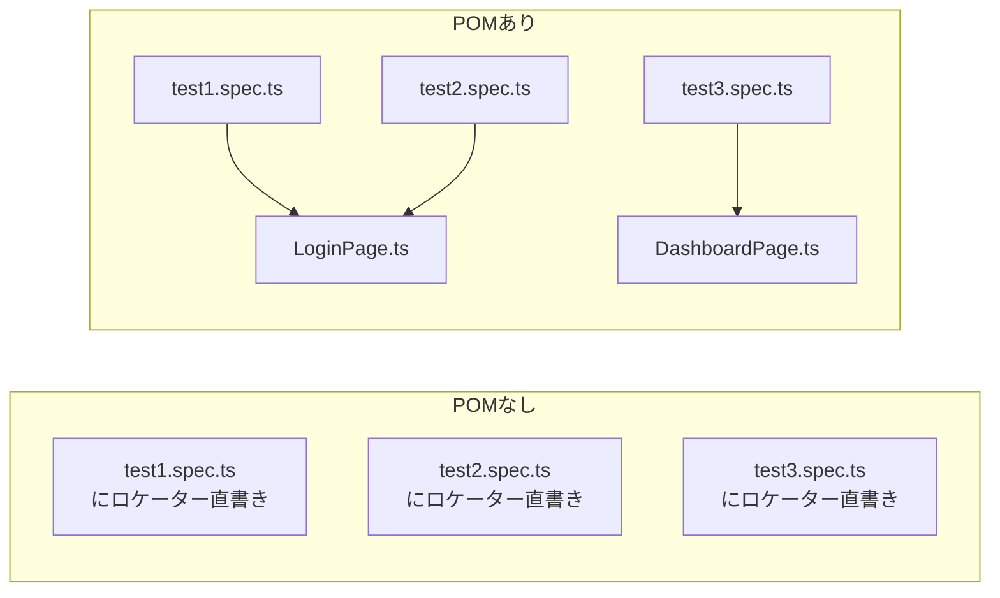

UIの実装が変わってロケーターを修正する必要が生じても、POMなしの場合は複数のテストファイルを1つずつ修正しなければなりません。POMを採用していれば、該当するページオブジェクトのクラス1箇所を修正するだけで済みます。

### 13.2 実装例

```ts
// todo-page.ts
import type { Page, Locator } from '@playwright/test';

export class TodoPage {
  private readonly inputBox: Locator;
  private readonly todoItems: Locator;

  constructor(public readonly page: Page) {
    this.inputBox = this.page.locator('input.new-todo');
    this.todoItems = this.page.getByTestId('todo-item');
  }

  async goto() {
    await this.page.goto('https://demo.playwright.dev/todomvc/');
  }

  async addToDo(text: string) {
    await this.inputBox.fill(text);
    await this.inputBox.press('Enter');
  }

  async remove(text: string) {
    const todo = this.todoItems.filter({ hasText: text });
    await todo.hover();
    await todo.getByLabel('Delete').click();
  }
}
```

```ts
// todo.spec.ts
import { test, expect } from '@playwright/test';
import { TodoPage } from './todo-page';

test('項目を追加できる', async ({ page }) => {
  const todoPage = new TodoPage(page);
  await todoPage.goto();
  await todoPage.addToDo('牛乳を買う');
  await expect(page.getByTestId('todo-item')).toHaveText(['牛乳を買う']);
});
```

### 13.3 POMとフィクスチャを組み合わせる

第12章で紹介したフィクスチャの仕組みと組み合わせることで、各テストで毎回`new TodoPage(page)`と書く手間すら省くことができます。実務では、この「POM＋カスタムフィクスチャ」の組み合わせが最も一般的なパターンとして広く採用されています。

**参照URL:**
- https://playwright.dev/docs/pom
- https://playwright.dev/docs/test-fixtures

---

## 14. APIモックとネットワーク制御

Playwrightは、ページが発行するXHRやfetchリクエストを含むあらゆるHTTP／HTTPS通信を追跡・変更・モック化するAPIを備えています。これにより、不安定な外部APIやバックエンドに依存せず、再現性の高いテストを書くことができます。

### 14.1 なぜモックが重要なのか

ベストプラクティスとして「自分たちが管理していないもの（サードパーティの外部サイトやAPI）はテストしない」という原則が示されています。外部サービスの応答が遅い、Cookieバナーが出る、コンテンツが変わるといった理由でテストが不安定になるのを避けるためです。

### 14.2 `page.route()`によるレスポンスの差し替え

```ts
test('フルーツAPIをモックしてAPIを呼び出さない', async ({ page }) => {
  // ナビゲーション前にAPIをモック
  await page.route('*/**/api/v1/fruits', async route => {
    const json = [{ name: 'Strawberry', id: 21 }];
    await route.fulfill({ json });
  });

  await page.goto('https://demo.playwright.dev/api-mocking');
  await expect(page.getByText('Strawberry')).toBeVisible();
});
```

### 14.3 実際のレスポンスを取得してから一部だけ書き換える

新機能をテストしたいが、まだバックエンド側の実装が完了していない場合など、実際のレスポンスを取得しつつ一部だけをパッチしたいケースもあります。

```ts
test('実際のAPIレスポンスに新しい要素を追加する', async ({ page }) => {
  await page.route('*/**/api/v1/fruits', async route => {
    const response = await route.fetch();
    const json = await response.json();
    json.push({ name: 'Loquat', id: 100 });
    await route.fulfill({ response, json }); // 元のレスポンスを流用しつつ本体だけ差し替え
  });

  await page.goto('https://demo.playwright.dev/api-mocking');
  await expect(page.getByText('Loquat', { exact: true })).toBeVisible();
});
```

### 14.4 3種類のネットワーク制御パターン

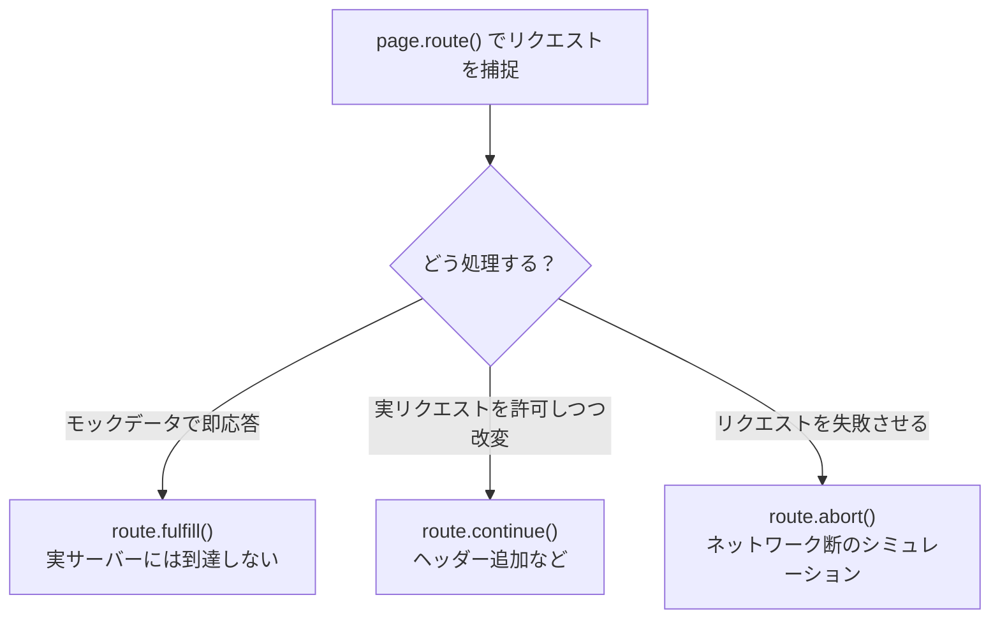

- **`route.fulfill()`**：実際のサーバーにリクエストを送らず、指定したレスポンスをその場で返す
- **`route.continue()`**：実際のリクエストを続行させつつ、ヘッダーなど一部だけ改変する
- **`route.abort()`**：リクエストを意図的に失敗させ、ネットワーク障害時の挙動を検証する

### 14.5 HARファイルによる記録・再生

複数のリクエストをまとめて記録・再生したい場合は、HTTP Archive（HAR）ファイルを利用する方法もあります。`page.routeFromHAR()`で一度実際の通信を記録し、以降のテスト実行では記録したHARファイルからレスポンスを再生することで、実サーバーに接続せずとも安定したテストデータを再利用できます。

**参照URL:**
- https://playwright.dev/docs/mock
- https://playwright.dev/docs/network
- https://playwright.dev/docs/best-practices

---

## 15. CI/CDへの組み込み（GitHub Actions）

Playwrightはどのようなインフラ上でも動作するため、任意のCIプロバイダーでテストを実行できます。ここでは代表例としてGitHub Actionsを紹介します。

### 15.1 ワークフローファイル

`npm init playwright@latest`実行時にGitHub Actionsの追加を選択すると、次のようなワークフローファイルが`.github/workflows/playwright.yml`に自動生成されます。

```yaml
name: Playwright Tests
on:
  push:
    branches: [ main, master ]
  pull_request:
    branches: [ main, master ]
jobs:
  test:
    timeout-minutes: 60
    runs-on: ubuntu-latest
    steps:
    - uses: actions/checkout@v5
    - uses: actions/setup-node@v5
      with:
        node-version: lts/*
    - name: Install dependencies
      run: npm ci
    - name: Install Playwright Browsers
      run: npx playwright install --with-deps
    - name: Run Playwright tests
      run: npx playwright test
    - uses: actions/upload-artifact@v4
      if: ${{ !cancelled() }}
      with:
        name: playwright-report
        path: playwright-report/
        retention-days: 30
```

### 15.2 CIパイプラインの流れ

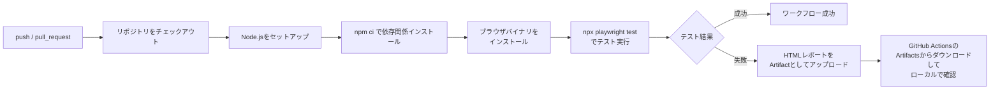

CI上でテストが失敗した場合、Artifactsセクションから`playwright-report`をダウンロードし、ローカルで解凍後に次のコマンドでレポートを閲覧できます。

```bash
npx playwright show-report name-of-my-extracted-playwright-report
```

### 15.3 CIならではの注意点

- **Linuxランナーの利用**：ローカル開発では好きなOSを使ってよいが、CIではコスト面からLinuxが推奨されている
- **シャーディング**：`--shard=1/3`のようにテストスイートを複数マシンに分割して並列実行し、CI全体の時間を短縮できる
- **必要なブラウザのみインストール**：Chromiumのみでテストしているなら`npx playwright install chromium --with-deps`のように対象を絞ることで、ダウンロード時間とディスク容量を節約できる
- **機密情報の取り扱い**：トレースファイルやHTMLレポート、コンソールログにはテスト用アカウントの認証情報やトークンなど機微な情報が含まれる場合があるため、信頼できるアーティファクトストアにのみアップロードするか、暗号化してから共有する

**参照URL:**
- https://playwright.dev/docs/ci-intro
- https://playwright.dev/docs/ci
- https://playwright.dev/docs/test-sharding
- https://playwright.dev/docs/best-practices

---

## 16. ベストプラクティスまとめ

公式ドキュメントの「Best Practices」ページで示されている原則を、テスト哲学と実践的なテクニックの2つの観点に整理します。

### 16.1 テストの哲学

| 原則 | 内容 |
|---|---|
| ユーザーが見る挙動をテストする | 関数名やCSSクラス名など実装の詳細ではなく、実際に画面に表示・操作される内容を検証する |
| テストを可能な限り独立させる | 各テストは自分専用のローカルストレージ・セッション・Cookieを持ち、他のテストに依存しない |
| サードパーティ依存はテストしない | 自分たちが管理していない外部サイトやAPIには極力依存しない。必要ならモックで代替する |
| データベースを使う場合は制御下に置く | ステージング環境を対象にし、テスト中にデータが変化しないようにする |

### 16.2 実践的なテクニック

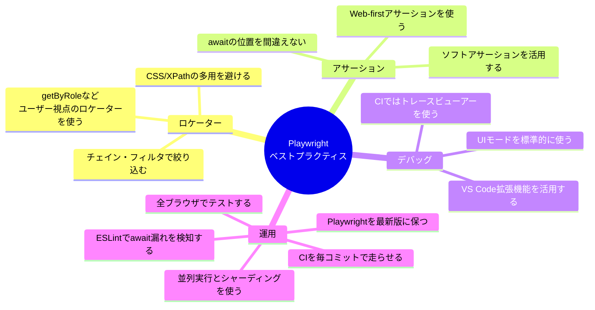

とりわけ重要なポイントを3つだけ挙げるとすれば、次の通りです。

1. **ユーザー視点のロケーターを最優先する**：`getByRole()`を筆頭に、CSSクラスや内部実装ではなく「ユーザーが実際に見て触るもの」を基準にロケーターを組み立てる
2. **待たないアサーションを書かない**：`await expect(...).toBeVisible()`のように、常にアサーション自体をawaitし、自動リトライの恩恵を受ける
3. **CIではトレースビューアーを主軸にする**：動画やスクリーンショットだけに頼らず、`trace: 'on-first-retry'`の設定を活かしてトレースから根本原因を追う

**参照URL:**
- https://playwright.dev/docs/best-practices

---

## 17. 学習ロードマップ

ここまでの内容を踏まえ、初学者がどの順番で学習を進めるとスムーズかをまとめたロードマップです。

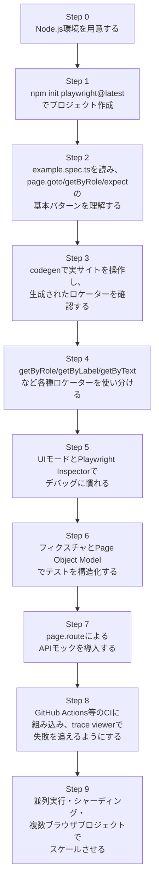

最初の1〜2週間は「Step 1〜5」に集中し、実際に触ったことのあるWebアプリを題材にして、`codegen`で生成したコードを手直ししながら理解を深めるのが最も効率的な学び方です。ロケーターとアサーションの基本が身についたら、テストの本数が増えてくるタイミングでフィクスチャとPage Object Modelへ進むと、無理なくステップアップできます。

---

## 18. 参考文献・参照URL一覧

本ガイドの作成にあたり、以下の公式ドキュメントおよび技術記事を参照しました。

### Playwright公式ドキュメント（Node.js版）

- Installation（インストール）: https://playwright.dev/docs/intro
- Writing tests（テストの書き方）: https://playwright.dev/docs/writing-tests
- Locators（ロケーター）: https://playwright.dev/docs/locators
- Other locators: https://playwright.dev/docs/other-locators
- Actions（アクション）: https://playwright.dev/docs/input
- Assertions（アサーション）: https://playwright.dev/docs/test-assertions
- Auto-waiting（自動待機）: https://playwright.dev/docs/actionability
- Running and debugging tests（実行とデバッグ）: https://playwright.dev/docs/running-tests
- UI Mode: https://playwright.dev/docs/test-ui-mode
- Debugging Tests: https://playwright.dev/docs/debug
- Generating tests / Codegen: https://playwright.dev/docs/codegen-intro
- Test generator（詳細）: https://playwright.dev/docs/codegen
- Trace viewer（導入）: https://playwright.dev/docs/trace-viewer-intro
- Trace viewer（詳細）: https://playwright.dev/docs/trace-viewer
- Setting up CI: https://playwright.dev/docs/ci-intro
- Continuous Integration（詳細）: https://playwright.dev/docs/ci
- Fixtures: https://playwright.dev/docs/test-fixtures
- Parallelism: https://playwright.dev/docs/test-parallel
- Sharding: https://playwright.dev/docs/test-sharding
- Test configuration: https://playwright.dev/docs/test-configuration
- Projects: https://playwright.dev/docs/test-projects
- Page object models: https://playwright.dev/docs/pom
- Mock APIs: https://playwright.dev/docs/mock
- Network: https://playwright.dev/docs/network
- Isolation（ブラウザコンテキスト）: https://playwright.dev/docs/browser-contexts
- Best Practices: https://playwright.dev/docs/best-practices
- Release notes: https://playwright.dev/docs/release-notes
- Supported languages: https://playwright.dev/docs/languages

### 補足・比較のために参照した技術記事

- Playwright Tutorial in 2026（Autify）: https://autify.com/blog/playwright-tutorial
- Getting Started with Playwright: A Beginner's Guide（Medium）: https://medium.com/@90mandalchandan/getting-started-with-playwright-a-beginners-guide-7c79825b66e8
- How to Install Playwright: A Comprehensive Guide for 2026（TestMuAI）: https://www.testmuai.com/learning-hub/how-to-install-playwright/
- Playwright Page Object Model: Pattern Guide with Examples（TestDino）: https://testdino.com/blog/playwright-page-object-model
- Playwright Network Mocking: Intercept and Mock API Requests（TestDino）: https://testdino.com/blog/network-mocking/
- API Mocking for your Playwright tests（DEV Community / Playwright公式ブログ）: https://dev.to/playwright/api-mocking-for-your-playwright-tests-47ah
- Releases · microsoft/playwright（GitHub）: https://github.com/microsoft/playwright/releases
- playwright · PyPI（バージョン履歴の確認）: https://pypi.org/project/playwright/

---

### おわりに

Playwrightは「自動待機」「マルチブラウザ対応」「強力なデバッグツール」という3つの柱によって、従来のE2Eテストにありがちだった"フレーキーなテスト"の問題を大きく軽減してくれるフレームワークです。まずは`npm init playwright@latest`でプロジェクトを作り、`codegen`で実際に手を動かしながらロケーターの感覚をつかみ、UIモードでステップ実行に慣れていくところから始めてみてください。慣れてきたら、フィクスチャ・Page Object Model・APIモック・CI統合へと段階的にステップアップすることで、保守性の高いテストスイートを構築できるようになります。
