# Playwright実践ガイド ― 中級者から上級者のためのステップバイステップ解説

> 本ガイドは [Playwright公式ドキュメント](https://playwright.dev/docs/intro) を主軸に、関連する信頼できる情報源(Microsoft Learn、Playwright公式GitHub等)を参照して作成した技術解説です。TypeScript + `@playwright/test` を前提に、中級者〜上級者が実務で直面する設計判断・アーキテクチャ理解・運用ノウハウにフォーカスしています。各章末に参照URLを明記しています。

---

## 目次

1. [Playwrightとは何か・全体アーキテクチャ](#1-playwrightとは何か全体アーキテクチャ)
2. [インストールとプロジェクトセットアップ](#2-インストールとプロジェクトセットアップ)
3. [基本概念: Browser / BrowserContext / Page](#3-基本概念-browser--browsercontext--page)
4. [Locators(ロケーター)戦略](#4-locatorsロケーター戦略)
5. [Auto-waiting(自動待機)の仕組み](#5-auto-waiting自動待機の仕組み)
6. [Web-First Assertions(アサーション)](#6-web-first-assertionsアサーション)
7. [Test Fixtures(テストフィクスチャ)](#7-test-fixturesテストフィクスチャ)
8. [Page Object Model(POM)設計パターン](#8-page-object-modelpom設計パターン)
9. [並列実行とWorkerプロセス](#9-並列実行とworkerプロセス)
10. [Sharding(シャーディング)によるスケールアウト](#10-shardingシャーディングによるスケールアウト)
11. [リトライとFlakyテスト対策](#11-リトライとflakyテスト対策)
12. [Trace Viewerによるデバッグ](#12-trace-viewerによるデバッグ)
13. [ネットワークインターセプションとAPIモック](#13-ネットワークインターセプションとapiモック)
14. [認証状態の再利用戦略](#14-認証状態の再利用戦略)
15. [Visual Regression Testing(視覚的回帰テスト)](#15-visual-regression-testing視覚的回帰テスト)
16. [API Testing(バックエンドAPIテスト)](#16-api-testingバックエンドapiテスト)
17. [UI ModeとVS Code拡張機能](#17-ui-modeとvs-code拡張機能)
18. [CI/CD統合(GitHub Actions)](#18-cicd統合github-actions)
19. [Docker活用](#19-docker活用)
20. [ベストプラクティス総まとめ](#20-ベストプラクティス総まとめ)
21. [参考文献一覧](#21-参考文献一覧)

---

## 1. Playwrightとは何か・全体アーキテクチャ

Playwrightは Microsoft が開発するオープンソースのEnd-to-End(E2E)テストフレームワークです。単一のAPIで **Chromium・Firefox・WebKit** の3エンジンを横断的に自動操作でき、Windows・Linux・macOS上でheadless/headed両方の実行モードをサポートします。Node.js(TypeScript/JavaScript)のほか、Python・Java・.NETからも同一の思想でAPIが提供されています。

Playwrightが他のE2Eツールと一線を画す最大の特徴は、**ブラウザ内部のプロトコル(CDPおよび各ブラウザ独自のリモートデバッグプロトコル)に直接接続する**アーキテクチャです。Selenium系のようにWebDriverプロトコルを経由しないため、通信オーバーヘッドが小さく、要素の状態変化を高精度に検知できます。この設計が後述する「Auto-waiting」の基盤になっています。

### 全体アーキテクチャ図

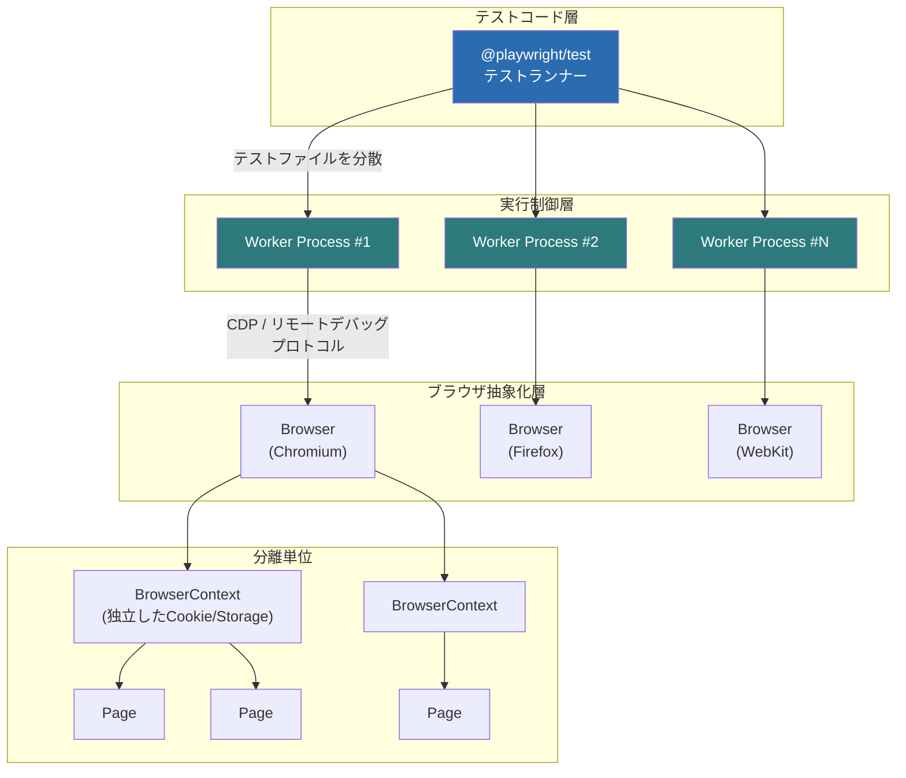

このアーキテクチャの要点は次の3層です。

| 層 | 役割 | 特徴 |
|---|---|---|
| テストランナー(`@playwright/test`) | テストの発見・スケジューリング・レポート生成 | Jest/Mocha等と異なり、ブラウザ自動化に特化した専用ランナー |
| Workerプロセス | OSプロセスとして独立実行 | Worker間で状態を共有できない(意図的な設計) |
| BrowserContext | Cookie・LocalStorage・権限などを分離する単位 | 通常のブラウザにおける「シークレットウィンドウ」に近い概念で、1つのBrowserプロセスから複数生成可能 |

Playwright Testは**テストランナー・アサーションライブラリ・並列化・リッチなツール群(コード生成/トレースビューア)を1つに束ねたオールインワン設計**である点が、公式ドキュメントでも明示されています。

**参照URL:**
- https://playwright.dev/docs/intro
- https://playwright.dev/docs/browser-contexts
- https://learn.microsoft.com/en-us/shows/getting-started-with-end-to-end-testing-with-playwright/introduction-to-playwright-for-end-to-end-testing

---

## 2. インストールとプロジェクトセットアップ

### 2.1 インストール

```bash
npm init playwright@latest
```

このコマンドは新規プロジェクトの初期化、または既存プロジェクトへの追加のどちらにも対応しており、対話式で以下を確認します。

- TypeScript か JavaScript か(デフォルト: TypeScript)
- テストフォルダ名(デフォルト: `tests`、既に存在する場合は `e2e`)
- GitHub Actionsワークフローを追加するか
- Playwrightブラウザをインストールするか(デフォルト: Yes)

セットアップ後に生成される構成は以下の通りです。

```text
playwright.config.ts     # テスト設定(対象ブラウザ・タイムアウト・リトライ・レポーター等を集約)
package.json
package-lock.json
tests/
  example.spec.ts        # 最小構成のサンプルテスト
```

### 2.2 動作要件(2026年7月時点)

| 項目 | 要件 |
|---|---|
| Node.js | 22.x / 24.x / 26.x(いずれも最新版) |
| Windows | Windows 11以降、Windows Server 2019以降、またはWSL |
| macOS | macOS 14 (Sonoma) 以降 |
| Linux | Debian 12/13、Ubuntu 22.04/24.04/26.04(x86-64またはarm64) |

### 2.3 テストの実行とレポート確認

```bash
# 全テスト実行(Chromium/Firefox/WebKitで並列)
npx playwright test

# 特定ブラウザのみ
npx playwright test --project=chromium

# 特定ファイルのみ
npx playwright test tests/example.spec.ts

# ヘッド付きモード(ブラウザウィンドウを表示)
npx playwright test --headed

# UI Mode(推奨: 開発時のデバッグ体験)
npx playwright test --ui
```

```bash
# HTMLレポートを表示
npx playwright show-report
```

HTMLレポートは失敗時に自動で開き、ブラウザ別・合格/失敗/flaky/スキップでフィルタ可能なダッシュボードを提供します。

### 2.4 バージョン更新

```bash
npm install -D @playwright/test@latest
npx playwright install --with-deps
npx playwright --version
```

**参照URL:**
- https://playwright.dev/docs/intro
- https://playwright.dev/docs/test-configuration
- https://playwright.dev/docs/test-reporters

---

## 3. 基本概念: Browser / BrowserContext / Page

Playwright Testでは、テスト関数の引数に必要なオブジェクトを宣言するだけで自動的に注入される「フィクスチャ」という仕組みが中核にあります(詳細は第7章)。まずは代表的な組み込みフィクスチャを押さえておきましょう。

| フィクスチャ | 型 | 説明 |
|---|---|---|
| `page` | `Page` | このテスト実行専用の分離されたページ |
| `context` | `BrowserContext` | このテスト実行専用の分離されたコンテキスト。`page`はこのコンテキストに属する |
| `browser` | `Browser` | リソース最適化のためテスト間で共有される |
| `browserName` | `string` | 実行中のブラウザ名(`chromium` / `firefox` / `webkit`) |
| `request` | `APIRequestContext` | HTTPリクエスト専用の分離されたコンテキスト |

```ts
import { test, expect } from '@playwright/test';

test('basic test', async ({ page }) => {
  await page.goto('https://playwright.dev/');
  await expect(page).toHaveTitle(/Playwright/);
});
```

### なぜ`BrowserContext`による分離が重要か

Playwrightは**各テストを独立したBrowserContextで実行する**ことをデフォルトの設計思想としています。これにより、Cookie・セッションストレージ・権限設定などがテスト間で漏れることなく、シークレットウィンドウを都度開くのと同等の再現性が得られます。テストの並列化・リトライ耐性・デバッグのしやすさは、すべてこの「分離(Isolation)」の恩恵です。

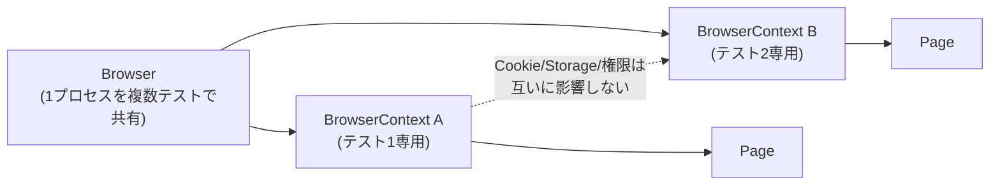

**参照URL:**
- https://playwright.dev/docs/test-fixtures
- https://playwright.dev/docs/browser-contexts
- https://playwright.dev/docs/pages

---

## 4. Locators(ロケーター)戦略

Locatorは、Playwrightの自動待機とリトライ可能性(retry-ability)の中核をなす概念です。Locatorは「その瞬間にページ上の要素を探す方法」を表す**遅延評価のオブジェクト**であり、アクションを実行するたびにDOMを再検索します。つまり、DOMの再レンダリングが発生しても、Locatorは常に最新の要素を指し続けます。

### 4.1 推奨ロケーターの優先順位

公式ドキュメントは、ユーザーが実際に知覚する属性(ロール・テキスト・ラベルなど)を優先することを強く推奨しています。

| 優先度 | メソッド | 用途 |
|---|---|---|
| 1(最推奨) | `page.getByRole()` | ARIAロールとアクセシブルネームで検索。アクセシビリティ検証の早期フィードバックにもなる |
| 2 | `page.getByLabel()` | ラベルに紐づくフォームコントロールを検索 |
| 3 | `page.getByPlaceholder()` | placeholder属性で検索 |
| 4 | `page.getByText()` | 非インタラクティブ要素(`div`/`span`/`p`)のテキスト内容で検索 |
| 5 | `page.getByAltText()` | 画像の代替テキストで検索 |
| 6 | `page.getByTitle()` | title属性で検索 |
| 7 | `page.getByTestId()` | `data-testid`(カスタマイズ可)で検索。UI変更に強いが非ユーザー視点 |
| 非推奨 | CSS / XPath | DOM構造への依存が強く壊れやすい |

```ts
await page.getByRole('button', { name: 'Sign in' }).click();
await page.getByLabel('Password').fill('secret-password');
await expect(page.getByText('Welcome, John!')).toBeVisible();
```

`data-testid`を独自の属性名に変更したい場合は設定で切り替え可能です。

```ts
// playwright.config.ts
export default defineConfig({
  use: {
    testIdAttribute: 'data-pw',
  },
});
```

### 4.2 Locatorのフィルタリングとチェーン

一覧の中から特定要素を絞り込む際は `filter()` を使います。テキスト・子孫要素の有無・可視性で絞り込めます。

```ts
// テキストで絞り込み
await page
  .getByRole('listitem')
  .filter({ hasText: 'Product 2' })
  .getByRole('button', { name: 'Add to cart' })
  .click();

// 子孫ロケーターの有無で絞り込み(見出しに"Product 2"を含むリスト項目)
await page
  .getByRole('listitem')
  .filter({ has: page.getByRole('heading', { name: 'Product 2' }) })
  .getByRole('button', { name: 'Add to cart' })
  .click();
```

複数フィルタのチェーンや、`.and()` / `.or()` による論理結合もサポートされています。

```ts
// role と title の両方に一致
const button = page.getByRole('button').and(page.getByTitle('Subscribe'));

// どちらかが表示されたら処理を分岐(2要素同時出現時はstrictエラーになるためfirst()で回避)
const newEmail = page.getByRole('button', { name: 'New' });
const dialog = page.getByText('Confirm security settings');
await expect(newEmail.or(dialog).first()).toBeVisible();
```

### 4.3 Strictモード

Locatorは**厳格(strict)**であり、複数要素にマッチする操作(クリックなど)は例外をスローします。これは意図しない要素操作によるテストの誤動作を防ぐ安全装置です。`count()`のような複数要素向け操作は例外の対象外です。`.first()` / `.last()` / `.nth()` によるオプトアウトは可能ですが、DOM変更時に意図しない要素を指す危険があるため非推奨とされています。

### 4.4 Shadow DOMの扱い

PlaywrightのLocatorは**デフォルトでShadow DOMを貫通**します(XPathを除く)。Web Componentsを扱うプロジェクトでも特別な記述なしに要素を検索できる点は、他ツールとの大きな差異です。

**参照URL:**
- https://playwright.dev/docs/locators
- https://playwright.dev/docs/best-practices
- https://playwright.dev/docs/other-locators

---

## 5. Auto-waiting(自動待機)の仕組み

Playwrightのテストが安定している(Flakyになりにくい)最大の理由は、アクション実行前に**アクショナビリティチェック(actionability checks)** を自動的に行い、すべての条件が満たされるまで待機してからアクションを実行する設計にあります。条件がタイムアウトまでに満たされない場合は`TimeoutError`が発生します。

例えば `locator.click()` の場合、Playwrightは次を保証してから実行します。

- Locatorが**厳密に1要素**に解決されること
- 要素が**可視(Visible)**であること
- 要素が**安定(Stable)**していること(アニメーション中でない)
- 要素が**イベントを受け取れる**こと(他要素に隠れていない)
- 要素が**有効(Enabled)**であること

### アクショナビリティチェックのフロー

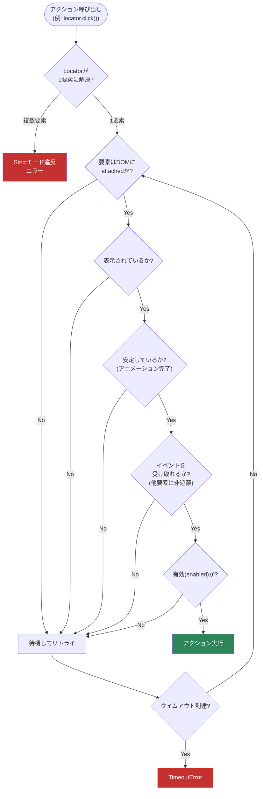

### 5.1 Web-First Assertionsとの関係

`expect(locator).toBeVisible()`のような**Web-Firstアサーション**も同様にリトライを内蔵しており、条件が満たされるまで自動的に再試行します。手動で`isVisible()`のような即時判定APIを使うと、この恩恵を失いFlakyの原因になります(詳細は第6章)。

**参照URL:**
- https://playwright.dev/docs/actionability
- https://playwright.dev/docs/best-practices

---

## 6. Web-First Assertions(アサーション)

Playwright Testの`expect`は、標準のJest系アサーションを拡張した**Web-First Assertions**を提供します。最大の特徴は、期待条件が満たされるまで自動的にポーリング・リトライする点です。

```ts
// 👍 推奨: 表示されるまで自動的に待機・リトライする
await expect(page.getByText('Welcome')).toBeVisible();

// 👎 非推奨: 即座に判定し、リトライしない(Flakyの温床)
expect(await page.getByText('Welcome').isVisible()).toBe(true);
```

### 6.1 主なアサーションの分類

| カテゴリ | 代表例 |
|---|---|
| Locator(要素)系 | `toBeVisible()` / `toBeEnabled()` / `toHaveText()` / `toHaveCount()` / `toHaveAttribute()` |
| Page系 | `toHaveTitle()` / `toHaveURL()` |
| APIResponse系 | `toBeOK()` |
| 汎用値比較 | `toEqual()` / `toMatchSnapshot()` |

### 6.2 Soft Assertions(ソフトアサーション)

通常のアサーションは失敗した時点でテストを即座に終了しますが、`expect.soft()`を使うと**失敗を記録しつつテストの実行を継続**し、テスト終了時にまとめて失敗一覧を報告します。1つのテストで複数の検証観点を独立して確認したい場合に有用です。

```ts
await expect.soft(page.getByTestId('status')).toHaveText('Success');
// 上のアサーションが失敗してもテストは継続する
await page.getByRole('link', { name: 'next page' }).click();
```

**参照URL:**
- https://playwright.dev/docs/test-assertions
- https://playwright.dev/docs/best-practices

---

## 7. Test Fixtures(テストフィクスチャ)

Playwright Testは**フィクスチャ**という概念を中心に設計されています。フィクスチャとは、テストに必要な環境(前提条件)を用意し、テストにはそれ以外の情報を渡さない仕組みです。フィクスチャはテスト間で分離されており、共通のセットアップコードを持つテストを「意味」でグルーピングできるようになります。

### 7.1 Fixtureなしとありの比較

**Fixtureを使わない場合**(before/afterフックによる典型的な構成):

```ts
import { test } from '@playwright/test';
import { TodoPage } from './todo-page';

test.describe('todo tests', () => {
  let todoPage: TodoPage;

  test.beforeEach(async ({ page }) => {
    todoPage = new TodoPage(page);
    await todoPage.goto();
    await todoPage.addItem('item1');
  });

  test.afterEach(async () => {
    await todoPage.removeAll();
  });

  test('adds an item', async () => {
    await todoPage.addItem('my item');
  });
});
```

**Fixtureを使う場合**(`test.extend()`でセットアップ/ティアダウンをカプセル化):

```ts
import { test as base } from '@playwright/test';
import { TodoPage } from './todo-page';

const test = base.extend<{ todoPage: TodoPage }>({
  todoPage: async ({ page }, use) => {
    const todoPage = new TodoPage(page);
    await todoPage.goto();
    await todoPage.addItem('item1');
    await use(todoPage);          // ← ここでテスト本体が実行される
    await todoPage.removeAll();   // ← テスト終了後にティアダウン
  },
});

test('adds an item', async ({ todoPage }) => {
  await todoPage.addItem('my item');
});
```

フィクスチャは次の利点を持ちます。

- **カプセル化**: セットアップとティアダウンが1箇所にまとまる
- **再利用性**: 複数のテストファイルで使い回せる
- **オンデマンド**: テストが実際に必要とするフィクスチャのみセットアップされる
- **合成可能**: フィクスチャ同士が依存し合える
- **柔軟性**: テストごとに任意のフィクスチャの組み合わせが可能

### 7.2 Worker-scopedフィクスチャ

Playwright Testは複数のWorkerプロセスでテストファイルを並列実行します。フィクスチャには「テストスコープ(デフォルト)」と「ワーカースコープ」があり、後者は**Workerプロセスにつき1回だけ**セットアップされ、そのWorkerが実行する全テストで再利用されます。DBセットアップや外部サービス起動など、コストの高い初期化に向いています。

```ts
import { test as base } from '@playwright/test';

type Account = { username: string; password: string };

export const test = base.extend<{}, { account: Account }>({
  account: [async ({ browser }, use, workerInfo) => {
    const username = `user-${workerInfo.workerIndex}`;
    const page = await browser.newPage();
    await page.goto('/signup');
    await page.getByLabel('User Name').fill(username);
    await page.getByText('Sign up').click();
    await page.close();
    await use({ username, password: 'verysecure' });
  }, { scope: 'worker' }],
});
```

### 7.3 Automatic Fixtures(自動フィクスチャ)

`{ auto: true }`を付けると、テストが明示的に要求しなくても常にセットアップされます。失敗時のログ収集など「常に動いてほしい」補助的な処理に向いています。

```ts
export const test = base.extend<{ saveLogsOnFailure: void }>({
  saveLogsOnFailure: [async ({}, use, testInfo) => {
    await use();
    if (testInfo.status !== testInfo.expectedStatus) {
      // 失敗時のみログを添付する処理をここに書く
    }
  }, { auto: true }],
});
```

### 7.4 実行順序を理解する

フィクスチャの実行順序には明確なルールがあります。

- フィクスチャAがフィクスチャBに依存する場合、**Bは常にAより先にセットアップされ、Aより後にティアダウン**される
- 非自動フィクスチャは**遅延評価**され、テスト/フックが実際に必要とした時点で初めてセットアップされる
- テストスコープのフィクスチャは各テスト後にティアダウンされ、ワーカースコープのフィクスチャはWorkerプロセス終了時にのみティアダウンされる

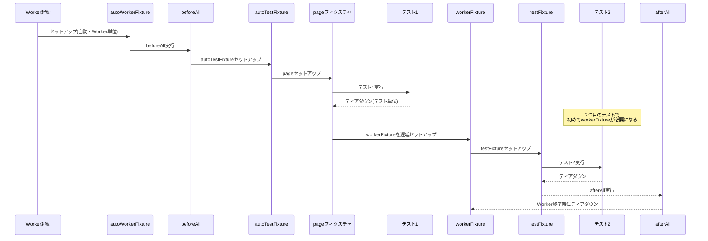

### 7.5 複数モジュールのフィクスチャ合成

```ts
import { mergeTests } from '@playwright/test';
import { test as dbTest } from './database-fixtures';
import { test as a11yTest } from './a11y-fixtures';

export const test = mergeTests(dbTest, a11yTest);
```

**参照URL:**
- https://playwright.dev/docs/test-fixtures
- https://playwright.dev/docs/test-parallel

---

## 8. Page Object Model(POM)設計パターン

大規模なテストスイートでは、テストの可読性と保守性を高めるために**Page Object Model**の導入が推奨されています。Page Objectはアプリケーションの特定の画面(あるいは画面の一部)を表すクラスで、要素のLocatorを1箇所に集約し、画面固有の操作を高レベルAPIとして提供します。

```ts
// playwright-dev-page.ts
import { expect, type Locator, type Page } from '@playwright/test';

export class PlaywrightDevPage {
  readonly page: Page;
  readonly getStartedLink: Locator;
  readonly gettingStartedHeader: Locator;

  constructor(page: Page) {
    this.page = page;
    this.getStartedLink = page.getByRole('link', { name: 'Get started' });
    this.gettingStartedHeader = page.getByRole('heading', { name: 'Installation' });
  }

  async goto() {
    await this.page.goto('https://playwright.dev');
  }

  async clickGetStarted() {
    await this.getStartedLink.first().click();
    await expect(this.gettingStartedHeader).toBeVisible();
  }
}
```

```ts
// example.spec.ts
import { test, expect } from '@playwright/test';
import { PlaywrightDevPage } from './playwright-dev-page';

test('Get Startedからインストールページへ遷移できる', async ({ page }) => {
  const devPage = new PlaywrightDevPage(page);
  await devPage.goto();
  await devPage.clickGetStarted();
});
```

### 8.1 POM単体からFixture統合されたPOMへ

POMは単体でも有用ですが、実務では第7章のFixtureと組み合わせることで真価を発揮します。テストごとに`new TodoPage(page)`と書く代わりに、フィクスチャとして注入すればテストコードから初期化・後始末のノイズが消えます。

```ts
import { test as base } from '@playwright/test';
import { PlaywrightDevPage } from './playwright-dev-page';

export const test = base.extend<{ devPage: PlaywrightDevPage }>({
  devPage: async ({ page }, use) => {
    const devPage = new PlaywrightDevPage(page);
    await devPage.goto();
    await use(devPage);
  },
});
```

```ts
import { test } from './fixtures';

test('Get Startedからインストールページへ遷移できる', async ({ devPage }) => {
  await devPage.clickGetStarted();
});
```

### 8.2 POM設計のポイント

- Locatorはコンストラクタで一括初期化し、テストコードに直接CSS/XPathを書かせない
- 画面固有の「意味のある操作」(例: `login()`、`addToCart()`)をメソッド化し、内部実装の変更をPOM内に閉じ込める
- アサーションをPOM内に持たせるかは議論があるが、**画面遷移の確認など操作の一部として自然なもの**はPOM内に置き、**ビジネスロジックの検証**はテスト側に置くと責務が分離しやすい

**参照URL:**
- https://playwright.dev/docs/pom
- https://playwright.dev/docs/test-fixtures

---

## 9. 並列実行とWorkerプロセス

Playwright Testは**デフォルトで並列実行**されます。複数のWorkerプロセス(OSプロセスとして独立)が同時に起動し、各Workerが自分自身のブラウザインスタンスを持ちます。デフォルトでは**テストファイル単位**が並列化の粒度であり、同一ファイル内のテストは順番に、同じWorkerプロセス内で実行されます。

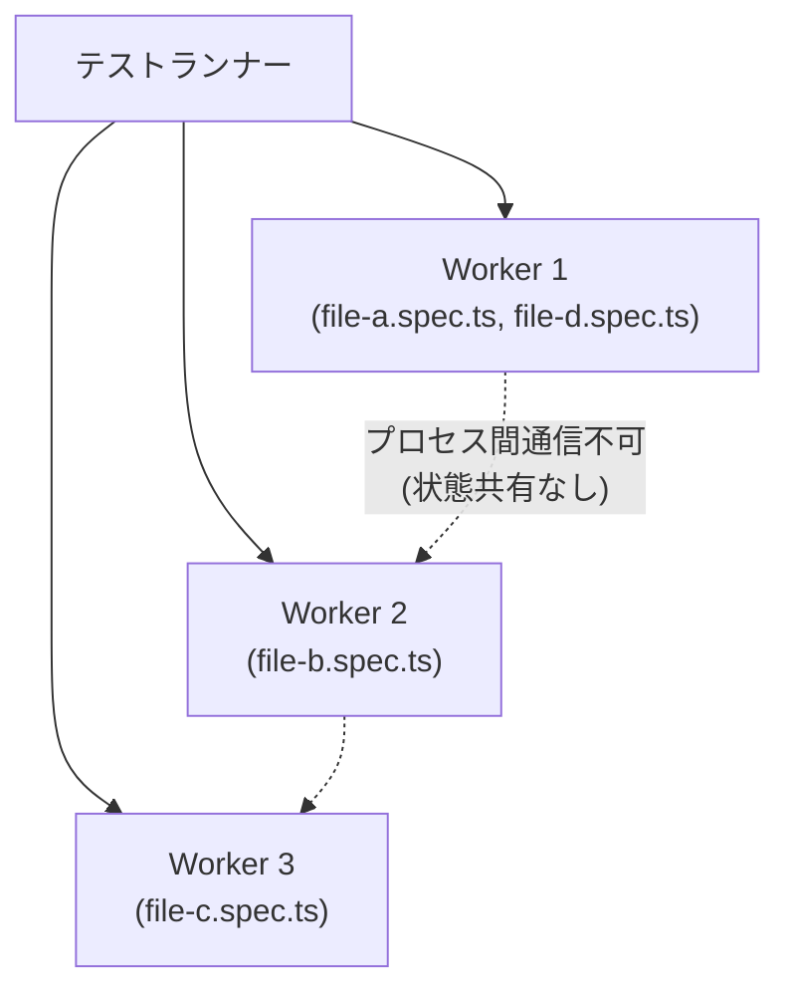

### 9.1 Worker数の制御

```bash
npx playwright test --workers 4
```

```ts
// playwright.config.ts
export default defineConfig({
  workers: process.env.CI ? 2 : undefined, // CIでは絞り、ローカルはCPUコア数に応じて自動
});
```

並列化を無効化(デバッグ時など)したい場合は`--workers=1`を指定します。

### 9.2 ファイル内並列化(fullyParallel)

デフォルトでは同一ファイル内のテストは順番に実行されますが、`test.describe.configure({ mode: 'parallel' })`または設定ファイルの`fullyParallel: true`によって、ファイル内のテストも並列化できます。

```ts
test.describe.configure({ mode: 'parallel' });

test('独立したテストA', async ({ page }) => { /* ... */ });
test('独立したテストB', async ({ page }) => { /* ... */ });
```

> **注意**: 並列テストは別々のWorkerプロセスで実行されるため、グローバル変数や状態を共有できません。各テストは`beforeAll`/`afterAll`を含む関連フックをそれぞれ独立して実行します。

### 9.3 Serialモード(非推奨だが必要な場面もある)

相互に依存するテストは`test.describe.configure({ mode: 'serial' })`でグループ化できますが、公式ドキュメントは「通常はテストを独立させる方が良い」と明言しています。1つが失敗すると後続はすべてスキップされます。

### 9.4 Worker単位でのデータ分離

`testInfo.workerIndex`を使うことで、Worker間でテストデータ(DBユーザー等)を安全に分離できます。

```ts
export const test = baseTest.extend<{}, { dbUserName: string }>({
  dbUserName: [async ({}, use) => {
    const userName = `user-${test.info().workerIndex}`;
    await createUserInTestDatabase(userName);
    await use(userName);
    await deleteUserFromTestDatabase(userName);
  }, { scope: 'worker' }],
});
```

**参照URL:**
- https://playwright.dev/docs/test-parallel
- https://playwright.dev/docs/test-fixtures

---

## 10. Sharding(シャーディング)によるスケールアウト

1台のマシンでの並列化には限界があります。**Sharding**は、テストスイート全体を複数の「シャード」に分割し、複数のマシン(典型的にはCIのジョブ)で同時に実行する仕組みです。

```bash
npx playwright test --shard=1/4
npx playwright test --shard=2/4
npx playwright test --shard=3/4
npx playwright test --shard=4/4
```

4台で並列実行すれば、理論上テストスイート全体の実行時間を1/4に短縮できます。

### 10.1 シャードのバランシング

| 設定 | 分割の粒度 | 特徴 |
|---|---|---|
| `fullyParallel: true` | **個々のテスト単位** | シャード間でテスト数が均等に分配されやすい(推奨) |
| `fullyParallel`なし(デフォルト) | **ファイル単位** | ファイルごとのテスト数に偏りがあるとシャード間の負荷が不均衡になりやすい |

### 10.2 レポートのマージ

シャードごとに生成された個別レポートを1つに統合するには、`blob`レポーターを使います。

```ts
// playwright.config.ts
export default defineConfig({
  reporter: process.env.CI ? 'blob' : 'html',
});
```

```bash
npx playwright merge-reports --reporter html ./all-blob-reports
```

### 10.3 GitHub Actionsでのシャーディング例

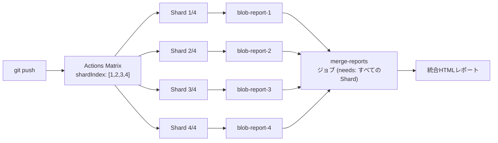

```yaml
# .github/workflows/playwright.yml (抜粋)
jobs:
  playwright-tests:
    strategy:
      fail-fast: false
      matrix:
        shardIndex: [1, 2, 3, 4]
        shardTotal: [4]
    steps:
      - uses: actions/checkout@v5
      - uses: actions/setup-node@v5
        with:
          node-version: lts/*
      - run: npm ci
      - run: npx playwright install --with-deps
      - run: npx playwright test --shard=${{ matrix.shardIndex }}/${{ matrix.shardTotal }}
      - uses: actions/upload-artifact@v4
        if: ${{ !cancelled() }}
        with:
          name: blob-report-${{ matrix.shardIndex }}
          path: blob-report
          retention-days: 1

  merge-reports:
    if: ${{ !cancelled() }}
    needs: [playwright-tests]
    runs-on: ubuntu-latest
    steps:
      - uses: actions/download-artifact@v5
        with:
          path: all-blob-reports
          pattern: blob-report-*
          merge-multiple: true
      - run: npx playwright merge-reports --reporter html ./all-blob-reports
      - uses: actions/upload-artifact@v4
        with:
          name: html-report
          path: playwright-report
```

**参照URL:**
- https://playwright.dev/docs/test-sharding
- https://playwright.dev/docs/test-parallel
- https://playwright.dev/docs/test-reporters

---

## 11. リトライとFlakyテスト対策

失敗したテストを自動的に再試行する仕組みが**Retries**です。デフォルトでは無効ですが、CI環境では有効化するのが一般的です。

```bash
npx playwright test --retries=3
```

```ts
export default defineConfig({
  retries: process.env.CI ? 2 : 0,
});
```

### 11.1 テストの分類

| 分類 | 意味 |
|---|---|
| passed | 初回実行で合格 |
| flaky | 初回は失敗したがリトライで合格 |
| failed | 初回・リトライすべてで失敗 |

Workerプロセスはテストが1つでも失敗すると**破棄され、新しいWorkerプロセスが起動**します。これは、失敗したテストが残した副作用(グローバル状態の汚染など)が後続テストに影響しないようにするための設計です。リトライが有効な場合、新しいWorkerプロセスは失敗したテストからやり直します。

### 11.2 リトライ回数はテストの中からも参照できる

```ts
test('サーバー状態に依存するテスト', async ({ page }, testInfo) => {
  if (testInfo.retry) {
    await cleanUpServerSideCache();
  }
  // ...
});
```

### 11.3 Flaky対策の本質

リトライは**対症療法**であり、根本原因(不十分な待機、不安定なテストデータ、外部依存のブレ)への対応が本筋です。第4〜6章のLocator戦略・Auto-waiting・Web-Firstアサーションを正しく使うことが、最も効果的なFlaky対策になります。

**参照URL:**
- https://playwright.dev/docs/test-retries
- https://playwright.dev/docs/best-practices

---

## 12. Trace Viewerによるデバッグ

**Trace Viewer**は、記録されたテスト実行の軌跡(トレース)を探索できるGUIツールです。各アクションの前後でページがどう変化したかを、タイムラインを操作しながら視覚的に確認できます。

### 12.1 トレースの記録設定

デフォルトの設定テンプレートでは、CI環境で「最初のリトライ時にのみ」トレースを記録するようになっています(常時記録は性能への影響が大きいため非推奨)。

```ts
// playwright.config.ts
export default defineConfig({
  retries: process.env.CI ? 2 : 0,
  use: {
    trace: 'on-first-retry', // 失敗したテストの最初のリトライでのみ記録
  },
});
```

ローカルで強制的に記録したい場合:

```bash
npx playwright test --trace on
```

### 12.2 トレースの閲覧フロー

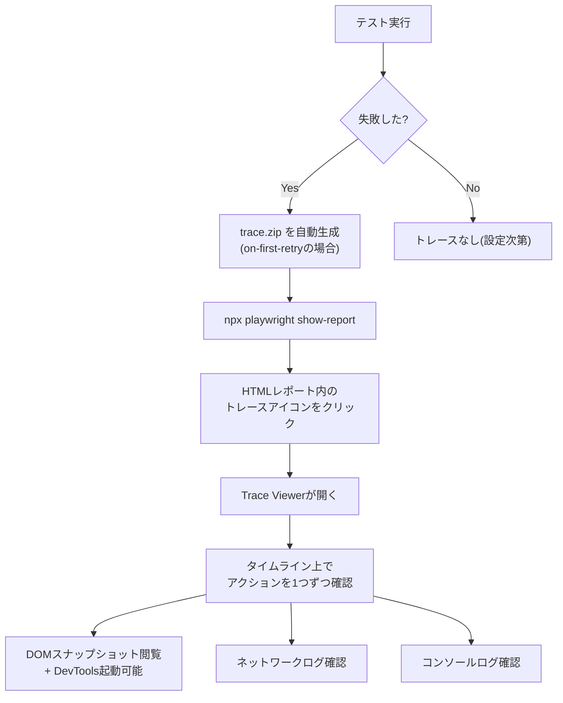

Trace Viewerでは、各アクション実行前後のDOMスナップショットを完全にインタラクティブな形で再現でき、ブラウザのDevToolsをその場で開いてHTML/CSSを検証することも可能です。ネットワークリクエスト・コンソールログ・実行時のログ(要素が可視になるまでの待機など)も同時に確認できます。

### 12.3 UI Modeとの使い分け

| ツール | 主な用途 |
|---|---|
| UI Mode(`--ui`) | ローカル開発中の**リアルタイム**デバッグ・ウォッチモード |
| Trace Viewer | **CI環境で失敗したテスト**の事後解析(共有可能なPWAとして) |

**参照URL:**
- https://playwright.dev/docs/trace-viewer-intro
- https://playwright.dev/docs/trace-viewer
- https://playwright.dev/docs/test-ui-mode

---

## 13. ネットワークインターセプションとAPIモック

Playwrightは、ページが発行するHTTP(S)リクエスト(XHR・fetchを含む)をすべて追跡・変更・モックするAPIを提供します。

### 13.1 APIレスポンスの完全モック

```ts
test('APIをモックしフルーツ一覧を表示する', async ({ page }) => {
  await page.route('*/**/api/v1/fruits', async route => {
    const json = [{ name: 'Strawberry', id: 21 }];
    await route.fulfill({ json });
  });

  await page.goto('https://demo.playwright.dev/api-mocking');
  await expect(page.getByText('Strawberry')).toBeVisible();
});
```

このパターンでは実際のAPIには一切リクエストが送信されず、指定したモックデータでレスポンスが完結します。

### 13.2 実際のレスポンスを部分的に改変

実サーバーへのリクエストは発生させつつ、レスポンスボディだけを差し替えることも可能です。

```ts
test('実APIのレスポンスに要素を追加する', async ({ page }) => {
  await page.route('*/**/api/v1/fruits', async route => {
    const response = await route.fetch();
    const json = await response.json();
    json.push({ name: 'Loquat', id: 100 });
    await route.fulfill({ response, json });
  });

  await page.goto('https://demo.playwright.dev/api-mocking');
  await expect(page.getByText('Loquat', { exact: true })).toBeVisible();
});
```

### 13.3 HARファイルによる記録・再生

HAR(HTTP Archive)ファイルはページロード時に発生した全通信の記録です。これをテストのモックデータとして再利用できます。

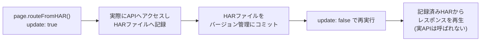

```ts
await page.routeFromHAR('./hars/fruit.har', {
  url: '*/**/api/v1/fruits',
  update: false, // true にすると実データでHARを更新する
});
```

HAR再生はURLとHTTPメソッドを厳密に照合し、POSTの場合はペイロードも厳密照合します。複数のエントリが一致する場合はヘッダー一致数が最も多いものが選択されます。

### 13.4 WebSocketのモック

```ts
await page.routeWebSocket('wss://example.com/ws', ws => {
  ws.onMessage(message => {
    if (message === 'request') ws.send('response');
  });
});
```

実サーバーに接続しつつ、メッセージの一部だけを書き換える「中間者」的な使い方も可能です。

**参照URL:**
- https://playwright.dev/docs/mock
- https://playwright.dev/docs/network

---

## 14. 認証状態の再利用戦略

Playwrightはテストごとに独立したBrowserContextで実行されるため、毎回ログインフローを繰り返すのは非効率です。公式ドキュメントは認証状態(Cookie・LocalStorage・IndexedDB)をファイルに保存し、テスト開始時に再利用する複数の戦略を提示しています。

### 14.1 認証戦略の選択フロー

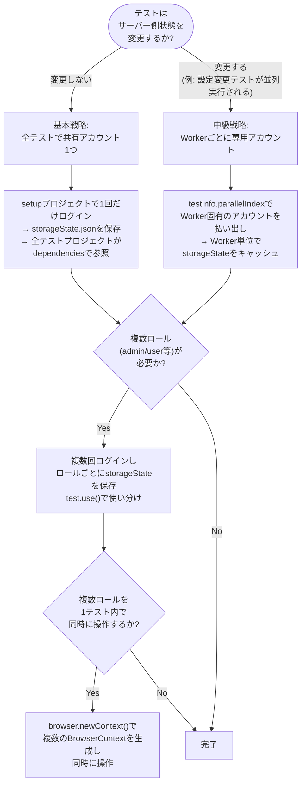

### 14.2 基本戦略: 共有アカウント

```ts
// tests/auth.setup.ts
import { test as setup, expect } from '@playwright/test';
import path from 'path';

const authFile = path.join(__dirname, '../playwright/.auth/user.json');

setup('authenticate', async ({ page }) => {
  await page.goto('https://example.com/login');
  await page.getByLabel('Username').fill('username');
  await page.getByLabel('Password').fill('password');
  await page.getByRole('button', { name: 'Sign in' }).click();
  await page.waitForURL('https://example.com/');
  await page.context().storageState({ path: authFile });
});
```

```ts
// playwright.config.ts
export default defineConfig({
  projects: [
    { name: 'setup', testMatch: /.*\.setup\.ts/ },
    {
      name: 'chromium',
      use: { ...devices['Desktop Chrome'], storageState: 'playwright/.auth/user.json' },
      dependencies: ['setup'],
    },
  ],
});
```

> **重要**: `playwright/.auth`ディレクトリは機密情報(Cookie・トークン)を含むため、必ず`.gitignore`に追加してください。

### 14.3 中級戦略: Workerごとに専用アカウント

サーバー側状態を変更するテスト(設定変更のテストなど)が並列実行される場合、共有アカウントでは競合が起きます。この場合はWorkerごとに一意なアカウントを用意します。

```ts
export const test = baseTest.extend<{}, { workerStorageState: string }>({
  storageState: ({ workerStorageState }, use) => use(workerStorageState),
  workerStorageState: [async ({ browser }, use) => {
    const id = test.info().parallelIndex;
    const fileName = path.resolve(test.info().project.outputDir, `.auth/${id}.json`);
    if (fs.existsSync(fileName)) {
      await use(fileName);
      return;
    }
    const page = await browser.newPage({ storageState: undefined });
    const account = await acquireAccount(id);
    await page.goto('/login');
    // ... ログイン処理 ...
    await page.context().storageState({ path: fileName });
    await page.close();
    await use(fileName);
  }, { scope: 'worker' }],
});
```

### 14.4 APIリクエストによる認証(UIを経由しない高速化)

```ts
setup('authenticate via API', async ({ request }) => {
  await request.post('https://example.com/login', {
    form: { user: 'user', password: 'password' },
  });
  await request.storageState({ path: 'playwright/.auth/user.json' });
});
```

### 14.5 複数ロールの同時操作

```ts
test('adminとuserが同時にやり取りする', async ({ browser }) => {
  const adminContext = await browser.newContext({ storageState: 'playwright/.auth/admin.json' });
  const userContext = await browser.newContext({ storageState: 'playwright/.auth/user.json' });
  const adminPage = await adminContext.newPage();
  const userPage = await userContext.newPage();
  // ... 両方のページを操作 ...
  await adminContext.close();
  await userContext.close();
});
```

### 14.6 Passkeys(WebAuthn)への対応

`browserContext.credentials`は仮想WebAuthn認証器として機能し、パスキー認証にも対応します。Cookie系と異なり`storageState`ではなく`credentials.create()` / `credentials.install()`で**命令的に**シードする点が特徴です。

**参照URL:**
- https://playwright.dev/docs/auth
- https://playwright.dev/docs/api-testing
- https://playwright.dev/docs/test-fixtures

---

## 15. Visual Regression Testing(視覚的回帰テスト)

Playwright Testは`expect(page).toHaveScreenshot()`によって、スクリーンショットの生成と比較を組み込みでサポートします。初回実行時に基準画像(ゴールデンファイル)が生成され、以降の実行はそれと比較されます。

```ts
test('トップページの見た目を検証', async ({ page }) => {
  await page.goto('https://playwright.dev');
  await expect(page).toHaveScreenshot();
});
```

### 15.1 注意点: 環境依存性

ブラウザのレンダリングはOS・バージョン・設定・ハードウェア・電源状態(バッテリー/電源接続)・headlessモードなどで変わり得ます。基準画像を生成した環境と同一環境で実行することが、視覚的テストの安定運用の前提条件です(多くの場合、CI上のLinuxコンテナに統一します)。

### 15.2 スナップショットの命名規則

```text
example.spec.ts-snapshots/
  example-test-1-chromium-darwin.png
```

`chromium-darwin`の部分はブラウザ名とOSを表し、レンダリング差異のため環境ごとに個別のスナップショットが必要になります。複数プロジェクト構成の場合は`chromium`の部分がプロジェクト名に置き換わります。

### 15.3 基準画像の更新

```bash
npx playwright test --update-snapshots
```

### 15.4 差分許容度とノイズ除去

```ts
// 数ピクセルの差異は許容する
await expect(page).toHaveScreenshot({ maxDiffPixels: 100 });
```

動的要素(広告・iframe等)を除外したい場合は、カスタムCSSを適用してからスクリーンショットを撮ることで決定論性を高められます。

```ts
// screenshot.css
// iframe { visibility: hidden; }

await expect(page).toHaveScreenshot({
  stylePath: path.join(__dirname, 'screenshot.css'),
});
```

### 15.5 非画像スナップショット

```ts
expect(await page.textContent('.hero__title')).toMatchSnapshot('hero.txt');
```

テキストや任意のバイナリデータの比較にも対応しており、Playwrightがコンテンツタイプを自動判定して適切な比較アルゴリズムを選びます。

**参照URL:**
- https://playwright.dev/docs/test-snapshots

---

## 16. API Testing(バックエンドAPIテスト)

Playwrightはブラウザ操作だけでなく、Node.jsから直接HTTPリクエストを送信する`APIRequestContext`も提供します。ブラウザを起動せずにサーバーAPIそのものを検証したい場合や、UIテストの前提条件(サーバー側状態)を準備する場合に有用です。

### 16.1 設定とベーステスト

```ts
// playwright.config.ts
export default defineConfig({
  use: {
    baseURL: 'https://api.example.com',
    extraHTTPHeaders: {
      'Accept': 'application/vnd.example.v1+json',
      'Authorization': `token ${process.env.API_TOKEN}`,
    },
  },
});
```

```ts
test('Issueを作成できる', async ({ request }) => {
  const newIssue = await request.post('/repos/org/repo/issues', {
    data: { title: '[Bug] report', body: '説明文' },
  });
  expect(newIssue.ok()).toBeTruthy();
});
```

`request`フィクスチャは組み込みであり、`baseURL`や`extraHTTPHeaders`などの設定を自動的に引き継ぎます。

### 16.2 UIテストとAPIテストの併用パターン

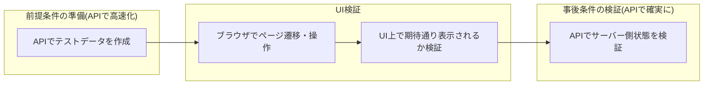

- **事前条件の準備**: UIを経由せずAPIでデータを作成し、UIテストの実行時間を短縮する
- **事後条件の検証**: UI上の操作結果が実際にサーバーへ反映されたかをAPI経由で確認する

```ts
test.beforeAll(async ({ playwright }) => {
  apiContext = await playwright.request.newContext({ baseURL: 'https://api.example.com' });
});

test('最後に作成したIssueが一覧の先頭に表示される', async ({ page }) => {
  await apiContext.post('/repos/org/repo/issues', { data: { title: 'Feature request' } });
  await page.goto('https://example.com/org/repo/issues');
  await expect(page.locator("[data-hovercard-type='issue']").first()).toHaveText('Feature request');
});
```

### 16.3 認証状態の相互運用性

`storageState`は`BrowserContext`と`APIRequestContext`の間で相互運用可能です。APIでログインしてCookieを取得し、それをブラウザコンテキストの初期状態として使うことで、UIログインを完全に省略できます。

```ts
const requestContext = await request.newContext();
await requestContext.get('https://api.example.com/login');
await requestContext.storageState({ path: 'state.json' });

const context = await browser.newContext({ storageState: 'state.json' });
```

**参照URL:**
- https://playwright.dev/docs/api-testing
- https://playwright.dev/docs/auth

---

## 17. UI ModeとVS Code拡張機能

### 17.1 UI Mode

```bash
npx playwright test --ui
```

UI Modeは「タイムトラベル」型のデバッグ体験を提供する統合ビューです。主な機能は以下の通りです。

| 機能 | 内容 |
|---|---|
| テストサイドバー | 全テストファイルを表示し、個別・グループ単位で実行/監視/デバッグ可能 |
| フィルタリング | テスト名・プロジェクト・`@tag`・実行結果(合格/失敗/スキップ)で絞り込み |
| タイムラインビュー | ナビゲーションとアクションを色分けして表示し、アクション単位でスナップショットを確認 |
| DOMスナップショットのポップアウト | 別ウィンドウで開き、DevTools(HTML/CSS/Console)を直接使って調査可能 |
| Pick Locator | DOMスナップショット上でホバーするとLocatorをリアルタイム表示、クリックでプレイグラウンドに追加 |
| Watch Mode | 監視アイコンをクリックすると、コード変更時にテストを自動再実行 |
| Network / Console タブ | 各アクション実行時のネットワークリクエストやコンソールログを確認 |

Docker・GitHub Codespaces環境では、`--ui-host=0.0.0.0`でブラウザ経由のUI Mode利用も可能です(ネットワーク越しにトレース・パスワード等が閲覧可能になる点に注意)。

### 17.2 VS Code拡張機能

VS Code拡張は次の機能を提供します。

- ブレークポイントを使ったライブデバッグ
- Locatorをクリックするとブラウザ上で対応要素がハイライトされる「Show Browsers」機能
- テスト失敗時に詳細なエラーメッセージ(期待値 vs 実際の値、コールログ)をエディタ上に表示
- Copilotによる「Fix with AI」提案(失敗の原因分析とコード修正案)
- Trace Viewerの自動起動によるステップバイステップ解析

**参照URL:**
- https://playwright.dev/docs/test-ui-mode
- https://playwright.dev/docs/getting-started-vscode

---

## 18. CI/CD統合(GitHub Actions)

### 18.1 基本ワークフロー

`npm init playwright@latest`実行時にGitHub Actionsワークフローの追加を選択すると、以下の`.github/workflows/playwright.yml`が自動生成されます。

```yaml
name: Playwright Tests
on:
  push:
    branches: [ main, master ]
  pull_request:
    branches: [ main, master ]
jobs:
  test:
    timeout-minutes: 60
    runs-on: ubuntu-latest
    steps:
    - uses: actions/checkout@v5
    - uses: actions/setup-node@v5
      with:
        node-version: lts/*
    - name: Install dependencies
      run: npm ci
    - name: Install Playwright Browsers
      run: npx playwright install --with-deps
    - name: Run Playwright tests
      run: npx playwright test
    - uses: actions/upload-artifact@v4
      if: ${{ !cancelled() }}
      with:
        name: playwright-report
        path: playwright-report/
        retention-days: 30
```

### 18.2 CI/CDパイプライン全体像

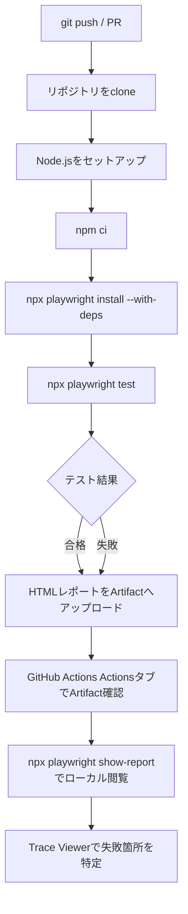

### 18.3 レポートの閲覧

Artifactとしてダウンロードした`playwright-report`はローカルでの直接表示(ファイルを開くだけ)では正しく動作しないため、Webサーバー越しに閲覧する必要があります。

```bash
npx playwright show-report name-of-extracted-report-folder
```

### 18.4 CI最適化のポイント

| 施策 | 効果 |
|---|---|
| Linux(Ubuntu)ランナーを使用 | クラウドCIのコストが最も低い |
| 必要なブラウザのみインストール | `npx playwright install chromium --with-deps`のように絞り込みダウンロード時間を短縮 |
| Sharding併用 | 複数ジョブに分散し実行時間を短縮(第10章参照) |
| `retries`をCIのみ有効化 | ローカルでは0、CIでは2程度に設定するのが定石 |
| Secretsの取り扱い | トレース・レポート・コンソールログには機密情報が含まれ得るため、信頼できるArtifactストアにのみアップロードするか暗号化する |

### 18.5 レポートのWeb公開(Azure Storageの例)

Artifactのzipダウンロードは不便なため、Azure Storageの静的Webサイトホスティングを使い、CIのジョブ内でHTMLレポートを直接公開URLとしてアップロードする方法も紹介されています。Service Principalの発行・Storage Blob Data Contributorロールの付与・GitHub Actions Secretsへの認証情報登録が前提条件です。

**参照URL:**
- https://playwright.dev/docs/ci-intro
- https://playwright.dev/docs/ci
- https://playwright.dev/docs/test-sharding

---

## 19. Docker活用

公式は`mcr.microsoft.com/playwright`イメージを提供しており、ブラウザ本体とOS依存ライブラリを含みますが、Playwrightパッケージ自体は含まれないため別途インストールが必要です。

### 19.1 基本的な使い方

```bash
docker pull mcr.microsoft.com/playwright:v1.61.0-noble
docker run -it --rm --ipc=host mcr.microsoft.com/playwright:v1.61.0-noble /bin/bash
```

信頼できるコード(自社のE2Eテストなど)を実行する場合はrootユーザーで問題ありませんが、Chromiumのサンドボックスがrootでは無効化される点に留意してください。信頼できないWebサイトをクロールする用途では、専用ユーザー+seccompプロファイルの利用が推奨されます。

### 19.2 推奨Docker設定

| 設定 | 理由 |
|---|---|
| `--init`フラグ | PID=1プロセスのゾンビプロセス化を防止 |
| `--ipc=host` | Chromium利用時、これがないとメモリ不足でクラッシュしやすい |
| `--cap-add=SYS_ADMIN`(開発時のみ) | Chromium起動時の謎のエラーを回避 |

### 19.3 リモートPlaywrightサーバー

Dockerコンテナ内でPlaywright Serverを起動し、ホスト側やCIの別マシンからテストを実行することも可能です。サポート外のLinuxディストリビューションでの実行や、リモート実行シナリオに有用です。

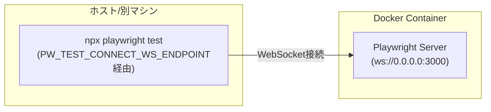

```bash
docker run -p 3000:3000 --rm --init -it --workdir /home/pwuser --user pwuser \
  mcr.microsoft.com/playwright:v1.61.0-noble \
  /bin/sh -c "npx -y playwright@1.61.0 run-server --port 3000 --host 0.0.0.0"
```

```bash
PW_TEST_CONNECT_WS_ENDPOINT=ws://127.0.0.1:3000/ npx playwright test
```

> **重要**: リモート実行時は、テスト側とサーバー側のPlaywrightバージョンを完全に一致させる必要があります。

### 19.4 自前イメージのビルド

```dockerfile
FROM node:20-bookworm
RUN npx -y playwright@1.61.0 install --with-deps
```

**参照URL:**
- https://playwright.dev/docs/docker
- https://playwright.dev/docs/ci

---

## 20. ベストプラクティス総まとめ

公式ドキュメントの「Best Practices」ガイドが提示する原則を、実務での適用ポイントとともに整理します。

### 20.1 テスト哲学

| 原則 | 内容 |
|---|---|
| ユーザーに見える振る舞いを検証する | 関数名や内部実装(配列かどうか、CSSクラス名)ではなく、エンドユーザーが見て操作できるものだけをテスト対象にする |
| テストを可能な限り独立させる | 各テストは自分専用のlocalStorage・sessionStorage・Cookie・データで動くべき。`beforeEach`で共通処理を括り出しつつ、シンプルなテストでは多少の重複を許容する方が読みやすい場合もある |
| サードパーティ依存をテストしない | 外部リンク・外部サーバーはネットワークAPIでモックし、自分が制御できる範囲だけを検証する |
| DBを使う場合は状態を制御する | ステージング環境を固定化し、視覚的回帰テストではOS・ブラウザバージョンを揃える |

### 20.2 実装レベルのベストプラクティス

```ts
// 👍 推奨: ユーザー視点のLocator
page.getByRole('button', { name: 'submit' });

// 👎 非推奨: DOM構造に依存した壊れやすいセレクタ
page.locator('button.buttonIcon.episode-actions-later');
```

```ts
// 👍 推奨: Web-Firstアサーション(自動リトライ)
await expect(page.getByText('welcome')).toBeVisible();

// 👎 非推奨: 即時判定(リトライなし)
expect(await page.getByText('welcome').isVisible()).toBe(true);
```

- **Locatorを使う**: 自動待機とリトライ可能性の恩恵を最大限活用する
- **チェーンとフィルタを活用する**: 特定範囲に検索スコープを絞ることで壊れにくいLocatorを構築する
- **codegenで生成する**: `npx playwright codegen <URL>`はロール・テキスト・test-idを優先した堅牢なLocatorを自動生成する
- **デバッグ環境を整備する**: ローカルはVS Code拡張機能でのライブデバッグ、CIはTrace Viewerを使い分ける
- **全ブラウザでテストする**: `projects`設定でChromium/Firefox/WebKitを横断し、対象ユーザー全体をカバーする
- **依存を最新に保つ**: `npm install -D @playwright/test@latest`で最新ブラウザに追従し、リリース前に不具合を検知する
- **CIで頻繁に実行する**: 可能であれば全コミット・全PRで実行し、Linux + Shardingで高速化する
- **リンティングを導入する**: `@typescript-eslint/no-floating-promises`で`await`忘れを機械的に検出する
- **並列化とシャーディングを併用する**: 単一ファイル内の独立したテストは`fullyParallel`で、マシン単位のスケールは`--shard`で対応する

### 20.3 生産性を高めるテクニック

- **Soft Assertions**: 1テスト内の複数の検証観点を独立してレポートし、1つ目の失敗で処理を止めない
- **UI Modeでのウォッチモード**: コード変更のたびに自動でテストを再実行し、開発ループを短縮する
- **codegenで迷わずLocatorを取得する**: 手動でセレクタを推測せず、生成→調整のフローに乗る

### 20.4 章横断チェックリスト

| チェック項目 | 対応章 |
|---|---|
| Locatorの優先順位(role > label > text > testid > CSS/XPath)を守っているか | 第4章 |
| 手動`isVisible()`ではなくWeb-Firstアサーションを使っているか | 第6章 |
| セットアップ/ティアダウンをFixtureに集約できているか | 第7章 |
| Locatorの集約先としてPOMを活用しているか | 第8章 |
| CIでのみ`retries`を有効化しているか | 第11章 |
| `trace: 'on-first-retry'`を設定しているか | 第12章 |
| 外部依存はネットワークモックで切り離しているか | 第13章 |
| 認証はUIログインを毎回繰り返さず`storageState`で再利用しているか | 第14章 |
| 大規模スイートはSharding+blobレポートのマージで運用しているか | 第10章・第18章 |

**参照URL:**
- https://playwright.dev/docs/best-practices
- https://playwright.dev/docs/locators
- https://playwright.dev/docs/test-assertions

---

## 21. 参考文献一覧

本ガイド作成にあたり参照した情報源の一覧です(2026年7月時点)。

### Playwright公式ドキュメント

| ページ | URL |
|---|---|
| Installation(Getting Started) | https://playwright.dev/docs/intro |
| Locators | https://playwright.dev/docs/locators |
| Other locators | https://playwright.dev/docs/other-locators |
| Auto-waiting | https://playwright.dev/docs/actionability |
| Assertions | https://playwright.dev/docs/test-assertions |
| Fixtures | https://playwright.dev/docs/test-fixtures |
| Page object models | https://playwright.dev/docs/pom |
| Parallelism | https://playwright.dev/docs/test-parallel |
| Sharding | https://playwright.dev/docs/test-sharding |
| Retries | https://playwright.dev/docs/test-retries |
| Trace viewer(イントロ) | https://playwright.dev/docs/trace-viewer-intro |
| Trace viewer(詳細) | https://playwright.dev/docs/trace-viewer |
| Mock APIs | https://playwright.dev/docs/mock |
| Network | https://playwright.dev/docs/network |
| Authentication | https://playwright.dev/docs/auth |
| Visual comparisons | https://playwright.dev/docs/test-snapshots |
| API testing | https://playwright.dev/docs/api-testing |
| UI Mode | https://playwright.dev/docs/test-ui-mode |
| Getting started (VS Code) | https://playwright.dev/docs/getting-started-vscode |
| Setting up CI | https://playwright.dev/docs/ci-intro |
| Continuous Integration | https://playwright.dev/docs/ci |
| Docker | https://playwright.dev/docs/docker |
| Best Practices | https://playwright.dev/docs/best-practices |
| Isolation(Browser contexts) | https://playwright.dev/docs/browser-contexts |
| Test configuration | https://playwright.dev/docs/test-configuration |
| Reporters | https://playwright.dev/docs/test-reporters |
| Pages | https://playwright.dev/docs/pages |

### その他の信頼できる情報源

| ページ | URL |
|---|---|
| Microsoft Learn: Introduction to Playwright for end-to-end testing | https://learn.microsoft.com/en-us/shows/getting-started-with-end-to-end-testing-with-playwright/introduction-to-playwright-for-end-to-end-testing |
| Playwright公式GitHubリポジトリ | https://github.com/microsoft/playwright |

---

*本ガイドはPlaywright公式ドキュメント(2026年7月時点の内容)を基に、中級〜上級者向けに再構成・要約したものです。実装の詳細な最新仕様は必ず公式ドキュメントを一次情報として参照してください。*
