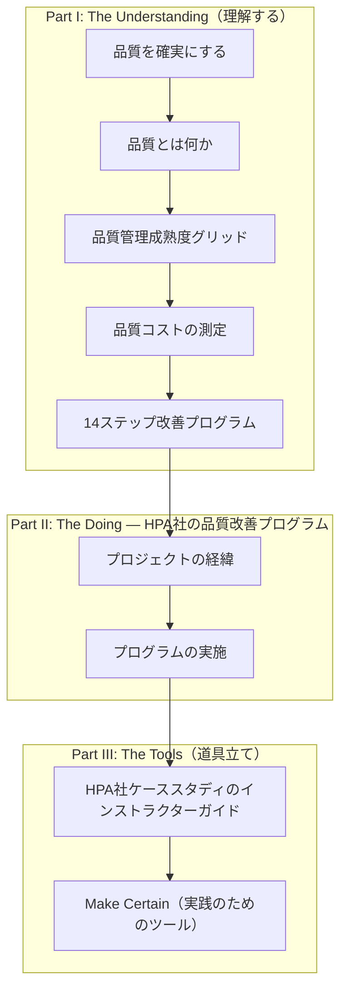
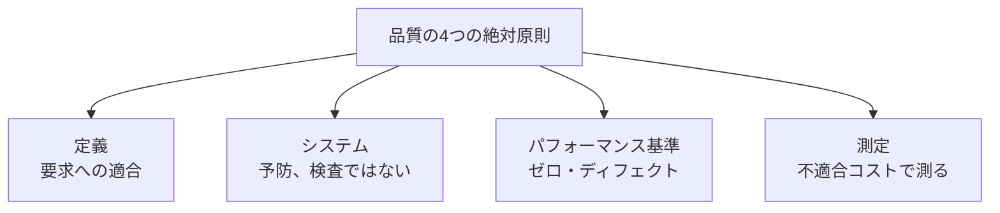
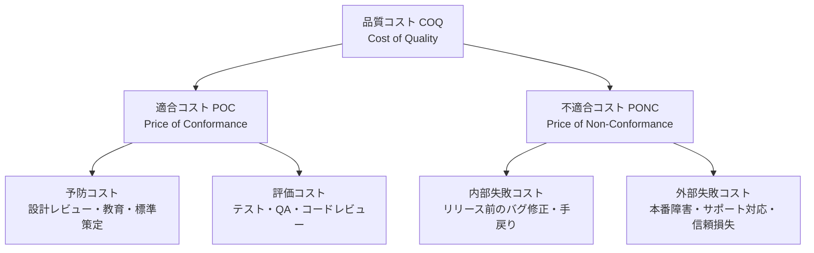
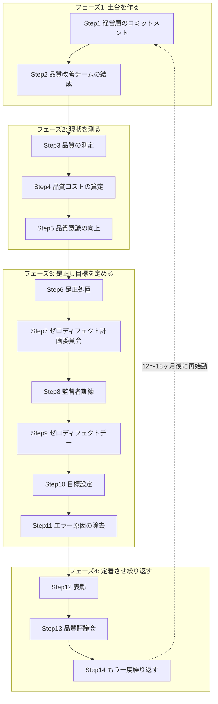
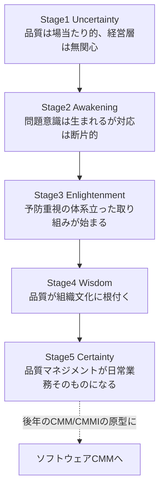
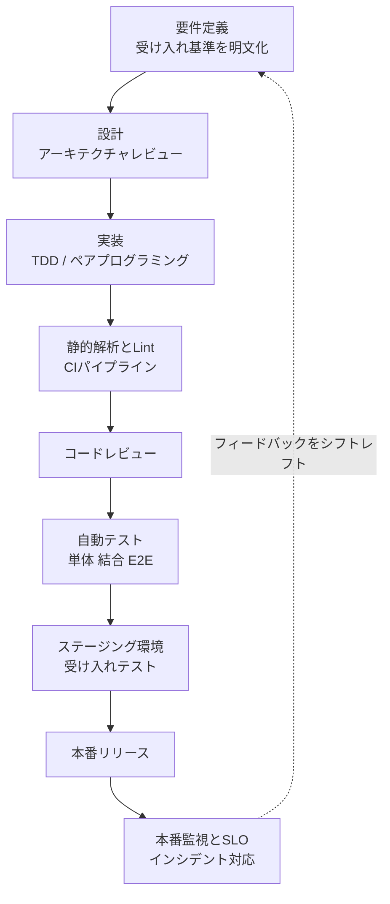
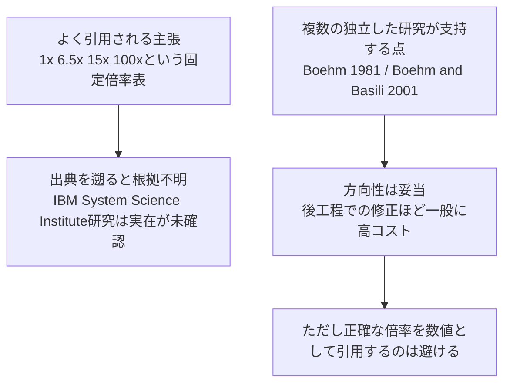
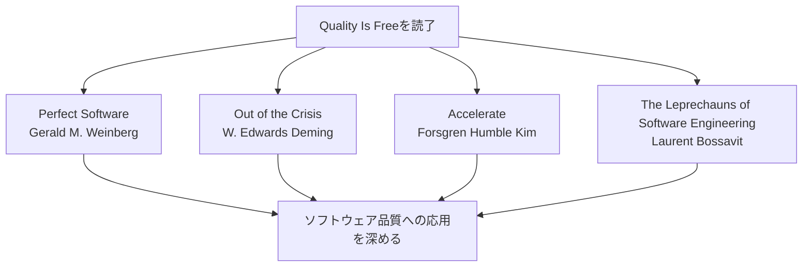

# Quality Is Free 入門ガイド ― 品質はなぜ「タダ」なのか、ソフトウェアエンジニアのための実践ステップ

> Philip B. Crosby『Quality Is Free: The Art of Making Quality Certain』(1979) を、
> 初めて品質管理・ソフトウェアテストを学ぶ人向けに、ステップバイステップで解説する副読ガイドです。

## 書籍情報

| 項目 | 内容 |
|---|---|
| タイトル | *Quality Is Free: The Art of Making Quality Certain* |
| 著者 | Philip B. Crosby |
| 初版 | 1979年（McGraw-Hill） |
| 参照版 | New American Library, 1980（270ページ、ISBN 0451624688 / 9780451624680） |
| ジャンル | 品質マネジメント／TQM（Total Quality Management）の古典 |
| 一言で言うと | 「品質を追求することは、それ自体が最もコストの低い経営戦略である」ことを、豊富な実例で説く本 |

参考: [Google Books - Quality is Free](https://books.google.com/books/about/Quality_is_Free.html?id=3TMQt73LDooC)

---

## 目次

1. [はじめに ― なぜソフトウェアエンジニアがこの本を読むべきか](#1-はじめに)
2. [著者紹介 ― Philip B. Crosbyとは何者か](#2-著者紹介)
3. [本書の構成](#3-本書の構成)
4. [品質の4つの絶対原則（Four Absolutes of Quality）](#4-品質の4つの絶対原則)
5. [品質コスト（Cost of Quality）という考え方](#5-品質コスト)
6. [品質改善の14ステップ](#6-14ステップ)
7. [品質管理成熟度グリッド（Quality Management Maturity Grid）](#7-成熟度グリッド)
8. [ソフトウェア開発への応用 ― シフトレフトと品質コスト](#8-ソフトウェア開発への応用)
9. [批判的に読む ― 「コスト曲線」は本当に正しいのか](#9-批判的に読む)
10. [2026年の現在地 ― AI時代の品質コストと「検証税」](#10-2026年の現在地)
11. [初学者向け実践ステップバイステップガイド](#11-実践ステップバイステップガイド)
12. [実践チェックリスト](#12-実践チェックリスト)
13. [学習ロードマップ](#13-学習ロードマップ)
14. [まとめ](#14-まとめ)
15. [参考文献・出典URL一覧](#15-参考文献)

---

## 1. はじめに

「品質を上げようとすると、コストも納期も増える」——多くのエンジニアが一度はそう感じたことがあるはずです。Crosbyはこの本の中で、その直感こそが誤りだと主張します。

彼の主張はシンプルです。**不良品や欠陥（バグ）を作ってしまうことにこそ本当のコストがかかっており、最初から正しく作ること（Do It Right The First Time, DIRFT）は、実は最も安く済む方法である。** だからこそ「品質はタダ」なのです。

この本は製造業（電話交換機や電子部品の工場）を舞台にしていますが、ここで語られる考え方——「品質コスト」「予防と評価と失敗コスト」「品質管理の成熟度」——は、そのままソフトウェア開発における「シフトレフト」「テスト自動化」「静的解析」「DevOpsの品質ゲート」といった現代的な実践の理論的な祖先にあたります。実際、後述するようにソフトウェアの成熟度モデルであるCMM（Capability Maturity Model）は、Crosbyの品質管理成熟度グリッドを直接の起源としています。

初学者がこの本から学ぶべき最大のポイントは次の一文に集約されます。

> 品質とは「良さ」や「豪華さ」のような曖昧な概念ではなく、**「要求への適合（conformance to requirements）」**という、測定可能な事柄である。

この定義を持つだけで、「テストとは何をする作業なのか」「バグとは何なのか」という問いに、初学者でも一貫した答えを出せるようになります。

---

## 2. 著者紹介

Philip B. Crosby（1926年〜2001年、米国ウェストバージニア州ウィーリング生まれ）は、第二次世界大戦と朝鮮戦争に従軍したのち、品質管理の世界に入りました。ライン検査員からキャリアをスタートし、Martin社（のちのMartin Marietta）で「ゼロ・ディフェクト（Zero Defects）」プログラムを立ち上げ、その後ITT社で14年間にわたりコーポレート・バイスプレジデントとして品質管理を統括しました。

1979年に独立し、コンサルティング会社Philip Crosby Associates, Inc.を設立すると同時に本書『Quality Is Free』を出版し、一躍「品質グル（Quality Guru）」として世界的な名声を得ます。W. Edwards Deming、Joseph M. Juranと並んで、20世紀の品質マネジメント運動を代表する人物の一人です。

Crosbyの立場の特徴は、DemingやJuranのような統計的手法（SPC等）に頼るのではなく、**経営とマネジメントの姿勢そのもの**に焦点を当てた点にあります。「品質は管理されるものではなく、引き起こされるものだ（Quality has to be caused, not controlled）」という言葉が、彼の哲学をよく表しています。

---

## 3. 本書の構成

本書は大きく3部構成になっています。

Part I「The Understanding」では、品質の定義から成熟度グリッド、品質コスト、14ステップの改善プログラムまで、Crosbyの理論と手法が体系的に提示されます。Part II「The Doing — The HPA Corporation Quality Improvement Program」は、架空の企業「HPA Corporation」を舞台に、その改善プログラムがどのように導入され、どのような抵抗にあい、どう定着していくかを、プロジェクトの経緯と実施の記録という物語形式で追体験させるパートです。Part III「The Tools」は、そのHPA社ケーススタディを研修教材として使うためのインストラクターガイドと、読者が自組織で実践するためのツール（Make Certain）で構成されています。この「理論→ケーススタディ→実践のための道具立て」という三段構えの構成自体が、多くの現代的な技術書（例えばGoogleのテスト本や、DevOps関連書籍）に踏襲されている定番パターンです。

---

## 4. 品質の4つの絶対原則

Crosbyの思想の中核が、この「4つの絶対原則（Four Absolutes of Quality Management）」です。それぞれが「世間でよくある誤解」に対するアンチテーゼとして提示されています。

| # | 絶対原則 | よくある誤解 | Crosbyの主張 | ソフトウェアでの読み替え |
|---|---|---|---|---|
| 1 | 品質の定義 | 品質＝「良いもの」「豪華なもの」という曖昧な感覚 | 品質とは**要求仕様への適合**である | 「良いコード」ではなく「受け入れ基準（Acceptance Criteria）を満たしているか」で判断する |
| 2 | 品質を生むシステム | 検査（inspection）を強化すれば品質は上がる | 品質を生むのは**予防**であり、検査は既に起きた不良を見つけるだけ | QAによる後工程テストだけに頼らず、設計レビューやペアプログラミングで上流から欠陥を防ぐ |
| 3 | パフォーマンス基準 | 「まあこのくらいのバグは仕方ない」という許容ライン | 基準は**ゼロ・ディフェクト**であるべき | 「バグ密度の目標値」ではなく「そもそも作り込まない」ことを目指す文化（TDD、静的解析の強制） |
| 4 | 測定方法 | 品質指数やスコアのような抽象的な指標 | 品質は**不適合のコスト（金額）**で測る | インシデント対応工数、リワーク時間、本番障害の損失額をドル/円換算で可視化する |

初学者がつまずきやすいのは3番目の「ゼロ・ディフェクト」です。これは「絶対にミスを許さない恐怖政治」という意味ではなく、**「妥協的な合格ラインを設定した瞬間に、そこまでの不良は許容されてしまう」という人間心理への警鐘**として読むのが正しい理解です。

---

## 5. 品質コスト

Crosbyが本書のタイトルの根拠としているのが、この「品質コスト（Cost of Quality, COQ）」というフレームワークです。

| 分類 | 意味 | 製造業の例 | ソフトウェア開発の例 |
|---|---|---|---|
| 予防コスト（Prevention） | 不良を未然に防ぐための投資 | 作業標準書、教育訓練 | コーディング規約、設計レビュー、TDD、静的解析ツールの導入 |
| 評価コスト（Appraisal） | 不良がないかを確認するための投資 | 抜き取り検査、監査 | 単体・結合・E2Eテスト、コードレビュー、QAによる手動テスト |
| 内部失敗コスト（Internal Failure） | リリース前に見つかった不良の手直し費用 | 手直し、廃棄、再検査 | リリース前のバグ修正、再テスト、手戻りによる工数超過 |
| 外部失敗コスト（External Failure） | 顧客に届いた後に発覚した不良の費用 | クレーム対応、返品、保証費用 | 本番障害対応、緊急パッチ、SLA違反の賠償、顧客離反、ブランド毀損 |

Crosbyの核心的な主張は、**「予防コストへの投資を増やすと、評価コストと失敗コスト（特に外部失敗コスト）は、それを大きく上回る幅で減少する」** というものです。適合コスト（POC）を適切に払うことで、不適合コスト（PONC）という「本来払わなくてよかったはずの罰金」を減らせる——だから差し引きで品質は「タダ」以上に「儲かる」というロジックです。

多くの品質マネジメントの文献で、Crosbyのこの「conformance to requirements」という定義そのものが引用されています。ソフトウェア品質管理の分野で高く評価されているGerald M. Weinberg（*Perfect Software*の著者としても知られる、ソフトウェアテスト分野の国際的権威）も、著書『Quality Software Management: Systems Thinking』の中でCrosbyのこの定義を出発点として自身の議論を展開しています。

---

## 6. 14ステップ

品質を組織に定着させるための実行プログラムが、有名な「14ステップ」です。Crosbyはこれを1つの部署やプロジェクトから始め、全社に広げていくロードマップとして提示しています。

| Step | 名称 | 内容 |
|---|---|---|
| 1 | 経営層のコミットメント | 経営陣が品質改善への本気度を明確に、全員に伝える |
| 2 | 品質改善チームの結成 | 各部門から代表者を集めた横断チームを作る |
| 3 | 品質の測定 | 現状の品質問題がどこにあるかを可視化する仕組みを作る |
| 4 | 品質コストの算定 | 不良によって実際にいくら失っているかを金額で算出する |
| 5 | 品質意識の向上 | 品質について前向きに話す文化を、全従業員に広める |
| 6 | 是正処置 | 見つかった問題を、その場しのぎでなく根本から解決する |
| 7 | ゼロ・ディフェクト計画委員会 | ゼロ・ディフェクトの考え方を検討し、導入計画を立てる特別委員会 |
| 8 | 監督者訓練 | 現場の管理職に品質の考え方と実践方法を教育する |
| 9 | ゼロ・ディフェクト・デー | 「品質への姿勢が変わった」ことを全員に体感させるイベントを開く |
| 10 | 目標設定 | 各チーム・各個人が、具体的で測定可能な改善目標を設定する |
| 11 | エラー原因の除去 | 従業員自身が「目標達成の障害」を報告し、それを組織が取り除く |
| 12 | 表彰 | 金銭ではなく、公の場での承認・称賛で貢献を評価する |
| 13 | 品質評議会 | 品質担当者たちが定期的に集まり、知見を共有し合う場を設ける |
| 14 | もう一度繰り返す | プログラムは12〜18ヶ月で一巡する。その後、新しいメンバーで再スタートする |

ここで特に強調しておきたいのが**Step 12（表彰）**です。Crosbyは金銭的報酬よりも「公の場での承認」の方が効果的だと述べています。これはのちの行動科学・モチベーション研究（内発的動機づけの理論）とも符合する、先見性のある指摘です。

また**Step 14（もう一度繰り返す）**は、品質改善が「一度導入して終わり」のプロジェクトではなく、**継続的なサイクル**であることを明示しています。この考え方は、現代のアジャイル開発における「レトロスペクティブ」や、DevOpsにおける「継続的改善（Kaizen）」の思想と直接つながっています。

---

## 7. 成熟度グリッド

Crosbyは、組織の品質に対する成熟度を測るための簡易ツールとして「品質管理成熟度グリッド（Quality Management Maturity Grid, QMMG）」を提示しました。これは「経営者の品質理解」「問題処理」「品質コスト」など6つのカテゴリーについて、組織が5段階のどこにいるかを診断する5×6のマトリクスです。

| 段階 | 名称 | 特徴 |
|---|---|---|
| 1 | Uncertainty（不確実） | 品質は理解されておらず、問題への対応は事後的・反応的 |
| 2 | Awakening（気づき） | 品質の重要性に気づき始めるが、取り組みは断片的で場当たり的 |
| 3 | Enlightenment（啓発） | 予防を重視した体系だった手法・基準が整い始める |
| 4 | Wisdom（英知） | 品質改善が組織文化の一部として定着している |
| 5 | Certainty（確信） | 品質マネジメントが特別な取り組みではなく、日常業務そのものになっている |

このグリッドは、Wikipediaの記事でも明記されている通り、**10年後に登場するソフトウェア工学のCapability Maturity Model（CMM）の直接の先駆けと位置づけられています。** ソフトウェアの成熟度モデル（CMM/CMMI）に馴染みのあるエンジニアであれば、「Initial → Repeatable → Defined → Managed → Optimizing」という5段階の構造がCrosbyのこのグリッドと酷似していることにすぐ気づくはずです。つまり、私たちが日常的に接しているソフトウェアプロセス成熟度という概念のルーツは、1979年のこの本にまで遡れるのです。

---

## 8. ソフトウェア開発への応用

Crosbyの「予防にコストをかけるほど、失敗コストは大きく減る」という主張は、現代の「シフトレフト（Shift-Left）」というプラクティスの理論的な原点そのものです。

シフトレフトとは、テストや品質保証の活動を開発ライフサイクルのできるだけ早い段階（左側）に移すという考え方です。要件定義や設計の段階で欠陥を見つけて修正する方が、コーディング後・リリース後に見つけて修正するよりも、一般に手間もコストも小さく済むという経験則に基づいています。多くのシフトレフト解説記事では、これを「テスト工程で見つけた不具合は、設計段階で見つけるより約15倍のコストがかかり、本番環境まで到達すると約100倍のコストになる」といった具体的な倍率で語ることがよくあります。

このパイプラインの各ステージが、そのまま第5章の品質コスト分類に対応しています。

- **予防コスト**：要件定義・設計・静的解析・コーディング規約
- **評価コスト**：コードレビュー・自動テスト・ステージングでの受け入れテスト
- **内部失敗コスト**：CIで検出されたテスト失敗の修正、レビュー指摘の手直し
- **外部失敗コスト**：本番監視でのインシデント、緊急パッチ、ポストモーテム対応

ただし、次の章で触れる通り、「後工程になるほど何倍コストが増えるか」という**具体的な倍率の数字そのもの**については、ソフトウェア工学コミュニティの中で重要な異論が提起されています。ベストプラクティスとして重要なのは、「予防への投資は方向性として正しい」という結論であり、「N倍」という数字を鵜呑みにしないことです。

---

## 9. 批判的に読む

世界トップクラスのエンジニアであるためには、権威ある本の主張であっても鵜呑みにせず、根拠を検証する姿勢が欠かせません。Crosbyの品質コストの考え方自体は現在も広く支持されていますが、そこから派生して業界で独り歩きした「欠陥修正コストの指数関数的増大カーブ」（しばしば「1x/6.5x/15x/100x」のような表で紹介される）については、近年の調査で重大な疑義が呈されています。

フランスの著名なアジャイル実践者であり、2006年のAgile AllianceのGordon Pask賞受賞者でもあるLaurent Bossavitは、著書*The Leprechauns of Software Engineering*（2013年初版、2014年GOTO Conferenceでの講演でも取り上げられた）の中で、この「コスト曲線」の出典を丹念に遡り、しばしば根拠として引用される「IBM System Science Institute」の研究について、公表された論文としての実在が確認できないことを指摘しました。この調査はBudgetOverrun.comやThe Register（2021年7月）など、複数の独立した検証記事でも追認されています。

| 論点 | 評価 |
|---|---|
| 「後工程で見つかった不具合ほど修正コストが高い」という**方向性** | Barry BoehmやBoehm and Basili（2001）など複数の独立研究が支持しており、経験則として妥当性が高い |
| 「1x/6.5x/15x/100x」のような**具体的な固定倍率** | 出典が孫引きの繰り返し（いわゆる「伝言ゲーム」）によって誇張・単純化されたものであり、元となる一次データが確認できない |
| 実務上の教訓 | シフトレフトという**方向性の判断**には使ってよいが、ROI試算などに**具体的な倍率の数字**をそのまま流用するのは避けるべき |

Bossavit自身も、この種の「業界のleprechaun（言い伝えだけの妖精）」を暴くことの目的は、シフトレフトや予防重視という結論そのものを否定することではなく、「なぜそれが正しいと言えるのか」を自分の頭で検証する姿勢を、ソフトウェア工学というまだ若い専門分野に根付かせることにある、と述べています。これはCrosby自身が本書で繰り返し説く「品質は測定できるものでなければならない」という精神とも、実は矛盾しません。数字を使うなら、その数字の出所を必ず確認する——これもまた一つの「品質」の実践です。

---

## 10. 2026年の現在地

2026年9月現在、Crosbyが説いた「品質コスト」の考え方は、AIによるコード生成が普及した開発現場で新しい形の再評価を受けています。

DevOps Research and Assessment（DORA）チームの公式レポート「[2025 DORA State of AI-assisted Software Development report](https://dora.dev/research/2025/dora-report/)」（*Accelerate*の著者であるDr. Nicole Forsgren、Jez Humble、Gene Kimらが創始したプロジェクト、現在はGoogleが運営）では、AI支援開発の普及によってデリバリのスループットが増大する一方で、デリバリの不安定性もあわせて増大するという関係が示されています。この現象をより踏み込んで論じたのが、DORAチームの2026年3月10日付の公式記事「[Balancing AI tensions: Moving from AI adoption to effective SDLC use](https://dora.dev/insights/balancing-ai-tensions/)」です。同記事は、コードを書く時間が短縮されても、その分の時間がAI生成コードの信頼性・セキュリティ・アーキテクチャ整合性を確認する監査作業に再配分される——「**検証税（verification tax）**」と呼ばれる負担——という構造を指摘し、その負荷がとりわけコードレビュー担当者に集中すると述べています。また、AI導入の投資対効果そのものについては「[ROI of AI-assisted Software Development report](https://dora.dev/ai/roi/report/)」で別途分析されています。

なお、プルリクエストのレビュー時間の中央値の大幅な増加や、レビューなしでマージされるPR割合の増加といった具体的な開発メトリクスの変化は、[Faros AIの分析](https://www.faros.ai/blog/key-takeaways-from-the-dora-report-2025)や[Kodusの二次資料](https://kodus.io/en/dora-accelerate-state-of-devops/)に基づく報告・考察として示されています。

これはまさに、Crosbyが1979年に定義した「評価コスト（appraisal cost）」が、AIコーディングという新しい変数によって形を変えて再浮上している状況だと読むことができます。コード生成という「予防（=最初から正しく書く）」の一部をAIに委譲した結果、「評価（=それが本当に正しいかを確認する）」の負荷がむしろ増大している、というのが2026年時点での業界の実感です。Crosby流に言えば、**予防コストの内訳が変化しただけであり、「品質コストの総和を最小化する」という命題自体は今も有効**だと言えるでしょう。

> 出典：本セクションの「検証税（verification tax）」の概念はDORAの公式記事「Balancing AI tensions」（2026年3月10日）に基づき、AI導入の投資対効果に関する記述は「ROI of AI-assisted Software Development report」に基づいています。また、レビュー時間中央値やマージ割合等の周辺数値はFaros AIおよびKodusの二次資料（2025/2026年）を参照しています。詳細情報は下記参考文献のリンクから直接ご確認ください。

---

## 11. 実践ステップバイステップガイド

ここからは、Crosbyの14ステップを、ソフトウェア開発チーム（特にQA・テストの体制がまだ整っていないチーム）向けに読み替えた、実践的なステップバイステップガイドです。初学者のチームリーダーやQAエンジニアが、明日から着手できるレベルまで具体化しています。

### ステップ1: 経営層・プロダクトオーナーの合意を取る（原著Step 1-2に対応）

1. 「品質にコストをかけることは投資であり、後工程の失敗コストを削減する」というROIの論理を、具体的な過去のインシデント事例（本番障害の対応時間、緊急パッチのコストなど）を使って説明する。
2. QA・テストエンジニア、開発リード、プロダクトオーナーからなる横断的な「品質改善チーム」を小さく作る（最初は3〜5人で十分）。

### ステップ2: 現状の品質コストを可視化する（原著Step 3-5に対応）

1. 過去3ヶ月分のバグチケット・インシデントを集計し、それぞれが「いつの工程で作り込まれ、いつ発見されたか」を分類する。
2. 各バグの修正にかかった実工数（開発・レビュー・再テスト・デプロイ）を概算し、「予防コスト／評価コスト／内部失敗コスト／外部失敗コスト」の4分類で集計する。
3. この集計結果をチーム全体に共有し、「品質について前向きに話す」きっかけを作る（原著のStep 5「品質意識の向上」に相当）。

### ステップ3: 是正のサイクルを作る（原著Step 6-7に対応）

1. 見つかった問題のうち、繰り返し発生しているもの（同じ種類のバグが何度も起きている等）を特定し、根本原因（レビュー基準の欠如、テストカバレッジの不足、要件の曖昧さなど）を分析する。
2. 「ゼロ・ディフェクト」に相当する目標として、例えば「重大度Highのインシデントを本番環境で二度と出さない」といった、チームが本気で目指せる具体的な旗印を立てる。

### ステップ4: チームの実行力を高める（原著Step 8-10に対応）

1. テックリードやチームリーダーに対して、コードレビューの質の高め方、テスト設計の基本（境界値分析、同値分割など）を教育する。
2. 「品質week」のようなイベントを企画し、技術的負債の解消やテストカバレッジ向上に集中して取り組む機会を作る（原著のStep 9「ゼロ・ディフェクト・デー」に相当）。
3. チームやスプリントごとに、測定可能な品質目標（例：「クリティカルパスのE2Eテストカバレッジを80%まで引き上げる」）を設定する。

### ステップ5: 現場の声を吸い上げる（原著Step 11に対応）

1. 「なぜこのバグが起きたか」ではなく「何が目標達成の障害になっているか」をエンジニア自身に報告してもらう仕組み（レトロスペクティブ、Slackチャンネルなど）を作る。
2. 報告された障害（例：CIが遅い、テスト環境が不安定、要件が頻繁に変わる）を、チームまたは組織として実際に取り除く。

### ステップ6: 承認し、定着させ、繰り返す（原著Step 12-14に対応）

1. 品質改善に貢献した個人やチームを、金銭的インセンティブよりも「公の場での称賛」で評価する。
2. 品質に関わる関係者（QA、SRE、開発リードなど）が定期的に集まり、知見を共有する場（品質評議会に相当するミーティング）を設ける。
3. このサイクル全体を一度きりで終わらせず、四半期〜半期ごとに新しい目標を立てて繰り返す。

---

## 12. 実践チェックリスト

- [ ] 品質改善に対する経営層・プロダクトオーナーの合意を得た
- [ ] 品質改善のための横断チームを結成した
- [ ] 過去のバグ・インシデントを「予防／評価／内部失敗／外部失敗」の4分類で可視化した
- [ ] 繰り返し発生している不具合の根本原因を分析した
- [ ] チームが目指すべき具体的な品質目標を設定した
- [ ] コードレビュー・テスト設計に関する教育の機会を設けた
- [ ] 現場のエンジニアが「目標達成の障害」を報告できる仕組みを作った
- [ ] 品質改善への貢献を公の場で称賛する仕組みを作った
- [ ] 品質に関わる知見を共有する定例の場を設けた
- [ ] 一度きりで終わらせず、次のサイクルの計画を立てた
- [ ] 「後工程ほどコストがN倍」という数字を鵜呑みにせず、自分たちのチームの実データで検証している

---

## 13. 学習ロードマップ

- **次に読むべき本（品質哲学を深める）**：Gerald M. Weinberg『Perfect Software: And Other Illusions about Testing』
- **次に読むべき本（統計的品質管理の視点を加える）**：W. Edwards Deming『Out of the Crisis』
- **次に読むべき本（現代のDevOps文脈で品質と速度の両立を学ぶ）**：Forsgren, Humble, Kim『Accelerate』
- **次に読むべき本（数字を鵜呑みにしない批判的思考を鍛える）**：Laurent Bossavit『The Leprechauns of Software Engineering』

---

## 14. まとめ

Crosbyの『Quality Is Free』が半世紀近く読み継がれている理由は、その主張がシンプルで、かつ現代のソフトウェア開発の実践—— シフトレフト、CI/CDの品質ゲート、TDD、DevOpsの継続的改善——のほぼすべてに、理論的な骨格を提供しているからです。

初学者がこの本、そして本ガイドから持ち帰るべき教訓は次の3点に集約できます。

1. **品質とは曖昧な感覚ではなく、「要求への適合」という測定可能な事柄である。**
2. **不良を後工程で見つけるより、最初から作り込まない（予防する）方が、総合的なコストは小さくなる。**
3. **ただし、その根拠として引用される具体的な数字は、必ず自分の頭とチームの実データで検証する。** これはCrosby自身が説いた「品質は測定せよ」という精神の、最も誠実な実践です。

---

## 15. 参考文献

本ガイドの作成にあたり、以下の情報源を参照しました（2026年9月8日時点でアクセス可能なものを確認）。

- Google Books - *Quality is Free: The Art of Making Quality Certain*（書誌情報）
  [https://books.google.com/books/about/Quality_is_Free.html?id=3TMQt73LDooC](https://books.google.com/books/about/Quality_is_Free.html?id=3TMQt73LDooC)
- Wikipedia - Quality Management Maturity Grid（CMMとの関係を含む解説）
  [https://en.wikipedia.org/wiki/Quality_Management_Maturity_Grid](https://en.wikipedia.org/wiki/Quality_Management_Maturity_Grid)
- ASQ *Quality Progress*（2005年12月号）再録 - Crosby's 14 Steps To Improvement（原著者Philip B. Crosby自身による解説）
  [https://www.agiledevelopment.org/download/qp1205crosby.pdf](https://www.agiledevelopment.org/download/qp1205crosby.pdf)
- Quality Gurus - Philip Crosby: The Man Who Said "Quality is Free"（経歴・4つの絶対原則の解説）
  [https://www.qualitygurus.com/philip-crosby/](https://www.qualitygurus.com/philip-crosby/)
- MindTools - Crosby's 14 Steps for Improvement
  [https://www.mindtools.com/a5zr4t0/crosbys-14-steps-for-improvement/](https://www.mindtools.com/a5zr4t0/crosbys-14-steps-for-improvement/)
- Cognidox - Where are you on the Quality Management Maturity Grid?
  [https://www.cognidox.com/blog/where-are-you-on-the-quality-management-maturity-grid](https://www.cognidox.com/blog/where-are-you-on-the-quality-management-maturity-grid)
- Rob Nagler - BookNotes: *Quality Software Management Vol.1 Systems Thinking*（Gerald M. Weinberg著、Crosbyの品質定義への言及を含む）
  [https://www.robnagler.com/1993/12/31/Quality-Software-Management.html](https://www.robnagler.com/1993/12/31/Quality-Software-Management.html)
- Laurent Bossavit - *The Leprechauns of Software Engineering*（Leanpub、コスト曲線の出典検証）
  [https://leanpub.com/leprechauns](https://leanpub.com/leprechauns)
- Model View Culture - "The Making of Myths" by Laurent Bossavit
  [https://modelviewculture.com/pieces/the-making-of-myths](https://modelviewculture.com/pieces/the-making-of-myths)
- BudgetOverrun.com - Boehm's Cost-of-Change Curve: Does a Bug Really Cost 100x More Late?
  [https://budgetoverrun.com/cost-of-change-curve](https://budgetoverrun.com/cost-of-change-curve)
- DORA - 2025 DORA State of AI-assisted Software Development report
  [https://dora.dev/research/2025/dora-report/](https://dora.dev/research/2025/dora-report/)
- DORA - 2026 ROI of AI-assisted Software Development report
  [https://dora.dev/ai/roi/report/](https://dora.dev/ai/roi/report/)
- Faros AI - DORA Report 2025/2026 Key Takeaways: AI Impact on Dev Metrics
  [https://www.faros.ai/blog/key-takeaways-from-the-dora-report-2025](https://www.faros.ai/blog/key-takeaways-from-the-dora-report-2025)
- Kodus.io - DORA 2026: The ROI of AI in Software Development Runs Through Code Review（「検証税」の解説）
  [https://kodus.io/en/dora-accelerate-state-of-devops/](https://kodus.io/en/dora-accelerate-state-of-devops/)
- DORA - "Balancing AI tensions: Moving from AI adoption to effective SDLC use" (2026年3月10日、「検証税」の出典)
  [https://dora.dev/insights/balancing-ai-tensions/](https://dora.dev/insights/balancing-ai-tensions/)

---

*本ガイドはPhilip B. Crosby『Quality Is Free』の学習補助を目的とした独自解説であり、原著の文章を逐語的に引用したものではありません。原著の詳細な内容については、上記のGoogle Booksリンクまたは書籍そのものをご参照ください。*
