# セキュア・バイ・デザイン ─ 安全なソフトウェア設計 完全ガイド（初学者向け）

> 原著: *Secure by Design*（Dan Bergh Johnsson, Daniel Deogun, Daniel Sawano 著／Daniel Terhorst-North 序文、Manning Publications, 2019）
> 邦訳: 『セキュア・バイ・デザイン ─ 安全なソフトウェア設計』（マイナビ出版）
>
> 本ガイドは公開情報（出版社公式ページ、著者自身の記事、書評、カンファレンス動画など）をもとに、書籍のエッセンスを初学者向けに再構成した学習用ドキュメントです。コード例は書籍の内容をそのまま転載したものではなく、同じ考え方を説明するために独自に作成したサンプルです。詳しくは末尾の「参考文献・出典」を参照してください。

---

## 目次

1. [この本は何を解決するのか](#1-この本は何を解決するのか)
2. [書籍情報と著者](#2-書籍情報と著者)
3. [世界の開発者からの評価（賛否両論）](#3-世界の開発者からの評価賛否両論)
4. [本書全体のマップ](#4-本書全体のマップ)
5. [Part 1: 導入編 ─ なぜ設計がセキュリティを左右するのか](#5-part-1-導入編--なぜ設計がセキュリティを左右するのか)
6. [Part 2: 基礎編 ─ セキュアな設計を支える技術](#6-part-2-基礎編--セキュアな設計を支える技術)
7. [Part 3: 応用編 ─ レガシーコードとマイクロサービスへの適用](#7-part-3-応用編--レガシーコードとマイクロサービスへの適用)
8. [初学者向け ステップバイステップ実践ロードマップ](#8-初学者向け-ステップバイステップ実践ロードマップ)
9. [批判的な視点（本書の限界）](#9-批判的な視点本書の限界)
10. [さらに学ぶためのリソース](#10-さらに学ぶためのリソース)
11. [参考文献・出典](#11-参考文献出典)

---

## 1. この本は何を解決するのか

多くの現場では、セキュリティは「後付けの機能」として扱われがちです。バックログには「ログイン画面を作る」「入力値をバリデーションする」といったセキュリティ関連タスクが並びますが、これらは常にビジネス機能より優先順位が下げられ、結果としてリリース直前のペネトレーションテストで大量の脆弱性が発覚する、あるいは本番運用中にインシデントが起きて初めて気づく、というパターンを繰り返します。

*Secure by Design* の核心的な主張は非常にシンプルです。

> **セキュリティは「機能（feature）」ではなく「関心事（concern）」である。そして、優れた設計（design）こそが、その関心事に応える最も効果的な手段である。**

つまり、開発者が「セキュリティの専門家」になる必要はなく、**ドメイン駆動設計（DDD）に代表される「良い設計」を徹底するだけで、多くのセキュリティ上の欠陥は自然と作り込まれなくなる**、という考え方です。この思想は著者らによって「**ドメイン駆動セキュリティ（Domain-Driven Security）**」と呼ばれ、2009年頃から実務の中で育てられてきました。

---

## 2. 書籍情報と著者

| 項目 | 内容 |
|---|---|
| 原題 | *Secure by Design* |
| 著者 | Dan Bergh Johnsson, Daniel Deogun, Daniel Sawano |
| 序文 | Daniel Terhorst-North（BDD＝振舞い駆動開発の提唱者として著名） |
| 出版社 | Manning Publications |
| 出版年 | 2019年9月 |
| ISBN | 978-1-61729-435-8 |
| ページ数 | 約400ページ |
| 翻訳版 | 日本語、ロシア語、簡体字中国語 |
| 日本語版出版社 | マイナビ出版（Compass Booksシリーズ） |
| 対象読者 | Java, C#, .NET など静的型付け言語である程度アプリケーション設計の経験がある開発者 |

**著者について**

- **Dan Bergh Johnsson** ─ スウェーデンのコンサルティング会社 Omegapoint のシニアコンサルタント兼VP。アジャイル、DDD、コード品質、セキュリティの交差点で長年活動し、「ドメイン駆動セキュリティ」という概念の創始者の一人。
- **Daniel Deogun** ─ 同じく Omegapoint のシニアコンサルタント兼VP。アプリケーション開発とセキュリティの橋渡しを専門とし、国際カンファレンスでの登壇多数。
- **Daniel Sawano** ─ ソフトウェア開発者・アーキテクト。株式取引、ゲーム、通信、メディアなど高負荷システムでの経験を持ち、設計・パフォーマンス・セキュリティを組み合わせる思想の実践者。

3人とも国際カンファレンス（GOTO、DDD Europe、Jfokus、QCon など）の常連スピーカーであり、本書はその講演内容を体系化したものです。

---

## 3. 世界の開発者からの評価（賛否両論）

本書は技術書として広く読まれており、著名な開発者からのレビューも多数存在します。ここでは肯定的な評価と、あわせて批判的な視点の両方を公平に紹介します。

### 好意的な評価

| 評者 | コメントの要旨 | 出典 |
|---|---|---|
| Daniel Terhorst-North（序文、BDDの提唱者として国際的に著名） | 単なる「セキュリティを真剣に扱おう」という掛け声ではなく、設計の検討から実際のコードまで一貫した実例を豊富に示す、実践的で行動につながる一冊だと評価 | Manning公式ページ |
| **Matt Raible**（Okta所属、Java/Spring/Angular分野で国際的に著名な開発者・書籍執筆者） | 「ドメイン・プリミティブの例が気に入りすぎて、自分のマイクロサービスセキュリティに関するブログ記事でも引用した」と述べ、5段階評価で満点を付けている | raibledesigns.com |
| Jeremy Lange, Sertifi | DDDと優れた設計原則への優れた入門書であり、良い設計こそが最良のセキュリティ形態になり得ることを示す "目からうろこ" の内容と評価 | Manning公式ページ |
| Adrian Citu（技術ブロガー） | ソフトウェアエンジニアが読むべきセキュリティ書籍リストに入れたいと明言 | adriancitu.com |

### 批判的な視点

一方で、Goodreadsなどでは「本書はDDDの実践方法の解説が中心で、セキュリティそのものを扱う分量は相対的に少ない（セキュリティ単体の議論は最終章の10ページ程度）」「アイデア自体は1本のブログ記事にまとめられる程度のものだ」という辛口の評価も存在します。これは本書の性質を理解するうえで重要な指摘で、**本書は「ペネトレーションテストや脅威モデリングの代替」ではなく、「設計品質を通じてセキュリティの土台を底上げする」ための本**である、と捉えるのが適切です（この点は9章で改めて整理します）。

---

## 4. 本書全体のマップ

本書は3部構成・全14章（うち2つは「インターミッション」と呼ばれる実話ベースの箸休め的な章）です。

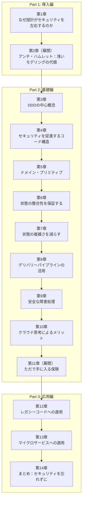

読み進める順序としては、コードに近い話題（第3〜5章）から、より抽象度の高いアーキテクチャの話題（第12〜13章）へと段階的に上がっていく構成になっています。

---

## 5. Part 1: 導入編 ─ なぜ設計がセキュリティを左右するのか

### 5.1 第1章：セキュリティは「機能」ではなく「関心事」

#### 歴史から学ぶ：エスト・ヨータ銀行（Öst-Götha Bank）強盗事件（1854年）

本書の冒頭は、1854年にスウェーデンで実際に起きた銀行強盗事件から始まります。エスト・ヨータ銀行（Öst-Götha Bank）は「高品質な錠前」という**セキュリティ機能**に投資していましたが、犯人たちは鍵が外の釘に掛けられたままの裏口から侵入し、頑丈な金庫の扉ではなく、**弱い蝶番**を破壊して押し入りました。

この逸話が示すのは、「良い機能を1つ実装すること」と「本当にセキュリティという関心事に応えること」はまったく別物だという教訓です。ソフトウェアでも同様に、「ログイン画面がある」ことと「写真への全アクセスがログインを経由する」ことはイコールではありません。ユーザーストーリーを次のように書き換えることで、初めて本当の関心事が見えてきます。

- ❌ 機能視点：「ユーザーとして、自分がアップロードした写真を見るためのログイン画面が欲しい」
- ✅ 関心事視点：「ユーザーとして、自分の写真へのすべてのアクセスがログインを経由してほしい。写真を機密に保つために」

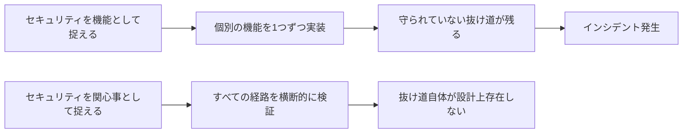

#### CIA-T：4つの古典的なセキュリティ関心事

情報セキュリティの世界では伝統的に「CIA」というモデルが使われますが、本書ではさらに「T（追跡可能性）」を加えた「CIA-T」を紹介しています。

| 頭文字 | 意味 | 説明 | 具体例 |
|---|---|---|---|
| **C** | Confidentiality（機密性） | 秘密にすべき情報を秘密のまま保つこと | 診療記録が第三者に漏れないこと |
| **I** | Integrity（完全性） | データが許可された方法でしか変更されないこと | 選挙の投票結果が改ざんされていないこと |
| **A** | Availability（可用性） | 必要なときにデータ・機能が使えること | 消防が火災発生場所の情報に即座にアクセスできること |
| **T** | Traceability（追跡可能性） | 誰が・いつ・何を変更/参照したかを追跡できること | 処理内容や文脈によっては、GDPR（EU一般データ保護規則）のアカウンタビリティやセキュリティの要請から、監査可能な記録が必要になる |

同じデータでも、文脈によってどの要素が最も重要かは変わります。銀行口座の場合、残高照会ができない（可用性の欠如）のは単に苛立たしいだけですが、年金資産が突然消える（完全性の欠如）のは破滅的です。

#### 「従来型アプローチ」の3つの限界

従来のセキュリティ教育では、「開発者は全員セキュリティに詳しくなるべき」「常にセキュリティを意識しながらコードを書くべき」と説かれてきました。しかし著者らは、このアプローチには構造的な限界があると指摘します。

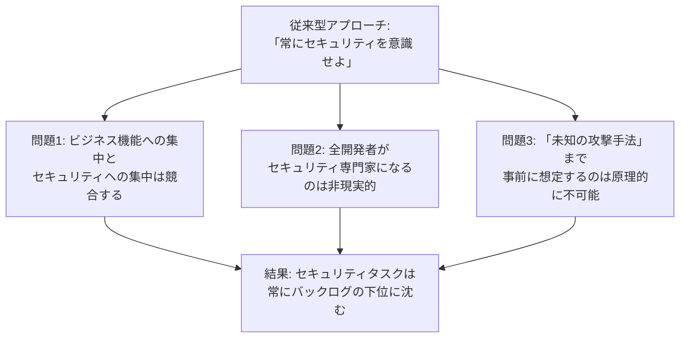

#### 設計視点で同じ問題を解く：ドメイン・プリミティブの初歩

著者らは、ユーザー名を保持するだけの単純なクラスを例に、これを説明します。要点は「バリデーションを外付けの関数として後から足す」のではなく、**「ドメインエキスパートと会話し、"ユーザー名とは何か"を厳密に定義したうえで、その定義自体を型として表現する」**という発想の転換です。

以下は書籍の主張と同じ考え方を示すための、筆者独自の疑似コード例です（Java風）。

```java
// ❌ 従来型: 文字列としてゆるく受け取り、後から個別にバリデーションする
public class LegacyUser {
    private final String username; // どんな文字列でも入ってしまう

    public LegacyUser(String username) {
        this.username = username; // 制御文字やマークアップを含む文字列もそのまま保持できてしまう
    }
}

// ✅ 設計視点: 「ユーザー名とは何か」をドメインエキスパートと定義し、型に落とし込む
public final class Username {
    private static final int MIN_LENGTH = 4;
    private static final int MAX_LENGTH = 40;
    private static final Pattern ALLOWED = Pattern.compile("[A-Za-z0-9_-]+");

    private final String value;

    public Username(String rawValue) {
        Objects.requireNonNull(rawValue);
        String trimmed = rawValue.trim();
        if (trimmed.length() < MIN_LENGTH || trimmed.length() > MAX_LENGTH) {
            throw new IllegalArgumentException("ユーザー名の長さが不正です");
        }
        if (!ALLOWED.matcher(trimmed).matches()) {
            throw new IllegalArgumentException("許可されていない文字が含まれています");
        }
        this.value = trimmed;
    }

    public String value() { return value; }
}
```

`<script>alert(1)</script>` のような文字列は、そもそも `Username` オブジェクトとして**生成すること自体ができません**。セキュリティを意識して書いたわけではなく、「ユーザー名という概念を正確にモデリングした」結果として、副産物的にこのフィールド経由で危険な入力が入り込む余地が消えています。これが「Secure by Design（設計によって安全になる）」の核心です。

ただし、この許可リストが防いでいるのは**このフィールドが受け付けない入力が混入すること**だけであり、XSS対策として十分なわけではありません。許可された文字だけで構成された値であっても、HTML・属性値・JavaScript・URLなど出力先ごとに適切なエスケープを行う必要があります。入力バリデーションは、文脈に応じた出力エンコーディングの代替にはなりません。

#### 多層防御（Defense in Depth）：Billion Laughs攻撃を例に

第1章の後半では、XMLの「内部エンティティ」の展開機能を悪用した **Billion Laughs攻撃**（1KB未満の小さなXMLが再帰的なエンティティ参照によって数GBのメモリを消費させる攻撃）を題材に、「設計による多層防御」を説明しています。

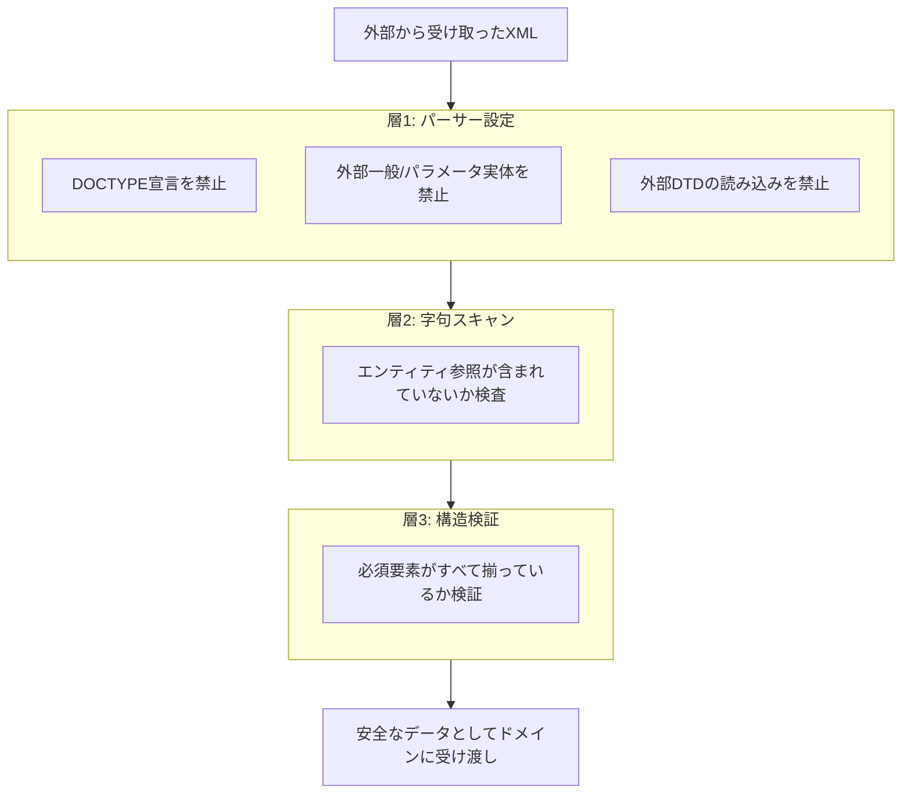

ポイントは、パーサー設定だけに頼らないことです。著者らはこれを「家の周りにフェンスを立てただけでドアの鍵をかけていない状態」に例えています。仮に1つの防御層が突破されても、次の層が攻撃を食い止められるように設計するのが「多層防御」の考え方です。

> **第1章のまとめ**
>
> - セキュリティは「機能」ではなく「関心事」として捉える
> - 設計とは「意思決定を伴うあらゆる活動」を指し、コードの1行からアーキテクチャまで全てが対象
> - 汎用的な型（`String` など）で特定の意味を持つ概念を表現するのは危険の温床
> - 多層防御は、単一の防御機構の突破を前提にした設計手法

### 5.2 第2章（幕間）：アンチ・ハムレット ─ 浅いモデリングの代償

第2章は、著者らが実際に関わった（詳細を匿名化した）事例をもとにした読み物です。ある企業のシステムで、**注文数量が負の値になり得る**という設計上の見落としが放置され続けた結果、技術的には何も「壊れて」いないにもかかわらず、長期間にわたって多額の金銭的損失が発生していたという実話です（類似の事例として、2000年頃のAmazonでも数量関連のバグが報告されています）。

この章の核心は「**浅いモデリング（shallow modeling）**」と「**深いモデリング（deep modeling）**」の対比です。

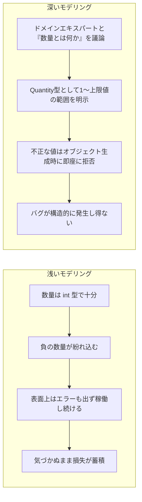

この章は、**セキュリティ上の欠陥は必ずしも「ハッキング」の形を取るとは限らず、ビジネスロジックの完全性（Integrity）を軽視した設計そのものが重大なリスクになる**、ということを鮮烈に印象づけます。

---

## 6. Part 2: 基礎編 ─ セキュアな設計を支える技術

### 6.1 第3章：ドメイン駆動設計（DDD）の中心概念

本書全体の土台となるのがDDDの基本語彙です。DDDに馴染みがない読者向けに、要点を整理します。

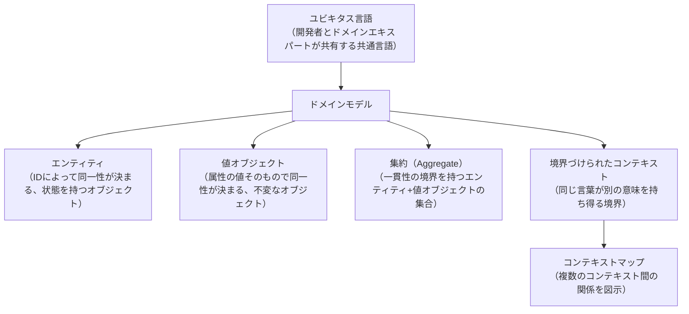

- **モデルは単純化である**：現実の複雑さをすべて写し取ることはできず、常に「何を捨て、何を残すか」という選択が伴います。
- **モデルは厳密でなければならない**：曖昧なモデルは曖昧なコードを生み、曖昧なコードは脆弱性の温床になります。
- **境界づけられたコンテキスト**は特に重要な概念です。例えば「顧客」という言葉は、営業部門のコンテキストと、配送部門のコンテキストでは意味する属性がまったく異なることがあります。この境界を明示しないままシステムを設計すると、片方のコンテキストでは有効な値が、もう一方のコンテキストでは無効な値として扱われるべきなのに素通りしてしまう、というセキュリティ上の穴が生まれます。

### 6.2 第4章：セキュリティを促進するコード構造

第4章では、DDDの知識を土台に、具体的な「安全になりやすいコードの書き方」を3つの柱で説明します。

#### 柱1：不変性（Immutability）

一度生成したら状態を変更できないオブジェクトは、複数のスレッドから安全に共有でき、状態変更に伴う競合や、生成後に不正な値へ書き換えられるという攻撃経路そのものを取り除けます。ただし不変性はあくまで「状態の書き換え」に対する防御であり、それ自体が可用性を高めたりサービス拒否攻撃への耐性を与えたりするものではありません。可用性を守るには、リソース制限・タイムアウト・レート制限といった別の対策を併せて講じる必要があります。

#### 柱2：契約による設計とフェイルファスト（Fail Fast）

「事前条件（precondition）」「事後条件（postcondition）」「不変条件（invariant）」を明示し、それを満たさない場合は**即座に例外を投げて処理を止める**という考え方です。問題を握りつぶして処理を先に進めるコードは、後になるほど原因の特定が難しくなり、セキュリティ上のグレーゾーンを生み出します。

#### 柱3：バリデーションの正しい順序

バリデーションの順序は、入力形式や想定する脅威モデルに応じて決めます。書籍が推奨するのは「軽い検査から重い検査へ」という原則で、これを踏まえずに（例えばコストの高い構文チェックを先にしてしまうと）攻撃者に有利な情報を与えたり、無駄な計算資源を消費させられたりします。以下は、その原則を典型的な入力に当てはめた一例です。

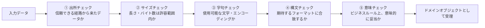

この順序で軽い検査から重い検査へと進めることで、不正データを早い段階（安価な段階）で弾き、パーサーに到達する前に処理コストを抑えられます。ただし、サイズチェックや字句チェックだけで Billion Laughs 攻撃を確実に排除できるわけではありません。展開後にはじめて肥大化するペイロードは、入力段階では小さく無害に見えるためです。XMLを扱う場合は、外部エンティティ（XXE）の無効化やエンティティ展開の制限といった、安全なパーサー設定による防御を別途必ず組み合わせてください。

### 6.3 第5章：ドメイン・プリミティブ

第4章の3本柱を「個別に」適用するだけでは不十分で、これらを1つのオブジェクトに統合した最小単位が **ドメイン・プリミティブ（Domain Primitive）** です。DDDの「値オブジェクト」と似ていますが、明確な違いがあります。

| 観点 | 通常の値オブジェクト | ドメイン・プリミティブ |
|---|---|---|
| 不変性 | 推奨される | 必須 |
| 不変条件（invariant） | 持つこともある | **必ず持ち、生成時点で強制される** |
| 言語プリミティブ（`int`, `String` など）や `null` の使用 | 許容されることがある | **ドメインの概念を表すためには使用禁止** |
| 目的 | ドメインの概念をモデル化する | モデル化に加え、**不正な状態が存在し得ないことを型システムで保証する** |

例えば、ある商品の注文数量という概念があった場合、それを裸の `int` として扱うのではなく、「1以上・上限240以下の整数」という制約を持つ `Quantity` 型として定義します。こうすることで、「数量が負になる」というPart 1で見た事故は、そもそも `Quantity` オブジェクトの生成に失敗するため発生し得なくなります。

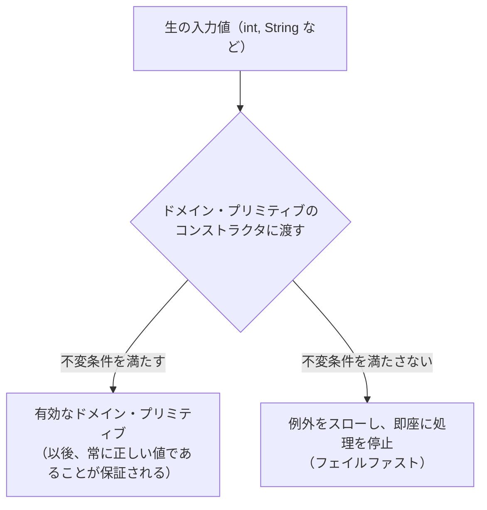

第5章ではさらに、次のような発展的なテクニックも紹介されています。

- **APIの堅牢化**：外部公開するAPIの引数・戻り値をドメイン・プリミティブで表現し、API境界で生の入力値を明示的にドメイン・プリミティブへ変換する。不変条件が働くのはコンストラクタや明示的な変換・検証を通したときだけなので、「境界で必ず変換する」ことを設計上の規約にして、検証を通っていない生の値が内部へ流れ込まないようにする。
- **Read-once オブジェクト**：パスワードやクレジットカード番号のような機密情報を「一度しか読み出せない」オブジェクトとして表現し、意図しない多重利用（＝ログ出力などでの漏えい）を検知する。
- **テイント解析（Taint Analysis）**：信頼できない入力（tainted）が、検証を経ずに危険な処理（シンクと呼ばれる箇所）に到達していないかを機械的に追跡する考え方。
- **エンティティの肥大化を防ぐ**：エンティティのメソッドが個別のバリデーションロジックで埋め尽くされることを防ぐため、その責務をドメイン・プリミティブ側に委譲する。

### 6.4 第6章・第7章：状態の整合性と複雑さの低減

DDDの「エンティティ」はミュータブル（変更可能）な状態を持つため、値オブジェクトやドメイン・プリミティブよりも扱いが難しくなります。この2つの章では次のような指針が示されます。

- **生成時点で完全な状態にする**：引数なしコンストラクタ（no-arg constructor）でオブジェクトを生成し、後から setter で値を埋めていくパターンは、「一時的に不正な状態」が存在する隙間を生みます。必須項目はコンストラクタで受け取るのが基本です。複雑な組み立てが必要な場合は **Builderパターン** を使えますが、生成時点の一貫性が保証されるのは、`build()` が必須項目の充足と制約を検証したうえで、生成後に状態を変更できないオブジェクトを返す場合に限られます。単に setter の呼び出しをビルダーへ移し替えただけでは、不正な状態の生成を防げません。
- **状態遷移を制限する**：エンティティが取り得る状態と、その間の遷移を明示的にモデル化する（多くの場合、状態機械やドメインイベントとして表現する）ことで、「本来あり得ないはずの状態」への遷移を防ぎます。

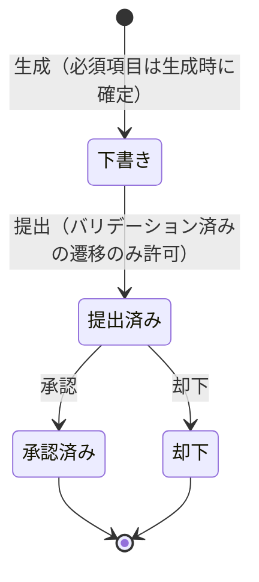

### 6.5 第8章：デリバリーパイプラインの活用

セキュリティ対策は一度実装して終わるものではなく、CI/CDパイプラインの中で継続的に検証すべき対象です。書評でも触れられているように、書籍内のテストコード例はJUnit 5を用いた実践的なものになっており、次のような観点が扱われます。

- 不正な入力・極端な入力（境界値、空文字、非常に長い文字列など）を狙ったセキュリティテストをテストスイートに組み込む
- ビルドパイプラインの中に「既知の脆弱性を含む依存ライブラリがないか」を確認するステップを組み込む
- 「エンティティ展開を伴うXMLを拒否できるか」のような、特定の攻撃パターンに対する回帰テストを用意する

### 6.6 第9章：安全な障害処理

例外処理の設計は、可用性（Availability）に直結するセキュリティ上のテーマです。

- 例外は「バグ（プログラミングミス）」と「予期されるビジネス上の失敗」を区別できる階層構造にする
- 障害が発生した際に、システム全体を道連れにせず**部分的に機能を縮退させる**（グレースフルデグラデーション）
- サーキットブレーカーのようなレジリエンス（回復力）パターンを用いて、障害の連鎖を遮断する

### 6.7 第10章：クラウド思考によるメリット

クラウドネイティブな設計思想（Twelve-Factor Appの原則など）は、副産物として強力なセキュリティ上の利点をもたらします。書評で紹介されている「**3つのR**」は特に覚えやすい指針です。

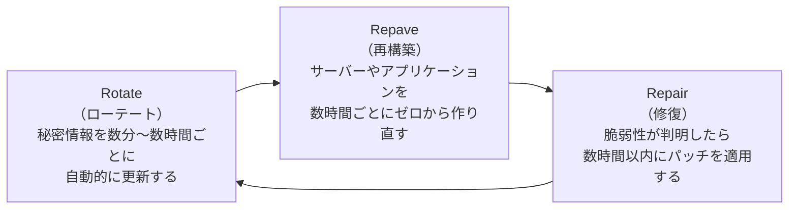

インフラを「使い捨てにできるもの（immutable infrastructure）」として扱うこと自体は、それだけで侵入の影響を小さくするわけではありません。定期的な自動再構築、短命な資格情報、最小権限の付与、ネットワーク分離といった運用と組み合わせて初めて、攻撃者がサーバーに侵入できた場合の滞在時間と被害範囲を構造的に抑えられます。逆に、長期間有効な資格情報が再構築後のインスタンスへ引き継がれていたり、権限やネットワーク境界が緩いままであれば、再構築しても足がかりは残り続けます。

### 6.8 第11章（幕間）：ただで手に入る保険

第2の「幕間」章です。ここまでに学んだ設計プラクティス（ドメイン・プリミティブ、フェイルファスト、境界づけられたコンテキストなど）を導入することが、追加コストではなく、**設計品質向上の "ついで" に手に入る保険**であることを、別の実例を通じて再確認する内容になっています。

---

## 7. Part 3: 応用編 ─ レガシーコードとマイクロサービスへの適用

### 7.1 第12章：レガシーコードへの適用

新規プロジェクトであれば理想的な設計を最初から採用できますが、現実には巨大なレガシーコードベースを相手にすることの方が多いはずです。第12章では、Part 2の考え方を**既存コードに後から適用する**ための現実的な手法が示されます。

- **曖昧なパラメータリストの解消**：`createOrder(String, String, int, int, boolean)` のような、型だけでは意味が分からない引数列を、ドメイン・プリミティブに置き換えていく。一度に全て置き換える「直接アプローチ」、まず使用箇所を洗い出す「発見アプローチ」、新しいAPIを並行して用意する「新API アプローチ」という3つの移行戦略が紹介されます。
- **検証されていない文字列のログ出力の危険性**：ログに未検証の文字列をそのまま出力すると、ログインジェクションや意図しない機密情報の漏えいにつながる。
- **防御的なコード構造**：自分自身の出力すら信用しない（"code that doesn't trust itself"）という考え方。呼び出し元が正しく検証済みのデータを渡してくると期待するのではなく、境界ごとに再検証する。
- **DRY原則の誤用への警鐘**：「同じような見た目のコード」を安易に共通化する（構文的なDRY）のではなく、「同じ意味を持つ概念」を共通化する（意味的なDRY）ことの重要性。見た目が同じでも意味が異なる場合に無理に共通化すると、後から片方だけ変更が必要になった際にセキュリティ上の分岐ミスを生みます。
- **通貨の例（部分的なドメイン・プリミティブ）**：金額を表す型を作ったとしても、通貨単位（USD, JPYなど）を暗黙の前提としてしまうと、「1米ドル」と「1スロベニア・トラール」を区別できずに合算してしまうような重大なバグを生みます。ドメイン・プリミティブは「概念のすべて」を包含して初めて安全になるという教訓です。

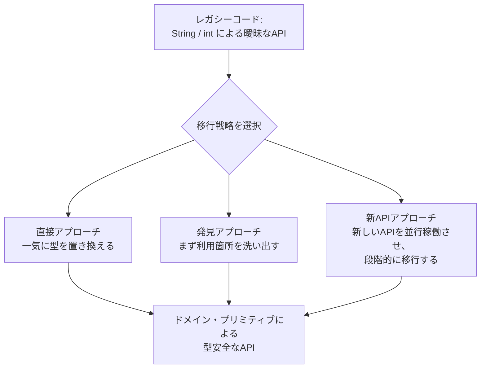

### 7.2 第13章：マイクロサービスへの適用

マイクロサービスは疎結合であるがゆえに、モノリスよりもセキュリティ設計が難しくなる側面があります。第13章では次のようなテーマが扱われます。

- **サービスをまたぐ機密データの扱い**：あるサービスでは「機密」として扱われるべきデータが、別のサービスの境界を越えた瞬間にその文脈を失ってしまうリスク。
- **サービスAPIでの不変条件の強制**：サービス間の契約（API）自体がドメイン・プリミティブ相当の検証を行うことで、「信頼できない他チームのサービスからの入力」を境界で確実に弾く。
- **ログの一貫性・改ざん防止・追跡可能性**：分散システムでは、1つの取引が複数のサービスをまたぐため、ログを追跡可能な形で相関付けること（トレーシング）が難しくなります。さらに、ログ自体が改ざんされたり、ログに意図せず機密データが書き込まれてしまうことで、ログそのものが新たな攻撃対象（セカンダリーな攻撃経路）になり得る点が指摘されています。
- **ドメイン指向のロガーAPI**：「何でも `log.info(str)` で出力できる」汎用ロガーではなく、ログに出力してよい情報とそうでない情報をドメインの型システムで区別できるロガーの設計。

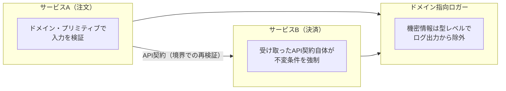

### 7.3 第14章：まとめ ─ セキュリティを忘れずに

最終章では、ここまでの「設計による予防」を補完する、より実務的・組織的なプラクティスがまとめられています。

- コードレビューにセキュリティの観点を組み込む
- ペネトレーションテストを継続的な"設計への挑戦"として位置づける
- バグバウンティプログラムを継続的なペネトレーションテストの一形態として活用する
- チーム全体がセキュリティ分野の基礎知識を持つよう学習を促す
- セキュリティの脅威を「恐れるもの」ではなく「設計のインスピレーション源」として捉え直す
- インシデント対応の仕組み（検知・対応・再発防止）を用意しておく
- レジリエンス／アンチフラジリティ（"やられ強さ"を超えて、攻撃を糧に強くなる仕組み）という概念

> 著者らはここで、**「設計による予防」と「従来型の探索的なセキュリティ活動（ペンテスト、脅威モデリングなど）」は対立するものではなく、両輪であるべきだ**と明確に述べています。本書のタイトルだけを見て「設計さえ良ければペンテストは不要」と誤読しないよう注意が必要です。

---

## 8. 初学者向け ステップバイステップ実践ロードマップ

ここからは、本書のエッセンスを実際のプロジェクトに導入する際の、現実的な導入手順として再構成したものです。

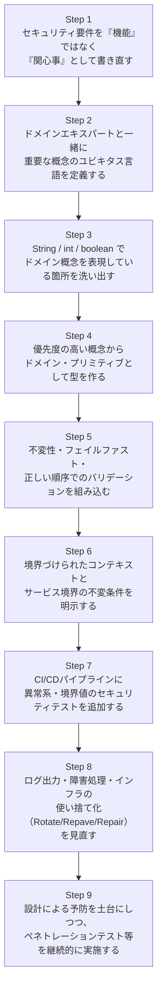

| ステップ | 目的 | 該当章 |
|---|---|---|
| 1. 関心事として再定義 | 「何のためにこの機能が必要か」を明確化し、抜け道を塞ぐ範囲を正しく捉える | 第1章 |
| 2. ユビキタス言語の確立 | 開発者とビジネス側の認識のズレ（＝設計ミス）を減らす | 第3章 |
| 3. 曖昧な型の棚卸し | どこに危険が潜んでいるかを可視化する | 第1, 12章 |
| 4. ドメイン・プリミティブ化 | 「不正な状態そのものを作れなくする」 | 第4, 5章 |
| 5. 不変性・フェイルファスト・バリデーション順序 | データ整合性と早期検知を両立する | 第4章 |
| 6. コンテキスト境界とAPI契約 | サービスをまたいだ際の意味の取り違えを防ぐ | 第3, 13章 |
| 7. 継続的なセキュリティテスト | 一度作った安全性を退行させない | 第8章 |
| 8. 障害処理とインフラの使い捨て化 | 可用性を高め、侵入後の被害範囲を縮小する | 第9, 10章 |
| 9. 探索的セキュリティ活動の継続 | 設計だけではカバーできない領域を補う | 第14章 |

---

## 9. 批判的な視点（本書の限界）

初学者が誤解しないよう、あらかじめ知っておくとよい限界を整理します。

- **本書は「セキュリティの教科書」ではなく「DDDを土台にした設計の教科書」に近い**：ネットワークセキュリティ、暗号技術、認証・認可の詳細な実装方法、OWASP Top 10の個別対策など、セキュリティ全般を体系的に扱う書籍ではありません。あくまで「設計品質を上げることでセキュリティを底上げする」という一断面に特化しています。
- **DDD自体の学習コストがある**：境界づけられたコンテキストや集約といった概念に馴染みがない場合、まず第3章のDDD入門部分の理解に時間がかかります。DDDの原典であるEric Evansの著作と併読すると理解が深まります。
- **静的型付け言語を前提としている**：Java, C#, .NET を主な対象読者としており、動的型付け言語（Python, JavaScriptなど）でどこまで同じ手法を適用できるかは読者自身の翻訳作業が必要です。
- **「設計で守れる範囲」には限界がある**：著者ら自身が第14章で明言している通り、ペネトレーションテストや脅威モデリングといった探索的な活動を代替するものではありません。

---

## 10. さらに学ぶためのリソース

- 著者による無料記事「Domain Primitives: what they are and how you can use them to make more secure software」（Manning公式ブログ）
- Daniel Sawano氏個人ブログでの先行記事（書籍執筆前の草稿的内容）
- Dan Bergh Johnsson & Daniel Deogun によるカンファレンス講演「Domain Primitives in Action: Making it Secure by Design」（Explore DDD, 2017）
- Software Engineering Radio および Arrested DevOps ポッドキャストでの著者インタビュー
- Matt Raible（Okta）による書評ブログおよび、それを参照したマイクロサービスセキュリティパターンの記事

---

## 11. 参考文献・出典

本ガイドの作成にあたり、以下の一次情報・書評記事を参照しました（2026年8月27日時点でアクセス可能であることを確認済み）。

- [Manning Publications 公式書籍ページ](https://www.manning.com/books/secure-by-design)
- [Secure by Design 第1章 無料プレビュー（MEAP版PDF, Manning公式）](https://manning-content.s3.amazonaws.com/download/a/78580ef-38c8-4bd1-bc2f-ba4e8c7d7880/Johnsson_SbD_MEAP_V13_ch1.pdf)
- [liveBook（Manning）第1章](https://livebook.manning.com/book/secure-by-design/chapter-1/v-5/d5e499)
- [liveBook（Manning）第2章（幕間：アンチ・ハムレット）](https://livebook.manning.com/book/secure-by-design/chapter-2/)
- [liveBook（Manning）第3章（DDDの中心概念）](https://livebook.manning.com/book/secure-by-design/chapter-3)
- [liveBook（Manning）第5章（ドメイン・プリミティブ）](https://livebook.manning.com/book/secure-by-design/chapter-5)
- [liveBook（Manning）第13章（マイクロサービス）](https://livebook.manning.com/book/secure-by-design/chapter-13/)
- [O'Reilly Online Learning 収録ページ（詳細目次）](https://www.oreilly.com/library/view/secure-by-design/9781617294358/)
- [Manning公式ブログ「Domain Primitives: what they are and how you can use them to make more secure software」](https://freecontent.manning.com/domain-primitives-what-they-are-and-how-you-can-use-them-to-make-more-secure-software/)
- [同記事（Medium転載版）](https://manningbooks.medium.com/domain-primitives-what-they-are-and-how-you-can-use-them-to-make-more-secure-software-174504696518)
- [Daniel Sawano氏個人ブログ（書籍執筆時の草稿記事）](https://software.sawano.se/2017/09/domain-primitives.html)
- [Matt Raible（Okta, 国際的に著名なJava/Web開発者）による書評](https://raibledesigns.com/rd/entry/secure_by_design_book_review)
- [Adrian Citu によるレビュー記事](https://adriancitu.com/2022/10/05/book-review-secure-by-design/)
- [Goodreads 書籍ページ（賛否両論のレビュー集）](https://www.goodreads.com/book/show/33953413-secure-by-design)
- [Software Engineering Radio エピソード（著者インタビュー）](https://se-radio.net/2025/09/se-radio-684-dan-bergh-johnsson-and-daniel-deogun-on-secure-by-design/)
- [Arrested DevOps ポッドキャスト（著者インタビュー）](https://www.arresteddevops.com/secure-by-design/)
- [virtualDDD.com 収録カンファレンス動画「Domain Primitives in Action」](https://virtualddd.com/videos/dan-bergh-johnsson-daniel-deogun-domain-primitives-in-action-making-it-secure-by-design/)
- [同講演 YouTube 版（Explore DDD, Denver）](https://www.youtube.com/watch?v=ogjOKlXHi08)
- [Katharina's blog（ドメイン・プリミティブ実践記）](https://katharina.damschen.net/post/2025-11-10-domain-primitives/)
- [マイナビ出版 日本語版書籍ページ](https://book.mynavi.jp/ec/products/detail/id=124056)
- [kymmt氏によるブログ書評（日本語）](https://blog.kymmt.com/entry/secure-by-design)
- [Wikipedia「Secure by design」（一般的な概念としてのSecure by Design、参考として）](https://en.wikipedia.org/wiki/Secure_by_design)

---

*本ドキュメントは学習・教育目的で作成された二次的な解説資料です。書籍本文の引用は最小限にとどめ、コード例はすべて独自に作成したものです。正確な内容・完全なコード例については、必ず原著（またはマイナビ出版の日本語版）をご参照ください。*
