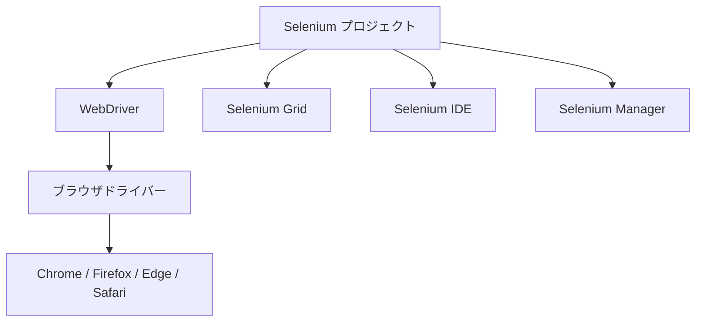
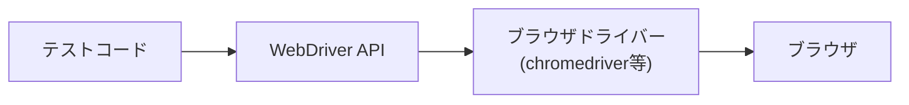
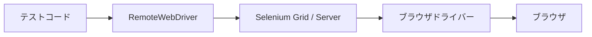
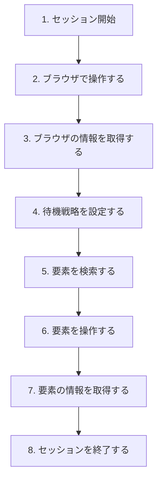
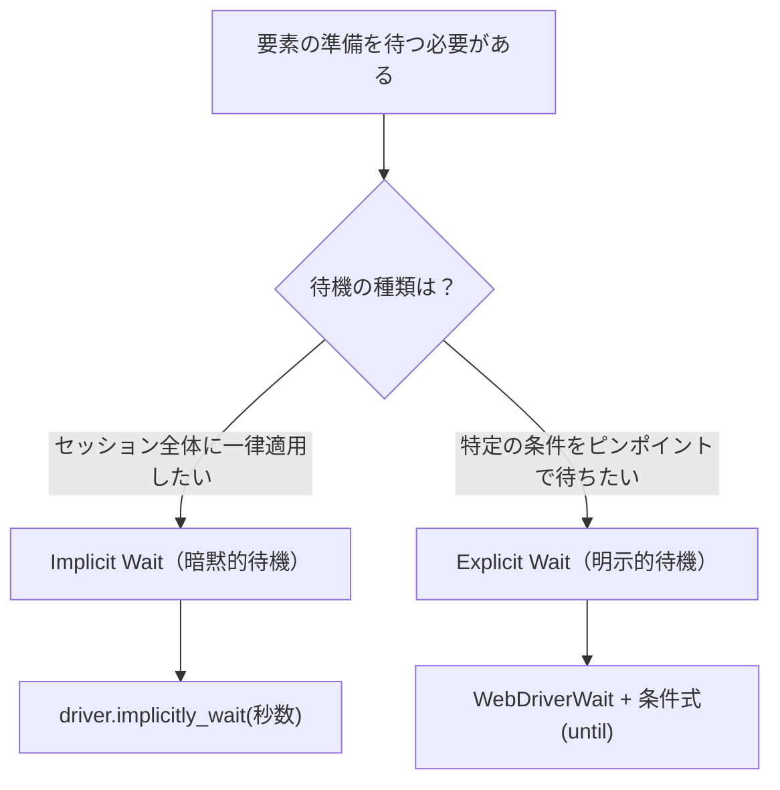
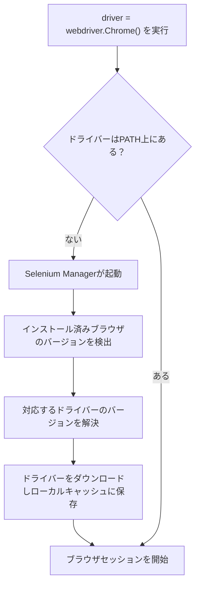
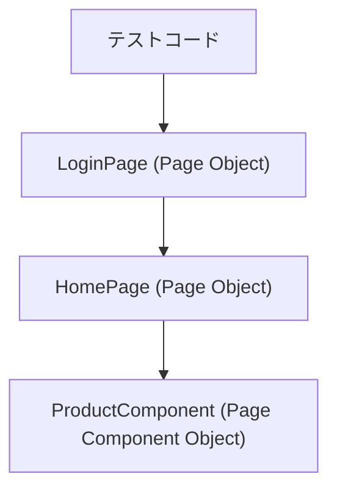
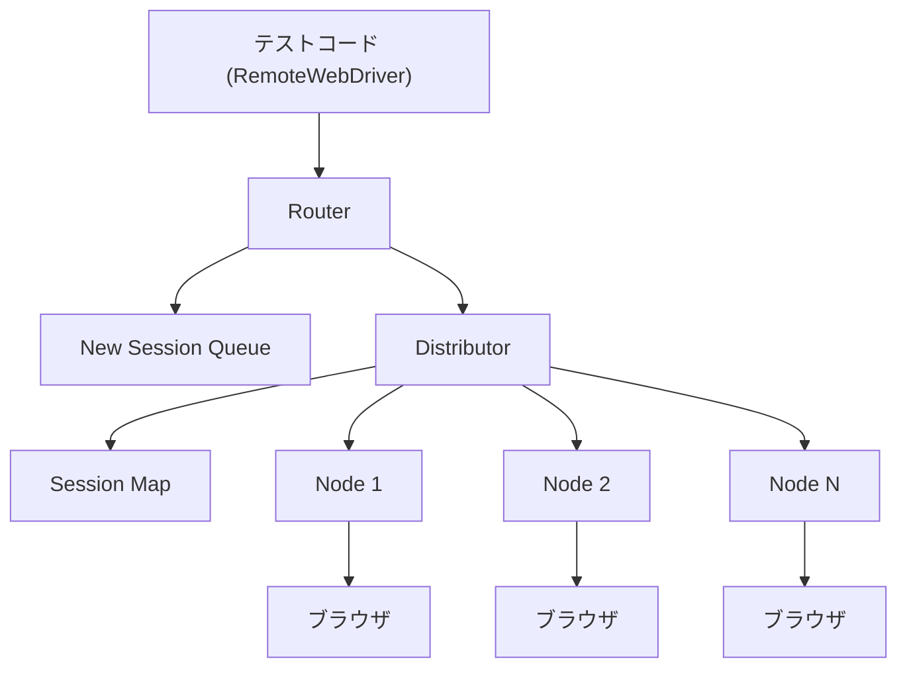

# Selenium 完全ガイド：初心者のためのステップバイステップ解説

> 本ガイドは [Selenium 公式ドキュメント](https://www.selenium.dev/documentation/) を主な情報源とし、2026年7月時点の最新情報を基に作成しています。各セクションの末尾に参照元URLを明記していますので、より詳しい内容を確認したい場合はあわせてご参照ください。

## この記事の対象読者

- ブラウザ自動化・Webアプリケーションのテスト自動化をこれから学びたい方
- Selenium という名前は知っているが、何から手を付けてよいか分からない方
- QAエンジニア／ソフトウェアエンジニアとして自動テストの基礎を体系的に押さえたい方

前提知識として、Python の基本文法（変数、関数、`for`文程度）と HTML/CSS の基礎を知っていると理解がスムーズです。本ガイドのコード例は主に **Python** で記述していますが、Java・C#・Ruby・JavaScript・Kotlin にも同様のAPIが存在します（インストール方法の章で紹介します）。

---

## 目次

1. [Seleniumとは何か](#1-seleniumとは何か)
2. [Seleniumのアーキテクチャを理解する](#2-seleniumのアーキテクチャを理解する)
3. [環境構築（インストール）](#3-環境構築インストール)
4. [はじめてのSeleniumスクリプト](#4-はじめてのseleniumスクリプト)
5. [要素の検索方法（ロケーター戦略）](#5-要素の検索方法ロケーター戦略)
6. [待機戦略（Waits）](#6-待機戦略waits)
7. [ブラウザの操作（Interactions）](#7-ブラウザの操作interactions)
8. [Actions API（キーボード・マウス操作）](#8-actions-apiキーボードマウス操作)
9. [Selenium Manager（ドライバーの自動管理）](#9-selenium-managerドライバーの自動管理)
10. [Page Object Model（保守性の高いテスト設計）](#10-page-object-model保守性の高いテスト設計)
11. [Selenium Grid（並列・分散実行）](#11-selenium-grid並列分散実行)
12. [Selenium IDE（ノーコード記録ツール）](#12-selenium-ideノーコード記録ツール)
13. [テストのベストプラクティス](#13-テストのベストプラクティス)
14. [よくあるエラーとトラブルシューティング](#14-よくあるエラーとトラブルシューティング)
15. [まとめと次のステップ](#15-まとめと次のステップ)
16. [参考文献一覧](#16-参考文献一覧)

---

## 1. Seleniumとは何か

Selenium は、Webブラウザの操作を自動化するためのオープンソースプロジェクトの総称です。単一のツールではなく、複数のツール・ライブラリの集合体（アンブレラプロジェクト）であり、主に以下の4つの要素から構成されています。

| コンポーネント | 役割 |
|---|---|
| **WebDriver** | ブラウザをネイティブに直接操作するためのAPI。Seleniumの中核 |
| **Selenium Grid** | 複数のマシン・ブラウザにテストを分散させ、並列実行を可能にする基盤 |
| **Selenium IDE** | ブラウザの操作を記録・再生できるブラウザ拡張機能（ノーコード） |
| **Selenium Manager** | ブラウザドライバーとブラウザ本体を自動的に検出・ダウンロード・管理するCLIツール |

Seleniumは [W3C WebDriver仕様](https://www.w3.org/TR/webdriver/) の実装基盤を提供しており、この標準化された仕様のおかげで、Chrome・Firefox・Edge・Safariなど主要ブラウザに対して同じコードで操作できる「相互運用性」が実現されています。



Seleniumを使ったコードは、驚くほどシンプルです。以下はPythonでの最小構成の例です。

```python
from selenium import webdriver

driver = webdriver.Chrome()
driver.get("https://www.selenium.dev")
driver.quit()
```

これだけで、Chromeブラウザが起動し、指定したURLを開き、ブラウザを終了するという一連の自動操作が完了します。

**参考:**
- https://www.selenium.dev/documentation/
- https://www.selenium.dev/

---

## 2. Seleniumのアーキテクチャを理解する

SeleniumのWebDriverは、テストコードから直接ブラウザを操作しているように見えますが、実際には「ドライバー」と呼ばれる仲介プロセスを経由しています。ドライバーは各ブラウザベンダーが提供する実行ファイル（chromedriver、geckodriver、msedgedriverなど）で、ブラウザと同じマシン上で動作します。

### 用語の整理

| 用語 | 説明 |
|---|---|
| API | WebDriverを操作するための「命令」の集合 |
| ライブラリ | 各プログラミング言語向けにAPIを実装したパッケージ |
| ドライバー | ブラウザを直接制御する実行ファイル（ブラウザベンダー提供） |
| フレームワーク | JUnit・NUnit・pytestなど、テストの実行・アサーションを担う追加ライブラリ |

WebDriver自体は「アサーション（成功・失敗の判定）」や「レポート出力」の機能を持ちません。これらはテストフレームワーク（pytest、JUnitなど）が担当する領域です。

### 直接通信（ローカル実行）

最もシンプルな構成は、テストコードがローカルマシン上のドライバーを経由してブラウザを操作する形です。



### リモート通信（Selenium Grid経由）

`RemoteWebDriver` を使うと、テストコードとブラウザが異なるマシン上にあっても操作できます。この場合、Selenium ServerやSelenium Gridがドライバーとの仲介役を担います。



この仕組みにより、CI/CD環境やクラウド上の複数ブラウザ・複数OSでテストを実行するスケーラブルな構成が可能になります（詳細は「11. Selenium Grid」で解説します）。

**参考:**
- https://www.selenium.dev/documentation/overview/components/

---

## 3. 環境構築（インストール）

### Step 1: 前提条件の確認

- ブラウザ本体（Chrome、Firefox、Edgeなど）がインストールされていること
- 各言語の実行環境（Pythonの場合は Python 3系）がセットアップ済みであること
- ブラウザドライバーは手動でダウンロードする必要はありません。Selenium 4.6以降は「Selenium Manager」が自動的に管理してくれます（詳細は9章）

### Step 2: 各言語でのインストール方法

言語ごとに、パッケージマネージャーを使ってSeleniumライブラリをインストールします。

| 言語 | インストールコマンド |
|---|---|
| Python | `pip install selenium` |
| Java (Maven) | `pom.xml` に `org.seleniumhq.selenium:selenium-java` を依存関係として追加 |
| Java (Gradle) | `build.gradle` に `org.seleniumhq.selenium:selenium-java` を追加 |
| C#（.NET CLI） | `dotnet add package Selenium.WebDriver` |
| Ruby | `gem install selenium-webdriver` |
| JavaScript（Node.js） | `npm install selenium-webdriver` |

Python環境でrequirements.txtを使ってバージョンを固定する場合は、以下のように記述します（本ガイド執筆時点の最新安定版は 4.41.0 です。最新バージョンは必ず [Downloadsページ](https://www.selenium.dev/downloads/) で確認してください）。

```text
selenium==4.41.0
pytest==9.0.3
```

### Step 3: インストールの確認

以下のスクリプトを実行し、ブラウザが起動すれば環境構築は成功です。

```python
from selenium import webdriver

driver = webdriver.Chrome()
driver.get("https://www.selenium.dev")
print(driver.title)
driver.quit()
```

**参考:**
- https://www.selenium.dev/documentation/webdriver/getting_started/install_library/
- https://www.selenium.dev/downloads/
- https://pypi.org/project/selenium/

---

## 4. はじめてのSeleniumスクリプト

Selenium公式ドキュメントでは、WebDriverの操作を「8つの基本コンポーネント」として整理しています。この構造を理解すれば、ほとんどのSeleniumコードが読み書きできるようになります。



### Step 1: セッション開始

`webdriver.Chrome()` を呼び出すと、ブラウザが起動し、以降の操作を受け付けるセッションが開始されます。

```python
driver = webdriver.Chrome()
```

### Step 2: ブラウザで操作する（ナビゲーション）

`get()` メソッドで指定したURLへ遷移します。

```python
driver.get("https://www.selenium.dev/selenium/web/web-form.html")
```

### Step 3: ブラウザの情報を取得する

タイトルやURL、Cookieなど、ブラウザ全体に関する情報を取得できます。

```python
title = driver.title
```

### Step 4: 待機戦略を設定する

要素が操作可能になるまで待つ設定を行います（詳細は6章）。

```python
driver.implicitly_wait(0.5)
```

### Step 5: 要素を検索する

`By` クラスを使って、操作対象の要素を特定します（詳細は5章）。

```python
from selenium.webdriver.common.by import By

text_box = driver.find_element(by=By.NAME, value="my-text")
submit_button = driver.find_element(by=By.CSS_SELECTOR, value="button")
```

### Step 6: 要素を操作する

文字入力やクリックなど、実際のユーザー操作を再現します。

```python
text_box.send_keys("Selenium")
submit_button.click()
```

### Step 7: 要素の情報を取得する

操作後の画面に表示されているテキストなどを検証用に取得します。

```python
message = driver.find_element(by=By.ID, value="message")
result_text = message.text
```

### Step 8: セッションを終了する

`quit()` を呼び出すと、ドライバープロセスとブラウザが終了します。これ以降そのdriverインスタンスへ命令を送ることはできません。

```python
driver.quit()
```

### まとめ：完全なスクリプト例

```python
from selenium import webdriver
from selenium.webdriver.common.by import By

driver = webdriver.Chrome()

driver.get("https://www.selenium.dev/selenium/web/web-form.html")
title = driver.title

driver.implicitly_wait(0.5)

text_box = driver.find_element(by=By.NAME, value="my-text")
submit_button = driver.find_element(by=By.CSS_SELECTOR, value="button")

text_box.send_keys("Selenium")
submit_button.click()

message = driver.find_element(by=By.ID, value="message")
result_text = message.text

driver.quit()
```

**参考:**
- https://www.selenium.dev/documentation/webdriver/getting_started/first_script/
- https://www.selenium.dev/documentation/webdriver/getting_started/using_selenium/

---

## 5. 要素の検索方法（ロケーター戦略）

「ロケーター（Locator）」とは、DOM上の要素を一意に特定するための指定方法です。Selenium WebDriverには、伝統的に8種類のロケーター戦略が用意されています。

| ロケーター | 説明 |
|---|---|
| `class name` | 要素のclass属性に一致する要素を検索（複合クラス名は不可） |
| `css selector` | CSSセレクター構文に一致する要素を検索 |
| `id` | 要素のid属性に一致する要素を検索 |
| `name` | 要素のname属性に一致する要素を検索 |
| `link text` | 表示テキストが完全一致するリンク要素を検索 |
| `partial link text` | 表示テキストが部分一致するリンク要素を検索（複数該当時は最初の1件） |
| `tag name` | タグ名が一致する要素を検索 |
| `xpath` | XPath式に一致する要素を検索 |

### Step 1: `By` クラスをインポートする

```python
from selenium.webdriver.common.by import By
```

### Step 2: 各ロケーターの使用例

以下のようなHTMLがあるとします。

```html
<input class="information" type="text" id="fname" name="fname" value="Jane">
<a href="www.selenium.dev">Selenium Official Page</a>
```

```python
# id で検索
element = driver.find_element(By.ID, "fname")

# css selector で検索
element = driver.find_element(By.CSS_SELECTOR, "#fname")

# class name で検索
element = driver.find_element(By.CLASS_NAME, "information")

# name で検索
element = driver.find_element(By.NAME, "fname")

# link text で検索
element = driver.find_element(By.LINK_TEXT, "Selenium Official Page")

# partial link text で検索
element = driver.find_element(By.PARTIAL_LINK_TEXT, "Official Page")

# tag name で検索
element = driver.find_element(By.TAG_NAME, "a")

# xpath で検索
element = driver.find_element(By.XPATH, "//input[@value='Jane']")
```

### Step 3: ロケーター選定の考え方

- `id` は一意性が高く、変更されにくいため最優先で検討する
- `id` がない場合は `css selector` が可読性・パフォーマンスの面で扱いやすい
- `xpath` は柔軟だが複雑になりやすく、DOM構造の変化に弱いため必要な場面に限定する
- ロケーターはテストコード内に散在させず、Page Object などに一元管理する（10章参照）

### Relative Locators（相対ロケーター）

Selenium 4からは、既存の要素を基準に「上」「下」「左」「右」「近く」といった位置関係で要素を探す「相対ロケーター」も利用できます。動的に生成されるフォームなどで、固定的なIDが振られていない要素を特定する際に有用です。

**参考:**
- https://www.selenium.dev/documentation/webdriver/elements/locators/
- https://www.selenium.dev/documentation/webdriver/elements/finders/
- https://www.selenium.dev/documentation/test_practices/encouraged/locators/

---

## 6. 待機戦略（Waits）

ブラウザ自動化における最大の課題のひとつが「タイミングの同期」です。JavaScriptによる非同期描画やSPA（シングルページアプリケーション）では、要素がまだDOM上に存在しない、あるいは非表示のタイミングでSeleniumが操作を試み、失敗する「フレーキーテスト（不安定なテスト）」が発生しがちです。

Seleniumには、これを解決するための2種類の待機の仕組みがあります。



| 項目 | Implicit Wait（暗黙的待機） | Explicit Wait（明示的待機） |
|---|---|---|
| 適用範囲 | セッション全体（すべての要素検索に適用） | 個別の待機箇所ごとに指定 |
| 待つ対象 | 要素が見つかるまで | 表示状態・クリック可能状態など任意の条件 |
| デフォルト値 | 0秒（即座にエラーを返す） | 都度指定が必要 |
| カスタマイズ性 | 低い | ポーリング間隔・無視する例外なども指定可能 |
| 推奨度 | 限定的な用途向け | 基本的にはこちらを推奨 |

> **重要な警告:** Implicit WaitとExplicit Waitを混在させると、待ち時間が想定以上に加算され、意図しないタイムアウトが発生することがあります。例えば暗黙的待機を10秒、明示的待機を15秒に設定すると、最悪の場合20秒後にタイムアウトが発生する可能性があります。どちらか一方の戦略に統一することが推奨されます。

### Step 1: Implicit Wait（暗黙的待機）を設定する

```python
driver.implicitly_wait(2)  # 秒単位
```

要素が見つかるまで、指定した時間内はリトライを続けます。要素が見つかった時点ですぐに処理は継続されるため、待機時間を長めに設定しても常に待たされるわけではありません。

### Step 2: Explicit Wait（明示的待機）を設定する

`WebDriverWait` を使い、特定の条件（表示されるまで、など）が満たされるまでポーリングします。

```python
from selenium.webdriver.support.wait import WebDriverWait

wait = WebDriverWait(driver, timeout=2)
wait.until(lambda d: revealed.is_displayed())
```

### Step 3: カスタマイズ（ポーリング間隔・例外の無視）

```python
from selenium.common import NoSuchElementException, ElementNotInteractableException

errors = [NoSuchElementException, ElementNotInteractableException]
wait = WebDriverWait(driver, timeout=2, poll_frequency=0.3, ignored_exceptions=errors)
wait.until(lambda d: revealed.send_keys("Displayed") or True)
```

**参考:**
- https://www.selenium.dev/documentation/webdriver/waits/
- https://www.selenium.dev/documentation/webdriver/support_features/expected_conditions/

---

## 7. ブラウザの操作（Interactions）

要素そのものへの操作以外に、ブラウザ全体を対象とした操作も頻繁に利用します。

| 操作対象 | 主な用途 |
|---|---|
| Navigation（ナビゲーション） | ページ遷移、戻る・進む・リロード |
| Alerts（アラート） | JavaScriptのalert・confirm・promptへの応答 |
| Cookies（Cookie） | Cookieの取得・追加・削除 |
| Frames（フレーム） | iframe内部への切り替え |
| Windows（ウィンドウ・タブ） | 複数タブ・ウィンドウ間の切り替え |

### Step 1: ページ遷移（Navigation）

```python
driver.get("https://www.selenium.dev")
driver.back()      # 戻る
driver.forward()   # 進む
driver.refresh()   # リロード
```

### Step 2: アラートへの対応

```python
alert = driver.switch_to.alert
alert.accept()   # OKを押す
# alert.dismiss()  # キャンセルを押す
```

### Step 3: フレーム内部への切り替え

```python
driver.switch_to.frame("frame_name")
# 元のコンテキストに戻る
driver.switch_to.default_content()
```

### Step 4: ウィンドウ・タブの切り替え

```python
original_window = driver.current_window_handle

for handle in driver.window_handles:
    if handle != original_window:
        driver.switch_to.window(handle)
        break
```

**参考:**
- https://www.selenium.dev/documentation/webdriver/interactions/
- https://www.selenium.dev/documentation/webdriver/interactions/navigation/
- https://www.selenium.dev/documentation/webdriver/interactions/alerts/
- https://www.selenium.dev/documentation/webdriver/interactions/cookies/
- https://www.selenium.dev/documentation/webdriver/interactions/frames/
- https://www.selenium.dev/documentation/webdriver/interactions/windows/

---

## 8. Actions API（キーボード・マウス操作）

クリックやテキスト入力だけでは表現できない、ドラッグ＆ドロップ、マウスホバー、複数キーの同時押しなどの複雑な操作は「Actions API」を使って表現します。

### Step 1: `ActionChains` をインポートする

```python
from selenium.webdriver.common.action_chains import ActionChains
```

### Step 2: マウス操作（ホバー・ドラッグ＆ドロップ）

```python
menu = driver.find_element(By.CSS_SELECTOR, "#menu")
item = driver.find_element(By.CSS_SELECTOR, "#item")

ActionChains(driver).move_to_element(menu).click(item).perform()
```

### Step 3: キーボード操作（複数キーの組み合わせ）

```python
from selenium.webdriver.common.keys import Keys

text_box = driver.find_element(By.NAME, "my-text")
ActionChains(driver).click(text_box).send_keys("selenium").key_down(Keys.SHIFT).send_keys("selenium").key_up(Keys.SHIFT).perform()
```

**参考:**
- https://www.selenium.dev/documentation/webdriver/actions_api/
- https://www.selenium.dev/documentation/webdriver/actions_api/keyboard/
- https://www.selenium.dev/documentation/webdriver/actions_api/mouse/

---

## 9. Selenium Manager（ドライバーの自動管理）

以前のSeleniumでは、ブラウザとドライバー（chromedriver等）のバージョンが一致していないと `session not created` エラーが発生し、手動でドライバーをダウンロードし直す必要がありました。Chromeなどのブラウザは自動更新される「エバーグリーン」な性質を持つため、これは頻繁に発生する運用課題でした。

この課題を解決するために、Selenium 4.6以降は **Selenium Manager** がSeleniumバインディングに標準搭載されています。Rust製のCLIツールで、追加のインストール作業なしに自動的に機能します。

### Step 1: 仕組みを理解する

Selenium Managerは、ドライバーが未指定・未検出の場合にのみフォールバックとして動作します。手動でドライバーパスを指定している場合はそちらが優先されます。



### Step 2: 自動ブラウザ管理（Automated Browser Management）

Selenium 4.11以降では、ドライバーだけでなくブラウザ本体（Chrome、Firefox、Edge）もローカルに存在しない場合は自動的にダウンロード・キャッシュされます。`browserVersion` オプションを使えば、`stable`・`beta`・`dev`・`canary`・`esr`（Firefoxのみ）といったラベルで特定バージョンを指定することも可能です。

### Step 3: 主要な設定項目

Selenium Managerは、CLI引数・設定ファイル（`se-config.toml`）・環境変数の3通りで設定できます（優先順位はこの順）。

| CLI引数 | 説明 |
|---|---|
| `--browser` | ブラウザ名 (`chrome` / `firefox` / `edge` など) を指定 |
| `--browser-version` | バージョン番号、または `stable` / `beta` / `dev` / `canary` を指定 |
| `--proxy` | ネットワークプロキシを指定（企業ネットワーク内で有用） |
| `--clear-cache` | ローカルキャッシュ（`~/.cache/selenium`）を削除 |
| `--offline` | ネットワークアクセスを無効化するオフラインモード |
| `--debug` | 詳細なデバッグログを出力 |

### Step 4: データ収集について

Selenium Managerはデフォルトで匿名の利用統計情報（Seleniumバージョン、言語バインディング、OS、ブラウザバージョン、おおまかな地理情報）を収集します。これを無効化したい場合は、環境変数 `SE_AVOID_STATS=true` を設定します。

**参考:**
- https://www.selenium.dev/documentation/selenium_manager/

---

## 10. Page Object Model（保守性の高いテスト設計）

テストコードにロケーターや操作ロジックを直接書き続けると、UIの変更のたびに複数のテストファイルを修正する必要が生じ、保守性が急速に悪化します。この課題に対する定番の設計パターンが **Page Object Model（POM）** です。

### 基本的な考え方

Page Object とは、テスト対象アプリケーションの「1つのページ」をオブジェクト指向のクラスとしてモデル化したものです。ロケーターや操作方法はPage Objectクラス内に閉じ込め、テストコードはそのクラスが提供する「サービス（メソッド）」だけを呼び出します。



### Step 1: Page Objectを持たない場合の問題点

```python
def test_login(driver):
    driver.find_element(By.NAME, "user_name").send_keys("username")
    driver.find_element(By.NAME, "password").send_keys("my-secret-password")
    driver.find_element(By.NAME, "sign-in").click()

    heading = driver.find_element(By.TAG_NAME, "h1")
    assert heading.text == "Hello username"
```

ロケーターとテストロジックが密結合しており、UIが変わるたびにこのテストを直接修正する必要があります。

### Step 2: Page Objectとして書き直す

```python
class LoginPage:
    def __init__(self, driver):
        self.driver = driver

    def login_as(self, username, password):
        self.driver.find_element(By.NAME, "user_name").send_keys(username)
        self.driver.find_element(By.NAME, "password").send_keys(password)
        self.driver.find_element(By.NAME, "sign-in").click()
        return HomePage(self.driver)


class HomePage:
    def __init__(self, driver):
        self.driver = driver

    def get_heading_text(self):
        return self.driver.find_element(By.TAG_NAME, "h1").text
```

### Step 3: テストコード側の変化

```python
def test_login(driver):
    login_page = LoginPage(driver)
    home_page = login_page.login_as("username", "my-secret-password")
    assert home_page.get_heading_text() == "Hello username"
```

UIの構造が変わった場合でも、修正が必要なのは `LoginPage` や `HomePage` クラスの内部だけで、テストコード自体は変更不要です。

### 設計上の重要なルール

- Page Object自体はアサーション（検証）を行わない。検証はテストコード側の責務
- 例外として、コンストラクタで「正しいページが表示されているか」だけは確認してよい
- メソッドは別のPage Objectを返すことで、ユーザーの画面遷移をそのままコードで表現できる（フルーエントな設計）
- 大きなページは「Page Component Object」として部品単位に分割し、繰り返し利用できるようにする

**参考:**
- https://www.selenium.dev/documentation/test_practices/encouraged/page_object_models/

---

## 11. Selenium Grid（並列・分散実行）

テストの数が増えてくると、1台のマシンで直列にテストを実行するのは非効率になります。**Selenium Grid** は、複数のマシン・複数のブラウザに対してテストを分散させ、並列実行を可能にする仕組みです。

### 3つの実行モード

| モード | 特徴 | 主な用途 |
|---|---|---|
| Standalone | 全コンポーネントが1プロセスに統合。1台のマシンのみで完結 | ローカル開発・デバッグ、CI/CDでの簡易Grid |
| Hub and Node | Hubが受付を担当し、複数のNodeへ処理を振り分ける | 複数OS・複数ブラウザバージョンでの分散実行 |
| Distributed | Router・Distributor・Session Map等、6つのコンポーネントを個別に別マシンで起動 | 大規模・高可用性が求められる本番運用環境 |

### Step 1: Standaloneモードで最速に試す

```bash
java -jar selenium-server-<version>.jar standalone
```

デフォルトで `http://localhost:4444` がリクエストを受け付けます。ブラウザで同じURLを開くと、Grid UIで実行中のセッションを確認できます。

### Step 2: テストコードから接続する

```python
from selenium import webdriver
from selenium.webdriver.chrome.options import Options

options = Options()
driver = webdriver.Remote(command_executor="http://localhost:4444", options=options)
driver.get("https://www.selenium.dev")
driver.quit()
```

### Step 3: Hub and Nodeモードで分散させる

```bash
# Hub側
java -jar selenium-server-<version>.jar hub

# Node側（別マシンでもよい）
java -jar selenium-server-<version>.jar node --hub http://<hub-ip>:4444
```

### Gridのコンポーネント構成（Distributedモードの内部構造）



### Gridの規模の目安

| 規模 | 構成 |
|---|---|
| Small | StandaloneまたはNode数5台以下のHub/Node構成 |
| Middle | Node数6〜60台程度のHub/Node構成 |
| Large | Node数60〜100台程度のHub/Node、または100台超のDistributed構成 |

> **セキュリティ上の警告:** Selenium Gridは適切なファイアウォール設定なしにインターネットへ公開してはいけません。外部からGridへの不正アクセスを許すと、内部アプリケーションやファイルへのアクセス、任意のバイナリ実行を許してしまう危険性があります。

**参考:**
- https://www.selenium.dev/documentation/grid/getting_started/
- https://www.selenium.dev/documentation/grid/components/
- https://www.selenium.dev/documentation/grid/architecture/

---

## 12. Selenium IDE（ノーコード記録ツール）

**Selenium IDE** は、Chrome・Firefox・Edge向けのブラウザ拡張機能で、ユーザーのブラウザ操作をそのまま記録し、Seleniumのコマンドとして再生できるツールです。コードを書かずに簡単なテストシナリオを作成できるため、Seleniumの構文を学ぶ入り口としても適しています。

### Step 1: 拡張機能をインストールする

Chrome・Firefox・Edgeそれぞれの拡張機能ストアからSelenium IDEをインストールします。

### Step 2: 操作を記録する

「Record」ボタンを押した状態でブラウザを操作すると、クリック・入力・遷移などの操作がコマンドとして自動的に記録されます。

### Step 3: 再生・エクスポートする

記録したシナリオはIDE上でそのまま再生できるほか、Java・Python・JavaScriptなどのコードとしてエクスポートし、WebDriverベースのテストスイートに組み込むことも可能です。

**参考:**
- https://www.selenium.dev/documentation/ide/
- https://www.selenium.dev/selenium-ide/docs/en/introduction/getting-started

---

## 13. テストのベストプラクティス

Selenium公式ドキュメントの Test Practices セクションでは、自動テストを長期的に保守可能にするための「推奨される振る舞い」と「避けるべき振る舞い」がまとめられています。

| 推奨されるプラクティス | 避けるべきプラクティス |
|---|---|
| Page Object Model を活用してロケーターを一元管理する | テスト間で状態（ログインセッション等）を共有する |
| 各テストを独立させ、実行順序に依存させない | CAPTCHA突破を自動化しようとする |
| テストごとに新しいブラウザセッションを使う | HTTPステータスコードだけでテストの成否を判定する |
| テスト結果のレポーティングを充実させる | Gmail・外部メール・Facebookログインのような外部サービスへ依存する |
| 外部サービスはモック化して安定性を高める | 2要素認証（2FA）を自動テストの中で回避しようとする |
| Fluent API（メソッドチェーン）で読みやすいテストを書く | リンクを再帰的に辿るクローリング的なテストを書く |

これらの背景には共通して「テストの決定論性（同じ入力で常に同じ結果になること）を保つ」という思想があります。外部サービスやCAPTCHA、2FAのような「意図的に自動化を妨げる仕組み」に依存すると、テストが不安定になったり、対象サービスの利用規約に抵触したりするリスクがあるため、避けることが推奨されています。

**参考:**
- https://www.selenium.dev/documentation/test_practices/encouraged/
- https://www.selenium.dev/documentation/test_practices/discouraged/

---

## 14. よくあるエラーとトラブルシューティング

初学者がつまずきやすい代表的なエラーを整理します。

| エラー | 主な原因 | 対処法 |
|---|---|---|
| `NoSuchElementException` | 指定したロケーターに一致する要素が見つからない | ロケーターの見直し、待機戦略（6章）の導入 |
| `ElementNotInteractableException` | 要素は存在するが、非表示・無効化状態などで操作できない | Explicit Waitで「クリック可能になるまで」待機する |
| `StaleElementReferenceException` | 取得済みの要素参照が、DOM更新により無効になった | 要素を再取得してから操作する |
| `session not created` | ブラウザとドライバーのバージョン不一致 | Selenium Manager（9章）を利用してバージョン管理を任せる |
| ドライバーが見つからないエラー | ドライバーがPATH上に存在しない、パス指定の誤り | Selenium Managerに任せるか、`Service`クラスで明示的にパスを指定する |

**参考:**
- https://www.selenium.dev/documentation/webdriver/troubleshooting/errors/
- https://www.selenium.dev/documentation/webdriver/troubleshooting/errors/driver_location/
- https://www.selenium.dev/documentation/webdriver/troubleshooting/logging/

---

## 15. まとめと次のステップ

本ガイドでは、Seleniumの全体像から実際のコードの書き方、そして保守性・拡張性を高めるための設計パターンまでを段階的に解説しました。

- Seleniumは WebDriver・Grid・IDE・Manager から構成されるアンブレラプロジェクトである
- WebDriverの操作は「8つの基本コンポーネント」に整理できる
- ロケーター戦略を理解し、Page Object Modelでテストコードを整理することが保守性の鍵
- 待機戦略（特にExplicit Wait）を正しく使うことがテストの安定性に直結する
- Selenium Managerのおかげで、ドライバー管理の手間はほぼ解消されている
- テストが増えてきたらSelenium Gridによる並列実行を検討する

### 次のステップ

1. 実際に手を動かして、自分のアプリケーションやサンプルサイトに対してテストを書いてみる
2. pytestなどのテストフレームワークと組み合わせ、アサーションやレポート出力を整備する
3. CI/CDパイプライン（GitHub Actionsなど）にテストを組み込み、継続的に実行する
4. チームで開発している場合は、Page Object Modelのディレクトリ構成をあらかじめ決めておく

---

## 16. 参考文献一覧

本ガイド作成にあたって参照した Selenium 公式ドキュメントのURLを以下にまとめます。

- https://www.selenium.dev/
- https://www.selenium.dev/documentation/
- https://www.selenium.dev/documentation/overview/components/
- https://www.selenium.dev/documentation/webdriver/getting_started/install_library/
- https://www.selenium.dev/documentation/webdriver/getting_started/first_script/
- https://www.selenium.dev/documentation/webdriver/getting_started/using_selenium/
- https://www.selenium.dev/documentation/webdriver/elements/locators/
- https://www.selenium.dev/documentation/webdriver/elements/finders/
- https://www.selenium.dev/documentation/test_practices/encouraged/locators/
- https://www.selenium.dev/documentation/webdriver/waits/
- https://www.selenium.dev/documentation/webdriver/support_features/expected_conditions/
- https://www.selenium.dev/documentation/webdriver/interactions/
- https://www.selenium.dev/documentation/webdriver/interactions/navigation/
- https://www.selenium.dev/documentation/webdriver/interactions/alerts/
- https://www.selenium.dev/documentation/webdriver/interactions/cookies/
- https://www.selenium.dev/documentation/webdriver/interactions/frames/
- https://www.selenium.dev/documentation/webdriver/interactions/windows/
- https://www.selenium.dev/documentation/webdriver/actions_api/
- https://www.selenium.dev/documentation/webdriver/actions_api/keyboard/
- https://www.selenium.dev/documentation/webdriver/actions_api/mouse/
- https://www.selenium.dev/documentation/selenium_manager/
- https://www.selenium.dev/documentation/test_practices/encouraged/page_object_models/
- https://www.selenium.dev/documentation/grid/getting_started/
- https://www.selenium.dev/documentation/grid/components/
- https://www.selenium.dev/documentation/grid/architecture/
- https://www.selenium.dev/documentation/ide/
- https://www.selenium.dev/selenium-ide/docs/en/introduction/getting-started
- https://www.selenium.dev/documentation/test_practices/encouraged/
- https://www.selenium.dev/documentation/test_practices/discouraged/
- https://www.selenium.dev/documentation/webdriver/troubleshooting/errors/
- https://www.selenium.dev/documentation/webdriver/troubleshooting/errors/driver_location/
- https://www.selenium.dev/documentation/webdriver/troubleshooting/logging/
- https://www.selenium.dev/downloads/
- https://pypi.org/project/selenium/
- https://www.w3.org/TR/webdriver/