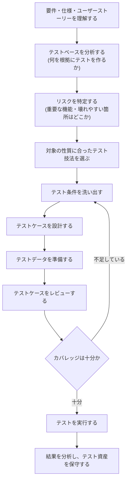
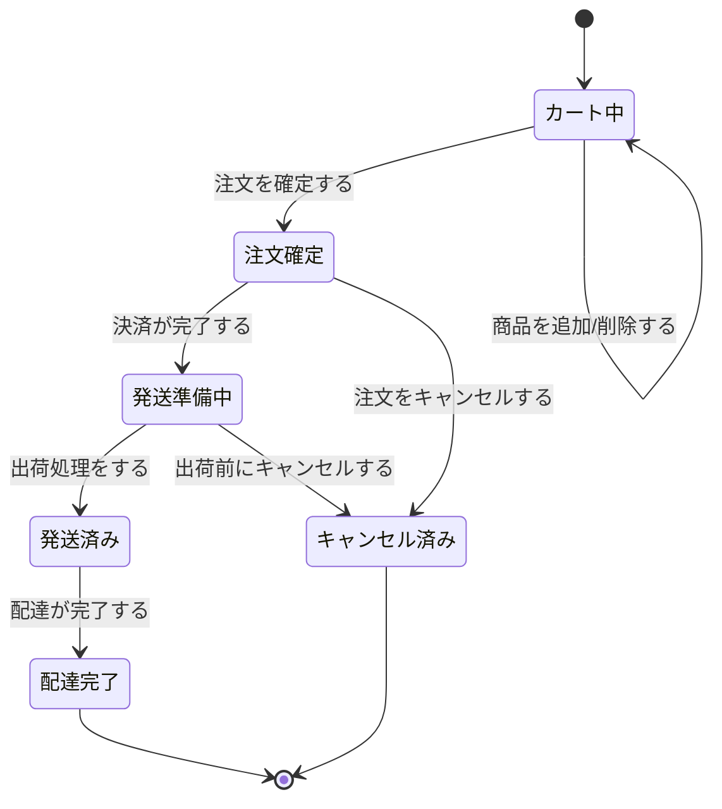
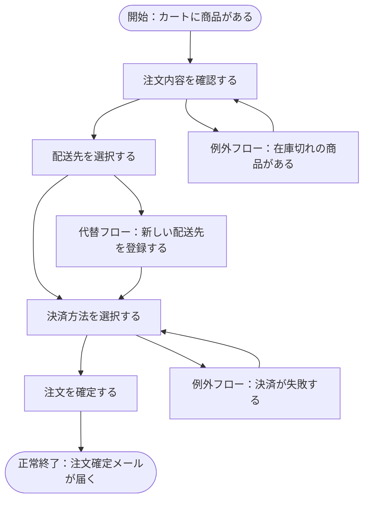
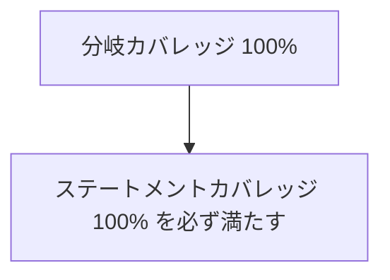
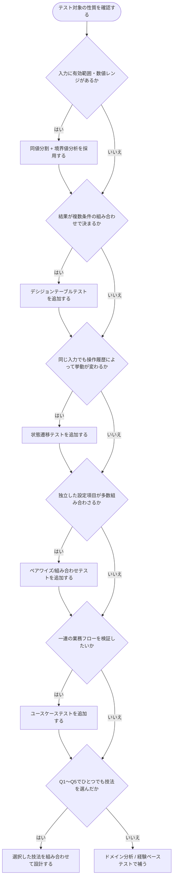

# A Practitioner's Guide to Software Test Design 実践ガイド

*〜初学者のためのステップバイステップ・ベストプラクティス〜*

> 本ガイドは、Lee Copeland 著『A Practitioner's Guide to Software Test Design』(Artech House, 2004) を土台にしながら、ISTQB(国際ソフトウェアテスト資格委員会)のシラバスや、Martin Fowler、Cem Kaner、James Bach & Michael Bolton、Ministry of Testing など国際的に著名なテスト実務家・開発者の知見を交え、2026年8月時点の情報でアップデートしてまとめたものです。ASCIIアートは使用せず、フローチャートは Mermaid、比較表や図解は Markdown 記法のみで構成しています。

---

## 目次

1. [この記事について](#1-この記事について)
2. [ソフトウェアテスト設計とは何か](#2-ソフトウェアテスト設計とは何か)
3. [書籍紹介：Lee Copeland『A Practitioner's Guide to Software Test Design』](#3-書籍紹介lee-copelanda-practitioners-guide-to-software-test-design)
4. [テスト設計プロセスの全体像（ステップバイステップ）](#4-テスト設計プロセスの全体像ステップバイステップ)
5. [本ガイドを通して使う共通例：オンラインショップの注文システム](#5-本ガイドを通して使う共通例オンラインショップの注文システム)
6. [ブラックボックステスト技法](#6-ブラックボックステスト技法)
   - [6.1 同値分割（Equivalence Partitioning）](#61-同値分割equivalence-partitioning)
   - [6.2 境界値分析（Boundary Value Analysis）](#62-境界値分析boundary-value-analysis)
   - [6.3 デシジョンテーブルテスト](#63-デシジョンテーブルテスト)
   - [6.4 状態遷移テスト](#64-状態遷移テスト)
   - [6.5 ドメイン分析テスト](#65-ドメイン分析テスト)
   - [6.6 ペアワイズ／組み合わせテスト](#66-ペアワイズ組み合わせテスト)
   - [6.7 ユースケーステスト](#67-ユースケーステスト)
7. [ホワイトボックステスト技法](#7-ホワイトボックステスト技法)
8. [技法の比較と選び方](#8-技法の比較と選び方)
9. [ベストプラクティス・チェックリスト](#9-ベストプラクティスチェックリスト)
10. [よくあるアンチパターン](#10-よくあるアンチパターン)
11. [現代的視点：2020年代後半のテスト設計トレンド](#11-現代的視点2020年代後半のテスト設計トレンド)
12. [まとめ](#12-まとめ)
13. [参考文献・出典](#13-参考文献出典)

---

## 1. この記事について

**対象読者**：ソフトウェアテストを学び始めたばかりの初学者、QAエンジニアを目指す方、開発者でテストケース設計の基礎を体系的に学びたい方。

**書籍情報**：本ガイドが解説する原著は以下です。

| 項目 | 内容 |
|---|---|
| 書名 | A Practitioner's Guide to Software Test Design |
| 著者 | Lee Copeland |
| 出版社 | Artech House |
| 出版年 | 2004年 |
| 位置づけ | ブラックボックス／ホワイトボックスのテスト設計技法を、実務的な視点から一冊にまとめた入門〜実践書 |

原著は現在では出版から20年以上が経過していますが、そこで扱われている**同値分割・境界値分析・デシジョンテーブル・状態遷移・ドメインテスト・ペアワイズ・ユースケーステスト・ホワイトボックスカバレッジ**といった技法は、今なお「テスト設計の共通言語」としての価値を持っています。

ただし、Copeland が扱う技法の一覧と ISTQB Foundation Level シラバス（2024年9月15日付の v4.0.1 が最新版）の収録範囲は同一ではありません。初学者が資格学習と併読する際に混乱しやすい点なので、対応関係を整理しておきます。

| Copeland が扱う技法 | CTFL v4.0.1 での扱い |
|---|---|
| 同値分割 / 境界値分析 / デシジョンテーブル / 状態遷移 | ブラックボックス技法（4.2節）として収録 |
| ユースケーステスト | シラバスの範囲外（v3.1 までは収録されていたが、v4.0 でブラックボックス技法から外れた） |
| ドメインテスト | シラバスの範囲外（上位資格や実務知識として扱われる） |
| ペアワイズ（直交表・組み合わせ）テスト | シラバスの範囲外 |
| データフローテスト | シラバスの範囲外 |
| ホワイトボックスカバレッジ | 4.3節でステートメントテストとブランチテストに限定して収録 |

つまり CTFL v4.0.1 のホワイトボックス領域は**ステートメントテストとブランチテストが中心**であり、本ガイドで後述するパスカバレッジやデータフローテストは、シラバスを超えた実務向けの発展的な内容として読んでください。

---

## 2. ソフトウェアテスト設計とは何か

### 2.1 なぜ「全部テストする」ことができないのか

たとえば「1〜100の整数を2つ入力して合計を返す」という単純な関数でも、入力の組み合わせは 100 × 100 = 10,000 通りあります。実際のソフトウェアは文字列・日付・複数の設定項目・外部システムとの連携などが絡み合うため、理論上の組み合わせ数は瞬く間に天文学的な数字（いわゆる「組み合わせ爆発」）になります。

**テスト設計とは、「限られた時間と人員の中で、欠陥を発見できる可能性が高いテストケースを、体系的な方法で選び出す技術」**です。勘や経験だけに頼るのではなく、再現性のある手順（技法）に沿ってテストケースを導出することで、次のようなメリットが得られます。

- 少ないテストケース数で高いカバレッジを得られる
- テスト担当者が変わっても同じ考え方でテストケースを再現・レビューできる
- 「なぜこのテストケースが必要か」を第三者に説明できる（トレーサビリティ）
- 見落としやすい境界条件や組み合わせ条件を体系的に拾える

### 2.2 テストケースを構成する要素

| 要素 | 説明 |
|---|---|
| テスト条件 (Test Condition) | 何を検証したいか（例：「未成年は購入できないこと」） |
| テストケース (Test Case) | 具体的な入力値・手順・期待結果のセット |
| テストデータ | テストケースを実行するために必要な具体的な値 |
| 期待結果 | 正しい挙動として期待される出力・状態変化 |

---

## 3. 書籍紹介：Lee Copeland『A Practitioner's Guide to Software Test Design』

Copeland は、Software Quality Engineering 社でテスト手法・テストマネジメントのコンサルタントを務めた、25年以上のキャリアを持つ実務家です。本書の特徴は、**各技法を「理論より先に簡単な具体例から入り、その後で詳しく解説する」という一貫した構成**を取っている点にあります。各章末には要点のまとめと演習問題があり、巻末には「Brown & Donaldson」(オンライン証券会社)と「Stateless University Registration System」(大学の履修登録システム)という2つのケーススタディが付属し、各技法の実例として使われています。

### 3.1 原著の章構成（概要）

| 章 | 主なテーマ |
|---|---|
| 1 | テストプロセス全体の考え方 |
| 2 | 同値分割 (Equivalence Class Testing) |
| 3 | 境界値分析 (Boundary Value Testing) |
| 4 | デシジョンテーブルテスト |
| 5 | ペアワイズテスト |
| 6 | 状態遷移テスト |
| 7 | ドメインテスト |
| 8 | ユースケーステスト |
| 9 | ステートメント・分岐・パス・制御フローテスト（ホワイトボックス） |
| 10 | データフローテスト |
| 11 | Some Final Thoughts — Your Testing Toolbox（技法の使い分けまとめ） |
| 付録 | ケーススタディ2本、参考文献 |

このガイドでは、この章構成を尊重しつつ、現在の ISTQB 用語・分類（ブラックボックス技法／ホワイトボックス技法／経験ベース技法）に合わせて再整理して解説します。

---

## 4. テスト設計プロセスの全体像（ステップバイステップ）

まず、個別の技法に入る前に、テスト設計が開発プロセス全体の中でどのステップで行われるかを俯瞰します。



**各ステップのポイント**

1. **要件の理解**：仕様書・ユーザーストーリー・受け入れ基準を読み込み、不明点は開発者やプロダクトオーナーに確認する。
2. **テストベースの分析**：何（仕様書、画面設計、API定義、過去の不具合履歴など）を根拠にテストを作るかを明確にする。
3. **リスク特定**：全機能を均等にテストするのではなく、影響範囲が大きい・複雑・変更頻度が高い箇所を優先する（リスクベースドテスト）。
4. **技法選択**：後述の[技法の比較と選び方](#8-技法の比較と選び方)を参照し、対象の性質（数値範囲か、条件の組み合わせか、状態遷移かなど）に合った技法を選ぶ。
5. **テスト条件の洗い出し → テストケース設計**：技法に従って機械的にテスト条件・ケースを導出する。
6. **レビュー**：他のメンバーによるレビューを経て、抜け漏れや誤りを減らす。
7. **実行と保守**：実行結果を記録し、仕様変更に応じてテストケースを更新し続ける。

---

## 5. 本ガイドを通して使う共通例：オンラインショップの注文システム

以降の各技法セクションでは、理解しやすくするために次の共通例を使い回します。

> **架空のシステム「ShopEasy」の注文機能**
>
> - 会員登録時に **年齢** を入力する（**18歳〜120歳** のみ登録可能）
> - 注文確定時、**会員ランク（一般／ゴールド／プラチナ）**、**注文金額**、**クーポンの有無** の組み合わせで **割引率** が決まる
> - 注文は **カート → 注文確定 → 発送準備 → 発送済み → 配達完了** という状態を遷移し、途中で **キャンセル** も可能
> - チェックアウト画面は **ブラウザ（Chrome／Safari／Edge）**、**OS（Windows／macOS／iOS）**、**決済方法（クレジットカード／コンビニ払い／電子マネー）** の組み合わせで検証する必要がある
> - 「商品を注文する」という一連の業務フロー（ユースケース）がある

---

## 6. ブラックボックステスト技法

ブラックボックステストとは、**内部のソースコードを見ずに、仕様や外部から観測できる入出力だけを根拠にテストケースを設計する**アプローチです。ISTQB Foundation Level シラバスでも、同値分割・境界値分析・デシジョンテーブルテスト・状態遷移テストが中核のブラックボックス技法として位置づけられています。

### 6.1 同値分割（Equivalence Partitioning）

**考え方**：入力（または出力）を、「同じ挙動をするはず」の値のグループ（同値クラス）に分割し、各グループから代表値を1つ選んでテストする技法です。全部の値を試す代わりに、各グループの代表だけをテストすれば十分だと考えます。

**手順**

1. 入力・出力の仕様から「有効」と「無効」の範囲を特定する
2. それぞれの範囲を同値クラスに分割する
3. 各同値クラスから最低1つの代表値を選ぶ
4. 無効な同値クラスは、原則として1クラスにつき1テストケースとする（複数の無効値を同時に入れると、どちらが原因でエラーになったか分からなくなるため）

**共通例への適用：会員登録の年齢入力（18〜120歳が有効）**

| 同値クラス | 範囲 | 代表値の例 |
|---|---|---|
| 無効（下限未満） | 17歳以下（負値を含む） | 10, -1 |
| 有効 | 18〜120歳 | 40 |
| 無効（上限超過） | 121歳以上 | 150 |
| 無効（型不正） | 数値以外・空欄 | "abc", "" |

**注意点**：同値分割だけでは「17歳と18歳のどちらで境界が切り替わるか」といった**境界線上の誤り**（オフバイワン・エラーなど）を見つけにくいという弱点があります。そのため、次に説明する境界値分析と必ずセットで使うのが実務上のベストプラクティスです。

### 6.2 境界値分析（Boundary Value Analysis）

**考え方**：「バグは範囲の境界付近に集中しやすい」という経験則に基づき、同値クラスの**端の値とその前後**を重点的にテストする技法です。境界値分析は同値分割を土台にした技法であり、単独ではなくペアで使われます。

**手順（2点境界値分析の場合）**

1. 同値分割で各クラスの範囲を確定する
2. 各境界について「境界の値そのもの」と「境界のすぐ外側の値」の2点をテストする
3. 3点境界値分析（より厳密な方式）では、境界の内側・境界そのもの・境界の外側の3点をテストする

**共通例への適用：年齢入力（有効範囲 18〜120）**

| 境界 | テスト値 | 期待結果 |
|---|---|---|
| 下限の外側 | 17 | 登録エラーになる |
| 下限そのもの | 18 | 登録できる |
| 下限の内側 | 19 | 登録できる |
| 上限の内側 | 119 | 登録できる |
| 上限そのもの | 120 | 登録できる |
| 上限の外側 | 121 | 登録エラーになる |

> **境界付近では欠陥が見つかりやすい**というのは、テスト実務で広く共有されている経験則です（ISTQB CTFL シラバスも、境界値分析を同値分割と併用すべき中核技法として位置づけています）。具体的に何割の欠陥が境界に集中するかを示す信頼できる測定データは確認できていないため、本ガイドでは数値を挙げません。少ないテストケース数で効果が期待できる技法として、同値分割とセットで実施してください。

### 6.3 デシジョンテーブルテスト

**考え方**：出力（振る舞い）が**複数の条件の組み合わせ**によって決まる場合に有効な技法です。条件と結果（アクション）を表形式に整理することで、「業務ルールの抜け漏れ」を視覚的に発見できます。ISTQBシラバスでも「複雑なビジネスルールを記録するための効果的な方法」として紹介されています。

**手順**

1. 結果に影響する条件をすべて洗い出す
2. 各条件がとりうる値（多くは Yes/No）を列挙する
3. 条件の組み合わせをすべて列挙し、各組み合わせに対応するアクション（結果）を定義する
4. 同じアクションになる組み合わせをまとめて整理する（テーブルの圧縮）
5. 各列（ルール）を最低1つのテストケースにする

**共通例への適用：会員ランク × 注文金額 × クーポンによる割引ルール**

まず割引の要件を明確に定義します。**プラチナ会員は基本10%、注文金額が1万円以上なら+5%、クーポンを持っていれば+5%**（非プラチナ会員の基本は0%）とします。条件が3つ・各条件が Yes/No の2値なので、組み合わせは 2³ = 8通りです。8通りすべてを列挙すると次のようになります。

| 条件 | ルール1 | ルール2 | ルール3 | ルール4 | ルール5 | ルール6 | ルール7 | ルール8 |
|---|---|---|---|---|---|---|---|---|
| 会員ランクがプラチナか | Yes | Yes | Yes | Yes | No | No | No | No |
| 注文金額が1万円以上か | Yes | Yes | No | No | Yes | Yes | No | No |
| クーポンを持っているか | Yes | No | Yes | No | Yes | No | Yes | No |
| **結果：割引率** | **20%** | **15%** | **15%** | **10%** | **10%** | **5%** | **5%** | **0%** |

なお、ここでの「会員ランクがプラチナか」が No のケース（ルール5〜8）には、**ゴールド会員も一般会員も含まれます**。つまりこの表は「プラチナか、それ以外か」という2値でしか会員ランクを見ていません。ゴールド会員に固有の割引ルールが要件に存在する場合は、条件を「プラチナ／ゴールド／一般」の3値に拡張する必要があり、その時点で組み合わせは 3 × 2 × 2 = 12通りに増えます。条件の値域を2値に単純化してよいかどうかは、必ず要件に立ち返って確認してください。

このように8通りを漏れなく列挙すると、「一般会員がクーポンなしで1万円未満の注文をした場合」（ルール8）はもちろん、うっかり定義から漏れやすい「一般会員がクーポンなしで1万円以上の注文をした場合」（ルール6）や「プラチナ会員がクーポンなしで1万円未満の注文をした場合」（ルール4）といった組み合わせも確実に押さえられます。

**テーブルの圧縮について**：同じアクションになる列は「–（don't care）」でまとめられますが、圧縮は「その条件が本当に結果に影響しない」ことを確認してから行ってください。上の例ではルール1とルール2の割引率が異なる（20% と 15%）ため、クーポンの列を「–」でまとめることはできません。安易に「–」を置くと、未定義の組み合わせが表から消えてしまいます。

### 6.4 状態遷移テスト

**考え方**：システムが**過去の操作履歴（現在の状態）によって、同じ入力でも異なる振る舞いをする**場合に有効な技法です。ISTQBシラバスでは、遷移は「イベント [ガード条件] / アクション」という記法でラベル付けされると定義されています。

**手順**

1. システムが取りうる「状態」をすべて洗い出す
2. 状態間の「遷移」と、それを引き起こす「イベント」を洗い出す
3. 状態遷移図（または状態遷移表）を作成する
4. 少なくとも「すべての状態を1回は通る」「すべての遷移を1回は通る」テストケースを設計する
5. さらに厳密にテストする場合は、「定義されていない遷移（無効な遷移）」も意図的に試す

**共通例への適用：注文ステータスの遷移**



この図から、「発送済みになった後にキャンセルできてしまわないか」「配達完了後にステータスを戻せてしまわないか」といった、**定義されていない（禁止されているべき）遷移が誤って許可されていないか**を確認するテストケースが自然に導き出せます。

### 6.5 ドメイン分析テスト

**考え方**：複数の入力変数が**同時に**境界値付近にある状況を扱う、境界値分析の発展形です。1つの変数だけでなく、複数の変数の境界が重なるケースでバグが起きやすいという着眼点に基づきます。ONポイント（境界上の値）・OFFポイント（境界のすぐ外の値）・INポイント（範囲内の値）・OUTポイント（範囲外の値）という4種類の点を、変数の組み合わせごとに設計します。

**共通例への適用**：たとえば「クーポン割引後の合計金額が0円未満にならないこと」を検証する場合、「注文金額」と「クーポン割引額」という2つの変数が同時に境界（0円）付近にある状況をドメイン分析で洗い出します。

### 6.6 ペアワイズ／組み合わせテスト

**考え方**：独立した設定項目（パラメータ）が多数あり、全組み合わせをテストすると現実的な数を超えてしまう場合に使う技法です。米国 NIST（米国国立標準技術研究所）が1999〜2004年に実施した一連の調査により、**ソフトウェアの欠陥・障害の大部分は1〜2個のパラメータの相互作用によって発生し、3個以上が関与するものは急激に少なくなる**ことが報告されています（NIST SP 800-142 および NIST ACTS プロジェクト。詳細は参考文献を参照）。この知見に基づき、「すべてのパラメータの組み合わせの中の、すべての“2つの組み合わせ（ペア）”を最低1回はテストする」ことで、多くを占める低次（1〜2因子）の相互作用による欠陥を、大幅に少ないテストケース数で検証できます。ただし3因子以上の相互作用に起因する欠陥も一定数存在するため、ペアワイズは全数テストの代替にはなりません。高リスクな機能や障害時の影響が大きい領域では、リスクに応じて3-way 以上の t-way テストケースを追加する方針を取ります。

**共通例への適用：チェックアウト画面の環境組み合わせ**

パラメータが「ブラウザ（3種）× OS（3種）× 決済方法（3種）」の場合、全組み合わせは 3×3×3 = 27通りですが、ペアワイズ法を使うと以下のように9通り程度まで削減できます（PICT や ACTS といった専用ツールで自動生成するのが一般的です）。

| No. | ブラウザ | OS | 決済方法 |
|---|---|---|---|
| 1 | Chrome | Windows | クレジットカード |
| 2 | Chrome | macOS | コンビニ払い |
| 3 | Chrome | iOS | 電子マネー |
| 4 | Safari | Windows | コンビニ払い |
| 5 | Safari | macOS | 電子マネー |
| 6 | Safari | iOS | クレジットカード |
| 7 | Edge | Windows | 電子マネー |
| 8 | Edge | macOS | クレジットカード |
| 9 | Edge | iOS | コンビニ払い |

この9通りで、任意の2パラメータ間のすべての値の組み合わせ（例：「Safari × 電子マネー」「Windows × クレジットカード」など）が最低1回は登場しています。

> **注意**：ペアワイズはあくまで「組み合わせを網羅的にテストしないための効率化技法」であり、単独で完全なテスト戦略にはなりません。決済処理や認証まわりなど、失敗時の影響が大きい重要フローについては、ペアワイズで削減された組み合わせ以外にも個別にテストケースを追加すべきだとされています。

### 6.7 ユースケーステスト

**考え方**：機能単位ではなく、**ユーザーが目的を達成するまでの一連の業務フロー**を検証する技法です。「基本フロー（正常系）」と「代替フロー」「例外フロー」を明示することで、実際の利用シーンに即したテストケースを作れます。

**共通例への適用：「商品を注文する」ユースケース**



基本フロー1本だけでなく、「配送先を新規登録するケース」「決済に失敗して再入力するケース」「在庫切れが発覚してカートに戻るケース」まで洗い出すのがユースケーステストのポイントです。

---

## 7. ホワイトボックステスト技法

ホワイトボックステストは、ブラックボックステストとは対照的に、**ソースコードの内部構造（制御フロー）を根拠にテストケースを設計する**アプローチです。主に開発者による単体テストで使われます。

| 技法 | 説明 | カバレッジ基準 |
|---|---|---|
| ステートメントカバレッジ | コード中のすべての実行文（ステートメント）を最低1回は実行する | 実行された文の割合 |
| 分岐カバレッジ（ブランチカバレッジ） | 制御フローグラフ上のすべての**分岐（branch）**、すなわち `if` やループの true/false の分岐先、`switch` の各ケースといった**条件分岐**だけでなく、無条件 goto やメソッド呼び出しのような**無条件分岐（線形な制御移行）も含めて**、最低1回は実行する | 実行された制御移行（分岐）数 ÷ 全制御移行（分岐）数 |
| 条件カバレッジ | 複合条件（`A && B` など）を構成する**各アトミック条件**の真偽（条件アウトカム）を実行対象とする。100% を達成した状態では、各アトミック条件が true と false の両方を取ることになる（条件の組み合わせを網羅するわけではない） | 実行した条件アウトカム数 ÷ 全条件アウトカム数（`A && B` なら分母は A=true / A=false / B=true / B=false の4アウトカム） |
| パスカバレッジ | プログラム内のすべての実行経路（パス）を通す | 実行された経路の割合 |
| データフローテスト | 変数が「定義された箇所」から「使用される箇所」までの経路に着目してテストする | 定義-使用ペアの網羅率 |

### 7.1 カバレッジの包含関係

カバレッジ基準は「弱い順に一直線に並ぶ」と説明されることがありますが、それは正確ではありません。確実に言えるのは、**分岐カバレッジ100%はステートメントカバレッジ100%を包含する**という関係です。



一方で、**分岐カバレッジと条件カバレッジのあいだに包含関係はありません**。次のコードで確かめてみましょう。

```java
if (A || B) {
    doSomething();
}
```

ここで `A = true, B = false` と `A = false, B = false` の2ケースをテストすると、`if` は true と false の両方を通るため**分岐カバレッジは100%**になります。しかし `B` は false しか取っていないため（`||` は短絡評価であり、`A` が true の場合 `B` は評価すらされません）、**条件カバレッジは満たされていません**。

逆のケースを見るには、短絡評価をしない非短絡 OR を使います。

```java
if (A | B) {
    doSomething();
}
```

この形で `A = true, B = false` と `A = false, B = true` の2ケースをテストすると、`A` も `B` も必ず評価されて true/false を両方取るので**条件カバレッジは100%**ですが、`A | B` は常に true となり、`if` の false 側を一度も通らないため**分岐カバレッジは100%になりません**。

このように、条件カバレッジ・パスカバレッジ・データフローテストのあいだに「必ずこちらが強い」という普遍的な順序関係があるわけではなく、何を強いとみなすかは対象のコード構造に依存します。

**初学者向けポイント**：ステートメントカバレッジ100%を達成しても、`if`文の片方の分岐しか通っていない可能性があります。逆にパスカバレッジは非常に強力ですが、ループを含むコードでは経路の数が爆発的に増えるため、現実的にはステートメント／分岐カバレッジを基本としつつ、リスクの高い箇所だけパスカバレッジやデータフローテストを追加するのが一般的です。

---

## 8. 技法の比較と選び方

### 8.1 技法選択フローチャート

テスト設計では、ひとつの技法だけで十分になることはほとんどありません。下のフローは「最初に当てはまった技法で終わり」ではなく、**Q1からQ5までをすべて順に評価し、当てはまったものを積み上げて組み合わせる**ためのものです。たとえば「同値分割 + 境界値分析」を選んだあとも、条件の組み合わせ・状態・設定項目・業務フローについて引き続き判定し、必要な技法を補助的に追加していきます。



たとえば「注文金額のレンジがあり、かつ会員ランクとクーポンの組み合わせで結果が決まる」画面であれば、Q1で同値分割・境界値分析を、Q2でデシジョンテーブルテストを選び、両方を組み合わせて設計することになります。

### 8.2 技法比較表

| 技法 | 分類 | 得意なこと | 苦手なこと |
|---|---|---|---|
| 同値分割 | ブラックボックス | テストケース数の削減 | 境界付近の欠陥は拾いにくい |
| 境界値分析 | ブラックボックス | 境界付近の欠陥検出 | 条件の組み合わせは扱えない |
| デシジョンテーブル | ブラックボックス | 複雑な業務ルールの網羅 | 条件数が多いとテーブルが巨大化 |
| 状態遷移テスト | ブラックボックス | 履歴依存の挙動の検証 | 状態数が多いと管理が煩雑 |
| ドメイン分析 | ブラックボックス | 複数変数の境界の相互作用 | 設計コストがやや高い |
| ペアワイズ/組み合わせ | ブラックボックス | 多数パラメータの効率的網羅 | 3つ以上の相互作用による欠陥は見逃す可能性 |
| ユースケーステスト | ブラックボックス | 実利用シナリオの妥当性確認 | 内部ロジックの網羅性は保証しない |
| ステートメント/分岐カバレッジ | ホワイトボックス | 実装漏れの検出、単体テストの指標化 | 仕様の誤りそのものは検出しにくい |
| パスカバレッジ/データフローテスト | ホワイトボックス | 複雑なロジック・変数依存関係の検証 | コストが高く全箇所には適用しにくい |

### 8.3 テストレベルと技法の対応

| テストレベル | 主に使われる技法の例 |
|---|---|
| 単体テスト | ステートメント/分岐カバレッジ、パスカバレッジ、同値分割 |
| 結合テスト | デシジョンテーブル、状態遷移テスト、ペアワイズ |
| システムテスト | ユースケーステスト、状態遷移テスト、境界値分析 |
| 受け入れテスト | ユースケーステスト、探索的テスト（経験ベース技法） |

---

## 9. ベストプラクティス・チェックリスト

初学者がテスト設計を行う際に押さえておきたいポイントを、ステップごとにまとめます。

- [ ] 仕様書だけでなく、実際の画面・API・過去の不具合履歴も確認したか
- [ ] 同値分割は必ず境界値分析とセットで実施したか
- [ ] 無効な同値クラスは、原則1クラスにつき1テストケースに分けたか（複数の無効値を同時投入しない）
- [ ] 複数条件で結果が決まる仕様は、デシジョンテーブルで整理したか
- [ ] 「過去の操作」で挙動が変わる仕様は、状態遷移図で可視化したか
- [ ] 「定義されていない遷移」（本来起きてはいけない状態変化）も意図的にテストしたか
- [ ] 独立したパラメータが3つ以上ある画面は、全組み合わせではなくペアワイズで効率化を検討したか
- [ ] 重要な業務フロー（決済・認証など）は、ペアワイズの削減対象から除外し個別に追加テストしたか
- [ ] 正常系だけでなく、代替フロー・例外フローもユースケースとして洗い出したか
- [ ] 開発者と連携し、ホワイトボックス視点（分岐カバレッジなど）で見落としがないか確認したか
- [ ] テストケースは第三者がレビューできる形で、条件・入力・期待結果が明記されているか
- [ ] 仕様変更が入った際に、影響を受けるテストケースを洗い出す仕組みがあるか

---

## 10. よくあるアンチパターン

| アンチパターン | 何が問題か | 改善策 |
|---|---|---|
| 境界値分析をせず、範囲の中央値だけをテストする | 境界付近の欠陥（オフバイワン・エラー等）を見逃す | 同値分割とセットで境界値分析を必ず行う |
| 無効な入力を複数同時にテストケースに詰め込む | どの無効値が原因でエラーになったか切り分けられない | 無効な同値クラスは1テストケースにつき1つに限定する |
| 条件分岐が絡む仕様を、思いつきでテストケース化する | 条件の組み合わせに抜け漏れが発生する | デシジョンテーブルで組み合わせを機械的に整理する |
| 状態を意識せず、単発の入力だけをテストする | 「2回目以降の操作で初めて起きる不具合」を見逃す | 状態遷移図を書き、遷移の網羅率を意識する |
| パラメータが多い設定画面を全組み合わせでテストしようとして時間切れになる | 現実的な工数で終わらない | ペアワイズ/組み合わせテストで効率化する |
| ハッピーパス（正常系）のシナリオしかテストしない | 代替フロー・例外フローのバグが本番で発覚する | ユースケーステストで代替・例外フローを明示的に洗い出す |
| カバレッジ100%を目的化してしまう | 「通っただけ」のテストが増え、欠陥検出力が伴わない | カバレッジは指標の1つとして扱い、リスクベースで技法を組み合わせる |

---

## 11. 現代的視点：2020年代後半のテスト設計トレンド

Copeland の技法は今も有効ですが、2026年時点の実務では次のような潮流と組み合わせて使われることが増えています。

### 11.1 スクリプトテストと探索的テストの併用（Context-Driven / Rapid Software Testing）

Cem Kaner（BBST: Black Box Software Testing コースの開発者）や、James Bach・Michael Bolton による Rapid Software Testing (RST) メソドロジーでは、Copeland 流の体系的な技法（スクリプトテスト）を土台にしつつ、そこに載らない欠陥を見つけるために**探索的テスト（Exploratory Testing）とヒューリスティクス（発見的手法）を組み合わせる**ことの重要性が強調されています。Ministry of Testing が公開している「Test Heuristics Cheat Sheet」（Elisabeth Hendrickson氏らによる）も、技法だけではカバーしきれないテストアイデアを補う実践的なリソースとして国際的に広く参照されています。

### 11.2 開発者テストとの融合（xUnitとテストピラミッド）

ThoughtWorks のチーフサイエンティストである Martin Fowler は、自身のサイトで「テストピラミッド」の考え方を提唱し、単体テスト（ホワイトボックス寄り）を厚く、UIを介したテスト（ブラックボックス寄り）を薄くするバランスを推奨しています。Copeland の技法のうち、同値分割・境界値分析・分岐カバレッジなどは、この単体テストの層で開発者自身が実践するケースが増えています。

### 11.3 AIによるテスト設計支援と、その限界

2025〜2026年にかけて、AIを使ってテストケースを自動生成するツールが急速に普及しました。ISTQB も「Certified Tester - Testing with Generative AI (CT-GenAI)」という資格を新設し、生成AI／LLMがテストプロセス全体（同値分割のようなテスト設計技法を含む）をどう支援できるかを体系化しています。ただし、AIが生成する候補はあくまで「たたき台」であり、**ドメイン知識・リスク判断・境界条件の妥当性検証は依然として人間のレビューが不可欠**という点は、多くの実務家が指摘しているとおりです。実務では、AIで初期候補を洗い出し→本ガイドの技法（同値分割・境界値分析・デシジョンテーブル等）でテスターが検証・補完する、というワークフローが現実的です。

### 11.4 シフトレフトとテスト設計の早期化

テスト設計を実装後ではなく、**要件定義・設計レビューの段階から始める「シフトレフト」**の考え方も定着しています。デシジョンテーブルや状態遷移図は、コードを書く前の仕様レビューの段階で作成することで、仕様そのものの矛盾や漏れを早期に発見する「静的テスト技法」としても活用されています。

---

## 12. まとめ

- ソフトウェアテスト設計とは、**限られたリソースの中で欠陥検出力の高いテストケースを体系的に選ぶ技術**である
- Lee Copeland の『A Practitioner's Guide to Software Test Design』は、同値分割・境界値分析・デシジョンテーブル・状態遷移・ドメインテスト・ペアワイズ・ユースケーステスト・ホワイトボックスカバレッジという技法を、実践的な例とともに体系化した書籍であり、今日の CTFL の中核技法の一部とも重なっている（ただし収録範囲は一致しない。詳細は本ガイド前半の対応表を参照）
- どの技法にも得意・不得意があるため、**対象の性質（数値範囲か、条件の組み合わせか、状態遷移かなど）に応じて技法を使い分け、組み合わせる**ことが実務上のベストプラクティスである
- 2020年代後半の現在では、Copeland 流の体系的技法に加えて、探索的テスト、開発者テスト、AI支援、シフトレフトといった潮流と組み合わせて使うのが主流になっている

---

## 13. 参考文献・出典

本ガイドの作成にあたり、2026年8月時点で以下の情報源を参照しました（原著書籍情報、国際的に著名なテスト実務家・組織の一次情報を優先しています）。

**書籍情報・原著**

- Google Books（ユーザー提供リンク）: <a href="https://books.google.co.jp/books/about/A_Practitioner_s_Guide_to_Software_Test.html?id=dMX_C8z9PfMC&amp;redir_esc=y" target="_blank" rel="noopener noreferrer">https://books.google.co.jp/books/about/A_Practitioner_s_Guide_to_Software_Test.html?id=dMX_C8z9PfMC&redir_esc=y</a>
- Artech House（出版社公式ページ）: <a href="https://us.artechhouse.com/A-Practitioners-Guide-to-Software-Test-Design-P756.aspx" target="_blank" rel="noopener noreferrer">https://us.artechhouse.com/A-Practitioners-Guide-to-Software-Test-Design-P756.aspx</a>
- Goodreads（書籍レビュー・目次情報）: <a href="https://www.goodreads.com/en/book/show/1290169.A_Practitioner_s_Guide_to_Software_Test_Design" target="_blank" rel="noopener noreferrer">https://www.goodreads.com/en/book/show/1290169.A_Practitioner_s_Guide_to_Software_Test_Design</a>

**国際的な標準・認定団体**

- ISTQB（国際ソフトウェアテスト資格委員会）公式サイト: <a href="https://istqb.org/" target="_blank" rel="noopener noreferrer">https://istqb.org/</a>
- ISTQB Certified Tester Foundation Level Syllabus v4.0.1（公式PDF, 2024年9月15日付）: <a href="https://istqb.org/wp-content/uploads/2024/11/ISTQB_CTFL_Syllabus_v4.0.1.pdf" target="_blank" rel="noopener noreferrer">https://istqb.org/wp-content/uploads/2024/11/ISTQB_CTFL_Syllabus_v4.0.1.pdf</a>
- ASTQB（米国ソフトウェアテスト資格委員会）4.2 Black-Box Test Techniques 解説: <a href="https://astqb.org/4-2-black-box-test-techniques/" target="_blank" rel="noopener noreferrer">https://astqb.org/4-2-black-box-test-techniques/</a>

**著名な国際的テスト実務家・開発者による一次情報**

- Martin Fowler（ThoughtWorks チーフサイエンティスト）Testing ガイド: <a href="https://martinfowler.com/testing/" target="_blank" rel="noopener noreferrer">https://martinfowler.com/testing/</a>
- Martin Fowler, Test Pyramid: <a href="https://martinfowler.com/bliki/TestPyramid.html" target="_blank" rel="noopener noreferrer">https://martinfowler.com/bliki/TestPyramid.html</a>
- Martin Fowler, Exploratory Testing: <a href="https://martinfowler.com/bliki/ExploratoryTesting.html" target="_blank" rel="noopener noreferrer">https://martinfowler.com/bliki/ExploratoryTesting.html</a>
- Cem Kaner, Paradigms of Black Box Software Testing（一次資料PDF）: <a href="https://kaner.com/pdfs/ParadigmsTutorial.pdf" target="_blank" rel="noopener noreferrer">https://kaner.com/pdfs/ParadigmsTutorial.pdf</a>
- James Bach, Rapid Software Testing Explored（Satisfice, Inc.）: <a href="https://www.satisfice.com/rapid-software-testing-explored" target="_blank" rel="noopener noreferrer">https://www.satisfice.com/rapid-software-testing-explored</a>
- James Bach & Michael Bolton, Rapid Software Testing 公式サイト: <a href="https://rapid-software-testing.com/authors/" target="_blank" rel="noopener noreferrer">https://rapid-software-testing.com/authors/</a>
- Ministry of Testing, Test Heuristics Cheat Sheet（Elisabeth Hendrickson 氏ほか）: <a href="https://www.ministryoftesting.com/articles/ab1cd85c" target="_blank" rel="noopener noreferrer">https://www.ministryoftesting.com/articles/ab1cd85c</a>

**ペアワイズ／組み合わせテストの参考情報**

- D. Richard Kuhn, Raghu N. Kacker, Yu Lei, *Practical Combinatorial Testing*, NIST Special Publication 800-142（NIST, 2010年10月）: <a href="https://doi.org/10.6028/NIST.SP.800-142" target="_blank" rel="noopener noreferrer">https://doi.org/10.6028/NIST.SP.800-142</a>
  — 「欠陥の大部分は比較的少数のパラメータの相互作用によって生じる」という t-way 組み合わせテストの前提を示した一次資料。本ガイド 6.6 節のペアワイズの根拠。
- NIST, Combinatorial Methods for Trust and Assurance（ACTS プロジェクト公式ページ）: <a href="https://csrc.nist.gov/projects/automated-combinatorial-testing-for-software" target="_blank" rel="noopener noreferrer">https://csrc.nist.gov/projects/automated-combinatorial-testing-for-software</a>
  — 1999〜2004年の一連の NIST 調査に基づき「ソフトウェアのバグ・障害の大部分は1〜2個のパラメータに起因し、3個以上が関与するものは順次少なくなる」と述べている一次情報。
- Pairwise.org（ペアワイズテストの専門情報サイト）: <a href="https://www.pairwise.org/" target="_blank" rel="noopener noreferrer">https://www.pairwise.org/</a>
- Wikipedia, All-pairs testing: <a href="https://en.wikipedia.org/wiki/All-pairs_testing" target="_blank" rel="noopener noreferrer">https://en.wikipedia.org/wiki/All-pairs_testing</a>

---

*本ガイドは教育目的の解説記事であり、原著書籍の代替物ではありません。より詳細な内容・演習問題・ケーススタディについては、原著『A Practitioner's Guide to Software Test Design』および上記の一次情報源を直接ご参照ください。*
