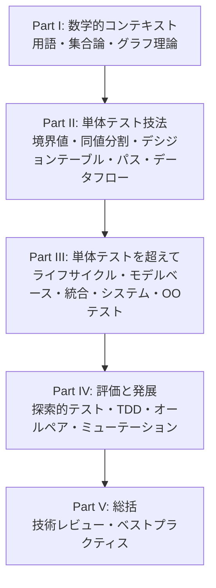
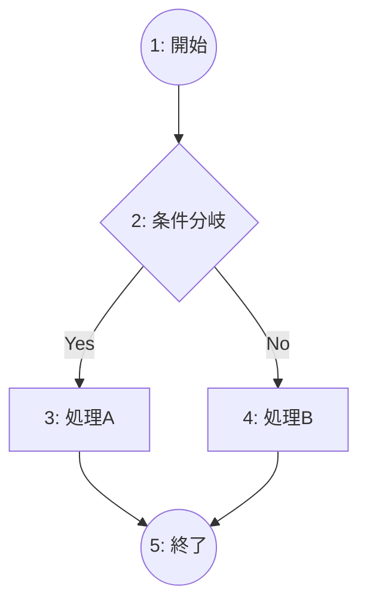
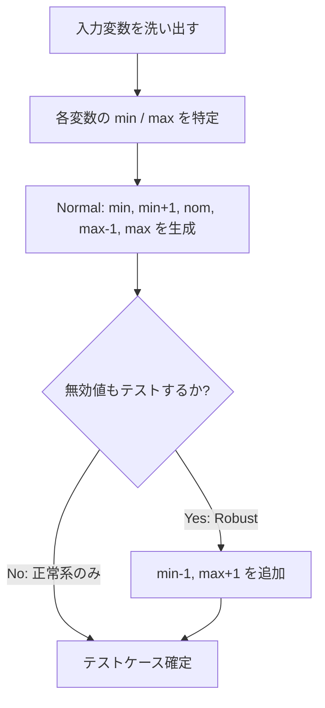
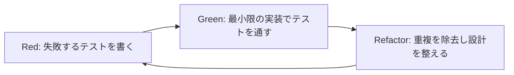
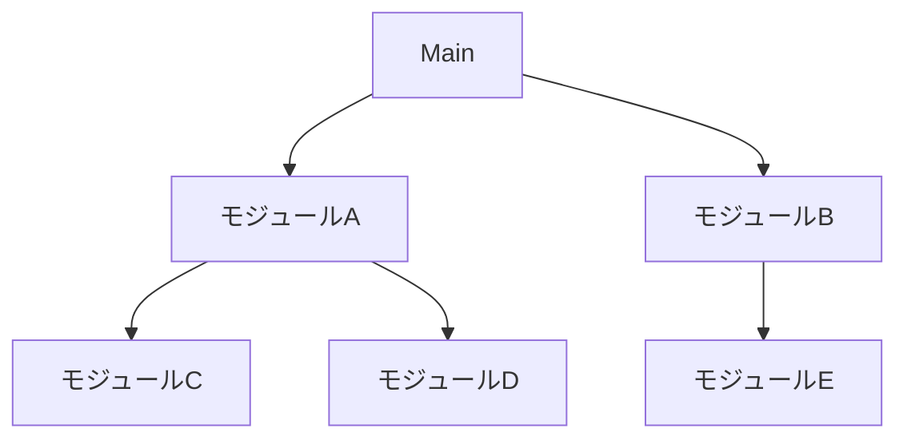
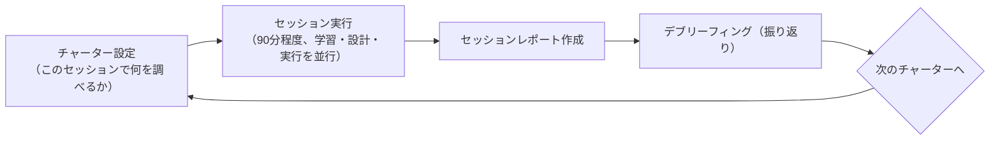
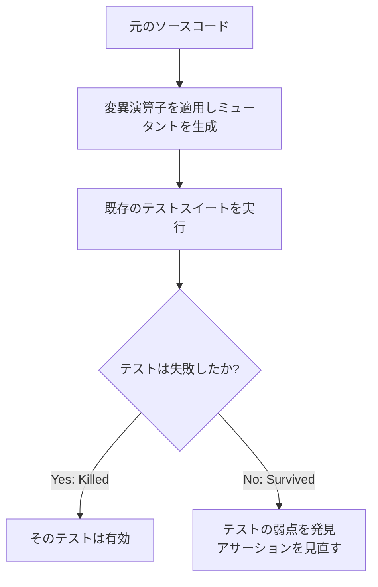
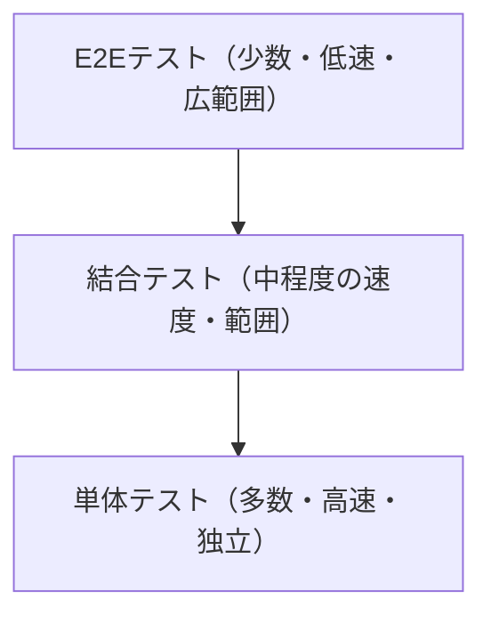
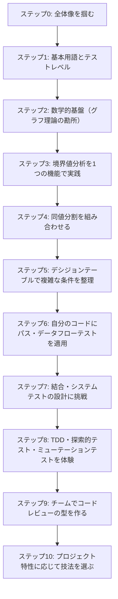

# Software Testing: A Craftsman's Approach 入門ガイド

**〜 Paul C. Jorgensen 著『Software Testing, 4th Edition』で学ぶ、ステップバイステップのテスト設計ベストプラクティス 〜**

> 本ガイドは、O'Reilly / Auerbach Publications から出版されている書籍
> **Software Testing: A Craftsman's Approach, 4th Edition**（著者: Paul C. Jorgensen）
> の目次構成に沿って、初学者がテスト設計技法を体系的に学べるようにまとめたものです。
> あわせて、2026年8月時点での業界動向（Martin Fowler、Kent Beck、Google、ThoughtWorks など著名な開発者・組織の発信）も
> コラムとして補足し、「古典的名著の理論」と「現代の実務」を橋渡しします。
>
> 書籍情報の一次ソース: <https://www.oreilly.com/library/view/software-testing-4th/9781466560680/>

---

## 目次

- [ステップ0：この本の全体像をつかむ](#step0)
- [ステップ1：テストの基本概念を理解する](#step1)
- [ステップ2：テストを支える数学的基盤を知る](#step2)
- [ステップ3：境界値分析でテストケースを作る](#step3)
- [ステップ4：同値分割でテストケースを整理する](#step4)
- [ステップ5：デシジョンテーブルで複雑な条件を整理する](#step5)
- [ステップ6：コードを読んでテストする（パステスト／データフローテスト）](#step6)
- [ステップ7：単体テストを超えて（統合・システム・OOテスト）](#step7)
- [ステップ8：テストケース自体の品質を評価する高度な技法](#step8)
- [ステップ9：レビューで欠陥を早期に見つける](#step9)
- [ステップ10：熟達者（Craftsman）になるためのベストプラクティス](#step10)
- [2026年時点の実務トレンドとの接続](#trends2026)
- [学習ロードマップ](#roadmap)
- [まとめ](#summary)
- [参考文献・出典](#references)

---

## ステップ0：この本の全体像をつかむ

Jorgensen の本は「テスト技法のカタログ」であると同時に、**なぜその技法が必要なのかを数学的に裏付ける**という珍しい構成を取っています。初学者はまず、全体が5部構成になっていることを押さえましょう。

| Part | 主題 | 章 | ひとことで言うと |
|---|---|---|---|
| Part I | 数学的コンテキスト | 1〜4章 | テストの基本用語、離散数学、グラフ理論 |
| Part II | 単体テスト | 5〜10章 | 境界値分析、同値分割、デシジョンテーブル、パステスト、データフローテスト |
| Part III | 単体テストを超えて | 11〜17章 | ライフサイクル、モデルベーステスト、統合・システム・OOテスト、複雑度、System of Systems |
| Part IV | テスト技法の評価と発展 | 18〜21章 | 探索的テスト、TDD、オールペア法、ミューテーションテスト |
| Part V | プロセスと総括 | 22〜23章 | 技術レビュー、Craftsmanship（熟達者としてのベストプラクティス） |

**対象読者**：本ガイドはプログラミング経験はあるがテスト設計技法を体系的に学んだことがない方（新人エンジニア、QAへのキャリアチェンジを考えている方）を想定しています。

> 補足：上図のノードラベル内の改行は Mermaid の ` ` 記法によるものです。GitHub や多くの Markdown ビューアでレンダリング可能です。

---

## ステップ1：テストの基本概念を理解する（第1章対応）

最初の関門は用語の整理です。曖昧なまま進むと、後の技法の意義が理解できなくなります。

| 用語 | 意味 |
|---|---|
| フォールト（fault） | プログラム中に埋め込まれた誤り（バグの原因） |
| エラー（error） | フォールトによって生じる、プログラムの内部状態の誤り |
| フェイラー（failure） | エラーが外部から観測可能な形で現れたもの（＝ユーザーが気づく不具合） |
| テストケース | 入力値・実行条件・期待結果の組み合わせ |

### 仕様ベーステスト vs コードベーステスト

Jorgensen は、テストケースの源泉を大きく2つに分類します。

| 観点 | 仕様ベース（ブラックボックス） | コードベース（ホワイトボックス） |
|---|---|---|
| 何を見るか | 要求仕様・振る舞い | ソースコードの構造 |
| 代表技法 | 境界値分析、同値分割、デシジョンテーブル | パステスト、データフローテスト |
| 長所 | 実装に依存しない、要求の抜け漏れを検出しやすい | コードの未実行経路を機械的に洗い出せる |
| 弱点 | 実装特有の欠陥を見逃しやすい | 仕様と異なる「動くが間違っている」コードを見逃しやすい |

書籍はこの2つを対立軸としてではなく、**互いに補完する道具**として扱う立場（third view / hybrid view）を取っており、これは後の第10章「単体テストの回顧」で再確認されます。

### テストレベルと開発工程の対応

| 開発工程 | 対応するテストレベル | 主な確認観点 |
|---|---|---|
| 要求定義 | 受入テスト | ユーザー要求を満たしているか |
| 外部設計 | システムテスト | システム全体としての振る舞い |
| 内部設計 | 結合テスト | モジュール間のインターフェース |
| 実装 | 単体テスト | 個々のモジュール・関数の正しさ |

> **コラム（2026年の位置づけ）**：この「工程と対応するテストレベル」という考え方は、いわゆる V字モデルの土台です。現代の実務では、この対応関係を早期に前倒しする **シフトレフト**（テストを開発の後工程からより早い段階へ移す考え方）が主流になっています。詳しくは[2026年時点の実務トレンドとの接続](#trends2026)で扱います。

---

## ステップ2：テストを支える数学的基盤を知る（第3〜4章対応）

初学者がつまずきやすいポイントですが、必要なのは「数学の証明ができること」ではなく、**後続の技法を理解するための最小限の語彙**を持つことです。

| 数学分野 | テストで使われる場面 |
|---|---|
| 集合論（ベン図、集合演算） | 仕様ベース／コードベーステストケース集合の重なりを可視化する |
| 論理演算 | デシジョンテーブルの条件式を整理する |
| 関数（定義域・値域） | 境界値分析・同値分割で入力空間を分割する |
| グラフ理論 | プログラムの制御フローをグラフとして表現し、パステストの土台にする |
| 有限状態機械（FSM） | 状態遷移を伴う仕様のテスト（モデルベーステスト）の土台にする |

### プログラムグラフとサイクロマティック数の例

コードの分岐構造をグラフ（ノード＝処理、エッジ＝制御の流れ）として表すと、後述のパステストで使う **サイクロマティック複雑度** V(G) = E − N + 2 を計算できます。

この例では、ノード数 N=5、エッジ数 E=5 なので、V(G) = 5 − 5 + 2 = **2** となり、「独立した実行パスが2本ある」ことを意味します。これは、「最低2つのテストケースがあれば全ての分岐を通せる」という設計指針に直結します。

> **なぜ重要か**：グラフ理論はこの後登場する「パステスト」「統合テストのMM-Path」「有限状態機械ベースのモデルベーステスト」すべての共通言語になります。ここで挫折せず、「ノードとエッジで処理の流れを描く」という感覚だけ掴んでおきましょう。

---

## ステップ3：境界値分析でテストケースを作る（第5章対応）

**境界値分析（Boundary Value Analysis, BVA）**は、「バグは境界に潜む」という経験則に基づく技法です。入力の最小値・最大値・その近傍（±1）を重点的にテストします。

### 4種類の境界値分析

| 種類 | 特徴 |
|---|---|
| Normal BVA | 各変数を境界値付近（min, min+1, nominal, max−1, max）で個別に動かす。他の変数は正常値に固定 |
| Robust BVA | 正常値に加え、境界を超えた無効値（min−1, max+1）もテストする |
| Worst-case BVA | 複数変数の境界値を**同時に**組み合わせてテストする（直積） |
| Special Value Testing | ドメイン知識に基づく特殊値（ゼロ除算になる値、うるう年の2/29 など）を経験と勘でテストする |

### 例：Triangle Problem（三角形の判定）

3辺 a, b, c（各 1〜200）を入力し、不等辺・二等辺・正三角形・非三角形を判定する古典的な例題です。

| テストケース | a | b | c | 期待結果 |
|---|---|---|---|---|
| 下限値 | 1 | 100 | 100 | 二等辺 |
| 下限値−1（Robust） | 0 | 100 | 100 | 不正な入力 |
| 上限値 | 200 | 100 | 100 | 二等辺 |
| 上限値+1（Robust） | 201 | 100 | 100 | 不正な入力 |
| 名目値 | 100 | 100 | 100 | 正三角形 |

> **コラム（実務での位置づけ）**：境界値分析は ISTQB（国際ソフトウェアテスト資格）の Foundation Level シラバスでも中核技法として扱われ続けており、2026年時点でも実務テスト設計の基本スキルです。著者 Jorgensen 自身も ISTQB Advanced Level シラバスの共著者であり、ISTQB Glossary Working Group の副議長を務めた人物です。

---

## ステップ4：同値分割でテストケースを整理する（第6章対応）

境界値分析が「端」に注目するのに対し、**同値分割（Equivalence Class Testing）**は「同じ振る舞いになるはずの入力をグループ化し、各グループから代表値を1つ選ぶ」ことでテストケース数を削減する技法です。

### 4つの改良版（Weak/Strong × Normal/Robust）

| 種類 | 有効値の組合せ方 | 無効値の扱い |
|---|---|---|
| Weak Normal ECT | 各クラスから1点、変数ごとに1テストケース | 無効値なし |
| Strong Normal ECT | 全変数のクラスの直積（デカルト積） | 無効値なし |
| Weak Robust ECT | 各クラスから1点 | 無効値も1変数ずつテスト |
| Strong Robust ECT | 全変数のクラスの直積 | 無効値も直積に含める |

### BVAとの比較

| 観点 | 境界値分析 (BVA) | 同値分割 (ECT) |
|---|---|---|
| 着眼点 | 入力範囲の「端」 | 入力範囲の「グループ」 |
| テストケース数 | 比較的多い（境界ごと） | 比較的少ない（代表値のみ） |
| 見つけやすい欠陥 | オフバイワンエラー（境界の誤り） | ロジックの大分類の誤り |
| 併用の要否 | 単独では不十分 | 単独では不十分 |

> **ガイドライン**：Jorgensen は「BVAとECTは互いに補完する」とし、実務では両方を組み合わせて使うことを推奨しています。片方だけに頼ると、境界の誤りかクラス全体の誤りかのどちらかを見逃すリスクが残ります。

---

## ステップ5：デシジョンテーブルで複雑な条件を整理する（第7章対応）

条件が複数絡み合う仕様（例：「会員種別が Gold かつ購入額が1万円以上なら10%割引、Silver なら5%割引…」）は、自然言語のまま考えると条件の組合せ漏れが起きやすくなります。**デシジョンテーブル**はこの組合せを表形式で網羅する技法です。

### 例：割引ルールのデシジョンテーブル

| 条件 | ルール1 | ルール2 | ルール3 | ルール4 |
|---|---|---|---|---|
| 会員種別が Gold | Y | Y | N | N |
| 購入額が1万円以上 | Y | N | Y | N |
| **アクション：割引率** | 10% | 5% | 5% | 0% |

このように条件をすべて洗い出して真偽の組合せ表にすると、抜け漏れなくテストケースを導出できます。書籍ではさらに、条件間の因果関係を図示する **Cause-and-Effect Graphing（原因結果グラフ）** も紹介されており、これはデシジョンテーブルを機械的に導出するための補助技法です。

> **ガイドライン**：条件数が多い場合、単純な直積では組合せ爆発が起きます。実務では「意味のある組合せ」だけに絞り込む工夫（不可能な組合せの除外、類似ルールの統合）が必要です。この考え方は、後述する[オールペア法](#step8)にもつながります。

---

## ステップ6：コードを読んでテストする（パステスト／データフローテスト、第8〜10章対応）

ここからは仕様ではなく**ソースコードそのもの**を根拠にテストを設計する、コードベーステストの領域です。

### パステストとカバレッジ基準

ステップ2で作ったプログラムグラフをもとに、「どの経路を通ればテスト十分と言えるか」を定義したのがカバレッジ基準です。厳しさの順に整理すると以下のようになります。

| カバレッジ基準 | 説明 | 厳しさ |
|---|---|---|
| ステートメントカバレッジ | 全ての文を最低1回実行する | 最も弱い |
| DD-Pathカバレッジ（分岐カバレッジ） | 全ての決定–決定パス（分岐の枝）を通る | 弱〜中 |
| 単純ループカバレッジ | ループを0回・1回・複数回通す | 中 |
| 条件網羅（Predicate Outcome） | 各条件式の真偽両方を確認する | 中〜強 |
| Modified Condition/Decision Coverage (MC/DC) | 各条件が結果に単独で影響することを確認する（航空宇宙分野などで必須） | 強 |
| 全パスカバレッジ | 理論上可能な全経路を通す | 最も強い（現実的にはほぼ不可能） |

### McCabeの基底パス法（Basis Path Method）

サイクロマティック複雑度 V(G) を使い、「V(G) 本の独立したパスを見つけて、それぞれに対応するテストケースを1つずつ作る」ことで、最小限のテストケース数でDD-Pathカバレッジを達成する方法です。ステップ2の例（V(G)=2）であれば、Yesを通るパスとNoを通るパスの2つのテストケースで十分、という結論になります。

### データフローテスト（Define/Use Testing）

変数が「定義（define）」された箇所と「使用（use）」された箇所の対応関係（du-path）に着目し、「定義されたのに一度も正しく使われない」「定義前に使われている」といった、パステストでは見逃しがちな欠陥を検出します。

> **コラム（実務での位置づけ）**：パステスト・データフローテストの考え方は、現代の静的解析ツールやカバレッジツール（例：JaCoCo、Istanbul、coverage.py 等）に組み込まれており、CI/CDパイプラインでの「カバレッジ閾値」の設定根拠になっています。ただし本書第21章でも触れられる通り、**カバレッジ100%は「テストが十分」を意味しません**。この点は[ステップ8のミューテーションテスト](#step8)で詳しく扱います。

---

## ステップ7：単体テストを超えて（統合・システム・OOテスト、第11〜17章対応）

### ライフサイクルモデルとテストの関係

| ライフサイクルモデル | テストへの影響 |
|---|---|
| ウォーターフォール | 各工程の終わりにまとめてテスト。手戻りコストが大きい |
| 反復型・仕様ベース派生モデル | 反復ごとに段階的にテスト範囲を広げる |
| アジャイル（XP・Scrum） | テストを開発と同時並行に行う。TDDが中核 |

### TDDのサイクル（第19章、詳細は[ステップ8](#step8)）

### 統合テストの3つの戦略

| 戦略 | 進め方 | 長所 | 短所 |
|---|---|---|---|
| Top-Down（分解ベース） | 上位モジュールから下位へ、下位はスタブで代替 | 早期に全体構造を確認できる | スタブ作成コストが高い |
| Bottom-Up（分解ベース） | 下位モジュールから上位へ、上位はドライバで代替 | 下位の欠陥を早期発見できる | 全体像の確認が遅れる |
| Sandwich（折衷） | 上下から同時に統合し中間で合流 | 両方の長所を活かせる | 計画・管理がやや複雑 |

書籍ではさらに、モジュール呼び出し関係だけでなく**実行パス（MM-Path: Method-Message Path）**に基づく統合テストも提案されており、単なる「呼び出したかどうか」ではなく「どういう経路でメッセージ・制御が渡ったか」まで検証します。

### システムテストの考え方

| 概念 | 説明 |
|---|---|
| スレッド（Thread） | データ・アクション・デバイス・イベントが連鎖する一連の処理の流れ |
| ユースケースベースのスレッド | ユースケースを実行可能なテストシナリオに変換する |
| 運用プロファイル（Operational Profile） | 実際の使用頻度に基づいてテストの重み付けを行う |
| リスクベーステスト | 影響度と発生確率からリスクの高い機能を優先してテストする |
| 非機能テスト（ストレステスト等） | 性能・信頼性・キューイング理論に基づく負荷テスト |

### オブジェクト指向テストで追加考慮すべきこと

| OOの特性 | テストへの影響 |
|---|---|
| カプセル化 | 内部状態が見えないため、公開メソッド経由の間接的な検証が必要 |
| 継承 | 親クラスでテスト済みのメソッドでも、子クラスでの再テスト（再利用テスト）が必要になる場合がある |
| ポリモーフィズム | 実行時に呼ばれる実装が変わるため、型ごとの組合せテストが必要 |

### 複雑度メトリクス（第16章対応）

| レベル | メトリクス | 概要 |
|---|---|---|
| 単体 | サイクロマティック複雑度 | 独立パス数（ステップ2参照） |
| 単体 | Halsteadのメトリクス | オペランド・オペレータの数から複雑さを推定 |
| OO | WMC（Weighted Methods per Class） | クラス内メソッドの複雑度の総和 |
| OO | DIT（Depth of Inheritance Tree） | 継承階層の深さ |
| OO | CBO（Coupling Between Objects） | クラス間結合度 |
| OO | LCOM（Lack of Cohesion on Methods） | メソッド間の凝集度の低さ |

---

## ステップ8：テストケース自体の品質を評価する高度な技法（第18〜21章対応）

ここまでの技法は「どんなテストケースを作るか」でした。ここからは「作ったテストケース（あるいはテストプロセスそのもの）は本当に有効か」を問う、一段メタなレベルの技法です。

### 探索的テスト（Exploratory Testing）

あらかじめテストケースを書き切るのではなく、**学習・テスト設計・テスト実行を同時並行で進める**アプローチです。1980年代に Cem Kaner が提唱し、James Bach・Jonathan Bach・Michael Bolton らによって「セッションベーステストマネジメント（Session-Based Test Management, SBTM）」として体系化されました。

> **コラム（現在の到達点）**：James Bach と Michael Bolton は現在も「Rapid Software Testing（RST）」として探索的テストの方法論を更新し続けており、2026年時点でも「Exploratory Testing 3.0」といった発展形が発信されています。探索的テストは自動化テストでは拾いきれない「想定外の使われ方」を発見する手段として、アジャイル開発で標準的に併用されています。

### テスト駆動開発（TDD）と Test Desiderata

TDDは「テストファースト」でコードを書く開発手法で、Kent Beck の著書 *Test-Driven Development: By Example*（2002年）で体系化されました。Beckは2019年に、良いテストが持つべき12の性質をまとめた **Test Desiderata** を発表しています。

| 主な性質（一部抜粋） | 意味 |
|---|---|
| Isolated（独立） | 他のテストの結果に影響されない |
| Composable（構成可能） | 複数のテストを組み合わせて実行しても結果が変わらない |
| Deterministic（決定的） | 何度実行しても同じ結果になる |
| Fast（高速） | 実行が速く、頻繁に回せる |
| Readable（可読） | 何を検証しているかが読んで分かる |

> **コラム（2025〜2026年のアップデート）**：スウェーデンのテストコーチ Emily Bache は2025年12月に「Test Desiderata 2.0」を提案しました。これは Arlo Belshee、Kent C. Dodds、Michael Feathers、Kevlin Henney、J.B. Rainsberger、James Shore ら20人以上の著名な開発者・テスト専門家の見解を調査し、Beckの12性質を「テストスイート全体が持つべき4つの上位目標」に再整理したものです。Beckの原則自体は依然として有効であり、2.0はそれを補完する位置づけとされています。

### オールペア法（All-Pairs / Combinatorial Testing）

複数のパラメータの全組合せ（直積）をテストするのは現実的でない場合が多いため、「**任意の2つのパラメータの組合せは最低1回は網羅する**」という基準でテストケース数を大幅に削減する技法です。書籍第20章では、NIST（米国立標準技術研究所）の研究を引用しつつ、実際の欠陥の多くが少数パラメータの組合せに起因することを踏まえた適用指針が論じられています。

### ミューテーションテスト（Mutation Testing）

「テストスイート自体の実力」を測る技法です。ソースコードに意図的に小さな変更（ミューテーション、例：`<` を `<=` に変える）を加えた「ミュータント」を大量に生成し、既存のテストがそのミュータントを検出（Kill）できるかを確認します。検出できなかったミュータント（Surviving Mutant）は、テストの弱点を示します。

> **コラム（2026年時点で重要性が増している理由）**：ThoughtWorks社が2026年4月に発行した Technology Radar Vol.34 では、AI支援によるコード生成・テスト生成が一般化したことで、「行カバレッジは高いがアサーションが空、あるいはモックが実装から乖離した“見かけ上グリーンな”テスト」が増えているという課題が指摘されています。同レポートは、ミューテーションテストを「AI生成テストの品質を裏付ける補強レイヤー」として改めて重要視しており、JavaScript/TypeScript向けの Stryker、Java向けの PIT（PITest）が代表的なツールとして挙げられています。

### 発展：プロパティベーステスト

境界値分析・同値分割の発展形として、**プロパティベーステスト（Property-Based Testing）**も現代の実務では広く使われています。個別の入出力例を書く代わりに「常に成り立つべき性質（プロパティ）」を定義し、フレームワークが大量のランダムな入力を自動生成して反例を探します。1999年に Koen Claessen と John Hughes が Haskell 向けに開発した QuickCheck が起源で、Python向けの Hypothesis、JavaScript向けの fast-check などに広がっています。

---

## ステップ9：レビューで欠陥を早期に見つける（第22章対応）

テスト実行の前に、成果物（要求仕様書・設計書・コード）を人の目でチェックする**技術レビュー**も、Jorgensenは欠陥検出の重要な手段として位置づけています。

### レビューの種類

| 種類 | 形式度 | 特徴 |
|---|---|---|
| ウォークスルー | 低〜中 | 作成者が主導し、参加者に説明しながら進める |
| 技術インスペクション（Fagan Inspection） | 高 | 定められた役割・手順に従い、記録・追跡まで行う最も厳密な形式 |
| 監査（Audit） | 高 | 標準・規約への準拠を第三者が確認する |

### インスペクションにおける役割分担

| 役割 | 責務 |
|---|---|
| Producer（作成者） | レビュー対象を作成し、質問に答える |
| Review Leader（進行役） | 会議を運営し、スコープを管理する |
| Recorder（記録係） | 指摘事項を記録する |
| Reviewer（レビュアー） | 欠陥を発見し指摘する |

> **コラム（現代の対応物）**：この技術インスペンションの考え方は、現代のプルリクエスト（PR）ベースのコードレビュー文化に受け継がれています。Googleのエンジニアリングプラクティスに関する公開ドキュメントでも、コードレビューは「品質を保つための必須プロセス」として位置づけられています。さらに2026年時点では、AIエージェントによる一次レビュー（テスト容易性チェック、セキュリティレビューの下読みなど）を人間のレビューの前段に挟む運用も広がりつつあり、Fagan Inspectionが目指した「役割分担による網羅的な欠陥検出」という思想は形を変えて続いています。

---

## ステップ10：熟達者（Craftsman）になるためのベストプラクティス（第23章対応）

最終章でJorgensenは、自身が選ぶ「テスト優秀性のためのトップ10ベストプラクティス」を提示しています。

| # | ベストプラクティス | 要点 |
|---|---|---|
| 1 | モデル駆動アジャイル開発 | モデルベース開発とアジャイルの利点を組み合わせる |
| 2 | テストレベルの慎重な定義 | 単体・結合・システムの境界を曖昧にしない |
| 3 | システムレベルのモデルベーステスト | 上位レベルでもモデルを活用する |
| 4 | システムテストの拡張 | 非機能要件まで含めて広く捉える |
| 5 | 隣接行列によるリグレッションテストの誘導 | 変更影響範囲を可視化し再テスト範囲を絞る |
| 6 | MM-Pathによる統合テスト | 呼び出し関係だけでなく実行経路まで検証する |
| 7 | 仕様ベースとコードベースの賢い組合せ | どちらか一方に偏らない |
| 8 | ユニットの性質に応じたカバレッジ基準の選択 | 一律のカバレッジ目標を機械的に適用しない |
| 9 | 保守フェーズでの探索的テスト | 変更後の想定外の影響を人の目で探る |
| 10 | テスト駆動開発 | 開発とテストを一体化する |

### プロジェクト特性に応じた重点の置き方

| プロジェクト特性 | 重点を置くべき技法 |
|---|---|
| ミッションクリティカル（人命・安全に関わる） | MC/DCなど厳格なカバレッジ基準、技術インスペクション、モデルベーステスト |
| タイムクリティカル（納期が厳しい） | オールペア法によるテストケース削減、リスクベーステスト |
| レガシーコードの保守 | 探索的テスト、データフローテスト（既存コードの理解を兼ねる） |

---

## 2026年時点の実務トレンドとの接続

Jorgensen の技法群は「テスト設計の考え方」を支える普遍的な基礎ですが、実際の開発現場でどう使われているかは時代とともに変化します。ここでは2026年8月時点で確認できる、著名な開発者・組織の発信内容を要約します。

### テストピラミッド

「単体テストを多く、結合テストを適度に、E2Eテストを少なく」という考え方は、Mike Cohnが著書*Succeeding with Agile*で提唱し、Martin Fowlerが自身のサイトの記事「The Practical Test Pyramid」で体系化したことで広く知られるようになりました。

Googleは、このピラミッドをテストの実行時間・許可される依存範囲によって「Small（60秒以内・ネットワークやDBアクセス禁止）」「Medium（300秒以内・localhostのみ許可）」「Large（900秒以内・制限なし）」という測定可能な基準に落とし込んでおり、抽象的な比喩を運用可能なルールに変換する好例とされています。

### フレーキーテスト（Flaky Tests）への対応

Googleは自社のテスト実行の約1.5%がフレーキー（不安定）であり、テスト全体の約16%が何らかの形でフレーキーな挙動を示すことを公表しています。Google Testing Blogでは、フレーキーテストを単に「flaky」とラベル付けして無視するのではなく、根本原因（同期処理の不備、共有状態への依存、環境要因など）を追跡することを推奨しています。

### AIアシスト時代のテスト（ThoughtWorks Technology Radar Vol.34, 2026年4月）

ThoughtWorksは2026年4月発行のTechnology Radar Vol.34で、AI支援によるコード生成が一般化する中での品質保証上の課題を複数取り上げています。

| トピック | 要点 |
|---|---|
| AI生成テストの信頼性 | LLMは構文的に正しいテストを生成できるが、アサーションが空だったりモックが実装と乖離していたりする「見かけ上グリーン」なテストを生む場合がある |
| ミューテーションテストの再評価 | 上記の弱点を検出する補強手段として、ミューテーションテストの重要性が再確認されている |
| AI駆動のUIテスト | Playwright・SeleniumがMCP（Model Context Protocol）サーバーを提供し始め、コーディングアシスタントがより信頼性の高いUIテストを生成できるようになりつつある（ただしLLMの非決定性に起因するフレーキーさは引き続き課題） |
| 認知的負債（Cognitive Debt） | AIによる開発加速は、コードベースへの理解の希薄化という新たなリスクを生んでいるとの指摘 |

### プロパティベーステストの広がり

QuickCheckの生みの親であるJohn Hughesらの調査によれば、プロパティベーステストはErlangの通信システムにおいて、従来の例示的テストでは見つからなかった200件以上のバグを発見したと報告されています。2026年時点では、Python（Hypothesis）、JavaScript/TypeScript（fast-check）、Java（jqwik）、.NET（FsCheck）など主要言語エコシステムに実装が普及しています。

---

## 学習ロードマップ（初学者向け実践プラン）

**実践のコツ**：いきなり全ての技法を使おうとせず、まずは自分が今書いているコードに対して「境界値分析＋同値分割」だけを丁寧に適用してみることをお勧めします。慣れてきたら、パステスト（カバレッジ確認）、そしてTDDやミューテーションテストへと段階的に広げていくと挫折しにくくなります。

---

## まとめ

Jorgensenの『Software Testing: A Craftsman's Approach』は、境界値分析や同値分割といった「手を動かす技法」と、グラフ理論・集合論という「技法を支える理論」を同じ本の中で往復させることで、テスト設計を「勘と経験の職人芸」から「説明可能な工学」に引き上げようとする一冊です。

一方で、テストピラミッドやミューテーションテスト、AI支援開発時代の品質保証の課題など、2026年現在の実務は書籍の初版が想定していなかった環境変化（クラウドネイティブ、CI/CD、生成AIによるコード生成）の中で進化を続けています。書籍が提供する「技法の原理」と、本ガイドで補足した「現在の実務動向」を両輪として学ぶことで、単なる技法の暗記ではなく、状況に応じて技法を選び取れる**テストの職人（Craftsman）**へと近づくことができるはずです。

---

## 参考文献・出典

### 書籍・出版社情報

| ソース | URL |
|---|---|
| Software Testing, 4th Edition（O'Reilly / Auerbach Publications, Paul C. Jorgensen） 目次・概要 | <https://www.oreilly.com/library/view/software-testing-4th/9781466560680/> |
| Software Testing: A Craftsman's Approach（Goodreads） | <https://www.goodreads.com/book/show/38898386-software-testing> |

### 現代の実務トレンド（著名な開発者・組織の一次情報）

| ソース | URL |
|---|---|
| Martin Fowler's Blog（testingタグ、Test Pyramid関連記事一覧） | <https://martinfowler.com/tags/testing.html> |
| Kent Beck「Test Desiderata」（Medium, 2019年） | <https://medium.com/@kentbeck_7670/test-desiderata-94150638a4b3> |
| Kent Beck「Desirable Unit Tests」「Composable Tests」（Substack, 2025年） | <https://tidyfirst.substack.com/p/desirable-unit-tests> |
| Emily Bache「Test Desiderata 2.0」（2025年12月） | <https://coding-is-like-cooking.info/2025/12/test-desiderata-2-0/> |
| Test Desiderata Framework 解説（Beck以降20名以上の専門家の見解を整理） | <https://lidonis.github.io/Test-Desiderata/framework.html> |
| Kent Beck（Wikipedia、経歴・TDD確立の経緯） | <https://en.wikipedia.org/wiki/Kent_Beck> |
| Google Testing Blog「Flaky Tests at Google and How We Mitigate Them」 | <https://testing.googleblog.com/2016/05/flaky-tests-at-google-and-how-we.html> |
| ThoughtWorks Technology Radar Vol.34（2026年4月, PDF） | <https://www.thoughtworks.com/content/dam/thoughtworks/documents/radar/2026/04/tr_technology_radar_vol_34_en.pdf> |
| ThoughtWorks Technology Radar「Techniques」（ミューテーションテスト解説） | <https://www.thoughtworks.com/radar/techniques> |
| ThoughtWorks「Macro trends in the tech industry」（2026年4月） | <https://www.thoughtworks.com/en-us/insights/blog/technology-strategy/macro-trends-tech-industry-april-2026> |
| ThoughtWorks Technology Radar「AI-powered UI testing」 | <https://www.thoughtworks.com/en-us/radar/techniques/ai-powered-ui-testing> |
| Software Testing Strategy 2026: The Engineering Guide（テストピラミッド・Google test size解説） | <https://www.digitalapplied.com/blog/software-testing-strategy-2026-engineering-reference> |
| Rapid Software Testing（James Bach & Michael Bolton, 探索的テストの現在の到達点） | <https://rapid-software-testing.com/what-is-testing-a-conversation-with-james-bach-and-michael-bolton/> |
| Session-based testing（Wikipedia, James & Jonathan Bach） | <https://en.wikipedia.org/wiki/Session-based_testing> |
| Property-Based Testing 解説（John HughesのErlang調査の引用元） | <https://yrkan.com/blog/property-based-testing/> |

> 検索は2026年8月30日時点の情報に基づいて実施しています。特にAI支援開発関連のトレンドは変化が速い領域のため、最新情報は各ソースの公式サイトを直接ご確認ください。
