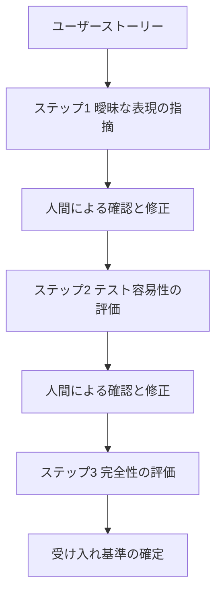
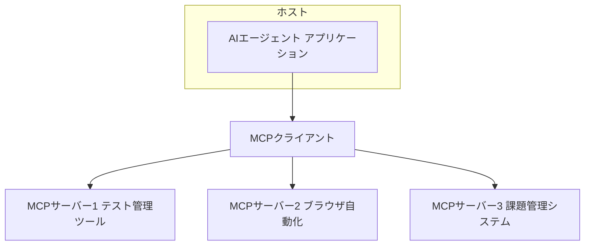
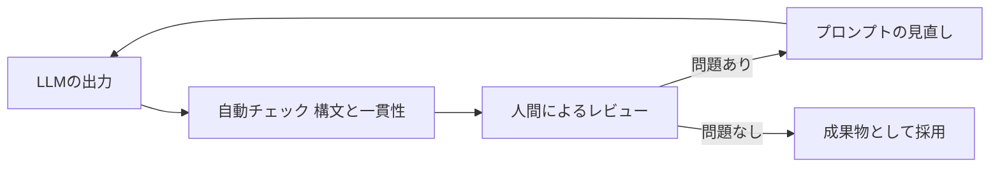

# 生成AIとソフトウェアテスト実践ガイド ― 初学者のためのステップバイステップ入門

> 本ガイドは、Mark Winteringham 著『Software Testing with Generative AI』（Manning Publications、2024年12月刊、O'Reilly掲載）[1] の目次構成を出発点としつつ、ISTQB（国際ソフトウェアテスト資格認定委員会）が2025年に発表した専門資格シラバス「Testing with Generative AI（CT-GenAI）」[2], [3] や、GitHub・Microsoft・Anthropic・ThoughtWorksなど国際的に著名な開発組織・エンジニアの発信内容を踏まえ、2026年9月時点の実務動向に基づいて独自に再構成した学習ガイドです。書籍の内容をそのまま抜粋したものではなく、初学者が生成AI（Generative AI, GenAI）をソフトウェアテストに安全かつ効果的に取り入れるための独立したステップバイステップ教材として執筆しています。

## この記事の対象読者

- ソフトウェアテスト・QAの基礎（テストケース、テスト計画、探索的テストなど）はある程度知っているが、生成AIやLLM（大規模言語モデル）は初めて触るという方
- ChatGPTやGitHub Copilot、Claudeなどのツール名は聞いたことがあるが、テスト業務に体系的に組み込む方法を知りたい方
- チームに生成AIを導入する際に、何から手をつけ、どんなリスクに注意すべきかを把握したい方

## 目次

1. 生成AIとLLMの基礎知識
2. マインドセット ― 人間とAIの協働モデル
3. プロンプトエンジニアリングの基本とテスト実務への応用
4. AIによるテスト分析とテストケース生成
5. AIによるテストデータ生成
6. AIを活用したテスト自動化とセルフヒーリング
7. 探索的テストとAIアシスタント
8. AIエージェントとMCPによるテスト作業の自動化
9. 生成AI活用のリスク管理
10. コンテキストの拡張 ― RAGとファインチューニング
11. 組織導入とチーム変革
12. まとめとチェックリスト
13. 参考文献

---

## 第1章 生成AIとLLMの基礎知識

生成AIをテストに使い始める前に、まずLLM（Large Language Model、大規模言語モデル）が何者で、何が得意で何が苦手なのかを正しく理解しておく必要があります。ここを飛ばして「便利そうだから使う」と始めてしまうと、後述するハルシネーション（もっともらしい誤り）に足をすくわれることになります。

### 1.1 AIの系譜を整理する

AIとひとくちに言っても、その中身は大きく4つの流れに分けて理解すると見通しがよくなります。


- **記号的AI**：ルールと論理でIF-THEN的に判断する、古典的なエキスパートシステムの系譜です。
- **古典的機械学習**：不具合の分類や発生予測など、データからパターンを学習する手法です。特徴量の設計や前処理に人手が必要です。
- **深層学習**：ニューラルネットワークが大量のデータから自動的に特徴を学習します。画像・音声・テキストなど複雑なデータの扱いに強みがあります。
- **生成AI**：深層学習の技術を応用し、学習データのパターンを模倣しながら新しいテキスト・画像・コードを「生成」します。LLMはこの生成AIの代表例です。

ISTQBのCT-GenAIシラバスでは、生成AIを使う最大の利点として「事前学習済みモデルを追加の学習フェーズなしにそのままテスト業務へ適用できる」ことを挙げています[2]。裏を返せば、追加学習なしで使えるがゆえの限界（次章以降で扱うハルシネーションなど）もセットで理解しておく必要があります。

### 1.2 トークン化・埋め込み・コンテキストウィンドウ

LLMは文章を直接理解しているわけではありません。内部では次のような処理が行われています。

| 用語 | 説明 |
|---|---|
| トークン化 | 文章を単語や単語の一部などの小さな単位（トークン）に分割する処理 |
| 埋め込み | トークンを意味的な関係性を保ったまま数値ベクトルに変換したもの |
| コンテキストウィンドウ | LLMが一度に考慮できるトークン数の上限。長いテストログを解析させる際の制約になる |
| Transformer | トークン同士の関係性を学習し、次に来るトークンを予測する仕組みを持つニューラルネットワークの構造 |

ここで初学者が押さえておくべき最重要ポイントは、「LLMは統計的にもっともらしい次のトークンを予測しているのであって、事実かどうかを検証しているわけではない」という点です。もっともらしいことと正しいことは別物であり、この性質がテスト業務における最大のリスク要因（第9章）につながります。

### 1.3 Foundation・Instruction-tuned・Reasoning LLMの違い

LLMは学習の段階に応じて、性格の異なる3種類に分類できます[2]。

| 種類 | 特徴 | テスト業務での主な用途 |
|---|---|---|
| Foundation LLM | 大規模かつ多様なデータで事前学習された汎用モデル | 単体では指示への追従性が弱く、多くの場合は下記2種と組み合わせて利用される |
| Instruction-tuned LLM | 指示と模範応答のペアで追加調整され、指示への追従性が高い | テストケース生成、レポート作成、要約など日常的なテストタスク全般 |
| Reasoning LLM | 多段階の論理的推論に特化した追加学習を受けている | 複雑なテスト計画の立案、リスクの多基準的な優先順位付けなど高い推論負荷を要するタスク |

すべてのタスクに最も強力なReasoning LLMを使えばよいわけではありません。単純なテストケースの雛形生成にはInstruction-tuned LLMで十分なことが多く、コストや応答速度とのバランスを考える必要があります。

### 1.4 マルチモーダルLLMとテストへの応用

近年のLLMはテキストだけでなく画像も同時に扱えるマルチモーダル対応が進んでいます。ISTQBのシラバスでも、GUIのワイヤーフレームとユーザーストーリーの両方を入力してテスト条件を生成する演習が紹介されています[2]。スクリーンショットと期待仕様を突き合わせて視覚的な不整合を見つけたり、画像とテキストの両方を組み合わせてリッチなテストケースを作成したりできる点は、テスターにとって大きな武器になります。

---

## 第2章 マインドセット ― 人間とAIの協働モデル

道具としてのLLMを理解したところで、次に大切なのは「テスターとしてどう向き合うか」というマインドセットです。Winteringhamは著書の中で、生成AIをテストに取り入れる際の土台として「マインドセット（心構え）」「テクニック（技術）」「コンテキスト（文脈）」という3層のモデルを提示しています[1]。

### 2.1 AIは代替ではなく増幅器である

`Software Testing with Generative AI`のレビューでも繰り返し強調されているのが、「AIはテスターの仕事を奪うのではなく、テスターの『作用範囲（area of effect）』を広げる存在である」という考え方です[1]。人間は目的意識と価値判断を提供し、AIは処理速度とパターン網羅性を提供する。この役割分担を明確にすることが出発点になります。

Google CloudとDORA（DevOps Research and Assessment）チームが2025年に発表した大規模調査「State of AI-assisted Software Development」も同じ結論に達しています。調査対象となった約5,000人の技術者のデータからは、生成AIが「チームを底上げする」のではなく「すでにあるものを増幅する」という傾向が明確に示されました[13]。優れたプラットフォームとレビュー体制を持つチームはAIによってさらに強くなる一方、プロセスが弱いチームはAIによって欠陥のある成果物をより速く量産してしまうというのです[14]。テストにおいても同じ構図が当てはまります。しっかりしたレビュー体制がなければ、AIは「動くが役に立たないテスト」を大量生産する装置になりかねません。

### 2.2 「予測不能なジーニー」として向き合う

テスト駆動開発（TDD）の提唱者であり、エクストリーム・プログラミングの生みの親でもあるKent Beckは、Gergely OroszによるPodcastインタビューの中で、AIコーディングツールを「予測不能なジーニー（不思議なランプの精）」に例えています[12]。ジーニーは願いを叶えてくれるが、時に予想外の、あるいは筋の通らない形で叶えてしまう——テストの現場でも、生成AIに投げた依頼が字面通りには正しくても、意図とはズレた結果を返してくることは日常的に起こります。だからこそ、生成物を鵜呑みにせず「本当に自分が欲しかったものか」を確認する習慣が欠かせません。

### 2.3 LLM出力は必ず検証する

ThoughtworksのチーフサイエンティストであるMartin Fowlerは、AIによるコンピューティングを「非決定的コンピューティング」への大きな転換点だと位置づけています[10]。同じ入力を与えても毎回同じ答えが返るとは限らない——この性質を踏まえ、Fowlerは「LLMの出力は厳密にテストされなければならない」と明言しています[11]。これはテスターにとって二重の意味を持ちます。

1. 生成AIが作ったコードやテストそのものを検証する対象として扱う必要がある
2. 生成AIが提案してきたテストケースやテストデータも、そのまま採用せず人間のレビューを経る必要がある

### 2.4 生成AIの3つの能力を見極める

Winteringhamは、LLMをテストに活用する際の効果を3つの能力に分類しています[1]。

| 能力 | 説明 | テスト業務の例 |
|---|---|---|
| 生成能力（Generative） | ゼロから新しいコンテンツを作り出す | テストケースやテストデータの新規作成 |
| 変換能力（Transformative） | 既存の情報を別の形式へ変換する | テストケースをGherkin形式へ変換する、CSVをJSONへ変換する |
| 強化能力（Enhancing） | 既存の成果物の質を高める | 曖昧な受け入れ基準を明確化する、既存のテストスクリプトをリファクタリングする |

タスクに取り組む前に「これは生成・変換・強化のどれを期待しているのか」を意識するだけで、プロンプトの精度は大きく上がります。

### 2.5 協働のループを描く

以上を踏まえると、生成AIとテスターの協働は次のような反復ループとして描けます。


このループの主導権は常に人間側にあります。AIが提示する結果は「一次案」であり、最終判断はテスターが下すという原則を、次章以降の各テクニックにも一貫して適用していきます。

### 2.6 自動化バイアスへの警戒

ここで注意したいのが「自動化バイアス」です。人はツールが出した結果を過度に信用してしまう傾向があります。生成AIの応答は流暢で自信ありげな文章として返ってくるため、内容の正確性とは無関係に説得力を感じてしまいがちです。ツールを選び、どこに使い、どこには使わないかを見極める「取捨選択」の姿勢が、生成AI時代のテスターに求められる重要なスキルの一つです[1]。

---

## 第3章 プロンプトエンジニアリングの基本とテスト実務への応用

マインドセットが整ったら、次は具体的な対話のスキルであるプロンプトエンジニアリングです。ISTQBのCT-GenAIシラバスでは、5章構成のうちプロンプトエンジニアリングの章に最も多くの学習時間（365分）が割かれており、実務上の重要性がうかがえます[2]。

### 3.1 プロンプトの6要素構造

効果的なプロンプトは、次の6つの要素で構成すると整理しやすくなります[2]。

| 要素 | 内容 |
|---|---|
| 役割（Role） | AIに取らせたい立場や視点。例：「あなたはテスト自動化エンジニアです」 |
| 文脈（Context） | 対象システムや機能、背景情報 |
| 指示（Instruction） | 実行してほしい具体的なタスク |
| 入力データ（Input data） | ユーザーストーリー、受け入れ基準、スクリーンショット、既存のテストケースなど |
| 制約（Constraints） | 守るべき制限事項や条件 |
| 出力形式（Output format） | 期待する出力の構造やフォーマット |

例えば、テストケース生成の依頼は次のように構成できます。

```text
役割: あなたは経験豊富なQAエンジニアです。
文脈: 対象はECサイトのクーポン適用機能です。
指示: 以下のユーザーストーリーから機能テストケースを作成してください。
入力データ: [ユーザーストーリーの本文をここに貼り付け]
制約: 1回の注文につきクーポンは1枚まで、有効期限切れのクーポンは無効。
出力形式: 前提条件・手順・期待結果の3列を持つ表形式で出力してください。
```

### 3.2 3つの核となるプロンプト技法

ISTQBのシラバスは、テスト業務で特に有用な3つのプロンプト技法を紹介しています[2]。

| 技法 | 適した場面 | 特徴 |
|---|---|---|
| プロンプトチェイニング | 精度が求められる複雑なタスク | タスクを小さなステップへ分解し、各段階の結果を人間またはAIが確認しながら次へ進める |
| フューショットプロンプティング | 出力形式が決まっている反復的なタスク | Gherkin形式のテストケースなど、具体例を先に示してAIに型を学習させる |
| メタプロンプティング | 新しいタスク向けのプロンプトを柔軟に作りたい場面 | 目的だけを伝えると、AI自身がプロンプト自体を生成・改善してくれる |

これらは単独でも使えますが、組み合わせるとさらに効果的です。まずメタプロンプティングで初期プロンプトの叩き台を作らせ、それにフューショットの具体例を追加し、最後にプロンプトチェイニングで段階的に検証しながら実行する、といった流れが典型的です[2]。

### 3.3 プロンプトチェイニングの具体例

例えば、あるユーザーストーリーから受け入れ基準を洗練させていく作業は、次のようなチェインとして設計できます。



各ステップの出力を次のステップの入力にする前に必ず人間が目を通すことで、途中の誤りが後工程に伝播するのを防げます。これはハルシネーションや推論エラーへの初歩的だが効果の高い防御策です（詳しくは第9章）。

### 3.4 システムプロンプトとユーザープロンプト

チャット形式でAIを使う際は、会話全体のふるまいを決める「システムプロンプト」と、その都度入力する「ユーザープロンプト」を区別すると安定した出力が得られます[2]。システムプロンプトには役割・トーン・制約など会話を通じて一貫させたい情報をまとめ、ユーザープロンプトには個々の具体的な指示を書く、という使い分けです。

```text
システムプロンプト例:
あなたはISTQBの用語に準拠したテスト専門アシスタントです。
常に明確で簡潔な言葉遣いを使い、推測ではなくテストの原則を根拠に回答してください。

ユーザープロンプト例:
ブラックボックステストとホワイトボックステストの違いを、具体例つきで教えてください。
```

---

## 第4章 AIによるテスト分析とテストケース生成

プロンプトの基礎を押さえたら、いよいよ実務での活用です。まずはテストプロセスの上流にあたる「テスト分析」と「テスト設計」から見ていきます。

### 4.1 要件から潜在的な不具合を洗い出す

LLMは、要件やユーザーストーリーの中の曖昧さ・矛盾・情報不足を検出するのが得意です[2]。過去の類似要件のパターンや不具合レポートの傾向と照らし合わせながら異常を指摘させることで、レビュー会議に持ち込む前に多くの疑問点を洗い出せます。

### 4.2 テスト条件からテストケースへ

要件をテスト条件へ分解し、さらに具体的なテストケースへ落とし込む一連の流れは、次のように整理できます。


生成AIは、境界値分析や同値分割といった伝統的なテスト設計技法を、要件の種類に応じて提案することもできます[2]。「このユーザーストーリーには境界値分析が適していますか、それとも決定表の方が適していますか」と尋ねてみるだけでも、テスト設計の抜け漏れに気づくきっかけになります。

### 4.3 Gherkin形式のテストケース生成

BDD（振る舞い駆動開発）スタイルのテストを採用しているチームでは、フューショットプロンプティングを使ってGherkin形式のテストケースを生成させる手法が効果的です[2]。具体例をいくつか示したうえで新しいユーザーストーリーを渡すと、Given-When-Then形式のシナリオが一貫したスタイルで生成されます。

```text
例1（お手本として提示）:
Given ログイン済みのユーザーがカート画面を開いている
When 有効なクーポンコードを入力して適用ボタンを押す
Then 合計金額に割引が反映される

新しいユーザーストーリー:
[ここに新しいユーザーストーリーを貼り付け]

上記の例に倣ってGherkin形式のシナリオを3つ以上作成してください。
```

### 4.4 生成結果を評価するための指標

「AIが作ったテストケースは良いものなのか」を判断するには、感覚ではなく指標を持つことが役立ちます。ISTQBのシラバスでは次のような評価指標が紹介されています[2]。

| 指標 | 説明 | テスト業務での例 |
|---|---|---|
| 正確性（Accuracy） | 専門家が作成した基準との一致度 | 生成されたテストケースが要件をどれだけ正しく反映しているか |
| 適合率（Precision） | 特定の目的に対する出力の正しさ | 生成されたテストケースが実際に異常を正しく検出できるか |
| 再現率（Recall） | 関連する事項をどれだけ網羅できたか | 有効値・無効値の同値クラスをどれだけ網羅できているか |
| 関連性と文脈適合性 | 出力が対象の文脈に適しているか | 生成結果がテストベースやドメイン固有の要件と整合しているか |
| 多様性（Diversity） | 入力や状況の幅広さ、重複の少なさ | さまざまなユーザー行動やエッジケースを網羅できているか |
| 実行成功率 | 生成物がそのまま実行できる割合 | 生成されたテストスクリプトが構文エラーなく動作するか |
| 時間効率 | 人手による作成と比べた時間短縮の度合い | AIによる生成時間と、人手で同等のテストを作る時間との比較 |

これらの指標は厳密な数値評価でなくても構いません。「今回の生成結果は再現率が低そうだ、境界値のケースが抜けている」といった定性的な振り返りだけでも、プロンプトの改善サイクルを回す助けになります。

---

## 第5章 AIによるテストデータ生成

多くのテスターにとって、リアルなテストデータの用意は地味ながら時間のかかる作業です。生成AIはこの分野で特に即効性の高い効果を発揮します。

### 5.1 合成テストデータのメリット

生成AIは、本番データに似た性質を持ちながら機密情報を含まない「合成テストデータ」を作り出せます[2]。極端な値・境界値・多様な組み合わせを網羅したデータセットを短時間で用意できる点は、手作業では実現しにくい効率化です。

### 5.2 データ生成のパイプライン

実務では、次のような流れでデータ生成を組み立てると再現性が高まります。


Winteringhamの著書でも、単純なデータセットの生成から始めて、SQLのエクスポート形式などの構造化フォーマットをプロンプトの中で「お手本」として与えることで、より複雑なテストデータを扱う応用例が紹介されています[1]。

### 5.3 プライバシーを意識したデータ生成

合成データとはいえ、プロンプトに本番データそのものを貼り付けてしまっては元も子もありません。データの最小化（必要最小限の非機微情報のみを使う）や匿名化・仮名化を徹底し、実在の個人情報がAIサービスへ送信されないよう設計する必要があります[15]。この点は第9章のリスク管理とあわせて運用ルールを整備することをおすすめします。

---

## 第6章 AIを活用したテスト自動化とセルフヒーリング

テスト自動化は、生成AIの恩恵が最もわかりやすい形で現れる領域の一つです。

### 6.1 コード生成による自動化の高速化

GitHubの公式ブログは、GitHub Copilotを使ったユニットテスト生成について「単調な作業を自動化し、より頑健で意味のあるテストを短時間で書けるようにする」と説明しています[5]。GitHub Docsでも、Copilot Chatに具体的な関数を渡してユニットテストと統合テストの両方を生成させる手順が紹介されており、境界値やエラーハンドリングまで含めた網羅的なテスト群を、まず「たたき台」として得られる点が強みです[6]。

Anthropic自身も、開発コンソール上でプロンプトに対する入力パターンをAIに自動生成させ、様々な現実的な入力でプロンプトの品質を検証する「テストケース生成」機能を提供しています[7]。これはテスト対象がアプリケーションのコードだけでなく、AI自身が組み込まれたプロンプトにも及ぶことを示す好例です。

### 6.2 アクセシビリティツリーに基づくブラウザ自動化

UIの自動テストで長年悩みの種だったのが、スクリーンショットに基づく画像認識の不安定さです。Microsoftが提供するPlaywright MCP（Model Context Protocol）サーバーは、この課題に対して「スクリーンショットや画像認識モデルを介さず、構造化されたアクセシビリティスナップショットを通じてAIエージェントがWebページを操作する」というアプローチを採用しています[8], [9]。ボタンや入力欄をテキストベースの役割（ボタン、テキストボックスなど）とラベルで表現するため、画像を解釈するAIモデルを使うよりも高速・安価に、かつ要素の特定と操作を再現性高く行えます。ただし、これはあくまで要素の特定・操作手順の再現性が向上するという意味であり、AIエージェントの計画立案やツール選択、対象ページ・ネットワークの状態まで決定的であることを意味するものではなく、ハルシネーションのリスクが解消されるわけでもありません。


Microsoftのブログでは、GitHubのCopilot Coding AgentがこのPlaywright MCPを標準で組み込んでおり、機能追加や不具合修正を依頼すると、エージェントが実際にブラウザを開いてアプリを操作し、変更が正しく動作するかを自ら検証する事例が紹介されています[8]。

### 6.3 セルフヒーリング型テスト自動化の2世代

UIの見た目やDOM構造が変わるたびにテストが壊れる「フレーキーテスト」問題に対して、セルフヒーリング（自己修復）技術も進化しています。

| 世代 | 方式 | 長所と短所 |
|---|---|---|
| 第1世代：ロケータフォールバック型 | ルールベースで代替のセレクタを順に試す | 軽量で高速だが、大きなUI変更には対応しきれない |
| 第2世代：生成的セルフヒーリング型 | LLMが自然言語による意図の説明から対象要素をゼロから再解決する | UIの大幅な刷新にも対応できる反面、計算コストと誤判定のリスクが増す |

いずれの方式も「壊れたら自動的に直す」万能薬ではなく、修復が発生したこと自体をログとして残し、人間が定期的に見直す運用が推奨されます。テスト自動化コミュニティで長年ビジュアル検証（Visual Validation）を提唱してきたAngie Jones（Test Automation University創設者、現Agentic AI Foundation VP）も、UIの見た目そのものを検証対象に含めることの重要性を繰り返し発信しており、セルフヒーリングの議論は「壊れないこと」だけでなく「見た目が正しいこと」もあわせて検証範囲に含めるべきだという視点を補ってくれます[17], [18]。

### 6.4 コマンドラインからのAI活用とドキュメント生成

GUIのチャット画面だけがAI活用の窓口ではありません。Djangoの共同創業者であり、データ探索ツールDatasetteの開発者としても知られるSimon Willisonは、自身のLLM CLIツールを使い、既存のテストコード一式をそのままプロンプトとしてLLMに渡すことで、実装の詳細なドキュメントを生成する手法を紹介しています[16]。テストコードには「その関数が何を保証しているか」という情報が凝縮されているため、テストを入力源にすることで、実際に実行して確認済みの挙動に基づいたドキュメントが得られやすいという着眼点は、テスターにとっても示唆に富みます。

### 6.5 リグレッションテストへの適用

生成AIは、コードの差分を解析して影響範囲を推定し、優先的に実行すべきリグレッションテストを絞り込む「インパクト分析」にも活用できます[2]。API仕様の変更に応じてテストスクリプトを自動的に追随させたり、テストレポートを要約して異常をクラスタリングしたりする用途も実務で広がっています。

---

## 第7章 探索的テストとAIアシスタント

自動化できない、あるいは自動化すべきでない領域として重要なのが探索的テストです。生成AIはここでも「壁打ち相手」として力を発揮します。

### 7.1 チャーターとリスクの洗い出し

探索的テストの出発点となる「チャーター（探索の目的と範囲を示す短い宣言）」やリスク一覧を、AIとの対話を通じて拡張できます[1]。人間がまず大まかなチャーターを書き、それをAIに見せて「見落としていそうなリスクや観点はないか」と尋ねることで、視野が偏っていないかをチェックできます。

### 7.2 セッション中のAI活用ループ

探索的テストのセッション中には、次のようなループでAIを活用できます。


例えば、想定外の挙動に遭遇したときに「この画面でこういう操作をしたらこうなった。次にどんな操作を試すと良さそうか」とAIに相談することで、次に試すべきパターンのアイデアを素早く広げられます。セッション終了後は、蓄積したメモをAIに要約させることで、レポート作成の負担を大きく減らせます[1]。

### 7.3 バグ調査の補助

不具合を再現する際の手順の整理や、ログからの原因の絞り込みも、AIが得意とする領域です。ただし、原因の「断定」はAIに任せず、あくまで仮説の提示役として使い、最終的な検証は人間が行うという役割分担を保つことが重要です。

---

## 第8章 AIエージェントとMCPによるテスト作業の自動化

これまでの章では、人間が都度プロンプトを打ち込む「対話型」の活用を中心に見てきました。ここからは、AIが自律的に複数の手順を実行する「エージェント」の活用に踏み込みます。

### 8.1 LLM-powered agentとは何か

LLM-powered agent（LLM搭載エージェント）とは、自然言語の理解・生成能力に加えて、あらかじめ定義された「ツール」を呼び出すことで外部システムを操作できるAIアプリケーションです[2]。単なる質問応答にとどまらず、指示を解釈し、必要な情報を取得し、実際に「行動」を起こせる点が従来のチャットボットとの違いです。

自律性の度合いによって、次のように分類されます。

- **自律エージェント**：あらかじめ定義されたルールやフィードバックループに基づき、人間の介入を最小限にしてタスクを遂行する
- **半自律エージェント**：定期的な人間の監督を挟みながらタスクを遂行する

複数のエージェントがそれぞれの役割を持って連携する「マルチエージェント構成」も広がっており、これらの協調動作は「オーケストレーション」と呼ばれます[2]。

### 8.2 ツール呼び出しのループ

エージェントの基本的な動作は、次のようなループとして描けます。


重要なのは、エージェントも通常のLLMと同じくハルシネーションや推論エラーを起こしうるという点です[2]。自律性が高いほど、誤った行動が実システムに影響を与えるリスクも高まるため、重要なタスクほど人間による承認ステップを挟む半自律型の設計が推奨されます。

### 8.3 Model Context Protocol（MCP）の基本構造

近年、AIエージェントを外部ツールへ接続する標準規格として急速に普及しているのがModel Context Protocol（MCP）です。ツール一つひとつと個別に連携コードを書く代わりに、共通のプロトコルでホスト・クライアント・サーバーを結びます。



第6章で紹介したPlaywright MCPはこの構造の代表例で、ブラウザ操作という一つの能力をMCPサーバーとして公開することで、Claude CodeやGitHub Copilotなど複数のAIエージェントから共通の方法で呼び出せるようになっています[8], [9]。テスト管理ツールや課題管理システムのMCPサーバーと組み合わせれば、「コードの差分から影響範囲を分析し、必要なテストケースを生成し、テスト管理ツールに登録し、ブラウザで実行して結果を記録する」といった一連の作業を、エージェントが横断的にこなすことも可能になります。

---

## 第9章 生成AI活用のリスク管理

ここまでの活用例だけを見ると生成AIは万能に思えるかもしれませんが、テスターとして最も重要なのはリスクを正しく理解し、適切な緩和策を講じることです。ISTQBのCT-GenAIシラバスも、リスク管理の章を専門の1章として独立させています[2]。

### 9.1 ハルシネーション・推論エラー・バイアス

生成AI特有の欠陥として、次の3つを区別して理解しておく必要があります[2]。

- **ハルシネーション**：事実に反する、あるいは文脈上無関係な内容をAIが生成してしまう現象。存在しない受け入れ基準を検証するテストケースを作ってしまう、といった形で現れます。
- **推論エラー**：因果関係や条件分岐、段階的な問題解決といった論理構造をLLMが誤って解釈すること。LLMは真の論理的推論を行っているわけではなくパターンマッチングに依存しているため、テスト工数の見積もりやテストケースの優先順位付けのような論理的思考を要するタスクで誤りが生じやすくなります。
- **バイアス**：学習データに由来する偏り。特定の言語や特定の観点に偏った合成テストデータが生成されるといった形で現れます。

これらは同じLLMであっても会話ごとに現れたり消えたりする、非決定的な性質を持つため、「一度直った」で終わらせず継続的な検証が必要です[2]。

生成物の検証には、次のようなフローを組み込むと効果的です。



具体的な緩和策としては、プロンプトに十分な文脈を与えること、複雑なタスクをプロンプトチェイニングで小さく分解すること、複数のLLMで結果を比較することなどが挙げられます[2]。また、応答のランダム性を左右する「温度（temperature）」パラメータを下げることで、非決定的な挙動をある程度抑えられますが、その代わりに創造性や多様性は失われるというトレードオフも理解しておく必要があります[2]。

### 9.2 データプライバシーとセキュリティのリスク

テストにおける生成AI活用は、機密情報の取り扱いという観点でも注意が必要です。ISTQBのシラバスは代表的な攻撃ベクトルを次のように整理しています[2]。

| 攻撃ベクトル | 説明 | 具体例 |
|---|---|---|
| データの持ち出し | 長大なプロンプトでコンテキストウィンドウを圧迫し、学習データの断片を引き出そうとする | 意図的に長いプロンプトを送り、モデルに無関係な内部情報を出力させる |
| 入力の不正操作 | AIの出力を乱すようなデータを混入させる | 画像などで文脈をすり替え、受け入れ基準に関するハルシネーションを誘発する |
| データ汚染 | 学習や評価に使うデータそのものを操作する | AIが生成したテストレポートの評価に虚偽の評価を混入させる |
| 悪意あるコード生成 | LLMを操って裏口となるコードを生成させる | 特定の不正な宛先へ通信するコードをテストコードに紛れ込ませる |

これらのリスクは、生成AI活用に限らずAIアプリケーション全般に共通する課題でもあります。国際的なセキュリティコミュニティであるOWASP（Open Worldwide Application Security Project）が2025年に発表した「Top 10 for LLM Applications」でも、プロンプトインジェクション（巧妙な入力によってLLMに意図しない挙動をさせる攻撃）が2版連続で最も重大なリスクの首位に挙げられており、LLMの出力を「信頼できない外部入力」として扱い、通常のアプリケーションと同様のサニタイズを適用することが推奨されています[15]。テスト自動化基盤にLLMを組み込む場合、この観点でのセキュリティテストもテスターの守備範囲に加わりつつあります。

データ保護の観点では、次のような基本的な緩和策が有効です[2]。

- データの最小化：必要のない機微情報は処理させない
- 匿名化・仮名化：識別情報をマスキングまたは置換する
- 安全な保存と通信：強固な暗号化とアクセス制御を実施する
- 教育：組織として生成AIの責任ある利用に関する方針とトレーニングを整備する

### 9.3 環境負荷という見落とされがちな視点

生成AIの利用は計算資源を大量に消費し、それに伴うエネルギー消費とCO2排出も無視できない規模になっています[2]。1件のテキスト生成が消費するエネルギーはわずかでも、組織全体・業界全体で積み重なれば大きな環境負荷になり得ます。不要なモデル呼び出しを減らす、タスクの複雑さに応じて適切なサイズのモデルを選ぶといった工夫が、コスト最適化と環境配慮の両面で意味を持ちます。

### 9.4 規制・標準の全体像

生成AIをテストに組み込む際には、組織を取り巻く規制や標準の動向も押さえておく必要があります[2]。

| 名称 | 種別 | テスト業務への関わり |
|---|---|---|
| ISO/IEC 42001:2023 | 標準 | 組織内でAIシステムを管理するための要件を定め、生成AIを使ったテストの一貫性と信頼性を支える |
| ISO/IEC 23053:2022 | 標準 | 機械学習を用いたAIシステムのライフサイクルの枠組みを提供し、データ品質や透明性の指針となる |
| EU AI Act | 規制 | リスクレベルに応じて義務が異なる。最小リスク・無リスクの用途には原則義務なし、透明性リスクの用途にはユーザーへの開示義務、ハイリスクの用途にはリスク管理・文書化・人間による監督・正確性・バイアス対策などの統制が課され、汎用AI（GPAI）モデルには該当する透明性・モデル関連の義務が課される |
| NIST AI Risk Management Framework | フレームワーク | 公平性・透明性・セキュリティの観点からAIのリスク管理指針を提供する |

これらは頻繁に更新されるため、組織として定期的に最新動向を確認する体制を持つことが望まれます。

---

## 第10章 コンテキストの拡張 ― RAGとファインチューニング

汎用のLLMをそのまま使うだけでは、社内固有の仕様書や過去の不具合履歴といったコンテキストを反映できません。この課題に対する代表的な2つのアプローチがRAGとファインチューニングです。

### 10.1 RAG（検索拡張生成）の仕組み

RAG（Retrieval-Augmented Generation）は、LLMの応答生成プロセスに外部データソースからの検索結果を組み込むことで、回答の関連性と正確性を高める手法です[2]。


大きな文書を256〜512トークン程度の小さな「チャンク」に分割し、それぞれを埋め込みベクトルに変換してベクトルデータベースに保存しておきます[2]。テスターが質問を投げると、その質問も同様にベクトル化され、意味的に近いチャンクが検索されます。検索されたチャンクを文脈としてLLMに渡すことで、社内固有の情報に基づいた、より地に足のついた回答が得られる仕組みです。

テスト業務においては、社内の仕様書やこれまでの不具合票をRAGの参照先にすることで、テスト分析やテスト設計が最新の仕様や過去の教訓と整合した形で行われるようになります[2]。

### 10.2 ファインチューニングとの比較

ファインチューニングは、事前学習済みのモデルを対象のデータセットでさらに学習させ、特定のタスクやドメインに適応させる手法です[2]。


例えば、組織固有のユーザーストーリーとそれに対応するテストケースのペアで学習させることで、その組織の文体や慣習に沿ったテストケースを生成できるようになります[2]。ただし、質の高い学習データを用意する手間や計算コストがかかるため、「まずはRAGで試し、それでも不十分な場合にファインチューニングを検討する」という順番が現実的です。RAGとファインチューニングは排他的な選択肢ではなく、組み合わせて使うことも可能です[2]。

### 10.3 LLMOpsという運用の視点

LLMを本番のテスト基盤に組み込む場合、モデルのデプロイ・監視・更新を継続的に運用する「LLMOps」という考え方が必要になります[2]。モデルのバージョンが変わるだけで生成結果の傾向が変わることもあるため、テスト業務にLLMを組み込む際は、通常のソフトウェアと同様にバージョン管理と回帰確認の対象として扱う姿勢が求められます。

---

## 第11章 組織導入とチーム変革

個人としての活用スキルが身についたら、次はチームや組織としてどう広げていくかという段階に進みます。

### 11.1 Shadow AIのリスク

正式な承認や方針を経ないまま、現場のメンバーが個人的に外部の生成AIツールへ機密情報を入力してしまう「Shadow AI（シャドーAI）」は、導入初期に特に注意すべきリスクです[2]。ガイドラインが整う前に現場が独自にツールを使い始めてしまうと、第9章で見たデータプライバシーのリスクが顕在化しやすくなります。早い段階で利用可能なツールと禁止事項を明文化することが重要です。

### 11.2 段階的な導入ロードマップ

生成AIの組織導入は、一足飛びに全社展開するのではなく、段階を踏んで進めるのが定石です[2]。


各フェーズで得られた学びをプロンプトライブラリやガイドラインとして蓄積し、次のフェーズへ引き継いでいくことで、同じ失敗を繰り返さずに組織全体のスキルを底上げできます[2]。

### 11.3 DORA 2025レポートが示す教訓

第2章でも触れたDORAの2025年版レポートは、組織導入における重要な示唆を与えてくれます。調査によれば、技術者の90%が仕事でAIを利用している一方で、AIの導入は「スループットの向上」と「デリバリーの不安定化」を同時にもたらす傾向が確認されています[13], [14]。良い内部プラットフォームと明確なワークフロー、そしてチーム間の連携があってはじめて、生成AIの恩恵を個人の生産性向上から組織全体の成果へとつなげられるというのがレポートの結論です[13]。テスト組織としてAIを導入する際も、ツールの選定そのものより先に、レビュー体制やCI/CDパイプラインの成熟度を点検しておく価値があります。

### 11.4 必要なスキルとチームの変化

生成AIの導入に伴い、テスターに求められるスキルセットも変化します[2]。プロンプトエンジニアリングはもちろん、生成物を批判的に評価するリテラシー、そして「どのタスクを人間が担い、どのタスクをAIに任せるか」を判断する設計的思考が重要になります。個人がばらばらに工夫するのではなく、有効なプロンプトやワークフローをチームで共有し、標準化していく文化を育てることが、組織としての成熟度を高める近道です[2]。

---

## 第12章 まとめとチェックリスト

### 12.1 学習の道筋

本ガイドで扱った内容をさらに体系的に学びたい場合、次のような学習パスが考えられます。

- 実務寄りの入門書として、Mark Winteringham著『Software Testing with Generative AI』[1]
- 生成AIをテストに活用する専門知識を体系的に学べる資格として、ISTQBの「Testing with Generative AI（CT-GenAI）」[2], [3]
- AI自体（機械学習システム）をテストする視点を深めたい場合は、ISTQBの「AI Testing（CT-AI）」[4]（CT-GenAIとは目的が異なり、AIシステムそのものの品質保証に焦点を当てています）

### 12.2 実践チェックリスト

- [ ] タスクが「生成」「変換」「強化」のどれに該当するかを意識してプロンプトを設計した
- [ ] プロンプトに役割・文脈・指示・入力データ・制約・出力形式の6要素を含めた
- [ ] 複雑なタスクはプロンプトチェイニングで小さなステップに分解した
- [ ] 出力形式を揃えたい場合はフューショットプロンプティングで具体例を示した
- [ ] 生成されたテストケース・テストデータ・テストスクリプトを人間がレビューしてから採用した
- [ ] 生成物の品質を、正確性・適合率・再現率などの観点で振り返った
- [ ] 機密情報や個人情報をプロンプトに含めていないか確認した
- [ ] 自動化やセルフヒーリングの修復ログを定期的に見直す運用を用意した
- [ ] AIエージェントに重要な操作を任せる場合、人間の承認ステップを組み込んだ
- [ ] チームやAI活用のガイドラインとShadow AI対策を明文化した
- [ ] 生成AIの利用状況が組織のセキュリティ方針や規制（ISO/IEC 42001、EU AI Actなど）に沿っているか確認した
- [ ] 有効だったプロンプトやワークフローをチームで共有する仕組みを持っている
- [ ] 小規模な試行から始め、段階的に適用範囲を広げる計画を立てた

### 12.3 最後に

生成AIは、テスターの仕事を消し去る魔法の杖ではありません。しかし、要件の曖昧さを洗い出し、退屈なテストデータ作成を肩代わりし、探索的テストの壁打ち相手になり、コードの網羅的なテストケースの下書きを高速に用意してくれる、頼れる相棒にはなり得ます。大切なのは、Kent Beckの言う「予測不能なジーニー」[12]と向き合う心構えを持ち、Martin Fowlerが説くように出力を厳密に検証する規律を保ちながら[11]、一歩ずつ実務に取り入れていくことです。

---

## 参考文献

- **[1]** Mark Winteringham『Software Testing with Generative AI』（Manning Publications、2024年12月刊） — <a href="https://www.oreilly.com/library/view/software-testing-with/9781633437364/" target="_blank" rel="noopener noreferrer">https://www.oreilly.com/library/view/software-testing-with/9781633437364/</a>
- **[2]** ISTQB, "Certified Tester Specialist Level Syllabus – Testing with Generative AI (CT-GenAI) v1.0"（2025年） — <a href="https://astqb.org/assets/documents/CT-GenAI-Syllabus-v1.0.pdf" target="_blank" rel="noopener noreferrer">https://astqb.org/assets/documents/CT-GenAI-Syllabus-v1.0.pdf</a>
- **[3]** ISTQB, "ISTQB® Certified Tester – Testing with Generative AI (CT-GenAI) Press Release" — <a href="https://istqb.org/istqb-certified-tester-specialist-level-testing-with-generative-ai-ct-genai-press-release/" target="_blank" rel="noopener noreferrer">https://istqb.org/istqb-certified-tester-specialist-level-testing-with-generative-ai-ct-genai-press-release/</a>
- **[4]** ISTQB, "Certified Tester AI Testing (CT-AI) Version 2.0" — <a href="https://istqb.org/certifications/certified-tester-ai-testing-ct-ai/" target="_blank" rel="noopener noreferrer">https://istqb.org/certifications/certified-tester-ai-testing-ct-ai/</a>
- **[5]** GitHub Blog, "How to generate unit tests with GitHub Copilot: Tips and examples" — <a href="https://github.blog/ai-and-ml/github-copilot/how-to-generate-unit-tests-with-github-copilot-tips-and-examples/" target="_blank" rel="noopener noreferrer">https://github.blog/ai-and-ml/github-copilot/how-to-generate-unit-tests-with-github-copilot-tips-and-examples/</a>
- **[6]** GitHub Docs, "Writing tests with GitHub Copilot" — <a href="https://docs.github.com/en/copilot/tutorials/write-tests" target="_blank" rel="noopener noreferrer">https://docs.github.com/en/copilot/tutorials/write-tests</a>
- **[7]** Anthropic, "Evaluate prompts in the developer console" — <a href="https://claude.com/blog/evaluate-prompts" target="_blank" rel="noopener noreferrer">https://claude.com/blog/evaluate-prompts</a>
- **[8]** Microsoft for Developers, "The Complete Playwright End-to-End Story, Tools, AI, and Real-World Workflows" — <a href="https://developer.microsoft.com/blog/the-complete-playwright-end-to-end-story-tools-ai-and-real-world-workflows/" target="_blank" rel="noopener noreferrer">https://developer.microsoft.com/blog/the-complete-playwright-end-to-end-story-tools-ai-and-real-world-workflows/</a>
- **[9]** Playwright公式サイト（Microsoft） — <a href="https://playwright.dev/" target="_blank" rel="noopener noreferrer">https://playwright.dev/</a>
- **[10]** The Pragmatic Engineer（Gergely Orosz）, Martin Fowlerへのインタビュー — <a href="https://newsletter.pragmaticengineer.com/p/martin-fowler" target="_blank" rel="noopener noreferrer">https://newsletter.pragmaticengineer.com/p/martin-fowler</a>
- **[11]** The New Stack, "Martin Fowler on Preparing for AI's Nondeterministic Computing" — <a href="https://thenewstack.io/martin-fowler-on-preparing-for-ais-nondeterministic-computing/" target="_blank" rel="noopener noreferrer">https://thenewstack.io/martin-fowler-on-preparing-for-ais-nondeterministic-computing/</a>
- **[12]** The Pragmatic Engineer（Gergely Orosz）, "TDD, AI agents and coding with Kent Beck" — <a href="https://newsletter.pragmaticengineer.com/p/tdd-ai-agents-and-coding-with-kent" target="_blank" rel="noopener noreferrer">https://newsletter.pragmaticengineer.com/p/tdd-ai-agents-and-coding-with-kent</a>
- **[13]** Google Cloud Blog, "Announcing the 2025 DORA Report" — <a href="https://cloud.google.com/blog/products/ai-machine-learning/announcing-the-2025-dora-report" target="_blank" rel="noopener noreferrer">https://cloud.google.com/blog/products/ai-machine-learning/announcing-the-2025-dora-report</a>
- **[14]** DORA, "Balancing AI tensions: Moving from AI adoption to effective SDLC use" — <a href="https://dora.dev/insights/balancing-ai-tensions/" target="_blank" rel="noopener noreferrer">https://dora.dev/insights/balancing-ai-tensions/</a>
- **[15]** OWASP, "Top 10 for LLM Applications 2025" — <a href="https://owasp.org/www-project-top-10-for-large-language-model-applications/assets/PDF/OWASP-Top-10-for-LLMs-v2025.pdf" target="_blank" rel="noopener noreferrer">https://owasp.org/www-project-top-10-for-large-language-model-applications/assets/PDF/OWASP-Top-10-for-LLMs-v2025.pdf</a>
- **[16]** Simon Willison, "Generating documentation from tests using files-to-prompt and LLM" — <a href="https://til.simonwillison.net/llms/docs-from-tests" target="_blank" rel="noopener noreferrer">https://til.simonwillison.net/llms/docs-from-tests</a>
- **[17]** Angie Jones公式サイト（Test Automation University創設者、現Agentic AI Foundation VP としての経歴を掲載） — <a href="https://angiejones.tech/" target="_blank" rel="noopener noreferrer">https://angiejones.tech/</a>
- **[18]** "Angie Jones Chats With Kent About Automated Visual Testing" — Chats with Kent Podcast（Kent C. Dodds） — <a href="https://kentcdodds.com/chats/02/08/angie-jones-chats-with-kent-about-automated-visual-testing" target="_blank" rel="noopener noreferrer">https://kentcdodds.com/chats/02/08/angie-jones-chats-with-kent-about-automated-visual-testing</a>

---

*本ガイドは2026年9月時点で確認できる公開情報に基づいて作成しています。生成AI関連の技術動向や各種資格・規制は変化が速い分野のため、実務で利用する際は各リンク先の最新情報もあわせてご確認ください。*
