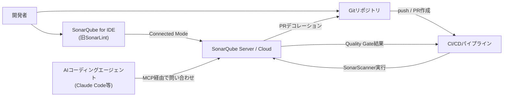
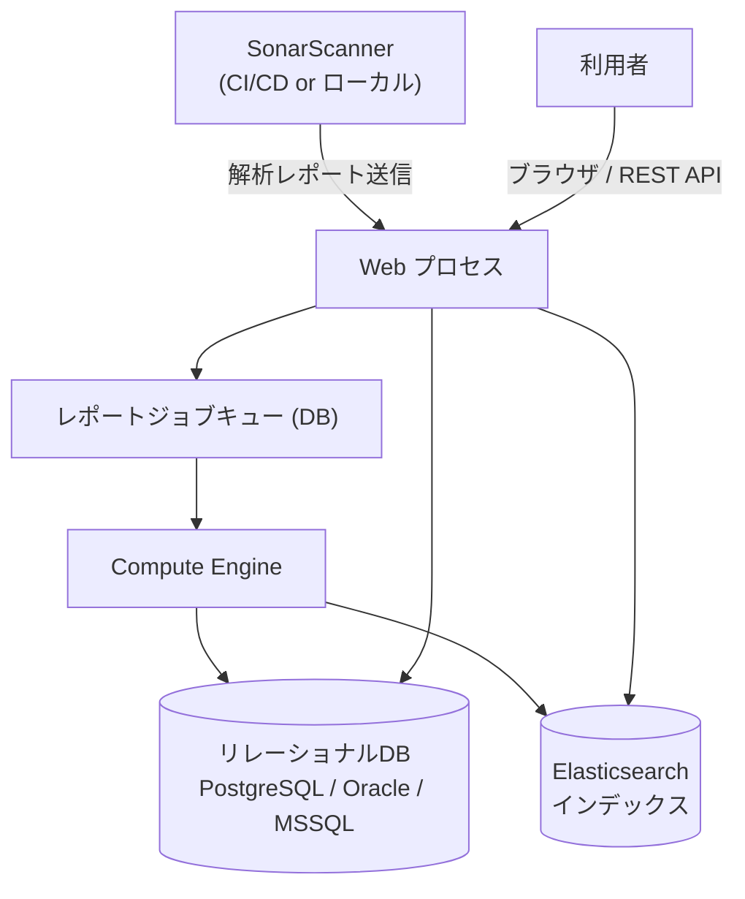
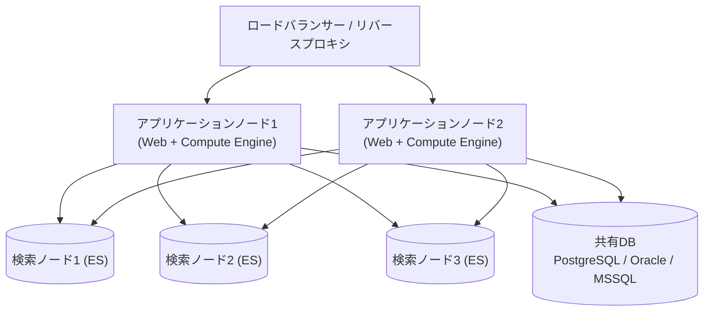
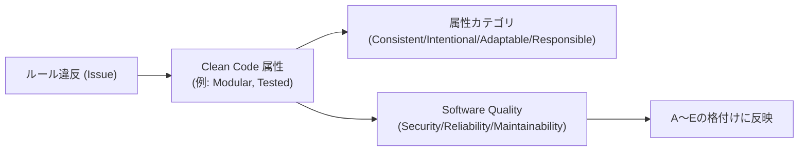
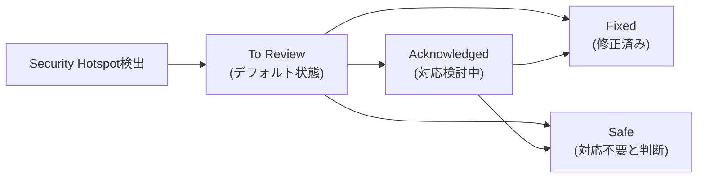
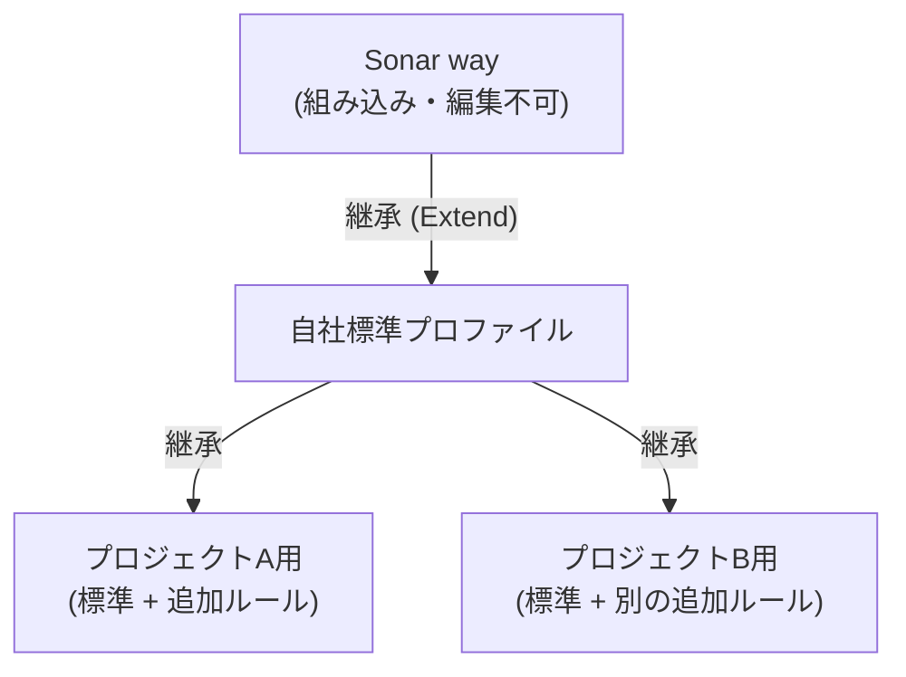
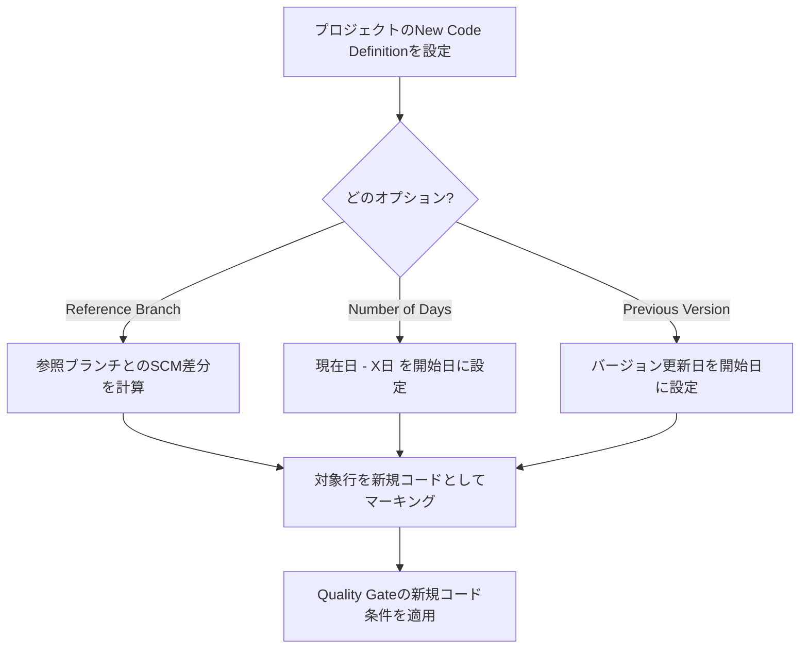
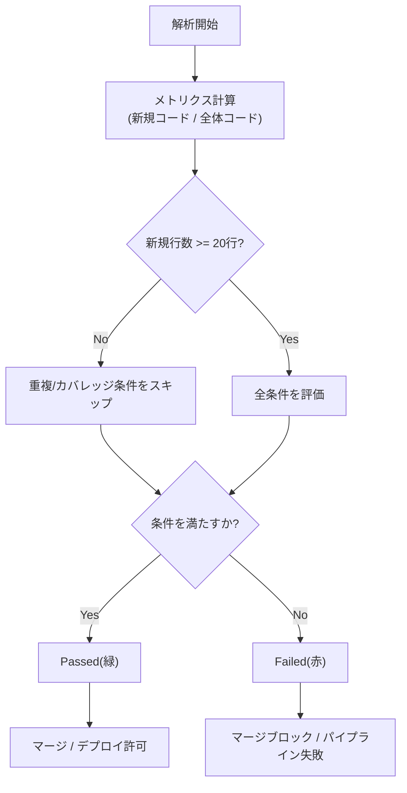
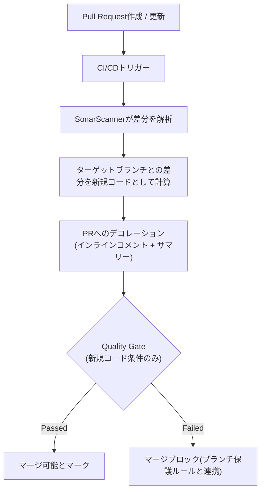
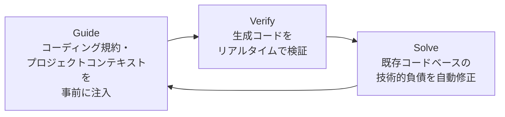

# SonarQube 完全解説ガイド ― 中級〜上級者向けステップバイステップ

> 本ガイドは、SonarSource社公式ドキュメント(docs.sonarsource.com)および公式プロダクトサイト(sonarsource.com)を主軸に、信頼できる複数の情報源を横断的にリサーチして作成した技術解説です。SonarQubeの基礎は理解している前提で、アーキテクチャ・品質モデルの内部構造・CI/CD統合・そして2026年時点でのAIエージェント統合(MCP Server / Agentic Analysis / Sonar Vortex)まで、実務で必要になる深さまで踏み込んで解説します。
>
> **執筆時点の最新情報**: SonarQube Serverの最新版は **2026.3**(Long-Term Active版は **2026.1 LTA**)です。SonarQubeは2025年からカレンダーバージョニング(年.リリース番号)を採用しており、旧来の「SonarQube」ブランドは「SonarQube Server」(セルフホスト)と「SonarQube Cloud」(旧SonarCloud、フルマネージドSaaS)に整理されています。各セクション末尾に参照元URLを明記していますので、最新の仕様変更は必ず一次情報でも確認してください。

---

## 目次

0. [SonarQubeとは何か ― AI時代における立ち位置](#0)
1. [プロダクトファミリーとエコシステム全体像](#1)
2. [アーキテクチャ徹底解説](#2)
3. [エディション比較 ― Community Build / Developer / Enterprise / Data Center / Cloud](#3)
4. [クイックスタート ― Dockerによる構築](#4)
5. [スキャナーの選択と設定](#5)
6. [品質モデルを理解する ― Clean Code Taxonomy と MQR Mode](#6)
7. [Issueの分類 ― Bug / Vulnerability / Code Smell / Security Hotspot](#7)
8. [Quality Profiles ― ルールセットの管理と継承](#8)
9. [セキュリティ分析の内部構造 ― Taint Analysis と SAST/SCA](#9)
10. [技術的負債とメトリクス ― SQALEモデル](#10)
11. [Clean as You Code と New Code Definition](#11)
12. [Quality Gates ― リリース可否の自動判定](#12)
13. [ブランチ分析とプルリクエスト分析](#13)
14. [CI/CD統合の実践 ― GitHub Actionsによる構築例](#14)
15. [IDE統合 ― SonarQube for IDE と Connected Mode](#15)
16. [AIエージェント時代のSonarQube ― MCP Server / Agentic Analysis / Sonar Vortex](#16)
17. [エンタープライズ機能 ― Portfolio・コンプライアンスレポート・Data Center Edition](#17)
18. [実践ベストプラクティス集](#18)
19. [トラブルシューティング](#19)
20. [まとめ](#20)
21. [参考文献・情報源一覧](#21)

---

<a id="0"></a>

## 0. SonarQubeとは何か ― AI時代における立ち位置

SonarQubeは、SonarSource社が開発する自動コードレビュー・静的解析(SAST: Static Application Security Testing)プラットフォームです。ソースコードを解析し、バグ(Bug)、脆弱性(Vulnerability)、セキュリティホットスポット(Security Hotspot)、コードスメル(Code Smell)を検出し、CI/CDパイプラインやIDE、DevOpsプラットフォームに統合することで、コードがマージ・リリースされる前に品質と安全性を検証します。40以上の言語・フレームワーク・IaCプラットフォームに対応し、7,000種類を超えるルールを保有しています。

重要なのは、SonarQubeが単なる「バグ検出ツール」ではなく、**組織のコーディング標準を自動的に強制するガバナンス基盤**として設計されている点です。近年は特に、生成AIやコーディングエージェント(Claude Code、GitHub Copilot、Cursorなど)が書いたコードの検証という新しい役割が急速に重要になっており、SonarSource社は「AI時代のコード検証レイヤー」を明確な戦略として打ち出しています。2026年のGartner® Magic Quadrant™でもLeaderとして評価されています。

**ブランド構成の整理(2024年以降の変更点)**:

| 旧称 | 現称 | 位置づけ |
|---|---|---|
| SonarQube | SonarQube Server | セルフホスト型(オンプレミス/プライベートクラウド) |
| SonarCloud | SonarQube Cloud | フルマネージドSaaS |
| SonarLint | SonarQube for IDE | IDE拡張機能(VS Code, IntelliJ, Visual Studio, Eclipse) |
| ― | SonarQube MCP Server | AIコーディングエージェント向けMCP(Model Context Protocol)連携 |

> 参考: [docs.sonarsource.com/sonarqube-server](https://docs.sonarsource.com/sonarqube-server) / [sonarsource.com/products/sonarqube](https://www.sonarsource.com/products/sonarqube/)

---

<a id="1"></a>

## 1. プロダクトファミリーとエコシステム全体像

SonarQubeの価値は単体の解析エンジンではなく、開発ライフサイクル全体を貫く「一貫した検証ループ」にあります。SonarSourceはこれを **SonarQube solution**(旧Sonar solution)と呼んでおり、IDE・CI/CDパイプライン・プルリクエストの3地点で同じ品質基準(Quality Profile / Quality Gate / New Code Definition)を適用します。



この図が示す通り、**IDEでの即時フィードバック → CI/CDでのブランチ/PR分析 → サーバー上でのダッシュボード管理**という3層構造が、SonarQubeの「Clean as You Code」方法論(後述)を支えています。project settings、New Code Definition、Quality Profileはすべてサーバー側で一元管理され、Connected Modeによってローカル解析にも同じ設定が反映されます。

**Connected Modeの動作**: SonarQube ServerとSonarQube for IDEを接続すると、Quality Gateの状態変化や新しいIssueの割り当てがIDEにスマート通知として届きます。これによりダッシュボードを開かなくても、開発者はエディタ内で組織の品質基準を意識できます。

> 参考: [Homepage | SonarQube Server](https://docs.sonarsource.com/sonarqube-server) / [Connected Mode](https://docs.sonarsource.com/sonarqube-server/user-guide/connected-mode.md)

---

<a id="2"></a>

## 2. アーキテクチャ徹底解説

SonarQube Serverは単一プロセスではなく、複数のサブプロセスが協調して動作する分散アーキテクチャです。中級以上のエンジニアがトラブルシューティングやキャパシティプランニングを行う上で、この内部構造の理解は不可欠です。

### 2.1 4つのコアコンポーネント

| コンポーネント | 役割 |
|---|---|
| **Web** | SonarQube ServerのユーザーインターフェースおよびREST APIを提供するプロセス |
| **Compute Engine (CE)** | スキャナーが送信した解析レポートを処理し、DBに保存するバックグラウンド処理系 |
| **Elasticsearch (ES)** | DBの内容をインデックス化し、高速な検索・フィルタリングを実現する検索エンジン |
| **Sonar (ラッパープロセス)** | 上記3プロセスの起動・死活監視を管理するJavaプロセス |

これらに加えて、**リレーショナルデータベース**(PostgreSQL、Oracle、Microsoft SQL Serverのいずれか)が、メトリクス・Issue・インスタンス設定・解析ジョブキューを永続化します。WebプロセスとCompute Engineの両方が、DBとElasticsearchへの書き込み時にデータ整合性を保証する設計になっています。



### 2.2 解析処理の流れ

1. CIパイプライン、またはローカル環境でSonarScannerがソースコードを静的解析し、解析レポート(バイナリ形式)を生成する
2. スキャナーはWebプロセスにレポートをアップロードし、DB上のジョブキューに登録される
3. Compute Engineがキューからジョブを取り出し、Issueのトラッキング(過去のIssueとの突合)、メトリクス計算、Quality Gateの評価を実行する
4. 結果はDBに保存され、Elasticsearchのインデックスが更新される(IssueIndexerなどが担当)
5. Web UI・API・PRデコレーション・IDE通知にその結果が反映される

### 2.3 本番環境向けリファレンスアーキテクチャ

公式ドキュメントでは、最大1,000万行(LOC)規模を「通常利用」と定義した非HA構成のリファレンスアーキテクチャが公開されています。構成要素は以下の通りです。

- SonarQube Server(Developer/Enterprise Edition)をインストールした仮想マシン + nginxによるHTTPSリバースプロキシ
- 専用ホスト上のPostgreSQLデータベース
- GitHub Actionsとの解析連携、GitHub.com経由の認証
- Prometheusによる監視、SMTPリレー経由のメール通知

日次のメインブランチスキャンと複数のプルリクエスト解析を「通常利用」と想定しており、それを超える頻度でのスキャンや、平均50万行を超える大規模リポジトリの解析には、Compute Engineへの追加のメモリ・CPUリソース割り当てが必要になります。可用性が重要な場合は、後述の **Data Center Edition** の利用が推奨されます。

### 2.4 Data Center Edition(高可用性構成)



Data Center Edition (DCE) のデフォルトトポロジーは、**アプリケーションノード2台 + 検索ノード(Elasticsearchクラスタ)3台**で構成され、この構成であればアプリケーションノード1台・検索ノード1台が同時に失われても稼働を継続できます。検索ノードはユニキャスト・ディスカバリでElasticsearchクラスタを形成します。ロードバランサーはユーザー側で用意する必要があります。

> 参考: [Server components](https://docs.sonarsource.com/sonarqube-server/server-installation/server-components-overview) / [Reference architecture (DE and EE)](https://docs.sonarsource.com/sonarqube-server/latest/setup-and-upgrade/reference-architectures/up-to-10m-loc/) / [DCE topology](https://docs.sonarsource.com/sonarqube-server/server-installation/data-center-edition/dce-topology) / [Compute Engine (DeepWiki)](https://deepwiki.com/SonarSource/sonarqube/12-compute-engine)

---

<a id="3"></a>

## 3. エディション比較 ― Community Build / Developer / Enterprise / Data Center / Cloud

SonarQubeは「オープンコア」モデルを採用しており、無料のオープンソース版から、エンタープライズ機能を含む商用版まで段階的にラインナップされています。2025年に「Community Edition」は**「Community Build」**に名称変更されました(機能・制限に変更はなく、名称のみの変更です)。

### 3.1 セルフホスト版(SonarQube Server)エディション比較

| 機能 | Community Build | Developer Edition | Enterprise Edition | Data Center Edition |
|---|---|---|---|---|
| ライセンス | 無料・LGPL-3.0(OSS) | 商用(有償) | 商用(有償) | 商用(有償) |
| 対応言語数 | 20以上 | 30以上(C, C++, Objective-Cなど追加) | Developerの全機能 + COBOL, RPG, Apexなど | Enterpriseと同一 |
| ブランチ分析 | 不可(メインブランチのみ) | 可能 | 可能 | 可能 |
| プルリクエスト分析・デコレーション | 不可 | 可能 | 可能 | 可能 |
| Taint Analysis(データフロー解析による脆弱性検出) | 不可 | 可能 | 可能 | 可能 |
| ポートフォリオ管理 | 不可 | 不可 | 可能 | 可能 |
| コンプライアンスレポート(OWASP/CWE等) | 不可 | 不可 | 可能 | 可能 |
| Prioritized Rules(特定ルールでQuality Gateを強制失敗) | 不可 | 不可 | 可能 | 可能 |
| レポート解析の並列処理 | 不可 | 不可 | 可能 | 可能 |
| 高可用性・水平スケーリング | 不可 | 不可 | 不可 | 可能(クラスタ構成) |
| ステージング/テスト環境用の追加ライセンス | 不可 | 不可 | 可能 | 可能 |

**選定の目安**: プルリクエストベースの開発フロー(現在ほぼすべてのチームが該当)を採用しているなら、Community BuildではPRデコレーションが利用できずダッシュボードを見に行く手間が発生するため、実質的にDeveloper Edition以上が最低ラインとなります。数百万行規模・複数事業部・厳格なコンプライアンス要件を持つ組織はEnterprise以上を検討する価値があります。

### 3.2 料金の目安(セルフホスト、行数課金モデル)

商用エディションは「1インスタンスあたり年額、解析対象の総行数(LOC)に応じて価格が変動する」モデルです。Developer Editionの開始価格のみSonarSourceの公式サイトで公開されており、Enterprise/Data Centerは個別見積もりです。以下はサードパーティのレビューサイトによる2026年時点の**目安**であり、正式な金額は必ず公式のPricingページで確認してください。

| エディション | 目安価格帯(年額) | 備考 |
|---|---|---|
| Community Build | 無料 | LOC上限なし |
| Developer Edition | 数百〜数千ドル程度(LOC次第) | 公式サイトで開始価格を公開 |
| Enterprise Edition | 1万ドル台後半〜(1M LOC目安) | 要問い合わせ |
| Data Center Edition | 数万〜10万ドル超 | インフラ費用は別途 |

### 3.3 SonarQube Cloud(フルマネージドSaaS)

| プラン | 概要 |
|---|---|
| Free | 最大50,000 LOC・5ユーザーまで。30以上の言語でブランチ分析・PR分析が可能(セルフホストのCommunity Buildより機能が豊富) |
| Team | 月額数十ドル程度からLOCに応じて段階的に増加 |
| Enterprise | Taint Analysis・SCA・コンプライアンスレポート・ポートフォリオビューを含むカスタム見積もり |

SonarQube Cloudの無料枠は、セルフホストのCommunity Buildにはないブランチ分析・PRデコレーションを含んでいる点が大きな違いです。インフラ管理を避けたい小規模チームには有力な選択肢になります。

> 参考: [SonarQube Compare Editions](https://www.sonarsource.com/blog/sonarqube-compare-editions/) / [SonarQube Pricing 2026(サードパーティ分析)](https://dev.to/rahulxsingh/sonarqube-pricing-in-2026-community-developer-enterprise-and-cloud-costs-explained-bdg) / [SonarQube Community vs Enterprise](https://dev.to/rahulxsingh/sonarqube-community-vs-enterprise-comparison-2j0d) / [SonarQube Community vs Developer](https://dev.to/rahulxsingh/sonarqube-community-vs-developer-edition-24oo) / [公式Pricing](https://www.sonarsource.com/plans-and-pricing/)

---

<a id="4"></a>

## 4. クイックスタート ― Dockerによる構築

本番環境では公式にDockerイメージまたはHelm Chart(Kubernetes/OpenShift)での構築が推奨されており、ZIPインストールは両者が利用できない場合の最終手段とされています。

```bash
# データ永続化用のボリュームを作成(bind mountではなくvolumeを使うこと。
# bind mountを使うとプラグインが正しく展開されない)
docker volume create --name sonarqube_data
docker volume create --name sonarqube_logs
docker volume create --name sonarqube_extensions

# 評価用: 組み込みH2データベースで起動(本番非推奨)
docker run -d --name sonarqube \
  -p 9000:9000 \
  -v sonarqube_data:/opt/sonarqube/data \
  -v sonarqube_logs:/opt/sonarqube/logs \
  -v sonarqube_extensions:/opt/sonarqube/extensions \
  sonarqube:community
```

起動後、`http://localhost:9000` にアクセスすると初期管理者アカウント `admin` / `admin` でログインできます(初回ログイン時にパスワード変更が要求されます)。

**本番構築時の重要な注意点**:

- SonarQubeは内部でElasticsearchプロセスを起動するため、rootユーザーでは実行できません。専用の非rootアカウントを用意する必要があります
- Elasticsearchのデータはデフォルトで `<SONARQUBE_HOME>/data` に保存されますが、本番環境ではI/O性能の高い専用ボリュームへの配置が推奨されます
- サーバーとデータベースは同一ネットワーク上の別ホストに配置し、全ホストで時刻同期(NTP等)を行うこと
- Microsoft SQL Serverを使う場合は `READ_COMMITTED_SNAPSHOT` を有効化しないとデッドロックのリスクがあります
- Java 21以降(2026.3時点。将来的にJDK必須化・Java 17サポート終了が予定されている)が必要です

> 参考: [Install the server](https://docs.sonarsource.com/sonarqube-server/10.0/setup-and-upgrade/install-the-server) / [General requirements 2026.1 LTA](https://docs.sonarsource.com/sonarqube-server/2026.1/analyzing-source-code/scanners/scanner-environment/general-requirements)

---

<a id="5"></a>

## 5. スキャナーの選択と設定

SonarScannerは「解析エンジンをCI/CDパイプラインまたはローカル環境で実行するクライアント」です。ビルドシステムごとに専用スキャナーが用意されており、**汎用のSonarScanner CLIを使うべきでないケース**を正しく理解することが、解析品質を落とさないための第一歩です。

| スキャナー | 対象 | 備考 |
|---|---|---|
| **SonarScanner for Maven** | Mavenプロジェクト | `mvn` ゴールとして実行。pom.xmlの情報を自動的に読み取るため設定が最小限で済む |
| **SonarScanner for Gradle** | Gradleプロジェクト | Gradleタスクとして実行。マルチモジュール構成にも対応 |
| **SonarScanner for .NET** | C# / VB.NET | C#/VB.NETの解析には**必須**。CLIでは代替不可 |
| **SonarScanner for NPM** | JavaScript/TypeScript(npm経由) | package.json連携 |
| **SonarScanner CLI** | 上記に該当しない全プロジェクト | C#/VB.NETは非対応。ARM(macOS/Linux)にも対応 |
| **SonarQube Scan GitHub Action** | GitHub Actions全般 | C, C++, Objective-C, Dartの公式スキャン方法 |
| **Azure DevOps Extension / Jenkins Extension** | 各CIツール | CIネイティブな統合 |

**重要な原則**: 「Maven/Gradle/.NETプロジェクトに汎用CLIを使うと解析品質が劣化する」と公式ドキュメントは明言しています。ビルドツール固有の情報(依存関係・コンパイル済みバイナリの場所・テストレポートパスなど)を活用できないためです。

### 5.1 JRE(Java Runtime)要件の注意点

スキャナー自体の実行にはJavaランタイムが必要です(解析対象コードの言語とは無関係)。多くのスキャナーは **JRE自動プロビジョニング**(`sonar.scanner.skipJreProvisioning=false` がデフォルト)に対応しており、通常は追加設定不要です。ただし、EDR(Endpoint Detection and Response)製品がスキャナーの動作を阻害するケースが報告されており、その場合はスキャナーの作業ディレクトリに限定した除外設定で対応することが推奨されています(アンチウイルス自体を無効化するのは非推奨)。

> 参考: [SonarScanner CLI](https://docs.sonarsource.com/sonarqube-server/analyzing-source-code/scanners/sonarscanner) / [SonarScanner for Maven](https://docs.sonarsource.com/sonarqube-server/analyzing-source-code/scanners/sonarscanner-for-maven) / [SonarScanner for Gradle](https://docs.sonarsource.com/sonarqube-server/analyzing-source-code/scanners/sonarscanner-for-gradle) / [General requirements](https://docs.sonarsource.com/sonarqube-server/10.8/analyzing-source-code/scanners/scanner-environment/general-requirements)

---

<a id="6"></a>

## 6. 品質モデルを理解する ― Clean Code Taxonomy と MQR Mode

ここからが中級者が本当に理解すべき「SonarQubeの頭脳」の部分です。SonarQubeは2024年以降、旧来の「Bug / Vulnerability / Code Smell」という**Type(種別)ベース**の分類に加えて、**Software Qualities(ソフトウェア品質特性)ベース**の新しい評価モデルを導入しました。この2つのモードを instance mode として切り替えられます。

### 6.1 Standard Experience vs MQR Mode

| 項目 | Standard Experience(従来型) | MQR Mode(Multi-Quality Rule、新方式) |
|---|---|---|
| Issue分類 | Bug / Vulnerability / Code Smell(1ルール=1種別) | Reliability / Security / Maintainability(1ルールが複数の品質特性に影響しうる) |
| 重大度スケール | Blocker, Critical, Major, Minor, Info | Blocker, High, Medium, Low, Info(品質特性ごとに個別設定) |
| 表現力 | 1つのルールに1つの重大度 | 1つのルールが「保守性=Medium、信頼性=Low、セキュリティ=Low」のように多面的に評価される |
| 切替方法 | Administration > Configuration > General Settings > Mode | 同上(いつでも相互に切替可能、Sonar wayは両モードに自動追随) |

たとえば、あるコードの不備が「バグも生みうるし、後々の保守も難しくする」場合、Standard Experienceでは「最も影響が大きい1種別」に押し込められますが、MQR Modeでは Reliability=Medium、Maintainability=Low のように**複数の軸で同時に評価**できます。これはAI生成コードのように「一見動くが将来的なリスクを内包するコード」を評価する上で特に有効です。

### 6.2 Clean Code Taxonomy(4つの属性カテゴリ)

MQR Modeの土台にあるのが **Clean Code Taxonomy** です。「良いコードとは何か」を4つの大カテゴリ・計14の具体属性に分解し、Issueが検出されるたびに「そのコードがどの属性を欠いているか」を紐づけます。

| カテゴリ | 意味 | 含まれる属性 |
|---|---|---|
| **Consistent(一貫性)** | フォーマットや命名が統一されている | Formatted, Conventional, Identifiable |
| **Intentional(意図の明確さ)** | コードが意図通りに、明確に、効率よく動く | Clear, Logical, Complete, Efficient |
| **Adaptable(適応性)** | 変更・拡張・テストがしやすい | Focused, Distinct, Modular, Tested |
| **Responsible(責任)** | 法令・信頼性・プライバシーへの配慮 | Lawful, Trustworthy, Respectful |

各Issueは、影響するClean Code属性 → 影響するSoftware Quality(Security/Reliability/Maintainability)という2段階のマッピングを経て評価されます。この設計思想は「コードスタイルの問題」と「本質的な品質問題」を同じ枠組みで語れるようにする狙いがあります。



> 参考: [MQR mode](https://docs.sonarsource.com/sonarqube-server/instance-administration/analysis-functions/instance-mode/mqr-mode) / [Changing instance modes](https://docs.sonarsource.com/sonarqube-server/10.8/user-guide/code-metrics/changing-modes) / [Software qualities 2026.1 LTA](https://docs.sonarsource.com/sonarqube-server/2026.1/quality-standards-administration/managing-rules/software-qualities) / [SonarQube glossary](https://docs.sonarsource.com/sonarqube-server/10.8/glossary)

---

<a id="7"></a>

## 7. Issueの分類 ― Bug / Vulnerability / Code Smell / Security Hotspot

Standard Experienceでの4分類を理解することは、MQR Modeを理解する上でも前提知識として重要です。

| 種別 | 定義 | 対応する Software Quality |
|---|---|---|
| **Bug** | 実行時に不具合を起こしうるコード上の欠陥 | Reliability |
| **Vulnerability** | 攻撃者に悪用されうるセキュリティ上の欠陥。即座の修正が必要 | Security |
| **Code Smell** | 実行時エラーには直結しないが、保守性を低下させる欠陥 | Maintainability |
| **Security Hotspot** | セキュリティ上重要だが、悪用可能かどうかは人間のレビューが必要な箇所 | Security(レビュー後に確定) |

### 7.1 Security HotspotとVulnerabilityの決定的な違い

これは実務でしばしば混同されるポイントです。**Vulnerability(脆弱性)は「問題が実際にある」と確信を持って報告されるもの**であるのに対し、**Security Hotspot(セキュリティホットスポット)は「注意深く見る必要がある箇所」であり、それ自体が問題であると確定していません**。たとえば、暗号鍵の生成コードは、鍵長が適切であれば安全ですが、不適切であれば脆弱性になります。この「文脈依存の判断」が必要な箇所がHotspotとして報告されます。

Hotspotのレビューステータスは4段階です。



> **2026年時点のトレンド**: SonarSourceは分類の単純化を進めており、従来Hotspotとして報告されていたルールの一部を、段階的にVulnerability(Standard Experience)/ Security(MQR Mode)として直接報告する方向に移行しています。今後、両者の境界線がさらに整理される可能性があるため、最新のリリースノートを確認してください。
>
> 参考: [Managing Security Hotspots](https://docs.sonarsource.com/sonarqube-server/user-guide/security-hotspots) / [What is the difference between a hotspot and a vulnerability?](https://www.bitegarden.com/differences-hotspots-vulnerabilities)

---

<a id="8"></a>

## 8. Quality Profiles ― ルールセットの管理と継承

**Quality Profile(品質プロファイル)** は「言語ごとに、どのルールを有効化するか」を定義する設定です。プロジェクトは言語ごとに1つのQuality Profileを持ちます。

SonarQubeは各言語に対して組み込みの **Sonar way** プロファイル(編集不可)を提供しており、これは「多くのプロジェクトに適用可能な標準的なルールセット」として設計されています。ただし公式ドキュメントでも「Sonar wayはあくまで出発点であり、プロジェクトが進むにつれてカスタマイズが必要になる」と明言されています。

### 8.1 コピー(Copy) vs 継承(Extend)

| 方式 | 挙動 | 用途 |
|---|---|---|
| **コピー(Copy)** | ある時点のルールセットを複製。以後は完全に独立し、元プロファイルの変更は反映されない | 完全に独自管理したい共通ベースプロファイルを作る場合 |
| **継承(Extend)** | 親プロファイルの有効ルールをすべて引き継ぎ、追加のルールのみ子プロファイルで有効化。親の変更(新ルール追加・非推奨ルールの無効化等)は自動的に子へ反映される | Sonar wayをベースに、プロジェクトごとの追加ルールを乗せたい場合(推奨) |

公式には「Sonar wayからの継承」が強く推奨されています。理由は、SonarQubeのアップグレードで新しいルールが追加されたり、ルールのデフォルト設定が変わったりした際に、継承関係にあれば自動的に反映されるためです。コピーの場合、新しいルールを自分で追いかけて手動反映する必要があります。



### 8.2 補足機能

- **Enterprise Edition以上**: ルールを「Prioritized(優先)」に指定でき、そのルールが引き起こすIssueが全体コードに存在する場合、Quality Gateを強制的に失敗させることができます
- **バックアップ/リストア**: カスタムプロファイルはXML形式でエクスポート/インポート可能で、複数のSonarQubeインスタンス間での移行に使えます
- **Changelog**: プロファイルへの変更履歴を追跡でき、「なぜ突然このIssueが出るようになったか」の原因調査に有用です

> 参考: [Understanding quality profiles](https://docs.sonarsource.com/sonarqube-server/quality-standards-administration/managing-quality-profiles/understanding-quality-profiles) / [Quality profiles 10.8](https://docs.sonarsource.com/sonarqube-server/10.8/instance-administration/analysis-functions/quality-profiles)

---

<a id="9"></a>

## 9. セキュリティ分析の内部構造 ― Taint Analysis と SAST/SCA

### 9.1 セキュリティルールの2分類

SonarQubeのセキュリティルールは内部的に2種類に分かれています。

| ルールタイプ | 検出対象 | 使用技術 |
|---|---|---|
| **Security-injection rules(インジェクション系)** | ユーザー入力(source)が検証・サニタイズされないまま危険な処理(sink)に到達するケース(SQLインジェクション、XSS等) | **Taint Analysis(汚染データ追跡解析)** |
| **Security-configuration rules(設定系)** | 不適切なパラメータでのセキュリティ関数呼び出し(弱い暗号アルゴリズム、古いTLSバージョン等)、権限チェックの欠落・順序誤り | パターンベースの静的解析 |

**Taint Analysis** は、信頼できない外部入力(source)からセンシティブな処理(sink)までのデータフローをコード全体にわたって追跡する技術です。この技術により、単一行のパターンマッチでは検出できない、複数関数・複数ファイルにまたがる注入系脆弱性を検出できます。この機能はDeveloper Edition以上でのみ有効です(Community Buildには含まれません)。SonarQube for IDEはConnected Mode時にこのTaint Vulnerability(注入系脆弱性)をサーバーから取得して表示します。

自社フレームワークのsource/sanitizer/validator/sinkを追加登録することで、Taint Analysisの検出範囲を拡張することも可能です(Security engine custom configuration機能)。

### 9.2 セキュリティ標準との対応付け

SonarQubeは2015年からCWE互換製品として認定されており、検出したIssueをOWASP Top 10、CWE Top 25などの業界標準にマッピングしてレポートできます(コンプライアンスレポートはEnterprise Edition以上)。

### 9.3 SonarQube Advanced Security(SCA・シークレット検出)

SonarQube Advanced Securityは、依存関係の脆弱性を検出するSCA(Software Composition Analysis)、コード中のシークレット(APIキー・パスワード等)を検出するSecrets Detection、IaC(Terraform/CloudFormation/Kubernetes等)のスキャンを含む上位セキュリティ機能群です。サプライチェーンセキュリティやコンプライアンスレポート(CycloneDX形式のVEXエクスポート等)を重視する組織向けに設計されています。

> 参考: [Security-related rules](https://docs.sonarsource.com/sonarqube-server/quality-standards-administration/managing-rules/security-related-rules) / [Managing Security Hotspots](https://docs.sonarsource.com/sonarqube-server/user-guide/security-hotspots) / [SonarQube Advanced Security](https://www.sonarsource.com/products/sonarqube/advanced-security/)

---

<a id="10"></a>

## 10. 技術的負債とメトリクス ― SQALEモデル

SonarQubeの技術的負債(Technical Debt)の計算は、**SQALE(Software Quality Assessment based on Lifecycle Expectations)** メソドロジーに基づいています。J.L. Letouzeyによって提唱されたこのモデルは、「技術的負債=すべての保守性Issueを修正するのに必要な見積もり時間の合計」として定量化します。

### 10.1 計算式

```
技術的負債 (Technical Debt / sqale_index)
  = すべての保守性Issueの修正見積時間の合計(分単位、1日=8時間換算)

技術的負債比率 (Technical Debt Ratio / sqale_debt_ratio)
  = 技術的負債 ÷ (1行あたりの開発コスト × 総行数)

  ※ 1行あたりの開発コストはデフォルトで30分(DB設定でカスタマイズ可能)
```

### 10.2 Maintainability Rating(保守性格付け)グリッド

技術的負債比率は、以下のデフォルトグリッドによってA〜Eの5段階評価に変換されます(このグリッドもカスタマイズ可能です)。

| 格付け | 技術的負債比率の範囲 | 意味 |
|---|---|---|
| **A** | 0% 〜 5% | すでに投じた開発工数の5%以下で全負債を解消できる |
| **B** | 6% 〜 10% | |
| **C** | 11% 〜 20% | |
| **D** | 21% 〜 50% | |
| **E** | 51%以上 | 大規模なリファクタリングが必要な状態 |

Reliability Rating・Security Ratingについては、比率ではなく「最も重大なIssueの重大度」によって決まります(例: Blocker Bugが1件でもあればReliability RatingはE)。

| 格付け | Reliability Ratingの条件例 |
|---|---|
| A | Bug 0件 |
| B | 少なくとも1件のMinor Bug |
| C | 少なくとも1件のMajor Bug |
| D | 少なくとも1件のCritical Bug |
| E | 少なくとも1件のBlocker Bug |

### 10.3 全体コード vs 新規コードの二重管理

ほとんどのメトリクスは「全体コード(Overall Code)」と「新規コード(New Code)」の両方で個別に計算されます。これは次章で解説する「Clean as You Code」方法論の中核であり、レガシーコードの負債を無理に一括返済させず、**新しく書くコードだけを高い基準で管理する**という思想の技術的な裏付けになっています。

> 参考: [Understanding measures and metrics](https://docs.sonarsource.com/sonarqube-server/latest/user-guide/code-metrics/metrics-definition/) / [Metric definitions 10.8](https://docs.sonarsource.com/sonarqube-server/10.8/user-guide/code-metrics/metrics-definition) / [Longitudinal Evaluation of OSS Maintainability(学術論文)](https://arxiv.org/pdf/2003.00447)

---

<a id="11"></a>

## 11. Clean as You Code と New Code Definition

**Clean as You Code** は、SonarQubeが提唱する品質改善方法論であり、「既存のレガシーコードを一括で直そうとするのではなく、新しく書く・変更するコードを常にクリーンに保つ」ことに焦点を当てます。これにより、数百万行規模のレガシーコードベースでも現実的に品質改善を進められます。

この方法論を技術的に支えるのが **New Code Definition(NCD、新規コード定義)** です。SonarQubeが「どこからどこまでを新規コードとみなすか」を決める設定で、グローバル・プロジェクト・ブランチの各レベルで設定できます。

### 11.1 New Code Definitionの4つのオプション

| オプション | 定義 | 利用可能レベル | 推奨シーン |
|---|---|---|---|
| **Previous Version(前バージョン)** | プロジェクトの現在のバージョンが上がってからの変更分 | グローバル/プロジェクト/ブランチ | 定期リリースを行うプロジェクト |
| **Number of Days(日数指定)** | 現在時刻からX日前までの変更(最大90日、デフォルト30日) | グローバル/プロジェクト/ブランチ | 継続的デリバリーを行うプロジェクト |
| **Reference Branch(参照ブランチ)** | 指定したブランチとのSCM差分 | プロジェクト/ブランチ | フィーチャーブランチ運用のプロジェクト(推奨) |
| **Specific Analysis(特定の解析)** | 過去の特定の解析時点からの差分(Web API経由のみ設定可) | ブランチ(Developer以上)/プロジェクト(Community Build) | 自動化されたバルクインポート時 |

**実務上の注意**: Number of Days以外のオプションを使う場合、マージ時にファストフォワードマージ(GitHubのSquash and MergeやRebase and Merge)を使うことが推奨されています。理由は、マージコミットを作ると、そのコミットのblame情報(誰がいつ書いたか)が最新化され、新規コードの判定が正しく機能するためです。

### 11.2 判定ロジック

Reference Branchオプションの場合、解析対象ブランチと参照ブランチの現在の状態をSCM情報(Gitのblame等)を使って比較します。それ以外のオプションでは「新規コード期間の開始日」を算出し、その日以降に変更された全ファイルの該当行が黄色くハイライトされます。そのハイライトされた行を主・副の発生箇所に持つIssueが「新規コードのIssue」として分類されます。



> 参考: [About new code](https://docs.sonarsource.com/sonarqube-server/latest/core-concepts/clean-as-you-code/about-new-code/) / [Setting up Clean as You Code](https://docs.sonarsource.com/sonarqube-server/10.7/project-administration/setting-up-clean-as-you-code) / [Defining new code](https://docs.sonarsource.com/sonarqube-server/10.5/project-administration/clean-as-you-code-settings/defining-new-code)

---

<a id="12"></a>

## 12. Quality Gates ― リリース可否の自動判定

**Quality Gate(品質ゲート)** は「このコードはリリース可能な状態か?」という問いに答えるための、一連の条件(Condition)の集合です。各条件は「新規コード」または「全体コード」のいずれかに対して定義され、分析結果がすべての条件を満たせば **Passed(緑)**、1つでも満たさなければ **Failed(赤)** と判定されます。

### 12.1 Sonar way Quality Gate(組み込み・デフォルト)のデフォルト条件

Sonar way Quality Gateは、意図的に「新規コードのみ」を対象とした条件で構成されています。これは前述のClean as You Code思想の直接的な実装です。

| 条件(新規コードに適用) | デフォルト閾値 | 備考 |
|---|---|---|
| Issue数 | 0件を超えたら失敗(推奨設定) | 新規コードを完全にクリーンに保つための最も厳格な条件 |
| Reliability Rating | A未満で失敗 | |
| Security Rating | A未満で失敗 | |
| Maintainability Rating | A未満で失敗 | |
| Security Hotspots Reviewed(レビュー済み率) | 100%未満で失敗 | 未レビューのHotspotが残っているとNG |
| Coverage(テストカバレッジ) | 設定値未満で失敗(調整可能) | |
| Duplicated Lines(重複率) | 設定値超過で失敗(調整可能) | |

> 補足: Reliability/Security/Maintainability Ratingの3条件は、格付けが「A未満」であることを許容する分、若干の技術的負債の混入を許してしまいます。より厳格に運用したい場合は「Issue数が0件を超えたら失敗」という条件を使うことで、新規コードを完全にIssueフリーに保てます。

### 12.2 Fudge Factor(判定の緩和機構)

小さな変更(数行のホットフィックス等)が重複率やカバレッジの条件で不当に失敗しないよう、**Fudge Factor** という仕組みがデフォルトで働きます。新規行数が20行未満の場合、重複行・カバレッジに関する条件判定はスキップされます。

### 12.3 評価フロー



### 12.4 運用上のポイント

- プロジェクトごとに異なるQuality Gateを割り当てられます(Webアプリとバックエンドで求めるカバレッジ水準を変える、など)
- Quality Gateへの変更権限は「Administer Quality Gates」権限を持つユーザーに限定されます。さらにEnterprise Edition以上では、特定のQuality Gateだけを特定の担当者グループに管理委譲できます
- Quality Gate状態の変化(Passed→Failed、Failed→Passed)はメール通知の対象にでき、PRデコレーション・CIパイプラインのステータスにも反映されます
- プルリクエスト解析では「新規コードに関する条件のみ」が適用されます(全体コードの条件は評価されません)

> 参考: [Understanding quality gates](https://docs.sonarsource.com/sonarqube-server/quality-standards-administration/managing-quality-gates/introduction-to-quality-gates) / [Quality gates 10.8](https://docs.sonarsource.com/sonarqube-server/10.8/instance-administration/analysis-functions/quality-gates)

---

<a id="13"></a>

## 13. ブランチ分析とプルリクエスト分析

Community Buildは**メインブランチ1本のみ**の解析に制限されており、フィーチャーブランチやプルリクエストの解析はDeveloper Edition以上(またはSonarQube Cloud)でのみ利用できます。

### 13.1 ブランチ分析とPR分析の違い

| 項目 | ブランチ分析 | プルリクエスト分析 |
|---|---|---|
| 対象 | 名前付きの長寿命/短命ブランチ | オープン中のプルリクエスト/マージリクエスト |
| Quality Gate適用範囲 | 新規コード条件 + 全体コード条件 | 新規コード条件のみ |
| 結果の表示場所 | SonarQube Server/Cloud のUI | PR/MRのコメント・チェックステータス(PRデコレーション) + SonarQube UI |
| New Code Definitionの基準 | 通常時はグローバル/プロジェクト設定に従う | ターゲットブランチとの差分が新規コード |

### 13.2 プルリクエスト解析のフロー



PRデコレーションは、対象のDevOpsプラットフォーム(GitHub, GitLab, Bitbucket, Azure DevOps)のブランチ保護ルールと組み合わせることで、「Quality Gateが赤のPRはマージできない」という強制力を持たせられます。GitHubの場合、Settings > Branches > Branch protection rulesでSonarQubeのステータスチェックを必須化します。

> 参考: [Pull request analysis](https://docs.sonarsource.com/sonarqube-server/discovering/code-analysis/pull-request-analysis.md) / [SonarQube Community vs Developer(PRデコレーション解説)](https://dev.to/rahulxsingh/sonarqube-community-vs-developer-edition-24oo)

---

<a id="14"></a>

## 14. CI/CD統合の実践 ― GitHub Actionsによる構築例

### 14.1 基本ワークフロー(GitHub Secretsの準備)

GitHub ActionsでSonarQube解析を行うには、まずリポジトリのSecretsに以下を登録します。

- `SONAR_TOKEN`: SonarQube上で発行したユーザートークンまたはプロジェクトトークン
- `SONAR_HOST_URL`: SonarQube Serverのアクセス先URL(SonarQube Cloudの場合は不要な場合あり)

### 14.2 公式SonarQube Scan GitHub Actionによる構成例

```yaml
# .github/workflows/sonarqube.yml
name: SonarQube Analysis

on:
  push:
    branches:
      - main
      - develop
      - 'releases/**'
  pull_request:
    types: [opened, synchronize, reopened]

jobs:
  sonarqube:
    runs-on: ubuntu-latest
    permissions:
      contents: read
      pull-requests: write   # PRへのコメント投稿に必要
    steps:
      - name: Checkout
        uses: actions/checkout@v6
        with:
          # シャロークローンを無効化(blame情報の欠落を防ぐため必須)
          fetch-depth: 0

      - name: SonarQube Scan
        uses: SonarSource/sonarqube-scan-action@v5
        env:
          SONAR_TOKEN: ${{ secrets.SONAR_TOKEN }}
          SONAR_HOST_URL: ${{ vars.SONAR_HOST_URL }}

      - name: SonarQube Quality Gate Check
        uses: SonarSource/sonarqube-quality-gate-action@master
        timeout-minutes: 5
        env:
          SONAR_TOKEN: ${{ secrets.SONAR_TOKEN }}
```

**設計上の重要ポイント**:

- `fetch-depth: 0` は必須級の設定です。シャロークローンのままだとSCMのblame情報が取得できず、「Missing blame information」エラーやNew Code Definitionの誤判定が発生します
- Quality Gateの成否をワークフローの成功/失敗に直結させたい場合、`sonarqube-quality-gate-action` を使うか、スキャナーに `-Dsonar.qualitygate.wait=true` を渡してポーリングさせます。ただし後者はワークフロー時間を延ばすため、PRへのステータス表示自体はPRデコレーションで十分な場合は不要です
- Developer Edition以上では、GitHub Actions上で実行されるスキャナーが**ブランチ・PRの情報を自動検出**するため、明示的なパラメータ指定は基本的に不要です
- モノレポ構成の場合は、プロジェクトごとにジョブを分割し、`projectBaseDir` でパスを指定します

### 14.3 主要CI/CDプラットフォームの対応状況

| プラットフォーム | 統合方式 |
|---|---|
| GitHub Actions | SonarQube Scan Action(公式) |
| GitLab CI/CD | GitLab統合(ネイティブMR分析対応) |
| Azure DevOps | 専用Extension(タスクとして提供) |
| Jenkins | 専用Plugin(Jenkins Extension、宣言的パイプライン対応) |
| Bitbucket Pipelines | Bitbucket Cloud統合 |
| CircleCI / 汎用CI | SonarScanner CLIを直接呼び出し |

> 参考: [Official SonarQube Scan(GitHub Marketplace)](https://github.com/marketplace/actions/official-sonarqube-scan) / [Adding analysis to GitHub Actions workflow](https://docs.sonarsource.com/sonarqube-server/10.5/devops-platform-integration/github-integration/adding-sonarqube-analysis-to-your-workflow) / [SonarQube Pull Request Comment Action](https://github.com/marketplace/actions/sonarqube-pull-request-comment)

---

<a id="15"></a>

## 15. IDE統合 ― SonarQube for IDE と Connected Mode

**SonarQube for IDE**(旧SonarLint)は、VS Code、IntelliJ IDEA、Visual Studio、Eclipseで動作する無料のIDE拡張です。単体でもオフライン解析が可能ですが、真価を発揮するのは **Connected Mode** でサーバーと接続したときです。

### 15.1 Connected Modeで同期される情報

- プロジェクトのQuality Profile(有効化されたルールセット)
- New Code Definition(何が新規コードか)
- サーバー側で解決済み(False Positive・Won't Fix等)とマークされたIssueの状態
- Quality Gateの変化・新規Issue割り当てのスマート通知

これにより、「IDEで警告が出るが、サーバー側では対応不要と判断済み」といった不整合を防ぎ、開発者はローカルとCI/CDで一貫した基準のもとで作業できます。

### 15.2 AIアシスタント連携ツール群(VS Code / Copilot等)

近年のSonarQube for IDEは、GitHub Copilot Agent ModeやCursor等のAI IDE向けに、自然言語で操作可能な専用ツール群を提供しています。たとえば「このファイルの新しい脆弱性を教えて」と自然言語で質問すると、SonarQube MCP Serverを介してCopilotがSonarQubeに問い合わせ、結果をエディタ内に返します。Connected Mode設定済みの環境であれば、ワンクリックでMCP Serverの設定を生成できる機能も用意されています。

> 参考: [SonarQube for IDE Homepage](https://docs.sonarsource.com/sonarqube-server) / [AI agents | VS Code](https://docs.sonarsource.com/sonarqube-for-vs-code/ai-capabilities/agents)

---

<a id="16"></a>

## 16. AIエージェント時代のSonarQube ― MCP Server / Agentic Analysis / Sonar Vortex

このセクションは2026年時点で最も動きの速い領域です。AIコーディングエージェントが書くコードの量が急増する中(SonarSourceは「AIエージェントがエンタープライズコードの40%以上の生成に関与している」と述べています)、SonarSourceは「検証(Verification)」を軸にした新製品群を矢継ぎ早に投入しています。これらはMitsuruさんのAIエンジニアリング業務と直接関わる領域です。

### 16.1 Agent Centric Development Cycle(ACDC)という設計思想

SonarSourceは、AIエージェント時代の開発ループを **Guide → Verify → Solve** の3段階として再定義しています。



### 16.2 SonarQube MCP Server

**SonarQube MCP Server** は、Model Context Protocol(MCP)を通じてAIコーディングエージェント(Claude Code、Cursor、GitHub Copilot、Windsurf、Gemini CLI等)にSonarQubeの機能をツールとして公開するサーバーです。「プロジェクトのQuality Gateステータスを問い合わせる」「依存関係のリスクを検索する(Advanced Security連携)」「Issueのステータスを更新する・False Positiveとしてマークする」といった操作を、エージェントが自然言語の指示から実行できます。

**提供形態は2種類**:

| 形態 | 対象 | 特徴 |
|---|---|---|
| ネイティブ管理型MCPエンドポイント | SonarQube Cloud | インストール不要、ゼロコンフィグ |
| Dockerコンテナ(セルフホスト) | SonarQube Server / ローカル開発 | `sonarsource/sonarqube-mcp` イメージで起動 |

2026.3リリースでは、SonarQube Server自体が `/mcp` エンドポイントをネイティブにホストできるようになり、外部のDockerコンテナを別途運用する必要がなくなりました。管理者はトークンベースの**グローバルkill-switch**でAIエージェントからのアクセスを一括制御できるため、セキュリティポリシー・情報統制の観点でも導入しやすい設計になっています。

```bash
# Claude CodeにSonarQube MCP Serverを追加する例
claude mcp add sonarqube \
  --env SONARQUBE_TOKEN=$SONAR_USER_TOKEN \
  --env SONARQUBE_URL=$SONAR_URL \
  -- docker run --init --pull=always -i --rm \
     -e SONARQUBE_TOKEN -e SONARQUBE_URL sonarsource/sonarqube-mcp
```

### 16.3 Sonar Vortex(旧: Agentic Analysis + Context Augmentation)

2026年6月30日、SonarSourceは **Sonar Vortex** を正式発表しました。これは、それまでベータ提供されていた2つの機能 ― **Sonar Context Augmentation**(コード生成前にプロジェクト固有の文脈を提供)と **SonarQube Agentic Analysis**(生成後のコードをリアルタイム検証)を統合した製品です。

| フェーズ | 機能 | 効果 |
|---|---|---|
| **Guide(生成前)** | Context Augmentation: クラス階層・呼び出しフロー・コーディング規約・依存関係の健全性情報をAIエージェントに事前注入(ASTと制御フロー解析によるセマンティックなコンテキスト取得、キーワードマッチではない) | トークン消費量を最大36%削減 |
| **Verify(生成後)** | Agentic Analysis: 直近のCIフルスキャンのコンテキストを再利用し、単一ファイルを超えたクロスファイルの問題を数秒で検証 | ソフトウェア欠陥を最大92%削減(公式発表値) |

技術的な肝は「CI相当の精度を、CIでは実現不可能な速さで提供する」二段階アプローチです。通常のCI実行時に解析コンテキストを収集・保存しておき、エージェントが検証を必要とするタイミングでそのコンテキストをオンデマンドに復元することで、単一/複数ファイルの検証を数秒で完了させます。

利用要件は、SonarQube Cloudの有償プラン(Teams/Enterprise)、直近のSonarQubeプロジェクトスキャン、MCP対応のAIコーディングツールです。

### 16.4 SonarQube Remediation Agent

同じく2026年6月30日にGA(一般提供開始)された **SonarQube Remediation Agent** は、Sonar Vortexとは逆方向 ― **既存コードベースに蓄積した技術的負債を自律的に解消する**エージェントです。SonarQubeダッシュボード上で過去のIssue(脆弱性・アーキテクチャの逸脱・保守性負債)をエージェントにアサインすると、非同期でバックグラウンド処理が走り、修正を生成 → Sonarの解析エンジンで検証 → マージ可能な状態のPRとして提出、という一連の流れを人手を介さず実行します。

### 16.5 AI CodeFix

**AI CodeFix** は、検出されたIssue(バグ・脆弱性)に対してLLMベースのワンクリック修正案を提示する機能です。2026.2リリース以降は**モデルアグノスティック化**され、単一プロバイダーへのロックインなしに複数のLLMプロバイダーを接続できるようになりました。対応言語はJava, JavaScript, TypeScript, Python, C#, C++で、拡大が続いています。

### 16.6 なぜこれが重要か

Addy Osmani氏(2026年6月)の言葉を借りれば、「無人で動くループは、無人でミスを重ねるループでもある」という課題意識が、これら一連の製品群の背景にあります。単一ファイルのリンターはファイル間の依存関係を理解できず、PRレビューやCIでの検出は「もう手遅れ」なタイミングです。SonarQubeのAIエージェント統合戦略は、**検証をエージェントのコーディングループの内側に移動させる**ことで、この構造的なギャップを埋めようとしています。

> 参考: [MCP Server: Agentic Code Assurance](https://www.sonarsource.com/products/sonarqube/mcp-server/) / [Agentic Analysis](https://www.sonarsource.com/products/sonarqube/agentic-analysis/) / [SonarQube MCP Server(GitHub)](https://github.com/SonarSource/sonarqube-mcp-server) / [Introducing Sonar Vortex and the SonarQube Remediation Agent](https://www.sonarsource.com/blog/introducing-sonar-vortex/) / [About the MCP Server(ACDC)](https://docs.sonarsource.com/agent-centric-development-cycle/developer-tools/mcp-server/about-the-mcp-server) / [SonarQube Server 2026.3 Release](https://www.sonarsource.com/products/sonarqube/whats-new/2026-3/) / [Announcing SonarQube Server 2026.3](https://www.sonarsource.com/blog/announcing-sonarqube-server-2026-3/)

---

<a id="17"></a>

## 17. エンタープライズ機能 ― Portfolio・コンプライアンスレポート・Data Center Edition

### 17.1 Portfolio(ポートフォリオ管理)

Enterprise Edition以上で利用できるPortfolio機能は、複数プロジェクトを束ねて組織横断的な健全性指標・リスクインサイトを可視化する機能です。数百プロジェクトを運用する大規模組織で、「全社的にどこにリスクが集中しているか」を経営層にも分かる形で提示できます。PDFレポートをオンデマンドまたはスケジュール実行でエクスポートし、監査対応にも利用できます。

### 17.2 コンプライアンスレポート

OWASP Top 10、CWE Top 25、NIST SSDF、STIG、CASAなど、複数の業界標準に基づく準拠状況レポートを自動生成できます。AI生成コードを含むコードベース全体が規制要件・データセキュリティ標準に適合しているかを継続的に検証する目的で設計されています。

### 17.3 Data Center Edition再訪

第2章で解説した高可用性クラスタ構成に加え、Data Center Editionは水平スケーリング(ノード追加によるCompute Engine処理能力の向上)を主目的としています。SonarQube Serverのダウンタイムが許容できない、CI/CDパイプラインのボトルネックになってはいけない、という組織に適しています。

> 参考: [SonarQube homepage(エンタープライズ機能)](https://www.sonarsource.com/products/sonarqube/) / [DCE topology](https://docs.sonarsource.com/sonarqube-server/server-installation/data-center-edition/dce-topology)

---

<a id="18"></a>

## 18. 実践ベストプラクティス集

1. **Quality Profileは必ずSonar wayから継承する**。ゼロから作る、あるいはコピーで独立させると、新しいルールの追随が手作業になり、負債化します。
2. **New Code DefinitionはReference Branchを基本にする**。フィーチャーブランチ運用が主流の現在、日数指定よりも意図が明確で、マージ後のIssueステータス引き継ぎもスムーズです。
3. **Quality Gateの「Issue数 > 0で失敗」条件を積極的に採用する**。Rating系条件(A未満で失敗)だけでは新規コードへの負債混入を防ぎきれません。
4. **`fetch-depth: 0` を必ず設定する**。シャロークローンによるblame情報欠落は、New Code Definitionの誤判定・PRデコレーション不具合の最頻出原因です。
5. **Community Buildで運用を始める場合でも、PRベース開発をしているなら早期にDeveloper Editionへの移行を検討する**。ダッシュボードを見に行く運用は形骸化しやすいというのが実務者の共通見解です。
6. **MQR Modeへの移行は計画的に行う**。既存のCustom Quality Gateは、モードを切り替えると更新アイコンが表示され、手動での確認・更新作業が必要になります。Sonar way Quality Gateは自動追随しますが、カスタムゲートは要注意です。
7. **AIコーディングエージェントを使うチームでは、MCP Serverの導入を早期に検討する**。Guide(コンテキスト注入)とVerify(リアルタイム検証)を組み合わせることで、PRレビューに到達する前に大半の問題を解消できます。
8. **Taint Analysisが必要な言語・プロジェクトでは、CommunityBuildの限界を正しく認識する**。SQLインジェクション等の注入系脆弱性の検出には商用エディションが前提です。

---

<a id="19"></a>

## 19. トラブルシューティング

| 症状 | 主な原因 | 対処 |
|---|---|---|
| `Missing blame information` / `Could not find ref` エラー | シャロークローン、Git submodule使用時の設定漏れ | CIの checkout ステップで `fetch-depth: 0` を設定し、全履歴を取得する |
| PRにコメントが投稿されない | GitHub Actionsの `permissions` に `pull-requests: write` が不足 / PRデコレーション機能がエディション上非対応 | ワークフローのpermissionsを確認 / Developer Edition以上かを確認 |
| Quality Gateが常にNot Computedと表示される | 解析が1回しか実行されていない(Quality Gateは2回目の解析から計算される)、またはNew Code Definitionが未設定 | 2回目の解析を実行する / New Code Definitionを設定する |
| Elasticsearchが起動しない | rootユーザーで実行している | 専用の非rootユーザーでSonarQubeを起動する |
| MS SQL Server利用時にデッドロックが多発する | `READ_COMMITTED_SNAPSHOT` が無効 | `ALTER DATABASE ... SET READ_COMMITTED_SNAPSHOT ON` を実行する |
| Maven/Gradleプロジェクトの解析結果が不完全 | SonarScanner CLIを誤用している | SonarScanner for Maven / Gradleに切り替える |
| MQR Mode切替後にカスタムQuality Gateの挙動が変わった | モードごとにメトリクス体系が異なるため、カスタムゲートの再確認が必要 | 更新アイコンが付いたゲート/条件を1つずつ確認・更新する |

> 参考: [Adding analysis to GitHub Actions workflow](https://docs.sonarsource.com/sonarqube-server/10.6/devops-platform-integration/github-integration/adding-analysis-to-github-actions-workflow) / [Install the server(DB要件)](https://docs.sonarsource.com/sonarqube-server/8.9/setup-and-upgrade/install-the-server)

---

<a id="20"></a>

## 20. まとめ

SonarQubeを単なる「Lintツールの延長」として捉えると、その真価の半分も引き出せません。本ガイドで解説した通り、SonarQubeの本質は以下の3層構造にあります。

1. **品質モデル層**: Clean Code Taxonomy と MQR Mode により、「何が良いコードか」を多面的・定量的に定義する
2. **ガバナンス層**: Quality Profile / Quality Gate / New Code Definition の組み合わせにより、Clean as You Codeという現実的な改善戦略を組織全体に強制する
3. **検証ループ層**: IDE・CI/CD・そして2026年以降はAIエージェントのコーディングループそのものに検証を埋め込み、問題がPRに到達する前に解消する

特に第16章で解説したMCP Server・Sonar Vortex・Remediation Agentは、AIエージェントが書くコード量が加速度的に増える中で、SonarQubeが「静的解析ツール」から「AI開発ガバナンス基盤」へと役割を拡張していることを示しています。今後もリリースサイクルが速いため、本ガイドの情報は定期的に一次情報(docs.sonarsource.com)と突き合わせて更新することを推奨します。

---

<a id="21"></a>

## 21. 参考文献・情報源一覧

| # | タイトル | URL |
|---|---|---|
| 1 | Homepage \| SonarQube Server | <https://docs.sonarsource.com/sonarqube-server> |
| 2 | Code Quality, Security & Static Analysis Tool with SonarQube | <https://www.sonarsource.com/products/sonarqube/> |
| 3 | Server components \| SonarQube Server | <https://docs.sonarsource.com/sonarqube-server/server-installation/server-components-overview> |
| 4 | Reference architecture (DE and EE) | <https://docs.sonarsource.com/sonarqube-server/latest/setup-and-upgrade/reference-architectures/up-to-10m-loc/> |
| 5 | DCE topology \| SonarQube Server | <https://docs.sonarsource.com/sonarqube-server/server-installation/data-center-edition/dce-topology> |
| 6 | Compute Engine (DeepWiki) | <https://deepwiki.com/SonarSource/sonarqube/12-compute-engine> |
| 7 | SonarQube Compare Editions | <https://www.sonarsource.com/blog/sonarqube-compare-editions/> |
| 8 | SonarQube Pricing in 2026(サードパーティ分析) | <https://dev.to/rahulxsingh/sonarqube-pricing-in-2026-community-developer-enterprise-and-cloud-costs-explained-bdg> |
| 9 | SonarQube Community vs Enterprise | <https://dev.to/rahulxsingh/sonarqube-community-vs-enterprise-comparison-2j0d> |
| 10 | SonarQube Community vs Developer Edition | <https://dev.to/rahulxsingh/sonarqube-community-vs-developer-edition-24oo> |
| 11 | SonarQube Review 2026(価格・レビュー) | <https://appsecsanta.com/sonarqube> |
| 12 | 公式Pricingページ | <https://www.sonarsource.com/plans-and-pricing/> |
| 13 | Install the server \| SonarQube Server 10.0 | <https://docs.sonarsource.com/sonarqube-server/10.0/setup-and-upgrade/install-the-server> |
| 14 | General requirements \| SonarQube Server 2026.1 LTA | <https://docs.sonarsource.com/sonarqube-server/2026.1/analyzing-source-code/scanners/scanner-environment/general-requirements> |
| 15 | SonarScanner CLI | <https://docs.sonarsource.com/sonarqube-server/analyzing-source-code/scanners/sonarscanner> |
| 16 | SonarScanner for Maven | <https://docs.sonarsource.com/sonarqube-server/analyzing-source-code/scanners/sonarscanner-for-maven> |
| 17 | SonarScanner for Gradle | <https://docs.sonarsource.com/sonarqube-server/analyzing-source-code/scanners/sonarscanner-for-gradle> |
| 18 | Understanding quality gates | <https://docs.sonarsource.com/sonarqube-server/quality-standards-administration/managing-quality-gates/introduction-to-quality-gates> |
| 19 | Software qualities \| SonarQube Server 2026.1 LTA | <https://docs.sonarsource.com/sonarqube-server/2026.1/quality-standards-administration/managing-rules/software-qualities> |
| 20 | Changing instance modes \| SonarQube Server 10.8 | <https://docs.sonarsource.com/sonarqube-server/10.8/user-guide/code-metrics/changing-modes> |
| 21 | MQR mode \| SonarQube Server | <https://docs.sonarsource.com/sonarqube-server/instance-administration/analysis-functions/instance-mode/mqr-mode> |
| 22 | SonarQube glossary \| SonarQube Server 10.8 | <https://docs.sonarsource.com/sonarqube-server/10.8/glossary> |
| 23 | Understanding quality profiles | <https://docs.sonarsource.com/sonarqube-server/quality-standards-administration/managing-quality-profiles/understanding-quality-profiles> |
| 24 | Security-related rules | <https://docs.sonarsource.com/sonarqube-server/quality-standards-administration/managing-rules/security-related-rules> |
| 25 | Managing Security Hotspots | <https://docs.sonarsource.com/sonarqube-server/user-guide/security-hotspots> |
| 26 | What is the difference between a hotspot and a vulnerability? | <https://www.bitegarden.com/differences-hotspots-vulnerabilities> |
| 27 | SonarQube Advanced Security | <https://www.sonarsource.com/products/sonarqube/advanced-security/> |
| 28 | Understanding measures and metrics | <https://docs.sonarsource.com/sonarqube-server/latest/user-guide/code-metrics/metrics-definition/> |
| 29 | Longitudinal Evaluation of OSS Maintainability(学術論文) | <https://arxiv.org/pdf/2003.00447> |
| 30 | About new code | <https://docs.sonarsource.com/sonarqube-server/latest/core-concepts/clean-as-you-code/about-new-code/> |
| 31 | Setting up Clean as You Code \| SonarQube Server 10.7 | <https://docs.sonarsource.com/sonarqube-server/10.7/project-administration/setting-up-clean-as-you-code> |
| 32 | Defining new code \| SonarQube Server 10.5 | <https://docs.sonarsource.com/sonarqube-server/10.5/project-administration/clean-as-you-code-settings/defining-new-code> |
| 33 | Official SonarQube Scan (GitHub Marketplace) | <https://github.com/marketplace/actions/official-sonarqube-scan> |
| 34 | Adding analysis to GitHub Actions workflow (10.5) | <https://docs.sonarsource.com/sonarqube-server/10.5/devops-platform-integration/github-integration/adding-sonarqube-analysis-to-your-workflow> |
| 35 | Adding analysis to GitHub Actions workflow (10.6) | <https://docs.sonarsource.com/sonarqube-server/10.6/devops-platform-integration/github-integration/adding-analysis-to-github-actions-workflow> |
| 36 | SonarQube Pull Request Comment (GitHub Marketplace) | <https://github.com/marketplace/actions/sonarqube-pull-request-comment> |
| 37 | MCP Server: Agentic Code Assurance for AI Agents | <https://www.sonarsource.com/products/sonarqube/mcp-server/> |
| 38 | Agentic Analysis: Autonomous AI-Driven Intelligence | <https://www.sonarsource.com/products/sonarqube/agentic-analysis/> |
| 39 | SonarQube MCP Server (GitHub) | <https://github.com/SonarSource/sonarqube-mcp-server> |
| 40 | Introducing Sonar Vortex and the SonarQube Remediation Agent | <https://www.sonarsource.com/blog/introducing-sonar-vortex/> |
| 41 | About the MCP Server \| AC/DC | <https://docs.sonarsource.com/agent-centric-development-cycle/developer-tools/mcp-server/about-the-mcp-server> |
| 42 | SonarQube Server 2026.3 Release: Unified Security & Reporting | <https://www.sonarsource.com/products/sonarqube/whats-new/2026-3/> |
| 43 | Announcing SonarQube Server 2026.3 | <https://www.sonarsource.com/blog/announcing-sonarqube-server-2026-3/> |
| 44 | LTA to LTA release notes \| SonarQube Server 2026.1 LTA | <https://docs.sonarsource.com/sonarqube-server/2026.1/server-update-and-maintenance/lta-to-lta-release-notes> |
| 45 | Release notes \| SonarQube Server(最新) | <https://docs.sonarsource.com/sonarqube-server/server-update-and-maintenance/release-notes> |
| 46 | AI agents \| VS Code \| Sonar Documentation | <https://docs.sonarsource.com/sonarqube-for-vs-code/ai-capabilities/agents> |
| 47 | Sonar Launches Sonar Vortex and SonarQube Remediation Agent (PR Newswire) | <https://www.prnewswire.com/news-releases/sonar-launches-sonar-vortex-and-sonarqube-remediation-agent-to-improve-agentic-effectiveness-302814173.html> |
| 48 | SonarQube Agentic Analysis Beta Program | <https://www.sonarsource.com/blog/agentic-analysis-beta/> |

---

*本ガイドは2026年7月時点の公開情報に基づいて作成されています。SonarQubeはリリースサイクルが速いプロダクトのため、恒久的な仕様として引用する際は必ず docs.sonarsource.com の最新版ドキュメントで裏取りしてください。*
