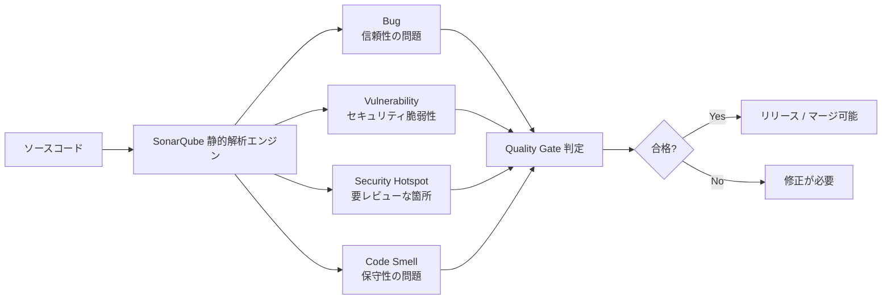
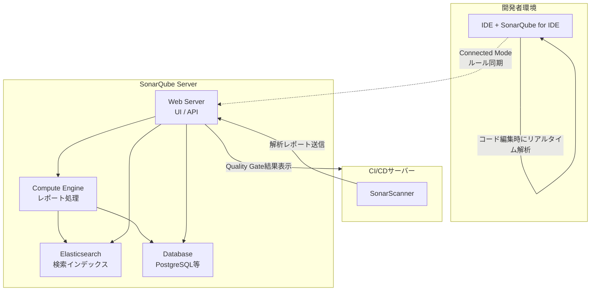
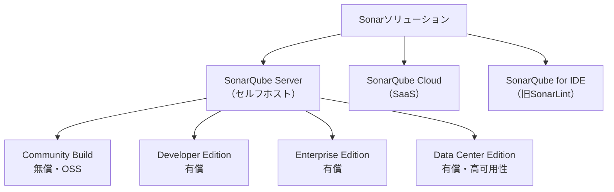
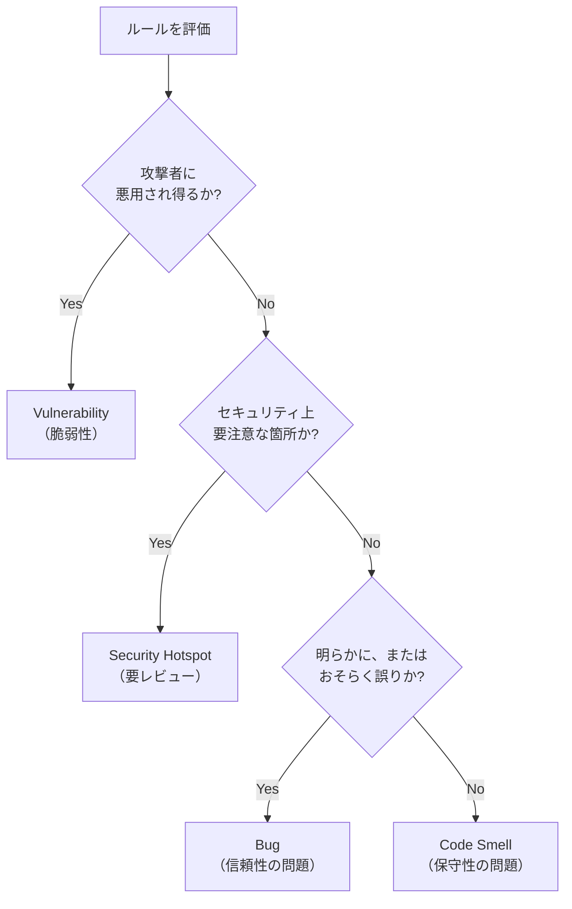
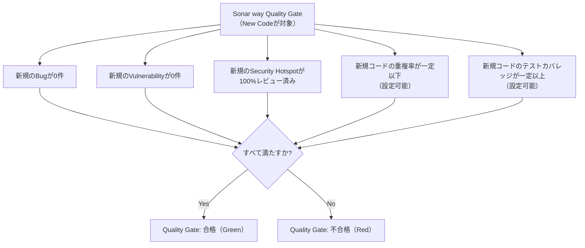
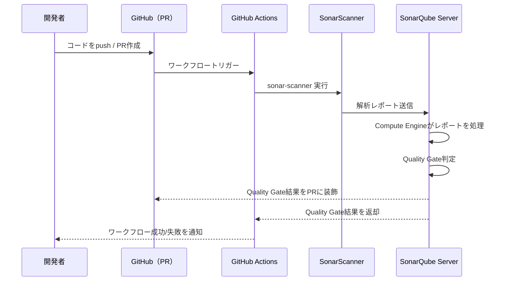
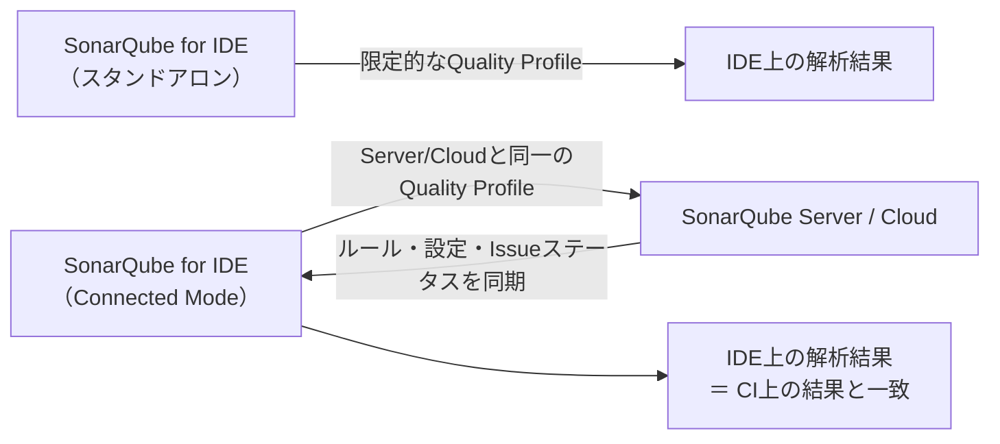

# SonarQube 完全ガイド ― コード品質を継続的に守るための初学者向けステップバイステップ解説

> 本ガイドは、SonarQube公式ドキュメント（docs.sonarsource.com）およびSonarSource公式サイト、GitHub公式リポジトリ、Docker Hub、その他信頼できる技術情報源を基に、2026年7月時点の最新情報として作成しています。各セクションの末尾に参照元URLを明記しています。

---

## 目次

1. [SonarQubeとは何か](#1-sonarqubeとは何か)
2. [基本用語・コンセプト集](#2-基本用語コンセプト集)
3. [アーキテクチャを理解する](#3-アーキテクチャを理解する)
4. [製品ファミリーとエディションの比較](#4-製品ファミリーとエディションの比較)
5. [コード品質モデル：Issueの4分類](#5-コード品質モデルissueの4分類)
6. [Quality ProfileとQuality Gate](#6-quality-profileとquality-gate)
7. [ハンズオン：Dockerでローカル環境を構築する](#7-ハンズオンdockerでローカル環境を構築する)
8. [初めてのプロジェクト分析（SonarScanner CLI）](#8-初めてのプロジェクト分析sonarscanner-cli)
9. [CI/CDパイプラインへの統合（GitHub Actions）](#9-cicdパイプラインへの統合github-actions)
10. [SonarQube for IDE と Connected Mode](#10-sonarqube-for-ide-と-connected-mode)
11. [2026年の最新動向：AI時代のSonarQube](#11-2026年の最新動向ai時代のsonarqube)
12. [導入のベストプラクティス](#12-導入のベストプラクティス)
13. [トラブルシューティングFAQ](#13-トラブルシューティングfaq)
14. [まとめ](#14-まとめ)
15. [参考文献・URL一覧](#15-参考文献url一覧)

---

## 1. SonarQubeとは何か

### 1.1 一言でいうと

SonarQubeは、SonarSource社が開発する**継続的コードインスペクション（Continuous Inspection）**のためのプラットフォームです。ソースコードを実行せずに解析する**静的解析（Static Analysis / SAST）**によって、バグ、脆弱性、セキュリティホットスポット、コードスメル（保守性の低いコード）を自動的に検出します。GitHub公式リポジトリでは、SonarQubeは新たに混入した問題をハイライトすることでアプリケーションの健全性を可視化し、Quality Gateという仕組みによって「クリーンなコード」を体系的に維持できるツールとして紹介されています。

### 1.2 何を検出するのか（4つの課題カテゴリ）

SonarQubeの品質モデルは、コードの問題を大きく4種類に分類します。詳細は第5章で解説しますが、まずは全体像を押さえておきましょう。



30以上のプログラミング言語（Java、JavaScript/TypeScript、Python、C#、C/C++、Go、Kotlin、Ruby、PHP、Swift、COBOL、Apexなど）とIaC（Infrastructure as Code）に対応しており、単なるLintツールではなく、技術的負債（Technical Debt）の可視化やセキュリティ標準（OWASP Top 10、CWE、MISRA C++など）への準拠状況の確認まで一気通貫でカバーします。

### 1.3 なぜ今SonarQubeが必要なのか（AI生成コード時代の文脈）

2026年に入り、SonarSourceはAIコーディングエージェント時代を強く意識した機能強化を続けています。公式の「What's new」ページによると、SonarQube Server 2026.2ではJava 25の新機能（Scoped Values、Flexible Constructor Bodiesなど）を狙い撃ちにしたルールが追加されており、これは特に「構文的には正しいが意味的には壊れている」AI生成コードを捕捉する目的が明言されています。また、Cursor、Claude Code、WindsurfといったAIネイティブなIDEとの統合も強化されており、AIが書いたコードを人間のコードと同じ基準で検証する「Verify AI Code」という文脈でSonarQubeが位置づけられています。

> **参考URL**
> - https://www.sonarsource.com/products/sonarqube/
> - https://github.com/SonarSource/sonarqube
> - https://www.sonarsource.com/products/sonarqube/whats-new/
> - https://docs.sonarsource.com/

---

## 2. 基本用語・コンセプト集

SonarQubeを学ぶ上で最初につまずきやすいのが独自用語です。公式Glossaryを基に、初学者が押さえるべき用語を整理しました。

| 用語 | 説明 |
|---|---|
| **Issue（イシュー）** | ルールに違反したコード箇所に対して発生する問題。Bug/Vulnerability/Code Smellのいずれかに紐づく |
| **Rule（ルール）** | 「守るべきコーディング規約」。ルールに反するとIssueが起票される |
| **Quality Profile（品質プロファイル）** | 言語ごとに「どのルールを適用するか」を定義する設定セット |
| **Quality Gate（品質ゲート）** | 「このプロジェクトはリリース可能か？」を判定する合否条件の集合 |
| **New Code（新規コード）** | 直近のバージョンや指定期間内に追加・変更されたコード。Clean as You Codeの中心概念 |
| **Overall Code（全体コード）** | 新規コードを含むプロジェクト全体のコード |
| **Clean as You Code（CaYC）** | 過去のコードを一度に直そうとせず、「今書いているコード」をクリーンに保つことで段階的に品質を改善していく方針 |
| **Technical Debt（技術的負債）** | Issueを解消するために必要な推定作業時間 |
| **SAST（Static Application Security Testing）** | ソースコードを実行せずに脆弱性を検出する静的解析セキュリティテスト |
| **Taint Analysis（テイント解析）** | ユーザー入力（ソース）が検証されずに危険な処理（シンク）へ到達する経路を追跡する高度な解析技術。SQLインジェクション等の検出に使用 |
| **Security Hotspot（セキュリティホットスポット）** | 「危険とは限らないが人間によるレビューが必要」なセキュリティ関連コード箇所 |
| **Scanner（スキャナー）** | CI/CDホストやローカル環境で動作し、コードを解析してサーバーへレポートを送信するプログラム（SonarScanner CLI、Maven、Gradle、.NET、NPM用など） |
| **Compute Engine（CE）** | サーバー側でスキャナーから受け取った解析レポートを処理し、データベースへ保存するバックグラウンド処理系 |
| **MQR Mode（Multi-Quality Rule Mode）** | 1つのルールが複数のソフトウェア品質（Security/Reliability/Maintainability）に影響し得るとする新しい評価モード |
| **Standard Experience** | 従来のBug/Vulnerability/Code Smellの3分類でルールを評価するモード |
| **Connected Mode** | SonarQube for IDE（旧SonarLint）をSonarQube Server/Cloudに接続し、ルールやQuality Profileを同期する仕組み |

> **参考URL**
> - https://docs.sonarsource.com/sonarqube-cloud/appendices/glossary
> - https://docs.sonarsource.com/sonarqube-server/10.8/glossary
> - https://docs.sonarsource.com/sonarqube-server/user-guide/about-new-code

---

## 3. アーキテクチャを理解する

SonarQube Serverは、大きく分けて「サーバー側の3つのプロセス」と「クライアント側のスキャナー」で構成されます。公式ドキュメントの「Server components」ページによれば、サーバーは以下のプロセスから成ります。

| コンポーネント | 役割 |
|---|---|
| **Web** | SonarQube ServerのユーザーインターフェースとWeb APIを提供する |
| **Elasticsearch（ES）** | データベースの内容をインデックス化し、UI上の検索を高速化する検索サーバー |
| **Compute Engine（CE）** | スキャナーが送信した解析レポートを処理し、結果をデータベースに保存するバックグラウンド処理プロセス |
| **Database** | プロジェクト設定、解析結果（メトリクス・Issue）、レポートのジョブキューを保存するRDB（本番環境ではPostgreSQL推奨） |
| **SonarScanner** | CI/CDサーバーやローカル環境で動作し、実際にソースコードを解析してレポートを生成・送信するクライアント |

これらを図で表すと以下のようになります。



この構成の要点は次の通りです。

1. **開発者はIDE上で「SonarQube for IDE」を使い、コミット前にリアルタイムでフィードバックを得る**（第10章で詳述）。
2. **CI/CDパイプライン上でSonarScannerが実際の解析を実行し、その結果（レポート）をWeb Serverへ送信する**。
3. **Compute Engineが非同期でレポートを処理し、Issueやメトリクスを計算してDatabaseへ書き込む**。
4. **Elasticsearchが検索用のインデックスを保持し、UI上の高速な検索・フィルタリングを支える**。
5. サーバーとデータベースは同一ネットワーク上に配置することが推奨される一方、スキャナーはネットワーク的に離れた場所（CIサーバー）で動作可能です。

> **参考URL**
> - https://docs.sonarsource.com/sonarqube-server/server-installation/server-components-overview
> - https://www.devopsschool.com/blog/what-is-sonarqube-and-how-it-works-an-overview-and-its-use-cases/
> - https://deepwiki.com/SonarSource/sonarqube/12-compute-engine
> - https://www.geeksforgeeks.org/devops/sonarqube/

---

## 4. 製品ファミリーとエディションの比較

SonarSourceの製品群は2024年10月末のリブランディングにより名称が整理されました。旧SonarLintは「SonarQube for IDE」、旧SonarCloudは「SonarQube Cloud」、無償の旧Community Editionは「SonarQube Community Build」という名称に変更されています（機能自体は同じで、名称変更が中心です）。

### 4.1 SonarQubeファミリーの全体像



### 4.2 セルフホストエディション比較表

| 項目 | Community Build | Developer Edition | Enterprise Edition | Data Center Edition |
|---|---|---|---|---|
| 料金 | 無償（OSS） | 有償（LOC課金） | 有償（LOC課金） | 有償（LOC課金・最も高額） |
| ブランチ解析 | 主ブランチのみ | ○ | ○ | ○ |
| Pull Request装飾 | 不可 | ○ | ○ | ○ |
| Taint Analysis（高度なSAST） | 制限あり | ○ | ○ | ○ |
| ポートフォリオ管理 | 不可 | 不可 | ○ | ○ |
| セキュリティコンプライアンスレポート | 不可 | 不可 | ○ | ○ |
| COBOL / RPG / Apex解析 | 不可 | 不可 | ○ | ○ |
| 高可用性・水平スケーリング | 不可 | 不可 | 不可 | ○ |
| 対応言語数の目安 | 20以上 | 24以上 | さらに拡張 | Enterpriseと同等＋HA |

技術ブログ「SonarQube Pricing in 2026」によれば、2026年時点の目安価格は、Developer Editionが約100,000行のコードで年間2,500ドル前後、Enterprise Editionが約100万行で年間16,000ドル前後、Data Center Editionが約1,000万行で年間100,000ドル前後とされています。ただし公式に一般公開されている価格はDeveloper Editionの一部のみで、Enterprise以上は個別見積もりが必要です。

### 4.3 「Community BuildかDeveloper Editionか」の判断基準

比較記事「SonarQube Community vs Developer Edition」では、判断基準を極めてシンプルに次のように整理しています。**チームがPull Requestベースの開発フローを使っているかどうか**が最大の分岐点です。Community Buildは主ブランチの解析にしか対応しないため、Issueがマージ後にしか可視化されません。これは「シフトレフト」というモダン開発の思想と逆行するため、PRレビューを日常的に行うチームではDeveloper Edition以上への移行が事実上必須とされています。

### 4.4 SonarQube Cloud（旧SonarCloud）

SonarQube Cloudはフルマネージドなクラウド版で、インフラ運用の負荷なしにSonarQube Serverと同等の解析能力を得られます。無料枠は最大50,000行・5ユーザーまでで、GitHub・GitLab・Bitbucket・Azure DevOpsと直接連携できます。パブリック（OSS）プロジェクトであれば常に無料という特徴もあります。

> **参考URL**
> - https://www.sonarsource.com/blog/sonarqube-compare-editions/
> - https://www.almtoolbox.com/blog/sonarqube-editions-differences/
> - https://dev.to/rahulxsingh/sonarqube-pricing-in-2026-community-developer-enterprise-and-cloud-costs-explained-bdg
> - https://dev.to/rahulxsingh/sonarqube-community-vs-developer-edition-24oo
> - https://dev.to/rahulxsingh/sonarqube-community-vs-enterprise-comparison-2j0d
> - https://appsecsanta.com/sonarqube

---

## 5. コード品質モデル：Issueの4分類

SonarQubeのルールエンジンは、各ルールを「そのコードは何が問題なのか」という一連の質問に答える形で4種類に分類します。公式ドキュメント「SonarQube rules」に基づく分類ロジックは次の通りです。



### 5.1 各分類の意味

| 種別 | 意味 | 期待される精度 |
|---|---|---|
| **Bug** | 実行時に意図しない挙動やクラッシュを引き起こす可能性が高いコード | 誤検知（False Positive）ゼロを目標 |
| **Vulnerability** | 攻撃者に悪用され得るセキュリティ上の欠陥（SQLインジェクション等） | 真陽性率80%以上を目標 |
| **Security Hotspot** | 危険とは断定できないが、人間によるレビューが必要なセキュリティ関連コード（例：Cookieの`HttpOnly`フラグ未設定） | レビュー後80%以上が「問題なし」と解決されることを想定 |
| **Code Smell** | バグでも脆弱性でもないが、保守性を下げる可能性のあるコード（重複、過度な複雑度など） | 誤検知ゼロを目標 |

### 5.2 Vulnerability と Security Hotspot の違い

この2つは初学者が最も混同しやすい概念です。公式ドキュメントの説明を要約すると、**インジェクション系のルール（SQLインジェクションなど）はほぼ確実に修正が必要**なためVulnerabilityに分類されます。一方、Cookieの`HttpOnly`フラグのような「追加の防御層」は、実装できない・関係ないケースもあり得るため、機械的に「問題」と断定できません。そこでSecurity Hotspotとして起票し、開発者が文脈を踏まえてレビュー・判断する仕組みになっています。

> 補足：Sonar Cloudの最新ドキュメントでは、分類の簡素化を目的に「Security Hotspotを段階的にVulnerabilityへ統合していく」方針が示されています。今後、Hotspotという呼び方自体が縮小していく可能性があります。

### 5.3 MQR Mode と Standard Experience

2024年以降、SonarQubeには2つの評価モードが存在します。

| モード | 特徴 |
|---|---|
| **Standard Experience** | 従来型。ルールは「Bug／Vulnerability／Code Smell」のいずれか1種類に分類される |
| **MQR Mode（Multi-Quality Rule Mode）** | 1つのルールが複数のソフトウェア品質（Security／Reliability／Maintainability）に同時に影響し得るとする、より柔軟な新モデル |

MQR Modeでは「Bug」は「Reliability Issue」、「Code Smell」は「Maintainability Issue」、「Vulnerability」は「Security Issue」という呼称に対応します。どちらのモードを使うかはインスタンス単位で設定可能です。

> **参考URL**
> - https://docs.sonarsource.com/sonarqube-server/quality-standards-administration/managing-rules/rules
> - https://docs.sonarsource.com/sonarqube-cloud/standards/managing-rules/rules
> - https://docs.sonarsource.com/sonarqube-server/2026.1/quality-standards-administration/managing-rules/security-related-rules
> - https://docs.sonarsource.com/sonarqube-server/10.8/user-guide/rules/security-related-rules

---

## 6. Quality ProfileとQuality Gate

### 6.1 Quality Profile（品質プロファイル）とは

Quality Profileは「どの言語に対してどのルールを有効化するか」を定義する設定です。デフォルトでは、SonarSourceが保守する`Sonar way`という組み込みプロファイルが使われ、これはベストプラクティスを反映した推奨設定として維持されています。組織のニーズに応じてルールを追加・除外したカスタムプロファイルを作成することも可能です。

### 6.2 Quality Gate（品質ゲート）とは

Quality Gateは「このプロジェクトはリリース可能か？」という問いにYes/Noで答えるための、メトリクスベースの合否条件セットです。GitHub公式リポジトリのREADMEでも、Quality Gateを設定することでClean Codeを達成し、体系的に品質を改善できると説明されています。

条件は「New Code（新規コード）」または「Overall Code（全体コード）」のいずれかに紐づけて設定します。デフォルトの`Sonar way`品質ゲートはNew Codeに焦点を当てており、次のような条件で構成されます。



### 6.3 なぜ「New Code」に焦点を当てるのか（Clean as You Code）

数年〜数十年運用されてきたレガシーコードベースをいきなり全て解析すると、大量のIssueが一度に検出され、多くの場合「対応しきれない」という無力感につながります。公式ドキュメントの「Clean as You Code」の考え方は、**「過去のコードは過去のコードとして受け入れ、今日書いているコード（New Code）だけは常にクリーンに保つ」**というものです。これにより、開発者は自分が書いたコードにだけ責任を持てばよく、心理的な負担が大きく下がります。同時に、新規コードを書く過程で既存コードに触れる機会も自然と増えるため、結果的にコードベース全体の品質も緩やかに改善されていきます。

New Codeの定義方法には以下の4種類があります。

| 定義方法 | 説明 |
|---|---|
| **Previous version（前バージョン比較）** | 直前のリリースバージョンからの差分をNew Codeとする（SonarQube Serverのデフォルト） |
| **Number of days（日数指定）** | 直近N日間に追加・変更されたコードをNew Codeとする |
| **Specific analysis（特定の解析基準）** | 特定の解析日時を基準点とする |
| **Reference branch（基準ブランチ比較）** | 対象ブランチと基準ブランチ（例：`main`）の差分をNew Codeとする。トランクベース開発やPR作成前のブランチ解析に有効 |

### 6.4 Sonar way for AI Code

2026年のアップデートで、AIが生成したコードを対象とした専用の組み込みQuality Gateである`Sonar way for AI Code`が追加されました。7つの条件から構成され、AI生成コードに対する「AI Code Assurance」を達成するための推奨ゲートとして案内されています。AI生成コードが新規コードの範囲外（＝古いコードの中）に存在するケースもあるため、全体コードに対するカバレッジ条件を追加することも推奨されています。

> **参考URL**
> - https://www.sonarsource.com/blog/clean_coding-quality_profile_quality_gate_guidance/
> - https://docs.sonarsource.com/sonarqube-server/quality-standards-administration/managing-quality-gates/introduction-to-quality-gates
> - https://docs.sonarsource.com/sonarqube-server/user-guide/about-new-code
> - https://docs.sonarsource.com/sonarqube-server/10.8/instance-administration/analysis-functions/quality-gates
> - https://github.com/SonarSource/sonarqube

---

## 7. ハンズオン：Dockerでローカル環境を構築する

ここからは実際に手を動かしていきます。公式の「Try out SonarQube Server」ガイドとDocker Hub公式イメージの情報を基に、最も手軽な導入方法であるDockerでのセットアップを解説します。

> **前提条件**：Docker Engine 20.10以上がインストールされていること。SonarQube ServerのDockerイメージはamd64アーキテクチャとApple Silicon（arm64）の両方に対応しています。

### ステップ1：Dockerが利用可能か確認する

```bash
docker --version
```

### ステップ2：SonarQubeコンテナを起動する（評価用・組み込みH2データベース）

最も簡単な起動方法は、組み込みのH2データベースを使う評価用構成です。ただし、これは検証目的専用で、本番運用には適しません。

```bash
docker run -d --name sonarqube \
  -e SONAR_ES_BOOTSTRAP_CHECKS_DISABLE=true \
  -p 9000:9000 \
  sonarqube:lts-community
```

- `SONAR_ES_BOOTSTRAP_CHECKS_DISABLE=true` は、ローカル評価環境でElasticsearchの厳格な起動時チェックを緩和するための設定です。
- `-p 9000:9000` により、コンテナ内のポート9000をホストのポート9000に公開します。
- `sonarqube:lts-community` は最新のLTA（Long-Term Active）版Community Buildイメージを指すタグです。

コンテナの起動には環境によって60〜120秒程度かかります。ログを確認する場合は以下を実行してください。

```bash
docker logs -f sonarqube
```

ログに `SonarQube is operational` と表示されれば起動完了です。

### ステップ3：本番想定の構成（PostgreSQL併用）

継続的に使う場合は、外部データベース（PostgreSQLが公式推奨）を併用したDocker Compose構成を用います。

```yaml
version: "3"
services:
  sonarqube:
    image: sonarqube:lts-community
    depends_on:
      - db
    environment:
      SONAR_JDBC_URL: jdbc:postgresql://db:5432/sonar
      SONAR_JDBC_USERNAME: sonar
      SONAR_JDBC_PASSWORD: sonar
    ports:
      - "9000:9000"
    volumes:
      - sonarqube_data:/opt/sonarqube/data
      - sonarqube_extensions:/opt/sonarqube/extensions
      - sonarqube_logs:/opt/sonarqube/logs
  db:
    image: postgres:16
    environment:
      POSTGRES_USER: sonar
      POSTGRES_PASSWORD: sonar
      POSTGRES_DB: sonar
    volumes:
      - postgresql_data:/var/lib/postgresql/data

volumes:
  sonarqube_data:
  sonarqube_extensions:
  sonarqube_logs:
  postgresql_data:
```

```bash
docker compose up -d
```

> **注意**：公式ドキュメントは、ボリュームを使わず`bind mount`を使うとプラグインが正しく反映されない場合があると警告しています。必ず`docker volume`を使った構成にしてください。また、`docker system prune`や`docker volume prune`を誤って実行するとデータベースのデータが失われる可能性があるため注意が必要です。

### ステップ4：Webブラウザでアクセスする

ブラウザで以下のURLへアクセスします。

```
http://localhost:9000
```

### ステップ5：初回ログインとパスワード変更

デフォルトの管理者アカウントでログインします。

| 項目 | 値 |
|---|---|
| ログインID | `admin` |
| 初期パスワード | `admin` |

初回ログイン時、SonarQubeから強制的にパスワード変更を求められます。強力なパスワードを設定し、必ず保存してください（後ほどスキャナー用トークンを発行する際に必要になります）。

### ステップ6：プロジェクトを作成する

1. ダッシュボードから **Create new project** を選択します。
2. **Project key**（プロジェクトを一意に識別するキー）と **Display name**（表示名）を入力します。
3. **Set up** をクリックして次のステップへ進みます。

### ステップ7：解析トークンを発行する

プロジェクト分析にはSonarQubeへの認証用トークンが必要です。UI上のガイドに従って **Generate a token** を実行し、発行されたトークンを安全な場所に控えます（このトークンは再表示できないため注意してください）。

> **参考URL**
> - https://docs.sonarsource.com/sonarqube-server/try-out-sonarqube
> - https://hub.docker.com/_/sonarqube
> - https://docs.sonarsource.com/sonarqube-server/server-installation/from-docker-image/installation-overview
> - https://docs.sonarsource.com/sonarqube-community-build/server-installation/from-docker-image/installation-overview
> - https://dev.to/rahulxsingh/how-to-install-sonarqube-with-docker-659
> - https://medium.com/@s.klop/quick-start-local-sonarqube-setup-with-docker-for-js-ts-projects-2c1f19c24567

---

## 8. 初めてのプロジェクト分析（SonarScanner CLI）

言語やビルドツールに応じて、SonarQubeは複数のスキャナーを提供しています。

| ビルド環境 | 推奨スキャナー |
|---|---|
| 汎用（言語不問） | SonarScanner CLI |
| Maven（Java） | SonarScanner for Maven |
| Gradle（Java/Kotlin） | SonarScanner for Gradle |
| .NET / C# | SonarScanner for .NET |
| npm（JavaScript/TypeScript） | SonarScanner for NPM |
| C / C++ / Objective-C | SonarQube Scan for C and C++（ビルドラッパー使用） |

### 8.1 SonarScanner CLIによる解析（汎用パターン）

プロジェクトのルートディレクトリに `sonar-project.properties` を作成します。

```properties
sonar.projectKey=my-first-project
sonar.projectName=My First Project
sonar.sources=src
sonar.sourceEncoding=UTF-8
sonar.host.url=http://localhost:9000
```

続いてスキャナーを実行します（環境変数にトークンを渡す方式を推奨します）。

```bash
export SONAR_TOKEN=（ステップ7で発行したトークン）
sonar-scanner
```

### 8.2 解析結果を確認する

解析が成功すると、ターミナルに解析成功メッセージと結果確認用URLが表示されます。ブラウザで `http://localhost:9000` にアクセスし、対象プロジェクトを開くと、以下の情報が確認できます。

- **Bugs / Vulnerabilities / Code Smells** の件数と重要度別内訳
- **Security Hotspots** のレビュー状況
- **Coverage（テストカバレッジ）**（別途カバレッジレポートを連携した場合）
- **Duplications（重複コード率）**
- **Quality Gate** の合否ステータス（画面左上に大きく表示）

初回解析は「現在のコード全体」を測定するベースラインとなります。第6章で説明した通り、以降はこの時点を起点とした**New Code**にフォーカスして改善を進めていくのが推奨されるアプローチです。

> **参考URL**
> - https://docs.sonarsource.com/sonarqube-server/try-out-sonarqube
> - https://docs.sonarsource.com/sonarqube-server/2025.5/server-installation/from-docker-image/installation-overview
> - https://www.geeksforgeeks.org/devops/sonarqube/

---

## 9. CI/CDパイプラインへの統合（GitHub Actions）

ローカルでの単発解析だけでなく、CI/CDパイプラインに組み込むことでSonarQubeの真価が発揮されます。ここではGitHub Actionsを例に解説します。

### 9.1 全体の流れ



### 9.2 GitHub Secretsの設定

GitHubリポジトリの **Settings > Secrets and variables > Actions** から、以下を登録します。

| Secret名 | 内容 |
|---|---|
| `SONAR_TOKEN` | SonarQubeで発行した解析用トークン |
| `SONAR_HOST_URL`（Variableとして設定可） | SonarQube ServerのURL（SonarQube Cloudの場合は不要） |

### 9.3 ワークフローファイルの例

公式GitHub Marketplaceで提供されている `SonarSource/sonarqube-scan-action` を使う、最もシンプルな構成例です。

```yaml
name: SonarQube Analysis

on:
  push:
    branches:
      - main
  pull_request:
    types: [opened, synchronize, reopened]

jobs:
  sonarqube:
    name: SonarQube Scan
    runs-on: ubuntu-latest
    steps:
      - name: Checkout repository
        uses: actions/checkout@v4
        with:
          fetch-depth: 0  # SCM blame情報のためシャロークローンを無効化

      - name: SonarQube Scan
        uses: SonarSource/sonarqube-scan-action@v8
        env:
          SONAR_TOKEN: ${{ secrets.SONAR_TOKEN }}
          SONAR_HOST_URL: ${{ vars.SONAR_HOST_URL }}
```

> **重要**：`actions/checkout` の `fetch-depth: 0` は必須に近い設定です。浅いクローン（shallow clone）のままだと、SCM blame情報の取得に失敗し `Missing blame information` のようなエラーが発生することがあります。

### 9.4 Quality Gateでマージをブロックする

公式ドキュメントでは、Quality Gateの結果をもとにPRのマージをブロックする方法として2つのアプローチが紹介されています。

1. **SonarQube Quality Gate Check Action** を使い、GitHub側のステータスチェックとしてQuality Gateの合否を反映する
2. スキャナー実行時に `-Dsonar.qualitygate.wait=true` を指定し、Quality Gateの計算が終わるまでスキャンステップ自体を待機・失敗させる（ただしワークフロー時間が延びるため、必要な場面に限定して使うことが推奨されています）

```yaml
      - name: SonarQube Quality Gate check
        uses: SonarSource/sonarqube-quality-gate-action@v1
        timeout-minutes: 5
        env:
          SONAR_TOKEN: ${{ secrets.SONAR_TOKEN }}
```

GitHub側では **Settings > Branches > Branch protection rules** で、このステータスチェックを必須項目として設定することで、Quality Gateが赤（不合格）のPRを物理的にマージ不可能にできます。

### 9.5 エディションによる制約に注意

Community Buildは複数ブランチの解析に対応していないため、`on.push.branches` を主ブランチのみに限定し、`on.pull_request` トリガーは使用しません。ブランチ解析・PR解析・PR装飾を行うには、Developer Edition以上（またはSonarQube Cloud）が必要です。

> **参考URL**
> - https://docs.sonarsource.com/sonarqube-server/analyzing-source-code/ci-integration/github-actions
> - https://github.com/marketplace/actions/official-sonarqube-scan
> - https://github.com/SonarSource/sonarqube-scan-action
> - https://docs.sonarsource.com/sonarqube-server/2026.2/analyzing-source-code/ci-integration/github-actions
> - https://docs.sonarsource.com/sonarqube-community-build/devops-platform-integration/github-integration/adding-analysis-to-github-actions-workflow

---

## 10. SonarQube for IDE と Connected Mode

### 10.1 SonarQube for IDE（旧SonarLint）とは

SonarQube for IDEは、無償で提供されるIDE拡張機能です。公式サイトの説明では「スペルチェッカーのように、コードを書いている最中にリアルタイムで問題をハイライトする」ツールと表現されています。VS Code、IntelliJ（JetBrains全般）、Eclipse、Visual Studioに対応し、さらにCursor・Windsurf・TraeといったVS Codeベースの AIネイティブIDEでも動作します。

### 10.2 対応IDEと言語

| IDE | 特徴 |
|---|---|
| VS Code | Cursor・Windsurf・Trae等のフォークでも動作 |
| JetBrains系（IntelliJ IDEA, PyCharm, WebStorm, GoLand, CLion, PHPStorm, Rider, Android Studio, RubyMine） | 主要JetBrains製品全般をカバー |
| Eclipse | Eclipse専用の拡張機能を提供 |
| Visual Studio | .NET開発者向けの包括的な統合 |

標準構成で20以上の言語をリアルタイム解析でき、Connected Modeを使うことでCOBOL・Apex・PL/SQLなど、より専門的な言語にも対応範囲を拡張できます。

### 10.3 Connected Modeとは何か、なぜ重要か

Connected ModeなしでSonarQube for IDEを使う場合、IDE側はデフォルトのQuality Profileや限定的なルールセットしか適用できません。その結果、**「IDE上ではクリーンに見えたのに、SonarQube Server上ではIssueとして検出される」**という食い違いが起こり得ます。

Connected Modeを設定すると、SonarQube Server（またはCloud）上で定義された以下の情報がIDEへ同期されます。

- 使用しているQuality Profile（有効化されたルールの完全な一致）
- プロジェクト設定（ファイル除外設定など）
- 解析パラメータ
- Issueのステータス（「False Positive」「Accepted」に設定済みのIssueはIDE側でも抑制される）
- New Codeの定義（新規コードのみにフォーカスした表示が可能）
- Injection Vulnerability（Taint Vulnerability）：プロジェクト全体の解析が必要なため、Connected Mode経由でのみIDEに表示される



### 10.4 Connected Modeのセットアップ手順（概要）

1. 対象IDEのマーケットプレイスから「SonarQube for IDE」拡張機能をインストールする
2. IDE内の設定画面からSonarQube Server（またはCloud）への接続を作成する（サーバーURLとトークンが必要）
3. ローカルのプロジェクトフォルダを、SonarQube Server/Cloud上の対象プロジェクトへバインドする
4. バインド完了後、IDEはサーバー側のQuality Profileを取得し、以降の解析に反映する

> **参考URL**
> - https://www.sonarsource.com/products/sonarqube/ide/
> - https://www.sonarsource.com/products/sonarqube/ide/features/connected-mode/
> - https://docs.sonarsource.com/sonarqube-server/user-guide/connected-mode
> - https://docs.sonarsource.com/sonarqube-cloud/analyzing-source-code/connected-mode
> - https://appsecsanta.com/sast-tools/sonarlint-vs-sonarqube

---

## 11. 2026年の最新動向：AI時代のSonarQube

SonarSource公式の「What's new」ページと最新リリースノートを基に、2026年前半の主要トピックを整理します。

### 11.1 AIエージェントとの直接連携：組み込みMCP Server

2026年5月〜6月のリリースノートによれば、SonarQube Serverは**MCP（Model Context Protocol）Serverを拡張機能としてホストできる**ようになりました。`/mcp` リバースプロキシエンドポイントを公開し、Claude、Cursor、Copilotなどのコーディングエージェントが、SonarQube Serverインスタンスへ直接クエリを投げられるようになっています。これはAIエージェントが生成したコードをその場でSonarQubeの基準に照らして検証する、という新しいワークフローを可能にするものです。

### 11.2 AI CodeFix：モデル非依存の自動修正提案

AI CodeFixは、SonarQubeが検出したIssueに対してLLMが具体的な修正コードを提案する機能です。開発者は提示された差分（diff）をレビューした上で適用するかどうかを判断します。2026年3月リリースのSonarQube Server 2026.2からは「モデル非依存（model-agnostic）」化され、単一のLLMベンダーに縛られず複数のLLMプロバイダーを組織側で選択・接続できるようになりました。対応言語はJava、JavaScript、TypeScript、Python、C#、C++などが中心です。

### 11.3 SonarQube Remediation Agent

公式ドキュメントのFAQ見出しには「SonarQube Remediation Agentの使い方」という項目が新設されており、AI CodeFixよりもさらに自律的に、複数のIssueに対する修正をエージェント的に実行する機能として案内されています。

### 11.4 Java 25 LTS対応と「AI生成コードへの意味的検証」

SonarQube Server 2026.2では、2021年のJava 17以来の長期サポート版であるJava 25 LTSに対する誤りのない構文解析とディープセマンティック解析が追加されました。特筆すべきは、追加されたルール群が単なる新構文対応ではなく、**「古いプレビューAPIで学習されたAIアシスタントが生成しがちな、構文的には正しいが意味的には壊れているコード」**を狙い撃ちにしている点です。これはAIコーディングが一般化した開発現場を強く意識した設計と言えます。

### 11.5 サプライチェーンセキュリティの強化

2026.1 LTAおよびそれ以降のリリースでは、CycloneDXやSPDX形式のSBOM（Software Bill of Materials）インポートに対応し、依存パッケージが既知の悪意あるパッケージのデータセットと一致した場合にブロッカーレベルのアラートを出す機能が追加されています。またJFrog Evidence Collectionとの連携により、SonarQubeの解析結果とJFrogのパッケージ管理を紐づけた監査証跡を一元化できるようになりました（Enterprise Edition以上）。

### 11.6 インフラ要件の変化に関する注意点

2026.1 LTA以降、SonarQube Serverの実行にはJRE（Java Runtime Environment）ではなく**フルのJDK（Java Development Kit）**が必要になった点、対応Javaバージョンが21および25になりJava 17のサポートが終了した点は、既存環境からのアップグレードを検討する際の重要な注意点です。またPostgreSQLは14〜18系がサポートされ、13系は非サポートとなりました。

> **参考URL**
> - https://www.sonarsource.com/products/sonarqube/whats-new/
> - https://docs.sonarsource.com/sonarqube-server/server-update-and-maintenance/release-notes
> - https://docs.sonarsource.com/sonarqube-server/2026.1/server-update-and-maintenance/release-notes
> - https://docs.sonarsource.com/sonarqube-server/2026.1/server-update-and-maintenance/lta-to-lta-release-notes
> - https://appsecsanta.com/sonarqube

---

## 12. 導入のベストプラクティス

これまでの内容を踏まえ、実務でSonarQubeを導入する際に押さえておきたいポイントを整理します。

### 12.1 New Codeへの集中を徹底する

技術ブログ「Automated Code Quality」で述べられている通り、Quality Gateは「完璧なコード」や「PRでの叱責」のためのものではなく、**技術的負債がmasterブランチに紛れ込むことを防ぐための自動化された審判**として位置づけるべきです。まずは`Sonar way`のデフォルト設定のまま、New Codeに対するBlockingゲートを有効化するところから始めるのが定石です。

### 12.2 IDE・PR・ブランチの3層でチェックする

公式ドキュメントは、以下の3層すべてを実装することで最も包括的な体験が得られると案内しています。

| レイヤー | タイミング | 目的 |
|---|---|---|
| SonarQube for IDE（Connected Mode） | コーディング中 | Issueが生まれた瞬間に修正する |
| Pull Request解析 | レビュー時 | マージされるコードがクリーンであることを保証する |
| ブランチ解析（main等） | マージ後 | リリース可能な状態であることを保証する |

### 12.3 段階的な導入（スモールスタート）

いきなり全プロジェクト・全ルールを有効化するのではなく、以下のような順序が現実的です。

1. Community Build（またはCloud Free）でPoC（概念実証）を実施し、チームにツールを馴染ませる
2. PRベースの開発を行っているチームであれば、早期にDeveloper Edition（またはCloud有償プラン）へ移行し、ブランチ解析・PR装飾を有効化する
3. `Sonar way`のデフォルトQuality Gateから開始し、必要に応じて重複率・カバレッジ条件を調整する
4. チームが慣れてきたら、AI Code Assurance用のQuality Gateなど、より高度な運用へ拡張する

### 12.4 誤検知（False Positive）への向き合い方

コードスメルやバグルールは「誤検知ゼロ」を目標に設計されていますが、実際の開発ではプロジェクト固有の文脈によりFalse Positiveと判断すべきケースも発生します。SonarQubeはIssueに対して「False Positive」や「Won't Fix（対応しない）」といったステータスを付与できる仕組みを持っており、これを乱用せず、本当に妥当な場合にのみ使うことがQuality Gateの信頼性を保つ鍵になります。

> **参考URL**
> - https://dev.to/actocodes/automated-code-quality-using-sonarqube-quality-gates-to-enforce-cleaner-codebases-53c0
> - https://docs.sonarsource.com/sonarqube-server/user-guide/about-new-code
> - https://dev.to/outdated-dev/ensure-code-quality-with-sonar-quality-gates-4bjb

---

## 13. トラブルシューティングFAQ

| 症状 | 主な原因と対処 |
|---|---|
| コンテナ起動後、`localhost:9000`にアクセスできない | 起動完了まで60〜120秒程度かかることがある。`docker logs -f sonarqube`で`SonarQube is operational`のログを確認する |
| Elasticsearchのブートストラップチェックで起動失敗する | 評価用途では`SONAR_ES_BOOTSTRAP_CHECKS_DISABLE=true`を設定する（本番環境では推奨されないため、OS側のvm.max_map_count等を正しく設定するのが望ましい） |
| GitHub Actionsで`Missing blame information`エラーが出る | `actions/checkout`でシャロークローンになっている。`fetch-depth: 0`を指定して完全な履歴を取得する |
| PR上にQuality Gateの結果が表示されない | Community Buildを使用している（ブランチ・PR解析はDeveloper Edition以上が必要）、またはGitHub Appの権限設定が未完了である可能性がある |
| Quality GateがCaYC（Clean as You Code）非準拠と警告される | New Codeに対する必須条件（新規Bug・Vulnerability0件、Security Hotspot100%レビュー等）が欠けている。「Review and Update Quality Gate」から自動修正できる |
| アップグレード後にJRE関連のエラーが出る | 2026.1 LTA以降はJDK（JRE単体では不可）が必須。JDKを導入しなおす |

> **参考URL**
> - https://docs.sonarsource.com/sonarqube-server/2026.1/server-update-and-maintenance/lta-to-lta-release-notes
> - https://docs.sonarsource.com/sonarqube-server/10.6/devops-platform-integration/github-integration/adding-analysis-to-github-actions-workflow
> - https://windowsforum.com/threads/safer-windows-10-sonarqube-install-verified-steps-and-tips.402876/

---

## 14. まとめ

SonarQubeは、単一のIssue検出ツールではなく、**「開発者のIDE」「CI/CDパイプライン」「プロジェクトのダッシュボード」という3つの接点を通じて、コード品質を継続的に守り続けるためのプラットフォーム**です。

学習の順序としては、次のようなステップを踏むと理解がスムーズです。

1. Bug／Vulnerability／Code Smell／Security Hotspotという4分類の考え方を理解する
2. Quality ProfileとQuality Gateの役割の違いを理解する
3. New Code（Clean as You Code）という「今日書いたコードにだけ責任を持つ」思想を理解する
4. Dockerで実際にローカル環境を構築し、手元のプロジェクトを解析してみる
5. GitHub ActionsなどのCI/CDに組み込み、PRベースの開発フローに統合する
6. SonarQube for IDEのConnected Modeを設定し、IDE・PR・ブランチの3層でのチェック体制を完成させる

2026年時点では、AIコーディングエージェントとの統合（MCP Server、AI CodeFix、AI Code Assurance）が急速に進んでおり、「人間が書いたコード」だけでなく「AIが生成したコード」を同じ品質基準で検証するという役割が、SonarQubeの新しい価値の中心になりつつあります。

---

## 15. 参考文献・URL一覧

本ガイド全体で参照した情報源を一覧化します（重複を除く）。

### 公式ドキュメント（docs.sonarsource.com）

- https://docs.sonarsource.com/
- https://docs.sonarsource.com/sonarqube-server/server-update-and-maintenance/release-notes
- https://docs.sonarsource.com/sonarqube-server/2026.1/server-update-and-maintenance/release-notes
- https://docs.sonarsource.com/sonarqube-server/2026.1/server-update-and-maintenance/lta-to-lta-release-notes
- https://docs.sonarsource.com/sonarqube-server/2026.1/user-guide
- https://docs.sonarsource.com/sonarqube-server/quality-standards-administration/managing-quality-gates/introduction-to-quality-gates
- https://docs.sonarsource.com/sonarqube-server/10.8/instance-administration/analysis-functions/quality-gates
- https://docs.sonarsource.com/sonarqube-server/user-guide/about-new-code
- https://docs.sonarsource.com/sonarqube-server/quality-standards-administration/managing-rules/rules
- https://docs.sonarsource.com/sonarqube-cloud/standards/managing-rules/rules
- https://docs.sonarsource.com/sonarqube-cloud/appendices/glossary
- https://docs.sonarsource.com/sonarqube-server/10.8/glossary
- https://docs.sonarsource.com/sonarqube-server/10.8/user-guide/rules/security-related-rules
- https://docs.sonarsource.com/sonarqube-server/2026.1/quality-standards-administration/managing-rules/security-related-rules
- https://docs.sonarsource.com/sonarqube-server/try-out-sonarqube
- https://docs.sonarsource.com/sonarqube-server/server-installation/from-docker-image/installation-overview
- https://docs.sonarsource.com/sonarqube-community-build/server-installation/from-docker-image/installation-overview
- https://docs.sonarsource.com/sonarqube-server/2025.5/server-installation/from-docker-image/installation-overview
- https://docs.sonarsource.com/sonarqube-server/server-installation/server-components-overview
- https://docs.sonarsource.com/sonarqube-server/analyzing-source-code/ci-integration/github-actions
- https://docs.sonarsource.com/sonarqube-server/2026.2/analyzing-source-code/ci-integration/github-actions
- https://docs.sonarsource.com/sonarqube-community-build/devops-platform-integration/github-integration/adding-analysis-to-github-actions-workflow
- https://docs.sonarsource.com/sonarqube-server/10.6/devops-platform-integration/github-integration/adding-analysis-to-github-actions-workflow
- https://docs.sonarsource.com/sonarqube-server/user-guide/connected-mode
- https://docs.sonarsource.com/sonarqube-cloud/analyzing-source-code/connected-mode

### SonarSource公式サイト

- https://www.sonarsource.com/products/sonarqube/
- https://www.sonarsource.com/products/sonarqube/whats-new/
- https://www.sonarsource.com/products/sonarqube/ide/
- https://www.sonarsource.com/products/sonarqube/ide/features/connected-mode/
- https://www.sonarsource.com/blog/clean_coding-quality_profile_quality_gate_guidance/
- https://www.sonarsource.com/blog/sonarqube-compare-editions/

### GitHub公式

- https://github.com/SonarSource/sonarqube
- https://github.com/SonarSource/sonarqube-scan-action
- https://github.com/marketplace/actions/official-sonarqube-scan

### Docker Hub

- https://hub.docker.com/_/sonarqube

### その他の技術情報源（比較・解説記事）

- https://www.almtoolbox.com/blog/sonarqube-editions-differences/
- https://dev.to/rahulxsingh/sonarqube-pricing-in-2026-community-developer-enterprise-and-cloud-costs-explained-bdg
- https://dev.to/rahulxsingh/sonarqube-community-vs-developer-edition-24oo
- https://dev.to/rahulxsingh/sonarqube-community-vs-enterprise-comparison-2j0d
- https://dev.to/rahulxsingh/how-to-install-sonarqube-with-docker-659
- https://dev.to/actocodes/automated-code-quality-using-sonarqube-quality-gates-to-enforce-cleaner-codebases-53c0
- https://dev.to/outdated-dev/ensure-code-quality-with-sonar-quality-gates-4bjb
- https://appsecsanta.com/sonarqube
- https://appsecsanta.com/sast-tools/sonarlint-vs-sonarqube
- https://www.devopsschool.com/blog/what-is-sonarqube-and-how-it-works-an-overview-and-its-use-cases/
- https://www.geeksforgeeks.org/devops/sonarqube/
- https://deepwiki.com/SonarSource/sonarqube/12-compute-engine
- https://medium.com/@secilaydin/mastering-sonarqube-a-complete-guide-to-code-quality-and-continuous-inspection-part-1-bd451ed016f8
- https://medium.com/@s.klop/quick-start-local-sonarqube-setup-with-docker-for-js-ts-projects-2c1f19c24567
- https://windowsforum.com/threads/safer-windows-10-sonarqube-install-verified-steps-and-tips.402876/

> **注記**：SonarSourceは2024年10月29日付で製品名称を刷新しており、旧SonarLintは「SonarQube for IDE」、旧SonarCloudは「SonarQube Cloud」、無償の旧Community Editionは「SonarQube Community Build」という名称になっています。本ガイドは2026年7月時点の新名称に統一して記述していますが、Web上の記事やコミュニティでは旧名称（SonarLint、SonarCloud、Community Edition）が引き続き広く使われている点にご留意ください。
