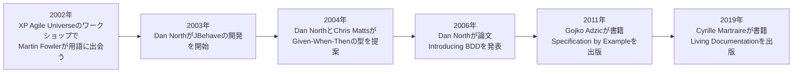
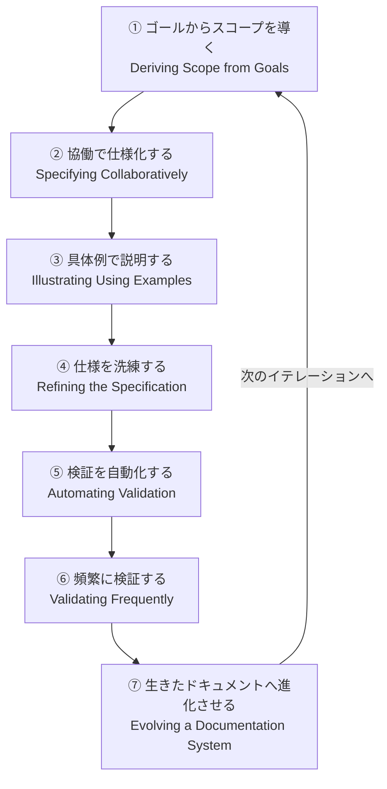
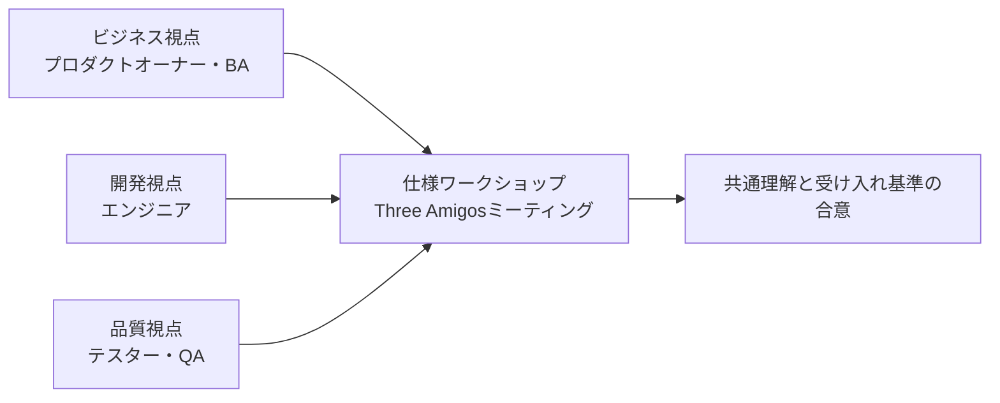
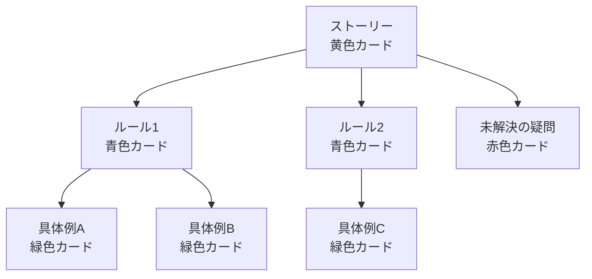
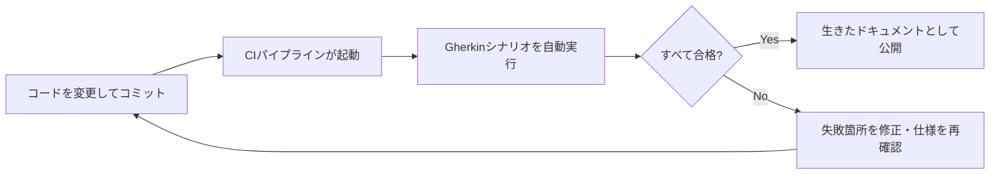

# Specification by Example 実践ガイド ― 初学者のためのステップバイステップ入門

> 本ガイドは、Gojko Adzic 著『Specification by Example: How Successful Teams Deliver the Right Software』（[O'Reilly掲載ページ](https://www.oreilly.com/library/view/specification-by-example/9781617290084/)）を軸に、Martin Fowler、Dan North、Cucumber開発チーム（Matt Wynne / Aslak Hellesøy）、George Dinwiddie、Cyrille Martraireなど、著名かつ国際的に活動するソフトウェア開発者・専門家の一次情報（本人ブログ・公式ドキュメント・出版社サイト）を2026年9月5日時点でウェブ調査したうえで作成しています。各主張の根拠URLは本文中のリンクおよび末尾の「参考文献・出典」に明記しています。

## 対象読者

- Specification by Example（以下、SbE）という言葉を初めて聞いた方
- BDD（ふるまい駆動開発）やGherkin記法との関係が曖昧なままの方
- 「仕様書がすぐ陳腐化する」「QA・開発・ビジネスの認識がズレる」という課題を抱えるチームのメンバー

---

## 目次

1. [Specification by Exampleとは何か](#1-specification-by-exampleとは何か)
2. [なぜ必要なのか：従来の要件定義が抱える問題](#2-なぜ必要なのか従来の要件定義が抱える問題)
3. [歴史的背景：BDDからSpecification by Exampleへ](#3-歴史的背景bddからspecification-by-exampleへ)
4. [全体プロセス：7つのキー・プロセスパターン](#4-全体プロセス7つのキープロセスパターン)
5. [ステップ・バイ・ステップ実践ガイド](#5-ステップバイステップ実践ガイド)
   - [ステップ1：ゴールからスコープを導く](#ステップ1ゴールからスコープを導く)
   - [ステップ2：協働で仕様化する（Three Amigos）](#ステップ2協働で仕様化するthree-amigos)
   - [ステップ3：具体例で説明する（Example Mapping）](#ステップ3具体例で説明するexample-mapping)
   - [ステップ4：仕様を洗練する](#ステップ4仕様を洗練する)
   - [ステップ5：仕様を変えずに検証を自動化する](#ステップ5仕様を変えずに検証を自動化する)
   - [ステップ6：頻繁に検証する](#ステップ6頻繁に検証する)
   - [ステップ7：ドキュメントシステムを進化させる（Living Documentation）](#ステップ7ドキュメントシステムを進化させるliving-documentation)
6. [Given-When-Then / Gherkinの書き方ベストプラクティス](#6-given-when-then--gherkinの書き方ベストプラクティス)
7. [よくあるアンチパターンと回避策](#7-よくあるアンチパターンと回避策)
8. [主要ツールエコシステム](#8-主要ツールエコシステム)
9. [初学者向けチェックリスト](#9-初学者向けチェックリスト)
10. [まとめ](#10-まとめ)
11. [参考文献・出典](#11-参考文献出典)

---

## 1. Specification by Exampleとは何か

Specification by Example（実例による仕様化）とは、**具体的で現実的な「例」を使ってソフトウェアの要件を協働で定義し、その例をそのまま自動テストとして継続的に実行することで、「検証済みの例がカバーする範囲に限って」最新かつ信頼できるドキュメント（Living Documentation）を維持する**開発プラクティスです。裏を返せば、例として書き起こされていない要件、誤った前提で書かれた例、自動テスト化されていない例については信頼性は保証されません。ドキュメントの信頼性は、あくまで「自動テストが通っている具体例の範囲」に限定されます。

この言葉と体系を世に広めたのは、UK在住のコンサルタントであるGojko Adzic氏です。氏は2011年に出版した書籍の中で、世界中の30チーム・50以上のプロジェクトを調査した経験から、この手法を効果的に機能させるための「7つのキー・プロセスパターン」を導き出しました。同書は2012年のJolt Award（最優秀書籍部門）を受賞しています。

- 出典：[Specification by Example（O'Reilly掲載ページ）](https://www.oreilly.com/library/view/specification-by-example/9781617290084/)
- 出典：[Gojko Adzic公式サイトの書籍紹介ページ](https://gojko.net/books/specification-by-example/)

O'Reillyの書籍紹介によれば、この手法がもたらす主な効果は次の4点に整理されています。

| # | もたらされる効果 | 内容 |
|---|---|---|
| 1 | 生きた・信頼できるドキュメントの生成 | 実行可能な例＝ドキュメントとなり、コードと乖離しない |
| 2 | 期待値の明確化と検証の効率化 | 「合格／不合格」を誰もが一目で判断できる |
| 3 | 手戻りの削減 | 実装前に認識のズレを解消できる |
| 4 | 「正しいものを作れている」という確信 | ビジネス側と開発側の双方が安心して開発を進められる |

出典：[Specification by Example（O'Reilly掲載ページ）](https://www.oreilly.com/library/view/specification-by-example/9781617290084/)

> 💡 **初学者向けポイント**：SbEは特定のツール（CucumberやGherkinなど）を指す言葉ではありません。あくまで「例を中心に協働で仕様を作り、それを自動検証し、ドキュメントとして維持し続ける」という**プロセス・考え方**です。ツールはその実現手段の一つに過ぎません。

---

## 2. なぜ必要なのか：従来の要件定義が抱える問題

Martin Fowler氏（ThoughtWorks）は2004年のブログ記事「Specification By Example」の中で、伝統的な仕様の書き方（事前条件・事後条件を厳密に定義する形式手法やDesign by Contractなど）には限界があると指摘しています。事前条件・事後条件を正確に書き切ることは、実際のコードを書くのと同じくらい難しい場合が多く、一方で「例」を使えば非技術者にとっても格段に理解しやすくなる、という趣旨を述べています。

出典：[Martin Fowler「bliki: Specification By Example」](https://martinfowler.com/bliki/SpecificationByExample.html)

さらにFowler氏は、例だけでは全ての振る舞いを網羅できないという弱点も認めた上で、「例による仕様は、理論的には不完全でも、実務においては形式手法より価値が高いことが多い」という立場を取っています。つまりSbEは万能ではなく、**「対話」を代替するものではなく、対話を促進するための道具**である点が重要です。

同記事は、仕様をテストとして先に書く「ダブルチェック」の価値にも触れています。同じ振る舞いをコード（実装）とテスト（例）という異なる手段で二重に表現することで、誤りを発見しやすくなるという考え方です。

出典：[Martin Fowler「bliki: Specification By Example」](https://martinfowler.com/bliki/SpecificationByExample.html)

現場でよく見られる問題を整理すると、次のようになります。

| 従来の要件定義でよくある問題 | SbEが提供する解決の方向性 |
|---|---|
| ドキュメントが実装から乖離し、誰も信用しなくなる | 例＝自動テストなので、失敗すればすぐドキュメントの陳腐化がわかる |
| 要件が曖昧なまま実装に着手し、手戻りが発生する | 実装前にThree Amigosで具体例をすり合わせる |
| ビジネス・QA・開発の間で用語や理解が食い違う | 共通言語（ユビキタス言語）としての具体例を用いる |
| テストが「実装の後付け」になり形骸化する | 例を先に合意し、それをそのまま検証基準にする |

---

## 3. 歴史的背景：BDDからSpecification by Exampleへ

SbEは突然生まれた概念ではなく、2000年代前半からのTDD（テスト駆動開発）・BDD（ふるまい駆動開発）の系譜の上に成立しています。年表で整理すると以下の通りです。

- 出典：[Martin Fowler「bliki: Specification By Example」](https://martinfowler.com/bliki/SpecificationByExample.html)（2002年のワークショップで用語に触れた経緯を本人が記述）
- 出典：[Cucumber公式「History of BDD」](https://cucumber.io/docs/bdd/history/)
- 出典：[Dan North「Introducing BDD」（本人ブログ）](https://dannorth.net/blog/introducing-bdd/)

Cucumber公式ドキュメントによれば、BDDはDaniel Terhorst-North（Dan North）氏が2000年代初頭に提唱したもので、TDDに対する応答として生まれました。氏は「テスト」という言葉が持つ誤解（何をテストすべきか、どこまでテストすべきかが曖昧になりがちな点）を避けるために「振る舞い（behaviour）」という言葉を使い始め、これが新人プログラマーへのコーチングを大きく改善したと述べています。2003年には「JBehave」というJUnitに代わるツールの開発に着手しました。

出典：[Cucumber公式「History of BDD」](https://cucumber.io/docs/bdd/history/)、[Dan North「Introducing BDD」](https://dannorth.net/blog/introducing-bdd/)

Given-When-Thenという構造については、Dan North氏とChris Matts氏が2004年ごろに考案したものです。Martin Fowler氏はこれを「振る舞いを記述するスタイル」として自身のbliki内で整理し、多くのテストフレームワーク（Cucumberなど）で構造化の手段として採用されていると説明しています。

出典：[Martin Fowler「bliki: Given When Then」](https://martinfowler.com/bliki/GivenWhenThen.html)

そして2011年、Gojko Adzic氏がこれらの流れを実務的なプロセスパターンとして体系化し、「Specification by Example」という書籍にまとめました。Dan North氏自身も、この本を「方法論としてのBDDを扱った書籍の中で最も近いもの」と評しています（Gojko Adzic氏の公式サイトに掲載されたレビューコメントより）。

出典：[Gojko Adzic公式サイトの書籍紹介ページ](https://gojko.net/books/specification-by-example/)

なお、SbEやBDDが生み出す「実行可能な仕様＝ドキュメント」という考え方は、その後Cyrille Martraire氏（Arolla社CTO、Paris Software Crafters community創設者）によって2019年の書籍『Living Documentation: Continuous Knowledge Sharing by Design』としてさらに一般化・拡張されています。詳細はステップ7で解説します。

出典：[Living Documentation（O'Reilly掲載ページ）](https://www.oreilly.com/library/view/living-documentation-continuous/9780134689418/)

---

## 4. 全体プロセス：7つのキー・プロセスパターン

Gojko Adzic氏は書籍第2部「Key Process Patterns」で、SbEを実践するチームに共通する7つのパターンを紹介しています。これらは厳密な手順（ウォーターフォール）ではなく、チームが「次の作業に取り掛かる準備ができたとき」に、循環的（サイクリック）に繰り返される緩やかなガイドラインとして提示されている点が重要です。

出典：[The Key Process Patterns From *Specification by Example*（要約まとめ）](https://gist.github.com/rpivo/1469476d9c4cd3ea41f8709eaae94920)、[Specification by Example（O'Reilly目次ページ）](https://www.oreilly.com/library/view/specification-by-example/9781617290084/)

各パターンの目的を一覧にすると以下の通りです。

| # | パターン名（原著） | 目的・問いかけ |
|---|---|---|
| 1 | Deriving scope from goals | このビジネスゴールを達成するために、本当に必要な機能は何か？ |
| 2 | Specifying collaboratively | ビジネス・開発・QAが一緒に仕様を作れているか？（Three Amigos） |
| 3 | Illustrating using examples | 抽象的なルールを、誰もが誤解しない具体例で説明できているか？ |
| 4 | Refining the specification | その例は曖昧さなく、実行可能な形になっているか？ |
| 5 | Automating validation without changing specifications | 人間が読む形式を保ったまま、自動テスト化できているか？ |
| 6 | Validating frequently | CI/CDで継続的に、素早く検証できているか？ |
| 7 | Evolving a documentation system | 検証済みの例は、資産として整理・維持されているか？ |

出典：[Specification by Example（O'Reilly目次ページ）](https://www.oreilly.com/library/view/specification-by-example/9781617290084/)

---

## 5. ステップ・バイ・ステップ実践ガイド

ここからは、初めてSbEに取り組むチームを想定し、各パターンを実践レベルの手順に分解して解説します。

### ステップ1：ゴールからスコープを導く

書籍の要約記事によれば、Gojko Adzic氏はこのパターンを「曖昧な要求をそのまま鵜呑みにせず、まずビジネスゴールに立ち返る」プロセスとして説明しています。チームは顧客のビジネスゴールから出発し、そのゴールを達成するために本当に必要なスコープを協働で定義します。ビジネス側は「何を」「なぜ」実現したいかという意図と期待価値の伝達に集中し、開発側はそれをより安く・早く・保守しやすい形で実現する解決策を提案する、という役割分担が推奨されています。

出典：[The Key Process Patterns From *Specification by Example*（要約まとめ）](https://gist.github.com/rpivo/1469476d9c4cd3ea41f8709eaae94920)

**実践のポイント**

- 「この機能は何のビジネス指標に効くのか？」を常に問い直す
- ゴールが曖昧なままだと、後続のスコープ・具体例・仕様のすべてが弱くなる（同記事はこの因果関係を明確に指摘しています）
- 大きすぎる要求は、ゴールを軸に分割する

### ステップ2：協働で仕様化する（Three Amigos）

このパターンの中核が「Three Amigos（3人の仲間）」と呼ばれる仕様ワークショップです。ビジネス視点・開発視点・QA（テスト）視点の最低3つの立場が同席し、実装に着手する前に共通理解を作ります。

「Three Amigos」という用語自体は、Gojko Adzic氏ではなくアジャイルコーチのGeorge Dinwiddie氏が2009年のブログ記事で最初に用いたとAgile Allianceの用語集は説明しています。3人ちょうどという意味ではなく、少なくともビジネス・開発・テストの3つの視点を集めるべきだという「姿勢」を指す言葉である点が強調されています。

出典：[Agile Alliance「What are the Three Amigos in Agile?」](https://agilealliance.org/glossary/three-amigos/)

**実践のポイント**

- 実装に着手する**前**に、15〜30分程度の短いセッションとして開催する
- 目的は「合意された仕様書を作ること」ではなく「認識のズレをその場で発見すること」
- ビジネス側が一方的に要求を提示する「契約」の場にしない。むしろ「解決したい問題」を提示し、チーム全体で解決策を考える対話の場にする

出典：[John Ferguson Smart「The anatomy of a Three Amigos Requirements Discovery workshop」](https://johnfergusonsmart.com/three-amigos-requirements-discovery/)

### ステップ3：具体例で説明する（Example Mapping）

Three Amigosの会話を構造化する代表的な技法が、Cucumberの共同創業者であるMatt Wynne氏が考案した「Example Mapping（例のマッピング）」です。氏はセントルイスでチームをトレーニングしていた際にこの手法を発案したと、自身のプロフィールページで説明しています。

出典：[Matt Wynne「About」](https://mattwynne.net/about)

Example Mappingでは、4色の索引カードを使って会話の内容を可視化します。

| カードの色 | 意味 | 内容の例 |
|---|---|---|
| 黄色 | ストーリー | 対象のユーザーストーリーそのもの |
| 青色 | ルール | 受け入れ基準・ビジネスルール（ストーリーの下に配置） |
| 緑色 | 具体例 | 各ルールを裏付ける具体的なシナリオ（ルールの下に配置） |
| 赤色 | 疑問 | その場で答えが出ない質問・保留事項 |

出典：[Cucumber公式「Example Mapping」](https://cucumber.io/docs/bdd/example-mapping/)、[Matt Wynne「Introducing Example Mapping」](https://cucumber.io/blog/bdd/example-mapping-introduction/)

Matt Wynne氏は自身の記事の中で、Example Mappingの狙いを「ストーリーの中の最も小さなふるまいの単位にズームインし、ルールを切り分け、本当にやるべき中核を見つけ、残りは後回しにできるようにすること」だと説明しています。またCucumberチームでは、セッション開始から25分経過した時点でメンバーが親指を立てる簡易投票を行い、そのストーリーを次のスプリントに取り込めるかどうかを判断しているとも述べています。

出典：[Matt Wynne「Introducing Example Mapping」（Medium転載版）](https://medium.com/@mattwynne/introducing-example-mapping-42ccd15f8adf)

**実践のポイント**

- ルールとサンプル（具体例）の違いを最初に全員で理解しておく
- 疑問（赤カード）が多く出るストーリーは、まだ実装に着手すべきではないサイン
- 1セッションは時間を区切る（20〜30分が目安）
- Example Mappingで洗い出した緑カードが、次のステップ「仕様の洗練」でGherkinシナリオの土台になる

### ステップ4：仕様を洗練する

Example Mappingで出てきた具体例は、まだラフな会話の産物です。このステップでは、それらを曖昧さのない、実行可能な形へと磨き上げます。Cucumber公式ドキュメントは、良いGherkinの条件として「システムの意図された振る舞い（What）を記述し、実装の詳細（How）を記述しない」ことを最重要原則として挙げています。詳しい書き方は本ガイドのステップ6でまとめて解説します。

出典：[Cucumber公式「Writing better Gherkin」](https://cucumber.io/docs/bdd/better-gherkin/)

**実践のポイント**

- 1シナリオにつき、検証するふるまいは1つだけに絞る
- 具体的な入力値・期待値を用いる（「正しいパスワード」ではなく「パスワードが `Secret123` の場合」のように）
- 誰が読んでも同じ解釈になるかを、ドメインに詳しくない第三者に読んでもらってチェックする

### ステップ5：仕様を変えずに検証を自動化する

このパターン名が示す通り、重要なのは「自動化のためにシナリオの文面を技術寄りに書き換えない」という点です。仕様（Gherkinのシナリオ）はあくまで人間が読むためのものであり、その裏側の実装（ステップ定義）だけを技術的に構築します。Cucumberチームは、UIの操作手順をそのままシナリオに落とし込む書き方（実装への依存）を代表的なアンチパターンとして警告しています。詳細は7章で扱います。

出典：[Cucumber公式「Anti-patterns」](https://cucumber.io/docs/guides/anti-patterns/)

**実践のポイント**

- シナリオの文面（Gherkin）とステップ定義（実装コード）を明確に分離する
- UIの実装が変わってもシナリオ文面は変わらないように設計する
- ドメインロジック層・APIレイヤーなど、UIより下のレイヤーで検証できる構成を検討する

### ステップ6：頻繁に検証する

例が自動テストとして実装されたら、CI（継続的インテグレーション）パイプラインに組み込み、コード変更のたびに実行します。これにより、仕様と実装の乖離をリアルタイムで検知できます。

**実践のポイント**

- 失敗したシナリオを「テストが壊れた」と見なすだけでなく、「仕様と実装のどちらが正しいか」を毎回議論する
- 実行が遅いシナリオ（E2E中心のもの）はCIのボトルネックになりやすいため、レイヤーを見直す
- 頻度が低いとこの仕組み全体の価値が薄れるため、少なくとも1日に何度も実行できる速度を目指す

### ステップ7：ドキュメントシステムを進化させる（Living Documentation）

自動検証され続けている例の集合は、単なるテストコードではなく「常に正しいことが保証されたドキュメント」＝Living Documentation（生きたドキュメント）として機能します。この概念をさらに体系化したのが、Arolla社CTOのCyrille Martraire氏による2019年の書籍『Living Documentation: Continuous Knowledge Sharing by Design』です。

InfoQのインタビューでMartraire氏は、従来のドキュメントが抱える根本的な問題は「信用できないこと」（情報が欠落・陳腐化・誤解を招く状態になりがちなこと）だと述べ、コードと同じペースで進化するドキュメントを目指すべきだと主張しています。氏はドメイン駆動設計（DDD）の考え方を応用し、ビジネスゴールの設定からドメイン知識、アーキテクチャ、設計、デプロイに至るまで、あらゆる局面でドキュメントを「生かす」手法を体系化しました。

出典：[InfoQ「Q&A with Cyrille Martraire on the Book Living Documentation」](https://www.infoq.com/articles/book-review-living-documentation/)、[Living Documentation（O'Reilly掲載ページ）](https://www.oreilly.com/library/view/living-documentation-continuous/9780134689418/)

**実践のポイント**

- Gherkinのフィーチャーファイルは、単なるテストではなく「読み物」として整理する（タグ・カテゴリ分けなど）
- ドキュメントの生成・公開自体もCIで自動化し、常に最新版が閲覧できる状態を保つ
- 古くなった・使われなくなったシナリオは放置せず、定期的に棚卸しする

---

## 6. Given-When-Then / Gherkinの書き方ベストプラクティス

Gherkinは、SbEやBDDで書かれた具体例を構造化するための代表的な記法です。Given（前提条件）・When（操作・イベント）・Then（期待される結果）という3つの要素で1つの振る舞いを表現します。この型は、Dan North氏とChris Matts氏がBDDの一部として考案したものだと、Martin Fowler氏がbliki内で説明しています。

出典：[Martin Fowler「bliki: Given When Then」](https://martinfowler.com/bliki/GivenWhenThen.html)

Cucumber公式ドキュメント「Writing better Gherkin」は、良いシナリオを書くための最も重要な原則として「システムの意図された振る舞い（What）を記述し、実装の詳細（How）を記述しないこと」を挙げています。実装手順（ボタンをクリックする、フィールドに入力する、など）をそのまま書いてしまうと、UIの実装が変わるたびにシナリオを書き換える必要が生じ、本来の「振る舞いの意図」がぼやけてしまうと説明されています。

出典：[Cucumber公式「Writing better Gherkin」](https://cucumber.io/docs/bdd/better-gherkin/)

| 観点 | 悪い例（実装手順＝Howに寄りすぎ） | 良い例（意図＝Whatを記述） |
|---|---|---|
| ログイン処理 | `When` ユーザー名フィールドに"Bob"と入力し、パスワードフィールドに"secret"と入力し、ログインボタンをクリックする | `When` "Bob"としてログインする |
| 検索操作 | `When` 検索ボックスをクリックし、"りんご"と入力し、検索アイコンを押す | `When` "りんご"を検索する |

出典：[Cucumber公式「Writing better Gherkin」](https://cucumber.io/docs/bdd/better-gherkin/)

**書き方の基本ルール（まとめ）**

- Given／When／Thenの3要素で1シナリオを構成する（複数条件を並べる場合は`And`／`But`を使う）
- 1シナリオでは1つのふるまいだけを検証する
- 実装用語（ボタン、フィールド、クリックなど）ではなく、ビジネス用語で記述する
- 具体的な値を使う（曖昧な代名詞や一般論を避ける）
- シナリオ名は「何を検証しているか」が一目でわかる名前にする

---

## 7. よくあるアンチパターンと回避策

Cucumberの中核開発者であるSteve Tooke氏・Aslak Hellesøy氏・Matt Wynne氏によるポッドキャストを基にした公式ブログ記事「Cucumber anti-patterns」では、現場で頻発する失敗パターンが具体的に整理されています。

出典：[Cucumber公式ブログ「Cucumber anti-patterns (part #1)」](https://cucumber.io/blog/bdd/cucumber-antipatterns-part-one/)、[「Cucumber anti-patterns (part #2)」](https://cucumber.io/blog/bdd/cucumber-anti-patterns-part-two/)、[Cucumber公式「Anti-patterns」ドキュメント](https://cucumber.io/docs/guides/anti-patterns/)

| アンチパターン | 何が問題か | 回避策 |
|---|---|---|
| 非技術者だけでシナリオを書く | 自動化の段階で書き直しが必要になり、プロダクトオーナーが「自分が書いた内容と違う」と感じ、仕様への当事者意識を失う | Three Amigosで最初から共同執筆する |
| 1シナリオに複数の検証結果を詰め込む | 何を検証しているのかが不明瞭になり、ドキュメントとしても機能しなくなる | 1シナリオ＝1つのふるまいに分割する |
| UI操作をそのままシナリオに書く（実装への依存） | UIの変更のたびにシナリオが壊れる。E2Eテストに依存するため実行が遅く不安定になる | ふるまい（What）を記述し、UI操作の詳細はステップ定義側に隠蔽する |
| 抽象的すぎるシナリオ（ビジネスルールの言い換えに留まる） | 実装者が「裏側で何が起きるべきか」を具体的に判断できない | 具体的な入力値・期待値を明記する |
| 冗長で長すぎるシナリオ | 本質的でない詳細（incidental detail）でストーリーの意図が埋もれる | Example Mappingの段階で本質的なルールと具体例だけに絞り込む |

出典：[Cucumber公式ブログ「Cucumber anti-patterns (part #1)」](https://cucumber.io/blog/bdd/cucumber-antipatterns-part-one/)、[「Cucumber anti-patterns (part #2)」](https://cucumber.io/blog/bdd/cucumber-anti-patterns-part-two/)

同記事では、Cucumberは本質的には「テストツール」である以前に「ドメインに対する自分たちの理解を検証するためのツール」であるという考え方が繰り返し強調されています。全員がGherkinの文面に合意して初めて実装に着手できる、という順序を守ることが、これらのアンチパターンを避ける最大のポイントです。

出典：[Cucumber公式ブログ「Cucumber anti-patterns (part #1)」](https://cucumber.io/blog/bdd/cucumber-antipatterns-part-one/)

---

## 8. 主要ツールエコシステム

SbE／BDDを実践するための代表的なオープンソースツールを整理します。いずれもGherkin（またはそれに準ずる自然言語記法）でシナリオを記述し、対応言語のステップ定義と結びつけて自動実行する点は共通しています。

| ツール | 主な対象言語 | 特徴 |
|---|---|---|
| Cucumber | Ruby / Java / JavaScript / Kotlin など多数 | Gherkin構文を広めた代表的な実装。Example Mapping・Anti-patternsなど実践知の発信元でもある |
| JBehave | Java | Dan North氏が2003年に開発を始めた、歴史上最初期のBDDフレームワーク |
| Behave | Python | Pythonエコシステムで広く使われるGherkin実装 |
| Reqnroll（旧SpecFlow） | .NET | .NET向けの代表的なGherkin実装。SpecFlowは2024年末に開発元Tricentisによって公式にEnd-of-Life（提供終了）が発表され、コミュニティによるフォークであるReqnrollが後継として開発が続けられている |

出典：[Cucumber公式「History of BDD」](https://cucumber.io/docs/bdd/history/)、[Reqnroll公式「SpecFlow end-of-life has been announced」](https://reqnroll.net/news/2025/01/specflow-end-of-life-has-been-announced/)、[Reqnroll公式サイト](https://reqnroll.net/)

> ⚠️ **注意**：ツールはあくまで「⑤検証を自動化する」パターンを実現する手段です。ツール導入から入ってしまう（＝Three AmigosやExample Mappingを省略していきなりGherkinファイルを書き始める）ことは、7章で紹介したアンチパターンの温床になりやすい点に注意してください。

---

## 9. 初学者向けチェックリスト

はじめてチームにSbEを導入する際の最初の一歩として、以下を確認してみてください。

- [ ] 対象の機能・ストーリーが、どのビジネスゴールに紐づくか説明できる（ステップ1）
- [ ] 実装に着手する前に、ビジネス・開発・QAが同席するThree Amigosの場を設けている（ステップ2）
- [ ] Example Mappingの4色カード（黄＝ストーリー、青＝ルール、緑＝具体例、赤＝疑問）の意味をチーム全員が理解している（ステップ3）
- [ ] シナリオが「What（何が起きるか）」で書かれており、「How（どう操作するか）」に踏み込みすぎていない（ステップ4・6章）
- [ ] Gherkinの文面と、その裏側の実装（ステップ定義）が分離されている（ステップ5）
- [ ] シナリオがCIパイプラインに組み込まれ、日常的に自動実行されている（ステップ6）
- [ ] 実行され続けているシナリオを「生きたドキュメント」として整理・公開する仕組みがある（ステップ7）
- [ ] 1シナリオが1つのふるまいだけを検証している（7章のアンチパターン対策）

---

## 10. まとめ

Specification by Exampleは、「具体例を使って仕様をすり合わせ、その例をそのまま自動テストとして走らせ続けることで、常に正しいドキュメントを保つ」という一貫した思想です。Gojko Adzic氏が体系化した7つのプロセスパターンは、ゴール設定から始まり、Three AmigosやExample Mappingによる協働、Gherkinによる仕様の洗練、自動化、頻繁な検証、そしてLiving Documentationへの進化という一連の流れとしてつながっています。

重要なのは、どのツールを使うかではなく、**「実装の前に、具体例を使って認識を揃える」という順序を守ること**です。この順序さえ守れれば、Gherkinを使わずとも、あるいは別のツールを使っても、SbEの本質的な価値（生きたドキュメント、手戻りの削減、正しいものを作れているという確信）を得ることができます。

---

## 11. 参考文献・出典

本ガイドの作成にあたり、2026年9月5日時点で以下の一次情報源をウェブ調査し参照しました。

**Gojko Adzic（Specification by Exampleの提唱者・Neuri Consulting LLPパートナー）**
- [Specification by Example（O'Reilly掲載ページ）](https://www.oreilly.com/library/view/specification-by-example/9781617290084/)
- [Gojko Adzic公式サイト：書籍紹介ページ](https://gojko.net/books/specification-by-example/)
- [The Key Process Patterns From *Specification by Example*（要約まとめ、GitHub Gist）](https://gist.github.com/rpivo/1469476d9c4cd3ea41f8709eaae94920)

**Martin Fowler（ThoughtWorks、著名なソフトウェア開発者・国際的講演者）**
- [bliki: Specification By Example](https://martinfowler.com/bliki/SpecificationByExample.html)
- [bliki: Given When Then](https://martinfowler.com/bliki/GivenWhenThen.html)

**Dan North / Cucumber開発チーム（Matt Wynne、Aslak Hellesøy、Steve Tooke）**
- [Dan North「Introducing BDD」（本人ブログ）](https://dannorth.net/blog/introducing-bdd/)
- [Cucumber公式「History of BDD」](https://cucumber.io/docs/bdd/history/)
- [Cucumber公式「Example Mapping」ドキュメント](https://cucumber.io/docs/bdd/example-mapping/)
- [Matt Wynne「Introducing Example Mapping」（Cucumber公式ブログ）](https://cucumber.io/blog/bdd/example-mapping-introduction/)
- [Matt Wynne「Introducing Example Mapping」（Medium転載版）](https://medium.com/@mattwynne/introducing-example-mapping-42ccd15f8adf)
- [Matt Wynne「About」（本人プロフィール）](https://mattwynne.net/about)
- [Cucumber公式「Writing better Gherkin」](https://cucumber.io/docs/bdd/better-gherkin/)
- [Cucumber公式「Anti-patterns」ドキュメント](https://cucumber.io/docs/guides/anti-patterns/)
- [Cucumber公式ブログ「Cucumber anti-patterns (part #1)」](https://cucumber.io/blog/bdd/cucumber-antipatterns-part-one/)
- [Cucumber公式ブログ「Cucumber anti-patterns (part #2)」](https://cucumber.io/blog/bdd/cucumber-anti-patterns-part-two/)

**George Dinwiddie（アジャイルコーチ、Three Amigosの提唱者）**
- [Agile Alliance「What are the Three Amigos in Agile?」](https://agilealliance.org/glossary/three-amigos/)
- [John Ferguson Smart「The anatomy of a Three Amigos Requirements Discovery workshop」](https://johnfergusonsmart.com/three-amigos-requirements-discovery/)

**Cyrille Martraire（Arolla社CTO・共同創業者、Paris Software Crafters community創設者）**
- [Living Documentation: Continuous Knowledge Sharing by Design（O'Reilly掲載ページ）](https://www.oreilly.com/library/view/living-documentation-continuous/9780134689418/)
- [InfoQ「Q&A with Cyrille Martraire on the Book Living Documentation」](https://www.infoq.com/articles/book-review-living-documentation/)

**ツールエコシステム関連**
- [Reqnroll公式サイト](https://reqnroll.net/)
- [Reqnroll公式「SpecFlow end-of-life has been announced」](https://reqnroll.net/news/2025/01/specflow-end-of-life-has-been-announced/)
