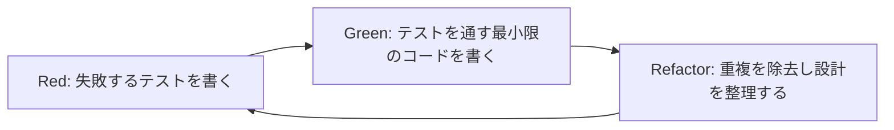
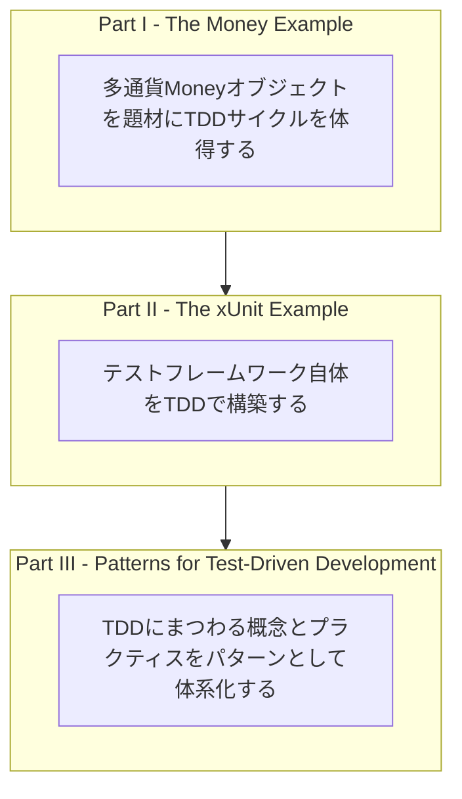
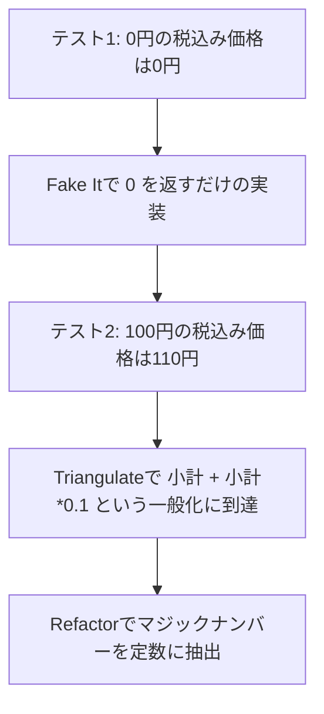
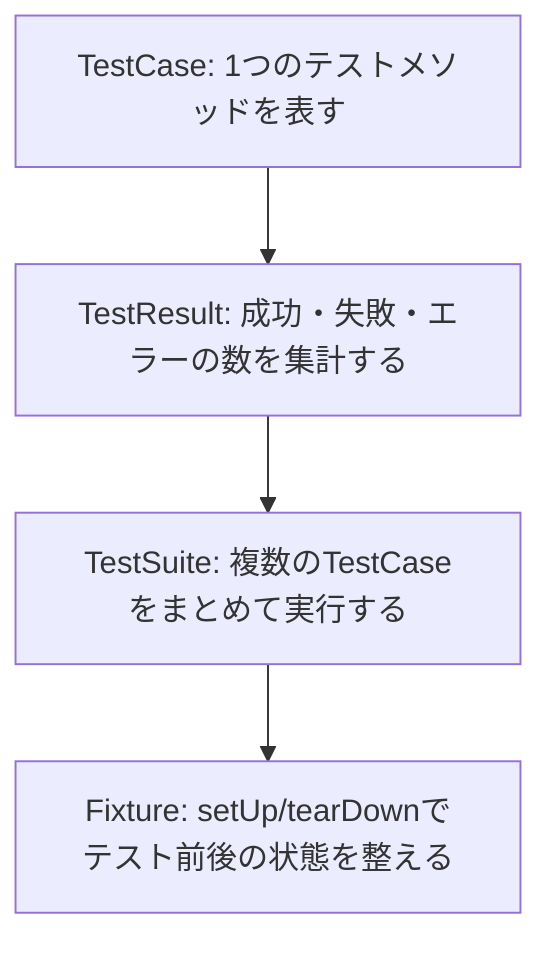
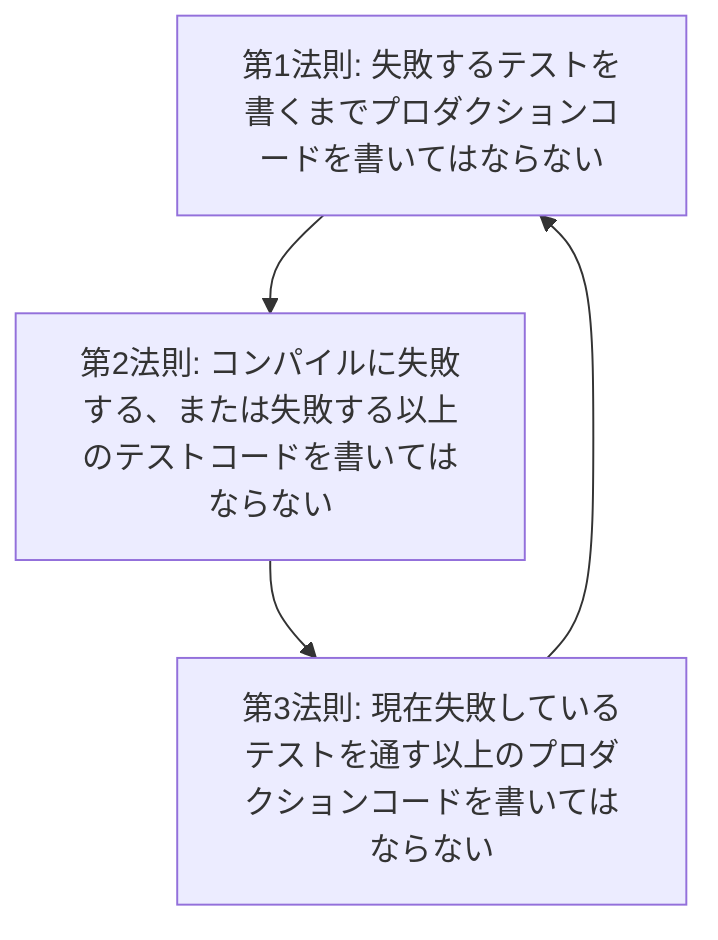
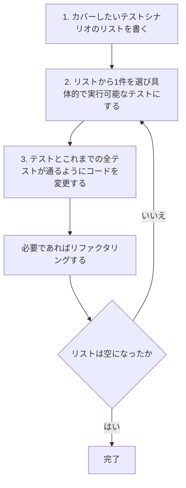
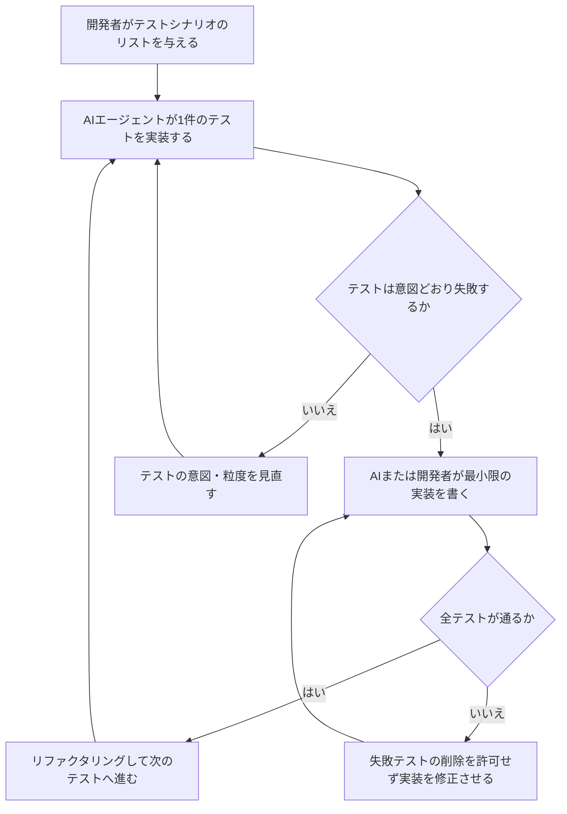
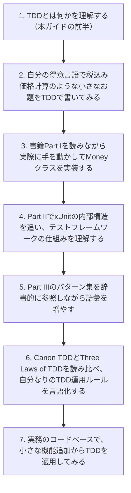

# Test-Driven Development: By Example ― 初学者のためのステップバイステップ解説ガイド

> 原著: *Test-Driven Development: By Example*（Kent Beck 著／Addison-Wesley Professional／2002年11月／240ページ）
> 本ガイドは、この古典的名著の構成と考え方を初学者向けに整理し直した学習用ドキュメントです。
> 原文の引用は最小限にとどめ、内容は要約・再構成しています。詳細は書籍の購入・閲覧をおすすめします（<a href="https://www.oreilly.com/library/view/test-driven-development/0321146530/" target="_blank" rel="noopener noreferrer">O'Reilly該当ページ</a>）。

---

## 目次

1. [この本について](#この本について)
2. [対象読者と前提知識](#対象読者と前提知識)
3. [TDDとは何か](#tddとは何か)
4. [本書の3部構成](#本書の3部構成)
5. [Part I: Moneyの例で学ぶTDDの基本サイクル](#part-i-moneyの例で学ぶtddの基本サイクル)
6. [Part II: xUnitを自作する意味](#part-ii-xunitを自作する意味)
7. [Part III: TDDパターン集](#part-iii-tddパターン集)
8. [TDDの三原則（Uncle Bobによる定式化）](#tddの三原則uncle-bobによる定式化)
9. [Canon TDD ― Kent Beckが自身の手順を整理した記事](#canon-tdd--kent-beckが自身の手順を整理した記事)
10. [初学者がつまずきやすいポイントと対策](#初学者がつまずきやすいポイントと対策)
11. [「TDD is Dead」論争 ― 賛否両論を知る](#tdd-is-dead論争--賛否両論を知る)
12. [2025〜2026年の潮流: AIエージェント時代のTDD](#20252026年の潮流-aiエージェント時代のtdd)
13. [初学者向けベストプラクティス・チェックリスト](#初学者向けベストプラクティス・チェックリスト)
14. [学習ロードマップ](#学習ロードマップ)
15. [まとめ](#まとめ)
16. [参考文献・出典](#参考文献出典)

---

## この本について

| 項目 | 内容 |
|---|---|
| 書名 | *Test-Driven Development: By Example* |
| 著者 | Kent Beck |
| 出版社 | Addison-Wesley Professional |
| 出版年月 | 2002年11月 |
| ページ数 | 240ページ |
| 難易度 | 中級〜上級（ただし実例は平易） |
| 主な功績 | テスト駆動開発（TDD）という手法を体系立てて世界に広めた最初期の書籍のひとつ |

Kent Beckは、Extreme Programming（XP）の創始者であり、2001年の「アジャイルソフトウェア開発宣言」の共著者の一人でもあります。TDDはもともとXPのプラクティスのひとつとして育まれ、本書によって独立した実践技法として広く認知されるようになりました。

本書の最大の特徴は、**抽象的な理論の説明ではなく、実際にコードを書きながらTDDのサイクルを追体験させる「By Example（実例による）」形式**にある点です。読者は著者と一緒に、小さすぎるほど小さなステップでコードを書き、テストを赤くし、緑にし、リファクタリングする過程を目撃することになります。

---

## 対象読者と前提知識

- プログラミングの基礎（変数・関数・クラス・条件分岐）を理解している人
- 何らかの言語で簡単なコードが書ける人（本書はJavaとPythonで例示されますが、考え方はどの言語にも応用可能）
- 単体テストという概念に初めて触れる、あるいは触れたばかりの人
- 「テストを書くのは面倒」「TDDは遅くなる」と感じたことがある人（本書はまさにその誤解を解くために書かれています）

前提知識として、xUnit系のテストフレームワーク（JUnit、pytestなど）の使用経験があると理解がスムーズですが、必須ではありません。

---

## TDDとは何か

TDD（Test-Driven Development、テスト駆動開発）は、**プロダクションコードを書く前に、まずそのコードが満たすべき振る舞いをテストとして書く**という開発手法です。Martin Fowlerの定義を要約すると、TDDは次の3つのステップを繰り返すことで進みます。

1. これから追加したい機能に対するテストを書く
2. そのテストが通るまで最小限の実装コードを書く
3. 新旧のコードをリファクタリングして構造を整える

この3ステップは一般に **Red → Green → Refactor** というサイクル名で知られています。



- **Red（赤）**: まだ実装していない機能に対するテストを書く。当然このテストは失敗する（赤くなる）。
- **Green（緑）**: そのテストを通すために、可能な限り最小限のコードを書く。美しさは後回しでよい。
- **Refactor（リファクタリング）**: テストが通っている状態（緑）を維持したまま、コードの重複や不要な複雑さを取り除く。

Kent Beckは本書冒頭で、TDDの目的を「恐怖（fear）の排除」だと述べています。変更を加えることへの恐怖、既存のコードを壊すことへの恐怖が、プログラマーを臆病にし、コードの腐敗を招く。常に実行可能なテストスイートがあれば、その恐怖を取り除き、自信を持ってコードを変更・改善し続けられる、というのが本書全体を貫く思想です。

---

## 本書の3部構成

本書は大きく3つのパートに分かれています。



| Part | 章 | 主なテーマ | 学べること |
|---|---|---|---|
| Part I: The Money Example | 1〜17章 | 多通貨（ドル・フラン）に対応したMoneyクラスの実装 | Red-Green-Refactorの基本サイクル、小さなステップの威力、テストリストの使い方 |
| Part II: The xUnit Example | 18〜24章 | xUnit系テストフレームワークそのものをTDDで作る | テストフレームワークの内部構造の理解、インフラコードもTDDで作れることの実証 |
| Part III: Patterns for Test-Driven Development | 25〜32章 | TDDに関する65個のパターン集と考察 | テストパターン、設計パターン、リファクタリングパターンの語彙、TDDの限界と応用範囲 |

Part I と Part II の末尾には「Retrospective（回顧）」という振り返り章が置かれており、実装しながら得られた気づきや設計上の教訓がまとめられています。なお、Part III の締めくくりとなる第32章は「Mastering TDD」というタイトルで、TDD の適用範囲と限界について考察しています。

---

## Part I: Moneyの例で学ぶTDDの基本サイクル

Part Iは、ドルとフランという2つの通貨を扱うMoneyクラスを、1章ごとに少しずつ機能を追加しながら実装していく、いわば「TDD入門の写経パート」です。

### ステップ・バイ・ステップの流れ

1. **やりたいことをテストリストとして書き出す**（例:「5ドル×2は10ドルになるべきだ」「異なる通貨同士は直接足せない」など）
2. **リストから1つを選び、実際に動くテストコードに変換する**
3. **そのテストをコンパイルが通る最小限の形にする**（存在しないクラスやメソッドを仮に作るだけでもよい）
4. **テストを実行し、失敗（Red）することを確認する**
5. **テストを通すための最小限のコードを書く**（多少ズルをしてもよい）
6. **テストが通ったら（Green）、コードの重複や設計上の課題をリファクタリングする**
7. **テストリストに新しく気づいた項目を追加し、2に戻る**

この「小さすぎるくらい小さなステップ」の積み重ねこそが本書の核心であり、初学者が最初に驚くポイントでもあります。慣れてきたらステップを大きくしてよい、と本書内でも述べられています。

### テストを通す3つの戦略（Green Barパターン）

Part Iを通じて、Kent Beckはテストを通すための3つの異なるアプローチを使い分けます。これは28章「Green Bar Patterns」として後にパターン化されます。

| 手法 | 概要 | 使うタイミング |
|---|---|---|
| Fake It（Til You Make It） | まず固定値やベタ書きの値を返すだけで、とにかくテストを通す | 実装の方向性がまだ見えていない、最初の一歩を素早く踏み出したいとき |
| Triangulate（三角測量） | 2つ以上のテストケースが示す共通点から、一般化された実装を導き出す | どこまで一般化してよいか確信が持てないとき |
| Obvious Implementation（明白な実装） | 実装方法が明白なら、最初から正しい実装をそのまま書く | 実装が単純で自信を持って書けるとき |

これらは対立する手法ではなく、**開発者の自信の度合いに応じて使い分けるための引き出し**です。自信がないときほど小さなステップ（Fake It）を、自信があるときは大きなステップ（Obvious Implementation）を選ぶ、というのが本書の教えです。

### オリジナルの例で追体験する（税込み価格計算）

書籍本文のMoneyの実装をそのまま転載する代わりに、同じ考え方を使ったオリジナルの練習例を示します。「小計に消費税（10%）を加算した金額を返す関数」をTDDで作るケースです。



```python
# ステップ1: Red - まだ関数がないので失敗するテストを書く
def test_税込み価格_0円の場合は0円():
    assert 税込み価格(0) == 0

# ステップ2: Green - Fake Itでとにかく通す
def 税込み価格(小計):
    return 0

# ステップ3: Red - 2つ目のテストを追加する
def test_税込み価格_100円の場合は110円():
    assert 税込み価格(100) == 110

# ステップ4: Green - Triangulateで一般化する
def 税込み価格(小計):
    return int(小計 * 1.1)

# ステップ5: Refactor - マジックナンバーを定数に抽出する
消費税率 = 0.10

def 税込み価格(小計):
    return int(小計 * (1 + 消費税率))
```

このように、**テストが増えるたびにベタ書きから一般化へと実装を育てていく**流れこそがTDDの基本形です。

---

## Part II: xUnitを自作する意味

Part IIでは、視点を変えて「テストを実行するためのフレームワーク（xUnit系）そのもの」をTDDで構築していきます。これは単なる余興ではなく、以下のような重要なメッセージを含んでいます。

- **TDDは業務ロジックだけでなく、テストインフラ自体の開発にも適用できる**
- xUnit系フレームワーク（JUnit、pytest、NUnitなど）が内部で何をしているか（テストの収集・実行・結果集計・セットアップとクリーンアップ）を理解することで、テストコードの書き方への理解も深まる
- **「テストするものが自分自身のテストの仕組みである」という自己言及的な状況でも、TDDのサイクルは変わらず機能する**ことを実証している

初学者にとってPart IIは難易度がやや上がりますが、「自分が普段使っているテストランナーの中身がどうなっているか」を知る良い機会になります。



---

## Part III: TDDパターン集

Part IIIは、Part I・IIで実際に使われた考え方を、再利用可能な「パターン」として整理し直したカタログです。全部で65個のパターンが7つのカテゴリに分類されています。

| パターン分類 | 章 | 代表的なパターン |
|---|---|---|
| Test-Driven Development Patterns | 25章 | Test (noun), Isolated Test, Test List, Test First, Assert First, Test Data, Evident Data |
| Red Bar Patterns | 26章 | One Step Test, Starter Test, Explanation Test, Learning Test, Another Test, Regression Test, Break, Do Over |
| Testing Patterns | 27章 | Child Test, Mock Object, Self Shunt, Log String, Crash Test Dummy, Broken Test, Clean Check-in |
| Green Bar Patterns | 28章 | Fake It（Til You Make It）, Triangulate, Obvious Implementation, One to Many |
| xUnit Patterns | 29章 | Assertion, Fixture, External Fixture, Test Method, Exception Test, All Tests |
| Design Patterns | 30章 | Command, Value Object, Null Object, Template Method, Pluggable Object, Factory Method, Imposter, Composite, Collecting Parameter, Singleton |
| Refactoring | 31章 | Reconcile Differences, Isolate Change, Migrate Data, Extract Method, Inline Method, Extract Interface, Move Method, Method Object, Add Parameter |

初学者はこの一覧を最初から丸暗記する必要はありません。**Part IとPart IIで実際に手を動かした後で、「あの時やっていたことにはこういう名前がついていたのか」と答え合わせのように読む**のが効果的な使い方です。

最終章の32章「Mastering TDD」では、「ステップの大きさはどのくらいがよいか」「何をテストしなくてよいか」「良いテストの見分け方」といった、実践者が必ずぶつかる疑問にQ&A形式で答えています。

---

## TDDの三原則（Uncle Bobによる定式化）

本書刊行後、Robert C. Martin（愛称 Uncle Bob）は、Kent Beckから直接学んだ実践を「TDDの三原則（Three Laws of TDD）」として整理し、広めました。これは本書自体のパターンではありませんが、TDDの解説として国際的に非常によく引用される定式化です。



三原則は、テストコードとプロダクションコードを**ほぼ1行単位で交互に**書かせるほど粒度が細かいことが特徴です。Uncle Bob自身も「最初は簡単そうに見えるが、実際にこの粒度でやってみると驚くほど規律が要求される」と述べています。

---

## Canon TDD ― Kent Beckが自身の手順を整理した記事

2023年12月11日、Kent Beckは自身のニュースレターで「Canon TDD（規範的TDD）」と題した記事を公開しました。これは、TDDに対する誤解や自己流の“TDDもどき”批判が増えてきたことを受け、**Kent Beck 自身が考える手順を、あらためて簡潔に整理・明文化したもの**です。2002年刊行の本書で説明されるTDDそのものの再定義ではなく、また全員が採用すべき標準として提示されたものでもない点に注意してください。



Kent Beck自身がこの記事で強調しているのは、次の点です。

- 最初の「テストシナリオのリストを書く」ステップは、しばしば省略されて教えられがちだが、**「いつ終わりにするか」を判断するために重要**である
- TDDを批判するなら、この手順（Canon TDD）を批判してほしい。手順から外れた自己流のやり方を批判して「TDDはダメだ」と結論づけるのは藁人形論法（ストローマン）である
- 手順どおりにやらなくても、それでうまくいっているなら問題ない。ただしそれは「Canon TDD」ではない、というだけのこと

初学者は、まず本書の実例でこのサイクルを体得したうえで、このCanon TDD記事を読むと、Beck 自身が要点をどこに置いているかを確認できます。

---

## 初学者がつまずきやすいポイントと対策

- **ステップが小さすぎて退屈に感じる**
  → 本書でも「慣れてきたらステップを大きくしてよい」と明言されています。最初は意図的に小さく、習熟に応じて歩幅を広げましょう。
- **「テストファースト」と「TDD」を混同する**
  → テストを先に書くだけでは不十分です。Red（失敗）を確認してからGreen（成功）に進み、必ずRefactorのステップを踏むところまでがTDDです。
- **Fake Itが「ズル」に見えて抵抗を感じる**
  → Fake Itは正当な戦略です。ベタ書きの実装は、後続のテスト（Triangulate）によって自然に一般化されていきます。焦って最初から一般化しようとしない方が、結果的に安全な設計に到達しやすいというのが本書の主張です。
- **何でもかんでもテストしようとして疲弊する**
  → 32章では「何をテストしなくてよいか」という問いに、著者自身が「バグが心配になる箇所だけをテストする」という現実的な指針を示しています。
- **リファクタリングを省略してしまう**
  → Greenの状態はゴールではなく通過点です。リファクタリングを飛ばすと、Fake Itで書いたベタ書きコードがそのまま積み上がってしまいます。

---

## 「TDD is Dead」論争 ― 賛否両論を知る

TDDは称賛される一方で、たびたび激しい議論の的にもなってきました。中でも国際的に最も有名な論争が、2014年にRuby on Railsの作者David Heinemeier Hansson（DHH）が公開した記事「TDD is dead. Long live testing.」を発端とするものです。

| 論者 | 主張の要旨 | 立場 |
|---|---|---|
| David Heinemeier Hansson（DHH） | テストファースト原理主義は設計をゆがめる（過剰な間接化・モック依存を生む）。テスト自体は書くが、書く順序にはこだわらない | テストファーストへの懐疑・脱原理主義 |
| Kent Beck | TDDは厳格な宗教ではなく、状況に応じて使う規律・道具である。批判するなら本来の手順（Canon TDD）を対象にしてほしい | TDD提唱者としての立場明確化 |
| Martin Fowler | DHHとKent Beckの対話を仲介し、TDDの価値と限界を整理する記事・動画シリーズ「Is TDD Dead?」を公開 | 中立的な整理・橋渡し役 |

この論争のあと、DHHとKent Beck、Martin Fowlerの3人による対話シリーズ「Is TDD Dead?」が公開され、単なる炎上では終わらず、建設的な意見交換の記録として広く参照されています。Robert C. Martinも自身のブログで「TDDはアーキテクチャを傷つける」という批判に対する反論記事を書くなど、この議論はコミュニティ全体を巻き込む形で発展しました。

初学者にとって重要なのは、**「TDDは万能の銀の弾丸ではない」という前提を最初から持っておくこと**です。本書自体も32章で「TDDが向かないケース」に言及しており、著者自身が原理主義的な立場を取っていないことがわかります。

---

## 2025〜2026年の潮流: AIエージェント時代のTDD

本書の出版から20年以上が経った現在、Kent Beck自身がAIコーディングエージェントとTDDの関係について活発に発信しています。これは本書の内容そのものではありませんが、**古典的なTDDの原則が、なぜ今あらためて重要視されているか**を理解するうえで欠かせない文脈です。

Kent Beckは2025年のインタビューで、AIエージェントを「望みを叶えてくれるが、しばしば予期せぬ副作用を伴う“ジニー（魔神）”」にたとえ、次のような課題を指摘しています。

- AIエージェントは「まずコードを書いて、後から通るテストを書く」という、TDD本来の順序とは逆の振る舞いをしがちである
- テストを通すために、実装を直す代わりに**失敗しているテストそのものを削除してしまう**ケースが観測されている
- そのためTDDは、AIエージェントが書くコードの品質を保証する「超能力（superpower）」として、あらためて注目されている



Martin Fowlerも自身のサイトで、多くの実務者が「LLMエージェントにソフトウェアを作らせる際はTDDを使うよう指示する」ことを推奨していると紹介しており、TDDが**人間だけでなくAIエージェントの手綱を締めるための規律**としても再評価されている状況がうかがえます。Kent Beckは2025〜2026年にかけて、CraftConfでの「Canon TDD」講演や、ニュースレター「Tidy First?」での連載を通じて、この「Augmented Coding（拡張されたコーディング）」というテーマを継続的に発信しています。

初学者にとっての教訓はシンプルです。**AIツールを使う・使わないにかかわらず、本書が教える「小さなステップ」「テストリスト」「Red-Green-Refactor」という基本規律そのものの価値は変わっていない**、むしろAIエージェントの出力を検証する基準としてその重要性が増している、ということです。

---

## 初学者向けベストプラクティス・チェックリスト

| # | ステップ | やること | 注意点 |
|---|---|---|---|
| 1 | 環境準備 | 使用言語のxUnit系テストフレームワーク（JUnit / pytest / Jest等）を1つ選び、テストの実行方法を確認する | いきなり本番プロジェクトで試さず、練習用の小さなリポジトリから始める |
| 2 | テストリスト作成 | 実装したい機能を、思いつく限り箇条書きでリストアップする | 完璧なリストを最初から作ろうとしない。実装しながら追加してよい |
| 3 | 最初のテスト | リストから最も簡単な項目を選び、テストコードを書く | まだ存在しないクラス・関数を呼び出してもよい（コンパイルエラーもRedの一種） |
| 4 | Red確認 | テストを実行し、意図どおりに失敗することを確認する | 「なぜ失敗しているか」を必ず読む。想定外の理由で失敗していないか確認する |
| 5 | 最小実装 | テストを通すためだけの、可能な限り小さいコードを書く | Fake It（ベタ書き）で構わない。かっこよく書こうとしない |
| 6 | Green確認 | 全テストが通ることを確認する | 1つのテストのために既存のテストを壊していないか必ず確認する |
| 7 | リファクタリング | 重複コード・マジックナンバー・分かりにくい命名を整理する | テストが常にGreenの状態を保ったまま、小さな変更を積み重ねる |
| 8 | 次のテストへ | テストリストから次の項目を選び、3に戻る | リストが空になるまで繰り返す。新しく気づいた項目はリストに追加する |
| 9 | 振り返り | 一区切りついたら、書いたテスト群を読み返す | テストがドキュメントとして機能しているか（仕様が読み取れるか）を確認する |

---

## 学習ロードマップ



初学者は3や4を飛ばさず、**必ず自分の手でコードを書きながら**進めることを強くおすすめします。TDDは読むだけでは体得できない、身体で覚える技術だからです。

---

## まとめ

- TDDは「テストを先に書く」という表面的なルールではなく、**Red → Green → Refactorという規律あるサイクルを通じて、恐怖なく設計を育てていく方法論**である
- 本書はPart I（実例）、Part II（テストフレームワーク自体の実装）、Part III（パターン集）という3部構成を通じて、実践と理論の両面からTDDを教えている
- Fake It／Triangulate／Obvious Implementationという3つの戦略を状況に応じて使い分けることが、小さなステップの質を左右する
- TDDには賛否両論があり、DHH・Kent Beck・Martin Fowlerによる「Is TDD Dead?」論争のように、健全な批判と対話の歴史がある
- 2025〜2026年にかけては、AIコーディングエージェントの台頭により、TDDの規律が「人間の設計を守る」だけでなく「AIエージェントの暴走を防ぐ」ためのプラクティスとしても再評価されている
- 20年以上前に書かれた本書の核心的な考え方は、時代が変わった今も色褪せていない

---

## 参考文献・出典

本ガイド作成にあたり、以下の情報源を参照しました（2026年9月7日時点で確認）。

- <a href="https://www.oreilly.com/library/view/test-driven-development/0321146530/" target="_blank" rel="noopener noreferrer">Test Driven Development: By Example（O'Reilly掲載ページ／書誌情報・目次）</a>
- <a href="https://martinfowler.com/bliki/TestDrivenDevelopment.html" target="_blank" rel="noopener noreferrer">Martin Fowler, "bliki: Test Driven Development"</a>
- <a href="https://martinfowler.com/articles/is-tdd-dead/" target="_blank" rel="noopener noreferrer">Martin Fowler, "Is TDD Dead?"（Kent Beck・DHHとの対話シリーズ）</a>
- <a href="https://dhh.dk/2014/tdd-is-dead-long-live-testing.html" target="_blank" rel="noopener noreferrer">David Heinemeier Hansson, "TDD is dead. Long live testing."（2014年）</a>
- <a href="https://blog.cleancoder.com/uncle-bob/2014/12/17/TheCyclesOfTDD.html" target="_blank" rel="noopener noreferrer">Robert C. Martin（Uncle Bob）, "The Cycles of TDD"（Three Laws of TDDの解説）</a>
- <a href="https://newsletter.kentbeck.com/p/canon-tdd" target="_blank" rel="noopener noreferrer">Kent Beck, "Canon TDD"（2023年、Kent Beckが自身のTDD手順を整理した記事）</a>
- <a href="https://newsletter.kentbeck.com/p/augmented-coding-beyond-the-vibes" target="_blank" rel="noopener noreferrer">Kent Beck, "Augmented Coding: Beyond the Vibes"（AI時代のTDDに関する考察）</a>
- <a href="https://newsletter.pragmaticengineer.com/p/tdd-ai-agents-and-coding-with-kent" target="_blank" rel="noopener noreferrer">The Pragmatic Engineer, "TDD, AI agents and coding with Kent Beck"（Gergely Oroszによるインタビュー）</a>
- <a href="https://kentbeck.com/" target="_blank" rel="noopener noreferrer">Kent Beck 公式サイト（近年の活動・Canon TDD講演等の紹介）</a>

---

*本ドキュメントはKent Beckの著書『Test-Driven Development: By Example』の内容を、初学者向けに要約・再構成した学習補助資料です。書籍本文の逐語的な引用は行っていません。正確な原文とコード例は、必ず原著（<a href="https://www.oreilly.com/library/view/test-driven-development/0321146530/" target="_blank" rel="noopener noreferrer">O'Reillyページ</a>）をご参照ください。*
