# AI時代のソフトウェアテスト入門 — 『Testing AI: Engineering Confidence in Non-Deterministic Systems』完全ガイド

> 対象読者:AIを組み込んだソフトウェアの品質保証に関わり始めたばかりのエンジニア、テスター、プロダクトマネージャー
> 本ガイドのゴール:非決定的(実行するたびに結果が変わりうる)なAIシステムを、どうやって「自信を持って」出荷できる状態にするかという考え方を、初学者でも順番に理解できるようにすること

## お断り:書籍タイトルについて

最初のご依頼では「AI for Testing: A Practical Guide to Smarter Software Quality」というタイトルで、Tariq KingとJason Arbon共著の書籍を想定されていました。しかし、Amazon・Google Books・O'Reilly・Semantic Scholarなど複数の情報源を調査した結果、そのタイトルと著者の組み合わせに一致する書籍は見つかりませんでした。

代わりに、実在が確認できた資料の中から、Jason Arbonが2026年に単著で刊行した『**Testing AI: Engineering Confidence in Non-Deterministic Systems**』を基にガイドを作成することで合意しています。なお、Jason ArbonとTariq Kingは「Artificial Intelligence for Software Testing Association(AISTA)」を共同設立した長年の協業者であり、2019年には共著論文「AI for Testing Today and Tomorrow: Industry Perspectives」も発表しています。Tariq King自身もこの新刊を高く評価する投稿をLinkedInで行っており、両者のつながりは本書の背景としても押さえておく価値があります(詳細は「参考文献・出典」を参照)。

---

## 1. この本の位置づけ

生成AIやLLM(大規模言語モデル)を組み込んだソフトウェアは、同じ入力を与えても毎回まったく同じ出力を返すとは限りません。これは「バグ」ではなく、AIシステムの本質的な性質です。ところが、従来のソフトウェアテストは「同じ入力には同じ出力」という前提(決定性)の上に成り立っています。

『Testing AI』は、この前提が崩れた世界でどうやってソフトウェアの品質に「自信」を持つかを扱う実務書です。著者のJason Arbonは、テストという入り口から始めて、最終的に「Confidence Engineering(確信のエンジニアリング)」と呼ぶ運用規律にたどり着きます。これは、実行するたびに振る舞いが変わり、変化するデータから学習し、ツールを呼び出し、ユーザーごとにパーソナライズされ、本番負荷の下で違う振る舞いをするシステムを出荷するための考え方です。

## 2. 書籍データ

| 項目 | 内容 |
| --- | --- |
| 原題 | Testing AI: Engineering Confidence in Non-Deterministic Systems |
| 著者 | Jason Arbon |
| 刊行 | 2026年、初版(Amazonにてペーパーバック・Kindle版で入手可能) |
| 構成 | 全5部・21章、98の実例、42の実務者コラム「From the Field」、32の図版 |
| 想定読者 | 開発者、テスター・自動化エンジニア、AIプロダクトの開発者やアーキテクト、エンジニアリングリーダーや経営層 |
| 中心概念 | Confidence Engineering(確信のエンジニアリング) |
| 公式サイト | testingaibook.com(章ごとの概要を無料公開する「Knowledge Edition」も併設) |

## 3. 著者紹介:Jason Arbonとは

Jason Arbonは、ソフトウェアエンジニア・起業家であり、20年以上にわたりソフトウェア開発・テスト・プロダクトエンジニアリングに携わってきた人物です。Microsoft、Bing、Google検索、Chrome、ChromeOS、Applauseといった大規模プロダクトの品質システムを構築・統率してきました。

代表的な経歴は次の通りです。

- 『How Google Tests Software』(James Whittaker、Jeff Carolloとの共著)の共著者として、Googleの規模でのテスト文化を紹介
- 『App Quality: Secrets for Agile App Teams』の著者として、アプリストアのデータや実地テストから得た知見をまとめる
- AIをソフトウェアテストに応用する企業(test.ai、Testers.ai、Checkie.AI、Jank.AI)やAI品質の変革を支援するIcebergQAの創業に関与
- ユタ大学で電気工学・コンピュータ工学の学位を取得

『Testing AI』は、これらの経験を「Confidence Engineering」という一つの実務規律にまとめ上げたものです。

## 4. 対象読者

本書は次のような役割の人に向けて書かれています。

- **開発者・コーディングエージェント利用者**:自分がすべて書いたわけではないコードやシステムを、隠れた統合不良・セキュリティ・データ・運用上の欠陥まで含めて検証する方法を学ぶ
- **テスター・自動化エンジニア**:脆い完全一致アサーションから脱却し、Eval(評価)・確率的なエビデンス・本番トレース・リスク別のスライス・人間とAIの協働レビューへと進む
- **AIプロダクト開発者・アーキテクト**:プロンプト、モデル、データ、検索(retrieval)、ツール、ポリシー、ユーザー体験、コスト、リリース制御を、1つのテスト可能なシステムとしてつなげる
- **エンジニアリングリーダー・経営層**:出荷・保留・カナリア・ロールバック・投資・ガバナンス・顧客リスクの判断を支えるエビデンスを求める

## 5. 本書を読むと何が変わるか

公式サイトでは、読了後に問えるようになる6つの問いが示されています。これらは本ガイド全体を貫く軸でもあるので、最初に押さえておきましょう。

1. どの種類のばらつきは無害で、どの種類のばらつきはプロダクトの欠陥なのか
2. どんな母集団をサンプリングしたのか、そして平均値によって隠されているリスクは何か
3. 誰が、あるいは何が品質を判定しているのか、その測定システムはキャリブレーションされているか
4. システムは正しい根拠を検索し、ツールを安全に使い、監査可能なトレースを残せたか
5. 品質の向上は、レイテンシ・計算コスト・運用の複雑さ・ユーザーへの影響に見合っているか
6. どのエビデンスがリリースを正当化し、どんな明確なシグナルがロールバックの引き金になるべきか

## 6. 学習ロードマップ

本書は全5部・21章という大きな構成ですが、初学者は必ずしも頭から一直線に読む必要はありません。以下は役割別のおすすめの読み進め方です。

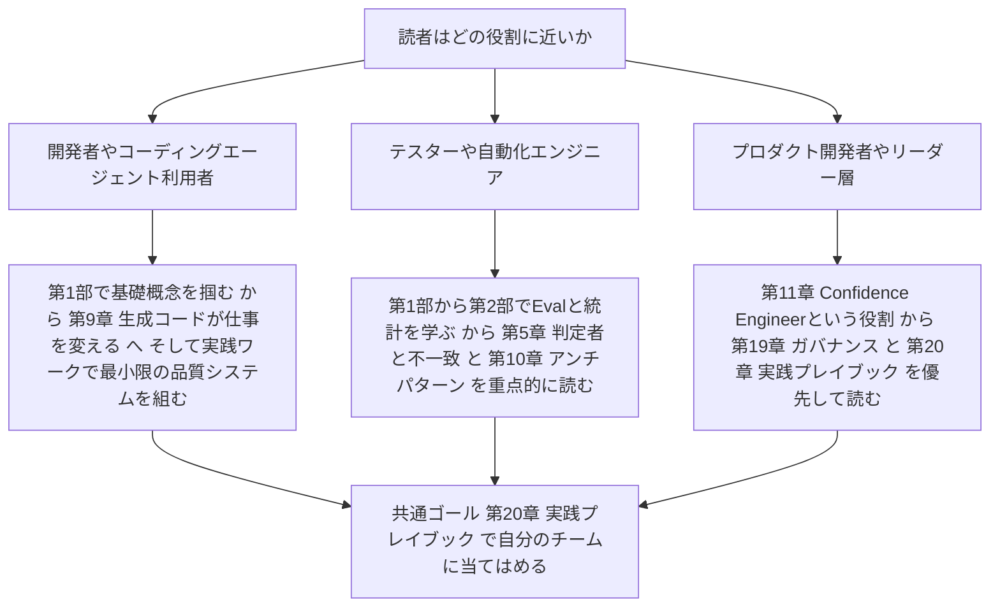

---

## Step 0:なぜ「AIのテスト」は別物なのか — Confidence Engineeringという発想

従来のソフトウェアテストは、次のような前提の上に成り立っていました。

- 同じ入力を与えれば、同じ出力が返る(決定性)
- 出力が「正解」と一致するかどうかを、完全一致のアサーションでチェックできる
- テストが1回通れば、その振る舞いは今後も保証される

生成AIやLLMを組み込んだシステムでは、この前提のすべてが崩れます。モデルはサンプリングによってゆらぎのある出力を返し、検索拡張生成(RAG)は取得するコンテキストによって挙動が変わり、エージェントはツールを呼び出しながら多段階で動きます。ここで必要になるのが、著者が「Confidence Engineering(確信のエンジニアリング)」と呼ぶ考え方です。

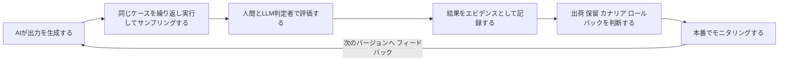

このループの中心にあるのが「観察」と「推論」を分けるという発想です。あるサンプルで得られた結果は「観察」にすぎず、そこから見積もる信頼区間は「推論」であり、リリースするかどうかの判断は、その両方に加えてビジネス上の文脈・深刻度・可逆性・モニタリング計画を組み合わせたリスク判断になります。本書全体は、この一連の流れを実務レベルまで具体化していく構成になっています。

---

## Step 1:第I部 — AI品質の新しいかたち(第1〜5章)

第I部は、本書全体の土台となる5つの章で構成されています。「完全一致のテスト」から「分布とエビデンスに基づく評価」へと発想を転換するパートです。

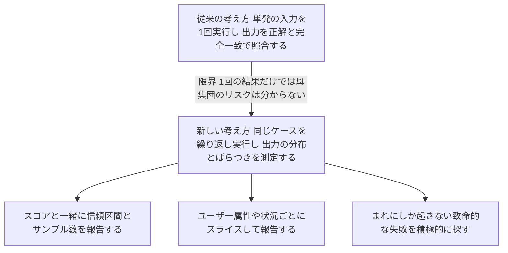

### 第1章 ワンショットテストの終焉

完全一致のアサーションをやめ、「許容できるばらつき」と「有害なばらつき」を区別できる評価基準に置き換えることが出発点です。同じテストケースを繰り返し実行して、出力の分布そのものを測定します。0から10、あるいは0から1のスケールで品質をスコアリングする発想もここで導入されます。重要なのは、「観察したサンプル結果」と「そこから見積もる母集団の信頼区間」、そして「ビジネス文脈を踏まえたリリース判断」を、はっきり切り分けて考えることです。

### 第2章 テストからリリースエビデンスへ

個々のテストケースを、スライス(セグメント別の集計)・トレース・レビュアーの判断・明示的なリリースゲートと組み合わせて、初めて「リリースの根拠(エビデンス)」と呼べるものに変わります。同値なはずの入力に対して重要な振る舞いが保たれているかを確認する「メタモルフィックテスト」も、ここで紹介される有力な手法です。ゴールデンセット(いつも使う基準ケース集)と、本番トラフィックからのライブサンプリングを組み合わせる考え方や、めったに起きない失敗を狙って探す「レア障害ハンティング」もこの章の範囲です。

### 第3章 サンプリングと不確実性

「1回の実行結果はほとんど何も教えてくれない」という前提から始まります。何件サンプリングすれば十分と言えるのか、信頼区間を専門家らしく「だいたい」と言うにはどう計算するのか、AIモデル自身が申告する確信度と統計的な信頼度がどう違うのか、といった基礎統計を扱います。同じケース集合を新旧バージョンの両方に走らせる「ペア比較」を優先することも、この章で強調されるポイントです。

### 第4章 AI品質のための統計的検定

対応あり・対応なし、数値・カテゴリ、順序・二値といったデータの形に応じて、適切な統計検定を選ぶ方法を扱います。Evalを実行する前に帰無仮説を明確にすること、p値を「証明」ではなく「エビデンスの一部」として扱うこと、統計的有意性と実務上の意味のある有意性(practical significance)を区別すること、検出力分析(power analysis)や多重比較による誤検出の問題、適合率・再現率・F値の扱いなどが含まれます。

### 第5章 判定者、人間、そして意見の不一致

LLMを「判定者(ジャッジ)」として自動化する前に、まず人間による測定システム自体を定義しておく必要がある、というのがこの章の核心です。具体的な根拠の要件とキャリブレーション用の例を盛り込んだルーブリックを書くこと、そして一致率だけでなく「意見の不一致そのもの」を測定することが強調されます。

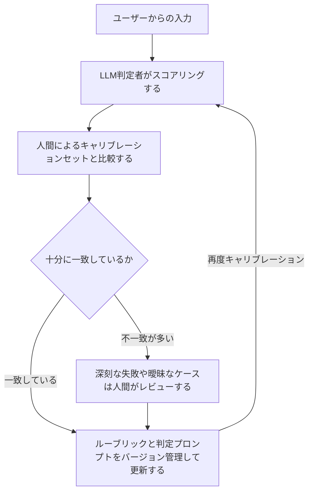

実務で信頼されているチームは、判定者自体を「テスト対象のシステム」として扱います。人間レビュアーとの一致率を測定し、流暢な文章に引きずられるバイアスを追跡し、ブラインドでの比較を使い、判定プロンプトをバージョン管理し、判定者が低い確信度を報告した例や過去に信頼できなかった例を隔離して扱う、といった運用が紹介されています。

---

## Step 2:第II部 — エビデンス、Eval、本番運用(第6〜8章)

第II部では、「意味のあるEvalをどう作るか」「リリース判断をどう下すか」「本番でどう運用し続けるか」という、実務に直結する3つの章を扱います。

### 第6章 意味のあるEvalの構築

Evalが「何を測定しているのか」「なぜユーザーにとって重要なのか」「オラクル(正解判定の仕組み)がどう機能するのか」を明確に定義することから始まります。公開ベンチマークと製品固有のEvalを比較し、ベンチマークが持つ死角をそのまま引き継がないようにすること、敵対的・レッドチーム的なサンプリングを取り入れること、検索の関連性を測るNDCGのような指標、そして「品質の頭打ちカーブ(asymptotic curve)」を意識して高水準だけを追い求めないようにすることなどが扱われます。

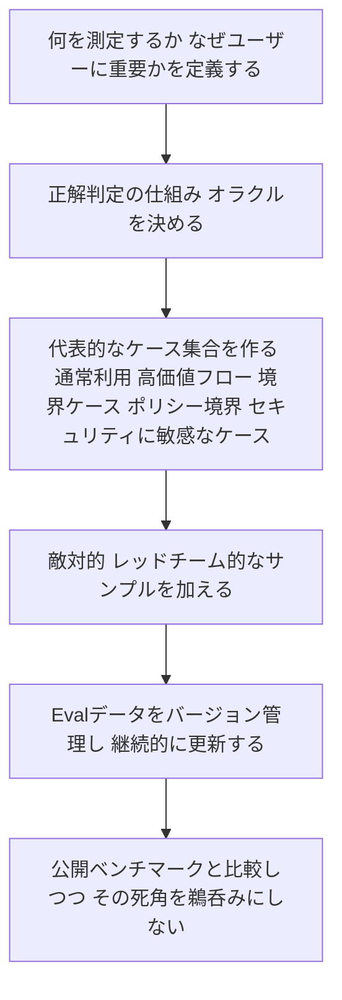

### 第7章 AIシステムのリリース準備

リリースは「品質保証の終わり」ではなく「本当の意味での品質測定の始まり」だという考え方が軸になります。許容できるばらつきは通しつつ、ポリシー違反・ツールの誤用・安全性の後退といったリグレッションは確実に検知する仕組みを作ります。ツールを使う多段階エージェントのワークフローをどう評価するか、人間によるレビューとエスカレーションのルールをどう設計するかもここで扱われます。

### 第8章 AIの運用:可観測性、関連性、経済性

入力・プロンプト組み立て・検索(retrieval)・モデル呼び出し・ツール・出力フィルタ・ユーザーに見える結果まで、パイプライン全体を計装(インストルメント)することが出発点です。RAGでは検索の失敗と生成の失敗を切り分けて評価する必要があります。本番トレースからの学習、プロンプトやポリシーのバージョン管理、そしてカナリア・シャドウ・ロールバック戦略が、この章の重要なテーマです。

---

## Step 3:第III部 — AI生成コードとConfidence Engineering(第9〜11章)

第III部は、AIがコードそのものを生成する時代における品質保証と、「Confidence Engineer」という新しい役割を扱います。

### 第9章 生成コードが仕事を変える

一見正しく見える生成コードでも、統合・セキュリティ・プライバシー・権限・デプロイの振る舞いにおいて誤りうる、という前提から出発します。生成されたコードを検証するために、別のAIやレビュー経路を使うことが推奨されます。生成テストが「カバレッジがあるように見えて実は薄い」という錯覚を生む問題や、ハルティング問題やゲーデルの不完全性定理が示すような「AI生成コードのテストには理論的な限界がある」という視点も紹介されます。

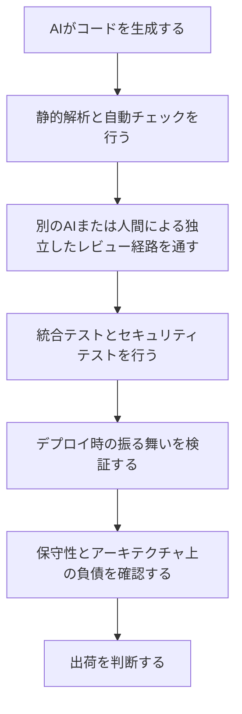

### 第10章 誤った安心感を生むアンチパターン

この章は16個ものセクションブリーフを持つ、本書で最もボリュームのあるアンチパターン集です。修正を提案する前に、まずその「誤った安心感のパターン」に名前を付けることが大切だと説きます。以下は代表的なアンチパターンの一部です。

| アンチパターン | 何が問題か |
| --- | --- |
| 合否だけのブール判定の罠 | 「通った・落ちた」の二値だけでは、どれだけ悪かったか どれだけ際どかったかが分からない |
| 通過率だけを品質と見なす | パーセンテージは平均を隠し 致命的な少数の失敗を埋もれさせる |
| 過度に具体的なテストケースやテスト計画 | 非決定的な出力に完全一致を求めると 些細な言い換えでも壊れる |
| ゴールデンアンサー問題 | 唯一の正解を決め打ちすると 妥当な別解を誤って不合格にする |
| すべての悪い出力をバグとして起票する | ばらつきの範囲内の変動まで バグ管理システムを埋め尽くしてしまう |
| もぐら叩き式のチューニングの罠 | 個別の失敗を潰すたびに 別の場所で新しい失敗が生まれる |
| ワンショットデモの誤謬 | 1回のデモがうまくいっただけで 本番品質を保証したと錯覚する |
| 静的なテスト計画 | モデルやデータが変わり続けるのに テスト計画だけが固定されたままになる |
| 集計スコアの罠 | 一つの数字に平均化すると どのスライスで何が壊れているか見えなくなる |
| 最終回答だけをテストする | 途中の検索やツール呼び出しの過程を検証しないと 原因を特定できない |
| 判定者を真実として扱う | LLM判定者自体もキャリブレーションが必要な測定システムにすぎない |
| テストの数が多いほど確信できるという誤解 | 量よりも リスクに対してカバレッジがあるかが重要 |
| 拒否を安全性と混同する | 何でも断るAIは安全なのではなく ただ役に立たないだけの場合がある |
| AIのバグをUIのバグと同じように扱う | 非決定的な失敗には UIの決定的なバグとは違う調査手法が必要 |
| 古いテスターの肩書きの罠 | 役割の呼び名だけを変えても 実務のやり方が変わらなければ意味がない |
| 昨日のテスターを今日のシステムのために雇う罠 | 統計 Eval設計 AIの仕組みを理解した人材が必要になっている |

### 第11章 Confidence Engineerという役割

第11章はわずか1つのセクションブリーフしかありませんが、本書全体の結論にあたる重要な章です。プロダクトの意図・コード・テスト・Eval・トレース・ロールアウト・ビジネス上の帰結をつなぐ人物として「Confidence Engineer」を位置づけます。役職名自体は新しいものですが、その必要性は昔から変わりません。著者は、真剣に取り組むすべてのAIプロダクトには、そのシステムが良くなっているか、安全になっているか、現実の世界でより信頼できるようになっているかを裏付けるエビデンスに、誰かが責任を持つ必要があると論じています。

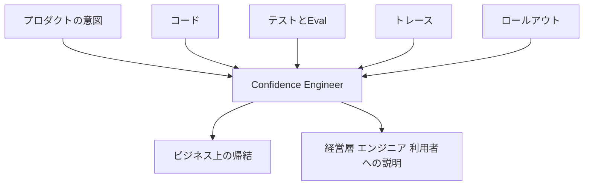

---

## Step 4:第IV部 — データ・セキュリティ・安全性・モデル内部(第12〜16章)

第IV部は、データとバイアス、セキュリティ、フロンティア安全性、そしてモデルそのものの仕組みという、やや発展的なテーマを扱う5つの章です。

### 第12章 データ、バイアス、評価者、インセンティブ

データ・ラベル・評価者(レイター)・インセンティブ・展開後のフィードバックのすべてを、品質に関わる監査対象として扱います。ユーザーの属性・言語・文化・デバイス・地域・アクセス性によってスライスと反実仮想(カウンターファクチュアル、もし属性が違っていたらどうなるか)を報告することが求められます。データのバイアス、ラベリングのバイアス、学習時のバイアス、プロダクト化する段階でのバイアス、そして生存バイアス(うまくいった事例だけが目に入ってしまう罠)まで、細かく分解して扱われます。

### 第13章 AIセキュリティとガードレール

チャットボットのテキストボックスだけでなく、AIシステム全体を脅威モデリングすることが出発点です。ユーザーテキスト・取得したページ・ツール出力・ファイル・OCR・隠れたUnicode文字・画像・外部APIなど、信頼できないあらゆるチャネルをテストします。プロンプトインジェクションや間接的プロンプトインジェクション、学習データの汚染やバックドア、MCP(Model Context Protocol)のようなツール連携における権限管理、OWASPのLLMアプリケーション向けトップ10といった具体的な脅威分類も扱われます。

### 第14章 フロンティア安全性と封じ込め

フロンティアの安全性を、通常のプロダクトバグとは別の品質クラスとして扱うべきだと説きます。危険なコンテンツそのものを教え込むことなく悪用可能性を測定する「危険能力テスト」の設計、操作・説得・不当な影響力の行使のテスト、欺瞞やスキーミング(計画的な振る舞い)、評価されていることに気づいてしまう「evaluation awareness」のテスト、封じ込めやサンドボックスの設計まで扱われます。

### 第15章 モデルの仕組み

トークン化、コンテキストウィンドウ、サンプリング、ロジット、報酬チューニング、マルチモーダルパイプラインが、それぞれ固有の失敗モードを生むという前提で、より良いテストを設計する方法を扱います。RLHFやRLAIF、報酬モデルの振る舞いのテスト、有用なLLMバグレポートと役に立たないバグレポートの違い、画像生成モデルや視覚言語モデルの仕組み、ファインチューニング済みモデルにおけるリグレッションのリスクなど、幅広いトピックが含まれます。

### 第16章 内省:ホワイトボックスでネットワークをテストする

内省(introspection)を「正しさの証明」としてではなく「トリアージ(優先順位づけ)のためのエビデンス」として使うという立場が明確に示されています。既知の良い例・悪い例・曖昧な例・新バージョンの例の間で、内部シグナル(アテンション、活性化など)を比較する手法や、概念プローブ、スパースオートエンコーダといった解釈可能性(interpretability)のツールを、テスト設計にどう活かすかが扱われます。

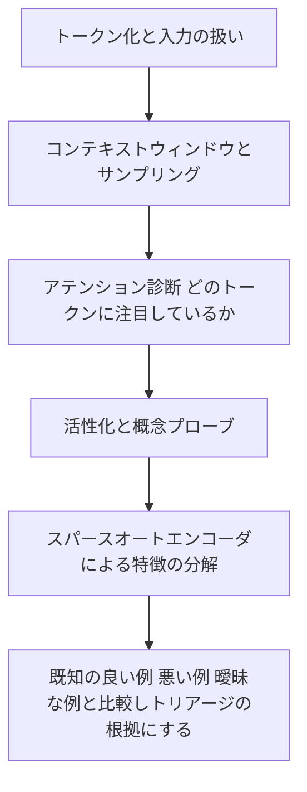

安全性の観点でも、脅威モデリングから封じ込めまでは一続きの階層として理解すると整理しやすくなります。

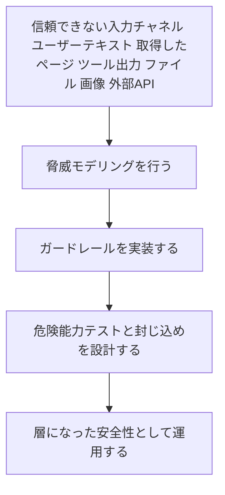

---

## Step 5:第V部 — 未来のシステムと実践プレイブック(第17〜21章)

最後の第V部は、パーソナライズされたプロダクト、身体性AI(ロボティクス)、ガバナンス、そして実践的なプレイブックと未来予測という5つの章で締めくくられます。

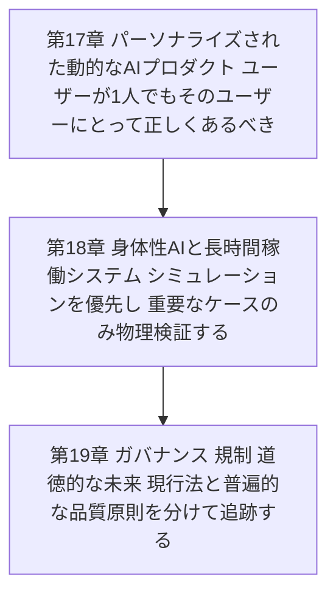

### 第17章 パーソナライズされた動的なAIプロダクト

「N=1」、つまりユーザーがたった1人であっても、その人にとって正しくなければならないという前提でパーソナライズされた振る舞いをテストします。コンテンツ・レイアウト・アクション・トーン・ランキングといった動的なUIサーフェスをマッピングし、いつパーソナライズすべきでないかも検討します。ユーザーが所有する記憶やAIのアイデンティティ、パーソナライズによるロックインとポータビリティ、AIペルソナや合成ユーザーのテストも扱われます。

### 第18章 身体性AIと長時間稼働するAIシステム

速度・安全性・コストの観点から、まずシミュレーションと仮想世界での検証を優先し、重要なケースだけを物理的に検証するという方針が示されます。危害を及ぼさないデフォルトの振る舞い、安全な不作為(何もしない選択)、復旧、権限管理といった観点でロボティクスをテストします。センサーフュージョンや知覚・世界モデル、電力・レイテンシ・運用コスト、人間との相互作用と社会的受容性、AI同士の群れや社会のテスト、永続的に動き続けるAIシステムのテストまで幅広く扱われます。

### 第19章 ガバナンス、規制、道徳的な未来

ガバナンス・倫理・規制を、テスト入力とエビデンス要件に翻訳するという実務的な姿勢が中心です。現行の法律や標準は、時代とともに変わるものとして、普遍的な品質原則とは別に追跡すべきだとされます。AIの意識の可能性やモデルウェルフェア、AIの法的人格や自動化された法といった、やや思弁的なテーマにも踏み込んでいます。

### 第20章 実践プレイブック

本書を、チームやリポジトリのための具体的な運用システムに変換する章です。ケース・繰り返し実行・トレース・ルーブリック・スライス・ゲート・モニター・インシデント対応ループという「小さな品質システム」から始めることが推奨されています。この章の実践的な内容は、次の「実践ワーク」セクションで詳しく取り上げます。

### 第21章 トークン化されたプロダクトの未来への予測

未来のAI品質は「もっと大きなテスト計画」ではなく、プロダクトの振る舞いの大半が動的になり、多くの開発者がコーディングエージェントを管理する立場になり、検証のための計算量が生成のための計算量を上回っていく世界だと著者は予測します。

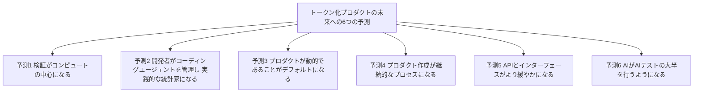

生成されたインターフェース・コード・ワークフロー・API呼び出し・説明文などを、すべて「候補となる成果物」として扱い、利用の前・最中・後にスコアリングし、モデル・プロンプト・データ・ツール・制約・ポリシー・ユーザー文脈のプロブナンス(来歴)を保持し続けることが、この未来に備える具体的な行動として示されています。

---

## 実践ワーク:最小限のAI品質システムを組んでみる

本書のボリュームに圧倒されそうになったら、第20章で紹介されている「最小限のAI品質システム」から始めるとよい、と著者は述べています。これは儀式ではなく本物のエビデンスを生み出す、小さいが機能するシステムです。初学者が最初の一歩として真似できる形で整理すると、次のようになります。

1. **本番相当のケースをおよそ50件用意する** — よくある利用シーン、価値の高いビジネスフロー、境界ケース、ポリシー境界、セキュリティに敏感なケース、紛らわしいユーザー入力、そして本番やドッグフーディングで実際に見つかった失敗例を含める
2. **0から10、あるいは0から1のスコアを定義する** — ただし、その数字が何を意味するのかを明確にしておく
3. **1つのLLM判定者をスケール用に使う** — ただし必ず人間によるレビューでキャリブレーションする
4. **意見の不一致を隠さずレビューする**
5. **すべての実行についてトレースを記録する** — プロンプト、モデル、システムメッセージ、検索コンテキスト、ツール呼び出しとその引数、レスポンス、コスト、レイテンシ、判定者のバージョン、ルーブリックのバージョン、最終判断まで
6. **ハードブロッカーを明確に定義しておく** — プライバシー漏えい、危険なツール呼び出し、ポリシー違反、深刻なハルシネーション、取り返しのつかない操作、スクリーンショットを撮られたら会社の恥になるような失敗など

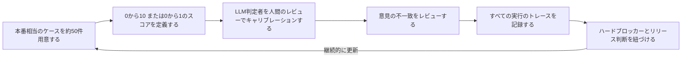

著者は、この最小限のシステムを「進化し続ける制御システム」として扱うべきだと強調しています。ケース・ルーブリック・判定者・モデル・プロンプト・ポリシー・検索インデックス・ツール・リリース閾値のすべてを、まとめてバージョン管理することが重要です。来歴(provenance)のないスコアは、エビデンスとは呼べません。

---

## 用語集

| 用語 | 説明 |
| --- | --- |
| Confidence Engineering(確信のエンジニアリング) | 非決定的なAIシステムに対して 正当化された確信を築くための実務規律 |
| Confidence Engineer | プロダクトの意図 コード テスト Eval トレース ロールアウトをつなぎ リリース判断のエビデンスに責任を持つ役割 |
| 非決定的システム | 同じ入力でも実行するたびに出力が変わりうるシステム |
| Eval(エバル) | AIシステムの振る舞いを測定するための評価の仕組み全体 ケース オラクル スコアリングを含む |
| オラクル | ある出力が正しいかどうかを判定するための基準や仕組み |
| LLM判定者 LLM as a Judge | LLM自身に出力の品質を評価させる仕組み 人間によるキャリブレーションが必要 |
| ルーブリック | 評価の基準と具体的な根拠 キャリブレーション例をまとめた採点表 |
| 信頼区間 | サンプルから推定した母集団の値が含まれるとみられる範囲 |
| メタモルフィックテスト | 意味的に同値な入力を与えたときに 重要な振る舞いが保たれているかを確認するテスト手法 |
| ゴールデンセット | 継続的に使い続ける基準となるテストケース集 |
| スライス | ユーザー属性や状況などのセグメントごとに結果を分けて報告すること |
| カナリア展開 | 新バージョンを一部のユーザーにだけ先行公開し 問題がないか確認する展開方式 |
| シャドウ展開 | 実際のトラフィックを複製して新バージョンに流し ユーザーには影響を与えずに検証する方式 |
| ガードレール | AIシステムが逸脱した振る舞いをしないよう制御する仕組み |
| プロンプトインジェクション | 悪意ある指示を入力やコンテキストに紛れ込ませ AIの振る舞いを乗っ取ろうとする攻撃 |
| MCP Model Context Protocol | AIがツールや外部システムと連携するための接続プロトコル その権限管理もテスト対象になる |
| 内省 introspection | モデル内部のアテンションや活性化などの信号を調べ 振る舞いの手がかりとして使う手法 |
| RAG 検索拡張生成 | 外部の情報源を検索して取得し その結果を踏まえて生成を行う仕組み |
| N=1テスト | ユーザーが1人しかいない状況でも その人にとって正しい振る舞いをしているかを確かめるテスト |
| トークン化プロダクトの未来 | プロダクトの大半が動的に生成され 検証のための計算量が生成のための計算量を上回っていく世界観 |

---

## 業界の声:プロミネントな実践者たちの反応

本書はまだ2026年に刊行されたばかりですが、テスト業界で国際的に知られる実践者たちからすでに反応が寄せられています。

- **TestGuild Automation Podcast(Joe Colantonio)**:自動化テスト分野で国際的に知られるポッドキャストのエピソード600でJason Arbonを迎え、「コーディングがAIに吸収され、仕様書き作業が薄くなり、プロダクト・開発・テストの役割が1つに収束していく」という本書の議論を紹介しています。番組では、AIが生み出した成果物を見て、出荷してよいかをエビデンスに基づいて判断できる人こそが最後まで残る役割だ、という著者の主張が取り上げられています。
- **Tariq King(AISTA共同創設者、Jason Arbonの長年の協業者)**:自身のLinkedInで本書を「この分野への大きな貢献」と評し、2026年のPacific Northwest Software Quality Conferenceで開かれるというサイン会にも言及しています。
- **書籍サイトに名を連ねる実務レビュアーたち**:LLM判定者のコスト面での現実性や実務的な評価ツールを助言したSergio Segura、判定者の一貫性やプロフェッショナル向けのトーンについて助言したZoltán Tarkó、ISO/IEC 42001といった規制文脈や初学者向けのSKILL.md解説について助言したJeffery Evansなど、実務者からのフィードバックを取り入れて執筆された経緯が公開されています。

なお、同時期に刊行されたAI品質関連の書籍としては、ISTQBの公式CT-AIシラバスに基づく『Introduction to AI Testing: Guide to ISTQB CT-AI Certification』(BCS、2025年)もあります。こちらは資格試験対策という性格が強く、『Testing AI』が実務者の経験と議論を軸にしているのとは対照的な位置づけです。両者を読み比べると、AI品質という分野が「標準化された資格の枠組み」と「実務者コミュニティの生きた知見」という2つの方向から同時に整備されつつあることがよく分かります。

## 批判的に読む

本書を鵜呑みにせず、バランスよく受け止めるために意識しておきたい点をいくつか挙げます。

- **刊行されたばかりで独立系の流通である点**:本書は2026年刊行の初版で、AmazonのASIN表記からは、O'ReillyやManning、BCSのような伝統的な出版社を介さず独立系(セルフパブリッシング寄り)で流通している可能性が高いと見られます。長年の版を重ねてきたソフトウェア工学の古典と違い、まだ広範な査読やレビューの蓄積があるわけではない点は踏まえておく必要があります。
- **「Confidence Engineer」はまだ提案段階の呼称であること**:本書はこの役割名を強く打ち出していますが、2026年時点で「SDET」や「QAエンジニア」のように業界標準として定着した肩書きではありません。著者自身の造語であり、今後この呼び方がどれだけ定着するかは未知数です。
- **著者自身のビジネスとの近さ**:Jason Arbonはtest.ai、Testers.ai、Checkie.AI、Jank.AI、IcebergQAといったAIテスト関連の企業を創業・関与してきた人物です。実務経験に裏打ちされた説得力がある一方で、紹介されるツールや手法が著者自身のビジネス領域と重なる可能性も念頭に置いて読むとよいでしょう。
- **具体的な数値や個別ツールの言及は陳腐化が早い**:AI分野の進歩は非常に速く、特定のモデルの挙動やベンチマークの数値、個別ツールの紹介は、刊行から時間が経つほど古くなっていきます。統計や測定の「考え方」を吸収することを優先し、個別の数値例はあくまで執筆時点のスナップショットとして扱うのが安全です。
- **標準志向の代替資料と併読する価値**:ベンダー中立で標準化された枠組みを重視するなら、ISTQBのCT-AIシラバスに基づく書籍や、OWASPのLLMアプリケーション向けトップ10、NISTのAIリスクマネジメントフレームワークといった一次情報を併読すると、本書の実務的な主張をより客観的に検証できます。

---

## チェックリスト

初めてAIシステムの品質保証に取り組むときに、本書の考え方をどこから適用すればよいか迷ったら、以下を目安にしてください。

- [ ] 完全一致のアサーションに頼っているテストがないか洗い出した
- [ ] 少なくとも1つの重要な機能について 繰り返し実行して出力の分布を測定した
- [ ] スコアと一緒に信頼区間やサンプル数を報告する習慣がある
- [ ] ユーザー属性や状況別のスライスで結果を確認している
- [ ] LLM判定者を使う場合 人間のレビューでキャリブレーションしている
- [ ] 評価者同士の意見の不一致を 隠さずに確認している
- [ ] すべての実行についてプロンプト モデル バージョン コストなどのトレースを記録している
- [ ] カナリアやシャドウ展開など 段階的なリリース戦略を持っている
- [ ] ロールバックの引き金になる明確なシグナルを事前に定義している
- [ ] AI生成コードを 別の経路でレビューする仕組みがある
- [ ] プロンプトインジェクションなど 信頼できない入力チャネルへの脅威モデリングを行っている
- [ ] ハードブロッカー(プライバシー漏えい 危険なツール呼び出しなど)を明文化している
- [ ] 品質に関するエビデンスに責任を持つ人 Confidence Engineerに相当する役割 が明確になっている

---

## まとめ

『Testing AI: Engineering Confidence in Non-Deterministic Systems』は、AIを組み込んだソフトウェアの品質保証を、「テストが通ったか通らなかったか」という二値的な発想から、「どれだけの根拠(エビデンス)を積み上げて出荷を判断できるか」という考え方へと転換させる実務書です。

第I部で完全一致から分布ベースの評価への発想転換を学び、第II部でEvalの作り方と本番運用を学び、第III部で生成コードの検証と「Confidence Engineer」という役割を理解し、第IV部でデータ・セキュリティ・安全性・モデル内部という発展的なテーマに触れ、第V部で未来のシステムと実践的なプレイブックに落とし込む、という流れは、初学者がAI品質という新しい分野を体系的に学ぶための良い地図になります。

本書はまだ新しく、独立系の刊行物であるという性質上、鵜呑みにせず他の標準的な資料と突き合わせながら読むことが望ましいものの、非決定的なAIシステムをどう「エビデンスに基づいて」出荷するかという問いに正面から取り組んだ、現時点で貴重な実務書であることは間違いありません。

---

## 参考文献・出典

1. Testing AI 公式サイト(書籍概要 全21章の構成 読者向けメッセージ) — https://www.testingaibook.com/
2. Testing AI Knowledge Edition(章ごとの概念解説 194のセクションブリーフ) — https://www.testingaibook.com/knowledge/index.html
3. 第1章 セクション001「The Next Generation AI Builder Will Measure Uncertainty」 — https://www.testingaibook.com/knowledge/ch001-measure-uncertainty.html
4. 第5章 セクション028「LLM-as-a-Judge」 — https://www.testingaibook.com/knowledge/ch028-llm-judge.html
5. 第11章 セクション087「The Confidence Engineer」 — https://www.testingaibook.com/knowledge/ch087-confidence-engineer.html
6. 第20章 セクション172「Minimum Viable AI Quality System」 — https://www.testingaibook.com/knowledge/ch172-minimum-viable-quality.html
7. 第21章 セクション174「Six Predictions for the Tokenized Product Future」 — https://www.testingaibook.com/knowledge/ch174-predictions-tokenized-product-future.html
8. Amazon(Testing AI ペーパーバック Kindle版の書誌情報) — https://www.amazon.com/dp/B0H8J9GCK1
9. TestGuild Automation Podcast エピソード600 Joe ColantonioによるJason Arbonへのインタビュー — https://testguild.com/podcast/a600-jason/
10. Tariq King LinkedInプロフィール(本書への言及を含む投稿) — https://www.linkedin.com/in/tariqking/
11. Jason Arbon LinkedInプロフィール — https://www.linkedin.com/in/jasonarbon
12. Jason Arbon 個人サイト — https://jarbon.ai/
13. Testers.ai(Jason Arbonが設立したAIテスト企業) — https://testers.ai/
14. Jason Arbon Medium(執筆記事一覧) — https://jarbon.medium.com/
15. How Google Tests Software(Jason Arbon 共著) Amazon書誌情報 — https://www.amazon.com/dp/0321803027
16. App Quality: Secrets for Agile App Teams(Jason Arbon 著) Amazon書誌情報 — https://www.amazon.com/dp/1499751273
17. Tariq King プロフィール Perforce Software — https://www.perforce.com/author/tariq-king
18. King T. M., Arbon J., Santiago D., Adamo D., Chin W., Shanmugam R. 「AI for Testing Today and Tomorrow: Industry Perspectives」 IEEE International Conference on Artificial Intelligence Testing 2019 Semantic Scholar — https://www.semanticscholar.org/paper/AI-for-Testing-Today-and-Tomorrow:-Industry-King-Arbon/d19232f659c0f1681a1a837099be46bf10dae7ae
19. Arbon J. 「AI for Software Testing」 Semantic Scholar(当初ご共有いただいたリンク) — https://www.semanticscholar.org/paper/AI-for-Software-Testing-Arbon/50f77f76012710ca45ee214145e5e031af67c93b
20. Introduction to AI Testing: Guide to ISTQB CT-AI Certification(BCS 2025年 比較対象として言及) Amazon書誌情報 — https://www.amazon.com/Introduction-AI-Testing-ISTQB%C2%AE-Certification/dp/1780177186
