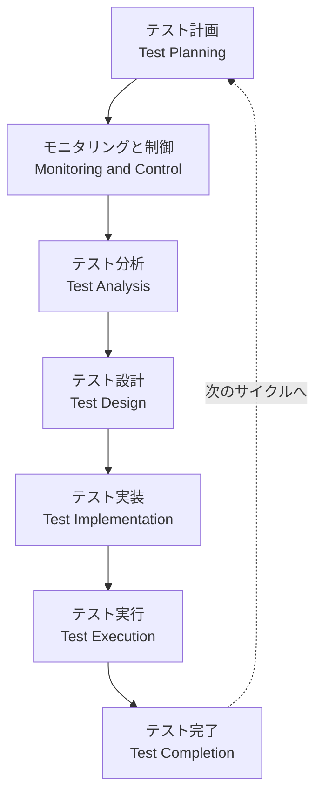
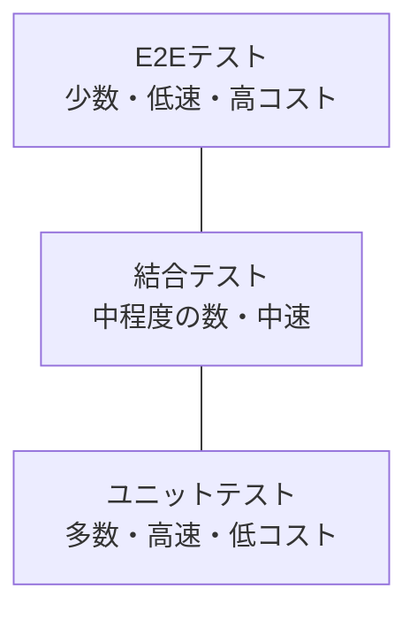
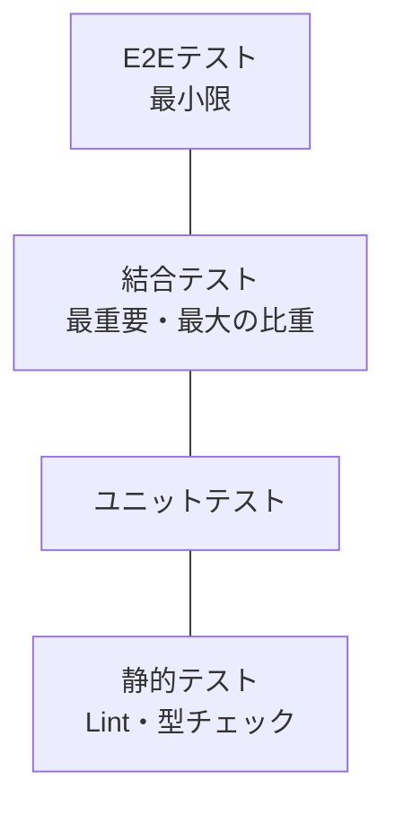
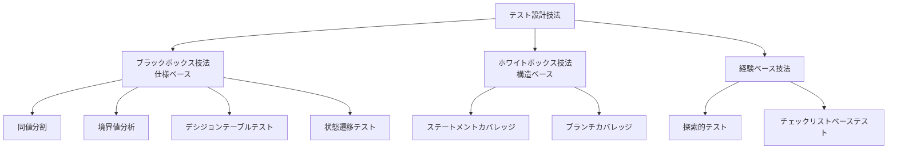
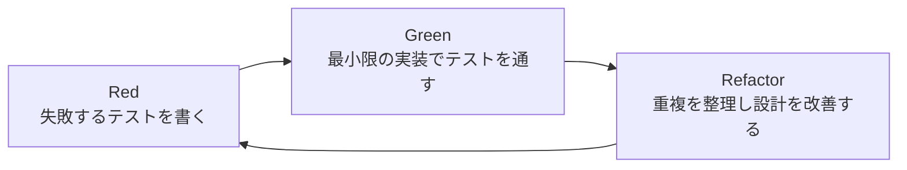
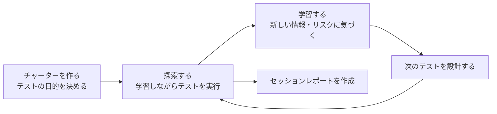
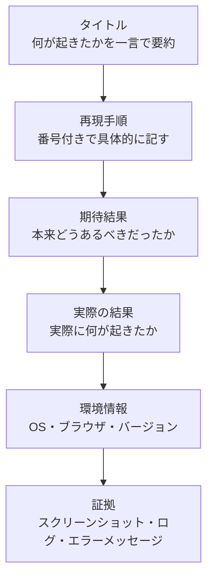
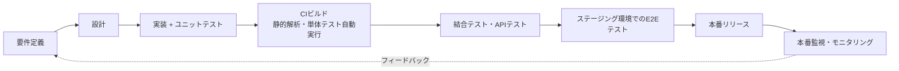
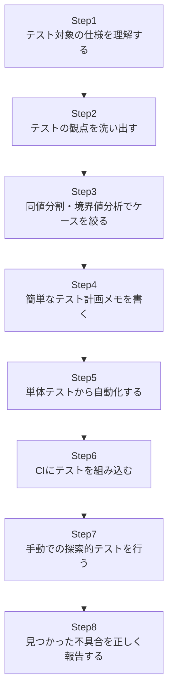

# Testing Computer Software 入門ガイド ― 初学者のためのソフトウェアテスト・ベストプラクティス

> 本ガイドは、Cem Kaner・Jack L. Falk・Hung Quoc Nguyen による古典的名著
> **『Testing Computer Software』**（Van Nostrand Reinhold, 1993）の構成に着想を得つつ、
> 2026年8月31日時点までの情報をウェブ検索で確認し、Martin Fowler・Kent C. Dodds・
> James Bach・Michael Bolton・Simon Tatham といった国際的に著名な開発者/テストエンジニアの
> 発信内容を踏まえて再構成した、初学者向けのステップバイステップ実践ガイドです。
> 図解はすべて Mermaid、表はすべて Markdown 記法で作成しており、ASCIIアートは使用していません。

---

## 目次

1. [『Testing Computer Software』という本について](#1-testing-computer-softwareという本について)
2. [ソフトウェアテストとは何か](#2-ソフトウェアテストとは何か)
3. [なぜテストが必要なのか ― 欠陥は早く見つけるほど安い](#3-なぜテストが必要なのか--欠陥は早く見つけるほど安い)
4. [テストの7原則(ISTQB)](#4-テストの7原則istqb)
5. [基本テストプロセスの全体像](#5-基本テストプロセスの全体像)
6. [テストレベル ― 単体・結合・システム・受け入れ](#6-テストレベル--単体結合システム受け入れ)
7. [テスト自動化戦略 ― テストピラミッドとテストトロフィー](#7-テスト自動化戦略--テストピラミッドとテストトロフィー)
8. [テスト設計技法 ― ブラックボックス/ホワイトボックス/経験ベース](#8-テスト設計技法--ブラックボックスホワイトボックス経験ベース)
9. [テスト駆動開発(TDD)](#9-テスト駆動開発tdd)
10. [探索的テストとコンテキスト駆動テスト](#10-探索的テストとコンテキスト駆動テスト)
11. [効果的なバグレポートの書き方](#11-効果的なバグレポートの書き方)
12. [テスト計画とドキュメント](#12-テスト計画とドキュメント)
13. [シフトレフトとCI/CDへのテスト統合](#13-シフトレフトとcicdへのテスト統合)
14. [2026年の潮流 ― AIとエージェント型テスト自動化](#14-2026年の潮流--aiとエージェント型テスト自動化)
15. [初心者のための実践ステップバイステップガイド](#15-初心者のための実践ステップバイステップガイド)
16. [チェックリスト](#16-チェックリスト)
17. [まとめ](#17-まとめ)
18. [参考文献・出典URL一覧](#18-参考文献出典url一覧)

---

## 1. 『Testing Computer Software』という本について

『Testing Computer Software』は、Cem Kaner・Jack L. Falk・Hung Quoc Nguyen の3名によって書かれ、
1993年に Van Nostrand Reinhold から第2版が刊行された、ソフトウェアテスト分野における古典的な入門書です。
全480ページで、テストの目的と限界、テストの種類、バグ報告と追跡、テストケース設計、
テストツール、テスト計画書の作り方、テストグループのマネジメント、欠陥のある
ソフトウェアがもたらす法的責任まで、実務に直結する内容を幅広くカバーしています。

### 書誌情報

| 項目 | 内容 |
| --- | --- |
| 書名 | Testing Computer Software |
| 著者 | Cem Kaner, Jack L. Falk, Hung Quoc Nguyen |
| 出版社 | Van Nostrand Reinhold |
| 出版年 | 1993年(第2版) |
| ページ数 | 480ページ |
| ISBN | 0442013612 / 9780442013615 |

### 目次構成(章立ての要約)

| # | 章のテーマ(日本語要約) |
| --- | --- |
| 1 | あるテストシリーズの実例 |
| 2 | テストの目的と限界 |
| 3 | ソフトウェア開発プロセスにおけるテストの種類と位置づけ |
| 4 | ソフトウェアの誤り(エラー)とは何か |
| 5 | バグの報告と分析 |
| 6 | 問題追跡システム(バグトラッキングシステム) |
| 7 | テストケース設計 |
| 8 | プリンタなど周辺機器のテスト |
| 9 | ローカライゼーション(多言語対応)テスト |
| 10 | ユーザーマニュアルのテスト |
| 11 | テストツール |
| 12 | テスト計画とテストドキュメント |
| 13 | 全体をまとめる ― テスト活動の統合 |
| 14 | 欠陥のあるソフトウェアの法的責任 |
| 15 | テストグループのマネジメント |
| 16 | よくあるソフトウェアの誤りのカタログ |

著者の一人である Cem Kaner はその後、James Bach・Bret Pettichord・Brian Marick
とともに「コンテキスト駆動テスト(Context-Driven Testing)」を一つの学派として
2001年に宣言し、テストは常に文脈(プロジェクトの制約・目的・リスク)に応じて
設計されるべきだという思想を広めました。この考え方は本ガイドの探索的テストの章(第10章)でも扱います。

> 本書自体は電子版が提供されておらず、詳細な原文は書店・図書館等でのみ参照可能です
> (出典URLは本ガイド末尾の参考文献一覧を参照)。本ガイドは同書の構成を参考にしつつ、
> 2026年時点の実務・業界動向を踏まえて独自に再構成したものです。

---

## 2. ソフトウェアテストとは何か

初学者がまず押さえるべきは、「テスト」「デバッグ」「品質保証(QA)」という
似て非なる3つの言葉の違いです。

| 用語 | 目的 | 誰が行うか |
| --- | --- | --- |
| テスト(Testing) | ソフトウェアが要件を満たしているかを検証し、欠陥を発見すること | テスター・開発者・チーム全員 |
| デバッグ(Debugging) | テストで見つかった欠陥の原因を特定し、修正すること | 主に開発者 |
| 品質保証(QA) | 欠陥が生まれにくい開発プロセスそのものを改善すること | チーム・組織全体 |

テストは「プログラムを壊すこと」が目的ではなく、リリース前にリスクを可視化し、
関係者が意思決定できる情報を提供することが本質的な目的です。ISTQB(International
Software Testing Qualifications Board)の公式シラバスでも、テストは要件の充足確認・
欠陥の摘出・意思決定のための信頼性の提供という複数の目的を持つプロセスとして
定義されています。

---

## 3. なぜテストが必要なのか ― 欠陥は早く見つけるほど安い

ソフトウェア開発における広く知られた経験則として、欠陥を発見する工程が後になるほど、
修正コストが増大するという考え方があります。要件定義・設計段階で見つかった欠陥は
仕様の書き換えだけで済むのに対し、本番リリース後に見つかった欠陥は、調査・修正・
再テスト・再デプロイに加えて、障害対応や利用者への影響まで含めたコストがかかるためです。

| 欠陥が発見される工程 | 修正に必要となる作業の広がり |
| --- | --- |
| 要件定義・設計段階 | 仕様・設計ドキュメントの修正のみ |
| コーディング段階 | 実装の修正と、対象箇所のテストのやり直し |
| システムテスト段階 | 実装修正に加え、関連機能の回帰テストとスケジュールへの影響 |
| 本番リリース後 | 上記すべてに加え、障害対応・緊急リリース・利用者への影響 |

> 「要件定義段階の1倍に対してコーディングで6.5倍、本番で100倍」といった具体的な倍率が
> IBM Systems Sciences Institute の推計として広く引用されていますが、その原典データを
> 追跡できる一次資料は確認できていないため、本ガイドでは倍率を示しません。
> 一方で「後工程ほど修正コストが跳ね上がる」という傾向自体は、NIST が2002年に公表した
> ソフトウェアテストの経済影響に関する報告書(参考文献15)が、米国経済全体での
> 不十分なテストインフラの損失を試算するかたちで裏付けています。
> 実際のコスト差はプロジェクトの規模・アーキテクチャ・リリース形態によって大きく変動します。

この経験則が、後述する「シフトレフト」や「テスト駆動開発」といった
「できるだけ早い段階でテストする」考え方の根拠になっています。

---

## 4. テストの7原則(ISTQB)

ISTQB Foundation Levelシラバスでは、テストに関する7つの原則が整理されています。
初学者はまずこの原則を理解することで、テストに対する誤解(「全部テストすれば
バグはゼロになる」等)を避けられます。

| 原則 | 内容の要約 |
| --- | --- |
| ① テストは欠陥があることを示せるが、欠陥がないことは証明できない | テストで欠陥が見つからなくても「バグゼロ」の証明にはならない |
| ② 全数テストは不可能 | 入力の組み合わせは膨大なため、リスクに基づいて優先順位をつける必要がある |
| ③ 早期テストで時間とコストを節約できる | 開発の初期段階からテスト活動を始めるほど効果的 |
| ④ 欠陥は偏在する | バグは特定のモジュールに集中する傾向があり、そこを重点的にテストする |
| ⑤ 殺虫剤のパラドックス | 同じテストを繰り返すと新しい欠陥を見つけられなくなるため、テストを見直し続ける必要がある |
| ⑥ テストは状況次第 | Webアプリと組込み機器では適切なテスト手法が異なる |
| ⑦ 「バグゼロ」の落とし穴 | バグを全部直しても、要件自体が間違っていればユーザーに使われないシステムになる |

---

## 5. 基本テストプロセスの全体像

ISTQBが定義する基本テストプロセスは、以下のような活動のサイクルとして整理できます。
ウォーターフォールのように一直線に進むのではなく、プロジェクトの中で繰り返し回される
反復的なプロセスである点がポイントです。

- **テスト計画**: 何を、どこまで、どのようにテストするかの方針を決める
- **モニタリングと制御**: 計画に対する進捗を継続的に確認し、必要に応じて計画を調整する
- **テスト分析**: テストベース(要件やユーザーストーリー)から「何をテストすべきか」を洗い出す
- **テスト設計**: テストケース・テストデータの具体的な内容を設計する
- **テスト実装**: テストスクリプトや手順書を実際に用意する
- **テスト実行**: テストを実際に走らせ、結果を記録する
- **テスト完了**: テスト結果をまとめ、得られた知見を次のプロジェクトに活かす

---

## 6. テストレベル ― 単体・結合・システム・受け入れ

テストは対象範囲の大きさによって、いくつかの「レベル」に分類されます。

| テストレベル | 対象範囲 | 主な実施者 | 実行速度 |
| --- | --- | --- | --- |
| 単体テスト(Unit Test) | 関数・メソッド単位の最小の部品 | 開発者 | 非常に速い(ミリ秒〜秒) |
| 結合テスト(Integration Test) | 複数のモジュール・サービス間の連携 | 開発者/テスター | 速い(秒〜分) |
| システムテスト(System Test) | アプリケーション全体の振る舞い | テスター | 遅い(分〜時間) |
| 受け入れテスト(Acceptance Test) | ビジネス要件を満たしているかの最終確認 | ユーザー/プロダクトオーナー | 手動を含みさらに遅い |

これらのレベルをどのような比率で組み合わせるべきかについては、次章で紹介する
「テストピラミッド」と「テストトロフィー」という2つの有名な考え方があります。

---

## 7. テスト自動化戦略 ― テストピラミッドとテストトロフィー

### 7.1 テストピラミッド(Martin Fowler)

「テストピラミッド」は、ソフトウェア工学の分野で世界的に著名な Martin Fowler が
自身のブログで広めた考え方で、自動テストを粒度別のグループに分け、下層(粒度の細かい
単体テスト)ほど多く、上層(粒度の粗いE2Eテスト)ほど少なく作るべきだという
バランスの取り方を示すメタファーです。Fowler の同僚である Ham Vocke が
「The Practical Test Pyramid」という記事で、実例を交えてこの考え方を具体化しています。

Googleのテストブログが2015年に公開した「Just Say No to More End-to-End Tests」という
記事も同様の問題意識から書かれたもので、E2Eテストは壊れやすく(flaky)、
原因の特定が難しく、実行に時間がかかるため、テストの大部分は単体テストで担い、
E2Eテストは本当に重要な導線に絞るべきだと主張しています。

### 7.2 テストトロフィー(Kent C. Dodds)

一方で、JavaScriptコミュニティで著名なエンジニア・教育者である Kent C. Dodds は、
2018年ごろから「テストトロフィー(Testing Trophy)」という別の形のメタファーを提唱しています。
静的型チェックやLintのような「静的テスト」を土台に置き、結合テストに最も大きな
比重を置く点がテストピラミッドとの大きな違いです。Dodds は、モダンなテストツールの進化により
結合テストのコストが下がったことで、費用対効果(ROI)の面で結合テストが
最も割に合う投資先になったと説明しています。

### 7.3 どちらを選ぶべきか

| 観点 | テストピラミッド | テストトロフィー |
| --- | --- | --- |
| 提唱者 | Martin Fowler(および Mike Cohn の初期の着想) | Kent C. Dodds |
| 最重要視する層 | ユニットテスト | 結合テスト |
| 土台に含むか | 静的解析は明示的な層としない | 静的テスト(型チェック・Lint)を土台に含む |
| 向いている領域 | サーバーサイドのロジックが複雑なシステム | UIコンポーネントを多く持つフロントエンド |

Dodds自身も、このトロフィーの考え方は単一のコードベースを前提としており、
マイクロサービスやサーバーレス関数を組み合わせた構成では比率が変わりうると
補足しています。どちらの形も「絶対的な正解」ではなく、自分たちのアーキテクチャと
ツールに応じて調整すべき「考え方の道具」として理解することが重要です。

---

## 8. テスト設計技法 ― ブラックボックス/ホワイトボックス/経験ベース

テストケースをどう作るかには体系立った技法があります。ISTQBのシラバスでも
体系的に整理されている代表的な技法を紹介します。

### 8.1 代表的なブラックボックス技法

| 技法 | 概要 | 具体例 |
| --- | --- | --- |
| 同値分割(Equivalence Partitioning) | 入力値を「同じ結果になるはずのグループ」に分け、各グループから代表値を1つ選んでテストする | 年齢入力欄なら「未成年」「成人」の2グループから1件ずつ選ぶ |
| 境界値分析(Boundary Value Analysis) | 同値クラスの境界(最小値・最大値・その前後)を重点的にテストする | 「18歳以上」の条件なら17歳・18歳・19歳をテストする |
| デシジョンテーブルテスト | 複数条件の組み合わせを表にまとめ、組み合わせごとの期待結果を網羅的に検証する | 「会員かつクーポン有り」など条件の掛け合わせを表で整理する |
| 状態遷移テスト | システムが取りうる状態と、状態間の遷移を洗い出してテストする | ログイン前・ログイン後・ロック中、といった状態の遷移を検証する |

### 8.2 ホワイトボックス技法

ホワイトボックス技法は、コードの内部構造(制御フロー)に基づいてテストケースを
設計する手法です。代表的なものに、すべての命令行を最低1回は実行する
「ステートメントカバレッジ」と、すべての分岐(if文のtrue/falseなど)を
最低1回は通す「ブランチカバレッジ」があります。カバレッジ100%は
「すべての行を実行した」ことを保証しますが、「すべての組み合わせを網羅した」
ことまでは保証しない点に注意が必要です。

---

## 9. テスト駆動開発(TDD)

テスト駆動開発(Test-Driven Development, TDD)は、エクストリームプログラミング(XP)の
実践者として知られる Kent Beck が体系化した開発手法です。著書
『Test-Driven Development: By Example』の中で、Beck は「Red・Green・Refactor」という
短いサイクルを繰り返すリズムとしてTDDを説明しています。

- **Red**: まだ存在しない機能に対して、まず失敗するテストを書く
- **Green**: そのテストを通すために必要最小限のコードを書く(多少泥臭くてもよい)
- **Refactor**: テストが通っている安全な状態を保ちながら、コードの重複や設計上の
  問題を整理する

TDDの本質はテストそのものよりも「設計の道具」である点にあります。先にテストを書くことで、
実装よりも先にインターフェースや依存関係について考えることを強制されるためです。
Robert C. Martin(Uncle Bob)も、Beckから直接ペアプログラミングで指導を受けた際の
経験として、非常に細かい粒度でRed/Green/Refactorのサイクルを回す実践を紹介しています。

---

## 10. 探索的テストとコンテキスト駆動テスト

自動テストがどれだけ充実していても、人間による探索的な調査は依然として重要です。
探索的テスト(Exploratory Testing)は、James Bach が1990年代に提唱し、
Michael Bolton とともに体系化した「Rapid Software Testing(RST)」という
アプローチの中核をなす考え方です。両者は、テスト設計・学習・テスト実行を
同時並行的に行うプロセスとして探索的テストを定義しています。

Cem Kaner・James Bach・Bret Pettichord・Brian Marick らは2001年、テストは常に
プロジェクトの文脈(予算・スケジュール・技術・関係者の価値観)に依存して最適な方法が
変わるという考え方を「コンテキスト駆動テスト(Context-Driven Testing)」という
一つの学派として宣言しました(第1章で触れたとおり、Kaner らはそれ以前から
同じ問題意識を共有しており、2001年の『Lessons Learned in Software Testing』
刊行が学派としての宣言の節目にあたります)。これは「テストケースを網羅的に書いて実行する」という
factory-style(工場方式)のテストとは対照的に、スキルを持ったテスト担当者による
継続的な調査・判断を重視するアプローチです。

このアプローチの実践単位として、あらかじめ大まかな目的(チャーター)を決めて
一定時間(例えば90分)集中してテストする「セッションベーステストマネジメント
(Session-Based Test Management)」という手法もよく併用されます。

---

## 11. 効果的なバグレポートの書き方

どれほど良いテストを実施しても、その結果が開発者に正しく伝わらなければ意味がありません。
PuTTY の開発者としても知られるプログラマー Simon Tatham は、
「How to Report Bugs Effectively」という広く読まれているエッセイの中で、
良いバグレポートの目的は「開発者の目の前でプログラムが壊れる様子を再現させること」
にあると説明しています。この考え方は今なお多くのOSSプロジェクトのバグ報告ガイドラインの
基礎になっています。

### 良いバグレポートの要素

| 要素 | ポイント |
| --- | --- |
| 再現手順 | 「その手順を踏めば誰でも同じ現象を再現できる」レベルまで具体的に書く |
| 事実と推測の区別 | 「実際に見たこと」と「自分の推測」を明確に分けて書く |
| 期待結果と実際の結果 | 「何を期待していたか」と「実際に何が起きたか」を両方書く |
| バージョン情報 | ソフトウェアのバージョン、OS、環境情報を書き添える |
| 1レポート1バグ | 複数の問題を1つのレポートに詰め込まない |
| 感情的な表現を避ける | 開発者を非難する表現よりも、事実に基づいた記述を優先する |

Tatham は、バグレポートにおいて「事実」と「推測」を混同しないこと、
そして開発者が実際に問題を再現できるだけの十分な情報を提供することの重要性を
繰り返し強調しています。

---

## 12. テスト計画とドキュメント

『Testing Computer Software』でも1つの章が割かれているように、テスト計画書は
「何を」「どこまで」「どのように」テストするかについて関係者の認識を揃えるための
重要な成果物です。ISO/IEC/IEEE 29119 などの国際規格でもテストの作業成果物として
位置づけられています。

| ドキュメント | 主な記載内容 |
| --- | --- |
| テスト計画書(Test Plan) | テストの目的・範囲・スケジュール・体制・リスクと対応方針 |
| テスト設計仕様書 | テスト対象の機能ごとに、どのような観点でテストするかの方針 |
| テストケース | 具体的な入力・操作手順・期待結果の組み合わせ |
| テスト実行ログ | いつ・誰が・どのテストを・どんな結果で実行したかの記録 |
| インシデント/欠陥レポート | 発見された不具合の詳細(第11章参照) |
| テストサマリーレポート | テスト活動全体の結果、残存リスク、品質の状況をまとめた報告書 |

初学者がまず作成すべきなのは、壮大な文書ではなく「何をテストして、何をテストしない
のかが一目でわかる」シンプルなテスト計画のメモです。ドキュメントの厚みよりも、
チーム内でリスクの認識が揃っていることの方がずっと重要です。

---

## 13. シフトレフトとCI/CDへのテスト統合

「シフトレフト(Shift-Left Testing)」とは、開発工程を左から右へ流れる図(要件→設計→
実装→リリース)に見立てたとき、従来は右側(リリース直前)に置かれがちだった
テスト活動を、できるだけ左側(要件定義・設計・実装の早い段階)に移す考え方です。
この用語は2001年に Larry Smith が提唱したとされ、現在ではCI/CDパイプラインへの
テストの組み込みとセットで語られるのが一般的です。

DORA(DevOps Research and Assessment)も、コミットのたびに自動テストが走る
継続的インテグレーションを、ソフトウェアデリバリのパフォーマンスを高める
中核ケイパビリティの一つとして挙げています(参考文献16)。実務上のコツとして、
CIのテストは「10分以内」を目安に高速化することが重要だとされます。
実行時間が長すぎるテストはやがて開発者に敬遠され、形骸化してしまうためです。

---

## 14. 2026年の潮流 ― AIとエージェント型テスト自動化

2026年8月時点の業界動向として、AIによるテスト生成・実行の自動化(いわゆる
「エージェント型テスト」)への投資が急速に進んでいます。テスト管理ツールベンダーの
Tricentis が2025年秋のカンファレンス「Transform」の内容をもとに公開した分析では、
自然言語のユーザーストーリーや要件から直接テストケースを生成する
「エージェント型テスト生成」が、手動でのテスト作成の手間を大きく減らす手段として
注目されていると紹介されています。

一方で、同分析は前年に書かれたコードの4割以上がAIによって生成されたとする
業界データを紹介しつつ、AIが生成したコードの本番投入に自信を持てないと回答した
開発者が大多数を占めるという調査結果や、AIの誤りが原因でリリースをロールバックした
経験を持つチームが一定数存在するという調査結果にも触れており、AI活用が進む一方で
人間による品質判断の重要性は変わらないと結論づけています。

初学者への実務的な示唆としては、以下の点を押さえておくとよいでしょう。

- AIが生成したテストコードも、人間が書いたコードと同様にレビューが必要
- 「テストが自動生成された」ことと「そのテストが意味のある検証をしている」ことは別問題
- テストの合否判断や、リリース可否のような最終判断は引き続き人間が担う領域として
  位置づけられている

---

## 15. 初心者のための実践ステップバイステップガイド

ここまでの内容を踏まえ、実際に手を動かしてテストを始めるための8ステップを示します。

1. **テスト対象の仕様を理解する**: 何が「正しい動作」なのかを、要件やユーザー
   ストーリーから明確にする。仕様が曖昧なら、実装前に確認する。
2. **テストの観点を洗い出す**: 正常系だけでなく、異常系(不正な入力、権限のない
   操作、ネットワーク切断など)の観点もリストアップする。
3. **同値分割・境界値分析でケースを絞る**: すべての入力を試すのは不可能なので、
   第8章の技法を使って「意味のある代表的なケース」に絞り込む。
4. **簡単なテスト計画メモを書く**: 何をテストし、何をテストしないのかを短くまとめ、
   チームで認識を合わせる。
5. **単体テストから自動化する**: まずは最も粒度の細かい単体テストから自動化し、
   TDD(第9章)のリズムに慣れていく。
6. **CIにテストを組み込む**: コミットやプルリクエストのたびにテストが自動実行される
   仕組み(第13章)を整える。
7. **手動での探索的テストを行う**: 自動テストではカバーしきれない「使い勝手」や
   「想定外の操作」を、探索的テスト(第10章)で補う。
8. **見つかった不具合を正しく報告する**: 第11章の要素を踏まえた、再現可能で
   事実に基づいたバグレポートを書く。

---

## 16. チェックリスト

- [ ] テスト対象の仕様・受け入れ条件を理解できているか
- [ ] 正常系だけでなく異常系・境界値のテスト観点を洗い出したか
- [ ] テストレベル(単体・結合・システム・受け入れ)の役割分担が明確か
- [ ] 自チームのアーキテクチャに合わせてテストピラミッド/トロフィーの比率を検討したか
- [ ] 単体テストがCIで自動実行される状態になっているか
- [ ] E2Eテストを「重要な導線」に絞り込めているか
- [ ] 探索的テストの時間を意識的に確保しているか
- [ ] バグレポートに再現手順・期待結果・実際の結果・環境情報が揃っているか
- [ ] テスト計画のメモがチーム内で共有されているか
- [ ] AIが生成したテストコードもレビュー対象にしているか

---

## 17. まとめ

ソフトウェアテストは、単なる「バグ探し」ではなく、リスクを可視化し、
関係者が自信を持って意思決定できるようにするための継続的な活動です。
『Testing Computer Software』が1993年に築いた「テストの目的を理解し、体系的に
設計し、正確に報告する」という基本姿勢は、テストピラミッド、テストトロフィー、
テスト駆動開発、探索的テスト、シフトレフト、そして2026年のAIエージェントによる
テスト自動化に至るまで、形を変えながら現在も受け継がれています。初学者は
まず本ガイドのステップバイステップガイド(第15章)から着手し、少しずつ
第7章〜第14章で紹介した各手法を取り入れていくことをおすすめします。

---

## 18. 参考文献・出典URL一覧

1. Cem Kaner, Jack L. Falk, Hung Quoc Nguyen, *Testing Computer Software* (Google Books書誌情報)
   <https://books.google.co.jp/books/about/Testing_Computer_Software.html?id=67JQAAAAMAAJ&redir_esc=y>
2. ISTQB(International Software Testing Qualifications Board)公式サイト
   <https://istqb.org/>
3. ISTQB Certified Tester Foundation Level (CTFL) v4.0
   <https://istqb.org/certifications/certified-tester-foundation-level-ctfl-v4-0/>
4. Martin Fowler / Ham Vocke, "The Practical Test Pyramid"
   <https://martinfowler.com/articles/practical-test-pyramid.html>
5. Martin Fowler, "Test Pyramid" (Bliki)
   <https://martinfowler.com/bliki/TestPyramid.html>
6. Martin Fowler, "Test Driven Development" (Bliki)
   <https://www.martinfowler.com/bliki/TestDrivenDevelopment.html>
7. Google Testing Blog, "Just Say No to More End-to-End Tests" (2015)
   <https://testing.googleblog.com/2015/04/just-say-no-to-more-end-to-end-tests.html>
8. Kent C. Dodds, "Static vs Unit vs Integration vs E2E Testing for Frontend Apps"
   <https://kentcdodds.com/blog/static-vs-unit-vs-integration-vs-e2e-tests>
9. Kent C. Dodds, "The Testing Trophy and Testing Classifications"
   <https://kentcdodds.com/blog/the-testing-trophy-and-testing-classifications>
10. Kent C. Dodds, "Write tests. Not too many. Mostly integration."
    <https://kentcdodds.com/blog/write-tests>
11. James Bach, Satisfice, Inc.(Rapid Software Testing / Context-Driven School)
    <https://www.satisfice.com/>
12. James Bach & Michael Bolton, Rapid Software Testing 著者紹介ページ
    <https://rapid-software-testing.com/authors/>
13. Simon Tatham, "How to Report Bugs Effectively"
    <https://www.chiark.greenend.org.uk/~sgtatham/bugs.html>
14. Tricentis, "QA trends for 2026: AI, agents, and the future of testing"
    <https://www.tricentis.com/blog/qa-trends-ai-agentic-testing>
15. NIST, "The Economic Impacts of Inadequate Infrastructure for Software Testing" (2002)
    <https://www.nist.gov/publications/economic-impacts-inadequate-infrastructure-software-testing>
16. DORA, "Continuous integration" (DORA Core ケイパビリティ解説)
    <https://dora.dev/capabilities/continuous-integration/>

> 上記のうち1〜3は一次情報源(書誌情報・標準化団体)、4〜13は国際的に著名な
> ソフトウェアエンジニア/テストエンジニア個人が発信している一次情報、14は
> 2026年時点の業界動向を把握するための業界レポート、15〜16は本文中の定量的な
> 主張(後工程ほど修正コストが増大する傾向・継続的インテグレーションの効果)の
> 根拠として参照しています。
