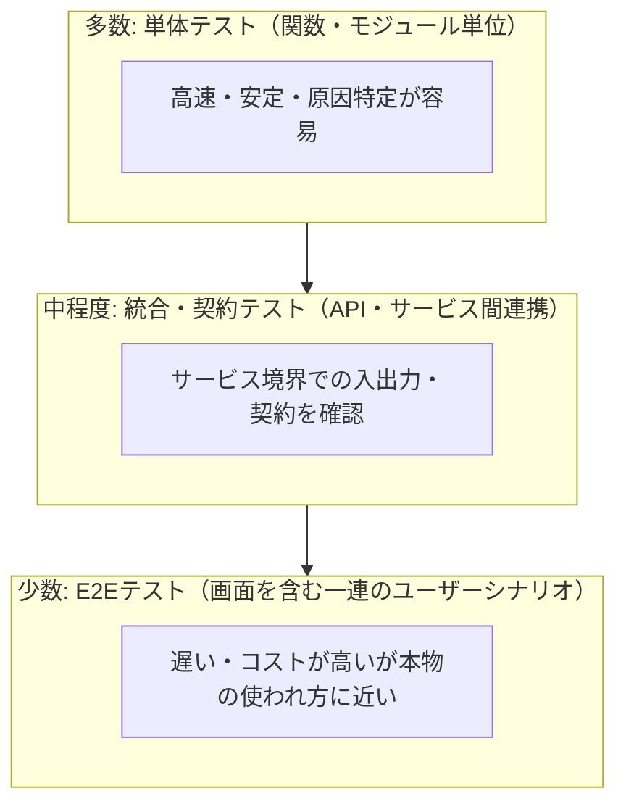
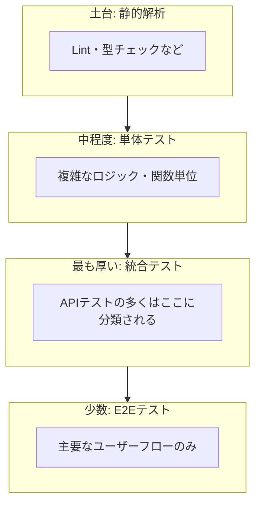
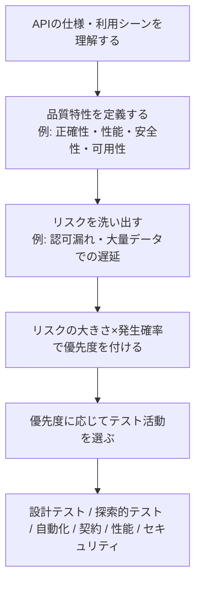
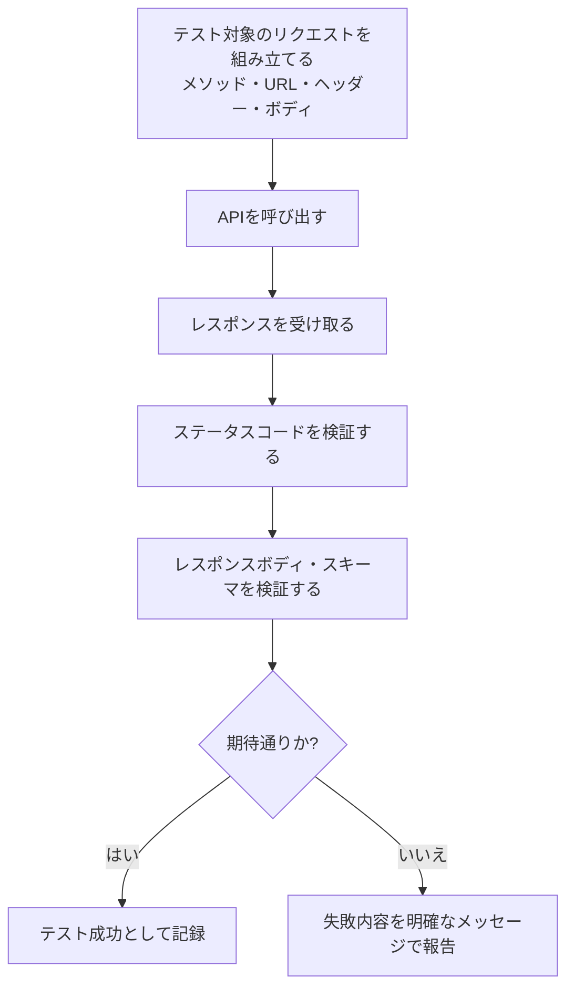
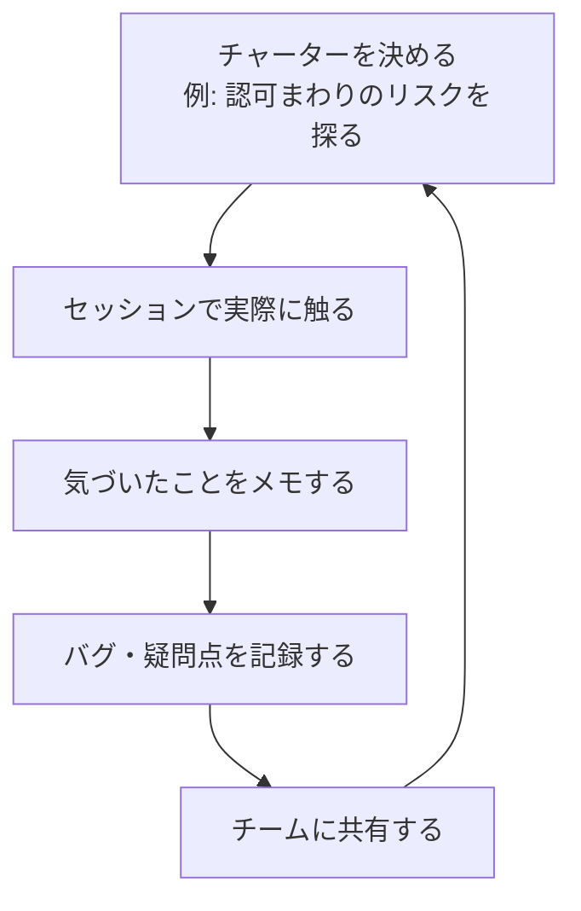
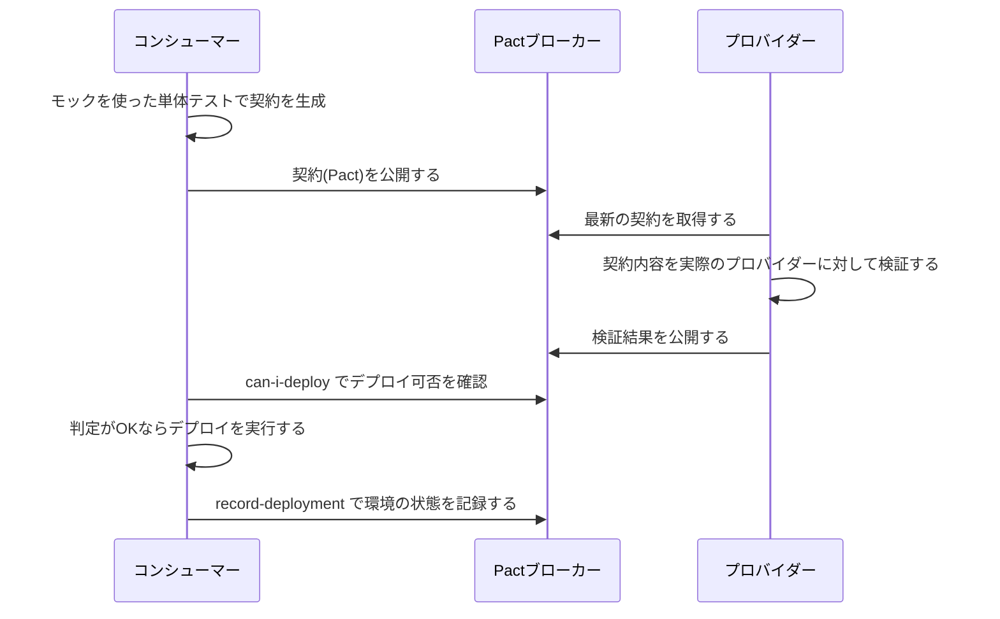
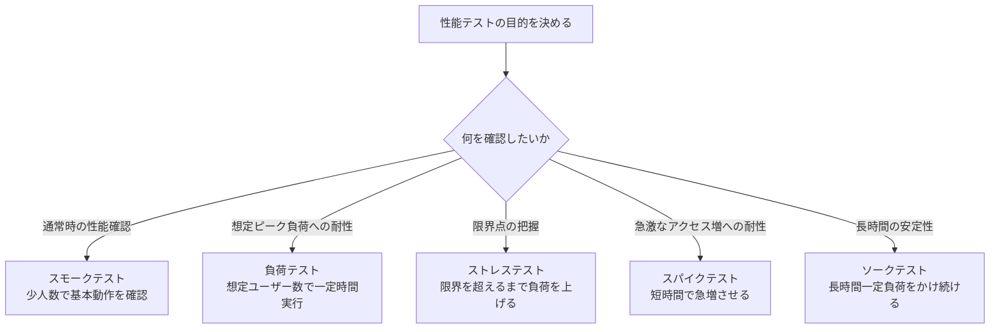
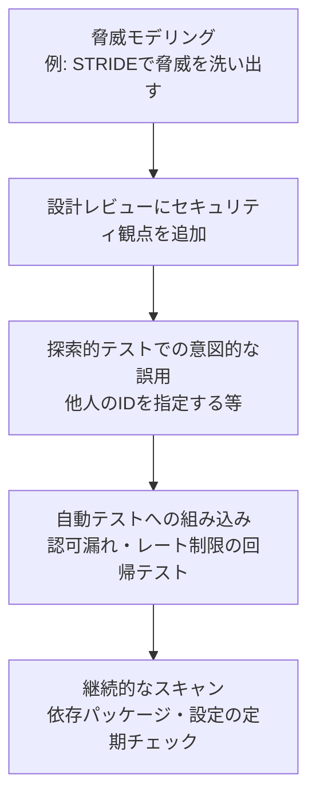
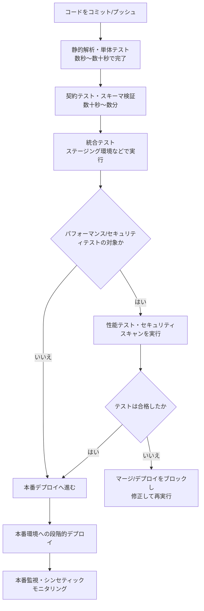
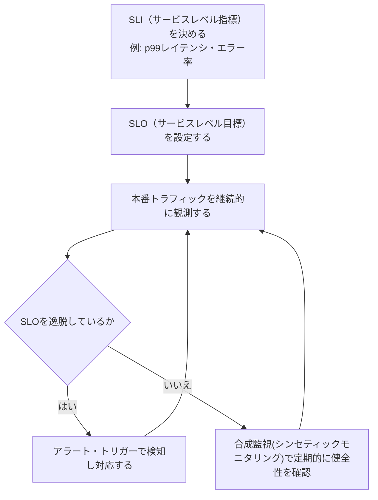

# Web APIテスト実践ガイド ― 初学者のためのステップバイステップ・ベストプラクティス

> 本ガイドは、Mark Winteringham 著『Testing Web APIs』（Manning／O'Reilly）の構成、Martin Fowler・Kent C. Dodds によるテスト戦略論、OWASP・Pact・Postman・Grafana k6 などの業界標準的な情報源をもとに、2026年8月時点の最新知見を踏まえて独自にまとめた解説書です。各セクションの根拠URLは末尾の「参考文献・出典」に記載しています。

<a id="toc"></a>

## 目次

1. [はじめに：なぜWeb APIのテストが重要なのか](#section-1)
2. [Web APIテストの全体像（テストピラミッドとテスティング・トロフィー）](#section-2)
3. [ステップ0：テストを始める前の準備（リスクベースの考え方）](#section-3)
4. [ステップ1：APIの仕様を理解する（OpenAPI/Swagger）](#section-4)
5. [ステップ2：基本のHTTPテスト設計（ステータスコードとレスポンス検証）](#section-5)
6. [ステップ3：探索的テスト（Exploratory Testing）](#section-6)
7. [ステップ4：テストの自動化とツール選定](#section-7)
8. [ステップ5：契約テスト（Contract Testing with Pact）](#section-8)
9. [ステップ6：パフォーマンス・負荷テスト](#section-9)
10. [ステップ7：セキュリティテスト（OWASP API Security Top 10）](#section-10)
11. [ステップ8：CI/CDへの統合](#section-11)
12. [ステップ9：本番環境でのテスト（Testing in Production）](#section-12)
13. [よくある落とし穴とアンチパターン](#section-13)
14. [まとめ：初学者向けチェックリスト](#section-14)
15. [参考文献・出典](#section-15)

---

<a id="section-1"></a>

## 1. はじめに：なぜWeb APIのテストが重要なのか

現代のアプリケーションの多くは、画面（UI）の裏側でWeb API（主にHTTP経由でJSONなどをやり取りするインターフェース）が実際のデータ処理を担っています。フロントエンド、モバイルアプリ、他社サービスなど、複数のクライアントが同じAPIを利用することも珍しくありません。

そのため、API自体にバグや仕様変更があると、影響はUIの不具合だけにとどまらず、連携している他システム全体に波及します。API層は「サイレントヒーロー」であると同時に、障害が起きたときの影響範囲が広い「サイレントリスク」でもあるのです。

Web APIテストとは、HTTP（またはgRPC・GraphQLなど）のレイヤーでリクエストを送り、レスポンスの正しさ・パフォーマンス・信頼性・セキュリティを検証する活動全般を指します。UIを経由しないため、UIテストよりも高速かつ安定して不具合を検出できるという利点があります。

このガイドでは、初めてAPIテストに取り組む方が迷わないように、以下の順序で解説します。

- **考え方**：何をどれだけテストすべきかを決めるための土台（テストピラミッド／トロフィー、リスクベース思考）
- **手を動かす基本**：仕様理解 → 基本的なリクエスト/レスポンス検証 → 探索的テスト
- **仕組み化**：自動化、契約テスト、パフォーマンステスト、セキュリティテスト
- **運用への組み込み**：CI/CD統合、本番監視

---

<a id="section-2"></a>

## 2. Web APIテストの全体像（テストピラミッドとテスティング・トロフィー）

### 2.1 テストピラミッド

「テストピラミッド」は、実行速度と粒度が異なる複数のテストをバランスよく組み合わせるための考え方です。Martin Fowler のブログに掲載された Ham Vocke の "The Practical Test Pyramid" では、単体テストを土台に多く配置し、統合テストを中間層に、E2E（エンドツーエンド）テストを頂点に少数だけ配置するという構成が紹介されています。

低レベルのテストほど高速・安定・原因特定がしやすく、高レベルのテストほど遅く・壊れやすい（flaky になりやすい）反面、実際のユーザー体験に近い確認ができる、というトレードオフが背景にあります。



### 2.2 テスティング・トロフィー（Testing Trophy）

一方で、JavaScriptコミュニティで著名な Kent C. Dodds は、"Write tests. Not too many. Mostly integration." というブログ記事で、開発ツールの進化により統合テストが以前ほど遅くも壊れやすくもなくなったと指摘し、統合テストに比重を置く「テスティング・トロフィー」という考え方を提唱しました。静的解析（Lint/型チェック）を最下層に加え、単体テストよりも統合テストを厚くする点がピラミッドとの大きな違いです。



### 2.3 どちらを使うべきか

Martin Fowler 自身も 2021年の記事 "On the Diverse And Fantastical Shapes of Testing" で、ピラミッド・ハニカム・トロフィーいずれも「テストの単位を誤解なく揃え、レイヤーごとに適量を保つ」という本質は共通していると述べています。初学者は、以下の表のように「自分のプロジェクトではどの形が実態に近いか」を意識する程度で十分です。重要なのは形そのものより、**各テストが速く・信頼でき・失敗理由が明確であること**です。

| 観点 | テストピラミッド | テスティング・トロフィー |
|---|---|---|
| 重視するレイヤー | 単体テスト | 統合テスト |
| 主な想定領域 | バックエンド全般・マイクロサービス | フロントエンドJS／API連携が多いプロジェクト |
| 提唱者 | Ham Vocke（Martin Fowler のサイトに掲載） | Kent C. Dodds |
| APIテストの位置づけ | 統合テスト層に相当 | 最も厚い統合テスト層に相当 |

---

<a id="section-3"></a>

## 3. ステップ0：テストを始める前の準備（リスクベースの考え方）

いきなりツールを触る前に、「何にリスクがあり、何を優先してテストすべきか」を整理します。Mark Winteringham は著書『Testing Web APIs』の中で、品質特性（正確性・パフォーマンス・セキュリティ・可用性など）ごとにリスクを洗い出し、テスト活動を選ぶ「リスクドリブン」なアプローチを提唱しています。



この段階でよく使われる質問の例です。

- このエンドポイントが誤動作すると、誰が・どの程度困るか（金銭的損失、情報漏えい、体験の劣化など）
- 変更頻度が高い部分はどこか（頻繁に壊れやすい＝厚くテストすべき）
- 外部サービスや他チームとの境界はどこか（契約テストの対象になりやすい）
- 大量アクセスや大きなペイロードが想定される箇所はどこか（性能テストの対象）

---

<a id="section-4"></a>

## 4. ステップ1：APIの仕様を理解する（OpenAPI/Swagger）

テストを書く前に、対象APIの「あるべき姿」を明文化した仕様書（OpenAPI/Swagger）を確認・整備します。仕様書はテストの土台であり、後述する自動生成型テスト（Schemathesis など）や契約テストの入力にもなります。

**確認すべき主なポイント**

- エンドポイントとHTTPメソッドの一覧（GET/POST/PUT/PATCH/DELETEなど）
- リクエスト／レスポンスのスキーマ（必須フィールド、型、フォーマット）
- 認証方式（APIキー、OAuth 2.0、Bearerトークンなど）
- ステータスコードの使い分け（成功・クライアントエラー・サーバーエラー）
- バージョニング方針（URLパス、ヘッダーなど）

仕様と実装が乖離していないかを機械的に確認する「スキーマ適合性テスト」も、この段階の延長として重要です。Schemathesis のようなツールはOpenAPI仕様を読み込み、境界値やあり得ない入力値を自動生成してAPIに送信し、レスポンスが仕様通りかを検証します（詳しくは7.2節「代表的なツールの比較」を参照）。

---

<a id="section-5"></a>

## 5. ステップ2：基本のHTTPテスト設計（ステータスコードとレスポンス検証）

### 5.1 テストの基本的な流れ



### 5.2 代表的なHTTPステータスコードとテスト観点

| コード帯 | 意味 | テストで確認すべきこと |
|---|---|---|
| 2xx（200, 201, 204など） | 成功 | 正しいデータ形式・必要なフィールドが返るか、作成系は201＋Locationヘッダーの有無 |
| 3xx（301, 304など） | リダイレクト／キャッシュ | 想定通りの遷移先か、キャッシュ制御が意図通りか |
| 4xx（400, 401, 403, 404, 409, 429など） | クライアント側エラー | エラーメッセージが分かりやすいか、機密情報を漏らしていないか |
| 5xx（500, 502, 503など） | サーバー側エラー | 想定外入力でサーバーが落ちていないか、リトライ可能かが分かるか |

### 5.3 入力を受け付けるエンドポイントの基本テストセット

どのエンドポイントでも、最低限次の観点を網羅することが推奨されています。

| テストケース | 期待される挙動 |
|---|---|
| 正常な入力 | 成功レスポンス＋正しいデータ |
| 必須フィールドの欠落 | 400エラー＋どのフィールドが原因か分かるメッセージ |
| 不正な型（文字列に数値を期待するフィールドなど） | 400エラー＋分かりやすいメッセージ |
| 境界値（空文字、最大長、0、負数など） | 仕様通りに正しく処理される |
| 想定外の余分なフィールド | 仕様に従い無視されるか、明示的に拒否される |
| 認証情報なし／不正なトークン | 401＋`WWW-Authenticate` ヘッダー（未認証） |
| 有効な認証情報だが権限が不足 | 403（権限不足） |
| 存在しないリソースへのアクセス | 404 |
| 重複作成やべき等性が必要な操作 | 同じリクエストを繰り返しても矛盾した状態にならない |

これらは、正常系（ハッピーパス）だけを確認して満足してしまったときに見落とされやすい観点です。設計段階でこの表をテンプレートとして使うと抜けを防げます。

なお「認証されていない（401）」と「認証はされているが権限がない（403）」は必ず区別してテストしてください。両者を1つのケースにまとめると、権限チェックの不備を401で覆い隠してしまう恐れがあります。ただし、リソースの存在自体を秘匿するために403の代わりに404を返すなど、APIによっては意図的に異なる挙動を採用する場合があります。その場合は仕様として明示的に文書化し、テストもその仕様に合わせてください。

---

<a id="section-6"></a>

## 6. ステップ3：探索的テスト（Exploratory Testing）

自動化されたチェックだけでは見つけにくい問題（仕様自体の考慮漏れ、UXに関わる違和感など）を見つけるために、人が主体的に考えながらAPIを触る「探索的テスト」も重要な活動です。Mark Winteringham は「チャーター（探索の目的・範囲を短く書いたメモ）」を用意し、時間を区切ってセッション形式で実施する方法を紹介しています。



探索的テストのアイデア出しには、次のような観点が役立ちます。

- 「もし◯◯だったら？」という条件の組み合わせを変えてみる
- 実際のユーザーが行いそうな“変則的な操作順”を試す（例：作成前に削除を呼ぶ）
- 同じリソースに対するリクエストを並列に送ってみる（レースコンディションの確認）
- ドキュメントに書かれていない挙動を探す

---

<a id="section-7"></a>

## 7. ステップ4：テストの自動化とツール選定

### 7.1 自動化の目的を誤解しない

自動化は「テストを書けば安心」という魔法ではなく、**変化を検知する仕組み**です。仕様やコードが変わったときに、意図しない差分（リグレッション）へ素早く気づくことが目的だと理解しておくと、過剰なテストやメンテナンスコストの肥大化を避けやすくなります。

### 7.2 代表的なツールの比較

| ツール | 主な用途 | 特徴 | 学習コスト（目安） |
|---|---|---|---|
| Postman / Newman | 手動確認〜CI組み込みまで幅広く対応 | GUIで直感的、JavaScriptでアサーション記述、コレクション共有が容易 | 低 |
| REST Assured（Java） | JVM系プロジェクトの自動テスト | BDD風の読みやすい記法、Javaエコシステムと親和性が高い | 中 |
| Supertest（Node.js） | Node/Express等のAPIテスト | Jest/Mochaと組み合わせやすい、CI高速 | 中 |
| pytest + requests | Python製APIの自動テスト | シンプルで書きやすく、フィクスチャ管理がしやすい | 低〜中 |
| Schemathesis | OpenAPI仕様からのプロパティベーステスト | 仕様さえあれば大量の境界値・異常系を自動生成 | 中 |
| k6（Grafana Labs） | 負荷・性能テスト | コードとしてバージョン管理でき、CIに組み込みやすい | 中 |
| Pact | 消費者駆動契約テスト | マイクロサービス間の互換性担保に特化 | 中〜高 |

### 7.3 自動テストを書くときの原則

- **1テスト1関心事**：1つのテストで複数の観点を混在させない（失敗時に原因を特定しやすくするため）
- **独立性を保つ**：各テストが自分でデータを準備し、後片付けまで行う。実行順に依存させない
- **環境変数の活用**：ベースURLや認証情報はハードコードせず、環境（dev/staging/prod）ごとに切り替えられるようにする
- **記述的な名前を付ける**：`test_1` ではなく `returns_400_when_email_is_missing` のように、失敗時にログを見ただけで内容が分かる名前にする
- **外部依存はスタブ化する**：外部APIに依存するテストは、モック／スタブで置き換えて速度と決定性を確保する

### 7.4 簡単なテストコード例（pytest + requestsのイメージ）

```python
import os

import requests

# 環境（dev/staging/prod）ごとに切り替えられるよう環境変数から読み込む
BASE_URL = os.environ["API_BASE_URL"]

def test_get_user_returns_200_and_expected_fields():
    # (接続タイムアウト, 読み取りタイムアウト)。前者は接続確立まで、後者はデータを
    # 受信する間隔の上限であり、リクエスト全体の所要時間の上限ではない。
    # 「通信が途絶えたまま待ち続ける」ことは防げるが、全体の期限が必要なら別途管理する
    response = requests.get(f"{BASE_URL}/users/123", timeout=(3.05, 10))
    assert response.status_code == 200
    body = response.json()
    assert body["id"] == 123
    assert "email" in body

def test_create_user_missing_required_field_returns_400():
    response = requests.post(
        f"{BASE_URL}/users", json={"name": "Taro"}, timeout=(3.05, 10)
    )
    assert response.status_code == 400
    assert "email" in response.json()["errors"]
```

---

<a id="section-8"></a>

## 8. ステップ5：契約テスト（Contract Testing with Pact）

### 8.1 契約テストが必要な理由

マイクロサービス構成では、あるチームが提供するAPI（プロバイダー）を、別チームのサービス（コンシューマー）が利用するという関係が多数発生します。すべての組み合わせをE2Eテストで確認しようとすると、環境構築が複雑になり、実行も遅く不安定になりがちです。

契約テストは、コンシューマーとプロバイダーを**同時に起動せず**、それぞれが「契約（Pact）」という共通の約束事に対して独立に検証する手法です。Pact の公式ドキュメントでは、コンシューマーが期待するリクエスト・レスポンスの組を記述したテストを実行することで契約ファイル（JSON）を生成し、プロバイダー側がその契約を満たせるかを検証する、という流れが説明されています。

### 8.2 契約テストの流れ



### 8.3 契約テストを書くときの注意点

Pact 公式ドキュメントでは、良い契約テストを書くコツとして次のような指針が示されています。

- **コンシューマーが実際に依存する部分だけをテストする**：網羅性やカバレッジ目的で不要な項目まで契約に含めない
- **できるだけ緩い一致条件（マッチャー）を使う**：完全一致ではなく型や形式でのマッチを優先し、壊れやすい契約を避ける
- **実際のクライアントコードを通す**：`fetch` や `axios` を直接叩くのではなく、本番で使う実際のAPIクライアントを経由してテストする
- **UI層で契約テストを書かない**：フロントエンド全体を通すと契約が肥大化し壊れやすくなるため、通信を担う層に絞る

### 8.4 契約テストとスキーマ検証の違い

契約テストとOpenAPIスキーマ検証は似ていますが目的が異なります。

| 観点 | スキーマ検証（Schemathesis/Dreddなど） | 契約テスト（Pactなど） |
|---|---|---|
| 検証対象 | 「仕様書通りに実装されているか」 | 「特定のコンシューマーが実際に使う形と一致するか」 |
| 入力の網羅性 | 仕様全体を幅広く自動生成してテスト | コンシューマーが依存する具体的な実例のみ |
| 適した場面 | 公開APIの仕様適合性確認 | マイクロサービス間の互換性確認 |

---

<a id="section-9"></a>

## 9. ステップ6：パフォーマンス・負荷テスト

### 9.1 何を測るかを先に決める

性能テストは「なんとなく負荷をかける」のではなく、事前にしきい値（閾値）を決めてから実施するのが実務的です。Grafana Labs が提供する k6 は、テストシナリオをコードとして記述し、バージョン管理・CI組み込みができる負荷テストツールとして広く使われています。

代表的な指標の例です。

| 指標 | 内容 |
|---|---|
| レイテンシ（p95 / p99） | リクエストの95%・99%が何ミリ秒以内に返るか |
| スループット | 単位時間あたりに処理できるリクエスト数 |
| エラー率 | 高負荷時にエラーが発生する割合 |
| 同時接続数の限界 | サービスが破綻し始める同時ユーザー数 |

### 9.2 負荷テストの種類



### 9.3 k6での簡単なテスト例

```javascript
import http from 'k6/http';
import { check, sleep } from 'k6';

export const options = {
  stages: [
    { duration: '30s', target: 20 },
    { duration: '1m', target: 20 },
    { duration: '20s', target: 0 },
  ],
  thresholds: {
    http_req_duration: ['p(95) < 500'],
    http_req_failed: ['rate < 0.01'],
    // check が1件でも失敗したらCIを失敗させる
    checks: ['rate == 1'],
  },
};

export default function () {
  const res = http.get('https://api.example.com/products');
  check(res, { 'status is 200': (r) => r.status === 200 });
  sleep(1);
}
```

このように、しきい値（`thresholds`）をコード内に明示しておくことで、CIパイプライン上で「性能劣化が起きたら自動的にビルドを失敗させる」ゲートとして機能させられます。

---

<a id="section-10"></a>

## 10. ステップ7：セキュリティテスト（OWASP API Security Top 10）

セキュリティは後回しにされがちですが、OWASP（Open Web Application Security Project）はWeb API特有の脆弱性をまとめた「OWASP API Security Top 10」を公開しており、2023年版が現在の最新版です。認可（Authorization）まわりの不備が上位を占めている点が大きな特徴です。

| 順位 | 名称（2023年版） | 概要 |
|---|---|---|
| API1 | Broken Object Level Authorization | 他人のリソースIDを指定するだけでアクセスできてしまう不備 |
| API2 | Broken Authentication | 認証の実装不備によるなりすまし・トークン窃取 |
| API3 | Broken Object Property Level Authorization | オブジェクト内の特定フィールドへの過剰なアクセス・書き込み |
| API4 | Unrestricted Resource Consumption | レート制限やリソース上限の欠如によるDoSやコスト増大 |
| API5 | Broken Function Level Authorization | 管理者専用機能に一般ユーザーがアクセスできてしまう不備 |
| API6 | Unrestricted Access to Sensitive Business Flows | 重要な業務フロー（購入・予約など）の自動化・悪用への対策不足 |
| API7 | Server Side Request Forgery (SSRF) | APIがサーバー側で外部URLを取得する際の悪用 |
| API8 | Security Misconfiguration | 不要な機能の有効化、デフォルト設定の放置など |
| API9 | Improper Inventory Management | 管理されていない古いバージョンAPIやドキュメント未整備のエンドポイント |
| API10 | Unsafe Consumption of APIs | 外部APIからのレスポンスを無条件に信頼してしまう不備 |

### 10.1 テストに組み込む方法



特にAPI1（認可漏れ）は「あるユーザーのIDを別のユーザーのIDに書き換えるだけでアクセスできてしまわないか」という単純な観点のテストケースを、自動テストのスイートに恒常的に組み込んでおくだけでも効果があります。

---

<a id="section-11"></a>

## 11. ステップ8：CI/CDへの統合

自動テストは、実行されて初めて価値を持ちます。コミットやプルリクエストのたびに自動実行される状態を作ることが、テスト戦略の完成形です。



### 11.1 実務でのコツ

- **速いテストを先に、遅いテストを後に**：単体テストや静的解析はコミットのたびに、性能テストやE2Eはマージ前後などタイミングを絞って実行する
- **並列実行でフィードバックを短縮する**：テストをサービス単位やタグ単位に分割し、複数ランナーで並列実行する
- **フレーキー（不安定）なテストを放置しない**：広い範囲を検証する高レベルテストほど、外部依存やタイミングの影響を受けて不安定になりやすい。放置すると失敗が信用されなくなり、開発速度そのものを落とす原因になる
- **ビルドを止める基準を明確にする**：性能テストのしきい値超過やセキュリティスキャンでの重大な指摘は、マージをブロックする条件として明示しておく

---

<a id="section-12"></a>

## 12. ステップ9：本番環境でのテスト（Testing in Production）

事前のテストだけでは、実際の本番トラフィックが持つ多様性（想定外の入力、実際の負荷パターン、サードパーティの挙動変化など）を完全には再現できません。そのため、本番環境そのものを観測し続ける「テスティング・イン・プロダクション」という考え方も、近年のAPIテスト戦略に含まれるようになっています。



- **SLI（Service Level Indicator）**：実際に計測する数値（例：p99レイテンシ、成功率）
- **SLO（Service Level Objective）**：SLIに対する目標値（例：p99レイテンシ300ms以内を99.9%の時間維持する）
- **SLA（Service Level Agreement）**：SLOを外部との約束事として明文化したもの
- **シンセティックモニタリング**：実ユーザーではなく、定期的に自動実行されるスクリプトで疑似的にAPIを呼び出し、可用性を継続確認する手法（k6のスクリプトを流用できる場合もある）

---

<a id="section-13"></a>

## 13. よくある落とし穴とアンチパターン

| アンチパターン | なぜ問題か | 改善策 |
|---|---|---|
| ハッピーパスしかテストしない | 実際の障害の多くは異常系・境界値から生まれる | 5章の基本テストセット表を必ずチェックリスト化する |
| E2Eテストに寄せすぎる | 実行が遅く、失敗原因の切り分けが困難になる | ピラミッド/トロフィーを参考に、レイヤーごとに責務を分ける |
| テスト同士が実行順に依存している | 1件の失敗が無関係なテストの失敗を連鎖させる | 各テストで独自にデータ準備・後片付けを行う |
| モックだけで満足し実環境で検証しない | モックと実際のプロバイダーの挙動が乖離する | 契約テストで定期的にモックと実装の整合性を検証する |
| 性能テストをリリース直前にしか行わない | 性能劣化の原因特定が難しく手戻りが大きい | しきい値をCIに組み込み、変化を早期に検知する |
| セキュリティテストを別チーム任せにする | 認可漏れなどの基本的な不備が最後まで残る | OWASP API Security Top 10の代表的ケースを自動回帰テストに含める |
| 本番リリース後は監視しない | 事前テストで再現できない障害パターンを見逃す | SLI/SLOを定義し、シンセティックモニタリングを併用する |

---

<a id="section-14"></a>

## 14. まとめ：初学者向けチェックリスト

| # | 確認項目 |
|---|---|
| 1 | 対象APIの仕様（OpenAPIなど）を確認・整備したか |
| 2 | 品質特性とリスクを洗い出し、優先度を付けたか |
| 3 | 各エンドポイントで正常系・異常系・境界値のテストケースを設計したか |
| 4 | 探索的テストのチャーターを用意し、実際に手を動かして触ったか |
| 5 | 自動テストが独立して実行でき、記述的な名前を持っているか |
| 6 | サービス間連携がある場合、契約テストの導入を検討したか |
| 7 | 性能テストのしきい値（レイテンシ・エラー率など）を事前に決めたか |
| 8 | OWASP API Security Top 10の代表的な観点を自動テストに含めたか |
| 9 | CI/CDパイプラインで、速いテストから遅いテストへ段階的に実行されているか |
| 10 | 本番環境のSLI/SLOを定義し、継続的に監視しているか |

---

<a id="section-15"></a>

## 15. 参考文献・出典

本ガイドの作成にあたり、以下の情報源を参照しました（2026年8月28日時点で確認）。

1. Mark Winteringham, *Testing Web APIs* (Manning Publications / O'Reilly) ― <https://www.oreilly.com/library/view/testing-web-apis/9781617299537/>
2. Ham Vocke, "The Practical Test Pyramid" (martinfowler.com) ― <https://martinfowler.com/articles/practical-test-pyramid.html>
3. Martin Fowler, "On the Diverse And Fantastical Shapes of Testing" ― <https://martinfowler.com/articles/2021-test-shapes.html>
4. Kent C. Dodds, "Write tests. Not too many. Mostly integration." ― <https://kentcdodds.com/blog/write-tests>
5. Kent C. Dodds, "The Testing Trophy and Testing Classifications" ― <https://kentcdodds.com/blog/the-testing-trophy-and-testing-classifications>
6. OWASP API Security Project, "OWASP Top 10 API Security Risks – 2023" ― <https://owasp.org/API-Security/editions/2023/en/0x11-t10/>
7. OWASP Foundation, "OWASP API Security Top 10 2023 has been released" ― <https://owasp.org/blog/2023/07/03/owasp-api-top10-2023>
8. Pact Documentation, "Introduction" ― <https://docs.pact.io/>
9. Pact Documentation, "Consumer Tests" ― <https://docs.pact.io/consumer>
10. PactFlow, "What is Consumer-Driven Contract Testing (CDC)?" ― <https://pactflow.io/what-is-consumer-driven-contract-testing/>
11. Postman, "API Test Automation" (Postman Best Practices) ― <https://www.postman.com/postman-best-practices/api-test-automation/>
12. Grafana Labs, "Get started with k6" (k6 documentation) ― <https://grafana.com/docs/k6/latest/get-started/>
13. Grafana Labs, "API load testing" (k6 Testing Guides) ― <https://grafana.com/docs/k6/latest/testing-guides/api-load-testing/>
14. Schemathesis 公式サイト（OpenAPI/GraphQLに基づくプロパティベーステスト）― <https://schemathesis.io/>
15. Ministry of Testing, Mark Winteringham 講座ページ ― <https://www.ministryoftesting.com/courses/let-s-build-an-api-checking-framework-mark-winteringham>

> 免責事項：本ガイドは各情報源の考え方を要約・再構成した独自の教育コンテンツであり、原文からの引用は最小限（要約・言い換え）に留めています。正確な原文表現や詳細な実装例が必要な場合は、各URLの一次情報を直接ご参照ください。
