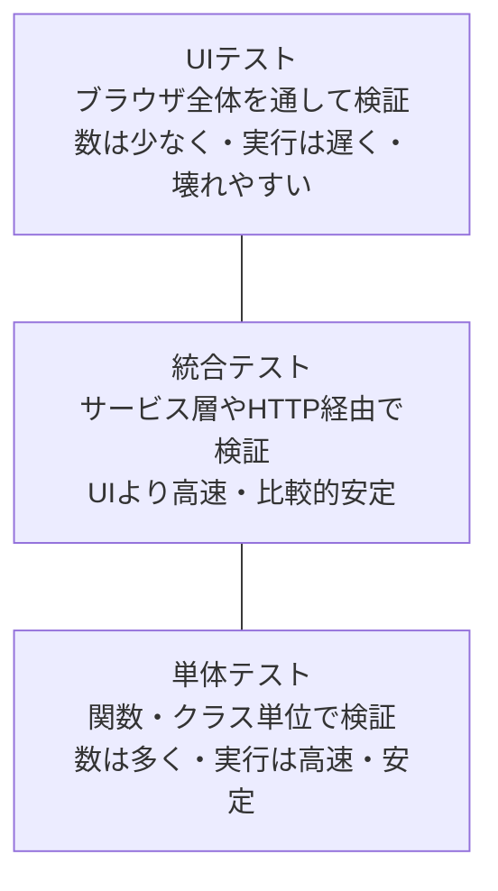
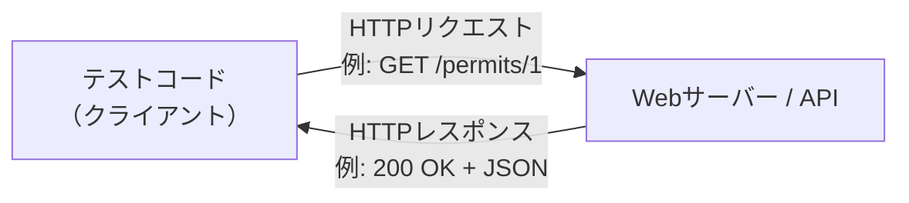
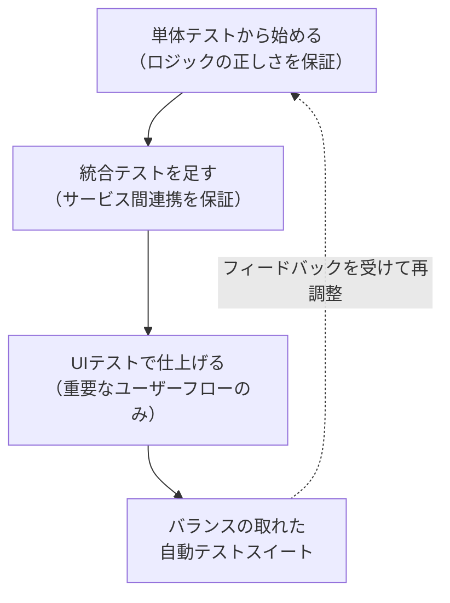
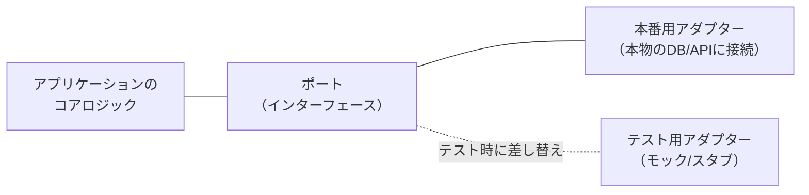
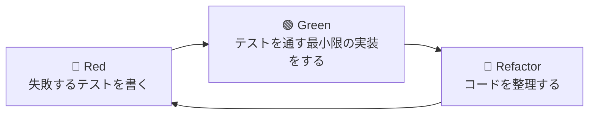
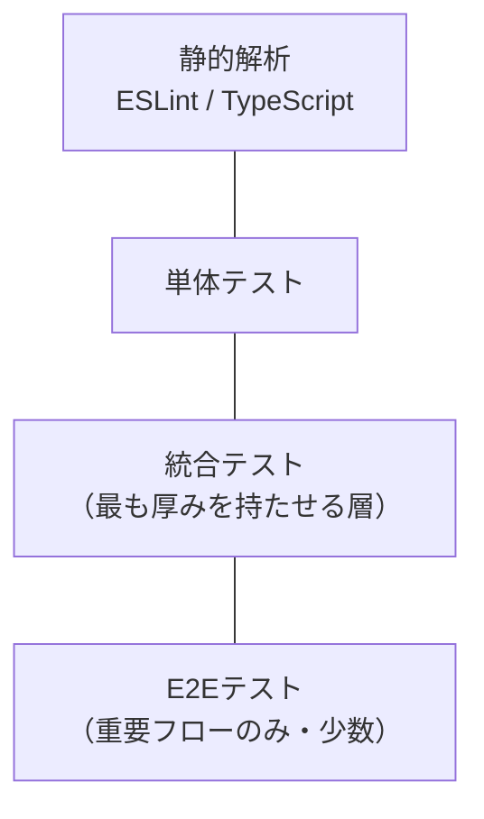

# The Way of the Web Tester 実践ガイド ― 初学者のためのステップバイステップ・ベストプラクティス

> 本ガイドは、Jonathan Rasmusson 著『The Way of the Web Tester: A Beginner's Guide to Automating Tests』（Pragmatic Bookshelf, 2016年）の考え方をベースに、2026年8月時点の業界動向（テストピラミッドの現代的な解釈、Playwright等モダンツールのベストプラクティス）を交えて再構成した学習ガイドです。原著情報は本文末尾「参考文献」を参照してください。

---

## 目次

1. [本書について](#1-本書について)
2. [テストピラミッドとは何か](#2-テストピラミッドとは何か)
3. [Step 1: UIテストを書く](#3-step-1-uiテストを書く)
4. [Step 2: レガシーシステムにUIテストを追加する](#4-step-2-レガシーシステムにuiテストを追加する)
5. [Step 3: 統合テストで点と点をつなぐ](#5-step-3-統合テストで点と点をつなぐ)
6. [Step 4: RESTful Web APIを統合テストする](#6-step-4-restful-web-apiを統合テストする)
7. [Step 5: 単体テストで土台を固める](#7-step-5-単体テストで土台を固める)
8. [Step 6: ブラウザ上のJavaScriptを単体テストする](#8-step-6-ブラウザ上のjavascriptを単体テストする)
9. [Step 7: ピラミッドを登る実践フロー](#9-step-7-ピラミッドを登る実践フロー)
10. [テストコードのスタイルと書き方の基礎](#10-テストコードのスタイルと書き方の基礎)
11. [テストの整理法](#11-テストの整理法)
12. [効果的なモックの使い方](#12-効果的なモックの使い方)
13. [テスト駆動開発（TDD）](#13-テスト駆動開発tdd)
14. [2026年現在の視点：テストピラミッドからテスティングトロフィーへ](#14-2026年現在の視点テストピラミッドからテスティングトロフィーへ)
15. [モダンツール実践編：Playwrightのベストプラクティス](#15-モダンツール実践編playwrightのベストプラクティス)
16. [ベストプラクティス総まとめチェックリスト](#16-ベストプラクティス総まとめチェックリスト)
17. [まとめ](#17-まとめ)
18. [参考文献](#18-参考文献)

---

## 1. 本書について

『The Way of the Web Tester』は、自動テストを書いたことがないテスターや、テストをあまり意識してこなかった開発者に向けて書かれた入門書です。著者の Jonathan Rasmusson は『The Agile Samurai』の著者でもあり、Spotify でチームコーチングをしていた経験を持つエンジニアです。

本書のゴールは大きく3つです。

- Webのための「本当に良い」自動テストの書き方を学ぶこと
- どのテストを、どれだけ書くべきかを判断できるようになること
- テスターと開発者がテスト戦略について同じ語彙で会話できるようになること

原著は UI テスト → 統合テスト → 単体テストの順で「テストピラミッド」を下から上、また上から下へ何度も行き来しながら解説する構成になっています。本ガイドもこの流れに沿って、ステップバイステップで解説します。

---

## 2. テストピラミッドとは何か

テストピラミッドは、自動テストを「粒度（テストが検証する範囲の広さ）」によって3層に分類する考え方です。この概念は Mike Cohn の著書『Succeeding with Agile』（2009年）で紹介され、Martin Fowler が2012年に自身のブログ記事「Test Pyramid」で整理・普及させたことで広く知られるようになりました。

### 3層の役割

| 層 | 検証対象 | 実行速度 | 実行コスト | 壊れやすさ | 主な担当ツール例 |
|---|---|---|---|---|---|
| UIテスト | ブラウザに表示されたHTML/CSS/操作結果 | 遅い | 高い | 高い（UI変更の影響を受けやすい） | Selenium, Playwright, Cypress |
| 統合テスト | サービス間の連携、HTTP通信、REST API | 中程度 | 中程度 | 中程度 | REST Assured, Postman, requests |
| 単体テスト | 個々の関数・メソッド・クラス | 速い | 低い | 低い | JUnit, pytest, Jest |

### なぜピラミッド型が良いとされるのか

- 単体テストは実行が速く、失敗した場所を特定しやすいため、**土台を厚くする**ことでフィードバックループを短くできる
- UIテストは「本当にユーザーが使う流れが動くか」を保証する最終防衛ラインとして、**あえて数を絞る**
- 統合テストはその中間として、外部連携やAPI契約の破壊を早期に検知する

> 原著ではこの原則を「誰が何を書くべきか（Who's Writing These Things）」という観点でも整理しており、テスターと開発者の役割分担の議論に使えるフレームワークとして紹介されています。

---

## 3. Step 1: UIテストを書く

UIテストは、実際にブラウザを操作してユーザー体験を検証するテストです。原著では次の2つの原則が繰り返し強調されます。

- **HTMLは「アサーション（検証）」のためにある** — 何が表示されているかを確認する材料
- **CSSは「セレクション（要素の特定）」のためにある** — どの要素を操作・検証するかを指定する手段

### 基本的なCSSセレクタ早見表

| セレクタ | 意味 | 例 |
|---|---|---|
| `#id` | idで要素を1つ特定 | `#submit-button` |
| `.class` | classで要素を特定（複数該当あり） | `.error-message` |
| `element` | タグ名で特定 | `input`, `button` |
| `[attr="value"]` | 属性値で特定 | `[type="email"]` |
| `parent child` | 子孫要素を特定 | `.form .error` |
| `parent > child` | 直接の子要素を特定 | `ul > li` |
| `:nth-child(n)` | n番目の子要素を特定 | `li:nth-child(2)` |

### ステップバイステップの流れ

1. **テスト対象のページを開く** — ブラウザ自動化ツールで対象URLへ遷移する
2. **CSSセレクタで要素を特定する** — id・class・属性を組み合わせ、できるだけ壊れにくいセレクタを選ぶ
3. **操作を行う** — クリック、入力、送信などユーザーの行動を再現する
4. **結果をアサートする** — 表示されたHTML（テキスト・要素の有無・属性値）を検証する

> 2026年時点の補足: Playwright など最新ツールでは、CSSセレクタよりも `role`（アクセシビリティロール）や `label` を使ったセレクタが推奨される傾向が強まっています。詳細は「15. モダンツール実践編」で解説します。

---

## 4. Step 2: レガシーシステムにUIテストを追加する

自動テストが存在しない既存システム（レガシーシステム）に、後から安全にUIテストを追加していく手順です。原著では次の3ステップで整理されています。

1. **正しいテスト対象ページにいることを確認する**
   タイトルタグやURL、目印となる要素の存在を確認し、意図しないページで誤ったテストを実行しないようにする。
2. **CSSセレクタを見極める**
   ブラウザの開発者ツールでDOM構造を調査し、変更に強い（IDや意味のあるdata属性を優先する）セレクタを選定する。
3. **アサーションを行う**
   期待する文言・状態が正しく表示されているかを検証する。

### レガシーシステムでよくある落とし穴

| 落とし穴 | 内容 | 対策 |
|---|---|---|
| CSSクラス名が頻繁に変わる | デザイン変更のたびにテストが壊れる | `data-testid` のような専用属性を追加してもらう |
| ページの読み込みタイミングがずれる | 要素がまだ描画されていない状態でアサートしてしまう | 明示的な待機（Explicit Wait）を使う |
| テストごとにデータが汚染される | 前のテストの残留データで結果が変わる | テストごとにデータをリセット・独立させる |

---

## 5. Step 3: 統合テストで点と点をつなぐ

統合テストとは、**複数のユニットやコンポーネントが組み合わさったときの相互作用が期待どおりかを検証するテスト**です。対象はバックエンドに限らず、モジュール間の連携、外部サービスとの結合、UIを含むコンポーネント同士の結合など、境界をまたぐ箇所すべてが候補になります。

そのうえで原著は、その具体例としてバックエンド／REST APIのテストを取り上げ、「Webの仕組み（How the Web Works）」から丁寧に解き明かして、HTTP通信の基本を学んだ上でREST APIのテストへとつなげています。

### HTTPの基本用語

| 用語 | 意味 |
|---|---|
| リクエスト（Request） | クライアントからサーバーへ送る要求 |
| レスポンス（Response） | サーバーからクライアントへ返す応答 |
| ステータスコード | 処理結果を表す3桁の数値（例: 200, 404, 500） |
| ヘッダー | メタ情報（コンテンツ種別、認証情報など） |
| ボディ | 実際に送受信されるデータ本体（JSONなど） |

### REST（Representational State Transfer）とは

REST は、リソース（データ）をURLで表現し、HTTPメソッドで操作する設計思想です。統合テストではこのREST APIに対して直接リクエストを送り、レスポンスを検証します。

---

## 6. Step 4: RESTful Web APIを統合テストする

原著では許可証（Permit）を管理するRESTful APIを題材に、代表的な4つのHTTPメソッドのテストを解説しています。

| メソッド | 目的 | 意図されたべき等性（実際の保証はAPI契約次第） | テストで確認すべきこと |
|---|---|---|---|
| GET | リソースの取得 | 安全（サーバー状態の変更を要求しない）ことが期待される。ログ記録やアクセス計測など、クライアントが要求していない副次的な状態変化まで禁じるものではない | 正しいデータが正しい形式で返るか、存在しない場合は適切なステータスコードか |
| POST | 新規リソースの作成 | 一般にべき等ではないが、冪等キー等で重複排除を保証する契約もある | 作成が成功したか、同じリクエストを再送・重複送信したときの挙動が契約どおりか、必須項目のバリデーション |
| PUT | 既存リソースの更新（全体置換） | 同じ内容を再送しても同じ状態になることが期待される | 更新内容が反映されているか、再送しても状態が変わらないか、存在しないリソースへのPUTの挙動 |
| DELETE | リソースの削除 | 削除後に再送しても状態が変わらないことが期待される | 削除後に該当リソースが取得できなくなっているか、再送時のステータスコードが契約どおりか |

### ステップバイステップの流れ

1. テスト対象のエンドポイントとメソッドを決める
2. リクエストに必要なパラメータ・ボディを準備する
3. リクエストを送信する
4. レスポンスのステータスコードとボディ内容をアサートする
5. **同じリクエストを再送・重複送信したときの挙動が、対象APIの仕様・契約どおりかを確認する**
6. 必要に応じて、テスト後に作成・変更したデータをクリーンアップする

> べき等性（Idempotency）とは「同じリクエストを複数回送っても結果として得られる状態が変わらない」性質のことです。GET が安全であること、PUT・DELETE がべき等であることは一般に**意図された効果**として期待されますが、**実際にそう振る舞うかどうかはメソッド名ではなく対象APIの仕様・契約で決まります**。POST も冪等キーを用いれば重複送信を排除する契約になり得ます。したがってテスト設計では「このメソッドだからべき等」と決め打ちせず、リトライや重複送信時の期待挙動をAPI契約で確認し、そのとおりに振る舞うかをテストで検証してください。

---

## 7. Step 5: 単体テストで土台を固める

単体テストはピラミッドの土台であり、最も数多く書かれるべきテストです。原著では「UIテストの課題（The Challenge with UI Tests）」を振り返りながら、より小さい単位でロジックを検証する単体テストの意義を説明しています。

### 単体テストが優れている理由

| 観点 | UIテスト | 単体テスト |
|---|---|---|
| 実行速度 | 数秒〜数十秒/件 | ミリ秒〜数十ミリ秒/件 |
| 失敗原因の特定 | 難しい（どこで壊れたか分かりにくい） | 容易（対象範囲が狭い） |
| 外部依存 | ブラウザ・ネットワークに依存 | 基本的に依存なし |
| 保守コスト | 高い | 低い |

### ステップバイステップの流れ

1. テストしたい関数・メソッドを1つ選ぶ
2. 入力値（Arrange）を準備する
3. 対象を実行する（Act）
4. 出力結果を期待値と比較する（Assert）

この「Arrange → Act → Assert（AAA）」パターンは、単体テストを読みやすく保つための基本形として広く使われています。

---

## 8. Step 6: ブラウザ上のJavaScriptを単体テストする

原著の「Bug Hunt」という演習では、実際のバグをHTML・JavaScriptの両面から追跡し、テストを書きながら修正する流れを体験します。手順は次の3ステップです。

1. **HTMLをスキャンする** — バグの症状に関係しそうなDOM構造を確認する
2. **JavaScriptを確認する** — イベントハンドラやロジックのコードを読む
3. **テストを書く** — バグを再現するテストを先に書き、修正後にパスすることを確認する

### 静的型付け vs 動的型付け（テスト設計への影響）

| 観点 | 静的型付け（例: TypeScript） | 動的型付け（例: 素のJavaScript） |
|---|---|---|
| 型エラーの検出タイミング | コンパイル時 | 実行時 |
| 単体テストの役割 | ロジックの正しさの検証が中心 | 型の妥当性も含めた検証が必要 |
| IDEの補完・安全性 | 高い | 低い〜中程度 |

---

## 9. Step 7: ピラミッドを登る実践フロー

テストピラミッドは「下から積み上げる」だけでなく、実際の開発では単体テスト・統合テスト・UIテストを行き来しながら組み立てていきます。

### フレーキー（不安定）なテストへの対処

「フレーキーテスト」とは、コードを変更していないのに成功したり失敗したりする不安定なテストのことです。原著では次のような対処法が紹介されています。

- 待機処理をタイマー（sleep）ではなく、条件が満たされるまで待つ「明示的な待機」に置き換える
- テスト同士が共有状態（データベースの行、グローバル変数など）に依存しないようにする
- 外部サービスへの依存はモックやスタブに置き換え、ネットワークの不安定さを排除する
- 原因が特定できないテストは「隔離」して可視化し、放置しない

---

## 10. テストコードのスタイルと書き方の基礎

テストコードも本番コードと同じくらい丁寧に書く必要がある、というのが原著「Programming 101」章の主張です。

| 観点 | 悪い例の特徴 | 改善のポイント |
|---|---|---|
| 命名 | `test1`, `data`, `tmp` のような曖昧な名前 | 「何を検証しているか」が分かる名前にする |
| スペーシング | インデントや空行が不揃い | 一貫したフォーマッタ・リンターを使う |
| 重複 | 同じセットアップコードがテストごとにコピペされている | ヘルパー関数・フィクスチャに抽出する |

### ステップバイステップ（原著の演習フロー）

1. スペーシングを直す
2. 良い名前を選ぶ
3. クラス内の重複に対処する
4. テストコード自体の重複に対処する

---

## 11. テストの整理法

テストが増えてくると、どこに何のテストがあるのか分からなくなる「混沌の国（The Land of Confusion）」に陥りがちです。原著では次の考え方で整理することを推奨しています。

- **隔離（Isolation）** — 各テストは他のテストの結果に依存せず、単独で実行しても同じ結果になるようにする
- **文脈の明確化（Context）** — 「何の状態のときに」「何をしたら」「どうなるか」が読んだだけで分かるようにテストをグループ化する
- **割り込み検知（Intruder Alert）** — テストが意図しない副作用（他のテストへの影響）を起こしていないかに注意する

---

## 12. 効果的なモックの使い方

モック（Mock）は、外部依存（データベース・API・時刻など）をテストのために置き換える技術です。原著では次の手順で紹介されています。

1. **モックを準備する** — 本物の代わりとなるオブジェクトを用意する
2. **期待値を設定する** — モックがどう呼ばれるべきかを事前に定義する

### モックの功罪

| メリット | デメリット（原著でいう「モックの沼」） |
|---|---|
| 外部依存なしに高速にテストできる | 実装の詳細に強く結合してしまいがち |
| 異常系（エラー発生時など）を再現しやすい | モックだらけのテストは可読性が下がる |
| ネットワークやDBの不安定さを排除できる | 本物との挙動の差異に気づきにくい |

### ポート・アンド・アダプター（Ports and Adapters）

原著では、外部依存を抽象化するアーキテクチャパターンとして「ポート・アンド・アダプター（ヘキサゴナルアーキテクチャ）」の考え方が紹介されています。

この構造にすることで、テスト時だけモックアダプターに差し替えることができ、コアロジックを外部依存から守ることができます。

---

## 13. テスト駆動開発（TDD）

TDD（Test-Driven Development）は、実装コードよりも先にテストを書く開発手法です。原著では次の3ステップサイクルとして紹介されています。

### TDDのメリット（原著より）

- 実装前に「何を作るべきか」が明確になる
- Green・Refactorの各フェーズではテストが通っている状態を保てるため、いつでも安全に手を止められる（Redフェーズでは、意図的に失敗するテストが存在する）
- リファクタリングを安心して行える（壊れたらすぐテストが教えてくれる）

### ステップバイステップ

1. **失敗するテストを書く（Red）** — まだ存在しない機能に対するテストを先に書く
2. **テストを通す（Green）** — テストが通る最小限のコードを書く（きれいさは後回し）
3. **リファクタリングする（Refactor）** — テストが通ったままコードを整理する
4. このサイクルを繰り返す（Cycle, Rinse, Repeat）

---

## 14. 2026年現在の視点：テストピラミッドからテスティングトロフィーへ

原著出版（2016年）以降、フロントエンド開発ではテストツールの性能が大きく向上し、統合テストの実行速度・信頼性がUIテストに近づいたことで、ピラミッドの前提そのものを見直す議論が活発になりました。

Martin Fowler は自身の「Test Pyramid」記事の中で、ピラミッドは「広範囲テストは遅く高コストで壊れやすい」という前提の上に成り立っており、もしその前提が崩れるなら低レベルテストへの依存度を下げてよいという趣旨の注記を残しています。この指摘を踏まえ、JavaScriptエンジニアの Kent C. Dodds は、Guillermo Rauch（Vercel創業者）の「テストを書こう。数はほどほどに。中心は統合テストで」という趣旨の発言を出発点に、「テスティングトロフィー」という新しいモデルを提唱しました。

### テストピラミッド と テスティングトロフィーの比較

| 観点 | テストピラミッド（2012年〜） | テスティングトロフィー（2018年〜） |
|---|---|---|
| 最も厚い層 | 単体テスト | 統合テスト |
| 前提 | 広範囲テストは遅く不安定 | ツールの進化で統合テストが速く安定した |
| 静的解析の扱い | 明示的に含まれない | 最下層として明示的に含む |
| 主な提唱者 | Mike Cohn / Martin Fowler | Kent C. Dodds（Guillermo Rauchの発言が着想元） |
| 向いている領域 | サーバーサイド・広範な言語 | フロントエンドJavaScript/TypeScript |

> 重要な注意点: これはピラミッドが「間違っていた」という話ではなく、**「どの層を厚くすべきかはツールとプロジェクトの性質によって変わる」**という前提の違いです。原著が伝える「粒度の異なるテストをバランス良く組み合わせる」という核心的な考え方自体は、ピラミッドでもトロフィーでも共通しています。

---

## 15. モダンツール実践編：Playwrightのベストプラクティス

2016年当時の主流はSeleniumでしたが、2026年現在はMicrosoft製の Playwright がモダンなUI/E2Eテストツールとして広く使われています。原著の「CSSで要素を選択する」という考え方は現在も有効ですが、実務ではさらに一歩進んだプラクティスが推奨されています。

| プラクティス | 内容 | 原著の考え方との関係 |
|---|---|---|
| ユーザー向けロケーターを優先する | `getByRole` を第一候補にし、次点で `getByLabel` / `getByPlaceholder` / `getByText` を使う。適切なユーザー向けロケーターが存在しない場合に限り `getByTestId` を用いる | 「CSSは選択のため」という原則を、アクセシビリティ属性ベースに発展させたもの |
| 自動待機を活用する | 要素が操作可能になるまで自動で待つ機能を使い、固定時間の `sleep` を避ける | フレーキーテスト対策の発展形 |
| テストを独立させる | 各テストが他のテストの状態に依存しないようにする | 「隔離（Isolation）」の原則そのもの |
| Web-firstアサーションを使う | 状態が安定するまで自動的にリトライするアサーションを使う | アサーションの信頼性向上 |
| CIでは並列実行・シャーディングを行う | ワーカー並列化とマシン分割で実行時間を短縮する | ピラミッドの「高速なフィードバック」という目的の延長 |
| トレースビューアでデバッグする | 失敗時のスクリーンショット・操作ログを記録し再生できるようにする | 壊れたテストの原因特定を容易にする仕組み |

> 上記は BrowserStack や Autonoma などが2026年に公開したPlaywright運用ガイド、および Playwright公式ドキュメントの推奨事項を要約したものです（出典は参考文献を参照）。

---

## 16. ベストプラクティス総まとめチェックリスト

| # | チェック項目 |
|---|---|
| 1 | テストの大部分を単体テストが占めているか（あるいは、統合テストを厚くする合理的な理由があるか） |
| 2 | UIテスト・E2Eテストは「重要なユーザーフロー」に絞られているか |
| 3 | テストは他のテストの実行順序・状態に依存せず独立しているか |
| 4 | 固定時間の `sleep` ではなく、条件ベースの待機を使っているか |
| 5 | テストコードにも命名・重複排除などの品質基準を適用しているか |
| 6 | モックは「外部依存の置き換え」に留め、実装の詳細まで検証していないか |
| 7 | フレーキーなテストを放置せず、原因を特定・隔離できているか |
| 8 | REST APIテストでは正常系だけでなく異常系（存在しないリソースへのアクセスなど）も検証しているか |
| 9 | CIパイプラインでテストが自動実行され、失敗時に原因を追いやすい記録（スクリーンショット・トレース等）が残っているか |
| 10 | Playwrightのスクリーンショット・トレース・動画などの成果物について、機密情報（認証情報・個人情報・トークン）がマスキングされているか、アーティファクトへのアクセスが制限されているか、保存期間（retention）が適切に設定されているか |
| 11 | テスターと開発者が同じ語彙（ピラミッド/トロフィーなどの共通モデル）でテスト戦略を議論できているか |

---

## 17. まとめ

『The Way of the Web Tester』は2016年出版の書籍ですが、その核心にある「テストには粒度があり、粒度に応じて数・速度・役割のバランスを取るべき」という考え方は、テストピラミッドであれテスティングトロフィーであれ、2026年現在も変わらず通用する原則です。

初学者がまず押さえるべきステップは次の通りです。

1. **単体テストから始める** — 最も書きやすく、最も多く書くべきテスト
2. **統合テストでつなぐ** — サービス間・API連携を検証する
3. **UIテストで仕上げる** — 重要なユーザーフローだけを、少数精鋭で検証する
4. **フレーキーさと戦う** — 不安定なテストを放置しない
5. **モダンツールの推奨事項を取り入れる** — ロールベースセレクタや自動待機など、当時なかったベストプラクティスも積極的に採用する

テストは「書いて終わり」ではなく、チームの共通言語として育てていくものだ、というのが本書と本ガイドを通じての一貫したメッセージです。

---

## 18. 参考文献

本ガイド作成にあたり、以下の一次情報・著名な開発者による情報源を参照しました（2026年8月26日時点でアクセス確認）。

### 書籍情報

- Jonathan Rasmusson, *The Way of the Web Tester: A Beginner's Guide to Automating Tests*, Pragmatic Bookshelf, 2016年9月刊 — 公式ページ・目次・著者情報: <https://pragprog.com/titles/jrtest/the-way-of-the-web-tester/>
- O'Reilly掲載ページ（本書の閲覧ページ）: <https://www.oreilly.com/library/view/the-way-of/9781680502251/>

### テストピラミッド関連（一次情報・著名エンジニア）

- Martin Fowler, "TestPyramid" (bliki): <https://martinfowler.com/bliki/TestPyramid.html>
- Ham Vocke, "The Practical Test Pyramid" (martinfowler.com 掲載): <https://martinfowler.com/articles/practical-test-pyramid.html>
- Martin Fowler, "Broad Stack Test" (bliki): <https://martinfowler.com/bliki/BroadStackTest.html>
- Martin Fowler, "Component Test" (bliki): <https://martinfowler.com/bliki/ComponentTest.html>
- Google Testing Blog, "Just Say No to More End-to-End Tests": <https://testing.googleblog.com/2015/04/just-say-no-to-more-end-to-end-tests.html>

### テスティングトロフィー関連（著名エンジニア）

- Kent C. Dodds, "Write tests. Not too many. Mostly integration.": <https://kentcdodds.com/blog/write-tests>
- Kent C. Dodds, "The Testing Trophy and Testing Classifications": <https://kentcdodds.com/blog/the-testing-trophy-and-testing-classifications>

### モダンなWebテスト実践（2026年）

- Playwright 公式ドキュメント: <https://playwright.dev/docs/best-practices>
- BrowserStack, "Playwright Best Practices in 2026 (With Code Examples)": <https://www.browserstack.com/guide/playwright-best-practices>
- Autonoma, "Playwright Best Practices: 8 Patterns for Stable E2E (2026)": <https://getautonoma.com/blog/playwright-best-practices-2026>

---

*本ガイドは教育目的の要約・再構成であり、原著の文章をそのまま転載したものではありません。詳細な内容は上記の公式ソースをご参照ください。*
