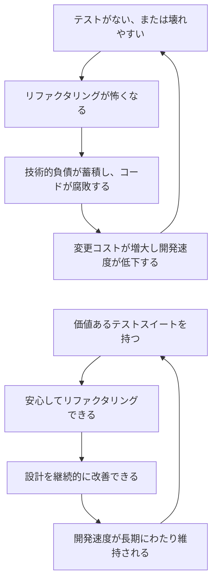
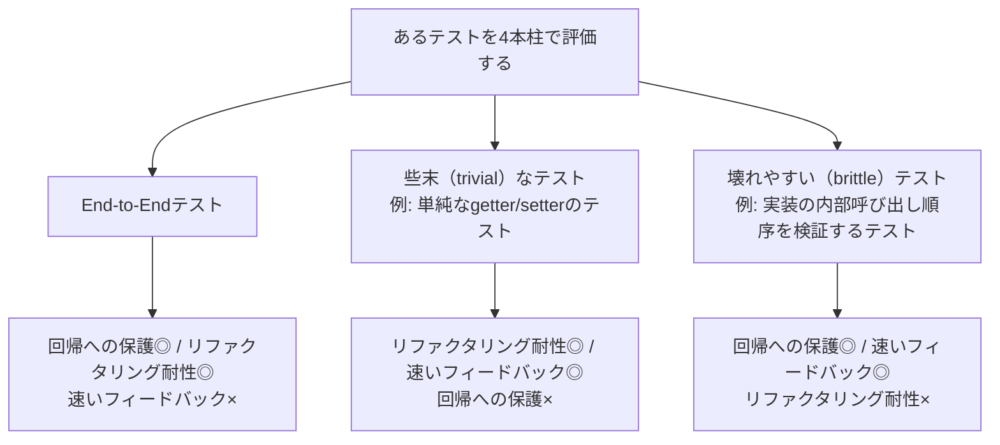
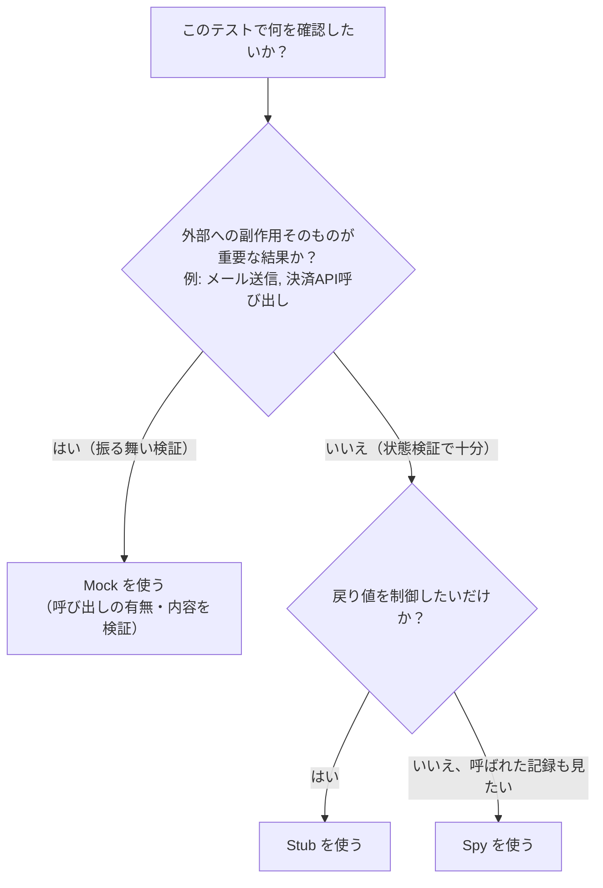
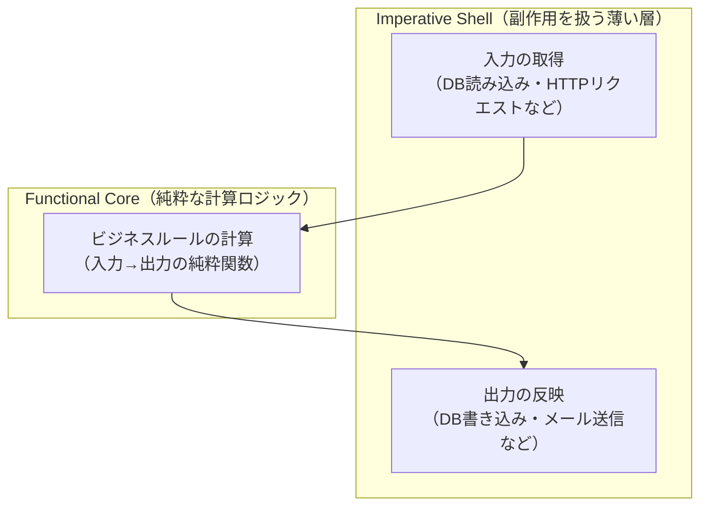
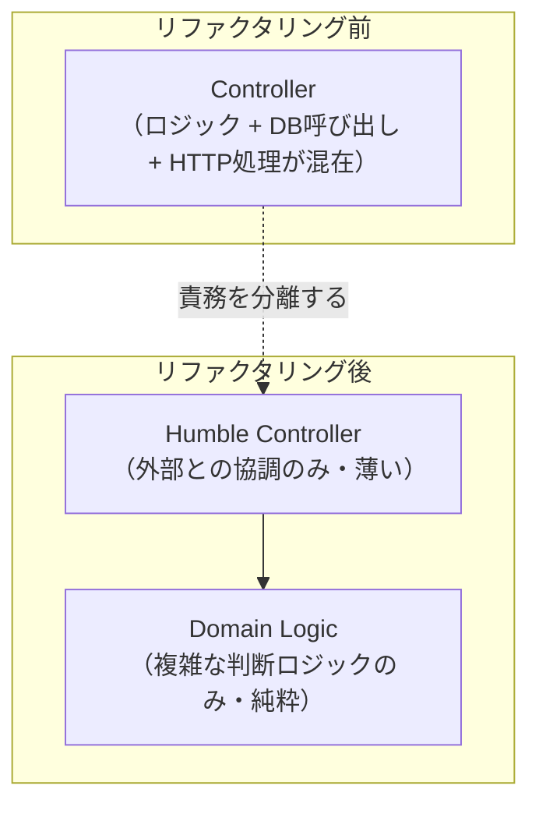
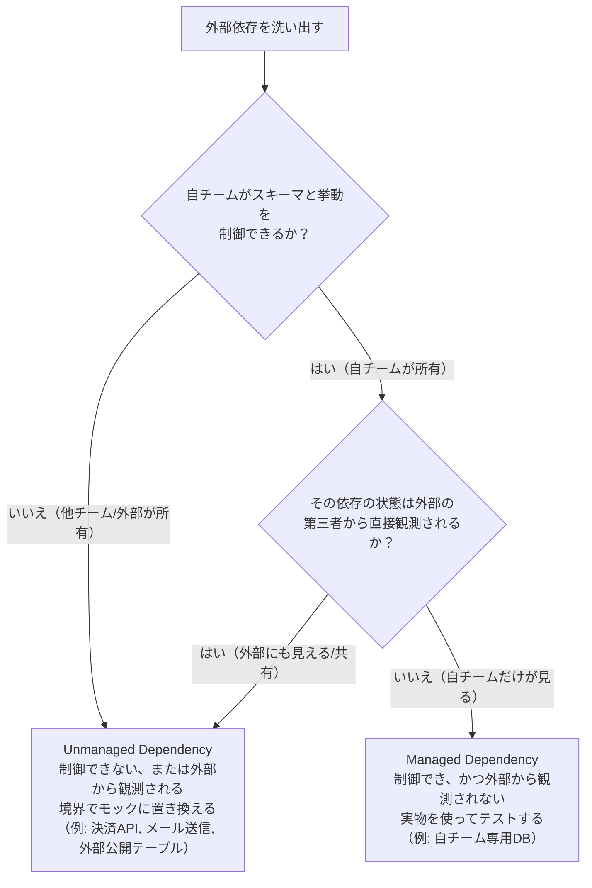

# 『Unit Testing Principles, Practices, and Patterns』完全ガイド ― 初学者のためのステップバイステップ ベストプラクティス

> 原著: *Unit Testing Principles, Practices, and Patterns*（Vladimir Khorikov 著 / Manning Publications, 2020年1月刊, 304ページ, ISBN 978-1-61729-627-7）
> 出版社ページ: <https://www.oreilly.com/library/view/unit-testing-principles/9781617296277/>

この記事は、ソフトウェアテスト分野で国際的に高く評価されている上記書籍の考え方を土台に、初学者でも迷わず実践できるよう「ステップ形式」で再構成した学習ガイドです。あわせて、Martin Fowler・Kent Beck・Kent C. Dodds・Ian Cooper・Gary Bernhardt といった著名な国際的開発者の発信内容、および2025〜2026年にかけての最新の議論（Test Desiderata 2.0、AI生成コードのテストなど）も参照し、現在の実務にそのまま使える形にまとめています。参照したソースのURLはすべて末尾の「参考文献・情報源」にまとめています。

---

<a id="toc"></a>

## 目次

- [この記事の対象読者と使い方](#about)
- [Step 1: ユニットテストの「本当の目的」を理解する](#step1)
- [Step 2: そもそも「ユニットテスト」とは何か](#step2)
- [Step 3: 二大流派 ― classical school と London school](#step3)
- [Step 4: ユニットテストの解剖学 ― AAAパターン](#step4)
- [Step 5: 良いユニットテストの「4本柱」](#step5)
- [Step 6: モックとテストの壊れやすさ（fragility）](#step6)
- [Step 7: テストダブルの分類 ― Dummy / Fake / Stub / Spy / Mock](#step7)
- [Step 8: 3つのテストスタイルと関数型アーキテクチャ](#step8)
- [Step 9: 価値あるテストへのリファクタリング ― Humble Objectパターン](#step9)
- [Step 10: 統合テスト（Integration Testing）の実践](#step10)
- [Step 11: モッキングのベストプラクティス](#step11)
- [Step 12: データベースのテスト](#step12)
- [Step 13: よくあるアンチパターンと対処法](#step13)
- [まとめ: 実践チェックリスト](#checklist)
- [2026年時点の補足: 議論はどう発展したか](#update2026)
- [参考文献・情報源](#references)

---

<a id="about"></a>

## この記事の対象読者と使い方

| 項目 | 内容 |
|---|---|
| 対象読者 | ユニットテストの書き方は知っているが、「何を」「どこまで」「どう」テストすべきか迷っている初〜中級エンジニア |
| 前提知識 | 任意の言語で xUnit系フレームワーク（JUnit, pytest, Jest, xUnit.net など）を使ったテストを書いたことがある |
| 使用言語 | 原著はC#だが、考え方自体はどの言語・フレームワークにも応用できるため、本記事のコード例は擬似コード中心で表記する |
| ゴール | 「テストの本数」ではなく「テストの価値」で品質を判断できるようになること |

---

<a id="step1"></a>

## Step 1: ユニットテストの「本当の目的」を理解する

多くのチームは「カバレッジ80%達成」のような数値目標を掲げますが、これは本質的な目的ではありません。Khorikovはこの本の冒頭で、コードカバレッジのような指標は**簡単に操作できてしまう**ため、テストスイートの質を測る指標としては信頼できないと指摘しています。たとえばループや条件分岐を一切検証せずに実行だけする空疎なテストでも、カバレッジ数値は上がってしまいます。

ユニットテストの本当の目的は、**「ソフトウェアプロジェクトの持続的成長を可能にすること」**です。テストが無い、またはテストが壊れやすいプロジェクトでは、次のような悪循環に陥ります。



ポイントは、**「テストの数を増やすこと」ではなく「後述する4本柱を満たす価値の高いテストを選び取ること」**がゴールだという点です。価値の低いテストは書かない方がまし、というのが本書全体を貫く姿勢です。

---

<a id="step2"></a>

## Step 2: そもそも「ユニットテスト」とは何か

「ユニットテスト」という言葉は現場でかなり曖昧に使われています。Khorikovは次の3つの性質を満たすテストを「ユニットテスト」と定義しています。

| 性質 | 説明 |
|---|---|
| 小さな「振る舞いの単位」を検証する | 「1つのクラス」や「1つのメソッド」という**コードの単位**ではなく、意味のある**振る舞い（behavior）の単位**を検証する |
| 高速に実行できる | ミリ秒〜数十ミリ秒のオーダーで完了し、何百回実行しても苦にならない |
| 他のテストから隔離されている | あるテストの結果が、他のテストの実行順序や実行有無に影響されない |

ここで重要なのは3つ目の「隔離」の解釈です。「隔離」を**テスト対象のコード（SUT: System Under Test）を他のクラスから隔離すること**だと考えるか、**テスト自体を他のテストから隔離すること**だと考えるかで、後述する2つの流派が分かれます。

> 補足: 「1ユニット = 1メソッド」という誤解は非常によくあるアンチパターンの温床です。振る舞いは複数のクラス・メソッドにまたがって実装されることが多く、テストはその振る舞い単位に対して書くべきだ、という考え方は Ian Cooper氏の講演「TDD, Where Did It All Go Wrong?」でも強調されています（詳細はStep 3・参考文献参照）。

---

<a id="step3"></a>

## Step 3: 二大流派 ― classical school と London school

ユニットテストの世界には、大きく分けて2つの学派（流派）が存在します。本書はこの対比を軸に構成されており、著者自身は classical school（別名: Detroit school / Chicago school）の立場を取っています。

| 観点 | classical school（Detroit / Chicago） | London school（mockist） |
|---|---|---|
| 「隔離」の対象 | テストケース同士を隔離する | SUT（テスト対象）を協働オブジェクトから隔離する |
| テスト対象の粒度 | クラスの集合体（振る舞いの単位） | 基本的に1クラス単位 |
| 依存への対応 | **共有され、かつ可変な依存（例: 静的なグローバル状態、外部サービス）のみ**をテストダブルに置き換える | 不変なオブジェクト以外のほぼ全ての依存をモックに置き換える |
| 設計への影響 | 大きな依存グラフの塊が悪い設計の兆候として自然に見える | 依存を全てインターフェース越しに注入する設計（DIコンテナ多用）に誘導しやすい |
| 代表的な文献 | Kent Beck『Test-Driven Development: By Example』 | Steve Freeman & Nat Pryce『Growing Object-Oriented Software, Guided by Tests』 |
| 失敗しやすいテストの特徴 | 大きな結合度の高いクラス群に気づきにくい | モックの多用によりテストが実装詳細に強く結合し、壊れやすくなる |

どちらが「正しい」というより、**モックをどこまで使うか**という判断軸の違いだと理解するのが実務的です。次のStep 5・Step 6で扱う「4本柱」と「observable behavior」の考え方を理解すると、この対立を統一的に説明できるようになります。

---

<a id="step4"></a>

## Step 4: ユニットテストの解剖学 ― AAAパターン

良いユニットテストは、例外なく次の3つのセクションで構成すべきだと本書は説きます。これは**AAAパターン（Arrange-Act-Assert）**と呼ばれ、xUnit系フレームワーク全般で共通する基本構造です。


擬似コードで表すと次のようになります。

```text
テスト名: 残高が不足している場合、出金は失敗する

// Arrange（準備）
account := 口座を作成する(残高: 100)

// Act（実行）
result := account.出金する(金額: 200)

// Assert（検証）
result が失敗であることを確認する
account.残高 が 100 のままであることを確認する
```

### 実践のポイント

- **Actセクションは1行にする**: 複数のメソッド呼び出しがActに並ぶ場合、テスト対象の振る舞いの単位が誤って分割されているサインです。
- **命名は「非プログラマにも伝わる文章」にする**: 実装の詳細（メソッド名やクラス名）をテスト名に含めるのではなく、「その振る舞いを業務ドメインの言葉でどう説明するか」を意識します。例: `Test1_出金_異常系` ではなく `残高が不足している場合、出金は失敗する` のように書きます。
- **`should_be` のような曖昧な言い回しは避ける**: テストは「事実」を確認するものなので、`is`（〜である）のような言い切りの文体が推奨されます。
- **パラメータ化テストは「同じ結論」を導くケースにのみ使う**: 正常系1パターン・異常系1パターンのように出力の種類が同じ場合はパラメータ化してよいですが、出力の意味が異なる場合はテスト名の説明力が落ちるため個別に書きます。
- **アサーションライブラリで可読性を上げる**: `Assert.That(actual, Is.EqualTo(expected))` のような流暢なAPIを使うと、Assertセクションの意図がより明確になります。

---

<a id="step5"></a>

## Step 5: 良いユニットテストの「4本柱」

本書の核となる概念が、この「4本柱（Four Pillars）」です。あるテストが本当に価値を持つかどうかを、次の4つの観点でスコアリング（0〜1の連続値）して評価します。

| # | 柱 | 説明 | 満たさない場合に起こること |
|---|---|---|---|
| 1 | **回帰に対する保護**（Protection against regressions） | バグを実際に埋め込んだとき、そのテストが検知できる確率 | バグが本番まで流出する |
| 2 | **リファクタリング耐性**（Resistance to refactoring） | 振る舞いを変えずに内部実装だけを変更したとき、テストが誤って失敗しない度合い | 「偽陽性（false positive）」が多発し、テストが信頼されなくなる |
| 3 | **速いフィードバック**（Fast feedback） | テストの実行がどれだけ高速か | 開発者がテストを頻繁に回さなくなる |
| 4 | **保守のしやすさ**（Maintainability） | テストコード自体がどれだけ理解・保守しやすいか | テストのメンテナンスコストが開発速度を圧迫する |

### なぜ「掛け算」で考えるのか

Khorikovは、この4つのスコアを**足し算ではなく掛け算**でイメージすべきだと述べています。どれか1つでも極端に低い（0に近い）と、他がどれだけ高くても全体の価値はゼロに近づいてしまう、という考え方です。

### 理想のテストは存在しない ― 3つの極端な例

4本柱を同時に完璧に満たすテストは原理的に作れません。本書は次の3つの「極端な例」を挙げて、トレードオフの構造を説明しています。



実務上もっとも見落とされがちで、かつもっとも重要なのが2本目の柱「リファクタリング耐性」です。これは、**テストが実装の詳細にどれだけ結合しているか**によって決まります。テストは実装の手順（how）ではなく、コードがもたらす**観測可能な結果（observable behavior）**を検証すべきだ、という原則がここから導かれます（次のStep 6で詳しく扱います）。

---

<a id="step6"></a>

## Step 6: モックとテストの壊れやすさ（fragility）

### モックとスタブの違い

本書では、テストダブル全般を大きく2種類に分けて説明します。

| 種類 | 検証の方向 | 目的 |
|---|---|---|
| **スタブ** | 状態検証（state verification） | SUTに「間接的な入力」を与えるための道具。呼ばれ方そのものは検証しない |
| **モック** | 振る舞い検証（behavior verification） | SUTが協働オブジェクトに対して行った「間接的な出力（＝呼び出し）」を検証するための道具 |

この区別はMartin FowlerがGerard Meszarosの分類を紹介した記事「Mocks Aren't Stubs」で広く知られるようになりました。ポイントは、**スタブへの呼び出しをテストの中でアサーションしてしまうと、それは事実上モックとして使っていることになる**、という点です。この誤用が、次に説明する「壊れやすさ」の主要な原因になります。

### observable behavior と implementation detail

テストが実装の詳細（例: 内部でどのプライベートメソッドが何回呼ばれたか）に結合していると、リファクタリングのたびにテストが（振る舞いは変わっていないのに）失敗する「偽陽性」が発生します。本書はこれを避けるために、次のルールを提示しています。

- テストは、SUTが外部に公開している**観測可能な振る舞い（observable behavior）**だけを検証する。
- あるコードが観測可能な振る舞いの一部と言えるのは、次のいずれかを満たす場合である。
  1. クライアントの目的達成を助ける「操作（コマンド or クエリ）」を公開している
  2. クライアントが目的達成のために依存する「状態」を公開している
  3. アプリケーションの境界を越えて外部システムに影響を与える副作用（side effect）を引き起こす
- 上記に当てはまらない内部実装（プライベートメソッド、内部でのみ使うヘルパークラスなど）は、テストの対象にしてはいけない。

### モックとテスト壊れやすさの関係

モックを多用するほど、テストは実装の「手順」に強く結合します。したがって本書は次の指針を打ち出します。

> **モックは、アプリケーションの境界を越えた「共有された可変な依存（unmanaged dependency）」に対してのみ使う。**

これはStep 3の classical/London school の対立を統一的に説明する原則でもあります。境界内部の協働オブジェクト（自分のドメインモデルなど）まで律儀にモック化してしまうと、リファクタリング耐性が大きく損なわれます。

---

<a id="step7"></a>

## Step 7: テストダブルの分類 ― Dummy / Fake / Stub / Spy / Mock

テストダブルという用語自体は、Gerard Meszaros が著書『xUnit Test Patterns』で導入し、Martin Fowlerの記事「Mocks Aren't Stubs」によって広く普及しました。5種類の分類を整理すると次のようになります。

| 種類 | 実際に使われるか | 特徴 | 典型的な用途 |
|---|---|---|---|
| **Dummy** | 使われない | パラメータの穴埋めのためだけに渡される | 引数として必須だがテストでは無関係な値 |
| **Fake** | 使われる（簡易実装） | 動作する実装を持つが、本番用途には向かない近道実装 | インメモリDB、インメモリキューなど |
| **Stub** | 使われる | あらかじめ決められた回答を返す。呼ばれ方自体は検証しない | 外部APIのレスポンスを固定して与えたいとき |
| **Spy** | 使われる | Stubに「呼ばれた記録」を残す機能を足したもの | 呼び出し回数や引数を後から確認したいとき |
| **Mock** | 使われる | 事前に「期待する呼ばれ方」を設定し、それを検証する | メール送信・決済実行など、副作用の発生自体を確認したいとき |

### どちらを使うべきかの判断フロー

「状態を確認したいのか」「振る舞い（呼び出し）を確認したいのか」で使い分けます。Martin Fowlerが提唱する「state verification（状態検証） vs behavior verification（振る舞い検証）」の考え方を、意思決定フローチャートにすると次のようになります。



Fowler自身も、**状態検証（Stub/Fakeで十分なケース）を優先し、Mockは本当に副作用の発生自体が仕様であるときだけ使う**ことを推奨しています。これはKhorikovの「モックは境界を越えたunmanaged dependencyにのみ使う」という指針と一致します。

---

<a id="step8"></a>

## Step 8: 3つのテストスタイルと関数型アーキテクチャ

本書は、ユニットテストの書き方を3つのスタイルに分類し、優劣を明確に示しています。

| スタイル | 検証方法 | モックの必要性 | リファクタリング耐性 | 備考 |
|---|---|---|---|---|
| **Output-based**（出力ベース） | 戻り値を検証する | 不要（副作用がないため） | 最も高い | 純粋関数に対してのみ適用できる |
| **State-based**（状態ベース） | 実行後のオブジェクトやDBの状態を検証する | 場合による | 高い | もっとも一般的に使えるスタイル |
| **Communication-based**（コミュニケーションベース） | 協働オブジェクトへの呼び出しをモックで検証する | 必須 | 最も低い | 実装詳細に結合しやすく、乱用すると壊れやすいテストの温床になる |

### 関数型アーキテクチャ ― Functional Core, Imperative Shell

Output-basedスタイルを最大限に活用するための設計指針として、本書はGary Bernhardt氏が講演「Boundaries」で提唱した**Functional Core, Imperative Shell**の考え方を紹介しています。ビジネスロジックを副作用のない純粋な計算（Functional Core）として切り出し、DBアクセスや外部APIといった副作用は薄い外殻（Imperative Shell）に押し出す、という設計です。



この構造の利点は明確です。Functional Coreの部分は入力と出力だけを見ればよいため、**モックが一切不要なOutput-basedテスト**を大量に書けます。副作用を伴う統合テストはImperative Shellの薄い部分にだけ集中させればよく、テストピラミッド全体の効率が大きく向上します。

> なお、この設計思想は Hexagonal Architecture（Alistair Cockburn）や Ports and Adapters とも本質的に同じ発想であり、複数の著名開発者が独立に「発見」してきた考え方であることも押さえておくとよいでしょう。

---

<a id="step9"></a>

## Step 9: 価値あるテストへのリファクタリング ― Humble Objectパターン

「テストしにくいコード」の多くは、**複雑なロジック**と**外部依存との協調**が同じクラスの中に同居していることが原因です。本書は、この2つを分離する手法として**Humble Object パターン**を紹介しています。



分離の効果は次の通りです。

- **Domain Logic** はFunctional Coreと同様、外部依存を持たないためOutput-basedテストで大量にカバーできる。
- **Humble Controller** はロジックをほぼ持たず「つなぐだけ」の薄い層になるため、そもそもユニットテストで厳密に検証する必要性が下がる（必要であれば少数の統合テストでカバーする）。
- 結果として、テスト全体の**保守コストを増やさずに回帰保護を最大化**できる。

このパターンは、コントローラー層・UIロジック・バッチ処理の入り口など、「テストが書きにくい」と感じるあらゆる場所に応用できます。

---

<a id="step10"></a>

## Step 10: 統合テスト（Integration Testing）の実践

### なぜ統合テストが必要か

ユニットテストだけでは、実際のデータベースや外部サービスとの接続部分の不具合を検知できません。本書は、**ユニットテストではカバーしきれない「境界」を検証するために統合テストが不可欠**だとしつつ、統合テストをどこまで書くべきかについて明確な指針を示しています。

### 「管理された依存」と「管理されていない依存」

依存関係を次の2種類に分類するのが最大のポイントです。

| 依存の種類 | 定義 | 例 | テストでの扱い |
|---|---|---|---|
| **Managed dependency（管理された依存）** | 自チームが完全にコントロールできる、かつ他システムから直接観測されない依存 | 自チーム所有のリレーショナルDB | **モックにせず、実物（または実物に近いテスト用インスタンス）を使ってテストする** |
| **Unmanaged dependency（管理されていない依存）** | 外部から観測される、または自チームがスキーマ・挙動を制御できない依存 | 決済API、メール送信サービス、他チームが所有するメッセージキュー | **アプリケーションの境界でのみモックに置き換える** |

判定は「制御できるか」と「外部から観測されるか」の2つを**両方**満たすかどうかで行います。Managed dependency は「自チームが制御でき、**かつ**外部から直接観測されない」場合に限られ、いずれか一方でも欠ける（制御できない、**または**外部から観測される）場合は Unmanaged dependency として扱います。



この分類により、「DBはモックすべきか？」という初学者が必ずぶつかる疑問に明確な答えが出ます。**自チームが所有し、かつ外部から直接観測されないDBはmanaged dependencyなので、モックせずに実物（テスト用インスタンス）を使う**のが正解です。

ただし「自チーム所有」であることだけでは判定できません。同じDBでも、他システムが直接参照するテーブルやビュー、外部連携用に公開しているスキーマのように**外部から観測される部分は unmanaged dependency として扱います**。この場合、そのテーブルの構造は外部との契約になり、自由に変更できないためです。所有権ではなく「観測可能性」が境界を決める、と覚えてください。

### 統合テストのベストプラクティス（本書の要点）

1. ドメインロジックのすべてのユースケースをユニットテストで網羅し、統合テストは「正常系1本＋主要な異常系少数」に絞る。
2. 統合テストの対象は「自分のコードが管理する部分」までとし、サードパーティのライブラリ自体の中身はテストしない。
3. ログ出力のような横断的関心事は、外部から観測可能な重要なログのみを対象にテストし、すべてのログをテストしようとしない。

---

<a id="step11"></a>

## Step 11: モッキングのベストプラクティス

Step 6・Step 10の内容を踏まえ、本書が示すモッキングの実践的なルールを整理します。

| ベストプラクティス | 理由 |
|---|---|
| モックは unmanaged dependency に対してのみ使う | managed dependencyをモック化すると実装詳細への結合が生まれ、リファクタリング耐性が落ちる |
| モックの検証は「アプリケーションの境界」でのみ行う | 境界の内側（ドメインオブジェクト同士のやり取り）まで検証すると壊れやすいテストになる |
| 1つの外部依存に対するモックの数を最小限にする | サードパーティAPIを直接あちこちでモックせず、自作のアダプター（Facade）でラップしてからそのアダプターだけをモックする |
| 戻り値のないコマンド呼び出しの検証にモックを使う | 戻り値があるクエリはStub/Fakeで代替できることが多く、モックは副作用の確認に本質的な役割を持つ場合に限定する |
| モックの設定・検証コードは共通化する | モックのセットアップが各テストにコピペされると保守性が急激に下がる |

---

<a id="step12"></a>

## Step 12: データベースのテスト

本書はデータベースを含む統合テストについて、次のような具体的な実践方法を紹介しています。

### トランザクション管理

各テストの実行後にデータベースの状態を確実に元に戻す必要があります。代表的な2つの方式は次の通りです。

| 方式 | 概要 | メリット | デメリット |
|---|---|---|---|
| トランザクションロールバック方式 | テスト開始時にトランザクションを開始し、テスト終了時にコミットせずロールバックする | 高速、後始末が確実 | DB製品によっては本番コードのトランザクション制御と干渉することがある |
| クリーンアップ方式 | 各テスト前後に対象テーブルを明示的に初期化する | トランザクション制御に依存しないため汎用的 | ロールバック方式よりやや低速になりがち |

### テストデータのライフサイクル

- テストデータは各テストの Arrange セクション内で明示的に作成し、他のテストと共有しない。
- 「あらかじめ用意された共有フィクスチャ」に依存すると、テスト同士が意図せず結合し、実行順序に依存する不安定なテスト（flaky test）を生む原因になる。
- 共通のセットアップコードは、共有フィクスチャとしてではなく「ヘルパーメソッド／ファクトリ関数」として抽出し、各テストが自分の意思で呼び出す形にする。

### 並列実行時の注意

複数のテストを並列実行する場合、同じテーブル・同じ行に対する競合が発生しないよう、テストごとに独立したデータ（例: ランダムなIDや専用スキーマ）を使う設計が推奨されます。

---

<a id="step13"></a>

## Step 13: よくあるアンチパターンと対処法

本書の最終章では、現場で頻出する6つのアンチパターンが具体的に列挙されています。

| # | アンチパターン | 何が問題か | 対処法 |
|---|---|---|---|
| 1 | プライベートメソッドを直接テストする | 実装詳細への結合が生まれ、リファクタリング耐性が失われる | プライベートメソッドは、それを利用する公開APIを通して間接的にテストする |
| 2 | テストのためだけにプライベート状態を公開する | カプセル化が崩れ、本番コードの設計が歪む | 公開すべき状態が「観測可能な振る舞い」の一部なら公開してよいが、テストのためだけの公開は避ける |
| 3 | ドメイン知識をテストに漏出させる | 本番コードと同じ計算ロジックをテストコード内に複製してしまい、バグがあっても両方が同じ間違え方をして検知できない | テストでは、事前に計算しておいた「決め打ちの期待値」を使う |
| 4 | コード汚染（production code pollution） | テストのためだけの分岐やフラグが本番コードに混入し、可読性・安全性が下がる | テスト用の分岐はHumble Objectパターンなどで本番コードの外に追い出す |
| 5 | モック対象を「具象クラスかどうか」で決める | 具象クラスをモック化すること自体が誤りなのではなく、アプリケーション内部の実装詳細をモック化してしまうことが問題。逆に「抽象だからモックしてよい」と考えると、内部のインターフェースまでモック化してリファクタリング耐性を失う | モック対象は**アプリケーション境界**と**managed / unmanaged の分類**で選ぶ（境界を越える unmanaged dependency のみモック化する）。インターフェースは、実装が複数あるなど本当に抽象として意味がある場合か、上記のモック化に必要な場合にのみ導入し、単一実装のためだけに機械的に作らない |
| 6 | 時間（現在時刻）の扱い | `Now()` を直接コード内で呼び出すと、実行するたびに結果が変わり再現性がなくなる | 現在時刻を返す「クロック（Clock）」を抽象化して注入し、テストでは固定値を返すFake Clockに差し替える |

---

<a id="checklist"></a>

## まとめ: 実践チェックリスト

ここまでの内容を、日々のコードレビューやテスト作成時に使えるチェックリストとして整理します。

- [ ] このテストは「1つのメソッド」ではなく「1つの意味のある振る舞い」を検証しているか
- [ ] Arrange / Act / Assert が明確に分かれており、Actは実質1行になっているか
- [ ] テスト名は非プログラマにも伝わる文章になっているか
- [ ] このテストは「観測可能な振る舞い」だけを検証しており、内部実装の手順を検証していないか
- [ ] モックを使っている場合、それは「アプリケーション境界を越えたunmanaged dependency」に対してだけか
- [ ] DBなどmanaged dependencyを不必要にモック化していないか
- [ ] 4本柱（回帰保護・リファクタリング耐性・速さ・保守性）のうち、極端に低いものがないか
- [ ] 純粋なロジックをOutput-basedテストで検証できる形（Functional Core）に切り出せているか
- [ ] プライベートメソッド・プライベート状態を無理にテストしようとしていないか
- [ ] 現在時刻やランダム値など非決定的な要素を、注入可能な形に抽象化しているか

---

<a id="update2026"></a>

## 2026年時点の補足: 議論はどう発展したか

本書が刊行された2020年以降も、著名な国際的開発者たちによって「良いテストとは何か」という議論は活発に続いています。2025年末から2026年にかけての最新動向を補足します。

### Kent Beckの「Composable Tests」（2025年11月）

Kent Beckは2019年に発表した「Test Desiderata」（良いテストが持つべき12の性質）の続編として、2025年11月に「Composable Tests」という論考を公開しました。ここでは、単に個々のテストを「分離（Isolated）」させるだけでなく、**テストを組み合わせ（Composable）て冗長な検証を削減しながら予測力（Predictive）を落とさない**という考え方が掘り下げられています。重複したテストをただ削除するのではなく、後発のテストから重複部分を取り除いて「合成」することで、同じ検出力をより少ないコードで維持できると説明されています。

Kent Beckが2019年に示した12の性質は次の通りです。

| # | 性質（英語） | 内容 |
|---|---|---|
| 1 | Isolated | 他のテストの結果に影響されない |
| 2 | Composable | テストを自由に組み合わせて実行しても結果が変わらない |
| 3 | Fast | 高速に実行できる |
| 4 | Inspiring | テストが通ることで自信が持てる |
| 5 | Writable | テスト対象のコストに対して安価に書ける |
| 6 | Readable | 読み手にとって理解しやすい |
| 7 | Behavioral | コードの振る舞いが変わればテスト結果も変わる |
| 8 | Structure-insensitive | コードの内部構造が変わってもテスト結果は変わらない |
| 9 | Automated | 人手を介さず自動実行できる |
| 10 | Specific | 失敗したとき原因が明確にわかる |
| 11 | Deterministic | 何も変えなければ結果は常に同じ |
| 12 | Predictive | テストが通れば本番でも成功すると予測できる |

### Emily Bacheによる「Test Desiderata 2.0」（2025年12月）

著名なテストコーチであるEmily Bacheは、2025年12月にBeckの12性質を再整理した「Test Desiderata 2.0」を提案しました。Bacheは、Beckのリストが「個々のテストの性質」と「テストスイート全体の性質」を混在させていた点に着目し、20名以上のテスト専門家（Kent Beck、Kent C. Dodds、Dave Farley、Michael Feathers、Steve Freeman、Kevlin Henneyなど）の知見を分析した上で、次の4つの「メタ目標」の下に各性質を再配置しました。

| メタ目標 | 対応する個々の性質（例） |
|---|---|
| 本番での成功を予測できるか（Predict success） | Behavioral、実行品質（性能など） |
| 速いフィードバックが得られるか（Fast feedback） | Isolated、最小限のデータ、並列実行可能性 |
| 継続的な設計変更を支援できるか（Support design change） | Composable、Structure-insensitive、設計への圧力（Design Pressure） |
| 保有コストを最小化できるか（Minimize cost of ownership） | Readable、Writable、Deterministic、Diagnosable（失敗原因の特定しやすさ） |

この再整理は、Khorikovの「4本柱」と非常に近い発想であり、**「予測力」「速さ」「設計変更への耐性（＝リファクタリング耐性）」「保守コスト」**という軸に世界的な議論が収束しつつあることがわかります。

### テストピラミッドとテスティングトロフィー、そして現在地

Martin Fowlerが提唱した「テストピラミッド」に対し、Kent C. Dodds（React Testing Libraryの作者）は2018年、ツールの進化（Jest、Cypressなど）を背景に「テスティングトロフィー」を提唱しました。これは、ユニットテストの比重を下げ、統合テストの比重を最大化する考え方です。2026年現在も、フロントエンド領域を中心にトロフィーモデルは広く参照されていますが、いずれのモデルも「実装詳細ではなく振る舞いを検証する」という本書の主張と矛盾するものではなく、**「どの粒度のテストに比重を置くか」というチューニングの違い**として理解するのが実務的です。

### AI生成コードのテスト（2026年の新しい論点）

2026年に入り、AIコーディングアシスタントが生成するコードの割合が急増したことを受け、「AIが書いたコードをどうテストするか」という新しい論点が広がっています。特に強調されているのが以下の点です。

- **Verification Paradox（検証のパラドックス）**: コードを書いたAIモデル自身にテストも書かせると、同じ思考の偏り（バイアス）がテストにも継承され、欠陥を見逃しやすい。コード生成とテスト生成は独立した情報源（仕様書・スキーマ・実トレースなど）に基づかせるべきだとされています。
- **振る舞いカバレッジの重視**: 行カバレッジは「実行されたか」しか示さないため、ミューテーションテスト（意図的にロジックを壊してテストが検知できるか確認する手法）やプロパティベーステストを組み合わせ、「本当に正しさを検証できているか」を確認する動きが広がっています。
- これらの新しい実践も、根底にあるのは本書の4本柱のうち特に「回帰に対する保護」を強化する取り組みであり、Khorikovが2020年に示した原則が土台として今も通用していることがわかります。

---

<a id="references"></a>

## 参考文献・情報源

本記事の作成にあたり、以下の一次情報・著名開発者の発信を参照しました（2026年9月5日時点で確認）。

**書籍本体・出版社情報**

- O'Reilly（書籍ページ・目次）: <https://www.oreilly.com/library/view/unit-testing-principles/9781617296277/>
- Manning Publications（出版社公式ページ）: <https://www.manning.com/books/unit-testing>
- 著者Vladimir Khorikov氏のブログ掲載チャプター抜粋: <https://enterprisecraftsmanship.com/files/Unit-Testing-Chapter-1-Excerpt.pdf>

**著者インタビュー**

- Tech Lead Journal「#58 Principles for Writing Valuable Unit Tests - Vladimir Khorikov」: <https://techleadjournal.dev/episodes/58/>

**Martin Fowler（著名な国際的ソフトウェアアーキテクト）**

- 「Mocks Aren't Stubs」: <https://martinfowler.com/articles/mocksArentStubs.html>

**Kent Beck（Extreme Programming / TDDの提唱者）**

- 「Test Desiderata」（2019年、原著論考）: <https://medium.com/@kentbeck_7670/test-desiderata-94150638a4b3>
- 「Composable Tests」（2025年11月、続編）: <https://newsletter.kentbeck.com/p/composable-tests>
- Test Desiderata 公式まとめページ: <https://kentbeck.github.io/TestDesiderata/>

**Emily Bache（テストコーチ、Test Desiderata 2.0提唱者）**

- 「Test Desiderata 2.0」（2025年12月）: <https://coding-is-like-cooking.info/2025/12/test-desiderata-2-0/>
- Test Desiderata 2.0フレームワーク解説: <https://lidonis.github.io/Test-Desiderata/framework.html>

**Kent C. Dodds（React Testing Library作者）**

- 「Write tests. Not too many. Mostly integration.」: <https://kentcdodds.com/blog/write-tests>
- 「The Testing Trophy and Testing Classifications」: <https://kentcdodds.com/blog/the-testing-trophy-and-testing-classifications>
- 「Static vs Unit vs Integration vs E2E Testing for Frontend Apps」: <https://kentcdodds.com/blog/static-vs-unit-vs-integration-vs-e2e-tests>

**Ian Cooper（.NETコミュニティ、ロンドン.NETユーザーグループ創設者）**

- 講演「TDD, Where Did It All Go Wrong?」（InfoQ）: <https://www.infoq.com/presentations/tdd-original/>

**Gary Bernhardt（Destroy All Software創設者）**

- 講演「Boundaries」（Functional Core, Imperative Shellの提唱）: <https://www.destroyallsoftware.com/talks/boundaries>

**Oliver Drotbohm（Spring Data等のメンテナ、著名なSpringエコシステム開発者）**

- 「Rethinking Spring Application Integration Testing」（2025年12月、4本柱の実務適用例）: <https://odrotbohm.de/2025/12/rethinking-spring-application-integration-testing/>

**AI生成コードのテスト（2026年の最新動向）**

- 「Testing AI-Generated Code: Best Practices for 2026」: <https://skyramp.dev/blog/testing-ai-generated-code>
- 「How to Test AI-Generated Code: Best Practices & Checklist (2026)」: <https://testdino.com/blog/how-to-test-ai-generated-code>

**その他、書籍の要点整理**

- 4 Pillars of Good Unit Tests（要点まとめ）: <https://notesbylex.com/4-pillars-of-good-unit-tests>
- Unit Testing Principles（要点まとめ、2025年1月）: <https://olano.dev/blog/unit-testing-principles/>
- テストダブルの実務ガイド（2026年）: <https://qaskills.sh/blog/stub-mock-spy-fake-test-doubles-explained>

---

*本記事は上記ソースの内容を要約・再構成した学習ガイドであり、原著書籍の文章を逐語的に引用するものではありません。詳細な実装例やC#による具体的なコードサンプルについては、必ず原著書籍（Manning Publications刊）を参照してください。*
