# 『Working Effectively with Legacy Code』完全ガイド

*― 初学者のためのステップバイステップ実践法 ―*

> 原著: *Working Effectively with Legacy Code*（Michael C. Feathers 著、Prentice Hall PTR / Pearson、2004年9月刊、全464ページ）
> 本ガイドは同書の考え方・技法を初学者向けに要約・整理した学習用の副読資料です。詳細な手順やコード例は必ず原著（[O'Reilly版書誌ページ](https://www.oreilly.com/library/view/working-effectively-with/0131177052/)）を参照してください。

---

## 目次

1. [はじめに：なぜ今もこの本が読まれ続けるのか](#1-はじめになぜ今もこの本が読まれ続けるのか)
2. [本書の全体構成](#2-本書の全体構成)
3. [「レガシーコード」の定義を変える](#3-レガシーコードの定義を変える)
4. [レガシーコードのジレンマ](#4-レガシーコードのジレンマ)
5. [レガシーコード変更アルゴリズム（5ステップ）](#5-レガシーコード変更アルゴリズム5ステップ)
6. [ステップ1：変更点を特定する](#6-ステップ1変更点を特定する)
7. [ステップ2：テストポイントを見つける（Effect Sketch）](#7-ステップ2テストポイントを見つけるeffect-sketch)
8. [ステップ3：依存関係を断ち切る（センシングと分離、シーム）](#8-ステップ3依存関係を断ち切るセンシングと分離シーム)
9. [ステップ4：キャラクタリゼーションテストを書く](#9-ステップ4キャラクタリゼーションテストを書く)
10. [ステップ5：変更してリファクタリングする](#10-ステップ5変更してリファクタリングする)
11. [新機能を安全に追加する：Sprout と Wrap](#11-新機能を安全に追加するsprout-と-wrap)
12. [代表的な依存関係破壊テクニック（全24種の抜粋）](#12-代表的な依存関係破壊テクニック全24種の抜粋)
13. [「あるある」問題と対応する章・技法の早見表](#13-あるある問題と対応する章技法の早見表)
14. [承認テスト（Approval Testing）／ゴールデンマスターとの関係](#14-承認テストapproval-testingゴールデンマスターとの関係)
15. [より大きなスケールへ：Strangler Fig パターンとの関係](#15-より大きなスケールへstrangler-fig-パターンとの関係)
16. [AIエージェント時代におけるレガシーコード対応](#16-aiエージェント時代におけるレガシーコード対応)
17. [初学者向け実践チェックリスト](#17-初学者向け実践チェックリスト)
18. [まとめ：全体像](#18-まとめ全体像)
19. [参考文献・出典](#19-参考文献出典)

---

## 1. はじめに：なぜ今もこの本が読まれ続けるのか

『Working Effectively with Legacy Code』は2004年に出版された本ですが、今日でも「レガシーコードの話題になると必ず名前が挙がる」定番書として扱われています。ソフトウェア開発者向けブログ Understand Legacy Code の運営者 Nicolas Carlo も、この本が出版から年月が経ってもなお内容が色褪せない「基準そのもの」と言えるほどの立ち位置にあると述べています[[3]](#ref-3)。また技術系ブログ DaedTech を運営する Erik Dietrich も、本書は刊行から10年近く経っても十分通用する内容であり、本書が題材にしていたシステム自体よりもよほど長持ちしていると評しています[[2]](#ref-2)。

著者の Michael Feathers は現在も R7K Research & Conveyance の創業者としてソフトウェア設計・組織設計のコンサルティングを行っており、2025年の技術カンファレンス「Code Freeze」でも基調講演者として、AIやアーキテクチャの新しい潮流の中で本書の原則がどう活きるかを語っています[[21]](#ref-21)。つまりこの本は「古い本」ではなく、「今も現役の実務書」として読み継がれているのです。

本書が扱う「レガシーコード」とは、必ずしも古い言語や退職したエンジニアが書いたコードのことではありません。次章で見るように、Feathers はもっとシンプルで実務的な定義を与えています。

---

## 2. 本書の全体構成

原著は大きく3部構成になっています（O'Reilly収録の目次に基づく）[[15]](#ref-15)。

| パート | 内容 | 主な章 |
|---|---|---|
| Part I：変更のメカニズム | 変更・フィードバック・センシングと分離・シームモデル・ツールという、本書全体を貫く基礎概念 | 第1〜5章 |
| Part II：ソフトウェアを変更する | 「時間がない」「巨大クラスが崩せない」など、現場で頻発する19の困りごとに対する具体的な処方箋 | 第6〜24章 |
| Part III：依存関係破壊テクニック | コードとテストを切り離すための24の具体的リファクタリング手法のカタログ | 第25章＋付録（リファクタリング一覧・用語集） |

初学者はまず Part I の考え方（本ガイドの3〜10章に相当）を理解し、そのあと自分の直面している問題に近い Part II の章をつまみ食いする、という読み方がおすすめです。

---

## 3. レガシーコードの定義を変える

多くの人は「レガシーコード」と聞くと、「もう誰も触れない古いコード」「読みにくくて汚いコード」を想像します。しかし Feathers はまったく違う切り口で定義しています。

彼の定義を一言で言えば、**自動テストで保護されていないコードはすべてレガシーコードである**、というものです[[2]](#ref-2)。書かれてから1週間しか経っていない新しいコードであっても、テストがなければそれは既に「レガシーコード」だと考えます。逆に、10年前に書かれたコードでも手厚いテストで守られていれば、Feathers の定義上はレガシーコードとは呼びません。

この定義が重要なのは、「テストがない＝変更のたびに何が壊れるか分からない」という状態そのものが問題の本質だ、と焦点を絞ってくれるからです。読みやすさやアーキテクチャの綺麗さよりも、まず「安全に変更できるか」を最優先の物差しにする、という考え方です。

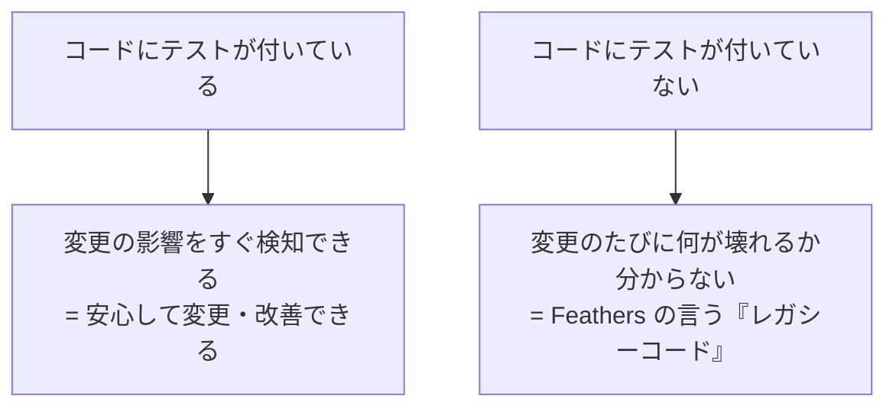

---

## 4. レガシーコードのジレンマ

テストのないコードに手を入れようとすると、多くの人が次のような堂々巡りに陥ります。GitHub上で公開されている本書の読書メモにも、この構造が端的にまとめられています[[12-gist]](#ref-12-gist)。

- 安全にコードを変更するにはテストが欲しい
- テストを書くには、テストしやすい形にコードを変更する必要がある
- しかし今はテストがないので、その変更自体が安全かどうか分からない

Feathers はこれを**「レガシーコードのジレンマ」**と呼び、これを解消する鍵は「ごく小さく、保守的な、テスト導入前の下準備的リファクタリング」であるとしています。多少コードの見た目が悪くなっても、それはテストという保護網を手に入れるまでの一時的な「傷」であり、テストが揃った後で治せばよい、という割り切りが重要です。

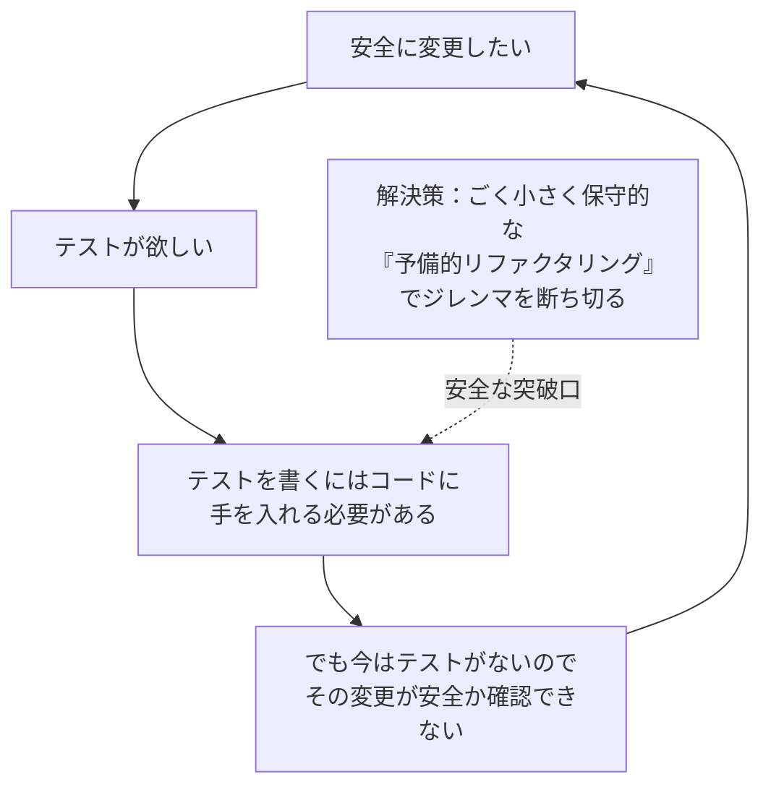

---

## 5. レガシーコード変更アルゴリズム（5ステップ）

Feathers は、レガシーコードに変更を加えるときの一般的な手順を、次の5ステップのアルゴリズムとして提示しています[[13]](#ref-13)、[[14]](#ref-14)、[[15]](#ref-15)。この5ステップこそが本書全体を貫く背骨であり、以降の6〜10章はこの各ステップを詳しく掘り下げたものです。

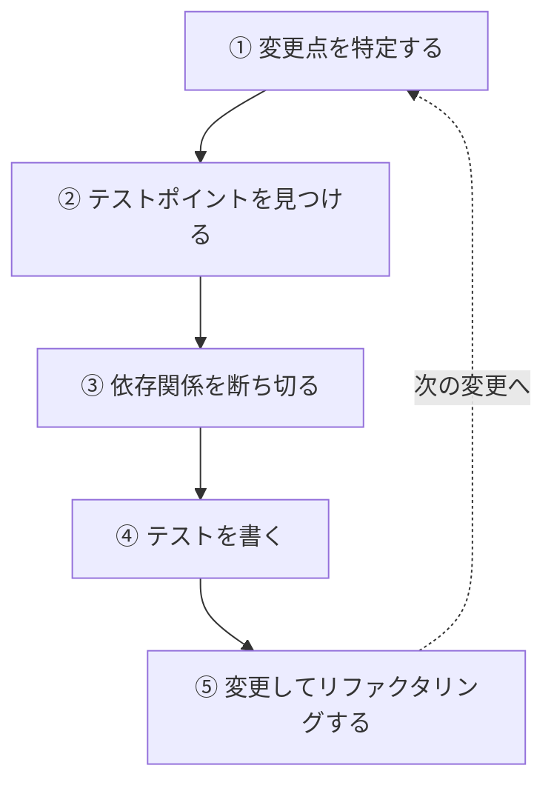

| ステップ | やること | 目的 |
|---|---|---|
| ① 変更点の特定 | 機能追加・バグ修正のために手を入れるべき箇所を洗い出す | 「どこを変えるか」を明確化する |
| ② テストポイントの発見 | 変更の影響が観測できる箇所（＝テストを書くべき箇所）を探す | 「どこを検証すれば安全と言えるか」を決める |
| ③ 依存関係を断ち切る | テストが書けるよう、外部依存やハードコードされた結合を切り離す | テストハーネスにコードを載せられるようにする |
| ④ テストを書く | 現状の振る舞いを固定するキャラクタリゼーションテストを用意する | 「今の挙動」を安全網として確保する |
| ⑤ 変更・リファクタリング | テストの保護下で目的の変更を行い、必要ならコードも整理する | 安全に目的を達成し、次の変更をしやすくする |

---

## 6. ステップ1：変更点を特定する

最初のステップは、実は「簡単な場合」と「非常に難しい場合」に二極化します。目的の変更が1箇所のメソッドで完結するなら簡単ですが、変更点が深くネストしたif/elseの奥や、あちこちのクラスから参照される構造の中に埋もれている場合は、コードの「病み具合」に比例して調査コストが増える、と説明されています[[13]](#ref-13)。

この段階では、まだテストを書く前に「コードの見取り図」を作る作業（メモを取る、責務を書き出す、使われていないコードを見つけて削る、といった軽量な整理）が有効です。これは第16〜17章（「コードを理解するには」「アプリケーションに構造がない」）で詳しく扱われている内容に対応します[[23]](#ref-23)。

---

## 7. ステップ2：テストポイントを見つける（Effect Sketch）

変更点が決まったら、次に「どこでテストを書けば、その変更が正しく行われたことを確認できるか」を考えます。Feathers はこれを**「前向きの推論（reasoning forward）」**あるいは**「Effect Sketch（効果のスケッチ）」**と呼びます[[23]](#ref-23)、[[61-gist]](#ref-61-gist)。

通常のデバッグでは「結果からその原因を遡る」後ろ向きの推論をしますが、レガシーコードで変更を安全に行うためには逆に「この変更を行ったら、プログラムの他の結果にどう影響が伝播しうるか」を前もって描く必要があります。この影響の伝わり方を図にしたものが Effect Sketch であり、これによって「どのクラスの、どのメソッドの、どの戻り値や状態を確認すればよいか」というテストポイントの候補が見えてきます。

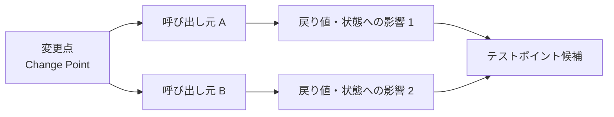

このとき、変更したいクラスの「クライアント（呼び出し元）」を漏れなく洗い出しておくことが重要です。影響の伝わり方を見落とすと、テストで守られていない箇所で不具合を出してしまうリスクが残ります。

---

## 8. ステップ3：依存関係を断ち切る（センシングと分離、シーム）

テストポイントが決まっても、多くのレガシーコードは「そのままではテストハーネス上で実行できない」状態にあります。Feathers は、テストを書く際に依存関係を断ち切る理由を大きく2つに整理しています[[61-gist]](#ref-61-gist)。

- **センシング（Sensing）の問題**：コードが計算した値を外から観測できない
- **分離（Separation）の問題**：そもそもそのコード片単体をテストハーネスに載せて動かせない（データベースやネットワークなど、重い外部依存を伴って生成されてしまう）

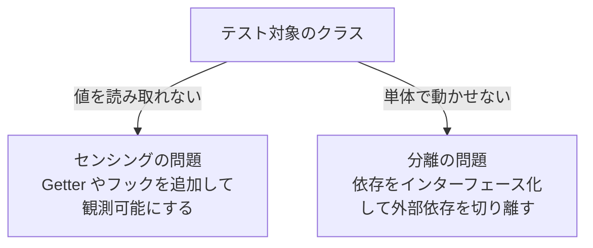

これらの問題を解決する際の考え方として登場するのが**「シーム（Seam）」**という概念です。シームとは、あるコードそのものを編集しなくても、その振る舞いを変更できる箇所のことです[[13-informit]](#ref-13-informit)、[[16-php]](#ref-16-php)。Google のエンジニアである Mike Bland も自身のブログで、このシームの概念とレガシーコードの定義を、ソフトウェア設計における重要な洞察として繰り返し取り上げています[[5]](#ref-5)。

代表的なシームには次の3種類があります。

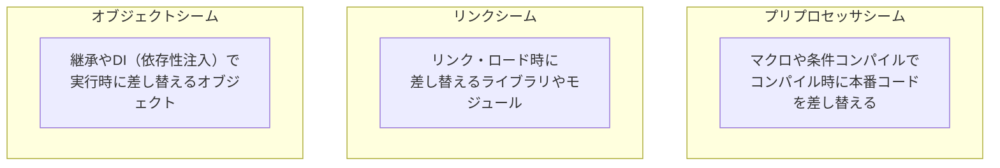

| シームの種類 | 差し替えのタイミング | 主な用途・特徴 |
|---|---|---|
| オブジェクトシーム | 実行時（多態性・DI） | オブジェクト指向言語で最も使いやすく、Feathers 自身も「一般にオブジェクト指向言語で最良の選択」と説明している[[10]](#ref-10) |
| リンクシーム | リンク／ロード時 | テスト用のスタブライブラリに差し替える。本番環境とテスト環境の切り替えが分かりにくくなりがちなので注意が必要 |
| プリプロセッサシーム | コンパイル時 | C/C++ のマクロなどを利用。強力だが乱用するとコードの追跡が困難になる |

依存関係を断ち切ることは「ソフトウェア開発における最も重要な課題の一つ」とまで表現されており、レガシーコードに関する作業の多くは、変更を容易にするための依存関係の解消に費やされる、とされています[[14]](#ref-14)。

---

## 9. ステップ4：キャラクタリゼーションテストを書く

依存関係を切り離してテストが書ける状態になったら、次はいよいよテストを書きます。ここで登場するのが本書のもう一つの中心概念、**キャラクタリゼーションテスト（Characterization Test）**です。

キャラクタリゼーションテストとは、「コードが“あるべき”姿を検証するテスト」ではなく、「コードが“実際に”どう振る舞っているかを記録するテスト」です[[4]](#ref-4)。仕様が失われていたり、誰も正確な仕様を把握していないレガシーコードに対しては、まず今の挙動そのものをスナップショットとして固定し、「これから先、意図せずこの挙動を変えてしまっていないか」を検知できるようにする、という発想です。

代表的な作り方の手順は次の通りです[[6]](#ref-6)。

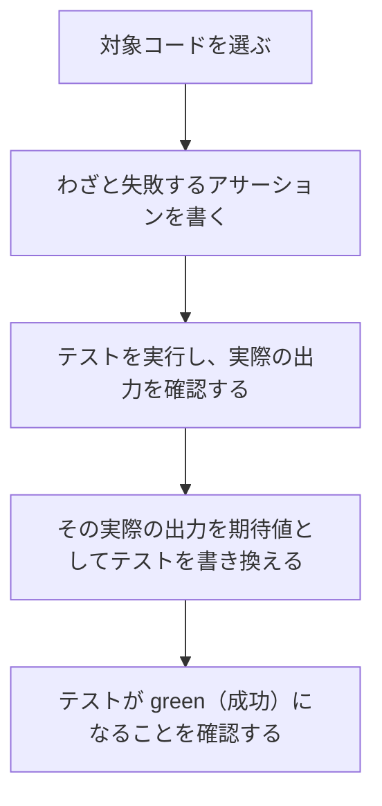

この手法は「TDDの逆再生」と表現されることもあります。通常のTDDは「先にあるべき挙動をテストで定義してから実装する」流れですが、キャラクタリゼーションテストは逆に「既に存在する実装の挙動を確認してからテスト化する」という流れになります[[7]](#ref-7)。

ここで重要な区別として、Feathers はテストを大きく2種類に分けています。

| テストの種類 | 目的 | いつ書くか |
|---|---|---|
| スペシフィケーションテスト（仕様テスト） | コードが「あるべき」通りに動くかを検証する | 実装前（TDDの通常フロー） |
| キャラクタリゼーションテスト | コードの「実際の」挙動を記録し、以後の変更で崩れていないかを検知する | 既存コードに手を入れる前 |

この区別は書籍『The Cucumber Book』でも取り上げられており、業界の広い範囲で共有された分類として扱われています[[cucumber-book]](#ref-cucumber-book)。

---

## 10. ステップ5：変更してリファクタリングする

5ステップの最後は、テストという安全網の下で、当初の目的（機能追加やバグ修正）を実現し、必要であればコードの整理（リファクタリング）まで行うというステップです。ここで注意したいのは、「最後の最後まで新しいコードを書かない」という順序です。レガシーコードに対する作業のほとんどは、実は「どこにどう手を入れるかを理解し、慎重に選び抜く」ことに費やされるべきであり、それによってリスクと必要なテストコードの量を最小化できます[[12-gist]](#ref-12-gist)。

また、TDD の「Red-Green-Refactor」サイクルにおいて最後の「Refactor」が省略されがち（Red-Green-Repeatになってしまう）なのと同じように、変更後のリファクタリングも見落とされがちですが、これは本来欠かせない工程だと強調されています[[12-gist]](#ref-12-gist)。

---

## 11. 新機能を安全に追加する：Sprout と Wrap

「時間がない」「変更にとても時間がかかる」という現場の悩みに対して、Feathers は第6〜7章で、新しい機能を安全に追加するための実践的な4つの技法を紹介しています[[9]](#ref-9)。中でも特に有名なのが **Sprout（芽吹かせる）** と **Wrap（包む）** という2つの考え方です。

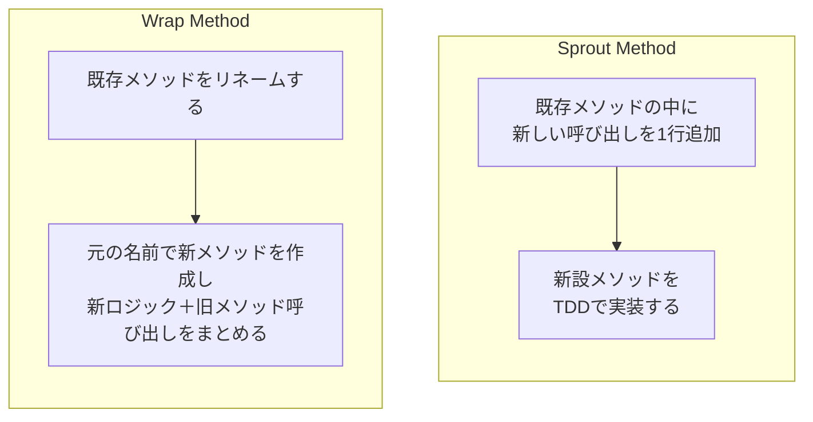

| 技法 | やり方 | 向いているケース | 長所 | 短所 |
|---|---|---|---|---|
| Sprout Method | 既存メソッドの中に新メソッドへの呼び出しを差し込み、新メソッド自体はTDDで実装する[[44]](#ref-44) | 新しい振る舞いをロジックの1箇所に差し込みたいとき[[41]](#ref-41) | 新旧のコードをはっきり分離でき、新しい部分だけは確実にテストされる[[42]](#ref-42) | 既存メソッド自体のテスト整備は先送りになる[[42]](#ref-42) |
| Sprout Class | 新機能をまるごと新しいクラスに切り出し、既存コードからそのクラスを呼び出す | 新機能の独立性が高いとき | 新クラスは最初からテスト可能な設計にできる | クラス数が増え、責務の置き場所を考える必要がある |
| Wrap Method | 元のメソッドをリネームし、元の名前の新メソッドで「前処理／後処理＋旧メソッド呼び出し」を行う[[45]](#ref-45) | 既存の呼び出し前後に処理を追加したいとき[[41]](#ref-41) | 呼び出し元を変えずに新旧を分離できる。新しいロジック部分はテスト可能[[45]](#ref-45) | リネームにより命名が不自然になりがち[[42]](#ref-42) |
| Wrap Class | 元のクラスをコンストラクタで受け取り、多くのメソッドは委譲しつつ新機能を追加した新クラスを作る | クラス単位で前後処理を挟みたいとき | Wrap Method のクラス版として同様の利点を持つ | 委譲コードが増える |

これらの技法に共通する目的は、「今日中に安全に機能を出す」ことと「将来的にテストを充実させる」ことの間で現実的な折り合いをつける点にあります。どちらも、いきなり既存コード全体をテスト可能にしようとするのではなく、**新しく書く部分だけは必ずテストで守る**という現実的な戦略です。

---

## 12. 代表的な依存関係破壊テクニック（全24種の抜粋）

本書第25章「Dependency-Breaking Techniques」では、依存関係を断ち切るための具体的なリファクタリング手法が24種類カタログ化されています[[15]](#ref-15)。すべてを覚える必要はなく、まずは代表的なものから使えるようにするのがおすすめです。

| テクニック名 | 概要 | 主に効くケース |
|---|---|---|
| Extract Interface（インターフェースの抽出） | テストで差し替えたいメソッド群をインターフェースとして切り出し、本番クラスにそれを実装させる | テストではフェイク実装を渡したいとき |
| Parameterize Constructor（コンストラクタのパラメータ化） | コンストラクタ内部で生成していた協調オブジェクトを、外から渡せる引数にする | 依存オブジェクトをテスト用に差し替えたいとき |
| Subclass and Override Method（サブクラス化とメソッドのオーバーライド） | 呼び出し元を変えられない場合に、テスト専用のサブクラスで問題のメソッドだけを無害な実装に置き換える | 呼び出し箇所を変更できない・したくないとき |
| Extract and Override Call（呼び出しの抽出とオーバーライド） | 問題のある呼び出しを別メソッドに切り出し、テスト用サブクラスでそのメソッドだけを差し替える | 特定の呼び出し1箇所だけを無害化したいとき |
| Replace Global Reference with Getter（グローバル参照をGetterに置き換える） | グローバルな参照を、オーバーライド可能なGetterメソッド経由の参照に置き換える | シングルトンやグローバル状態への依存を切りたいとき |
| Extract and Override Factory Method（ファクトリメソッドの抽出とオーバーライド） | オブジェクト生成処理を専用メソッドに切り出し、テスト用にその生成方法だけ差し替える | `new` による直接生成に依存しているとき |

これらのテクニックは実際に手を動かして練習できる教材としても公開されています。たとえば GitHub 上の "dependency-breaking-katas" は、公開APIを変えずにこれらのテクニックだけでクラスをテスト可能にする練習問題を提供しています[[17]](#ref-17)。

なお、Medium上の技術記事では「すべての協調オブジェクトにインターフェースを抽出するのではなく、“今日行う変更”に必要な1箇所にだけシームを作る」という実務的な指針が紹介されています。すべてを完璧にしようとせず、**必要な配線だけを切って、あとはそのままにしておく**という割り切りが、実務での使いこなしのコツです[[14]](#ref-14)。

---

## 13. 「あるある」問題と対応する章・技法の早見表

Part II（第6〜24章）は、どれも現場でよく聞く悩みをそのまま章タイトルにしているのが特徴です[[15]](#ref-15)。初学者は、まず自分が直面している状況に近い行を探すと、目的の章にすぐアクセスできます。

| 現場の悩み（章タイトルの要約） | 主に関連する概念・技法 |
|---|---|
| 時間がないのに変更しなければならない | Sprout Method／Class |
| 変更にとにかく時間がかかりすぎる | Wrap Method／Class |
| 新しい機能をどう追加すればいいか分からない | Sprout・Wrapの使い分け全般 |
| このクラスをテストハーネスに載せられない | センシングと分離、Extract Interface 等 |
| このメソッド単体をテストハーネスで動かせない | オブジェクトシーム、Subclass and Override |
| 何をテストすればいいか分からない | Effect Sketch（前向きの推論） |
| 1箇所直すのに関係するクラス全部の依存を切らないといけないのか | 高レベルの介入点（Interception Point）・Pinch Point の活用 |
| どんなテストを書けばいいか見当がつかない | キャラクタリゼーションテストの手順 |
| ライブラリへの依存に振り回される | ライブラリをラップして自前のインターフェース越しに使う |
| アプリケーションがAPI呼び出しだらけ | 外部APIをシームの向こう側に押し出す |
| コードを理解するだけの余裕がない | Effect Sketch、コードの見取り図作り |
| アプリケーションに構造がない | 責務の分離、CRC（クラス・責務・協調）による整理 |
| テストコードが邪魔になっている | テストの整理・命名規則の見直し |
| オブジェクト指向ではないプロジェクトでどう安全に変更するか | 言語非依存の分離テクニック（関数ポインタ等） |
| クラスが巨大でこれ以上大きくしたくない | 責務の分割、God Class 化の回避 |
| 同じコードをあちこちで直している | 重複コードの集約 |
| 手のつけられない「モンスターメソッド」がある | 巨大メソッドの段階的分解 |
| 何も壊していないと、どう確認すればいいか | キャラクタリゼーションテスト、回帰テストの整備 |
| チームが疲弊し、状況が良くなる気がしない | 小さな成功体験の積み重ね、変更アルゴリズムの反復適用 |

---

## 14. 承認テスト（Approval Testing）／ゴールデンマスターとの関係

キャラクタリゼーションテストと似た考え方に、**承認テスト（Approval Testing）**、あるいは**ゴールデンマスターテスト**と呼ばれる手法があります。Approval Tests ツールの開発者として知られる Llewellyn Falco は、レガシーコードに対しては内部構造を深く理解しなくても、出力ベースで良好なテストカバレッジを比較的簡単に得られる点で、この手法を高く評価しています[[38]](#ref-38)。

承認テストの基本的な考え方は、期待値をコードの中に直接書き込むのではなく、出力をファイルに保存し、その内容を人間が「承認（approve）」することで期待値として確定する、というものです。97 Things シリーズの著者でもある Emily Bache は、この手法をスナップショットテストやゴールデンマスターテストと呼ばれることもあると説明しつつ、専用ツールを使うことで期待値の更新や差分比較が格段にやりやすくなる点を強調しています[[16]](#ref-16)。

| 用語 | 主な使われ方 | ニュアンス |
|---|---|---|
| キャラクタリゼーションテスト | Feathers の用語。既存コードの挙動を記録し保護する | 「今の挙動を理解し固定する」プロセス寄りの表現 |
| ゴールデンマスターテスト | 出力全体を「正解」として保存し、以後の差分を検知する | 出力全体をまるごと比較する手法寄りの表現 |
| 承認テスト（Approval Test） | 出力をファイルに保存し、人間が内容を確認・承認して期待値にする | 「承認」という人間の意思決定を重視した呼び方 |

Understand Legacy Code の運営者 Nicolas Carlo は、「ゴールデンマスター」という呼び方には“二度と触れない神聖なもの”という含みがあるため好ましくなく、人間が振る舞いを承認し、必要に応じて更新していくという意味で「承認テスト」という呼び方を好む、という見解を示しています[[32]](#ref-32)。呼び方はどうあれ、いずれも「まず今の振る舞いを固定してから、安心して変更に取り組む」という Feathers の考え方の延長線上にある実践です。

---

## 15. より大きなスケールへ：Strangler Fig パターンとの関係

Feathers の技法の多くは、メソッドやクラスといった「コードレベル」でのミクロな安全策です。一方で、システム全体、あるいはモノリシックなアプリケーション全体を段階的に置き換えていくマクロな戦略として広く知られているのが、Martin Fowler が提唱した**Strangler Fig パターン（絞め殺しの木パターン）**です[[19]](#ref-19)、[[27]](#ref-27)。

このパターンは、宿主となる木に巻きついて成長し、最終的に宿主に取って代わる「絞め殺しの木（strangler fig）」という植物に由来しています。一気に書き直す「ビッグバン・リライト」の代わりに、新しい実装を少しずつ既存システムの周りに構築し、機能単位で置き換えを進めていく、という考え方です[[24]](#ref-24)。

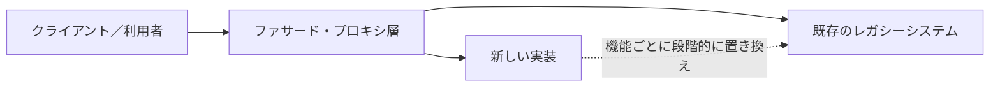

EC企業 Shopify のエンジニアリングブログでは、実際にこのパターンを用いて巨大な `Shop` モデルから設定値を切り出した際の、7ステップからなる具体的な進め方が紹介されています[[20]](#ref-20)。また Microsoft の Azure Architecture Center でも、モノリスからの段階的な移行パターンとして正式に文書化されています[[25]](#ref-25)。

Feathers の技法と Strangler Fig パターンは対立するものではなく、**スケールの異なる補完関係**にあります。

| 観点 | Feathers の技法（本書） | Strangler Fig パターン |
|---|---|---|
| 対象の粒度 | メソッド・クラス単位 | システム・サービス単位 |
| 主な道具 | シーム、キャラクタリゼーションテスト、Sprout/Wrap | ファサード／プロキシ層、機能単位の段階的移行 |
| ゴール | 既存コードを安全にテスト可能にし、変更する | モノリス全体を安全に新システムへ移行する |

大規模な近代化プロジェクトの中でも、実際に個々のクラスやメソッドに手を入れる場面では、結局のところ本書のテクニックが必要になります。

---

## 16. AIエージェント時代におけるレガシーコード対応

2025〜2026年にかけて、コーディングエージェント（AIによる自律的なコード変更ツール）が実務に急速に普及しています。ThoughtWorks で生成AIと開発プラクティスの関係を調査している Martin Fowler のチームも、自社サイト上でこの変化に関する継続的な考察を公開しています[[22]](#ref-22)。

こうした流れの中でも、Feathers の技法が古びていないどころか、むしろ重要性を増しているという見方があります。実際、AIエージェント自身に「変更点の特定→テストポイントの発見→依存関係の分離→テストの作成→変更とリファクタリング」という本書の変更アルゴリズムをそのまま手続きとして組み込む、という取り組みも登場しています[[50]](#ref-50)。これは、AIが自律的にコードを書き換える場面でも、「今の挙動を壊さずに変更する」という安全性の担保がまったく変わらず必要とされていることの表れだと言えます。

一方で、AIコーディングツールに関する2026年の業界動向レポートでは、開発者はAIを業務の約6割で活用しているものの、完全にタスクを委任できるのは0〜20%程度にとどまるという調査結果も紹介されており、レガシーコードのような複雑で文脈依存の高い作業では、依然として人間による判断とレビューが欠かせないことが示唆されています[[51]](#ref-51)。

つまり、「テストのないコードは安全に変更できない」というFeathersの根本原則は、変更をAIが行うか人間が行うかにかかわらず変わりません。むしろAI時代には、キャラクタリゼーションテストやシームの整備によって、AIエージェントが安心して自律的に変更を提案・実行できる「安全な足場」を人間が用意しておくことの価値が、これまで以上に高まっていると言えるでしょう。

---

## 17. 初学者向け実践チェックリスト

以下は、これから自分のプロジェクトで本書の考え方を試してみたい人向けの、実践のための最初のステップです。

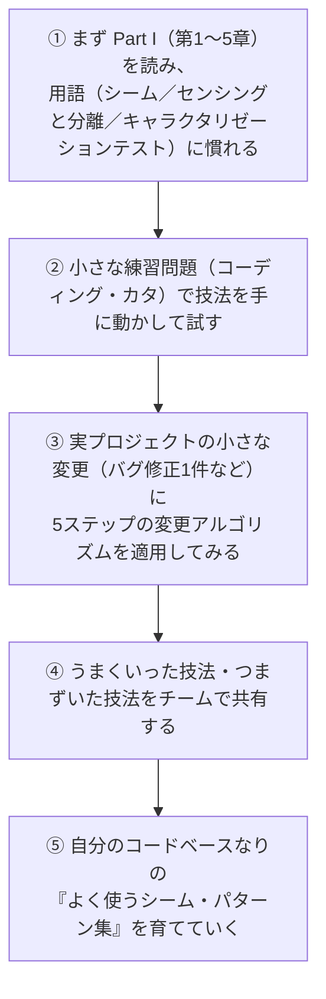

- [ ] 「レガシーコード＝テストのないコード」という定義を自分の言葉で説明できる
- [ ] 「レガシーコードのジレンマ」を自分の状況に当てはめて説明できる
- [ ] 5ステップの変更アルゴリズムを、直近の小さな修正1件に実際に適用してみた
- [ ] オブジェクトシームを使って、少なくとも1つの依存を差し替えてテストを書いた
- [ ] キャラクタリゼーションテストを最低1つ、実際のコードに対して書いた
- [ ] Sprout Method と Wrap Method の違いを、自分の言葉で説明できる
- [ ] Extract Interface / Parameterize Constructor のどちらかを実際に適用したことがある
- [ ] 自分のプロジェクトの「あるある」問題を13章の早見表に照らして、次に読むべき章を特定した

---

## 18. まとめ：全体像

本書のすべての技法は、最終的に「安全に、小さく変更するためにはどうすればいいか」という一点に集約されます。最後に、これまで見てきた要素の関係を1枚の図にまとめます。

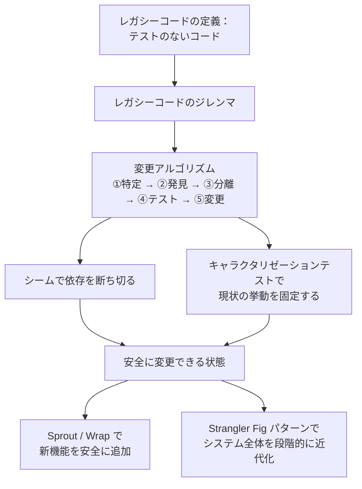

テストがないコードに対して恐れずに向き合い、小さく安全な一歩を積み重ねていく――それが、20年以上経った今も本書が読み継がれている最大の理由です。

---

## 19. 参考文献・出典

本ガイドは2026年9月7日時点で確認できる以下の情報源をもとに作成しました。原著者本人の解説記事、著名な開発者・技術者による解説、企業エンジニアリングブログ、公式書誌情報などを優先的に参照しています。

| # | 出典 | URL |
|---|---|---|
| [2] | DaedTech（Erik Dietrich）「Characterization Tests」 | [https://daedtech.com/characterization-tests/](https://daedtech.com/characterization-tests/) |
| [3] | Understand Legacy Code（Nicolas Carlo）「The key points of Working Effectively with Legacy Code」 | [https://understandlegacycode.com/blog/key-points-of-working-effectively-with-legacy-code/](https://understandlegacycode.com/blog/key-points-of-working-effectively-with-legacy-code/) |
| [4] | 同上 | [https://understandlegacycode.com/blog/key-points-of-working-effectively-with-legacy-code/](https://understandlegacycode.com/blog/key-points-of-working-effectively-with-legacy-code/) |
| [5] | Mike Bland（Google）「Legacy code, seams, and the most important design guideline」 | [https://mike-bland.com/2023/08/23/legacy-code-seams-and-the-most-important-design-guideline.html](https://mike-bland.com/2023/08/23/legacy-code-seams-and-the-most-important-design-guideline.html) |
| [6] | Global Book Summary Project「Working Effectively with Legacy Code」 | [https://booksummaryproject.com/book53](https://booksummaryproject.com/book53) |
| [7] | Hell Read「Working Effectively with Legacy Code By Michael Feathers」 | [https://hellread.com/2025/08/15/working-effectively-with-legacy-code-by-michael-feathers/](https://hellread.com/2025/08/15/working-effectively-with-legacy-code-by-michael-feathers/) |
| [9] | Mark Needham「Book Club: Working Effectively With Legacy Code - Chapters 6 & 7」 | [https://www.markhneedham.com/blog/2009/10/26/book-club-working-effectively-with-legacy-code-chapters-6-7-michael-feathers/](https://www.markhneedham.com/blog/2009/10/26/book-club-working-effectively-with-legacy-code-chapters-6-7-michael-feathers/) |
| [cucumber-book] | Matt Wynne & Aslak Hellesøy『The Cucumber Book: Behaviour-Driven Development for Testers and Developers』 (Pragmatic Bookshelf, 2012) | [https://pragprog.com/titles/hwcuc/the-cucumber-book/](https://pragprog.com/titles/hwcuc/the-cucumber-book/) |
| [10] | Michael Feathers（InformIT）「Seams \| Testing Effectively With Legacy Code」 | [https://www.informit.com/articles/article.aspx?p=359417&seqNum=2](https://www.informit.com/articles/article.aspx?p=359417&seqNum=2) |
| [12-gist] | GitHub Gist（jeremy-w）「Notes on Michael Feathers' Working Effectively with Legacy Code」 | [https://gist.github.com/jeremy-w/6774525](https://gist.github.com/jeremy-w/6774525) |
| [13] | Agile in a Flash（Tim Ottinger）「Legacy Code Change Algorithm」 | [http://agileinaflash.blogspot.com/2009/03/legacy-code-change-algorithm.html](http://agileinaflash.blogspot.com/2009/03/legacy-code-change-algorithm.html) |
| [13-informit] | 同上（InformIT） | [https://www.informit.com/articles/article.aspx?p=359417&seqNum=2](https://www.informit.com/articles/article.aspx?p=359417&seqNum=2) |
| [14] | Medium（Nitesh Ranjan）「6 Takeaways from Working Effectively with Legacy Code」 | [https://medium.com/@nitesh.ranja/6-takeaways-from-working-effectively-with-legacy-code-by-michael-feathers-bc9fa5e63f98](https://medium.com/@nitesh.ranja/6-takeaways-from-working-effectively-with-legacy-code-by-michael-feathers-bc9fa5e63f98) |
| [15] | O'Reilly Online Learning「Working Effectively with Legacy Code」書誌・目次ページ | [https://www.oreilly.com/library/view/working-effectively-with/0131177052/](https://www.oreilly.com/library/view/working-effectively-with/0131177052/) |
| [16] | Emily Bache（97 Things, Medium）「Approval Testing」 | [https://medium.com/97-things/approval-testing-33946cde4aa8](https://medium.com/97-things/approval-testing-33946cde4aa8) |
| [16-php] | Packagist「php-object-seam」（Feathersのシーム定義引用元） | [https://packagist.org/packages/robvanaarle/php-object-seam](https://packagist.org/packages/robvanaarle/php-object-seam) |
| [17] | GitHub（codecop）「dependency-breaking-katas」 | [https://www.github.com/codecop/dependency-breaking-katas](https://www.github.com/codecop/dependency-breaking-katas) |
| [19] | Wikipedia「Strangler fig pattern」 | [https://en.wikipedia.org/wiki/Strangler_fig_pattern](https://en.wikipedia.org/wiki/Strangler_fig_pattern) |
| [20] | Shopify Engineering「Refactoring Legacy Code with the Strangler Fig Pattern」 | [https://shopify.engineering/refactoring-legacy-code-strangler-fig-pattern](https://shopify.engineering/refactoring-legacy-code-strangler-fig-pattern) |
| [21] | University of Minnesota CSE「Code Freeze 2025 Keynote Speaker: Michael Feathers」 | [https://cse.umn.edu/umsec/code-freeze-2025-keynote-speaker-michael-feathers](https://cse.umn.edu/umsec/code-freeze-2025-keynote-speaker-michael-feathers) |
| [22] | Martin Fowler / ThoughtWorks「Exploring Generative AI」 | [https://www.martinfowler.com/articles/exploring-gen-ai.html](https://www.martinfowler.com/articles/exploring-gen-ai.html) |
| [23] | SlidePlayer（Cory Foy）「Getting Unstuck: Working with Legacy Code and Data」 | [https://slideplayer.com/slide/4484335/](https://slideplayer.com/slide/4484335/) |
| [24] | vFunction「The Strangler Architecture Pattern for Modernization」 | [https://vfunction.com/blog/strangler-architecture-pattern-for-modernization/](https://vfunction.com/blog/strangler-architecture-pattern-for-modernization/) |
| [25] | Microsoft Learn「Strangler Fig Pattern - Azure Architecture Center」 | [https://learn.microsoft.com/en-us/azure/architecture/patterns/strangler-fig](https://learn.microsoft.com/en-us/azure/architecture/patterns/strangler-fig) |
| [27] | Wikipedia「Strangler fig pattern」 | [https://en.wikipedia.org/wiki/Strangler_fig_pattern](https://en.wikipedia.org/wiki/Strangler_fig_pattern) |
| [32] | Understand Legacy Code「What's the difference between Regression, Characterization, and Approval Tests?」 | [https://understandlegacycode.com/blog/characterization-tests-or-approval-tests/](https://understandlegacycode.com/blog/characterization-tests-or-approval-tests/) |
| [38] | Developer Fusion「Herding Code 117: Llewellyn Falco on Approval Tests」 | [https://www.developerfusion.com/media/122649/herding-code-117-llewellyn-falcon-on-approval-tests/](https://www.developerfusion.com/media/122649/herding-code-117-llewellyn-falcon-on-approval-tests/) |
| [41] | Medium（Nitesh Ranjan）「6 Takeaways from Working Effectively with Legacy Code」 | [https://medium.com/@nitesh.ranja/6-takeaways-from-working-effectively-with-legacy-code-by-michael-feathers-bc9fa5e63f98](https://medium.com/@nitesh.ranja/6-takeaways-from-working-effectively-with-legacy-code-by-michael-feathers-bc9fa5e63f98) |
| [42] | tamerlan.dev「Working Effectively with Legacy Code: Chapter 6 Summary」 | [https://tamerlan.dev/working-effectively-with-legacy-code/](https://tamerlan.dev/working-effectively-with-legacy-code/) |
| [44] | Taswar Bhatti「Learn The Sprout Method for adding new functionality」 | [https://taswar.zeytinsoft.com/learn-the-sprout-method-for-adding-new-functionality/](https://taswar.zeytinsoft.com/learn-the-sprout-method-for-adding-new-functionality/) |
| [45] | Understand Legacy Code「The key points of Working Effectively with Legacy Code」 | [https://understandlegacycode.com/blog/key-points-of-working-effectively-with-legacy-code/](https://understandlegacycode.com/blog/key-points-of-working-effectively-with-legacy-code/) |
| [50] | Wondel.ai Skills「Legacy Code — AI Agent Skill」 | [https://skills.wondel.ai/skills/working-with-legacy-code/](https://skills.wondel.ai/skills/working-with-legacy-code/) |
| [51] | Anthropic「2026 Agentic Coding Trends Report」 | [https://resources.anthropic.com/hubfs/2026%20Agentic%20Coding%20Trends%20Report.pdf](https://resources.anthropic.com/hubfs/2026%20Agentic%20Coding%20Trends%20Report.pdf) |
| [61-gist] | GitHub Gist（jonnyjava）「Working effectively with legacy code summary」 | [https://gist.github.com/jonnyjava/42883d4e464167f81e2ee60a488a5ded](https://gist.github.com/jonnyjava/42883d4e464167f81e2ee60a488a5ded) |

> 注：本ガイドは各出典を要約・言い換えたものであり、原文からの逐語的な引用は最小限（15語未満）に留めています。より正確で網羅的な内容は、必ず原著および各出典元をご確認ください。
